# Day 1: Type System & Value vs Reference Types

## 🎯 Learning Objectives

- Understand the CLR type system architecture
- Master the differences between value and reference types
- Learn boxing/unboxing and its performance implications
- Know when to use structs vs classes
- Understand memory layout and object structure

---

## 1. CLR Type System Overview

### The Common Type System (CTS)

The CLR type system is the foundation of .NET. Every type in C# derives from `System.Object`.

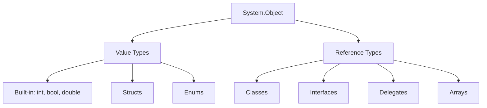

**Simple Explanation:** Think of the type system as a family tree where `System.Object` is the great-grandparent of all types in C#.

```csharp
// Everything is an object - even simple numbers!
int number = 42;
object obj = number; // Valid - int derives from object
Console.WriteLine(obj.GetType()); // System.Int32

// This works for ANY type
string text = "Hello";
bool flag = true;
DateTime date = DateTime.Now;

// They all have methods from System.Object
Console.WriteLine(number.ToString());
Console.WriteLine(text.GetHashCode());
Console.WriteLine(flag.Equals(true));
```

### Type Categories

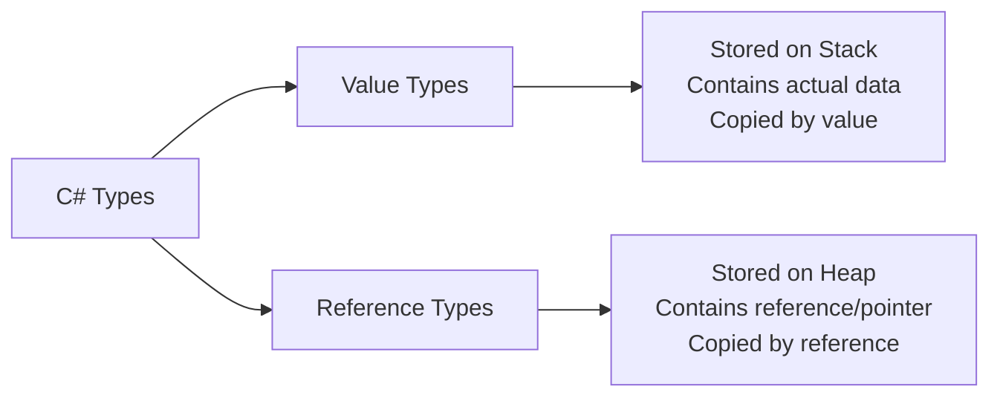

**Key Difference:**

- **Value Types** - Like a **photocopy** of a document (you get the actual content)
- **Reference Types** - Like a **bookmark** to a document (you get the location, not the content)

---

## 2. Value Types Deep Dive

### What is a Value Type?

**Simple Analogy:** A value type is like having **cash in your wallet**. When you give someone $10, you give them the actual money, not a note saying where the money is.

### Memory Layout Diagram

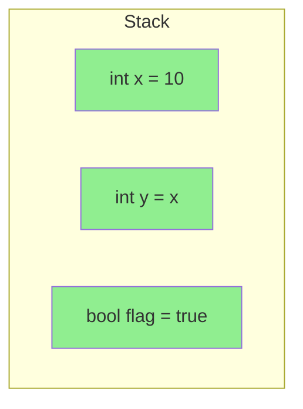

### Characteristics

- ✅ Stored on stack (when local variables) or inline in objects
- ✅ Contains **actual data** (not a pointer)
- ✅ Derived from `System.ValueType`
- ✅ Cannot be null (unless `Nullable<T>` or `T?`)
- ✅ Passed by value (copied) by default
- ✅ No inheritance (structs are sealed)

### Built-in Value Types

```csharp
// 🔰 BEGINNER: Basic value types
byte b = 255;           // 8-bit unsigned (0 to 255)
sbyte sb = -128;        // 8-bit signed (-128 to 127)
short s = 32767;        // 16-bit signed
ushort us = 65535;      // 16-bit unsigned
int i = 2147483647;     // 32-bit signed (most common)
uint ui = 4294967295;   // 32-bit unsigned
long l = 9223372036854775807;   // 64-bit signed
ulong ul = 18446744073709551615; // 64-bit unsigned

float f = 3.14f;        // 32-bit floating point
double d = 3.14159;     // 64-bit floating point (default for decimals)
decimal m = 3.14159M;   // 128-bit precise decimal (for money!)

char c = 'A';           // 16-bit Unicode character
bool flag = true;       // 8-bit true/false

// 🎯 INTERMEDIATE: Why does the type matter?
int small = 100;
long big = small;       // ✅ Implicit conversion (safe - no data loss)

long bigNumber = 1000000000;
int smallNumber = (int)bigNumber; // ⚠️ Explicit cast (might lose data)

// 💰 IMPORTANT: Use decimal for money!
decimal price = 19.99M;  // ✅ Accurate for financial calculations
double wrongPrice = 19.99; // ❌ Might have rounding errors!

Console.WriteLine(price);      // 19.99
Console.WriteLine(wrongPrice); // 19.990000000000002 (floating point error)
```

### Value Type Behavior - Copy by Value

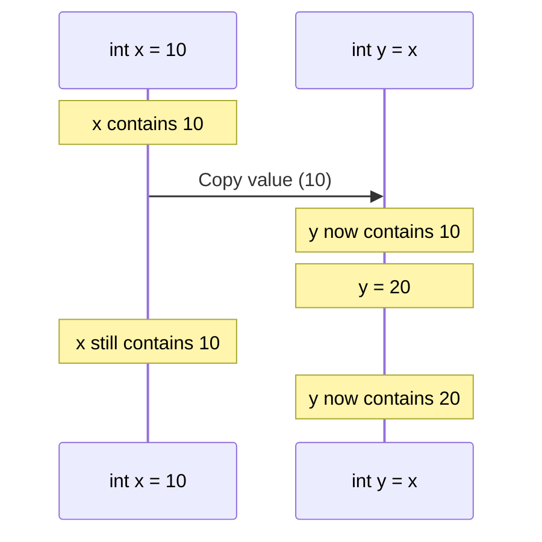

```csharp
// 🔰 BEGINNER: Understanding "copy by value"
int x = 10;
int y = x;      // y gets a COPY of x's value

y = 20;         // Changing y doesn't affect x

Console.WriteLine($"x = {x}"); // x = 10 (unchanged!)
Console.WriteLine($"y = {y}"); // y = 20

// 🎯 INTERMEDIATE: This works with structs too
DateTime date1 = new DateTime(2025, 1, 1);
DateTime date2 = date1;  // date2 gets a COPY

date2 = date2.AddDays(10); // Changing date2

Console.WriteLine(date1); // 2025-01-01 (unchanged!)
Console.WriteLine(date2); // 2025-01-11
```

### Custom Value Types (Structs)

```csharp
// 🔰 BEGINNER: Simple struct
public struct Point
{
    public int X;
    public int Y;

    public Point(int x, int y)
    {
        X = x;
        Y = y;
    }
}

// Usage
Point p1 = new Point(10, 20);
Point p2 = p1;  // COPY of p1

p2.X = 99;      // Change p2

Console.WriteLine($"p1.X = {p1.X}"); // 10 (unchanged!)
Console.WriteLine($"p2.X = {p2.X}"); // 99

// 🎯 INTERMEDIATE: Readonly struct (immutable, more efficient)
public readonly struct Money
{
    public decimal Amount { get; }
    public string Currency { get; }

    public Money(decimal amount, string currency)
    {
        Amount = amount;
        Currency = currency;
    }

    // Methods can return new instances
    public Money Add(Money other)
    {
        if (Currency != other.Currency)
            throw new InvalidOperationException("Currency mismatch");

        return new Money(Amount + other.Amount, Currency);
    }
}

// 🚀 ADVANCED: Ref struct (stack-only, high performance)
public ref struct StackOnlyBuffer
{
    private Span<byte> buffer;

    public StackOnlyBuffer(Span<byte> data)
    {
        buffer = data;
    }

    // Can NEVER be boxed or stored on heap
    // Can't be used as field in regular class
    // Perfect for high-performance scenarios
}
```

---

## 3. Reference Types Deep Dive

### What is a Reference Type?

**Simple Analogy:** A reference type is like a **house address**. When you give someone your address, you're not giving them the house - you're giving them directions to the same house. Multiple people can have the same address and all refer to the same house.

### Memory Layout Diagram

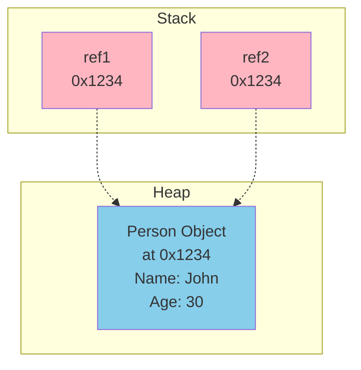

### Characteristics

- ✅ Stored on **heap**
- ✅ Variable contains a **reference** (memory address) to the data
- ✅ Can be **null**
- ✅ Supports **inheritance**
- ✅ Passed by reference (multiple variables can point to same object)
- ✅ Requires garbage collection

### Built-in Reference Types

```csharp
// 🔰 BEGINNER: Common reference types
string text = "Hello";      // String
object obj = new object();  // Base object
int[] numbers = new int[5]; // Array
List<int> list = new();     // Collection

// 🎯 INTERMEDIATE: Reference behavior
string[] names1 = { "Alice", "Bob" };
string[] names2 = names1;  // names2 points to SAME array

names2[0] = "Charlie";     // Modify through names2

Console.WriteLine(names1[0]); // "Charlie" (same object!)
Console.WriteLine(names2[0]); // "Charlie"
```

### Reference Type Behavior Diagram

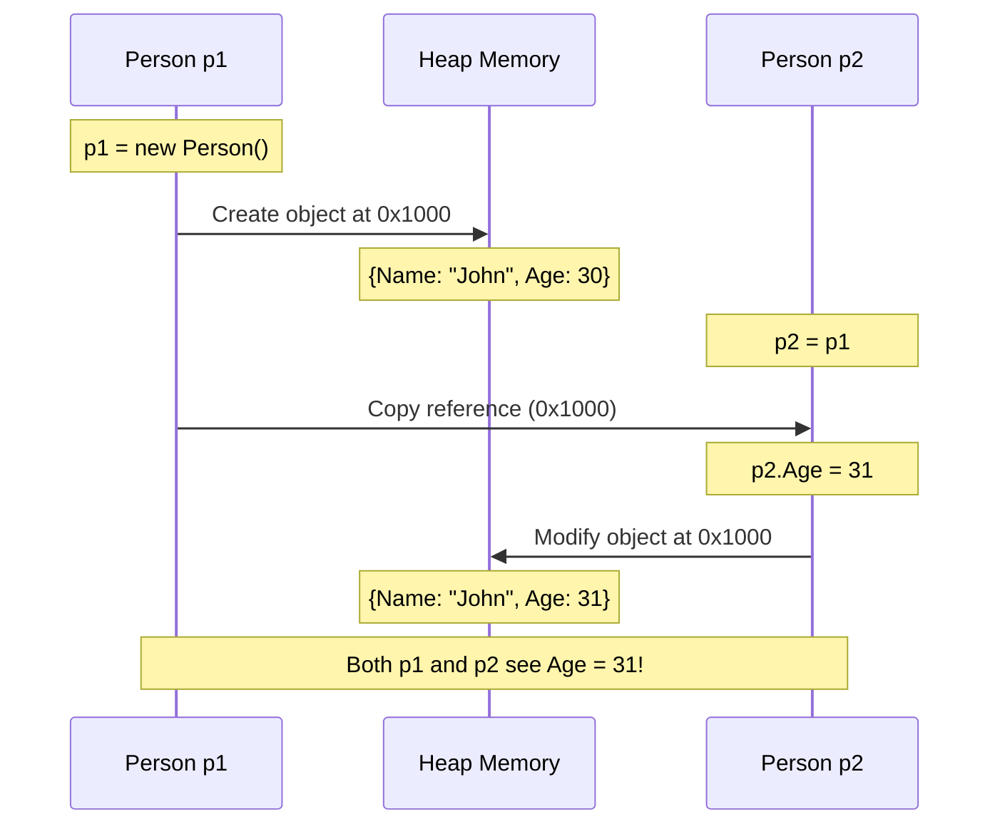

### Custom Reference Types (Classes)

```csharp
// 🔰 BEGINNER: Simple class
public class Person
{
    public string Name { get; set; }
    public int Age { get; set; }

    public Person(string name, int age)
    {
        Name = name;
        Age = age;
    }
}

// Usage - demonstrates reference behavior
Person person1 = new Person("John", 30);
Person person2 = person1;  // Both point to SAME object

person2.Age = 31;  // Modify through person2

Console.WriteLine(person1.Age); // 31 (same object!)
Console.WriteLine(person2.Age); // 31

// 🎯 INTERMEDIATE: Null reference
Person person3 = null;  // Reference to nothing
// person3.Name;  // ❌ NullReferenceException!

if (person3 != null)  // Always check!
{
    Console.WriteLine(person3.Name);
}

// Or use null-conditional operator
Console.WriteLine(person3?.Name); // null (no exception)

// 🚀 ADVANCED: Inheritance (only reference types)
public class Employee : Person
{
    public string Department { get; set; }

    public Employee(string name, int age, string department)
        : base(name, age)
    {
        Department = department;
    }
}

Employee emp = new Employee("Alice", 25, "IT");
Person p = emp;  // ✅ Polymorphism - Employee IS A Person
```

---

## 4. Value vs Reference: Side-by-Side Comparison

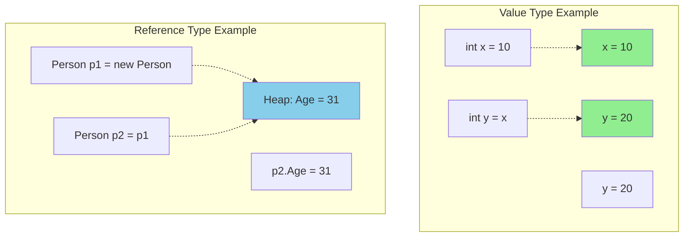

### Complete Example

```csharp
// 🔰 BEGINNER: Understanding the difference

// VALUE TYPE - Independent copies
int value1 = 100;
int value2 = value1;
value2 = 200;

Console.WriteLine($"value1: {value1}"); // 100 (independent!)
Console.WriteLine($"value2: {value2}"); // 200

// REFERENCE TYPE - Shared object
var list1 = new List<int> { 1, 2, 3 };
var list2 = list1;
list2.Add(4);

Console.WriteLine(list1.Count); // 4 (shared!)
Console.WriteLine(list2.Count); // 4

// 🎯 INTERMEDIATE: Method parameters
void ModifyValue(int num)
{
    num = 999;  // Only modifies the copy
}

void ModifyReference(List<int> list)
{
    list.Add(999);  // Modifies the original object!
}

int myNum = 10;
ModifyValue(myNum);
Console.WriteLine(myNum); // 10 (unchanged)

var myList = new List<int> { 1, 2, 3 };
ModifyReference(myList);
Console.WriteLine(myList.Count); // 4 (changed!)
```

---

## 5. Boxing and Unboxing

### What is Boxing?

**Simple Explanation:** Boxing is when you put a value type (like an `int`) into a reference type box (like `object`). This creates a copy on the heap.

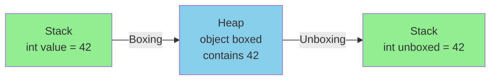

### Boxing Examples

```csharp
// 🔰 BEGINNER: Basic boxing
int number = 42;        // Value type on stack
object boxed = number;  // Boxing - copies to heap

Console.WriteLine(boxed.GetType()); // System.Int32

// 🎯 INTERMEDIATE: Boxing happens implicitly
ArrayList oldList = new ArrayList();
oldList.Add(10);   // ❌ Boxing! int -> object
oldList.Add(20);   // ❌ Boxing! int -> object
oldList.Add(30);   // ❌ Boxing! int -> object
// Performance issue: 3 heap allocations!

// ✅ Better: Use generic collection (no boxing)
List<int> newList = new List<int>();
newList.Add(10);  // ✅ No boxing!
newList.Add(20);  // ✅ No boxing!
newList.Add(30);  // ✅ No boxing!

// 🚀 ADVANCED: Hidden boxing scenarios
int x = 10;
Console.WriteLine(x); // ❌ Boxing (WriteLine takes object)

// Better
Console.WriteLine(x.ToString()); // ✅ No boxing (explicit string)

// Interface implementation causes boxing
public struct MyStruct : IComparable
{
    public int Value;

    public int CompareTo(object obj)  // ❌ object parameter
    {
        return Value.CompareTo(((MyStruct)obj).Value);
    }
}

MyStruct s1 = new MyStruct { Value = 5 };
MyStruct s2 = new MyStruct { Value = 10 };

int result = s1.CompareTo(s2);  // ❌ Boxing of s2!

// Better: Use generic interface
public struct MyBetterStruct : IComparable<MyBetterStruct>
{
    public int Value;

    public int CompareTo(MyBetterStruct other)  // ✅ No boxing
    {
        return Value.CompareTo(other.Value);
    }
}
```

### Unboxing Examples

```csharp
// 🔰 BEGINNER: Basic unboxing
object boxed = 42;              // Boxing
int unboxed = (int)boxed;       // Unboxing - explicit cast required

// ❌ Wrong type unboxing throws exception
object boxedInt = 42;
// long wrong = (long)boxedInt; // InvalidCastException!

// ✅ Correct: unbox to same type first
long correct = (int)boxedInt;   // Works

// 🎯 INTERMEDIATE: Pattern matching for safe unboxing
object mystery = GetSomeValue();

if (mystery is int intValue)
{
    Console.WriteLine($"It's an int: {intValue}");
}
else if (mystery is string strValue)
{
    Console.WriteLine($"It's a string: {strValue}");
}

// 🚀 ADVANCED: Performance comparison
// Slow - boxing/unboxing in loop
object boxedNumber = 0;
for (int i = 0; i < 1000000; i++)
{
    boxedNumber = (int)boxedNumber + 1;  // Unbox, add, box
}

// Fast - no boxing
int plainNumber = 0;
for (int i = 0; i < 1000000; i++)
{
    plainNumber = plainNumber + 1;  // No boxing!
}
// This is ~10x faster!
```

### Performance Impact Visualization

```mermaid
graph TB
    subgraph "Without Boxing - Fast"
        A1[Stack: int x = 0] --> A2[Stack: int y = x + 1]
        A2 --> A3[Stack: int z = y + 1]
    end

    subgraph "With Boxing - Slow"
        B1[Stack: int x = 0] -->|Box| B2[Heap: object = 0]
        B2 -->|Unbox| B3[Stack: int temp = 0]
        B3 --> B4[Stack: int temp2 = temp + 1]
        B4 -->|Box| B5[Heap: object = 1]
        B5 -->|Unbox| B6[Stack: int temp3 = 1]
    end

    style A1 fill:#90EE90
    style A2 fill:#90EE90
    style A3 fill:#90EE90
    style B2 fill:#FFB6C1
    style B5 fill:#FFB6C1
```

---

## 6. Parameter Passing

### Pass by Value (Default)

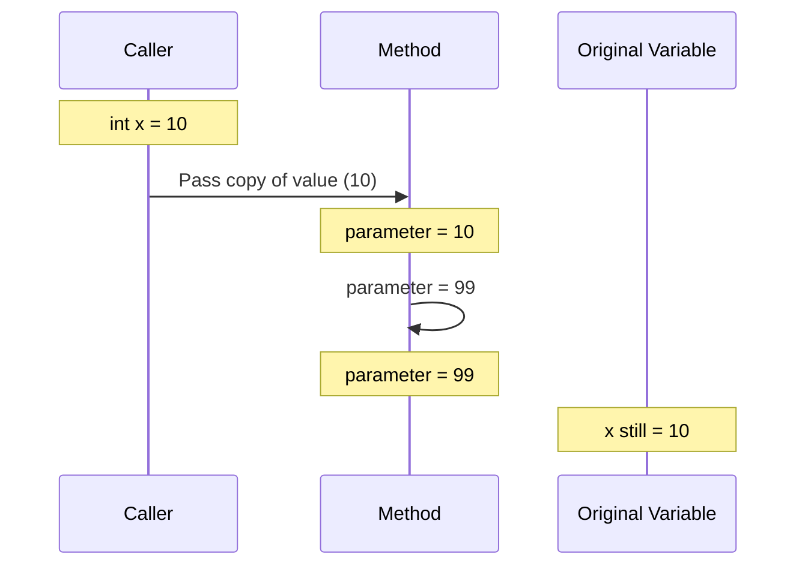

```csharp
// 🔰 BEGINNER: Value types passed by value
void ModifyValue(int number)
{
    number = 99;  // Modifies the copy only
}

int x = 10;
ModifyValue(x);
Console.WriteLine(x);  // 10 (unchanged)

// 🎯 INTERMEDIATE: Reference types passed by value (reference is copied)
void ModifyReference(Person person)
{
    person.Age = 99;  // ✅ Modifies original object
    person = new Person("New", 1);  // ❌ Only changes local copy
}

Person p = new Person("John", 30);
ModifyReference(p);
Console.WriteLine(p.Name);  // "John" (reference not changed)
Console.WriteLine(p.Age);   // 99 (object was modified)
```

### Pass by Reference (ref keyword)

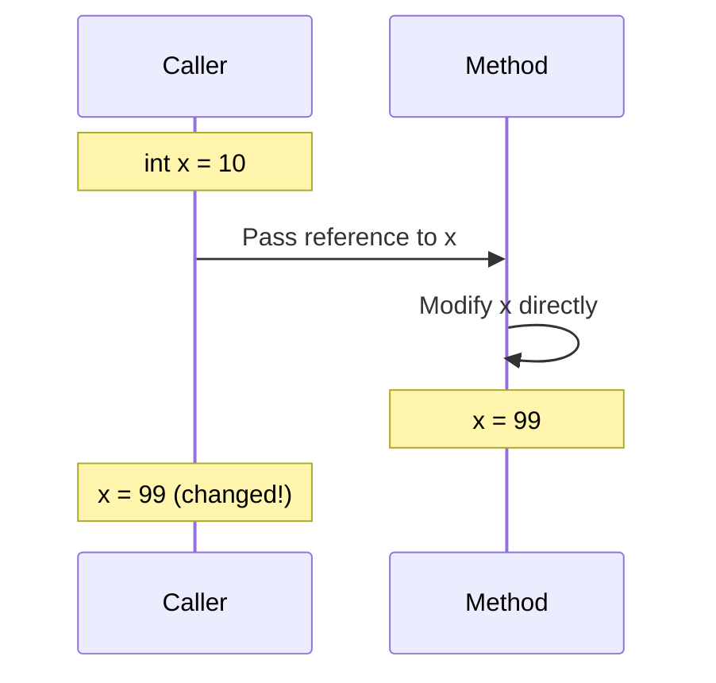

```csharp
// 🔰 BEGINNER: ref with value types
void ModifyWithRef(ref int number)
{
    number = 99;  // Modifies the original!
}

int x = 10;
ModifyWithRef(ref x);  // Must use 'ref' keyword
Console.WriteLine(x);  // 99 (changed!)

// 🎯 INTERMEDIATE: ref with reference types
void ReplaceObject(ref Person person)
{
    person = new Person("New Person", 1);  // ✅ Replaces original reference
}

Person p = new Person("John", 30);
ReplaceObject(ref p);
Console.WriteLine(p.Name);  // "New Person" (reference was changed!)

// 🚀 ADVANCED: ref returns (C# 7.0+)
public ref int FindFirst(int[] numbers, int target)
{
    for (int i = 0; i < numbers.Length; i++)
    {
        if (numbers[i] == target)
            return ref numbers[i];  // Return reference to array element
    }
    throw new InvalidOperationException("Not found");
}

int[] arr = { 1, 2, 3, 4, 5 };
ref int element = ref FindFirst(arr, 3);
element = 99;  // Modifies array directly!
Console.WriteLine(arr[2]);  // 99
```

### Out Parameters

```csharp
// 🔰 BEGINNER: out parameters
bool TryParse(string input, out int result)
{
    return int.TryParse(input, out result);
}

// Must assign before return
string userInput = "123";
if (TryParse(userInput, out int number))
{
    Console.WriteLine($"Parsed: {number}");
}

// 🎯 INTERMEDIATE: Out variable declaration (C# 7.0+)
if (int.TryParse("456", out int value))
{
    Console.WriteLine(value);  // 456
}
// 'value' is still in scope here

// Multiple out parameters
bool Divide(int a, int b, out int quotient, out int remainder)
{
    if (b == 0)
    {
        quotient = 0;
        remainder = 0;
        return false;
    }

    quotient = a / b;
    remainder = a % b;
    return true;
}

if (Divide(10, 3, out int q, out int r))
{
    Console.WriteLine($"10 / 3 = {q} remainder {r}");  // 3 remainder 1
}

// 🚀 ADVANCED: Discard out parameters you don't need
if (int.TryParse("789", out _))  // _ means "I don't care"
{
    Console.WriteLine("Valid integer, but I don't need the value");
}
```

### In Parameters (Read-only Reference)

```csharp
// 🚀 ADVANCED: 'in' keyword (C# 7.2+) - pass by readonly reference
public readonly struct LargeStruct
{
    public readonly double X, Y, Z;
    public readonly double A, B, C;
    // ... many fields

    public LargeStruct(double x, double y, double z, double a, double b, double c)
    {
        X = x; Y = y; Z = z;
        A = a; B = b; C = c;
    }
}

// ❌ Slow - copies entire struct
double Calculate(LargeStruct data)
{
    return data.X + data.Y;
}

// ✅ Fast - passes by reference, no copy
double CalculateFast(in LargeStruct data)
{
    // data.X = 5;  // ❌ Compiler error - readonly!
    return data.X + data.Y;
}

LargeStruct big = new LargeStruct(1, 2, 3, 4, 5, 6);
double result = CalculateFast(in big);  // No copy!
```

---

## 7. When to Use Struct vs Class

### Decision Flow

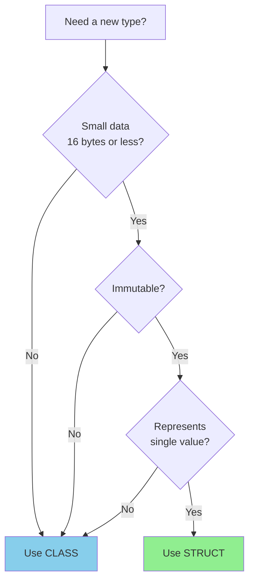

### Guidelines

```csharp
// ✅ GOOD: Use struct for small, immutable value-like types
public readonly struct Point
{
    public double X { get; }
    public double Y { get; }

    public Point(double x, double y)
    {
        X = x;
        Y = y;
    }
}

public readonly struct Money
{
    public decimal Amount { get; }
    public string Currency { get; }

    public Money(decimal amount, string currency)
    {
        Amount = amount;
        Currency = currency;
    }
}

// ❌ BAD: Large mutable struct
public struct BadStruct  // DON'T DO THIS
{
    public int Field1, Field2, Field3, Field4;
    public double Field5, Field6, Field7, Field8;
    public string Field9, Field10;  // More than 16 bytes!

    public void Mutate()  // ❌ Mutating struct
    {
        Field1 = 999;
    }
}

// ✅ GOOD: Use class for complex types
public class Person
{
    public string FirstName { get; set; }
    public string LastName { get; set; }
    public DateTime BirthDate { get; set; }
    public Address Address { get; set; }  // Complex object

    // Methods, events, etc.
}

// 🎯 REAL-WORLD EXAMPLES:

// ✅ Struct - represents single primitive value
public readonly struct Temperature
{
    public double Celsius { get; }

    public double Fahrenheit => Celsius * 9 / 5 + 32;

    public Temperature(double celsius)
    {
        Celsius = celsius;
    }
}

// ✅ Class - represents entity with identity
public class Customer
{
    public int Id { get; set; }
    public string Name { get; set; }
    public List<Order> Orders { get; set; }

    // Business logic
    public decimal GetTotalSpent()
    {
        return Orders.Sum(o => o.Total);
    }
}
```

### Performance Comparison

| Aspect      | Struct                  | Class                 |
| ----------- | ----------------------- | --------------------- |
| Allocation  | Stack (if local)        | Heap                  |
| Copy cost   | Copies all data         | Copies reference only |
| GC pressure | None                    | Yes                   |
| Inheritance | No                      | Yes                   |
| Null        | No (unless Nullable<T>) | Yes                   |
| Best for    | Small, immutable values | Complex entities      |

```csharp
// 🚀 ADVANCED: Benchmark example
[MemoryDiagnoser]
public class StructVsClass
{
    private const int Iterations = 1000000;

    public struct PointStruct
    {
        public double X, Y;
    }

    public class PointClass
    {
        public double X, Y;
    }

    [Benchmark]
    public void CreateStructs()
    {
        for (int i = 0; i < Iterations; i++)
        {
            var p = new PointStruct { X = i, Y = i };
        }
        // No heap allocations!
    }

    [Benchmark]
    public void CreateClasses()
    {
        for (int i = 0; i < Iterations; i++)
        {
            var p = new PointClass { X = i, Y = i };
        }
        // 1,000,000 heap allocations + GC!
    }
}
// Struct is ~10x faster for this scenario
```

### Readonly Structs (C# 7.2+)

```csharp
public readonly struct ImmutablePoint
{
    public int X { get; }
    public int Y { get; }

    public ImmutablePoint(int x, int y)
    {
        X = x;
        Y = y;
    }

    // Compiler ensures no mutations
}
```

### Ref Structs (C# 7.2+)

```csharp
// Can only exist on the stack - cannot be boxed
public ref struct StackOnlyStruct
{
    public Span<byte> Buffer;

    public StackOnlyStruct(Span<byte> buffer)
    {
        Buffer = buffer;
    }
}

// Usage
Span<byte> stackBuffer = stackalloc byte[128];
var stackOnly = new StackOnlyStruct(stackBuffer);
// Cannot: object obj = stackOnly; // Compile error!
// Cannot: List<StackOnlyStruct> list; // Compile error!
```

---

## 3. Reference Types Deep Dive

### Characteristics

- Stored on heap
- Variables hold references (pointers)
- Derived from `System.Object` (but not `System.ValueType`)
- Can be null
- Passed by reference by default

### Common Reference Types

```csharp
// Classes
class Person
{
    public string Name { get; set; }
    public int Age { get; set; }
}

// Strings (immutable reference type)
string s = "Hello";

// Arrays
int[] numbers = { 1, 2, 3 };

// Delegates
Action action = () => Console.WriteLine("Hello");

// Objects
object obj = new object();
```

### Reference Type Example

```csharp
class BankAccount
{
    public decimal Balance { get; set; }

    public void Deposit(decimal amount)
    {
        Balance += amount;
    }
}

// Usage
BankAccount account1 = new BankAccount { Balance = 100 };
BankAccount account2 = account1; // Both reference SAME object
account2.Deposit(50);
Console.WriteLine(account1.Balance); // 150 - SAME object!
```

---

## 4. Boxing and Unboxing

### What is Boxing?

Converting a value type to a reference type (object).

```csharp
int number = 42;        // Value type on stack
object boxed = number;  // BOXING - creates heap object
```

### What Happens During Boxing?

1. Allocate memory on heap
2. Copy value to heap
3. Return reference to heap object

### What is Unboxing?

Converting a boxed value type back to its original type.

```csharp
object boxed = 42;
int unboxed = (int)boxed; // UNBOXING - extract value
```

### Performance Implications

```csharp
// ❌ BAD - Boxing in loop (slow!)
ArrayList list = new ArrayList();
for (int i = 0; i < 1000; i++)
{
    list.Add(i); // BOXES each int!
}

// ✅ GOOD - No boxing (fast!)
List<int> list = new List<int>();
for (int i = 0; i < 1000; i++)
{
    list.Add(i); // No boxing!
}
```

### Hidden Boxing

```csharp
// Hidden boxing examples
int number = 42;

// Boxing happens here:
Console.WriteLine(number); // Boxing!
string s = number.ToString(); // No boxing (specialized method)
string formatted = string.Format("{0}", number); // Boxing!

// Avoid boxing:
Console.WriteLine(number.ToString()); // No boxing
```

---

## 5. Memory Layout

### Value Type Memory Layout

```csharp
struct MyStruct
{
    public int A;    // 4 bytes
    public byte B;   // 1 byte
    public short C;  // 2 bytes
}
// Total: 8 bytes (may include padding)
```

### Reference Type Memory Layout

```csharp
class MyClass
{
    public int A;    // 4 bytes (on heap)
}
// Object on heap:
// - Object header (8-16 bytes)
// - Method table pointer (8 bytes on 64-bit)
// - Field data (4 bytes)
// - Padding
// Reference variable: 8 bytes (on 64-bit system)
```

### Stack vs Heap

```csharp
void Example()
{
    // Stack allocation
    int x = 10;              // 4 bytes on stack
    Point p = new Point();   // 8 bytes on stack

    // Heap allocation
    Person person = new Person(); // Reference (8 bytes) on stack
                                  // Object on heap (header + fields)

    int[] array = new int[100];   // Reference (8 bytes) on stack
                                  // Array object on heap
}
```

---

## 6. When to Use Struct vs Class

### Use Struct When:

✅ Type represents a single value (like coordinates, dimensions)
✅ Size is small (< 16 bytes recommended)
✅ Type is immutable
✅ Type won't be boxed frequently
✅ Semantically represents a value

```csharp
// Good struct examples
public struct Point { public int X, Y; }
public struct Color { public byte R, G, B, A; }
public struct Complex { public double Real, Imaginary; }
```

### Use Class When:

✅ Type represents complex entity
✅ Type needs inheritance
✅ Type is large (> 16 bytes)
✅ Type needs to be null
✅ Type will be mutated frequently

```csharp
// Good class examples
public class Customer { /* many fields */ }
public class Order { /* complex behavior */ }
public abstract class Shape { /* inheritance */ }
```

### The 16-Byte Rule

```csharp
// ❌ BAD - Large struct (84 bytes)
public struct LargeStruct
{
    public long A, B, C, D, E, F, G, H, I, J; // 80 bytes
    public int Z; // 4 bytes
}
// Copying this is expensive!

// ✅ GOOD - Make it a class
public class LargeData
{
    public long A, B, C, D, E, F, G, H, I, J;
    public int Z;
}
// Only copy 8-byte reference
```

---

## 7. Passing Parameters

### By Value (Default)

```csharp
void ModifyValue(int x)
{
    x = 100; // Only modifies local copy
}

void ModifyReference(Person person)
{
    person.Name = "New Name"; // Modifies object (reference copied)
    person = new Person();    // Local reference changed only
}

int num = 42;
ModifyValue(num);
Console.WriteLine(num); // 42 - unchanged

Person p = new Person { Name = "Old" };
ModifyReference(p);
Console.WriteLine(p.Name); // "New Name" - object modified
```

### By Reference (ref)

```csharp
void ModifyByRef(ref int x)
{
    x = 100; // Modifies original variable
}

void ReplaceObject(ref Person person)
{
    person = new Person { Name = "Replaced" }; // Replaces original reference
}

int num = 42;
ModifyByRef(ref num);
Console.WriteLine(num); // 100 - changed!

Person p = new Person { Name = "Old" };
ReplaceObject(ref p);
Console.WriteLine(p.Name); // "Replaced" - reference replaced
```

### Out Parameters

```csharp
bool TryParse(string input, out int result)
{
    result = 0; // Must assign before returning
    return int.TryParse(input, out result);
}

// C# 7.0+ inline declaration
if (int.TryParse("123", out int value))
{
    Console.WriteLine(value); // 123
}
```

### In Parameters (C# 7.2+)

```csharp
void ProcessLargeStruct(in LargeStruct data)
{
    // data is passed by reference (efficient)
    // data is readonly (cannot modify)
    // data.X = 10; // Compile error!
}
```

---

## 8. Nullable Value Types

### Nullable<T>

```csharp
int? nullableInt = null;
int? anotherNullable = 42;

// Nullable is a struct:
struct Nullable<T> where T : struct
{
    private bool hasValue;
    private T value;

    public bool HasValue => hasValue;
    public T Value => hasValue ? value : throw new InvalidOperationException();
}

// Usage
if (nullableInt.HasValue)
{
    Console.WriteLine(nullableInt.Value);
}

// Null-coalescing
int result = nullableInt ?? 0; // 0 if null

// Nullable reference types (C# 8.0+)
#nullable enable
string? nullableString = null; // Can be null
string nonNullableString = "Hello"; // Cannot be null (warning if null)
```

---

## 9. Common Pitfalls

### Pitfall 1: Mutable Structs

```csharp
// ❌ BAD - Mutable struct
public struct MutablePoint
{
    public int X { get; set; }
    public int Y { get; set; }

    public void MoveRight() { X++; } // Mutation!
}

var points = new List<MutablePoint>();
points.Add(new MutablePoint { X = 0, Y = 0 });
points[0].MoveRight(); // No effect! Works on a COPY!

// ✅ GOOD - Immutable struct
public readonly struct ImmutablePoint
{
    public int X { get; }
    public int Y { get; }

    public ImmutablePoint(int x, int y) => (X, Y) = (x, y);
    public ImmutablePoint MoveRight() => new ImmutablePoint(X + 1, Y);
}
```

### Pitfall 2: Default Values

```csharp
public struct Point
{
    public int X { get; set; }
    public int Y { get; set; }

    public Point(int x, int y)
    {
        X = x;
        Y = y;
    }
}

// Structs always have a parameterless constructor
Point p = new Point(); // X=0, Y=0 (not your constructor!)
Point p2 = default(Point); // X=0, Y=0
```

### Pitfall 3: Boxing in Interfaces

```csharp
interface IMovable
{
    void Move(int x, int y);
}

struct Point : IMovable
{
    public int X { get; set; }
    public int Y { get; set; }

    public void Move(int x, int y)
    {
        X += x;
        Y += y;
    }
}

Point p = new Point();
IMovable movable = p; // BOXING!
movable.Move(10, 10); // Modifies BOXED copy
// p is unchanged!
```

---

## 10. Interview Questions

### Question 1: What's the difference between struct and class?

**Answer:**

- **Struct:** Value type, stack allocation (usually), copied by value, no inheritance, cannot be null (unless Nullable<T>), best for small immutable data
- **Class:** Reference type, heap allocation, passed by reference, supports inheritance, can be null, best for complex objects

### Question 2: What is boxing and why is it expensive?

**Answer:**
Boxing converts a value type to a reference type (object). It's expensive because:

1. Allocates memory on the heap
2. Copies the value to the heap
3. Adds object header overhead
4. Triggers garbage collection more frequently
5. Cache performance suffers (heap vs stack)

### Question 3: When should you use a struct?

**Answer:**
Use structs when:

- Type represents a single value (coordinates, dimensions)
- Size is small (< 16 bytes)
- Type is immutable
- Type won't be boxed frequently
- You need stack allocation performance

### Question 4: Can a struct inherit from a class?

**Answer:**
No. Structs can only:

- Implement interfaces
- Implicitly derive from System.ValueType (which derives from System.Object)
- Cannot inherit from other structs or classes
- Cannot be inherited from

### Question 5: What happens when you assign one struct to another?

**Answer:**
A **memberwise copy** is created. All fields are copied to the new struct. They are completely independent afterwards. Changes to one don't affect the other.

---

## 11. Practical Exercises

### Exercise 1: Create an Immutable Point3D Struct

```csharp
// Requirements:
// - Readonly struct
// - X, Y, Z coordinates
// - Methods: Add, Distance, Normalize
// - Overload operators (+, -)
// - Override ToString, Equals, GetHashCode
```

### Exercise 2: Demonstrate Boxing/Unboxing

```csharp
// Write code that:
// 1. Boxes an int
// 2. Unboxes it
// 3. Shows type information
// 4. Demonstrates performance difference with/without boxing
```

### Exercise 3: Fix the Mutable Struct Problem

```csharp
// Given a mutable struct in a collection
// Fix it to work correctly
// Compare performance: struct vs class
```

### Exercise 4: Implement Value Equality

```csharp
// Create a struct Point with:
// - Proper Equals implementation
// - Proper GetHashCode implementation
// - Operator overloads (==, !=)
// - IEquatable<Point> implementation
```

---

## 12. Key Takeaways

✅ **Value types** contain data; **reference types** contain references
✅ **Structs** should be small, immutable, and represent single values
✅ **Boxing** converts value types to reference types (expensive!)
✅ **Avoid mutable structs** - they cause confusing bugs
✅ **Use ref/in parameters** to pass large structs efficiently
✅ **Understand memory layout** to write efficient code
✅ **Choose the right type** based on semantics and performance

---

## 13. Tomorrow's Preview

Tomorrow we'll dive into **Memory Management & Garbage Collection**:

- Stack vs Heap in detail
- GC generations and collection algorithms
- IDisposable pattern and using statements
- Memory leaks in managed code
- Modern memory-efficient types (Span<T>, Memory<T>)

---

## Additional Reading

- [Value Types (C# Reference)](https://docs.microsoft.com/en-us/dotnet/csharp/language-reference/builtin-types/value-types)
- [Reference Types (C# Reference)](https://docs.microsoft.com/en-us/dotnet/csharp/language-reference/keywords/reference-types)
- [CLR via C# - Chapter 5: Primitive, Reference, and Value Types](https://www.amazon.com/CLR-via-4th-Developer-Reference/dp/0735667454)

**Time to Practice!** 💪 Implement the exercises and test your understanding.
