# Day 2: Memory Management & Garbage Collection

## 🎯 Learning Objectives

- Understand stack vs heap memory allocation
- Master garbage collection generations and algorithms
- Learn the IDisposable pattern and resource management
- Identify and prevent memory leaks in managed code
- Use modern memory-efficient types (Span<T>, Memory<T>)

---

## 1. Stack vs Heap

### Simple Analogy

**Stack:** Like a **stack of plates** - you add/remove from the top only. Fast and automatic.
**Heap:** Like a **storage warehouse** - items can go anywhere, but someone needs to organize and clean it up.

### Memory Architecture Diagram

```mermaid
graph TB
    subgraph "Stack (Fast, Limited Size)"
        A[Method Call 1]
        B[Method Call 2]
        C[Method Call 3<br/>int x = 10<br/>ref person]
    end

    subgraph "Heap (Slower, Large Size)"
        D[Person Object<br/>Name: John<br/>Age: 30]
        E[int[] Array<br/>1000 elements]
        F[String: Hello]
    end

    C -.Reference.-> D
    C -.Reference.-> E

    style A fill:#90EE90
    style B fill:#90EE90
    style C fill:#90EE90
    style D fill:#87CEEB
    style E fill:#87CEEB
    style F fill:#87CEEB
```

### The Stack

**Characteristics:**

- ✅ **Super fast** allocation/deallocation (just move stack pointer)
- ✅ **LIFO** (Last In, First Out) structure
- ✅ **Limited size** (~1MB per thread)
- ✅ **Automatically cleaned up** when method returns
- ✅ Stores **local variables** and method parameters

```csharp
// 🔰 BEGINNER: Stack allocation example
void StackExample()
{
    // Everything here goes on the stack
    int x = 10;              // Stack: 4 bytes
    double y = 3.14;         // Stack: 8 bytes
    bool flag = true;        // Stack: 1 byte
    Point p = new Point(5, 5); // Stack: 8 bytes (struct)

    Console.WriteLine($"x = {x}");

    // When method returns, ALL this memory is automatically freed!
    // No garbage collection needed!
}

// 🎯 INTERMEDIATE: Stack visualization
void Method1()
{
    int a = 1;
    Method2();  // Stack grows down
}

void Method2()
{
    int b = 2;
    Method3();  // Stack grows down more
}

void Method3()
{
    int c = 3;
    // Stack now has: [a=1] [b=2] [c=3]
}
// As methods return: [a=1] [b=2] [c=3] -> [a=1] [b=2] -> [a=1] -> (empty)
```

### The Heap

**Characteristics:**

- ⚡ **Slower** allocation (managed by GC)
- 📦 **Large size** (limited by system memory, not by program)
- 🔄 **Requires garbage collection** for cleanup
- 💾 Stores **reference type objects** and static variables
- 🎯 **Managed by the Garbage Collector**

```csharp
// 🔰 BEGINNER: Heap allocation example
void HeapExample()
{
    // Reference on stack, object on heap
    Person person = new Person();  // Heap allocation
    int[] array = new int[1000];   // Heap allocation (arrays are reference types)
    string s = "Hello";            // Heap allocation (strings are reference types)

    // Objects remain on heap after method returns
    // GC will clean up when no longer referenced
}

// 🎯 INTERMEDIATE: What goes where?
void WhatGoesWhere()
{
    // STACK:
    int number = 42;           // Value type
    DateTime date = DateTime.Now;  // Value type (struct!)

    // STACK (reference) -> HEAP (object):
    string text = "Hello";     // Reference type
    Person p = new Person();   // Reference type
    int[] arr = {1, 2, 3};     // Reference type

    // STACK (reference) -> HEAP (object containing value):
    List<int> list = new List<int> { 1, 2, 3 };
}

// 🚀 ADVANCED: Mixed allocation
public class MyClass
{
    // These are on HEAP (part of object):
    public int Number;         // Value type field
    public Point Location;     // Value type field (stored inline)
    public Person Owner;       // Reference type field (reference to another heap object)
}

void AdvancedExample()
{
    MyClass obj = new MyClass();  // 'obj' reference on stack

    // On heap:
    // - MyClass object
    // - Number (stored inline in object)
    // - Location.X and Location.Y (stored inline)
    // - Owner (reference to another heap object)
}
```

### Memory Layout Visualization

```mermaid
graph TB
    subgraph "Stack (Thread 1)"
        S1[local: int = 42]
        S2[c: reference to 0x1000]
    end

    subgraph "Heap"
        H1["Container Object (0x1000)<br/>━━━━━━━━━━━━<br/>Object Header<br/>Value: int = 10<br/>Location: Point (x=5, y=5)<br/>Owner: ref to 0x2000"]
        H2["Person Object (0x2000)<br/>━━━━━━━━━━━━<br/>Name: string<br/>Age: int = 30"]
    end

    S2 -.-> H1
    H1 -.Owner.-> H2

    style S1 fill:#90EE90
    style S2 fill:#90EE90
    style H1 fill:#87CEEB
    style H2 fill:#FFB6C1
```



```csharp
// Complete example matching the diagram above
public struct Point
{
    public int X, Y;
}

public class Person
{
    public string Name;
    public int Age;
}

public class Container
{
    public int Value;          // Stored inline (on heap as part of Container)
    public Point Location;     // Stored inline (value type)
    public Person Owner;       // Reference to another heap object
}

void CompleteExample()
{
    int local = 42;                    // Stack
    Container c = new Container        // Stack: reference, Heap: object
    {
        Value = 10,
        Location = new Point { X = 5, Y = 5 },
        Owner = new Person { Name = "John", Age = 30 }
    };

    // Memory breakdown:
    // Stack: local (4 bytes) + c reference (8 bytes) = 12 bytes
    // Heap: Container object + Person object + string "John"
}
```

---

## 2. Garbage Collection Fundamentals

### What is Garbage Collection?

**Simple Explanation:** The GC is like a **janitor** that automatically cleans up objects you're no longer using, so you don't have memory leaks.

### GC Process Diagram


### How GC Works

The .NET Garbage Collector follows these steps:

1. **Mark** - Identifies which objects are still in use (reachable from roots)
2. **Sweep** - Identifies dead objects (unreachable)
3. **Compact** - Moves living objects together, freeing contiguous memory

```csharp
// 🔰 BEGINNER: Understanding reachability
void Example1()
{
    Person p1 = new Person("Alice");  // Reachable (referenced by p1)
    Person p2 = new Person("Bob");    // Reachable (referenced by p2)

    p1 = null;  // Alice object now unreachable -> eligible for GC

    // Bob object still reachable through p2
} // When method ends, Bob object also becomes unreachable

// 🎯 INTERMEDIATE: GC roots (what makes objects reachable?)
public class Application
{
    private static Person admin = new Person("Admin");  // Root: static field

    void ProcessRequest()
    {
        Person user = new Person("User");  // Root: local variable (on stack)

        // Both admin and user are reachable
        // admin stays reachable after method ends (static)
        // user becomes unreachable after method ends
    }
}

// 🚀 ADVANCED: Forcing GC (for demonstration only - don't do in production!)
void DemonstrateGC()
{
    Person p = new Person("Temporary");
    Console.WriteLine("Created person");

    p = null;  // Now unreachable

    // Check memory before GC
    long before = GC.GetTotalMemory(false);

    GC.Collect();  // ❌ DON'T normally call this!
    GC.WaitForPendingFinalizers();
    GC.Collect();

    // Check memory after GC
    long after = GC.GetTotalMemory(false);

    Console.WriteLine($"Memory freed: {before - after} bytes");
}
```

### GC Generations

**Simple Analogy:** Think of generations like **age groups**:

- **Gen 0:** Babies (short-lived objects) - cleaned frequently
- **Gen 1:** Teenagers (survived one cleaning) - cleaned occasionally
- **Gen 2:** Adults (long-lived objects) - cleaned rarely


### Generation Details

| Generation | Description                  | Collection Frequency | Typical Objects                    |
| ---------- | ---------------------------- | -------------------- | ---------------------------------- |
| **Gen 0**  | Young objects (just created) | Very frequent        | Temporary variables, method locals |
| **Gen 1**  | Survived one collection      | Medium frequency     | Short-term caches, session data    |
| **Gen 2**  | Long-lived objects           | Rare                 | Static data, application state     |

```csharp
// 🔰 BEGINNER: Object lifecycle
void ShortLived()
{
    // These go to Gen 0 and are quickly collected
    for (int i = 0; i < 1000; i++)
    {
        string temp = $"Temporary {i}";  // Gen 0
        Console.WriteLine(temp);
    }
    // All temp strings collected after loop
}

// 🎯 INTERMEDIATE: Long-lived objects
public class Application
{
    // Static field - will likely reach Gen 2
    private static readonly Dictionary<string, string> Cache = new();

    void ProcessData()
    {
        // Short-lived - stays in Gen 0
        var tempData = LoadData();

        // Add to cache - will be promoted to Gen 1, then Gen 2
        Cache[tempData.Key] = tempData.Value;
    }
}

// 🚀 ADVANCED: Checking object generation
void CheckGeneration()
{
    var obj1 = new object();
    Console.WriteLine($"Gen: {GC.GetGeneration(obj1)}"); // 0

    GC.Collect(0);  // Collect Gen 0
    Console.WriteLine($"Gen: {GC.GetGeneration(obj1)}"); // 1 (promoted!)

    GC.Collect(1);  // Collect Gen 0 and 1
    Console.WriteLine($"Gen: {GC.GetGeneration(obj1)}"); // 2 (promoted again!)
}
```

### Generation Collection Visualization


---

## 3. IDisposable Pattern

### Why Do We Need IDisposable?

**Simple Explanation:** Some objects hold **unmanaged resources** (files, database connections, network sockets) that the GC doesn't know about. `IDisposable` lets you explicitly release these resources.

### Resource Management Diagram


```csharp
// 🔰 BEGINNER: Basic IDisposable
public class FileLogger : IDisposable
{
    private FileStream fileStream;

    public FileLogger(string path)
    {
        fileStream = new FileStream(path, FileMode.Append);
    }

    public void Log(string message)
    {
        byte[] data = Encoding.UTF8.GetBytes(message + "\n");
        fileStream.Write(data, 0, data.Length);
    }

    public void Dispose()
    {
        // Clean up unmanaged resource
        fileStream?.Dispose();
    }
}

// ❌ BAD: Manual disposal (easy to forget!)
void BadUsage()
{
    FileLogger logger = new FileLogger("log.txt");
    logger.Log("Hello");
    logger.Dispose();  // What if exception happens before this?
}

// ✅ GOOD: using statement (automatic disposal)
void GoodUsage()
{
    using (FileLogger logger = new FileLogger("log.txt"))
    {
        logger.Log("Hello");
    } // Dispose() automatically called here, even if exception occurs!
}

// ✅ BETTER: using declaration (C# 8.0+)
void BetterUsage()
{
    using FileLogger logger = new FileLogger("log.txt");
    logger.Log("Hello");
    // Dispose() called at end of method
}

// 🎯 INTERMEDIATE: Full IDisposable pattern
public class DatabaseConnection : IDisposable
{
    private SqlConnection connection;  // Managed resource
    private IntPtr nativeHandle;       // Unmanaged resource
    private bool disposed = false;

    public DatabaseConnection(string connectionString)
    {
        connection = new SqlConnection(connectionString);
        nativeHandle = AllocateNativeResource();
    }

    // Public Dispose method
    public void Dispose()
    {
        Dispose(disposing: true);
        GC.SuppressFinalize(this);  // Don't run finalizer
    }

    // Protected virtual Dispose method
    protected virtual void Dispose(bool disposing)
    {
        if (!disposed)
        {
            if (disposing)
            {
                // Free managed resources
                connection?.Dispose();
            }

            // Free unmanaged resources
            if (nativeHandle != IntPtr.Zero)
            {
                FreeNativeResource(nativeHandle);
                nativeHandle = IntPtr.Zero;
            }

            disposed = true;
        }
    }

    // Finalizer (only if you have unmanaged resources)
    ~DatabaseConnection()
    {
        Dispose(disposing: false);
    }

    // Helper to check if disposed
    private void ThrowIfDisposed()
    {
        if (disposed)
            throw new ObjectDisposedException(GetType().Name);
    }

    [DllImport("native.dll")]
    private static extern IntPtr AllocateNativeResource();

    [DllImport("native.dll")]
    private static extern void FreeNativeResource(IntPtr handle);
}

// 🚀 ADVANCED: Async disposal (C# 8.0+)
public class AsyncResource : IAsyncDisposable
{
    private NetworkStream stream;

    public async ValueTask DisposeAsync()
    {
        if (stream != null)
        {
            await stream.FlushAsync();
            await stream.DisposeAsync();
        }
    }
}

// Usage
async Task UseAsyncResource()
{
    await using var resource = new AsyncResource();
    // Use resource...
} // DisposeAsync() called automatically
```

### IDisposable Best Practices

```csharp
// ✅ DO: Implement IDisposable for classes that own disposable fields
public class MyService : IDisposable
{
    private readonly HttpClient httpClient = new();

    public void Dispose()
    {
        httpClient?.Dispose();
    }
}

// ❌ DON'T: Implement IDisposable on structs
// public struct MyStruct : IDisposable  // ❌ Bad idea - boxing issues

// ✅ DO: Call base.Dispose in derived classes
public class DerivedService : MyService
{
    private readonly FileStream file;

    protected override void Dispose(bool disposing)
    {
        if (disposing)
        {
            file?.Dispose();
        }
        base.Dispose(disposing);  // ✅ Always call base
    }
}

// ✅ DO: Make Dispose idempotent (safe to call multiple times)
public class SafeDisposal : IDisposable
{
    private FileStream stream;
    private bool disposed;

    public void Dispose()
    {
        if (!disposed)  // ✅ Check flag
        {
            stream?.Dispose();
            disposed = true;
        }
    }
}
```

---

## 4. Memory Leaks in Managed Code

### Yes, Memory Leaks Can Happen!

**Simple Explanation:** Even with GC, you can leak memory if objects stay **reachable** when they should be collected.

### Common Memory Leak Patterns


```csharp
// 🔰 BEGINNER: Event handler leak
public class Publisher
{
    public event EventHandler DataChanged;
}

public class LeakySubscriber
{
    public LeakySubscriber(Publisher publisher)
    {
        publisher.DataChanged += OnDataChanged;  // ❌ Never unsubscribed!
    }

    private void OnDataChanged(object sender, EventArgs e)
    {
        // Handle event
    }
}

// Even if you stop using LeakySubscriber, it won't be collected
// because Publisher still has a reference to it!

// ✅ FIX: Unsubscribe
public class GoodSubscriber : IDisposable
{
    private readonly Publisher publisher;

    public GoodSubscriber(Publisher publisher)
    {
        this.publisher = publisher;
        publisher.DataChanged += OnDataChanged;
    }

    public void Dispose()
    {
        publisher.DataChanged -= OnDataChanged;  // ✅ Unsubscribe!
    }

    private void OnDataChanged(object sender, EventArgs e)
    {
        // Handle event
    }
}

// 🎯 INTERMEDIATE: Static collection leak
public class Cache
{
    // ❌ Grows forever!
    private static readonly Dictionary<string, byte[]> data = new();

    public static void Add(string key, byte[] value)
    {
        data[key] = value;  // Never removed!
    }
}

// ✅ FIX: Use a size-limited cache
public class BetterCache
{
    private static readonly LruCache<string, byte[]> data = new(maxSize: 1000);

    public static void Add(string key, byte[] value)
    {
        data.Add(key, value);  // Old items automatically evicted
    }
}

// 🚀 ADVANCED: Weak references (hold reference without preventing GC)
public class WeakCache<TKey, TValue> where TValue : class
{
    private readonly Dictionary<TKey, WeakReference<TValue>> cache = new();

    public bool TryGet(TKey key, out TValue value)
    {
        if (cache.TryGetValue(key, out var weakRef))
        {
            if (weakRef.TryGetTarget(out value))
            {
                return true;  // Object still alive
            }
            cache.Remove(key);  // Object was collected
        }

        value = null;
        return false;
    }

    public void Add(TKey key, TValue value)
    {
        cache[key] = new WeakReference<TValue>(value);
        // If no strong reference exists, GC can collect the value
    }
}
```

// - Local variables on stack
// - CPU registers
// - GC handles
// - Finalization queue

public class GCDemo
{
private static Person staticPerson; // GC root (static)

    void Method()
    {
        Person local = new Person(); // GC root (local variable)
        // When method exits, 'local' is no longer a root
        // Object becomes eligible for collection
    }

}

````

### GC Generations

**Generation 0 (Gen 0)**

- Newly allocated objects
- Collected most frequently
- Small, fast collection
- Survives → promoted to Gen 1

**Generation 1 (Gen 1)**

- Short-lived objects that survived one collection
- Medium-frequency collection
- Buffer between Gen 0 and Gen 2
- Survives → promoted to Gen 2

**Generation 2 (Gen 2)**

- Long-lived objects
- Collected infrequently
- Expensive, full collection
- Typically application-lifetime objects

```csharp
// Check object generation
object obj = new object();
Console.WriteLine($"Generation: {GC.GetGeneration(obj)}"); // 0

GC.Collect(0); // Force Gen 0 collection
Console.WriteLine($"Generation: {GC.GetGeneration(obj)}"); // 1 (promoted)

GC.Collect(1); // Force Gen 1 collection
Console.WriteLine($"Generation: {GC.GetGeneration(obj)}"); // 2 (promoted)
````

### Large Object Heap (LOH)

Objects >= 85,000 bytes go directly to LOH (Gen 2).

```csharp
// Small object - regular heap
byte[] small = new byte[1000]; // Gen 0

// Large object - LOH (Gen 2 immediately)
byte[] large = new byte[100_000]; // LOH

// LOH is NOT compacted by default (performance)
// Can cause fragmentation
// .NET 4.5.1+: Can compact LOH explicitly
GCSettings.LargeObjectHeapCompactionMode = GCLargeObjectHeapCompactionMode.CompactOnce;
GC.Collect();
```

### GC Modes

**Workstation GC**

- Default for client applications
- One GC thread
- Lower latency for UI responsiveness

**Server GC**

- Default for server applications (ASP.NET Core)
- One GC thread per CPU core
- Higher throughput, higher memory usage

```xml
<!-- Configure in .csproj or runtimeconfig.json -->
<PropertyGroup>
  <ServerGarbageCollection>true</ServerGarbageCollection>
  <ConcurrentGarbageCollection>true</ConcurrentGarbageCollection>
</PropertyGroup>
```

---

## 3. IDisposable Pattern

### Why IDisposable?

Deterministic cleanup of unmanaged resources:

- File handles
- Database connections
- Network sockets
- Graphics handles
- Unmanaged memory

```csharp
// Basic IDisposable implementation
public class ResourceHolder : IDisposable
{
    private IntPtr unmanagedResource; // Unmanaged resource
    private FileStream managedResource; // Managed resource
    private bool disposed = false;

    public ResourceHolder()
    {
        unmanagedResource = // Allocate unmanaged resource
        managedResource = new FileStream("file.txt", FileMode.Open);
    }

    // Public dispose method
    public void Dispose()
    {
        Dispose(disposing: true);
        GC.SuppressFinalize(this); // Prevent finalizer from running
    }

    // Protected dispose method
    protected virtual void Dispose(bool disposing)
    {
        if (!disposed)
        {
            if (disposing)
            {
                // Dispose managed resources
                managedResource?.Dispose();
            }

            // Free unmanaged resources
            if (unmanagedResource != IntPtr.Zero)
            {
                // Free unmanaged memory
                unmanagedResource = IntPtr.Zero;
            }

            disposed = true;
        }
    }

    // Finalizer (destructor)
    ~ResourceHolder()
    {
        Dispose(disposing: false);
    }
}
```

### Using Statement

```csharp
// Traditional using statement
using (var resource = new ResourceHolder())
{
    // Use resource
} // Dispose() called automatically

// C# 8.0+ using declaration
using var resource = new ResourceHolder();
// Use resource
// Dispose() called at end of scope
```

### IAsyncDisposable (C# 8.0+)

```csharp
public class AsyncResourceHolder : IAsyncDisposable
{
    private NetworkStream stream;

    public async ValueTask DisposeAsync()
    {
        if (stream != null)
        {
            await stream.FlushAsync();
            stream.Dispose();
        }
    }
}

// Usage
await using var resource = new AsyncResourceHolder();
// Use resource
// DisposeAsync() called automatically
```

---

## 4. Memory Leaks in Managed Code

### Common Causes

#### 1. Event Handler Leaks

```csharp
// ❌ BAD - Memory leak
public class Publisher
{
    public event EventHandler SomethingHappened;

    public void RaiseEvent()
    {
        SomethingHappened?.Invoke(this, EventArgs.Empty);
    }
}

public class Subscriber
{
    public Subscriber(Publisher publisher)
    {
        publisher.SomethingHappened += OnSomethingHappened;
        // LEAK: Publisher keeps Subscriber alive!
    }

    private void OnSomethingHappened(object sender, EventArgs e)
    {
        // Handle event
    }
}

// ✅ GOOD - Unsubscribe
public class Subscriber : IDisposable
{
    private Publisher publisher;

    public Subscriber(Publisher publisher)
    {
        this.publisher = publisher;
        publisher.SomethingHappened += OnSomethingHappened;
    }

    public void Dispose()
    {
        publisher.SomethingHappened -= OnSomethingHappened;
    }

    private void OnSomethingHappened(object sender, EventArgs e)
    {
        // Handle event
    }
}
```

#### 2. Static References

```csharp
// ❌ BAD - Static collection grows forever
public static class Cache
{
    private static Dictionary<string, object> cache = new();

    public static void Add(string key, object value)
    {
        cache[key] = value; // Never removed!
    }
}

// ✅ GOOD - Use weak references or cache eviction
public static class Cache
{
    private static Dictionary<string, WeakReference> cache = new();

    public static void Add(string key, object value)
    {
        cache[key] = new WeakReference(value);
    }

    public static object Get(string key)
    {
        if (cache.TryGetValue(key, out var weakRef))
        {
            return weakRef.Target; // null if collected
        }
        return null;
    }
}
```

#### 3. Timer Leaks

```csharp
// ❌ BAD - Timer keeps object alive
public class Worker
{
    private System.Timers.Timer timer;

    public Worker()
    {
        timer = new System.Timers.Timer(1000);
        timer.Elapsed += OnTimerElapsed;
        timer.Start();
        // LEAK: Timer is GC root, keeps Worker alive!
    }

    private void OnTimerElapsed(object sender, ElapsedEventArgs e)
    {
        // Work
    }
}

// ✅ GOOD - Stop and dispose timer
public class Worker : IDisposable
{
    private System.Timers.Timer timer;

    public Worker()
    {
        timer = new System.Timers.Timer(1000);
        timer.Elapsed += OnTimerElapsed;
        timer.Start();
    }

    public void Dispose()
    {
        timer?.Stop();
        timer?.Dispose();
    }

    private void OnTimerElapsed(object sender, ElapsedEventArgs e)
    {
        // Work
    }
}
```

#### 4. Captured Variables in Closures

```csharp
// ❌ BAD - Closure captures large object
public class DataProcessor
{
    public Action ProcessData()
    {
        var largeData = new byte[1_000_000]; // 1 MB
        // Load data...

        return () =>
        {
            // Only need this
            Console.WriteLine(largeData.Length);
            // But entire largeData is captured!
        };
    }
}

// ✅ GOOD - Capture only what you need
public class DataProcessor
{
    public Action ProcessData()
    {
        var largeData = new byte[1_000_000];
        // Load data...

        int length = largeData.Length; // Extract needed value
        return () =>
        {
            Console.WriteLine(length); // Only captures int
        };
    }
}
```

---

## 5. Modern Memory-Efficient Types

### Span<T> (C# 7.2+)

Stack-only type for working with contiguous memory.

```csharp
// Span over array
int[] array = { 1, 2, 3, 4, 5 };
Span<int> span = array;
Span<int> slice = span.Slice(1, 3); // { 2, 3, 4 }

// Modify through span
slice[0] = 20;
Console.WriteLine(array[1]); // 20 - modified original array

// Stack allocation (no heap allocation!)
Span<byte> stackSpan = stackalloc byte[256];
for (int i = 0; i < stackSpan.Length; i++)
{
    stackSpan[i] = (byte)i;
}
// No GC pressure!

// String slicing without allocation
ReadOnlySpan<char> text = "Hello, World!".AsSpan();
ReadOnlySpan<char> hello = text.Slice(0, 5); // "Hello"
ReadOnlySpan<char> world = text.Slice(7, 5); // "World"
```

### Memory<T>

Heap-friendly alternative to Span<T>.

```csharp
// Memory can be stored in fields (unlike Span)
public class DataBuffer
{
    private Memory<byte> buffer;

    public DataBuffer(int size)
    {
        buffer = new byte[size];
    }

    public async Task FillAsync(Stream stream)
    {
        // Can use in async methods (unlike Span)
        int read = await stream.ReadAsync(buffer);
    }

    public Span<byte> GetSpan() => buffer.Span;
}
```

### ArrayPool<T>

Reuse arrays to reduce GC pressure.

```csharp
// ❌ BAD - Allocates new array each time
void ProcessData()
{
    byte[] buffer = new byte[4096]; // Heap allocation
    // Use buffer...
} // Eligible for GC

// ✅ GOOD - Rent from pool
void ProcessData()
{
    byte[] buffer = ArrayPool<byte>.Shared.Rent(4096);
    try
    {
        // Use buffer...
    }
    finally
    {
        ArrayPool<byte>.Shared.Return(buffer);
    }
}

// Even better with span
void ProcessData()
{
    byte[] buffer = ArrayPool<byte>.Shared.Rent(4096);
    try
    {
        Span<byte> span = buffer.AsSpan(0, 4096);
        // Use span...
    }
    finally
    {
        ArrayPool<byte>.Shared.Return(buffer);
    }
}
```

### MemoryPool<T>

Similar to ArrayPool but with IMemoryOwner.

```csharp
void ProcessData()
{
    using IMemoryOwner<byte> owner = MemoryPool<byte>.Shared.Rent(4096);
    Memory<byte> memory = owner.Memory;
    // Use memory...
} // Automatically returned
```

---

## 6. Performance Best Practices

### Reduce Allocations

```csharp
// ❌ BAD - String concatenation in loop
string result = "";
for (int i = 0; i < 1000; i++)
{
    result += i.ToString(); // Many allocations!
}

// ✅ GOOD - Use StringBuilder
var sb = new StringBuilder();
for (int i = 0; i < 1000; i++)
{
    sb.Append(i);
}
string result = sb.ToString();

// ✅ EVEN BETTER - Use Span/stackalloc for small strings
Span<char> buffer = stackalloc char[32];
for (int i = 0; i < 1000; i++)
{
    if (i.TryFormat(buffer, out int written))
    {
        // Use buffer.Slice(0, written)
    }
}
```

### Struct vs Class for Performance

```csharp
// ❌ Allocating many small objects
var points = new List<Point>();
for (int i = 0; i < 1_000_000; i++)
{
    points.Add(new Point { X = i, Y = i }); // If Point is class: 1M heap allocations
}

// ✅ Using struct - no heap allocations
readonly struct Point
{
    public int X { get; }
    public int Y { get; }
    public Point(int x, int y) => (X, Y) = (x, y);
}
// List still allocates, but contains Point VALUES not references
```

### Object Pooling

```csharp
public class ObjectPool<T> where T : class, new()
{
    private readonly ConcurrentBag<T> objects = new();

    public T Rent()
    {
        return objects.TryTake(out T item) ? item : new T();
    }

    public void Return(T item)
    {
        objects.Add(item);
    }
}

// Usage
var pool = new ObjectPool<StringBuilder>();
var sb = pool.Rent();
try
{
    sb.Clear();
    // Use StringBuilder
}
finally
{
    pool.Return(sb);
}
```

---

## 7. Analyzing Memory Issues

### Using dotnet-counters

```bash
# Install
dotnet tool install --global dotnet-counters

# Monitor GC
dotnet-counters monitor -n MyApp --counters System.Runtime

# Watch for:
# - High Gen 2 collection frequency
# - Large heap size
# - High allocation rate
```

### Using dotnet-dump

```bash
# Install
dotnet tool install --global dotnet-dump

# Create dump
dotnet-dump collect -p <pid>

# Analyze
dotnet-dump analyze <dump-file>

# Commands:
# dumpheap -stat        # Object statistics
# gcroot <address>      # Why object is alive
# dumpheap -mt <MT>     # Objects of specific type
```

### Visual Studio Memory Profiler

- Take memory snapshots
- Compare snapshots
- Identify leaked objects
- View allocation call stacks

---

## 8. Interview Questions

### Q1: Explain Stack vs Heap

**Answer:**

- **Stack:** LIFO, fast, automatic cleanup, stores value types and references, limited size (~1MB/thread)
- **Heap:** Managed by GC, slower, stores reference type objects, large size, requires GC for cleanup

### Q2: What are GC generations and why?

**Answer:**
Generational hypothesis: Most objects die young.

- **Gen 0:** New objects, collected frequently (fast)
- **Gen 1:** Survived Gen 0, buffer generation
- **Gen 2:** Long-lived, collected rarely (expensive)
  This optimizes GC by collecting young objects more frequently.

### Q3: When would you use IDisposable?

**Answer:**
When your class holds unmanaged resources:

- File handles, database connections, network sockets
- Native memory allocations
- Graphics resources
  Implement full Dispose pattern with finalizer for safety.

### Q4: What causes memory leaks in .NET?

**Answer:**

- Event handlers not unsubscribed
- Static references to objects
- Unclosed IDisposable objects
- Timers not stopped
- Captured variables in closures
- Cache without eviction

### Q5: What is Span<T> and when to use it?

**Answer:**
Stack-only type for memory-efficient array/string operations:

- Zero-copy slicing
- Stack allocation (stackalloc)
- Better performance (no GC)
- Cannot be boxed, cannot be in fields, cannot cross async boundaries
  Use for high-performance scenarios with contiguous memory.

---

## 9. Practical Exercises

### Exercise 1: Implement a Memory-Efficient String Parser

```csharp
// Parse CSV without allocating strings for each field
// Use ReadOnlySpan<char>
// Measure allocations before/after
```

### Exercise 2: Fix Memory Leaks

```csharp
// Given code with event handler leaks
// Identify and fix all leaks
// Verify with memory profiler
```

### Exercise 3: Optimize with ArrayPool

```csharp
// Refactor method that allocates byte arrays
// Use ArrayPool<T> to eliminate allocations
// Benchmark performance improvement
```

### Exercise 4: Implement Proper Dispose Pattern

```csharp
// Create class with managed and unmanaged resources
// Implement full IDisposable pattern
// Add unit tests
```

---

## 10. Key Takeaways

✅ **Stack** is fast, automatic; **Heap** requires GC
✅ **GC generations** optimize for short-lived objects
✅ **IDisposable** for deterministic cleanup of resources
✅ **Memory leaks** happen even in managed code
✅ **Span<T>** for high-performance, zero-copy operations
✅ **ArrayPool<T>** to reduce GC pressure
✅ **Profile and measure** - don't optimize blindly

---

## Tomorrow's Preview

Tomorrow: **Delegates, Events & Functional Programming**

- Delegate internals and multicast
- Event patterns and best practices
- Func, Action, Predicate
- Lambda expressions and closures
- Expression trees

---

**Keep Practicing!** 💪 Memory management is crucial for building high-performance applications.
