# Day 3: Delegates, Events & Functional Programming

## 🎯 Learning Objectives

- Master delegate internals and invocation lists
- Understand events and the event pattern
- Learn Func, Action, and Predicate delegates
- Deep dive into lambda expressions and closures
- Explore expression trees fundamentals

---

## 1. Delegates Fundamentals

### What is a Delegate?

**Simple Analogy:** A delegate is like a **business card** that contains contact information for a specific person. You can call the person through the card without knowing where they are.

**Technical:** A delegate is a type-safe function pointer - a reference to a method.


```csharp
// 🔰 BEGINNER: Basic delegate
public delegate int MathOperation(int x, int y);

// Methods matching the signature
public int Add(int x, int y) => x + y;
public int Subtract(int x, int y) => x - y;
public int Multiply(int x, int y) => x * y;

// Usage - delegate can point to any matching method
MathOperation operation = Add;
int result = operation(5, 3); // 8

operation = Subtract;  // Now points to different method
result = operation(5, 3); // 2

operation = Multiply;  // Change again
result = operation(5, 3); // 15

// 🎯 INTERMEDIATE: Passing delegates as parameters
void ExecuteOperation(MathOperation op, int a, int b)
{
    int result = op(a, b);
    Console.WriteLine($"Result: {result}");
}

ExecuteOperation(Add, 10, 5);       // Result: 15
ExecuteOperation(Subtract, 10, 5);  // Result: 5
ExecuteOperation(Multiply, 10, 5);  // Result: 50

// 🚀 ADVANCED: Delegate as return value
MathOperation GetOperation(string opType)
{
    return opType switch
    {
        "add" => Add,
        "subtract" => Subtract,
        "multiply" => Multiply,
        _ => throw new ArgumentException("Unknown operation")
    };
}

var dynamicOp = GetOperation("add");
Console.WriteLine(dynamicOp(7, 3));  // 10
```

### Delegate Internals Visualization

```mermaid
graph TB
    subgraph "Delegate Instance"
        A[Target Object<br/>null for static]
        B[Method Pointer<br/>IntPtr]
        C[Invocation List<br/>Delegate[]]
    end

    A -.-> D[Person Instance]
    B -.-> E[SayHello Method]
    C -.-> F[Chain of Delegates]

    style A fill:#FFB6C1
    style B fill:#87CEEB
    style C fill:#90EE90
```

```csharp
// What the compiler generates for you:
public sealed class MathOperation : System.MulticastDelegate
{
    // Constructor
    public MathOperation(object target, IntPtr method);

    // Synchronous invocation
    public int Invoke(int x, int y);

    // Asynchronous invocation (legacy)
    public IAsyncResult BeginInvoke(int x, int y, AsyncCallback callback, object state);
    public int EndInvoke(IAsyncResult result);
}

// Each delegate instance contains:
// - Target: The object instance (null for static methods)
// - Method: Pointer to the method
// - InvocationList: Chain of delegates (for multicast)

// 🎯 INTERMEDIATE: Inspecting delegate internals
public class Calculator
{
    public int Add(int x, int y) => x + y;
}

void InspectDelegate()
{
    Calculator calc = new();
    MathOperation op = calc.Add;

    Console.WriteLine($"Target: {op.Target}");  // Calculator instance
    Console.WriteLine($"Method: {op.Method.Name}");  // "Add"
    Console.WriteLine($"Is static: {op.Method.IsStatic}");  // False
}
```

### Multicast Delegates

**Simple Explanation:** A multicast delegate is like a **group email** - one call, multiple recipients.


```csharp
// 🔰 BEGINNER: Multicast delegate basics
public delegate void Logger(string message);

void LogToConsole(string message)
    => Console.WriteLine($"Console: {message}");

void LogToFile(string message)
    => File.AppendAllText("log.txt", $"{message}\n");

void LogToDatabase(string message)
    => Console.WriteLine($"DB: {message}");

// Combine delegates using += operator
Logger logger = LogToConsole;
logger += LogToFile;        // Now calls Console AND File
logger += LogToDatabase;    // Now calls all three!

logger("Hello");  // Calls ALL three methods in order

// Remove delegate using -= operator
logger -= LogToFile;
logger("World");  // Only calls Console and Database

// 🎯 INTERMEDIATE: Working with invocation list
Delegate[] delegates = logger.GetInvocationList();
Console.WriteLine($"Number of subscribers: {delegates.Length}");

foreach (Logger log in delegates.Cast<Logger>())
{
    try
    {
        log("Individual call");  // Call each one individually
    }
    catch (Exception ex)
    {
        Console.WriteLine($"Error: {ex.Message}");
        // Continue with other delegates
    }
}

// 🚀 ADVANCED: Null-safe multicast invocation
Logger safeLogger = null;
safeLogger?.Invoke("Safe");  // ✅ No NullReferenceException

// or
safeLogger = LogToConsole;
safeLogger += LogToFile;

// Invoke each delegate with error handling
foreach (Logger handler in safeLogger?.GetInvocationList() ?? Array.Empty<Delegate>())
{
    try
    {
        handler("Message");
    }
    catch (Exception ex)
    {
        Console.WriteLine($"Handler failed: {ex.Message}");
    }
}
```

### Multicast Delegate Return Values

**Important:** With multicast delegates, only the last delegate's return value is returned!


```csharp
// 🔰 BEGINNER: Return value problem
public delegate int Calculator(int x, int y);

int Add(int x, int y)
{
    Console.WriteLine("Add called");
    return x + y;
}

int Multiply(int x, int y)
{
    Console.WriteLine("Multiply called");
    return x * y;
}

Calculator calc = Add;
calc += Multiply;

// ⚠️ Only returns result from LAST delegate!
int result = calc(3, 4);
// Output:
// Add called
// Multiply called
// result = 12 (not 7!)

// 🎯 INTERMEDIATE: Get all results
int[] allResults = calc.GetInvocationList()
    .Cast<Calculator>()
    .Select(c => c(3, 4))
    .ToArray();

Console.WriteLine(string.Join(", ", allResults)); // 7, 12

// 🚀 ADVANCED: Custom invocation with result aggregation
List<int> results = new();
foreach (Calculator handler in calc.GetInvocationList())
{
    try
    {
        int handlerResult = handler(3, 4);
        results.Add(handlerResult);
    }
    catch (Exception ex)
    {
        Console.WriteLine($"Handler error: {ex.Message}");
    }
}

int sum = results.Sum();        // 19
int average = (int)results.Average();  // 9
```

### Delegates with Exceptions

```csharp
// 🎯 INTERMEDIATE: Exception handling in multicast
public delegate void EventHandler(string message);

void Handler1(string msg)
{
    Console.WriteLine("Handler1: " + msg);
}

void Handler2(string msg)
{
    throw new Exception("Handler2 failed!");
}

void Handler3(string msg)
{
    Console.WriteLine("Handler3: " + msg);
}

EventHandler handler = Handler1;
handler += Handler2;
handler += Handler3;

try
{
    handler("Test");  // ❌ Handler2 throws, Handler3 NEVER called!
}
catch (Exception ex)
{
    Console.WriteLine($"Caught: {ex.Message}");
}
// Output: Handler1: Test
//         Caught: Handler2 failed!
//         (Handler3 was not called!)

// ✅ SOLUTION: Invoke each handler individually
foreach (EventHandler h in handler.GetInvocationList())
{
    try
    {
        h("Test");
    }
    catch (Exception ex)
    {
        Console.WriteLine($"Handler failed: {ex.Message}");
        // Continue with remaining handlers
    }
}
// Output: Handler1: Test
//         Handler failed: Handler2 failed!
//         Handler3: Test
```

```csharp
public delegate void Action();

void Method1() => Console.WriteLine("Method1");
void Method2() => throw new Exception("Error in Method2");
void Method3() => Console.WriteLine("Method3");

Action action = Method1;
action += Method2;
action += Method3;

// ⚠️ Exception stops invocation chain
try
{
    action(); // Method1 executes, Method2 throws, Method3 NEVER runs
}
catch (Exception ex)
{
    Console.WriteLine(ex.Message);
}

// To invoke all even if exceptions:
foreach (Action a in action.GetInvocationList())
{
    try
    {
        a();
    }
    catch (Exception ex)
    {
        Console.WriteLine($"Error: {ex.Message}");
    }
}
```

---

## 2. Built-in Delegates

### Built-in Delegate Types Overview


### Action<T> - No Return Value

**Simple Explanation:** Use `Action` when you want to **do something** but don't need to return a value.

```csharp
// 🔰 BEGINNER: Action basics
Action greet = () => Console.WriteLine("Hello!");
greet();  // Hello!

Action<string> greetPerson = name => Console.WriteLine($"Hello, {name}!");
greetPerson("Alice");  // Hello, Alice!

Action<int, string> print = (age, name) =>
    Console.WriteLine($"{name} is {age} years old");
print(25, "Bob");  // Bob is 25 years old

// 🎯 INTERMEDIATE: Action with multiple parameters (up to 16!)
Action<int, string, bool, double> complex = (id, name, active, salary) =>
{
    Console.WriteLine($"ID: {id}");
    Console.WriteLine($"Name: {name}");
    Console.WriteLine($"Active: {active}");
    Console.WriteLine($"Salary: {salary:C}");
};

complex(123, "Charlie", true, 75000.50);

// 🚀 ADVANCED: Using Action as callback
void ProcessData(int[] data, Action<int> callback)
{
    foreach (int item in data)
    {
        callback(item);
    }
}

ProcessData(new[] { 1, 2, 3, 4, 5 }, num => Console.WriteLine(num * 2));
// Output: 2, 4, 6, 8, 10
```

### Func<T> - With Return Value

**Simple Explanation:** Use `Func` when you want to **calculate and return** a value.

```csharp
// 🔰 BEGINNER: Func basics (last type parameter is RETURN type)
Func<int> getRandom = () => new Random().Next(100);
int random = getRandom();  // Random number 0-99

Func<int, int> square = x => x * x;
int result = square(5);  // 25

Func<int, int, int> add = (x, y) => x + y;
int sum = add(3, 4);  // 7

Func<string, int, bool> contains = (text, digit) => text.Contains(digit.ToString());
bool hasDigit = contains("hello123", 1);  // true

// 🎯 INTERMEDIATE: Func in LINQ
List<int> numbers = new() { 1, 2, 3, 4, 5 };

Func<int, bool> isEven = n => n % 2 == 0;
Func<int, int> triple = n => n * 3;

var evenTripled = numbers.Where(isEven)   // [2, 4]
                         .Select(triple)  // [6, 12]
                         .ToList();

// 🚀 ADVANCED: Func as factory method
Func<string, Person> createPerson = name => new Person { Name = name, Age = 0 };

Person p1 = createPerson("Alice");
Person p2 = createPerson("Bob");

// Func returning Func (higher-order function)
Func<int, Func<int, int>> createMultiplier = factor =>
    (number => number * factor);

Func<int, int> multiplyBy10 = createMultiplier(10);
Func<int, int> multiplyBy5 = createMultiplier(5);

Console.WriteLine(multiplyBy10(7));  // 70
Console.WriteLine(multiplyBy5(7));   // 35
```

### Predicate<T> - Boolean Test

**Simple Explanation:** `Predicate<T>` is just `Func<T, bool>` - used to test if something meets a condition.

```csharp
// 🔰 BEGINNER: Predicate basics
Predicate<int> isPositive = x => x > 0;
Predicate<int> isEven = x => x % 2 == 0;
Predicate<string> isEmpty = s => string.IsNullOrEmpty(s);

Console.WriteLine(isPositive(5));   // true
Console.WriteLine(isEven(4));       // true
Console.WriteLine(isEmpty(""));     // true

// 🎯 INTERMEDIATE: Predicate with collections
List<int> numbers = new() { -2, -1, 0, 1, 2, 3, 4, 5, 6 };

List<int> positive = numbers.FindAll(isPositive);     // [1, 2, 3, 4, 5, 6]
List<int> evenPositive = positive.FindAll(isEven);    // [2, 4, 6]

int firstEven = numbers.Find(isEven);                 // -2
bool anyPositive = numbers.Exists(isPositive);        // true
bool allPositive = numbers.TrueForAll(isPositive);    // false

// 🚀 ADVANCED: Combining predicates
Predicate<int> isPositiveAndEven = x => isPositive(x) && isEven(x);

// Or using composition
Predicate<int> CombinePredicates(Predicate<int> p1, Predicate<int> p2)
{
    return x => p1(x) && p2(x);
}

Predicate<int> combined = CombinePredicates(isPositive, isEven);
List<int> filtered = numbers.FindAll(combined);  // [2, 4, 6]
```

---

## 3. Events

### What is an Event?

**Simple Analogy:** An event is like a **doorbell**. The publisher (house) has a doorbell button. Subscribers (people) can register to be notified when the doorbell rings. When someone presses the button, all registered people are notified.

### Event Subscription Flow

```mermaid
sequenceDiagram
    participant Publisher as Stock (Publisher)
    participant Event as PriceChanged Event
    participant Sub1 as Monitor 1
    participant Sub2 as Monitor 2

    Sub1->>Event: Subscribe (+=)
    Sub2->>Event: Subscribe (+=)

    Note over Publisher: Price changes
    Publisher->>Event: Raise Event
    Event->>Sub1: Notify (OnPriceChanged)
    Event->>Sub2: Notify (OnPriceChanged)

    Sub1->>Event: Unsubscribe (-=)

    Note over Publisher: Price changes again
    Publisher->>Event: Raise Event
    Event->>Sub2: Notify (only Sub2)

    style Publisher fill:#87CEEB
    style Event fill:#FFD700
    style Sub1 fill:#90EE90
    style Sub2 fill:#90EE90
```

### Event vs Delegate Comparison

```mermaid
graph TB
    subgraph "Delegate (Field)"
        A1[Public Field] --> A2[Can be assigned =]
        A2 --> A3[Can be invoked<br/>from outside]
        A3 --> A4[❌ Not safe]
    end

    subgraph "Event (Encapsulated)"
        B1[Public Event] --> B2[Can only += or -=]
        B2 --> B3[Can only be invoked<br/>from inside class]
        B3 --> B4[✅ Safe]
    end

    style A4 fill:#FF6347
    style B4 fill:#90EE90
```



### Event Pattern (Standard .NET Pattern)

```csharp
// 🔰 BEGINNER: Complete event pattern

// Step 1: Create custom EventArgs
public class PriceChangedEventArgs : EventArgs
{
    public decimal OldPrice { get; }
    public decimal NewPrice { get; }
    public decimal Change => NewPrice - OldPrice;
    public decimal ChangePercent => (Change / OldPrice) * 100;

    public PriceChangedEventArgs(decimal oldPrice, decimal newPrice)
    {
        OldPrice = oldPrice;
        NewPrice = newPrice;
    }
}

// Step 2: Publisher class with event
public class Stock
{
    private string symbol;
    private decimal price;

    // Event using EventHandler<T> delegate
    public event EventHandler<PriceChangedEventArgs> PriceChanged;

    public string Symbol
    {
        get => symbol;
        set => symbol = value;
    }

    public decimal Price
    {
        get => price;
        set
        {
            if (price != value)
            {
                decimal oldPrice = price;
                price = value;
                // Raise event when price changes
                OnPriceChanged(new PriceChangedEventArgs(oldPrice, value));
            }
        }
    }

    // Protected virtual method to raise event
    // Pattern: On{EventName}
    protected virtual void OnPriceChanged(PriceChangedEventArgs e)
    {
        // Null-conditional operator ensures no NullReferenceException
        PriceChanged?.Invoke(this, e);
    }
}

// Step 3: Subscriber class
public class StockMonitor
{
    private readonly string name;

    public StockMonitor(string name, Stock stock)
    {
        this.name = name;
        // Subscribe to event
        stock.PriceChanged += OnPriceChanged;
    }

    // Event handler method
    private void OnPriceChanged(object sender, PriceChangedEventArgs e)
    {
        Stock stock = (Stock)sender;
        Console.WriteLine($"[{name}] {stock.Symbol}: ${e.OldPrice} -> ${e.NewPrice}");
        Console.WriteLine($"  Change: ${e.Change:F2} ({e.ChangePercent:F2}%)");
    }
}

// Usage
Stock msft = new Stock { Symbol = "MSFT", Price = 300.00m };

StockMonitor monitor1 = new StockMonitor("Monitor1", msft);
StockMonitor monitor2 = new StockMonitor("Monitor2", msft);

msft.Price = 310.50m;  // Both monitors notified
// Output:
// [Monitor1] MSFT: $300.00 -> $310.50
//   Change: $10.50 (3.50%)
// [Monitor2] MSFT: $300.00 -> $310.50
//   Change: $10.50 (3.50%)
```

### Event Architecture Diagram


### 🎯 INTERMEDIATE: Custom Event Accessors

```csharp
// For thread-safe event subscription or custom logic
public class ThreadSafePublisher
{
    private EventHandler<PriceChangedEventArgs> priceChanged;
    private readonly object lockObject = new object();

    public event EventHandler<PriceChangedEventArgs> PriceChanged
    {
        add
        {
            lock (lockObject)
            {
                priceChanged += value;
                Console.WriteLine($"Subscriber added. Total: {priceChanged?.GetInvocationList().Length ?? 0}");
            }
        }
        remove
        {
            lock (lockObject)
            {
                priceChanged -= value;
                Console.WriteLine($"Subscriber removed. Total: {priceChanged?.GetInvocationList().Length ?? 0}");
            }
        }
    }

    protected virtual void OnPriceChanged(PriceChangedEventArgs e)
    {
        EventHandler<PriceChangedEventArgs> handler;
        lock (lockObject)
        {
            handler = priceChanged;
        }
        handler?.Invoke(this, e);
    }
}
```

### 🚀 ADVANCED: Weak Event Pattern (Prevent Memory Leaks)

```csharp
// Problem: Event subscriptions create strong references
// If subscriber isn't unsubscribed, it won't be garbage collected

// Solution: Weak event pattern
public class WeakEventManager<TEventArgs> where TEventArgs : EventArgs
{
    private readonly List<WeakReference<EventHandler<TEventArgs>>> handlers = new();

    public void AddHandler(EventHandler<TEventArgs> handler)
    {
        handlers.Add(new WeakReference<EventHandler<TEventArgs>>(handler));
    }

    public void RemoveHandler(EventHandler<TEventArgs> handler)
    {
        handlers.RemoveAll(wr =>
        {
            if (wr.TryGetTarget(out var target))
            {
                return target == handler;
            }
            return true; // Remove dead references
        });
    }

    public void RaiseEvent(object sender, TEventArgs e)
    {
        // Clean up dead references and invoke live ones
        handlers.RemoveAll(wr =>
        {
            if (wr.TryGetTarget(out var handler))
            {
                handler(sender, e);
                return false; // Keep
            }
            return true; // Remove dead reference
        });
    }
}

// Usage
public class WeakEventPublisher
{
    private readonly WeakEventManager<PriceChangedEventArgs> priceChangedManager = new();

    public event EventHandler<PriceChangedEventArgs> PriceChanged
    {
        add => priceChangedManager.AddHandler(value);
        remove => priceChangedManager.RemoveHandler(value);
    }

    protected virtual void OnPriceChanged(PriceChangedEventArgs e)
    {
        priceChangedManager.RaiseEvent(this, e);
    }
}
```

---

## 4. Lambda Expressions & Closures

### Lambda Expression Syntax


```csharp
// 🔰 BEGINNER: Lambda basics

// No parameters
Action greet = () => Console.WriteLine("Hello!");

// One parameter (parentheses optional)
Func<int, int> square = x => x * x;
Func<int, int> squareAlt = (x) => x * x;  // Same thing

// Multiple parameters (parentheses required)
Func<int, int, int> add = (x, y) => x + y;

// Expression body (returns value automatically)
Func<int, bool> isEven = x => x % 2 == 0;

// Statement body (explicit return)
Func<int, string> describe = x =>
{
    if (x < 0) return "negative";
    if (x == 0) return "zero";
    return "positive";
};

// 🎯 INTERMEDIATE: Type inference
var multiply = (int x, int y) => x * y;  // C# 10+
var getValue = () => 42;  // Type inferred from return

// Discard parameters
Func<int, int, int> ignoreSecond = (x, _) => x * 2;

// 🚀 ADVANCED: Attributes on lambdas (C# 10+)
var lambda = [CustomAttribute] (int x) => x * 2;

// Return type specification
var explicitReturn = int (x) => x * 2;
```

### Closures (Capturing Variables)

**Simple Explanation:** A closure is when a lambda **remembers** variables from outside its scope.


```csharp
// 🔰 BEGINNER: Simple closure
Func<int, int> CreateMultiplier(int factor)
{
    // Lambda captures 'factor' from outer scope
    return x => x * factor;
}

var multiplyBy10 = CreateMultiplier(10);
var multiplyBy5 = CreateMultiplier(5);

Console.WriteLine(multiplyBy10(7));  // 70
Console.WriteLine(multiplyBy5(7));   // 35

// 🎯 INTERMEDIATE: Closure pitfall in loops
List<Func<int>> functions = new();

// ❌ WRONG: All closures capture same variable!
for (int i = 0; i < 5; i++)
{
    functions.Add(() => i);  // Captures 'i'
}

foreach (var func in functions)
{
    Console.Write(func() + " ");  // 5 5 5 5 5 (all print 5!)
}

// ✅ CORRECT: Capture loop variable in local
List<Func<int>> correctFunctions = new();

for (int i = 0; i < 5; i++)
{
    int local = i;  // Create local copy
    correctFunctions.Add(() => local);
}

foreach (var func in correctFunctions)
{
    Console.Write(func() + " ");  // 0 1 2 3 4 (correct!)
}

// 🚀 ADVANCED: Multiple variables captured
Func<int, int, int> CreateRangeChecker(int min, int max)
{
    return (value, @default) =>
    {
        // Captures both 'min' and 'max'
        if (value < min) return min;
        if (value > max) return max;
        return value;
    };
}

var clamp = CreateRangeChecker(0, 100);
Console.WriteLine(clamp(150, 50));  // 100
Console.WriteLine(clamp(-10, 50));  // 0
Console.WriteLine(clamp(50, 0));    // 50
```

### Closure Memory Implications

```csharp
// ⚠️ Be careful with closures - they extend object lifetime!

public class DataProcessor
{
    private byte[] largeData = new byte[1000000]; // 1MB

    public Action CreateProcessor()
    {
        // This lambda captures 'this' (the entire DataProcessor instance)
        return () => Console.WriteLine(largeData.Length);

        // Even if you only need largeData.Length, the ENTIRE
        // DataProcessor instance (including the 1MB array) stays in memory
        // as long as the returned Action is referenced!
    }
}

// ✅ Better: Only capture what you need
public class BetterDataProcessor
{
    private byte[] largeData = new byte[1000000];

    public Action CreateProcessor()
    {
        int length = largeData.Length;  // Copy just the value
        return () => Console.WriteLine(length);
        // Now only the int is captured, not the entire object
    }
}
    {
        Stock stock = (Stock)sender;
        Console.WriteLine($"{stock.Symbol}: {e.OldPrice} -> {e.NewPrice}");
    }
}

// Usage
Stock stock = new Stock { Symbol = "MSFT", Price = 100 };
StockMonitor monitor = new StockMonitor(stock);
stock.Price = 105; // Triggers event: "MSFT: 100 -> 105"
```

### Custom Event Accessors

```csharp
public class Stock
{
    private EventHandler<PriceChangedEventArgs> priceChanged;

    public event EventHandler<PriceChangedEventArgs> PriceChanged
    {
        add
        {
            Console.WriteLine("Subscriber added");
            priceChanged += value;
        }
        remove
        {
            Console.WriteLine("Subscriber removed");
            priceChanged -= value;
        }
    }

    protected virtual void OnPriceChanged(PriceChangedEventArgs e)
    {
        priceChanged?.Invoke(this, e);
    }
}
```

### Thread-Safe Event Raising

```csharp
// ❌ BAD - Race condition
public event EventHandler MyEvent;

protected void OnMyEvent()
{
    // Between null check and invoke, subscriber could unsubscribe!
    if (MyEvent != null)
        MyEvent(this, EventArgs.Empty); // Potential NullReferenceException
}

// ✅ GOOD - Copy to local variable
protected void OnMyEvent()
{
    EventHandler handler = MyEvent; // Atomic read
    handler?.Invoke(this, EventArgs.Empty);
}

// ✅ EVEN BETTER - Null-conditional operator
protected void OnMyEvent()
{
    MyEvent?.Invoke(this, EventArgs.Empty); // Thread-safe
}
```

### Weak Event Pattern

Prevents memory leaks from event subscriptions.

```csharp
// Using WeakEventManager (WPF/WinForms)
public class WeakEventExample
{
    public void Subscribe(Stock stock)
    {
        WeakEventManager<Stock, PriceChangedEventArgs>
            .AddHandler(stock, nameof(Stock.PriceChanged), OnPriceChanged);
    }

    private void OnPriceChanged(object sender, PriceChangedEventArgs e)
    {
        // Handle event
    }
}

// Custom weak event implementation
public class WeakEventSubscription<TEventArgs> : IDisposable where TEventArgs : EventArgs
{
    private WeakReference subscriberRef;
    private Action<object, TEventArgs> handler;

    public WeakEventSubscription(object subscriber, Action<object, TEventArgs> handler)
    {
        this.subscriberRef = new WeakReference(subscriber);
        this.handler = handler;
    }

    public void Invoke(object sender, TEventArgs e)
    {
        object subscriber = subscriberRef.Target;
        if (subscriber != null)
        {
            handler(sender, e);
        }
    }

    public bool IsAlive => subscriberRef.IsAlive;

    public void Dispose()
    {
        subscriberRef = null;
        handler = null;
    }
}
```

---

## 4. Lambda Expressions

### Lambda Syntax

```csharp
// Expression lambda: (parameters) => expression
Func<int, int> square = x => x * x;
Func<int, int, int> add = (x, y) => x + y;

// Statement lambda: (parameters) => { statements }
Func<int, int> squareWithLog = x =>
{
    Console.WriteLine($"Squaring {x}");
    return x * x;
};

// No parameters
Func<int> getRandom = () => Random.Shared.Next();

// Type inference
Func<int, bool> isEven = x => x % 2 == 0; // x type inferred

// Explicit types
Func<int, bool> isEvenExplicit = (int x) => x % 2 == 0;

// Discard parameters (C# 9.0+)
Func<int, int, int> getFirst = (x, _) => x;
```

### Lambda Captures (Closures)

```csharp
// Capturing outer variables
int factor = 10;
Func<int, int> multiply = x => x * factor; // Captures 'factor'

Console.WriteLine(multiply(5)); // 50

factor = 20;
Console.WriteLine(multiply(5)); // 100 - Uses current value!

// What the compiler generates:
class DisplayClass
{
    public int factor; // Captured variable

    public int MultiplyMethod(int x)
    {
        return x * this.factor;
    }
}

// Equivalent to:
DisplayClass closure = new DisplayClass { factor = 10 };
Func<int, int> multiply = closure.MultiplyMethod;
```

### Closure Pitfalls

```csharp
// ❌ COMMON MISTAKE - Loop variable capture
var actions = new List<Action>();
for (int i = 0; i < 5; i++)
{
    actions.Add(() => Console.WriteLine(i)); // Captures 'i' by reference!
}

foreach (var action in actions)
{
    action(); // Prints: 5, 5, 5, 5, 5 (all same!)
}

// ✅ FIX - Copy to local variable
var actions = new List<Action>();
for (int i = 0; i < 5; i++)
{
    int local = i; // Copy to local
    actions.Add(() => Console.WriteLine(local));
}

foreach (var action in actions)
{
    action(); // Prints: 0, 1, 2, 3, 4
}

// Note: foreach in C# 5.0+ doesn't have this issue
var actions = new List<Action>();
foreach (var item in Enumerable.Range(0, 5))
{
    actions.Add(() => Console.WriteLine(item)); // Safe in C# 5.0+
}
```

### Lambda Performance

```csharp
// Instance method - no allocation
class Calculator
{
    public int Add(int x, int y) => x + y;

    public void Example()
    {
        Func<int, int, int> func = Add; // No closure, no allocation
    }
}

// Static lambda - allocated once
class Calculator
{
    private static readonly Func<int, int, int> addFunc = (x, y) => x + y;

    public void Example()
    {
        Func<int, int, int> func = addFunc; // Reuse cached instance
    }
}

// Capturing lambda - allocates closure
class Calculator
{
    public void Example()
    {
        int factor = 10;
        Func<int, int> multiply = x => x * factor; // Allocates closure object
    }
}
```

---

## 5. Expression Trees

### What are Expression Trees?

Expression trees represent code as data structures.

```csharp
// Lambda expression
Func<int, int> square = x => x * x;

// Expression tree
Expression<Func<int, int>> squareExpr = x => x * x;

// Inspect the tree
Console.WriteLine(squareExpr); // x => (x * x)
Console.WriteLine(squareExpr.Body); // (x * x)
Console.WriteLine(squareExpr.Parameters[0].Name); // x

// Compile and execute
Func<int, int> compiled = squareExpr.Compile();
int result = compiled(5); // 25
```

### Building Expression Trees Manually

```csharp
// Build: x => x * x
ParameterExpression param = Expression.Parameter(typeof(int), "x");
BinaryExpression multiply = Expression.Multiply(param, param);
Expression<Func<int, int>> lambda = Expression.Lambda<Func<int, int>>(multiply, param);

Func<int, int> compiled = lambda.Compile();
Console.WriteLine(compiled(5)); // 25

// Build: (x, y) => x + y
ParameterExpression x = Expression.Parameter(typeof(int), "x");
ParameterExpression y = Expression.Parameter(typeof(int), "y");
BinaryExpression add = Expression.Add(x, y);
Expression<Func<int, int, int>> addLambda =
    Expression.Lambda<Func<int, int, int>>(add, x, y);

// Build method call: person => person.Name.Length > 5
ParameterExpression person = Expression.Parameter(typeof(Person), "person");
MemberExpression nameProp = Expression.Property(person, "Name");
MemberExpression lengthProp = Expression.Property(nameProp, "Length");
ConstantExpression five = Expression.Constant(5);
BinaryExpression comparison = Expression.GreaterThan(lengthProp, five);
Expression<Func<Person, bool>> predicate =
    Expression.Lambda<Func<Person, bool>>(comparison, person);
```

### Expression Tree Visitors

```csharp
// Custom visitor to replace parameters
public class ParameterReplacer : ExpressionVisitor
{
    private readonly ParameterExpression source;
    private readonly ParameterExpression target;

    public ParameterReplacer(ParameterExpression source, ParameterExpression target)
    {
        this.source = source;
        this.target = target;
    }

    protected override Expression VisitParameter(ParameterExpression node)
    {
        return node == source ? target : base.VisitParameter(node);
    }
}

// Usage: Combine predicates
Expression<Func<Person, bool>> predicate1 = p => p.Age > 18;
Expression<Func<Person, bool>> predicate2 = p => p.Name.StartsWith("A");

// Combine with AND
var parameter = Expression.Parameter(typeof(Person), "p");
var body1 = new ParameterReplacer(predicate1.Parameters[0], parameter)
    .Visit(predicate1.Body);
var body2 = new ParameterReplacer(predicate2.Parameters[0], parameter)
    .Visit(predicate2.Body);
var combined = Expression.AndAlso(body1, body2);
var combinedLambda = Expression.Lambda<Func<Person, bool>>(combined, parameter);

// Now: p => (p.Age > 18) AndAlso p.Name.StartsWith("A")
```

### Expression Trees in LINQ

```csharp
// IQueryable uses expression trees
IQueryable<Person> query = dbContext.Persons
    .Where(p => p.Age > 18) // Expression tree
    .OrderBy(p => p.Name);  // Expression tree

// Expression tree is analyzed and converted to SQL:
// SELECT * FROM Persons WHERE Age > 18 ORDER BY Name
```

---

## 6. Advanced Delegate Patterns

### Command Pattern with Delegates

```csharp
public class CommandInvoker
{
    private Stack<Action> undoStack = new();
    private Stack<Action> redoStack = new();

    public void Execute(Action doAction, Action undoAction)
    {
        doAction();
        undoStack.Push(undoAction);
        redoStack.Clear();
    }

    public void Undo()
    {
        if (undoStack.Count > 0)
        {
            Action undo = undoStack.Pop();
            undo();
            redoStack.Push(undo);
        }
    }

    public void Redo()
    {
        if (redoStack.Count > 0)
        {
            Action redo = redoStack.Pop();
            redo();
            undoStack.Push(redo);
        }
    }
}

// Usage
var invoker = new CommandInvoker();
int value = 0;

invoker.Execute(
    doAction: () => value = 10,
    undoAction: () => value = 0
);

Console.WriteLine(value); // 10
invoker.Undo();
Console.WriteLine(value); // 0
```

### Observer Pattern with Events

```csharp
public class Subject
{
    public event EventHandler<DataEventArgs> DataChanged;

    protected virtual void OnDataChanged(DataEventArgs e)
    {
        DataChanged?.Invoke(this, e);
    }
}

public class Observer : IDisposable
{
    private Subject subject;

    public Observer(Subject subject)
    {
        this.subject = subject;
        subject.DataChanged += OnDataChanged;
    }

    private void OnDataChanged(object sender, DataEventArgs e)
    {
        Console.WriteLine($"Data changed: {e.Data}");
    }

    public void Dispose()
    {
        subject.DataChanged -= OnDataChanged;
    }
}
```

### Strategy Pattern with Func

```csharp
public class Calculator
{
    private Func<int, int, int> operation;

    public void SetOperation(Func<int, int, int> operation)
    {
        this.operation = operation;
    }

    public int Execute(int a, int b)
    {
        return operation(a, b);
    }
}

// Usage
var calc = new Calculator();

calc.SetOperation((x, y) => x + y);
Console.WriteLine(calc.Execute(5, 3)); // 8

calc.SetOperation((x, y) => x * y);
Console.WriteLine(calc.Execute(5, 3)); // 15
```

---

## 7. Interview Questions

### Q1: What is a delegate?

**Answer:** A delegate is a type-safe function pointer that holds references to one or more methods. It's a reference type that defines a method signature and can reference any method with a matching signature. Delegates support multicast (invoking multiple methods).

### Q2: What's the difference between Func and Action?

**Answer:**

- **Action:** Delegate that returns void (no return value), supports 0-16 parameters
- **Func:** Delegate that returns a value, supports 0-16 parameters, last type parameter is return type

### Q3: Explain the event pattern in C#

**Answer:** Standard event pattern includes:

- EventArgs-derived class for event data
- event keyword for encapsulation
- Protected virtual OnEventName method to raise event
- EventHandler<TEventArgs> delegate type
- Null-conditional operator for thread-safe invocation

### Q4: What is a closure and how does it work?

**Answer:** A closure is when a lambda expression captures variables from its outer scope. The compiler generates a class to hold the captured variables, and the lambda becomes a method on that class. All lambdas capturing the same variables share the same closure object.

### Q5: What are expression trees used for?

**Answer:** Expression trees represent code as data structures that can be analyzed, modified, and compiled at runtime. Primary use: LINQ providers (like Entity Framework) analyze expression trees to generate SQL queries. Also used for dynamic query building and code generation.

---

## 8. Practical Exercises

### Exercise 1: Implement an Event-Based Calculator

- Create Calculator class with events for each operation
- Implement subscribers that log operations
- Add undo/redo functionality using delegates

### Exercise 2: Build a Predicate Combiner

- Combine multiple Predicate<T> with AND/OR logic
- Use expression trees for IQueryable support
- Create fluent API for building complex predicates

### Exercise 3: Create a Custom Event Manager

- Implement weak event pattern to prevent leaks
- Thread-safe event subscription/unsubscription
- Support for async event handlers

### Exercise 4: Expression Tree Query Builder

- Build LINQ-like query API using expression trees
- Support Where, OrderBy, Select operations
- Translate expressions to different formats (SQL, JSON)

---

## 9. Key Takeaways

✅ **Delegates** are type-safe function pointers supporting multicast
✅ **Events** provide encapsulated publish-subscribe pattern
✅ **Closures** capture outer variables, creating hidden classes
✅ **Lambda** expressions provide concise delegate syntax
✅ **Expression trees** represent code as data for runtime analysis
✅ **Beware** of closure pitfalls and memory leaks from events

---

## Tomorrow's Preview

**Day 4: LINQ & Advanced Query Patterns**

- LINQ internals and deferred execution
- Query syntax vs method syntax
- IEnumerable vs IQueryable
- Custom LINQ operators
- Performance optimization

---

**Master these concepts - they're fundamental to modern C#!** 🚀
