# Day 4: LINQ & Advanced Query Patterns

## 🎯 Learning Objectives

- Understand LINQ internals and deferred execution
- Master query syntax vs method syntax
- Learn IEnumerable vs IQueryable differences
- Create custom LINQ operators
- Optimize LINQ performance

---

## 1. LINQ Fundamentals

### What is LINQ?

**Simple Analogy:** LINQ is like a **universal translator** for data. Whether you're querying a list, database, or XML, you use the same language.

**Technical:** Language Integrated Query - unified syntax for querying different data sources.

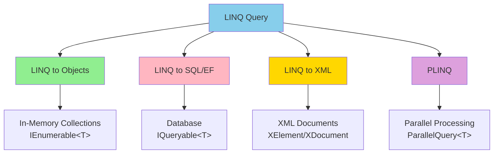

```csharp
// 🔰 BEGINNER: Query syntax vs Method syntax

var people = new List<Person>
{
    new Person { Name = "Alice", Age = 25 },
    new Person { Name = "Bob", Age = 17 },
    new Person { Name = "Charlie", Age = 30 }
};

// Query syntax (SQL-like)
var query1 = from person in people
             where person.Age > 18
             orderby person.Name
             select person.Name;

// Method syntax (fluent API) - SAME QUERY
var query2 = people
    .Where(person => person.Age > 18)
    .OrderBy(person => person.Name)
    .Select(person => person.Name);

// Both produce: ["Alice", "Charlie"]

// 🎯 INTERMEDIATE: Complex query
var adultsByAge = from person in people
                  where person.Age >= 18
                  group person by person.Age into ageGroup
                  orderby ageGroup.Key descending
                  select new
                  {
                      Age = ageGroup.Key,
                      Count = ageGroup.Count(),
                      Names = ageGroup.Select(p => p.Name).ToList()
                  };

// Method syntax equivalent
var adultsByAge2 = people
    .Where(person => person.Age >= 18)
    .GroupBy(person => person.Age)
    .OrderByDescending(group => group.Key)
    .Select(group => new
    {
        Age = group.Key,
        Count = group.Count(),
        Names = group.Select(p => p.Name).ToList()
    });
```

### LINQ Provider Architecture

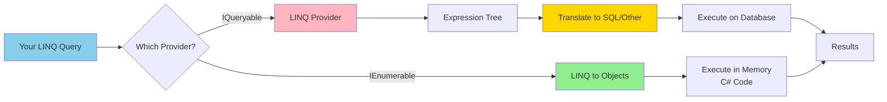

---

## 2. Deferred Execution

### What is Deferred Execution?

**Simple Explanation:** Deferred execution is like a **recipe**. Writing the recipe doesn't cook the food - you only cook when you're ready to eat (enumerate).

### Deferred vs Immediate Execution Diagram

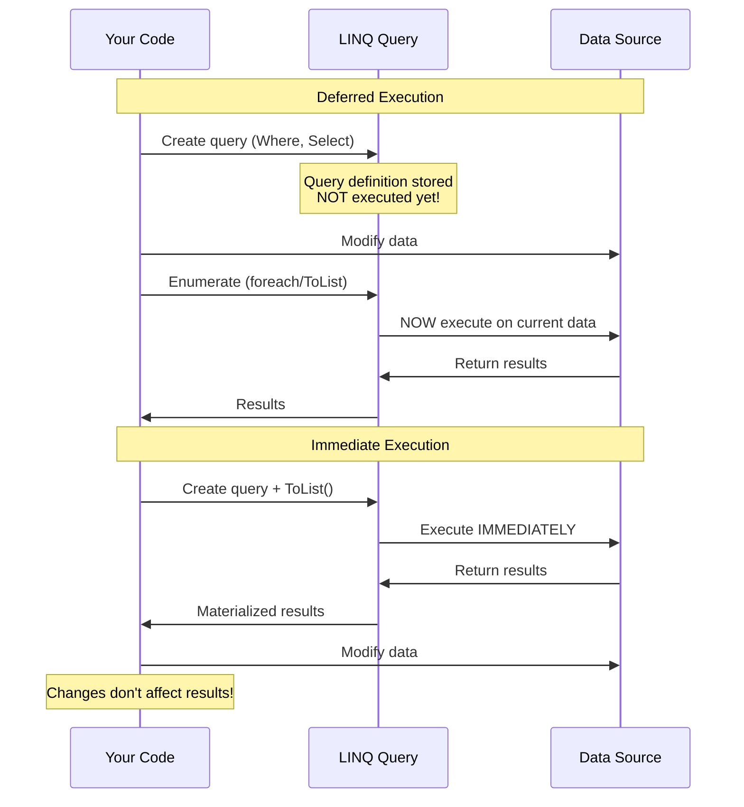

```csharp
// 🔰 BEGINNER: Understanding deferred execution

List<int> numbers = new() { 1, 2, 3, 4, 5 };

// Step 1: Define query (NOT executed)
IEnumerable<int> query = numbers.Where(x => x > 2);
Console.WriteLine("Query defined, not executed yet");

// Step 2: Modify source
numbers.Add(6);
numbers.Add(7);
Console.WriteLine("Added 6 and 7 to numbers");

// Step 3: Execute query (NOW it runs!)
foreach (int n in query)
{
    Console.WriteLine(n); // 3, 4, 5, 6, 7 (includes new numbers!)
}

// 🎯 INTERMEDIATE: Immediate execution
List<int> numbers2 = new() { 1, 2, 3, 4, 5 };

// .ToList() forces immediate execution
List<int> result = numbers2.Where(x => x > 2).ToList();
Console.WriteLine($"Immediate result count: {result.Count}"); // 3

// Modifying source doesn't affect result
numbers2.Add(6);
numbers2.Add(7);
Console.WriteLine($"Result count after adding: {result.Count}"); // Still 3!

// 🚀 ADVANCED: Multiple enumeration = multiple execution
var expensiveQuery = numbers
    .Where(x =>
    {
        Console.WriteLine($"Checking {x}"); // Side effect to show execution
        return x > 2;
    });

Console.WriteLine("First enumeration:");
foreach (int n in expensiveQuery) { /* ... */ }

Console.WriteLine("Second enumeration:");
foreach (int n in expensiveQuery) { /* ... */ }
// "Checking X" prints TWICE - query executed twice!

// To avoid re-execution, materialize once
var materialized = expensiveQuery.ToList();
Console.WriteLine("Third enumeration (materialized):");
foreach (int n in materialized) { /* ... */ }
// No "Checking X" - already executed!
```

### Query Re-execution Behavior

```csharp
// 🔰 BEGINNER: Query sees live data

List<int> numbers = new() { 1, 2, 3 };
var query = numbers.Where(x => x > 1);

// First execution
Console.WriteLine("First execution:");
foreach (int n in query)
{
    Console.WriteLine(n); // 2, 3
}

// Modify data
numbers.Add(4);
numbers.Add(5);
numbers.Remove(1);

// Second execution - reflects current state!
Console.WriteLine("Second execution:");
foreach (int n in query)
{
    Console.WriteLine(n); // 2, 3, 4, 5
}

// 🎯 INTERMEDIATE: Be careful with side effects!
int executionCount = 0;

var queryWithSideEffect = numbers.Where(x =>
{
    executionCount++; // Side effect!
    return x > 2;
});

var result1 = queryWithSideEffect.ToList(); // executionCount increases
var result2 = queryWithSideEffect.ToList(); // executionCount increases AGAIN!

Console.WriteLine($"Query executed {executionCount} times");
```

### Deferred vs Immediate Operators

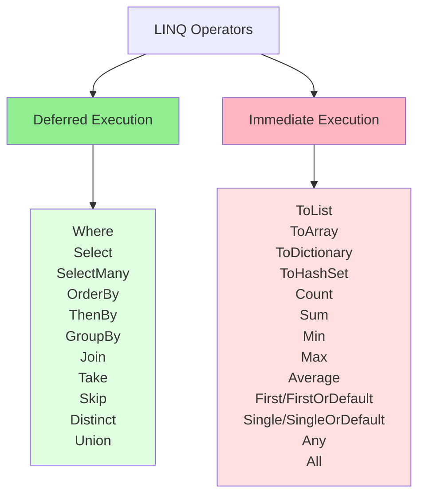

```csharp
// 🎯 INTERMEDIATE: Categorizing operators

var numbers = Enumerable.Range(1, 10);

// DEFERRED - returns IEnumerable, doesn't execute
var deferred1 = numbers.Where(x => x > 5);          // IEnumerable<int>
var deferred2 = numbers.Select(x => x * 2);         // IEnumerable<int>
var deferred3 = numbers.OrderBy(x => x);            // IOrderedEnumerable<int>
var deferred4 = numbers.Take(5);                    // IEnumerable<int>
var deferred5 = numbers.Skip(3);                    // IEnumerable<int>
var deferred6 = numbers.GroupBy(x => x % 2);        // IEnumerable<IGrouping<int, int>>

// IMMEDIATE - executes query and returns concrete result
List<int> immediate1 = numbers.Where(x => x > 5).ToList();      // List<int>
int[] immediate2 = numbers.Select(x => x * 2).ToArray();        // int[]
Dictionary<int, int> immediate3 = numbers.ToDictionary(x => x); // Dictionary
int immediate4 = numbers.Count(x => x > 5);                     // int
int immediate5 = numbers.Sum();                                 // int
int immediate6 = numbers.First(x => x > 5);                     // int
bool immediate7 = numbers.Any(x => x > 5);                      // bool

// 🚀 ADVANCED: Mixing deferred and immediate
var mixed = numbers
    .Where(x => x > 3)      // Deferred
    .Select(x => x * 2)     // Deferred
    .Take(5)                // Deferred
    .ToList();              // IMMEDIATE - triggers execution of entire chain

// Only the final .ToList() causes execution of Where -> Select -> Take
```

---

## 3. IEnumerable<T> vs IQueryable<T>

### The Critical Difference

**Simple Analogy:**

- **IEnumerable:** Like downloading an entire movie file, then searching through it on your computer
- **IQueryable:** Like asking Netflix to find the movie for you on their server

### Execution Location Diagram

```mermaid
graph TB
    subgraph "IEnumerable - Client Side"
        A1[Database] -->|SELECT * FROM Persons<br/>ALL DATA| A2[Application Memory]
        A2 -->|Filter in C#| A3[Where Age > 18]
        A3 --> A4[Result]
    end

    subgraph "IQueryable - Server Side"
        B1[Database] -->|Translate LINQ to SQL| B2[SQL Query Builder]
        B2 -->|SELECT * FROM Persons<br/>WHERE Age > 18| B3[Filtered at Database]
        B3 -->|Only matching data| B4[Result]
    end

    style A2 fill:#FF6347
    style A3 fill:#FF6347
    style B2 fill:#90EE90
    style B3 fill:#90EE90
```

### IEnumerable<T> - In-Memory Queries

```csharp
// Interface definition
public interface IEnumerable<T> : IEnumerable
{
    IEnumerator<T> GetEnumerator();
}

// 🔰 BEGINNER: IEnumerable example
List<Person> people = new()
{
    new Person { Name = "Alice", Age = 25 },
    new Person { Name = "Bob", Age = 17 },
    new Person { Name = "Charlie", Age = 30 }
};

// IEnumerable - in-memory collection
IEnumerable<Person> adults = people.Where(p => p.Age > 18);

// Where parameter is Func<Person, bool>
// Executes in C# code, iterates through collection

foreach (var person in adults)
{
    Console.WriteLine(person.Name); // Alice, Charlie
}

// 🎯 INTERMEDIATE: How IEnumerable works
public static IEnumerable<T> MyWhere<T>(this IEnumerable<T> source, Func<T, bool> predicate)
{
    foreach (T item in source)  // Iterates in memory
    {
        if (predicate(item))    // Evaluates in C#
        {
            yield return item;
        }
    }
}
```

### IQueryable<T> - Database Queries

```csharp
// Interface definition
public interface IQueryable<T> : IEnumerable<T>, IQueryable
{
    Type ElementType { get; }           // Type of elements
    Expression Expression { get; }      // Expression tree
    IQueryProvider Provider { get; }    // Query provider (translates to SQL)
}

// 🔰 BEGINNER: IQueryable example (Entity Framework)
using (var dbContext = new AppDbContext())
{
    // IQueryable - NOT loaded yet!
    IQueryable<Person> people = dbContext.Persons;

    // Build query - still not executed
    IQueryable<Person> adults = people.Where(p => p.Age > 18);

    // Where parameter is Expression<Func<Person, bool>>
    // Translated to SQL: SELECT * FROM Persons WHERE Age > 18

    // Execute query when enumerated
    foreach (var person in adults)
    {
        Console.WriteLine(person.Name);
    }
}

// 🎯 INTERMEDIATE: Expression tree inspection
IQueryable<Person> query = dbContext.Persons.Where(p => p.Age > 18);

// The expression tree
Console.WriteLine(query.Expression.ToString());
// Output: dbContext.Persons.Where(p => (p.Age > 18))

// Translated to SQL by provider
// SQL: SELECT * FROM Persons WHERE Age > 18
```

### Side-by-Side Comparison

| Feature              | IEnumerable<T>             | IQueryable<T>                       |
| -------------------- | -------------------------- | ----------------------------------- |
| **Execution**        | Client-side (in C#)        | Server-side (database)              |
| **Predicate Type**   | `Func<T, bool>`            | `Expression<Func<T, bool>>`         |
| **Best For**         | In-memory collections      | Database queries                    |
| **Namespace**        | System.Collections.Generic | System.Linq                         |
| **Base Interface**   | None                       | IEnumerable<T>                      |
| **Performance**      | Loads all data first       | Filters at source                   |
| **Custom Operators** | Can use any C# code        | Limited to translatable expressions |

### Practical Examples

```csharp
// 🔰 BEGINNER: Performance difference

// ❌ BAD: IEnumerable with database (loads everything!)
IEnumerable<Person> allPeople = dbContext.Persons.AsEnumerable();
var adults = allPeople.Where(p => p.Age > 18);
// SQL: SELECT * FROM Persons (1,000,000 records!)
// Then filters 950,000 records in C#

// ✅ GOOD: IQueryable with database
IQueryable<Person> query = dbContext.Persons;
var adults = query.Where(p => p.Age > 18);
// SQL: SELECT * FROM Persons WHERE Age > 18 (50,000 records)

// 🎯 INTERMEDIATE: When to use which

// Use IEnumerable for in-memory collections
List<int> numbers = new() { 1, 2, 3, 4, 5 };
var evens = numbers.Where(n => n % 2 == 0); // ✅ IEnumerable

// Use IQueryable for database queries
var activeUsers = dbContext.Users
    .Where(u => u.IsActive)
    .OrderBy(u => u.LastLoginDate); // ✅ IQueryable

// ⚠️ Mixing them - BE CAREFUL!
var query = dbContext.Persons
    .Where(p => p.Age > 18)     // IQueryable - translated to SQL ✅
    .AsEnumerable()              // Convert to IEnumerable - loads data
    .Where(p => p.Name.Length > 5); // IEnumerable - filters in memory ❌

// Better: Keep it IQueryable
var betterQuery = dbContext.Persons
    .Where(p => p.Age > 18 && p.Name.Length > 5); // All in SQL ✅

// 🚀 ADVANCED: IQueryable limitations
var query1 = dbContext.Persons
    .Where(p => p.Age > GetMinimumAge()); // ❌ Can't translate method call!

// Solution 1: Evaluate first
int minAge = GetMinimumAge();
var query2 = dbContext.Persons
    .Where(p => p.Age > minAge); // ✅ Works - minAge is a constant

// Solution 2: Use AsEnumerable when you need C# methods
var query3 = dbContext.Persons
    .AsEnumerable()
    .Where(p => IsValidPerson(p)); // ✅ Works, but loads all data first
```

### Expression Tree Visualization

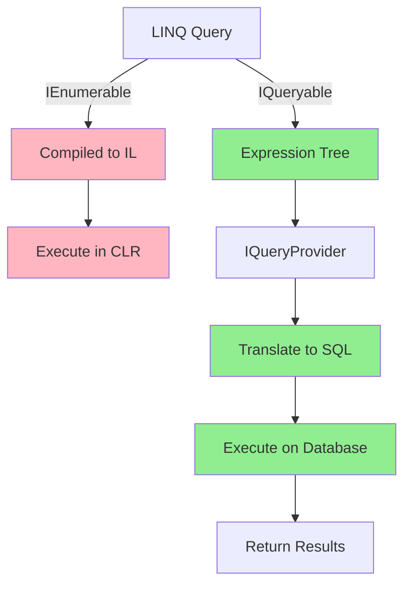

```csharp
// 🚀 ADVANCED: Understanding expression trees

// IEnumerable - compiled to executable code
Func<int, bool> func = x => x > 5;
bool result1 = func(10); // Executes directly

// IQueryable - builds expression tree
Expression<Func<int, bool>> expr = x => x > 5;
// expr is NOT executable - it's a data structure representing the expression

// Inspect the expression tree
Console.WriteLine(expr.Body);    // (x > 5)
Console.WriteLine(expr.Parameters[0].Name); // "x"

// Can be compiled to delegate
Func<int, bool> compiled = expr.Compile();
bool result2 = compiled(10); // Now executable

// This is what EF does:
// 1. Takes Expression<Func<T, bool>>
// 2. Analyzes the expression tree
// 3. Translates to SQL
// 4. Executes on database
```

### Common Pitfalls

```csharp
// 🎯 INTERMEDIATE: Common mistakes

// Pitfall 1: Accidental AsEnumerable
var bad = dbContext.Orders
    .AsEnumerable()  // ⚠️ Loads ALL orders into memory
    .Where(o => o.Total > 1000)
    .ToList();

// Fix: Remove AsEnumerable
var good = dbContext.Orders
    .Where(o => o.Total > 1000)  // Filtered at database
    .ToList();

// Pitfall 2: Using non-translatable methods
var bad2 = dbContext.Products
    .Where(p => p.Name.MyCustomMethod()); // ❌ Can't translate

// Fix: Load first, then filter
var good2 = dbContext.Products
    .ToList()  // Load all products
    .Where(p => p.Name.MyCustomMethod()); // Filter in memory

// Or better: Use translatable expressions
var good3 = dbContext.Products
    .Where(p => p.Name.StartsWith("A")); // ✅ Translatable

// Pitfall 3: Multiple enumeration of IQueryable
IQueryable<Person> query = dbContext.Persons.Where(p => p.Age > 18);

int count = query.Count();        // Database hit 1
var list = query.ToList();        // Database hit 2
var first = query.FirstOrDefault(); // Database hit 3 ⚠️

// Fix: Materialize once
var list = query.ToList();
int count = list.Count;           // In memory
var first = list.FirstOrDefault(); // In memory
```

// ✅ GOOD: Keep IQueryable until the end
var query = dbContext.Persons // IQueryable
.Where(p => p.Age > 18) // Still IQueryable
.OrderBy(p => p.Name) // Still IQueryable
.ToList(); // Executes query, returns List<Person>

````

---

## 4. Standard Query Operators

### LINQ Operators Overview

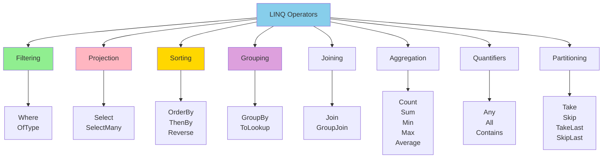

### Filtering Operators

**Simple Explanation:** Filtering is like using a **sieve** - only items matching your condition pass through.

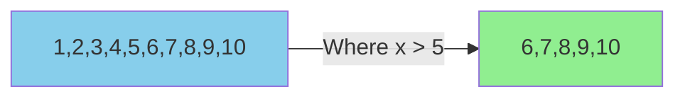

```csharp
// 🔰 BEGINNER: Where - filter elements
var people = GetPeople();
var adults = people.Where(p => p.Age >= 18);
var adults2 = people.Where(p => p.Age >= 18 && p.IsActive);

// Multiple conditions
var filtered = people
    .Where(p => p.Age >= 18)
    .Where(p => p.City == "Seattle")
    .Where(p => p.Salary > 50000);

// 🎯 INTERMEDIATE: OfType - filter by type
object[] mixed = { 1, "hello", 2, "world", 3, 4.5, true };
var integers = mixed.OfType<int>();    // { 1, 2, 3 }
var strings = mixed.OfType<string>();  // { "hello", "world" }
var doubles = mixed.OfType<double>();  // { 4.5 }

// Useful for heterogeneous collections
List<Animal> animals = new()
{
    new Dog { Name = "Buddy" },
    new Cat { Name = "Whiskers" },
    new Dog { Name = "Max" }
};

var dogs = animals.OfType<Dog>(); // Only dogs

// 🚀 ADVANCED: Where with index
var itemsWithIndex = people
    .Select((person, index) => new { person, index })
    .Where(x => x.index % 2 == 0) // Even indices
    .Select(x => x.person);
````

### Projection Operators

**Simple Explanation:** Projection is like a **factory assembly line** - transform each item into a new shape.

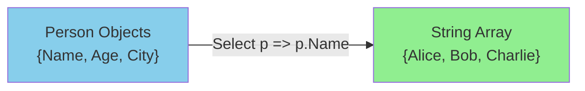

```csharp
// 🔰 BEGINNER: Select - transform elements
var people = GetPeople();
var names = people.Select(p => p.Name);
var ages = people.Select(p => p.Age);

// Project to anonymous type
var summary = people.Select(p => new
{
    p.Name,
    p.Age,
    IsAdult = p.Age >= 18
});

// 🎯 INTERMEDIATE: SelectMany - flatten nested collections
class Person
{
    public string Name { get; set; }
    public List<string> PhoneNumbers { get; set; }
    public List<Address> Addresses { get; set; }
}

List<Person> people = new()
{
    new() { Name = "Alice", PhoneNumbers = new() { "111", "222" } },
    new() { Name = "Bob", PhoneNumbers = new() { "333" } },
    new() { Name = "Charlie", PhoneNumbers = new() { "444", "555", "666" } }
};

// Select returns List<List<string>> (nested)
var nestedPhones = people.Select(p => p.PhoneNumbers);
// Result: { {"111", "222"}, {"333"}, {"444", "555", "666"} }

// SelectMany flattens to List<string>
var allPhones = people.SelectMany(p => p.PhoneNumbers);
// Result: { "111", "222", "333", "444", "555", "666" }

// 🚀 ADVANCED: SelectMany with result selector
var phoneOwners = people.SelectMany(
    person => person.PhoneNumbers,
    (person, phone) => new { person.Name, Phone = phone }
);
// Result: { {Name: "Alice", Phone: "111"}, {Name: "Alice", Phone: "222"}, ... }

// SelectMany with index
var indexed = people.SelectMany((person, index) =>
    person.PhoneNumbers.Select(phone => new
    {
        PersonIndex = index,
        person.Name,
        Phone = phone
    })
);
```

### SelectMany Visualization

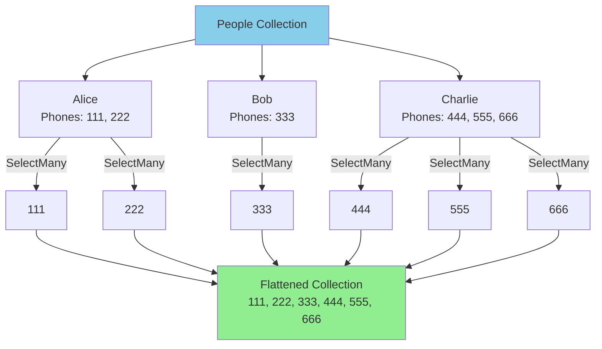

### Sorting Operators

```csharp
// 🔰 BEGINNER: OrderBy, OrderByDescending
var people = GetPeople();
var byAge = people.OrderBy(p => p.Age);
var byAgeDesc = people.OrderByDescending(p => p.Age);

// 🎯 INTERMEDIATE: ThenBy - secondary sort
var sorted = people
    .OrderBy(p => p.City)         // Primary: by city
    .ThenBy(p => p.LastName)      // Secondary: by last name
    .ThenBy(p => p.FirstName);    // Tertiary: by first name

var multiSort = people
    .OrderByDescending(p => p.IsActive)  // Active first
    .ThenBy(p => p.Department)           // Then by department
    .ThenByDescending(p => p.Salary);    // Then by salary (high to low)

// Reverse
var reversed = people.Reverse();

// 🚀 ADVANCED: Custom comparer
var customSort = people.OrderBy(p => p.Name, StringComparer.OrdinalIgnoreCase);

// Case-insensitive sort
var names = new[] { "alice", "Bob", "CHARLIE", "dave" };
var sorted1 = names.OrderBy(n => n); // alice, Bob, CHARLIE, dave (case-sensitive)
var sorted2 = names.OrderBy(n => n, StringComparer.OrdinalIgnoreCase); // alice, Bob, CHARLIE, dave
```

### Grouping Operators

**Simple Explanation:** Grouping is like **sorting laundry** - separate items into piles based on a category.

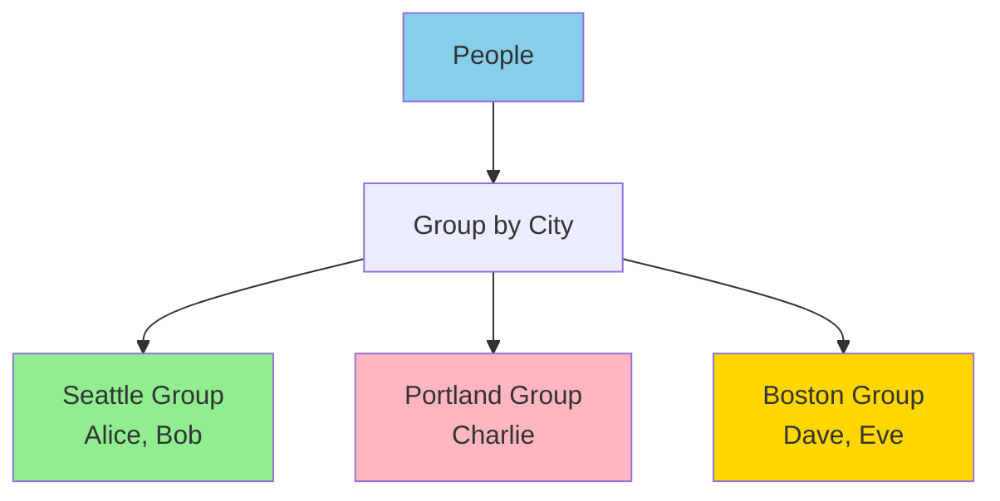

```csharp
// 🔰 BEGINNER: GroupBy - group by key
var people = GetPeople();
var byCity = people.GroupBy(p => p.City);

foreach (var group in byCity)
{
    Console.WriteLine($"City: {group.Key}, Count: {group.Count()}");
    foreach (var person in group)
    {
        Console.WriteLine($"  {person.Name}");
    }
}
// Output:
// City: Seattle, Count: 2
//   Alice
//   Bob
// City: Portland, Count: 1
//   Charlie

// 🎯 INTERMEDIATE: GroupBy with result selector
var citySummary = people.GroupBy(
    p => p.City,
    (city, persons) => new
    {
        City = city,
        Count = persons.Count(),
        AverageAge = persons.Average(p => p.Age),
        Names = string.Join(", ", persons.Select(p => p.Name))
    }
);

// GroupBy with element selector
var cityNames = people.GroupBy(
    p => p.City,           // Key selector
    p => p.Name            // Element selector (only Name in groups)
);

// 🚀 ADVANCED: ToLookup - like GroupBy but immediate execution
var lookup = people.ToLookup(p => p.City);

// Lookup is like Dictionary<TKey, IEnumerable<TElement>>
var seattlePeople = lookup["Seattle"];  // O(1) lookup
var portlandPeople = lookup["Portland"];

// Multiple key grouping
var multiGroup = people.GroupBy(p => new { p.City, p.Department });

foreach (var group in multiGroup)
{
    Console.WriteLine($"City: {group.Key.City}, Dept: {group.Key.Department}");
}
```

### Joining

```csharp
class Person { public int Id { get; set; } public string Name { get; set; } }
class Order { public int PersonId { get; set; } public string Product { get; set; } }

List<Person> people = new()
{
    new() { Id = 1, Name = "Alice" },
    new() { Id = 2, Name = "Bob" }
};

List<Order> orders = new()
{
    new() { PersonId = 1, Product = "Laptop" },
    new() { PersonId = 1, Product = "Mouse" },
    new() { PersonId = 2, Product = "Keyboard" }
};

// Inner join
var query = people.Join(
    orders,
    person => person.Id,
    order => order.PersonId,
    (person, order) => new { person.Name, order.Product }
);
// Result: { Alice, Laptop }, { Alice, Mouse }, { Bob, Keyboard }

// Group join (left join)
var groupJoin = people.GroupJoin(
    orders,
    person => person.Id,
    order => order.PersonId,
    (person, personOrders) => new
    {
        Person = person.Name,
        Orders = personOrders.Select(o => o.Product).ToList()
    }
);
```

### Set Operations

```csharp
int[] numbers1 = { 1, 2, 3, 4, 5 };
int[] numbers2 = { 3, 4, 5, 6, 7 };

// Union - all unique elements
var union = numbers1.Union(numbers2); // 1,2,3,4,5,6,7

// Intersect - common elements
var intersect = numbers1.Intersect(numbers2); // 3,4,5

// Except - elements in first but not second
var except = numbers1.Except(numbers2); // 1,2

// Distinct - remove duplicates
int[] duplicates = { 1, 2, 2, 3, 3, 3 };
var unique = duplicates.Distinct(); // 1,2,3

// DistinctBy (C# 10+)
var distinctPeople = people.DistinctBy(p => p.Name);
```

### Aggregation

```csharp
int[] numbers = { 1, 2, 3, 4, 5 };

// Count, Sum, Average, Min, Max
int count = numbers.Count(); // 5
int sum = numbers.Sum(); // 15
double avg = numbers.Average(); // 3.0
int min = numbers.Min(); // 1
int max = numbers.Max(); // 5

// Aggregate - custom aggregation
int product = numbers.Aggregate((a, b) => a * b); // 120
string text = new[] { "Hello", "World" }.Aggregate((a, b) => a + " " + b);

// Aggregate with seed
int sumFrom10 = numbers.Aggregate(10, (acc, n) => acc + n); // 25
```

### Quantifiers

```csharp
int[] numbers = { 1, 2, 3, 4, 5 };

// Any - at least one matches
bool hasEven = numbers.Any(n => n % 2 == 0); // true

// All - all match
bool allPositive = numbers.All(n => n > 0); // true

// Contains
bool hasThree = numbers.Contains(3); // true
```

### Element Operators

```csharp
int[] numbers = { 1, 2, 3, 4, 5 };

// First - first element (exception if empty)
int first = numbers.First(); // 1
int firstEven = numbers.First(n => n % 2 == 0); // 2

// FirstOrDefault - first or default (no exception)
int firstOrDefault = numbers.FirstOrDefault(n => n > 10); // 0 (default)

// Single - exactly one element (exception if 0 or >1)
int[] single = { 42 };
int value = single.Single(); // 42

// SingleOrDefault - exactly one or default
int singleOrDefault = numbers.SingleOrDefault(n => n > 10); // 0

// Last, LastOrDefault
int last = numbers.Last(); // 5

// ElementAt, ElementAtOrDefault
int third = numbers.ElementAt(2); // 3
```

---

## 5. Query Syntax vs Method Syntax

### Query Syntax

```csharp
var query = from person in people
            where person.Age > 18
            orderby person.Name
            select new { person.Name, person.Age };
```

### Method Syntax (Equivalent)

```csharp
var query = people
    .Where(person => person.Age > 18)
    .OrderBy(person => person.Name)
    .Select(person => new { person.Name, person.Age });
```

### Complex Query Comparison

```csharp
// Query syntax
var query1 = from person in people
             join order in orders on person.Id equals order.PersonId
             where order.Amount > 100
             group order by person.Name into personOrders
             select new
             {
                 Name = personOrders.Key,
                 TotalAmount = personOrders.Sum(o => o.Amount)
             };

// Method syntax
var query2 = people
    .Join(orders,
          person => person.Id,
          order => order.PersonId,
          (person, order) => new { person, order })
    .Where(x => x.order.Amount > 100)
    .GroupBy(x => x.person.Name)
    .Select(g => new
    {
        Name = g.Key,
        TotalAmount = g.Sum(x => x.order.Amount)
    });
```

### When to Use Each

- **Query syntax:** Complex joins and grouping (more readable)
- **Method syntax:** Simple queries, chaining, better IntelliSense

---

## 6. Custom LINQ Operators

### Extension Methods

```csharp
public static class LinqExtensions
{
    // ForEach operator
    public static void ForEach<T>(this IEnumerable<T> source, Action<T> action)
    {
        foreach (T item in source)
        {
            action(item);
        }
    }

    // Batch operator - split into batches
    public static IEnumerable<IEnumerable<T>> Batch<T>(
        this IEnumerable<T> source, int size)
    {
        T[] batch = null;
        int count = 0;

        foreach (T item in source)
        {
            if (batch == null)
                batch = new T[size];

            batch[count++] = item;

            if (count == size)
            {
                yield return batch;
                batch = null;
                count = 0;
            }
        }

        if (batch != null && count > 0)
            yield return batch.Take(count);
    }

    // WhereNot - inverse of Where
    public static IEnumerable<T> WhereNot<T>(
        this IEnumerable<T> source, Func<T, bool> predicate)
    {
        return source.Where(x => !predicate(x));
    }

    // TakeUntil - take until condition met
    public static IEnumerable<T> TakeUntil<T>(
        this IEnumerable<T> source, Func<T, bool> predicate)
    {
        foreach (T item in source)
        {
            yield return item;
            if (predicate(item))
                break;
        }
    }

    // MaxBy - C# 6+ version
    public static T MaxBy<T, TKey>(
        this IEnumerable<T> source,
        Func<T, TKey> selector) where TKey : IComparable<TKey>
    {
        return source.OrderByDescending(selector).First();
    }
}

// Usage
numbers.ForEach(n => Console.WriteLine(n));
var batches = numbers.Batch(10);
var filtered = numbers.WhereNot(n => n % 2 == 0);
```

---

## 7. Performance Optimization

### Avoid Multiple Enumeration

```csharp
// ❌ BAD - Multiple enumeration
var query = people.Where(p => p.Age > 18);
int count = query.Count(); // Enumerates
var list = query.ToList(); // Enumerates again!

// ✅ GOOD - Single enumeration
var list = people.Where(p => p.Age > 18).ToList();
int count = list.Count;
```

### Avoid Unnecessary ToList()

```csharp
// ❌ BAD - Unnecessary materialization
var adults = people.Where(p => p.Age > 18).ToList();
var names = adults.Select(p => p.Name).ToList();
var sorted = names.OrderBy(n => n).ToList();

// ✅ GOOD - Defer until needed
var sorted = people
    .Where(p => p.Age > 18)
    .Select(p => p.Name)
    .OrderBy(n => n)
    .ToList(); // Materialize once at the end
```

### Use Any() instead of Count()

```csharp
// ❌ BAD - Enumerates entire sequence
if (people.Where(p => p.Age > 18).Count() > 0)
{
    // ...
}

// ✅ GOOD - Stops at first match
if (people.Any(p => p.Age > 18))
{
    // ...
}
```

### Use FirstOrDefault() instead of Where().FirstOrDefault()

```csharp
// ❌ BAD - Creates intermediate collection
var person = people.Where(p => p.Id == 123).FirstOrDefault();

// ✅ GOOD - Stops at first match
var person = people.FirstOrDefault(p => p.Id == 123);
```

### Avoid Closures in LINQ

```csharp
// ❌ BAD - Closure created for each iteration
for (int i = 0; i < 10; i++)
{
    var query = numbers.Where(n => n > i); // Captures 'i'
}

// ✅ GOOD - Extract predicate outside loop
Func<int, int, bool> greaterThan = (n, threshold) => n > threshold;
for (int i = 0; i < 10; i++)
{
    int threshold = i;
    var query = numbers.Where(n => greaterThan(n, threshold));
}
```

### Parallel LINQ (PLINQ)

```csharp
// Sequential
var result = numbers
    .Where(n => IsExpensiveCheck(n))
    .Select(n => ExpensiveTransform(n))
    .ToList();

// Parallel
var result = numbers
    .AsParallel()
    .Where(n => IsExpensiveCheck(n))
    .Select(n => ExpensiveTransform(n))
    .ToList();

// Control parallelism
var result = numbers
    .AsParallel()
    .WithDegreeOfParallelism(4) // Max 4 threads
    .WithExecutionMode(ParallelExecutionMode.ForceParallelism)
    .Where(n => IsExpensiveCheck(n))
    .ToList();

// Preserve order
var result = numbers
    .AsParallel()
    .AsOrdered() // Maintain order (slower)
    .Select(n => ExpensiveTransform(n))
    .ToList();
```

---

## 8. Common Pitfalls

### Pitfall 1: Modifying Collection During Enumeration

```csharp
// ❌ THROWS InvalidOperationException
List<int> numbers = new() { 1, 2, 3, 4, 5 };
foreach (int n in numbers)
{
    if (n % 2 == 0)
        numbers.Remove(n); // Exception!
}

// ✅ FIX - Create new list
numbers = numbers.Where(n => n % 2 != 0).ToList();

// ✅ FIX - Use ToList() to snapshot
foreach (int n in numbers.ToList())
{
    if (n % 2 == 0)
        numbers.Remove(n);
}
```

### Pitfall 2: Null Reference in Query

```csharp
// ❌ Potential NullReferenceException
var names = people.Select(p => p.Address.City);

// ✅ FIX - Null-conditional operator
var names = people.Select(p => p.Address?.City);

// ✅ FIX - Where clause
var names = people
    .Where(p => p.Address != null)
    .Select(p => p.Address.City);
```

### Pitfall 3: Mixing IQueryable and IEnumerable

```csharp
// ❌ BAD - Loads all data before filtering
var query = dbContext.Persons
    .AsEnumerable() // Converts to IEnumerable - executes query!
    .Where(p => p.Age > 18); // Filters in memory

// ✅ GOOD - Keep IQueryable
var query = dbContext.Persons
    .Where(p => p.Age > 18) // Translated to SQL
    .AsEnumerable(); // Convert only at the end if needed
```

---

## 9. Interview Questions

### Q1: What is deferred execution?

**Answer:** Query is not executed when defined, but when enumerated (foreach, ToList, Count, etc.). Allows query to see latest data and enables query composition. Exception: Aggregation methods execute immediately.

### Q2: Difference between IEnumerable and IQueryable?

**Answer:**

- **IEnumerable<T>:** LINQ to Objects, Func delegates, executes in memory (client-side)
- **IQueryable<T>:** LINQ to SQL/EF, Expression trees, translates to SQL (server-side)

### Q3: Why use Any() instead of Count() > 0?

**Answer:** Any() stops enumeration at first match (O(1) best case). Count() enumerates entire sequence (O(n) always). For large collections or database queries, Any() is much more efficient.

### Q4: When does a LINQ query execute?

**Answer:**

- **Deferred operators:** When enumerated (Where, Select, OrderBy, GroupBy)
- **Immediate operators:** Immediately (ToList, ToArray, Count, First, Single, Sum)

### Q5: How to optimize LINQ queries?

**Answer:**

- Avoid multiple enumeration (materialize once with ToList())
- Use Any() instead of Count() > 0
- Use FirstOrDefault() with predicate instead of Where().First()
- Keep IQueryable as long as possible for database queries
- Use AsParallel() for CPU-intensive operations on large collections

---

## 10. Practical Exercises

### Exercise 1: Build a Query Builder

Create a fluent API for building dynamic queries with multiple optional filters.

### Exercise 2: Implement Custom LINQ Operators

- DistinctBy (pre-C# 10)
- MaxBy / MinBy (pre-C# 9)
- Batch
- Window (sliding window)

### Exercise 3: Optimize a Slow Query

Given inefficient LINQ code, identify and fix performance issues.

### Exercise 4: PLINQ Performance Analysis

Compare sequential vs parallel LINQ for different scenarios and measure speedup.

---

## 11. Key Takeaways

✅ **Deferred execution** delays query until enumeration
✅ **IQueryable** translates to SQL; **IEnumerable** executes in memory
✅ **Avoid multiple enumeration** - materialize once when needed
✅ **Use Any() over Count()** for existence checks
✅ **Custom operators** extend LINQ with extension methods
✅ **PLINQ** parallelizes operations but has overhead
✅ **Keep IQueryable** until the end for database queries

---

## Tomorrow's Preview

**Day 5: Generics & Constraints**

- Generic type parameters and constraints
- Covariance and contravariance
- Generic methods vs generic types
- Performance benefits
- Common generic patterns

---

**LINQ is powerful - master it for elegant, efficient code!** 💪
