# Day 5: Generics & Constraints

## 🎯 Learning Objectives

- Master generic type parameters and constraints
- Understand covariance and contravariance
- Learn generic methods vs generic types
- Explore performance benefits of generics
- Study common generic patterns

---

## 1. Generic Fundamentals

### Why Generics?

**Simple Analogy:** Generics are like **reusable molds** - one mold design that works for different materials (plastic, metal, chocolate).

### Before vs After Generics


```csharp
// 🔰 BEGINNER: Before generics (C# 1.0)

// ❌ ArrayList - requires boxing and casting
ArrayList oldList = new ArrayList();
oldList.Add(1);        // Boxing: int -> object (heap allocation!)
oldList.Add("hello");  // ❌ Type safety issue - accepts anything!
oldList.Add(3.14);     // Also accepted

// Runtime error risk
int value = (int)oldList[0];      // Unboxing and casting
string text = (string)oldList[1]; // OK
// int wrong = (int)oldList[2];   // ❌ InvalidCastException at runtime!

// 🎯 INTERMEDIATE: With generics (C# 2.0+)

// ✅ List<T> - type-safe, no boxing
List<int> numbers = new List<int>();
numbers.Add(1);           // ✅ No boxing
numbers.Add(2);           // ✅ No boxing
// numbers.Add("hello");  // ❌ Compile error - type safe!

int value2 = numbers[0];  // ✅ No casting needed

// 🚀 ADVANCED: Performance comparison
// Old way: 1,000,000 items
ArrayList oldWay = new ArrayList();
for (int i = 0; i < 1000000; i++)
{
    oldWay.Add(i); // Boxing: 1,000,000 heap allocations!
}

// New way: 1,000,000 items
List<int> newWay = new List<int>();
for (int i = 0; i < 1000000; i++)
{
    newWay.Add(i); // No boxing: 0 extra allocations!
}
// Generic version is ~10x faster!
```

### Generic Type Instantiation


### Generic Classes

```csharp
// 🔰 BEGINNER: Generic class with one type parameter
public class Container<T>
{
    private T value;

    public Container(T value)
    {
        this.value = value;
    }

    public T GetValue() => value;
    public void SetValue(T newValue) => value = newValue;
}

// Usage with different types
Container<int> intContainer = new Container<int>(42);
Console.WriteLine(intContainer.GetValue()); // 42

Container<string> stringContainer = new Container<string>("Hello");
Console.WriteLine(stringContainer.GetValue()); // "Hello"

Container<Person> personContainer = new Container<Person>(new Person());

// C# 9.0+ target-typed new (type inferred from left side)
Container<int> container = new(42);  // Cleaner!

// 🎯 INTERMEDIATE: Generic class with multiple operations
public class Stack<T>
{
    private readonly List<T> items = new();

    public void Push(T item) => items.Add(item);

    public T Pop()
    {
        if (items.Count == 0)
            throw new InvalidOperationException("Stack is empty");

        T item = items[^1];  // C# 8.0 index from end
        items.RemoveAt(items.Count - 1);
        return item;
    }

    public T Peek() => items.Count > 0 ? items[^1] : default(T);
    public int Count => items.Count;
    public bool IsEmpty => items.Count == 0;
}

// Usage
Stack<int> numberStack = new();
numberStack.Push(1);
numberStack.Push(2);
numberStack.Push(3);
Console.WriteLine(numberStack.Pop()); // 3
Console.WriteLine(numberStack.Peek()); // 2

// 🚀 ADVANCED: Generic class with nested generic
public class Result<T>
{
    public bool Success { get; }
    public T Value { get; }
    public string Error { get; }

    private Result(bool success, T value, string error)
    {
        Success = success;
        Value = value;
        Error = error;
    }

    public static Result<T> Ok(T value) => new(true, value, null);
    public static Result<T> Fail(string error) => new(false, default, error);

    public TResult Match<TResult>(
        Func<T, TResult> onSuccess,
        Func<string, TResult> onFailure)
    {
        return Success ? onSuccess(Value) : onFailure(Error);
    }
}

// Usage
Result<int> ParseInt(string input)
{
    if (int.TryParse(input, out int value))
        return Result<int>.Ok(value);
    return Result<int>.Fail("Invalid integer");
}

var result = ParseInt("42");
string message = result.Match(
    value => $"Success: {value}",
    error => $"Error: {error}"
);
```

### Generic Methods

```csharp
// 🔰 BEGINNER: Generic method
public T Max<T>(T a, T b) where T : IComparable<T>
{
    return a.CompareTo(b) > 0 ? a : b;
}

// Type inference - compiler figures out T
int maxInt = Max(5, 10);           // T = int
string maxStr = Max("apple", "banana"); // T = string
double maxDouble = Max(3.14, 2.71);     // T = double

// Explicit type arguments (rarely needed)
int max2 = Max<int>(5, 10);

// 🎯 INTERMEDIATE: Generic method with multiple type parameters
public TResult Convert<TSource, TResult>(TSource source, Func<TSource, TResult> converter)
{
    return converter(source);
}

// Usage
int length = Convert("Hello", s => s.Length);        // string -> int
string text = Convert(42, num => num.ToString());    // int -> string
bool isPositive = Convert(-5, num => num > 0);       // int -> bool

// 🚀 ADVANCED: Generic method with constraint
public void Swap<T>(ref T a, ref T b)
{
    T temp = a;
    a = b;
    b = temp;
}

int x = 5, y = 10;
Swap(ref x, ref y);  // x = 10, y = 5

string s1 = "hello", s2 = "world";
Swap(ref s1, ref s2);  // s1 = "world", s2 = "hello"

// Extension method with generics
public static class Extensions
{
    public static T MaxBy<T, TKey>(this IEnumerable<T> source, Func<T, TKey> keySelector)
        where TKey : IComparable<TKey>
    {
        return source.OrderByDescending(keySelector).First();
    }
}

// Usage
var people = new[]
{
    new { Name = "Alice", Age = 25 },
    new { Name = "Bob", Age = 30 },
    new { Name = "Charlie", Age = 28 }
};

var oldest = people.MaxBy(p => p.Age); // Bob
```

### Multiple Type Parameters


```csharp
// 🔰 BEGINNER: Two type parameters
public class Pair<TFirst, TSecond>
{
    public TFirst First { get; set; }
    public TSecond Second { get; set; }

    public Pair(TFirst first, TSecond second)
    {
        First = first;
        Second = second;
    }

    public override string ToString() => $"({First}, {Second})";
}

// Usage
var numberPair = new Pair<int, string>(1, "One");
var coordinates = new Pair<double, double>(10.5, 20.3);
var keyValue = new Pair<string, object>("Age", 25);

// 🎯 INTERMEDIATE: Dictionary-like structure
public class Dictionary<TKey, TValue>
{
    private List<Pair<TKey, TValue>> items = new();

    public void Add(TKey key, TValue value)
    {
        items.Add(new Pair<TKey, TValue>(key, value));
    }

    public TValue Get(TKey key)
    {
        var pair = items.FirstOrDefault(p => EqualityComparer<TKey>.Default.Equals(p.First, key));
        return pair != null ? pair.Second : default;
    }
}

// 🚀 ADVANCED: Three or more type parameters
public class Triple<T1, T2, T3>
{
    public T1 Item1 { get; set; }
    public T2 Item2 { get; set; }
    public T3 Item3 { get; set; }

    public Triple(T1 item1, T2 item2, T3 item3)
    {
        Item1 = item1;
        Item2 = item2;
        Item3 = item3;
    }
}

// C# has built-in tuples now (better alternative)
var tuple = (Id: 1, Name: "Alice", Age: 25);
Console.WriteLine(tuple.Name);  // Alice
```

---

## 2. Generic Constraints

### What are Constraints?

**Simple Analogy:** Constraints are like **job requirements** - they specify what capabilities the generic type must have.

### Constraint Types Diagram


### Where Clauses

```csharp
// 🔰 BEGINNER: Basic constraints

// Struct constraint - T must be value type
public class ValueContainer<T> where T : struct
{
    private T value;

    public ValueContainer(T value)
    {
        this.value = value;
    }
}

// Valid
ValueContainer<int> intCont = new(42);
ValueContainer<DateTime> dateCont = new(DateTime.Now);
// Invalid: ValueContainer<string> strCont = new("hello"); // ❌ string is reference type

// Class constraint - T must be reference type
public class ReferenceContainer<T> where T : class
{
    private T value;

    public void SetValue(T newValue)
    {
        value = newValue;
        if (value == null)  // Can check for null
        {
            Console.WriteLine("Value is null");
        }
    }
}

// Valid
ReferenceContainer<string> strCont = new();
ReferenceContainer<Person> personCont = new();
// Invalid: ReferenceContainer<int> intCont = new(); // ❌ int is value type

// 🎯 INTERMEDIATE: Constructor constraint
public class Factory<T> where T : new()
{
    public T Create()
    {
        return new T(); // ✅ Requires parameterless constructor
    }

    public List<T> CreateMany(int count)
    {
        return Enumerable.Range(0, count)
            .Select(_ => new T())
            .ToList();
    }
}

// Valid
public class Person
{
    public Person() { } // Has parameterless constructor
    public string Name { get; set; }
}

Factory<Person> factory = new();
Person person = factory.Create();  // ✅ Works

// Invalid
public class Employee
{
    public Employee(string name) { } // No parameterless constructor
}

// Factory<Employee> empFactory = new(); // ❌ Compile error

// Base class constraint
public abstract class Entity
{
    public Guid Id { get; set; }
    public DateTime CreatedAt { get; set; }
}

public class Repository<T> where T : Entity
{
    public void Save(T entity)
    {
        // Can access Entity members
        entity.Id = Guid.NewGuid();
        entity.CreatedAt = DateTime.UtcNow;
        Console.WriteLine($"Saving entity with ID: {entity.Id}");
    }
}

public class Product : Entity
{
    public string Name { get; set; }
    public decimal Price { get; set; }
}

// Usage
Repository<Product> repo = new();
repo.Save(new Product { Name = "Widget", Price = 19.99m });

// 🚀 ADVANCED: Interface constraint
public interface IValidatable
{
    bool IsValid();
}

public class Validator<T> where T : IValidatable
{
    public List<T> GetValid(IEnumerable<T> items)
    {
        return items.Where(item => item.IsValid()).ToList();
    }
}

public class Order : IValidatable
{
    public decimal Total { get; set; }

    public bool IsValid() => Total > 0;
}

// Usage
Validator<Order> validator = new();
var orders = new[]
{
    new Order { Total = 100 },
    new Order { Total = 0 },
    new Order { Total = 50 }
};
var validOrders = validator.GetValid(orders); // Returns 2 orders

// Multiple constraints
public class Manager<T> where T : Entity, IValidatable, new()
{
    public T CreateAndValidate()
    {
        T entity = new T();                // ✅ new() constraint
        entity.Id = Guid.NewGuid();        // ✅ Entity constraint
        entity.CreatedAt = DateTime.UtcNow;

        if (!entity.IsValid())             // ✅ IValidatable constraint
        {
            throw new InvalidOperationException("Entity is not valid");
        }

        return entity;
    }
}
```

### Constraint Resolution Flow

```mermaid
graph TD
    A[Generic Type Parameter T] --> B{Check Constraints}
    B -->|struct| C[Is T a value type?]
    B -->|class| D[Is T a reference type?]
    B -->|new| E[Does T have parameterless constructor?]
    B -->|BaseClass| F[Does T inherit from BaseClass?]
    B -->|IInterface| G[Does T implement IInterface?]

    C -->|Yes| H[✅ Valid]
    C -->|No| I[❌ Compile Error]
    D -->|Yes| H
    D -->|No| I
    E -->|Yes| H
    E -->|No| I
    F -->|Yes| H
    F -->|No| I
    G -->|Yes| H
    G -->|No| I

    style H fill:#90EE90
    style I fill:#FF6347
```



### Constraint Combinations

```csharp
// 🎯 INTERMEDIATE: Multiple type parameters with different constraints
public class Cache<TKey, TValue>
    where TKey : IEquatable<TKey>
    where TValue : class, new()
{
    private Dictionary<TKey, TValue> storage = new();

    public TValue GetOrCreate(TKey key)
    {
        if (storage.TryGetValue(key, out TValue value))
        {
            return value;
        }

        value = new TValue();  // new() constraint
        storage[key] = value;
        return value;
    }
}

// 🚀 ADVANCED: Circular constraint (one type parameter constrains another)
public class Comparer<T, U>
    where T : IComparable<U>
    where U : IComparable<T>
{
    public bool AreEqual(T first, U second)
    {
        return first.CompareTo(second) == 0 && second.CompareTo(first) == 0;
    }
}

// Self-referencing constraint
public interface IEntity<T> where T : IEntity<T>
{
    T Clone();
}

public class Person : IEntity<Person>
{
    public string Name { get; set; }

    public Person Clone()
    {
        return new Person { Name = this.Name };
    }
}
```

### Nullable Reference Type Constraints (C# 8.0+)

```csharp
// 🚀 ADVANCED: Nullable constraints

// Non-nullable reference type
public class Container<T> where T : class
{
    private T value = default!; // Must be assigned

    public T GetValue() => value;  // Never returns null
}

// Nullable reference type
public class NullableContainer<T> where T : class?
{
    private T? value;

    public T? GetValue() => value;  // Can return null
}

// Not-null constraint (C# 9.0+)
public class NotNullContainer<T> where T : notnull
{
    private T value;

    public NotNullContainer(T value)
    {
        this.value = value ?? throw new ArgumentNullException(nameof(value));
    }
}

// Unmanaged constraint (C# 7.3+) - value types with no references
public class BufferWriter<T> where T : unmanaged
{
    public unsafe void Write(T value, byte* buffer)
    {
        *(T*)buffer = value;  // Can use pointer arithmetic
    }
}

// Valid: int, double, float, custom struct with only value type fields
// Invalid: string, object, struct with reference type fields
```

    where TKey : notnull
    where TValue : class, new()

{
private Dictionary<TKey, TValue> cache = new();

    public TValue GetOrCreate(TKey key)
    {
        if (!cache.TryGetValue(key, out TValue value))
        {
            value = new TValue();
            cache[key] = value;
        }
        return value;
    }

}

````

### Unmanaged Constraint (C# 7.3+)

```csharp
// T must be unmanaged type (no references)
public class UnsafeBuffer<T> where T : unmanaged
{
    private T[] buffer;

    public unsafe void ProcessWithPointer()
    {
        fixed (T* ptr = buffer)
        {
            // Can use pointers with unmanaged types
        }
    }
}

// Valid: int, double, structs with only unmanaged fields
UnsafeBuffer<int> intBuffer = new();
UnsafeBuffer<Point> pointBuffer = new(); // If Point has only int fields

// Invalid: string, object, any type with references
// UnsafeBuffer<string> stringBuffer = new(); // Compile error
````

### Notnull Constraint (C# 8.0+)

```csharp
// T must be non-nullable type
public class NotNullContainer<T> where T : notnull
{
    public void Process(T value)
    {
        // value cannot be null
        Console.WriteLine(value.GetHashCode()); // Safe
    }
}
```

---

## 3. Covariance and Contravariance

### What is Variance?

**Simple Analogy:**

- **Covariance (`out`)**: Like reading from a container - you can read a **more specific** type from a **general** container. It's **output-only** (you take items OUT).
- **Contravariance (`in`)**: Like writing to a container - you can write a **less specific** type into a **specific** container. It's **input-only** (you put items IN).

### Variance Visual Explanation


### Variance Flow Diagram

```mermaid
graph LR
    A[Type Hierarchy] --> B[Covariance: out T]
    A --> C[Contravariance: in T]

    B --> B1["Output only<br/>IEnumerable&lt;out T&gt;"]
    B --> B2["Read from collection<br/>Func&lt;out TResult&gt;"]
    B --> B3["Derived → Base<br/>Dog → Animal"]

    C --> C1["Input only<br/>IComparable&lt;in T&gt;"]
    C --> C2["Write to parameter<br/>Action&lt;in T&gt;"]
    C --> C3["Base → Derived<br/>Animal → Dog"]

    B1 --> D["✅ Can return more<br/>specific types"]
    C1 --> E["✅ Can accept more<br/>general types"]

    style A fill:#87CEEB
    style B fill:#90EE90
    style C fill:#FFB6C1
    style D fill:#90EE90
    style E fill:#FFB6C1
```



### Covariance (out keyword)

**Rule:** More derived type can be assigned to less derived type. Type parameter used **only as output/return value**.

```csharp
// 🔰 BEGINNER: Basic covariance

// Class hierarchy
public class Animal
{
    public string Name { get; set; }
}

public class Dog : Animal
{
    public string Breed { get; set; }
}

public class Cat : Animal
{
    public int Lives { get; set; }
}

// Covariant interface - note 'out' keyword
public interface IReadOnlyRepository<out T>
{
    T Get(int id);              // ✅ T in return position (output)
    IEnumerable<T> GetAll();    // ✅ T in return position
    // void Add(T item);        // ❌ ERROR: T in parameter position (input)
}

// Implementations
public class DogRepository : IReadOnlyRepository<Dog>
{
    private List<Dog> dogs = new();

    public Dog Get(int id) => dogs[id];
    public IEnumerable<Dog> GetAll() => dogs;
}

// 🎯 INTERMEDIATE: Covariance in action
IReadOnlyRepository<Dog> dogRepo = new DogRepository();
IReadOnlyRepository<Animal> animalRepo = dogRepo; // ✅ Valid! Covariance

// Why this is safe:
// - Get() returns Dog, which IS-AN Animal ✅
// - Can safely treat returned Dog as Animal
Dog dog = dogRepo.Get(0);           // Returns Dog
Animal animal = animalRepo.Get(0);  // Returns Dog, but typed as Animal ✅

// Real-world example
IEnumerable<Dog> dogs = new List<Dog>
{
    new Dog { Name = "Rex", Breed = "Labrador" },
    new Dog { Name = "Max", Breed = "Beagle" }
};

IEnumerable<Animal> animals = dogs; // ✅ Covariance

foreach (Animal animal in animals)
{
    Console.WriteLine(animal.Name); // Works perfectly
}

// 🚀 ADVANCED: Custom covariant interface
public interface IFactory<out T>
{
    T Create();
    T CreateWithDefaults();
    IEnumerable<T> CreateBatch(int count);
}

public class DogFactory : IFactory<Dog>
{
    public Dog Create() => new Dog { Name = "Buddy" };
    public Dog CreateWithDefaults() => new Dog { Name = "Unknown", Breed = "Mixed" };
    public IEnumerable<Dog> CreateBatch(int count)
        => Enumerable.Range(0, count).Select(_ => Create());
}

// Usage
IFactory<Dog> dogFactory = new DogFactory();
IFactory<Animal> animalFactory = dogFactory; // ✅ Covariance

Animal animal = animalFactory.Create(); // Returns Dog as Animal
```

### Contravariance (in keyword)

**Rule:** Less derived type can be assigned to more derived type. Type parameter used **only as input/parameter**.

```csharp
// 🔰 BEGINNER: Basic contravariance

// Contravariant interface - note 'in' keyword
public interface IWriter<in T>
{
    void Write(T item);         // ✅ T in parameter position (input)
    void WriteMany(IEnumerable<T> items); // ✅ T in parameter position
    // T Read();                // ❌ ERROR: T in return position (output)
}

// Implementation
public class AnimalWriter : IWriter<Animal>
{
    public void Write(Animal animal)
    {
        Console.WriteLine($"Writing animal: {animal.Name}");
    }

    public void WriteMany(IEnumerable<Animal> animals)
    {
        foreach (var animal in animals)
        {
            Write(animal);
        }
    }
}

// 🎯 INTERMEDIATE: Contravariance in action
IWriter<Animal> animalWriter = new AnimalWriter();
IWriter<Dog> dogWriter = animalWriter; // ✅ Valid! Contravariance

// Why this is safe:
// - Dog IS-AN Animal
// - AnimalWriter accepts Animal, so it can accept Dog too ✅
dogWriter.Write(new Dog { Name = "Rex" }); // Works - Dog is treated as Animal

// 🚀 ADVANCED: Contravariant comparer
IComparer<Animal> animalComparer = Comparer<Animal>.Create(
    (a1, a2) => string.Compare(a1.Name, a2.Name)
);

IComparer<Dog> dogComparer = animalComparer; // ✅ Contravariance

var dogs = new List<Dog>
{
    new Dog { Name = "Zeus" },
    new Dog { Name = "Apollo" }
};

dogs.Sort(dogComparer); // Works! Uses Animal comparison logic

// Real-world example: Validators
public interface IValidator<in T>
{
    bool IsValid(T item);
}

public class AnimalValidator : IValidator<Animal>
{
    public bool IsValid(Animal animal)
    {
        return !string.IsNullOrEmpty(animal.Name);
    }
}

// Usage
IValidator<Animal> animalValidator = new AnimalValidator();
IValidator<Dog> dogValidator = animalValidator; // ✅ Contravariance

bool isValid = dogValidator.IsValid(new Dog { Name = "Rex" }); // true
```

### Built-in Variance Examples

```csharp
// 🎯 INTERMEDIATE: Built-in covariant interfaces

// IEnumerable<out T> - covariant
IEnumerable<Dog> dogs = new List<Dog>
{
    new Dog { Name = "Rex" },
    new Dog { Name = "Max" }
};
IEnumerable<Animal> animals = dogs; // ✅ Covariance

// IEnumerator<out T> - covariant
IEnumerator<Dog> dogEnumerator = dogs.GetEnumerator();
IEnumerator<Animal> animalEnumerator = dogEnumerator; // ✅ Covariance

// IQueryable<out T> - covariant
IQueryable<Dog> dogQuery = dogs.AsQueryable();
IQueryable<Animal> animalQuery = dogQuery; // ✅ Covariance

// 🚀 ADVANCED: Built-in contravariant interfaces

// IComparer<in T> - contravariant
IComparer<Animal> animalComparer = Comparer<Animal>.Create(
    (a1, a2) => a1.Name.CompareTo(a2.Name)
);
IComparer<Dog> dogComparer = animalComparer; // ✅ Contravariance

// IEqualityComparer<in T> - contravariant
IEqualityComparer<Animal> animalEqualityComparer = EqualityComparer<Animal>.Create(
    (a1, a2) => a1.Name == a2.Name,
    a => a.Name.GetHashCode()
);
IEqualityComparer<Dog> dogEqualityComparer = animalEqualityComparer; // ✅ Contravariance

// Action<in T> - contravariant parameter
Action<Animal> animalAction = (animal) => Console.WriteLine(animal.Name);
Action<Dog> dogAction = animalAction; // ✅ Contravariance
dogAction(new Dog { Name = "Buddy" }); // Works

// Func<in T, out TResult> - contravariant input, covariant output
Func<Animal, string> animalToString = (animal) => animal.Name;
Func<Dog, object> dogToObject = animalToString; // ✅ Both variance types!
// - Dog → Animal (contravariance on parameter)
// - string → object (covariance on return type)
```

### Variance Rules Summary

```csharp
// ✅ VALID Covariance (out) - Output only
public interface IProducer<out T>
{
    T Produce();                    // ✅ Return value
    IEnumerable<T> ProduceMany();   // ✅ Return value
    Task<T> ProduceAsync();         // ✅ Return value in Task
    Func<T> GetFactory();           // ✅ Return value in Func
}

// ❌ INVALID Covariance - Cannot use in input position
public interface IInvalidProducer<out T>
{
    void Consume(T item);           // ❌ ERROR: T in parameter
    T Property { get; set; }        // ❌ ERROR: setter uses T as input
    void Process(List<T> items);    // ❌ ERROR: T in parameter
}

// ✅ VALID Contravariance (in) - Input only
public interface IConsumer<in T>
{
    void Consume(T item);           // ✅ Parameter
    void ConsumeMany(IEnumerable<T> items); // ✅ Parameter
    Task ProcessAsync(T item);      // ✅ Parameter
    Action<T> GetProcessor();       // ✅ Parameter in Action
}

// ❌ INVALID Contravariance - Cannot use in output position
public interface IInvalidConsumer<in T>
{
    T Produce();                    // ❌ ERROR: T in return position
    T Property { get; }             // ❌ ERROR: getter returns T
    List<T> GetItems();             // ❌ ERROR: T in return type
}

// ✅ Mixed variance
public interface ITransformer<in TInput, out TOutput>
{
    TOutput Transform(TInput input); // ✅ TInput as parameter, TOutput as return
    IEnumerable<TOutput> TransformMany(IEnumerable<TInput> inputs);
}
```

### Variance Decision Tree

```mermaid
graph TD
    A[Need Generic Interface?] -->|Yes| B{How is T used?}
    B -->|Only in return types| C[Use 'out T'<br/>Covariance]
    B -->|Only in parameters| D[Use 'in T'<br/>Contravariance]
    B -->|Both input & output| E[No variance<br/>Invariant]

    C --> C1["Example:<br/>IEnumerable&lt;out T&gt;<br/>IFactory&lt;out T&gt;"]
    D --> D1["Example:<br/>IComparer&lt;in T&gt;<br/>Action&lt;in T&gt;"]
    E --> E1["Example:<br/>IList&lt;T&gt;<br/>List&lt;T&gt;"]

    C1 --> F["✅ Can assign<br/>Derived → Base"]
    D1 --> G["✅ Can assign<br/>Base → Derived"]
    E1 --> H["❌ Cannot convert<br/>Must match exactly"]

    style C fill:#90EE90
    style D fill:#FFB6C1
    style E fill:#FFD700
    style F fill:#90EE90
    style G fill:#FFB6C1
    style H fill:#FF6347
```



````

---

## 4. Generic Performance

### Performance Benefits Overview

```mermaid
graph TB
    A[Generic Performance Benefits] --> B[No Boxing]
    A --> C[Type Safety]
    A --> D[JIT Optimization]
    A --> E[Memory Efficiency]

    B --> B1["Value types stay on stack<br/>No heap allocation<br/>No GC pressure"]
    C --> C1["Compile-time checking<br/>No casting<br/>No runtime errors"]
    D --> D1["Optimized machine code<br/>Shared code for ref types<br/>Specialized for value types"]
    E --> E1["Less memory usage<br/>Better cache locality<br/>Faster access"]

    style A fill:#87CEEB
    style B fill:#90EE90
    style C fill:#FFB6C1
    style D fill:#FFD700
    style E fill:#DDA0DD
````

### No Boxing Performance

```csharp
// 🔰 BEGINNER: Understanding boxing overhead

// ❌ ArrayList - Boxing value types
ArrayList arrayList = new ArrayList();
for (int i = 0; i < 1000; i++)
{
    arrayList.Add(i); // 1000 boxing operations (int → object)
                      // 1000 heap allocations!
                      // Heavy GC pressure
}

int sum = 0;
foreach (object obj in arrayList)
{
    sum += (int)obj; // 1000 unboxing operations (object → int)
                     // Runtime type checking
}

// ✅ List<T> - No boxing
List<int> list = new List<int>();
for (int i = 0; i < 1000; i++)
{
    list.Add(i); // No boxing! Direct storage
                 // No extra heap allocations
}

int sum = 0;
foreach (int value in list)
{
    sum += value; // No unboxing! Direct access
}

// 🎯 INTERMEDIATE: Performance comparison
public class PerformanceComparison
{
    public void ComparePerformance()
    {
        const int iterations = 1_000_000;

        // ArrayList version
        var sw1 = Stopwatch.StartNew();
        ArrayList arrayList = new ArrayList();
        for (int i = 0; i < iterations; i++)
        {
            arrayList.Add(i); // Boxing on EVERY iteration
        }
        sw1.Stop();
        Console.WriteLine($"ArrayList: {sw1.ElapsedMilliseconds}ms");
        // Typical: ~150-200ms

        // List<int> version
        var sw2 = Stopwatch.StartNew();
        List<int> list = new List<int>();
        for (int i = 0; i < iterations; i++)
        {
            list.Add(i); // No boxing
        }
        sw2.Stop();
        Console.WriteLine($"List<int>: {sw2.ElapsedMilliseconds}ms");
        // Typical: ~10-15ms (10-20x faster!)
    }
}
```

### Boxing vs No-Boxing Visual


### Type Safety Benefits

```csharp
// 🔰 BEGINNER: Compile-time vs Runtime errors

// ❌ ArrayList - Runtime errors (type-unsafe)
ArrayList arrayList = new ArrayList();
arrayList.Add(1);           // int
arrayList.Add("hello");     // string - allowed!
arrayList.Add(3.14);        // double - allowed!

// Runtime error - only discovered when executing
try
{
    int value = (int)arrayList[1]; // InvalidCastException!
}
catch (InvalidCastException ex)
{
    Console.WriteLine($"Runtime error: {ex.Message}");
}

// ✅ List<T> - Compile-time safety (type-safe)
List<int> list = new List<int>();
list.Add(1);                // ✅ int
// list.Add("hello");       // ❌ Compile error! Type mismatch caught at compile-time
// list.Add(3.14);          // ❌ Compile error!

int value = list[0];        // ✅ No casting needed, type-safe

// 🎯 INTERMEDIATE: Generic method type safety
public class DataProcessor
{
    // Non-generic - requires casting
    public object ProcessData(object data)
    {
        // No type information
        return data;
    }

    // Generic - type-safe
    public T ProcessData<T>(T data) where T : class
    {
        // Full type information available
        // IntelliSense works
        // Compile-time checking
        return data;
    }
}

// Usage comparison
DataProcessor processor = new();

// Non-generic - casting required
object result1 = processor.ProcessData("hello");
string str1 = (string)result1; // Runtime check

// Generic - no casting
string result2 = processor.ProcessData<string>("hello");
// string result2 = processor.ProcessData("hello"); // Type inference
```

### JIT Optimization

```csharp
// 🎯 INTERMEDIATE: How JIT compiles generics

// Value types - Each unique type gets its own specialized code
List<int> intList;      // JIT compiles specialized code for int
List<double> doubleList; // JIT compiles specialized code for double
List<decimal> decimalList; // JIT compiles specialized code for decimal

List<int> anotherIntList; // ✅ Reuses existing int code (no recompilation)

// Reference types - Share the same compiled code
List<string> stringList;  // JIT compiles generic reference type code
List<object> objectList;  // ✅ Reuses same code
List<Person> personList;  // ✅ Reuses same code
List<Employee> employeeList; // ✅ Reuses same code

// 🚀 ADVANCED: Memory and performance implications
public class JITOptimizationDemo
{
    // This generic method gets specialized per value type
    public T Add<T>(T a, T b) where T : struct
    {
        // For int: generates optimized integer addition
        // For double: generates optimized floating-point addition
        dynamic da = a, db = b;
        return da + db;
    }

    public void Demonstrate()
    {
        // Each call may use different machine code
        int intResult = Add(5, 10);        // Uses int-specific code
        double dblResult = Add(5.0, 10.0); // Uses double-specific code

        // Reference types share code
        ProcessList(new List<string>());   // Compiles once
        ProcessList(new List<object>());   // Reuses same code
        ProcessList(new List<Person>());   // Reuses same code
    }

    private void ProcessList<T>(List<T> list) where T : class
    {
        // Single compiled version for all reference types
    }
}
```

### JIT Compilation Diagram


### Memory Efficiency

```csharp
// 🚀 ADVANCED: Memory layout comparison

public class MemoryComparison
{
    public void CompareMemoryUsage()
    {
        const int count = 10_000;

        // ArrayList - more memory due to boxing
        // Each int becomes object on heap:
        // - Object header: 8 bytes
        // - int value: 4 bytes
        // - Total per item: 12 bytes + alignment = 16 bytes
        // 10,000 items = ~160 KB on heap
        ArrayList arrayList = new ArrayList(count);
        for (int i = 0; i < count; i++)
        {
            arrayList.Add(i); // Boxing allocates 16 bytes on heap
        }

        // List<int> - less memory, better locality
        // - Contiguous array of int values
        // - 4 bytes per int
        // 10,000 items = ~40 KB (4x less memory!)
        List<int> list = new List<int>(count);
        for (int i = 0; i < count; i++)
        {
            list.Add(i); // Direct storage in array
        }

        // Better cache locality leads to faster access
        long sum1 = 0;
        foreach (int value in list) // Cache-friendly sequential access
        {
            sum1 += value;
        }

        long sum2 = 0;
        foreach (object obj in arrayList) // Cache-unfriendly random heap access
        {
            sum2 += (int)obj;
        }
    }
}
```

### Performance Summary Table

```csharp
// 🚀 ADVANCED: Performance characteristics

/*
┌─────────────────────┬──────────────┬─────────────┐
│ Operation           │ ArrayList    │ List<int>   │
├─────────────────────┼──────────────┼─────────────┤
│ Add (1M items)      │ ~200ms       │ ~15ms       │
│ Memory (10K items)  │ ~160 KB      │ ~40 KB      │
│ Type Safety         │ Runtime      │ Compile     │
│ Boxing/Unboxing     │ Yes          │ No          │
│ Cache Locality      │ Poor         │ Excellent   │
│ GC Pressure         │ High         │ Low         │
│ Code Sharing (JIT)  │ N/A          │ Yes (refs)  │
└─────────────────────┴──────────────┴─────────────┘
*/

public class PerformanceDemo
{
    // Real-world example: Processing large datasets
    public void ProcessLargeDataset()
    {
        const int dataSize = 1_000_000;

        // ❌ Non-generic approach (slow, memory-intensive)
        var sw1 = Stopwatch.StartNew();
        ArrayList data = new ArrayList(dataSize);
        for (int i = 0; i < dataSize; i++)
        {
            data.Add(i); // Boxing
        }
        long sum = 0;
        foreach (object item in data)
        {
            sum += (int)item; // Unboxing
        }
        sw1.Stop();
        Console.WriteLine($"ArrayList: {sw1.ElapsedMilliseconds}ms, Sum: {sum}");

        // ✅ Generic approach (fast, memory-efficient)
        var sw2 = Stopwatch.StartNew();
        List<int> genericData = new List<int>(dataSize);
        for (int i = 0; i < dataSize; i++)
        {
            genericData.Add(i); // No boxing
        }
        long genericSum = 0;
        foreach (int item in genericData)
        {
            genericSum += item; // No unboxing
        }
        sw2.Stop();
        Console.WriteLine($"List<int>: {sw2.ElapsedMilliseconds}ms, Sum: {genericSum}");

        // Typical results: ArrayList 10-20x slower than List<int>
    }
}
```

---

## 5. Common Generic Patterns

### Generic Patterns Overview


### Repository Pattern

```csharp
// 🔰 BEGINNER: Basic repository pattern

public interface IRepository<T> where T : class
{
    T GetById(int id);
    IEnumerable<T> GetAll();
    void Add(T entity);
    void Update(T entity);
    void Delete(int id);
}

public class InMemoryRepository<T> : IRepository<T> where T : class
{
    private readonly List<T> items = new();
    private int nextId = 1;

    public T GetById(int id)
    {
        // Simple implementation for demonstration
        return items.ElementAtOrDefault(id);
    }

    public IEnumerable<T> GetAll() => items.ToList();

    public void Add(T entity)
    {
        items.Add(entity);
    }

    public void Update(T entity)
    {
        // Simple update logic
    }

    public void Delete(int id)
    {
        if (id < items.Count)
        {
            items.RemoveAt(id);
        }
    }
}

// Usage
public class Product
{
    public int Id { get; set; }
    public string Name { get; set; }
    public decimal Price { get; set; }
}

IRepository<Product> productRepo = new InMemoryRepository<Product>();
productRepo.Add(new Product { Id = 1, Name = "Widget", Price = 19.99m });
var allProducts = productRepo.GetAll();

// 🎯 INTERMEDIATE: Repository with EF Core
public class Repository<T> : IRepository<T> where T : class
{
    private readonly DbContext context;
    private readonly DbSet<T> dbSet;

    public Repository(DbContext context)
    {
        this.context = context;
        this.dbSet = context.Set<T>();
    }

    public T GetById(int id) => dbSet.Find(id);

    public IEnumerable<T> GetAll() => dbSet.ToList();

    public void Add(T entity)
    {
        dbSet.Add(entity);
        context.SaveChanges();
    }

    public void Update(T entity)
    {
        context.Entry(entity).State = EntityState.Modified;
        context.SaveChanges();
    }

    public void Delete(int id)
    {
        T entity = dbSet.Find(id);
        if (entity != null)
        {
            dbSet.Remove(entity);
            context.SaveChanges();
        }
    }
}

// 🚀 ADVANCED: Generic repository with specifications
public interface IRepository<T> where T : class
{
    T GetById(int id);
    IEnumerable<T> Find(Expression<Func<T, bool>> predicate);
    void Add(T entity);
    void AddRange(IEnumerable<T> entities);
    void Update(T entity);
    void Remove(T entity);
    void RemoveRange(IEnumerable<T> entities);
}

public class GenericRepository<T> : IRepository<T> where T : class
{
    protected readonly DbContext Context;

    public GenericRepository(DbContext context)
    {
        Context = context;
    }

    public T GetById(int id) => Context.Set<T>().Find(id);

    public IEnumerable<T> Find(Expression<Func<T, bool>> predicate)
    {
        return Context.Set<T>().Where(predicate).ToList();
    }

    public void Add(T entity)
    {
        Context.Set<T>().Add(entity);
    }

    public void AddRange(IEnumerable<T> entities)
    {
        Context.Set<T>().AddRange(entities);
    }

    public void Update(T entity)
    {
        Context.Set<T>().Update(entity);
    }

    public void Remove(T entity)
    {
        Context.Set<T>().Remove(entity);
    }

    public void RemoveRange(IEnumerable<T> entities)
    {
        Context.Set<T>().RemoveRange(entities);
    }
}

// Usage with specifications
var expensiveProducts = productRepo.Find(p => p.Price > 100);
```

### Factory Pattern

```csharp
// 🔰 BEGINNER: Simple factory

public interface IFactory<T>
{
    T Create();
}

public class SimpleFactory<T> : IFactory<T> where T : new()
{
    public T Create()
    {
        return new T();
    }
}

// Usage
IFactory<Product> factory = new SimpleFactory<Product>();
Product product = factory.Create();

// 🎯 INTERMEDIATE: Configurable factory
public class ConfigurableFactory<T> : IFactory<T> where T : class
{
    private readonly Func<T> creator;

    public ConfigurableFactory(Func<T> creator)
    {
        this.creator = creator ?? throw new ArgumentNullException(nameof(creator));
    }

    public T Create()
    {
        return creator();
    }
}

// Usage with different creation strategies
var defaultFactory = new ConfigurableFactory<Product>(() => new Product
{
    Name = "Default",
    Price = 0
});

var customFactory = new ConfigurableFactory<Product>(() => new Product
{
    Name = "Custom",
    Price = 99.99m,
    Id = Guid.NewGuid().GetHashCode()
});

// 🚀 ADVANCED: Factory with parameters and caching
public class CachedFactory<TKey, TValue> where TValue : class
{
    private readonly Dictionary<TKey, TValue> cache = new();
    private readonly Func<TKey, TValue> factory;

    public CachedFactory(Func<TKey, TValue> factory)
    {
        this.factory = factory ?? throw new ArgumentNullException(nameof(factory));
    }

    public TValue GetOrCreate(TKey key)
    {
        if (!cache.TryGetValue(key, out TValue value))
        {
            value = factory(key);
            cache[key] = value;
        }
        return value;
    }

    public void Clear() => cache.Clear();

    public bool Contains(TKey key) => cache.ContainsKey(key);
}

// Usage
var connectionFactory = new CachedFactory<string, DbConnection>(
    connectionString => new SqlConnection(connectionString)
);

DbConnection conn1 = connectionFactory.GetOrCreate("Server=localhost;...");
DbConnection conn2 = connectionFactory.GetOrCreate("Server=localhost;..."); // Same instance
```

### Builder Pattern

```csharp
// 🔰 BEGINNER: Simple builder

public class Builder<T> where T : class, new()
{
    private T instance = new T();

    public Builder<T> With(Action<T> action)
    {
        action(instance);
        return this;
    }

    public T Build()
    {
        T result = instance;
        instance = new T(); // Reset for reuse
        return result;
    }
}

// Usage
var product = new Builder<Product>()
    .With(p => p.Name = "Widget")
    .With(p => p.Price = 19.99m)
    .With(p => p.Id = 1)
    .Build();

// 🎯 INTERMEDIATE: Fluent builder with validation
public class FluentBuilder<T> where T : class, new()
{
    private readonly T instance = new T();
    private readonly List<Action<T>> validations = new();

    public FluentBuilder<T> Set(Action<T> setter)
    {
        setter(instance);
        return this;
    }

    public FluentBuilder<T> Validate(Action<T> validation)
    {
        validations.Add(validation);
        return this;
    }

    public T Build()
    {
        // Run all validations
        foreach (var validation in validations)
        {
            validation(instance);
        }
        return instance;
    }
}

// Usage with validation
var validatedProduct = new FluentBuilder<Product>()
    .Set(p => p.Name = "Widget")
    .Set(p => p.Price = 19.99m)
    .Validate(p =>
    {
        if (string.IsNullOrEmpty(p.Name))
            throw new InvalidOperationException("Name is required");
    })
    .Validate(p =>
    {
        if (p.Price <= 0)
            throw new InvalidOperationException("Price must be positive");
    })
    .Build();

// 🚀 ADVANCED: Builder with nested objects and collections
public class AdvancedBuilder<T> where T : class, new()
{
    private readonly T instance = new T();

    public AdvancedBuilder<T> Set<TProp>(
        Expression<Func<T, TProp>> propertyExpression,
        TProp value)
    {
        var memberExpression = (MemberExpression)propertyExpression.Body;
        var property = (PropertyInfo)memberExpression.Member;
        property.SetValue(instance, value);
        return this;
    }

    public AdvancedBuilder<T> AddToCollection<TItem>(
        Expression<Func<T, ICollection<TItem>>> collectionExpression,
        TItem item)
    {
        var memberExpression = (MemberExpression)collectionExpression.Body;
        var property = (PropertyInfo)memberExpression.Member;
        var collection = (ICollection<TItem>)property.GetValue(instance);

        if (collection == null)
        {
            collection = new List<TItem>();
            property.SetValue(instance, collection);
        }

        collection.Add(item);
        return this;
    }

    public T Build() => instance;
}

// Usage with nested objects
public class Order
{
    public int Id { get; set; }
    public DateTime Date { get; set; }
    public List<Product> Products { get; set; } = new();
}

var order = new AdvancedBuilder<Order>()
    .Set(o => o.Id, 1)
    .Set(o => o.Date, DateTime.Now)
    .AddToCollection(o => o.Products, new Product { Name = "Item 1" })
    .AddToCollection(o => o.Products, new Product { Name = "Item 2" })
    .Build();
```

### Strategy Pattern

```csharp
// 🎯 INTERMEDIATE: Generic strategy pattern

public interface IStrategy<TInput, TOutput>
{
    TOutput Execute(TInput input);
}

public class Context<TInput, TOutput>
{
    private IStrategy<TInput, TOutput> strategy;

    public Context(IStrategy<TInput, TOutput> strategy)
    {
        this.strategy = strategy;
    }

    public void SetStrategy(IStrategy<TInput, TOutput> strategy)
    {
        this.strategy = strategy;
    }

    public TOutput ExecuteStrategy(TInput input)
    {
        return strategy.Execute(input);
    }
}

// Concrete strategies
public class AddStrategy : IStrategy<int[], int>
{
    public int Execute(int[] input) => input.Sum();
}

public class MultiplyStrategy : IStrategy<int[], int>
{
    public int Execute(int[] input) => input.Aggregate(1, (a, b) => a * b);
}

// Usage
var numbers = new[] { 1, 2, 3, 4, 5 };

var context = new Context<int[], int>(new AddStrategy());
int sum = context.ExecuteStrategy(numbers); // 15

context.SetStrategy(new MultiplyStrategy());
int product = context.ExecuteStrategy(numbers); // 120

// 🚀 ADVANCED: Generic sorting strategy
public interface ISortStrategy<T>
{
    IEnumerable<T> Sort(IEnumerable<T> items);
}

public class QuickSortStrategy<T> : ISortStrategy<T> where T : IComparable<T>
{
    public IEnumerable<T> Sort(IEnumerable<T> items)
    {
        return items.OrderBy(x => x); // Simplified
    }
}

public class CustomSortStrategy<T> : ISortStrategy<T>
{
    private readonly Comparison<T> comparison;

    public CustomSortStrategy(Comparison<T> comparison)
    {
        this.comparison = comparison;
    }

    public IEnumerable<T> Sort(IEnumerable<T> items)
    {
        var list = items.ToList();
        list.Sort(comparison);
        return list;
    }
}
```

### Specification Pattern

```csharp
// 🚀 ADVANCED: Generic specification pattern

public interface ISpecification<T>
{
    bool IsSatisfiedBy(T entity);
    Expression<Func<T, bool>> ToExpression();
}

public abstract class Specification<T> : ISpecification<T>
{
    public abstract Expression<Func<T, bool>> ToExpression();

    public bool IsSatisfiedBy(T entity)
    {
        Func<T, bool> predicate = ToExpression().Compile();
        return predicate(entity);
    }

    public Specification<T> And(Specification<T> other)
    {
        return new AndSpecification<T>(this, other);
    }

    public Specification<T> Or(Specification<T> other)
    {
        return new OrSpecification<T>(this, other);
    }

    public Specification<T> Not()
    {
        return new NotSpecification<T>(this);
    }
}

// Composite specifications
public class AndSpecification<T> : Specification<T>
{
    private readonly Specification<T> left;
    private readonly Specification<T> right;

    public AndSpecification(Specification<T> left, Specification<T> right)
    {
        this.left = left;
        this.right = right;
    }

    public override Expression<Func<T, bool>> ToExpression()
    {
        Expression<Func<T, bool>> leftExpr = left.ToExpression();
        Expression<Func<T, bool>> rightExpr = right.ToExpression();

        var parameter = Expression.Parameter(typeof(T));
        var combined = Expression.AndAlso(
            Expression.Invoke(leftExpr, parameter),
            Expression.Invoke(rightExpr, parameter)
        );

        return Expression.Lambda<Func<T, bool>>(combined, parameter);
    }
}

public class OrSpecification<T> : Specification<T>
{
    private readonly Specification<T> left;
    private readonly Specification<T> right;

    public OrSpecification(Specification<T> left, Specification<T> right)
    {
        this.left = left;
        this.right = right;
    }

    public override Expression<Func<T, bool>> ToExpression()
    {
        Expression<Func<T, bool>> leftExpr = left.ToExpression();
        Expression<Func<T, bool>> rightExpr = right.ToExpression();

        var parameter = Expression.Parameter(typeof(T));
        var combined = Expression.OrElse(
            Expression.Invoke(leftExpr, parameter),
            Expression.Invoke(rightExpr, parameter)
        );

        return Expression.Lambda<Func<T, bool>>(combined, parameter);
    }
}

public class NotSpecification<T> : Specification<T>
{
    private readonly Specification<T> specification;

    public NotSpecification(Specification<T> specification)
    {
        this.specification = specification;
    }

    public override Expression<Func<T, bool>> ToExpression()
    {
        Expression<Func<T, bool>> expr = specification.ToExpression();
        var parameter = Expression.Parameter(typeof(T));
        var negated = Expression.Not(Expression.Invoke(expr, parameter));
        return Expression.Lambda<Func<T, bool>>(negated, parameter);
    }
}

// Concrete specifications
public class ExpensiveProductSpec : Specification<Product>
{
    private readonly decimal minPrice;

    public ExpensiveProductSpec(decimal minPrice)
    {
        this.minPrice = minPrice;
    }

    public override Expression<Func<Product, bool>> ToExpression()
    {
        return product => product.Price >= minPrice;
    }
}

public class ProductNameSpec : Specification<Product>
{
    private readonly string name;

    public ProductNameSpec(string name)
    {
        this.name = name;
    }

    public override Expression<Func<Product, bool>> ToExpression()
    {
        return product => product.Name.Contains(name);
    }
}

// Usage
var expensiveSpec = new ExpensiveProductSpec(100);
var widgetSpec = new ProductNameSpec("Widget");

// Combine specifications
var expensiveWidgetSpec = expensiveSpec.And(widgetSpec);

// Use with repository
var products = productRepo.Find(expensiveWidgetSpec.ToExpression());

// Or check individual items
bool isExpensiveWidget = expensiveWidgetSpec.IsSatisfiedBy(product);
```

### Pattern Selection Guide

````mermaid
graph TD
    A[Need Design Pattern?] --> B{What's the goal?}

    B -->|Data Access| C[Repository Pattern]
    B -->|Object Creation| D[Factory Pattern]
    B -->|Fluent Construction| E[Builder Pattern]
    B -->|Algorithm Selection| F[Strategy Pattern]
    B -->|Business Rules| G[Specification Pattern]

    C --> C1["✅ Use when:<br/>- Abstracting data layer<br/>- Unit testing<br/>- Switching databases"]

    D --> D1["✅ Use when:<br/>- Complex creation<br/>- Caching instances<br/>- Parameterized objects"]

    E --> E1["✅ Use when:<br/>- Many optional params<br/>- Step-by-step construction<br/>- Immutable objects"]

    F --> F1["✅ Use when:<br/>- Multiple algorithms<br/>- Runtime selection<br/>- Open/Closed principle"]

    G --> G1["✅ Use when:<br/>- Complex queries<br/>- Reusable business rules<br/>- Combining conditions"]

    style A fill:#87CEEB
    style C fill:#90EE90
    style D fill:#FFB6C1
    style E fill:#FFD700
    style F fill:#DDA0DD
    style G fill:#87CEFA
```    public T Build()
    {
        return instance;
    }
}

// Usage
var person = new Builder<Person>()
    .With(p => p.Name = "John")
    .With(p => p.Age = 30)
    .With(p => p.Email = "john@example.com")
    .Build();
````

### Option/Maybe Pattern

```csharp
public struct Option<T>
{
    private readonly T value;
    private readonly bool hasValue;

    private Option(T value)
    {
        this.value = value;
        this.hasValue = true;
    }

    public static Option<T> Some(T value) => new Option<T>(value);
    public static Option<T> None() => default;

    public bool IsSome => hasValue;
    public bool IsNone => !hasValue;

    public T Value => hasValue ? value : throw new InvalidOperationException("No value");

    public T ValueOr(T defaultValue) => hasValue ? value : defaultValue;

    public Option<TResult> Map<TResult>(Func<T, TResult> mapper)
    {
        return hasValue ? Option<TResult>.Some(mapper(value)) : Option<TResult>.None();
    }

    public Option<TResult> Bind<TResult>(Func<T, Option<TResult>> binder)
    {
        return hasValue ? binder(value) : Option<TResult>.None();
    }
}

// Usage
Option<int> some = Option<int>.Some(42);
Option<int> none = Option<int>.None();

int value = some.ValueOr(0); // 42
int value2 = none.ValueOr(0); // 0

Option<string> mapped = some.Map(x => x.ToString()); // Some("42")
Option<string> mappedNone = none.Map(x => x.ToString()); // None
```

### Result Pattern

```csharp
public class Result<T, TError>
{
    private readonly T value;
    private readonly TError error;
    private readonly bool isSuccess;

    private Result(T value)
    {
        this.value = value;
        this.isSuccess = true;
    }

    private Result(TError error)
    {
        this.error = error;
        this.isSuccess = false;
    }

    public static Result<T, TError> Success(T value) => new Result<T, TError>(value);
    public static Result<T, TError> Failure(TError error) => new Result<T, TError>(error);

    public bool IsSuccess => isSuccess;
    public bool IsFailure => !isSuccess;

    public T Value => isSuccess ? value : throw new InvalidOperationException();
    public TError Error => !isSuccess ? error : throw new InvalidOperationException();

    public Result<TResult, TError> Map<TResult>(Func<T, TResult> mapper)
    {
        return isSuccess
            ? Result<TResult, TError>.Success(mapper(value))
            : Result<TResult, TError>.Failure(error);
    }

    public TResult Match<TResult>(Func<T, TResult> success, Func<TError, TResult> failure)
    {
        return isSuccess ? success(value) : failure(error);
    }
}

// Usage
Result<int, string> DivideResult(int a, int b)
{
    if (b == 0)
        return Result<int, string>.Failure("Division by zero");
    return Result<int, string>.Success(a / b);
}

var result = Divide(10, 2);
string message = result.Match(
    success: value => $"Result: {value}",
    failure: error => $"Error: {error}"
);
```

---

## 6. Advanced Generic Techniques

### Recursive Generics

```csharp
// Fluent API with proper return type
public abstract class FluentBuilder<TSelf> where TSelf : FluentBuilder<TSelf>
{
    public TSelf SetName(string name)
    {
        // Set name
        return (TSelf)this;
    }
}

public class PersonBuilder : FluentBuilder<PersonBuilder>
{
    public PersonBuilder SetAge(int age)
    {
        // Set age
        return this;
    }
}

// Chaining works correctly
var builder = new PersonBuilder()
    .SetName("John") // Returns PersonBuilder
    .SetAge(30);     // Returns PersonBuilder
```

### Generic Constraints with Type Parameters

```csharp
// Ensure TKey can be used as dictionary key
public class Cache<TKey, TValue> where TKey : notnull
{
    private Dictionary<TKey, TValue> dictionary = new();
}

// Ensure TValue can be compared with TKey
public class Indexer<TKey, TValue>
    where TKey : IComparable<TKey>
    where TValue : IComparable<TKey>
{
    public bool IsMatch(TKey key, TValue value)
    {
        return value.CompareTo(key) == 0;
    }
}
```

### Default Generic Values

```csharp
public class Initializer<T>
{
    public T GetDefault()
    {
        return default(T);
        // default(T) returns:
        // - null for reference types
        // - 0 for numeric types
        // - false for bool
        // - default constructor for structs
    }

    public T[] CreateArray(int size)
    {
        T[] array = new T[size];
        // Array elements initialized to default(T)
        return array;
    }
}
```

---

## 7. Interview Questions

### Q1: What problem do generics solve?

**Answer:** Generics provide:

1. **Type safety** - Compile-time type checking
2. **Performance** - No boxing/unboxing for value types
3. **Code reuse** - Single implementation works with multiple types
4. **Cleaner code** - No casting required

### Q2: Explain covariance and contravariance

**Answer:**

- **Covariance (out):** Can assign more derived to less derived. Used for output (return values). Example: IEnumerable<Dog> to IEnumerable<Animal>
- **Contravariance (in):** Can assign less derived to more derived. Used for input (parameters). Example: IComparer<Animal> to IComparer<Dog>

### Q3: What constraints can you apply to generic types?

**Answer:**

- `where T : struct` - Value type
- `where T : class` - Reference type
- `where T : new()` - Parameterless constructor
- `where T : BaseClass` - Base class
- `where T : Interface` - Interface
- `where T : unmanaged` - Unmanaged type
- `where T : notnull` - Non-nullable

### Q4: Why are generics faster than using object?

**Answer:**

1. **No boxing** for value types (no heap allocation)
2. **No casting** (compiler knows exact type)
3. **JIT optimization** (specialized code per type)
4. **Better cache locality** (value types stored inline)

### Q5: Can you have a generic constraint on another generic parameter?

**Answer:** Yes! Example:

```csharp
public class Converter<TSource, TTarget>
    where TTarget : TSource // TTarget must inherit from TSource
{
}
```

---

## 8. Practical Exercises

### Exercise 1: Generic Stack Implementation

Implement a generic Stack<T> with:

- Push, Pop, Peek operations
- Count property
- IsEmpty check
- Enumeration support

### Exercise 2: Generic Repository with Specifications

Create a repository pattern with:

- Generic specification pattern
- Fluent query building
- Covariant read operations

### Exercise 3: Result/Either Monad

Implement a full Result<T, TError> type with:

- Map, Bind, Match methods
- Async versions
- LINQ query syntax support

### Exercise 4: Type-Safe Builder Pattern

Create a fluent builder using recursive generics that ensures:

- Compile-time validation of required properties
- Strong typing throughout the chain
- Immutable final result

---

## 9. Key Takeaways

✅ **Generics** provide type safety and performance
✅ **Constraints** limit and enable type capabilities
✅ **Covariance (out)** for return types
✅ **Contravariance (in)** for parameters
✅ **No boxing** for value types improves performance
✅ **Common patterns** like Repository, Factory, Option, Result
✅ **JIT optimization** creates specialized code per type

---

## Tomorrow's Preview

**Day 6: Exception Handling & Best Practices**

- Exception handling internals
- Try-catch-finally mechanics
- Custom exceptions
- Exception filters
- Async exception handling
- Performance considerations

---

**Generics are the foundation of modern C# - master them!** 🎯
