# Day 6: Exception Handling & Best Practices

## 🎯 Learning Objectives

- Understand exception handling internals
- Master try-catch-finally mechanics
- Learn custom exception design
- Use exception filters effectively
- Handle async exceptions correctly
- Understand performance implications

---

## 1. Exception Fundamentals

### Exception Hierarchy

**Simple Analogy:** Exception hierarchy is like a **family tree** - more specific exceptions inherit from general ones, allowing you to catch at different levels of specificity.


### Exception Flow Diagram


### Basic Exception Handling

```csharp
// 🔰 BEGINNER: Basic try-catch-finally

try
{
    // Code that might throw
    int result = Divide(10, 0);
}
catch (DivideByZeroException ex)
{
    // Handle specific exception
    Console.WriteLine($"Cannot divide by zero: {ex.Message}");
}
catch (Exception ex)
{
    // Handle all other exceptions
    Console.WriteLine($"Error: {ex.Message}");
}
finally
{
    // Always executes (cleanup code)
    Console.WriteLine("Cleanup");
}

// 🎯 INTERMEDIATE: Exception properties
try
{
    ThrowException();
}
catch (Exception ex)
{
    Console.WriteLine($"Message: {ex.Message}");
    Console.WriteLine($"Stack Trace: {ex.StackTrace}");
    Console.WriteLine($"Source: {ex.Source}");
    Console.WriteLine($"Inner Exception: {ex.InnerException?.Message}");
    Console.WriteLine($"Help Link: {ex.HelpLink}");
    Console.WriteLine($"Target Site: {ex.TargetSite}");
}

// 🚀 ADVANCED: Exception data
try
{
    var ex = new InvalidOperationException("Operation failed");
    ex.Data["UserId"] = 12345;
    ex.Data["Timestamp"] = DateTime.UtcNow;
    throw ex;
}
catch (Exception ex)
{
    foreach (DictionaryEntry entry in ex.Data)
    {
        Console.WriteLine($"{entry.Key}: {entry.Value}");
    }
}
```

---

## 2. Exception Handling Mechanics

### Multiple Catch Blocks

```csharp
// 🔰 BEGINNER: Order matters - specific to general

try
{
    ProcessFile("data.txt");
}
catch (FileNotFoundException ex)
{
    // Most specific first
    Console.WriteLine("File not found");
}
catch (UnauthorizedAccessException ex)
{
    Console.WriteLine("Access denied");
}
catch (IOException ex)
{
    // More general IOException
    Console.WriteLine("IO error");
}
catch (Exception ex)
{
    // Most general last
    Console.WriteLine("Unexpected error");
    throw; // Rethrow to preserve stack trace
}

// ❌ WRONG ORDER - Won't compile
try
{
    ProcessFile("data.txt");
}
catch (Exception ex)
{
    // Catches everything first
}
catch (FileNotFoundException ex) // ❌ Unreachable code!
{
}
```

### Catch Block Order Visualization


### Exception Filters (C# 6.0+)

```csharp
// 🎯 INTERMEDIATE: Basic filters

try
{
    ProcessData();
}
catch (Exception ex) when (ex.Message.Contains("timeout"))
{
    Console.WriteLine("Timeout occurred");
    // Only catches if condition is true
}
catch (Exception ex) when (ex is HttpRequestException)
{
    Console.WriteLine("HTTP error occurred");
}

// 🚀 ADVANCED: Filters with side effects
try
{
    ProcessData();
}
catch (Exception ex) when (Log(ex))
{
    // Log() is called during exception filtering
    // Can have side effects!
    HandleError();
}

bool Log(Exception ex)
{
    logger.LogError(ex);
    return true; // Must return bool - true to catch, false to continue
}

// Filter with multiple conditions
catch (Exception ex) when (
    ex is InvalidOperationException &&
    ex.Message.Contains("database") &&
    DateTime.Now.Hour >= 9 && DateTime.Now.Hour <= 17)
{
    Console.WriteLine("Database error during business hours");
}

// Real-world example: Retry logic
int retryCount = 0;
const int maxRetries = 3;

while (true)
{
    try
    {
        PerformOperation();
        break; // Success
    }
    catch (TransientException ex) when (retryCount < maxRetries)
    {
        retryCount++;
        Console.WriteLine($"Retry {retryCount}/{maxRetries}");
        Thread.Sleep(1000 * retryCount); // Exponential backoff
    }
}
```

### Exception Filter Decision Tree


### Finally Block Behavior

```csharp
// 🔰 BEGINNER: Finally always executes

// Finally runs before return
public int Method()
{
    try
    {
        Console.WriteLine("Try");
        return 1; // Finally runs before return!
    }
    finally
    {
        Console.WriteLine("Finally"); // Prints before return
    }
}
// Output:
// Try
// Finally
// Returns: 1

// 🎯 INTERMEDIATE: Finally runs even with exception
public void MethodWithException()
{
    try
    {
        Console.WriteLine("Try");
        throw new Exception("Error");
    }
    finally
    {
        Console.WriteLine("Finally"); // Executes before exception propagates
    }
}
// Output:
// Try
// Finally
// Then exception is thrown

// 🚀 ADVANCED: Finally with return override
public int FinallyOverride()
{
    try
    {
        return 1;
    }
    finally
    {
        // ⚠️ DON'T DO THIS - return in finally overrides try block return
        // return 2; // Would override return 1
    }
}

// Finally cleanup pattern
FileStream stream = null;
try
{
    stream = File.OpenRead("file.txt");
    // Use stream
}
catch (IOException ex)
{
    Console.WriteLine($"IO Error: {ex.Message}");
}
finally
{
    stream?.Dispose(); // Manual cleanup - always executes
}

// Better: using statement
using (FileStream stream = File.OpenRead("file.txt"))
{
    // Use stream
} // Dispose() called automatically in finally block
```

### Try-Catch-Finally Execution Flow


{
// Use stream
} // Dispose() called automatically

````

---

## 3. Throwing Exceptions

### Throw vs Throw Ex

**Simple Analogy:** Think of stack trace as **breadcrumbs** showing where you've been. `throw` keeps all breadcrumbs, `throw ex` drops the breadcrumbs before the current location.

```mermaid
sequenceDiagram
    participant Method1
    participant Method2
    participant Method3
    participant Handler

    Method1->>Method2: Call
    Method2->>Method3: Call
    Method3->>Method3: Exception!<br/>Line 50

    alt throw; (Preserves Stack)
        Method3-->>Method2: Exception<br/>Stack: M3-Line50
        Method2-->>Method1: Exception<br/>Stack: M3-Line50→M2-Line30
        Method1-->>Handler: Exception<br/>Stack: M3-Line50→M2-Line30→M1-Line10
    else throw ex; (Loses Stack)
        Method3-->>Method2: Exception
        Method2->>Method2: throw ex<br/>Line 35
        Method2-->>Handler: Exception<br/>Stack: Only M2-Line35<br/>❌ Lost M3 origin!
    end
````

```csharp
// 🔰 BEGINNER: throw vs throw ex

// ✅ GOOD - Preserves full stack trace
catch (Exception ex)
{
    Logger.LogError(ex);
    throw; // Rethrows with complete stack trace
}

// ❌ BAD - Loses original stack trace
catch (Exception ex)
{
    Logger.LogError(ex);
    throw ex; // Creates new stack trace from here - loses origin!
}

// Example showing the difference
public void Method1()
{
    try
    {
        Method2();
    }
    catch (Exception ex)
    {
        Console.WriteLine(ex.StackTrace);
        // With throw: shows Method3 → Method2 → Method1
        // With throw ex: only shows Method1
    }
}

public void Method2()
{
    try
    {
        Method3();
    }
    catch (Exception ex)
    {
        throw; // ✅ Preserves stack trace
        // throw ex; // ❌ Would lose Method3 from stack
    }
}

public void Method3()
{
    throw new InvalidOperationException("Error in Method3");
}

// 🎯 INTERMEDIATE: Wrapping exceptions
catch (DbException ex)
{
    // Wrap with domain exception, preserve inner exception
    throw new DataAccessException("Database operation failed", ex);
}

// Usage
try
{
    repository.Save(entity);
}
catch (DataAccessException ex)
{
    Console.WriteLine(ex.Message);        // "Database operation failed"
    Console.WriteLine(ex.InnerException); // Original DbException with full stack
}

// 🚀 ADVANCED: ExceptionDispatchInfo for advanced rethrowing
using System.Runtime.ExceptionServices;

ExceptionDispatchInfo capturedException = null;

try
{
    DoSomething();
}
catch (Exception ex)
{
    capturedException = ExceptionDispatchInfo.Capture(ex);
}

// Later, rethrow with preserved stack trace
if (capturedException != null)
{
    capturedException.Throw(); // Preserves original stack trace perfectly
}
```

### When to Throw

```csharp
// 🔰 BEGINNER: Basic validation

public class BankAccount
{
    private decimal balance;

    public void Withdraw(decimal amount)
    {
        // Validate arguments - throw ArgumentException family
        if (amount < 0)
            throw new ArgumentOutOfRangeException(
                nameof(amount),
                amount,
                "Amount cannot be negative");

        if (amount == 0)
            throw new ArgumentException("Amount must be greater than zero", nameof(amount));

        // Validate state - throw InvalidOperationException
        if (amount > balance)
            throw new InvalidOperationException(
                $"Insufficient funds. Balance: {balance:C}, Requested: {amount:C}");

        balance -= amount;
    }
}

// 🎯 INTERMEDIATE: Validation patterns
public class UserService
{
    public void CreateUser(string email, int age)
    {
        // Null/empty checks
        if (string.IsNullOrWhiteSpace(email))
            throw new ArgumentNullException(nameof(email));

        // Format validation
        if (!IsValidEmail(email))
            throw new ArgumentException($"Invalid email format: {email}", nameof(email));

        // Range validation
        if (age < 18 || age > 120)
            throw new ArgumentOutOfRangeException(
                nameof(age),
                age,
                "Age must be between 18 and 120");
    }
}

// 🚀 ADVANCED: Guard clauses pattern
public static class Guard
{
    public static void AgainstNull(object value, string paramName)
    {
        if (value == null)
            throw new ArgumentNullException(paramName);
    }

    public static void AgainstNullOrEmpty(string value, string paramName)
    {
        if (string.IsNullOrWhiteSpace(value))
            throw new ArgumentException("Value cannot be null or empty", paramName);
    }

    public static void AgainstNegative(int value, string paramName)
    {
        if (value < 0)
            throw new ArgumentOutOfRangeException(paramName, "Value cannot be negative");
    }

    public static void AgainstInvalidOperation(bool condition, string message)
    {
        if (!condition)
            throw new InvalidOperationException(message);
    }
}

// Usage
public void ProcessOrder(Order order)
{
    Guard.AgainstNull(order, nameof(order));
    Guard.AgainstNegative(order.Quantity, nameof(order.Quantity));
    Guard.AgainstInvalidOperation(order.Total > 0, "Order total must be positive");
}
```

### Exception Selection Guide


### Throwing Best Practices

```csharp
// 🎯 INTERMEDIATE: Best practices

// ✅ Use specific exceptions
throw new ArgumentNullException(nameof(parameter));
throw new ArgumentOutOfRangeException(nameof(index), index, "Index out of range");
throw new InvalidOperationException("Object is in invalid state");
throw new NotSupportedException("Operation not supported in this context");

// ❌ Don't use generic exceptions
throw new Exception("Something went wrong"); // Too generic!
throw new ApplicationException("Error"); // Deprecated base class

// ✅ Provide helpful, actionable messages
throw new ArgumentException(
    $"Value must be between {min} and {max}, but was {actual}",
    nameof(value));

throw new InvalidOperationException(
    $"Cannot process order {orderId} in {status} status. " +
    $"Order must be in {OrderStatus.Pending} status.");

// ✅ Use paramName for argument exceptions
throw new ArgumentNullException(nameof(customer)); // Easier debugging

// ✅ Include context in Data dictionary
var ex = new InvalidOperationException("Order processing failed");
ex.Data["OrderId"] = order.Id;
ex.Data["CustomerId"] = order.CustomerId;
ex.Data["Timestamp"] = DateTime.UtcNow;
throw ex;

// 🚀 ADVANCED: Exception builder pattern
public class ExceptionBuilder
{
    private readonly Exception exception;

    public ExceptionBuilder(Exception exception)
    {
        this.exception = exception;
    }

    public ExceptionBuilder WithData(string key, object value)
    {
        exception.Data[key] = value;
        return this;
    }

    public ExceptionBuilder WithInnerException(Exception inner)
    {
        // Would need to use reflection or recreate exception
        return this;
    }

    public Exception Build() => exception;
}

// Usage
throw new ExceptionBuilder(new InvalidOperationException("Failed"))
    .WithData("UserId", userId)
    .WithData("Timestamp", DateTime.UtcNow)
    .Build();
```

---

## 4. Custom Exceptions

### Custom Exception Hierarchy


### Custom Exception Design

```csharp
// 🔰 BEGINNER: Basic custom exception

[Serializable]
public class InsufficientFundsException : Exception
{
    public decimal Balance { get; }
    public decimal RequestedAmount { get; }

    public InsufficientFundsException() { }

    public InsufficientFundsException(string message) : base(message) { }

    public InsufficientFundsException(string message, Exception innerException)
        : base(message, innerException) { }

    public InsufficientFundsException(decimal balance, decimal requestedAmount)
        : base($"Insufficient funds. Balance: {balance:C}, Requested: {requestedAmount:C}")
    {
        Balance = balance;
        RequestedAmount = requestedAmount;
    }

    // Serialization constructor (for remoting/binary serialization)
    protected InsufficientFundsException(SerializationInfo info, StreamingContext context)
        : base(info, context)
    {
        Balance = info.GetDecimal(nameof(Balance));
        RequestedAmount = info.GetDecimal(nameof(RequestedAmount));
    }

    public override void GetObjectData(SerializationInfo info, StreamingContext context)
    {
        base.GetObjectData(info, context);
        info.AddValue(nameof(Balance), Balance);
        info.AddValue(nameof(RequestedAmount), RequestedAmount);
    }
}

// Usage
if (amount > balance)
{
    throw new InsufficientFundsException(balance, amount);
}

// 🎯 INTERMEDIATE: Domain-specific exception hierarchy

public abstract class DomainException : Exception
{
    public DateTime OccurredAt { get; }
    public string ErrorCode { get; protected set; }

    protected DomainException(string message, string errorCode = null)
        : base(message)
    {
        OccurredAt = DateTime.UtcNow;
        ErrorCode = errorCode;
    }

    protected DomainException(string message, Exception innerException, string errorCode = null)
        : base(message, innerException)
    {
        OccurredAt = DateTime.UtcNow;
        ErrorCode = errorCode;
    }
}

public class OrderNotFoundException : DomainException
{
    public int OrderId { get; }

    public OrderNotFoundException(int orderId)
        : base($"Order with ID {orderId} was not found", "ORDER_NOT_FOUND")
    {
        OrderId = orderId;
    }
}

public class ProductOutOfStockException : DomainException
{
    public int ProductId { get; }
    public int RequestedQuantity { get; }
    public int AvailableQuantity { get; }

    public ProductOutOfStockException(
        int productId,
        int requestedQuantity,
        int availableQuantity)
        : base(
            $"Product {productId} has insufficient stock. " +
            $"Requested: {requestedQuantity}, Available: {availableQuantity}",
            "PRODUCT_OUT_OF_STOCK")
    {
        ProductId = productId;
        RequestedQuantity = requestedQuantity;
        AvailableQuantity = availableQuantity;
    }
}

// 🚀 ADVANCED: Rich exception with result pattern

public class ValidationException : DomainException
{
    public IReadOnlyDictionary<string, string[]> Errors { get; }

    public ValidationException(IDictionary<string, string[]> errors)
        : base("One or more validation errors occurred", "VALIDATION_ERROR")
    {
        Errors = new ReadOnlyDictionary<string, string[]>(errors);
    }

    public ValidationException(string propertyName, string errorMessage)
        : base($"Validation failed for {propertyName}: {errorMessage}", "VALIDATION_ERROR")
    {
        Errors = new ReadOnlyDictionary<string, string[]>(
            new Dictionary<string, string[]>
            {
                [propertyName] = new[] { errorMessage }
            });
    }
}

// Usage with multiple errors
var errors = new Dictionary<string, string[]>
{
    ["Email"] = new[] { "Email is required", "Email format is invalid" },
    ["Age"] = new[] { "Age must be at least 18" }
};

throw new ValidationException(errors);

// Usage in API
catch (ValidationException ex)
{
    return BadRequest(new
    {
        error = ex.Message,
        code = ex.ErrorCode,
        errors = ex.Errors
    });
}

// Exception factory pattern
public static class ExceptionFactory
{
    public static EntityNotFoundException EntityNotFound<T>(object id)
    {
        return new EntityNotFoundException(typeof(T).Name, id);
    }

    public static ValidationException Validation(string property, string message)
    {
        return new ValidationException(property, message);
    }
}

// Usage
throw ExceptionFactory.EntityNotFound<Order>(orderId);
throw ExceptionFactory.Validation("Email", "Invalid format");
```

    public ProductOutOfStockException(int productId, int requestedQuantity)
        : base($"Product {productId} is out of stock. Requested: {requestedQuantity}")
    {
        ProductId = productId;
        RequestedQuantity = requestedQuantity;
    }

}

````

---

## 5. Async Exception Handling

### Async Exception Flow

```mermaid
sequenceDiagram
    participant Caller
    participant AsyncMethod
    participant Task
    participant Catch

    Caller->>AsyncMethod: await MethodAsync()
    AsyncMethod->>Task: Execute async operation

    alt Exception Occurs
        Task-->>AsyncMethod: Exception thrown
        AsyncMethod-->>Caller: Unwrap exception
        Caller->>Catch: Handle exception
    else Success
        Task-->>AsyncMethod: Result
        AsyncMethod-->>Caller: Return result
    end
````

### Try-Catch with Async

```csharp
// 🔰 BEGINNER: Basic async exception handling

public async Task ProcessAsync()
{
    try
    {
        await DoSomethingAsync();
        await DoSomethingElseAsync();
    }
    catch (HttpRequestException ex)
    {
        // Catches exception from any awaited operation
        Logger.LogError("HTTP request failed", ex);
    }
    catch (OperationCanceledException ex)
    {
        // Cancellation requested
        Logger.LogInformation("Operation was cancelled", ex);
    }
    catch (Exception ex)
    {
        // General exception handler
        Logger.LogError("Unexpected error", ex);
        throw; // Rethrow to propagate
    }
}

// 🎯 INTERMEDIATE: Multiple async operations
public async Task<Result> ProcessOrderAsync(int orderId)
{
    try
    {
        // Each await can throw
        var order = await GetOrderAsync(orderId);
        var payment = await ProcessPaymentAsync(order);
        var shipping = await ArrangeShippingAsync(order);

        return Result.Success();
    }
    catch (OrderNotFoundException ex)
    {
        Logger.LogWarning($"Order {orderId} not found");
        return Result.Failure("Order not found");
    }
    catch (PaymentException ex)
    {
        Logger.LogError($"Payment failed for order {orderId}", ex);
        return Result.Failure("Payment processing failed");
    }
    catch (Exception ex)
    {
        Logger.LogError($"Failed to process order {orderId}", ex);
        throw; // Unhandled, propagate up
    }
}
```

### Task.WhenAll and AggregateException


### AggregateException Handling

```csharp
// 🚀 ADVANCED: Handling multiple exceptions

// ❌ DON'T: Using Task.WaitAll in async code
Task[] tasks = new[]
{
    Task.Run(() => throw new InvalidOperationException("Error 1")),
    Task.Run(() => throw new ArgumentException("Error 2")),
    Task.Run(() => throw new IOException("Error 3"))
};

try
{
    Task.WaitAll(tasks); // ❌ Blocks thread, don't use in async!
}
catch (AggregateException ex)
{
    Console.WriteLine($"Caught {ex.InnerExceptions.Count} exceptions");

    // Handle each exception
    foreach (Exception inner in ex.InnerExceptions)
    {
        Console.WriteLine($"  - {inner.GetType().Name}: {inner.Message}");
    }

    // Or use Handle method
    ex.Handle(inner =>
    {
        if (inner is InvalidOperationException)
        {
            Console.WriteLine("Handled InvalidOperationException");
            return true; // Handled
        }
        if (inner is ArgumentException)
        {
            Console.WriteLine("Handled ArgumentException");
            return true; // Handled
        }
        return false; // Not handled, will rethrow
    });
}

// ✅ BETTER: Use await with Task.WhenAll
try
{
    await Task.WhenAll(tasks);
}
catch (Exception ex)
{
    // ⚠️ Only catches FIRST exception!
    // Other exceptions are lost
    Console.WriteLine($"Caught: {ex.Message}");
}

// ✅ BEST: Capture all exceptions manually
var results = await Task.WhenAll(
    tasks.Select(async task =>
    {
        try
        {
            await task;
            return (Success: true, Exception: (Exception)null);
        }
        catch (Exception ex)
        {
            return (Success: false, Exception: ex);
        }
    })
);

foreach (var result in results.Where(r => !r.Success))
{
    Console.WriteLine($"Task failed: {result.Exception.Message}");
}

// Alternative: Extension method for all exceptions
public static async Task<IEnumerable<Exception>> WhenAllWithExceptions(
    params Task[] tasks)
{
    try
    {
        await Task.WhenAll(tasks);
        return Enumerable.Empty<Exception>();
    }
    catch
    {
        return tasks
            .Where(t => t.IsFaulted)
            .SelectMany(t => t.Exception?.InnerExceptions ?? new Exception[0]);
    }
}

// Usage
var exceptions = await WhenAllWithExceptions(task1, task2, task3);
foreach (var ex in exceptions)
{
    Console.WriteLine($"Exception: {ex.Message}");
}
```

### Async Void - The Danger

```csharp
// 🔰 BEGINNER: Understanding async void

// ❌ DANGEROUS - Exceptions crash the application!
public async void DangerousMethodAsync()
{
    await Task.Delay(100);
    throw new Exception("Unhandled!"); // ⚠️ Crashes entire app!
}

// Cannot catch:
try
{
    DangerousMethodAsync(); // Fire and forget
    // Exception thrown on different context, not caught!
}
catch (Exception ex)
{
    // Never reaches here!
}

// ✅ GOOD - Returns Task, exceptions can be caught
public async Task SafeMethodAsync()
{
    await Task.Delay(100);
    throw new Exception("Can be handled");
}

// Can catch:
try
{
    await SafeMethodAsync();
}
catch (Exception ex)
{
    // Properly handles exception
    Console.WriteLine($"Caught: {ex.Message}");
}

// 🎯 INTERMEDIATE: async void is ONLY for event handlers
public class MyForm
{
    private async void Button_Click(object sender, EventArgs e)
    {
        try
        {
            await ProcessAsync();
            MessageBox.Show("Success");
        }
        catch (Exception ex)
        {
            // Must handle here - can't propagate
            MessageBox.Show($"Error: {ex.Message}");
            Logger.LogError(ex);
        }
    }

    // Extract logic to async Task method
    private async Task ProcessAsync()
    {
        // Can throw, will be caught by event handler
        await DoWorkAsync();
    }
}

// 🚀 ADVANCED: Global async exception handler
public static class AsyncExceptionHandler
{
    public static void Initialize()
    {
        AppDomain.CurrentDomain.UnhandledException += (sender, args) =>
        {
            var ex = args.ExceptionObject as Exception;
            Logger.LogCritical("Unhandled exception", ex);
        };

        TaskScheduler.UnobservedTaskException += (sender, args) =>
        {
            Logger.LogError("Unobserved task exception", args.Exception);
            args.SetObserved(); // Prevent crash
        };
    }
}
```

### Async Void vs Async Task Comparison

```mermaid
graph LR
    subgraph "async void"
        A1[Call Method] --> B1[Exceptions escape]
        B1 --> C1[❌ App crash<br/>Cannot catch]
    end

    subgraph "async Task"
        A2[await Method] --> B2[Exceptions captured]
        B2 --> C2[✅ Can catch<br/>in try-catch]
    end

    style C1 fill:#FF6347
    style C2 fill:#90EE90
```



### Fire-and-Forget Pattern

```csharp
// 🚀 ADVANCED: Safe fire-and-forget

// ❌ BAD - Exceptions lost
_ = ProcessAsync(); // Discarded task, exceptions disappear!

// ✅ GOOD - Safe fire-and-forget with error handling
public static class TaskExtensions
{
    public static async void FireAndForget(
        this Task task,
        Action<Exception> errorHandler = null)
    {
        try
        {
            await task;
        }
        catch (Exception ex)
        {
            errorHandler?.Invoke(ex);
        }
    }
}

// Usage
ProcessAsync().FireAndForget(ex =>
{
    Logger.LogError("Background operation failed", ex);
});

// Alternative: Explicit fire-and-forget method
public static class BackgroundTask
{
    public static void Run(Func<Task> task, Action<Exception> onError = null)
    {
        Task.Run(async () =>
        {
            try
            {
                await task();
            }
            catch (Exception ex)
            {
                onError?.Invoke(ex);
            }
        });
    }
}

// Usage
BackgroundTask.Run(
    async () =>
    {
        await SendEmailAsync();
        await LogAnalyticsAsync();
    },
    ex => Logger.LogError("Background task failed", ex)
);

// With cancellation token
public static void RunWithCancellation(
    Func<CancellationToken, Task> task,
    CancellationToken cancellationToken,
    Action<Exception> onError = null)
{
    Task.Run(async () =>
    {
        try
        {
            await task(cancellationToken);
        }
        catch (OperationCanceledException)
        {
            // Cancellation is expected, don't log as error
        }
        catch (Exception ex)
        {
            onError?.Invoke(ex);
        }
    }, cancellationToken);
}
```

````

---

## 6. Performance Considerations

### Exception Performance Cost

```mermaid
graph TB
    A[Throw Exception] --> B[Create Exception Object]
    B --> C[Capture Stack Trace]
    C --> D[Stack Unwinding]
    D --> E[Search for Handler]
    E --> F{Handler Found?}

    F -->|Yes| G[Execute Catch Block]
    F -->|No| H[Propagate to Caller]
    H --> D

    B --> B1[Heap Allocation<br/>~1000x slower than return]
    C --> C1[Walk call stack<br/>~5000x slower]
    D --> D1[Cleanup resources<br/>Variable cost]

    style A fill:#FF6347
    style B1 fill:#FFD700
    style C1 fill:#FF6347
    style D1 fill:#FFA500
````

### Exception Cost

```csharp
// 🔰 BEGINNER: Understanding exception cost

// Exceptions are EXPENSIVE (vs normal returns):
// - Object allocation: ~100-1000x slower
// - Stack trace capture: ~5000x slower
// - Stack unwinding: variable cost
// - Total: Can be 10,000x+ slower than return statement!

// ❌ BAD - Using exceptions for flow control
public int Parse(string input)
{
    try
    {
        return int.Parse(input); // Throws on invalid input
    }
    catch (FormatException)
    {
        return 0; // VERY SLOW for invalid input!
    }
}

// Benchmark (1 million iterations):
// - Valid input: try-catch ~50ms, TryParse ~30ms
// - Invalid input: try-catch ~15,000ms, TryParse ~30ms (500x faster!)

// ✅ GOOD - TryParse pattern
public int Parse(string input)
{
    return int.TryParse(input, out int result) ? result : 0;
}

// 🎯 INTERMEDIATE: Benchmark comparison
public class ParsingBenchmark
{
    const int iterations = 1_000_000;

    public void BenchmarkValidInput()
    {
        string validInput = "42";

        // Try-catch with valid input
        var sw1 = Stopwatch.StartNew();
        for (int i = 0; i < iterations; i++)
        {
            try { int.Parse(validInput); }
            catch { }
        }
        sw1.Stop();
        Console.WriteLine($"Try-catch (valid): {sw1.ElapsedMilliseconds}ms");

        // TryParse
        var sw2 = Stopwatch.StartNew();
        for (int i = 0; i < iterations; i++)
        {
            int.TryParse(validInput, out _);
        }
        sw2.Stop();
        Console.WriteLine($"TryParse (valid): {sw2.ElapsedMilliseconds}ms");
    }

    public void BenchmarkInvalidInput()
    {
        string invalidInput = "not-a-number";

        // Try-catch with invalid input
        var sw1 = Stopwatch.StartNew();
        for (int i = 0; i < iterations; i++)
        {
            try { int.Parse(invalidInput); }
            catch { } // Catches EVERY iteration - SLOW!
        }
        sw1.Stop();
        Console.WriteLine($"Try-catch (invalid): {sw1.ElapsedMilliseconds}ms");

        // TryParse
        var sw2 = Stopwatch.StartNew();
        for (int i = 0; i < iterations; i++)
        {
            int.TryParse(invalidInput, out _); // No exception
        }
        sw2.Stop();
        Console.WriteLine($"TryParse (invalid): {sw2.ElapsedMilliseconds}ms");

        // Results:
        // Try-catch: ~15,000ms (15 seconds!)
        // TryParse: ~30ms (0.03 seconds)
        // TryParse is 500x faster!
    }
}
```

### Performance Comparison Diagram

```mermaid
graph LR
    subgraph "Exception (invalid input)"
        A1[Parse] --> B1[Throw]
        B1 --> C1[Allocate Object<br/>~1000ns]
        C1 --> D1[Capture Stack<br/>~5000ns]
        D1 --> E1[Unwind Stack<br/>~500ns]
        E1 --> F1[❌ Total: ~6500ns]
    end

    subgraph "TryParse (invalid input)"
        A2[TryParse] --> B2[Validate]
        B2 --> C2[Return false<br/>~30ns]
        C2 --> D2[✅ Total: ~30ns]
    end

    style F1 fill:#FF6347
    style D2 fill:#90EE90
```



### Try Pattern

```csharp
// 🎯 INTERMEDIATE: Implementing TryXXX pattern

// Standard pattern for operations that may fail
public interface IParser<T>
{
    bool TryParse(string input, out T result);
}

public class IntParser : IParser<int>
{
    public bool TryParse(string input, out int result)
    {
        return int.TryParse(input, out result);
    }
}

// Custom TryXXX method
public class UserRepository
{
    private readonly DbContext _context;

    public bool TryGetUser(int id, out User user)
    {
        user = _context.Users.FirstOrDefault(u => u.Id == id);
        return user != null;
    }
}

// Usage
if (repository.TryGetUser(userId, out var user))
{
    // Use user
    Console.WriteLine(user.Name);
}
else
{
    // Handle not found
    Console.WriteLine("User not found");
}

// 🚀 ADVANCED: Modern C# - return tuples
public (bool success, int value) TryParse(string input)
{
    if (int.TryParse(input, out int result))
        return (true, result);
    return (false, 0);
}

// Usage with deconstruction
var (success, value) = TryParse("123");
if (success)
{
    Console.WriteLine($"Parsed: {value}");
}

// Alternative: Return result type
public class Result<T>
{
    public bool Success { get; }
    public T Value { get; }
    public string Error { get; }

    private Result(bool success, T value, string error)
    {
        Success = success;
        Value = value;
        Error = error;
    }

    public static Result<T> Ok(T value) => new(true, value, null);
    public static Result<T> Fail(string error) => new(false, default, error);
}

public Result<User> GetUser(int id)
{
    var user = _context.Users.FirstOrDefault(u => u.Id == id);
    return user != null
        ? Result<User>.Ok(user)
        : Result<User>.Fail("User not found");
}

// Usage
var result = repository.GetUser(userId);
if (result.Success)
{
    Console.WriteLine(result.Value.Name);
}
else
{
    Console.WriteLine(result.Error);
}
```

### Avoiding Exceptions

```csharp
// 🔰 BEGINNER: Prevent exceptions with validation

public class BankAccount
{
    private decimal balance;

    // ✅ Validate before operation
    public void Withdraw(decimal amount)
    {
        // Argument validation
        if (amount <= 0)
            throw new ArgumentOutOfRangeException(
                nameof(amount),
                "Amount must be positive");

        // State validation
        if (amount > balance)
            throw new InvalidOperationException("Insufficient funds");

        balance -= amount;
    }

    // Better: Return result instead of throwing
    public bool TryWithdraw(decimal amount)
    {
        if (amount <= 0 || amount > balance)
            return false;

        balance -= amount;
        return true;
    }
}

// 🎯 INTERMEDIATE: Check preconditions
public void ProcessFile(string path)
{
    // ✅ Check before operation
    if (File.Exists(path))
    {
        File.Delete(path); // Won't throw FileNotFoundException
    }

    // ✅ Use null-conditional operator
    string content = File.ReadAllText(path);
    string upper = content?.ToUpper(); // Returns null if content is null

    // ✅ Use null-coalescing operator
    string result = content ?? "default"; // Prevents NullReferenceException
}

// 🚀 ADVANCED: Use defensive coding patterns
public class OrderService
{
    private readonly Dictionary<int, Order> _orders = new();

    // ✅ Use TryGet pattern
    public Order GetOrder(int orderId)
    {
        if (_orders.TryGetValue(orderId, out var order))
        {
            return order;
        }

        // Return null or throw custom exception
        throw new OrderNotFoundException(orderId);
    }

    // Better: Return nullable
    public Order? TryGetOrder(int orderId)
    {
        return _orders.TryGetValue(orderId, out var order) ? order : null;
    }

    // Even better: Return result
    public Result<Order> FindOrder(int orderId)
    {
        return _orders.TryGetValue(orderId, out var order)
            ? Result<Order>.Ok(order)
            : Result<Order>.Fail($"Order {orderId} not found");
    }
}

// Null-safety patterns
public class ProductService
{
    // ✅ Null guard at method entry
    public void ProcessProduct(Product product)
    {
        ArgumentNullException.ThrowIfNull(product); // C# 11+
        // Or: if (product == null) throw new ArgumentNullException(nameof(product));

        // Safe to use product
        Console.WriteLine(product.Name);
    }

    // ✅ Null-conditional with default
    public string GetProductName(Product product)
    {
        return product?.Name ?? "Unknown";
    }

    // ✅ Pattern matching for null check
    public decimal GetPrice(Product product)
    {
        return product is { Price: > 0 }
            ? product.Price
            : 0m;
    }
}
```

### Exception Avoidance Decision Tree

```mermaid
graph TD
    A[Need to signal failure?] --> B{Expected failure?}

    B -->|Yes, common| C[Use TryXXX pattern<br/>or Result type]
    B -->|No, exceptional| D{Can prevent?}

    D -->|Yes| E[Validate first<br/>Use defensive code]
    D -->|No| F[Throw exception]

    C --> G[✅ Fast, no allocation]
    E --> H[✅ Prevent exception]
    F --> I[⚠️ Expensive, use sparingly]

    style C fill:#90EE90
    style E fill:#90EE90
    style F fill:#FFD700
    style G fill:#90EE90
    style H fill:#90EE90
    style I fill:#FFA500
```



---

## 7. Exception Handling Best Practices

### Guidelines

```csharp
// ✅ DO: Catch specific exceptions
catch (FileNotFoundException ex) { }
catch (UnauthorizedAccessException ex) { }

// ✅ DO: Provide context
throw new InvalidOperationException(
    $"Cannot process order {orderId} in state {currentState}");

// ✅ DO: Use exception filters
catch (HttpRequestException ex) when (ex.StatusCode == HttpStatusCode.NotFound)
{
    // Handle 404
}

// ✅ DO: Preserve stack trace
catch (Exception ex)
{
    LogError(ex);
    throw; // Not throw ex!
}

// ❌ DON'T: Catch and ignore
catch { } // Silent failure - BAD!

// ❌ DON'T: Catch Exception unnecessarily
catch (Exception) { } // Too broad

// ❌ DON'T: Use exceptions for flow control
try
{
    int value = array[index];
}
catch (IndexOutOfRangeException)
{
    // Check bounds instead!
}

// ✅ DO: Use using for cleanup
using var connection = new SqlConnection(connectionString);

// ✅ DO: Document exceptions
/// <summary>
/// Processes the order.
/// </summary>
/// <exception cref="ArgumentNullException">order is null</exception>
/// <exception cref="InvalidOperationException">order is already processed</exception>
public void ProcessOrder(Order order)
{
    // Implementation
}
```

### Global Exception Handling

```csharp
// ASP.NET Core
public class GlobalExceptionHandler : IExceptionHandler
{
    public async ValueTask<bool> TryHandleAsync(
        HttpContext httpContext,
        Exception exception,
        CancellationToken cancellationToken)
    {
        var response = exception switch
        {
            ValidationException => (StatusCodes.Status400BadRequest, "Validation error"),
            NotFoundException => (StatusCodes.Status404NotFound, "Not found"),
            UnauthorizedAccessException => (StatusCodes.Status403Forbidden, "Forbidden"),
            _ => (StatusCodes.Status500InternalServerError, "Internal error")
        };

        httpContext.Response.StatusCode = response.Item1;
        await httpContext.Response.WriteAsJsonAsync(
            new { error = response.Item2 },
            cancellationToken);

        return true;
    }
}

// WinForms
Application.ThreadException += (sender, e) =>
{
    MessageBox.Show(e.Exception.Message);
};

// WPF
Application.Current.DispatcherUnhandledException += (sender, e) =>
{
    MessageBox.Show(e.Exception.Message);
    e.Handled = true;
};

// Console App
AppDomain.CurrentDomain.UnhandledException += (sender, e) =>
{
    Console.WriteLine($"Unhandled: {e.ExceptionObject}");
};
```

---

## 8. Interview Questions

### Q1: Difference between throw and throw ex?

**Answer:** `throw` preserves the original stack trace, while `throw ex` creates a new stack trace from the current location. Always use `throw` to rethrow without losing information.

### Q2: When should you NOT catch exceptions?

**Answer:**

- When you can't meaningfully handle it
- For flow control (use TryXXX pattern instead)
- OutOfMemoryException, StackOverflowException (app must terminate)
- In library code unless you add value

### Q3: What is exception filter?

**Answer:** Exception filter (when clause) allows conditional catching based on exception properties. Filter is evaluated without unwinding stack, enabling logging before stack unwind.

### Q4: Why is async void dangerous?

**Answer:** Exceptions in async void methods cannot be caught by caller and crash the application. Only use async void for event handlers. Use async Task for all other async methods.

### Q5: How to handle multiple exceptions from Task.WhenAll?

**Answer:** Task.WhenAll returns AggregateException containing all exceptions. When awaited, only first exception is thrown. Access task.Exception to get all exceptions.

---

## 9. Practical Exercises

### Exercise 1: Implement Result<T> Pattern

Create a Result<T> type that eliminates exceptions for expected failures:

- Success/Failure states
- Error information
- Map/Bind operations

### Exercise 2: Global Exception Handler

Implement middleware that:

- Catches all unhandled exceptions
- Logs with context
- Returns appropriate HTTP status codes
- Includes correlation ID

### Exercise 3: Retry Logic with Exponential Backoff

Create a retry wrapper that:

- Retries on specific exceptions
- Exponential backoff
- Maximum retry count
- Async support

### Exercise 4: Custom Exception Hierarchy

Design exception hierarchy for e-commerce domain:

- Base domain exception
- Specific exceptions for different failures
- Include relevant business data

---

## 10. Key Takeaways

✅ **Exceptions are expensive** - use for exceptional cases
✅ **Use `throw`** not `throw ex` to preserve stack trace
✅ **Exception filters** enable conditional catching
✅ **async void** only for event handlers
✅ **TryXXX pattern** for expected failures
✅ **Catch specific exceptions** not Exception
✅ **Always cleanup** with using or finally
✅ **Document exceptions** in XML comments

---

## Tomorrow's Preview

**Day 7: Collections & Data Structures**

- Collection interfaces deep dive
- List, Dictionary, HashSet internals
- Concurrent collections
- ImmutableCollections
- Big-O complexity analysis

---

**Exception handling done right prevents bugs and improves reliability!** 🛡️
