# Day 7: Collections & Data Structures

## 🎯 Learning Objectives

- Master collection interfaces and their purposes
- Understand internal implementations (List, Dictionary, HashSet)
- Learn concurrent collections for thread-safe operations
- Explore immutable collections
- Analyze Big-O complexity for operations

---

## 1. Collection Interfaces Overview

### Understanding the Interface Hierarchy

**Think of interfaces as contracts:** Each interface adds more capabilities as you go down the hierarchy.

```mermaid
graph TB
    A[IEnumerable&lt;T&gt;<br/>🔹 Can iterate foreach] --> B[ICollection&lt;T&gt;<br/>🔹 Can add/remove items<br/>🔹 Has Count property]
    B --> C[IList T<br/>🔹 Can access by index]
    B --> D[ISet T<br/>🔹 Enforces uniqueness]
    B --> E[IDictionary TKey TValue<br/>🔹 Key-value storage]

    C --> C1[List T<br/>Dynamic array]
    C --> C2[Array<br/>Fixed size]

    D --> D1[HashSet T<br/>Fast O1 lookup]
    D --> D2[SortedSet T<br/>Sorted unique items]

    E --> E1[Dictionary TKey TValue<br/>Fast O1 lookup]
    E --> E2[SortedDictionary TKey TValue<br/>Sorted by key]
```



### Quick Decision Guide: Which Collection to Use?

```mermaid
graph TD
    A[What do you need?] --> B{How will you access data?}

    B -->|"By position (index)<br/>numbers[0]"| C[List&lt;T&gt;<br/>✅ Fast index access O1<br/>✅ Maintains order<br/>⚠️ Slow search On]

    B -->|"By key<br/>ages[name]"| D[Dictionary&lt;TKey,TValue&gt;<br/>✅ Ultra-fast lookup O1<br/>✅ Key-value pairs<br/>⚠️ No order guarantee]

    B -->|"Check existence<br/>Contains item"| E[HashSet&lt;T&gt;<br/>✅ Ultra-fast Contains O1<br/>✅ Automatic deduplication<br/>⚠️ No order, no index]

    B -->|"First-in First-out<br/>Process in order"| F[Queue&lt;T&gt;<br/>✅ Enqueue/Dequeue O1<br/>✅ FIFO pattern<br/>⚠️ No random access]

    B -->|"Last-in First-out<br/>Undo/Backtrack"| G[Stack&lt;T&gt;<br/>✅ Push/Pop O1<br/>✅ LIFO pattern<br/>⚠️ No random access]

    B -->|"Sorted order<br/>Always sorted"| H{Need keys?}
    H -->|Yes| I[SortedDictionary<br/>✅ Sorted by key<br/>⚠️ Slower O log n]
    H -->|No| J[SortedSet&lt;T&gt;<br/>✅ Sorted unique items<br/>⚠️ Slower O log n]
```



---

## 2. Complete Collection Comparison Table

### Performance & Use Cases at a Glance

| Collection                          | Add        | Remove     | Access        | Search      | Best Use Case                                                             | Key Feature                            |
| ----------------------------------- | ---------- | ---------- | ------------- | ----------- | ------------------------------------------------------------------------- | -------------------------------------- |
| **List&lt;T&gt;**                   | O(1)\*     | O(n)       | O(1) by index | O(n)        | • Ordered data<br/>• Frequent index access<br/>• Unknown size             | Dynamic array that grows automatically |
| **Dictionary&lt;K,V&gt;**           | O(1)\*\*   | O(1)\*\*   | O(1) by key   | O(1) by key | • Key-value pairs<br/>• Fast lookups<br/>• Caching                        | Hash table with O(1) lookup            |
| **HashSet&lt;T&gt;**                | O(1)\*\*   | O(1)\*\*   | N/A           | O(1)        | • Unique items<br/>• Fast membership test<br/>• Set operations            | No duplicates, fast Contains           |
| **Queue&lt;T&gt;**                  | O(1)       | O(1)       | O(n)          | O(n)        | • FIFO processing<br/>• Task queues<br/>• Breadth-first search            | First-in, first-out                    |
| **Stack&lt;T&gt;**                  | O(1)       | O(1)       | O(n)          | O(n)        | • LIFO processing<br/>• Undo operations<br/>• Depth-first search          | Last-in, first-out                     |
| **LinkedList&lt;T&gt;**             | O(1)\*\*\* | O(1)\*\*\* | O(n)          | O(n)        | • Frequent insert/remove<br/>• Middle insertions<br/>• Unknown size       | Fast insert/remove at known positions  |
| **SortedSet&lt;T&gt;**              | O(log n)   | O(log n)   | N/A           | O(log n)    | • Unique sorted items<br/>• Range queries<br/>• Ordered sets              | Red-black tree, always sorted          |
| **SortedDictionary&lt;K,V&gt;**     | O(log n)   | O(log n)   | O(log n)      | O(log n)    | • Sorted key-value pairs<br/>• Range operations<br/>• Ordered traversal   | Keys always sorted                     |
| **Array**                           | N/A        | N/A        | O(1)          | O(n)        | • Fixed size<br/>• Known size<br/>• Performance critical                  | Fastest access, fixed size             |
| **ConcurrentDictionary&lt;K,V&gt;** | O(1)\*\*   | O(1)\*\*   | O(1)\*\*      | O(1)\*\*    | • Thread-safe lookups<br/>• Multi-threaded apps<br/>• Caching             | Lock-free reads                        |
| **ConcurrentBag&lt;T&gt;**          | O(1)       | O(1)       | N/A           | O(n)        | • Thread-safe unordered<br/>• Work stealing<br/>• Parallel tasks          | Optimized for same-thread operations   |
| **BlockingCollection&lt;T&gt;**     | O(1)       | O(1)       | N/A           | O(n)        | • Producer-consumer<br/>• Background processing<br/>• Thread coordination | Blocks when empty/full                 |
| **ImmutableList&lt;T&gt;**          | O(log n)   | O(log n)   | O(log n)      | O(n)        | • Thread-safe state<br/>• Functional programming<br/>• Snapshots          | Creates new instance on change         |
| **ImmutableDictionary&lt;K,V&gt;**  | O(log n)   | O(log n)   | O(log n)      | O(log n)    | • Thread-safe state<br/>• Configuration<br/>• Snapshots                   | Creates new instance on change         |

**Legend:**

- `*` Amortized - occasionally O(n) when resizing array
- `**` Average case - worst case O(n) with poor hash function
- `***` Only at ends or with existing node reference
- `N/A` - Not applicable or not the intended use

### Memory Characteristics

| Collection                 | Memory Overhead | Notes                                             |
| -------------------------- | --------------- | ------------------------------------------------- |
| **List&lt;T&gt;**          | Low             | Wastes ~25% capacity on average due to growth     |
| **Dictionary&lt;K,V&gt;**  | Medium          | Extra space for hash buckets and collision chains |
| **HashSet&lt;T&gt;**       | Medium          | Similar to Dictionary                             |
| **LinkedList&lt;T&gt;**    | High            | 2 pointers per node (prev/next) + object overhead |
| **Array**                  | Lowest          | Continuous memory block, no overhead              |
| **SortedSet/Dictionary**   | High            | Tree structure with pointers and colors           |
| **Concurrent Collections** | Higher          | Additional synchronization overhead               |
| **Immutable Collections**  | Highest         | Shares structure but creates copies               |

---

## 3. List&lt;T&gt; - Dynamic Array

**Simple Analogy:** Like an automatically expanding bookshelf - when full, it gets a bigger shelf and moves all books over.

```mermaid
graph TB
    subgraph "Initial: Capacity 4"
        A[Count: 0<br/>Capacity: 4] --> B[■ □ □ □]
    end

    subgraph "After Adding 4 Items"
        C[Count: 4<br/>Capacity: 4] --> D[■ ■ ■ ■]
    end

    subgraph "Adding 5th Item Triggers Resize"
        E[Count: 5<br/>Capacity: 8] --> F[■ ■ ■ ■ ■ □ □ □]
        D -.Copy & 2x size.-> F
    end

    style E fill:#FFD700
    style F fill:#90EE90
```



**Key Points:**

- ✅ Starts with capacity of 4 (default)
- ✅ Doubles capacity when full (4 → 8 → 16 → 32...)
- ⚠️ Resizing copies all elements = temporary O(n) operation
- ✅ Pre-allocate if you know size: `new List<int>(1000)`

### Simplified Implementation

```csharp
// 🔰 BEGINNER: Basic IEnumerable

public interface IEnumerable<out T> : IEnumerable
{
    IEnumerator<T> GetEnumerator();
}

// Simple implementation
public class CustomCollection<T> : IEnumerable<T>
{
    private T[] items;

    public CustomCollection(params T[] items)
    {
        this.items = items;
    }

    public IEnumerator<T> GetEnumerator()
    {
        foreach (T item in items)
        {
            yield return item;
        }
    }

    IEnumerator IEnumerable.GetEnumerator() => GetEnumerator();
}

// Usage
var collection = new CustomCollection<int>(1, 2, 3, 4, 5);
foreach (var item in collection)
{
    Console.WriteLine(item);
}

// 🎯 INTERMEDIATE: Custom enumerator with state
public class RangeEnumerable : IEnumerable<int>
{
    private readonly int start;
    private readonly int count;

    public RangeEnumerable(int start, int count)
    {
        this.start = start;
        this.count = count;
    }

    public IEnumerator<int> GetEnumerator()
    {
        for (int i = 0; i < count; i++)
        {
            yield return start + i;
        }
    }

    IEnumerator IEnumerable.GetEnumerator() => GetEnumerator();
}

// Usage
var range = new RangeEnumerable(10, 5); // 10, 11, 12, 13, 14
foreach (var num in range)
{
    Console.WriteLine(num);
}

// 🚀 ADVANCED: Lazy evaluation with yield
public class FibonacciSequence : IEnumerable<int>
{
    private readonly int maxCount;

    public FibonacciSequence(int maxCount)
    {
        this.maxCount = maxCount;
    }

    public IEnumerator<int> GetEnumerator()
    {
        int a = 0, b = 1;
        for (int i = 0; i < maxCount; i++)
        {
            yield return a;
            int temp = a;
            a = b;
            b = temp + b;
        }
    }

    IEnumerator IEnumerable.GetEnumerator() => GetEnumerator();
}

// Usage - generates numbers on-demand
var fibonacci = new FibonacciSequence(10);
foreach (var num in fibonacci)
{
    Console.WriteLine(num); // 0, 1, 1, 2, 3, 5, 8, 13, 21, 34
}
```

### ICollection<T>

```csharp
// 🔰 BEGINNER: ICollection adds modification capabilities

public interface ICollection<T> : IEnumerable<T>
{
    int Count { get; }
    bool IsReadOnly { get; }
    void Add(T item);
    void Clear();
    bool Contains(T item);
    void CopyTo(T[] array, int arrayIndex);
    bool Remove(T item);
}

// Usage
ICollection<string> collection = new List<string>();
collection.Add("Apple");
collection.Add("Banana");
Console.WriteLine($"Count: {collection.Count}"); // 2
Console.WriteLine($"Contains Banana: {collection.Contains("Banana")}"); // True
collection.Remove("Apple");
```

### IList<T>

```csharp
// 🎯 INTERMEDIATE: IList adds index-based access

public interface IList<T> : ICollection<T>
{
    T this[int index] { get; set; } // Indexer
    int IndexOf(T item);
    void Insert(int index, T item);
    void RemoveAt(int index);
}

// Usage
IList<string> list = new List<string> { "A", "B", "C" };
Console.WriteLine(list[1]); // "B"
list[1] = "Modified"; // Direct index access
list.Insert(1, "Inserted"); // Insert at position
Console.WriteLine(list.IndexOf("C")); // Find index
```

````

---

## 2. List<T> - Dynamic Array

```csharp
// Understanding List<T> internals
public class MyList<T>
{
    private T[] items;
    private int size;
    private const int DefaultCapacity = 4;

    public MyList()
    {
        items = new T[DefaultCapacity];
    }

    public int Count => size;
    public int Capacity => items.Length;

    public void Add(T item)
    {
        if (size == items.Length)
        {
            // Grow array (double capacity)
            T[] newArray = new T[items.Length * 2];
            Array.Copy(items, newArray, size);
            items = newArray;
        }
        items[size++] = item;
    }

    public T this[int index]
    {
        get
        {
            if (index >= size) throw new ArgumentOutOfRangeException();
            return items[index];
        }
        set
        {
            if (index >= size) throw new ArgumentOutOfRangeException();
            items[index] = value;
        }
    }

    public void RemoveAt(int index)
    {
        if (index >= size) throw new ArgumentOutOfRangeException();

        // Shift elements left
        Array.Copy(items, index + 1, items, index, size - index - 1);
        items[--size] = default(T);
    }
}
````

### Complexity

- **Access [i]:** O(1) - Direct memory access
- **Add:** O(1) amortized - O(n) only when resizing
- **Insert:** O(n) - Must shift all elements after insertion point
- **Remove:** O(n) - Must shift all elements after removal point
- **RemoveAt:** O(n) - Same as Remove
- **Contains:** O(n) - Must scan entire list
- **IndexOf:** O(n) - Linear search
- **Clear:** O(n) - Must clear references for GC

**Why Remove is O(n):**

```
Before: [1, 2, 3, 4, 5]
Remove(2) at index 1
After:  [1, 3, 4, 5, _]
         └─────┘
         All shifted left
```

### Best Practices

```csharp
// ✅ Pre-allocate capacity if known
List<int> numbers = new List<int>(1000); // Avoids resizing

// ✅ Use AddRange for multiple items
numbers.AddRange(Enumerable.Range(1, 100));

// ❌ Don't modify while iterating
foreach (int n in numbers)
{
    if (n % 2 == 0)
        numbers.Remove(n); // Exception!
}

// ✅ Use RemoveAll or iterate backwards
numbers.RemoveAll(n => n % 2 == 0);

// Or iterate backwards
for (int i = numbers.Count - 1; i >= 0; i--)
{
    if (numbers[i] % 2 == 0)
        numbers.RemoveAt(i);
}
```

---

## 4. Dictionary&lt;TKey, TValue&gt; - Hash Table

**Simple Analogy:** Like a library card catalog - you look up by title (key) and instantly find the book's location (value).

### How Hash Tables Work


**Process:**

1. **Hash:** Convert key to integer: `"Apple".GetHashCode()` → `12345`
2. **Bucket:** Find storage location: `12345 % 10` → bucket `5`
3. **Store:** Put value in bucket 5

### Handling Collisions (Multiple keys → Same bucket)

```mermaid
graph TB
    subgraph "Buckets Array"
        B0["Bucket [0]"] --> N1[Empty]
        B1["Bucket [1]"] --> E1["'Alice' → 25"]
        B2["Bucket [2]"] --> E2["'Bob' → 30"]
        E2 -->|Collision Chain| E3["'Charlie' → 28"]
        E3 -->|Next| E4["'David' → 35"]
        B3["Bucket [3]"] --> N2[Empty]
    end

    style E2 fill:#FFD700
    style E3 fill:#FFA500
    style E4 fill:#FF6347
```



**When collision occurs:** Dictionary chains entries together in a linked list within the same bucket.

### Simplified Internal Structure

```csharp
// Understanding Dictionary<TKey, TValue> internals

public class MyDictionary<TKey, TValue>
{
    private struct Entry
    {
        public int hashCode;
        public int next; // Next entry in bucket (for collisions)
        public TKey key;
        public TValue value;
    }

    private Entry[] entries;
    private int[] buckets; // Hash buckets
    private int count;

    public void Add(TKey key, TValue value)
    {
        if (key == null) throw new ArgumentNullException(nameof(key));

        int hashCode = key.GetHashCode() & 0x7FFFFFFF;
        int bucket = hashCode % buckets.Length;

        // Check for duplicate key
        for (int i = buckets[bucket]; i >= 0; i = entries[i].next)
        {
            if (entries[i].hashCode == hashCode &&
                EqualityComparer<TKey>.Default.Equals(entries[i].key, key))
            {
                throw new ArgumentException("Duplicate key");
            }
        }

        // Add new entry
        entries[count].hashCode = hashCode;
        entries[count].next = buckets[bucket];
        entries[count].key = key;
        entries[count].value = value;
        buckets[bucket] = count;
        count++;
    }

    public bool TryGetValue(TKey key, out TValue value)
    {
        int hashCode = key.GetHashCode() & 0x7FFFFFFF;
        int bucket = hashCode % buckets.Length;

        for (int i = buckets[bucket]; i >= 0; i = entries[i].next)
        {
            if (entries[i].hashCode == hashCode &&
                EqualityComparer<TKey>.Default.Equals(entries[i].key, key))
            {
                value = entries[i].value;
                return true;
            }
        }

        value = default(TValue);
        return false;
    }
}
```

### When to Use List&lt;T&gt;

✅ **Use when:**

- You need fast index access: `list[5]`
- Order matters
- You'll iterate through all items
- Size is unknown and grows dynamically

❌ **Don't use when:**

- You need fast Contains/Search (use HashSet or Dictionary)
- You frequently insert/remove in the middle (use LinkedList)
- You need thread safety (use ConcurrentBag or lock)

### Common Operations & Complexity

- **Add/[key] = value:** O(1) average - O(n) worst case with many collisions
- **Remove:** O(1) average - O(n) worst case
- **TryGetValue/[key]:** O(1) average - O(n) worst case
- **ContainsKey:** O(1) average - O(n) worst case
- **ContainsValue:** O(n) - Must scan all values

**Why average O(1)?** With a good hash function, items distribute evenly across buckets, so most lookups check only 1-2 items.

### Best Practices

```csharp
// ✅ Use TryGetValue instead of ContainsKey + []
// ❌ BAD
if (dict.ContainsKey(key))
{
    var value = dict[key]; // Two lookups!
}

// ✅ GOOD
if (dict.TryGetValue(key, out var value))
{
    // Use value (one lookup)
}

// ✅ Pre-allocate capacity
Dictionary<int, string> dict = new Dictionary<int, string>(1000);

// ✅ Use custom equality comparer
Dictionary<string, int> caseInsensitive = new Dictionary<string, int>(
    StringComparer.OrdinalIgnoreCase);

// ✅ Null-coalescing for default values
int value = dict.TryGetValue(key, out var val) ? val : 0;

// Or with GetValueOrDefault (C# 11+)
int value = dict.GetValueOrDefault(key, 0);
```

### Hash Code Best Practices

```csharp
public class Person
{
    public string FirstName { get; set; }
    public string LastName { get; set; }
    public int Age { get; set; }

    public override bool Equals(object obj)
    {
        if (obj is not Person other) return false;
        return FirstName == other.FirstName &&
               LastName == other.LastName &&
               Age == other.Age;
    }

    public override int GetHashCode()
    {
        // C# 9+
        return HashCode.Combine(FirstName, LastName, Age);

        // Or manually:
        // int hash = 17;
        // hash = hash * 23 + (FirstName?.GetHashCode() ?? 0);
        // hash = hash * 23 + (LastName?.GetHashCode() ?? 0);
        // hash = hash * 23 + Age.GetHashCode();
        // return hash;
    }
}
```

---

## 5. HashSet&lt;T&gt; - Unique Elements Collection

**Simple Analogy:** Like a VIP guest list - each name appears only once, and you can instantly check if someone's on the list.

### Characteristics

- ✅ **No duplicates** - automatically enforces uniqueness
- ✅ **Unordered** - doesn't maintain insertion order
- ✅ **Fast Contains** - O(1) average lookup
- ✅ **Set operations** - Union, Intersect, Except

### When to Use HashSet&lt;T&gt;

✅ **Use when:**

- You need unique items only
- Fast Contains/membership test is critical
- You need set operations (union, intersection)
- Order doesn't matter

❌ **Don't use when:**

- You need to access by index
- Order matters (consider List or SortedSet)
- You need duplicates

### Common Operations

```csharp
HashSet<int> set = new HashSet<int> { 1, 2, 3 };

// Add returns false if item already exists
bool added1 = set.Add(2); // false (already exists)
bool added2 = set.Add(4); // true (new item)

// Fast Contains check - O(1)
bool exists = set.Contains(3); // true

// Set operations
HashSet<int> set1 = new() { 1, 2, 3, 4 };
HashSet<int> set2 = new() { 3, 4, 5, 6 };

// Union: Combine both sets
set1.UnionWith(set2);
// Result: { 1, 2, 3, 4, 5, 6 }

// Intersection: Keep only common items
set1 = new() { 1, 2, 3, 4 };
set1.IntersectWith(set2);
// Result: { 3, 4 }

// Except: Remove items in set2
set1 = new() { 1, 2, 3, 4 };
set1.ExceptWith(set2);
// Result: { 1, 2 }

// Symmetric Except: Items in either but not both (XOR)
set1 = new() { 1, 2, 3, 4 };
set1.SymmetricExceptWith(set2);
// Result: { 1, 2, 5, 6 }

// Subset/Superset checks
bool isSubset = set1.IsSubsetOf(set2);
bool isSuperset = set1.IsSupersetOf(set2);
bool overlaps = set1.Overlaps(set2);
```

### Complexity

- **Add:** O(1) average
- **Remove:** O(1) average
- **Contains:** O(1) average
- **Set operations:** O(n) where n is size of sets

### Real-World Example

```csharp
// Remove duplicates from list
List<int> numbers = new() { 1, 2, 2, 3, 3, 3, 4 };
HashSet<int> unique = new HashSet<int>(numbers);
// Result: { 1, 2, 3, 4 }

// Find unique visitors
HashSet<string> todayVisitors = new() { "Alice", "Bob", "Charlie" };
HashSet<string> yesterdayVisitors = new() { "Bob", "David" };

// Who visited both days?
todayVisitors.IntersectWith(yesterdayVisitors);
// Result: { "Bob" }
```

---

## 6. Queue&lt;T&gt; and Stack&lt;T&gt;

### Queue&lt;T&gt; - First In, First Out (FIFO)

**Simple Analogy:** Like a line at a coffee shop - first person in line gets served first.

```csharp
Queue<string> queue = new Queue<string>();

// Enqueue - add to back of line
queue.Enqueue("Alice");
queue.Enqueue("Bob");
queue.Enqueue("Charlie");

// Dequeue - remove from front
string first = queue.Dequeue(); // "Alice"

// Peek - view front without removing
string next = queue.Peek(); // "Bob"

// Check if empty
if (queue.Count > 0)
{
    queue.Dequeue();
}
```

**When to use:**

- ✅ Process items in order received
- ✅ Task queues, message queues
- ✅ Breadth-first search (BFS)
- ✅ Print job management

**Complexity:** All operations O(1)

### Stack&lt;T&gt; - Last In, First Out (LIFO)

**Simple Analogy:** Like a stack of plates - you take from the top, which was the last one added.

```csharp
Stack<string> stack = new Stack<string>();

// Push - add to top
stack.Push("Page 1");
stack.Push("Page 2");
stack.Push("Page 3");

// Pop - remove from top
string top = stack.Pop(); // "Page 3"

// Peek - view top without removing
string next = stack.Peek(); // "Page 2"

// Check if empty
if (stack.Count > 0)
{
    stack.Pop();
}
```

**When to use:**

- ✅ Undo/Redo operations
- ✅ Browser back button
- ✅ Depth-first search (DFS)
- ✅ Expression evaluation
- ✅ Function call stack

**Complexity:** All operations O(1)

---

## 7. LinkedList&lt;T&gt; - Doubly Linked List

**Simple Analogy:** Like a train where each car knows about the car before and after it. Easy to insert/remove cars anywhere, but hard to find a specific car number.

### Structure

```
[Data|Prev|Next] ⟷ [Data|Prev|Next] ⟷ [Data|Prev|Next]
     Node 1              Node 2              Node 3
```

### When to Use

✅ **Use when:**

- Frequent insertions/deletions in the middle
- You don't need index access
- Size changes frequently

❌ **Don't use when:**

- You need fast index access (use List)
- Memory is constrained (extra pointers per node)
- You primarily iterate forward (List is faster)

### Common Operations

```csharp
LinkedList<int> list = new LinkedList<int>();

// Add to ends - O(1)
list.AddFirst(1); // Add at beginning
list.AddLast(3);  // Add at end

// Add relative to specific nodes - O(1) if you have the node
LinkedListNode<int> node = list.Find(1); // O(n) to find
if (node != null)
{
    list.AddAfter(node, 2);  // Insert after node
    list.AddBefore(node, 0); // Insert before node
}

// Remove - O(1) at ends, O(n) for value search
list.Remove(2);        // Remove by value - O(n) search + O(1) remove
list.RemoveFirst();    // O(1)
list.RemoveLast();     // O(1)

// Iterate through nodes
for (LinkedListNode<int> n = list.First; n != null; n = n.Next)
{
    Console.WriteLine(n.Value);
}
```

### Complexity

- **AddFirst/AddLast:** O(1)
- **RemoveFirst/RemoveLast:** O(1)
- **Find:** O(n) - must scan list
- **AddAfter/AddBefore (with node):** O(1)
- **Remove (with node):** O(1)
- **Access by index:** O(n) - no index support

---

## 8. Sorted Collections

### SortedSet&lt;T&gt; - Sorted Unique Items

**Simple Analogy:** Like a leaderboard that automatically keeps scores sorted and unique.

```csharp
SortedSet<int> sorted = new SortedSet<int> { 5, 1, 9, 3, 1, 4 };

// Always sorted, duplicates removed
foreach (int n in sorted)
{
    Console.WriteLine(n); // Output: 1, 3, 4, 5, 9
}

// Range queries
var subset = sorted.GetViewBetween(2, 6); // [3, 4, 5]

// Min/Max - O(1)
int min = sorted.Min;
int max = sorted.Max;
```

**When to use:**

- ✅ Need sorted unique items
- ✅ Range queries
- ✅ Finding min/max frequently

**Complexity:** O(log n) for Add, Remove, Contains

### SortedDictionary&lt;TKey, TValue&gt; - Sorted by Key

**Simple Analogy:** Like a phone book - always alphabetically sorted by name.

```csharp
SortedDictionary<int, string> sorted = new SortedDictionary<int, string>
{
    { 3, "three" },
    { 1, "one" },
    { 2, "two" }
};

// Always sorted by key during iteration
foreach (var kvp in sorted)
{
    Console.WriteLine($"{kvp.Key}: {kvp.Value}");
}
// Output: 1: one, 2: two, 3: three
```

**When to use:**

- ✅ Need sorted key-value pairs
- ✅ Range queries by key
- ✅ Ordered iteration

**Complexity:** O(log n) for Add, Remove, TryGetValue

**Dictionary vs SortedDictionary:**
| Feature | Dictionary | SortedDictionary |
|---------|-----------|------------------|
| Lookup | O(1) avg | O(log n) |
| Order | Unordered | Sorted by key |
| Use when | Speed matters | Order matters |

---

## 9. Concurrent Collections (Thread-Safe)

**Why use concurrent collections?**

- ✅ Multiple threads can safely access simultaneously
- ✅ Lock-free or fine-grained locking for better performance
- ✅ Built-in atomic operations

### ConcurrentDictionary&lt;TKey, TValue&gt; - Thread-Safe Dictionary

```csharp
ConcurrentDictionary<int, string> dict = new ConcurrentDictionary<int, string>();

// Thread-safe operations
dict.TryAdd(1, "one");
dict.TryUpdate(1, "ONE", "one"); // Update only if current value is "one"
dict.TryRemove(1, out string value);

// Atomic add or update - combines check and action
dict.AddOrUpdate(
    key: 1,
    addValue: "one",                            // Add if doesn't exist
    updateValueFactory: (key, oldValue) => oldValue.ToUpper()); // Update if exists

// Get or add - thread-safe retrieval or insertion
string value = dict.GetOrAdd(1, key => "one");

// Real-world example: counting occurrences
ConcurrentDictionary<string, int> wordCount = new();
Parallel.ForEach(words, word =>
{
    wordCount.AddOrUpdate(word, 1, (key, oldValue) => oldValue + 1);
});
```

**When to use:**

- ✅ Multiple threads reading/writing
- ✅ Caching in web applications
- ✅ Shared state in parallel operations

**vs Dictionary with lock:**

```csharp
// ❌ Dictionary with single lock - blocks all threads
lock (lockObj)
{
    if (!dict.ContainsKey(key))
        dict.Add(key, value);
}

// ✅ ConcurrentDictionary - better concurrency
dict.TryAdd(key, value);
```

### ConcurrentBag&lt;T&gt; - Thread-Safe Unordered Collection

```csharp
// Unordered, optimized for same-thread add/remove (work stealing pattern)
ConcurrentBag<int> bag = new ConcurrentBag<int>();

// Thread-safe add
bag.Add(1);

// Thread-safe remove
if (bag.TryTake(out int value))
{
    Console.WriteLine($"Removed: {value}");
}

// Real-world: parallel processing results
ConcurrentBag<Result> results = new();
Parallel.For(0, 100, i =>
{
    var result = ProcessItem(i);
    results.Add(result); // No locking needed!
});
```

**When to use:**

- ✅ Order doesn't matter
- ✅ Work-stealing in parallel tasks
- ✅ Collecting results from parallel operations

### ConcurrentQueue&lt;T&gt; - Thread-Safe FIFO Queue

```csharp
ConcurrentQueue<int> queue = new ConcurrentQueue<int>();

// Thread-safe enqueue
queue.Enqueue(1);

// Thread-safe dequeue
if (queue.TryDequeue(out int value))
{
    Console.WriteLine($"Dequeued: {value}");
}

// Thread-safe peek
if (queue.TryPeek(out int next))
{
    Console.WriteLine($"Next: {next}");
}

// Real-world: task queue
ConcurrentQueue<Task> taskQueue = new();

// Producer thread
Task.Run(() =>
{
    for (int i = 0; i < 100; i++)
        taskQueue.Enqueue(CreateTask(i));
});

// Consumer thread
Task.Run(() =>
{
    while (true)
    {
        if (taskQueue.TryDequeue(out var task))
            task.Start();
    }
});
```

### ConcurrentStack&lt;T&gt; - Thread-Safe LIFO Stack

```csharp
ConcurrentStack<int> stack = new ConcurrentStack<int>();

// Thread-safe push
stack.Push(1);

// Thread-safe pop
if (stack.TryPop(out int value))
{
    Console.WriteLine($"Popped: {value}");
}

// Pop multiple items atomically
int[] items = new int[5];
int popped = stack.TryPopRange(items); // Pops up to 5 items
Console.WriteLine($"Popped {popped} items");
```

### BlockingCollection&lt;T&gt; - Producer-Consumer Pattern

```csharp
// Best for producer-consumer patterns with bounded capacity
BlockingCollection<int> collection = new BlockingCollection<int>(boundedCapacity: 10);

// Producer thread
Task.Run(() =>
{
    for (int i = 0; i < 100; i++)
    {
        collection.Add(i); // Blocks if collection is full
        Console.WriteLine($"Added: {i}");
    }
    collection.CompleteAdding(); // Signal no more items
});

// Consumer thread
Task.Run(() =>
{
    // GetConsumingEnumerable blocks until items available
    foreach (int item in collection.GetConsumingEnumerable())
    {
        Console.WriteLine($"Processing: {item}");
        Thread.Sleep(100); // Simulate work
    }
    Console.WriteLine("Done consuming");
});
```

**When to use:**

- ✅ Producer-consumer scenarios
- ✅ Rate limiting (bounded capacity)
- ✅ Background task processing

---

## 10. Immutable Collections

**Key Concept:** Once created, cannot be modified. Any "modification" returns a NEW collection.

**Why use immutable collections?**

- ✅ Thread-safe without locks
- ✅ Safe to share across threads
- ✅ Prevents accidental modifications
- ✅ Enables functional programming patterns
- ✅ Great for undo/redo functionality

⚠️ **Trade-off:** Performance cost - creates new instances

### ImmutableList&lt;T&gt;

```csharp
using System.Collections.Immutable;

ImmutableList<int> list = ImmutableList<int>.Empty;

// ⚠️ Add returns NEW list - original unchanged!
ImmutableList<int> list2 = list.Add(1);
ImmutableList<int> list3 = list2.Add(2);

Console.WriteLine(list.Count);  // 0 - original unchanged
Console.WriteLine(list2.Count); // 1
Console.WriteLine(list3.Count); // 2

// ✅ Use builder for multiple operations (better performance)
var builder = ImmutableList.CreateBuilder<int>();
for (int i = 0; i < 100; i++)
{
    builder.Add(i); // Mutable while building
}
ImmutableList<int> final = builder.ToImmutable(); // Create immutable version
```

### ImmutableDictionary&lt;TKey, TValue&gt;

```csharp
ImmutableDictionary<int, string> dict = ImmutableDictionary<int, string>.Empty;

// Each operation returns NEW dictionary
dict = dict.Add(1, "one");
dict = dict.Add(2, "two");
dict = dict.Remove(1);
dict = dict.SetItem(3, "three"); // Add or update
```

### Real-World Use Cases

```csharp
// ✅ Thread-safe shared configuration
public class AppSettings
{
    private ImmutableDictionary<string, string> settings;

    public void UpdateSetting(string key, string value)
    {
        // Thread-safe: each thread can safely read old version
        // while this creates new version
        settings = settings.SetItem(key, value);
    }
}

// ✅ Undo/Redo functionality
public class TextEditor
{
    private ImmutableStack<string> undoStack = ImmutableStack<string>.Empty;
    private ImmutableStack<string> redoStack = ImmutableStack<string>.Empty;
    private string currentText = "";

    public void Type(string text)
    {
        undoStack = undoStack.Push(currentText);
        currentText += text;
        redoStack = ImmutableStack<string>.Empty; // Clear redo
    }

    public void Undo()
    {
        if (!undoStack.IsEmpty)
        {
            undoStack = undoStack.Pop(out string previousText);
            redoStack = redoStack.Push(currentText);
            currentText = previousText;
        }
    }

    public void Redo()
    {
        if (!redoStack.IsEmpty)
        {
            redoStack = redoStack.Pop(out string nextText);
            undoStack = undoStack.Push(currentText);
            currentText = nextText;
        }
    }
}

// ✅ Functional programming - transformations
ImmutableList<int> numbers = ImmutableList.Create(1, 2, 3, 4, 5);
ImmutableList<int> doubled = numbers.Select(x => x * 2).ToImmutableList();
// Original unchanged!
```

---

## 11. Quick Reference Cheat Sheet

### Choose Your Collection

**Need fast lookup by key?** → `Dictionary<K,V>` or `ConcurrentDictionary<K,V>`

**Need unique items only?** → `HashSet<T>` or `ConcurrentBag<T>`

**Need items in order?** → `List<T>` or `Queue<T>` or `Stack<T>`

**Need sorted items?** → `SortedSet<T>` or `SortedDictionary<K,V>`

**Need thread safety?** → `Concurrent*` collections

**Need immutability?** → `Immutable*` collections

**Need frequent insert/delete in middle?** → `LinkedList<T>`

### Performance Quick Guide

**O(1) - Constant time (fastest):**

- List: Add (end), Access by index
- Dictionary: Add, Remove, Get by key
- HashSet: Add, Remove, Contains
- Queue: Enqueue, Dequeue
- Stack: Push, Pop

**O(log n) - Logarithmic time (good):**

- SortedSet: Add, Remove, Contains
- SortedDictionary: Add, Remove, Get

**O(n) - Linear time (acceptable for small n):**

- List: Insert, Remove (middle), Contains
- LinkedList: Find, Access by position
- All collections: Iterate all items

**O(n²) - Quadratic time (avoid!):**

- Nested loops on same collection
- Remove while iterating without proper technique

---

---

## 13. Interview Questions & Answers

### Q1: When to use List<T> vs LinkedList<T>?

**Answer:**

| Feature              | List<T>                 | LinkedList<T>           |
| -------------------- | ----------------------- | ----------------------- |
| **Access by index**  | O(1) - Fast             | O(n) - Slow             |
| **Add at end**       | O(1) amortized          | O(1)                    |
| **Insert in middle** | O(n) - must shift       | O(1) if you have node   |
| **Remove in middle** | O(n) - must shift       | O(1) if you have node   |
| **Memory**           | Continuous, efficient   | Extra pointers per node |
| **Best for**         | Index access, iteration | Frequent insert/delete  |

**Rule of thumb:** Use List<T> unless you're frequently inserting/removing in the middle AND you have node references.

### Q2: How does Dictionary<TKey, TValue> handle hash collisions?

**Answer:**

Dictionary uses **separate chaining** with linked lists:

1. **GetHashCode()** determines which bucket (array index)
2. If multiple keys → same bucket (collision), they form a **chain** (linked list) in that bucket
3. **Equals()** is used to find the exact key within the chain

```
Buckets:  [0] → null
          [1] → Entry A
          [2] → Entry B → Entry C → Entry D  (collision chain)
          [3] → null
```

**Performance impact:**

- Good hash function → few collisions → O(1) average
- Poor hash function → many collisions → O(n) worst case

### Q3: ConcurrentDictionary vs Dictionary with lock?

**Answer:**

```csharp
// ❌ Dictionary with lock - blocks ALL operations
lock (lockObj)
{
    dictionary[key] = value; // Only one thread at a time for ENTIRE dictionary
}

// ✅ ConcurrentDictionary - fine-grained locking
concurrentDict[key] = value; // Multiple threads can access different buckets
```

**ConcurrentDictionary advantages:**

- ✅ Lock-free reads in many cases
- ✅ Fine-grained locking (per bucket, not entire dictionary)
- ✅ Atomic operations: `AddOrUpdate`, `GetOrAdd`, `TryUpdate`
- ✅ Better scalability with multiple threads

**Use Dictionary with lock when:**

- Single lock is simpler and sufficient
- Low contention scenarios

### Q4: When to use HashSet<T> vs List<T>?

**Answer:**

| Scenario           | Use HashSet<T>      | Use List<T>               |
| ------------------ | ------------------- | ------------------------- |
| Need unique items  | ✅ Yes              | ❌ No (allows duplicates) |
| Need fast Contains | ✅ O(1)             | ❌ O(n)                   |
| Need index access  | ❌ No indexing      | ✅ O(1) by index          |
| Need order         | ❌ Unordered        | ✅ Maintains order        |
| Set operations     | ✅ Union, Intersect | ❌ Not built-in           |

```csharp
// Example: Remove duplicates
List<int> numbers = new() { 1, 2, 2, 3, 3, 3 };

// Fast: O(n)
HashSet<int> unique = new HashSet<int>(numbers);

// Slow: O(n²)
List<int> uniqueList = numbers.Distinct().ToList();
```

### Q5: Why use immutable collections?

**Answer:**

**Advantages:**

- ✅ **Thread-safe** without locking - safe to share across threads
- ✅ **Prevents bugs** - can't accidentally modify
- ✅ **Enables functional patterns** - transformations without side effects
- ✅ **Snapshot support** - keep old versions (undo/redo)
- ✅ **Predictable** - no hidden state changes

**Disadvantages:**

- ❌ **Performance cost** - creates new instances on every "modification"
- ❌ **Memory overhead** - keeps multiple versions

**When to use:**

```csharp
// ✅ Shared configuration
ImmutableDictionary<string, string> config;

// ✅ Event sourcing / history tracking
ImmutableList<Event> eventHistory;

// ✅ Functional transformations
var doubled = immutableList.Select(x => x * 2).ToImmutableList();

// ❌ Don't use for frequently modified data
// Use mutable builder instead:
var builder = ImmutableList.CreateBuilder<int>();
// ... many adds ...
var final = builder.ToImmutable();
```

### Q6: What's the time complexity of List<T>.Contains()?

**Answer:** O(n) - Linear time

**Why?** List<T> must scan through items sequentially until it finds a match or reaches the end.

```csharp
// Slow for large lists
List<int> numbers = Enumerable.Range(1, 1000000).ToList();
bool exists = numbers.Contains(999999); // Checks ~999,999 items!

// Fast - O(1)
HashSet<int> numberSet = numbers.ToHashSet();
bool exists = numberSet.Contains(999999); // Instant!
```

**Rule:** If you're calling Contains frequently, use HashSet<T> or Dictionary<TKey,TValue>.

### Q7: How to safely remove items while iterating?

**Answer:**

```csharp
List<int> numbers = new() { 1, 2, 3, 4, 5 };

// ❌ WRONG - InvalidOperationException
foreach (int n in numbers)
{
    if (n % 2 == 0)
        numbers.Remove(n); // Exception: Collection modified during enumeration
}

// ✅ Option 1: RemoveAll (best for List)
numbers.RemoveAll(n => n % 2 == 0);

// ✅ Option 2: Iterate backwards
for (int i = numbers.Count - 1; i >= 0; i--)
{
    if (numbers[i] % 2 == 0)
        numbers.RemoveAt(i);
}

// ✅ Option 3: ToList creates snapshot
foreach (int n in numbers.ToList())
{
    if (n % 2 == 0)
        numbers.Remove(n);
}

// ✅ Option 4: Create new collection (functional approach)
List<int> filtered = numbers.Where(n => n % 2 != 0).ToList();
```

### Q8: What's amortized O(1) for List<T>.Add()?

**Answer:**

**Amortized O(1)** means average O(1) over many operations, even though some individual operations are O(n).

**How List<T> grows:**

```
Capacity: 4 → 8 → 16 → 32 → 64 ...
          (doubles when full)
```

**Cost analysis for adding 16 items:**

- Items 1-4: No resize - 4 × O(1) = 4 operations
- Item 5: Resize 4→8, copy 4 items - O(4) = 4 operations
- Items 6-8: No resize - 3 × O(1) = 3 operations
- Item 9: Resize 8→16, copy 8 items - O(8) = 8 operations
- Items 10-16: No resize - 7 × O(1) = 7 operations

**Total:** 4 + 4 + 3 + 8 + 7 = 26 operations for 16 items
**Average:** 26/16 ≈ 1.6 operations per add → O(1) amortized

**Tip:** Pre-allocate if you know size: `new List<int>(10000)` avoids all resizing!

---

## 14. Practical Exercises

### Exercise 1: LRU Cache

Implement Least Recently Used cache using LinkedList and Dictionary:

- O(1) get and put operations
- Remove least recently used when capacity exceeded

### Exercise 2: Custom Collection

Create a custom collection implementing ICollection<T>:

- Sorted insertion
- Binary search for Contains
- Efficient duplicate prevention

### Exercise 3: Concurrent Pipeline

Build producer-consumer pipeline with BlockingCollection:

- Multiple producers
- Multiple consumers
- Graceful shutdown

### Exercise 4: Performance Benchmark

Compare List vs HashSet performance:

- Large dataset additions
- Contains operations
- Memory usage analysis

---

## 15. Key Takeaways

### Essential Collection Guidelines

✅ **List<T>** - Use for indexed access, dynamic arrays, ordered data
✅ **Dictionary<K,V>** - Use for O(1) key-value lookups, caching
✅ **HashSet<T>** - Use for unique items, fast Contains O(1), set operations
✅ **Queue<T>/Stack<T>** - Use for FIFO/LIFO patterns
✅ **SortedSet/SortedDictionary** - Use when sorted order required
✅ **Concurrent\*** - Use for thread-safe multi-threaded scenarios
✅ **Immutable\*** - Use for thread-safe shared state, functional patterns
✅ **LinkedList<T>** - Use for frequent middle insertions with node references

### Performance Rules

1. **Know your Big-O** for the operations you use most
2. **Pre-allocate capacity** when size is known
3. **Use HashSet for membership tests**, not List
4. **Use TryGetValue** instead of ContainsKey + indexer
5. **Don't modify collections** while iterating
6. **Choose based on access pattern**, not just familiarity

### Memory Efficiency

- **Smallest:** Array, List<T>
- **Medium:** Dictionary<K,V>, HashSet<T>
- **Larger:** LinkedList<T>, Sorted collections
- **Largest:** Concurrent collections, Immutable collections

---

## Tomorrow's Preview

**Day 8: Async/Await & Task Parallel Library**

- async/await state machine internals
- Task vs ValueTask optimization
- ConfigureAwait explained with examples
- Cancellation tokens and cooperative cancellation
- Common async pitfalls and deadlocks
- Best practices for asynchronous programming

---

**Collections are the foundation of efficient algorithms - choose wisely!** 📚
