# Day 7: Collections & Data Structures

## 🎯 Learning Objectives

- Master collection interfaces and their purposes
- Understand internal implementations (List, Dictionary, HashSet)
- Learn concurrent collections for thread-safe operations
- Explore immutable collections
- Analyze Big-O complexity for operations

---

## 1. Collection Interfaces

### Core Interfaces Hierarchy


### Collection Selection Guide

```mermaid
graph TD
    A[Need Collection?] --> B{Access Pattern?}

    B -->|Sequential| C{Duplicates?}
    B -->|By Index| D[Use List&lt;T&gt;]
    B -->|By Key| E[Use Dictionary&lt;TKey,TValue&gt;]
    B -->|Unique Items| F[Use HashSet&lt;T&gt;]

    C -->|Allowed| G[Use List&lt;T&gt;]
    C -->|Not Allowed| H[Use HashSet&lt;T&gt;]

    D --> D1[✅ O1 access by index<br/>Fast iteration]
    E --> E1[✅ O1 lookup by key<br/>Fast retrieval]
    F --> F1[✅ O1 lookup<br/>No duplicates]
    G --> G1[✅ O1 add at end<br/>On insertion order]
    H --> H1[✅ O1 add/contains<br/>Unordered]

    style D fill:#90EE90
    style E fill:#FFB6C1
    style F fill:#FFD700
    style G fill:#90EE90
    style H fill:#FFD700
```



### IEnumerable<T>

**Simple Analogy:** IEnumerable<T> is like a **playlist** - you can only go through items one by one, but can't jump to specific songs or add/remove them.

```csharp
// 🔰 BEGINNER: Basic IEnumerable

public interface IEnumerable<out T> : IEnumerable
{
    IEnumerator<T> GetEnumerator();
}

// Simple implementation
public class CustomCollection<T> : IEnumerable<T>
{
    private T[] items;

    public CustomCollection(params T[] items)
    {
        this.items = items;
    }

    public IEnumerator<T> GetEnumerator()
    {
        foreach (T item in items)
        {
            yield return item;
        }
    }

    IEnumerator IEnumerable.GetEnumerator() => GetEnumerator();
}

// Usage
var collection = new CustomCollection<int>(1, 2, 3, 4, 5);
foreach (var item in collection)
{
    Console.WriteLine(item);
}

// 🎯 INTERMEDIATE: Custom enumerator with state
public class RangeEnumerable : IEnumerable<int>
{
    private readonly int start;
    private readonly int count;

    public RangeEnumerable(int start, int count)
    {
        this.start = start;
        this.count = count;
    }

    public IEnumerator<int> GetEnumerator()
    {
        for (int i = 0; i < count; i++)
        {
            yield return start + i;
        }
    }

    IEnumerator IEnumerable.GetEnumerator() => GetEnumerator();
}

// Usage
var range = new RangeEnumerable(10, 5); // 10, 11, 12, 13, 14
foreach (var num in range)
{
    Console.WriteLine(num);
}

// 🚀 ADVANCED: Lazy evaluation with yield
public class FibonacciSequence : IEnumerable<int>
{
    private readonly int maxCount;

    public FibonacciSequence(int maxCount)
    {
        this.maxCount = maxCount;
    }

    public IEnumerator<int> GetEnumerator()
    {
        int a = 0, b = 1;
        for (int i = 0; i < maxCount; i++)
        {
            yield return a;
            int temp = a;
            a = b;
            b = temp + b;
        }
    }

    IEnumerator IEnumerable.GetEnumerator() => GetEnumerator();
}

// Usage - generates numbers on-demand
var fibonacci = new FibonacciSequence(10);
foreach (var num in fibonacci)
{
    Console.WriteLine(num); // 0, 1, 1, 2, 3, 5, 8, 13, 21, 34
}
```

### ICollection<T>

```csharp
// 🔰 BEGINNER: ICollection adds modification capabilities

public interface ICollection<T> : IEnumerable<T>
{
    int Count { get; }
    bool IsReadOnly { get; }
    void Add(T item);
    void Clear();
    bool Contains(T item);
    void CopyTo(T[] array, int arrayIndex);
    bool Remove(T item);
}

// Usage
ICollection<string> collection = new List<string>();
collection.Add("Apple");
collection.Add("Banana");
Console.WriteLine($"Count: {collection.Count}"); // 2
Console.WriteLine($"Contains Banana: {collection.Contains("Banana")}"); // True
collection.Remove("Apple");
```

### IList<T>

```csharp
// 🎯 INTERMEDIATE: IList adds index-based access

public interface IList<T> : ICollection<T>
{
    T this[int index] { get; set; } // Indexer
    int IndexOf(T item);
    void Insert(int index, T item);
    void RemoveAt(int index);
}

// Usage
IList<string> list = new List<string> { "A", "B", "C" };
Console.WriteLine(list[1]); // "B"
list[1] = "Modified"; // Direct index access
list.Insert(1, "Inserted"); // Insert at position
Console.WriteLine(list.IndexOf("C")); // Find index
```

````

---

## 2. List<T> - Dynamic Array

### List<T> Internal Structure


### Internals

```csharp
// Simplified implementation
public class MyList<T>
{
    private T[] items;
    private int size;
    private const int DefaultCapacity = 4;

    public MyList()
    {
        items = new T[DefaultCapacity];
    }

    public int Count => size;
    public int Capacity => items.Length;

    public void Add(T item)
    {
        if (size == items.Length)
        {
            // Grow array (double capacity)
            T[] newArray = new T[items.Length * 2];
            Array.Copy(items, newArray, size);
            items = newArray;
        }
        items[size++] = item;
    }

    public T this[int index]
    {
        get
        {
            if (index >= size) throw new ArgumentOutOfRangeException();
            return items[index];
        }
        set
        {
            if (index >= size) throw new ArgumentOutOfRangeException();
            items[index] = value;
        }
    }

    public void RemoveAt(int index)
    {
        if (index >= size) throw new ArgumentOutOfRangeException();

        // Shift elements left
        Array.Copy(items, index + 1, items, index, size - index - 1);
        items[--size] = default(T);
    }
}
````

### Complexity

- **Add:** O(1) amortized (O(n) when resize needed)
- **Insert:** O(n) - must shift elements
- **Remove:** O(n) - must shift elements
- **Access [i]:** O(1)
- **Contains:** O(n) - linear search
- **IndexOf:** O(n) - linear search

### Best Practices

```csharp
// ✅ Pre-allocate capacity if known
List<int> numbers = new List<int>(1000); // Avoids resizing

// ✅ Use AddRange for multiple items
numbers.AddRange(Enumerable.Range(1, 100));

// ❌ Don't modify while iterating
foreach (int n in numbers)
{
    if (n % 2 == 0)
        numbers.Remove(n); // Exception!
}

// ✅ Use RemoveAll or iterate backwards
numbers.RemoveAll(n => n % 2 == 0);

// Or iterate backwards
for (int i = numbers.Count - 1; i >= 0; i--)
{
    if (numbers[i] % 2 == 0)
        numbers.RemoveAt(i);
}
```

---

## 3. Dictionary<TKey, TValue> - Hash Table

### Dictionary Internal Structure


### Hash Collision Handling


### Internals

```csharp
// 🔰 BEGINNER: Simplified Dictionary implementation concept

public class MyDictionary<TKey, TValue>
{
    private struct Entry
    {
        public int hashCode;
        public int next; // Next entry in bucket (for collisions)
        public TKey key;
        public TValue value;
    }

    private Entry[] entries;
    private int[] buckets; // Hash buckets
    private int count;

    public void Add(TKey key, TValue value)
    {
        if (key == null) throw new ArgumentNullException(nameof(key));

        int hashCode = key.GetHashCode() & 0x7FFFFFFF;
        int bucket = hashCode % buckets.Length;

        // Check for duplicate key
        for (int i = buckets[bucket]; i >= 0; i = entries[i].next)
        {
            if (entries[i].hashCode == hashCode &&
                EqualityComparer<TKey>.Default.Equals(entries[i].key, key))
            {
                throw new ArgumentException("Duplicate key");
            }
        }

        // Add new entry
        entries[count].hashCode = hashCode;
        entries[count].next = buckets[bucket];
        entries[count].key = key;
        entries[count].value = value;
        buckets[bucket] = count;
        count++;
    }

    public bool TryGetValue(TKey key, out TValue value)
    {
        int hashCode = key.GetHashCode() & 0x7FFFFFFF;
        int bucket = hashCode % buckets.Length;

        for (int i = buckets[bucket]; i >= 0; i = entries[i].next)
        {
            if (entries[i].hashCode == hashCode &&
                EqualityComparer<TKey>.Default.Equals(entries[i].key, key))
            {
                value = entries[i].value;
                return true;
            }
        }

        value = default(TValue);
        return false;
    }
}
```

### Complexity

- **Add:** O(1) average, O(n) worst case
- **Remove:** O(1) average, O(n) worst case
- **TryGetValue:** O(1) average, O(n) worst case
- **ContainsKey:** O(1) average, O(n) worst case

### Best Practices

```csharp
// ✅ Use TryGetValue instead of ContainsKey + []
// ❌ BAD
if (dict.ContainsKey(key))
{
    var value = dict[key]; // Two lookups!
}

// ✅ GOOD
if (dict.TryGetValue(key, out var value))
{
    // Use value (one lookup)
}

// ✅ Pre-allocate capacity
Dictionary<int, string> dict = new Dictionary<int, string>(1000);

// ✅ Use custom equality comparer
Dictionary<string, int> caseInsensitive = new Dictionary<string, int>(
    StringComparer.OrdinalIgnoreCase);

// ✅ Null-coalescing for default values
int value = dict.TryGetValue(key, out var val) ? val : 0;

// Or with GetValueOrDefault (C# 11+)
int value = dict.GetValueOrDefault(key, 0);
```

### Hash Code Best Practices

```csharp
public class Person
{
    public string FirstName { get; set; }
    public string LastName { get; set; }
    public int Age { get; set; }

    public override bool Equals(object obj)
    {
        if (obj is not Person other) return false;
        return FirstName == other.FirstName &&
               LastName == other.LastName &&
               Age == other.Age;
    }

    public override int GetHashCode()
    {
        // C# 9+
        return HashCode.Combine(FirstName, LastName, Age);

        // Or manually:
        // int hash = 17;
        // hash = hash * 23 + (FirstName?.GetHashCode() ?? 0);
        // hash = hash * 23 + (LastName?.GetHashCode() ?? 0);
        // hash = hash * 23 + Age.GetHashCode();
        // return hash;
    }
}
```

---

## 4. HashSet<T> - Unique Elements

### Characteristics

- Unordered collection
- No duplicates
- Fast Contains, Add, Remove: O(1) average

```csharp
HashSet<int> set = new HashSet<int> { 1, 2, 3 };

// Add (ignores duplicates)
set.Add(2); // Returns false (already exists)
set.Add(4); // Returns true

// Set operations
HashSet<int> set1 = new() { 1, 2, 3, 4 };
HashSet<int> set2 = new() { 3, 4, 5, 6 };

// Union
set1.UnionWith(set2); // { 1, 2, 3, 4, 5, 6 }

// Intersection
set1.IntersectWith(set2); // { 3, 4 }

// Except (difference)
set1.ExceptWith(set2); // { 1, 2 }

// Symmetric except (XOR)
set1.SymmetricExceptWith(set2); // { 1, 2, 5, 6 }

// Subset/Superset checks
bool isSubset = set1.IsSubsetOf(set2);
bool isSuperset = set1.IsSupersetOf(set2);
bool overlaps = set1.Overlaps(set2);
```

---

## 5. Other Collections

### Queue<T> - FIFO

```csharp
Queue<int> queue = new Queue<int>();

// Enqueue - add to end
queue.Enqueue(1);
queue.Enqueue(2);
queue.Enqueue(3);

// Dequeue - remove from front
int first = queue.Dequeue(); // 1

// Peek - view front without removing
int next = queue.Peek(); // 2

// Operations: O(1) for Enqueue, Dequeue, Peek
```

### Stack<T> - LIFO

```csharp
Stack<int> stack = new Stack<int>();

// Push - add to top
stack.Push(1);
stack.Push(2);
stack.Push(3);

// Pop - remove from top
int top = stack.Pop(); // 3

// Peek - view top without removing
int next = stack.Peek(); // 2

// Operations: O(1) for Push, Pop, Peek
```

### LinkedList<T> - Doubly Linked List

```csharp
LinkedList<int> list = new LinkedList<int>();

// Add to ends
list.AddFirst(1); // Add at beginning
list.AddLast(3);  // Add at end

// Add relative to nodes
LinkedListNode<int> node = list.Find(1);
list.AddAfter(node, 2);
list.AddBefore(node, 0);

// Remove
list.Remove(2); // Remove by value
list.RemoveFirst(); // Remove first node
list.RemoveLast(); // Remove last node

// Complexity:
// - Add/Remove at ends: O(1)
// - Find: O(n)
// - Insert after node: O(1) if you have the node
```

### SortedDictionary<TKey, TValue> - Red-Black Tree

```csharp
SortedDictionary<int, string> sorted = new SortedDictionary<int, string>
{
    { 3, "three" },
    { 1, "one" },
    { 2, "two" }
};

// Always sorted by key
foreach (var kvp in sorted)
{
    Console.WriteLine(kvp.Value); // "one", "two", "three"
}

// Complexity: O(log n) for Add, Remove, TryGetValue
```

### SortedSet<T> - Red-Black Tree

```csharp
SortedSet<int> sorted = new SortedSet<int> { 3, 1, 4, 1, 5, 9 };

// Always sorted, unique elements
foreach (int n in sorted)
{
    Console.WriteLine(n); // 1, 3, 4, 5, 9
}

// Range operations
var subset = sorted.GetViewBetween(2, 5); // [3, 4, 5]

// Complexity: O(log n) for Add, Remove, Contains
```

---

## 6. Concurrent Collections

### ConcurrentDictionary<TKey, TValue>

```csharp
ConcurrentDictionary<int, string> dict = new ConcurrentDictionary<int, string>();

// Thread-safe operations
dict.TryAdd(1, "one");
dict.TryUpdate(1, "ONE", "one");
dict.TryRemove(1, out string value);

// Atomic add or update
dict.AddOrUpdate(
    key: 1,
    addValue: "one",
    updateValueFactory: (key, oldValue) => oldValue.ToUpper());

// Get or add
string value = dict.GetOrAdd(1, key => "one");

// Update with factory
dict.AddOrUpdate(1, "one", (key, oldValue) => oldValue + "!");
```

### ConcurrentBag<T>

```csharp
// Unordered collection, optimized for same-thread add/remove
ConcurrentBag<int> bag = new ConcurrentBag<int>();

// Thread-safe add
bag.Add(1);

// Thread-safe remove
if (bag.TryTake(out int value))
{
    Console.WriteLine(value);
}

// Use case: work stealing in parallel tasks
Parallel.For(0, 100, i =>
{
    bag.Add(i);
});
```

### ConcurrentQueue<T>

```csharp
ConcurrentQueue<int> queue = new ConcurrentQueue<int>();

// Thread-safe enqueue
queue.Enqueue(1);

// Thread-safe dequeue
if (queue.TryDequeue(out int value))
{
    Console.WriteLine(value);
}

// Thread-safe peek
if (queue.TryPeek(out int next))
{
    Console.WriteLine(next);
}
```

### ConcurrentStack<T>

```csharp
ConcurrentStack<int> stack = new ConcurrentStack<int>();

// Thread-safe push
stack.Push(1);

// Thread-safe pop
if (stack.TryPop(out int value))
{
    Console.WriteLine(value);
}

// Pop multiple items
int[] items = new int[5];
int popped = stack.TryPopRange(items);
```

### BlockingCollection<T>

```csharp
// Producer-consumer pattern
BlockingCollection<int> collection = new BlockingCollection<int>(boundedCapacity: 10);

// Producer thread
Task.Run(() =>
{
    for (int i = 0; i < 100; i++)
    {
        collection.Add(i); // Blocks if full
    }
    collection.CompleteAdding();
});

// Consumer thread
Task.Run(() =>
{
    foreach (int item in collection.GetConsumingEnumerable())
    {
        Console.WriteLine(item); // Blocks if empty
    }
});
```

---

## 7. Immutable Collections

### ImmutableList<T>

```csharp
using System.Collections.Immutable;

ImmutableList<int> list = ImmutableList<int>.Empty;

// Add returns NEW list
ImmutableList<int> list2 = list.Add(1);
ImmutableList<int> list3 = list2.Add(2);

Console.WriteLine(list.Count); // 0 - original unchanged
Console.WriteLine(list3.Count); // 2

// Builder for multiple operations
var builder = ImmutableList.CreateBuilder<int>();
for (int i = 0; i < 100; i++)
{
    builder.Add(i);
}
ImmutableList<int> final = builder.ToImmutable();
```

### ImmutableDictionary<TKey, TValue>

```csharp
ImmutableDictionary<int, string> dict = ImmutableDictionary<int, string>.Empty;

// Add returns NEW dictionary
dict = dict.Add(1, "one");
dict = dict.Add(2, "two");

// Remove returns NEW dictionary
dict = dict.Remove(1);

// SetItem (add or update)
dict = dict.SetItem(3, "three");
```

### When to Use Immutable Collections

```csharp
// ✅ Thread-safe shared state
private readonly ImmutableList<string> items = ImmutableList<string>.Empty;

public void AddItem(string item)
{
    // Thread-safe: each thread gets its own copy
    items = items.Add(item);
}

// ✅ Undo/Redo functionality
class Editor
{
    private ImmutableStack<string> undoStack = ImmutableStack<string>.Empty;
    private ImmutableStack<string> redoStack = ImmutableStack<string>.Empty;

    public void ExecuteCommand(string command)
    {
        undoStack = undoStack.Push(command);
        redoStack = ImmutableStack<string>.Empty;
    }

    public void Undo()
    {
        if (!undoStack.IsEmpty)
        {
            undoStack = undoStack.Pop(out string command);
            redoStack = redoStack.Push(command);
        }
    }
}

// ✅ Functional programming patterns
ImmutableList<int> numbers = ImmutableList.Create(1, 2, 3, 4, 5);
ImmutableList<int> doubled = numbers.Select(x => x * 2).ToImmutableList();
```

---

## 8. Performance Comparison

### Big-O Complexity Table

| Collection              | Add        | Remove     | Access   | Contains | Notes          |
| ----------------------- | ---------- | ---------- | -------- | -------- | -------------- |
| List<T>                 | O(1)\*     | O(n)       | O(1)     | O(n)     | \*Amortized    |
| Dictionary<TKey,TValue> | O(1)\*\*   | O(1)\*\*   | O(1)\*\* | O(1)\*\* | \*\*Average    |
| HashSet<T>              | O(1)\*\*   | O(1)\*\*   | N/A      | O(1)\*\* | \*\*Average    |
| Queue<T>                | O(1)       | O(1)       | N/A      | O(n)     | FIFO           |
| Stack<T>                | O(1)       | O(1)       | N/A      | O(n)     | LIFO           |
| LinkedList<T>           | O(1)\*\*\* | O(1)\*\*\* | O(n)     | O(n)     | \*\*\*At ends  |
| SortedDictionary        | O(log n)   | O(log n)   | O(log n) | O(log n) | Red-black tree |
| SortedSet<T>            | O(log n)   | O(log n)   | N/A      | O(log n) | Red-black tree |

---

## 9. Interview Questions

### Q1: When to use List vs LinkedList?

**Answer:**

- **List<T>:** Fast random access O(1), slower insert/remove O(n). Use when accessing by index is common.
- **LinkedList<T>:** Slow random access O(n), fast insert/remove at known positions O(1). Use when frequent insertions/deletions at known positions.

### Q2: How does Dictionary handle collisions?

**Answer:** Dictionary uses separate chaining. When multiple keys hash to the same bucket, they're stored in a linked list (chain) within that bucket. GetHashCode determines bucket, Equals resolves collision.

### Q3: Difference between ConcurrentDictionary and Dictionary with lock?

**Answer:** ConcurrentDictionary uses fine-grained locking (lock per bucket) for better concurrency. Dictionary with lock has single lock, blocking all operations. ConcurrentDictionary also provides atomic operations like AddOrUpdate.

### Q4: When to use HashSet vs List?

**Answer:**

- **HashSet:** When uniqueness matters and you need fast Contains O(1). No indexing, unordered.
- **List:** When order and indexing matter. Allows duplicates. Contains is O(n).

### Q5: Why use immutable collections?

**Answer:** Thread-safety without locking, easier reasoning about state, enables functional patterns, prevents accidental mutations. Trade-off: performance cost of creating new instances.

---

## 10. Practical Exercises

### Exercise 1: LRU Cache

Implement Least Recently Used cache using LinkedList and Dictionary:

- O(1) get and put operations
- Remove least recently used when capacity exceeded

### Exercise 2: Custom Collection

Create a custom collection implementing ICollection<T>:

- Sorted insertion
- Binary search for Contains
- Efficient duplicate prevention

### Exercise 3: Concurrent Pipeline

Build producer-consumer pipeline with BlockingCollection:

- Multiple producers
- Multiple consumers
- Graceful shutdown

### Exercise 4: Performance Benchmark

Compare List vs HashSet performance:

- Large dataset additions
- Contains operations
- Memory usage analysis

---

## 11. Key Takeaways

✅ **List<T>** for indexed access, dynamic arrays
✅ **Dictionary<TKey, TValue>** for key-value lookups O(1)
✅ **HashSet<T>** for unique items, set operations
✅ **Concurrent collections** for thread-safe operations
✅ **Immutable collections** for thread-safe shared state
✅ **Know Big-O** complexity for your use case
✅ **Choose the right collection** for your access pattern

---

## Tomorrow's Preview

**Day 8: Async/Await & Task Parallel Library**

- async/await state machine
- Task vs ValueTask
- ConfigureAwait explained
- Cancellation tokens
- Common async pitfalls

---

**Collections are foundational - master them for efficient code!** 📚
