# Day 9: Multithreading & Concurrency

## 🎯 Learning Objectives

- Understand thread fundamentals and thread pool
- Master synchronization primitives (lock, Monitor, Mutex, Semaphore)
- Learn thread-safe programming patterns
- Identify and prevent race conditions and deadlocks
- Use Parallel LINQ (PLINQ) effectively

---

## 1. Thread Fundamentals

### Thread Execution Model


### Thread Pool vs Manual Threads


### Creating Threads

```csharp
// 🔰 BEGINNER: Basic thread creation

// Basic thread creation
Thread thread = new Thread(() =>
{
    Console.WriteLine($"Thread {Thread.CurrentThread.ManagedThreadId} running");
});

thread.Start();
thread.Join(); // Wait for completion

// With parameters
Thread thread = new Thread(obj =>
{
    string message = (string)obj;
    Console.WriteLine(message);
});

thread.Start("Hello from thread!");

// Thread properties
thread.Name = "Worker";
thread.IsBackground = true; // Background thread
thread.Priority = ThreadPriority.Normal;
```

### Thread Pool

```csharp
// 🎯 INTERMEDIATE: Use thread pool (preferred over manual threads)

ThreadPool.QueueUserWorkItem(state =>
{
    Console.WriteLine("Thread pool work");
});

// With Task.Run (modern approach)
await Task.Run(() =>
{
    Console.WriteLine("Thread pool via Task.Run");
});

// Thread pool info
ThreadPool.GetAvailableThreads(out int workerThreads, out int completionThreads);
ThreadPool.GetMaxThreads(out int maxWorker, out int maxCompletion);
ThreadPool.GetMinThreads(out int minWorker, out int minCompletion);
```

---

## 2. Synchronization Primitives

### Race Condition Visualization


### Deadlock Scenario

```mermaid
sequenceDiagram
    participant T1 as Thread 1
    participant L1 as Lock A
    participant L2 as Lock B
    participant T2 as Thread 2

    T1->>L1: Acquire Lock A ✅
    T2->>L2: Acquire Lock B ✅

    T1->>L2: Try Lock B ⏳
    T2->>L1: Try Lock A ⏳

    Note over T1,T2: ❌ DEADLOCK!<br/>Both threads wait forever
```



### lock (Monitor)

```csharp
// 🔰 BEGINNER: Basic lock usage

private readonly object lockObject = new object();
private int counter = 0;

public void Increment()
{
    lock (lockObject)
    {
        counter++; // Thread-safe
    }
}

// What lock does:
Monitor.Enter(lockObject);
try
{
    counter++;
}
finally
{
    Monitor.Exit(lockObject);
}

// 🎯 INTERMEDIATE: lock rules

// ✅ Lock on private object
private readonly object myLock = new object(); // ✅ GOOD

public void Method()
{
    // ❌ Don't lock on these:
    lock (this) { } // ❌ Bad! External code can lock on your instance
    lock (typeof(MyClass)) { } // ❌ Bad! Can cause cross-app domain deadlocks
    lock ("string") { } // ❌ Bad! String interning causes issues
}
    lock ("string") { } // ❌ Bad!
}
```

### Monitor with Timeout

```csharp
private readonly object lockObject = new object();

public bool TryIncrement()
{
    if (Monitor.TryEnter(lockObject, TimeSpan.FromSeconds(1)))
    {
        try
        {
            counter++;
            return true;
        }
        finally
        {
            Monitor.Exit(lockObject);
        }
    }
    return false; // Couldn't acquire lock
}

// Wait and Pulse
private readonly object lockObject = new object();
private Queue<int> queue = new Queue<int>();

public void Producer()
{
    lock (lockObject)
    {
        queue.Enqueue(42);
        Monitor.Pulse(lockObject); // Wake one waiting thread
    }
}

public int Consumer()
{
    lock (lockObject)
    {
        while (queue.Count == 0)
        {
            Monitor.Wait(lockObject); // Release lock and wait
        }
        return queue.Dequeue();
    }
}
```

### Mutex

Cross-process synchronization.

```csharp
// Named mutex (cross-process)
using Mutex mutex = new Mutex(false, "Global\\MyAppMutex");

if (mutex.WaitOne(TimeSpan.FromSeconds(5)))
{
    try
    {
        // Critical section
    }
    finally
    {
        mutex.ReleaseMutex();
    }
}

// Single instance application
static void Main()
{
    using Mutex mutex = new Mutex(true, "MyApp", out bool createdNew);

    if (!createdNew)
    {
        Console.WriteLine("App already running!");
        return;
    }

    // Run application
    RunApp();
}
```

### Semaphore

Limit concurrent access to a resource.

```csharp
// Allow max 3 concurrent threads
private static SemaphoreSlim semaphore = new SemaphoreSlim(3);

public async Task AccessResourceAsync()
{
    await semaphore.WaitAsync();
    try
    {
        // Max 3 threads here at once
        await DoWorkAsync();
    }
    finally
    {
        semaphore.Release();
    }
}

// Rate limiting
public class RateLimiter
{
    private readonly SemaphoreSlim semaphore;

    public RateLimiter(int requestsPerSecond)
    {
        semaphore = new SemaphoreSlim(requestsPerSecond, requestsPerSecond);

        // Refill every second
        Task.Run(async () =>
        {
            while (true)
            {
                await Task.Delay(1000);
                semaphore.Release(requestsPerSecond - semaphore.CurrentCount);
            }
        });
    }

    public async Task ExecuteAsync(Func<Task> action)
    {
        await semaphore.WaitAsync();
        try
        {
            await action();
        }
        finally
        {
            semaphore.Release();
        }
    }
}
```

### ReaderWriterLockSlim

Optimize read-heavy scenarios.

```csharp
private readonly ReaderWriterLockSlim rwLock = new ReaderWriterLockSlim();
private Dictionary<int, string> cache = new Dictionary<int, string>();

public string Read(int key)
{
    rwLock.EnterReadLock();
    try
    {
        return cache.TryGetValue(key, out string value) ? value : null;
    }
    finally
    {
        rwLock.ExitReadLock();
    }
}

public void Write(int key, string value)
{
    rwLock.EnterWriteLock();
    try
    {
        cache[key] = value;
    }
    finally
    {
        rwLock.ExitWriteLock();
    }
}

// Upgradeable read lock
public void UpdateIfExists(int key, string newValue)
{
    rwLock.EnterUpgradeableReadLock();
    try
    {
        if (cache.ContainsKey(key))
        {
            rwLock.EnterWriteLock();
            try
            {
                cache[key] = newValue;
            }
            finally
            {
                rwLock.ExitWriteLock();
            }
        }
    }
    finally
    {
        rwLock.ExitUpgradeableReadLock();
    }
}
```

---

## 3. Race Conditions

### Example Race Condition

```csharp
// ❌ RACE CONDITION
private int counter = 0;

public void Increment()
{
    counter++; // NOT atomic!
    // Actually:
    // 1. Read counter
    // 2. Add 1
    // 3. Write counter
    // Another thread can interleave!
}

// Two threads:
// Thread 1: Read 0, Add 1, Write 1
// Thread 2: Read 0, Add 1, Write 1
// Result: 1 (should be 2!)

// ✅ FIX 1: lock
private readonly object lockObj = new object();

public void Increment()
{
    lock (lockObj)
    {
        counter++;
    }
}

// ✅ FIX 2: Interlocked
public void Increment()
{
    Interlocked.Increment(ref counter);
}
```

### Interlocked Operations

```csharp
private int counter = 0;

// Atomic increment
Interlocked.Increment(ref counter);

// Atomic decrement
Interlocked.Decrement(ref counter);

// Atomic add
Interlocked.Add(ref counter, 10);

// Atomic compare and exchange
int original = Interlocked.CompareExchange(ref counter, 100, 0);
// If counter == 0, set to 100 and return 0
// Otherwise, return current value

// Atomic exchange
int oldValue = Interlocked.Exchange(ref counter, 42);
```

---

## 4. Deadlocks

### Classic Deadlock

```csharp
// ❌ DEADLOCK!
private readonly object lock1 = new object();
private readonly object lock2 = new object();

public void Method1()
{
    lock (lock1)
    {
        Thread.Sleep(100);
        lock (lock2) // Waits for lock2
        {
            // Work
        }
    }
}

public void Method2()
{
    lock (lock2)
    {
        Thread.Sleep(100);
        lock (lock1) // Waits for lock1
        {
            // Work
        }
    }
}

// Thread 1: Acquires lock1, waits for lock2
// Thread 2: Acquires lock2, waits for lock1
// DEADLOCK!

// ✅ FIX: Always acquire locks in same order
public void Method1()
{
    lock (lock1)
    {
        lock (lock2)
        {
            // Work
        }
    }
}

public void Method2()
{
    lock (lock1) // Same order!
    {
        lock (lock2)
        {
            // Work
        }
    }
}
```

### Deadlock Prevention

```csharp
// Use timeout
if (Monitor.TryEnter(lock1, TimeSpan.FromSeconds(1)))
{
    try
    {
        if (Monitor.TryEnter(lock2, TimeSpan.FromSeconds(1)))
        {
            try
            {
                // Work
            }
            finally
            {
                Monitor.Exit(lock2);
            }
        }
    }
    finally
    {
        Monitor.Exit(lock1);
    }
}

// Or use lock-free data structures
ConcurrentDictionary<int, string> dict = new ConcurrentDictionary<int, string>();
```

---

## 5. Thread-Safe Patterns

### Double-Checked Locking (Singleton)

```csharp
public sealed class Singleton
{
    private static Singleton instance;
    private static readonly object lockObject = new object();

    private Singleton() { }

    public static Singleton Instance
    {
        get
        {
            if (instance == null) // First check
            {
                lock (lockObject)
                {
                    if (instance == null) // Second check
                    {
                        instance = new Singleton();
                    }
                }
            }
            return instance;
        }
    }
}

// Better: Lazy<T>
public sealed class Singleton
{
    private static readonly Lazy<Singleton> lazy =
        new Lazy<Singleton>(() => new Singleton());

    private Singleton() { }

    public static Singleton Instance => lazy.Value;
}
```

### Thread-Local Storage

```csharp
// Each thread has its own value
private static ThreadLocal<Random> threadRandom = new ThreadLocal<Random>(
    () => new Random(Guid.NewGuid().GetHashCode()));

public int GetRandomNumber()
{
    return threadRandom.Value.Next();
}

// AsyncLocal for async context
private static AsyncLocal<string> asyncContext = new AsyncLocal<string>();

public async Task ProcessAsync()
{
    asyncContext.Value = "Context1";
    await Task.Delay(100);
    Console.WriteLine(asyncContext.Value); // Still "Context1"
}
```

### Immutable Objects

```csharp
// Thread-safe because immutable
public sealed class ImmutablePoint
{
    public int X { get; }
    public int Y { get; }

    public ImmutablePoint(int x, int y)
    {
        X = x;
        Y = y;
    }

    public ImmutablePoint Move(int dx, int dy)
    {
        return new ImmutablePoint(X + dx, Y + dy);
    }
}

// Can be shared across threads safely
private static readonly ImmutablePoint origin = new ImmutablePoint(0, 0);
```

---

## 6. Parallel LINQ (PLINQ)

### Basic PLINQ

```csharp
// Sequential
var results = data
    .Where(x => IsExpensive(x))
    .Select(x => Transform(x))
    .ToList();

// Parallel
var results = data
    .AsParallel()
    .Where(x => IsExpensive(x))
    .Select(x => Transform(x))
    .ToList();
```

### PLINQ Options

```csharp
// Control degree of parallelism
var results = data
    .AsParallel()
    .WithDegreeOfParallelism(4) // Max 4 threads
    .Select(x => Process(x))
    .ToList();

// Preserve order
var results = data
    .AsParallel()
    .AsOrdered() // Maintain original order (slower)
    .Select(x => Process(x))
    .ToList();

// Force parallelism
var results = data
    .AsParallel()
    .WithExecutionMode(ParallelExecutionMode.ForceParallelism)
    .Select(x => Process(x))
    .ToList();

// Cancellation
CancellationTokenSource cts = new CancellationTokenSource();

try
{
    var results = data
        .AsParallel()
        .WithCancellation(cts.Token)
        .Select(x => Process(x))
        .ToList();
}
catch (OperationCanceledException)
{
    Console.WriteLine("Cancelled");
}
```

### When to Use PLINQ

```csharp
// ✅ GOOD: CPU-intensive operations on large dataset
var results = Enumerable.Range(1, 1_000_000)
    .AsParallel()
    .Where(x => IsPrime(x))
    .ToList();

// ❌ BAD: Small dataset (overhead > benefit)
var results = Enumerable.Range(1, 10)
    .AsParallel()
    .Select(x => x * 2)
    .ToList();

// ❌ BAD: I/O-bound operations (use async instead)
var results = urls
    .AsParallel() // Wrong!
    .Select(url => DownloadData(url))
    .ToList();

// ✅ GOOD: Async for I/O
var tasks = urls.Select(url => DownloadDataAsync(url));
var results = await Task.WhenAll(tasks);
```

---

## 7. Interview Questions

### Q1: Difference between lock and Mutex?

**Answer:** lock (Monitor) is in-process, lightweight, and fast. Mutex is cross-process, heavyweight, can synchronize across applications. Use lock for in-process, Mutex for inter-process.

### Q2: What is a race condition?

**Answer:** When multiple threads access shared data concurrently, and outcome depends on timing. Example: two threads incrementing counter without synchronization, losing updates.

### Q3: How to prevent deadlocks?

**Answer:**

- Always acquire locks in same order
- Use timeouts with TryEnter
- Minimize lock duration
- Avoid nested locks
- Use lock-free data structures (ConcurrentDictionary)

### Q4: When to use PLINQ?

**Answer:** For CPU-intensive operations on large datasets where parallelization overhead is justified. Not for small datasets or I/O-bound operations (use async instead).

### Q5: Difference between Thread and Task?

**Answer:** Thread is OS-level, one-to-one with OS thread, heavyweight. Task is managed, uses thread pool, lightweight, supports async/await. Prefer Task for new code.

---

## 8. Practical Exercises

### Exercise 1: Thread-Safe Cache

Implement thread-safe cache with:

- Reader-writer locks
- Expiration
- Size limits

### Exercise 2: Producer-Consumer

Multiple producers, multiple consumers:

- Thread-safe queue
- Proper synchronization
- Graceful shutdown

### Exercise 3: Parallel Processing

Process large dataset in parallel:

- Partition data
- Aggregate results
- Exception handling

### Exercise 4: Find and Fix Race Condition

Given buggy concurrent code, identify and fix race conditions.

---

## 9. Key Takeaways

✅ **lock** for simple synchronization
✅ **Interlocked** for atomic operations
✅ **Semaphore** to limit concurrency
✅ **ReaderWriterLock** for read-heavy scenarios
✅ **Avoid deadlocks** - lock ordering
✅ **PLINQ** for CPU-bound parallel work
✅ **ConcurrentCollections** instead of lock + collection
✅ **Immutability** for thread safety

---

## Tomorrow's Preview

**Day 10: Reflection & Attributes**

- Reflection API and performance
- Custom attributes
- Dynamic type and DLR
- Expression compilation
- Assembly loading

---

**Concurrency is hard - test thoroughly!** 🔒
