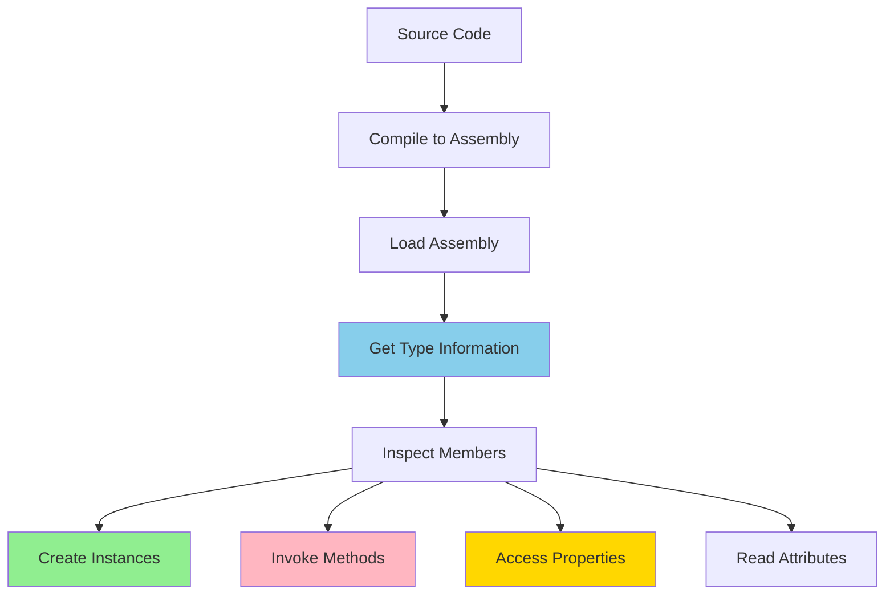
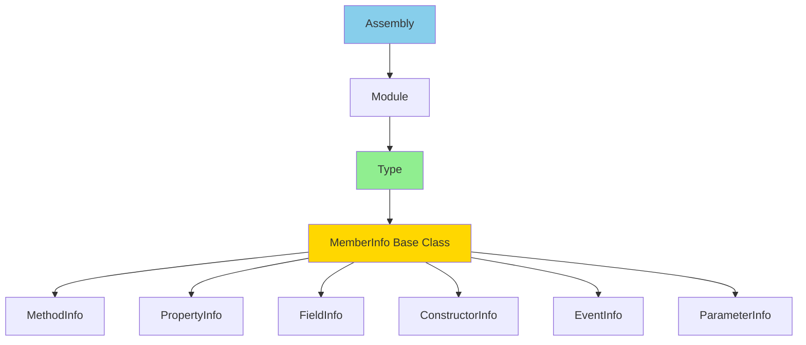

# Day 10: Reflection & Attributes

## 🎯 Learning Objectives

- Master Reflection API for runtime type inspection and manipulation
- Create and consume custom attributes effectively
- Understand dynamic type, DLR, and their use cases
- Compile and cache expressions for performance
- Load, inspect, and work with assemblies dynamically
- Implement practical reflection patterns (DI, serialization, validation)

---

## 1. Reflection Fundamentals

### What is Reflection?

**Reflection** is the ability to inspect and manipulate types, members, and objects at runtime. It allows you to:

- Discover type information dynamically
- Create instances without knowing types at compile time
- Invoke methods and access properties/fields dynamically
- Build frameworks (DI containers, serializers, ORMs)

**Key namespace:** `System.Reflection`

### Reflection Process Flow



### Type Hierarchy



### Getting Type Information

```csharp
// 🔰 BEGINNER: Three ways to obtain Type object

// 1. Compile-time operator (fastest)
Type type1 = typeof(string);

// 2. Instance method (runtime type)
string text = "hello";
Type type2 = text.GetType();

// 3. By fully qualified name (for dynamic loading)
Type type3 = Type.GetType("System.String");
Type type4 = Type.GetType("MyNamespace.MyClass, MyAssembly");

// Type properties and flags
Console.WriteLine($"Name: {type1.Name}");                    // String
Console.WriteLine($"FullName: {type1.FullName}");            // System.String
Console.WriteLine($"Namespace: {type1.Namespace}");          // System
Console.WriteLine($"Assembly: {type1.Assembly.GetName()}"); // mscorlib/System.Runtime
Console.WriteLine($"IsClass: {type1.IsClass}");              // true
Console.WriteLine($"IsValueType: {type1.IsValueType}");      // false
Console.WriteLine($"IsSealed: {type1.IsSealed}");            // true
Console.WriteLine($"IsAbstract: {type1.IsAbstract}");        // false
Console.WriteLine($"IsInterface: {type1.IsInterface}");      // false
Console.WriteLine($"IsGenericType: {type1.IsGenericType}");  // false
Console.WriteLine($"IsPrimitive: {type1.IsPrimitive}");      // false

// Base type and inheritance hierarchy
Type current = type1;
while (current != null)
{
    Console.WriteLine(current.Name);
    current = current.BaseType;
}
// Output: String -> Object -> null

// Interfaces implemented
Type[] interfaces = type1.GetInterfaces();
foreach (Type iface in interfaces)
{
    Console.WriteLine(iface.Name);
}
// IComparable, IEnumerable, IConvertible, etc.
```

### Generic Type Information

```csharp
// Working with generic types
Type listType = typeof(List<int>);

Console.WriteLine(listType.IsGenericType);        // true
Console.WriteLine(listType.IsGenericTypeDefinition); // false

// Get generic arguments
Type[] typeArgs = listType.GetGenericArguments();
Console.WriteLine(typeArgs[0].Name);              // Int32

// Get generic type definition
Type genericDef = listType.GetGenericTypeDefinition();
Console.WriteLine(genericDef.Name);               // List`1

// Construct generic type
Type stringListType = typeof(List<>).MakeGenericType(typeof(string));
object stringList = Activator.CreateInstance(stringListType);
```

### Creating Instances Dynamically

```csharp
// 🔰 BEGINNER: Activator.CreateInstance - simplest approach

// Parameterless constructor
Type type = typeof(StringBuilder);
object instance = Activator.CreateInstance(type);

// With constructor parameters
object sb = Activator.CreateInstance(
    typeof(StringBuilder),
    new object[] { "Initial text", 100 }); // capacity = 100

// Generic version (faster, type-safe)
StringBuilder typedSb = Activator.CreateInstance<StringBuilder>();

// 🚀 INTERMEDIATE: Using ConstructorInfo

Type personType = typeof(Person);

// Find specific constructor
ConstructorInfo ctor = personType.GetConstructor(
    new[] { typeof(string), typeof(int) });

if (ctor != null)
{
    object person = ctor.Invoke(new object[] { "John", 30 });
}

// Find all constructors
ConstructorInfo[] ctors = personType.GetConstructors();
foreach (var c in ctors)
{
    ParameterInfo[] parameters = c.GetParameters();
    Console.WriteLine($"Constructor with {parameters.Length} parameters");
}

// 🎯 ADVANCED: Handle non-public constructors

ConstructorInfo privateCtor = personType.GetConstructor(
    BindingFlags.Instance | BindingFlags.NonPublic,
    null,
    Type.EmptyTypes,
    null);

object privateInstance = privateCtor?.Invoke(null);
```

### Example: Factory Pattern with Reflection

```csharp
public interface ILogger
{
    void Log(string message);
}

public class FileLogger : ILogger
{
    public void Log(string message)
        => File.AppendAllText("log.txt", message + "\n");
}

public class ConsoleLogger : ILogger
{
    public void Log(string message)
        => Console.WriteLine(message);
}

public class LoggerFactory
{
    public static ILogger CreateLogger(string typeName)
    {
        // Get type from string
        Type type = Type.GetType(typeName);

        if (type == null)
            throw new ArgumentException($"Type {typeName} not found");

        // Verify it implements ILogger
        if (!typeof(ILogger).IsAssignableFrom(type))
            throw new ArgumentException($"{typeName} doesn't implement ILogger");

        // Create instance
        return (ILogger)Activator.CreateInstance(type);
    }
}

// Usage
ILogger logger = LoggerFactory.CreateLogger("FileLogger");
logger.Log("Application started");
```

---

## 2. Members Inspection

### Understanding BindingFlags

**BindingFlags** control how reflection searches for members. They are combinable flags:

```csharp
// Common BindingFlags combinations
BindingFlags publicInstance = BindingFlags.Public | BindingFlags.Instance;
BindingFlags allInstance = BindingFlags.Public | BindingFlags.NonPublic | BindingFlags.Instance;
BindingFlags allStatic = BindingFlags.Public | BindingFlags.NonPublic | BindingFlags.Static;
BindingFlags everything = BindingFlags.Public | BindingFlags.NonPublic |
                          BindingFlags.Instance | BindingFlags.Static;

// Flag meanings:
// Public       - Only public members
// NonPublic    - Only non-public (private, protected, internal)
// Instance     - Instance members only
// Static       - Static members only
// FlattenHierarchy - Include static members from base classes
// DeclaredOnly - Only members declared in this type, not inherited
```

### Properties Inspection

```csharp
public class Person
{
    public string Name { get; set; }
    public int Age { get; private set; }
    private string SSN { get; set; }
    public static string Species { get; } = "Homo Sapiens";
}

Type type = typeof(Person);

// 🔰 BEGINNER: Get all public properties
PropertyInfo[] publicProps = type.GetProperties();

foreach (PropertyInfo prop in publicProps)
{
    Console.WriteLine($"{prop.Name}: {prop.PropertyType.Name}");
    Console.WriteLine($"  Can Read: {prop.CanRead}");
    Console.WriteLine($"  Can Write: {prop.CanWrite}");
    Console.WriteLine($"  Is Static: {prop.GetMethod?.IsStatic ?? false}");
}

// 🚀 INTERMEDIATE: Get specific property
PropertyInfo nameProp = type.GetProperty("Name");
PropertyInfo ageProp = type.GetProperty("Age");

// Get/Set property values
Person person = new Person { Name = "John" };
object nameValue = nameProp.GetValue(person); // "John"
nameProp.SetValue(person, "Jane");

// 🎯 ADVANCED: Access private properties
PropertyInfo ssnProp = type.GetProperty("SSN",
    BindingFlags.NonPublic | BindingFlags.Instance);

if (ssnProp != null)
{
    ssnProp.SetValue(person, "123-45-6789");
    object ssn = ssnProp.GetValue(person);
}

// Check if property has getter/setter
PropertyInfo prop = type.GetProperty("Age");
MethodInfo getter = prop.GetGetMethod(); // Public getter
MethodInfo setter = prop.GetSetMethod(nonPublic: true); // Include private setter

Console.WriteLine($"Has public getter: {getter != null}");
Console.WriteLine($"Has public setter: {prop.GetSetMethod() != null}");
Console.WriteLine($"Has private setter: {setter != null && !setter.IsPublic}");

// Get property attributes
object[] attributes = nameProp.GetCustomAttributes(typeof(RequiredAttribute), false);
```

### Methods Inspection & Invocation

```csharp
public class Calculator
{
    public int Add(int a, int b) => a + b;
    public int Add(int a, int b, int c) => a + b + c;
    private int Multiply(int a, int b) => a * b;
    public static double Sqrt(double value) => Math.Sqrt(value);
    public T Generic<T>(T value) => value;
}

Type type = typeof(Calculator);

// 🔰 BEGINNER: Get all public methods
MethodInfo[] methods = type.GetMethods();

foreach (MethodInfo method in methods)
{
    Console.WriteLine($"{method.Name}");
    Console.WriteLine($"  Return Type: {method.ReturnType.Name}");
    Console.WriteLine($"  Parameters: {method.GetParameters().Length}");
}

// 🚀 INTERMEDIATE: Get specific method with parameters
MethodInfo addMethod = type.GetMethod("Add", new[] { typeof(int), typeof(int) });

// Invoke instance method
Calculator calc = new Calculator();
object result = addMethod.Invoke(calc, new object[] { 5, 3 }); // 8

// Invoke static method
MethodInfo sqrtMethod = typeof(Calculator).GetMethod("Sqrt");
object sqrtResult = sqrtMethod.Invoke(null, new object[] { 16.0 }); // 4.0

// 🎯 ADVANCED: Handle method overloads
MethodInfo[] addMethods = type.GetMethods()
    .Where(m => m.Name == "Add")
    .ToArray();

foreach (MethodInfo method in addMethods)
{
    ParameterInfo[] parameters = method.GetParameters();
    Console.WriteLine($"Add with {parameters.Length} parameters");
}

// Get specific overload
MethodInfo addThree = type.GetMethod("Add",
    new[] { typeof(int), typeof(int), typeof(int) });

// Access private methods
MethodInfo multiplyMethod = type.GetMethod("Multiply",
    BindingFlags.NonPublic | BindingFlags.Instance);

object privateResult = multiplyMethod.Invoke(calc, new object[] { 4, 5 }); // 20

// Generic method invocation
MethodInfo genericMethod = type.GetMethod("Generic");
MethodInfo intMethod = genericMethod.MakeGenericMethod(typeof(int));
object genericResult = intMethod.Invoke(calc, new object[] { 42 });
```

### Fields Inspection

```csharp
public class BankAccount
{
    public string AccountNumber;
    private decimal balance;
    private readonly string owner;
    public const int MaxTransactions = 100;
    public static int TotalAccounts = 0;
}

Type type = typeof(BankAccount);

// 🔰 BEGINNER: Get all public fields
FieldInfo[] publicFields = type.GetFields();

// 🚀 INTERMEDIATE: Get all fields including private
FieldInfo[] allFields = type.GetFields(
    BindingFlags.Public |
    BindingFlags.NonPublic |
    BindingFlags.Instance |
    BindingFlags.Static);

foreach (FieldInfo field in allFields)
{
    Console.WriteLine($"{field.Name}: {field.FieldType.Name}");
    Console.WriteLine($"  Is Private: {field.IsPrivate}");
    Console.WriteLine($"  Is Public: {field.IsPublic}");
    Console.WriteLine($"  Is Static: {field.IsStatic}");
    Console.WriteLine($"  Is ReadOnly: {field.IsInitOnly}");
    Console.WriteLine($"  Is Const: {field.IsLiteral}");
}

// Get/Set field values
BankAccount account = new BankAccount();
FieldInfo balanceField = type.GetField("balance",
    BindingFlags.NonPublic | BindingFlags.Instance);

balanceField.SetValue(account, 1000m);
object balance = balanceField.GetValue(account); // 1000

// 🎯 ADVANCED: Access readonly fields (use with caution!)
FieldInfo ownerField = type.GetField("owner",
    BindingFlags.NonPublic | BindingFlags.Instance);

ownerField.SetValue(account, "John Doe"); // Works but violates readonly contract

// Get constant value without instance
FieldInfo maxTransField = type.GetField("MaxTransactions");
object maxTrans = maxTransField.GetValue(null); // 100

// Get/Set static field
FieldInfo totalAccountsField = type.GetField("TotalAccounts");
totalAccountsField.SetValue(null, 50); // Set static field
object total = totalAccountsField.GetValue(null); // Get static field
```

### Events Inspection

```csharp
public class Publisher
{
    public event EventHandler DataReceived;
    public event EventHandler<CustomEventArgs> CustomEvent;
}

Type type = typeof(Publisher);

// Get all events
EventInfo[] events = type.GetEvents();

foreach (EventInfo evt in events)
{
    Console.WriteLine($"Event: {evt.Name}");
    Console.WriteLine($"  Event Handler Type: {evt.EventHandlerType.Name}");
    Console.WriteLine($"  Is Multicast: {evt.IsMulticast}");
}

// Add event handler dynamically
EventInfo dataEvent = type.GetEvent("DataReceived");
Publisher publisher = new Publisher();

EventHandler handler = (sender, e) => Console.WriteLine("Event fired!");
dataEvent.AddEventHandler(publisher, handler);

// Remove event handler
dataEvent.RemoveEventHandler(publisher, handler);
```

---

## 3. Custom Attributes

### What are Attributes?

**Attributes** provide metadata about code elements. They:

- Attach declarative information to types, methods, properties, etc.
- Can be queried at runtime via reflection
- Are used by frameworks (serialization, validation, ORM mapping)
- Don't affect program behavior unless explicitly processed

### Creating Custom Attributes

```csharp
// 🔰 BEGINNER: Basic attribute
[AttributeUsage(AttributeTargets.Class | AttributeTargets.Method)]
public class DocumentationAttribute : Attribute
{
    public string Description { get; }
    public string Author { get; set; }
    public string Version { get; set; }

    public DocumentationAttribute(string description)
    {
        Description = description;
    }
}

// Using the attribute
[Documentation("User management class", Author = "John", Version = "1.0")]
public class UserManager
{
    [Documentation("Gets user by ID")]
    public User GetUser(int id) => null;
}

// 🚀 INTERMEDIATE: Attribute with validation logic
[AttributeUsage(AttributeTargets.Property)]
public class RangeAttribute : ValidationAttribute
{
    public int Min { get; }
    public int Max { get; }

    public RangeAttribute(int min, int max)
    {
        Min = min;
        Max = max;
    }

    public override bool IsValid(object value)
    {
        if (value is int intValue)
            return intValue >= Min && intValue <= Max;

        return false;
    }

    public override string FormatErrorMessage(string name)
    {
        return $"{name} must be between {Min} and {Max}";
    }
}

// 🎯 ADVANCED: Multiple attributes allowed
[AttributeUsage(AttributeTargets.Method, AllowMultiple = true, Inherited = true)]
public class TestCaseAttribute : Attribute
{
    public object[] Arguments { get; }
    public object ExpectedResult { get; set; }

    public TestCaseAttribute(params object[] arguments)
    {
        Arguments = arguments;
    }
}

// Usage
public class MathTests
{
    [TestCase(2, 3, ExpectedResult = 5)]
    [TestCase(5, 7, ExpectedResult = 12)]
    [TestCase(-1, 1, ExpectedResult = 0)]
    public int Add(int a, int b) => a + b;
}
```

### AttributeUsage Parameters

```csharp
// AttributeTargets - where attribute can be applied
AttributeTargets.All          // All elements
AttributeTargets.Class        // Classes only
AttributeTargets.Method       // Methods only
AttributeTargets.Property     // Properties only
AttributeTargets.Field        // Fields only
AttributeTargets.Constructor  // Constructors only
AttributeTargets.Parameter    // Parameters only
AttributeTargets.ReturnValue  // Return values only

// AllowMultiple - can attribute be applied multiple times?
AllowMultiple = true   // [TestCase][TestCase]... allowed
AllowMultiple = false  // Only one instance allowed (default)

// Inherited - do derived classes inherit this attribute?
Inherited = true   // Derived classes inherit attribute (default)
Inherited = false  // Attribute not inherited
```

### Reading Attributes

```csharp
Type type = typeof(UserManager);

// 🔰 BEGINNER: Check if attribute exists
bool hasAttribute = type.IsDefined(typeof(DocumentationAttribute), false);

// Get single attribute
DocumentationAttribute attr = type.GetCustomAttribute<DocumentationAttribute>();
if (attr != null)
{
    Console.WriteLine($"{attr.Description} by {attr.Author} v{attr.Version}");
}

// 🚀 INTERMEDIATE: Get all attributes of a type
object[] attributes = type.GetCustomAttributes(false);
foreach (object attr in attributes)
{
    if (attr is DocumentationAttribute doc)
        Console.WriteLine(doc.Description);
}

// Get attribute from method
MethodInfo method = type.GetMethod("GetUser");
DocumentationAttribute methodAttr = method.GetCustomAttribute<DocumentationAttribute>();

// 🎯 ADVANCED: Get multiple attributes (when AllowMultiple = true)
MethodInfo testMethod = typeof(MathTests).GetMethod("Add");
TestCaseAttribute[] testCases = testMethod.GetCustomAttributes<TestCaseAttribute>().ToArray();

foreach (var testCase in testCases)
{
    object result = testMethod.Invoke(new MathTests(), testCase.Arguments);
    bool passed = result.Equals(testCase.ExpectedResult);
    Console.WriteLine($"Test {(passed ? "PASSED" : "FAILED")}: {string.Join(", ", testCase.Arguments)} => {result}");
}
```

### Common Built-in Attributes

```csharp
// 🔰 BEGINNER: Obsolete - mark deprecated code
[Obsolete("Use NewMethod instead")]
public void OldMethod() { }

[Obsolete("This method is dangerous", true)] // Compile error
public void DangerousMethod() { }

// Conditional - only compiled in specific configuration
[Conditional("DEBUG")]
public void DebugLog(string message)
{
    Console.WriteLine($"DEBUG: {message}");
}

// Serialization control
[Serializable]
public class Person
{
    public string Name { get; set; }

    [NonSerialized]
    private string tempData;
}

// 🚀 INTERMEDIATE: Caller information
public void Log(
    string message,
    [CallerMemberName] string memberName = "",
    [CallerFilePath] string filePath = "",
    [CallerLineNumber] int lineNumber = 0)
{
    Console.WriteLine($"[{Path.GetFileName(filePath)}:{lineNumber}] {memberName}: {message}");
}

// Usage: Log("Error occurred");
// Output: [Program.cs:42] Main: Error occurred

// DebuggerDisplay - customize debugger display
[DebuggerDisplay("Person: {Name}, Age: {Age}")]
public class Person
{
    public string Name { get; set; }
    public int Age { get; set; }
}

// 🎯 ADVANCED: MethodImpl - control method compilation
[MethodImpl(MethodImplOptions.AggressiveInlining)]
public int FastMethod() => 42;

[MethodImpl(MethodImplOptions.NoInlining)]
public void NoInlineMethod() { }

// DllImport - P/Invoke for native code
[DllImport("user32.dll")]
public static extern int MessageBox(IntPtr hWnd, string text, string caption, uint type);
```

### Practical Example: Validation Framework

```csharp
// Custom validation attributes
public abstract class ValidationAttribute : Attribute
{
    public string ErrorMessage { get; set; }
    public abstract bool IsValid(object value);
}

[AttributeUsage(AttributeTargets.Property)]
public class RequiredAttribute : ValidationAttribute
{
    public override bool IsValid(object value)
    {
        return value != null &&
               (!(value is string str) || !string.IsNullOrWhiteSpace(str));
    }
}

[AttributeUsage(AttributeTargets.Property)]
public class EmailAttribute : ValidationAttribute
{
    public override bool IsValid(object value)
    {
        if (value is string email)
        {
            return email.Contains("@") && email.Contains(".");
        }
        return false;
    }
}

[AttributeUsage(AttributeTargets.Property)]
public class StringLengthAttribute : ValidationAttribute
{
    public int MinLength { get; set; }
    public int MaxLength { get; set; }

    public override bool IsValid(object value)
    {
        if (value is string str)
        {
            return str.Length >= MinLength && str.Length <= MaxLength;
        }
        return false;
    }
}

// Model with validation attributes
public class UserRegistration
{
    [Required(ErrorMessage = "Username is required")]
    [StringLength(MinLength = 3, MaxLength = 20, ErrorMessage = "Username must be 3-20 characters")]
    public string Username { get; set; }

    [Required(ErrorMessage = "Email is required")]
    [Email(ErrorMessage = "Invalid email format")]
    public string Email { get; set; }

    [Required(ErrorMessage = "Password is required")]
    [StringLength(MinLength = 8, MaxLength = 50, ErrorMessage = "Password must be 8-50 characters")]
    public string Password { get; set; }

    [Range(18, 120, ErrorMessage = "Age must be 18-120")]
    public int Age { get; set; }
}

// Validator using reflection
public class Validator
{
    public List<string> Validate(object obj)
    {
        List<string> errors = new List<string>();
        Type type = obj.GetType();

        foreach (PropertyInfo prop in type.GetProperties())
        {
            foreach (ValidationAttribute attr in
                prop.GetCustomAttributes<ValidationAttribute>())
            {
                object value = prop.GetValue(obj);

                if (!attr.IsValid(value))
                {
                    string message = !string.IsNullOrEmpty(attr.ErrorMessage)
                        ? attr.ErrorMessage
                        : $"{prop.Name} is invalid";

                    errors.Add(message);
                }
            }
        }

        return errors;
    }
}

// Usage
var user = new UserRegistration
{
    Username = "ab",  // Too short
    Email = "invalid-email",  // Missing @
    Password = "1234",  // Too short
    Age = 15  // Too young
};

var validator = new Validator();
var errors = validator.Validate(user);

foreach (var error in errors)
{
    Console.WriteLine(error);
}
// Output:
// Username must be 3-20 characters
// Invalid email format
// Password must be 8-50 characters
// Age must be 18-120
```

---

## 4. Dynamic Type & DLR

### Dynamic Keyword

The `dynamic` keyword bypasses compile-time type checking, resolving members at runtime using the Dynamic Language Runtime (DLR).

```csharp
// 🔰 BEGINNER: Basic dynamic usage

// Dynamic type - resolved at runtime
dynamic value = 5;
Console.WriteLine(value); // 5

value = "hello";
Console.WriteLine(value.Length); // 5 (string length)

value = new[] { 1, 2, 3 };
Console.WriteLine(value[0]); // 1

// Dynamic method calls
dynamic calc = new Calculator();
int result = calc.Add(5, 3); // Resolved at runtime

// 🚀 INTERMEDIATE: ExpandoObject - dynamic property bag
dynamic person = new ExpandoObject();
person.Name = "John";
person.Age = 30;
person.SayHello = (Action)(() => Console.WriteLine($"Hello, I'm {person.Name}"));

person.SayHello(); // "Hello, I'm John"

// Can iterate like a dictionary
var dictionary = (IDictionary<string, object>)person;
foreach (var kvp in dictionary)
{
    Console.WriteLine($"{kvp.Key}: {kvp.Value}");
}

// 🎯 ADVANCED: Dynamic JSON deserialization
dynamic jsonData = JsonSerializer.Deserialize<ExpandoObject>(jsonString);
Console.WriteLine(jsonData.name);
Console.WriteLine(jsonData.address.city);
```

### When to Use Dynamic

```csharp
// ✅ GOOD: COM Interop
dynamic excel = Activator.CreateInstance(Type.GetTypeFromProgID("Excel.Application"));
excel.Visible = true;
dynamic workbook = excel.Workbooks.Add();

// ✅ GOOD: Working with dynamic languages (Python, JavaScript)
dynamic pythonObject = GetPythonObject();
pythonObject.DoSomething();

// ✅ GOOD: Simplifying reflection code
dynamic obj = GetObject();
obj.SomeMethod(); // Instead of MethodInfo.Invoke

// ❌ BAD: Regular C# code (loses type safety)
dynamic x = 5;  // Just use int!
dynamic result = x + 10;

// ❌ BAD: Performance-critical code
for (int i = 0; i < 1000000; i++)
{
    dynamic value = Calculate(); // Much slower than static typing
}
```

### DynamicObject - Creating Custom Dynamic Types

```csharp
// 🎯 ADVANCED: Custom dynamic object

public class DynamicDictionary : DynamicObject
{
    private Dictionary<string, object> dictionary = new Dictionary<string, object>();

    // Get dynamic member
    public override bool TryGetMember(GetMemberBinder binder, out object result)
    {
        string name = binder.Name;
        return dictionary.TryGetValue(name, out result);
    }

    // Set dynamic member
    public override bool TrySetMember(SetMemberBinder binder, object value)
    {
        dictionary[binder.Name] = value;
        return true;
    }

    // Dynamic method invocation
    public override bool TryInvokeMember(InvokeMemberBinder binder,
        object[] args, out object result)
    {
        string name = binder.Name;

        if (dictionary.TryGetValue(name, out object member))
        {
            if (member is Delegate del)
            {
                result = del.DynamicInvoke(args);
                return true;
            }
        }

        result = null;
        return false;
    }

    // Dynamic indexer
    public override bool TryGetIndex(GetIndexBinder binder,
        object[] indexes, out object result)
    {
        string key = indexes[0].ToString();
        return dictionary.TryGetValue(key, out result);
    }

    public override bool TrySetIndex(SetIndexBinder binder,
        object[] indexes, object value)
    {
        string key = indexes[0].ToString();
        dictionary[key] = value;
        return true;
    }
}

// Usage
dynamic dict = new DynamicDictionary();
dict.Name = "John";
dict.Age = 30;
dict.Greet = (Func<string>)(() => $"Hello, {dict.Name}!");

Console.WriteLine(dict.Name); // "John"
Console.WriteLine(dict.Greet()); // "Hello, John!"
Console.WriteLine(dict["Age"]); // 30
```

### Performance Considerations

```csharp
// Performance comparison
var stopwatch = Stopwatch.StartNew();

// Static typing (fastest)
int staticResult = 0;
for (int i = 0; i < 1000000; i++)
{
    staticResult = Add(5, 3);
}
Console.WriteLine($"Static: {stopwatch.ElapsedMilliseconds}ms");

stopwatch.Restart();

// Dynamic (10-100x slower)
dynamic dynamicResult = 0;
for (int i = 0; i < 1000000; i++)
{
    dynamicResult = Add(5, 3);
}
Console.WriteLine($"Dynamic: {stopwatch.ElapsedMilliseconds}ms");

stopwatch.Restart();

// Reflection (slowest)
MethodInfo method = typeof(Program).GetMethod("Add");
object reflectionResult = null;
for (int i = 0; i < 1000000; i++)
{
    reflectionResult = method.Invoke(null, new object[] { 5, 3 });
}
Console.WriteLine($"Reflection: {stopwatch.ElapsedMilliseconds}ms");
```

---

## 5. Assembly Loading & Inspection

### Loading Assemblies

```csharp
// 🔰 BEGINNER: Load assembly from file
Assembly assembly = Assembly.LoadFrom("MyLibrary.dll");

// Load from byte array (for plugins, security)
byte[] bytes = File.ReadAllBytes("MyLibrary.dll");
Assembly assembly = Assembly.Load(bytes);

// Load by name (from GAC or probing paths)
Assembly assembly = Assembly.Load("System.Collections");

// Get executing assembly
Assembly current = Assembly.GetExecutingAssembly();

// Get calling assembly
Assembly caller = Assembly.GetCallingAssembly();

// 🚀 INTERMEDIATE: Get assembly information
AssemblyName name = assembly.GetName();
Console.WriteLine($"Name: {name.Name}");
Console.WriteLine($"Version: {name.Version}");
Console.WriteLine($"Culture: {name.CultureName}");
Console.WriteLine($"Location: {assembly.Location}");

// Get all types in assembly
Type[] types = assembly.GetTypes();
foreach (Type type in types)
{
    Console.WriteLine(type.FullName);
}

// Get specific type
Type type = assembly.GetType("MyNamespace.MyClass");

// Get public types only
Type[] publicTypes = assembly.GetExportedTypes();

// 🎯 ADVANCED: Get referenced assemblies
AssemblyName[] references = assembly.GetReferencedAssemblies();
foreach (AssemblyName refName in references)
{
    Console.WriteLine($"References: {refName.Name} v{refName.Version}");
}

// Get custom attributes on assembly
AssemblyDescriptionAttribute desc =
    assembly.GetCustomAttribute<AssemblyDescriptionAttribute>();

Console.WriteLine($"Description: {desc?.Description}");
```

### Plugin Architecture

```csharp
// 🎯 ADVANCED: Plugin system using reflection

public interface IPlugin
{
    string Name { get; }
    string Version { get; }
    void Execute();
}

public class PluginLoader
{
    public List<IPlugin> LoadPlugins(string pluginDirectory)
    {
        List<IPlugin> plugins = new List<IPlugin>();

        // Get all DLL files in directory
        string[] dllFiles = Directory.GetFiles(pluginDirectory, "*.dll");

        foreach (string dllFile in dllFiles)
        {
            try
            {
                // Load assembly
                Assembly assembly = Assembly.LoadFrom(dllFile);

                // Find types implementing IPlugin
                Type[] types = assembly.GetTypes()
                    .Where(t => typeof(IPlugin).IsAssignableFrom(t) && !t.IsInterface && !t.IsAbstract)
                    .ToArray();

                // Create instances
                foreach (Type type in types)
                {
                    IPlugin plugin = (IPlugin)Activator.CreateInstance(type);
                    plugins.Add(plugin);
                    Console.WriteLine($"Loaded plugin: {plugin.Name} v{plugin.Version}");
                }
            }
            catch (Exception ex)
            {
                Console.WriteLine($"Failed to load {dllFile}: {ex.Message}");
            }
        }

        return plugins;
    }
}

// Usage
var loader = new PluginLoader();
var plugins = loader.LoadPlugins(@"C:\Plugins");

foreach (var plugin in plugins)
{
    plugin.Execute();
}
```

### AssemblyLoadContext (Advanced)

```csharp
// 🎯 ADVANCED: Unloadable plugin system (.NET Core/5+)

public class PluginLoadContext : AssemblyLoadContext
{
    private AssemblyDependencyResolver _resolver;

    public PluginLoadContext(string pluginPath) : base(isCollectible: true)
    {
        _resolver = new AssemblyDependencyResolver(pluginPath);
    }

    protected override Assembly Load(AssemblyName assemblyName)
    {
        string assemblyPath = _resolver.ResolveAssemblyToPath(assemblyName);
        if (assemblyPath != null)
        {
            return LoadFromAssemblyPath(assemblyPath);
        }

        return null;
    }
}

// Usage - can unload plugins
WeakReference weakRef = LoadAndExecutePlugin("plugin.dll");

// Force garbage collection
for (int i = 0; i < 8 && weakRef.IsAlive; i++)
{
    GC.Collect();
    GC.WaitForPendingFinalizers();
}

Console.WriteLine($"Plugin unloaded: {!weakRef.IsAlive}");

WeakReference LoadAndExecutePlugin(string pluginPath)
{
    var context = new PluginLoadContext(pluginPath);
    Assembly assembly = context.LoadFromAssemblyPath(Path.GetFullPath(pluginPath));

    // Execute plugin...

    context.Unload();
    return new WeakReference(context);
}
    {
        if (binder.Name == "GetValue")
        {
            result = dictionary[(string)args[0]];
            return true;
        }

        result = null;
        return false;
    }
}

// Usage
dynamic dict = new DynamicDictionary();
dict.Name = "John";
dict.Age = 30;
Console.WriteLine(dict.Name); // "John"
```

---

## 5. Assembly Loading

### Loading Assemblies

```csharp
// Load from file
Assembly assembly = Assembly.LoadFrom("MyLibrary.dll");

// Load from byte array
byte[] bytes = File.ReadAllBytes("MyLibrary.dll");
Assembly assembly = Assembly.Load(bytes);

// Load by name
Assembly assembly = Assembly.Load("System.Collections");

// Get executing assembly
Assembly current = Assembly.GetExecutingAssembly();

// Get types in assembly
Type[] types = assembly.GetTypes();

foreach (Type type in types)
{
    Console.WriteLine(type.FullName);
}
```

### Plugin Architecture

```csharp
public interface IPlugin
{
    string Name { get; }
    void Execute();
}

public class PluginLoader
{
    public List<IPlugin> LoadPlugins(string pluginDirectory)
    {
        List<IPlugin> plugins = new List<IPlugin>();

        string[] files = Directory.GetFiles(pluginDirectory, "*.dll");

        foreach (string file in files)
        {
            try
            {
                Assembly assembly = Assembly.LoadFrom(file);

                foreach (Type type in assembly.GetTypes())
                {
                    if (typeof(IPlugin).IsAssignableFrom(type) && !type.IsInterface)
                    {
                        IPlugin plugin = (IPlugin)Activator.CreateInstance(type);
                        plugins.Add(plugin);
                    }
                }
            }
            catch (Exception ex)
            {
                Console.WriteLine($"Error loading {file}: {ex.Message}");
            }
        }

        return plugins;
    }
}
```

---

## 6. Performance Optimization

### Caching Type Information

```csharp
// ❌ SLOW - Reflection every time
public object GetProperty(object obj, string propertyName)
{
    PropertyInfo prop = obj.GetType().GetProperty(propertyName);
    return prop.GetValue(obj);
}

// ✅ FAST - Cache PropertyInfo
private static ConcurrentDictionary<string, PropertyInfo> propertyCache
    = new ConcurrentDictionary<string, PropertyInfo>();

public object GetProperty(object obj, string propertyName)
{
    Type type = obj.GetType();
    string key = $"{type.FullName}.{propertyName}";

    PropertyInfo prop = propertyCache.GetOrAdd(key, _ =>
        type.GetProperty(propertyName));

    return prop.GetValue(obj);
}
```

### Compiled Expressions for Maximum Performance

```csharp
// ❌ SLOW - Reflection invoke
PropertyInfo prop = type.GetProperty("Name");
object value = prop.GetValue(instance); // Slow!

// ✅ FAST - Compiled delegate using Expression Trees
public static class PropertyAccessor<T>
{
    private static readonly ConcurrentDictionary<string, Func<T, object>> getters
        = new ConcurrentDictionary<string, Func<T, object>>();

    private static readonly ConcurrentDictionary<string, Action<T, object>> setters
        = new ConcurrentDictionary<string, Action<T, object>>();

    public static Func<T, object> GetPropertyGetter(string propertyName)
    {
        return getters.GetOrAdd(propertyName, name =>
        {
            PropertyInfo prop = typeof(T).GetProperty(name);
            if (prop == null)
                throw new ArgumentException($"Property {name} not found");

            ParameterExpression param = Expression.Parameter(typeof(T), "obj");
            MemberExpression property = Expression.Property(param, prop);
            UnaryExpression convert = Expression.Convert(property, typeof(object));

            return Expression.Lambda<Func<T, object>>(convert, param).Compile();
        });
    }

    public static Action<T, object> GetPropertySetter(string propertyName)
    {
        return setters.GetOrAdd(propertyName, name =>
        {
            PropertyInfo prop = typeof(T).GetProperty(name);
            if (prop == null || !prop.CanWrite)
                throw new ArgumentException($"Property {name} not found or not writable");

            ParameterExpression param = Expression.Parameter(typeof(T), "obj");
            ParameterExpression value = Expression.Parameter(typeof(object), "value");
            UnaryExpression convert = Expression.Convert(value, prop.PropertyType);
            MemberExpression property = Expression.Property(param, prop);
            BinaryExpression assign = Expression.Assign(property, convert);

            return Expression.Lambda<Action<T, object>>(assign, param, value).Compile();
        });
    }
}

// Usage - First call compiles, subsequent calls are fast
var getter = PropertyAccessor<Person>.GetPropertyGetter("Name");
var setter = PropertyAccessor<Person>.SetPropertySetter("Name");

Person person = new Person();
setter(person, "John"); // Fast!
object value = getter(person); // Fast!
```

### Performance Comparison

```csharp
public class PerformanceTest
{
    private const int Iterations = 1000000;

    public void CompareApproaches()
    {
        Person person = new Person { Name = "John", Age = 30 };
        Stopwatch sw = Stopwatch.StartNew();

        // 1. Direct access (baseline)
        sw.Restart();
        for (int i = 0; i < Iterations; i++)
        {
            string name = person.Name;
        }
        Console.WriteLine($"Direct access: {sw.ElapsedMilliseconds}ms");

        // 2. Reflection without cache
        sw.Restart();
        PropertyInfo prop = typeof(Person).GetProperty("Name");
        for (int i = 0; i < Iterations; i++)
        {
            object name = prop.GetValue(person);
        }
        Console.WriteLine($"Reflection (cached PropertyInfo): {sw.ElapsedMilliseconds}ms");

        // 3. Reflection with cache
        sw.Restart();
        for (int i = 0; i < Iterations; i++)
        {
            PropertyInfo p = typeof(Person).GetProperty("Name");
            object name = p.GetValue(person);
        }
        Console.WriteLine($"Reflection (no cache): {sw.ElapsedMilliseconds}ms");

        // 4. Compiled expression
        sw.Restart();
        var getter = PropertyAccessor<Person>.GetPropertyGetter("Name");
        for (int i = 0; i < Iterations; i++)
        {
            object name = getter(person);
        }
        Console.WriteLine($"Compiled expression: {sw.ElapsedMilliseconds}ms");

        // 5. Dynamic
        sw.Restart();
        dynamic dynPerson = person;
        for (int i = 0; i < Iterations; i++)
        {
            string name = dynPerson.Name;
        }
        Console.WriteLine($"Dynamic: {sw.ElapsedMilliseconds}ms");
    }
}

/* Typical Results (approximate):
 * Direct access:              2ms     (1x - baseline)
 * Compiled expression:        15ms    (7.5x slower)
 * Reflection (cached):        250ms   (125x slower)
 * Dynamic:                    800ms   (400x slower)
 * Reflection (no cache):      1500ms  (750x slower)
 */
```

---

## 7. Practical Applications

### Object Mapper

```csharp
public class SimpleMapper
{
    private static readonly ConcurrentDictionary<string, PropertyInfo[]> _propertyCache
        = new ConcurrentDictionary<string, PropertyInfo[]>();

    public TTarget Map<TSource, TTarget>(TSource source)
        where TTarget : new()
    {
        if (source == null)
            throw new ArgumentNullException(nameof(source));

        TTarget target = new TTarget();

        // Cache property info
        PropertyInfo[] sourceProps = GetProperties<TSource>();
        PropertyInfo[] targetProps = GetProperties<TTarget>();

        foreach (PropertyInfo sourceProp in sourceProps)
        {
            if (!sourceProp.CanRead)
                continue;

            PropertyInfo targetProp = Array.Find(targetProps,
                p => p.Name == sourceProp.Name &&
                     p.PropertyType == sourceProp.PropertyType &&
                     p.CanWrite);

            if (targetProp != null)
            {
                object value = sourceProp.GetValue(source);
                targetProp.SetValue(target, value);
            }
        }

        return target;
    }

    private PropertyInfo[] GetProperties<T>()
    {
        string key = typeof(T).FullName;
        return _propertyCache.GetOrAdd(key, _ => typeof(T).GetProperties());
    }
}

// Usage
public class Person
{
    public string Name { get; set; }
    public int Age { get; set; }
    public string Email { get; set; }
}

public class PersonDto
{
    public string Name { get; set; }
    public int Age { get; set; }
    public string Email { get; set; }
}

var mapper = new SimpleMapper();
Person person = new Person { Name = "John", Age = 30, Email = "john@example.com" };
PersonDto dto = mapper.Map<Person, PersonDto>(person);
```

### Simple Dependency Injection Container

```csharp
public class SimpleContainer
{
    private Dictionary<Type, Type> registrations = new Dictionary<Type, Type>();
    private Dictionary<Type, object> singletons = new Dictionary<Type, object>();
    private Dictionary<Type, Func<object>> factories = new Dictionary<Type, Func<object>>();

    // Register transient (new instance each time)
    public void Register<TInterface, TImplementation>() where TImplementation : TInterface
    {
        registrations[typeof(TInterface)] = typeof(TImplementation);
    }

    // Register singleton (same instance always)
    public void RegisterSingleton<TInterface>(TInterface instance)
    {
        singletons[typeof(TInterface)] = instance;
    }

    // Register factory
    public void RegisterFactory<TInterface>(Func<TInterface> factory)
    {
        factories[typeof(TInterface)] = () => factory();
    }

    public T Resolve<T>()
    {
        return (T)Resolve(typeof(T));
    }

    private object Resolve(Type type)
    {
        // Check singletons
        if (singletons.TryGetValue(type, out object singleton))
        {
            return singleton;
        }

        // Check factories
        if (factories.TryGetValue(type, out Func<object> factory))
        {
            return factory();
        }

        // Get implementation type
        if (!registrations.TryGetValue(type, out Type implementationType))
        {
            if (type.IsAbstract || type.IsInterface)
                throw new InvalidOperationException($"No registration for {type.Name}");

            implementationType = type;
        }

        // Get constructor with most parameters
        ConstructorInfo constructor = implementationType
            .GetConstructors()
            .OrderByDescending(c => c.GetParameters().Length)
            .FirstOrDefault();

        if (constructor == null)
            throw new InvalidOperationException($"No public constructor for {implementationType.Name}");

        // Resolve constructor parameters
        ParameterInfo[] parameters = constructor.GetParameters();
        object[] arguments = new object[parameters.Length];

        for (int i = 0; i < parameters.Length; i++)
        {
            arguments[i] = Resolve(parameters[i].ParameterType);
        }

        // Create instance
        return constructor.Invoke(arguments);
    }
}

// Usage
public interface ILogger
{
    void Log(string message);
}

public class ConsoleLogger : ILogger
{
    public void Log(string message) => Console.WriteLine(message);
}

public interface IRepository
{
    void Save();
}

public class Repository : IRepository
{
    private readonly ILogger _logger;

    public Repository(ILogger logger)
    {
        _logger = logger;
    }

    public void Save()
    {
        _logger.Log("Saving...");
    }
}

// Setup container
var container = new SimpleContainer();
container.Register<ILogger, ConsoleLogger>();
container.Register<IRepository, Repository>();

// Resolve with automatic dependency injection
IRepository repository = container.Resolve<IRepository>();
repository.Save(); // Logs "Saving..." via injected logger
```

### JSON Serializer (Simple Implementation)

```csharp
public class SimpleJsonSerializer
{
    public string Serialize(object obj)
    {
        if (obj == null)
            return "null";

        Type type = obj.GetType();

        // Handle primitives and strings
        if (type.IsPrimitive || type == typeof(string))
            return SerializePrimitive(obj);

        // Handle collections
        if (obj is IEnumerable enumerable && type != typeof(string))
            return SerializeCollection(enumerable);

        // Handle objects
        return SerializeObject(obj);
    }

    private string SerializePrimitive(object obj)
    {
        if (obj is string str)
            return $"\"{str}\"";
        if (obj is bool b)
            return b.ToString().ToLower();

        return obj.ToString();
    }

    private string SerializeCollection(IEnumerable enumerable)
    {
        List<string> items = new List<string>();
        foreach (object item in enumerable)
        {
            items.Add(Serialize(item));
        }
        return $"[{string.Join(",", items)}]";
    }

    private string SerializeObject(object obj)
    {
        Type type = obj.GetType();
        PropertyInfo[] properties = type.GetProperties(BindingFlags.Public | BindingFlags.Instance);

        List<string> members = new List<string>();

        foreach (PropertyInfo prop in properties)
        {
            if (!prop.CanRead)
                continue;

            object value = prop.GetValue(obj);
            string serializedValue = Serialize(value);
            members.Add($"\"{prop.Name}\":{serializedValue}");
        }

        return $"{{{string.Join(",", members)}}}";
    }
}

// Usage
public class Person
{
    public string Name { get; set; }
    public int Age { get; set; }
    public string[] Hobbies { get; set; }
}

var serializer = new SimpleJsonSerializer();
var person = new Person
{
    Name = "John",
    Age = 30,
    Hobbies = new[] { "Reading", "Gaming" }
};

string json = serializer.Serialize(person);
// Output: {"Name":"John","Age":30,"Hobbies":["Reading","Gaming"]}
```

---

## 8. Interview Questions & Answers

### Q1: What is reflection and when should you use it?

**Answer:**
Reflection is the ability to inspect and manipulate types, members, and objects at runtime. It allows you to:

- Discover type information dynamically
- Create instances without compile-time type knowledge
- Invoke methods and access members dynamically

**When to use:**

- Plugin architectures
- Serialization/Deserialization
- ORM frameworks (Entity Framework)
- Dependency Injection containers
- Unit testing frameworks
- Validation frameworks

**When NOT to use:**

- Performance-critical code (10-100x slower)
- When compile-time type information is available
- Hot paths in your application

**Example:**

```csharp
// Good use case: Generic validator
public bool Validate<T>(T obj)
{
    foreach (PropertyInfo prop in typeof(T).GetProperties())
    {
        foreach (ValidationAttribute attr in prop.GetCustomAttributes<ValidationAttribute>())
        {
            if (!attr.IsValid(prop.GetValue(obj)))
                return false;
        }
    }
    return true;
}

// Bad use case: Regular property access
// DON'T DO THIS:
PropertyInfo prop = typeof(Person).GetProperty("Name");
string name = (string)prop.GetValue(person);

// DO THIS:
string name = person.Name;
```

### Q2: What's the difference between GetType() and typeof()?

**Answer:**

| Aspect         | GetType()                   | typeof()                |
| -------------- | --------------------------- | ----------------------- |
| When resolved  | Runtime                     | Compile-time            |
| Syntax         | Instance method             | Operator                |
| Type parameter | No, uses instance           | Yes, requires type name |
| Performance    | Slightly slower             | Fastest                 |
| Virtual        | Yes                         | No                      |
| Inheritance    | Returns actual runtime type | Returns specified type  |

```csharp
// typeof - compile-time
Type t1 = typeof(string);  // Compile-time constant

// GetType - runtime
object obj = "hello";
Type t2 = obj.GetType();   // Runtime type discovery

// Important difference with inheritance
Animal animal = new Dog();
Type t3 = typeof(Animal);     // Returns Animal
Type t4 = animal.GetType();   // Returns Dog (actual runtime type)

// typeof requires type name at compile time
Type t5 = typeof(List<int>);  // OK
// Type t6 = typeof(obj);     // ERROR: Cannot use variable
```

### Q3: How can you improve reflection performance?

**Answer:**

**1. Cache Type and MemberInfo objects:**

```csharp
private static readonly Dictionary<Type, PropertyInfo[]> _cache
    = new Dictionary<Type, PropertyInfo[]>();

PropertyInfo[] GetProperties<T>()
{
    Type type = typeof(T);
    if (!_cache.TryGetValue(type, out PropertyInfo[] props))
    {
        props = type.GetProperties();
        _cache[type] = props;
    }
    return props;
}
```

**2. Use compiled expressions:**

```csharp
// 125x faster than reflection
var getter = PropertyAccessor<Person>.GetPropertyGetter("Name");
object value = getter(person);
```

**3. Use source generators (C# 9+):**

```csharp
// Generated at compile time, zero runtime overhead
[JsonSerializable(typeof(Person))]
public partial class PersonContext : JsonSerializerContext { }
```

**4. Avoid reflection in loops:**

```csharp
// BAD
for (int i = 0; i < 1000000; i++)
{
    PropertyInfo prop = typeof(Person).GetProperty("Name");
    prop.GetValue(person);
}

// GOOD
PropertyInfo prop = typeof(Person).GetProperty("Name");
for (int i = 0; i < 1000000; i++)
{
    prop.GetValue(person);
}
```

**5. Use Activator.CreateInstance<T>() generic version:**

```csharp
// Faster
T instance = Activator.CreateInstance<T>();

// Slower
object instance = Activator.CreateInstance(typeof(T));
```

### Q4: Explain the dynamic keyword and its use cases

**Answer:**

`dynamic` bypasses compile-time type checking. The type is resolved at runtime using the Dynamic Language Runtime (DLR).

**Pros:**

- Simplifies interop with COM objects
- Works with dynamic languages (Python, JavaScript)
- Reduces reflection boilerplate

**Cons:**

- No IntelliSense
- No compile-time type safety
- 10-100x slower than static typing
- Runtime errors instead of compile errors

**Good use cases:**

```csharp
// 1. COM Interop
dynamic excel = Activator.CreateInstance(Type.GetTypeFromProgID("Excel.Application"));
excel.Visible = true;
excel.Workbooks.Add();

// 2. Dynamic JSON parsing
dynamic json = JsonSerializer.Deserialize<ExpandoObject>(jsonString);
Console.WriteLine(json.name.first);  // No need for class definition

// 3. Simplifying reflection
dynamic obj = GetObject();
obj.MethodName(arg1, arg2);  // Instead of MethodInfo.Invoke
```

**Bad use cases:**

```csharp
// DON'T: Regular C# code
dynamic x = 5;  // Just use int!
dynamic result = x + y;

// DON'T: Performance-critical code
for (int i = 0; i < 1000000; i++)
{
    dynamic value = Calculate();  // Much slower
}
```

### Q5: How do you create and use custom attributes?

**Answer:**

**Step 1: Create attribute class**

```csharp
[AttributeUsage(AttributeTargets.Property, AllowMultiple = false, Inherited = true)]
public class MaxLengthAttribute : Attribute
{
    public int Length { get; }
    public string ErrorMessage { get; set; }

    public MaxLengthAttribute(int length)
    {
        Length = length;
    }
}
```

**Step 2: Apply attribute**

```csharp
public class User
{
    [MaxLength(50, ErrorMessage = "Name too long")]
    public string Name { get; set; }
}
```

**Step 3: Read attribute using reflection**

```csharp
PropertyInfo prop = typeof(User).GetProperty("Name");
MaxLengthAttribute attr = prop.GetCustomAttribute<MaxLengthAttribute>();

if (attr != null)
{
    string value = user.Name;
    if (value?.Length > attr.Length)
        Console.WriteLine(attr.ErrorMessage);
}
```

**AttributeUsage parameters:**

- `AttributeTargets`: Where attribute can be applied (Class, Method, Property, etc.)
- `AllowMultiple`: Can attribute be applied multiple times?
- `Inherited`: Do derived classes inherit the attribute?

### Q6: What are BindingFlags and why are they important?

**Answer:**

`BindingFlags` control how reflection searches for members. They're combinable flags.

**Common flags:**

```csharp
// Access level
BindingFlags.Public      // Public members only
BindingFlags.NonPublic   // Private, protected, internal

// Member type
BindingFlags.Instance    // Instance members
BindingFlags.Static      // Static members

// Inheritance
BindingFlags.DeclaredOnly      // Only this type, not inherited
BindingFlags.FlattenHierarchy  // Include static from base classes

// Common combinations
BindingFlags.Public | BindingFlags.Instance              // Public instance members
BindingFlags.NonPublic | BindingFlags.Instance           // Private instance members
BindingFlags.Public | BindingFlags.Static                // Public static members
BindingFlags.Public | BindingFlags.NonPublic |
    BindingFlags.Instance | BindingFlags.Static          // Everything
```

**Example:**

```csharp
public class Person
{
    public string Name { get; set; }
    private int age;
    public static string Species = "Human";
}

Type type = typeof(Person);

// Get only public instance members (default behavior)
PropertyInfo[] publicProps = type.GetProperties();  // Returns: Name

// Get all instance members including private
FieldInfo[] allFields = type.GetFields(
    BindingFlags.Public | BindingFlags.NonPublic | BindingFlags.Instance);
// Returns: age, <Name>k__BackingField

// Get static members
FieldInfo[] staticFields = type.GetFields(BindingFlags.Public | BindingFlags.Static);
// Returns: Species
```

### Q7: What's the difference between Assembly.Load and Assembly.LoadFrom?

**Answer:**

| Method                        | Use Case                     | Behavior                                |
| ----------------------------- | ---------------------------- | --------------------------------------- |
| `Assembly.Load(AssemblyName)` | Load from GAC or bin folder  | Uses fusion binding rules, recommended  |
| `Assembly.LoadFrom(path)`     | Load from specific file path | Loads from exact path, may cause issues |
| `Assembly.LoadFile(path)`     | Load assembly in isolation   | No dependency resolution                |

```csharp
// Recommended: Load by name (uses probing paths)
Assembly asm1 = Assembly.Load("MyLibrary");

// Load from specific path
Assembly asm2 = Assembly.LoadFrom(@"C:\MyPlugins\Plugin.dll");

// Load in isolation (dependencies won't load automatically)
Assembly asm3 = Assembly.LoadFile(@"C:\MyPlugins\Plugin.dll");

// Load from byte array (useful for embedded resources or security)
byte[] bytes = File.ReadAllBytes("MyLibrary.dll");
Assembly asm4 = Assembly.Load(bytes);
```

**Best practices:**

- Use `Assembly.Load` when possible
- Use `Assembly.LoadFrom` for plugins from specific locations
- Use `AssemblyLoadContext` (.NET Core/5+) for unloadable plugins
- Avoid `Assembly.LoadFile` unless you need isolation

### Q8: How would you implement a simple ORM using reflection?

**Answer:**

```csharp
public class SimpleOrm
{
    private readonly string _connectionString;

    public SimpleOrm(string connectionString)
    {
        _connectionString = connectionString;
    }

    public List<T> Query<T>(string sql) where T : new()
    {
        List<T> results = new List<T>();

        using (SqlConnection conn = new SqlConnection(_connectionString))
        using (SqlCommand cmd = new SqlCommand(sql, conn))
        {
            conn.Open();
            using (SqlDataReader reader = cmd.ExecuteReader())
            {
                // Cache property info for performance
                PropertyInfo[] properties = typeof(T).GetProperties();

                while (reader.Read())
                {
                    T item = new T();

                    foreach (PropertyInfo prop in properties)
                    {
                        // Check if column exists in result set
                        try
                        {
                            object value = reader[prop.Name];

                            // Handle DBNull
                            if (value != DBNull.Value)
                            {
                                // Handle nullable types
                                Type targetType = Nullable.GetUnderlyingType(prop.PropertyType)
                                    ?? prop.PropertyType;

                                object convertedValue = Convert.ChangeType(value, targetType);
                                prop.SetValue(item, convertedValue);
                            }
                        }
                        catch (IndexOutOfRangeException)
                        {
                            // Column doesn't exist in result, skip
                        }
                    }

                    results.Add(item);
                }
            }
        }

        return results;
    }

    public void Insert<T>(T entity)
    {
        Type type = typeof(T);
        PropertyInfo[] properties = type.GetProperties();

        // Build INSERT statement
        string tableName = type.Name;
        string columns = string.Join(", ", properties.Select(p => p.Name));
        string parameters = string.Join(", ", properties.Select(p => "@" + p.Name));

        string sql = $"INSERT INTO {tableName} ({columns}) VALUES ({parameters})";

        using (SqlConnection conn = new SqlConnection(_connectionString))
        using (SqlCommand cmd = new SqlCommand(sql, conn))
        {
            // Add parameters
            foreach (PropertyInfo prop in properties)
            {
                object value = prop.GetValue(entity) ?? DBNull.Value;
                cmd.Parameters.AddWithValue("@" + prop.Name, value);
            }

            conn.Open();
            cmd.ExecuteNonQuery();
        }
    }
}

// Usage
public class Product
{
    public int Id { get; set; }
    public string Name { get; set; }
    public decimal Price { get; set; }
}

var orm = new SimpleOrm(connectionString);
List<Product> products = orm.Query<Product>("SELECT * FROM Products");
orm.Insert(new Product { Name = "Widget", Price = 9.99m });
```

---

## 9. Practical Exercises

### Exercise 1: Deep Object Cloner

Create a deep cloner that handles:

- Circular references
- Collections (List, Dictionary, etc.)
- Private fields
- Readonly fields

```csharp
public class DeepCloner
{
    public T Clone<T>(T source)
    {
        // Your implementation here
        // Track visited objects to handle circular references
        // Use reflection to copy all fields including private
        // Recursively clone complex types
    }
}
```

### Exercise 2: CSV Serializer

Build a CSV serializer using reflection:

```csharp
public class CsvSerializer
{
    public string Serialize<T>(List<T> objects)
    {
        // Generate CSV with headers from property names
        // Handle different data types
        // Escape special characters
    }

    public List<T> Deserialize<T>(string csv) where T : new()
    {
        // Parse CSV headers
        // Create objects and set properties using reflection
    }
}
```

### Exercise 3: Property Change Tracker

Implement a change tracker that monitors object property changes:

```csharp
public class ChangeTracker<T>
{
    private T _original;
    private T _current;

    public ChangeTracker(T entity)
    {
        _original = Clone(entity);
        _current = entity;
    }

    public Dictionary<string, (object Old, object New)> GetChanges()
    {
        // Compare original and current using reflection
        // Return dictionary of changed properties
    }
}
```

### Exercise 4: Expression-based Property Selector

Create a utility that converts lambda expressions to property names:

```csharp
public static class PropertyHelper
{
    public static string GetPropertyName<T>(Expression<Func<T, object>> expression)
    {
        // Parse expression tree to get property name
        // Support nested properties (e.g., x => x.Address.City)
    }
}

// Usage
string propName = PropertyHelper.GetPropertyName<Person>(p => p.Name);
// Returns: "Name"
```

---

## 10. Key Takeaways

✅ **Reflection** enables runtime type inspection and manipulation  
✅ **Cache** Type/MemberInfo objects to improve performance  
✅ **Compiled expressions** are 10-100x faster than reflection  
✅ **Custom attributes** provide declarative metadata  
✅ **Dynamic** simplifies reflection but loses type safety  
✅ **Avoid** reflection in performance-critical hot paths  
✅ **Source generators** (C# 9+) are better than reflection when possible  
✅ **BindingFlags** control member visibility and scope  
✅ **Assembly loading** supports plugin architectures  
✅ **Expression trees** enable building dynamic queries

---

## 11. Common Pitfalls

⚠️ **Don't use reflection for regular property access**

```csharp
// BAD
PropertyInfo prop = typeof(Person).GetProperty("Name");
string name = (string)prop.GetValue(person);

// GOOD
string name = person.Name;
```

⚠️ **Don't forget to cache reflection results**

```csharp
// BAD - Creates PropertyInfo every call
public void Process(Person person)
{
    PropertyInfo prop = typeof(Person).GetProperty("Name");
    // ...
}

// GOOD - Cache at class level
private static readonly PropertyInfo NameProperty = typeof(Person).GetProperty("Name");
```

⚠️ **Don't use dynamic for regular C# code**

```csharp
// BAD
dynamic x = 5;
dynamic y = 10;
dynamic result = x + y;

// GOOD
int x = 5;
int y = 10;
int result = x + y;
```

⚠️ **Don't ignore BindingFlags**

```csharp
// This might not find private members
PropertyInfo prop = type.GetProperty("PrivateProperty");

// Use appropriate BindingFlags
PropertyInfo prop = type.GetProperty("PrivateProperty",
    BindingFlags.NonPublic | BindingFlags.Instance);
```

---

## Tomorrow's Preview 🔮

**Day 11: Modern C# Features (C# 7-12)**

- Pattern matching evolution
- Records and init-only properties
- Nullable reference types
- Global usings and file-scoped namespaces
- Raw string literals
- Required members
- Primary constructors

---

**Remember: Reflection is powerful but use it wisely!** 🔍✨
