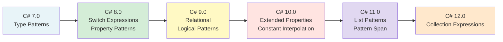
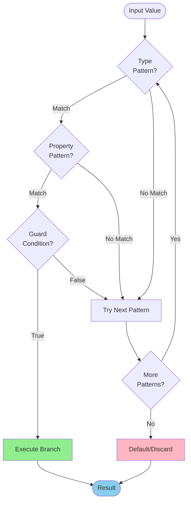
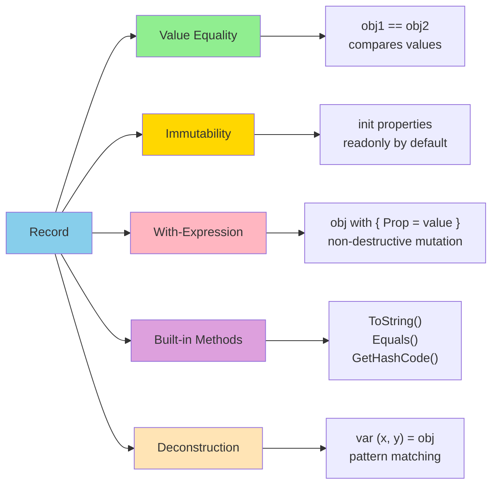

# Day 11: Modern C# Features (C# 7-12)

## 🎯 Learning Objectives

- Master pattern matching evolution from C# 7 through C# 12
- Understand records, init-only properties, and required members
- Use nullable reference types effectively to prevent null errors
- Leverage global usings, file-scoped namespaces, and raw string literals
- Apply primary constructors and collection expressions
- Understand when and why to use modern C# features

---

## 1. Pattern Matching Evolution (C# 7.0-12.0)

### Pattern Matching Timeline



### Pattern Matching Flow



### Type Pattern (C# 7.0)

```csharp
// 🔰 BEGINNER: Basic pattern matching with type patterns

object obj = "hello";

// Old way - manual type checking and casting
if (obj is string)
{
    string s = (string)obj;
    Console.WriteLine(s.Length);
}

// New way - declare variable inline
if (obj is string s)
{
    Console.WriteLine(s.Length); // s is in scope here
}
// s is NOT in scope here (only in if block)

// Pattern with switch statement
switch (obj)
{
    case int i:
        Console.WriteLine($"Integer: {i}");
        break;
    case string s when s.Length > 5:  // Guard clause
        Console.WriteLine($"Long string: {s}");
        break;
    case string s:
        Console.WriteLine($"Short string: {s}");
        break;
    case null:
        Console.WriteLine("Null");
        break;
    default:
        Console.WriteLine("Other type");
        break;
}

// 🚀 INTERMEDIATE: Pattern matching with complex types
public class Shape { }
public class Circle : Shape { public double Radius { get; set; } }
public class Rectangle : Shape { public double Width { get; set; } public double Height { get; set; } }
public class Triangle : Shape { public double Base { get; set; } public double Height { get; set; } }

double CalculateArea(Shape shape)
{
    if (shape is Circle c)
        return Math.PI * c.Radius * c.Radius;
    else if (shape is Rectangle r)
        return r.Width * r.Height;
    else if (shape is Triangle t)
        return 0.5 * t.Base * t.Height;
    else
        throw new ArgumentException("Unknown shape");
}

// Null checking pattern
if (obj is not null)
{
    // obj is not null here
    Console.WriteLine(obj.ToString());
}
```

### Switch Expressions (C# 8.0)

```csharp
// 🔰 BEGINNER: Switch expressions are more concise than switch statements

// Old switch statement
string GetSeasonOld(int month)
{
    switch (month)
    {
        case 12:
        case 1:
        case 2:
            return "Winter";
        case 3:
        case 4:
        case 5:
            return "Spring";
        case 6:
        case 7:
        case 8:
            return "Summer";
        case 9:
        case 10:
        case 11:
            return "Fall";
        default:
            throw new ArgumentException("Invalid month");
    }
}

// 🚀 INTERMEDIATE: New switch expression with pattern matching
string GetSeason(int month) => month switch
{
    12 or 1 or 2 => "Winter",        // Logical 'or' pattern
    >= 3 and <= 5 => "Spring",       // Relational and logical patterns
    >= 6 and <= 8 => "Summer",
    >= 9 and <= 11 => "Fall",
    _ => throw new ArgumentException("Invalid month")  // Discard pattern
};

// Calculate area using switch expression
double CalculateArea(Shape shape) => shape switch
{
    Circle c => Math.PI * c.Radius * c.Radius,
    Rectangle r => r.Width * r.Height,
    Triangle t => 0.5 * t.Base * t.Height,
    null => throw new ArgumentNullException(nameof(shape)),
    _ => throw new ArgumentException("Unknown shape")
};

// 🎯 ADVANCED: Nested switch expressions
string ClassifyTemperature(double celsius, string unit) => unit.ToLower() switch
{
    "c" or "celsius" => celsius switch
    {
        < 0 => "Freezing",
        >= 0 and < 15 => "Cold",
        >= 15 and < 25 => "Moderate",
        >= 25 and < 35 => "Warm",
        >= 35 => "Hot",
    },
    "f" or "fahrenheit" => (celsius * 9 / 5 + 32) switch
    {
        < 32 => "Freezing",
        >= 32 and < 59 => "Cold",
        >= 59 and < 77 => "Moderate",
        >= 77 and < 95 => "Warm",
        >= 95 => "Hot",
    },
    _ => throw new ArgumentException("Unknown unit")
};
```

### Property Pattern (C# 8.0)

```csharp
// 🔰 BEGINNER: Property patterns match on object properties

public class Person
{
    public string Name { get; set; }
    public int Age { get; set; }
    public Address Address { get; set; }
}

public class Address
{
    public string City { get; set; }
    public string State { get; set; }
    public string Country { get; set; }
}

// Simple property pattern
string GetDiscount(Person person) => person switch
{
    { Age: < 18 } => "Youth discount (20%)",
    { Age: >= 65 } => "Senior discount (15%)",
    { Address: { State: "CA" } } => "CA resident discount (10%)",
    { Address.City: "Seattle" } => "Seattle discount (5%)",
    _ => "No discount"
};

// 🚀 INTERMEDIATE: Multiple property patterns
string GetShippingCost(Person person, decimal orderValue) => (person, orderValue) switch
{
    ({ Address.Country: "US" }, > 100) => "Free shipping",
    ({ Address.Country: "US" }, _) => "$10 shipping",
    ({ Address.Country: "CA" }, > 150) => "Free shipping",
    ({ Address.Country: "CA" }, _) => "$15 shipping",
    (_, > 200) => "Free international shipping",
    _ => "$25 international shipping"
};

// 🎯 ADVANCED: Nested property patterns
bool IsValidForPromotion(Person person) => person switch
{
    {
        Age: >= 18 and < 65,
        Address: { Country: "US", State: not "AK" and not "HI" }
    } => true,
    _ => false
};

// Tuple pattern
string Classify(int x, int y) => (x, y) switch
{
    (0, 0) => "Origin",
    (0, _) => "On Y-axis",
    (_, 0) => "On X-axis",
    var (a, b) when a == b => "On diagonal (y = x)",
    var (a, b) when a == -b => "On diagonal (y = -x)",
    _ => "Other point"
};
```

### Positional Pattern (C# 8.0)

```csharp
// 🚀 INTERMEDIATE: Positional patterns use deconstruction

public class Point
{
    public int X { get; }
    public int Y { get; }

    public Point(int x, int y) => (X, Y) = (x, y);

    // Deconstruct method enables positional pattern
    public void Deconstruct(out int x, out int y) => (x, y) = (X, Y);
}

string Classify(Point point) => point switch
{
    (0, 0) => "Origin",
    (0, _) => "On Y-axis",
    (_, 0) => "On X-axis",
    var (x, y) when x == y => "On diagonal (y = x)",
    var (x, y) when x > 0 && y > 0 => "Quadrant I",
    var (x, y) when x < 0 && y > 0 => "Quadrant II",
    var (x, y) when x < 0 && y < 0 => "Quadrant III",
    var (x, y) when x > 0 && y < 0 => "Quadrant IV",
    _ => "Unknown"
};

// Using record with positional syntax
public record Point3D(int X, int Y, int Z);

string ClassifyPoint3D(Point3D point) => point switch
{
    (0, 0, 0) => "Origin",
    (_, 0, 0) => "On X-axis",
    (0, _, 0) => "On Y-axis",
    (0, 0, _) => "On Z-axis",
    (var x, var y, var z) when x == y && y == z => "On diagonal (x = y = z)",
    _ => "General point"
};
```

### Relational and Logical Patterns (C# 9.0)

```csharp
// 🔰 BEGINNER: Relational patterns (>, <, >=, <=)

string GetGrade(int score) => score switch
{
    >= 90 => "A",
    >= 80 => "B",
    >= 70 => "C",
    >= 60 => "D",
    _ => "F"
};

// Logical patterns (and, or, not)
bool IsWeekend(DayOfWeek day) => day is DayOfWeek.Saturday or DayOfWeek.Sunday;

bool IsBusinessHours(DateTime time) => time.Hour is >= 9 and < 17;

bool IsNotNull(object obj) => obj is not null;

// 🚀 INTERMEDIATE: Complex logical patterns
string GetPriceRange(decimal price) => price switch
{
    < 0 => throw new ArgumentException("Price cannot be negative"),
    >= 0 and < 10 => "Budget",
    >= 10 and < 50 => "Economy",
    >= 50 and < 100 => "Standard",
    >= 100 and < 500 => "Premium",
    >= 500 => "Luxury"
};

// Combining patterns
string ClassifyNumber(int n) => n switch
{
    < 0 => "Negative",
    0 => "Zero",
    > 0 and <= 10 => "Small positive",
    > 10 and <= 100 => "Medium positive",
    > 100 => "Large positive"
};

// 🎯 ADVANCED: Complex pattern combinations
bool IsValidUser(string username, int age, string email) => (username, age, email) switch
{
    (not null, >= 18, not null) when email.Contains("@") => true,
    _ => false
};

string DescribeTemperature(double temp) => temp switch
{
    double.NaN => "Invalid temperature",
    double.PositiveInfinity => "Infinitely hot",
    double.NegativeInfinity => "Infinitely cold",
    < -273.15 => "Below absolute zero (impossible)",
    >= -273.15 and < 0 => "Below freezing",
    >= 0 and < 100 => "Normal range",
    >= 100 => "Boiling or above"
};
```

### List Patterns (C# 11.0)

```csharp
// 🔰 BEGINNER: List patterns match array/list elements

int[] numbers = { 1, 2, 3, 4, 5 };

// Match specific elements
string Describe(int[] arr) => arr switch
{
    [] => "Empty array",
    [1] => "Array with single element: 1",
    [1, 2] => "Array: [1, 2]",
    [1, 2, 3] => "Array: [1, 2, 3]",
    _ => "Other array"
};

// 🚀 INTERMEDIATE: Discard and slice patterns
string AnalyzeArray(int[] arr) => arr switch
{
    [] => "Empty",
    [_] => "Single element",
    [_, _] => "Two elements",
    [var first, .., var last] => $"First: {first}, Last: {last}",  // Slice pattern (..)
};

string MatchPattern(int[] arr) => arr switch
{
    [1, ..] => "Starts with 1",
    [.., 9] => "Ends with 9",
    [1, .., 9] => "Starts with 1 and ends with 9",
    [.., 5, _] => "Second to last is 5",
    _ => "No match"
};

// 🎯 ADVANCED: Complex list patterns
string ClassifyList(int[] numbers) => numbers switch
{
    [] => "Empty",
    [var single] => $"Single: {single}",
    [var first, var second] when first == second => $"Pair of {first}",
    [var first, .., var last] when first < last => "Ascending endpoints",
    [var first, .., var last] when first > last => "Descending endpoints",
    [1, 2, .. var rest] => $"Starts with 1,2 followed by {rest.Length} elements",
    _ => "Other pattern"
};

// Matching specific patterns
bool IsValidSequence(int[] numbers) => numbers is [>= 0, >= 0, >= 0];  // All positive, exactly 3 elements

bool StartsWithEvenNumber(int[] numbers) => numbers is [var first, ..] && first % 2 == 0;

// Nested list patterns
string DescribeMatrix(int[][] matrix) => matrix switch
{
    [[1, 0], [0, 1]] => "Identity matrix 2x2",
    [[var a, var b], [var c, var d]] => $"2x2 matrix: [{a},{b}],[{c},{d}]",
    _ => "Other matrix"
};
```

---

## 2. Records (C# 9.0+)

### What are Records?

Records are reference types designed for immutable data with value-based equality. They provide:

- **Value equality** instead of reference equality
- **Immutability by default** with `init` properties
- **With-expressions** for non-destructive mutation
- **Built-in** `ToString`, `Equals`, `GetHashCode`
- **Deconstruction** support



### Record Declaration

```csharp
// 🔰 BEGINNER: Record with positional syntax

// Traditional class
public class PersonClass
{
    public string FirstName { get; set; }
    public string LastName { get; set; }
    public int Age { get; set; }
}

// Record (concise syntax)
public record Person(string FirstName, string LastName, int Age);

// Expanded form (what the compiler generates)
public record PersonExpanded
{
    public string FirstName { get; init; }
    public string LastName { get; init; }
    public int Age { get; init; }

    public PersonExpanded(string firstName, string lastName, int age)
    {
        FirstName = firstName;
        LastName = lastName;
        Age = age;
    }

    // Auto-generated: Equals, GetHashCode, ToString, Deconstruct, Clone
}

// 🚀 INTERMEDIATE: Usage demonstrations
Person person = new Person("John", "Doe", 30);

// Non-destructive mutation with 'with'
Person olderPerson = person with { Age = 31 };

// Deconstruction
var (firstName, lastName, age) = person;

// Value equality (not reference equality!)
Person person2 = new Person("John", "Doe", 30);
Console.WriteLine(person == person2); // True! (same values)

// Built-in ToString()
Console.WriteLine(person);  // Person { FirstName = John, LastName = Doe, Age = 30 }
```

### Record Struct (C# 10.0)

```csharp
// 🚀 INTERMEDIATE: Record structs are value types with record features

// Record struct (value type)
public record struct Point(int X, int Y);

// Readonly record struct (immutable value type)
public readonly record struct ImmutablePoint(int X, int Y);

// Comparison with regular struct
public struct PointStruct
{
    public int X { get; set; }
    public int Y { get; set; }
}

// Value equality comparison
var p1 = new Point(1, 2);
var p2 = new Point(1, 2);
Console.WriteLine(p1 == p2);  // True (value equality)

var s1 = new PointStruct { X = 1, Y = 2 };
var s2 = new PointStruct { X = 1, Y = 2 };
Console.WriteLine(s1.Equals(s2));  // True (but uses default struct equality)
```

```csharp
// Readonly record struct
public readonly record struct Point(int X, int Y);

// Mutable record struct
public record struct MutablePoint(int X, int Y);

MutablePoint p1 = new(1, 2);
p1.X = 10; // Allowed (mutable)

// Record class vs record struct
record class PersonClass(string Name); // Reference type
record struct PersonStruct(string Name); // Value type
```

### Record with Methods

```csharp
public record Person(string FirstName, string LastName)
{
    public string FullName => $"{FirstName} {LastName}";

    public Person WithFullName(string fullName)
    {
        string[] parts = fullName.Split(' ');
        return this with { FirstName = parts[0], LastName = parts[1] };
    }
}
```

---

## 3. Init-Only Properties (C# 9.0)

### Init Accessor

```csharp
public class Person
{
    public string Name { get; init; }
    public int Age { get; init; }
}

// Can set during initialization
Person person = new Person
{
    Name = "John",
    Age = 30
};

// Cannot set after initialization
// person.Name = "Jane"; // Compile error!

// Constructor can still set
public class Person
{
    public string Name { get; init; }

    public Person(string name)
    {
        Name = name; // OK in constructor
    }
}
```

### Required Members (C# 11.0)

```csharp
public class Person
{
    public required string Name { get; init; }
    public required int Age { get; init; }
    public string? Email { get; init; }
}

// Must set required properties
Person person = new Person
{
    Name = "John", // Required
    Age = 30       // Required
    // Email is optional
};

// Compile error if missing required property
// Person invalid = new Person { Name = "John" }; // Error: Age required
```

---

## 4. Nullable Reference Types (C# 8.0)

### Enabling Nullable Context

```csharp
// Enable in .csproj
<PropertyGroup>
  <Nullable>enable</Nullable>
</PropertyGroup>

// Or in code
#nullable enable

// Non-nullable reference type (default)
string name = "John"; // Cannot be null

// Nullable reference type
string? nullableName = null; // Can be null

// Compiler warnings
string? GetName() => null;

string name = GetName(); // Warning: Converting null to non-nullable
```

### Null-Forgiving Operator

```csharp
string? nullableString = GetString();

// Warning: Dereference of a possibly null reference
int length = nullableString.Length;

// Suppress warning (you know it's not null)
int length = nullableString!.Length;

// Better: Check for null
if (nullableString != null)
{
    int length = nullableString.Length; // No warning
}

// Or null-conditional
int? length = nullableString?.Length;
```

### Nullable Annotations

```csharp
public class Person
{
    // Non-nullable - must be initialized
    public string Name { get; set; } = string.Empty;

    // Nullable - can be null
    public string? MiddleName { get; set; }

    // AllowNull - can accept null but never returns null
    [AllowNull]
    public string Email
    {
        get => email;
        set => email = value ?? string.Empty;
    }
    private string email = string.Empty;

    // NotNull - parameter/return value is never null
    [return: NotNull]
    public string? GetNameOrDefault([NotNull] string? name)
    {
        return name ?? "Unknown";
    }
}
```

---

## 5. Global Usings (C# 10.0)

### Global Using Directives

```csharp
// GlobalUsings.cs
global using System;
global using System.Collections.Generic;
global using System.Linq;
global using System.Threading.Tasks;

// Now available in all files
// No need to repeat using directives

// Implicit global usings (enabled by default in .NET 6+)
<PropertyGroup>
  <ImplicitUsings>enable</ImplicitUsings>
</PropertyGroup>

// Adds common usings automatically based on project type
```

### File-Scoped Namespaces (C# 10.0)

```csharp
// Old way
namespace MyApp.Models
{
    public class Person
    {
        public string Name { get; set; }
    }
}

// New way - file-scoped namespace
namespace MyApp.Models;

public class Person
{
    public string Name { get; set; }
}
// No extra indentation!
```

---

## 6. String Improvements

### Raw String Literals (C# 11.0)

```csharp
// Old way - escaped
string json = "{\"name\":\"John\",\"age\":30}";
string path = "C:\\Users\\John\\Documents";

// New way - raw string literal
string json = """{"name":"John","age":30}""";
string path = """C:\Users\John\Documents""";

// Multi-line
string html = """
    <div>
        <h1>Hello</h1>
        <p>World</p>
    </div>
    """;

// With interpolation
int age = 30;
string json = $$"""
    {
        "name": "John",
        "age": {{age}}
    }
    """;

// Multiple $ for nested braces
string template = $$$"""
    {
        "template": "{{value}}",
        "example": {{{age}}}
    }
    """;
```

### UTF-8 String Literals (C# 11.0)

```csharp
// UTF-8 string literal
ReadOnlySpan<byte> utf8 = "Hello"u8;

// Instead of
ReadOnlySpan<byte> utf8 = Encoding.UTF8.GetBytes("Hello");
```

---

## 7. Other Modern Features

### Target-Typed New (C# 9.0)

```csharp
// Old way
Dictionary<string, List<int>> dict = new Dictionary<string, List<int>>();

// New way
Dictionary<string, List<int>> dict = new();

// In initialization
Person person = new() { Name = "John", Age = 30 };

// In return
public Person CreatePerson() => new() { Name = "John", Age = 30 };
```

### Static Abstract Members (C# 11.0)

```csharp
public interface INumber<T> where T : INumber<T>
{
    static abstract T Zero { get; }
    static abstract T operator +(T left, T right);
}

public struct MyNumber : INumber<MyNumber>
{
    public int Value { get; set; }

    public static MyNumber Zero => new() { Value = 0 };

    public static MyNumber operator +(MyNumber left, MyNumber right)
    {
        return new MyNumber { Value = left.Value + right.Value };
    }
}

// Generic math
T Add<T>(T a, T b) where T : INumber<T>
{
    return a + b; // Works for any type implementing INumber<T>
}
```

### Lambda Improvements (C# 10.0-12.0)

```csharp
// Natural type for lambdas (C# 10)
var parse = (string s) => int.Parse(s);

// Attributes on lambdas (C# 10)
var action = [Obsolete] () => Console.WriteLine("Old");

// Default parameters (C# 12)
var greet = (string name = "World") => $"Hello, {name}!";

// Ref returns (C# 12)
var getRef = (ref int x) => ref x;
```

### Primary Constructors (C# 12.0)

```csharp
// Class with primary constructor
public class Person(string name, int age)
{
    public string Name => name;
    public int Age => age;

    public void PrintInfo()
    {
        Console.WriteLine($"{name} is {age} years old");
    }
}

// Usage
Person person = new("John", 30);

// Struct with primary constructor
public struct Point(int x, int y)
{
    public readonly int X = x;
    public readonly int Y = y;

    public readonly double DistanceFromOrigin()
    {
        return Math.Sqrt(x * x + y * y);
    }
}
```

### Collection Expressions (C# 12.0)

```csharp
// Array
int[] numbers = [1, 2, 3, 4, 5];

// List
List<int> list = [1, 2, 3, 4, 5];

// Span
Span<int> span = [1, 2, 3, 4, 5];

// Spread operator
int[] first = [1, 2, 3];
int[] second = [4, 5, 6];
int[] combined = [..first, ..second]; // [1, 2, 3, 4, 5, 6]

// With conditions
int[] numbers = [1, .. (includeTwo ? [2] : []), 3];
```

---

## 8. Interview Questions & Answers

### Q1: What are records and when should you use them?

**Answer:**
Records are reference types (or value types with `record struct`) introduced in C# 9.0, designed for immutable data with value-based equality.

**Key features:**

- **Value equality**: Two records with same values are considered equal
- **Immutability**: Properties are `init`-only by default
- **With-expressions**: Non-destructive mutation (`person with { Age = 31 }`)
- **Built-in methods**: `ToString()`, `Equals()`, `GetHashCode()` auto-generated
- **Deconstruction**: Positional syntax enables pattern matching

**When to use:**

```csharp
// ✅ GOOD: DTOs (Data Transfer Objects)
public record UserDto(int Id, string Username, string Email);

// ✅ GOOD: Value objects
public record Money(decimal Amount, string Currency);
public record Address(string Street, string City, string State);

// ✅ GOOD: Immutable configurations
public record AppSettings(string ConnectionString, int Timeout);

// ❌ BAD: Entities with lots of behavior (use classes)
// ❌ BAD: Mutable state that changes frequently (overhead of with-expressions)
```

### Q2: Explain nullable reference types and their benefits

**Answer:**
Nullable reference types (C# 8.0) enable compile-time null-safety analysis for reference types, helping prevent `NullReferenceException`.

**How it works:**

```csharp
#nullable enable

// Non-nullable (default) - promises never null
string name = null;  // ⚠️ CS8600 Warning

// Nullable - can be null
string? nullableName = null;  // ✅ OK

// Using nullable
public string? FindUser(int id)
{
    return id > 0 ? "John" : null;  // ✅ OK
}

public void Process(string? input)
{
    // ⚠️ Warning: possible null reference
    // Console.WriteLine(input.Length);

    // ✅ OK: Null check
    if (input != null)
        Console.WriteLine(input.Length);

    // ✅ OK: Null-conditional
    Console.WriteLine(input?.Length);

    // ✅ OK: Null-coalescing
    string safe = input ?? "default";
}
```

**Benefits:**

- Catches null reference errors at compile-time
- Makes intent explicit (nullable vs non-nullable)
- Better documentation (API consumers know what can be null)
- Gradual adoption (can enable per file or project)

### Q3: What is pattern matching and how has it evolved?

**Answer:**
Pattern matching allows testing if a value has a certain "shape" and extracting information from it.

**Evolution:**

```csharp
// C# 7.0 - Type patterns
if (obj is string s)
    Console.WriteLine(s.Length);

// C# 8.0 - Property patterns & switch expressions
string result = person switch
{
    { Age: < 18 } => "Minor",
    { Age: >= 65 } => "Senior",
    _ => "Adult"
};

// C# 9.0 - Relational & logical patterns
string grade = score switch
{
    >= 90 => "A",
    >= 80 and < 90 => "B",
    >= 70 and < 80 => "C",
    < 60 => "F",
    _ => "D"
};

// C# 10.0 - Extended property patterns
bool isSpecial = person switch
{
    { Address.State: "CA", Age: >= 65 } => true,
    _ => false
};

// C# 11.0 - List patterns
string desc = array switch
{
    [] => "Empty",
    [var single] => $"Single: {single}",
    [var first, .., var last] => $"First: {first}, Last: {last}",
    _ => "Multiple elements"
};
```

**Benefits:**

- More concise than if-else chains
- Type-safe data extraction
- Compiler ensures all cases handled
- Great for state machines and data processing

### Q4: What's the difference between `record` and `class`?

**Answer:**

| Aspect              | Record                                   | Class                                    |
| ------------------- | ---------------------------------------- | ---------------------------------------- |
| **Equality**        | Value equality (compares values)         | Reference equality (compares references) |
| **Mutability**      | Immutable by default (`init` properties) | Mutable by default (`set` properties)    |
| **With-expression** | Built-in (`with { Prop = value }`)       | Not available                            |
| **ToString()**      | Auto-generated with all properties       | Default object representation            |
| **Deconstruction**  | Auto-generated for positional syntax     | Manual implementation required           |
| **Inheritance**     | Record can inherit only from record      | Class can inherit from class             |
| **Use case**        | Immutable data, DTOs, value objects      | Entities with behavior, mutable state    |

```csharp
// Record - Value equality
var r1 = new PersonRecord("John", 30);
var r2 = new PersonRecord("John", 30);
Console.WriteLine(r1 == r2);  // True! (same values)

// Class - Reference equality
var c1 = new PersonClass { Name = "John", Age = 30 };
var c2 = new PersonClass { Name = "John", Age = 30 };
Console.WriteLine(c1 == c2);  // False! (different objects)

// With-expression (records only)
var r3 = r1 with { Age = 31 };  // ✅ OK
// var c3 = c1 with { Age = 31 };  // ❌ Error - not available for classes
```

### Q5: Explain primary constructors (C# 12)

**Answer:**
Primary constructors allow you to declare constructor parameters directly in the class/struct/record declaration, making them available throughout the type.

```csharp
// Without primary constructor
public class PersonOld
{
    private readonly string _name;
    private readonly int _age;

    public PersonOld(string name, int age)
    {
        _name = name;
        _age = age;
    }

    public string GetInfo() => $"{_name} is {_age}";
}

// With primary constructor (C# 12)
public class Person(string name, int age)
{
    // Parameters available throughout class
    public string GetInfo() => $"{name} is {age}";

    public void PrintInfo()
    {
        Console.WriteLine($"{name}, {age}");
    }
}

// Usage
var person = new Person("John", 30);
```

**Key points:**

- Parameters are accessible throughout the class body
- Reduces boilerplate code
- Parameters are captured as if they were fields
- Can be combined with regular properties and methods
- Works with classes, structs, and records

### Q6: What are init-only properties and why use them?

**Answer:**
Init-only properties (C# 9.0) can only be set during object initialization, providing immutability without requiring constructor parameters.

```csharp
public class Person
{
    // Regular property - can be modified anytime
    public string Name { get; set; }

    // Init-only - can only be set during initialization
    public int Age { get; init; }

    // Readonly - can only be set in constructor
    public string Id { get; }

    public Person(string id)
    {
        Id = id;
    }
}

var person = new Person("123")
{
    Name = "John",
    Age = 30  // ✅ OK during initialization
};

person.Name = "Jane";  // ✅ OK - regular property
// person.Age = 31;  // ❌ Error - init-only
// person.Id = "456";  // ❌ Error - readonly
```

**Benefits:**

- Immutability without constructor ceremony
- Works with object initializers
- Clear intent (this property shouldn't change)
- Enables records' immutability

### Q7: What are the benefits of file-scoped namespaces and global usings?

**Answer:**

**File-scoped namespaces (C# 10):**

```csharp
// Old way - nested block
namespace MyApp.Services
{
    public class UserService
    {
        // Indented one level
    }
}

// New way - file-scoped
namespace MyApp.Services;

public class UserService
{
    // No extra indentation
}
```

**Benefits:**

- Reduces indentation level (saves horizontal space)
- Cleaner for files with single namespace
- Less visual clutter

**Global usings (C# 10):**

```csharp
// In GlobalUsings.cs or any .cs file
global using System;
global using System.Collections.Generic;
global using System.Linq;

// Now available in ALL files without explicit using
```

**Benefits:**

- Reduces repetitive using statements
- Centralizes common imports
- Cleaner individual files
- Implicit usings (enabled by default for SDK-style projects)

### Q8: How do switch expressions differ from switch statements?

**Answer:**

| Aspect             | Switch Statement                    | Switch Expression                |
| ------------------ | ----------------------------------- | -------------------------------- |
| **Syntax**         | Statement block with `case`/`break` | Expression with `=>`             |
| **Return**         | Uses `return` in each case          | Evaluates to a value             |
| **Default**        | `default:` keyword                  | `_` discard pattern              |
| **Exhaustiveness** | Not checked                         | Compiler warns if not exhaustive |
| **Brevity**        | More verbose                        | More concise                     |

```csharp
// Switch statement (old)
string GetSeasonStatement(int month)
{
    switch (month)
    {
        case 12:
        case 1:
        case 2:
            return "Winter";
        case 3:
        case 4:
        case 5:
            return "Spring";
        // ... more cases
        default:
            throw new ArgumentException();
    }
}

// Switch expression (new)
string GetSeasonExpression(int month) => month switch
{
    12 or 1 or 2 => "Winter",
    >= 3 and <= 5 => "Spring",
    >= 6 and <= 8 => "Summer",
    >= 9 and <= 11 => "Fall",
    _ => throw new ArgumentException()
};
```

**Benefits of switch expressions:**

- More concise
- Expression-based (can be used in assignments)
- Better pattern matching support
- Compiler ensures all cases handled (exhaustiveness checking)
- No fall-through bugs

### Q9: What are required members (C# 11) and when to use them?

**Answer:**
Required members ensure certain properties are initialized when creating an object, caught at compile-time.

```csharp
public class Person
{
    public required string Name { get; init; }
    public required string Email { get; init; }
    public string? PhoneNumber { get; init; }  // Optional
}

// ✅ OK - all required members set
var person1 = new Person
{
    Name = "John",
    Email = "john@example.com"
};

// ❌ Error CS9035: Required member 'Person.Email' must be set
// var person2 = new Person { Name = "John" };
```

**With constructors:**

```csharp
public class Employee
{
    public required string Name { get; init; }
    public required int Id { get; init; }

    // Constructor satisfying required members
    [SetsRequiredMembers]
    public Employee(string name, int id)
    {
        Name = name;
        Id = id;
    }

    public Employee() { }  // Requires initializer
}

// Both valid
var emp1 = new Employee("John", 123);  // Via constructor
var emp2 = new Employee { Name = "Jane", Id = 456 };  // Via initializer
```

**Benefits:**

- Compile-time safety (can't forget required properties)
- Better than validation in constructor (caught earlier)
- Works with object initializers
- Self-documenting code

### Q10: Explain raw string literals (C# 11)

**Answer:**
Raw string literals allow multi-line strings without escaping, using `"""` delimiters.

```csharp
// Old way - escaped
string json = "{\n  \"name\": \"John\",\n  \"age\": 30\n}";
string path = "C:\\Users\\John\\Documents\\file.txt";

// New way - raw string literals
string json = """
    {
        "name": "John",
        "age": 30
    }
    """;

string path = """C:\Users\John\Documents\file.txt""";

// With string interpolation
string name = "John";
int age = 30;
string json = $$"""
    {
        "name": "{{name}}",
        "age": {{age}}
    }
    """;

// Multiple $ for nested braces
string complex = $$$"""
    {
        "template": "{{variable}}",
        "value": {{{age}}}
    }
    """;
```

**Benefits:**

- No escape sequences needed (`\n`, `\"`, `\\`)
- Natural formatting for JSON, XML, SQL
- Preserves indentation
- Better readability
- Supports string interpolation with `$"""..."""`

---

## 9. Practical Exercises

### Exercise 1: Pattern Matching Refactoring

Refactor existing if-else chains to use switch expressions and pattern matching:

```csharp
// Refactor this using modern pattern matching
public string ProcessOrder(Order order)
{
    if (order == null) throw new ArgumentNullException();
    if (order.Status == "Pending" && order.Amount > 1000)
        return "Requires approval";
    if (order.Status == "Pending")
        return "Processing";
    if (order.Status == "Approved")
        return "Shipping";
    // ... more conditions
}
```

### Exercise 2: Convert Classes to Records

Identify which classes should be records and convert them:

```csharp
// Should these be records?
public class ProductDto { /* ... */ }
public class ShoppingCart { /* ... */ }
public class Money { /* ... */ }
public class Customer { /* ... */ }
```

### Exercise 3: Enable Nullable Reference Types

Enable nullable reference types in an existing project and fix all warnings:

- Add `<Nullable>enable</Nullable>` to .csproj
- Fix all CS8600, CS8602, CS8603, CS8604 warnings
- Add appropriate `?` annotations
- Add null checks where needed

### Exercise 4: Modernize Codebase

Refactor legacy code using modern C# features:

- File-scoped namespaces
- Target-typed new
- Pattern matching
- Init-only properties
- Global usings

---

## 10. Key Takeaways

✅ **Pattern matching** simplifies complex conditional logic and data extraction  
✅ **Records** provide value equality and immutability for data-centric types  
✅ **Nullable reference types** prevent null errors at compile-time  
✅ **Init-only properties** enable immutability without constructor ceremony  
✅ **Required members** enforce property initialization at compile-time  
✅ **Global usings** reduce boilerplate across files  
✅ **File-scoped namespaces** save indentation and visual clutter  
✅ **Raw string literals** simplify multi-line strings and embedded content  
✅ **Primary constructors** reduce boilerplate in class definitions  
✅ **Switch expressions** are more concise and expressive than statements

---

## 11. Common Pitfalls

⚠️ **Using records for everything**

```csharp
// BAD - Entity with behavior
public record Customer(int Id, string Name)
{
    // Lots of business logic
    public void ProcessOrder() { }
    public void UpdateProfile() { }
    public void CalculateDiscount() { }
}

// GOOD - Use class for entities with behavior
public class Customer
{
    public int Id { get; init; }
    public string Name { get; init; }
    // ... business logic
}
```

⚠️ **Forgetting with-expressions create new instances**

```csharp
var person = new Person("John", 30);
var updated = person with { Age = 31 };
// person is unchanged! (immutable)
Console.WriteLine(person.Age);  // Still 30
Console.WriteLine(updated.Age); // 31
```

⚠️ **Overusing null-forgiving operator (!)**

```csharp
// BAD - Suppressing warnings without checking
string? text = GetText();
Console.WriteLine(text!.Length);  // Might throw NullReferenceException!

// GOOD - Proper null handling
if (text != null)
    Console.WriteLine(text.Length);
```

⚠️ **Pattern matching without exhaustiveness**

```csharp
// BAD - Missing default case
string GetColor(int code) => code switch
{
    1 => "Red",
    2 => "Blue"
    // ⚠️ Warning CS8509: The switch expression doesn't handle all possible values
};

// GOOD - Handle all cases
string GetColor(int code) => code switch
{
    1 => "Red",
    2 => "Blue",
    _ => "Unknown"  // Default case
};
```

---

## Tomorrow's Preview 🔮

**Day 12: Design Patterns & SOLID Principles**

- SOLID principles in depth with examples
- Creational patterns (Factory, Builder, Singleton)
- Structural patterns (Adapter, Decorator, Proxy)
- Behavioral patterns (Strategy, Observer, Command)
- Dependency Injection and IoC containers

---

**Modern C# makes code cleaner, safer, and more expressive!** ✨🚀
