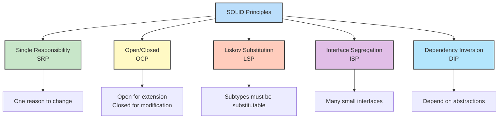
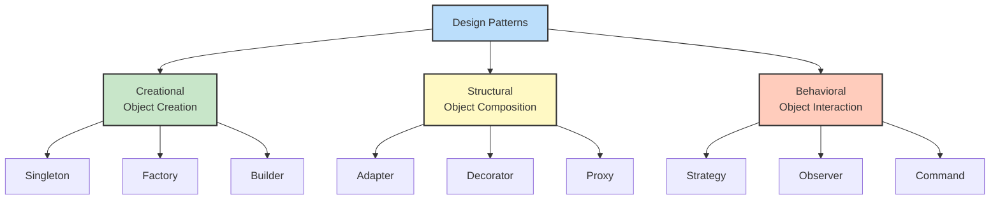

# Day 12: Design Patterns & SOLID Principles

## 🎯 Learning Objectives

- Master SOLID principles with practical examples
- Understand creational patterns (Factory, Builder, Singleton)
- Learn structural patterns (Adapter, Decorator, Proxy)
- Apply behavioral patterns (Strategy, Observer, Command)
- Implement Dependency Injection properly

---

## 1. SOLID Principles

### SOLID Overview



### Design Pattern Categories



### Single Responsibility Principle (SRP)

**Principle:** A class should have only one reason to change.

```csharp
// 🔰 BEGINNER: Understanding SRP

// ❌ BAD - Multiple responsibilities
public class User
{
    public string Name { get; set; }
    public string Email { get; set; }

    public void Save()
    {
        // Database logic
        using var connection = new SqlConnection(connectionString);
        // Save user...
    }

    public void SendEmail(string message)
    {
        // Email logic
        SmtpClient client = new SmtpClient();
        // Send email...
    }

    public string GenerateReport()
    {
        // Reporting logic
        return $"User Report for {Name}";
    }
}

// ✅ GOOD - Single responsibility per class
public class User
{
    public string Name { get; set; }
    public string Email { get; set; }
}

public class UserRepository
{
    public void Save(User user)
    {
        // Database logic only
    }
}

public class EmailService
{
    public void SendEmail(string email, string message)
    {
        // Email logic only
    }
}

public class UserReportGenerator
{
    public string GenerateReport(User user)
    {
        // Reporting logic only
        return $"User Report for {user.Name}";
    }
}
```

### Open/Closed Principle (OCP)

Open for extension, closed for modification.

```csharp
// ❌ BAD - Must modify for new shapes
public class AreaCalculator
{
    public double CalculateArea(object shape)
    {
        if (shape is Rectangle rect)
            return rect.Width * rect.Height;
        else if (shape is Circle circle)
            return Math.PI * circle.Radius * circle.Radius;
        // Must add more if statements for new shapes!
        else
            throw new ArgumentException("Unknown shape");
    }
}

// ✅ GOOD - Open for extension
public interface IShape
{
    double CalculateArea();
}

public class Rectangle : IShape
{
    public double Width { get; set; }
    public double Height { get; set; }

    public double CalculateArea() => Width * Height;
}

public class Circle : IShape
{
    public double Radius { get; set; }

    public double CalculateArea() => Math.PI * Radius * Radius;
}

public class Triangle : IShape // New shape - no modification needed!
{
    public double Base { get; set; }
    public double Height { get; set; }

    public double CalculateArea() => 0.5 * Base * Height;
}

public class AreaCalculator
{
    public double CalculateArea(IShape shape)
    {
        return shape.CalculateArea();
    }
}
```

### Liskov Substitution Principle (LSP)

Subtypes must be substitutable for their base types.

```csharp
// ❌ BAD - Violates LSP
public class Bird
{
    public virtual void Fly()
    {
        Console.WriteLine("Flying");
    }
}

public class Penguin : Bird
{
    public override void Fly()
    {
        throw new NotSupportedException("Penguins can't fly!");
    }
}

// Usage breaks when substituting
Bird bird = new Penguin();
bird.Fly(); // Exception! LSP violation

// ✅ GOOD - Proper hierarchy
public abstract class Bird
{
    public abstract void Move();
}

public class FlyingBird : Bird
{
    public override void Move()
    {
        Console.WriteLine("Flying");
    }
}

public class Penguin : Bird
{
    public override void Move()
    {
        Console.WriteLine("Swimming");
    }
}
```

### Interface Segregation Principle (ISP)

Clients shouldn't depend on interfaces they don't use.

```csharp
// ❌ BAD - Fat interface
public interface IWorker
{
    void Work();
    void Eat();
    void Sleep();
}

public class Human : IWorker
{
    public void Work() { }
    public void Eat() { }
    public void Sleep() { }
}

public class Robot : IWorker
{
    public void Work() { }
    public void Eat() { } // Robots don't eat!
    public void Sleep() { } // Robots don't sleep!
}

// ✅ GOOD - Segregated interfaces
public interface IWorkable
{
    void Work();
}

public interface IFeedable
{
    void Eat();
}

public interface ISleepable
{
    void Sleep();
}

public class Human : IWorkable, IFeedable, ISleepable
{
    public void Work() { }
    public void Eat() { }
    public void Sleep() { }
}

public class Robot : IWorkable
{
    public void Work() { }
}
```

### Dependency Inversion Principle (DIP)

Depend on abstractions, not concretions.

```csharp
// ❌ BAD - Depends on concrete implementation
public class OrderService
{
    private SqlDatabase database = new SqlDatabase();

    public void ProcessOrder(Order order)
    {
        database.Save(order); // Tightly coupled!
    }
}

// ✅ GOOD - Depends on abstraction
public interface IDatabase
{
    void Save(Order order);
}

public class SqlDatabase : IDatabase
{
    public void Save(Order order)
    {
        // SQL implementation
    }
}

public class MongoDatabase : IDatabase
{
    public void Save(Order order)
    {
        // MongoDB implementation
    }
}

public class OrderService
{
    private readonly IDatabase database;

    public OrderService(IDatabase database)
    {
        this.database = database;
    }

    public void ProcessOrder(Order order)
    {
        database.Save(order); // Loosely coupled!
    }
}
```

---

## 2. Creational Patterns

### Factory Pattern

```csharp
public interface IPayment
{
    void ProcessPayment(decimal amount);
}

public class CreditCardPayment : IPayment
{
    public void ProcessPayment(decimal amount)
    {
        Console.WriteLine($"Processing ${amount} via Credit Card");
    }
}

public class PayPalPayment : IPayment
{
    public void ProcessPayment(decimal amount)
    {
        Console.WriteLine($"Processing ${amount} via PayPal");
    }
}

// Factory
public class PaymentFactory
{
    public static IPayment CreatePayment(string type)
    {
        return type.ToLower() switch
        {
            "creditcard" => new CreditCardPayment(),
            "paypal" => new PayPalPayment(),
            _ => throw new ArgumentException("Invalid payment type")
        };
    }
}

// Usage
IPayment payment = PaymentFactory.CreatePayment("creditcard");
payment.ProcessPayment(100);
```

### Abstract Factory Pattern

```csharp
// Abstract products
public interface IButton
{
    void Render();
}

public interface ITextBox
{
    void Render();
}

// Concrete products - Windows
public class WindowsButton : IButton
{
    public void Render() => Console.WriteLine("Windows Button");
}

public class WindowsTextBox : ITextBox
{
    public void Render() => Console.WriteLine("Windows TextBox");
}

// Concrete products - Mac
public class MacButton : IButton
{
    public void Render() => Console.WriteLine("Mac Button");
}

public class MacTextBox : ITextBox
{
    public void Render() => Console.WriteLine("Mac TextBox");
}

// Abstract factory
public interface IUIFactory
{
    IButton CreateButton();
    ITextBox CreateTextBox();
}

// Concrete factories
public class WindowsUIFactory : IUIFactory
{
    public IButton CreateButton() => new WindowsButton();
    public ITextBox CreateTextBox() => new WindowsTextBox();
}

public class MacUIFactory : IUIFactory
{
    public IButton CreateButton() => new MacButton();
    public ITextBox CreateTextBox() => new MacTextBox();
}

// Usage
IUIFactory factory = new WindowsUIFactory();
IButton button = factory.CreateButton();
ITextBox textBox = factory.CreateTextBox();
button.Render();
textBox.Render();
```

### Builder Pattern

```csharp
public class Pizza
{
    public string Dough { get; set; }
    public string Sauce { get; set; }
    public List<string> Toppings { get; set; } = new();
}

public class PizzaBuilder
{
    private Pizza pizza = new Pizza();

    public PizzaBuilder SetDough(string dough)
    {
        pizza.Dough = dough;
        return this;
    }

    public PizzaBuilder SetSauce(string sauce)
    {
        pizza.Sauce = sauce;
        return this;
    }

    public PizzaBuilder AddTopping(string topping)
    {
        pizza.Toppings.Add(topping);
        return this;
    }

    public Pizza Build()
    {
        return pizza;
    }
}

// Usage
Pizza pizza = new PizzaBuilder()
    .SetDough("Thin")
    .SetSauce("Tomato")
    .AddTopping("Cheese")
    .AddTopping("Pepperoni")
    .AddTopping("Mushrooms")
    .Build();
```

### Singleton Pattern

```csharp
public sealed class Singleton
{
    private static readonly Lazy<Singleton> instance =
        new Lazy<Singleton>(() => new Singleton());

    private Singleton()
    {
        // Private constructor
    }

    public static Singleton Instance => instance.Value;

    public void DoSomething()
    {
        Console.WriteLine("Singleton method");
    }
}

// Usage
Singleton.Instance.DoSomething();
```

---

## 3. Structural Patterns

### Adapter Pattern

```csharp
// Existing interface
public interface ITarget
{
    string GetRequest();
}

// Incompatible class
public class Adaptee
{
    public string GetSpecificRequest()
    {
        return "Specific request";
    }
}

// Adapter
public class Adapter : ITarget
{
    private readonly Adaptee adaptee;

    public Adapter(Adaptee adaptee)
    {
        this.adaptee = adaptee;
    }

    public string GetRequest()
    {
        return $"Adapted: {adaptee.GetSpecificRequest()}";
    }
}

// Usage
Adaptee adaptee = new Adaptee();
ITarget target = new Adapter(adaptee);
Console.WriteLine(target.GetRequest());
```

### Decorator Pattern

```csharp
// Component interface
public interface ICoffee
{
    string GetDescription();
    decimal GetCost();
}

// Concrete component
public class SimpleCoffee : ICoffee
{
    public string GetDescription() => "Simple coffee";
    public decimal GetCost() => 2.00m;
}

// Base decorator
public abstract class CoffeeDecorator : ICoffee
{
    protected ICoffee coffee;

    public CoffeeDecorator(ICoffee coffee)
    {
        this.coffee = coffee;
    }

    public virtual string GetDescription() => coffee.GetDescription();
    public virtual decimal GetCost() => coffee.GetCost();
}

// Concrete decorators
public class MilkDecorator : CoffeeDecorator
{
    public MilkDecorator(ICoffee coffee) : base(coffee) { }

    public override string GetDescription() => coffee.GetDescription() + ", milk";
    public override decimal GetCost() => coffee.GetCost() + 0.50m;
}

public class SugarDecorator : CoffeeDecorator
{
    public SugarDecorator(ICoffee coffee) : base(coffee) { }

    public override string GetDescription() => coffee.GetDescription() + ", sugar";
    public override decimal GetCost() => coffee.GetCost() + 0.25m;
}

// Usage
ICoffee coffee = new SimpleCoffee();
coffee = new MilkDecorator(coffee);
coffee = new SugarDecorator(coffee);
Console.WriteLine($"{coffee.GetDescription()}: ${coffee.GetCost()}");
// Output: Simple coffee, milk, sugar: $2.75
```

### Proxy Pattern

```csharp
// Subject interface
public interface IImage
{
    void Display();
}

// Real subject
public class RealImage : IImage
{
    private string fileName;

    public RealImage(string fileName)
    {
        this.fileName = fileName;
        LoadFromDisk();
    }

    private void LoadFromDisk()
    {
        Console.WriteLine($"Loading {fileName}");
    }

    public void Display()
    {
        Console.WriteLine($"Displaying {fileName}");
    }
}

// Proxy
public class ProxyImage : IImage
{
    private RealImage? realImage;
    private string fileName;

    public ProxyImage(string fileName)
    {
        this.fileName = fileName;
    }

    public void Display()
    {
        if (realImage == null)
        {
            realImage = new RealImage(fileName); // Lazy loading
        }
        realImage.Display();
    }
}

// Usage
IImage image = new ProxyImage("photo.jpg");
// Image not loaded yet
image.Display(); // Loads and displays
image.Display(); // Only displays (already loaded)
```

---

## 4. Behavioral Patterns

### Strategy Pattern

```csharp
// Strategy interface
public interface ISortStrategy
{
    void Sort(List<int> list);
}

// Concrete strategies
public class QuickSort : ISortStrategy
{
    public void Sort(List<int> list)
    {
        Console.WriteLine("QuickSort");
        list.Sort();
    }
}

public class MergeSort : ISortStrategy
{
    public void Sort(List<int> list)
    {
        Console.WriteLine("MergeSort");
        // Merge sort implementation
    }
}

// Context
public class Sorter
{
    private ISortStrategy strategy;

    public void SetStrategy(ISortStrategy strategy)
    {
        this.strategy = strategy;
    }

    public void Sort(List<int> list)
    {
        strategy.Sort(list);
    }
}

// Usage
Sorter sorter = new Sorter();
sorter.SetStrategy(new QuickSort());
sorter.Sort(new List<int> { 3, 1, 4, 1, 5 });
```

### Observer Pattern

```csharp
// Observer interface
public interface IObserver
{
    void Update(string message);
}

// Subject
public class Subject
{
    private List<IObserver> observers = new List<IObserver>();

    public void Attach(IObserver observer)
    {
        observers.Add(observer);
    }

    public void Detach(IObserver observer)
    {
        observers.Remove(observer);
    }

    public void Notify(string message)
    {
        foreach (var observer in observers)
        {
            observer.Update(message);
        }
    }
}

// Concrete observers
public class EmailObserver : IObserver
{
    public void Update(string message)
    {
        Console.WriteLine($"Email: {message}");
    }
}

public class SMSObserver : IObserver
{
    public void Update(string message)
    {
        Console.WriteLine($"SMS: {message}");
    }
}

// Usage
Subject subject = new Subject();
subject.Attach(new EmailObserver());
subject.Attach(new SMSObserver());
subject.Notify("Order placed");
```

### Command Pattern

```csharp
// Command interface
public interface ICommand
{
    void Execute();
    void Undo();
}

// Receiver
public class Light
{
    public void TurnOn() => Console.WriteLine("Light ON");
    public void TurnOff() => Console.WriteLine("Light OFF");
}

// Concrete commands
public class TurnOnCommand : ICommand
{
    private Light light;

    public TurnOnCommand(Light light)
    {
        this.light = light;
    }

    public void Execute() => light.TurnOn();
    public void Undo() => light.TurnOff();
}

public class TurnOffCommand : ICommand
{
    private Light light;

    public TurnOffCommand(Light light)
    {
        this.light = light;
    }

    public void Execute() => light.TurnOff();
    public void Undo() => light.TurnOn();
}

// Invoker
public class RemoteControl
{
    private ICommand? command;

    public void SetCommand(ICommand command)
    {
        this.command = command;
    }

    public void PressButton()
    {
        command?.Execute();
    }

    public void PressUndo()
    {
        command?.Undo();
    }
}

// Usage
Light light = new Light();
RemoteControl remote = new RemoteControl();

remote.SetCommand(new TurnOnCommand(light));
remote.PressButton(); // Light ON
remote.PressUndo(); // Light OFF
```

---

## 5. Dependency Injection

### Manual DI

```csharp
public interface ILogger
{
    void Log(string message);
}

public class ConsoleLogger : ILogger
{
    public void Log(string message)
    {
        Console.WriteLine($"[LOG] {message}");
    }
}

public class UserService
{
    private readonly ILogger logger;

    // Constructor injection
    public UserService(ILogger logger)
    {
        this.logger = logger;
    }

    public void CreateUser(string name)
    {
        logger.Log($"Creating user: {name}");
        // Create user...
    }
}

// Usage
ILogger logger = new ConsoleLogger();
UserService service = new UserService(logger);
service.CreateUser("John");
```

### ASP.NET Core DI

```csharp
// Program.cs
var builder = WebApplication.CreateBuilder(args);

// Register services
builder.Services.AddTransient<ILogger, ConsoleLogger>();
builder.Services.AddScoped<IUserRepository, UserRepository>();
builder.Services.AddSingleton<IConfiguration, Configuration>();

var app = builder.Build();

// Controller
public class UsersController : ControllerBase
{
    private readonly IUserRepository repository;
    private readonly ILogger logger;

    public UsersController(IUserRepository repository, ILogger logger)
    {
        this.repository = repository;
        this.logger = logger;
    }

    [HttpGet]
    public IActionResult GetUsers()
    {
        logger.Log("Getting all users");
        var users = repository.GetAll();
        return Ok(users);
    }
}
```

---

## 6. Interview Questions

### Q1: Explain SOLID principles

**Answer:**

- **S**ingle Responsibility: One reason to change
- **O**pen/Closed: Open for extension, closed for modification
- **L**iskov Substitution: Subtypes substitutable for base types
- **I**nterface Segregation: No fat interfaces
- **D**ependency Inversion: Depend on abstractions

### Q2: When to use Factory vs Builder?

**Answer:** **Factory** for simple object creation with different types. **Builder** for complex objects with many optional parameters, step-by-step construction.

### Q3: Difference between Adapter and Decorator?

**Answer:** **Adapter** changes interface to match client expectations. **Decorator** adds functionality without changing interface.

### Q4: What is Dependency Injection?

**Answer:** Pattern where dependencies are provided externally rather than created internally. Enables loose coupling, testability, and flexibility.

### Q5: Strategy vs State pattern?

**Answer:** **Strategy** encapsulates interchangeable algorithms. **State** encapsulates state-specific behavior. Strategy is about behavior selection, State is about behavior change based on state.

---

## 7. Key Takeaways

✅ **SOLID** = maintainable, flexible code
✅ **Factory** for object creation flexibility
✅ **Builder** for complex object construction
✅ **Decorator** for dynamic behavior addition
✅ **Strategy** for algorithm interchangeability
✅ **Observer** for event-driven communication
✅ **DI** for loose coupling and testability

---

## Tomorrow's Preview

**Day 13: Performance & Optimization**

- Benchmarking with BenchmarkDotNet
- Memory optimization
- String performance
- Collection optimization
- JIT compilation

---

**Patterns make code maintainable and extensible!** 🏗️
