# Day 12: Design Patterns & SOLID Principles

## 🎯 Learning Objectives

- Master SOLID principles with real-world examples
- Understand when and how to apply design patterns
- Implement creational patterns (Factory, Builder, Singleton)
- Learn structural patterns (Adapter, Decorator, Proxy)
- Apply behavioral patterns (Strategy, Observer, Command)
- Understand Dependency Injection and IoC containers

---

## 1. SOLID Principles

### SOLID Overview


### Design Pattern Categories

```mermaid
flowchart TB
    subgraph Creational["🏗️ Creational Patterns<br/>(Object Creation)"]
        C1[Singleton]
        C2[Factory Method]
        C3[Abstract Factory]
        C4[Builder]
        C5[Prototype]
    end

    subgraph Structural["🔗 Structural Patterns<br/>(Object Composition)"]
        S1[Adapter]
        S2[Decorator]
        S3[Proxy]
        S4[Facade]
        S5[Composite]
    end

    subgraph Behavioral["🎭 Behavioral Patterns<br/>(Object Interaction)"]
        B1[Strategy]
        B2[Observer]
        B3[Command]
        B4[State]
        B5[Template Method]
    end

    style Creational fill:#E8F5E9,stroke:#4CAF50,stroke-width:2px
    style Structural fill:#FFF3E0,stroke:#FF9800,stroke-width:2px
    style Behavioral fill:#E3F2FD,stroke:#2196F3,stroke-width:2px
```



### Single Responsibility Principle (SRP)

**Principle:** A class should have only one reason to change.

```csharp
// 🔰 BEGINNER: Understanding SRP

// ❌ BAD - Multiple responsibilities
public class User
{
    public string Name { get; set; }
    public string Email { get; set; }

    public void Save()
    {
        // Database logic
        using var connection = new SqlConnection(connectionString);
        // Save user...
    }

    public void SendEmail(string message)
    {
        // Email logic
        SmtpClient client = new SmtpClient();
        // Send email...
    }

    public string GenerateReport()
    {
        // Reporting logic
        return $"User Report for {Name}";
    }
}

// ✅ GOOD - Single responsibility per class
public class User
{
    public string Name { get; set; }
    public string Email { get; set; }
}

public class UserRepository
{
    public void Save(User user)
    {
        // Database logic only
    }
}

public class EmailService
{
    public void SendEmail(string email, string message)
    {
        // Email logic only
    }
}

public class UserReportGenerator
{
    public string GenerateReport(User user)
    {
        // Reporting logic only
        return $"User Report for {user.Name}";
    }
}
```

### Open/Closed Principle (OCP)

Open for extension, closed for modification.

```csharp
// ❌ BAD - Must modify for new shapes
public class AreaCalculator
{
    public double CalculateArea(object shape)
    {
        if (shape is Rectangle rect)
            return rect.Width * rect.Height;
        else if (shape is Circle circle)
            return Math.PI * circle.Radius * circle.Radius;
        // Must add more if statements for new shapes!
        else
            throw new ArgumentException("Unknown shape");
    }
}

// ✅ GOOD - Open for extension
public interface IShape
{
    double CalculateArea();
}

public class Rectangle : IShape
{
    public double Width { get; set; }
    public double Height { get; set; }

    public double CalculateArea() => Width * Height;
}

public class Circle : IShape
{
    public double Radius { get; set; }

    public double CalculateArea() => Math.PI * Radius * Radius;
}

public class Triangle : IShape // New shape - no modification needed!
{
    public double Base { get; set; }
    public double Height { get; set; }

    public double CalculateArea() => 0.5 * Base * Height;
}

public class AreaCalculator
{
    public double CalculateArea(IShape shape)
    {
        return shape.CalculateArea();
    }
}
```

### Liskov Substitution Principle (LSP)

Subtypes must be substitutable for their base types.

```csharp
// ❌ BAD - Violates LSP
public class Bird
{
    public virtual void Fly()
    {
        Console.WriteLine("Flying");
    }
}

public class Penguin : Bird
{
    public override void Fly()
    {
        throw new NotSupportedException("Penguins can't fly!");
    }
}

// Usage breaks when substituting
Bird bird = new Penguin();
bird.Fly(); // Exception! LSP violation

// ✅ GOOD - Proper hierarchy
public abstract class Bird
{
    public abstract void Move();
}

public class FlyingBird : Bird
{
    public override void Move()
    {
        Console.WriteLine("Flying");
    }
}

public class Penguin : Bird
{
    public override void Move()
    {
        Console.WriteLine("Swimming");
    }
}
```

### Interface Segregation Principle (ISP)

Clients shouldn't depend on interfaces they don't use.

```csharp
// ❌ BAD - Fat interface
public interface IWorker
{
    void Work();
    void Eat();
    void Sleep();
}

public class Human : IWorker
{
    public void Work() { }
    public void Eat() { }
    public void Sleep() { }
}

public class Robot : IWorker
{
    public void Work() { }
    public void Eat() { } // Robots don't eat!
    public void Sleep() { } // Robots don't sleep!
}

// ✅ GOOD - Segregated interfaces
public interface IWorkable
{
    void Work();
}

public interface IFeedable
{
    void Eat();
}

public interface ISleepable
{
    void Sleep();
}

public class Human : IWorkable, IFeedable, ISleepable
{
    public void Work() { }
    public void Eat() { }
    public void Sleep() { }
}

public class Robot : IWorkable
{
    public void Work() { }
}
```

### Dependency Inversion Principle (DIP)

**Principle:** Depend on abstractions, not concretions. High-level modules should not depend on low-level modules; both should depend on abstractions.

```csharp
// ❌ BAD - Depends on concrete implementation
public class OrderService
{
    private SqlDatabase database = new SqlDatabase(); // Tightly coupled!
    private EmailService emailService = new EmailService(); // Tightly coupled!

    public void ProcessOrder(Order order)
    {
        database.Save(order);
        emailService.SendConfirmation(order.Email);
    }
}

// Problems:
// - Hard to test (can't mock database/email)
// - Hard to switch implementations
// - Violates Open/Closed principle

// ✅ GOOD - Depends on abstraction
public interface IDatabase
{
    void Save(Order order);
}

public interface IEmailService
{
    void SendConfirmation(string email);
}

public class SqlDatabase : IDatabase
{
    public void Save(Order order)
    {
        // SQL implementation
        Console.WriteLine("Saving to SQL database");
    }
}

public class MongoDatabase : IDatabase
{
    public void Save(Order order)
    {
        // MongoDB implementation
        Console.WriteLine("Saving to MongoDB");
    }
}

public class EmailService : IEmailService
{
    public void SendConfirmation(string email)
    {
        Console.WriteLine($"Sending email to {email}");
    }
}

public class OrderService
{
    private readonly IDatabase _database;
    private readonly IEmailService _emailService;

    // Dependency Injection via constructor
    public OrderService(IDatabase database, IEmailService emailService)
    {
        _database = database;
        _emailService = emailService;
    }

    public void ProcessOrder(Order order)
    {
        _database.Save(order); // Loosely coupled!
        _emailService.SendConfirmation(order.Email);
    }
}

// Usage - Easy to swap implementations
var sqlService = new OrderService(new SqlDatabase(), new EmailService());
var mongoService = new OrderService(new MongoDatabase(), new EmailService());

// Easy to test with mocks
var testService = new OrderService(new MockDatabase(), new MockEmailService());
```

### SOLID Benefits Summary


---

## 2. Creational Patterns

Creational patterns deal with object creation mechanisms, trying to create objects in a manner suitable to the situation.

### Factory Method Pattern

**Purpose:** Define an interface for creating objects, but let subclasses decide which class to instantiate.

**When to use:**

- When you don't know beforehand the exact types of objects your code will work with
- When you want to provide a library of objects without exposing creation logic
- When you want to delegate the responsibility of instantiation to subclasses

```csharp
// 🔰 BEGINNER: Simple Factory

public interface IPayment
{
    void ProcessPayment(decimal amount);
    string GetReceiptNumber();
}

public class CreditCardPayment : IPayment
{
    public void ProcessPayment(decimal amount)
    {
        Console.WriteLine($"Processing ${amount} via Credit Card");
    }

    public string GetReceiptNumber() => $"CC-{Guid.NewGuid().ToString()[..8]}";
}

public class PayPalPayment : IPayment
{
    public void ProcessPayment(decimal amount)
    {
        Console.WriteLine($"Processing ${amount} via PayPal");
    }

    public string GetReceiptNumber() => $"PP-{Guid.NewGuid().ToString()[..8]}";
}

public class BitcoinPayment : IPayment
{
    public void ProcessPayment(decimal amount)
    {
        Console.WriteLine($"Processing ${amount} via Bitcoin");
    }

    public string GetReceiptNumber() => $"BTC-{Guid.NewGuid().ToString()[..8]}";
}

// Simple Factory
public class PaymentFactory
{
    public static IPayment CreatePayment(string type)
    {
        return type.ToLower() switch
        {
            "creditcard" => new CreditCardPayment(),
            "paypal" => new PayPalPayment(),
            "bitcoin" => new BitcoinPayment(),
            _ => throw new ArgumentException($"Unsupported payment type: {type}")
        };
    }
}

// Usage
IPayment payment = PaymentFactory.CreatePayment("creditcard");
payment.ProcessPayment(100.50m);
string receipt = payment.GetReceiptNumber();
Console.WriteLine($"Receipt: {receipt}");

// 🚀 INTERMEDIATE: Factory Method (with inheritance)

public abstract class PaymentProcessor
{
    // Factory method - subclasses override this
    public abstract IPayment CreatePayment();

    public string ProcessTransaction(decimal amount)
    {
        IPayment payment = CreatePayment();
        payment.ProcessPayment(amount);
        return payment.GetReceiptNumber();
    }
}

public class OnlinePaymentProcessor : PaymentProcessor
{
    public override IPayment CreatePayment() => new CreditCardPayment();
}

public class MobilePaymentProcessor : PaymentProcessor
{
    public override IPayment CreatePayment() => new PayPalPayment();
}

public class CryptoPaymentProcessor : PaymentProcessor
{
    public override IPayment CreatePayment() => new BitcoinPayment();
}

// Usage
PaymentProcessor processor = new OnlinePaymentProcessor();
string receipt = processor.ProcessTransaction(250.00m);
```

### Abstract Factory Pattern

**Purpose:** Provide an interface for creating families of related objects without specifying their concrete classes.

**When to use:**

- When system should be independent of how its products are created
- When system should be configured with multiple families of products
- When you want to enforce that related objects are used together

```csharp
// 🚀 INTERMEDIATE: Abstract Factory for UI components

// Abstract products
public interface IButton
{
    void Render();
    void OnClick();
}

public interface ITextBox
{
    void Render();
    string GetText();
}

public interface ICheckbox
{
    void Render();
    bool IsChecked();
}

// Concrete products - Windows
public class WindowsButton : IButton
{
    public void Render() => Console.WriteLine("Rendering Windows Button");
    public void OnClick() => Console.WriteLine("Windows Button clicked");
}

public class WindowsTextBox : ITextBox
{
    public void Render() => Console.WriteLine("Rendering Windows TextBox");
    public string GetText() => "Windows input";
}

public class WindowsCheckbox : ICheckbox
{
    public void Render() => Console.WriteLine("Rendering Windows Checkbox");
    public bool IsChecked() => true;
}

// Concrete products - Mac
public class MacButton : IButton
{
    public void Render() => Console.WriteLine("Rendering Mac Button");
    public void OnClick() => Console.WriteLine("Mac Button clicked");
}

public class MacTextBox : ITextBox
{
    public void Render() => Console.WriteLine("Rendering Mac TextBox");
    public string GetText() => "Mac input";
}

public class MacCheckbox : ICheckbox
{
    public void Render() => Console.WriteLine("Rendering Mac Checkbox");
    public bool IsChecked() => false;
}

// Concrete products - Web
public class WebButton : IButton
{
    public void Render() => Console.WriteLine("Rendering <button>...</button>");
    public void OnClick() => Console.WriteLine("Web Button clicked");
}

public class WebTextBox : ITextBox
{
    public void Render() => Console.WriteLine("Rendering <input type='text'/>");
    public string GetText() => "Web input";
}

public class WebCheckbox : ICheckbox
{
    public void Render() => Console.WriteLine("Rendering <input type='checkbox'/>");
    public bool IsChecked() => true;
}

// Abstract factory
public interface IUIFactory
{
    IButton CreateButton();
    ITextBox CreateTextBox();
    ICheckbox CreateCheckbox();
}

// Concrete factories
public class WindowsUIFactory : IUIFactory
{
    public IButton CreateButton() => new WindowsButton();
    public ITextBox CreateTextBox() => new WindowsTextBox();
    public ICheckbox CreateCheckbox() => new WindowsCheckbox();
}

public class MacUIFactory : IUIFactory
{
    public IButton CreateButton() => new MacButton();
    public ITextBox CreateTextBox() => new MacTextBox();
    public ICheckbox CreateCheckbox() => new MacCheckbox();
}

public class WebUIFactory : IUIFactory
{
    public IButton CreateButton() => new WebButton();
    public ITextBox CreateTextBox() => new WebTextBox();
    public ICheckbox CreateCheckbox() => new WebCheckbox();
}

// Client code
public class Application
{
    private readonly IUIFactory _factory;

    public Application(IUIFactory factory)
    {
        _factory = factory;
    }

    public void CreateUI()
    {
        IButton button = _factory.CreateButton();
        ITextBox textBox = _factory.CreateTextBox();
        ICheckbox checkbox = _factory.CreateCheckbox();

        button.Render();
        textBox.Render();
        checkbox.Render();
    }
}

// Usage - Easy to switch entire UI family
var windowsApp = new Application(new WindowsUIFactory());
windowsApp.CreateUI();

var macApp = new Application(new MacUIFactory());
macApp.CreateUI();

var webApp = new Application(new WebUIFactory());
webApp.CreateUI();
```

### Builder Pattern

**Purpose:** Separate construction of a complex object from its representation, allowing the same construction process to create different representations.

**When to use:**

- When creating complex objects with many optional parameters
- When you want to avoid telescoping constructors
- When construction process must allow different representations
- When you want immutable objects with many fields

```csharp
// 🔰 BEGINNER: Basic Builder

public class Pizza
{
    public string Dough { get; set; }
    public string Sauce { get; set; }
    public string Size { get; set; }
    public List<string> Toppings { get; set; } = new();
    public bool ExtraCheese { get; set; }
    public bool GlutenFree { get; set; }

    public override string ToString()
    {
        return $"{Size} {Dough} pizza with {Sauce} sauce, " +
               $"toppings: {string.Join(", ", Toppings)}" +
               $"{(ExtraCheese ? ", extra cheese" : "")}" +
               $"{(GlutenFree ? ", gluten-free" : "")}";
    }
}

public class PizzaBuilder
{
    private Pizza _pizza = new Pizza();

    public PizzaBuilder SetDough(string dough)
    {
        _pizza.Dough = dough;
        return this;
    }

    public PizzaBuilder SetSauce(string sauce)
    {
        _pizza.Sauce = sauce;
        return this;
    }

    public PizzaBuilder SetSize(string size)
    {
        _pizza.Size = size;
        return this;
    }

    public PizzaBuilder AddTopping(string topping)
    {
        _pizza.Toppings.Add(topping);
        return this;
    }

    public PizzaBuilder WithExtraCheese()
    {
        _pizza.ExtraCheese = true;
        return this;
    }

    public PizzaBuilder MakeGlutenFree()
    {
        _pizza.GlutenFree = true;
        return this;
    }

    public Pizza Build()
    {
        // Validation
        if (string.IsNullOrEmpty(_pizza.Dough))
            throw new InvalidOperationException("Dough must be specified");
        if (string.IsNullOrEmpty(_pizza.Sauce))
            throw new InvalidOperationException("Sauce must be specified");
        if (string.IsNullOrEmpty(_pizza.Size))
            throw new InvalidOperationException("Size must be specified");

        return _pizza;
    }
}

// Usage
Pizza pizza = new PizzaBuilder()
    .SetSize("Large")
    .SetDough("Thin Crust")
    .SetSauce("Tomato")
    .AddTopping("Mozzarella")
    .AddTopping("Pepperoni")
    .AddTopping("Mushrooms")
    .AddTopping("Olives")
    .WithExtraCheese()
    .Build();

Console.WriteLine(pizza);

// 🚀 INTERMEDIATE: Fluent Builder with Director

public class HttpRequestBuilder
{
    private string _method = "GET";
    private string _url;
    private Dictionary<string, string> _headers = new();
    private Dictionary<string, string> _queryParams = new();
    private string _body;
    private int _timeout = 30000;

    public HttpRequestBuilder Method(string method)
    {
        _method = method;
        return this;
    }

    public HttpRequestBuilder Url(string url)
    {
        _url = url;
        return this;
    }

    public HttpRequestBuilder Header(string key, string value)
    {
        _headers[key] = value;
        return this;
    }

    public HttpRequestBuilder QueryParam(string key, string value)
    {
        _queryParams[key] = value;
        return this;
    }

    public HttpRequestBuilder Body(string body)
    {
        _body = body;
        return this;
    }

    public HttpRequestBuilder Timeout(int milliseconds)
    {
        _timeout = milliseconds;
        return this;
    }

    public HttpRequest Build()
    {
        if (string.IsNullOrEmpty(_url))
            throw new InvalidOperationException("URL is required");

        return new HttpRequest
        {
            Method = _method,
            Url = _url,
            Headers = _headers,
            QueryParams = _queryParams,
            Body = _body,
            Timeout = _timeout
        };
    }
}

public class HttpRequest
{
    public string Method { get; init; }
    public string Url { get; init; }
    public Dictionary<string, string> Headers { get; init; }
    public Dictionary<string, string> QueryParams { get; init; }
    public string Body { get; init; }
    public int Timeout { get; init; }

    public string GetFullUrl()
    {
        if (QueryParams.Count == 0) return Url;

        var query = string.Join("&",
            QueryParams.Select(kvp => $"{kvp.Key}={kvp.Value}"));
        return $"{Url}?{query}";
    }
}

// Usage
var request = new HttpRequestBuilder()
    .Method("POST")
    .Url("https://api.example.com/users")
    .Header("Content-Type", "application/json")
    .Header("Authorization", "Bearer token123")
    .QueryParam("version", "v1")
    .QueryParam("format", "json")
    .Body("{\"name\":\"John\",\"age\":30}")
    .Timeout(60000)
    .Build();

// 🎯 ADVANCED: Builder with validation and immutability
public record User
{
    public string Username { get; init; }
    public string Email { get; init; }
    public string FirstName { get; init; }
    public string LastName { get; init; }
    public DateTime? DateOfBirth { get; init; }
    public List<string> Roles { get; init; }
    public bool IsActive { get; init; }
}

public class UserBuilder
{
    private string _username;
    private string _email;
    private string _firstName;
    private string _lastName;
    private DateTime? _dateOfBirth;
    private List<string> _roles = new();
    private bool _isActive = true;

    public UserBuilder WithUsername(string username)
    {
        if (string.IsNullOrWhiteSpace(username))
            throw new ArgumentException("Username cannot be empty");
        if (username.Length < 3)
            throw new ArgumentException("Username must be at least 3 characters");

        _username = username;
        return this;
    }

    public UserBuilder WithEmail(string email)
    {
        if (string.IsNullOrWhiteSpace(email) || !email.Contains("@"))
            throw new ArgumentException("Invalid email address");

        _email = email;
        return this;
    }

    public UserBuilder WithName(string firstName, string lastName)
    {
        _firstName = firstName;
        _lastName = lastName;
        return this;
    }

    public UserBuilder WithDateOfBirth(DateTime dateOfBirth)
    {
        if (dateOfBirth > DateTime.Now)
            throw new ArgumentException("Date of birth cannot be in the future");

        _dateOfBirth = dateOfBirth;
        return this;
    }

    public UserBuilder AddRole(string role)
    {
        if (!_roles.Contains(role))
            _roles.Add(role);
        return this;
    }

    public UserBuilder SetActive(bool isActive)
    {
        _isActive = isActive;
        return this;
    }

    public User Build()
    {
        // Validation
        if (string.IsNullOrEmpty(_username))
            throw new InvalidOperationException("Username is required");
        if (string.IsNullOrEmpty(_email))
            throw new InvalidOperationException("Email is required");

        return new User
        {
            Username = _username,
            Email = _email,
            FirstName = _firstName,
            LastName = _lastName,
            DateOfBirth = _dateOfBirth,
            Roles = new List<string>(_roles), // Create copy for immutability
            IsActive = _isActive
        };
    }
}

// Usage
var user = new UserBuilder()
    .WithUsername("john_doe")
    .WithEmail("john@example.com")
    .WithName("John", "Doe")
    .WithDateOfBirth(new DateTime(1990, 5, 15))
    .AddRole("User")
    .AddRole("Admin")
    .SetActive(true)
    .Build();
```

### Singleton Pattern

**Purpose:** Ensure a class has only one instance and provide a global point of access to it.

**When to use:**

- When exactly one instance of a class is needed
- When instance should be accessible globally
- For managing shared resources (cache, connection pool, logging)

**⚠️ Warning:** Singletons can make code harder to test and create hidden dependencies. Use with caution!

```csharp
// 🔰 BEGINNER: Basic thread-safe Singleton

public sealed class BasicSingleton
{
    private static readonly Lazy<BasicSingleton> _instance =
        new Lazy<BasicSingleton>(() => new BasicSingleton());

    private BasicSingleton()
    {
        // Private constructor prevents instantiation
        Console.WriteLine("Singleton instance created");
    }

    public static BasicSingleton Instance => _instance.Value;

    public void DoSomething()
    {
        Console.WriteLine("Singleton method called");
    }
}

// Usage
BasicSingleton.Instance.DoSomething();
BasicSingleton.Instance.DoSomething();
// Instance created only once, even with multiple calls

// 🚀 INTERMEDIATE: Logger Singleton with functionality

public sealed class Logger
{
    private static readonly Lazy<Logger> _instance =
        new Lazy<Logger>(() => new Logger());

    private readonly object _lock = new object();
    private readonly string _logFile = "app.log";

    private Logger()
    {
        // Initialize logger
    }

    public static Logger Instance => _instance.Value;

    public void Log(string message, LogLevel level = LogLevel.Info)
    {
        lock (_lock) // Thread-safe file access
        {
            string logEntry = $"[{DateTime.Now:yyyy-MM-dd HH:mm:ss}] [{level}] {message}";
            Console.WriteLine(logEntry);
            File.AppendAllText(_logFile, logEntry + Environment.NewLine);
        }
    }

    public void Info(string message) => Log(message, LogLevel.Info);
    public void Warning(string message) => Log(message, LogLevel.Warning);
    public void Error(string message) => Log(message, LogLevel.Error);
}

public enum LogLevel
{
    Info,
    Warning,
    Error
}

// Usage
Logger.Instance.Info("Application started");
Logger.Instance.Warning("This is a warning");
Logger.Instance.Error("An error occurred");

// 🎯 ADVANCED: Configuration Singleton with lazy initialization

public sealed class AppConfiguration
{
    private static readonly Lazy<AppConfiguration> _instance =
        new Lazy<AppConfiguration>(() => new AppConfiguration());

    private readonly Dictionary<string, string> _settings;

    private AppConfiguration()
    {
        // Load configuration (expensive operation - done once)
        _settings = LoadConfiguration();
    }

    public static AppConfiguration Instance => _instance.Value;

    private Dictionary<string, string> LoadConfiguration()
    {
        // Simulate loading from file/database
        Console.WriteLine("Loading configuration...");
        return new Dictionary<string, string>
        {
            ["ConnectionString"] = "Server=localhost;Database=MyDB",
            ["ApiKey"] = "secret-key-12345",
            ["MaxConnections"] = "100",
            ["Timeout"] = "30"
        };
    }

    public string GetSetting(string key)
    {
        return _settings.TryGetValue(key, out string value)
            ? value
            : throw new KeyNotFoundException($"Setting '{key}' not found");
    }

    public T GetSetting<T>(string key)
    {
        string value = GetSetting(key);
        return (T)Convert.ChangeType(value, typeof(T));
    }
}

// Usage
string connectionString = AppConfiguration.Instance.GetSetting("ConnectionString");
int maxConnections = AppConfiguration.Instance.GetSetting<int>("MaxConnections");

// ❌ BAD: Avoid this (hard to test, tight coupling)
public class UserService
{
    public void CreateUser(string name)
    {
        Logger.Instance.Info($"Creating user: {name}");
        // Direct dependency on singleton - hard to test!
    }
}

// ✅ GOOD: Use Dependency Injection instead
public class UserService
{
    private readonly ILogger _logger;

    public UserService(ILogger logger)
    {
        _logger = logger; // Injected dependency - easy to test!
    }

    public void CreateUser(string name)
    {
        _logger.Info($"Creating user: {name}");
    }
}
```

### Prototype Pattern (Bonus)

**Purpose:** Create new objects by copying existing objects (prototypes) rather than creating from scratch.

```csharp
// 🚀 INTERMEDIATE: Prototype pattern for cloning

public interface IPrototype<T>
{
    T Clone();
}

public class Employee : IPrototype<Employee>
{
    public string Name { get; set; }
    public string Department { get; set; }
    public Address Address { get; set; }
    public List<string> Skills { get; set; } = new();

    public Employee Clone()
    {
        // Shallow copy
        return (Employee)MemberwiseClone();
    }

    public Employee DeepClone()
    {
        // Deep copy
        return new Employee
        {
            Name = this.Name,
            Department = this.Department,
            Address = this.Address?.Clone(), // Clone nested objects
            Skills = new List<string>(this.Skills) // Clone collections
        };
    }
}

public class Address : IPrototype<Address>
{
    public string Street { get; set; }
    public string City { get; set; }
    public string State { get; set; }

    public Address Clone()
    {
        return (Address)MemberwiseClone();
    }
}

// Usage
var original = new Employee
{
    Name = "John Doe",
    Department = "IT",
    Address = new Address { Street = "123 Main St", City = "Seattle", State = "WA" },
    Skills = new List<string> { "C#", "SQL", "Azure" }
};

// Shallow clone - shares references
var shallowCopy = original.Clone();
shallowCopy.Address.City = "Portland"; // Affects original!

// Deep clone - independent copy
var deepCopy = original.DeepClone();
deepCopy.Address.City = "Portland"; // Doesn't affect original
```

---

## 3. Structural Patterns

Structural patterns explain how to assemble objects and classes into larger structures while keeping these structures flexible and efficient.

### Adapter Pattern

```csharp
// Existing interface
public interface ITarget
{
    string GetRequest();
}

// Incompatible class
public class Adaptee
{
    public string GetSpecificRequest()
    {
        return "Specific request";
    }
}

// Adapter
public class Adapter : ITarget
{
    private readonly Adaptee adaptee;

    public Adapter(Adaptee adaptee)
    {
        this.adaptee = adaptee;
    }

    public string GetRequest()
    {
        return $"Adapted: {adaptee.GetSpecificRequest()}";
    }
}

// Usage
Adaptee adaptee = new Adaptee();
ITarget target = new Adapter(adaptee);
Console.WriteLine(target.GetRequest());
```

### Decorator Pattern

```csharp
// Component interface
public interface ICoffee
{
    string GetDescription();
    decimal GetCost();
}

// Concrete component
public class SimpleCoffee : ICoffee
{
    public string GetDescription() => "Simple coffee";
    public decimal GetCost() => 2.00m;
}

// Base decorator
public abstract class CoffeeDecorator : ICoffee
{
    protected ICoffee coffee;

    public CoffeeDecorator(ICoffee coffee)
    {
        this.coffee = coffee;
    }

    public virtual string GetDescription() => coffee.GetDescription();
    public virtual decimal GetCost() => coffee.GetCost();
}

// Concrete decorators
public class MilkDecorator : CoffeeDecorator
{
    public MilkDecorator(ICoffee coffee) : base(coffee) { }

    public override string GetDescription() => coffee.GetDescription() + ", milk";
    public override decimal GetCost() => coffee.GetCost() + 0.50m;
}

public class SugarDecorator : CoffeeDecorator
{
    public SugarDecorator(ICoffee coffee) : base(coffee) { }

    public override string GetDescription() => coffee.GetDescription() + ", sugar";
    public override decimal GetCost() => coffee.GetCost() + 0.25m;
}

// Usage
ICoffee coffee = new SimpleCoffee();
coffee = new MilkDecorator(coffee);
coffee = new SugarDecorator(coffee);
Console.WriteLine($"{coffee.GetDescription()}: ${coffee.GetCost()}");
// Output: Simple coffee, milk, sugar: $2.75
```

### Proxy Pattern

```csharp
// Subject interface
public interface IImage
{
    void Display();
}

// Real subject
public class RealImage : IImage
{
    private string fileName;

    public RealImage(string fileName)
    {
        this.fileName = fileName;
        LoadFromDisk();
    }

    private void LoadFromDisk()
    {
        Console.WriteLine($"Loading {fileName}");
    }

    public void Display()
    {
        Console.WriteLine($"Displaying {fileName}");
    }
}

// Proxy
public class ProxyImage : IImage
{
    private RealImage? realImage;
    private string fileName;

    public ProxyImage(string fileName)
    {
        this.fileName = fileName;
    }

    public void Display()
    {
        if (realImage == null)
        {
            realImage = new RealImage(fileName); // Lazy loading
        }
        realImage.Display();
    }
}

// Usage
IImage image = new ProxyImage("photo.jpg");
// Image not loaded yet
image.Display(); // Loads and displays
image.Display(); // Only displays (already loaded)
```

---

## 4. Behavioral Patterns

### Strategy Pattern

```csharp
// Strategy interface
public interface ISortStrategy
{
    void Sort(List<int> list);
}

// Concrete strategies
public class QuickSort : ISortStrategy
{
    public void Sort(List<int> list)
    {
        Console.WriteLine("QuickSort");
        list.Sort();
    }
}

public class MergeSort : ISortStrategy
{
    public void Sort(List<int> list)
    {
        Console.WriteLine("MergeSort");
        // Merge sort implementation
    }
}

// Context
public class Sorter
{
    private ISortStrategy strategy;

    public void SetStrategy(ISortStrategy strategy)
    {
        this.strategy = strategy;
    }

    public void Sort(List<int> list)
    {
        strategy.Sort(list);
    }
}

// Usage
Sorter sorter = new Sorter();
sorter.SetStrategy(new QuickSort());
sorter.Sort(new List<int> { 3, 1, 4, 1, 5 });
```

### Observer Pattern

```csharp
// Observer interface
public interface IObserver
{
    void Update(string message);
}

// Subject
public class Subject
{
    private List<IObserver> observers = new List<IObserver>();

    public void Attach(IObserver observer)
    {
        observers.Add(observer);
    }

    public void Detach(IObserver observer)
    {
        observers.Remove(observer);
    }

    public void Notify(string message)
    {
        foreach (var observer in observers)
        {
            observer.Update(message);
        }
    }
}

// Concrete observers
public class EmailObserver : IObserver
{
    public void Update(string message)
    {
        Console.WriteLine($"Email: {message}");
    }
}

public class SMSObserver : IObserver
{
    public void Update(string message)
    {
        Console.WriteLine($"SMS: {message}");
    }
}

// Usage
Subject subject = new Subject();
subject.Attach(new EmailObserver());
subject.Attach(new SMSObserver());
subject.Notify("Order placed");
```

### Command Pattern

```csharp
// Command interface
public interface ICommand
{
    void Execute();
    void Undo();
}

// Receiver
public class Light
{
    public void TurnOn() => Console.WriteLine("Light ON");
    public void TurnOff() => Console.WriteLine("Light OFF");
}

// Concrete commands
public class TurnOnCommand : ICommand
{
    private Light light;

    public TurnOnCommand(Light light)
    {
        this.light = light;
    }

    public void Execute() => light.TurnOn();
    public void Undo() => light.TurnOff();
}

public class TurnOffCommand : ICommand
{
    private Light light;

    public TurnOffCommand(Light light)
    {
        this.light = light;
    }

    public void Execute() => light.TurnOff();
    public void Undo() => light.TurnOn();
}

// Invoker
public class RemoteControl
{
    private ICommand? command;

    public void SetCommand(ICommand command)
    {
        this.command = command;
    }

    public void PressButton()
    {
        command?.Execute();
    }

    public void PressUndo()
    {
        command?.Undo();
    }
}

// Usage
Light light = new Light();
RemoteControl remote = new RemoteControl();

remote.SetCommand(new TurnOnCommand(light));
remote.PressButton(); // Light ON
remote.PressUndo(); // Light OFF
```

---

## 5. Dependency Injection

### Manual DI

```csharp
public interface ILogger
{
    void Log(string message);
}

public class ConsoleLogger : ILogger
{
    public void Log(string message)
    {
        Console.WriteLine($"[LOG] {message}");
    }
}

public class UserService
{
    private readonly ILogger logger;

    // Constructor injection
    public UserService(ILogger logger)
    {
        this.logger = logger;
    }

    public void CreateUser(string name)
    {
        logger.Log($"Creating user: {name}");
        // Create user...
    }
}

// Usage
ILogger logger = new ConsoleLogger();
UserService service = new UserService(logger);
service.CreateUser("John");
```

### ASP.NET Core DI

```csharp
// Program.cs
var builder = WebApplication.CreateBuilder(args);

// Register services
builder.Services.AddTransient<ILogger, ConsoleLogger>();
builder.Services.AddScoped<IUserRepository, UserRepository>();
builder.Services.AddSingleton<IConfiguration, Configuration>();

var app = builder.Build();

// Controller
public class UsersController : ControllerBase
{
    private readonly IUserRepository repository;
    private readonly ILogger logger;

    public UsersController(IUserRepository repository, ILogger logger)
    {
        this.repository = repository;
        this.logger = logger;
    }

    [HttpGet]
    public IActionResult GetUsers()
    {
        logger.Log("Getting all users");
        var users = repository.GetAll();
        return Ok(users);
    }
}
```

---

## 6. Interview Questions & Answers

### Q1: Explain the SOLID principles with examples

**Answer:**

**S - Single Responsibility Principle:**
A class should have only one reason to change. Each class should have one job/responsibility.

```csharp
// ❌ BAD: Multiple responsibilities
public class User
{
    public void SaveToDatabase() { } // Data access
    public void SendEmail() { }      // Email
    public void ValidateData() { }   // Validation
}

// ✅ GOOD: Separated responsibilities
public class User { /* Data only */ }
public class UserRepository { void Save(User user) { } }
public class EmailService { void Send(string email) { } }
public class UserValidator { bool Validate(User user) { } }
```

**O - Open/Closed Principle:**
Open for extension, closed for modification. Add new functionality without changing existing code.

```csharp
// ✅ GOOD: Add new shapes without modifying AreaCalculator
public interface IShape { double CalculateArea(); }
public class Circle : IShape { /* ... */ }
public class Rectangle : IShape { /* ... */ }
public class Triangle : IShape { /* ... */ } // New shape - no changes needed
```

**L - Liskov Substitution Principle:**
Derived classes must be substitutable for their base classes without breaking the application.

```csharp
// ❌ BAD: Square violates LSP
public class Rectangle
{
    public virtual int Width { get; set; }
    public virtual int Height { get; set; }
}

public class Square : Rectangle
{
    public override int Width
    {
        set { base.Width = base.Height = value; } // Unexpected behavior!
    }
}

// ✅ GOOD: Separate hierarchy
public interface IShape { double GetArea(); }
public class Rectangle : IShape { /* ... */ }
public class Square : IShape { /* ... */ }
```

**I - Interface Segregation Principle:**
Clients shouldn't be forced to depend on interfaces they don't use. Many specific interfaces are better than one general-purpose interface.

```csharp
// ❌ BAD: Fat interface
public interface IWorker
{
    void Work();
    void Eat();  // Robots don't eat
    void Sleep(); // Robots don't sleep
}

// ✅ GOOD: Segregated interfaces
public interface IWorkable { void Work(); }
public interface IFeedable { void Eat(); }
public interface ISleepable { void Sleep(); }
```

**D - Dependency Inversion Principle:**
Depend on abstractions, not concretions. High-level modules shouldn't depend on low-level modules.

```csharp
// ❌ BAD: Depends on concrete class
public class OrderService
{
    private SqlDatabase db = new SqlDatabase(); // Tight coupling
}

// ✅ GOOD: Depends on abstraction
public class OrderService
{
    private readonly IDatabase _db;
    public OrderService(IDatabase db) => _db = db; // Loose coupling
}
```

### Q2: When would you use Factory Method vs Abstract Factory?

**Answer:**

| Aspect         | Factory Method                  | Abstract Factory                               |
| -------------- | ------------------------------- | ---------------------------------------------- |
| **Purpose**    | Create one product              | Create families of related products            |
| **Complexity** | Simpler                         | More complex                                   |
| **Use when**   | Single product creation         | Multiple related products                      |
| **Example**    | PaymentFactory creates IPayment | UIFactory creates IButton, ITextBox, ICheckbox |

**Factory Method:**

```csharp
// Single product type
public interface IPayment { }
public class PaymentFactory
{
    public static IPayment Create(string type) => type switch
    {
        "credit" => new CreditCardPayment(),
        "paypal" => new PayPalPayment(),
        _ => throw new ArgumentException()
    };
}
```

**Abstract Factory:**

```csharp
// Family of related products
public interface IUIFactory
{
    IButton CreateButton();
    ITextBox CreateTextBox();
    ICheckbox CreateCheckbox();
}

// All Windows components work together
public class WindowsUIFactory : IUIFactory { /* ... */ }
// All Mac components work together
public class MacUIFactory : IUIFactory { /* ... */ }
```

**When to use Factory Method:**

- Creating different variations of a single product
- Decision on which class to instantiate
- Example: Different payment processors, different loggers

**When to use Abstract Factory:**

- Creating families of related objects that must be used together
- Ensuring product consistency (all Windows UI or all Mac UI)
- Example: UI component libraries, database access layers (SQL + SqlConnection + SqlCommand)

### Q3: Explain the Builder pattern and when to use it

**Answer:**

**Builder Pattern** separates construction of complex objects from representation. It's useful when:

- Object has many parameters (especially optional ones)
- Want to avoid telescoping constructors
- Object construction requires multiple steps
- Want immutable objects with many fields

**Problems it solves:**

```csharp
// ❌ BAD: Telescoping constructor
public class HttpRequest
{
    public HttpRequest(string url) { }
    public HttpRequest(string url, string method) { }
    public HttpRequest(string url, string method, Dictionary<string, string> headers) { }
    public HttpRequest(string url, string method, Dictionary<string, string> headers,
                       string body) { }
    // Becomes unmanageable with many parameters!
}

// ❌ BAD: Setters (mutable, no validation)
var request = new HttpRequest();
request.Url = "...";
request.Method = "POST";
request.Body = "...";
// Can forget required fields, object in invalid state

// ✅ GOOD: Builder pattern
var request = new HttpRequestBuilder()
    .Url("https://api.example.com")
    .Method("POST")
    .Header("Content-Type", "application/json")
    .Body("{...}")
    .Timeout(5000)
    .Build(); // Validation happens here
```

**Key benefits:**

- Fluent, readable API
- Validation at build time
- Produces immutable objects
- Step-by-step construction
- Can create different representations with same builder

**Real-world examples:**

- StringBuilder (built into C#)
- HttpRequestMessage configuration
- Query builders (LINQ, SQL)
- Test data builders

### Q4: What's the difference between Adapter and Decorator patterns?

**Answer:**

| Aspect        | Adapter                                       | Decorator                                    |
| ------------- | --------------------------------------------- | -------------------------------------------- |
| **Purpose**   | Make incompatible interfaces work together    | Add functionality without modifying original |
| **Interface** | Changes the interface                         | Keeps same interface                         |
| **When**      | Existing classes with incompatible interfaces | Want to add responsibilities dynamically     |
| **Analogy**   | Power adapter (changes plug type)             | Gift wrapping (adds decoration)              |

**Adapter Example:**

```csharp
// You have ITarget interface but library uses Adaptee
public interface ITarget
{
    string GetRequest();
}

public class Adaptee
{
    public string GetSpecificRequest() => "Specific";
}

// Adapter makes Adaptee compatible with ITarget
public class Adapter : ITarget
{
    private readonly Adaptee _adaptee;

    public Adapter(Adaptee adaptee) => _adaptee = adaptee;

    public string GetRequest() => _adaptee.GetSpecificRequest();
}

// Usage
ITarget target = new Adapter(new Adaptee());
```

**Decorator Example:**

```csharp
// Add functionality while keeping same interface
public interface ICoffee
{
    string GetDescription();
    decimal GetCost();
}

public class SimpleCoffee : ICoffee
{
    public string GetDescription() => "Simple coffee";
    public decimal GetCost() => 2.00m;
}

// Decorator adds milk
public class MilkDecorator : ICoffee
{
    private readonly ICoffee _coffee;

    public MilkDecorator(ICoffee coffee) => _coffee = coffee;

    public string GetDescription() => _coffee.GetDescription() + ", milk";
    public decimal GetCost() => _coffee.GetCost() + 0.50m;
}

// Usage - wrap multiple decorators
ICoffee coffee = new SimpleCoffee();
coffee = new MilkDecorator(coffee);
coffee = new SugarDecorator(coffee);
// Result: "Simple coffee, milk, sugar" - $2.75
```

**Key differences:**

- **Adapter**: "I need this object to work with that interface"
- **Decorator**: "I want to add features to this object"

### Q5: Explain Dependency Injection and its benefits

**Answer:**

**Dependency Injection (DI)** is providing dependencies from outside rather than creating them inside a class.

**Three types:**

**1. Constructor Injection (Recommended):**

```csharp
public class OrderService
{
    private readonly IDatabase _db;
    private readonly IEmailService _email;

    // Dependencies injected via constructor
    public OrderService(IDatabase db, IEmailService email)
    {
        _db = db;
        _email = email;
    }
}
```

**2. Property Injection:**

```csharp
public class OrderService
{
    public IDatabase Database { get; set; } // Injected via property
}
```

**3. Method Injection:**

```csharp
public class OrderService
{
    public void ProcessOrder(Order order, IDatabase db) // Injected per method
    {
        db.Save(order);
    }
}
```

**Benefits:**

✅ **Testability**: Easy to mock dependencies

```csharp
// Testing with mock
var mockDb = new MockDatabase();
var service = new OrderService(mockDb, new MockEmail());
service.ProcessOrder(order);
Assert.IsTrue(mockDb.SaveCalled);
```

✅ **Loose Coupling**: Classes don't create dependencies

```csharp
// Can swap implementations easily
var service1 = new OrderService(new SqlDatabase(), new EmailService());
var service2 = new OrderService(new MongoDatabase(), new SmsService());
```

✅ **Flexibility**: Configure at runtime

```csharp
// Different configurations
if (config.UseCloud)
    services.AddScoped<IDatabase, CosmosDb>();
else
    services.AddScoped<IDatabase, SqlDatabase>();
```

✅ **Single Responsibility**: Classes focus on their logic, not dependency creation

✅ **Reusability**: Dependencies can be shared across classes

**DI Container Example (ASP.NET Core):**

```csharp
// Register dependencies
builder.Services.AddTransient<IEmailService, EmailService>();
builder.Services.AddScoped<IDatabase, SqlDatabase>();
builder.Services.AddSingleton<IConfiguration, Configuration>();

// Container automatically resolves dependencies
public class OrderController : Controller
{
    private readonly IDatabase _db;

    // Constructor injection - container provides dependencies
    public OrderController(IDatabase db) => _db = db;
}
```

**Lifetimes:**

- **Transient**: New instance every time
- **Scoped**: One instance per request/scope
- **Singleton**: One instance for application lifetime

### Q6: What's the difference between Strategy and State patterns?

**Answer:**

Both use composition to change behavior, but for different purposes:

| Aspect          | Strategy                            | State                                   |
| --------------- | ----------------------------------- | --------------------------------------- |
| **Purpose**     | Choose algorithm at runtime         | Change behavior based on internal state |
| **Who changes** | Client chooses strategy             | Object changes own state                |
| **Example**     | Payment methods, sorting algorithms | Order status, connection state          |
| **Analogy**     | Choosing transportation method      | Traffic light changing colors           |

**Strategy Pattern:**

```csharp
// Client chooses which algorithm to use
public interface ISortStrategy
{
    void Sort(int[] array);
}

public class QuickSort : ISortStrategy { /* ... */ }
public class BubbleSort : ISortStrategy { /* ... */ }

public class Sorter
{
    private ISortStrategy _strategy;

    public void SetStrategy(ISortStrategy strategy)
    {
        _strategy = strategy; // Client changes strategy
    }

    public void Sort(int[] array)
    {
        _strategy.Sort(array);
    }
}

// Usage - client decides
var sorter = new Sorter();
if (array.Length < 10)
    sorter.SetStrategy(new BubbleSort());
else
    sorter.SetStrategy(new QuickSort());
```

**State Pattern:**

```csharp
// Object changes own state based on conditions
public interface IOrderState
{
    void Process(Order order);
}

public class PendingState : IOrderState
{
    public void Process(Order order)
    {
        Console.WriteLine("Processing order...");
        order.SetState(new ProcessingState()); // Object changes own state
    }
}

public class ProcessingState : IOrderState
{
    public void Process(Order order)
    {
        Console.WriteLine("Shipping order...");
        order.SetState(new ShippedState()); // State transition
    }
}

public class Order
{
    private IOrderState _state = new PendingState();

    public void SetState(IOrderState state) => _state = state;

    public void Process()
    {
        _state.Process(this); // State handles behavior
    }
}

// Usage - object manages state internally
var order = new Order();
order.Process(); // Pending -> Processing
order.Process(); // Processing -> Shipped
```

**Key differences:**

- **Strategy**: "How should I do this task?" (interchangeable algorithms)
- **State**: "What should I do now?" (behavior based on current state)

### Q7: When should you use Singleton pattern and when to avoid it?

**Answer:**

**Singleton** ensures only one instance exists globally.

**✅ When to use:**

- Exactly one instance needed (connection pool, cache, logger)
- Global access point required
- Resource is expensive to create
- Shared state across application

**Good use cases:**

```csharp
// Configuration - loaded once
public sealed class AppConfig
{
    private static readonly Lazy<AppConfig> _instance = new(() => new AppConfig());
    public static AppConfig Instance => _instance.Value;

    private AppConfig()
    {
        // Load expensive configuration once
    }
}

// Logger - centralized logging
public sealed class Logger
{
    private static readonly Lazy<Logger> _instance = new(() => new Logger());
    public static Logger Instance => _instance.Value;
}

// Database connection pool
public sealed class ConnectionPool
{
    private static readonly Lazy<ConnectionPool> _instance = new(() => new ConnectionPool());
    public static ConnectionPool Instance => _instance.Value;
}
```

**❌ When to avoid:**

1. **Makes testing difficult:**

```csharp
// BAD - Hard to test (can't mock singleton)
public class OrderService
{
    public void Process(Order order)
    {
        Logger.Instance.Log("Processing..."); // Tight coupling to singleton
    }
}

// GOOD - Use DI instead
public class OrderService
{
    private readonly ILogger _logger;

    public OrderService(ILogger logger) => _logger = logger; // Can mock
}
```

2. **Hidden dependencies:**

```csharp
// BAD - Dependency not visible in constructor
public class OrderService
{
    public void Process()
    {
        var config = AppConfig.Instance; // Hidden dependency!
    }
}

// GOOD - Explicit dependency
public class OrderService
{
    private readonly IConfiguration _config;

    public OrderService(IConfiguration config) => _config = config;
}
```

3. **Violates Single Responsibility:**
   Singleton manages both:

- Its business logic
- Its lifecycle (instance management)

4. **Global state issues:**

- Hard to reason about
- Difficult to track who modifies it
- Can cause bugs in concurrent scenarios

**Modern alternative: Dependency Injection**

```csharp
// Register as singleton in DI container
builder.Services.AddSingleton<ILogger, Logger>();

// Benefits:
// - Easy to test (can provide mock)
// - Explicit dependencies
// - Follows SOLID principles
// - Still only one instance
```

**Verdict:** Prefer DI over Singleton in most modern applications!

### Q8: Explain the Observer pattern and give a real-world example

**Answer:**

**Observer Pattern** defines one-to-many dependency between objects. When one object (subject) changes state, all dependents (observers) are notified automatically.

**Real-world analogy:** Newsletter subscription - when publisher publishes new content, all subscribers are notified.

**Implementation:**

```csharp
// Subject interface
public interface ISubject
{
    void Attach(IObserver observer);
    void Detach(IObserver observer);
    void Notify();
}

// Observer interface
public interface IObserver
{
    void Update(string message);
}

// Concrete subject
public class NewsPublisher : ISubject
{
    private List<IObserver> _observers = new();
    private string _latestNews;

    public void Attach(IObserver observer)
    {
        _observers.Add(observer);
    }

    public void Detach(IObserver observer)
    {
        _observers.Remove(observer);
    }

    public void Notify()
    {
        foreach (var observer in _observers)
        {
            observer.Update(_latestNews);
        }
    }

    public void PublishNews(string news)
    {
        _latestNews = news;
        Notify(); // Notify all observers
    }
}

// Concrete observers
public class EmailSubscriber : IObserver
{
    private string _email;

    public EmailSubscriber(string email) => _email = email;

    public void Update(string message)
    {
        Console.WriteLine($"Email to {_email}: {message}");
    }
}

public class SmsSubscriber : IObserver
{
    private string _phone;

    public SmsSubscriber(string phone) => _phone = phone;

    public void Update(string message)
    {
        Console.WriteLine($"SMS to {_phone}: {message}");
    }
}

// Usage
var publisher = new NewsPublisher();

var emailSub = new EmailSubscriber("john@example.com");
var smsSub = new SmsSubscriber("+1234567890");

publisher.Attach(emailSub);
publisher.Attach(smsSub);

publisher.PublishNews("Breaking: C# 12 released!");
// Both subscribers notified
```

**Real-world examples in C#:**

- **Events**: `event EventHandler<EventArgs>`
- **IObservable/IObserver**: Reactive Extensions (Rx)
- **INotifyPropertyChanged**: WPF/XAML data binding
- **File watchers**: FileSystemWatcher

**Using C# events (built-in Observer):**

```csharp
public class StockMarket
{
    public event EventHandler<StockPriceChangedEventArgs> PriceChanged;

    private decimal _price;
    public decimal Price
    {
        get => _price;
        set
        {
            _price = value;
            OnPriceChanged(new StockPriceChangedEventArgs(value));
        }
    }

    protected virtual void OnPriceChanged(StockPriceChangedEventArgs e)
    {
        PriceChanged?.Invoke(this, e);
    }
}

public class StockPriceChangedEventArgs : EventArgs
{
    public decimal NewPrice { get; }
    public StockPriceChangedEventArgs(decimal price) => NewPrice = price;
}

// Usage
var market = new StockMarket();
market.PriceChanged += (sender, e) =>
    Console.WriteLine($"Price changed to: ${e.NewPrice}");

market.Price = 150.25m; // Triggers event
```

**Benefits:**

- Loose coupling between subject and observers
- Dynamic relationships (add/remove observers at runtime)
- Broadcast communication (one-to-many)
- Supports event-driven architecture

**Drawbacks:**

- Memory leaks if observers aren't detached
- Notification order not guaranteed
- Can be hard to debug (indirect dependencies)

### Q9: What is the Command pattern and when would you use it?

**Answer:**

**Command Pattern** encapsulates a request as an object, allowing you to parameterize clients with different requests, queue or log requests, and support undoable operations.

**Key concepts:**

- **Command**: Interface with Execute() method
- **Concrete Command**: Implements specific action
- **Invoker**: Triggers command execution
- **Receiver**: Performs the actual work

**Use cases:**

- Undo/Redo functionality
- Queue operations
- Deferred execution
- Transaction management
- Macro recording

**Implementation:**

```csharp
// Command interface
public interface ICommand
{
    void Execute();
    void Undo();
}

// Receiver - does actual work
public class Light
{
    public void TurnOn() => Console.WriteLine("Light is ON");
    public void TurnOff() => Console.WriteLine("Light is OFF");
}

// Concrete commands
public class LightOnCommand : ICommand
{
    private readonly Light _light;

    public LightOnCommand(Light light) => _light = light;

    public void Execute() => _light.TurnOn();
    public void Undo() => _light.TurnOff();
}

public class LightOffCommand : ICommand
{
    private readonly Light _light;

    public LightOffCommand(Light light) => _light = light;

    public void Execute() => _light.TurnOff();
    public void Undo() => _light.TurnOn();
}

// Invoker - triggers commands
public class RemoteControl
{
    private readonly Stack<ICommand> _commandHistory = new();

    public void ExecuteCommand(ICommand command)
    {
        command.Execute();
        _commandHistory.Push(command);
    }

    public void Undo()
    {
        if (_commandHistory.Count > 0)
        {
            var command = _commandHistory.Pop();
            command.Undo();
        }
    }
}

// Usage
var light = new Light();
var remote = new RemoteControl();

var lightOn = new LightOnCommand(light);
var lightOff = new LightOffCommand(light);

remote.ExecuteCommand(lightOn);  // Light is ON
remote.ExecuteCommand(lightOff); // Light is OFF
remote.Undo();                   // Light is ON (undo off command)
```

**Advanced example: Text editor with undo/redo:**

```csharp
public interface ICommand
{
    void Execute();
    void Undo();
}

public class TextEditor
{
    private StringBuilder _text = new();

    public void InsertText(string text, int position)
    {
        _text.Insert(position, text);
        Console.WriteLine($"Current text: {_text}");
    }

    public void DeleteText(int position, int length)
    {
        _text.Remove(position, length);
        Console.WriteLine($"Current text: {_text}");
    }

    public string GetText() => _text.ToString();
}

public class InsertCommand : ICommand
{
    private readonly TextEditor _editor;
    private readonly string _text;
    private readonly int _position;

    public InsertCommand(TextEditor editor, string text, int position)
    {
        _editor = editor;
        _text = text;
        _position = position;
    }

    public void Execute() => _editor.InsertText(_text, _position);
    public void Undo() => _editor.DeleteText(_position, _text.Length);
}

public class DeleteCommand : ICommand
{
    private readonly TextEditor _editor;
    private readonly int _position;
    private readonly int _length;
    private string _deletedText;

    public DeleteCommand(TextEditor editor, int position, int length)
    {
        _editor = editor;
        _position = position;
        _length = length;
    }

    public void Execute()
    {
        _deletedText = _editor.GetText().Substring(_position, _length);
        _editor.DeleteText(_position, _length);
    }

    public void Undo() => _editor.InsertText(_deletedText, _position);
}

// Usage
var editor = new TextEditor();
var history = new CommandHistory();

history.Execute(new InsertCommand(editor, "Hello", 0));
history.Execute(new InsertCommand(editor, " World", 5));
history.Execute(new DeleteCommand(editor, 5, 6));
history.Undo(); // Restores " World"
```

**Benefits:**

- Decouples sender from receiver
- Easy to add new commands (Open/Closed principle)
- Supports undo/redo operations
- Can log, queue, or schedule commands
- Supports macro/composite commands

**Real-world examples:**

- Text editors (undo/redo)
- Database transactions
- Job queues
- GUI buttons/menu actions
- Task schedulers

### Q10: How do you decide which design pattern to use?

**Answer:**

**Decision process:**

1. **Identify the problem:**

   - What is the specific challenge?
   - What aspect of design is causing issues?

2. **Match problem to pattern category:**

**Creational (Object creation):**

- Too many constructor parameters? → **Builder**
- Need different variations? → **Factory**
- Need consistent families? → **Abstract Factory**
- Only one instance needed? → **Singleton**

**Structural (Object composition):**

- Incompatible interfaces? → **Adapter**
- Add features dynamically? → **Decorator**
- Control access? → **Proxy**
- Simplify complex system? → **Facade**

**Behavioral (Object interaction):**

- Interchangeable algorithms? → **Strategy**
- Notify multiple objects? → **Observer**
- Behavior based on state? → **State**
- Undo/redo operations? → **Command**

3. **Consider trade-offs:**

   - Complexity vs. flexibility
   - Performance vs. maintainability
   - Learning curve for team

4. **Don't force patterns:**
   - YAGNI (You Aren't Gonna Need It)
   - Start simple, refactor when needed
   - Patterns should solve real problems

**Quick reference table:**

| Problem                     | Pattern           | When to Use                    |
| --------------------------- | ----------------- | ------------------------------ |
| Object creation too complex | Builder           | Many optional parameters       |
| Need different object types | Factory           | Runtime type decision          |
| Families of related objects | Abstract Factory  | Consistent product families    |
| Only one instance           | Singleton (or DI) | Global resource management     |
| Incompatible interfaces     | Adapter           | Legacy code integration        |
| Add features dynamically    | Decorator         | Flexible feature composition   |
| Control object access       | Proxy             | Lazy loading, access control   |
| Interchangeable algorithms  | Strategy          | Multiple ways to do same thing |
| Notify many objects         | Observer          | Event-driven communication     |
| Behavior depends on state   | State             | State-dependent behavior       |
| Undo/redo                   | Command           | Operation logging/reversal     |

**Best practice:**

- Learn patterns
- Understand problems they solve
- Apply only when problem matches
- Prefer simple solutions first
- Refactor to patterns when complexity justifies it

---

## 7. Practical Exercises

### Exercise 1: Implement E-commerce Order System

Design an order processing system using multiple patterns:

- **Factory**: Create different payment processors
- **Strategy**: Different shipping strategies (Standard, Express, Overnight)
- **Observer**: Notify customers about order status changes
- **Command**: Implement order operations with undo capability

### Exercise 2: Build a Notification System

Create a notification system that:

- Uses **Abstract Factory** for different platforms (Email, SMS, Push)
- Implements **Decorator** to add features (encryption, logging, retry logic)
- Uses **Observer** for multiple subscribers
- Applies **SOLID** principles throughout

### Exercise 3: Design a Document Editor

Build a simple document editor with:

- **Command** pattern for undo/redo
- **Strategy** for different save formats (PDF, DOCX, TXT)
- **Decorator** for formatting features (bold, italic, underline)
- **Composite** for nested document elements

### Exercise 4: Refactor Legacy Code

Given poorly designed code, refactor using:

- Extract classes violating SRP
- Apply OCP with interfaces and polymorphism
- Replace direct dependencies with DI
- Implement appropriate design patterns

---

## 8. Key Takeaways

✅ **SOLID** principles create maintainable, flexible, and testable code  
✅ **Creational patterns** handle object creation complexity  
✅ **Structural patterns** organize object relationships  
✅ **Behavioral patterns** manage object interactions  
✅ **Don't overuse** patterns - apply only when needed  
✅ **Favor composition** over inheritance  
✅ **Depend on abstractions**, not concretions  
✅ **Keep it simple** - YAGNI and KISS principles  
✅ **Refactor** to patterns when complexity justifies it  
✅ **Learn the intent** behind each pattern, not just implementation

---

## 9. Common Pitfalls

⚠️ **Pattern overuse (Pattern-itis)**

```csharp
// Don't create patterns for everything
// Sometimes simple code is better than "proper" patterns
```

⚠️ **Singleton anti-pattern**

```csharp
// Prefer Dependency Injection over Singleton
// Singletons make testing difficult
```

⚠️ **Ignoring SOLID**

```csharp
// Patterns without SOLID = complex, rigid code
// Always apply SOLID principles first
```

⚠️ **Premature optimization**

```csharp
// Don't apply patterns "just in case"
// Wait for actual need to emerge
```

---

## Tomorrow's Preview 🔮

**Day 13: Performance & Optimization**

- Benchmarking with BenchmarkDotNet
- Memory optimization and garbage collection
- String and collection performance
- Async/await optimization
- JIT compilation and AOT
- Profiling and diagnostics

---

**Design patterns are tools, not rules - use them wisely!** 🏗️✨
