# Day 13: Performance & Optimization

## 🎯 Learning Objectives

- Master benchmarking with BenchmarkDotNet
- Optimize memory allocation and reduce GC pressure
- Improve string manipulation performance
- Choose optimal collection strategies
- Understand JIT compilation and tiered compilation

---

## 1. Benchmarking with BenchmarkDotNet

### Performance Optimization Flow


### Memory Allocation Comparison

```mermaid
graph LR
    subgraph "String Concatenation (N=1000)"
        A1[String +] --> B1[1000 allocations<br/>~500KB<br/>❌ O n²]
    end

    subgraph "StringBuilder"
        A2[StringBuilder] --> B2[~5 allocations<br/>~10KB<br/>✅ On]
    end

    subgraph "Span<T>"
        A3[Span&lt;T&gt;] --> B3[0 allocations<br/>Stack only<br/>✅✅ On]
    end

    style B1 fill:#FF6347
    style B2 fill:#FFD700
    style B3 fill:#90EE90
```



### Setup

```csharp
// 🔰 BEGINNER: Basic benchmarking

// Install: dotnet add package BenchmarkDotNet
using BenchmarkDotNet.Attributes;
using BenchmarkDotNet.Running;

[MemoryDiagnoser]
[SimpleJob(warmupCount: 3, targetCount: 5)]
public class StringBenchmarks
{
    private const int N = 1000;

    [Benchmark]
    public string ConcatenateWithPlus()
    {
        string result = "";
        for (int i = 0; i < N; i++)
        {
            result += i.ToString();
        }
        return result;
    }

    [Benchmark]
    public string ConcatenateWithStringBuilder()
    {
        StringBuilder sb = new StringBuilder();
        for (int i = 0; i < N; i++)
        {
            sb.Append(i);
        }
        return sb.ToString();
    }

    [Benchmark(Baseline = true)]
    public string ConcatenateWithStringCreate()
    {
        return string.Create(N * 4, N, (span, n) =>
        {
            int pos = 0;
            for (int i = 0; i < n; i++)
            {
                i.TryFormat(span.Slice(pos), out int written);
                pos += written;
            }
        });
    }
}

// Run benchmarks
public class Program
{
    static void Main(string[] args)
    {
        BenchmarkRunner.Run<StringBenchmarks>();
    }
}
```

````

### Benchmark Attributes

```csharp
[MemoryDiagnoser] // Show memory allocation
[ThreadingDiagnoser] // Show threading info
[SimpleJob(warmupCount: 3, targetCount: 10)] // Custom job config
public class MyBenchmarks
{
    [Params(10, 100, 1000)] // Test with different values
    public int Size;

    [GlobalSetup] // Run once before all benchmarks
    public void Setup()
    {
        // Initialize
    }

    [IterationSetup] // Run before each iteration
    public void IterationSetup()
    {
        // Setup per iteration
    }

    [Benchmark(Baseline = true)] // Mark as baseline
    public void Method1() { }

    [Benchmark]
    public void Method2() { }

    [IterationCleanup] // Run after each iteration
    public void IterationCleanup()
    {
        // Cleanup per iteration
    }

    [GlobalCleanup] // Run once after all benchmarks
    public void Cleanup()
    {
        // Final cleanup
    }
}
````

---

## 2. Memory Optimization

### Avoid Allocations

```csharp
// ❌ SLOW - Allocates array every time
public int[] GetNumbers()
{
    return new int[] { 1, 2, 3, 4, 5 };
}

// ✅ FAST - Return cached array
private static readonly int[] cachedNumbers = { 1, 2, 3, 4, 5 };

public int[] GetNumbers()
{
    return cachedNumbers;
}

// ✅ BETTER - Return Span (no allocation)
public ReadOnlySpan<int> GetNumbers()
{
    return new int[] { 1, 2, 3, 4, 5 }.AsSpan();
}

// ✅ BEST - Stack allocation
public ReadOnlySpan<int> GetNumbers()
{
    Span<int> numbers = stackalloc int[] { 1, 2, 3, 4, 5 };
    return numbers;
}
```

### Struct vs Class

```csharp
// Class - heap allocation
public class PointClass
{
    public int X { get; set; }
    public int Y { get; set; }
}

// Struct - stack allocation (if local)
public struct PointStruct
{
    public int X { get; set; }
    public int Y { get; set; }
}

[Benchmark]
public void CreateClasses()
{
    for (int i = 0; i < 1000; i++)
    {
        var point = new PointClass { X = i, Y = i };
    }
    // 1000 heap allocations + GC pressure
}

[Benchmark]
public void CreateStructs()
{
    for (int i = 0; i < 1000; i++)
    {
        var point = new PointStruct { X = i, Y = i };
    }
    // No heap allocations!
}
```

### ArrayPool

```csharp
// ❌ SLOW - New allocation each time
public void ProcessData()
{
    byte[] buffer = new byte[4096];
    // Use buffer...
} // Eligible for GC

// ✅ FAST - Reuse from pool
public void ProcessData()
{
    byte[] buffer = ArrayPool<byte>.Shared.Rent(4096);
    try
    {
        // Use buffer...
    }
    finally
    {
        ArrayPool<byte>.Shared.Return(buffer);
    }
}

// Benchmark
[Benchmark]
public void NewArray()
{
    for (int i = 0; i < 1000; i++)
    {
        byte[] buffer = new byte[4096];
    }
}

[Benchmark]
public void ArrayPool()
{
    for (int i = 0; i < 1000; i++)
    {
        byte[] buffer = ArrayPool<byte>.Shared.Rent(4096);
        ArrayPool<byte>.Shared.Return(buffer);
    }
}
```

### Object Pooling

```csharp
public class ObjectPool<T> where T : class, new()
{
    private readonly ConcurrentBag<T> pool = new();
    private readonly Func<T> factory;

    public ObjectPool(Func<T> factory = null)
    {
        this.factory = factory ?? (() => new T());
    }

    public T Rent()
    {
        return pool.TryTake(out T item) ? item : factory();
    }

    public void Return(T item)
    {
        pool.Add(item);
    }
}

// Usage
private static ObjectPool<StringBuilder> sbPool =
    new ObjectPool<StringBuilder>(() => new StringBuilder(1024));

public string BuildString()
{
    StringBuilder sb = sbPool.Rent();
    try
    {
        sb.Clear();
        sb.Append("Hello");
        sb.Append(" World");
        return sb.ToString();
    }
    finally
    {
        sbPool.Return(sb);
    }
}
```

---

## 3. String Performance

### String Concatenation

```csharp
[Benchmark]
public string ConcatWithPlus()
{
    string result = "";
    for (int i = 0; i < 100; i++)
    {
        result += "x"; // Creates new string each time!
    }
    return result;
}

[Benchmark]
public string ConcatWithStringBuilder()
{
    StringBuilder sb = new StringBuilder();
    for (int i = 0; i < 100; i++)
    {
        sb.Append("x");
    }
    return sb.ToString();
}

[Benchmark]
public string ConcatWithInterpolation()
{
    string result = "";
    for (int i = 0; i < 100; i++)
    {
        result = $"{result}x"; // Also creates new string!
    }
    return result;
}

// Results:
// ConcatWithPlus: ~5000 allocations
// ConcatWithStringBuilder: ~3 allocations
// ConcatWithInterpolation: ~5000 allocations
```

### String Comparison

```csharp
[Benchmark]
public bool CompareWithEquals()
{
    return "hello".Equals("hello");
}

[Benchmark]
public bool CompareWithOperator()
{
    return "hello" == "hello";
}

[Benchmark]
public bool CompareWithOrdinal()
{
    return string.Equals("hello", "hello", StringComparison.Ordinal);
}

// Ordinal is fastest for exact match
// Use CurrentCulture for localized comparison
```

### String Formatting

```csharp
[Benchmark]
public string FormatWithPlus()
{
    int value = 42;
    return "Value: " + value;
}

[Benchmark]
public string FormatWithInterpolation()
{
    int value = 42;
    return $"Value: {value}";
}

[Benchmark]
public string FormatWithStringFormat()
{
    int value = 42;
    return string.Format("Value: {0}", value);
}

[Benchmark]
public string FormatWithSpan()
{
    int value = 42;
    Span<char> buffer = stackalloc char[32];
    value.TryFormat(buffer, out int written);
    return new string(buffer.Slice(0, written));
}

// Interpolation is optimized by compiler
// Span is fastest for high-performance scenarios
```

---

## 4. Collection Performance

### List vs Array

```csharp
[Benchmark]
public void IterateArray()
{
    int[] array = Enumerable.Range(0, 1000).ToArray();
    int sum = 0;
    for (int i = 0; i < array.Length; i++)
    {
        sum += array[i];
    }
}

[Benchmark]
public void IterateList()
{
    List<int> list = Enumerable.Range(0, 1000).ToList();
    int sum = 0;
    for (int i = 0; i < list.Count; i++)
    {
        sum += list[i];
    }
}

// Array is slightly faster (no bounds checking overhead)
// But difference is minimal
```

### Dictionary vs List for Lookups

```csharp
[Params(100, 1000, 10000)]
public int Size;

private List<int> list;
private Dictionary<int, int> dict;

[GlobalSetup]
public void Setup()
{
    list = Enumerable.Range(0, Size).ToList();
    dict = Enumerable.Range(0, Size).ToDictionary(x => x, x => x);
}

[Benchmark]
public bool ListContains()
{
    return list.Contains(Size / 2); // O(n)
}

[Benchmark]
public bool DictionaryContains()
{
    return dict.ContainsKey(Size / 2); // O(1)
}

// For Size=10000:
// List: ~50,000 ns
// Dictionary: ~100 ns
```

### LINQ vs For Loop

```csharp
private int[] numbers;

[GlobalSetup]
public void Setup()
{
    numbers = Enumerable.Range(0, 1000).ToArray();
}

[Benchmark]
public int SumWithLinq()
{
    return numbers.Where(x => x % 2 == 0).Sum();
}

[Benchmark]
public int SumWithForLoop()
{
    int sum = 0;
    for (int i = 0; i < numbers.Length; i++)
    {
        if (numbers[i] % 2 == 0)
        {
            sum += numbers[i];
        }
    }
    return sum;
}

[Benchmark]
public int SumWithForeach()
{
    int sum = 0;
    foreach (int num in numbers)
    {
        if (num % 2 == 0)
        {
            sum += num;
        }
    }
    return sum;
}

// For loop is fastest
// Foreach is close second
// LINQ is slower but more readable
```

---

## 5. JIT Optimization

### Method Inlining

```csharp
// Small method - likely inlined
[MethodImpl(MethodImplOptions.AggressiveInlining)]
public int Add(int a, int b)
{
    return a + b;
}

// Large method - won't be inlined
public int ComplexCalculation(int a, int b)
{
    // Many operations...
    // JIT won't inline
    return result;
}

// Prevent inlining (for benchmarking)
[MethodImpl(MethodImplOptions.NoInlining)]
public int DoNotInline(int a, int b)
{
    return a + b;
}
```

### Tiered Compilation (.NET Core 3.0+)

```csharp
// Tier 0: Quick JIT, minimal optimization (startup)
// Tier 1: Optimized JIT (after warm-up)

// Configure in .csproj
<PropertyGroup>
  <TieredCompilation>true</TieredCompilation>
  <TieredCompilationQuickJit>true</TieredCompilationQuickJit>
</PropertyGroup>

// Or runtime
public static void Main()
{
    // Disable tiered compilation for consistent benchmarks
    System.Runtime.ProfileOptimization.SetProfileRoot(".");
}
```

### PGO (Profile-Guided Optimization) .NET 6+

```csharp
// Enable in .csproj
<PropertyGroup>
  <TieredPGO>true</TieredPGO>
  <DynamicPGO>true</DynamicPGO>
</PropertyGroup>

// JIT optimizes based on actual runtime behavior
// Hot paths get more optimization
```

---

## 6. Common Performance Pitfalls

### Closure Allocations

```csharp
// ❌ BAD - Allocates closure
[Benchmark]
public void WithClosure()
{
    int factor = 10;
    var numbers = Enumerable.Range(0, 1000)
        .Select(x => x * factor) // Captures 'factor'
        .ToArray();
}

// ✅ GOOD - No closure
[Benchmark]
public void WithoutClosure()
{
    var numbers = Enumerable.Range(0, 1000)
        .Select(x => x * 10) // No capture
        .ToArray();
}
```

### Unnecessary Boxing

```csharp
// ❌ BAD - Boxing
[Benchmark]
public void WithBoxing()
{
    ArrayList list = new ArrayList();
    for (int i = 0; i < 1000; i++)
    {
        list.Add(i); // Boxing!
    }
}

// ✅ GOOD - No boxing
[Benchmark]
public void WithoutBoxing()
{
    List<int> list = new List<int>();
    for (int i = 0; i < 1000; i++)
    {
        list.Add(i); // No boxing
    }
}
```

### Exception Handling in Hot Path

```csharp
// ❌ SLOW - Exception for flow control
public int ParseSlow(string input)
{
    try
    {
        return int.Parse(input);
    }
    catch
    {
        return 0;
    }
}

// ✅ FAST - TryParse
public int ParseFast(string input)
{
    return int.TryParse(input, out int result) ? result : 0;
}
```

---

## 7. Profiling Tools

### dotnet-counters

```bash
# Install
dotnet tool install --global dotnet-counters

# Monitor
dotnet-counters monitor -p <pid>

# Watch specific counters
dotnet-counters monitor -p <pid> --counters System.Runtime

# Key metrics:
# - GC Heap Size
# - Gen 0/1/2 GC Count
# - Allocation Rate
# - CPU Usage
```

### dotnet-trace

```bash
# Install
dotnet tool install --global dotnet-trace

# Collect trace
dotnet-trace collect -p <pid>

# Analyze with PerfView or Visual Studio
```

### Visual Studio Profiler

- CPU Usage
- Memory Usage
- Database queries
- GPU Usage
- .NET Object Allocation

---

## 8. Interview Questions

### Q1: How to benchmark code properly?

**Answer:** Use BenchmarkDotNet: warm-up runs, multiple iterations, memory diagnostics, compare against baseline. Avoid Debug mode, run on representative hardware, test with realistic data sizes.

### Q2: What causes memory leaks in .NET?

**Answer:** Event handlers not unsubscribed, static references, cached objects never removed, unmanaged resources not disposed, circular references with finalizers.

### Q3: When to use Span<T>?

**Answer:** High-performance scenarios: avoid allocations, slice arrays without copying, stack allocation with stackalloc, parsing/formatting operations, interop with native code.

### Q4: LINQ vs for loop performance?

**Answer:** For loop is faster but LINQ is more readable. Use for loop for hot paths, LINQ elsewhere. Consider using structs enumerators (LinqOptimizer) or SIMD for ultimate performance.

### Q5: How does JIT optimize code?

**Answer:** Method inlining, dead code elimination, loop unrolling, constant folding, tiered compilation, PGO. Tier 0 for fast startup, Tier 1 for optimized steady-state.

---

## 9. Practical Exercises

### Exercise 1: Optimize String Builder

Given slow string concatenation code, optimize using:

- StringBuilder
- Span<char>
- ArrayPool
- string.Create

### Exercise 2: Collection Choice

Benchmark different collections for:

- Sequential access
- Random access
- Lookups
- Insertions/deletions

### Exercise 3: Memory Profiling

Profile application and:

- Identify memory leaks
- Reduce allocations
- Optimize GC pressure

### Exercise 4: Micro-Optimization

Optimize hot path method:

- Inline small methods
- Avoid boxing
- Use structs
- Cache results

---

## 10. Key Takeaways

✅ **Benchmark** before optimizing
✅ **Avoid allocations** in hot paths
✅ **Use Span<T>** for zero-copy operations
✅ **StringBuilder** for string concatenation
✅ **ArrayPool** to reduce GC pressure
✅ **LINQ** for readability, **loops** for performance
✅ **Profile** to find real bottlenecks
✅ **Measure** impact of optimizations

---

## Tomorrow's Preview

**Day 14: Interview Preparation & System Design**

- Common C# interview questions
- Coding challenges
- System design fundamentals
- .NET architecture patterns
- Best practices checklist

---

**Premature optimization is the root of all evil - measure first!** ⚡
