# Day 13: Performance & Optimization ⚡

## 🎯 Learning Objectives

By the end of this session, you will:

- Master benchmarking techniques with BenchmarkDotNet
- Understand memory allocation patterns and GC optimization
- Apply high-performance string manipulation strategies
- Choose optimal collection types based on usage patterns
- Leverage JIT compilation optimizations (inlining, tiered compilation, PGO)
- Identify and fix common performance pitfalls
- Use profiling tools to find real bottlenecks

---

## 1. Benchmarking with BenchmarkDotNet

### Performance Optimization Workflow

```mermaid
flowchart TB
    A[🔍 Identify Bottleneck] --> B[📊 Measure with Benchmarks]
    B --> C[🔧 Optimize Code]
    C --> D[📈 Measure Again]
    D --> E{✅ Improved?}

    E -->|Yes| F[📝 Document & Deploy]
    E -->|No| G[💡 Try Different Approach]
    G --> C

    F --> H{🔍 More Bottlenecks?}
    H -->|Yes| A
    H -->|No| I[🎉 Done]

    style A fill:#fff9c4,stroke:#333,stroke-width:2px
    style B fill:#bbdefb,stroke:#333,stroke-width:2px
    style C fill:#c8e6c9,stroke:#333,stroke-width:2px
    style F fill:#c8e6c9,stroke:#333,stroke-width:2px
    style I fill:#a5d6a7,stroke:#333,stroke-width:3px
```



### Memory Allocation Comparison

```mermaid
flowchart LR
    subgraph S1["❌ String Concatenation (N=1000)"]
        A1["String +"] --> B1["1000 allocations<br/>~500KB<br/>O(n²)"]
    end

    subgraph S2["⚠️ StringBuilder"]
        A2["StringBuilder"] --> B2["~5 allocations<br/>~10KB<br/>O(n)"]
    end

    subgraph S3["✅ Span<T>"]
        A3["Span<T>"] --> B3["0 allocations<br/>Stack only<br/>O(n)"]
    end

    style B1 fill:#ef9a9a,stroke:#c62828,stroke-width:2px
    style B2 fill:#fff9c4,stroke:#f57f17,stroke-width:2px
    style B3 fill:#c8e6c9,stroke:#2e7d32,stroke-width:2px
```



### Why Benchmark? 🤔

**"Premature optimization is the root of all evil"** - Donald Knuth

- **Don't guess** - measure actual performance
- **Profile first** - find real bottlenecks
- **Compare alternatives** - data-driven decisions
- **Validate improvements** - ensure optimizations work

### Performance Comparison Table

| Operation         | Time (ns) | Allocations | Relative Speed |
| ----------------- | --------- | ----------- | -------------- |
| String + (N=1000) | 50,000    | 500 KB      | 1x (baseline)  |
| StringBuilder     | 2,500     | 10 KB       | **20x faster** |
| Span\<char\>      | 1,000     | 0 bytes     | **50x faster** |
| string.Create     | 800       | minimal     | **62x faster** |

### 🔰 BEGINNER: Basic Benchmarking Setup

```csharp
// Install: dotnet add package BenchmarkDotNet
using BenchmarkDotNet.Attributes;
using BenchmarkDotNet.Running;

[MemoryDiagnoser] // Show memory allocations
[SimpleJob(warmupCount: 3, targetCount: 5)]
public class StringBenchmarks
{
    private const int N = 1000;

    [Benchmark]
    public string ConcatenateWithPlus()
    {
        string result = "";
        for (int i = 0; i < N; i++)
        {
            result += i.ToString(); // Creates new string each time!
        }
        return result;
    }

    [Benchmark]
    public string ConcatenateWithStringBuilder()
    {
        var sb = new StringBuilder();
        for (int i = 0; i < N; i++)
        {
            sb.Append(i); // Reuses internal buffer
        }
        return sb.ToString();
    }

    [Benchmark(Baseline = true)] // Compare others against this
    public string ConcatenateWithStringCreate()
    {
        return string.Create(N * 4, N, (span, n) =>
        {
            int pos = 0;
            for (int i = 0; i < n; i++)
            {
                i.TryFormat(span.Slice(pos), out int written);
                pos += written;
            }
        });
    }
}

// Run benchmarks
public class Program
{
    static void Main(string[] args)
    {
        var summary = BenchmarkRunner.Run<StringBenchmarks>();

        // Output shows:
        // - Mean execution time
        // - Memory allocated
        // - Relative performance
    }
}
```

**Sample Output:**

```
|                     Method |      Mean |    Error |   StdDev |  Gen 0 | Allocated |
|--------------------------- |----------:|---------:|---------:|-------:|----------:|
|      ConcatenateWithPlus | 52,450 ns |  980 ns |  870 ns | 125.00 |    500 KB |
| ConcatenateWithStringBuilder |  2,580 ns |   45 ns |   38 ns |   2.50 |     10 KB |
| ConcatenateWithStringCreate |    820 ns |   12 ns |   10 ns |      - |       - B |
```

### 🚀 INTERMEDIATE: Advanced Benchmark Configuration

```csharp
using BenchmarkDotNet.Attributes;
using BenchmarkDotNet.Configs;
using BenchmarkDotNet.Jobs;

[MemoryDiagnoser]
[ThreadingDiagnoser] // Show threading statistics
[SimpleJob(RuntimeMoniker.Net70)] // Test on .NET 7
[SimpleJob(RuntimeMoniker.Net80)] // Test on .NET 8
public class CollectionBenchmarks
{
    [Params(10, 100, 1000, 10000)] // Test with different sizes
    public int Size;

    private List<int> _list;
    private int[] _array;
    private HashSet<int> _hashSet;

    [GlobalSetup] // Run once before all benchmarks
    public void Setup()
    {
        _list = Enumerable.Range(0, Size).ToList();
        _array = Enumerable.Range(0, Size).ToArray();
        _hashSet = Enumerable.Range(0, Size).ToHashSet();
    }

    [Benchmark(Baseline = true)]
    public bool ListContains()
    {
        return _list.Contains(Size / 2); // O(n)
    }

    [Benchmark]
    public bool ArrayContains()
    {
        return Array.IndexOf(_array, Size / 2) >= 0; // O(n)
    }

    [Benchmark]
    public bool HashSetContains()
    {
        return _hashSet.Contains(Size / 2); // O(1)
    }

    [IterationSetup] // Run before each iteration
    public void IterationSetup()
    {
        // Reset state if needed
    }

    [IterationCleanup] // Run after each iteration
    public void IterationCleanup()
    {
        // Cleanup per iteration
    }

    [GlobalCleanup] // Run once after all benchmarks
    public void Cleanup()
    {
        _list = null;
        _array = null;
        _hashSet = null;
    }
}
```

### 🎯 ADVANCED: Custom Benchmark Configuration

```csharp
using BenchmarkDotNet.Attributes;
using BenchmarkDotNet.Columns;
using BenchmarkDotNet.Configs;
using BenchmarkDotNet.Diagnosers;
using BenchmarkDotNet.Exporters;
using BenchmarkDotNet.Jobs;

[Config(typeof(Config))]
public class AdvancedBenchmarks
{
    private class Config : ManualConfig
    {
        public Config()
        {
            // Custom job configuration
            AddJob(Job.Default
                .WithWarmupCount(5)
                .WithIterationCount(10)
                .WithInvocationCount(1000)
                .WithUnrollFactor(16));

            // Add diagnosers
            AddDiagnoser(MemoryDiagnoser.Default);
            AddDiagnoser(ThreadingDiagnoser.Default);
            AddDiagnoser(new DisassemblyDiagnoser(
                new DisassemblyDiagnoserConfig(
                    maxDepth: 3,
                    exportCombinedDisassemblyReport: true)));

            // Export formats
            AddExporter(HtmlExporter.Default);
            AddExporter(MarkdownExporter.GitHub);

            // Custom columns
            AddColumn(StatisticColumn.Mean);
            AddColumn(StatisticColumn.StdDev);
            AddColumn(RankColumn.Arabic);
        }
    }

    [Benchmark]
    public int OptimizedMethod()
    {
        // Your optimized implementation
        return 42;
    }
}
```

### Benchmark Best Practices ✅

```csharp
// ✅ DO: Use Release mode
// dotnet run -c Release

// ✅ DO: Close all other applications
// ✅ DO: Use representative data sizes
// ✅ DO: Test multiple scenarios (cold start, warm, hot)
// ✅ DO: Run multiple times for consistency

// ❌ DON'T: Benchmark in Debug mode
// ❌ DON'T: Optimize without measuring
// ❌ DON'T: Test with trivial data
// ❌ DON'T: Trust single-run results
```

---

## 2. Memory Optimization 💾

### Memory Allocation Impact

```mermaid
flowchart TB
    A[Heap Allocation] --> B[GC Pressure]
    B --> C[Gen 0 Collection]
    C --> D{Survived?}
    D -->|Yes| E[Promoted to Gen 1]
    D -->|No| F[Reclaimed]
    E --> G[Gen 1 Collection]
    G --> H{Survived?}
    H -->|Yes| I[Promoted to Gen 2]
    H -->|No| F
    I --> J[Gen 2 Collection<br/>💥 EXPENSIVE!]

    style A fill:#ffccbc,stroke:#333,stroke-width:2px
    style B fill:#ffab91,stroke:#333,stroke-width:2px
    style J fill:#ef5350,stroke:#c62828,stroke-width:3px
    style F fill:#c8e6c9,stroke:#333,stroke-width:2px
```



### 🔰 BEGINNER: Reduce Allocations

```csharp
// ❌ BAD - Allocates new array every call
public int[] GetNumbers()
{
    return new int[] { 1, 2, 3, 4, 5 }; // New heap allocation each time
}

// Usage
for (int i = 0; i < 1000; i++)
{
    var numbers = GetNumbers(); // 1000 allocations!
}

// ✅ GOOD - Return cached array
private static readonly int[] CachedNumbers = { 1, 2, 3, 4, 5 };

public int[] GetNumbers()
{
    return CachedNumbers; // No allocation, returns reference
}

// ✅ BETTER - Return ReadOnlySpan (no allocation)
public ReadOnlySpan<int> GetNumbers()
{
    return new int[] { 1, 2, 3, 4, 5 }.AsSpan();
}

// ✅ BEST - Stack allocation with stackalloc
public ReadOnlySpan<int> GetNumbers()
{
    Span<int> numbers = stackalloc int[] { 1, 2, 3, 4, 5 };
    return numbers; // Stack memory - no GC!
}
```

**Performance Comparison:**

| Approach            | Allocations/1000 calls | Memory     | GC Impact |
| ------------------- | ---------------------- | ---------- | --------- |
| New array each time | 1000                   | ~20 KB     | High      |
| Cached array        | 1                      | ~20 bytes  | None      |
| ReadOnlySpan        | 1                      | ~20 bytes  | None      |
| stackalloc          | 0                      | Stack only | **None**  |

### 🚀 INTERMEDIATE: Struct vs Class

```csharp
// Class - allocated on heap
public class PointClass
{
    public int X { get; set; }
    public int Y { get; set; }
}

// Struct - allocated on stack (if local variable)
public struct PointStruct
{
    public int X { get; set; }
    public int Y { get; set; }
}

// Benchmark comparison
[MemoryDiagnoser]
public class StructVsClassBenchmark
{
    private const int Iterations = 1000;

    [Benchmark]
    public void CreateClasses()
    {
        for (int i = 0; i < Iterations; i++)
        {
            var point = new PointClass { X = i, Y = i };
            // Each instance allocated on heap - GC pressure
        }
        // Result: 1000 allocations, ~32 KB allocated
    }

    [Benchmark]
    public void CreateStructs()
    {
        for (int i = 0; i < Iterations; i++)
        {
            var point = new PointStruct { X = i, Y = i };
            // Allocated on stack - no GC overhead
        }
        // Result: 0 allocations, 0 bytes allocated
    }

    [Benchmark]
    public long SumClassProperties()
    {
        var points = new PointClass[Iterations];
        for (int i = 0; i < Iterations; i++)
            points[i] = new PointClass { X = i, Y = i };

        long sum = 0;
        foreach (var p in points)
            sum += p.X + p.Y; // Dereference pointer (slower)
        return sum;
    }

    [Benchmark]
    public long SumStructProperties()
    {
        var points = new PointStruct[Iterations];
        for (int i = 0; i < Iterations; i++)
            points[i] = new PointStruct { X = i, Y = i };

        long sum = 0;
        foreach (var p in points)
            sum += p.X + p.Y; // Direct memory access (faster)
        return sum;
    }
}

// Results:
// CreateClasses:      ~32,000 ns | 32 KB allocated
// CreateStructs:       ~8,000 ns |  0 B allocated ✅
// SumClassProperties: ~15,000 ns (cache misses)
// SumStructProperties: ~3,000 ns (cache friendly) ✅
```

**When to use structs:**

- Small types (< 16 bytes recommended)
- Immutable data
- Used as local variables
- Short-lived objects
- Performance-critical code

**When NOT to use structs:**

- Large data (copying becomes expensive)
- Need polymorphism
- Need reference semantics
- Stored in collections (causes boxing)

### 🎯 ADVANCED: ArrayPool for Buffer Reuse

```csharp
using System.Buffers;

// ❌ SLOW - New allocation each time
public void ProcessDataSlow()
{
    byte[] buffer = new byte[4096];
    // Use buffer for processing...
    // Buffer eligible for GC after method exits
}

// ✅ FAST - Reuse buffer from pool
public void ProcessDataFast()
{
    byte[] buffer = ArrayPool<byte>.Shared.Rent(4096);
    try
    {
        // Use buffer for processing...
        // Buffer may be larger than requested!
        // Clear sensitive data if needed
    }
    finally
    {
        ArrayPool<byte>.Shared.Return(buffer, clearArray: true);
    }
}

// Real-world example: HTTP request processing
public class HttpRequestProcessor
{
    private static readonly ArrayPool<byte> BufferPool = ArrayPool<byte>.Shared;

    public async Task<string> ReadRequestBody(Stream stream)
    {
        byte[] buffer = BufferPool.Rent(8192);
        try
        {
            int bytesRead = await stream.ReadAsync(buffer, 0, buffer.Length);
            return Encoding.UTF8.GetString(buffer, 0, bytesRead);
        }
        finally
        {
            BufferPool.Return(buffer, clearArray: true);
        }
    }
}

// Benchmark
[MemoryDiagnoser]
public class ArrayPoolBenchmark
{
    private const int Iterations = 1000;
    private const int BufferSize = 4096;

    [Benchmark(Baseline = true)]
    public void NewArray()
    {
        for (int i = 0; i < Iterations; i++)
        {
            byte[] buffer = new byte[BufferSize];
            // Use buffer...
        }
        // Result: 1000 allocations, ~4 MB
    }

    [Benchmark]
    public void ArrayPoolRent()
    {
        for (int i = 0; i < Iterations; i++)
        {
            byte[] buffer = ArrayPool<byte>.Shared.Rent(BufferSize);
            // Use buffer...
            ArrayPool<byte>.Shared.Return(buffer);
        }
        // Result: ~10 allocations, ~40 KB ✅
    }
}

// Performance Impact:
// NewArray:       1,250 µs | 4,000 KB | 100% baseline
// ArrayPoolRent:    125 µs |    40 KB | 10x faster! ✅
```

### 🎯 ADVANCED: Object Pooling Pattern

```csharp
using System.Collections.Concurrent;

// Generic object pool implementation
public class ObjectPool<T> where T : class, new()
{
    private readonly ConcurrentBag<T> _pool = new();
    private readonly Func<T> _factory;
    private readonly Action<T> _reset;
    private readonly int _maxSize;

    public ObjectPool(
        Func<T> factory = null,
        Action<T> reset = null,
        int maxSize = 100)
    {
        _factory = factory ?? (() => new T());
        _reset = reset;
        _maxSize = maxSize;
    }

    public T Rent()
    {
        if (_pool.TryTake(out T item))
        {
            return item;
        }
        return _factory();
    }

    public void Return(T item)
    {
        if (item == null) return;

        // Reset object state before returning to pool
        _reset?.Invoke(item);

        // Don't let pool grow indefinitely
        if (_pool.Count < _maxSize)
        {
            _pool.Add(item);
        }
    }
}

// Example: StringBuilder pooling
public class StringBuilderPool
{
    private static readonly ObjectPool<StringBuilder> Pool =
        new ObjectPool<StringBuilder>(
            factory: () => new StringBuilder(1024),
            reset: sb => sb.Clear(),
            maxSize: 50
        );

    public static string BuildComplexString(int id, string name, decimal amount)
    {
        StringBuilder sb = Pool.Rent();
        try
        {
            sb.Append("Order #");
            sb.Append(id);
            sb.Append(" - Customer: ");
            sb.Append(name);
            sb.Append(" - Total: $");
            sb.Append(amount.ToString("F2"));
            return sb.ToString();
        }
        finally
        {
            Pool.Return(sb);
        }
    }
}

// Benchmark comparison
[MemoryDiagnoser]
public class ObjectPoolingBenchmark
{
    private const int Iterations = 10000;

    [Benchmark(Baseline = true)]
    public void WithoutPooling()
    {
        for (int i = 0; i < Iterations; i++)
        {
            var sb = new StringBuilder();
            sb.Append("Order #");
            sb.Append(i);
            var result = sb.ToString();
        }
        // 10,000 allocations, ~320 KB
    }

    [Benchmark]
    public void WithPooling()
    {
        for (int i = 0; i < Iterations; i++)
        {
            var result = StringBuilderPool.BuildComplexString(
                i, "John Doe", 99.99m);
        }
        // ~50 allocations, ~50 KB ✅
    }
}

// Results:
// WithoutPooling: 1,200 µs | 320 KB | Baseline
// WithPooling:      380 µs |  50 KB | 3.2x faster ✅
```

### Memory Optimization Checklist ✅

```csharp
// ✅ Use structs for small, immutable data
// ✅ Cache frequently used objects
// ✅ Use ArrayPool for temporary buffers
// ✅ Implement object pooling for expensive objects
// ✅ Use stackalloc for small arrays
// ✅ Avoid LINQ in hot paths (creates enumerators)
// ✅ Use Span<T> and Memory<T> for slicing
// ✅ Clear event handlers to avoid memory leaks
// ✅ Dispose IDisposable objects properly
// ✅ Use weak references for caches
```

---

## 3. String Performance 🔤

### String Immutability Problem


Strings are **immutable** - every modification creates a new string object!

### 🔰 BEGINNER: String Concatenation

```csharp
[MemoryDiagnoser]
public class StringConcatenationBenchmark
{
    private const int Iterations = 100;

    [Benchmark(Baseline = true)]
    public string ConcatWithPlus()
    {
        string result = "";
        for (int i = 0; i < Iterations; i++)
        {
            result += "x"; // Creates new string each time!
        }
        return result;
        // 100 iterations = 100 string allocations
        // Total allocations: ~5,050 bytes (1+2+3+...+100)
    }

    [Benchmark]
    public string ConcatWithStringBuilder()
    {
        var sb = new StringBuilder();
        for (int i = 0; i < Iterations; i++)
        {
            sb.Append("x"); // Modifies internal buffer
        }
        return sb.ToString();
        // Only ~3 allocations (StringBuilder + buffer growth + final string)
    }

    [Benchmark]
    public string ConcatWithInterpolation()
    {
        string result = "";
        for (int i = 0; i < Iterations; i++)
        {
            result = $"{result}x"; // Same as += internally
        }
        return result;
        // Same as ConcatWithPlus - creates new strings
    }

    [Benchmark]
    public string ConcatWithJoin()
    {
        var items = new string[Iterations];
        for (int i = 0; i < Iterations; i++)
        {
            items[i] = "x";
        }
        return string.Join("", items);
        // Efficient - knows final length upfront
    }
}

// Results for N=100:
// ConcatWithPlus:          ~2,500 ns | 5,050 B allocated
// ConcatWithStringBuilder:   ~450 ns |   400 B allocated ✅
// ConcatWithInterpolation: ~2,600 ns | 5,050 B allocated
// ConcatWithJoin:            ~380 ns |   300 B allocated ✅
```

**Rules of thumb:**

- **Few concatenations (2-3)**: Use `+` or `$"{}"`
- **Loop concatenation**: Use `StringBuilder`
- **Many known strings**: Use `string.Join()` or `string.Concat()`

### 🚀 INTERMEDIATE: String Comparison

```csharp
[MemoryDiagnoser]
public class StringComparisonBenchmark
{
    private const string String1 = "Hello World";
    private const string String2 = "Hello World";
    private const string String3 = "hello world";

    [Benchmark]
    public bool CompareWithEquals()
    {
        return String1.Equals(String2);
        // Uses default comparison (Ordinal for constants)
    }

    [Benchmark]
    public bool CompareWithOperator()
    {
        return String1 == String2;
        // Reference equality first, then Equals
    }

    [Benchmark(Baseline = true)]
    public bool CompareWithOrdinal()
    {
        return string.Equals(String1, String2, StringComparison.Ordinal);
        // Fastest - byte-by-byte comparison
    }

    [Benchmark]
    public bool CompareWithOrdinalIgnoreCase()
    {
        return string.Equals(String1, String3,
            StringComparison.OrdinalIgnoreCase);
        // Fast case-insensitive
    }

    [Benchmark]
    public bool CompareWithCurrentCulture()
    {
        return string.Equals(String1, String2,
            StringComparison.CurrentCulture);
        // Slower - culture-aware comparison
    }

    [Benchmark]
    public bool CompareWithToLower()
    {
        return String1.ToLower() == String3.ToLower();
        // SLOW - allocates 2 new strings!
    }
}

// Results:
// CompareWithOrdinal:             10 ns |   0 B ✅ Fastest
// CompareWithEquals:              12 ns |   0 B
// CompareWithOperator:            11 ns |   0 B
// CompareWithOrdinalIgnoreCase:   15 ns |   0 B
// CompareWithCurrentCulture:      45 ns |   0 B
// CompareWithToLower:            120 ns |  48 B ❌ Avoid!
```

**Comparison Guidelines:**

| Scenario          | Use                                     |
| ----------------- | --------------------------------------- |
| Exact match       | `StringComparison.Ordinal`              |
| Case-insensitive  | `StringComparison.OrdinalIgnoreCase`    |
| User-visible text | `StringComparison.CurrentCulture`       |
| File paths        | `StringComparison.OrdinalIgnoreCase`    |
| **Never**         | `.ToLower() == .ToLower()` (allocates!) |

### 🎯 ADVANCED: String Formatting with Span

```csharp
[MemoryDiagnoser]
public class StringFormattingBenchmark
{
    private const int Value = 42;
    private const string Name = "John";

    [Benchmark(Baseline = true)]
    public string FormatWithPlus()
    {
        return "Value: " + Value + ", Name: " + Name;
        // Multiple string allocations
    }

    [Benchmark]
    public string FormatWithInterpolation()
    {
        return $"Value: {Value}, Name: {Name}";
        // Compiler optimized (uses string.Format or DefaultInterpolatedStringHandler)
    }

    [Benchmark]
    public string FormatWithStringFormat()
    {
        return string.Format("Value: {0}, Name: {1}", Value, Name);
        // Boxing for value types!
    }

    [Benchmark]
    public string FormatWithStringBuilder()
    {
        var sb = new StringBuilder();
        sb.Append("Value: ");
        sb.Append(Value);
        sb.Append(", Name: ");
        sb.Append(Name);
        return sb.ToString();
        // Good for complex building
    }

    [Benchmark]
    public string FormatWithSpan()
    {
        Span<char> buffer = stackalloc char[128];
        int pos = 0;

        "Value: ".AsSpan().CopyTo(buffer.Slice(pos));
        pos += 7;

        Value.TryFormat(buffer.Slice(pos), out int written);
        pos += written;

        ", Name: ".AsSpan().CopyTo(buffer.Slice(pos));
        pos += 8;

        Name.AsSpan().CopyTo(buffer.Slice(pos));
        pos += Name.Length;

        return new string(buffer.Slice(0, pos));
        // Zero allocations until final string!
    }

    [Benchmark]
    public string FormatWithStringCreate()
    {
        return string.Create(128, (Value, Name), (span, state) =>
        {
            int pos = 0;
            "Value: ".AsSpan().CopyTo(span.Slice(pos));
            pos += 7;

            state.Value.TryFormat(span.Slice(pos), out int written);
            pos += written;

            ", Name: ".AsSpan().CopyTo(span.Slice(pos));
            pos += 8;

            state.Name.AsSpan().CopyTo(span.Slice(pos));
        });
        // Most efficient approach
    }
}

// Results:
// FormatWithPlus:          85 ns |  96 B
// FormatWithInterpolation: 45 ns |  64 B
// FormatWithStringFormat: 120 ns |  96 B (boxing!)
// FormatWithStringBuilder: 95 ns | 120 B
// FormatWithSpan:          38 ns |  32 B ✅
// FormatWithStringCreate:  32 ns |  32 B ✅ Fastest
```

### 🎯 ADVANCED: Span\<char\> for String Manipulation

```csharp
public class SpanStringOperations
{
    // Parse CSV line without allocations
    public void ParseCsvLine(ReadOnlySpan<char> line)
    {
        int fieldIndex = 0;
        while (line.Length > 0)
        {
            int commaIndex = line.IndexOf(',');
            ReadOnlySpan<char> field = commaIndex == -1
                ? line
                : line.Slice(0, commaIndex);

            ProcessField(fieldIndex++, field);

            if (commaIndex == -1) break;
            line = line.Slice(commaIndex + 1);
        }
        // Zero allocations - just slicing!
    }

    private void ProcessField(int index, ReadOnlySpan<char> field)
    {
        // Process field without creating strings
        if (int.TryParse(field, out int value))
        {
            // It's a number
        }
    }

    // Trim whitespace without allocation
    public ReadOnlySpan<char> TrimWhitespace(ReadOnlySpan<char> input)
    {
        int start = 0;
        while (start < input.Length && char.IsWhiteSpace(input[start]))
            start++;

        int end = input.Length - 1;
        while (end >= start && char.IsWhiteSpace(input[end]))
            end--;

        return input.Slice(start, end - start + 1);
        // No string allocation!
    }
}

[MemoryDiagnoser]
public class SpanBenchmark
{
    private const string CsvLine = "John,Doe,42,Engineer,100000";

    [Benchmark(Baseline = true)]
    public void ParseWithStringSplit()
    {
        string[] fields = CsvLine.Split(','); // Allocates array + strings
        foreach (var field in fields)
        {
            // Process field
        }
        // 6 allocations (array + 5 strings)
    }

    [Benchmark]
    public void ParseWithSpan()
    {
        var ops = new SpanStringOperations();
        ops.ParseCsvLine(CsvLine.AsSpan());
        // 0 allocations! ✅
    }
}

// Results:
// ParseWithStringSplit: 180 ns | 320 B
// ParseWithSpan:         45 ns |   0 B ✅ 4x faster, zero allocations!
```

### String Performance Best Practices ✅

```csharp
// ✅ Use StringBuilder for loops
// ✅ Use StringComparison.Ordinal for exact matches
// ✅ Use string interpolation for simple formatting
// ✅ Use Span<char> for parsing/manipulation
// ✅ Use string.Create for high-performance formatting
// ✅ Cache frequently used strings
// ✅ Use string.Intern for many duplicate strings

// ❌ Avoid += in loops
// ❌ Avoid ToLower()/ToUpper() for comparisons
// ❌ Avoid Substring in tight loops (use Span)
// ❌ Avoid string.Format with value types (boxing)
```

---

## 4. Collection Performance 📦

### Collection Complexity Comparison

| Collection              | Add      | Remove   | Contains | Access by Index | Best For                      |
| ----------------------- | -------- | -------- | -------- | --------------- | ----------------------------- |
| `List<T>`               | O(1)\*   | O(n)     | O(n)     | O(1)            | Sequential access, known size |
| `Dictionary<K,V>`       | O(1)     | O(1)     | O(1)     | O(1) by key     | Fast lookups by key           |
| `HashSet<T>`            | O(1)     | O(1)     | O(1)     | -               | Unique items, fast lookups    |
| `LinkedList<T>`         | O(1)     | O(1)     | O(n)     | O(n)            | Frequent insertions/removals  |
| `Array`                 | -        | -        | O(n)     | O(1)            | Fixed size, fastest iteration |
| `SortedDictionary<K,V>` | O(log n) | O(log n) | O(log n) | O(log n)        | Sorted key-value pairs        |

\*O(1) amortized - occasionally O(n) when resizing

### 🔰 BEGINNER: List vs Array Performance

```csharp
[MemoryDiagnoser]
public class ListVsArrayBenchmark
{
    private const int Size = 1000;
    private int[] _array;
    private List<int> _list;

    [GlobalSetup]
    public void Setup()
    {
        _array = Enumerable.Range(0, Size).ToArray();
        _list = Enumerable.Range(0, Size).ToList();
    }

    [Benchmark(Baseline = true)]
    public long IterateArray()
    {
        long sum = 0;
        for (int i = 0; i < _array.Length; i++)
        {
            sum += _array[i]; // Direct memory access
        }
        return sum;
    }

    [Benchmark]
    public long IterateList()
    {
        long sum = 0;
        for (int i = 0; i < _list.Count; i++)
        {
            sum += _list[i]; // Extra bounds checking
        }
        return sum;
    }

    [Benchmark]
    public long IterateArrayForeach()
    {
        long sum = 0;
        foreach (int value in _array)
        {
            sum += value;
        }
        return sum;
    }

    [Benchmark]
    public long IterateListForeach()
    {
        long sum = 0;
        foreach (int value in _list)
        {
            sum += value; // Uses struct enumerator - no allocation
        }
        return sum;
    }
}

// Results for Size=1000:
// IterateArray:         580 ns |  0 B ✅ Fastest
// IterateList:          620 ns |  0 B
// IterateArrayForeach:  590 ns |  0 B
// IterateListForeach:   625 ns |  0 B

// Conclusion: Minimal difference - use List for flexibility
```

### 🚀 INTERMEDIATE: Dictionary vs List for Lookups

```csharp
[MemoryDiagnoser]
public class LookupBenchmark
{
    [Params(100, 1000, 10000)]
    public int Size;

    private List<int> _list;
    private HashSet<int> _hashSet;
    private Dictionary<int, int> _dictionary;
    private int _searchValue;

    [GlobalSetup]
    public void Setup()
    {
        _list = Enumerable.Range(0, Size).ToList();
        _hashSet = Enumerable.Range(0, Size).ToHashSet();
        _dictionary = Enumerable.Range(0, Size).ToDictionary(x => x, x => x);
        _searchValue = Size / 2; // Middle value
    }

    [Benchmark(Baseline = true)]
    public bool ListContains()
    {
        return _list.Contains(_searchValue); // O(n) - linear search
    }

    [Benchmark]
    public bool HashSetContains()
    {
        return _hashSet.Contains(_searchValue); // O(1) - hash lookup
    }

    [Benchmark]
    public bool DictionaryContains()
    {
        return _dictionary.ContainsKey(_searchValue); // O(1) - hash lookup
    }

    [Benchmark]
    public int ListFind()
    {
        return _list.Find(x => x == _searchValue); // O(n) with predicate
    }

    [Benchmark]
    public bool ListBinarySearch()
    {
        return _list.BinarySearch(_searchValue) >= 0; // O(log n) - requires sorted
    }
}

// Results for Size=10,000:
// ListContains:        50,000 ns |  0 B | Baseline (O(n))
// ListBinarySearch:       200 ns |  0 B | 250x faster (O(log n))
// HashSetContains:        100 ns |  0 B | 500x faster (O(1)) ✅
// DictionaryContains:     100 ns |  0 B | 500x faster (O(1)) ✅
// ListFind:            55,000 ns | 40 B | Slower (lambda allocation)
```

**When to use each:**

- **List**: Sequential access, index-based, small sizes (<100)
- **HashSet**: Unique items, fast membership testing
- **Dictionary**: Key-value pairs, fast lookups by key
- **Array**: Fixed size, fastest iteration, low-level code

### 🎯 ADVANCED: LINQ vs For Loop

```csharp
[MemoryDiagnoser]
public class LinqVsLoopBenchmark
{
    private int[] _numbers;

    [GlobalSetup]
    public void Setup()
    {
        _numbers = Enumerable.Range(0, 1000).ToArray();
    }

    [Benchmark(Baseline = true)]
    public int SumWithForLoop()
    {
        int sum = 0;
        for (int i = 0; i < _numbers.Length; i++)
        {
            if (_numbers[i] % 2 == 0)
            {
                sum += _numbers[i];
            }
        }
        return sum;
        // Fastest - no overhead
    }

    [Benchmark]
    public int SumWithForeach()
    {
        int sum = 0;
        foreach (int num in _numbers)
        {
            if (num % 2 == 0)
            {
                sum += num;
            }
        }
        return sum;
        // Nearly as fast as for loop
    }

    [Benchmark]
    public int SumWithLinq()
    {
        return _numbers.Where(x => x % 2 == 0).Sum();
        // Readable but slower (enumerator overhead)
    }

    [Benchmark]
    public int SumWithLinqOptimized()
    {
        return _numbers.Where(x => x % 2 == 0).ToArray().Sum();
        // Even slower - extra array allocation!
    }

    [Benchmark]
    public int SumWithLinqAggregate()
    {
        return _numbers.Aggregate(0, (sum, x) => x % 2 == 0 ? sum + x : sum);
        // Slowest - delegate invocation overhead
    }
}

// Results:
// SumWithForLoop:          1,200 ns |   0 B ✅ Fastest, baseline
// SumWithForeach:          1,250 ns |   0 B | 4% slower
// SumWithLinq:             3,800 ns |  56 B | 3x slower
// SumWithLinqOptimized:    5,200 ns | 4KB  | 4x slower (worst!)
// SumWithLinqAggregate:    8,500 ns |  40 B | 7x slower
```

**LINQ Performance Guidelines:**

- ✅ Use LINQ for readability in non-critical paths
- ✅ Use loops for hot paths and performance-critical code
- ❌ Avoid `.ToList()` or `.ToArray()` unless needed
- ❌ Avoid multiple LINQ chains (`.Where().Select().Where()`)
- ✅ Consider caching LINQ query results

### 🎯 ADVANCED: Collection Initialization Performance

```csharp
[MemoryDiagnoser]
public class CollectionInitializationBenchmark
{
    private const int Size = 1000;

    [Benchmark(Baseline = true)]
    public List<int> ListWithoutCapacity()
    {
        var list = new List<int>(); // Default capacity = 4
        for (int i = 0; i < Size; i++)
        {
            list.Add(i); // Resizes multiple times (4→8→16→32→...)
        }
        return list;
        // Multiple array allocations due to resizing
    }

    [Benchmark]
    public List<int> ListWithCapacity()
    {
        var list = new List<int>(Size); // Pre-allocate exact size
        for (int i = 0; i < Size; i++)
        {
            list.Add(i); // No resizing needed
        }
        return list;
        // Single allocation ✅
    }

    [Benchmark]
    public Dictionary<int, int> DictionaryWithoutCapacity()
    {
        var dict = new Dictionary<int, int>();
        for (int i = 0; i < Size; i++)
        {
            dict[i] = i; // Resizes and rehashes multiple times
        }
        return dict;
    }

    [Benchmark]
    public Dictionary<int, int> DictionaryWithCapacity()
    {
        var dict = new Dictionary<int, int>(Size);
        for (int i = 0; i < Size; i++)
        {
            dict[i] = i; // No resizing/rehashing
        }
        return dict;
    }

    [Benchmark]
    public int[] ArrayFilled()
    {
        var array = new int[Size];
        for (int i = 0; i < Size; i++)
        {
            array[i] = i;
        }
        return array;
    }
}

// Results:
// ListWithoutCapacity:        8,500 ns | 16 KB | Multiple resizes
// ListWithCapacity:           3,200 ns |  4 KB | Single allocation ✅ 2.7x faster
// DictionaryWithoutCapacity: 22,000 ns | 40 KB | Multiple rehashes
// DictionaryWithCapacity:    15,000 ns | 32 KB | No rehashing ✅ 1.5x faster
// ArrayFilled:                2,800 ns |  4 KB | Fastest ✅

// Lesson: Always specify capacity if you know the size!
```

### Collection Performance Best Practices ✅

```csharp
// ✅ Specify capacity when size is known
var list = new List<int>(expectedSize);
var dict = new Dictionary<string, int>(expectedSize);

// ✅ Use arrays for fixed-size collections
int[] array = new int[size];

// ✅ Use HashSet for membership testing
var uniqueIds = new HashSet<int>();
if (uniqueIds.Contains(id)) { ... }

// ✅ Use Dictionary for lookups
var userCache = new Dictionary<int, User>();
if (userCache.TryGetValue(id, out var user)) { ... }

// ✅ Use for loops in hot paths
for (int i = 0; i < array.Length; i++) { ... }

// ❌ Don't use List.Contains() in loops (O(n²))
// ❌ Don't chain multiple LINQ operations unnecessarily
// ❌ Don't use Dictionary.Keys or Dictionary.Values in tight loops
```

---

## 5. JIT Compilation & Optimization 🚀

### JIT Compilation Pipeline

```mermaid
flowchart TB
    A[C# Code] --> B[Roslyn Compiler]
    B --> C[IL Code<br/>(.dll/.exe)]
    C --> D{Runtime}

    D --> E[Tier 0 JIT<br/>Quick compilation]
    E --> F[Execute<br/>Profile hot paths]
    F --> G{Hot method?}

    G -->|Yes| H[Tier 1 JIT<br/>Optimized compilation]
    G -->|No| I[Keep Tier 0]

    H --> J[PGO Data<br/>(Profile-Guided)]
    J --> K[Dynamic PGO<br/>Re-optimize at runtime]

    style C fill:#bbdefb,stroke:#333,stroke-width:2px
    style E fill:#fff9c4,stroke:#333,stroke-width:2px
    style H fill:#c8e6c9,stroke:#333,stroke-width:2px
    style K fill:#a5d6a7,stroke:#2e7d32,stroke-width:3px
```

### 🔰 BEGINNER: Method Inlining

```csharp
using System.Runtime.CompilerServices;

public class InliningExample
{
    // Small method - automatically inlined by JIT
    public int Add(int a, int b)
    {
        return a + b;
    }

    // Force inlining (use carefully)
    [MethodImpl(MethodImplOptions.AggressiveInlining)]
    public int MultiplyInlined(int a, int b)
    {
        return a * b;
    }

    // Prevent inlining (for benchmarking/testing)
    [MethodImpl(MethodImplOptions.NoInlining)]
    public int MultiplyNoInline(int a, int b)
    {
        return a * b;
    }

    // Large method - won't be inlined automatically
    public int ComplexCalculation(int a, int b)
    {
        int result = 0;
        for (int i = 0; i < 100; i++)
        {
            result += a * b + i;
            result -= i / 2;
            // ... many more operations
        }
        return result;
    }
}

[MemoryDiagnoser]
public class InliningBenchmark
{
    private const int Iterations = 10000;

    [Benchmark(Baseline = true)]
    public long WithInlining()
    {
        var calc = new InliningExample();
        long sum = 0;
        for (int i = 0; i < Iterations; i++)
        {
            sum += calc.MultiplyInlined(i, 2);
            // Method call eliminated - code inserted directly
        }
        return sum;
    }

    [Benchmark]
    public long WithoutInlining()
    {
        var calc = new InliningExample();
        long sum = 0;
        for (int i = 0; i < Iterations; i++)
        {
            sum += calc.MultiplyNoInline(i, 2);
            // Actual method call - stack frame overhead
        }
        return sum;
    }
}

// Results:
// WithInlining:     8,500 ns |  0 B ✅ Faster
// WithoutInlining: 12,000 ns |  0 B | 41% slower

// Inlining Benefits:
// - Eliminates method call overhead
// - Enables further optimizations
// - Reduces stack frame creation
```

**When JIT inlines methods:**

- Method is small (< 32 bytes IL)
- Called frequently (hot path)
- Not virtual (unless devirtualized)
- No exception handling
- AggressiveInlining hint

### 🚀 INTERMEDIATE: Tiered Compilation

```csharp
// Configure in .csproj
<PropertyGroup>
  <TieredCompilation>true</TieredCompilation>
  <TieredCompilationQuickJit>true</TieredCompilationQuickJit>
</PropertyGroup>

// Or at runtime
public class Program
{
    static void Main()
    {
        // Check if tiered compilation is enabled
        Console.WriteLine($"Tiered Compilation: " +
            $"{System.Runtime.CompilerServices.RuntimeFeature.IsDynamicCodeSupported}");
    }
}
```

**Tiered Compilation (.NET Core 3.0+):**

| Tier       | When        | Optimization Level | Purpose          |
| ---------- | ----------- | ------------------ | ---------------- |
| **Tier 0** | First call  | Minimal            | Fast startup     |
| **Tier 1** | Hot methods | Full optimization  | Best performance |

```csharp
public class TieredCompilationExample
{
    // First calls: Tier 0 (quick JIT)
    // After ~30 calls: Promoted to Tier 1 (optimized)
    public int Calculate(int x)
    {
        return x * x + 2 * x + 1;
    }

    public static void Main()
    {
        var example = new TieredCompilationExample();

        // First 30 calls - Tier 0 (slower but fast to compile)
        for (int i = 0; i < 30; i++)
        {
            example.Calculate(i);
        }

        // Promoted to Tier 1 - recompiled with optimizations
        // Subsequent calls are faster

        var sw = Stopwatch.StartNew();
        for (int i = 0; i < 1000000; i++)
        {
            example.Calculate(i); // Tier 1 - optimized
        }
        sw.Stop();
        Console.WriteLine($"Time: {sw.ElapsedMilliseconds}ms");
    }
}
```

### 🎯 ADVANCED: Profile-Guided Optimization (PGO)

```csharp
// Enable in .csproj (.NET 6+)
<PropertyGroup>
  <TieredPGO>true</TieredPGO>
  <DynamicPGO>true</DynamicPGO>
</PropertyGroup>
```

**PGO Optimizations:**

```csharp
public interface IAnimal
{
    string MakeSound();
}

public class Dog : IAnimal
{
    public string MakeSound() => "Woof!";
}

public class Cat : IAnimal
{
    public string MakeSound() => "Meow!";
}

public class PGOExample
{
    public void ProcessAnimals(List<IAnimal> animals)
    {
        foreach (var animal in animals)
        {
            string sound = animal.MakeSound(); // Virtual call
            Console.WriteLine(sound);
        }
    }
}

// Without PGO:
// - Every call goes through virtual dispatch (slow)

// With Dynamic PGO:
// 1. JIT observes that 90% of animals are Dogs
// 2. JIT generates optimized code:
//    if (animal is Dog)
//        sound = "Woof!";  // Inlined!
//    else
//        sound = animal.MakeSound();  // Virtual dispatch fallback
//
// Result: 90% of calls are inlined - much faster!
```

**PGO Benefits:**

- **Devirtualization**: Inline virtual calls
- **Guarded devirtualization**: Fast path for common types
- **Better inlining**: More aggressive based on real usage
- **Loop optimization**: Unroll hot loops
- **Dead code elimination**: Remove unused paths

### 🎯 ADVANCED: Intrinsics and SIMD

```csharp
using System.Runtime.Intrinsics;
using System.Runtime.Intrinsics.X86;

public class SimdExample
{
    // Scalar processing - one at a time
    public int[] AddScalar(int[] a, int[] b)
    {
        var result = new int[a.Length];
        for (int i = 0; i < a.Length; i++)
        {
            result[i] = a[i] + b[i]; // One addition per iteration
        }
        return result;
    }

    // SIMD processing - multiple at once
    public int[] AddSimd(int[] a, int[] b)
    {
        var result = new int[a.Length];
        int i = 0;

        if (Avx2.IsSupported) // Check CPU support
        {
            // Process 8 integers at once (256-bit / 32-bit = 8)
            for (; i <= a.Length - 8; i += 8)
            {
                var va = Avx2.LoadVector256(&a[i]);
                var vb = Avx2.LoadVector256(&b[i]);
                var vr = Avx2.Add(va, vb); // 8 additions in parallel!
                Avx2.Store(&result[i], vr);
            }
        }

        // Handle remaining elements
        for (; i < a.Length; i++)
        {
            result[i] = a[i] + b[i];
        }

        return result;
    }
}

[MemoryDiagnoser]
public class SimdBenchmark
{
    private int[] _a;
    private int[] _b;

    [GlobalSetup]
    public void Setup()
    {
        _a = Enumerable.Range(0, 1000).ToArray();
        _b = Enumerable.Range(0, 1000).ToArray();
    }

    [Benchmark(Baseline = true)]
    public int[] Scalar()
    {
        var example = new SimdExample();
        return example.AddScalar(_a, _b);
    }

    [Benchmark]
    public int[] Simd()
    {
        var example = new SimdExample();
        return example.AddSimd(_a, _b);
    }
}

// Results (with AVX2 support):
// Scalar: 1,200 ns | 4 KB | Baseline
// Simd:     180 ns | 4 KB | 6.7x faster! ✅
```

### JIT Optimization Best Practices ✅

```csharp
// ✅ Let JIT do its job - it's very smart
// ✅ Use AggressiveInlining for hot, small methods
// ✅ Enable tiered compilation (default in .NET Core 3.0+)
// ✅ Enable PGO for production workloads (.NET 6+)
// ✅ Use SIMD for data-parallel operations
// ✅ Keep methods small for better inlining
// ✅ Avoid virtual calls in hot paths (or use sealed classes)

// ❌ Don't force inlining on large methods
// ❌ Don't disable tiered compilation without good reason
// ❌ Don't micro-optimize without measuring
// ❌ Don't use NoInlining in production code
```

---

## 6. Common Performance Pitfalls ⚠️

### 🔰 BEGINNER: Closure Allocations

```csharp
[MemoryDiagnoser]
public class ClosureBenchmark
{
    private const int Size = 1000;

    // ❌ BAD - Allocates closure object
    [Benchmark(Baseline = true)]
    public void WithClosure()
    {
        int factor = 10; // Captured variable
        var numbers = Enumerable.Range(0, Size)
            .Select(x => x * factor) // Lambda captures 'factor'
            .ToArray();
        // Allocates closure object to hold 'factor'
    }

    // ✅ GOOD - No closure (constant)
    [Benchmark]
    public void WithConstant()
    {
        var numbers = Enumerable.Range(0, Size)
            .Select(x => x * 10) // No capture - constant inlined
            .ToArray();
    }

    // ✅ BETTER - Use static method
    [Benchmark]
    public void WithStaticMethod()
    {
        var numbers = Enumerable.Range(0, Size)
            .Select(MultiplyByTen)
            .ToArray();
    }

    private static int MultiplyByTen(int x) => x * 10;
}

// Results:
// WithClosure:       18,500 ns |  8 KB | Closure allocation
// WithConstant:      15,000 ns |  4 KB | No closure ✅
// WithStaticMethod:  14,800 ns |  4 KB | Fastest ✅
```

### 🚀 INTERMEDIATE: Boxing

```csharp
[MemoryDiagnoser]
public class BoxingBenchmark
{
    private const int Iterations = 1000;

    // ❌ BAD - Boxing value types
    [Benchmark(Baseline = true)]
    public void WithBoxing()
    {
        ArrayList list = new ArrayList(); // Non-generic collection
        for (int i = 0; i < Iterations; i++)
        {
            list.Add(i); // int → object (boxing)
        }
        // Each Add boxes the int into object
    }

    // ✅ GOOD - No boxing with generics
    [Benchmark]
    public void WithoutBoxing()
    {
        List<int> list = new List<int>(); // Generic collection
        for (int i = 0; i < Iterations; i++)
        {
            list.Add(i); // No boxing - stays as int
        }
    }

    // ❌ BAD - Boxing in string.Format
    [Benchmark]
    public string FormatWithBoxing()
    {
        int value = 42;
        return string.Format("Value: {0}", value); // Boxing!
    }

    // ✅ GOOD - No boxing with interpolation
    [Benchmark]
    public string FormatWithInterpolation()
    {
        int value = 42;
        return $"Value: {value}"; // No boxing in .NET 6+
    }

    // ❌ BAD - Boxing when calling object methods
    [Benchmark]
    public string CallToString()
    {
        int value = 42;
        object obj = value; // Boxing
        return obj.ToString();
    }

    // ✅ GOOD - Call method directly
    [Benchmark]
    public string CallToStringDirect()
    {
        int value = 42;
        return value.ToString(); // No boxing
    }
}

// Results:
// WithBoxing:             32,000 ns | 32 KB | Many box allocations
// WithoutBoxing:           3,200 ns |  4 KB | No boxing ✅
// FormatWithBoxing:          120 ns | 48 B  | Boxing
// FormatWithInterpolation:    45 ns | 32 B  | No boxing ✅
```

**Common boxing scenarios to avoid:**

- Non-generic collections (ArrayList, Hashtable)
- string.Format with value types
- Casting value types to object or interfaces
- Using value types as dictionary keys without IEquatable<T>

### 🎯 ADVANCED: Exception Handling in Hot Paths

```csharp
[MemoryDiagnoser]
public class ExceptionBenchmark
{
    private string _validNumber = "42";
    private string _invalidNumber = "invalid";

    // ❌ VERY SLOW - Exception for control flow (valid input)
    [Benchmark(Baseline = true)]
    public int ParseWithExceptionValid()
    {
        try
        {
            return int.Parse(_validNumber);
        }
        catch
        {
            return 0;
        }
        // No exception thrown - still slower than TryParse
    }

    // ❌ EXTREMELY SLOW - Exception thrown
    [Benchmark]
    public int ParseWithExceptionInvalid()
    {
        try
        {
            return int.Parse(_invalidNumber); // Throws FormatException
        }
        catch
        {
            return 0;
        }
        // Exception handling is VERY expensive
    }

    // ✅ FAST - TryParse (valid input)
    [Benchmark]
    public int ParseWithTryParseValid()
    {
        return int.TryParse(_validNumber, out int result) ? result : 0;
    }

    // ✅ FAST - TryParse (invalid input)
    [Benchmark]
    public int ParseWithTryParseInvalid()
    {
        return int.TryParse(_invalidNumber, out int result) ? result : 0;
        // Returns false - no exception
    }
}

// Results:
// ParseWithExceptionValid:    120 ns |   0 B | Baseline
// ParseWithExceptionInvalid: 8,500 ns | 512 B | 70x slower! ❌
// ParseWithTryParseValid:      35 ns |   0 B | 3.4x faster ✅
// ParseWithTryParseInvalid:    40 ns |   0 B | 212x faster! ✅

// Exceptions are for EXCEPTIONAL cases, not control flow!
```

### 🎯 ADVANCED: More Common Pitfalls

```csharp
// ⚠️ Pitfall 1: Enum.ToString() is slow
public enum Status { Active, Inactive, Pending }

// ❌ SLOW - Uses reflection
string status = Status.Active.ToString();

// ✅ FAST - Use nameof or switch
string status = Status.Active switch
{
    Status.Active => nameof(Status.Active),
    Status.Inactive => nameof(Status.Inactive),
    Status.Pending => nameof(Status.Pending),
    _ => "Unknown"
};

// ⚠️ Pitfall 2: DateTime.Now in loops
// ❌ SLOW - System call every iteration
for (int i = 0; i < 1000; i++)
{
    var now = DateTime.Now; // Expensive!
    // Process with now...
}

// ✅ FAST - Cache outside loop
var now = DateTime.Now;
for (int i = 0; i < 1000; i++)
{
    // Use cached 'now'
}

// ⚠️ Pitfall 3: Unnecessary LINQ chains
// ❌ SLOW - Multiple enumerations
var result = collection
    .Where(x => x.IsActive)
    .ToList()  // ❌ Unnecessary materialization
    .Where(x => x.Score > 50)
    .ToList(); // ❌ Another materialization

// ✅ FAST - Single pass
var result = collection
    .Where(x => x.IsActive && x.Score > 50)
    .ToList();

// ⚠️ Pitfall 4: String concatenation in loops (already covered)
// ⚠️ Pitfall 5: Not disposing IDisposable
// ❌ BAD - Memory leak
var stream = new FileStream("file.txt", FileMode.Open);
// Forgot to dispose - file handle leaks

// ✅ GOOD - Using statement
using var stream = new FileStream("file.txt", FileMode.Open);
// Automatically disposed

// ⚠️ Pitfall 6: Capturing loop variables
// ❌ BAD - All delegates capture same variable
var delegates = new List<Action>();
for (int i = 0; i < 10; i++)
{
    delegates.Add(() => Console.WriteLine(i)); // Captures loop variable
}
delegates.ForEach(d => d()); // Prints "10" ten times!

// ✅ GOOD - Capture local copy
var delegates = new List<Action>();
for (int i = 0; i < 10; i++)
{
    int local = i;
    delegates.Add(() => Console.WriteLine(local)); // Captures local copy
}
delegates.ForEach(d => d()); // Prints 0-9 ✅
```

### Performance Anti-Patterns Checklist ❌

```csharp
// ❌ Using exceptions for control flow
// ❌ Boxing value types unnecessarily
// ❌ Capturing variables in closures
// ❌ String concatenation in loops
// ❌ LINQ in performance-critical paths
// ❌ DateTime.Now in tight loops
// ❌ Enum.ToString() in hot paths
// ❌ Not specifying collection capacity
// ❌ Multiple .ToList() in LINQ chains
// ❌ Using List.Contains() for large lists
// ❌ Not disposing IDisposable resources
// ❌ Allocating large objects frequently
```

---

## 7. Profiling Tools 🔍

### Tool Overview

| Tool                       | Best For                         | Platform       | Cost      |
| -------------------------- | -------------------------------- | -------------- | --------- |
| **BenchmarkDotNet**        | Micro-benchmarks, comparisons    | Cross-platform | Free      |
| **dotnet-counters**        | Real-time metrics, GC monitoring | Cross-platform | Free      |
| **dotnet-trace**           | CPU profiling, event tracing     | Cross-platform | Free      |
| **Visual Studio Profiler** | Full profiling suite, UI         | Windows        | Free/Paid |
| **JetBrains dotTrace**     | CPU/memory profiling             | Cross-platform | Paid      |
| **PerfView**               | ETW events, GC analysis          | Windows        | Free      |

### 🔰 BEGINNER: dotnet-counters

```bash
# Install
dotnet tool install --global dotnet-counters

# Monitor running process
dotnet-counters monitor -p <process-id>

# Monitor specific counters
dotnet-counters monitor -p <process-id> --counters System.Runtime

# Key metrics displayed:
# - CPU Usage (%)
# - Memory Usage (MB)
# - GC Heap Size (MB)
# - Gen 0/1/2 GC Count
# - Allocation Rate (KB/sec)
# - ThreadPool Thread Count
# - Exception Count
```

**Sample Output:**

```
Press p to pause, r to resume, q to quit.
    Status: Running

[System.Runtime]
    % Time in GC since last GC (%)                         2
    Allocation Rate (B / 1 sec)                    4,194,304
    CPU Usage (%)                                         25
    Exception Count (Count / 1 sec)                        0
    GC Heap Size (MB)                                     45
    Gen 0 GC Count (Count / 1 sec)                         3
    Gen 1 GC Count (Count / 1 sec)                         1
    Gen 2 GC Count (Count / 1 sec)                         0
    ThreadPool Thread Count                               12
    Working Set (MB)                                      85
```

### 🚀 INTERMEDIATE: dotnet-trace

```bash
# Install
dotnet tool install --global dotnet-trace

# Collect trace
dotnet-trace collect -p <process-id> --profile cpu-sampling

# Collect for specific duration
dotnet-trace collect -p <process-id> --duration 00:00:30

# Collect specific events
dotnet-trace collect -p <process-id> --providers Microsoft-DotNETCore-SampleProfiler

# Output: trace.nettrace file

# Analyze with:
# - Visual Studio (Performance Profiler)
# - PerfView
# - speedscope.app (online visualizer)
```

### 🎯 ADVANCED: Visual Studio Profiler

**CPU Usage Profiler:**

```csharp
public class Program
{
    static void Main()
    {
        // 1. Debug → Performance Profiler → CPU Usage → Start

        // Hot path example
        var result = ProcessData();

        // 2. Stop Collection
        // 3. Analyze:
        //    - Hot Path (slowest code paths)
        //    - Functions by self-time
        //    - Call tree

        Console.WriteLine(result);
    }

    static int ProcessData()
    {
        int sum = 0;
        for (int i = 0; i < 1000000; i++)
        {
            sum += ExpensiveOperation(i); // Shows as hot spot
        }
        return sum;
    }

    static int ExpensiveOperation(int x)
    {
        // Slow operation
        return x * x + 2 * x + 1;
    }
}
```

**Memory Usage Profiler:**

```csharp
public class MemoryLeakExample
{
    private static List<byte[]> _leak = new List<byte[]>();

    static void Main()
    {
        // 1. Debug → Performance Profiler → .NET Object Allocation → Start

        for (int i = 0; i < 100; i++)
        {
            AllocateMemory(); // Memory keeps growing

            // 2. Take Snapshot
        }

        // 3. Compare snapshots to find leaks
        // 4. Analyze:
        //    - Objects with increasing count
        //    - Large object allocations
        //    - Gen 2 survivors (potential leaks)
    }

    static void AllocateMemory()
    {
        _leak.Add(new byte[1024 * 1024]); // 1 MB leak each call
    }
}
```

### 🎯 ADVANCED: PerfView (Windows)

```bash
# Download from: github.com/microsoft/perfview

# Collect trace
PerfView.exe collect -CircularMB:500 -MaxCollectSec:30

# Analyze GC
PerfView.exe GCStats trace.etl

# View CPU samples
PerfView.exe UserCommand "CPU Stacks" trace.etl

# Analyze allocations
PerfView.exe UserCommand "GC Heap Net Mem (Coarse Sampling)" trace.etl
```

**PerfView Analysis:**

```csharp
// Example: Find allocation hot spots

// 1. Collect trace with allocation tracking:
//    PerfView /GCCollectOnly /AcceptEULA collect

// 2. Open .etl file in PerfView

// 3. Navigate to:
//    → GC Heap Alloc Stacks
//    → Group by: [group module entries] {select} Name

// 4. Look for:
//    - High "Exc %" (exclusive percentage)
//    - Unexpected allocations
//    - Large object allocations

// 5. Drill down to find code causing allocations
```

### Profiling Best Practices ✅

```csharp
// ✅ Profile in Release mode
dotnet run -c Release

// ✅ Profile with representative data
// Don't profile with empty collections or trivial inputs

// ✅ Profile end-to-end scenarios
// Not just unit tests

// ✅ Compare before/after profiling
// Measure impact of optimizations

// ✅ Focus on hot paths first
// 80/20 rule - optimize the 20% that matters

// ✅ Use multiple tools
// Different tools reveal different insights

// ❌ Don't profile in Debug mode
// Results will be misleading

// ❌ Don't optimize without profiling
// "Premature optimization is the root of all evil"

// ❌ Don't trust single measurements
// Run multiple times, look for consistency
```

### Quick Profiling Checklist 📋

```csharp
// Step 1: Identify problem
// - User complaints about slowness?
// - High CPU/memory usage?
// - Specific operation slow?

// Step 2: Reproduce reliably
// - Can you consistently trigger the issue?
// - Is it data-dependent?

// Step 3: Profile
// - CPU profiler for slow operations
// - Memory profiler for high memory/leaks
// - dotnet-counters for real-time monitoring

// Step 4: Analyze
// - What's the hot path?
// - Unexpected allocations?
// - Slow method calls?

// Step 5: Fix & verify
// - Apply optimization
// - Benchmark before/after
// - Profile again to confirm improvement

// Step 6: Repeat
// - Find next bottleneck
// - Profile → optimize → verify
```

---

## 8. Interview Questions & Answers

### Q1: How do you identify and fix performance bottlenecks in a .NET application?

**Answer:**

**Step-by-step approach:**

1. **Measure first - never guess**

   - Use profiling tools (Visual Studio Profiler, dotnet-trace)
   - Identify hot paths (code that runs most frequently)
   - Look at CPU, memory, and I/O metrics

2. **Profile with representative data**

   - Use production-like workloads
   - Test with realistic data volumes
   - Measure under expected load

3. **Find the bottleneck**

   - CPU-bound: Look for expensive algorithms, unnecessary calculations
   - Memory-bound: Check for allocations, GC pressure, memory leaks
   - I/O-bound: Database queries, file access, network calls

4. **Optimize targeted areas**

   ```csharp
   // Example: Found LINQ in hot path
   // ❌ Before (slow)
   var activeUsers = users.Where(u => u.IsActive).ToList();
   foreach (var user in activeUsers.Where(u => u.Score > 50))
   {
       Process(user);
   }

   // ✅ After (fast)
   foreach (var user in users)
   {
       if (user.IsActive && user.Score > 50)
       {
           Process(user);
       }
   }
   ```

5. **Measure again**
   - Benchmark before/after
   - Verify improvement
   - Ensure no regression

**Tools used:**

- **dotnet-counters**: Real-time metrics (GC, CPU, allocations)
- **dotnet-trace**: CPU profiling, event tracing
- **Visual Studio Profiler**: CPU usage, memory allocations
- **BenchmarkDotNet**: Micro-benchmarks for comparisons

### Q2: Explain the impact of garbage collection on performance and how to minimize it

**Answer:**

**GC Impact:**


**Performance Impact:**

| Generation | Collection Time | Frequency     | Impact   |
| ---------- | --------------- | ------------- | -------- |
| Gen 0      | ~1 ms           | Very frequent | Low      |
| Gen 1      | ~10 ms          | Occasional    | Medium   |
| Gen 2      | ~100 ms         | Rare          | **High** |

**Minimization strategies:**

```csharp
// 1. Reduce allocations
// ❌ BAD
string result = "";
for (int i = 0; i < 1000; i++)
    result += i; // 1000 allocations

// ✅ GOOD
var sb = new StringBuilder();
for (int i = 0; i < 1000; i++)
    sb.Append(i); // ~3 allocations

// 2. Use struct for small data
public struct Point { public int X, Y; } // Stack allocated

// 3. Use ArrayPool
byte[] buffer = ArrayPool<byte>.Shared.Rent(4096);
try { /* use buffer */ }
finally { ArrayPool<byte>.Shared.Return(buffer); }

// 4. Use Span<T> for slicing
ReadOnlySpan<char> slice = text.AsSpan(0, 10); // No allocation

// 5. Object pooling for expensive objects
var sb = stringBuilderPool.Rent();
try { /* use */ }
finally { stringBuilderPool.Return(sb); }

// 6. Specify collection capacity
var list = new List<int>(expectedSize); // No resizing

// 7. Cache frequently used objects
private static readonly Regex _regex = new Regex(...); // Reuse
```

**Monitoring GC:**

```bash
# Real-time GC monitoring
dotnet-counters monitor -p <pid> --counters System.Runtime

# Look for:
# - High Gen 2 GC Count (bad)
# - High Allocation Rate (potential issue)
# - % Time in GC (should be < 10%)
```

### Q3: When should you use Span\<T\> vs arrays/lists?

**Answer:**

**Span<T> advantages:**

- Stack-allocated (no GC pressure)
- Zero-copy slicing
- High performance parsing/formatting
- Interop with unmanaged code

**Comparison:**

| Feature       | Span\<T\>   | Array/List         |
| ------------- | ----------- | ------------------ |
| Allocation    | Stack       | Heap               |
| Slicing       | Zero-copy   | Creates new array  |
| Lifetime      | Stack-bound | Can store anywhere |
| Use in fields | ❌ No       | ✅ Yes             |
| Async methods | ❌ No       | ✅ Yes             |
| LINQ          | ❌ No       | ✅ Yes             |

**When to use Span<T>:**

```csharp
// ✅ 1. Parsing/formatting (no allocations)
public int ParseInt(ReadOnlySpan<char> input)
{
    return int.TryParse(input, out int result) ? result : 0;
}

// ✅ 2. Slicing without allocations
public ReadOnlySpan<char> GetFirstWord(ReadOnlySpan<char> text)
{
    int space = text.IndexOf(' ');
    return space >= 0 ? text.Slice(0, space) : text;
}

// ✅ 3. Stack allocation
public void ProcessSmallArray()
{
    Span<int> numbers = stackalloc int[16]; // Stack - no GC!
    for (int i = 0; i < numbers.Length; i++)
        numbers[i] = i * 2;
}

// ✅ 4. High-performance buffer operations
public void CopyData(ReadOnlySpan<byte> source, Span<byte> destination)
{
    source.CopyTo(destination); // Optimized memory copy
}
```

**When NOT to use Span<T>:**

```csharp
// ❌ Cannot store as field
public class MyClass
{
    private Span<int> _data; // ❌ Compiler error
    private int[] _data;      // ✅ Use array
}

// ❌ Cannot use in async methods
public async Task ProcessAsync(Span<int> data) // ❌ Compiler error
{
    await Task.Delay(100);
}

// ❌ Cannot use with LINQ
Span<int> numbers = stackalloc int[10];
var evens = numbers.Where(x => x % 2 == 0); // ❌ Doesn't compile

// ✅ Use array/list when you need:
// - Store in fields/properties
// - Pass across async boundaries
// - Use LINQ
// - Return from methods (use Memory<T> instead)
```

**Performance Example:**

```csharp
// Benchmark: Parse CSV line
private const string CsvLine = "1,2,3,4,5,6,7,8,9,10";

// Array approach: 180 ns, 320 B allocated
public int[] ParseWithSplit()
{
    return CsvLine.Split(',').Select(int.Parse).ToArray();
}

// Span approach: 45 ns, 0 B allocated ✅
public int[] ParseWithSpan()
{
    Span<int> result = stackalloc int[10];
    int index = 0;
    ReadOnlySpan<char> remaining = CsvLine;

    while (remaining.Length > 0)
    {
        int comma = remaining.IndexOf(',');
        ReadOnlySpan<char> num = comma == -1 ? remaining : remaining.Slice(0, comma);
        result[index++] = int.Parse(num);
        if (comma == -1) break;
        remaining = remaining.Slice(comma + 1);
    }

    return result.ToArray();
}
```

### Q4: What causes boxing and how do you avoid it?

**Answer:**

**Boxing** occurs when a value type is converted to `object` or interface type, causing heap allocation.

**Common boxing scenarios:**

```csharp
// 1. ❌ Non-generic collections
ArrayList list = new ArrayList();
list.Add(42); // int → object (boxing)
int value = (int)list[0]; // object → int (unboxing)

// ✅ Use generics
List<int> list = new List<int>();
list.Add(42); // No boxing

// 2. ❌ string.Format with value types
int age = 25;
string text = string.Format("Age: {0}", age); // Boxing!

// ✅ Use interpolation (.NET 6+)
string text = $"Age: {age}"; // No boxing

// 3. ❌ Calling interface methods
struct Point : IComparable
{
    public int X, Y;
    public int CompareTo(object obj) { /* ... */ }
}

Point p = new Point();
IComparable c = p; // Boxing!
c.CompareTo(new Point()); // Already boxed

// ✅ Use generic interface
struct Point : IComparable<Point>
{
    public int X, Y;
    public int CompareTo(Point other) { /* ... */ } // No boxing
}

// 4. ❌ Enum.ToString()
enum Status { Active, Inactive }
Status status = Status.Active;
string text = status.ToString(); // Boxing + reflection

// ✅ Use switch or cache
string text = status switch
{
    Status.Active => nameof(Status.Active),
    Status.Inactive => nameof(Status.Inactive),
    _ => "Unknown"
};

// 5. ❌ Using value type as dictionary key without IEquatable<T>
struct CustomKey
{
    public int Id;
    public override int GetHashCode() => Id;
    public override bool Equals(object obj) => ...; // Boxing on lookup!
}

// ✅ Implement IEquatable<T>
struct CustomKey : IEquatable<CustomKey>
{
    public int Id;
    public override int GetHashCode() => Id;
    public bool Equals(CustomKey other) => Id == other.Id; // No boxing
    public override bool Equals(object obj) =>
        obj is CustomKey other && Equals(other);
}
```

**Performance impact:**

```csharp
[MemoryDiagnoser]
public class BoxingBenchmark
{
    [Benchmark]
    public void WithBoxing()
    {
        ArrayList list = new ArrayList();
        for (int i = 0; i < 1000; i++)
            list.Add(i); // 1000 boxing operations
    }

    [Benchmark]
    public void WithoutBoxing()
    {
        List<int> list = new List<int>();
        for (int i = 0; i < 1000; i++)
            list.Add(i); // No boxing
    }
}

// Results:
// WithBoxing:    32,000 ns | 32 KB allocated
// WithoutBoxing:  3,200 ns |  4 KB allocated ✅ 10x faster!
```

**Detection tips:**

- Profiler shows `System.ValueType.Equals` calls
- Unexpected heap allocations for value types
- `object` parameters accepting value types

### Q5: Explain the difference between for, foreach, and LINQ for performance

**Answer:**

**Performance comparison:**

```csharp
[MemoryDiagnoser]
public class LoopBenchmark
{
    private int[] _numbers = Enumerable.Range(0, 1000).ToArray();

    [Benchmark(Baseline = true)]
    public int ForLoop()
    {
        int sum = 0;
        for (int i = 0; i < _numbers.Length; i++)
        {
            if (_numbers[i] % 2 == 0)
                sum += _numbers[i];
        }
        return sum;
        // Fastest - direct array access, no overhead
    }

    [Benchmark]
    public int Foreach()
    {
        int sum = 0;
        foreach (int num in _numbers)
        {
            if (num % 2 == 0)
                sum += num;
        }
        return sum;
        // Nearly as fast - uses struct enumerator (no allocation)
    }

    [Benchmark]
    public int Linq()
    {
        return _numbers.Where(x => x % 2 == 0).Sum();
        // Slower - enumerator overhead, delegate calls
    }

    [Benchmark]
    public int LinqWithToList()
    {
        return _numbers.Where(x => x % 2 == 0).ToList().Sum();
        // Slowest - extra List allocation!
    }
}

// Results:
// ForLoop:          1,200 ns |   0 B ✅ Baseline
// Foreach:          1,250 ns |   0 B | ~4% slower
// Linq:             3,800 ns |  56 B | 3.2x slower
// LinqWithToList:   5,200 ns | 4KB  | 4.3x slower
```

**When to use each:**

| Scenario                | Use       | Why                        |
| ----------------------- | --------- | -------------------------- |
| Performance-critical    | `for`     | Fastest, no overhead       |
| Array/List iteration    | `foreach` | Clean, nearly as fast      |
| Complex queries         | LINQ      | Readable, maintainable     |
| Indexed access needed   | `for`     | Direct index access        |
| Unknown collection type | `foreach` | Works with any IEnumerable |

**LINQ Performance Tips:**

```csharp
// ❌ BAD - Multiple enumerations
var data = collection
    .Where(x => x.IsActive)
    .ToList()  // ❌ Materialization
    .Where(x => x.Score > 50)
    .ToList(); // ❌ Another materialization

// ✅ GOOD - Single pass
var data = collection
    .Where(x => x.IsActive && x.Score > 50)
    .ToList();

// ❌ BAD - LINQ in hot loop
for (int i = 0; i < 1000000; i++)
{
    var result = collection.Where(x => x.Id == i).FirstOrDefault();
}

// ✅ GOOD - Pre-compute or use dictionary
var lookup = collection.ToDictionary(x => x.Id);
for (int i = 0; i < 1000000; i++)
{
    lookup.TryGetValue(i, out var result);
}

// ✅ GOOD - LINQ for one-time queries
var topUsers = users
    .Where(u => u.IsActive)
    .OrderByDescending(u => u.Score)
    .Take(10)
    .ToList(); // Materialize once at end
```

**Special case - struct enumerators:**

```csharp
// Arrays and Lists use struct enumerators - no allocation!
foreach (int num in array) { } // Struct enumerator - 0 allocations

// Custom collection with struct enumerator
public struct ArrayEnumerator
{
    private int[] _array;
    private int _index;

    public int Current => _array[_index];
    public bool MoveNext() => ++_index < _array.Length;
}

// IEnumerable<T> uses class enumerator - allocation
IEnumerable<int> enumerable = array.Where(x => x > 0);
foreach (int num in enumerable) { } // Class enumerator - allocates
```

### Q6: How does tiered compilation work and how does it improve performance?

**Answer:**

**Tiered Compilation** (.NET Core 3.0+) compiles code multiple times with increasing optimization levels.

**Compilation tiers:**


**Tier characteristics:**

| Aspect                | Tier 0       | Tier 1                  |
| --------------------- | ------------ | ----------------------- |
| Compilation time      | Fast (~1ms)  | Slower (~10ms)          |
| Optimization          | Minimal      | Full                    |
| When                  | First calls  | Hot methods (~30 calls) |
| Purpose               | Fast startup | Best performance        |
| Inlining              | Limited      | Aggressive              |
| Loop unrolling        | No           | Yes                     |
| Dead code elimination | No           | Yes                     |

**Example:**

```csharp
public class TieredCompilationExample
{
    public int Calculate(int x)
    {
        return x * x + 2 * x + 1;
    }

    public static void Main()
    {
        var example = new TieredCompilationExample();

        // Calls 1-30: Tier 0
        // - Quick compilation for fast startup
        // - JIT profiles method execution
        for (int i = 0; i < 30; i++)
        {
            example.Calculate(i);
        }

        // Method promoted to Tier 1
        // - Recompiled with full optimizations
        // - Inlining, loop unrolling, etc.

        // Calls 31+: Tier 1 (faster)
        var sw = Stopwatch.StartNew();
        for (int i = 0; i < 1000000; i++)
        {
            example.Calculate(i); // Optimized version
        }
        sw.Stop();
        Console.WriteLine($"Time: {sw.ElapsedMilliseconds}ms");
    }
}
```

**Configuration:**

```xml
<!-- Enable/disable in .csproj -->
<PropertyGroup>
  <!-- Enable tiered compilation (default: true) -->
  <TieredCompilation>true</TieredCompilation>

  <!-- Enable Tier 0 quick JIT (default: true) -->
  <TieredCompilationQuickJit>true</TieredCompilationQuickJit>

  <!-- Disable for consistent benchmarks -->
  <TieredCompilation>false</TieredCompilation>
</PropertyGroup>
```

**Profile-Guided Optimization (PGO) - .NET 6+:**

```xml
<PropertyGroup>
  <!-- Enable dynamic PGO -->
  <TieredPGO>true</TieredPGO>
  <DynamicPGO>true</DynamicPGO>
</PropertyGroup>
```

**PGO optimizations:**

```csharp
// Example: Interface devirtualization
public interface ILogger
{
    void Log(string message);
}

public class FileLogger : ILogger
{
    public void Log(string message) => File.AppendAllText("log.txt", message);
}

public class Program
{
    static void ProcessLogs(ILogger logger)
    {
        for (int i = 0; i < 1000000; i++)
        {
            logger.Log($"Message {i}"); // Virtual call
        }
    }

    static void Main()
    {
        ILogger logger = new FileLogger();

        // With Dynamic PGO:
        // 1. JIT observes logger is always FileLogger (99% of time)
        // 2. JIT generates optimized code:
        //    if (logger is FileLogger fileLogger)
        //        fileLogger.Log(message);  // Direct call - inlined!
        //    else
        //        logger.Log(message);      // Virtual call fallback
        //
        // Result: Most calls are inlined - much faster!

        ProcessLogs(logger);
    }
}
```

**Benefits:**

- **Faster startup**: Tier 0 compiles quickly
- **Better steady-state**: Tier 1 fully optimized
- **Adaptive**: Optimizes actually-used code paths
- **Dynamic PGO**: Continuously improves based on runtime behavior

### Q7: What profiling tools would you use to diagnose a memory leak?

**Answer:**

**Step-by-step memory leak diagnosis:**

**1. Detect the leak:**

```bash
# Monitor memory over time
dotnet-counters monitor -p <pid> --counters System.Runtime

# Watch for:
# - Working Set steadily increasing
# - GC Heap Size growing continuously
# - Gen 2 GC Count increasing but memory not decreasing
```

**2. Capture memory snapshot:**

**Option A: Visual Studio (.NET Object Allocation Tracking)**

```csharp
// 1. Debug → Performance Profiler
// 2. Select ".NET Object Allocation Tracking"
// 3. Start
// 4. Run application, reproduce leak
// 5. Take Snapshot #1
// 6. Continue running
// 7. Take Snapshot #2
// 8. Compare snapshots

// Look for:
// - Objects with increasing count
// - Large objects that aren't released
// - Unexpected Gen 2 survivors
```

**Option B: dotnet-gcdump**

```bash
# Install
dotnet tool install --global dotnet-gcdump

# Capture heap snapshot
dotnet-gcdump collect -p <pid>

# Analyze with Visual Studio or PerfView
# Look for:
# - Object retention paths (what's holding references)
# - Large object heap usage
# - Event handler subscriptions
```

**3. Common memory leak causes:**

```csharp
// ❌ Leak 1: Event handlers not unsubscribed
public class Publisher
{
    public event EventHandler SomethingHappened;
}

public class Subscriber
{
    public Subscriber(Publisher publisher)
    {
        publisher.SomethingHappened += OnSomethingHappened;
        // ❌ Never unsubscribed - Publisher holds reference to Subscriber
    }

    private void OnSomethingHappened(object sender, EventArgs e) { }
}

// ✅ Fix: Unsubscribe
public class Subscriber : IDisposable
{
    private Publisher _publisher;

    public Subscriber(Publisher publisher)
    {
        _publisher = publisher;
        _publisher.SomethingHappened += OnSomethingHappened;
    }

    public void Dispose()
    {
        _publisher.SomethingHappened -= OnSomethingHappened; // ✅ Unsubscribe
    }

    private void OnSomethingHappened(object sender, EventArgs e) { }
}

// ❌ Leak 2: Static references
public class Cache
{
    private static Dictionary<int, User> _cache = new(); // Never cleared!

    public static void AddUser(User user)
    {
        _cache[user.Id] = user; // Leaks if never removed
    }
}

// ✅ Fix: Use WeakReference or expiration
public class Cache
{
    private static Dictionary<int, WeakReference<User>> _cache = new();

    public static void AddUser(User user)
    {
        _cache[user.Id] = new WeakReference<User>(user); // GC can collect
    }

    public static bool TryGetUser(int id, out User user)
    {
        if (_cache.TryGetValue(id, out var weakRef))
            return weakRef.TryGetTarget(out user);
        user = null;
        return false;
    }
}

// ❌ Leak 3: Unmanaged resources not disposed
public class FileProcessor
{
    private FileStream _stream;

    public FileProcessor(string path)
    {
        _stream = new FileStream(path, FileMode.Open);
        // ❌ Never disposed - file handle leaks
    }
}

// ✅ Fix: Implement IDisposable
public class FileProcessor : IDisposable
{
    private FileStream _stream;

    public FileProcessor(string path)
    {
        _stream = new FileStream(path, FileMode.Open);
    }

    public void Dispose()
    {
        _stream?.Dispose(); // ✅ Release file handle
    }
}

// ❌ Leak 4: Cached delegates capturing context
public class Controller
{
    private List<Action> _handlers = new();

    public void RegisterHandler()
    {
        int localVar = 42;
        _handlers.Add(() => Console.WriteLine(localVar));
        // ❌ Lambda captures 'localVar', creates closure object that's cached
    }
}

// ✅ Fix: Clear cache or avoid capture
public class Controller
{
    private List<Action> _handlers = new();

    public void RegisterHandler()
    {
        _handlers.Add(StaticHandler); // ✅ No capture
    }

    private static void StaticHandler()
    {
        Console.WriteLine(42);
    }

    public void Clear()
    {
        _handlers.Clear(); // ✅ Or clear when done
    }
}
```

**4. Analysis tools summary:**

| Tool                       | Use Case                              | Platform       |
| -------------------------- | ------------------------------------- | -------------- |
| **dotnet-counters**        | Detect leak (memory growing)          | Cross-platform |
| **dotnet-gcdump**          | Capture heap snapshot                 | Cross-platform |
| **Visual Studio Profiler** | Full memory analysis, retention paths | Windows        |
| **PerfView**               | ETW events, GC analysis               | Windows        |
| **JetBrains dotMemory**    | Advanced memory profiling             | Cross-platform |

**5. Prevention checklist:**

```csharp
// ✅ Unsubscribe event handlers
// ✅ Dispose IDisposable objects (using statement)
// ✅ Clear collections when done
// ✅ Use weak references for caches
// ✅ Avoid static references to large objects
// ✅ Be careful with closures/lambdas
// ✅ Profile regularly during development
```

### Q8: How do you optimize string operations in performance-critical code?

**Answer:**

**String Performance Principles:**

- Strings are immutable - every modification creates a new object
- Use `StringBuilder` for concatenation in loops
- Use `Span<char>` for parsing/manipulation without allocations
- Use `StringComparison.Ordinal` for exact matching
- Cache frequently used strings

**Optimization techniques:**

```csharp
// 1. Concatenation
// ❌ SLOW: String concatenation in loop
string result = "";
for (int i = 0; i < 1000; i++)
    result += i; // 1000 allocations, O(n²)

// ✅ FAST: StringBuilder
var sb = new StringBuilder();
for (int i = 0; i < 1000; i++)
    sb.Append(i);
string result = sb.ToString(); // ~3 allocations, O(n)

// ✅ FASTER: string.Create (zero allocations until final string)
string result = string.Create(estimatedLength, data, (span, state) =>
{
    // Write directly to span
});

// 2. Comparison
// ❌ SLOW: Case-insensitive with ToLower
if (str1.ToLower() == str2.ToLower()) // 2 allocations!

// ✅ FAST: StringComparison.OrdinalIgnoreCase
if (string.Equals(str1, str2, StringComparison.OrdinalIgnoreCase))

// 3. Parsing
// ❌ SLOW: Split creates array + strings
string[] parts = csv.Split(','); // Many allocations

// ✅ FAST: Span-based parsing
ReadOnlySpan<char> remaining = csv.AsSpan();
while (remaining.Length > 0)
{
    int comma = remaining.IndexOf(',');
    ReadOnlySpan<char> part = comma == -1 ? remaining : remaining.Slice(0, comma);
    ProcessPart(part); // No allocation
    if (comma == -1) break;
    remaining = remaining.Slice(comma + 1);
}

// 4. Formatting
// ❌ SLOW: string.Format boxes value types
string text = string.Format("Value: {0}", 42); // Boxing!

// ✅ FAST: Interpolation (.NET 6+)
string text = $"Value: {42}"; // No boxing

// ✅ FASTER: Span + TryFormat
Span<char> buffer = stackalloc char[128];
int pos = 0;
"Value: ".AsSpan().CopyTo(buffer);
pos += 7;
42.TryFormat(buffer.Slice(pos), out int written);
pos += written;
string text = new string(buffer.Slice(0, pos));

// 5. Substring
// ❌ SLOW: Substring allocates new string
string sub = longString.Substring(10, 5); // Allocation

// ✅ FAST: Span slicing
ReadOnlySpan<char> sub = longString.AsSpan(10, 5); // No allocation
```

**Performance comparison:**

| Operation         | Time   | Allocations | Best For                    |
| ----------------- | ------ | ----------- | --------------------------- |
| String + (N=1000) | 50 µs  | 500 KB      | Never use in loops          |
| StringBuilder     | 2.5 µs | 10 KB       | Loop concatenation          |
| string.Join       | 2 µs   | 5 KB        | Joining known strings       |
| Span\<char\>      | 1 µs   | 0 B         | Parsing, slicing            |
| string.Create     | 0.8 µs | minimal     | High-performance formatting |

**Real-world example:**

```csharp
// Build JSON manually (simplified)
[MemoryDiagnoser]
public class JsonBuildBenchmark
{
    // ❌ String concatenation: 45 µs, 1.2 KB
    [Benchmark(Baseline = true)]
    public string WithConcatenation()
    {
        string json = "{";
        json += "\"id\":" + 42 + ",";
        json += "\"name\":\"" + "John" + "\",";
        json += "\"active\":" + "true";
        json += "}";
        return json;
    }

    // ✅ StringBuilder: 2.5 µs, 0.4 KB
    [Benchmark]
    public string WithStringBuilder()
    {
        var sb = new StringBuilder();
        sb.Append("{");
        sb.Append("\"id\":").Append(42).Append(",");
        sb.Append("\"name\":\"").Append("John").Append("\",");
        sb.Append("\"active\":").Append("true");
        sb.Append("}");
        return sb.ToString();
    }

    // ✅ string.Create: 1.2 µs, 0.1 KB ✅ Fastest
    [Benchmark]
    public string WithStringCreate()
    {
        return string.Create(128, (id: 42, name: "John"), (span, state) =>
        {
            int pos = 0;
            "{\"id\":".AsSpan().CopyTo(span);
            pos += 6;
            state.id.TryFormat(span.Slice(pos), out int written);
            pos += written;
            // ... continue building
        });
    }
}
```

### Q9: What is the difference between List capacity and count, and why does it matter?

**Answer:**

**Capacity vs Count:**

- **Count**: Number of elements currently in the list
- **Capacity**: Size of internal array (how many elements it CAN hold)

```csharp
var list = new List<int>(); // Capacity = 0, Count = 0
list.Add(1);                // Capacity = 4, Count = 1 (initial resize)
list.Add(2);                // Capacity = 4, Count = 2
list.Add(3);                // Capacity = 4, Count = 3
list.Add(4);                // Capacity = 4, Count = 4
list.Add(5);                // Capacity = 8, Count = 5 (doubled)
```

**Why it matters:**

**Resizing overhead:**

```csharp
// Without capacity: Multiple resize operations
// Capacity grows: 0 → 4 → 8 → 16 → 32 → 64 → 128 → 256 → 512 → 1024
// Each resize:
// 1. Allocate new array (2x size)
// 2. Copy all elements to new array
// 3. Old array becomes garbage
```

**Performance impact:**

```csharp
[MemoryDiagnoser]
public class CapacityBenchmark
{
    private const int Size = 10000;

    // ❌ Without capacity: Multiple resizes
    [Benchmark(Baseline = true)]
    public List<int> WithoutCapacity()
    {
        var list = new List<int>(); // Starts at 0
        for (int i = 0; i < Size; i++)
        {
            list.Add(i); // Resizes 14 times (log2(10000) ≈ 14)
        }
        return list;
    }

    // ✅ With exact capacity: Single allocation
    [Benchmark]
    public List<int> WithCapacity()
    {
        var list = new List<int>(Size); // Pre-allocate
        for (int i = 0; i < Size; i++)
        {
            list.Add(i); // No resizing needed
        }
        return list;
    }

    // With over-capacity: Wastes memory
    [Benchmark]
    public List<int> WithExcessCapacity()
    {
        var list = new List<int>(Size * 10); // 10x needed
        for (int i = 0; i < Size; i++)
        {
            list.Add(i);
        }
        return list;
    }
}

// Results:
// WithoutCapacity:     12,500 ns | 80 KB | Baseline (many resizes)
// WithCapacity:         3,200 ns | 40 KB | 3.9x faster ✅
// WithExcessCapacity:   3,100 ns | 400 KB | Fast but wastes memory
```

**Resize visualization:**


**Best practices:**

```csharp
// ✅ When you know the size
var users = new List<User>(expectedCount);

// ✅ When building from another collection
var filtered = new List<User>(sourceList.Count);

// ✅ When adding many items
var list = new List<int>(1000);
list.AddRange(largeCollection);

// ❌ Don't over-allocate
var list = new List<int>(1000000); // If you only need 100

// ✅ Use TrimExcess() to reduce capacity after removals
list.RemoveAll(x => !x.IsActive);
list.TrimExcess(); // Shrinks capacity to match count

// ✅ Check capacity vs count
Console.WriteLine($"Count: {list.Count}, Capacity: {list.Capacity}");
// Count: 50, Capacity: 128 (wasting memory)
list.TrimExcess();
// Count: 50, Capacity: 50 ✅
```

**Memory waste example:**

```csharp
// Scenario: Load 1000 users, filter to 10 active
var users = new List<User>();
for (int i = 0; i < 1000; i++)
    users.Add(LoadUser(i)); // Capacity reaches 1024

// Filter to only active users
users.RemoveAll(u => !u.IsActive);
// Count: 10, Capacity: 1024
// Wasting 1014 slots!

// ✅ Fix: TrimExcess
users.TrimExcess();
// Count: 10, Capacity: 10 ✅

// Or better: Use LINQ to avoid intermediate list
var activeUsers = allUsers
    .Where(u => u.IsActive)
    .ToList(); // Creates list with exact capacity
```

**Key takeaways:**

- Always specify capacity when size is known
- List doubles capacity on resize (0→4→8→16→32...)
- Each resize allocates new array + copies all elements
- Use `TrimExcess()` after bulk removals
- Check capacity in profiler if memory usage is high

### Q10: How would you optimize a LINQ query that's causing performance issues?

**Answer:**

**Step 1: Identify the problem**

```csharp
// Example slow LINQ query
var result = orders
    .Where(o => o.Status == "Active")
    .ToList() // ❌ Unnecessary materialization
    .Where(o => o.Total > 1000)
    .Select(o => new OrderDto
    {
        Id = o.Id,
        Customer = customers.FirstOrDefault(c => c.Id == o.CustomerId) // ❌ N+1 query!
    })
    .OrderBy(o => o.Id)
    .Take(10)
    .ToList();

// Problems:
// 1. Multiple .ToList() calls (multiple enumerations)
// 2. N+1 query (FirstOrDefault in loop)
// 3. Ordering entire collection before Take
```

**Step 2: Optimize**

```csharp
// ✅ Optimized version
// 1. Combine Where clauses
// 2. Use dictionary for lookups
// 3. Order before materializing
// 4. Take before Select (reduce work)

var customerDict = customers.ToDictionary(c => c.Id); // One-time cost

var result = orders
    .Where(o => o.Status == "Active" && o.Total > 1000) // Combined filter
    .OrderBy(o => o.Id) // Order before Take
    .Take(10) // Reduce to 10 early
    .Select(o => new OrderDto
    {
        Id = o.Id,
        Customer = customerDict.GetValueOrDefault(o.CustomerId) // O(1) lookup
    })
    .ToList(); // Single materialization at end
```

**Common LINQ anti-patterns:**

```csharp
// ❌ Anti-pattern 1: Multiple .ToList()
var result = collection
    .Where(x => x.IsActive).ToList()
    .Where(x => x.Score > 50).ToList()
    .Select(x => x.Name).ToList();

// ✅ Fix: Single materialization
var result = collection
    .Where(x => x.IsActive && x.Score > 50)
    .Select(x => x.Name)
    .ToList();

// ❌ Anti-pattern 2: .Count() > 0
if (collection.Where(x => x.IsActive).Count() > 0)

// ✅ Fix: .Any() - stops at first match
if (collection.Any(x => x.IsActive))

// ❌ Anti-pattern 3: Nested LINQ in Select
var result = orders.Select(o => new
{
    Order = o,
    Items = allItems.Where(i => i.OrderId == o.Id).ToList() // N+1!
});

// ✅ Fix: GroupJoin or dictionary
var itemsByOrder = allItems.GroupBy(i => i.OrderId)
                          .ToDictionary(g => g.Key, g => g.ToList());

var result = orders.Select(o => new
{
    Order = o,
    Items = itemsByOrder.GetValueOrDefault(o.Id) ?? new List<Item>()
});

// ❌ Anti-pattern 4: OrderBy before Where
var result = collection
    .OrderBy(x => x.Score) // Sorts everything
    .Where(x => x.IsActive) // Then filters
    .Take(10);

// ✅ Fix: Filter first
var result = collection
    .Where(x => x.IsActive) // Filter first (reduce data)
    .OrderBy(x => x.Score)
    .Take(10);

// ❌ Anti-pattern 5: Multiple enumerations
var query = collection.Where(x => x.IsActive);
int count = query.Count(); // Enumeration 1
var sum = query.Sum(x => x.Value); // Enumeration 2

// ✅ Fix: Materialize once
var items = collection.Where(x => x.IsActive).ToList();
int count = items.Count;
var sum = items.Sum(x => x.Value);
```

**When to replace LINQ with loops:**

```csharp
// Hot path with simple operation: Use loop
[Benchmark(Baseline = true)]
public int LinqSum()
{
    return numbers.Where(x => x % 2 == 0).Sum(); // 3,800 ns
}

[Benchmark]
public int LoopSum()
{
    int sum = 0;
    for (int i = 0; i < numbers.Length; i++)
    {
        if (numbers[i] % 2 == 0)
            sum += numbers[i];
    }
    return sum; // 1,200 ns ✅ 3x faster
}

// Complex query not in hot path: Use LINQ
var report = orders
    .Where(o => o.Date >= startDate && o.Date <= endDate)
    .GroupBy(o => o.CustomerId)
    .Select(g => new CustomerReport
    {
        CustomerId = g.Key,
        OrderCount = g.Count(),
        TotalAmount = g.Sum(o => o.Total),
        AverageAmount = g.Average(o => o.Total)
    })
    .OrderByDescending(r => r.TotalAmount)
    .Take(100)
    .ToList();
// Readable, maintainable - worth the slight overhead
```

**Optimization checklist:**

```csharp
// ✅ Use .Any() instead of .Count() > 0
// ✅ Use .FirstOrDefault() instead of .Where().FirstOrDefault()
// ✅ Filter before ordering/projecting
// ✅ Use dictionary lookups instead of nested .Where()
// ✅ Take early to reduce subsequent operations
// ✅ Combine multiple .Where() into single predicate
// ✅ Materialize (.ToList()) once at the end
// ✅ Use for loop for hot paths with simple operations

// ❌ Don't call .ToList() multiple times in chain
// ❌ Don't use .OrderBy() before .Take()
// ❌ Don't use nested LINQ in .Select()
// ❌ Don't enumerate multiple times without materializing
```

**Performance comparison:**

| Pattern                              | Time     | Reason                |
| ------------------------------------ | -------- | --------------------- |
| `.Where().Where().ToList().Select()` | 5,200 ns | Multiple enumerations |
| `.Where(combined).Select().ToList()` | 2,800 ns | Single pass           |
| `for loop with if`                   | 1,200 ns | No overhead           |

---

## 9. Practical Exercises 💪

### Exercise 1: Optimize String Builder

**Task:** Given this slow string concatenation code, optimize it using different approaches and benchmark the results.

```csharp
// Starting code (slow)
public string BuildReport(List<Order> orders)
{
    string report = "Order Report\n";
    report += "=" * 50 + "\n";

    foreach (var order in orders)
    {
        report += $"Order #{order.Id}\n";
        report += $"Customer: {order.CustomerName}\n";
        report += $"Total: ${order.Total:F2}\n";
        report += $"Status: {order.Status}\n";
        report += "-" * 50 + "\n";
    }

    return report;
}

// Tasks:
// 1. Implement using StringBuilder
// 2. Implement using Span<char> and stackalloc
// 3. Implement using string.Create
// 4. Benchmark all approaches with N=100, 1000, 10000 orders
// 5. Measure time and memory allocations
```

**Expected results:**

- String concatenation: ~50ms, 5MB allocated (N=1000)
- StringBuilder: ~2ms, 50KB allocated
- Span\<char\>: ~1ms, minimal allocations
- string.Create: ~0.8ms, minimal allocations

### Exercise 2: Collection Performance Comparison

**Task:** Compare performance of different collections for various operations.

```csharp
// Implement and benchmark these scenarios:

// 1. Sequential access (iterate all items)
//    - Array
//    - List<T>
//    - LinkedList<T>

// 2. Random access by index
//    - Array
//    - List<T>
//    - LinkedList<T> (expected to be slow)

// 3. Membership testing (Contains)
//    - List<T>
//    - HashSet<T>
//    - Dictionary<K,V>.ContainsKey

// 4. Insertion at beginning
//    - List<T> (expected to be slow)
//    - LinkedList<T>
//    - Queue<T>

// Test with N=100, 1000, 10000 elements
// Create performance comparison table
```

**Expected insights:**

- Arrays/Lists best for sequential access and indexing
- HashSet/Dictionary best for lookups (O(1) vs O(n))
- LinkedList best for insertions/removals at ends
- Always specify capacity when size is known

### Exercise 3: Eliminate Boxing

**Task:** Find and eliminate all boxing operations in this code.

```csharp
// Starting code (many boxing operations)
public class PerformanceMonitor
{
    private ArrayList _metrics = new ArrayList(); // Uses object

    public void RecordMetric(int value)
    {
        _metrics.Add(value); // Boxing!
    }

    public string FormatMetric(int id, string name, double value)
    {
        return string.Format("Metric #{0}: {1} = {2}", id, name, value); // Boxing!
    }

    public void LogEnum(LogLevel level)
    {
        Console.WriteLine($"Log level: {level.ToString()}"); // Boxing + reflection!
    }

    public int CompareValues(object a, object b) // Boxing when called
    {
        if (a is int intA && b is int intB)
            return intA.CompareTo(intB);
        return 0;
    }
}

// Tasks:
// 1. Replace ArrayList with generic List<int>
// 2. Fix string.Format to avoid boxing
// 3. Optimize enum ToString
// 4. Make CompareValues generic
// 5. Benchmark before/after with BenchmarkDotNet
```

### Exercise 4: LINQ Optimization

**Task:** Optimize these slow LINQ queries.

```csharp
// Slow queries to optimize:

// Query 1: Multiple materializations
public List<string> GetActiveUserNames()
{
    return users
        .Where(u => u.IsActive).ToList()
        .Where(u => u.Age >= 18).ToList()
        .Select(u => u.Name).ToList();
}

// Query 2: N+1 query pattern
public List<OrderWithItems> GetOrdersWithItems()
{
    return orders.Select(o => new OrderWithItems
    {
        Order = o,
        Items = items.Where(i => i.OrderId == o.Id).ToList() // N+1!
    }).ToList();
}

// Query 3: Inefficient filtering
public bool HasExpensiveOrders()
{
    return orders.Where(o => o.Total > 10000).Count() > 0; // Bad!
}

// Query 4: Ordering before filtering
public List<User> GetTopActiveUsers()
{
    return users
        .OrderByDescending(u => u.Score)
        .Where(u => u.IsActive)
        .Take(10)
        .ToList();
}

// Tasks:
// 1. Optimize each query
// 2. Explain what was wrong
// 3. Benchmark before/after
// 4. Document performance improvement
```

### Exercise 5: Memory Leak Detection

**Task:** Find and fix memory leaks in this application.

```csharp
public class LeakyApplication
{
    private static List<byte[]> _cache = new List<byte[]>();
    private Timer _timer;
    private EventPublisher _publisher = new EventPublisher();

    public void Start()
    {
        // Leak 1: Timer not disposed
        _timer = new Timer(OnTimerElapsed, null, 0, 1000);

        // Leak 2: Event handler not unsubscribed
        _publisher.DataAvailable += OnDataAvailable;

        // Leak 3: Static cache never cleared
        LoadDataIntoCache();
    }

    private void LoadDataIntoCache()
    {
        for (int i = 0; i < 1000; i++)
        {
            _cache.Add(new byte[1024 * 1024]); // 1MB each
        }
    }

    private void OnTimerElapsed(object state)
    {
        // Leak 4: Creating objects in timer that reference 'this'
        var data = new DataProcessor(this);
        data.Process();
    }

    private void OnDataAvailable(object sender, DataEventArgs e)
    {
        // Process data
    }
}

// Tasks:
// 1. Use dotnet-counters to monitor memory growth
// 2. Identify all leaks (there are 4)
// 3. Fix each leak
// 4. Implement IDisposable properly
// 5. Verify fixes with profiler
```

### Exercise 6: CPU-Bound Performance Optimization

**Task:** Optimize this CPU-intensive algorithm.

```csharp
// Slow implementation
public List<int> FindPrimes(int max)
{
    var primes = new List<int>();

    for (int num = 2; num <= max; num++)
    {
        bool isPrime = true;
        for (int div = 2; div < num; div++)
        {
            if (num % div == 0)
            {
                isPrime = false;
                break;
            }
        }
        if (isPrime)
            primes.Add(num);
    }

    return primes;
}

// Tasks:
// 1. Profile with dotnet-trace to find hot spots
// 2. Optimize algorithm (Sieve of Eratosthenes)
// 3. Add capacity to List
// 4. Consider parallel processing for large ranges
// 5. Benchmark improvements (test with max=100000)
```

**Expected improvements:**

- Original: ~8000ms (N=100000)
- With Sieve algorithm: ~80ms (100x faster)
- With parallelization: ~20ms (400x faster)

---

## 10. Key Takeaways 🎯

### Performance Optimization Principles

✅ **Measure first, optimize second**

- "Premature optimization is the root of all evil" - Donald Knuth
- Use profiling tools to find real bottlenecks
- Benchmark before and after changes

✅ **Focus on hot paths**

- 80/20 rule: 20% of code uses 80% of resources
- Optimize the code that runs most frequently
- Don't waste time on cold paths

✅ **Reduce allocations**

- Every allocation = future GC work
- Use structs for small, immutable data
- Pool expensive objects
- Use Span<T> for temporary buffers

✅ **Choose right data structures**

- Use Dictionary for O(1) lookups
- Use List with capacity for sequential access
- Use HashSet for membership testing
- Use Array for fixed-size, fastest iteration

✅ **String operations**

- Use StringBuilder for concatenation in loops
- Use Span<char> for parsing without allocations
- Use StringComparison.Ordinal for exact matching
- Cache frequently used strings

✅ **LINQ wisely**

- Great for readability in non-critical paths
- Use loops for hot paths
- Avoid multiple .ToList() calls
- Use .Any() instead of .Count() > 0

✅ **Understand GC**

- Gen 0 collections are fast and frequent
- Gen 2 collections are slow - avoid promoting objects
- Reduce allocations to reduce GC pressure
- Use ArrayPool and object pooling

✅ **Leverage JIT optimizations**

- Small methods get inlined
- Tiered compilation: fast startup + optimized steady-state
- Enable PGO for production workloads (.NET 6+)
- Trust the JIT - it's very smart

### Common Performance Anti-Patterns ❌

```csharp
// ❌ String concatenation in loops
for (int i = 0; i < 1000; i++)
    result += i;

// ❌ Boxing value types
ArrayList list = new ArrayList();
list.Add(42); // Boxing

// ❌ Exceptions for control flow
try { int.Parse(input); }
catch { return 0; }

// ❌ LINQ in hot paths
for (int i = 0; i < 1000000; i++)
    var x = collection.Where(c => c.Id == i).FirstOrDefault();

// ❌ Multiple .ToList() in LINQ
collection.Where(x => x.IsActive).ToList()
          .Where(x => x.Score > 50).ToList();

// ❌ Not specifying collection capacity
var list = new List<int>(); // Will resize many times

// ❌ Event handlers not unsubscribed
publisher.Event += Handler; // Memory leak if not removed

// ❌ DateTime.Now in tight loops
for (int i = 0; i < 1000000; i++)
    var now = DateTime.Now; // Expensive system call
```

### Performance Tools Summary 🔧

| Tool                       | Purpose           | When to Use                     |
| -------------------------- | ----------------- | ------------------------------- |
| **BenchmarkDotNet**        | Micro-benchmarks  | Compare implementations         |
| **dotnet-counters**        | Real-time metrics | Monitor GC, CPU, allocations    |
| **dotnet-trace**           | CPU profiling     | Find hot paths                  |
| **dotnet-gcdump**          | Heap snapshots    | Find memory leaks               |
| **Visual Studio Profiler** | Full profiling    | Deep analysis, UI visualization |
| **PerfView**               | ETW events        | Advanced GC analysis (Windows)  |

### Quick Reference Card 📋

```csharp
// String operations
StringBuilder sb = new(capacity);          // ✅ Concatenation in loops
Span<char> span = stackalloc char[128];   // ✅ Parsing/formatting
StringComparison.Ordinal                   // ✅ Exact matching

// Collections
new List<T>(expectedSize);                 // ✅ Pre-allocate capacity
Dictionary<K,V> for O(1) lookups          // ✅ Fast lookups
for loop over foreach in hot paths         // ✅ Marginally faster

// Memory optimization
ArrayPool<T>.Shared.Rent(size);           // ✅ Reuse buffers
struct for small, immutable data           // ✅ Stack allocation
Span<T> for slicing                       // ✅ Zero-copy

// LINQ optimization
.Any() instead of .Count() > 0            // ✅ Stops at first match
Filter before ordering                     // ✅ Reduce data early
Single .ToList() at end                   // ✅ One materialization

// Avoid
string + string in loops                   // ❌ Many allocations
ArrayList, Hashtable                       // ❌ Boxing
Exceptions for control flow                // ❌ Very expensive
Nested LINQ in .Select()                  // ❌ N+1 pattern
```

### Remember 💡

1. **Profile before optimizing** - Don't guess where the bottleneck is
2. **Focus on algorithms** - O(n²) → O(n) beats micro-optimizations
3. **Readability matters** - Optimize only when needed, measure impact
4. **GC is your friend** - But help it by reducing allocations
5. **The compiler is smart** - Trust it, but verify with benchmarks

---

## Tomorrow's Preview 🔮

**Day 14: Interview Preparation & System Design**

- Common C# interview questions and patterns
- Coding challenges with optimal solutions
- System design fundamentals
- .NET architecture best practices
- Real-world problem-solving scenarios
- Interview tips and strategies

---

**"Measure twice, optimize once!"** ⚡🚀
