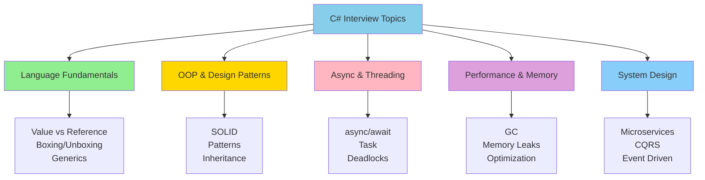
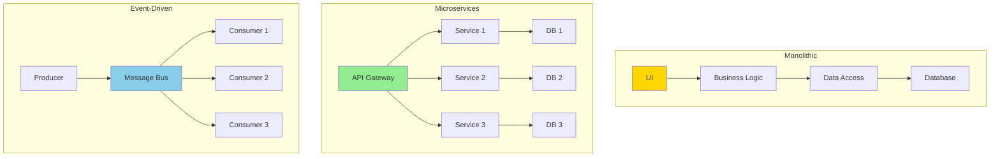
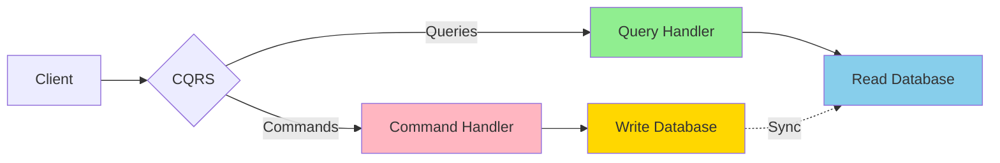

# Day 14: Interview Preparation & System Design

## 🎯 Final Day Objectives

- Review common C# interview questions
- Practice coding challenges
- Understand system design principles
- Learn .NET architecture patterns
- Master best practices for Microsoft interviews

---

## 1. Core C# Interview Questions

### Interview Question Categories



### System Architecture Patterns



### CQRS Pattern



### Language Fundamentals

**Q: Explain value types vs reference types**

```csharp
// 🔰 BEGINNER: Understanding the difference

// Value type - stored on stack (usually), copied by value
int x = 10;
int y = x; // Copy of value
y = 20;
Console.WriteLine(x); // 10 (unchanged)

// Reference type - stored on heap, copied by reference
var list1 = new List<int> { 1, 2, 3 };
var list2 = list1; // Copy of reference
list2.Add(4);
Console.WriteLine(list1.Count); // 4 (same object!)

// Key differences:
// - Value: Stack, copy by value, no null (unless Nullable<T>), no inheritance
// - Reference: Heap, copy by reference, can be null, supports inheritance
```

**Q: What is boxing and unboxing?**

```csharp
// 🎯 INTERMEDIATE: Performance implications

// Boxing - value type to reference type
int value = 42;
object boxed = value; // Boxing - allocates on heap

// Unboxing - reference type to value type
int unboxed = (int)boxed; // Unboxing - extracts value

// Performance impact:
// - Heap allocation
// - Type checking
// - Memory overhead
// Solution: Use generics to avoid boxing
List<int> list = new List<int>(); // No boxing
```

**Q: Explain async/await**

```csharp
// 🚀 ADVANCED: State machine understanding

// async/await is compiler-generated state machine
public async Task<string> GetDataAsync()
{
    // Runs synchronously until first await
    Console.WriteLine("Starting");

    // await suspends method, doesn't block thread
    string data = await DownloadAsync(); // Thread released here

    // Resumes after await completes
    Console.WriteLine("Done");
    return data;
}

// Benefits:
// - Non-blocking I/O
// - Responsive UI
// - Better scalability
// - Clean asynchronous code
```

## 2. Advanced Concepts

### Memory Management

**Q: Explain garbage collection**

```csharp
// GC Generations:
// Gen 0: New objects, collected frequently
// Gen 1: Survived one collection
// Gen 2: Long-lived objects

// GC triggers:
// - Gen 0 full
// - Explicit GC.Collect() (don't use!)
// - Low memory
// - End of process

// Optimization:
// - Reduce allocations
// - Use object pooling
// - Implement IDisposable for unmanaged resources
// - Use Span<T> to avoid allocations
```

**Q: When to use IDisposable?**

```csharp
public class ResourceHolder : IDisposable
{
    private FileStream file;
    private bool disposed = false;

    public void Dispose()
    {
        Dispose(true);
        GC.SuppressFinalize(this);
    }

    protected virtual void Dispose(bool disposing)
    {
        if (!disposed)
        {
            if (disposing)
            {
                // Dispose managed resources
                file?.Dispose();
            }

            // Free unmanaged resources
            // ...

            disposed = true;
        }
    }

    ~ResourceHolder()
    {
        Dispose(false);
    }
}

// Use cases:
// - File streams
// - Database connections
// - Network sockets
// - Unmanaged memory
```

### LINQ & Collections

**Q: IEnumerable vs IQueryable**

```csharp
// IEnumerable<T>
// - LINQ to Objects
// - Executes in memory
// - Func<T, bool> predicates
// - Client-side evaluation
IEnumerable<Person> people = dbContext.Persons.AsEnumerable();
var adults = people.Where(p => p.Age > 18); // Executes in C#

// IQueryable<T>
// - LINQ to SQL/EF
// - Executes on database
// - Expression<Func<T, bool>> predicates
// - Server-side evaluation
IQueryable<Person> people = dbContext.Persons;
var adults = people.Where(p => p.Age > 18); // Translates to SQL

// When to use:
// - IEnumerable: In-memory collections
// - IQueryable: Database queries
```

**Q: Deferred vs immediate execution**

```csharp
var numbers = new List<int> { 1, 2, 3, 4, 5 };

// Deferred execution - not executed yet
IEnumerable<int> query = numbers.Where(x => x > 2);

numbers.Add(6); // Affects query result

// Executed when enumerated
foreach (int n in query) // Executes now
{
    Console.WriteLine(n); // 3, 4, 5, 6
}

// Immediate execution
List<int> result = numbers.Where(x => x > 2).ToList(); // Executes immediately
numbers.Add(7); // Doesn't affect result
```

---

## 3. Coding Challenges

### Challenge 1: Reverse String

```csharp
// Basic solution
public string ReverseString(string input)
{
    char[] chars = input.ToCharArray();
    Array.Reverse(chars);
    return new string(chars);
}

// Span solution (zero allocation)
public string ReverseString(string input)
{
    Span<char> chars = stackalloc char[input.Length];
    for (int i = 0; i < input.Length; i++)
    {
        chars[i] = input[input.Length - 1 - i];
    }
    return new string(chars);
}
```

### Challenge 2: Find Duplicates

```csharp
// Find duplicate numbers in array
public List<int> FindDuplicates(int[] numbers)
{
    HashSet<int> seen = new HashSet<int>();
    List<int> duplicates = new List<int>();

    foreach (int num in numbers)
    {
        if (!seen.Add(num) && !duplicates.Contains(num))
        {
            duplicates.Add(num);
        }
    }

    return duplicates;
}

// Using LINQ
public List<int> FindDuplicates(int[] numbers)
{
    return numbers.GroupBy(x => x)
                  .Where(g => g.Count() > 1)
                  .Select(g => g.Key)
                  .ToList();
}
```

### Challenge 3: Fibonacci

```csharp
// Recursive (slow - O(2^n))
public int Fibonacci(int n)
{
    if (n <= 1) return n;
    return Fibonacci(n - 1) + Fibonacci(n - 2);
}

// Iterative (fast - O(n))
public int Fibonacci(int n)
{
    if (n <= 1) return n;

    int prev = 0, current = 1;
    for (int i = 2; i <= n; i++)
    {
        int next = prev + current;
        prev = current;
        current = next;
    }
    return current;
}

// Memoization (O(n) with caching)
private Dictionary<int, int> cache = new Dictionary<int, int>();

public int Fibonacci(int n)
{
    if (n <= 1) return n;

    if (cache.TryGetValue(n, out int result))
        return result;

    result = Fibonacci(n - 1) + Fibonacci(n - 2);
    cache[n] = result;
    return result;
}
```

### Challenge 4: Two Sum

```csharp
// Find two numbers that add up to target
public int[] TwoSum(int[] numbers, int target)
{
    Dictionary<int, int> map = new Dictionary<int, int>();

    for (int i = 0; i < numbers.Length; i++)
    {
        int complement = target - numbers[i];

        if (map.TryGetValue(complement, out int index))
        {
            return new int[] { index, i };
        }

        map[numbers[i]] = i;
    }

    return null;
}

// Time: O(n), Space: O(n)
```

---

## 4. System Design Principles

### Microservices Architecture

```csharp
// Service structure
public interface IOrderService
{
    Task<Order> CreateOrderAsync(CreateOrderRequest request);
    Task<Order> GetOrderAsync(int orderId);
    Task UpdateOrderStatusAsync(int orderId, OrderStatus status);
}

// API Gateway pattern
public class ApiGateway
{
    private readonly IOrderService orderService;
    private readonly IPaymentService paymentService;
    private readonly IInventoryService inventoryService;

    public async Task<OrderResult> ProcessOrderAsync(CreateOrderRequest request)
    {
        // Check inventory
        var availability = await inventoryService.CheckAvailabilityAsync(request.ProductId);

        if (!availability.IsAvailable)
        {
            return OrderResult.OutOfStock();
        }

        // Create order
        var order = await orderService.CreateOrderAsync(request);

        // Process payment
        var payment = await paymentService.ProcessPaymentAsync(order.Id, order.Total);

        if (payment.IsSuccessful)
        {
            await orderService.UpdateOrderStatusAsync(order.Id, OrderStatus.Paid);
        }

        return OrderResult.Success(order);
    }
}
```

### CQRS Pattern

```csharp
// Command (Write)
public class CreateOrderCommand : IRequest<int>
{
    public int CustomerId { get; set; }
    public List<OrderItem> Items { get; set; }
}

public class CreateOrderCommandHandler : IRequestHandler<CreateOrderCommand, int>
{
    private readonly IOrderRepository repository;

    public async Task<int> Handle(CreateOrderCommand request, CancellationToken cancellationToken)
    {
        var order = new Order
        {
            CustomerId = request.CustomerId,
            Items = request.Items,
            Status = OrderStatus.Pending
        };

        await repository.AddAsync(order);
        return order.Id;
    }
}

// Query (Read)
public class GetOrderQuery : IRequest<OrderDto>
{
    public int OrderId { get; set; }
}

public class GetOrderQueryHandler : IRequestHandler<GetOrderQuery, OrderDto>
{
    private readonly IReadOnlyRepository repository;

    public async Task<OrderDto> Handle(GetOrderQuery request, CancellationToken cancellationToken)
    {
        return await repository.GetOrderAsync(request.OrderId);
    }
}
```

### Event-Driven Architecture

```csharp
// Domain event
public class OrderCreatedEvent
{
    public int OrderId { get; set; }
    public int CustomerId { get; set; }
    public decimal Total { get; set; }
}

// Event handler
public class OrderCreatedEventHandler : IEventHandler<OrderCreatedEvent>
{
    private readonly IEmailService emailService;
    private readonly IInventoryService inventoryService;

    public async Task HandleAsync(OrderCreatedEvent @event)
    {
        // Send confirmation email
        await emailService.SendOrderConfirmationAsync(@event.OrderId);

        // Update inventory
        await inventoryService.ReserveItemsAsync(@event.OrderId);
    }
}

// Event bus
public interface IEventBus
{
    Task PublishAsync<TEvent>(TEvent @event) where TEvent : class;
    void Subscribe<TEvent, THandler>()
        where TEvent : class
        where THandler : IEventHandler<TEvent>;
}
```

---

## 5. Best Practices Checklist

### Code Quality

```csharp
// ✅ Use meaningful names
public class CustomerRepository { } // ✅ Clear
public class CRepo { } // ❌ Unclear

// ✅ Follow SOLID principles
public class OrderService // Single Responsibility
{
    private readonly IOrderRepository repository;
    private readonly IEmailService emailService;

    // Dependency Injection
    public OrderService(IOrderRepository repository, IEmailService emailService)
    {
        this.repository = repository;
        this.emailService = emailService;
    }
}

// ✅ Use async/await properly
public async Task<Order> GetOrderAsync(int orderId)
{
    return await repository.GetByIdAsync(orderId);
}

// ✅ Handle exceptions appropriately
public async Task<Result<Order>> CreateOrderAsync(CreateOrderRequest request)
{
    try
    {
        var order = await repository.AddAsync(request);
        return Result<Order>.Success(order);
    }
    catch (ValidationException ex)
    {
        return Result<Order>.Failure(ex.Message);
    }
}

// ✅ Use nullable reference types
public Order? FindOrder(int orderId)
{
    return repository.Find(orderId);
}

// ✅ Implement IDisposable for resources
public class DatabaseConnection : IDisposable
{
    public void Dispose()
    {
        // Cleanup
    }
}
```

### Performance

```csharp
// ✅ Use StringBuilder for string concatenation
var sb = new StringBuilder();
for (int i = 0; i < 1000; i++)
{
    sb.Append(i);
}

// ✅ Use Span<T> to avoid allocations
public void ProcessData(ReadOnlySpan<byte> data)
{
    // No allocation for slice
    var slice = data.Slice(0, 10);
}

// ✅ Cache expensive operations
private readonly Lazy<ExpensiveObject> cached =
    new Lazy<ExpensiveObject>(() => new ExpensiveObject());

public ExpensiveObject GetCached() => cached.Value;

// ✅ Use concurrent collections for thread-safe operations
private readonly ConcurrentDictionary<int, string> cache = new();
```

### Testing

```csharp
// ✅ Write unit tests
[Fact]
public async Task CreateOrder_ValidRequest_ReturnsOrder()
{
    // Arrange
    var service = new OrderService(mockRepository.Object);
    var request = new CreateOrderRequest { /* ... */ };

    // Act
    var result = await service.CreateOrderAsync(request);

    // Assert
    Assert.NotNull(result);
    Assert.Equal(OrderStatus.Pending, result.Status);
}

// ✅ Test edge cases
[Theory]
[InlineData(null)]
[InlineData("")]
public void Validate_InvalidInput_ThrowsException(string input)
{
    Assert.Throws<ArgumentException>(() => validator.Validate(input));
}
```

---

## 6. Microsoft Interview Tips

### Technical Round

1. **Clarify requirements** - Ask questions before coding
2. **Think out loud** - Explain your approach
3. **Start simple** - Basic solution first, then optimize
4. **Consider edge cases** - Null, empty, large inputs
5. **Test your code** - Walk through examples
6. **Discuss trade-offs** - Time vs space, readability vs performance

### System Design Round

1. **Understand requirements** - Functional and non-functional
2. **Define scope** - What's in/out of scope
3. **High-level architecture** - Components and interactions
4. **Deep dive** - API design, data model, algorithms
5. **Scalability** - How to handle growth
6. **Trade-offs** - Consistency vs availability, latency vs throughput

### Behavioral Round

1. **STAR method** - Situation, Task, Action, Result
2. **Leadership** - Examples of leading projects
3. **Collaboration** - Working with teams
4. **Problem-solving** - Overcoming challenges
5. **Growth mindset** - Learning from failures

---

## 7. Final Review Checklist

### Day 1-7 Review

- ✅ Value vs reference types
- ✅ Memory management & GC
- ✅ Delegates & events
- ✅ LINQ operators
- ✅ Generics & constraints
- ✅ Exception handling
- ✅ Collections & data structures

### Day 8-14 Review

- ✅ Async/await patterns
- ✅ Multithreading & concurrency
- ✅ Reflection & attributes
- ✅ Modern C# features
- ✅ Design patterns
- ✅ Performance optimization
- ✅ System design

---

## 8. Interview Question Bank

### Quick Fire Questions

1. Difference between string and StringBuilder?
2. What is dependency injection?
3. Explain SOLID principles in one sentence each
4. What is the purpose of async/await?
5. How does garbage collection work?
6. What are generics and why use them?
7. Difference between Task and Thread?
8. What is LINQ?
9. Explain IEnumerable vs IQueryable
10. What are nullable reference types?

### Coding Exercises

1. Implement LRU cache
2. Find longest palindrome substring
3. Merge two sorted lists
4. Implement binary search
5. Reverse linked list
6. Validate binary search tree
7. Group anagrams
8. Find intersection of two arrays
9. Implement stack using queues
10. Detect cycle in linked list

---

## 9. Resources for Continued Learning

### Official Documentation

- Microsoft Learn
- C# Language Specification
- .NET API Browser

### Books

- "CLR via C#" by Jeffrey Richter
- "C# in Depth" by Jon Skeet
- "Pro C# 10" by Andrew Troelsen

### Practice Platforms

- LeetCode (C# problems)
- HackerRank
- CodeWars
- Exercism

---

## 10. Final Thoughts

### Your Journey

You've covered:

- ✅ 14 days of intensive C# training
- ✅ Core fundamentals to advanced concepts
- ✅ Practical patterns and best practices
- ✅ Performance optimization techniques
- ✅ System design principles

### Next Steps

1. **Practice coding** - Daily problem-solving
2. **Build projects** - Apply what you've learned
3. **Review daily** - Revisit materials
4. **Mock interviews** - Practice with peers
5. **Stay current** - Follow C# updates

### Remember

- **Fundamentals matter** - Deep understanding beats memorization
- **Practice consistently** - Skill comes with repetition
- **Learn from failures** - Each mistake is a lesson
- **Stay curious** - Technology evolves, keep learning

---

## Congratulations! 🎉

You've completed the 14-day C# Fundamentals intensive training program. You're now equipped with the knowledge and skills to excel in your Microsoft interview and take on new career challenges.

**Good luck with your interview!**

_"The expert in anything was once a beginner."_ - Stay persistent, stay focused, and believe in yourself!

---

**You're ready! Go crush that interview!** 💪🚀
