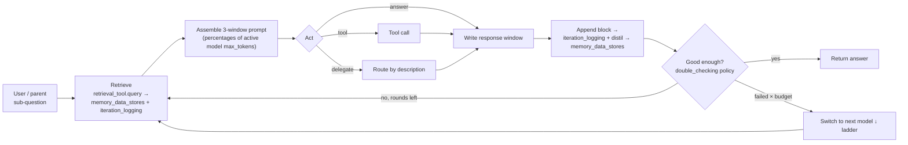

# ProgressiveAgentSLM — Planning & Progress Tracker

> **ProgressiveAgentSLM** is a single, **recursive** agent class tuned for **local / small language
> models (SLMs)**. One instance owns an identity (`id`), a `system_prompt`, a `base_folder_path` for all
> its artifacts, a **`run_mode`** (`assistant` / `research` / `reflection` — how the agent operates), a
> three-window **context budget** (`context_window_breakdown_percentages` — **cognition / attention /
> response**, expressed as **percentages** of the active model's context), a **`models_ladder`**
> (local→cloud, a **capability-routed pool** — each entry role-tagged embedding / tool-selection /
> general-purpose / memory-distillation / coding / vision / multimodal and pinned to its own warm
> endpoint — with one retry budget) chosen by `model_selection`, a set of **`behavior_policies`**
> (`when → then`, each fired at a `run_after` hook and optionally allowed to loop), a set of **tools**
> (SQLite vector query, JSONL query, read / search / write-file, todo, diagrams, python — each tool may
> run its own tool-calling model), a set of **`working_directories`** it may read (and, when `writable`,
> write), a set of configurable **`memory_data_stores`** (SQLite knowledge tables it progressively
> **distills**), and a set of **delegates** — themselves `ProgressiveAgentSLM` instances.
>
> The agent _progressively_ **cultivates knowledge**: every iteration's raw reasoning is appended to an
> append-only **`iteration_logging`** store (`iteration_*.jsonl`, its single raw source of truth), and a
> chain of **`memory_data_stores`** distils that raw log — and each other — through each store's
> `distill_prompt` into ever-more-refined knowledge (facts, a conceptual index, situational /
> design-decision / edge-case knowledge). Stores flagged `always_use_in_cognition_window` are injected
> into the prompt every step within a fixed budget; the rest are retrieved on demand through their
> `retrieval_tool` — so quality comes from **disciplined memory handling, not a bigger model**. A store
> with an **empty `distill_from`** is a **pre-built** external knowledge base (filled by an extraction
> pipeline); one with a populated `distill_from` is **self-cultivated**. Every agent and delegate shares
> the run's **`base_folder_path`** (so teammates can loop back over each other's work) and may read the
> user's **`working_directories`** side by side; subprocess fan-out runs sequentially or in parallel per
> **`parallel_subprocesses`**. Any model slot can be escalated, plug-and-play, to a more capable
> **cloud** model (OpenRouter).
>
> The class reuses existing primitives (`Task`, model clients, `SqliteVectorStore` (sqlite-vec),
> `DocumentRanking`, `PythonCodeExecute`, `KnowledgeCompression`, `IterationSummarizer`,
> `AnswerEvaluator`, `FinalThoughtSummarizer`) and drops into `create_chat_backend` unchanged.

**Status legend:** ⬜ Not started · 🟡 In progress · ✅ Done · ⛔ Blocked

> **Revision 2026-08-12 — design review vs. the on-disk code; see [`review-revise-design.md`](review-revise-design.md).**
>
> 1. **Accuracy pass (Phases 0–1).** Several `[~]` items read as "exists, needs rework" but the code on
>    disk (`src/framework/`) is the _earlier_ flat / four-tier-fractional / Supabase design. The
>    recursive three-window-percentage / sqlite-vec / JSONC design is **not implemented** — marked `[]`
>    not-shipped below where the disk proves it.
> 2. **New named owners.** `TokenCounter` (tokenizer seam), `bounded_io` (byte + deadline on every
>    external read), `run_clock` (whole-run wall-clock cap), `NoFindingsGuard` (deterministic re-plan +
>    refusal after consecutive empty retrievals), `QuizEngine` (owner of `self_evaluation_quizz`) added
>    to Phase 2. `ApiServer`/health surface added to Phase 3.
> 3. **Config loader.** `example-revised.json` is **JSONC (commented)** — the Phase 3 loader must strip
>    comments; `load_agent` builds a **single self-similar JSON → full recursive tree** (resolve
>    `[base_folder_path]` per node), not a flat `add_agent()` list.
> 4. **§8 risks added.** Linked-history risk (design-decisions / edge-case stores must be deduped +
>    gated on a sparse hook, or they dilute retrieval) and an always-on-store refresh guard.
> 5. **§15 case adds** a byte-identical stable-prefix assertion and a `bounded_io` / `run_clock` cost
>    test, so budget/concurrency claims are provable.
> 6. **Porting map added.** A concrete file-by-file "steal list" from the pulled-down Hermes project
>    (`temp/hermes-agent`) — what to port _immediately_ vs. adapt vs. skip, with target files. See
>    [`steal-list-hermes.md`](steal-list-hermes.md). The 30-minute quick win is the **bounded I/O trio**
>    (`bounded_io` + `CircularRounds` + file `safety`) — self-contained, maps 1:1 to Phase 0 items, and
>    hardens the current flat loop before the bigger rework.
> 7. **New project home.** The planning folder (and this tracker) now lives inside
>    `ProgressiveAgentSLM/planning/` — the project's own folder — superseding `ai-c4y/planning/`.

> **Revision 2026-08-09 (d) — `reflection_configuration`, `is_reflection_and_evaluation` flag, field-name alignment:**
>
> 1. **`reflection_configuration` section added.** `run_mode: "reflection"` now has its own explicit
>    config block (alongside `research_configuration`): `reflection_mode` (`"distillation"` — re-reads
>    and re-distils memory stores; `"fine-tuning"` — generates training pairs from iteration logs),
>    `enabled`, `time_limit`, `iterations_limit`, `run_quizz_after_finish`, and `resume_if_quizz_failed`.
>    This closes the cultivate → evaluate → improve loop as a first-class, configurable surface.
> 2. **`is_reflection_and_evaluation` flag added to `models_ladder`.** A dedicated role flag routes
>    self-scoring (`self_evaluation_quizz`) and reflection-loop reasoning to the most capable local
>    model (e.g. `qwen3.6:27b`) — keeping expensive self-evaluation off the lightweight general-purpose
>    model while still falling back to cloud (`claude-3.5-sonnet`) when needed.
> 3. **Field-name alignment.** `research_configuration` and `reflection_configuration` share the same
>    post-loop fields: `run_quizz_after_finish` (fires `self_evaluation_quizz`) and
>    `resume_if_quizz_failed` (re-triggers the loop when quiz score < `passing_total_scores`).
>    Earlier revision notes used `run_quizz_after_research` / `resume_research_if_quizz_failed`; those
>    are superseded by the unified names above.
> 4. **`is_embedding` flag name.** The embedding flag in the JSON is `is_embedding` (not
>    `is_embedding_only`). References throughout this document that say `is_embedding_only` refer to
>    the same role; the canonical name in config and code is `is_embedding`.
> 5. **`self_evaluation_quizz.enabled`.** An explicit `enabled: true/false` master switch was added so
>    the quiz block can be present but inactive without removing it from config.

> **Revision 2026-08-09 (c) — three operational run modes + API / channels / research / self-evaluation surfaces:**
>
> 1. **`run_mode` — three deployment modes, same class.** Each agent declares `run_mode`:
>    **`assistant`** (default) — conversational query-answering; exposes an OpenAI-compatible HTTP
>    server (`api_configuration`) and optional push channels (`communication_channels`).
>    **`research`** — autonomous knowledge-mining loop; iterates over `research_configuration.topics`
>    / `goals` until the first active stopping condition fires (`stop_when_goals_achieved` /
>    `time_limit` / `iterations_limit`); optionally runs `self_evaluation_quizz` after.
>    **`reflection`** — autonomous self-improvement loop; re-reads `iteration_logging` +
>    `memory_data_stores`, scores itself via `self_evaluation_quizz`, and can re-trigger research if
>    the score is below `passing_total_scores`.
> 2. **`api_configuration`.** In `assistant` mode the agent spins up an **OpenAI-compatible HTTP
>    server** (`base_url`, CORS, optional auth, `POST /api/v1/chat/completions` non-streaming +
>    streaming, `GET /api/v1/models`) so it drops into Open WebUI, custom frontends, or any
>    OpenAI-client library without an adapter.
> 3. **`communication_channels`.** In `assistant` mode the agent delivers via **terminal**,
>    **Telegram** (bot token), and **Open WebUI** — each independently toggled by `enabled`. The API
>    stream endpoint is the primary path; channels supplement it for push-based workflows.
> 4. **`research_configuration`.** Three stopping conditions work in OR — the loop ends on the
>    first one that fires: semantic goal satisfaction (`stop_when_goals_achieved`), wall-clock cap
>    (`time_limit`), or iteration cap (`iterations_limit`). After the loop, an optional quiz grades
>    the gathered knowledge; a failing score can resume the loop (`resume_research_if_quizz_failed`).
> 5. **`self_evaluation_quizz`.** A scored quiz (questions + authored answers + point values vs.
>    `passing_total_scores`) that fires in `reflection` mode and optionally after `research` mode —
>    closing the cultivate → evaluate → improve loop without human intervention.

> **Revision 2026-08-09 (b) — capability-routed model pool + parallel distillation:**
>
> The `models_ladder` is a **capability-routed pool**, not a single linear chain: each entry may carry
> its own warm endpoint `url` (`platform` = `ollama` / **`lmstudio`** / `open_router`), `keep_warm`, and
> `max_concurrency`, and its role flags gain **`is_memory_distillation`** (which model runs
> `memory_data_stores` distillation), plus `is_coding` and `is_fallback`. Each job routes **by flag** to
> its model — embeddings → `is_embedding`, tool-calling → `is_tool_selection`, distillation →
> `is_memory_distillation`, reasoning → `is_general_purpose` — so distinct jobs run on **distinct warm
> endpoints in parallel**. The earlier per-store `use_capability` idea is dropped as ambiguous: the
> distillation model is declared **on the ladder** (exactly as `is_embedding` declares the embedding
> model), not on each memory store (§4, §8.2).

> **Revision 2026-08-09 — what changed & why (final schema pass; this supersedes the field names used in
> the earlier revision notes below, which are kept as history):**
>
> 1. **Config vocabulary finalized.** `agent_id → id`, `worklog_folder → base_folder_path`,
>    `working_folders → working_directories` (each may now be `writable`, optionally gated by
>    `write_approval`), `parallel_supprocess → parallel_subprocesses`, `models → models_ladder`,
>    `cognitive_behavior → behavior_policies`. The canonical config is now **`example-revised.json`** (§13).
> 2. **Three windows, in percentages.** The four _fractional_ tiers collapse to **three percentage
>    windows** — `context_window_breakdown_percentages`: **`cognition_window`** (system prompt + working
>    dirs + tools + memory + delegate descriptions + model selection), **`attention_window`** (question +
>    retrieval / tool / delegate outputs), **`response_window`** (the answer) — summing to **100** (§3).
>    The old `conversation_history_awareness` tier is gone; situational awareness is now carried by memory
>    stores flagged `always_use_in_cognition_window`.
> 3. **Memory is now configurable `memory_data_stores`.** The fixed L1→L4 pipeline (segmented worklog +
>    `knowledge_graph.jsonl` + `facts.db` + `situational.md` + `cognitive_index`) is generalized into an
>    append-only **`iteration_logging`** raw log (**L1**) plus any number of **`memory_data_stores`** —
>    each with a `distill_from` source list, a `distill_prompt`, a `path` / `table`, a `retrieval_tool`,
>    and a `when`. An **empty `distill_from`** = a **pre-built** external KB (filled by the extraction
>    pipeline, [design-principle §4](design-principle.md)); a **populated `distill_from`** = a
>    **self-cultivated** store fed from run hooks, policy outputs, or other stores (§8).
> 4. **Behavior policies are hook-driven and may loop.** Each policy declares a **`run_after`** hook
>    (`question_received` / `retrieval_result` / `iteration_result` / `raw_iteration_result` /
>    `final_answer`, or another policy `id`) so it fires deterministically **in code**, not merely as
>    prompt text. `circular_behavior_policies_allowed` + `behavior_policies_max_circular_rounds` bound
>    iterative loops (e.g. `double_checking → deep_planning`), replacing the standalone `max_iterations`
>    budget (§5).
> 5. **Role-tagged model ladder.** `models_ladder` entries carry role flags (`is_embedding`,
>    `is_tool_selection`, `is_general_purpose`, `is_vision`, `is_multimodal`) and `model_selection`
>    (`"auto"` → first general-purpose) picks the working model; failover still walks the ladder on
>    `max_retries_until_switching_models` (§4).
> 6. **Retrieval is explicit.** `iteration_logging` and every `memory_data_store` name the
>    `retrieval_tool` that reads them (`JsonlQueryTool` for the raw log, `SqliteVectorQueryTool` for the
>    stores), and those tools appear in the `tools` list (§6).

> **Revision 2026-08-08 — what changed & why (the memory model is now an explicit four-layer
> hierarchy, L1 → L4):**
>
> 1. **Four memory layers.** The worklog subsystem is reframed as **L1 raw → L2 facts → L3 situational
>    → L4 behavior** (§8): each layer is _derived_ from the one below and is progressively **hotter**
>    (closer to the live prompt) and smaller. This is a storage / refinement taxonomy that _composes_
>    with the §3 context-tier budget (which decides how much of each layer enters the prompt).
> 2. **L2 becomes first-class & searchable.** The distilled fact store (`knowledge/facts.db`,
>    sqlite-vec + FTS) is now **on by default** (was an optional mirror), fed by the metadata agent, and
>    queried by a dedicated **`KnowledgeSearchTool`** — "prepared tool code" for efficient knowledge
>    search over the run's own facts (§6, §8.3).
> 3. **L3 gains an in-prompt situational digest.** A **situational summarizer** distils L2 into
>    `situational.md` — a compact "what I know so far vs. the goal" that is **always injected** into the
>    situational tier of the prompt, regenerated only when L2 changes materially (§8.2, §3).
> 4. **Layer ↔ tier mapping.** L4 = the byte-stable **cached prefix**; L3 = the always-in-prompt
>    **situational tier**; L2 = pulled in **on demand by search tool**; L1 = pulled in **by pointer
>    seek** — so promotion up the layers is also promotion toward the prompt (§3, §8).

> **Revision 2026-08-07 — what changed & why (folded in from the Hermes study, see
> `analysis-against-hermes.md`):**
>
> 1. **Prompt-cache discipline.** The four-tier prompt is now assembled as a **byte-stable prefix**
>    (run-constant `system_prompt` + `cognitive_behavior` + tool / delegate descriptions) plus a
>    **volatile suffix** (retrieved blocks + answer). Rebuilding the prefix mid-run forces a full KV /
>    prompt-cache re-prefill — the dominant latency cost on a local SLM — so the prefix is held
>    identical until a **compaction**, the single sanctioned cache-invalidation event (§3).
> 2. **Enforcement, not just prompting.** The critical `cognitive_behavior` policies are now backed by
>    **deterministic turn-end guards** (`double_check` → verify-on-stop, `say_no` → grounding gate,
>    anti-drift → tool-loop guard) because SLMs ignore prompt-only rules (§5).
> 3. **Work vs. failover split.** `max_retries_until_switching_models` now triggers **model failover
>    only**; a **separate `max_iterations`** total-work budget (parent 200 / delegate 50, with a
>    **refund** for batched tool turns) bounds a run and a deep delegate tree independently (§2, §4).
> 4. **Adaptive compaction.** Reflection compacts **only enough to fit** (not a fixed 50%), protects
>    **head + tail**, and **updates** the prior summary (iterative, goal-tracking) rather than replacing
>    it (§3, §8).
> 5. **Hardened boundaries.** Delegates use a **typed immutable contract** (frozen request / result +
>    state machine + restricted toolset + byte caps) (§7); file tools add a **sensitive-path deny-list**
>    and instructional reads forbid pagination (§10); every external read is **byte- and deadline-
>    bounded** (§4); block text is **redacted on egress** to any other model (§8.2).
> 6. **Cheap-first, curated KG.** The metadata agent seeds entities / keywords / edges deterministically
>    (incl. lexical overlap) **before** any LLM call, and a background curator marks records
>    `stale` / `archived` — **never hard-deletes** (§8.2). Token budgeting is fixed to a single **`char/4`**
>    heuristic for both estimate and threshold (Open Q#8).

> **Revision 2026-08-06 — what changed & why (this pass):**
>
> 1. **Vector store is now embedded SQLite, not Supabase Postgres.** Every knowledge / memory / mirror
>    store is a local **`sqlite-vec`** `.db` file you can copy or read directly — no server. Tools take
>    `{ db_file, table }` instead of a pgvector `function_name`; the primary tool type is renamed
>    `Supabase` → **`SqliteVector`**, backed by a new `SqliteVectorStore` (reusing `Embedding`) (§6, §8.3).
> 2. **Graph store is now embedded & file-based, not Neo4j.** The optional `graph_db` mirror defaults to
>    **Kuzu** — "the SQLite of graph databases": Cypher over a single local `path`, no server — with a
>    zero-dependency **SQLite nodes/edges** fallback (`type: "sqlite"`, traversed by recursive CTEs).
>    Both knowledge-graph mirrors are now plain local files (§8.3).
> 3. **Tools carry their own `models` ladder.** A tool also drives an LLM (plan the call, read / rank
>    results, write artifacts), so each tool entry may pin its **own `models`** — typically a leaner
>    local model tuned for tool-calling — and **inherits the agent's `models`** when omitted (§6).

> **Revision 2026-08-02 — what changed & why (this pass):**
>
> 1. **The worklog is segmented, not one big file.** The single `raw_worklog.jsonl` becomes an
>    append-only **segment set** under `worklog/` (sharded by iteration, optional size cap). _Why:_ a
>    run no longer grows one unbounded file, and the index can **jump straight to a segment file +
>    iteration + line**, so old work is reachable in O(1) instead of by scanning (§8.1).
> 2. **The `cognitive_index` addresses blocks by `{segment, iteration, line, offset}`** (not just
>    `block_id`), so the agent can request the log **by file name, iteration number, or line**.
> 3. **A metadata agent builds a `knowledge_graph`.** On each flush a background indexer distills the
>    block into `{entities, keywords, 25-word summary, workflow, relationships}` and appends it to
>    `knowledge_graph.jsonl` — retrieval by meaning + structure, not just text (§8.2).
> 4. **Optional graph + vector database backends.** The `knowledge_graph` can be mirrored to a **graph
>    DB** (nodes / edges, queryable via GraphQL / Cypher) and/or a **vector DB**, so old worklogs are
>    retrieved **dynamically**, not only by reading files. Both default **off** (file-only) (§8.3).
> 5. **`working_folders`.** A list of external directories (e.g. source code) the agent may
>    **read / search** side by side with the worklog — separate from, and never mutated like, the log.
> 6. **`parallel_supprocess` (default 1).** One knob controls whether subprocess fan-out — delegates,
>    tool calls, per-block metadata, DB upserts — runs **sequentially (1)** or in a **bounded parallel
>    pool (>1)**.

> **Revision 2026-08-01 — what changed & why (improvements applied this pass):**
>
> 1. **The worklog is now JSON, not text.** `raw_worklog.log` → **`raw_worklog.jsonl`** (append-only
>    **JSON Lines**): each finished block is one self-contained JSON record on its own line. _Why:_
>    typed and structured, no fragile custom-delimiter parsing, still strictly append-only, still
>    greppable, and it drops straight into SQLite FTS5. (JSON Lines — not one big `.json` array —
>    because you can append a line without rewriting the whole file.)
> 2. **Blocks are addressed by a stable `block_id`, not by line ranges.** `cognitive_index` now joins
>    to the worklog by `block_id` instead of `[start_line, end_line]`. _Why:_ line ranges broke the
>    moment anything was reformatted or compacted; a `block_id` join never shifts, and an optional
>    `block_id → byte-offset` map gives **O(1)** block fetch.
> 3. **One clear storage split.** Shared team memory is **structured JSON** (`*.jsonl` — durable,
>    addressable); per-agent working windows stay **plain-text scratch** (`*.log` — streamed,
>    disposable). See §8.
> 4. **Typo fixed:** `max_retries_untill_switching_models` → **`max_retries_until_switching_models`**
>    (also updated in `example.json`).
> 5. **Clarity:** added an iteration-loop diagram (§3), tightened dense tables, and made file /
>    terminology naming consistent throughout.

---

## 1. Vision & Design Philosophy

- **One recursive class.** Everything is a `ProgressiveAgentSLM`. A "team" is simply an agent whose
  `delegates` are other agents — composition _is_ recursion; there is no separate orchestrator type.
  Each agent carries its own `id` + `description`, and the `description` alone is the signal a parent
  reads to decide when to hand it a sub-question.
- **Three operational modes — same class, different deployment.** `run_mode` switches how the agent
  runs: **`assistant`** serves user queries via an OpenAI-compatible API (`api_configuration`) and
  optional communication channels (terminal, Telegram, Open WebUI); **`research`** autonomously mines
  knowledge over declared topics and goals until configurable stopping conditions are met
  (`research_configuration`); **`reflection`** re-reads its own memory stores, scores itself via a
  structured quiz (`self_evaluation_quizz`), and tightens memory management (`reflection_configuration`)
  — closing the cultivate → evaluate → improve loop without human intervention. The progressive-loop
  internals (context windows, policies, delegates, memory) are identical across all three modes.
- **Progressive cognition by cultivating knowledge, not stuffing.** Each iteration the model's context
  is partitioned into three proportional windows (§3) — percentages of whatever model is active.
  Instead of piling everything into the prompt, the agent appends its raw work to an **append-only
  `iteration_logging`** log (`iteration_*.jsonl`) and progressively **distils** it into a chain of
  **`memory_data_stores`** (SQLite knowledge tables). To think, it injects the always-on stores
  (`always_use_in_cognition_window`) and pulls the rest on demand through each store's `retrieval_tool`.
  On small models, quality comes from disciplined memory handling — not a bigger model.
- **Local & SLM-first, cloud optional.** `models_ladder` is a **capability-routed pool** in which each
  entry is **role-tagged** (`is_embedding` / `is_tool_selection` / `is_general_purpose` /
  `is_memory_distillation` / `is_reflection_and_evaluation` / `is_coding` / `is_vision` /
  `is_multimodal` / `is_fallback`) and pinned to its own endpoint (`ollama` / `lmstudio` /
  `open_router`); `model_selection` (`"auto"` → the first general-purpose entry) picks the working
  reasoning model, while each job routes **by flag** to its model. Local models do the frequent work;
  a cloud model (OpenRouter) sits lower as an automatic fallback, or is promoted for hard steps.
  Pinning each pre-loaded model to its own **warm** endpoint (`keep_warm`, bounded by
  `max_concurrency`) lets embedding, distillation, and reasoning run on **distinct endpoints in
  parallel**. Each model gets one bounded retry budget —
  `max_retries_until_switching_models` — counting **both** quality (self-eval) **and** infra (timeout /
  HTTP) failures before the agent **switches to the next model** on the ladder (§4).
- **Behavior by policy — declared, and fired in code.** `behavior_policies` is a list of `when → then`
  rules rendered into the system prompt every iteration **and** executed at a declared **`run_after`**
  hook (`question_received`, `retrieval_result`, `iteration_result`, `raw_iteration_result`,
  `final_answer`, or another policy `id`). Policies can chain and, when
  `circular_behavior_policies_allowed`, loop back on each other up to `behavior_policies_max_circular_rounds`
  — so a small model's deep-think / double-check / say-no discipline is enforced deterministically, not
  merely hoped for. A non-programmer shapes behavior without touching Python (§5).
- **One shared `base_folder_path`, used by the whole team.** Every agent and delegate writes its
  artifacts (iteration logs, memory stores, todos) beneath the run's `base_folder_path` (delegates nest
  under the parent). Delegates deliver their final answer to the parent when done, but their work stays
  under the shared tree so any later agent can **loop back** over it via the retrieval tools.
- **Route by description, guide tools by `when`.** A parent routes a sub-question to a delegate purely
  by reading each delegate's `description` — no separate gate to maintain. Tools still carry a `when`
  guidance string injected next to the tool, so a small model calls it at the right moment (and so the
  menu can be pruned, §7).
- **Reuse, don't rebuild.** Async streaming generators that `yield` chunks, DI via constructor
  kwargs, `Task`-subclass agents, prompt-based JSON with robust regex fallbacks, JSON-file
  config / state. New code lives under `src/framework/`; existing files are touched minimally.

---

## 2. The `ProgressiveAgentSLM` Object

A single class configured by one object (JSON or Python). Every field has a sensible default; only
`id`, `description`, and — on the root agent — at least one general-purpose entry in `models_ladder`
are required.

| Field                                   | Type        | Meaning                                                                                                                                                                                                                                                                                                                                                                                                         |
| --------------------------------------- | ----------- | --------------------------------------------------------------------------------------------------------------------------------------------------------------------------------------------------------------------------------------------------------------------------------------------------------------------------------------------------------------------------------------------------------------- |
| `id`                                    | str         | Stable identifier. A parent addresses this agent as `delegate:<id>`; it also names the agent's folder and labels its log records.                                                                                                                                                                                                                                                                               |
| `description`                           | str         | One-line capability summary. The **sole** signal a parent reads to decide whether to delegate here — no separate gate.                                                                                                                                                                                                                                                                                          |
| `system_prompt`                         | str \| null | The agent's base persona / instructions, rendered at the top of the `cognition_window` (§3). Optional; when omitted, a default is built from `description` + `behavior_policies`. Per-agent (not inherited).                                                                                                                                                                                                    |
| `base_folder_path`                      | str         | Root folder for **everything** this agent produces — `iteration_logging`, `memory_data_stores`, todos (§8). Defaults to `id`. Delegates nest under the parent (`[base_folder_path]/<delegate-id>`) and may read the parent's tree — one shared run tree.                                                                                                                                                        |
| `iteration_logging_enabled`             | bool        | Turn on the raw per-iteration JSONL log (**L1**). Default **false**.                                                                                                                                                                                                                                                                                                                                            |
| `iteration_logging`                     | object      | Config for the raw log: `{ type: "jsonl", path, retrieval_tool, when }` — the append-only source of truth for a run, read back via its `retrieval_tool` (§8).                                                                                                                                                                                                                                                   |
| `model_selection`                       | str         | `"auto"` / null → use the first `is_general_purpose` entry in the ladder; or a model `name` to pin one for all tasks (§4).                                                                                                                                                                                                                                                                                      |
| `models_ladder`                         | list        | Priority **ladder** / capability-routed pool (§4), highest first. Each entry is **role-tagged** (`is_embedding` / `is_tool_selection` / `is_general_purpose` / `is_memory_distillation` / `is_reflection_and_evaluation` / `is_coding` / `is_vision` / `is_multimodal` / `is_fallback`), pinned to its own endpoint (`keep_warm` / `max_concurrency`), with a `when` hint, and shares the agent's retry budget. |
| `max_retries_until_switching_models`    | int         | Per-model **failover** budget — consecutive quality (self-eval) **and** infra (timeout / HTTP) failures on the _current_ model before switching to the next ladder entry. Default **5** (§4).                                                                                                                                                                                                                   |
| `context_window_breakdown_percentages`  | object      | The **three-window** budget as **percentages** of the active model's `max_tokens` (§3): `cognition_window` / `attention_window` / `response_window`, summing to **100**.                                                                                                                                                                                                                                        |
| `circular_behavior_policies_allowed`    | bool        | Allow `behavior_policies` to loop back on each other (e.g. `double_checking` re-runs `deep_planning`). Bounded by the round cap below (§5).                                                                                                                                                                                                                                                                     |
| `behavior_policies_max_circular_rounds` | int         | Max loop rounds before the agent must proceed. Default **5** — the total-work bound that replaces the old `max_iterations` (§5).                                                                                                                                                                                                                                                                                |
| `behavior_policies`                     | list        | `when → then` policies (§5), each fired at a `run_after` hook. Rendered into the system prompt **and** executed deterministically in code.                                                                                                                                                                                                                                                                      |
| `working_directories`                   | list        | External directories the agent may **read** (and, when `writable`, write — optionally gated by `write_approval`), each `{ path, description, writable, write_approval? }` (§6). Inherited by delegates.                                                                                                                                                                                                         |
| `tools`                                 | list        | Capabilities the agent may call, each with a `when` guidance string and an **optional own `models_ladder`** (§6): SQLite vector query, JSONL query, read / search / write-file, todo, diagrams, python, …                                                                                                                                                                                                       |
| `memory_data_stores`                    | list        | Configurable SQLite knowledge stores the agent **distills** and retrieves (§8): `{ id, type, distill_from, distill_prompt?, path, table, retrieval_tool, when?, always_use_in_cognition_window?, cognition_window_budget_percentage? }`. Paths resolve under `base_folder_path`. Inherited.                                                                                                                     |
| `parallel_subprocesses`                 | int         | Max concurrent subprocesses for parallelizable work — delegate fan-out, tool calls, distillation, DB upserts. **1** = strictly sequential (default); **>1** = bounded parallel pool. Inherited by delegates.                                                                                                                                                                                                    |
| `delegates`                             | list        | Nested `ProgressiveAgentSLM` configs (§7). The parent routes sub-questions to them by reading each one's `id` / `description`.                                                                                                                                                                                                                                                                                  |
| `run_mode`                              | str         | Operational mode: **`assistant`** (default — conversational, API + channels), **`research`** (autonomous knowledge-gathering loop over `research_configuration` topics/goals with configurable stopping conditions), **`reflection`** (re-reads own memory, self-scores via `self_evaluation_quizz`, can re-trigger research). The progressive-loop mechanics are the same in all modes.                        |
| `api_configuration`                     | object      | HTTP server settings for `assistant` mode: `base_url`, `enable_cors`, `authentication`, and named endpoints (`chat_completions` / `models` / `stream_chat_completions`). Exposes an OpenAI-compatible interface; the streaming endpoint is the primary integration path. Ignored in other modes.                                                                                                                |
| `communication_channels`                | object      | Multi-platform delivery channels for `assistant` mode: `terminal`, `telegram` (bot token), `openwebui` (URL). Each is independently toggled by `enabled`. The API stream endpoint is the primary integration path; channels supplement it for push-based workflows. Ignored in other modes.                                                                                                                     |
| `research_configuration`                | object      | Autonomous research loop settings for `research` mode: `topics`, `goals`, `evaluation_prompt`, stopping conditions (`stop_when_goals_achieved` / `time_limit` / `iterations_limit` — any one fires the loop), and quiz integration (`run_quizz_after_finish` / `resume_if_quizz_failed`).                                                                                                                       |
| `reflection_configuration`              | object      | Autonomous reflection loop settings for `reflection` mode: `reflection_mode` (`"distillation"` — re-distils memory stores; `"fine-tuning"` — generates training pairs), `enabled`, `time_limit`, `iterations_limit`, `run_quizz_after_finish`, and `resume_if_quizz_failed`. Mirrors the `research_configuration` post-loop fields for a unified cultivate → evaluate → improve surface.                        |
| `self_evaluation_quizz`                 | object      | Structured self-assessment: `enabled` master switch, a list of `questions` (each with `answer` + `score`), a `passing_total_scores` threshold, and `evaluation_criteria`. Fires in `reflection` mode and optionally after `research`; a failing score can re-trigger the research or reflection loop.                                                                                                           |

> **Inheritance.** A delegate that omits `models_ladder`, `model_selection`, or
> `max_retries_until_switching_models` **inherits the parent's**, and likewise inherits
> `working_directories`, `parallel_subprocesses`, and `behavior_policies_max_circular_rounds`. It nests
> its own `iteration_logging` and `memory_data_stores` under the parent's `base_folder_path` (so
> teammates can read each other's work) while keeping its **own** windows.
> `context_window_breakdown_percentages`, `system_prompt`, `behavior_policies`, `tools`, and
> `memory_data_stores` are per-agent (not inherited), so each delegate is independently budgeted and
> specialized.

> **Working directories.** `working_directories` are the directories the agent _works on_ — typically
> source code — kept **separate** from the `base_folder_path` where it _records_ its thinking.
> `ReadFileTool` / `SearchFileTool` resolve paths under any `working_directories` root **and** the run
> tree; `WriteFileTool` writes only where allowed — the `base_folder_path` always, plus any
> `working_directories` entry marked `writable` (optionally gated by `write_approval`). Each entry's
> `description` tells the agent what lives in that folder. Every access is confined to a configured root
> with traversal / absolute-escape rejection (OWASP A01/A03).

> **Parallelism.** `parallel_subprocesses` (default **1**) is the one concurrency knob: `1` runs every
> subprocess step — delegate fan-out, independent tool calls, per-block distillation, DB upserts —
> **sequentially**; `>1` runs them in a **bounded parallel pool** of that size. Because it is inherited,
> it bounds fan-out at every level, so a deep delegate tree can't explode into unbounded concurrency.

---

## 3. `context_window_breakdown_percentages` — the three-window proportional budget

The budget is expressed as **percentages of the active model's `max_tokens`**, not absolute token
counts — so the same config runs unchanged on models with different context sizes, and each window's
real allowance is inferred at runtime as `(percentage / 100) × max_tokens`. All **three** windows are
declared and must sum to **100** (the answer is explicit, not a leftover remainder). Rather than
stuffing accumulated history into the prompt, the agent keeps the full record in the append-only
**`iteration_logging`** log and distils it into **`memory_data_stores`** (§8); the windows below bound
what actually enters the prompt each step. The stores flagged `always_use_in_cognition_window` ride in
the cognition window every step (within their `cognition_window_budget_percentage`); everything else is
retrieved on demand into the attention window through each store's `retrieval_tool`.

| Window             | Default | Holds                                                                                                                                                                                                                                                                                                                         | Budget / compaction rule                                                                                                                                                                                                        |
| ------------------ | ------- | ----------------------------------------------------------------------------------------------------------------------------------------------------------------------------------------------------------------------------------------------------------------------------------------------------------------------------- | ------------------------------------------------------------------------------------------------------------------------------------------------------------------------------------------------------------------------------- |
| `cognition_window` | 32.5    | The cognition workspace: `system_prompt` + `working_directories` summary + tool + delegate descriptions + `behavior_policies`, the always-on `memory_data_stores` (`always_use_in_cognition_window`, e.g. the `conceptual_index`), and the internal reasoning / reflection trace used to pick the next step or switch models. | Byte-stable **prefix**; when reasoning + always-on memory exceed budget, a progressive reflection compacts **adaptively** (only enough to fit). Each always-on store is capped by its own `cognition_window_budget_percentage`. |
| `attention_window` | 52.5    | The working set for this run: the current user question plus everything retrieved from tools, delegates, and the `memory_data_stores` (via each `retrieval_tool`) or the `iteration_logging` log (via `JsonlQueryTool`).                                                                                                      | Compacted **adaptively** when over budget (stale results dropped — still recoverable from the raw log / stores).                                                                                                                |
| `response_window`  | 15.0    | The answer the agent emits this iteration.                                                                                                                                                                                                                                                                                    | Hard output cap = `(response_window / 100) × max_tokens`. Appended to `iteration_logging`, distilled into the stores, then **cleared** for the next iteration.                                                                  |
| _(unbounded)_      | —       | The append-only `iteration_logging` log (`iteration_*.jsonl`) — every finished block from every agent / delegate, the **single raw source of truth**.                                                                                                                                                                         | **Append-only, never rewritten.** No budget; this is what makes the adaptive compactions above safe (nothing is truly lost).                                                                                                    |

> The three windows default to **32.5 / 52.5 / 15.0 = 100**. They must sum to **100**; the loader
> rejects a breakdown that leaves no room for the answer (§12 Phase 3). For `gpt-oss:20b`
> (`max_tokens: 62000`) they resolve to ≈ **20,150 / 32,550 / 9,300** tokens; swap in a bigger-context
> model and every window scales up automatically.
>
> **Why these numbers?** The cognition_window at ~33% reserves space for the system prompt, behavior
> policies, tool/delegate descriptions, and always-on memory stores (e.g., conceptual_index). The
> attention_window at ~52% accommodates retrieved knowledge chunks from multiple stores plus delegate
> outputs. The response_window at ~15% prevents runaway outputs on small models while still allowing
> detailed answers. These ratios were chosen empirically: cognition < 30% starves the model of context,
> attention < 45% limits retrieval quality, and response > 20% wastes tokens on verbose SLM output.

**How one iteration works:**



**Prompt assembly per step — a _stable prefix_ + a _volatile suffix_ (prompt-cache-safe):**

The windows are ordered so everything **constant for the run** sits in a **byte-stable prefix** the
model's KV cache (Ollama / llama.cpp prefill) or a cloud provider's prompt cache can reuse every
iteration; only the retrieved working set and the answer change per step. Rebuilding the prefix mid-run
forces a full re-prefill — the dominant latency cost on a 20B model over a 62k window — so the prefix is
held **byte-identical until a compaction genuinely forces a rebuild**, the single sanctioned
cache-invalidation event.

```
── stable prefix (constant per run → cached, never rebuilt except on compaction) ───────────
[ cognition_window: system_prompt + working_dirs + behavior_policies + tool/delegate descriptions
                    + always_use_in_cognition_window stores (e.g. conceptual_index)      ≤ p_cog  × max_tokens ]
── volatile suffix (changes each iteration) ────────────────────────────────────────────────
[ cognition_window: this-step reasoning / reflection trace + todo                        (remainder of p_cog) ]
[ attention_window: question + retrieved knowledge (via retrieval_tool / JsonlQueryTool)  ≤ p_att × max_tokens ]
→ response_window:  the response for this iteration                                       ≤ p_res × max_tokens
```

**Core loop invariant — retrieve, distil, then compact:**

```
per block b produced (delegate answer / tool result / iteration answer):
    iteration_logging.append(b)                       # append the raw block to iteration_*.jsonl
    for store in memory_data_stores where hook(b) in store.distill_from:
        store.distil(b, store.distill_prompt)         # off critical path (parallel_subprocesses): distil → SQLite table + embed

per iteration:
    hits    ← Σ retrieval_tool.query(question)        # SqliteVectorQueryTool over stores; JsonlQueryTool over the raw log
    working ← assemble(question, hits)
    if size(working) + size(always_on_memory) > budget:
        reflect_and_compact(target = fit_under(budget))   # adaptive: shrink only enough to fit; protect head+tail; update the prior summary (iterative, goal-tracking); raw log + stores stay intact (recoverable)
    response_window ← respond(prompt)                 # ≤ p_res × max_tokens
    if final and not double_checking(response_window):    # enforced double_check: evidence must cover the question
        continue                                          # loop one more round while circular rounds remain
    append(response_window → iteration_logging); distil(stores); clear(response_window)
```

Every window is a slice of the **selected** model's `max_tokens`, so the assembled request can **never**
exceed that model's context — no separate size-inference step is needed (§4). Because the
`iteration_logging` log is immutable and the `memory_data_stores` are _derived_ views, compaction only
ever touches what enters the prompt — the agent can shrink its working memory aggressively and still
recover any detail by re-querying the raw log or the stores.

---

## 4. `models_ladder` — per-agent, role-tagged priority ladder

`models_ladder` is an ordered list, highest priority first, and `model_selection` chooses which entry
is active. Each entry:

| Key               | Required | Meaning                                                                                                                                                                                                                                                                                                                                                    |
| ----------------- | -------- | ---------------------------------------------------------------------------------------------------------------------------------------------------------------------------------------------------------------------------------------------------------------------------------------------------------------------------------------------------------- |
| `platform`        | yes      | `ollama` / `lmstudio` (local, OpenAI-compatible) or `open_router` (cloud). Maps to the matching model client.                                                                                                                                                                                                                                              |
| `name`            | yes      | Model name on that platform.                                                                                                                                                                                                                                                                                                                               |
| `url`             | no       | Platform endpoint (e.g. `http://localhost:11434` for Ollama, `https://openrouter.ai/api/v1` for OpenRouter). Defaults to the platform's env default.                                                                                                                                                                                                       |
| `max_tokens`      | no       | Context ceiling. A number sets it; `"auto"` (or omitted) uses the platform's advertised context. Every `context_window_breakdown_percentages` window is taken against this value (§3).                                                                                                                                                                     |
| _role flags_      | no       | `is_embedding` (canonical name; `is_embedding_only` is a deprecated alias), `is_tool_selection`, `is_general_purpose`, `is_memory_distillation`, `is_reflection_and_evaluation`, `is_coding`, `is_vision`, `is_multimodal`, `is_fallback` — declare what an entry is good for so the runtime routes each job to the right model (default general-purpose). |
| `keep_warm`       | no       | Ask the runtime to keep this model resident (never evict) so its endpoint stays hot for low-latency, parallel use.                                                                                                                                                                                                                                         |
| `max_concurrency` | no       | Max in-flight requests one endpoint accepts before it thrashes VRAM — the per-endpoint fan-out cap (global cap = `parallel_subprocesses`, §2).                                                                                                                                                                                                             |
| `when`            | no       | Plain-language hint for when this entry is preferred (documentation / tiebreaker only — routing is by the structured flags, not this text).                                                                                                                                                                                                                |

**Selection & the ladder — a capability-routed pool.** `model_selection` picks the working reasoning
model: `"auto"` (or null) selects the **first `is_general_purpose`** entry that is reachable; a model
`name` pins that entry for general tasks. Every _other_ job routes **by structured flag** (never by the
free-text `when`, which is SLM-nondeterministic): embeddings go to the **`is_embedding`** model,
tool-call planning to **`is_tool_selection`**, `memory_data_stores` distillation to
**`is_memory_distillation`** (§8.2), self-scoring and reflection-loop reasoning to
**`is_reflection_and_evaluation`**, and coding / vision / multimodal sub-tasks prefer the entry with the
matching flag — while the `is_general_purpose` entries form the failover chain (`is_fallback` last).
Because each entry is an **endpoint** (`platform` + `name` + `url`), pinning each pre-loaded local model
to its **own warm `url`** (`keep_warm`) lets these jobs run on **distinct endpoints in parallel** —
reasoning, embedding and distillation no longer contend for one GPU; `max_concurrency` bounds per-endpoint
fan-out and `parallel_subprocesses` bounds it globally (§2). Because the budget is proportional to
whatever model is chosen (§3), any model fits — there is no minimum-size gate. The ladder carries **one**
per-model budget:

- **Retry budget — `max_retries_until_switching_models` (default 5).** A single counter per model
  covering **both** failure kinds: a "not good enough" verdict from the per-iteration quick
  self-evaluation (a _quality_ failure) **and** a timeout / HTTP / unreachable error (an _infra_
  failure). When the current model's counter reaches the budget, the agent **switches to the next
  general-purpose model** on the ladder and resets the counter to 0.
- **Success resets the ladder.** When a model handles an iteration successfully, selection resets to
  the **`model_selection`** choice for the next iteration (the cheapest capable model is always tried
  first).
- **Stopping — two independent limits.** A run ends when **either** the model ladder is **exhausted**
  (the last model spends its `max_retries_until_switching_models`) **or** the agent's separate
  **`behavior_policies_max_circular_rounds`** loop budget is hit (§5). Keeping _failover_ and _total
  work_ apart means a run that is making progress but keeps failing self-eval on one model doesn't
  prematurely burn the ladder, and a run that never fails still can't spin forever.
- **Bounded I/O.** Every model call bounds its read with a **byte cap and a wall-clock deadline** (a
  stalled local endpoint must not hang the run); a deadline hit counts as one infra failure.

> **Model failover semantics by flag.** When a specific capability fails (e.g., `is_coding` returns poor
> results), the runtime does NOT fall back to the next `is_general_purpose` model — it falls back to the
> **next entry with the same flag**. If no other `is_coding` model exists, then it tries the next
> `is_general_purpose`. This prevents a coding task from being answered by a model not optimized for code.
> Example: if `qwen3.6:27b` (is_coding + is_general_purpose) fails twice, the runtime tries `qwen3.8:122b`
> (also is_coding + is_general_purpose) before falling back to `claude-3.5-sonnet`.
>
> **Endpoint saturation.** When all warm endpoints are at their `max_concurrency` limit, new requests queue
> in a FIFO buffer bounded by `parallel_subprocesses`. If the queue exceeds 10 seconds, the request times out
> and counts as one infra failure. This prevents VRAM thrashing from too many concurrent model loads.
>
> **Failover by flag (2026-08-12).** When a capability-routed model (e.g. `is_coding`) fails, the runtime
> falls back to the **next entry with the same flag**, then to the next `is_general_purpose`. Only when no
> same-flag model exists does it ride the general-purpose chain. This prevents a coding task from being
> answered by a model not optimized for code.

---

## 5. `behavior_policies` — `when → then` policies fired on hooks

`behavior_policies` is a list of rules that shape the agent's behavior. Each rule renders into the
system prompt **every iteration** as "**When** _condition_, **then** _action_" **and** is executed
deterministically in code at a declared **`run_after`** hook. This does two jobs at once: it steers how
a small model thinks, and it acts as the run's **todo checklist** the model re-reads each pass to stay
on task. The rendered rules live in the `cognition_window` (§3).

| Key         | Meaning                                                                                                                                                                            |
| ----------- | ---------------------------------------------------------------------------------------------------------------------------------------------------------------------------------- |
| `id`        | Short label for the policy (e.g. `deep_planning`, `double_checking`, `visual_representation`, `refusing_to_invent`, `self_reflection`).                                            |
| `when`      | The condition / trigger, in plain language.                                                                                                                                        |
| `then`      | The action the agent should take when the condition holds.                                                                                                                         |
| `run_after` | List of hooks the policy fires after: `question_received`, `retrieval_result`, `iteration_result`, `raw_iteration_result`, `final_answer` — or another policy `id`, to chain them. |

**Hooks & loops.** Because each policy names its `run_after` hook, the loop runs it at the right point
in code — not merely when the SLM _chooses_ to obey prompt text. Policies can chain by referencing each
other's `id`; when `circular_behavior_policies_allowed` is set, a policy may loop back on an earlier one
(e.g. `double_checking → deep_planning` to fill an evidence gap). Loops are bounded by
**`behavior_policies_max_circular_rounds`** (default 5) — the total-work limit that, together with model
ladder exhaustion, ends a run (§4).

**Recommended baseline policies:** **deep_planning** (`run_after: question_received` — decompose complex
questions and route to delegates / tools), **analyzing_retrieval_results** (`run_after: retrieval_result`
— vet retrieved evidence for relevance before use), **double_checking**
(`run_after: iteration_result, deep_planning` — verify the gathered evidence answers the question; loop
another round if gaps remain), **visual_representation** (`run_after: iteration_result` — emit a Mermaid
diagram when structure / relationships matter), **refusing_to_invent** (`run_after: iteration_result` —
answer honestly when the stores are silent rather than hallucinate), **self_reflection**
(`run_after: final_answer` — distil the run's insights into the `memory_data_stores` for future reuse).

> **Enforced, not just prompted.** Small models routinely _ignore_ prompt-only guidance, so the
> **critical** policies stay authorable as `when → then` **and** are backed by a deterministic guard the
> loop runs at their `run_after` hook (they do not depend on the SLM choosing to obey):
>
> - **`double_checking` → verify-on-stop.** When the agent tries to emit a final answer, the guard
>   checks (via `AnswerEvaluator`) that the gathered evidence actually covers the question; if not — and
>   circular rounds remain — it loops one more bounded round instead of returning.
> - **`refusing_to_invent` → grounding gate.** If retrieval returned nothing above a similarity floor,
>   the guard forces the honest-refusal branch rather than trusting the model to pick it.
> - **anti-drift → tool-loop guard.** Tools are classed idempotent-vs-mutating; a repeated identical
>   call is detected and warned / short-circuited so an SLM can't spin on one tool.
>
> Non-critical policies (e.g. `visual_representation`) stay prompt-only. Guards are pure decisions; the
> loop owns whether a decision becomes a nudge, a synthetic result, or a halt.

---

## 6. Tools — capabilities with `when` guidance

Each tool entry tells the agent **what** the tool is and **when** to use it. The `when` string is
injected next to the tool in the prompt so a small model calls it at the right moment. Two of the tools
are **retrieval bindings**: `iteration_logging` and every `memory_data_store` name a `retrieval_tool`
that reads them, and that tool must appear in this list.

**SqliteVectorQueryTool (primary tool).** Vector search over an **embedded SQLite** store (the
`sqlite-vec` extension) — a single local `.db` file you can copy or read directly, no server. It reads
both the **pre-built** knowledge bases (`distill_from: []`) and the agent's **self-cultivated**
`memory_data_stores` — the most useful capability for these RAG agents.

| Key       | Meaning                                                                                                               |
| --------- | --------------------------------------------------------------------------------------------------------------------- |
| `type`    | `SqliteVectorQueryTool`.                                                                                              |
| `path`    | Path to the local `.db` file holding the embedded vectors (e.g. `[base_folder_path]/bvms_knowledge_base.db`).         |
| `table`   | The vector table to query inside that file (e.g. `knowledge`). Bound implicitly when driven by a `memory_data_store`. |
| `ranking` | If `true`, re-rank retrieved chunks with parallel `DocumentRanking` (reuse `RagAssistant.stream` batches).            |
| `when`    | Guidance: when this knowledge source is the right one to query.                                                       |

All other tools follow the same `{ type, when, … }` shape, and each `when` is used both to guide the
model and to **prune the menu** (§7): only tools whose `when` matches the current step are shown. The
`SqliteVectorQueryTool` wrapper is built on the async `SqliteVectorStore.async_query` (sqlite-vec +
`Embedding`); embeddings use the ladder's `is_embedding` model (§4).

**Tools can pin their own `models_ladder`.** A tool doesn't just execute code — it usually drives an
LLM (to plan the call, read / rank results, or write an artifact). So each tool entry may carry its
**own `models_ladder`** (same shape as §4) — typically a **leaner local model tuned for tool-calling**
(e.g. the `is_tool_selection` entry) rather than the agent's heavy main ladder. A tool that omits
`models_ladder` **inherits the agent's top-level ladder**; its `max_retries_until_switching_models`
follows the same ladder semantics (§4).

## 7. Delegates — recursive composition

`delegates` is a list of **nested `ProgressiveAgentSLM` configs**. There is no separate "sub-agent"
type — a delegate is a full agent with its own `system_prompt`, `context_window_breakdown_percentages`,
`tools`, `memory_data_stores`, and optional `behavior_policies` / `models_ladder` / `delegates`. The
parent:

1. **Routes by description.** The small model picks a delegate by reading each one's `description` — via
   the proven `_parse_agent_routing` JSON pattern, generalized to `delegate:<id>`. Delegates are **not**
   gated by a separate `when`; a clear `description` is the whole contract.
2. **Hands the sub-question down.** The delegate runs its **own** full progressive loop with its own
   windows and its own `iteration_logging` / `memory_data_stores`, nested under the parent's
   `base_folder_path`.
3. **Delivers when done.** A delegate returns only its **final** answer; the parent folds that block into
   its own working set (by querying the delegate's stores / log). Because the delegate's work stays under
   the shared tree, any later agent can loop back over it.

**Typed, isolated boundary.** A parent hands a delegate a **frozen request** (`{ goal, context, role,
allowed_toolsets?, blocked_tools? }`, byte-capped) and receives a **frozen result**
(`{ state, summary, ref }`). Each delegate carries an explicit **state** and a **restricted toolset**.
This immutable contract is what makes fan-out under `parallel_subprocesses` and cancellation safe.

## 8. Memory — the raw log plus configurable `memory_data_stores` (L1 → L4)

Everything an agent produces lives under its `base_folder_path`, organized as a **four-layer memory
hierarchy**:

| Layer                | Holds                                                            | Storage                                                       | Reaches the model by                          | Derived by                                     |
| -------------------- | ---------------------------------------------------------------- | ------------------------------------------------------------- | --------------------------------------------- | ---------------------------------------------- |
| **L1 — raw**         | Every iteration's raw output + tool results, verbatim            | `iteration_logging/iteration_*.jsonl` (append-only)           | on demand, via **`JsonlQueryTool`**           | — (single source of truth)                     |
| **L2 — facts**       | Distilled facts, entities, relationships, edge cases, designs    | `memory_data_stores` (SQLite, sqlite-vec)                     | on demand, via **`SqliteVectorQueryTool`**    | each store's `distill_from` + `distill_prompt` |
| **L3 — situational** | "What I know so far" digest + a conceptual index                 | `memory_data_stores` flagged `always_use_in_cognition_window` | **always in the prompt** (cognition window)   | distilled from L2 stores                       |
| **L4 — behavior**    | System prompt, `behavior_policies`, tool / delegate descriptions | the agent config (`AgentConfig`)                              | **always in the prompt** (byte-stable prefix) | authored / config (static)                     |

The windows in §3 are the _prompt-side_ budget; these files are the _on-disk_ storage it draws from.
Compaction is **lossless** — the raw log is immutable and the stores are derived views, so anything
dropped from the prompt is one query away.

## 9. Goals → Components (map)

| Goal (user)                                                             | Realized by                                                                                                      |
| ----------------------------------------------------------------------- | ---------------------------------------------------------------------------------------------------------------- |
| Single recursive class anyone can configure (one object)                | `ProgressiveAgentSLM` + `AgentConfig` + `config/load.py`                                                         |
| Stay focused on the user-set goal                                       | `behavior_policies` fired on `run_after` hooks + `double_checking` circular loop (reuse `AnswerEvaluator`)       |
| Knowledge: pre-built vector DBs + own distilled stores                  | `SqliteVectorQueryTool` (primary, sqlite-vec) over `memory_data_stores`                                          |
| Tools: KB, files, search, write, todo, diagrams, python, log query      | `ToolRegistry` + `tools/`                                                                                        |
| Cognition: retrieve only what's needed, compact safely                  | `MemoryStores` retrieval + `Reflector` adaptive compaction                                                       |
| Delegate: route by description, break into sub-agents, collect results  | Recursive `delegates` + `Router` (`delegate:<id>`) dispatch                                                      |
| Raw log: append-only per-iteration source of truth                      | `iteration_logging/iteration_*.jsonl` via `RawLog`, read back by `JsonlQueryTool`                                |
| Distilled knowledge: cultivate stores from the log via `distill_prompt` | `MemoryStore` + `Distiller` (cheap-first), embedded via `SqliteVectorStore`                                      |
| Memory layers: raw → facts → situational → behavior (L1 → L4)           | L1 `iteration_logging` · L2 `memory_data_stores` · L3 `conceptual_index` + `situational_knowledge` · L4 behavior |
| Working directories: read / search / (optionally write) external dirs   | `working_directories[]` resolved by the file tools                                                               |
| Parallelism: sequential or bounded pool                                 | `parallel_subprocesses` via a shared `ParallelExecutor`                                                          |
| Local/SLM-first with a role-tagged ladder (single failover budget)      | `ModelChain` (`models_ladder` + `model_selection` + `max_retries_until_switching_models`)                        |
| Per-step logging + full-text search                                     | `RunLogger` (block / JSONL) + `LogSearch` (SQLite FTS5)                                                          |
| Workflow configurable via JSON **and** Python                           | `config/load.py` (`example-revised.json` + `schema.json`) + `ProgressiveAgentSLM(...)`                           |

## 10. Key Reuse Map (concrete)

| Existing asset                                                                      | Reused for                                                                                  |
| ----------------------------------------------------------------------------------- | ------------------------------------------------------------------------------------------- |
| `AssistantOrchestra.stream`                                                         | `ProgressiveAgentSLM` per-step loop (route → execute → accumulate → reflect → iterate)      |
| `AssistantOrchestra._parse_agent_routing` / `_parse_eval_result`                    | `Router` delegate selection (`delegate:<id>`) + `double_checking` evaluation parsing        |
| `all_agent_responses` + `IterationSummarizer`                                       | Seed for the `iteration_logging` blocks + the adaptive progressive-reflection compaction    |
| `KnowledgeCompression`, `IterationSummarizer`                                       | `Reflector` — the adaptive compaction of the working set (not a blob)                       |
| `KeywordExtractor`, `SimpleEntityExtractor`                                         | Cheap `memory_data_stores` distillation (entities / keywords; LLM summary only when needed) |
| `SqliteVectorStore` (sqlite-vec) + `Embedding`                                      | `memory_data_stores` — SQLite knowledge tables (distil / embed / query)                     |
| `FileHanlder` / `PythonCodeExecute`                                                 | `WriteFileTool` / `SearchFileTool` / `RunPythonTool` (traversal-safe)                       |
| `RagAssistant.stream` (parallel `DocumentRanking` batches)                          | `SqliteVectorQueryTool` ranking path (`ranking: true`)                                      |
| `Task` + DI-kwargs pattern                                                          | `Router`, `Reflector`, `Distiller` agents                                                   |
| `AnswerEvaluator`, `FinalThoughtSummarizer`                                         | `double_checking` policy guard + final recap from the raw log                               |
| `Ollama` (`/api/generate`) / `OpenRouter` (429 backoff)                             | The per-agent `models_ladder` via the platform factory                                      |
| `ChatBackend.create_chat_backend`                                                   | Unchanged streaming integration point                                                       |
| **Hermes** `iteration_budget.py` → `CircularRounds`                                 | Thread-safe consume/refund total-work budget (refund for batched tool turns)                |
| **Hermes** `bounded_response.py` → `bounded_io`                                     | Byte + wall-clock deadline on every external read                                           |
| **Hermes** `file_safety.py` + `redact.py` → `tools/safety.py` + `redact.py`         | Sensitive-path deny-list + egress secret redaction                                          |
| **Hermes** `tool_guardrails.py` → `guards/tool_loop.py`                             | Tool-loop guard (idempotent-vs-mutating + repeat detection)                                 |
| **Hermes** `verification_stop.py` → `guards/verify_on_stop.py`                      | Verify-on-stop for `double_checking`                                                        |
| **Hermes** `subagent_lifecycle.py` → `delegates/contracts.py`                       | Typed immutable delegate contracts + state machine + byte caps                              |
| **Hermes** `context_engine.py` + `context_breakdown.py` → `Reflector` + `tokens.py` | Pluggable compaction engine + `char/4` estimate + `/context` view                           |
| **Hermes** `curator.py` → `memory/curator.py`                                       | Background curation (pin/archive/consolidate, never hard-delete)                            |
| **Hermes** `hermes_state_search.py` → `LogSearch.py`                                | FTS5 + trigram + CJK, incremental bounded merge, query caps                                 |

## 11. Verification

1. **Unit**: config loader + inheritance, three-window percentage budgeting (sum = 100), stable-prefix /
   volatile-suffix **byte-identical** assembly (cache-safety), `memory_data_stores` distillation + retrieval,
   model-ladder failover + success-reset + `model_selection`, `Router` description-routing,
   `SqliteVectorQueryTool`, `RawLog` append/read, `RunLogger` JSONL + FTS round-trip.
2. **Integration smoke**: load `example-revised.json` (JSONC-stripped) with a stub model — assert the tree
   builds, the parent routes to `bvms-code-analyzer` by `description`, the delegate calls its tools and
   writes under its own `base_folder_path`, the stores grow yet stay ≤ budgets, and the logs + `.db` exist
   and FTS returns the run.
3. **Manual**: launch `progressive_agent_slm_demo.py` (loads `example-revised.json`) via uvicorn on 8001, ask
   a multi-step BVMS question, confirm streamed think / route / delegate / answer + per-block log append +
   distillation + searchable logs.
4. **Budget**: assert no request exceeds the selected model's `max_tokens`, the always-on-store **sum** fits
   each agent's cognition window, and a delegate omitting `models_ladder` inherits the parent's chain.

## 12. Open Questions (resolved)

| #   | Question                                                    | Decision                                                                                            |
| --- | ----------------------------------------------------------- | --------------------------------------------------------------------------------------------------- |
| 1   | Recursion — every delegate a full `ProgressiveAgentSLM`?    | ✅ Yes; depth bounded by the finite tree; per-agent work bounded by failover + loop cap.            |
| 2   | Memory — one raw log or an explicit refinement pipeline?    | ✅ Both: append-only `iteration_logging` (L1) + derived `memory_data_stores` (L2/L3).               |
| 3   | Model switching — what counts as a failed attempt?          | ✅ One per-model budget (`5`) counts quality + infra; success resets the ladder.                    |
| 4   | Ladder exhaustion — loop, stop, or escalate?                | ✅ Ladder-as-escalation; stop when the last model exhausts its budget **or** the loop cap hits.     |
| 5   | Per-step model choice?                                      | ✅ No — model choice is global via `models_ladder` + `model_selection`.                             |
| 6   | Routing — delegates vs. tools?                              | ✅ Delegates by `description`; tools pruned by `when`.                                              |
| 7   | Raw-log storage format?                                     | ✅ Append-only JSON Lines, one file per iteration, read back via `JsonlQueryTool`.                  |
| 8   | Token measurement?                                          | ✅ `char/4` for budget + threshold; pluggable exact tokenizer in P2.                                |
| 9   | Distillation — cheap extraction or LLM per block?           | ✅ Cheap-first: keyword/entity extraction, LLM summary only when needed.                            |
| 10  | Long-term memory scope / store?                             | ✅ Cross-run, embedded local SQLite (`sqlite-vec`), single `.db` under `base_folder_path`.          |
| 11  | `base_folder_path` lifecycle?                               | ✅ Stores persist across runs; the raw log is per-run.                                              |
| 12  | Raw-log file growth?                                        | ✅ Many — one `iteration_*.jsonl` per iteration.                                                    |
| 13  | Distilled knowledge production?                             | ✅ Each store distils `distill_from` → `distill_prompt` into a SQLite table, off the critical path. |
| 16  | Vector backend — Supabase / pgvector, or embedded?          | ✅ Embedded SQLite (`sqlite-vec`); tool = `SqliteVectorQueryTool` on `SqliteVectorStore`.           |
| 17  | Tool models?                                                | ✅ Each tool may pin its own ladder, else inherits the agent's.                                     |
| 18  | Prompt assembly — rebuild each iteration, or stable prefix? | ✅ Stable prefix + volatile suffix; compaction is the only sanctioned rebuild.                      |
| 19  | Behavioral policies — prompt-only, or enforced?             | ✅ Both — declared `when → then`, fired + guarded in code.                                          |
| 20  | Total work vs. failover — one or two budgets?               | ✅ Two — failover vs. circular-round (total-work) cap.                                              |
| 21  | Compaction target — fixed 50%, or adaptive?                 | ✅ Adaptive; protect head + tail; update (not replace) the prior summary.                           |
| 22  | Delegate boundary — agent objects, or a typed contract?     | ✅ Typed, immutable frozen contract + state machine + restricted toolset.                           |
| 26  | Memory-store lifetime?                                      | ✅ Cross-run by default.                                                                            |

> The full Open-Questions table from the previous home (`ai-c4y/planning/planning.md`) is preserved there;
> this document keeps the resolved decisions for quick reference.

---

_Companion: [`wip_checklist.md`](wip_checklist.md) (the execution tracker), [`design-principle.md`](design-principle.md)
(the why), [`steal-list-hermes.md`](steal-list-hermes.md) (the porting map), [`review-revise-design.md`](review-revise-design.md)
(the review). This is the project's new home._
