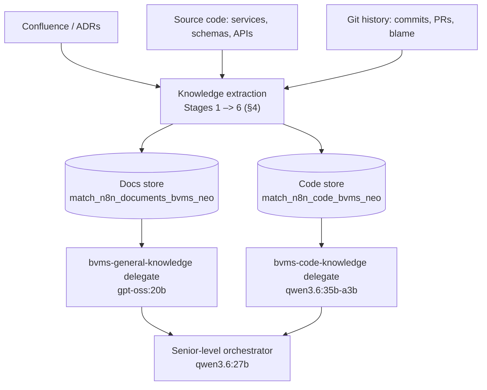

# BVMS Domain-Expert Assistant — Design Principle

> **In one line:** turn a maritime enterprise codebase into an assistant that reasons like a senior
> engineer + architect on **local small models**.
>
> Two layers make it work: a **knowledge layer** mines the hidden 80% of knowledge from code, schemas,
> and git into **two vector stores**, and a **reasoning layer** — [`ProgressiveAgentSLM`](planning.md)
> — serves it with RAG, a bounded context budget, and disciplined memory.

---

## 1. Goal

An assistant that answers like a **senior engineer, solution architect, and domain expert** — not a
documentation search box. It must grasp the maritime business, workflows, architecture, design
decisions, business rules, and the tradeoffs behind them, running on **stock local SLMs** (e.g.
`gpt-oss:20b`, `qwen3.6:27b`) with a cloud model as automatic fallback — no bespoke fine-tune required
to be useful.

---

## 2. Core principle — knowledge is cultivated, reasoning is disciplined

Most enterprise knowledge is **not** in documentation:

- **~20%** lives in Confluence, wikis, ADRs, and design docs.
- **~80%** is hidden in service interactions, database schemas, business rules, workflow code, bug
  fixes, and years of git history.

So the design is two moves:

1. **Extract the hidden 80%** into structured, retrievable JSON knowledge (§4).
2. **Reason over it with discipline** — RAG bounded context + quality retrieval + disciplined reasoning policies — so a _small_ model performs like an expert (§6).

---

## 3. Architecture at a glance

The extraction pipeline **fills the stores once**; at run time the delegate agents **query them**,
each answers **its part**, and the **orchestrator** combines the parts into the final answer.

## 4. The knowledge pipeline — extract the hidden 80%

Six extraction stages. Each turns raw source into small, retrievable JSON records and routes them to
one of the two stores.

| Stage                    | Extracts                                                      | Concrete example (input → record)                                                                                                                    | → Store |
| ------------------------ | ------------------------------------------------------------- | ---------------------------------------------------------------------------------------------------------------------------------------------------- | ------- |
| **1. Knowledge graph**   | Service / DB / API / event / entity relationships             | `VoyageService` → `{ "service": "VoyageService", "calls": ["FuelOptimizationService"], "writes": ["Voyage","Route"], "events": ["VoyageApproved"] }` | Code    |
| **2. Business rules**    | Logic in `if` / validation / authorization / pricing gates    | `if (vessel.age > 25)` → `{ "rule": "Vessels older than 25 years require additional approval." }`                                                    | Docs    |
| **3. Workflows**         | How a process executes across services                        | Controller → Service → Validation → RouteEngine → DB → Event → `{ "workflow": "Create Voyage", "steps": […] }`                                       | Docs    |
| **4. Domain vocabulary** | Industry terms → definitions                                  | `Demurrage` → `{ "term": "Demurrage", "definition": "Penalty when load/unload exceeds agreed time." }`                                               | Docs    |
| **5. Design decisions**  | Patterns (Saga, CQRS, Outbox…) → why / alternative / tradeoff | `Saga` → `{ "decision": "Saga", "reason": "Voyage spans services", "alternative": "2PC", "tradeoff": "Eventual consistency" }`                       | Code    |
| **6. Git history**       | Problem / solution / reasoning from commits, PRs, blame       | "Fix race condition in fuel optimization" → `{ "problem": "Concurrency", "solution": "Locking", "reasoning": "Prevent inconsistent calculations" }`  | Code    |

**Expected yield:** hundreds-to-thousands of business rules, a full system graph, a workflow library,
a domain glossary, an ADR set, and a historical-decision base. Each record is embedded and upserted
into its store; nothing has to be human-written first.

---

## 5. Two knowledge stores (what the delegates consume)

The pipeline's whole output collapses into **two Supabase pgvector stores**, one per delegate in
[example.json](example.json):

| Store (RPC)                    | Delegate                 | Model                           | Holds (from stages)                                                               |
| ------------------------------ | ------------------------ | ------------------------------- | --------------------------------------------------------------------------------- |
| `match_n8n_documents_bvms_neo` | `bvms-general-knowledge` | inherits parent (`gpt-oss:20b`) | Business rules, workflows, domain glossary — _how BVMS behaves_ (Stages 2–4)      |
| `match_n8n_code_bvms_neo`      | `bvms-code-knowledge`    | `qwen3.6:27b` (pinned)          | Service/DB/API graph, design decisions, git lessons — _how BVMS is built_ (1,5,6) |

A parent picks a delegate purely by its **`description`** ([planning §7](planning.md)), so "how does
approval work" lands on the docs store and "where is the race condition fixed" lands on the code
store — no routing rules to maintain.

---

## 6. From knowledge to answers — the reasoning layer

The extracted stores become expert answers through the `ProgressiveAgentSLM` mechanics
([planning.md](planning.md)):

- **RAG-first retrieval.** Each delegate runs its Supabase RPC with `ranking: true`, re-ranking
  chunks before they enter the prompt.
- **Bounded four-tier context** (`context_window_breakdown`, [planning §3](planning.md)). Budgets are
  _fractions_ of the active model's `max_tokens`, so retrieved knowledge fits a small model without
  overflow.
- **Reads source side-by-side** ([planning §6](planning.md)). File tools can read and search the run's
  `working_folders` (e.g. the BVMS backend / frontend checkout) read-only, alongside the two stores.
- **Segmented worklog + cognitive index + knowledge graph** ([planning §8](planning.md)). Delegates
  append findings to a shared, append-only worklog that is **segmented** into `worklog/seg-*.jsonl`; a
  `cognitive_index` jumps to any block by segment / iteration / line, and a background metadata agent
  distills each block into `knowledge_graph.jsonl` (entities, keywords, 25-word summary, workflow,
  relationships) — optionally mirrored to a graph or vector DB. The orchestrator re-reads the code
  delegate's evidence and the docs delegate's rules **by index lookup**, never by replaying the log.
- **Senior-style behavior by policy** (`cognitive_behavior`, [planning §5](planning.md)): `deep_think`
  decomposes the question, `double_check` verifies the evidence, `visualize_diagram` emits a Mermaid
  diagram, and `say_no` **refuses to invent** an answer when the stores are silent — the guardrail
  against hallucinated "facts".
- **Model ladder + parallelism** ([planning §2, §4](planning.md)): the local model does the frequent
  work while a cloud model escalates hard steps under one `max_retries_until_switching_models` budget;
  a single `parallel_supprocess` knob (default 1) runs delegate / tool / metadata work sequentially or
  in a bounded pool.

Net effect: expert reasoning emerges from **retrieval + memory discipline**, so the local model never
has to _memorize_ the enterprise.

---

## 7. Build strategy — RAG first, fine-tune optional

Value ships **without any training**, so the order is deliberate — **do not start with fine-tuning**:

1. **Extract & embed** the six stages into the two stores.
2. **Wire the two delegates** ([example.json](example.json)) — the assistant is already useful here.
3. **Add policies + worklog** for multi-step, senior-level reasoning.
4. **(Optional) Distill** teacher traces into the local model to cut retrieval reliance.

From RAG alone it must handle every intent below:

| Intent            | Example question                                                |
| ----------------- | --------------------------------------------------------------- |
| Knowledge         | "Explain `VoyageService`. What is demurrage?"                   |
| Workflow          | "Describe voyage approval. What can fail?"                      |
| Architecture      | "Why was Saga chosen? Where are the bottlenecks?"               |
| Critical thinking | "What are the architecture's weaknesses and risky assumptions?" |
| Product           | "What feature gaps exist? What should be built next?"           |
| Business          | "How does this workflow create value and revenue?"              |

**Optional distillation.** If you later fine-tune, target ~50k–150k examples (≈100k is a solid goal),
weighted knowledge 30% / workflow 20% / architecture 20% / critical-thinking 15% / product 10% /
business 5%. It is an enhancement, not a prerequisite.

---

## 8. Outcome

The assistant should answer, grounded in the two stores and reasoned through the agent:

- What does this system do, and **why** was it designed this way?
- What business problem does it solve, and what **tradeoffs** were accepted?
- How does it **scale**, what **risks** exist, and how should it **evolve**?

— behaving like a blend of **senior engineer, solution architect, product architect, domain expert,
and tech lead**, on local hardware, rather than a documentation search engine.

---

_Companion to [planning.md](planning.md) (the reasoning layer) and [example.json](example.json) (the
canonical config). Last updated: 2026-08-02._
