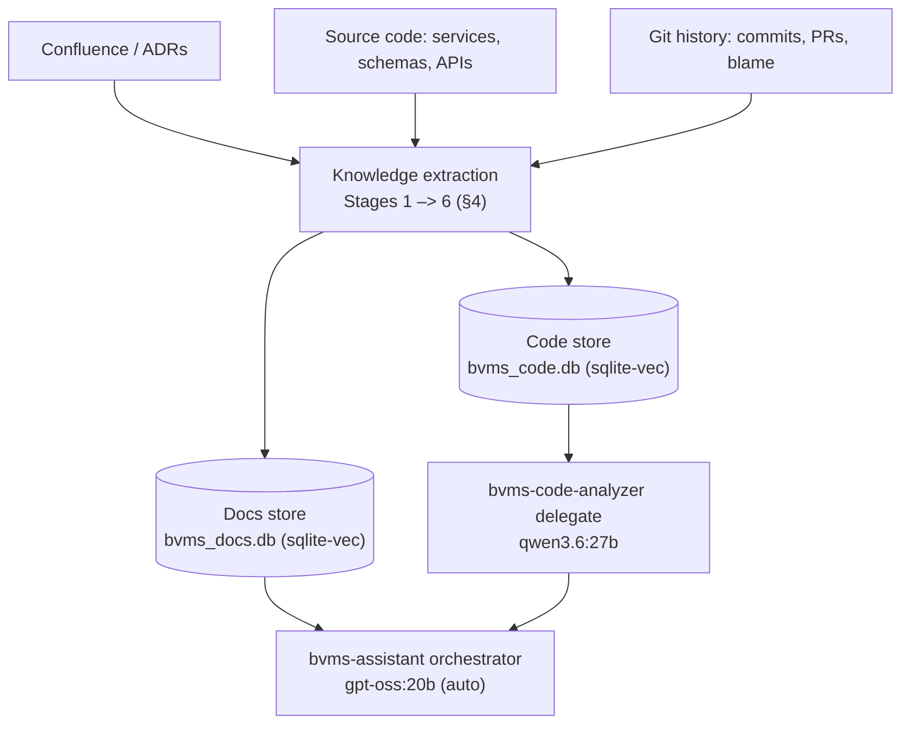

# BVMS Domain-Expert Assistant — Design Principle

> **In one line:** turn an enterprise codebase into an assistant that reasons like a senior engineer & architect using just **small local models**.
>
> Two layers make it work: a **knowledge layer** mines the hidden 80% of knowledge from codebase and git history into **two local SQLite vector stores** (sqlite-vec), and a **reasoning layer** — [`ProgressiveAgentSLM`](planning.md)
> — serves it as a RAG with a bounded context budget, and disciplined memory.

---

## 1. Goal

An assistant that answers like a **senior engineer, solution architect, and domain expert** — not a
documentation search box. It must grasp the business, workflows, architecture, design
decisions, business rules, and the tradeoffs behind them, running on **stock local SLMs** (e.g.
`gpt-oss:20b`, `qwen3.6:27b`) with a cloud model as automatic fallback — no bespoke fine-tune required
to be useful.

---

## 2. Core principle — knowledge is cultivated, reasoning is disciplined

Most enterprise knowledge is **not** in documentation:

- **~20%** lives in Confluence, wikis, ADRs, and design docs.
- **~80%** is hidden in service interactions, database schemas, business rules, workflow code, bug
  fixes, and years of git history.

So the design is two moves:

1. **Extract the hidden 80%** into structured, retrievable JSON knowledge (§4).
2. **Reason over it with discipline** — RAG bounded context + quality retrieval + disciplined reasoning policies — so a _small_ model performs like an expert (§6).

---

## 3. Architecture at a glance

The extraction pipeline **fills the stores once**; at run time the delegate agents **query them**,
each answers **its part**, and the **orchestrator** combines the parts into the final answer.

Both stores are wired into the assistant as **pre-built `memory_data_stores`** ([planning §8](planning.md)):
knowledge tables with an **empty `distill_from`**, filled once by the pipeline and read at run time
through `SqliteVectorQueryTool`.

## 4. The knowledge pipeline — extract the hidden 80%

Six extraction stages. Each turns raw source into small, retrievable JSON records and routes them to
one of the two stores.

| Stage                     | Extracts                                                      | Concrete example (input → record)                                                                                                                    | → Store |
| ------------------------- | ------------------------------------------------------------- | ---------------------------------------------------------------------------------------------------------------------------------------------------- | ------- |
| **1. Domain vocabulary**  | Industry terms → definitions                                  | `Demurrage` → `{ "term": "Demurrage", "definition": "Penalty when load/unload exceeds agreed time." }`                                               | Docs    |
| **2. Business logics**    | Core business logics and workflows executes across services   | Controller → Service → Validation → RouteEngine → DB → Event → `{ "workflow": "Create Voyage", "steps": […] }`                                       | Docs    |
| **3. Conditional rules**  | Logic in `if` / validation / authorization / pricing gates    | `if (vessel.age > 25)` → `{ "rule": "Vessels older than 25 years require additional approval." }`                                                    | Docs    |
| **4. Relationship graph** | Service / DB / API / event / entity relationships             | `VoyageService` → `{ "service": "VoyageService", "calls": ["FuelOptimizationService"], "writes": ["Voyage","Route"], "events": ["VoyageApproved"] }` | Code    |
| **5. Design decisions**   | Patterns (Saga, CQRS, Outbox…) → why / alternative / tradeoff | `Saga` → `{ "decision": "Saga", "reason": "Voyage spans services", "alternative": "2PC", "tradeoff": "Eventual consistency" }`                       | Code    |
| **6. Edge-case handling** | Problem / solution / reasoning from commits, PRs, blame       | "Fix race condition in fuel optimization" → `{ "problem": "Concurrency", "solution": "Locking", "reasoning": "Prevent inconsistent calculations" }`  | Code    |

**Expected yield:** hundreds-to-thousands of business rules, a full system graph, a workflow library,
a domain glossary, an ADR set, and a historical-decision base. Each record is embedded and upserted
into its store; nothing has to be human-written first.

---

## 5. Two knowledge stores (pre-built `memory_data_stores`)

The pipeline's whole output collapses into **two embedded SQLite vector stores** (`sqlite-vec`, each a
single local `.db` file — no server), wired into the assistant as **pre-built `memory_data_stores`**
([planning §8](planning.md)) — stores whose **`distill_from` is empty**, i.e. filled once by the
extraction pipeline and never self-mutated — and queried at run time through `SqliteVectorQueryTool`:

| Store (file · table)              | Consumed by               | Model                  | Holds (from stages)                                                               |
| --------------------------------- | ------------------------- | ---------------------- | --------------------------------------------------------------------------------- |
| `bvms_docs.db` · `bvms_documents` | `bvms-assistant` (parent) | `gpt-oss:20b` (auto)   | Business rules, workflows, domain glossary — _how BVMS behaves_ (Stages 2–4)      |
| `bvms_code.db` · `bvms_code`      | `bvms-code-analyzer`      | `qwen3.6:27b` (pinned) | Service/DB/API graph, design decisions, git lessons — _how BVMS is built_ (1,5,6) |

Alongside these read-only stores the assistant also **cultivates its own** `memory_data_stores` while it
works (`distilled_knowledge`, `conceptual_index`, `situational_knowledge`, `design_decisions_knowledge`,
`known_edge_cases_knowledge`) — distilled from its `iteration_logging` raw log via each store's
`distill_prompt` — so what it learns while answering is captured for reuse ([planning §8](planning.md)).
A parent picks a delegate purely by its **`description`** ([planning §7](planning.md)), so "how does
approval work" lands on the docs store and "where is the race condition fixed" lands on the code
store — no routing rules to maintain.

---

## 6. From knowledge to answers — the reasoning layer

The extracted stores become expert answers through the `ProgressiveAgentSLM` mechanics
([planning.md](planning.md)):

- **RAG-first retrieval.** Each store is queried through `SqliteVectorQueryTool` (`sqlite-vec`) with
  re-ranking, so the best chunks enter the prompt.
- **Bounded three-window context** (`context_window_breakdown_percentages`, [planning §3](planning.md)).
  The active model's context splits into `cognition_window` / `attention_window` / `response_window`
  (percentages that sum to 100), so retrieved knowledge fits a small model without overflow.
- **Reads source side-by-side** ([planning §6](planning.md)). File tools read and search the run's
  `working_directories` (e.g. the BVMS backend / frontend checkout) — read-only unless a directory is
  marked `writable` (optionally gated by `write_approval`), alongside the two stores.
- **Cultivated, layered memory** ([planning §8](planning.md)). Every iteration's raw reasoning is
  appended to the append-only `iteration_logging` log (`iteration_*.jsonl`, the raw source of truth);
  a chain of `memory_data_stores` distils that log — and each other — via each store's `distill_prompt`
  into `distilled_knowledge`, a `conceptual_index`, and situational / design-decision / edge-case
  knowledge. Stores flagged `always_use_in_cognition_window` (bounded by a `cognition_window_budget_percentage`)
  ride in the prompt every step; the rest are pulled on demand through their `retrieval_tool`. The
  orchestrator re-reads a delegate's evidence by querying these stores, never by replaying the log —
  and each store is progressively closer to the prompt.
- **Senior-style behavior by policy — fired on hooks, allowed to loop** (`behavior_policies`, [planning §5](planning.md)):
  `deep_planning` decomposes the question (`run_after: question_received`), `analyzing_retrieval_results`
  vets what came back, `double_checking` verifies the evidence and — with `circular_behavior_policies_allowed`
  — can loop back into `deep_planning` up to `behavior_policies_max_circular_rounds`, `visual_representation`
  emits a Mermaid diagram, and `refusing_to_invent` **refuses to invent** an answer when the stores are
  silent. Because each policy runs **in code** at its `run_after` hook (not merely as prompt text), the
  guardrail against hallucinated "facts" holds even when the SLM would rather guess.
- **Prompt-cache discipline** ([planning §3](planning.md)): the run-constant part of the prompt
  (`system_prompt`, policies, tool / delegate descriptions, always-in-cognition memory) is a **byte-stable
  prefix** the model's KV cache reuses every iteration; only the retrieved evidence + answer change. This
  is what keeps a multi-step reasoning loop **fast on local hardware** — the prefix is re-prefilled only
  on a compaction.
- **Capability-routed model pool + budgets + parallelism** ([planning §2, §4](planning.md)):
  `models_ladder` tags each model by role (`is_embedding_only` / `is_tool_selection` /
  `is_general_purpose` / `is_memory_distillation` / `is_coding` / `is_vision` / `is_multimodal` /
  `is_fallback`) and `model_selection: "auto"` runs the first general-purpose one locally while a cloud
  model escalates hard steps. Each job routes **by flag** to its own model, and pinning each pre-loaded
  model to its **own warm endpoint** (`ollama` / `lmstudio` / `open_router`, `keep_warm`, bounded by
  `max_concurrency`) lets **reasoning, embedding, and knowledge distillation run in parallel** — the
  `is_memory_distillation` model cultivates the `memory_data_stores` on its own endpoint while the
  general-purpose model keeps answering. **Failover** (`max_retries_until_switching_models`) and **loop
  bounds** (`behavior_policies_max_circular_rounds`) are kept as separate budgets so a run neither burns
  the ladder prematurely nor spins forever; a single `parallel_subprocesses` knob (default 1) runs
  delegate / tool / distillation work sequentially or in a bounded pool.

Net effect: expert reasoning emerges from **retrieval + memory discipline**, so the local model never
has to _memorize_ the enterprise.

---

## 7. Build strategy — RAG first, fine-tune optional

Value ships **without any training**, so the order is deliberate — **do not start with fine-tuning**:

1. **Extract & embed** the six stages into the two pre-built stores.
2. **Wire the two stores + delegate** ([example-revised.json](example-revised.json)) — the assistant is already useful here.
3. **Add `behavior_policies` + `iteration_logging` + cultivated `memory_data_stores`** for multi-step, senior-level reasoning.
4. **(Optional) Distill** teacher traces into the local model to cut retrieval reliance.

From RAG alone it must handle every intent below:

| Intent            | Example question                                                |
| ----------------- | --------------------------------------------------------------- |
| Knowledge         | "Explain `VoyageService`. What is demurrage?"                   |
| Workflow          | "Describe voyage approval. What can fail?"                      |
| Architecture      | "Why was Saga chosen? Where are the bottlenecks?"               |
| Critical thinking | "What are the architecture's weaknesses and risky assumptions?" |
| Product           | "What feature gaps exist? What should be built next?"           |
| Business          | "How does this workflow create value and revenue?"              |

**Optional distillation.** If you later fine-tune, target ~50k–150k examples (≈100k is a solid goal),
weighted knowledge 30% / workflow 20% / architecture 20% / critical-thinking 15% / product 10% /
business 5%. It is an enhancement, not a prerequisite.

---

## 8. Outcome

The assistant should answer, grounded in the two stores and reasoned through the agent:

- What does this system do, and **why** was it designed this way?
- What business problem does it solve, and what **tradeoffs** were accepted?
- How does it **scale**, what **risks** exist, and how should it **evolve**?

— behaving like a blend of **senior engineer, solution architect, product architect, domain expert,
and tech lead**, on local hardware, rather than a documentation search engine.

---

_Companion to [planning.md](planning.md) (the reasoning layer) and
[example-revised.json](example-revised.json) (the canonical config). Last updated: 2026-08-09._
