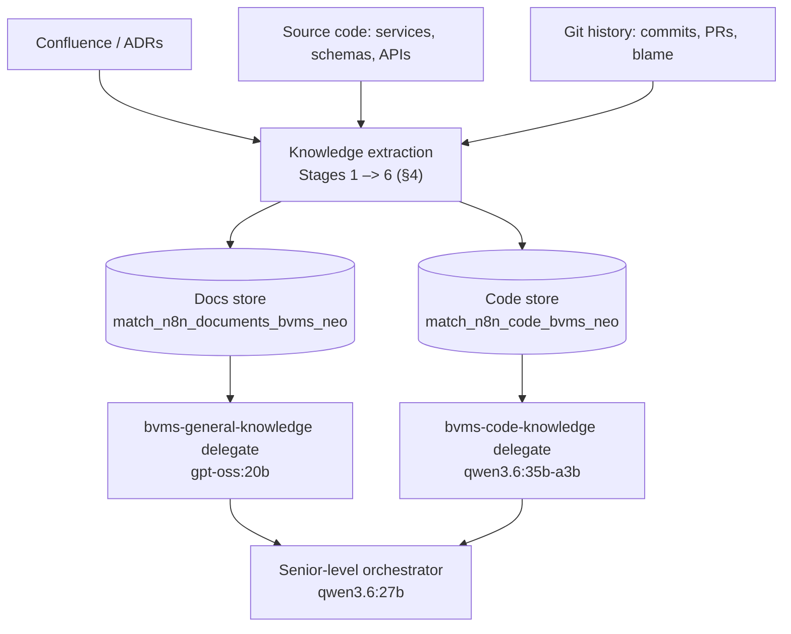

# BVMS Domain-Expert Assistant — Design Principle

> **Goal in one line:** turn a maritime enterprise codebase into an assistant that reasons like a
> senior engineer + architect, running on **local small models**.
>
> The **knowledge layer** mines the hidden 80% of
> knowledge out of code, schemas, and git and lands it in **two vector stores**. The **reasoning
> layer** — [`ProgressiveAgentSLM`](planning.md) — serves that knowledge with disciplined memory

---

## 1. Goal

An assistant that answers like a **senior engineer, solution architect, and domain expert** — not a
documentation search box. It must understand the maritime business, company workflows, software
architecture, design decisions, business rules, operational constraints, and the tradeoffs behind
them. It runs on **stock local SLMs** (e.g. `gpt-oss:20b`, `qwen3.6:27b`) with a cloud model as an
automatic fallback — no bespoke 100k-example fine-tune is required to be useful.

---

## 2. Core principle — knowledge is cultivated, reasoning is disciplined

Most enterprise knowledge is **not** in documentation:

- **~20%** lives in Confluence, wikis, ADRs, and design docs.
- **~80%** is hidden in service interactions, database schemas, business rules, workflow code, bug
  fixes, and years of git history.

So the design is two moves:

1. **Extract the hidden 80%** into structured, retrievable JSON knowledge (§4).
2. **Reason over it with discipline** — RAG bounded context + quality retrieval + disciplined reasoning policies — so a _small_ model performs like an expert (§6).

---

## 3. Architecture at a glance

The extraction pipeline **fills the stores once**; the delegate agents **queries them at run time** and **answer to question on their part** and the final answer is combined and delivered through the **Orchestrator**.



## 4. The knowledge pipeline — extract the hidden 80%

Six extraction stages. Each turns raw source into small, retrievable JSON records and routes them to
one of the two stores.

| Stage                    | Extracts                                                      | Concrete example (input → record)                                                                                                                    | → Store |
| ------------------------ | ------------------------------------------------------------- | ---------------------------------------------------------------------------------------------------------------------------------------------------- | ------- |
| **1. Knowledge graph**   | Service / DB / API / event / entity relationships             | `VoyageService` → `{ "service": "VoyageService", "calls": ["FuelOptimizationService"], "writes": ["Voyage","Route"], "events": ["VoyageApproved"] }` | Code    |
| **2. Business rules**    | Logic in `if` / validation / authorization / pricing gates    | `if (vessel.age > 25)` → `{ "rule": "Vessels older than 25 years require additional approval." }`                                                    | Docs    |
| **3. Workflows**         | How a process executes across services                        | Controller → Service → Validation → RouteEngine → DB → Event → `{ "workflow": "Create Voyage", "steps": […] }`                                       | Docs    |
| **4. Domain vocabulary** | Industry terms → definitions                                  | `Demurrage` → `{ "term": "Demurrage", "definition": "Penalty when load/unload exceeds agreed time." }`                                               | Docs    |
| **5. Design decisions**  | Patterns (Saga, CQRS, Outbox…) → why / alternative / tradeoff | `Saga` → `{ "decision": "Saga", "reason": "Voyage spans services", "alternative": "2PC", "tradeoff": "Eventual consistency" }`                       | Code    |
| **6. Git history**       | Problem / solution / reasoning from commits, PRs, blame       | "Fix race condition in fuel optimization" → `{ "problem": "Concurrency", "solution": "Locking", "reasoning": "Prevent inconsistent calculations" }`  | Code    |

**Expected yield:** hundreds-to-thousands of business rules, a full system graph, a workflow library,
a domain glossary, an ADR set, and a historical-decision base. Each record is embedded and upserted
into its store; nothing has to be human-written first.

---

## 5. Two knowledge stores (what the delegates consume)

The pipeline's whole output collapses into **two Supabase pgvector stores**, one per delegate in
[example.json](example.json):

| Store (RPC)                    | Delegate                 | Model                           | Holds (from stages)                                                               |
| ------------------------------ | ------------------------ | ------------------------------- | --------------------------------------------------------------------------------- |
| `match_n8n_documents_bvms_neo` | `bvms-general-knowledge` | inherits parent (`gpt-oss:20b`) | Business rules, workflows, domain glossary — _how BVMS behaves_ (Stages 2–4)      |
| `match_n8n_code_bvms_neo`      | `bvms-code-knowledge`    | `qwen3.6:27b` (pinned)          | Service/DB/API graph, design decisions, git lessons — _how BVMS is built_ (1,5,6) |

A parent picks a delegate purely by its **`description`** ([planning §7](planning.md)), so "how does
approval work" lands on the docs store and "where is the race condition fixed" lands on the code
store — no routing rules to maintain.

---

## 6. From knowledge to answers — the reasoning layer

The extracted stores become expert answers through the `ProgressiveAgentSLM` mechanics
([planning.md](planning.md)):

- **RAG-first retrieval.** Each delegate runs its Supabase RPC with `ranking: true`, re-ranking
  chunks before they enter the prompt.
- **Bounded four-tier context** (`context_window_breakdown`, [planning §3](planning.md)). Budgets are
  _fractions_ of the active model's `max_tokens`, so retrieved knowledge fits a small model without
  overflow.
- **Append-only worklog + cognitive index** ([planning §8](planning.md)). Both delegates append
  findings to one shared `raw_worklog.jsonl` (JSON Lines, block-addressed by `block_id`); the
  orchestrator loops back over the code delegate's evidence and the docs delegate's rules — by index
  lookup, not by replaying the whole log — to synthesize one grounded answer.
- **Senior-style behavior by policy** (`cognitive_behavior`, [planning §5](planning.md)): `deep_think`
  decomposes the question, `double_check` verifies the evidence, `visualize_diagram` emits a Mermaid
  diagram, and `say_no` **refuses to invent** an answer when the stores are silent — the guardrail
  against hallucinated "facts".
- **Model ladder** ([planning §4](planning.md)): the local model does the frequent work; a cloud model
  escalates hard steps, governed by a single `max_retries_until_switching_models` budget.

Net effect: expert reasoning emerges from **retrieval + memory discipline**, so the local model never
has to _memorize_ the enterprise.

---

## 7. RAG first, fine-tunning later

| Intent            | Example question                                                |
| ----------------- | --------------------------------------------------------------- |
| Knowledge         | "Explain `VoyageService`. What is demurrage?"                   |
| Workflow          | "Describe voyage approval. What can fail?"                      |
| Architecture      | "Why was Saga chosen? Where are the bottlenecks?"               |
| Critical thinking | "What are the architecture's weaknesses and risky assumptions?" |
| Product           | "What feature gaps exist? What should be built next?"           |
| Business          | "How does this workflow create value and revenue?"              |

---

## 8. Dataset shape & scale (optional fine-tunning phase)

If and when you distill, target this mix and volume:

| Dataset type       | Share |
| ------------------ | ----- |
| Knowledge          | 30%   |
| Workflow           | 20%   |
| Architecture       | 20%   |
| Critical thinking  | 15%   |
| Product strategy   | 10%   |
| Business reasoning | 5%    |

**Scale:** 50,000–150,000 examples; **~100,000** is a good target for a serious assistant. Treat this
as an enhancement — the assistant is already useful from RAG alone.

---

## 9. Build strategy — RAG-first, fine-tune optional

```
Confluence + Source code + Git
        ↓
        extract (Stages 1–6)
        ↓
Two Supabase vector stores  ───────►  usable assistant after this line
        ↓
        wire delegates (example.json)
        ↓
ProgressiveAgentSLM  (RAG + four-tier budget + worklog + cognitive_behavior)
        ↓
        (optional) teacher traces → distill
        ↓
Sharper, lower-retrieval local expert
```

1. **Extract & embed** the six stages into the two stores.
2. **Wire the two delegates** ([example.json](example.json)) — the assistant is valuable here, with
   **zero training**.
3. **Add policies + worklog** for multi-step, senior-level reasoning.
4. **(Optional) Distill** teacher traces into the local model to cut retrieval reliance.

The order matters: **do not** start with fine-tuning. Value ships at step 2.

---

## 10. Outcome

The assistant should answer, grounded in the two stores and reasoned through the agent:

- What does this system do, and **why** was it designed this way?
- What business problem does it solve, and what **tradeoffs** were accepted?
- How does it **scale**, what **risks** exist, and how should it **evolve**?

— behaving like a blend of **senior engineer, solution architect, product architect, domain expert,
and tech lead**, on local hardware, rather than a documentation search engine.

---

_Companion to [planning.md](planning.md) (the reasoning layer) and [example.json](example.json) (the
canonical config). Last updated: 2026-08-01._
