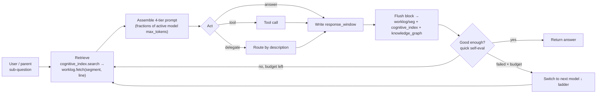

# ProgressiveAgentSLM — Planning & Progress Tracker

> **ProgressiveAgentSLM** is a single, **recursive** agent class tuned for **local / small language
> models (SLMs)**. One instance owns an identity, a `system_prompt`, a four-tier **context-window
> budget** (`context_window_breakdown`, expressed as **fractions** of the active model's context), a
> **ladder** of **models** (local→cloud, each with one retry budget), a set of **cognitive_behavior**
> policies (`when → then`), a set of **tools** (Supabase vector search, todo, write-file, search-file,
> vector-memory, skills, diagrams, python), a set of **working_folders** it may read / search (e.g.
> source code), and a set of **delegates** — which are themselves `ProgressiveAgentSLM` instances.
>
> The agent _progressively_ builds a lightweight **cognitive index** over an **append-only, segmented
> worklog** (sharded into per-iteration files under `worklog/`, its single source of truth) and
> retrieves only the blocks it needs back into a bounded working window — so quality comes from
> **disciplined memory handling, not a bigger model**. A background **metadata agent** distills every
> flushed block into a `knowledge_graph` (entities, keywords, a 25-word summary, workflow &
> relationships) that the index can jump to **by file / iteration / line** — or, optionally, query from
> a **graph** or **vector** database. Every agent and delegate shares the run's **worklog_folder** (so
> teammates can loop back over each other's work) and may read the user's **working_folders** side by
> side; subprocess fan-out runs sequentially or in parallel per **`parallel_supprocess`**. Any model
> slot can be escalated, plug-and-play, to a more capable **cloud** model (OpenRouter).
>
> The class reuses existing primitives (`Task`, model clients, `SupabaseVectorStore`,
> `DocumentRanking`, `PythonCodeExecute`, `KnowledgeCompression`, `IterationSummarizer`,
> `AnswerEvaluator`, `FinalThoughtSummarizer`) and drops into `create_chat_backend` unchanged.

**Status legend:** ⬜ Not started · 🟡 In progress · ✅ Done · ⛔ Blocked

> **Revision 2026-08-02 — what changed & why (this pass):**
>
> 1. **The worklog is segmented, not one big file.** The single `raw_worklog.jsonl` becomes an
>    append-only **segment set** under `worklog/` (sharded by iteration, optional size cap). _Why:_ a
>    run no longer grows one unbounded file, and the index can **jump straight to a segment file +
>    iteration + line**, so old work is reachable in O(1) instead of by scanning (§8.1).
> 2. **The `cognitive_index` addresses blocks by `{segment, iteration, line, offset}`** (not just
>    `block_id`), so the agent can request the log **by file name, iteration number, or line**.
> 3. **A metadata agent builds a `knowledge_graph`.** On each flush a background indexer distills the
>    block into `{entities, keywords, 25-word summary, workflow, relationships}` and appends it to
>    `knowledge_graph.jsonl` — retrieval by meaning + structure, not just text (§8.2).
> 4. **Optional graph + vector database backends.** The `knowledge_graph` can be mirrored to a **graph
>    DB** (nodes / edges, queryable via GraphQL / Cypher) and/or a **vector DB**, so old worklogs are
>    retrieved **dynamically**, not only by reading files. Both default **off** (file-only) (§8.3).
> 5. **`working_folders`.** A list of external directories (e.g. source code) the agent may
>    **read / search** side by side with the worklog — separate from, and never mutated like, the log.
> 6. **`parallel_supprocess` (default 1).** One knob controls whether subprocess fan-out — delegates,
>    tool calls, per-block metadata, DB upserts — runs **sequentially (1)** or in a **bounded parallel
>    pool (>1)**.

> **Revision 2026-08-01 — what changed & why (improvements applied this pass):**
>
> 1. **The worklog is now JSON, not text.** `raw_worklog.log` → **`raw_worklog.jsonl`** (append-only
>    **JSON Lines**): each finished block is one self-contained JSON record on its own line. _Why:_
>    typed and structured, no fragile custom-delimiter parsing, still strictly append-only, still
>    greppable, and it drops straight into SQLite FTS5. (JSON Lines — not one big `.json` array —
>    because you can append a line without rewriting the whole file.)
> 2. **Blocks are addressed by a stable `block_id`, not by line ranges.** `cognitive_index` now joins
>    to the worklog by `block_id` instead of `[start_line, end_line]`. _Why:_ line ranges broke the
>    moment anything was reformatted or compacted; a `block_id` join never shifts, and an optional
>    `block_id → byte-offset` map gives **O(1)** block fetch.
> 3. **One clear storage split.** Shared team memory is **structured JSON** (`*.jsonl` — durable,
>    addressable); per-agent working windows stay **plain-text scratch** (`*.log` — streamed,
>    disposable). See §8.
> 4. **Typo fixed:** `max_retries_untill_switching_models` → **`max_retries_until_switching_models`**
>    (also updated in `example.json`).
> 5. **Clarity:** added an iteration-loop diagram (§3), tightened dense tables, and made file /
>    terminology naming consistent throughout.

---

## 1. Vision & Design Philosophy

- **One recursive class.** Everything is a `ProgressiveAgentSLM`. A "team" is simply an agent whose
  `delegates` are other agents — composition _is_ recursion; there is no separate orchestrator type.
  Each agent carries its own `agent_id` + `description`, and the `description` alone is the signal a
  parent reads to decide when to hand it a sub-question.
- **Progressive cognition by indexing, not stuffing.** Each iteration the model's context is
  partitioned into four proportional tiers (§3) — fractions of whatever model is active. Instead of
  piling everything into the prompt, the agent appends its work to an **append-only, segmented
  worklog** (`worklog/seg-*.jsonl`) and builds a **`cognitive_index`** — a compact map of ~10–20-token
  pointers into that log. To think, it looks up the index and pulls only the relevant blocks back into
  a bounded working set (`context_window.log`). On small models, quality comes from disciplined memory
  handling — not a bigger model.
- **Local & SLM-first, cloud optional.** `models` is a priority **ladder** (highest → lowest). Local
  Ollama models do the frequent work; a cloud model (OpenRouter) sits lower as an automatic fallback,
  or is promoted to the top for hard steps. Each model gets one bounded retry budget —
  `max_retries_until_switching_models` — that counts **both** quality (self-eval) **and** infra
  (timeout / HTTP) failures before the agent **switches to the next model** on the ladder (§4).
- **Behavior by policy, not by code.** `cognitive_behavior` is a list of `when → then` rules rendered
  into the system prompt every iteration — it both steers how a small model thinks (deep-think,
  double-check, visualize, say-no) and acts as the run's **todo checklist**. Policies are declarative
  only (no per-policy models); a non-programmer can shape behavior without touching Python.
- **One append-only worklog, shared by the whole team.** Every agent and delegate appends finished
  blocks to the same **segmented worklog** (the single source of truth) through one serialized writer,
  and maps them in `cognitive_index`. Delegates deliver their final answer to the parent when done,
  but their work stays in the shared log so any later agent can **loop back** over it via the index.
- **Route by description, guide tools by `when`.** A parent routes a sub-question to a delegate purely
  by reading each delegate's `description` — no separate gate to maintain. Tools still carry a `when`
  guidance string injected next to the tool, so a small model calls it at the right moment (and so the
  menu can be pruned, §7).
- **Reuse, don't rebuild.** Async streaming generators that `yield` chunks, DI via constructor
  kwargs, `Task`-subclass agents, prompt-based JSON with robust regex fallbacks, JSON-file
  config / state. New code lives under `src/framework/`; existing files are touched minimally.

---

## 2. The `ProgressiveAgentSLM` Object

A single class configured by one object (JSON or Python). Every field has a sensible default; only
`agent_id`, `description`, and — on the root agent — at least one `model` are required.

| Field                                | Type        | Meaning                                                                                                                                                                                                                             |
| ------------------------------------ | ----------- | ----------------------------------------------------------------------------------------------------------------------------------------------------------------------------------------------------------------------------------- |
| `agent_id`                           | str         | Stable identifier. A parent addresses this agent as `delegate:<agent_id>`, and it labels the agent's blocks in the shared worklog.                                                                                                  |
| `description`                        | str         | One-line capability summary. The **sole** signal a parent reads to decide whether to delegate here — no separate gate.                                                                                                              |
| `system_prompt`                      | str \| null | The agent's base persona / instructions, rendered at the top of the `cognitive_reflection_behavior` tier (§3). Optional; when omitted, a default is built from `description` + `cognitive_behavior`. Per-agent (not inherited).     |
| `worklog_folder`                     | str         | Directory for the run's worklog subsystem (§8). Delegates **share** the parent's `worklog_folder` — one shared log per run.                                                                                                         |
| `working_folders`                    | list        | External directories the agent may **read / search** side by side with the log (e.g. source code), each `{ path, description }`. Read-only; never mutated (writes stay in the worklog). Inherited by delegates.                     |
| `parallel_supprocess`                | int         | Max concurrent subprocesses for parallelizable work — delegate fan-out, tool calls, per-block metadata, DB upserts. **1** = strictly sequential (default); **>1** = bounded parallel pool. Inherited by delegates.                  |
| `knowledge_graph`                    | object      | Config for the metadata / knowledge-graph subsystem (§8): the indexer model, the `knowledge_graph.jsonl` sink, and optional `graph_db` / `vector_db` mirrors. Inherited by delegates.                                               |
| `context_window_breakdown`           | object      | The four-tier budget, expressed as **fractions** of the active model's `max_tokens` (§3) — the heart of the design. Real token counts are inferred per model.                                                                       |
| `max_retries_until_switching_models` | int         | One per-model retry budget covering **both** quality (self-eval) **and** infra (timeout / HTTP) failures. Default **5**. When a model exhausts it, **switch to the next model** on the ladder; ladder exhaustion ends the run (§4). |
| `models`                             | list        | Priority **ladder** (§4), highest first. Each model carries its own `max_retries_until_switching_models`; a successful iteration resets the ladder to the top model.                                                                |
| `cognitive_behavior`                 | list        | `when → then` behavioral policies (§5) rendered into the system prompt each iteration; also the run's todo checklist. Declarative only — no per-policy models.                                                                      |
| `tools`                              | list        | Capabilities the agent may call, each with a `when` guidance string (§6): Supabase, todo, write-file, search-file, vector-memory, skills, …                                                                                         |
| `delegates`                          | list        | Nested `ProgressiveAgentSLM` configs (§7). The parent routes sub-questions to them by reading each one's `agent_id` / `description`.                                                                                                |

> **Inheritance.** A delegate that omits `models` or `max_retries_until_switching_models` **inherits
> the parent's**, and likewise inherits `working_folders`, `parallel_supprocess`, and `knowledge_graph`.
> It shares the parent's `worklog_folder` (hence the shared segmented worklog + `cognitive_index` +
> `knowledge_graph.jsonl`) while keeping its **own** `context_window.log` + `response_window.log`.
> `context_window_breakdown`, `system_prompt`, `cognitive_behavior`, and `tools` are per-agent (not
> inherited), so each delegate is independently budgeted and specialized.

> **Working folders.** `working_folders` are the directories the agent _works on_ — typically source
> code — kept **separate** from the `worklog_folder` where it _records_ its thinking. `ReadFileTool` /
> `SearchFileTool` may resolve paths under any `working_folders` root **and** the worklog;
> `WriteFileTool` stays sandboxed to the worklog, so source is never mutated. Each entry's
> `description` tells the agent what lives in that folder. Every access is confined to a configured
> root with traversal / absolute-escape rejection (OWASP A01/A03).

> **Parallelism.** `parallel_supprocess` (default **1**) is the one concurrency knob: `1` runs every
> subprocess step — delegate fan-out, independent tool calls, per-block metadata generation, DB
> upserts — **sequentially**; `>1` runs them in a **bounded parallel pool** of that size. Because it is
> inherited, it bounds fan-out at every level, so a deep delegate tree can't explode into unbounded
> concurrency.

---

## 3. `context_window_breakdown` — the four-tier proportional budget

The budget is expressed as **fractions of the active model's `max_tokens`**, not absolute token
counts — so the same config runs unchanged on models with different context sizes, and each tier's
real allowance is inferred at runtime as `fraction × max_tokens`. Only **three** tiers are declared;
the **remainder is reserved for the answer**. Rather than stuffing accumulated history into the
prompt, the agent keeps the full record in the append-only **segmented worklog** (`worklog/seg-*.jsonl`)
and a `cognitive_index` map over it; the tiers below bound what actually enters the prompt each step.

| Tier                             | Default | Holds                                                                                                                                                                                                              | Budget / compaction rule                                                                                                                                  |
| -------------------------------- | ------- | ------------------------------------------------------------------------------------------------------------------------------------------------------------------------------------------------------------------ | --------------------------------------------------------------------------------------------------------------------------------------------------------- |
| `conversation_history_awareness` | 0.025   | A brief summary of the last few turns — just enough to stay coherent without repeating everything (the full history lives in the worklog).                                                                         | Set **0** for a stateless / one-shot agent; the freed budget is **donated to the next tier** so the agent "thinks harder".                                |
| `cognitive_reflection_behavior`  | 0.325   | The cognition workspace: `system_prompt` + `cognitive_behavior` policies, tool + delegate descriptions and usage notes, and the internal reasoning / reflection trace used to pick the next step or switch models. | Hosts `cognitive_index` retrieval + reflection; when it and `current_working_attention` exceed budget, a progressive reflection compacts both to **50%**. |
| `current_working_attention`      | 0.525   | The working set for this run: the current user question plus everything retrieved from tools, delegates, and the past worklog (blocks pulled from the segmented `worklog/` via the index).                         | Compacted to **50%** when over budget (stale blocks dropped — still recoverable from the segments).                                                       |
| _(remainder ≈ 0.125)_            | —       | The answer the agent emits this iteration (backed by `response_window.log`, §8).                                                                                                                                   | Hard output cap = `max_tokens − Σ(declared tiers)`. Flushed to the segmented `worklog/` + indexed, then **cleared** for the next iteration.               |
| _(unbounded)_                    | —       | The segmented `worklog/seg-*.jsonl` — every finished block from every agent / delegate, the **single source of truth**.                                                                                            | **Append-only, never rewritten.** No budget; this is what makes the 50% compactions above safe (nothing is truly lost).                                   |

> The three declared fractions default to **0.025 / 0.325 / 0.525 = 0.875**, leaving **≈ 0.125** to
> answer. They must sum to **< 1**; the loader rejects a breakdown that leaves no room for the answer
> (§12 Phase 3). For `gpt-oss:20b` (`max_tokens: 62000`) they resolve to ≈ **1,550 / 20,150 / 32,550**
> tokens, with **≈ 7,750** left for the answer; swap in a bigger-context model and every tier scales up
> automatically.

**How one iteration works:**



**Prompt assembly per step:**

```
[ cognitive_reflection_behavior:  system_prompt + cognitive_behavior(when→then, todo)
                                 + tool/delegate descriptions + reasoning/reflection trace   ≤ f_cog  × max_tokens ]
[ conversation_history_awareness:  brief rolling summary of recent turns                     ≤ f_conv × max_tokens ]
[ current_working_attention:       question + retrieved blocks (via cognitive_index) + tools ≤ f_work × max_tokens ]
→ answer:                          the response for this iteration                           ≤ (1 − Σf) × max_tokens
```

**Core loop invariant — index & retrieve, then compact:**

```
per block b produced (delegate answer / tool result / iteration answer):
    loc ← worklog.append(b)                           # append to the current segment; returns {block_id, segment, iteration, line, offset}
    cognitive_index.append(pointer(loc, b))           # {block_id, segment, iteration, line, offset, summary≈10-20 tok, keywords, tokens}
    metadata_agent.enqueue(b, loc)                    # off critical path (parallel_supprocess): entities/keywords/25-word summary/workflow/relationships → knowledge_graph.jsonl (+ optional graph/vector DB)

per iteration:
    ids     ← cognitive_index.search(question)        # by keyword/summary now; via graph/vector DB when enabled
    working ← worklog.fetch(ids)                      # jump by {segment, iteration, line, offset} ⇒ O(1)
    if size(working) + size(cognitive_reflection) > budget:
        reflect_and_compact(target = 0.5 * current_size)  # drop/merge pointers; blocks stay in the segments (recoverable)
    response_window ← respond(prompt)                 # ≤ (1 − Σf) × max_tokens
    flush(response_window → worklog + cognitive_index + metadata_agent); clear(response_window)
```

Every tier is a slice of the **selected** model's `max_tokens`, so the assembled request can **never**
exceed that model's context — no separate size-inference step is needed (§4). Because the segmented
`worklog/seg-*.jsonl` is immutable and `cognitive_index` is a pure **index** (not a compressed blob)
that addresses blocks by `{segment, iteration, line, offset}`, compaction only ever touches the
derived views — the agent can shrink its working memory aggressively and still recover any detail by
seeking one pointer back into the raw segments.

---

## 4. Models — per-agent priority ladder

`models` is an ordered list, highest priority first. Each entry:

| Key          | Required | Meaning                                                                                                                                                                      |
| ------------ | -------- | ---------------------------------------------------------------------------------------------------------------------------------------------------------------------------- |
| `platform`   | yes      | `ollama` (local) or `open_router` (cloud). Maps to the existing `Ollama` / `OpenRouter` clients.                                                                             |
| `name`       | yes      | Model name on that platform.                                                                                                                                                 |
| `url`        | no       | Platform endpoint (e.g. `http://localhost:11434` for Ollama, `https://openrouter.ai/api/v1` for OpenRouter). Defaults to the platform's env default.                         |
| `max_tokens` | no       | Context ceiling. A number sets it; `"auto"` (or omitted) uses the platform's advertised context. Every `context_window_breakdown` fraction is taken against this value (§3). |

**Selection & the ladder.** Walk the list top-down; the active model is the first **reachable** one.
Because the budget is proportional to whatever model is chosen (§3), any model fits — there is no
minimum-size gate. The list is a **ladder** with **one** per-model budget:

- **Retry budget — `max_retries_until_switching_models` (default 5).** A single counter per model
  covering **both** failure kinds: a "not good enough" verdict from the per-iteration quick
  self-evaluation (a _quality_ failure) **and** a timeout / HTTP / unreachable error (an _infra_
  failure). When the current model's counter reaches the budget, the agent **switches to the next
  model** on the ladder and resets the counter to 0.
- **Success resets the ladder.** When a model handles an iteration successfully, the ladder pointer
  resets to the **top** model for the next iteration (the cheapest capable model is always tried
  first).
- **Stopping.** The run stops when the ladder is **exhausted** — the last model uses up its
  `max_retries_until_switching_models`. There is no separate global iteration cap; ladder length ×
  per-model budget bounds the total work.

This is the per-agent generalization of a role-based registry — local-first with cloud as an automatic
backstop, or cloud promoted to the top for hard steps.

```json
"models": [
  { "platform": "ollama",      "name": "gpt-oss:20b",                 "url": "http://localhost:11434",       "max_tokens": 62000 },
  { "platform": "open_router", "name": "anthropic/claude-3.5-sonnet", "url": "https://openrouter.ai/api/v1", "max_tokens": "auto" }
]
```

---

## 5. `cognitive_behavior` — `when → then` behavioral policies

`cognitive_behavior` is a list of rules that shape the agent's behavior. Each rule renders into the
system prompt **every iteration** as "**When** _condition_, **then** _action_." This does two jobs at
once: it steers how a small model thinks, and it acts as the run's **todo checklist** the model
re-reads each pass to stay on task. The rendered rules live in the `cognitive_reflection_behavior`
tier (§3). Policies are **declarative only** — they carry no per-policy `models`; model choice is
governed globally by the ladder (§4), so authoring stays simple and one policy can't fragment the
model routing.

| Key    | Meaning                                                                                        |
| ------ | ---------------------------------------------------------------------------------------------- |
| `id`   | Short label for the policy (e.g. `deep_think`, `double_check`, `visualize_diagram`, `say_no`). |
| `when` | The condition / trigger, in plain language.                                                    |
| `then` | The action the agent should take when the condition holds.                                     |

**Recommended baseline policies:** **deep_think** (decompose complex questions before answering),
**double_check** (verify the gathered evidence actually answers the question; re-iterate if gaps
remain), **visualize_diagram** (emit a diagram when structure / relationships matter), **say_no**
(answer honestly when the KB has no answer rather than hallucinate).

---

## 6. Tools — capabilities with `when` guidance

Each tool entry tells the agent **what** the tool is and **when** to use it. The `when` string is
injected next to the tool in the prompt so a small model calls it at the right moment.

**Supabase (primary tool).** Vector search over a pgvector RPC — the most useful capability for these
RAG agents.

| Key             | Meaning                                                                                                    |
| --------------- | ---------------------------------------------------------------------------------------------------------- |
| `type`          | `Supabase`.                                                                                                |
| `function_name` | The pgvector RPC to call (e.g. `match_n8n_documents_bvms_neo`).                                            |
| `ranking`       | If `true`, re-rank retrieved chunks with parallel `DocumentRanking` (reuse `RagAssistant.stream` batches). |
| `when`          | Guidance: when this knowledge source is the right one to query.                                            |

All other tools follow the same `{ type, when, … }` shape, and each `when` is used both to guide the
model and to **prune the menu** (§7): only tools whose `when` matches the current step are shown. The
Supabase wrapper is built on the now-async `SupabaseVectorStore.async_query`.

**Standard tool catalog** (industry-conventional shapes, reusing existing primitives):

| Tool                  | Shape (beyond `type` + `when`)                  | Behavior                                                                                                                                                                                                                                                                                                                            |
| --------------------- | ----------------------------------------------- | ----------------------------------------------------------------------------------------------------------------------------------------------------------------------------------------------------------------------------------------------------------------------------------------------------------------------------------- |
| `Supabase`            | `function_name`, `ranking`                      | **Primary.** pgvector RPC via `SupabaseVectorStore.async_query`; optional parallel `DocumentRanking`. Read-only domain knowledge base.                                                                                                                                                                                              |
| `ReadFileTool`        | —                                               | Read a file's contents. Paths resolve under any `working_folders` root **or** the run's `worklog_folder`; `..` / absolute escapes rejected (OWASP A01/A03).                                                                                                                                                                         |
| `SearchFileTool`      | `glob?`                                         | Locate files by name / glob or find where a term / symbol appears (ripgrep-style) across the `working_folders` + `worklog_folder`; returns path + line + snippet. Read-only, traversal-safe.                                                                                                                                        |
| `WriteFileTool`       | `require_approval?`                             | Persist an artifact (notes, generated code, a report) **inside the `worklog_folder`** — `working_folders` (source) are read-only, never written. Path traversal / absolute escapes rejected (OWASP A01/A03). `require_approval: true` gates the write; default **false** → runs without prompting (home-lab). Reuses `FileHanlder`. |
| `TodoTool`            | —                                               | Maintains the run's checklist (`todo.md` in the `worklog_folder`). The model **rewrites the whole list** (`[{id, content, status: pending\|in_progress\|completed}]`); the loop re-injects it each iteration (anti-drift).                                                                                                          |
| `VectorMemoryTool`    | `function_name` (recall), `write_function_name` | The agent's **own, cross-run, writable** long-term memory (distinct from the read-only KB). `recall(query, k)` + `remember(text, tags?)`, backed by a Supabase memory table reusing `Embedding`. Naturally embeds `cognitive_index` summaries for semantic recall.                                                                  |
| `SkillTool`           | `skills_dir`                                    | On-demand **procedure packs** (progressive disclosure): each skill file has `{ id, description, when }` frontmatter + a body of steps. Only id / description / when are always visible; the body loads when its `when` matches. **Trusted-local files only** (loading external skill text is a prompt-injection surface).           |
| `GenerateDiagramTool` | —                                               | Emits Mermaid for the `visualize_diagram` policy.                                                                                                                                                                                                                                                                                   |
| `RunPythonTool`       | `require_approval?`                             | Wraps `PythonCodeExecute`; `require_approval: true` gates execution; default **false** → runs without prompting. ⚠️ Autonomous execution — revisit before any non-local use.                                                                                                                                                        |

---

## 7. Delegates — recursive composition

`delegates` is a list of **nested `ProgressiveAgentSLM` configs**. There is no separate "sub-agent"
type — a delegate is a full agent with its own `system_prompt`, `context_window_breakdown`, `tools`,
and optional `cognitive_behavior` / `models` / `delegates`. The parent:

1. **Routes by description.** For a sub-question the small model picks a delegate by reading each one's
   `description` — via the proven `_parse_agent_routing` JSON pattern, generalized to
   `delegate:<agent_id>`. Delegates are **not** gated by a separate `when`; a clear `description` is
   the whole contract (tools are still menu-pruned by their own `when`, §6). Fewer moving parts → more
   reliable SLM routing.
2. **Hands the sub-question down.** The delegate runs its **own** full progressive loop with its own
   `context_window.log` + `response_window.log`, but appends finished blocks to the **shared** segmented
   worklog + `cognitive_index` (one per run) under its own `agent_id`.
3. **Delivers when done.** Unlike the parent's live stream, a delegate returns only its **final**
   answer to the parent; the parent folds that block into its own working set (by index lookup) and
   continues. Because the delegate's full work remains in the shared log, any **later** agent or
   delegate can loop back over it via the index.

Depth is bounded by each model's `max_retries_until_switching_models` at every level plus an overall
recursion cap. Two RAG-backed delegates (`bvms-general-knowledge`, `bvms-code-knowledge`), each owning
a Supabase function, is the canonical example (§13).

---

## 8. The Worklog — segmented memory + a knowledge graph

The worklog lives in the run's `worklog_folder` (`<worklog_folder>/<run_id>/`). It rests on **one
clear split**, plus a **derived knowledge layer**:

- **Shared team memory = structured JSON.** An append-only, **segmented** raw worklog
  (`worklog/seg-*.jsonl`) + a `cognitive_index.jsonl` pointer map — durable, addressable, the single
  source of truth for the run.
- **Per-agent working windows = plain-text scratch** (`context_window.log` + `response_window.log`) —
  streamed to as the agent thinks, then discarded / compacted.
- **Derived knowledge = a metadata knowledge graph** (`knowledge_graph.jsonl`, optionally mirrored to
  a graph and/or vector DB) — built by a background metadata agent from every flushed block.

The tiers in §3 are the _prompt-side_ budget; these files are the _on-disk_ storage it draws from.

### 8.1 Segmented raw worklog — no more single big file

Instead of one unbounded `raw_worklog.jsonl`, finished blocks are appended to **rolling segment
files** under `worklog/`: one segment **per iteration** by default (`seg-<iter>.jsonl`), rolled to a
fresh segment whenever it crosses an optional size cap (`worklog.max_segment_lines`, default 2000).
Each block is still one self-contained JSON line keyed by a stable `block_id`; segmentation only
changes _where_ the line lives, never the append-only guarantee.

_Why segment:_ a long run no longer grows one giant file, and the index can **jump straight to a
segment file + iteration + line**, so any past block is one seek away instead of a full scan.

| File / dir              | Scope     | Format | Role                                                                                                                                                             |
| ----------------------- | --------- | ------ | ---------------------------------------------------------------------------------------------------------------------------------------------------------------- |
| `worklog/seg-*.jsonl`   | shared    | JSONL  | **Append-only, never rewritten.** Rolling segments of finished blocks (one JSON record per line, keyed by `block_id`). The single source of truth.               |
| `cognitive_index.jsonl` | shared    | JSONL  | One **pointer per block** → `{ block_id, segment, iteration, line, offset, summary, keywords }`. The map used to jump to and pull back only the relevant blocks. |
| `knowledge_graph.jsonl` | shared    | JSONL  | One **metadata record per block** (entities, keywords, 25-word summary, workflow, relationships) from the metadata agent (§8.2). Feeds the optional DBs (§8.3).  |
| `context_window.log`    | per-agent | text   | The agent's current working set; compacted to 50% when it exceeds the `current_working_attention` budget.                                                        |
| `response_window.log`   | per-agent | text   | The agent's **latest** answer only; flushed to the worklog + index + metadata agent, then **cleared** each iteration.                                            |
| `todo.md`               | shared    | text   | `TodoTool` checklist, re-injected each iteration.                                                                                                                |
| `index.db` _(optional)_ | shared    | SQLite | FTS5 over the segments + `cognitive_index.jsonl` for `LogSearch`.                                                                                                |

**A "block"** is one unit of finished work — a delegate's answer, a tool result, or an iteration's
answer. Blocks are **flushed at completion** (not token-by-token) through one **serialized writer**,
so `block_id`s stay unique and parallel delegates never interleave.

**Segment block record** (one JSON line — the verbatim source of truth):

```json
{
  "block_id": "run7-bvms-code-knowledge-iter3-002",
  "ts": "2026-08-02T12:34:56Z",
  "agent_id": "bvms-code-knowledge",
  "iteration": 3,
  "phase": "delegate",
  "actor": "tool:Supabase",
  "content": "…the full verbatim block text…",
  "tokens": 512
}
```

**Index pointer record** — now carries the block's physical location, so the agent can jump **by file
name, iteration, or line**:

```json
{
  "block_id": "run7-bvms-code-knowledge-iter3-002",
  "segment": "worklog/seg-003.jsonl",
  "iteration": 3,
  "line": 2,
  "offset": 5342,
  "agent_id": "bvms-code-knowledge",
  "phase": "delegate",
  "summary": "≈10–20-token gist",
  "keywords": ["voyage", "approval", "saga"],
  "tokens": 512
}
```

**Write path, per block.** The agent streams into its own `context_window.log` / `response_window.log`;
on completion it enqueues the block to the run's single writer, which (1) appends it to the current
`worklog/seg-*.jsonl` and returns `{ block_id, segment, iteration, line, offset }`, (2) appends one
pointer to `cognitive_index.jsonl`, and (3) hands the block to the **metadata agent** (§8.2). Then
`response_window.log` is cleared.

**Read path (index-and-retrieve).** To assemble its next prompt an agent does **not** replay the log;
it searches `cognitive_index` (keyword / summary now; graph or vector DB later, §8.3), takes the
matching pointers, and **seeks** just those blocks by `{ segment, offset }` into `context_window.log`.
This is RAG over the team's own worklog — the trick that keeps SLM prompts small.

**Progressive reflection (compaction).** When `context_window.log` + `cognitive_index` exceed their
budgets, a reflection compacts **both to 50%** (merge / drop pointers, release stale blocks). Nothing
is lost — the segments are immutable, so any dropped detail is one `{ segment, offset }` seek away.

**Delegate coordination.** A delegate returns just its **final** answer to its parent, but its full
work lands in the shared segments under its `agent_id`, so any later teammate can loop back over it via
the index.

### 8.2 Metadata agent → `knowledge_graph.jsonl`

A lightweight **metadata agent** turns each flushed block into one structured knowledge record and
appends it to `knowledge_graph.jsonl`:

| Field           | Meaning                                                                                       | Built by                                         |
| --------------- | --------------------------------------------------------------------------------------------- | ------------------------------------------------ |
| `entities`      | Named things in the block — services, tables, APIs, domain terms.                             | `SimpleEntityExtractor` (LLM fallback when hard) |
| `keywords`      | Salient search terms.                                                                         | `KeywordExtractor`                               |
| `summary`       | A **≤25-word** gist of the block.                                                             | ladder model (cheap)                             |
| `workflow`      | The process / steps the block describes, if any.                                              | ladder model                                     |
| `relationships` | Directed edges between entities (`{ from, type, to }`, e.g. `VoyageService —calls→ FuelSvc`). | ladder model                                     |

```json
{
  "block_id": "run7-bvms-code-knowledge-iter3-002",
  "segment": "worklog/seg-003.jsonl",
  "iteration": 3,
  "entities": ["VoyageService", "FuelOptimizationService", "Voyage"],
  "keywords": ["voyage", "approval", "saga"],
  "summary": "VoyageService coordinates approval across services with a saga; fuel optimization runs before commit.",
  "workflow": "Create Voyage → validate → optimize fuel → approve → emit VoyageApproved",
  "relationships": [
    {
      "from": "VoyageService",
      "type": "calls",
      "to": "FuelOptimizationService"
    },
    { "from": "VoyageService", "type": "writes", "to": "Voyage" }
  ]
}
```

The metadata agent runs **off the critical path**: blocks are enqueued and processed sequentially or
in a bounded pool per `parallel_supprocess` (§2). Its records are what the `cognitive_index` and the
optional DBs (§8.3) grow richer from — semantic recall over the run's own history.

### 8.3 Optional graph & vector database backends

By default the worklog is **file-only** — everything above works with no external services. For larger
or longer-lived runs, the `knowledge_graph` config (§2) can mirror each record into either or both of:

| Backend       | Config (`knowledge_graph.*`)                         | What it enables                                                                                                                                     |
| ------------- | ---------------------------------------------------- | --------------------------------------------------------------------------------------------------------------------------------------------------- |
| **Graph DB**  | `graph_db: { enabled, type, url, database }`         | Entities → nodes, `relationships` → edges. Query old worklogs **structurally** via GraphQL / Cypher (e.g. "what calls `FuelOptimizationService`?"). |
| **Vector DB** | `vector_db: { enabled, type, function_name, table }` | Embeds each summary + entities. **Semantic** recall over past worklogs via the same `SupabaseVectorStore`.                                          |

Both default **off**. When on, `cognitive_index.search()` can resolve a query against the graph or
vector DB **dynamically** instead of only reading files — so a later run can loop back over an earlier
run's knowledge without re-reading it. Mirror upserts run under `parallel_supprocess`, like the
metadata step.

```
<worklog_folder>/<run_id>/           # e.g. wip/bvms-assistant/<run_id>/
  worklog/
    seg-001.jsonl                    # ← append-only raw segments (rolled per iteration / size cap)
    seg-002.jsonl
  cognitive_index.jsonl              # ← pointer map → {block_id, segment, iteration, line, offset, summary, keywords}
  knowledge_graph.jsonl              # ← metadata agent output: entities, keywords, 25-word summary, workflow, relationships
  context_window.log                 # ← per-agent working set (compacts to 50% over budget)
  response_window.log                # ← per-agent latest answer (flushed, then cleared)
  todo.md                            # ← TodoTool checklist (re-injected each iteration)
# <worklog_folder>/index.db          # ← optional SQLite FTS5 over segments + cognitive_index (LogSearch)
# graph DB / vector DB               # ← optional external mirrors of knowledge_graph.jsonl (§8.3)
```

---

## 9. Goals → Components

| Goal (user)                                                                     | Realized by                                                                                                                                                                        |
| ------------------------------------------------------------------------------- | ---------------------------------------------------------------------------------------------------------------------------------------------------------------------------------- |
| Single recursive class anyone can configure (one object)                        | `ProgressiveAgentSLM` + `AgentConfig` + `config/load.py`                                                                                                                           |
| **Goal**: stay focused on the user-set goal                                     | `cognitive_behavior` policies + double-check / re-iterate loop (reuse `AnswerEvaluator`)                                                                                           |
| **Knowledge**: text files + Supabase vector DB + own long-term memory           | `SupabaseTool` (primary, pgvector) + `FileKnowledgeTool` + `VectorMemoryTool` (writable, cross-run)                                                                                |
| **Tools**: KB, files, search, write, todo, memory, skills, diagrams, python     | `ToolRegistry` + `tools/` (`SupabaseTool`, `ReadFileTool`, `SearchFileTool`, `WriteFileTool`, `TodoTool`, `VectorMemoryTool`, `SkillTool`, `GenerateDiagramTool`, `RunPythonTool`) |
| **Cognition**: index the worklog, retrieve only what's needed, compact safely   | `CognitiveIndex` (pointer map, `block_id`-keyed) + `Reflector` 50% compaction (reuse `KnowledgeCompression` + `IterationSummarizer`)                                               |
| **Delegate**: route by description, break into sub-agents, collect results      | Recursive `delegates` + `Router` (`description`-routed `delegate:<agent_id>`) dispatch                                                                                             |
| **Worklog**: segmented append-only source of truth + per-agent working windows  | `worklog/seg-*.jsonl` segments + `cognitive_index.jsonl` (pointer map: `{segment, iteration, line, offset}`) shared; `context_window` + `response_window` per-agent                |
| **Knowledge graph**: distill each block into entities/keywords/summary/workflow | `MetadataAgent` → `knowledge_graph.jsonl` (reuse `KeywordExtractor` / `SimpleEntityExtractor` + ladder model); optional graph / vector DB mirrors                                  |
| **Working folders**: read / search external source dirs beside the log          | `working_folders[]` (`{ path, description }`) resolved read-only by `ReadFileTool` / `SearchFileTool`                                                                              |
| **Parallelism**: run subprocess fan-out sequentially or in a bounded pool       | `parallel_supprocess` (default 1) via a shared `ParallelExecutor`                                                                                                                  |
| Local/SLM-first with a model **ladder** (single per-model retry budget)         | `ModelChain` (ladder + `max_retries_until_switching_models`)                                                                                                                       |
| Per-step logging to terminal + files for full-text search                       | `RunLogger` (block / JSONL) + `LogSearch` (SQLite FTS5 over the worklog logs)                                                                                                      |
| Workflow configurable via JSON **and** Python                                   | `config/load.py` (`example.json` + `schema.json`) + `ProgressiveAgentSLM(...)`                                                                                                     |

---

## 10. Design Decisions

| Topic                | Decision                                                                                                                                                                                                                                                                                                                                                                                                                                                                                              |
| -------------------- | ----------------------------------------------------------------------------------------------------------------------------------------------------------------------------------------------------------------------------------------------------------------------------------------------------------------------------------------------------------------------------------------------------------------------------------------------------------------------------------------------------- |
| Agent & control flow | **Recursive progressive loop** — each step assembles the four-tier prompt (fractions of the active model), applies `cognitive_behavior` policies, calls tools / routes to delegates, then folds context + answer into `cognitive_index`; iterate until the model ladder is exhausted.                                                                                                                                                                                                                 |
| Delegation           | **Follow `AssistantOrchestra`** routing (`_parse_agent_routing`), generalized to `delegate:<agent_id>`; a parent routes by reading each delegate's `description`. Delegates inherit `models` + `max_retries_until_switching_models`.                                                                                                                                                                                                                                                                  |
| Models (defaults)    | **Per-agent ladder** (highest→lowest): first reachable model wins (the budget is proportional, so any model fits). Each model gets one `max_retries_until_switching_models` budget (default 5) covering **both** quality self-eval failures **and** infra errors; success resets the ladder to the top; the run ends when the ladder is exhausted. **OpenRouter** cloud as automatic fallback or promoted to top; `max_tokens: "auto"` uses the platform context, and every tier is a fraction of it. |
| Worklog & memory     | **Segmented `worklog_folder` subsystem.** Shared **append-only** raw segments (`worklog/seg-*.jsonl`, rolled per iteration / size cap) + `cognitive_index.jsonl` (pointer map keyed by `block_id`, addressing `{segment, iteration, line, offset}`); per-agent `context_window.log` + `response_window.log` (plain-text scratch). One serialized writer; **`cognitive` is an index, not a compressed blob**; reflection compacts working views to 50%.                                                |
| Storage format       | **Append-only JSON Lines**, **segmented** into `worklog/seg-*.jsonl` (one self-contained block per line, keyed by `block_id`) — chosen over text-with-line-ranges (fragile under compaction) and over one monolithic file (unbounded, can't jump). Enables typed metadata, O(1) fetch via `{segment, offset}`, jump by file / iteration / line, and direct FTS5 indexing.                                                                                                                             |
| Knowledge graph      | A background **metadata agent** distills every flushed block into `{entities, keywords, ≤25-word summary, workflow, relationships}` → `knowledge_graph.jsonl`, optionally mirrored to a **graph DB** (GraphQL / Cypher) and/or **vector DB** for dynamic recall over past worklogs. Both DBs default **off** (file-only).                                                                                                                                                                             |
| Working folders      | `working_folders[]` are read / searched (never mutated) side by side with the log; `WriteFileTool` stays sandboxed to the `worklog_folder`.                                                                                                                                                                                                                                                                                                                                                           |
| Parallelism          | One knob — `parallel_supprocess` (default **1**, sequential) — bounds concurrent subprocess fan-out (delegates, tools, metadata, DB upserts); `>1` = bounded pool, inherited by delegates.                                                                                                                                                                                                                                                                                                            |
| Tool safety          | **Trust-local / ungated** (home-lab); `WriteFileTool` / `SearchFileTool` / `ReadFileTool` resolve paths under the run's `worklog_folder` with path-traversal / absolute-escape rejection (OWASP A01/A03); `skills` load **trusted-local files only**. Optional **`require_approval` (default false)** on `RunPythonTool` / `WriteFileTool`. ⚠️ Autonomous code execution can be destructive; revisit before any non-local use.                                                                        |
| Tool-call protocol   | **Both** — native Ollama `/api/chat` tool-calling when supported; **prompted-JSON + robust parser** fallback for small models.                                                                                                                                                                                                                                                                                                                                                                        |
| Logging & search     | **JSONL events + per-run block records + SQLite FTS5 index** for full-text search.                                                                                                                                                                                                                                                                                                                                                                                                                    |
| Sequencing           | **Phased** — MVP core agent first, then full tools / reflection, then workflow config, then hardening.                                                                                                                                                                                                                                                                                                                                                                                                |
| Workflow config      | **JSON (`example.json`) + Python construction**, both via `config/load.py` with delegate inheritance + `schema.json` validation.                                                                                                                                                                                                                                                                                                                                                                      |
| Isolation            | All new code under `src/framework/`. Existing files minimally touched (async `SupabaseVectorStore`, Ollama `/api/chat`).                                                                                                                                                                                                                                                                                                                                                                              |

---

## 11. Target Package Layout

```
src/framework/
  __init__.py
  ProgressiveAgentSLM.py         # the single recursive agent class: owns context_window_breakdown, models, cognitive_behavior, tools, delegates; runs the progressive loop and recurses into delegates
  AgentConfig.py                 # parsed config: agent_id, description, system_prompt, worklog_folder, working_folders[], parallel_supprocess, knowledge_graph, context_window_breakdown, max_retries_until_switching_models, models[], cognitive_behavior[], tools[], delegates[] (+ inheritance from parent)
  ContextWindow.py               # four-tier fractional budget over the active model's max_tokens: conversation_history_awareness / cognitive_reflection_behavior / current_working_attention / (remainder=answer); cascade-on-zero + 50% compaction
  ModelChain.py                  # per-agent ladder → first reachable model; single per-model retry budget (max_retries_until_switching_models) covering quality + infra; success resets to top; platform factory; max_tokens "auto"
  CognitiveBehavior.py           # renders cognitive_behavior when → then rules into the system prompt
  ToolRegistry.py                # Tool base + dispatch; each tool carries a `when` guidance string
  ParallelExecutor.py            # bounded fan-out helper: runs subprocess steps (delegates, tools, metadata, DB upserts) sequentially (parallel_supprocess=1) or in a bounded pool (>1)
  agents/
    Reflector.py                 # progressive reflection: compacts context_window + cognitive_index to 50% when over budget; segments stay intact (index, not a compressed blob)
    Router.py                    # reads each delegate.description → picks delegate(s) for a sub-question (generalized _parse_agent_routing → delegate:<agent_id>)
  tools/
    SupabaseTool.py              # PRIMARY: pgvector RPC via SupabaseVectorStore.async_query; optional parallel DocumentRanking when ranking=true
    ReadFileTool.py              # read a file (resolved under worklog_folder; traversal-safe)
    SearchFileTool.py            # name/content search (ripgrep-style) → path + line + snippet; traversal-safe
    WriteFileTool.py             # write a file (traversal-safe); optional require_approval; reuses FileHanlder
    TodoTool.py                  # rewrites <worklog_folder>/todo.md checklist; re-injected each iteration (anti-drift)
    VectorMemoryTool.py          # writable cross-run memory: recall()/remember() over a Supabase memory table (reuses Embedding)
    SkillTool.py                 # on-demand procedure packs from skills_dir (progressive disclosure; trusted-local)
    GenerateDiagramTool.py       # emits Mermaid for the visualize_diagram policy
    RunPythonTool.py             # wraps tools/PythonCodeExecute; optional require_approval (default false)
    FileKnowledgeTool.py         # files-type knowledge source
  logging/
    RunLogger.py                 # owns the worklog run dir; terminal + block events; single serialized writer
    Worklog.py                   # coordinator (segmented raw + cognitive_index + knowledge_graph + context_window + response_window)
    RawWorklog.py                # append-only, SEGMENTED worklog/seg-*.jsonl; append(block) → {block_id, segment, iteration, line, offset}; rolls per iteration / max_segment_lines; O(1) seek fetch()
    CognitiveIndex.py            # cognitive_index.jsonl pointer map; append(pointer{segment,iteration,line,offset})/search()/compact(0.5); resolves via graph/vector DB when enabled
    MetadataAgent.py             # distills each flushed block → knowledge_graph.jsonl (entities, keywords, ≤25-word summary, workflow, relationships); reuses KeywordExtractor/SimpleEntityExtractor + a ladder model
    KnowledgeGraph.py            # knowledge_graph.jsonl store + optional mirrors: GraphStore (graph DB, GraphQL/Cypher) + vector DB upsert (SupabaseVectorStore)
    ContextWindowLog.py          # per-agent context_window.log; stream()/retrieve(index)/compact(0.5)
    ResponseWindow.py            # per-agent response_window.log; write()/flush→raw+index+metadata/clear()
    LogSearch.py                 # SQLite FTS5 index (<worklog_folder>/index.db) over worklog/seg-*.jsonl + cognitive_index.jsonl + knowledge_graph.jsonl + search() + CLI
  config/
    load.py                      # build a ProgressiveAgentSLM tree from JSON or a Python dict; applies delegate inheritance
    schema.json                  # JSON schema for validation
  example.json                   # the canonical bvms-assistant config (§13)

progressive_agent_slm_demo.py    # entry point: load config → ProgressiveAgentSLM → create_chat_backend + uvicorn (port 8001)
```

---

## 12. Phases & Tasks

> Phases 0–1 were built against the earlier delegate-registry design; their primitives exist but need
> **rework** to the recursive four-tier-budget model below — hence 🟡, not ✅. `[~]` = exists, needs
> rework.

### Phase 0 — Foundation primitives 🟡

- [~] `ContextWindow.py`: four-tier **fractional** budget (`conversation_history_awareness` /
  `cognitive_reflection_behavior` / `current_working_attention` / remainder=answer) over the active
  model's `max_tokens`, cascade-on-zero donation, budget-bounded trimming (§3). _(new)_
- [~] `ModelChain.py`: per-agent **ladder** → first reachable model; single per-model retry budget
  `max_retries_until_switching_models` (default 5) covering quality self-eval **and** infra failures;
  success resets to the top model; platform factory (`ollama`→`Ollama`, `open_router`→`OpenRouter`);
  `max_tokens: "auto"` sizing (§4). _(reworks `ModelRegistry`)_
- [x] Make `SupabaseVectorStore` async: `async_query` + `async_get_documents_string` via
      `httpx.AsyncClient` (sync preserved). _(IMPROVEMENTS.md §2)_
- [~] `logging/` **worklog** subsystem (§8): append-only **segmented** `RawWorklog` (rolls per
  iteration / `max_segment_lines`; append → `{block_id, segment, iteration, line, offset}`) +
  `CognitiveIndex` (pointer map addressing `{segment, iteration, line, offset}`, cheap keyword
  summaries) + per-agent `ContextWindowLog` + `ResponseWindow`, coordinated by `Worklog` behind **one
  serialized writer**; `RunLogger` owns `<worklog_folder>/<run_id>/`. _(reworks the old
  worklog.md/events.jsonl/transcript.md; the single `raw_worklog.jsonl` is now segmented)_
- [ ] `ParallelExecutor`: bounded fan-out driven by `parallel_supprocess` (default 1 = sequential; >1
      = bounded pool) for delegates, independent tool calls, metadata, and DB upserts. _(new)_
- [ ] Progressive reflection: compact `context_window.log` + `cognitive_index` to **50%** when over the
      `current_working_attention` / `cognitive_reflection_behavior` budgets (merge / drop pointers, release
      stale blocks; recoverable from the segments). _(new)_

### Phase 1 — Recursive core agent (runnable vertical slice) 🟡

- [~] `AgentConfig.py`: parse `agent_id`, `description`, `system_prompt`, `worklog_folder`,
  `working_folders[]`, `parallel_supprocess` (default 1), `context_window_breakdown`,
  `max_retries_until_switching_models` (default 5), `models[]`, `cognitive_behavior[]`, `tools[]`,
  `knowledge_graph`, `delegates[]`; apply parent→delegate inheritance of the model ladder + retry
  budget + shared `worklog_folder` + `working_folders` + `parallel_supprocess` + `knowledge_graph`.
- [~] `ProgressiveAgentSLM.py`: the single recursive class. Per step — retrieve relevant blocks from the
  segmented worklog via `cognitive_index` into `context_window`, assemble the four-tier prompt,
  select a model from the ladder, apply `cognitive_behavior` policies, route to delegates by
  `description` / prune tools by `when`, emit the answer (remainder tier) into `response_window`, flush
  the block to the segmented worklog + `cognitive_index.jsonl` + `knowledge_graph.jsonl`, quick
  self-eval (switch model on repeated failure). Recurse into `delegates`; stop when the model ladder is
  exhausted.
- [~] `agents/Router.py`: choose delegate(s) per sub-question by `description` via the generalized
  `_parse_agent_routing` (`delegate:<agent_id>`); prune the tool menu by each tool's `when`. _(reworks
  Forwarder)_
- [~] `agents/Reflector.py`: the cognitive-accumulation compressor (reuse `KnowledgeCompression` +
  `IterationSummarizer`).
- [~] `ToolRegistry.py` + `tools/SupabaseTool.py` (primary; `function_name` + `ranking`) +
  `tools/ReadFileTool.py` + `tools/TodoTool.py`; file tools resolve paths under the run's
  `worklog_folder` **and** any `working_folders` root (read-only), traversal-safe; each tool carries
  its `when` guidance (used for menu pruning).
- [~] Wire `RunLogger` + the segmented `Worklog` subsystem (single serialized writer);
  `progressive_agent_slm_demo.py` via `create_chat_backend` (port 8001).

### Phase 2 — Full tools, cognitive_behavior policies, model routing ⬜

- [ ] Remaining tools: `SearchFileTool` (read / search `working_folders` + `worklog_folder`) +
      `WriteFileTool` (writes sandboxed to `worklog_folder`), `VectorMemoryTool` (cross-run memory over a
      Supabase table), `SkillTool` (progressive-disclosure procedure packs), `GenerateDiagramTool`
      (Mermaid), `RunPythonTool` (wrap `PythonCodeExecute`, optional `require_approval`),
      `FileKnowledgeTool`.
- [ ] `CognitiveBehavior.py`: render `cognitive_behavior` `when → then` rules into the system prompt;
      ship the baseline set (deep_think, double_check, visualize_diagram, say_no).
- [ ] Supabase ranking path: parallel `DocumentRanking` batches (reuse `RagAssistant.stream`) when
      `ranking: true`.
- [ ] Budget enforcement: measure tokens (tokenizer or char-approx), trim each tier to budget,
      implement cascade-on-zero donation.
- [ ] `logging/MetadataAgent.py`: distill each flushed block → `knowledge_graph.jsonl` (`entities`,
      `keywords`, ≤25-word `summary`, `workflow`, `relationships`) via `KeywordExtractor` /
      `SimpleEntityExtractor` + a ladder model; run under `parallel_supprocess` (§8.2). _(new)_
- [ ] `logging/KnowledgeGraph.py`: optional mirrors of `knowledge_graph.jsonl` into a **graph DB**
      (nodes / edges, GraphQL / Cypher) and/or a **vector DB** (`SupabaseVectorStore`); `cognitive_index.search`
      resolves against them when enabled. Both default **off** (§8.3). _(new)_
- [ ] `logging/LogSearch.py`: SQLite FTS5 index (`<worklog_folder>/index.db`) over `worklog/seg-*.jsonl`
  - `cognitive_index.jsonl` + `knowledge_graph.jsonl` + search + CLI over all runs.

### Phase 3 — Config loader (JSON + Python) ⬜

- [ ] `config/load.py` + `config/schema.json`: build a `ProgressiveAgentSLM` tree from `example.json`
      (or a Python dict) with validation + delegate inheritance; the schema covers `working_folders[]`,
      `parallel_supprocess`, and `knowledge_graph` (incl. `graph_db` / `vector_db`).
- [ ] Round-trip the canonical `example.json` (§13) end-to-end as a worked example + regression check;
      authoring README.

### Phase 4 — Hardening ⬜

- [ ] Unit tests: config loader / inheritance (incl. `working_folders` / `parallel_supprocess` /
      `knowledge_graph`), four-tier budgeting + cascade, `cognitive_index` pointer append + 50% compaction
      (`block_id` integrity), **segmented worklog** append + jump by `{segment, iteration, line, offset}` +
      segment rollover, **metadata agent** `knowledge_graph.jsonl` fields, **`ParallelExecutor`**
      sequential-vs-pool (`parallel_supprocess`), optional graph / vector mirrors, model-ladder switch
      (single retry budget) + success-reset, router description-routing parser, Supabase tool, `Worklog`
      append / read behind one writer, `RunLogger` JSONL + FTS round-trip.
- [ ] Integration smoke test with a stub model implementing `.stream`.
- [ ] Timeouts / retries (reuse 429 / backoff from `OpenRouter`); model fall-through.
- [ ] Optional `require_approval` (default false) on `RunPythonTool` / any shell tool.

---

## 13. Example: The `bvms-assistant` Config

The canonical configuration (live copy: `src/framework/example.json`). It defines a top orchestrator
with **two RAG-backed delegates** — each delegate is itself a full `ProgressiveAgentSLM` with its own
proportional `context_window_breakdown` and Supabase function (the code delegate also pins its own
`models`). The same tree can be authored in JSON or built in Python; both produce the same agent and
drop into `create_chat_backend`.

### 13a. JSON (declarative, recursive)

```json
{
  "agent_id": "bvms-assistant",
  "description": "Specialized Agent that can answer technical question about BVMS (BBC Voyage Management System).",
  "worklog_folder": "wip/bvms-assistant",
  "working_folders": [
    {
      "path": "bvms/be-source-code",
      "description": "BVMS backend source code"
    },
    {
      "path": "bvms/fe-source-code",
      "description": "BVMS frontend source code"
    }
  ],
  "parallel_supprocess": 1,
  "system_prompt": "You are a helpful assistant that answers questions about BVMS (BBC Voyage Management System) by combining domain knowledge, code analysis, and diagrams. You can delegate to specialist sub-agents when needed.",
  "max_retries_until_switching_models": 5,

  "models": [
    {
      "platform": "ollama",
      "name": "gpt-oss:20b",
      "url": "http://localhost:11434",
      "max_tokens": 62000
    },
    {
      "platform": "open_router",
      "name": "anthropic/claude-3.5-sonnet",
      "url": "https://openrouter.ai/api/v1",
      "max_tokens": "auto"
    }
  ],

  "context_window_breakdown": {
    "conversation_history_awareness": 0.025,
    "cognitive_reflection_behavior": 0.325,
    "current_working_attention": 0.525
  },

  "knowledge_graph": {
    "file": "knowledge_graph.jsonl",
    "metadata_model": "inherit",
    "worklog": { "segment_by": "iteration", "max_segment_lines": 2000 },
    "graph_db": {
      "enabled": false,
      "type": "neo4j",
      "url": "bolt://localhost:7687",
      "database": "bvms_worklog"
    },
    "vector_db": {
      "enabled": false,
      "type": "supabase",
      "function_name": "match_worklog_knowledge",
      "table": "worklog_knowledge"
    }
  },

  "cognitive_behavior": [
    {
      "id": "deep_think",
      "when": "The question is complex or spans multiple topics.",
      "then": "Break it into sub-questions and decide which delegate(s) and tool(s) each part needs before answering."
    },
    {
      "id": "double_check",
      "when": "All delegates and tools for this iteration have returned their results.",
      "then": "Verify the gathered evidence actually answers the question; if gaps remain and iterations are left, run another round to fill them."
    },
    {
      "id": "visualize_diagram",
      "when": "The answer involves a workflow, an architecture, or relationships between components.",
      "then": "Call GenerateDiagramTool to produce a Mermaid diagram that illustrates the concept alongside the text."
    },
    {
      "id": "say_no",
      "when": "No clear answer can be found after exhausting the relevant delegates and tools.",
      "then": "Tell the user honestly that the answer is not available and suggest how to refine the question. Never invent an answer."
    }
  ],

  "tools": [
    {
      "type": "ReadFileTool",
      "when": "The user references a specific local file whose contents are needed to answer."
    },
    {
      "type": "SearchFileTool",
      "when": "You need to locate a file by name/glob or find where a term/symbol appears before reading it."
    },
    {
      "type": "WriteFileTool",
      "require_approval": true,
      "when": "You must persist an artifact (notes, generated code, a report) to disk inside the sandbox root."
    },
    {
      "type": "TodoTool",
      "when": "At the start of a multi-step task, and whenever the plan changes: write/refresh the run's checklist so the agent stays on task across iterations."
    },
    {
      "type": "VectorMemoryTool",
      "when": "Recall durable facts learned in previous runs, or remember a new durable fact worth reusing later."
    },
    {
      "type": "GenerateDiagramTool",
      "when": "A visual diagram would make a workflow or architecture clearer (see the visualize_diagram policy)."
    }
  ],

  "delegates": [
    {
      "agent_id": "bvms-general-knowledge",
      "description": "Business workflow & domain knowledge about BVMS — architecture, components, features, typical use cases. Ask this delegate 'how does BVMS work / what does it do' questions.",
      "context_window_breakdown": {
        "conversation_history_awareness": 0,
        "cognitive_reflection_behavior": 0,
        "current_working_attention": 0.725
      },
      "tools": [
        {
          "type": "Supabase",
          "function_name": "match_n8n_documents_bvms_neo",
          "ranking": true,
          "when": "Primary source for how BVMS works: architecture, components, business workflows, and features."
        }
      ]
    },
    {
      "agent_id": "bvms-code-knowledge",
      "description": "Deep technical & code aspects of BVMS — internal workings, code structure, APIs, implementation details. Ask this delegate 'how is it built / where in the code' questions.",
      "context_window_breakdown": {
        "conversation_history_awareness": 0,
        "cognitive_reflection_behavior": 0.225,
        "current_working_attention": 0.425
      },
      "models": [
        {
          "platform": "ollama",
          "name": "qwen3.6:27b",
          "url": "http://localhost:11434",
          "max_tokens": 64000
        }
      ],
      "tools": [
        {
          "type": "Supabase",
          "function_name": "match_n8n_code_bvms_neo",
          "ranking": true,
          "when": "Primary source for code-level questions: internals, code structure, APIs, and implementation details."
        },
        {
          "type": "RunPythonTool",
          "when": "A quick calculation or code snippet must be executed to verify behavior."
        }
      ]
    }
  ]
}
```

`bvms-general-knowledge` omits `models` and `max_retries_until_switching_models`, so it **inherits**
them from the parent; `bvms-code-knowledge` pins its own bigger local model but still inherits the
retry budget. Both share the parent's `worklog_folder` (one segmented worklog + `cognitive_index` +
`knowledge_graph.jsonl` for the whole run) while keeping their own `context_window.log` + `response_window.log`. Because every tier
is a **fraction** of the active model's `max_tokens`, no request can overflow: the parent's
`0.025 / 0.325 / 0.525` resolve to ≈ 1,550 / 20,150 / 32,550 of gpt-oss's 62,000 (≈ 7,750 left to
answer); the general delegate folds its two zeroed front tiers into ~0.725 of working attention, and
the code delegate keeps a modest 0.225 cognitive slice on its 64k model.

### 13b. Python (equivalent, programmatic)

```python
from src.framework.ProgressiveAgentSLM import ProgressiveAgentSLM
from src.framework.config.load import load_agent
from src.ChatBackend import create_chat_backend

# Option A — load the JSON tree above (applies delegate inheritance automatically)
assistant = load_agent("src/framework/example.json")

# Option B — build the same tree directly
assistant = ProgressiveAgentSLM(
    agent_id="bvms-assistant",
    description="Specialized agent that answers technical questions about BVMS (BBC Voyage Management System).",
    worklog_folder="wip/bvms-assistant",
    working_folders=[dict(path="bvms/be-source-code", description="BVMS backend source code"),
                     dict(path="bvms/fe-source-code", description="BVMS frontend source code")],
    parallel_supprocess=1,
    knowledge_graph=dict(file="knowledge_graph.jsonl", metadata_model="inherit",
                         graph_db=dict(enabled=False), vector_db=dict(enabled=False)),
    system_prompt="You are a helpful assistant that answers questions about BVMS by combining "
                  "domain knowledge, code analysis, and diagrams, delegating to specialists when needed.",
    context_window_breakdown=dict(conversation_history_awareness=0.025,
                                  cognitive_reflection_behavior=0.325,
                                  current_working_attention=0.525),
    max_retries_until_switching_models=5,
    models=[
        dict(platform="ollama", name="gpt-oss:20b", url="http://localhost:11434", max_tokens=62000),
        dict(platform="open_router", name="anthropic/claude-3.5-sonnet",
             url="https://openrouter.ai/api/v1", max_tokens="auto"),
    ],
    cognitive_behavior=[
        dict(id="deep_think",   when="The question is complex.",            then="Decompose and route to delegate(s)/tool(s)."),
        dict(id="double_check", when="All delegates/tools have returned.",   then="Verify; re-iterate if gaps remain."),
        dict(id="say_no",       when="No answer after exhausting sources.",  then="Say so honestly; never invent."),
    ],
    tools=[
        dict(type="ReadFileTool", when="A referenced local file is needed."),
        dict(type="TodoTool", when="Keep the run checklist current."),
        dict(type="VectorMemoryTool", when="Recall/remember durable facts across runs."),
    ],
    delegates=[
        ProgressiveAgentSLM(
            agent_id="bvms-general-knowledge",
            description="Domain & workflow knowledge about BVMS.",
            context_window_breakdown=dict(conversation_history_awareness=0,
                                          cognitive_reflection_behavior=0,
                                          current_working_attention=0.725),
            tools=[dict(type="Supabase", function_name="match_n8n_documents_bvms_neo",
                        ranking=True, when="How BVMS works: architecture, features.")],
        ),  # inherits parent models + retry budget
        ProgressiveAgentSLM(
            agent_id="bvms-code-knowledge",
            description="Code & technical internals of BVMS.",
            context_window_breakdown=dict(conversation_history_awareness=0,
                                          cognitive_reflection_behavior=0.225,
                                          current_working_attention=0.425),
            models=[dict(platform="ollama", name="qwen3.6:27b",
                         url="http://localhost:11434", max_tokens=64000)],
            tools=[dict(type="Supabase", function_name="match_n8n_code_bvms_neo",
                        ranking=True, when="Code-level questions: internals, APIs.")],
        ),
    ],
)

if __name__ == "__main__":
    import uvicorn
    uvicorn.run(create_chat_backend(assistant), host="0.0.0.0", port=8001, timeout_keep_alive=300)
```

> A delegate that omits `models` / `max_retries_until_switching_models` inherits the parent's, and
> shares the run's `worklog_folder`. Each finished block is appended to the shared append-only
> segmented worklog and mapped in `cognitive_index` (§8), so the two delegates can loop back over each
> other's work by index lookup rather than replaying the whole log.

---

## 14. Key Reuse Map (concrete)

| Existing asset                                                   | Reused for                                                                                                            |
| ---------------------------------------------------------------- | --------------------------------------------------------------------------------------------------------------------- |
| `AssistantOrchestra.stream`                                      | `ProgressiveAgentSLM` per-step loop (route → execute → accumulate → reflect → iterate)                                |
| `AssistantOrchestra._parse_agent_routing` / `_parse_eval_result` | `Router` delegate selection (`delegate:<agent_id>`) + double-check evaluation parsing                                 |
| `AssistantOrchestra.add_agent` / `agents` registry               | The recursive `delegates` registry (each keyed by `agent_id` + `description`)                                         |
| `all_agent_responses` + `IterationSummarizer` compaction         | Seed for the segmented worklog blocks + the 50% progressive-reflection compaction                                     |
| `KnowledgeCompression`, `IterationSummarizer`                    | `Reflector` — the 50% compaction of `context_window` + `cognitive_index` (not a blob)                                 |
| `KeywordExtractor`, `SimpleEntityExtractor`                      | Cheap ~10–20-token `cognitive_index` summaries + `knowledge_graph` entities / keywords (LLM summary only when needed) |
| `SupabaseVectorStore` + `Embedding`                              | `VectorMemoryTool` — writable cross-run memory table (`remember` / `recall`)                                          |
| `FileHanlder` / `PythonCodeExecute`                              | `WriteFileTool` / `SearchFileTool` / `RunPythonTool` (traversal-safe under `worklog_folder`)                          |
| `RagAssistant.stream` (parallel `DocumentRanking` batches)       | `SupabaseTool` ranking path (`ranking: true`)                                                                         |
| `SupabaseVectorStore.async_query`                                | `SupabaseTool` — the primary capability                                                                               |
| `Task` + DI-kwargs pattern                                       | `Router`, `Reflector` agents                                                                                          |
| `AnswerEvaluator`, `FinalThoughtSummarizer`                      | `double_check` policy + final recap from the worklog                                                                  |
| `PythonCodeExecute`                                              | `RunPythonTool` (optional `require_approval`, default false)                                                          |
| `Ollama` (`/api/generate`) / `OpenRouter` (429 backoff)          | The per-agent `models` chain via the platform factory (local-first, cloud fallback)                                   |
| `ChatBackend.create_chat_backend`                                | Unchanged streaming integration point                                                                                 |

---

## 15. Verification

1. **Unit**: config loader + delegate inheritance, four-tier **fractional** budgeting (trim +
   cascade-on-zero over each model's `max_tokens`), `cognitive_index` pointer append + 50% compaction,
   model-ladder switch (single retry budget covering quality + infra) + success-reset, `Router`
   description-routing selection parser, `SupabaseTool`, segmented `Worklog` append / read (`block_id`
   integrity) behind one writer, `RunLogger` JSONL + FTS round-trip.
2. **Integration smoke**: load `example.json` with a stub model — assert the tree builds, the parent
   routes to a delegate by `description`, the delegate calls its Supabase tool and appends blocks under
   its own `agent_id`, `cognitive_index` grows yet stays ≤ its budget, and the `worklog/` segments +
   `cognitive_index.jsonl` + `knowledge_graph.jsonl` (+ per-agent `context_window.log` / `response_window.log`) exist and FTS
   search returns the run.
3. **Manual**: launch `progressive_agent_slm_demo.py` via uvicorn, ask a multi-step BVMS question,
   confirm streamed think / route / delegate / answer, per-block worklog flushing + index-and-retrieve,
   and on-disk logs searchable via the `LogSearch` CLI.
4. **Budget**: assert no request exceeds the selected model's `max_tokens`, and that a delegate omitting
   `models` inherits the parent's chain.

---

## 16. Open Questions

| #   | Question                                                                                                      | Recommendation / Resolution                                                                                                                                                                                                                                                                                                                              | Decision   |
| --- | ------------------------------------------------------------------------------------------------------------- | -------------------------------------------------------------------------------------------------------------------------------------------------------------------------------------------------------------------------------------------------------------------------------------------------------------------------------------------------------- | ---------- |
| 1   | Recursion — is every delegate a full `ProgressiveAgentSLM`?                                                   | Yes; core to the design. Recursion depth is bounded by the finite delegate tree; per-agent work is bounded by `max_retries_until_switching_models` + ladder exhaustion.                                                                                                                                                                                  | ✅ Decided |
| 2   | Memory model — is `cognitive` compressed knowledge or an index?                                               | An **index** (pointer map into the append-only **segmented** worklog, addressing `{segment, iteration, line, offset}`); the **worklog** subsystem replaces the old `runs/` artifacts.                                                                                                                                                                    | ✅ Decided |
| 3   | Model switching — what counts as a "failed attempt"?                                                          | A single per-model budget `max_retries_until_switching_models` (default 5) counts **both** a quality failure (from the quick self-eval) **and** an infra failure (timeout / HTTP); when it is spent, drop to the next model. Success resets the ladder to the top.                                                                                       | ✅ Decided |
| 4   | Ladder exhaustion — loop, stop, or ladder-as-escalation?                                                      | **Ladder-as-escalation** — walk top-down once; the run stops when the last model exhausts its retry budget (no separate global iteration cap).                                                                                                                                                                                                           | ✅ Decided |
| 5   | Per-step (per-policy) model choice?                                                                           | **No** — `cognitive_behavior` stays declarative (system-prompt + todo); model choice is global via the ladder.                                                                                                                                                                                                                                           | ✅ Decided |
| 6   | Routing signal — how are delegates vs. tools selected?                                                        | **Delegates** are chosen by `description` only (agent-level `when` removed); **tools** keep a `when` that a cheap pre-pass uses to prune the menu before the SLM picks.                                                                                                                                                                                  | ✅ Decided |
| 7   | Worklog storage format — text `.log` with line ranges, structured JSON, or a monolithic array?                | **Append-only JSON Lines**, **segmented** into `worklog/seg-*.jsonl` (one self-contained block per line, keyed by `block_id`). Line ranges were fragile under compaction and one monolithic file grew unbounded; segmented JSONL keeps append-only, adds typed metadata, works with FTS5, and enables O(1) jump by `{segment, iteration, line, offset}`. | ✅ Decided |
| 8   | Token measurement for budgeting — real per-model tokenizer, or char≈token approximation?                      | Char-approx (reuse `CHARS_PER_TOKEN`) for P1; pluggable tokenizer in P2.                                                                                                                                                                                                                                                                                 | _TBD_      |
| 9   | `cognitive_index` summaries — cheap keyword extraction or LLM per block?                                      | Keyword / entity extraction by default (`KeywordExtractor`); LLM summary only when needed.                                                                                                                                                                                                                                                               | _TBD_      |
| 10  | `VectorMemory` scope & backing store — cross-run? Supabase table or local?                                    | Cross-run persistent; a dedicated Supabase memory table reusing `Embedding` (local store as a fallback).                                                                                                                                                                                                                                                 | _TBD_      |
| 11  | `worklog_folder` lifecycle — one ephemeral `<worklog_folder>/<run_id>/` per question; `VectorMemory` durable? | Yes — `<worklog_folder>/<run_id>/` is per-run; durable cross-run knowledge lives in `VectorMemory`.                                                                                                                                                                                                                                                      | _TBD_      |
| 12  | Worklog file growth — one big file, or many?                                                                  | **Segmented** into `worklog/seg-*.jsonl` (one segment per iteration; optional `max_segment_lines` cap). The `cognitive_index` addresses blocks by `{segment, iteration, line, offset}` for O(1) jump by file / iteration / line (§8.1).                                                                                                                  | ✅ Decided |
| 13  | Per-block metadata — how is it produced, and where does it go?                                                | A background **metadata agent** distills each flushed block into `{entities, keywords, ≤25-word summary, workflow, relationships}` → `knowledge_graph.jsonl` (§8.2), reusing `KeywordExtractor` / `SimpleEntityExtractor` + a ladder model.                                                                                                              | ✅ Decided |
| 14  | Dynamic retrieval over old worklogs — files only, or a database?                                              | Optional **graph DB** (nodes / edges, GraphQL / Cypher) and/or **vector DB** mirrors of `knowledge_graph.jsonl`; `cognitive_index.search` resolves against them when enabled. Both default **off** (§8.3).                                                                                                                                               | ✅ Decided |
| 15  | Sub-process concurrency — run steps sequentially or in parallel?                                              | One knob, `parallel_supprocess` (default **1** = sequential; `>1` = bounded pool), inherited by delegates; it bounds delegate / tool / metadata / DB-upsert fan-out (§2).                                                                                                                                                                                | ✅ Decided |

---

## 17. Logging Artifacts & Record Schemas

The `worklog` subsystem per run (see §8), replacing the old `runs/` artifacts:

- **`worklog/seg-*.jsonl`** — shared, **append-only, segmented** single source of truth. Every finished
  block (any model, main or delegate) is one JSON record on its own line, keyed by a stable `block_id`;
  blocks are sharded into per-iteration segments (rolled at `max_segment_lines`). Never rewritten.
- **`cognitive_index.jsonl`** — shared **pointer map**: one record per block (schema below) that also
  records the block's physical location `{segment, iteration, line, offset}`, so the agent can jump to
  it by file / iteration / line and pull only the relevant blocks back into a working window.
- **`knowledge_graph.jsonl`** — shared **metadata / knowledge graph**: one record per block from the
  metadata agent (§8.2) — entities, keywords, a ≤25-word summary, workflow, and relationships. Feeds
  the optional graph / vector DB mirrors (§8.3).
- **`context_window.log`** — per-agent working set (plain text); compacted to 50% over its
  `current_working_attention` budget.
- **`response_window.log`** — per-agent latest answer (plain text); flushed to the segments + index +
  metadata agent, then cleared each iteration.
- **`<worklog_folder>/index.db`** _(optional)_ — SQLite FTS5 over `worklog/seg-*.jsonl` +
  `cognitive_index.jsonl` + `knowledge_graph.jsonl` for `LogSearch`.

**Segment block record** (verbatim block + metadata):

```json
{
  "block_id": "run7-bvms-code-knowledge-iter3-002",
  "ts": "2026-08-02T12:34:56Z",
  "agent_id": "bvms-code-knowledge",
  "iteration": 3,
  "phase": "delegate",
  "actor": "tool:Supabase",
  "content": "…the full verbatim block text…",
  "tokens": 512
}
```

**`cognitive_index.jsonl` pointer record** (a **pointer** with a physical location, not the full block):

```json
{
  "block_id": "run7-bvms-code-knowledge-iter3-002",
  "segment": "worklog/seg-003.jsonl",
  "iteration": 3,
  "line": 2,
  "offset": 5342,
  "agent_id": "bvms-code-knowledge",
  "phase": "delegate",
  "actor": "tool:Supabase",
  "summary": "≈10–20-token gist of the block",
  "keywords": ["voyage", "approval", "saga"],
  "tokens": 512
}
```

**`knowledge_graph.jsonl` metadata record** (from the metadata agent, §8.2):

```json
{
  "block_id": "run7-bvms-code-knowledge-iter3-002",
  "segment": "worklog/seg-003.jsonl",
  "iteration": 3,
  "entities": ["VoyageService", "FuelOptimizationService", "Voyage"],
  "keywords": ["voyage", "approval", "saga"],
  "summary": "VoyageService coordinates approval across services with a saga; fuel optimization runs before commit.",
  "workflow": "Create Voyage → validate → optimize fuel → approve → emit VoyageApproved",
  "relationships": [
    {
      "from": "VoyageService",
      "type": "calls",
      "to": "FuelOptimizationService"
    },
    { "from": "VoyageService", "type": "writes", "to": "Voyage" }
  ]
}
```

`phase` ∈ `route | act | observe | reflect | delegate | answer`; `actor` ∈
`router | reflector | tool:NAME | delegate:<agent_id>`. The segments are the verbatim source of truth;
`cognitive_index.jsonl` is the retrieval map over them (jump by `{segment, iteration, line, offset}`);
`knowledge_graph.jsonl` is the derived meaning / structure layer; per-agent `context_window.log` holds
only the blocks pulled back in; `response_window.log` holds the current answer. Compaction only ever
touches the derived views — the segments are immutable, so any detail is one `{segment, offset}` seek
away.

---

_Last updated: 2026-08-02_
