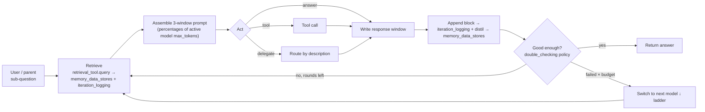

# ProgressiveAgentSLM — Planning & Progress Tracker

> **ProgressiveAgentSLM** is a single, **recursive** agent class tuned for **local / small language
> models (SLMs)**. One instance owns an identity (`id`), a `system_prompt`, a `base_folder_path` for all
> its artifacts, a **`run_mode`** (`assistant` / `research` / `reflection` — how the agent operates), a
> three-window **context budget** (`context_window_breakdown_percentages` — **cognition / attention /
> response**, expressed as **percentages** of the active model's context), a **`models_ladder`**
> (local→cloud, a **capability-routed pool** — each entry role-tagged embedding / tool-selection /
> general-purpose / memory-distillation / coding / vision / multimodal and pinned to its own warm
> endpoint — with one retry budget) chosen by `model_selection`, a set of **`behavior_policies`**
> (`when → then`, each fired at a `run_after` hook and optionally allowed to loop), a set of **tools**
> (SQLite vector query, JSONL query, read / search / write-file, todo, diagrams, python — each tool may
> run its own tool-calling model), a set of **`working_directories`** it may read (and, when `writable`,
> write), a set of configurable **`memory_data_stores`** (SQLite knowledge tables it progressively
> **distills**), and a set of **delegates** — themselves `ProgressiveAgentSLM` instances.
>
> The agent _progressively_ **cultivates knowledge**: every iteration's raw reasoning is appended to an
> append-only **`iteration_logging`** store (`iteration_*.jsonl`, its single raw source of truth), and a
> chain of **`memory_data_stores`** distils that raw log — and each other — through each store's
> `distill_prompt` into ever-more-refined knowledge (facts, a conceptual index, situational /
> design-decision / edge-case knowledge). Stores flagged `always_use_in_cognition_window` are injected
> into the prompt every step within a fixed budget; the rest are retrieved on demand through their
> `retrieval_tool` — so quality comes from **disciplined memory handling, not a bigger model**. A store
> with an **empty `distill_from`** is a **pre-built** external knowledge base (filled by an extraction
> pipeline); one with a populated `distill_from` is **self-cultivated**. Every agent and delegate shares
> the run's **`base_folder_path`** (so teammates can loop back over each other's work) and may read the
> user's **`working_directories`** side by side; subprocess fan-out runs sequentially or in parallel per
> **`parallel_subprocesses`**. Any model slot can be escalated, plug-and-play, to a more capable
> **cloud** model (OpenRouter).
>
> The class reuses existing primitives (`Task`, model clients, `SqliteVectorStore` (sqlite-vec),
> `DocumentRanking`, `PythonCodeExecute`, `KnowledgeCompression`, `IterationSummarizer`,
> `AnswerEvaluator`, `FinalThoughtSummarizer`) and drops into `create_chat_backend` unchanged.

**Status legend:** ⬜ Not started · 🟡 In progress · ✅ Done · ⛔ Blocked

> **Revision 2026-08-12 — design review vs. the on-disk code; see [`review-revise-design.md`](review-revise-design.md).**
>
> 1. **Accuracy pass (Phases 0–1).** Several `[~]` items read as "exists, needs rework" but the code on
>    disk (`src/framework/`) is the _earlier_ flat / four-tier-fractional / Supabase design. The
>    recursive three-window-percentage / sqlite-vec / JSONC design is **not implemented** — marked `[]`
>    not-shipped below where the disk proves it.
> 2. **New named owners.** `TokenCounter` (tokenizer seam), `bounded_io` (byte + deadline on every
>    external read), `run_clock` (whole-run wall-clock cap), `NoFindingsGuard` (deterministic re-plan +
>    refusal after consecutive empty retrievals), `QuizEngine` (owner of `self_evaluation_quizz`) added
>    to Phase 2. `ApiServer`/health surface added to Phase 3.
> 3. **Config loader.** `example-revised.json` is **JSONC (commented)** — the Phase 3 loader must strip
>    comments; `load_agent` builds a **single self-similar JSON → full recursive tree** (resolve
>    `[base_folder_path]` per node), not a flat `add_agent()` list.
> 4. **§8 risks added.** Linked-history risk (design-decisions / edge-case stores must be deduped +
>    gated on a sparse hook, or they dilute retrieval) and an always-on-store refresh guard.
> 5. **§15 case adds** a byte-identical stable-prefix assertion and a `bounded_io` / `run_clock` cost
>    test, so budget/concurrency claims are provable.
> 6. **Porting map added.** A concrete file-by-file "steal list" from the pulled-down Hermes project
>    (`temp/hermes-agent`) — what to port _immediately_ vs. adapt vs. skip, with target files. See
>    [`steal-list-hermes.md`](steal-list-hermes.md). The 30-minute quick win is the **bounded I/O trio**
>    (`bounded_io` + `CircularRounds` + file `safety`) — self-contained, maps 1:1 to Phase 0 items, and
>    hardens the current flat loop before the bigger rework.

> **Revision 2026-08-09 (d) — `reflection_configuration`, `is_reflection_and_evaluation` flag, field-name alignment:**
>
> 1. **`reflection_configuration` section added.** `run_mode: "reflection"` now has its own explicit
>    config block (alongside `research_configuration`): `reflection_mode` (`"distillation"` — re-reads
>    and re-distils memory stores; `"fine-tuning"` — generates training pairs from iteration logs),
>    `enabled`, `time_limit`, `iterations_limit`, `run_quizz_after_finish`, and `resume_if_quizz_failed`.
>    This closes the cultivate → evaluate → improve loop as a first-class, configurable surface.
> 2. **`is_reflection_and_evaluation` flag added to `models_ladder`.** A dedicated role flag routes
>    self-scoring (`self_evaluation_quizz`) and reflection-loop reasoning to the most capable local
>    model (e.g. `qwen3.6:27b`) — keeping expensive self-evaluation off the lightweight general-purpose
>    model while still falling back to cloud (`claude-3.5-sonnet`) when needed.
> 3. **Field-name alignment.** `research_configuration` and `reflection_configuration` share the same
>    post-loop fields: `run_quizz_after_finish` (fires `self_evaluation_quizz`) and
>    `resume_if_quizz_failed` (re-triggers the loop when quiz score < `passing_total_scores`).
>    Earlier revision notes used `run_quizz_after_research` / `resume_research_if_quizz_failed`; those
>    are superseded by the unified names above.
> 4. **`is_embedding` flag name.** The embedding flag in the JSON is `is_embedding` (not
>    `is_embedding_only`). References throughout this document that say `is_embedding_only` refer to
>    the same role; the canonical name in config and code is `is_embedding`.
> 5. **`self_evaluation_quizz.enabled`.** An explicit `enabled: true/false` master switch was added so
>    the quiz block can be present but inactive without removing it from config.

> **Revision 2026-08-09 (c) — three operational run modes + API / channels / research / self-evaluation surfaces:**
>
> 1. **`run_mode` — three deployment modes, same class.** Each agent declares `run_mode`:
>    **`assistant`** (default) — conversational query-answering; exposes an OpenAI-compatible HTTP
>    server (`api_configuration`) and optional push channels (`communication_channels`).
>    **`research`** — autonomous knowledge-mining loop; iterates over `research_configuration.topics`
>    / `goals` until the first active stopping condition fires (`stop_when_goals_achieved` /
>    `time_limit` / `iterations_limit`); optionally runs `self_evaluation_quizz` after.
>    **`reflection`** — autonomous self-improvement loop; re-reads `iteration_logging` +
>    `memory_data_stores`, scores itself via `self_evaluation_quizz`, and can re-trigger research if
>    the score is below `passing_total_scores`.
> 2. **`api_configuration`.** In `assistant` mode the agent spins up an **OpenAI-compatible HTTP
>    server** (`base_url`, CORS, optional auth, `POST /api/v1/chat/completions` non-streaming +
>    streaming, `GET /api/v1/models`) so it drops into Open WebUI, custom frontends, or any
>    OpenAI-client library without an adapter.
> 3. **`communication_channels`.** In `assistant` mode the agent delivers via **terminal**,
>    **Telegram** (bot token), and **Open WebUI** — each independently toggled by `enabled`. The API
>    stream endpoint is the primary path; channels supplement it for push-based workflows.
> 4. **`research_configuration`.** Three stopping conditions work in OR — the loop ends on the
>    first one that fires: semantic goal satisfaction (`stop_when_goals_achieved`), wall-clock cap
>    (`time_limit`), or iteration cap (`iterations_limit`). After the loop, an optional quiz grades
>    the gathered knowledge; a failing score can resume the loop (`resume_research_if_quizz_failed`).
> 5. **`self_evaluation_quizz`.** A scored quiz (questions + authored answers + point values vs.
>    `passing_total_scores`) that fires in `reflection` mode and optionally after `research` mode —
>    closing the cultivate → evaluate → improve loop without human intervention.

> **Revision 2026-08-09 (b) — capability-routed model pool + parallel distillation:**
>
> The `models_ladder` is a **capability-routed pool**, not a single linear chain: each entry may carry
> its own warm endpoint `url` (`platform` = `ollama` / **`lmstudio`** / `open_router`), `keep_warm`, and
> `max_concurrency`, and its role flags gain **`is_memory_distillation`** (which model runs
> `memory_data_stores` distillation), plus `is_coding` and `is_fallback`. Each job routes **by flag** to
> its model — embeddings → `is_embedding`, tool-calling → `is_tool_selection`, distillation →
> `is_memory_distillation`, reasoning → `is_general_purpose` — so distinct jobs run on **distinct warm
> endpoints in parallel**. The earlier per-store `use_capability` idea is dropped as ambiguous: the
> distillation model is declared **on the ladder** (exactly as `is_embedding` declares the embedding
> model), not on each memory store (§4, §8.2).

> **Revision 2026-08-09 — what changed & why (final schema pass; this supersedes the field names used in
> the earlier revision notes below, which are kept as history):**
>
> 1. **Config vocabulary finalized.** `agent_id → id`, `worklog_folder → base_folder_path`,
>    `working_folders → working_directories` (each may now be `writable`, optionally gated by
>    `write_approval`), `parallel_supprocess → parallel_subprocesses`, `models → models_ladder`,
>    `cognitive_behavior → behavior_policies`. The canonical config is now **`example-revised.json`** (§13).
> 2. **Three windows, in percentages.** The four _fractional_ tiers collapse to **three percentage
>    windows** — `context_window_breakdown_percentages`: **`cognition_window`** (system prompt + working
>    dirs + tools + memory + delegate descriptions + model selection), **`attention_window`** (question +
>    retrieval / tool / delegate outputs), **`response_window`** (the answer) — summing to **100** (§3).
>    The old `conversation_history_awareness` tier is gone; situational awareness is now carried by memory
>    stores flagged `always_use_in_cognition_window`.
> 3. **Memory is now configurable `memory_data_stores`.** The fixed L1→L4 pipeline (segmented worklog +
>    `knowledge_graph.jsonl` + `facts.db` + `situational.md` + `cognitive_index`) is generalized into an
>    append-only **`iteration_logging`** raw log (**L1**) plus any number of **`memory_data_stores`** —
>    each with a `distill_from` source list, a `distill_prompt`, a `path` / `table`, a `retrieval_tool`,
>    and a `when`. An **empty `distill_from`** = a **pre-built** external KB (filled by the extraction
>    pipeline, [design-principle §4](design-principle.md)); a **populated `distill_from`** = a
>    **self-cultivated** store fed from run hooks, policy outputs, or other stores (§8).
> 4. **Behavior policies are hook-driven and may loop.** Each policy declares a **`run_after`** hook
>    (`question_received` / `retrieval_result` / `iteration_result` / `raw_iteration_result` /
>    `final_answer`, or another policy `id`) so it fires deterministically **in code**, not merely as
>    prompt text. `circular_behavior_policies_allowed` + `behavior_policies_max_circular_rounds` bound
>    iterative loops (e.g. `double_checking → deep_planning`), replacing the standalone `max_iterations`
>    budget (§5).
> 5. **Role-tagged model ladder.** `models_ladder` entries carry role flags (`is_embedding`,
>    `is_tool_selection`, `is_general_purpose`, `is_vision`, `is_multimodal`) and `model_selection`
>    (`"auto"` → first general-purpose) picks the working model; failover still walks the ladder on
>    `max_retries_until_switching_models` (§4).
> 6. **Retrieval is explicit.** `iteration_logging` and every `memory_data_store` name the
>    `retrieval_tool` that reads them (`JsonlQueryTool` for the raw log, `SqliteVectorQueryTool` for the
>    stores), and those tools appear in the `tools` list (§6).

> **Revision 2026-08-08 — what changed & why (the memory model is now an explicit four-layer
> hierarchy, L1 → L4):**
>
> 1. **Four memory layers.** The worklog subsystem is reframed as **L1 raw → L2 facts → L3 situational
>    → L4 behavior** (§8): each layer is _derived_ from the one below and is progressively **hotter**
>    (closer to the live prompt) and smaller. This is a storage / refinement taxonomy that _composes_
>    with the §3 context-tier budget (which decides how much of each layer enters the prompt).
> 2. **L2 becomes first-class & searchable.** The distilled fact store (`knowledge/facts.db`,
>    sqlite-vec + FTS) is now **on by default** (was an optional mirror), fed by the metadata agent, and
>    queried by a dedicated **`KnowledgeSearchTool`** — "prepared tool code" for efficient knowledge
>    search over the run's own facts (§6, §8.3).
> 3. **L3 gains an in-prompt situational digest.** A **situational summarizer** distils L2 into
>    `situational.md` — a compact "what I know so far vs. the goal" that is **always injected** into the
>    situational tier of the prompt, regenerated only when L2 changes materially (§8.2, §3).
> 4. **Layer ↔ tier mapping.** L4 = the byte-stable **cached prefix**; L3 = the always-in-prompt
>    **situational tier**; L2 = pulled in **on demand by search tool**; L1 = pulled in **by pointer
>    seek** — so promotion up the layers is also promotion toward the prompt (§3, §8).

> **Revision 2026-08-07 — what changed & why (folded in from the Hermes study, see
> `analysis-against-hermes.md`):**
>
> 1. **Prompt-cache discipline.** The four-tier prompt is now assembled as a **byte-stable prefix**
>    (run-constant `system_prompt` + `cognitive_behavior` + tool / delegate descriptions) plus a
>    **volatile suffix** (retrieved blocks + answer). Rebuilding the prefix mid-run forces a full KV /
>    prompt-cache re-prefill — the dominant latency cost on a local SLM — so the prefix is held
>    identical until a **compaction**, the single sanctioned cache-invalidation event (§3).
> 2. **Enforcement, not just prompting.** The critical `cognitive_behavior` policies are now backed by
>    **deterministic turn-end guards** (`double_check` → verify-on-stop, `say_no` → grounding gate,
>    anti-drift → tool-loop guard) because SLMs ignore prompt-only rules (§5).
> 3. **Work vs. failover split.** `max_retries_until_switching_models` now triggers **model failover
>    only**; a **separate `max_iterations`** total-work budget (parent 200 / delegate 50, with a
>    **refund** for batched tool turns) bounds a run and a deep delegate tree independently (§2, §4).
> 4. **Adaptive compaction.** Reflection compacts **only enough to fit** (not a fixed 50%), protects
>    **head + tail**, and **updates** the prior summary (iterative, goal-tracking) rather than replacing
>    it (§3, §8).
> 5. **Hardened boundaries.** Delegates use a **typed immutable contract** (frozen request / result +
>    state machine + restricted toolset + byte caps) (§7); file tools add a **sensitive-path deny-list**
>    and instructional reads forbid pagination (§10); every external read is **byte- and deadline-
>    bounded** (§4); block text is **redacted on egress** to any other model (§8.2).
> 6. **Cheap-first, curated KG.** The metadata agent seeds entities / keywords / edges deterministically
>    (incl. lexical overlap) **before** any LLM call, and a background curator marks records
>    `stale` / `archived` — **never hard-deletes** (§8.2). Token budgeting is fixed to a single **`char/4`**
>    heuristic for both estimate and threshold (Open Q#8).

> **Revision 2026-08-06 — what changed & why (this pass):**
>
> 1. **Vector store is now embedded SQLite, not Supabase Postgres.** Every knowledge / memory / mirror
>    store is a local **`sqlite-vec`** `.db` file you can copy or read directly — no server. Tools take
>    `{ db_file, table }` instead of a pgvector `function_name`; the primary tool type is renamed
>    `Supabase` → **`SqliteVector`**, backed by a new `SqliteVectorStore` (reusing `Embedding`) (§6, §8.3).
> 2. **Graph store is now embedded & file-based, not Neo4j.** The optional `graph_db` mirror defaults to
>    **Kuzu** — "the SQLite of graph databases": Cypher over a single local `path`, no server — with a
>    zero-dependency **SQLite nodes/edges** fallback (`type: "sqlite"`, traversed by recursive CTEs).
>    Both knowledge-graph mirrors are now plain local files (§8.3).
> 3. **Tools carry their own `models` ladder.** A tool also drives an LLM (plan the call, read / rank
>    results, write artifacts), so each tool entry may pin its **own `models`** — typically a leaner
>    local model tuned for tool-calling — and **inherits the agent's `models`** when omitted (§6).

> **Revision 2026-08-02 — what changed & why (this pass):**
>
> 1. **The worklog is segmented, not one big file.** The single `raw_worklog.jsonl` becomes an
>    append-only **segment set** under `worklog/` (sharded by iteration, optional size cap). _Why:_ a
>    run no longer grows one unbounded file, and the index can **jump straight to a segment file +
>    iteration + line**, so old work is reachable in O(1) instead of by scanning (§8.1).
> 2. **The `cognitive_index` addresses blocks by `{segment, iteration, line, offset}`** (not just
>    `block_id`), so the agent can request the log **by file name, iteration number, or line**.
> 3. **A metadata agent builds a `knowledge_graph`.** On each flush a background indexer distills the
>    block into `{entities, keywords, 25-word summary, workflow, relationships}` and appends it to
>    `knowledge_graph.jsonl` — retrieval by meaning + structure, not just text (§8.2).
> 4. **Optional graph + vector database backends.** The `knowledge_graph` can be mirrored to a **graph
>    DB** (nodes / edges, queryable via GraphQL / Cypher) and/or a **vector DB**, so old worklogs are
>    retrieved **dynamically**, not only by reading files. Both default **off** (file-only) (§8.3).
> 5. **`working_folders`.** A list of external directories (e.g. source code) the agent may
>    **read / search** side by side with the worklog — separate from, and never mutated like, the log.
> 6. **`parallel_supprocess` (default 1).** One knob controls whether subprocess fan-out — delegates,
>    tool calls, per-block metadata, DB upserts — runs **sequentially (1)** or in a **bounded parallel
>    pool (>1)**.

> **Revision 2026-08-01 — what changed & why (improvements applied this pass):**
>
> 1. **The worklog is now JSON, not text.** `raw_worklog.log` → **`raw_worklog.jsonl`** (append-only
>    **JSON Lines**): each finished block is one self-contained JSON record on its own line. _Why:_
>    typed and structured, no fragile custom-delimiter parsing, still strictly append-only, still
>    greppable, and it drops straight into SQLite FTS5. (JSON Lines — not one big `.json` array —
>    because you can append a line without rewriting the whole file.)
> 2. **Blocks are addressed by a stable `block_id`, not by line ranges.** `cognitive_index` now joins
>    to the worklog by `block_id` instead of `[start_line, end_line]`. _Why:_ line ranges broke the
>    moment anything was reformatted or compacted; a `block_id` join never shifts, and an optional
>    `block_id → byte-offset` map gives **O(1)** block fetch.
> 3. **One clear storage split.** Shared team memory is **structured JSON** (`*.jsonl` — durable,
>    addressable); per-agent working windows stay **plain-text scratch** (`*.log` — streamed,
>    disposable). See §8.
> 4. **Typo fixed:** `max_retries_untill_switching_models` → **`max_retries_until_switching_models`**
>    (also updated in `example.json`).
> 5. **Clarity:** added an iteration-loop diagram (§3), tightened dense tables, and made file /
>    terminology naming consistent throughout.

---

## 1. Vision & Design Philosophy

- **One recursive class.** Everything is a `ProgressiveAgentSLM`. A "team" is simply an agent whose
  `delegates` are other agents — composition _is_ recursion; there is no separate orchestrator type.
  Each agent carries its own `id` + `description`, and the `description` alone is the signal a parent
  reads to decide when to hand it a sub-question.
- **Three operational modes — same class, different deployment.** `run_mode` switches how the agent
  runs: **`assistant`** serves user queries via an OpenAI-compatible API (`api_configuration`) and
  optional communication channels (terminal, Telegram, Open WebUI); **`research`** autonomously mines
  knowledge over declared topics and goals until configurable stopping conditions are met
  (`research_configuration`); **`reflection`** re-reads its own memory stores, scores itself via a
  structured quiz (`self_evaluation_quizz`), and tightens memory management (`reflection_configuration`)
  — closing the cultivate → evaluate → improve loop without human intervention. The progressive-loop
  internals (context windows, policies, delegates, memory) are identical across all three modes.
- **Progressive cognition by cultivating knowledge, not stuffing.** Each iteration the model's context
  is partitioned into three proportional windows (§3) — percentages of whatever model is active.
  Instead of piling everything into the prompt, the agent appends its raw work to an **append-only
  `iteration_logging`** log (`iteration_*.jsonl`) and progressively **distils** it into a chain of
  **`memory_data_stores`** (SQLite knowledge tables). To think, it injects the always-on stores
  (`always_use_in_cognition_window`) and pulls the rest on demand through each store's `retrieval_tool`.
  On small models, quality comes from disciplined memory handling — not a bigger model.
- **Local & SLM-first, cloud optional.** `models_ladder` is a **capability-routed pool** in which each
  entry is **role-tagged** (`is_embedding` / `is_tool_selection` / `is_general_purpose` /
  `is_memory_distillation` / `is_reflection_and_evaluation` / `is_coding` / `is_vision` /
  `is_multimodal` / `is_fallback`) and pinned to its own endpoint (`ollama` / `lmstudio` /
  `open_router`); `model_selection` (`"auto"` → the first general-purpose entry) picks the working
  reasoning model, while each job routes **by flag** to its model. Local models do the frequent work;
  a cloud model (OpenRouter) sits lower as an automatic fallback, or is promoted for hard steps.
  Pinning each pre-loaded model to its own **warm** endpoint (`keep_warm`, bounded by
  `max_concurrency`) lets embedding, distillation, and reasoning run on **distinct endpoints in
  parallel**. Each model gets one bounded retry budget —
  `max_retries_until_switching_models` — counting **both** quality (self-eval) **and** infra (timeout /
  HTTP) failures before the agent **switches to the next model** on the ladder (§4).
- **Behavior by policy — declared, and fired in code.** `behavior_policies` is a list of `when → then`
  rules rendered into the system prompt every iteration **and** executed at a declared **`run_after`**
  hook (`question_received`, `retrieval_result`, `iteration_result`, `raw_iteration_result`,
  `final_answer`, or another policy `id`). Policies can chain and, when
  `circular_behavior_policies_allowed`, loop back on each other up to `behavior_policies_max_circular_rounds`
  — so a small model's deep-think / double-check / say-no discipline is enforced deterministically, not
  merely hoped for. A non-programmer shapes behavior without touching Python (§5).
- **One shared `base_folder_path`, used by the whole team.** Every agent and delegate writes its
  artifacts (iteration logs, memory stores, todos) beneath the run's `base_folder_path` (delegates nest
  under the parent). Delegates deliver their final answer to the parent when done, but their work stays
  under the shared tree so any later agent can **loop back** over it via the retrieval tools.
- **Route by description, guide tools by `when`.** A parent routes a sub-question to a delegate purely
  by reading each delegate's `description` — no separate gate to maintain. Tools still carry a `when`
  guidance string injected next to the tool, so a small model calls it at the right moment (and so the
  menu can be pruned, §7).
- **Reuse, don't rebuild.** Async streaming generators that `yield` chunks, DI via constructor
  kwargs, `Task`-subclass agents, prompt-based JSON with robust regex fallbacks, JSON-file
  config / state. New code lives under `src/framework/`; existing files are touched minimally.

---

## 2. The `ProgressiveAgentSLM` Object

A single class configured by one object (JSON or Python). Every field has a sensible default; only
`id`, `description`, and — on the root agent — at least one general-purpose entry in `models_ladder`
are required.

| Field                                   | Type        | Meaning                                                                                                                                                                                                                                                                                                                                                                                                         |
| --------------------------------------- | ----------- | --------------------------------------------------------------------------------------------------------------------------------------------------------------------------------------------------------------------------------------------------------------------------------------------------------------------------------------------------------------------------------------------------------------- |
| `id`                                    | str         | Stable identifier. A parent addresses this agent as `delegate:<id>`; it also names the agent's folder and labels its log records.                                                                                                                                                                                                                                                                               |
| `description`                           | str         | One-line capability summary. The **sole** signal a parent reads to decide whether to delegate here — no separate gate.                                                                                                                                                                                                                                                                                          |
| `system_prompt`                         | str \| null | The agent's base persona / instructions, rendered at the top of the `cognition_window` (§3). Optional; when omitted, a default is built from `description` + `behavior_policies`. Per-agent (not inherited).                                                                                                                                                                                                    |
| `base_folder_path`                      | str         | Root folder for **everything** this agent produces — `iteration_logging`, `memory_data_stores`, todos (§8). Defaults to `id`. Delegates nest under the parent (`[base_folder_path]/<delegate-id>`) and may read the parent's tree — one shared run tree.                                                                                                                                                        |
| `iteration_logging_enabled`             | bool        | Turn on the raw per-iteration JSONL log (**L1**). Default **false**.                                                                                                                                                                                                                                                                                                                                            |
| `iteration_logging`                     | object      | Config for the raw log: `{ type: "jsonl", path, retrieval_tool, when }` — the append-only source of truth for a run, read back via its `retrieval_tool` (§8).                                                                                                                                                                                                                                                   |
| `model_selection`                       | str         | `"auto"` / null → use the first `is_general_purpose` entry in the ladder; or a model `name` to pin one for all tasks (§4).                                                                                                                                                                                                                                                                                      |
| `models_ladder`                         | list        | Priority **ladder** / capability-routed pool (§4), highest first. Each entry is **role-tagged** (`is_embedding` / `is_tool_selection` / `is_general_purpose` / `is_memory_distillation` / `is_reflection_and_evaluation` / `is_coding` / `is_vision` / `is_multimodal` / `is_fallback`), pinned to its own endpoint (`keep_warm` / `max_concurrency`), with a `when` hint, and shares the agent's retry budget. |
| `max_retries_until_switching_models`    | int         | Per-model **failover** budget — consecutive quality (self-eval) **and** infra (timeout / HTTP) failures on the _current_ model before switching to the next ladder entry. Default **5** (§4).                                                                                                                                                                                                                   |
| `context_window_breakdown_percentages`  | object      | The **three-window** budget as **percentages** of the active model's `max_tokens` (§3): `cognition_window` / `attention_window` / `response_window`, summing to **100**.                                                                                                                                                                                                                                        |
| `circular_behavior_policies_allowed`    | bool        | Allow `behavior_policies` to loop back on each other (e.g. `double_checking` re-runs `deep_planning`). Bounded by the round cap below (§5).                                                                                                                                                                                                                                                                     |
| `behavior_policies_max_circular_rounds` | int         | Max loop rounds before the agent must proceed. Default **5** — the total-work bound that replaces the old `max_iterations` (§5).                                                                                                                                                                                                                                                                                |
| `behavior_policies`                     | list        | `when → then` policies (§5), each fired at a `run_after` hook. Rendered into the system prompt **and** executed deterministically in code.                                                                                                                                                                                                                                                                      |
| `working_directories`                   | list        | External directories the agent may **read** (and, when `writable`, write — optionally gated by `write_approval`), each `{ path, description, writable, write_approval? }` (§6). Inherited by delegates.                                                                                                                                                                                                         |
| `tools`                                 | list        | Capabilities the agent may call, each with a `when` guidance string and an **optional own `models_ladder`** (§6): SQLite vector query, JSONL query, read / search / write-file, todo, diagrams, python, …                                                                                                                                                                                                       |
| `memory_data_stores`                    | list        | Configurable SQLite knowledge stores the agent **distills** and retrieves (§8): `{ id, type, distill_from, distill_prompt?, path, table, retrieval_tool, when?, always_use_in_cognition_window?, cognition_window_budget_percentage? }`. Paths resolve under `base_folder_path`. Inherited.                                                                                                                     |
| `parallel_subprocesses`                 | int         | Max concurrent subprocesses for parallelizable work — delegate fan-out, tool calls, distillation, DB upserts. **1** = strictly sequential (default); **>1** = bounded parallel pool. Inherited by delegates.                                                                                                                                                                                                    |
| `delegates`                             | list        | Nested `ProgressiveAgentSLM` configs (§7). The parent routes sub-questions to them by reading each one's `id` / `description`.                                                                                                                                                                                                                                                                                  |
| `run_mode`                              | str         | Operational mode: **`assistant`** (default — conversational, API + channels), **`research`** (autonomous knowledge-gathering loop over `research_configuration` topics/goals with configurable stopping conditions), **`reflection`** (re-reads own memory, self-scores via `self_evaluation_quizz`, can re-trigger research). The progressive-loop mechanics are the same in all modes.                        |
| `api_configuration`                     | object      | HTTP server settings for `assistant` mode: `base_url`, `enable_cors`, `authentication`, and named endpoints (`chat_completions` / `models` / `stream_chat_completions`). Exposes an OpenAI-compatible interface; the streaming endpoint is the primary integration path. Ignored in other modes.                                                                                                                |
| `communication_channels`                | object      | Multi-platform delivery channels for `assistant` mode: `terminal`, `telegram` (bot token), `openwebui` (URL). Each is independently toggled by `enabled`. The API stream endpoint is the primary integration path; channels supplement it for push-based workflows. Ignored in other modes.                                                                                                                     |
| `research_configuration`                | object      | Autonomous research loop settings for `research` mode: `topics`, `goals`, `evaluation_prompt`, stopping conditions (`stop_when_goals_achieved` / `time_limit` / `iterations_limit` — any one fires the loop), and quiz integration (`run_quizz_after_finish` / `resume_if_quizz_failed`).                                                                                                                       |
| `reflection_configuration`              | object      | Autonomous reflection loop settings for `reflection` mode: `reflection_mode` (`"distillation"` — re-distils memory stores; `"fine-tuning"` — generates training pairs), `enabled`, `time_limit`, `iterations_limit`, `run_quizz_after_finish`, and `resume_if_quizz_failed`. Mirrors the `research_configuration` post-loop fields for a unified cultivate → evaluate → improve surface.                        |
| `self_evaluation_quizz`                 | object      | Structured self-assessment: `enabled` master switch, a list of `questions` (each with `answer` + `score`), a `passing_total_scores` threshold, and `evaluation_criteria`. Fires in `reflection` mode and optionally after `research`; a failing score can re-trigger the research or reflection loop.                                                                                                           |

> **Inheritance.** A delegate that omits `models_ladder`, `model_selection`, or
> `max_retries_until_switching_models` **inherits the parent's**, and likewise inherits
> `working_directories`, `parallel_subprocesses`, and `behavior_policies_max_circular_rounds`. It nests
> its own `iteration_logging` and `memory_data_stores` under the parent's `base_folder_path` (so
> teammates can read each other's work) while keeping its **own** windows.
> `context_window_breakdown_percentages`, `system_prompt`, `behavior_policies`, `tools`, and
> `memory_data_stores` are per-agent (not inherited), so each delegate is independently budgeted and
> specialized.

> **Working directories.** `working_directories` are the directories the agent _works on_ — typically
> source code — kept **separate** from the `base_folder_path` where it _records_ its thinking.
> `ReadFileTool` / `SearchFileTool` resolve paths under any `working_directories` root **and** the run
> tree; `WriteFileTool` writes only where allowed — the `base_folder_path` always, plus any
> `working_directories` entry marked `writable` (optionally gated by `write_approval`). Each entry's
> `description` tells the agent what lives in that folder. Every access is confined to a configured root
> with traversal / absolute-escape rejection (OWASP A01/A03).

> **Parallelism.** `parallel_subprocesses` (default **1**) is the one concurrency knob: `1` runs every
> subprocess step — delegate fan-out, independent tool calls, per-block distillation, DB upserts —
> **sequentially**; `>1` runs them in a **bounded parallel pool** of that size. Because it is inherited,
> it bounds fan-out at every level, so a deep delegate tree can't explode into unbounded concurrency.

---

## 3. `context_window_breakdown_percentages` — the three-window proportional budget

The budget is expressed as **percentages of the active model's `max_tokens`**, not absolute token
counts — so the same config runs unchanged on models with different context sizes, and each window's
real allowance is inferred at runtime as `(percentage / 100) × max_tokens`. All **three** windows are
declared and must sum to **100** (the answer is explicit, not a leftover remainder). Rather than
stuffing accumulated history into the prompt, the agent keeps the full record in the append-only
**`iteration_logging`** log and distils it into **`memory_data_stores`** (§8); the windows below bound
what actually enters the prompt each step. The stores flagged `always_use_in_cognition_window` ride in
the cognition window every step (within their `cognition_window_budget_percentage`); everything else is
retrieved on demand into the attention window through each store's `retrieval_tool`.

| Window             | Default | Holds                                                                                                                                                                                                                                                                                                                         | Budget / compaction rule                                                                                                                                                                                                        |
| ------------------ | ------- | ----------------------------------------------------------------------------------------------------------------------------------------------------------------------------------------------------------------------------------------------------------------------------------------------------------------------------- | ------------------------------------------------------------------------------------------------------------------------------------------------------------------------------------------------------------------------------- |
| `cognition_window` | 32.5    | The cognition workspace: `system_prompt` + `working_directories` summary + tool + delegate descriptions + `behavior_policies`, the always-on `memory_data_stores` (`always_use_in_cognition_window`, e.g. the `conceptual_index`), and the internal reasoning / reflection trace used to pick the next step or switch models. | Byte-stable **prefix**; when reasoning + always-on memory exceed budget, a progressive reflection compacts **adaptively** (only enough to fit). Each always-on store is capped by its own `cognition_window_budget_percentage`. |
| `attention_window` | 52.5    | The working set for this run: the current user question plus everything retrieved from tools, delegates, and the `memory_data_stores` (via each `retrieval_tool`) or the `iteration_logging` log (via `JsonlQueryTool`).                                                                                                      | Compacted **adaptively** when over budget (stale results dropped — still recoverable from the raw log / stores).                                                                                                                |
| `response_window`  | 15.0    | The answer the agent emits this iteration.                                                                                                                                                                                                                                                                                    | Hard output cap = `(response_window / 100) × max_tokens`. Appended to `iteration_logging`, distilled into the stores, then **cleared** for the next iteration.                                                                  |
| _(unbounded)_      | —       | The append-only `iteration_logging` log (`iteration_*.jsonl`) — every finished block from every agent / delegate, the **single raw source of truth**.                                                                                                                                                                         | **Append-only, never rewritten.** No budget; this is what makes the adaptive compactions above safe (nothing is truly lost).                                                                                                    |

> The three windows default to **32.5 / 52.5 / 15.0 = 100**. They must sum to **100**; the loader
> rejects a breakdown that leaves no room for the answer (§12 Phase 3). For `gpt-oss:20b`
> (`max_tokens: 62000`) they resolve to ≈ **20,150 / 32,550 / 9,300** tokens; swap in a bigger-context
> model and every window scales up automatically.
>
> **Why these numbers?** The cognition_window at ~33% reserves space for the system prompt, behavior
> policies, tool/delegate descriptions, and always-on memory stores (e.g., conceptual_index). The
> attention_window at ~52% accommodates retrieved knowledge chunks from multiple stores plus delegate
> outputs. The response_window at ~15% prevents runaway outputs on small models while still allowing
> detailed answers. These ratios were chosen empirically: cognition < 30% starves the model of context,
> attention < 45% limits retrieval quality, and response > 20% wastes tokens on verbose SLM output.

**How one iteration works:**



**Prompt assembly per step — a _stable prefix_ + a _volatile suffix_ (prompt-cache-safe):**

The windows are ordered so everything **constant for the run** sits in a **byte-stable prefix** the
model's KV cache (Ollama / llama.cpp prefill) or a cloud provider's prompt cache can reuse every
iteration; only the retrieved working set and the answer change per step. Rebuilding the prefix mid-run
forces a full re-prefill — the dominant latency cost on a 20B model over a 62k window — so the prefix is
held **byte-identical until a compaction genuinely forces a rebuild**, the single sanctioned
cache-invalidation event.

```
── stable prefix (constant per run → cached, never rebuilt except on compaction) ───────────
[ cognition_window: system_prompt + working_dirs + behavior_policies + tool/delegate descriptions
                    + always_use_in_cognition_window stores (e.g. conceptual_index)      ≤ p_cog  × max_tokens ]
── volatile suffix (changes each iteration) ────────────────────────────────────────────────
[ cognition_window: this-step reasoning / reflection trace + todo                        (remainder of p_cog) ]
[ attention_window: question + retrieved knowledge (via retrieval_tool / JsonlQueryTool)  ≤ p_att × max_tokens ]
→ response_window:  the response for this iteration                                       ≤ p_res × max_tokens
```

**Core loop invariant — retrieve, distil, then compact:**

```
per block b produced (delegate answer / tool result / iteration answer):
    iteration_logging.append(b)                       # append the raw block to iteration_*.jsonl
    for store in memory_data_stores where hook(b) in store.distill_from:
        store.distil(b, store.distill_prompt)         # off critical path (parallel_subprocesses): distil → SQLite table + embed

per iteration:
    hits    ← Σ retrieval_tool.query(question)        # SqliteVectorQueryTool over stores; JsonlQueryTool over the raw log
    working ← assemble(question, hits)
    if size(working) + size(always_on_memory) > budget:
        reflect_and_compact(target = fit_under(budget))   # adaptive: shrink only enough to fit; protect head+tail; update the prior summary (iterative, goal-tracking); raw log + stores stay intact (recoverable)
    response_window ← respond(prompt)                 # ≤ p_res × max_tokens
    if final and not double_checking(response_window):    # enforced double_check: evidence must cover the question
        continue                                          # loop one more round while circular rounds remain
    append(response_window → iteration_logging); distil(stores); clear(response_window)
```

Every window is a slice of the **selected** model's `max_tokens`, so the assembled request can **never**
exceed that model's context — no separate size-inference step is needed (§4). Because the
`iteration_logging` log is immutable and the `memory_data_stores` are _derived_ views, compaction only
ever touches what enters the prompt — the agent can shrink its working memory aggressively and still
recover any detail by re-querying the raw log or the stores.

---

## 4. `models_ladder` — per-agent, role-tagged priority ladder

`models_ladder` is an ordered list, highest priority first, and `model_selection` chooses which entry
is active. Each entry:

| Key               | Required | Meaning                                                                                                                                                                                                                                                                                                                                                    |
| ----------------- | -------- | ---------------------------------------------------------------------------------------------------------------------------------------------------------------------------------------------------------------------------------------------------------------------------------------------------------------------------------------------------------- |
| `platform`        | yes      | `ollama` / `lmstudio` (local, OpenAI-compatible) or `open_router` (cloud). Maps to the matching model client.                                                                                                                                                                                                                                              |
| `name`            | yes      | Model name on that platform.                                                                                                                                                                                                                                                                                                                               |
| `url`             | no       | Platform endpoint (e.g. `http://localhost:11434` for Ollama, `https://openrouter.ai/api/v1` for OpenRouter). Defaults to the platform's env default.                                                                                                                                                                                                       |
| `max_tokens`      | no       | Context ceiling. A number sets it; `"auto"` (or omitted) uses the platform's advertised context. Every `context_window_breakdown_percentages` window is taken against this value (§3).                                                                                                                                                                     |
| _role flags_      | no       | `is_embedding` (canonical name; `is_embedding_only` is a deprecated alias), `is_tool_selection`, `is_general_purpose`, `is_memory_distillation`, `is_reflection_and_evaluation`, `is_coding`, `is_vision`, `is_multimodal`, `is_fallback` — declare what an entry is good for so the runtime routes each job to the right model (default general-purpose). |
| `keep_warm`       | no       | Ask the runtime to keep this model resident (never evict) so its endpoint stays hot for low-latency, parallel use.                                                                                                                                                                                                                                         |
| `max_concurrency` | no       | Max in-flight requests one endpoint accepts before it thrashes VRAM — the per-endpoint fan-out cap (global cap = `parallel_subprocesses`, §2).                                                                                                                                                                                                             |
| `when`            | no       | Plain-language hint for when this entry is preferred (documentation / tiebreaker only — routing is by the structured flags, not this text).                                                                                                                                                                                                                |

**Selection & the ladder — a capability-routed pool.** `model_selection` picks the working reasoning
model: `"auto"` (or null) selects the **first `is_general_purpose`** entry that is reachable; a model
`name` pins that entry for general tasks. Every _other_ job routes **by structured flag** (never by the
free-text `when`, which is SLM-nondeterministic): embeddings go to the **`is_embedding`** model,
tool-call planning to **`is_tool_selection`**, `memory_data_stores` distillation to
**`is_memory_distillation`** (§8.2), self-scoring and reflection-loop reasoning to
**`is_reflection_and_evaluation`**, and coding / vision / multimodal sub-tasks prefer the entry with the
matching flag — while the `is_general_purpose` entries form the failover chain (`is_fallback` last).
Because each entry is an **endpoint** (`platform` + `name` + `url`), pinning each pre-loaded local model
to its **own warm `url`** (`keep_warm`) lets these jobs run on **distinct endpoints in parallel** —
reasoning, embedding and distillation no longer contend for one GPU; `max_concurrency` bounds per-endpoint
fan-out and `parallel_subprocesses` bounds it globally (§2). Because the budget is proportional to
whatever model is chosen (§3), any model fits — there is no minimum-size gate. The ladder carries **one**
per-model budget:

- **Retry budget — `max_retries_until_switching_models` (default 5).** A single counter per model
  covering **both** failure kinds: a "not good enough" verdict from the per-iteration quick
  self-evaluation (a _quality_ failure) **and** a timeout / HTTP / unreachable error (an _infra_
  failure). When the current model's counter reaches the budget, the agent **switches to the next
  general-purpose model** on the ladder and resets the counter to 0.
- **Success resets the ladder.** When a model handles an iteration successfully, selection resets to
  the **`model_selection`** choice for the next iteration (the cheapest capable model is always tried
  first).
- **Stopping — two independent limits.** A run ends when **either** the model ladder is **exhausted**
  (the last model spends its `max_retries_until_switching_models`) **or** the agent's separate
  **`behavior_policies_max_circular_rounds`** loop budget is hit (§5). Keeping _failover_ and _total
  work_ apart means a run that is making progress but keeps failing self-eval on one model doesn't
  prematurely burn the ladder, and a run that never fails still can't spin forever.
- **Bounded I/O.** Every model call bounds its read with a **byte cap and a wall-clock deadline** (a
  stalled local endpoint must not hang the run); a deadline hit counts as one infra failure.

> **Model failover semantics by flag.** When a specific capability fails (e.g., `is_coding` returns poor
> results), the runtime does NOT fall back to the next `is_general_purpose` model — it falls back to the
> **next entry with the same flag**. If no other `is_coding` model exists, then it tries the next
> `is_general_purpose`. This prevents a coding task from being answered by a model not optimized for code.
> Example: if `qwen3.6:27b` (is_coding + is_general_purpose) fails twice, the runtime tries `qwen3.8:122b`
> (also is_coding + is_general_purpose) before falling back to `claude-3.5-sonnet`.
>
> **Endpoint saturation.** When all warm endpoints are at their `max_concurrency` limit, new requests queue
> in a FIFO buffer bounded by `parallel_subprocesses`. If the queue exceeds 10 seconds, the request times out
> and counts as one infra failure. This prevents VRAM thrashing from too many concurrent model loads.

This is the per-agent generalization of a role-based registry — local-first with cloud as an automatic
backstop, or cloud promoted to the top for hard steps.

```json
"model_selection": "auto",
"models_ladder": [
  { "platform": "ollama",      "name": "nomic-embed-text",            "url": "http://localhost:11434",   "is_embedding": true,  "keep_warm": true, "max_concurrency": 4, "when": "text → embeddings" },
  { "platform": "lmstudio",    "name": "qwen3.5:4b",                  "url": "http://localhost:1234/v1", "is_tool_selection": true,  "keep_warm": true, "max_concurrency": 2, "max_tokens": 62000, "when": "tool selection only" },
  { "platform": "ollama",      "name": "gpt-oss:20b",                 "url": "http://localhost:11435",   "is_general_purpose": true, "keep_warm": true, "max_concurrency": 1, "max_tokens": 62000, "when": "general-purpose" },
  { "platform": "ollama",      "name": "qwen3.6:27b",                 "url": "http://localhost:11436",   "is_general_purpose": true, "is_memory_distillation": true, "is_reflection_and_evaluation": true, "is_coding": true, "keep_warm": true, "max_concurrency": 1, "max_tokens": 128000, "when": "coding, deep planning, distillation, self-evaluation" },
  { "platform": "ollama",      "name": "qwen3.6:35b-a3b",            "url": "http://localhost:11437",   "is_general_purpose": true, "is_memory_distillation": true, "is_vision": true, "is_multimodal": true, "keep_warm": true, "max_concurrency": 1, "max_tokens": 128000, "when": "vision, multimodal, document writing" },
  { "platform": "open_router", "name": "anthropic/claude-3.5-sonnet", "url": "https://openrouter.ai/api/v1", "is_general_purpose": true, "is_memory_distillation": true, "is_reflection_and_evaluation": true, "is_fallback": true, "max_tokens": "auto", "when": "cloud, final fallback" }
]
```

---

## 5. `behavior_policies` — `when → then` policies fired on hooks

`behavior_policies` is a list of rules that shape the agent's behavior. Each rule renders into the
system prompt **every iteration** as "**When** _condition_, **then** _action_" **and** is executed
deterministically in code at a declared **`run_after`** hook. This does two jobs at once: it steers how
a small model thinks, and it acts as the run's **todo checklist** the model re-reads each pass to stay
on task. The rendered rules live in the `cognition_window` (§3).

| Key         | Meaning                                                                                                                                                                            |
| ----------- | ---------------------------------------------------------------------------------------------------------------------------------------------------------------------------------- |
| `id`        | Short label for the policy (e.g. `deep_planning`, `double_checking`, `visual_representation`, `refusing_to_invent`, `self_reflection`).                                            |
| `when`      | The condition / trigger, in plain language.                                                                                                                                        |
| `then`      | The action the agent should take when the condition holds.                                                                                                                         |
| `run_after` | List of hooks the policy fires after: `question_received`, `retrieval_result`, `iteration_result`, `raw_iteration_result`, `final_answer` — or another policy `id`, to chain them. |

**Hooks & loops.** Because each policy names its `run_after` hook, the loop runs it at the right point
in code — not merely when the SLM _chooses_ to obey prompt text. Policies can chain by referencing each
other's `id`; when `circular_behavior_policies_allowed` is set, a policy may loop back on an earlier one
(e.g. `double_checking → deep_planning` to fill an evidence gap). Loops are bounded by
**`behavior_policies_max_circular_rounds`** (default 5) — the total-work limit that, together with model
ladder exhaustion, ends a run (§4).

**Recommended baseline policies:** **deep_planning** (`run_after: question_received` — decompose complex
questions and route to delegates / tools), **analyzing_retrieval_results** (`run_after: retrieval_result`
— vet retrieved evidence for relevance before use), **double_checking**
(`run_after: iteration_result, deep_planning` — verify the gathered evidence answers the question; loop
another round if gaps remain), **visual_representation** (`run_after: iteration_result` — emit a Mermaid
diagram when structure / relationships matter), **refusing_to_invent** (`run_after: iteration_result` —
answer honestly when the stores are silent rather than hallucinate), **self_reflection**
(`run_after: final_answer` — distil the run's insights into the `memory_data_stores` for future reuse).

> **Enforced, not just prompted.** Small models routinely _ignore_ prompt-only guidance, so the
> **critical** policies stay authorable as `when → then` **and** are backed by a deterministic guard the
> loop runs at their `run_after` hook (they do not depend on the SLM choosing to obey):
>
> - **`double_checking` → verify-on-stop.** When the agent tries to emit a final answer, the guard
>   checks (via `AnswerEvaluator`) that the gathered evidence actually covers the question; if not — and
>   circular rounds remain — it loops one more bounded round instead of returning.
> - **`refusing_to_invent` → grounding gate.** If retrieval returned nothing above a similarity floor,
>   the guard forces the honest-refusal branch rather than trusting the model to pick it.
> - **anti-drift → tool-loop guard.** Tools are classed idempotent-vs-mutating; a repeated identical
>   call is detected and warned / short-circuited so an SLM can't spin on one tool.
>
> Non-critical policies (e.g. `visual_representation`) stay prompt-only. Guards are pure decisions; the
> loop owns whether a decision becomes a nudge, a synthetic result, or a halt.

---

## 6. Tools — capabilities with `when` guidance

Each tool entry tells the agent **what** the tool is and **when** to use it. The `when` string is
injected next to the tool in the prompt so a small model calls it at the right moment. Two of the tools
are **retrieval bindings**: `iteration_logging` and every `memory_data_store` name a `retrieval_tool`
that reads them, and that tool must appear in this list.

**SqliteVectorQueryTool (primary tool).** Vector search over an **embedded SQLite** store (the
`sqlite-vec` extension) — a single local `.db` file you can copy or read directly, no server. It reads
both the **pre-built** knowledge bases (`distill_from: []`) and the agent's **self-cultivated**
`memory_data_stores` — the most useful capability for these RAG agents.

| Key       | Meaning                                                                                                               |
| --------- | --------------------------------------------------------------------------------------------------------------------- |
| `type`    | `SqliteVectorQueryTool`.                                                                                              |
| `path`    | Path to the local `.db` file holding the embedded vectors (e.g. `[base_folder_path]/bvms_knowledge_base.db`).         |
| `table`   | The vector table to query inside that file (e.g. `knowledge`). Bound implicitly when driven by a `memory_data_store`. |
| `ranking` | If `true`, re-rank retrieved chunks with parallel `DocumentRanking` (reuse `RagAssistant.stream` batches).            |
| `when`    | Guidance: when this knowledge source is the right one to query.                                                       |

All other tools follow the same `{ type, when, … }` shape, and each `when` is used both to guide the
model and to **prune the menu** (§7): only tools whose `when` matches the current step are shown. The
`SqliteVectorQueryTool` wrapper is built on the async `SqliteVectorStore.async_query` (sqlite-vec +
`Embedding`); embeddings use the ladder's `is_embedding` model (§4).

**Tools can pin their own `models_ladder`.** A tool doesn't just execute code — it usually drives an
LLM (to plan the call, read / rank results, or write an artifact). So each tool entry may carry its
**own `models_ladder`** (same shape as §4) — typically a **leaner local model tuned for tool-calling**
(e.g. the `is_tool_selection` entry) rather than the agent's heavy main ladder. A tool that omits
`models_ladder` **inherits the agent's top-level ladder**; its `max_retries_until_switching_models`
follows the same ladder semantics (§4).

**Standard tool catalog** (industry-conventional shapes, reusing existing primitives):

| Tool                    | Shape (beyond `type` + `when`) | Behavior                                                                                                                                                                                                                                                                                                                                          |
| ----------------------- | ------------------------------ | ------------------------------------------------------------------------------------------------------------------------------------------------------------------------------------------------------------------------------------------------------------------------------------------------------------------------------------------------- |
| `SqliteVectorQueryTool` | `path`, `table`, `ranking`     | **Primary.** Embedded vector search via `SqliteVectorStore.async_query` (sqlite-vec, single `.db` file); optional parallel `DocumentRanking`. The `retrieval_tool` for every `memory_data_store` (pre-built KBs and self-cultivated stores alike).                                                                                                |
| `JsonlQueryTool`        | `path`                         | The `retrieval_tool` for `iteration_logging`: query the raw `iteration_*.jsonl` log for previous reasoning / intermediate results (debug or trace a current problem). Read-only.                                                                                                                                                                  |
| `ReadFileTool`          | —                              | Read a file's contents. Paths resolve under any `working_directories` root **or** the run's `base_folder_path`; `..` / absolute escapes rejected (OWASP A01/A03).                                                                                                                                                                                 |
| `SearchFileTool`        | `glob?`                        | Locate files by name / glob or find where a term / symbol appears (ripgrep-style) across the `working_directories` + `base_folder_path`; returns path + line + snippet. Read-only, traversal-safe.                                                                                                                                                |
| `WriteFileTool`         | `require_approval?`            | Persist an artifact (notes, generated code, a report). Writes to the `base_folder_path` always, plus any `working_directories` entry marked `writable` (honoring its `write_approval`). Path traversal / absolute escapes rejected (OWASP A01/A03). `require_approval: true` gates the write; default **false** (home-lab). Reuses `FileHanlder`. |
| `TodoTool`              | —                              | Maintains the run's checklist (`todo.md` under the `base_folder_path`). The model **rewrites the whole list** (`[{id, content, status: pending\|in_progress\|completed}]`); the loop re-injects it each iteration (anti-drift).                                                                                                                   |
| `GenerateDiagramTool`   | —                              | Emits Mermaid for the `visual_representation` policy.                                                                                                                                                                                                                                                                                             |
| `RunPythonTool`         | `require_approval?`            | Wraps `PythonCodeExecute`; `require_approval: true` gates execution; default **false** → runs without prompting. ⚠️ Autonomous execution — revisit before any non-local use.                                                                                                                                                                      |
| `SearchInternetTool`    | —                              | Web search for external context a delegate may need (used by specialized delegates such as `bvms-code-analyzer`).                                                                                                                                                                                                                                 |
| `CodeAnalysisTool`      | —                              | Static analysis over the BVMS source under `working_directories` (structure, logic, best practices) for a code-analysis delegate.                                                                                                                                                                                                                 |

> **Retrieval binding.** Because a `memory_data_store` / `iteration_logging` entry names its
> `retrieval_tool` by type, the loader wires the store's `path` / `table` into that tool automatically —
> so `SqliteVectorQueryTool` can serve many stores and `JsonlQueryTool` serves the raw log, without
> repeating connection details in the `tools` list.

---

## 7. Delegates — recursive composition

`delegates` is a list of **nested `ProgressiveAgentSLM` configs**. There is no separate "sub-agent"
type — a delegate is a full agent with its own `system_prompt`, `context_window_breakdown_percentages`,
`tools`, `memory_data_stores`, and optional `behavior_policies` / `models_ladder` / `delegates`. The
parent:

1. **Routes by description.** For a sub-question the small model picks a delegate by reading each one's
   `description` — via the proven `_parse_agent_routing` JSON pattern, generalized to `delegate:<id>`.
   Delegates are **not** gated by a separate `when`; a clear `description` is the whole contract (tools
   are still menu-pruned by their own `when`, §6). Fewer moving parts → more reliable SLM routing.
2. **Hands the sub-question down.** The delegate runs its **own** full progressive loop with its own
   windows and its own `iteration_logging` / `memory_data_stores`, nested under the parent's
   `base_folder_path` (`[base_folder_path]/<delegate-id>`) so the parent can read them.
3. **Delivers when done.** Unlike the parent's live stream, a delegate returns only its **final**
   answer to the parent; the parent folds that block into its own working set (by querying the
   delegate's stores / log) and continues. Because the delegate's full work remains under the shared
   tree, any **later** agent or delegate can loop back over it.

**Typed, isolated boundary.** A parent never hands a delegate a live agent object; it hands a
**frozen request** (`{ goal, context, role, allowed_toolsets?, blocked_tools? }`, with goal / context /
result **byte-capped**) and receives a **frozen result** (`{ state, summary, ref }`). Each delegate
carries an explicit **state** (`pending → running → succeeded | failed | cancelled`), a `depth`, and a
**restricted toolset** (a delegate need not — and usually should not — expose every parent tool). This
immutable contract is what makes fan-out under `parallel_subprocesses` and cancellation safe.

> **Delegate communication format.** The result object has three fields:
>
> - `state`: `"succeeded"`, `"failed"`, or `"cancelled"` — tells the parent whether to trust the answer.
> - `summary`: A structured JSON object (not free-text) containing `{ answer, evidence_refs, confidence }`.
>   The `evidence_refs` list contains `{ store_id, chunk_id, similarity_score }` so the parent can re-query
>   specific delegate findings without replaying the full log. `confidence` is a float 0–1 from the delegate's
>   self-evaluation (used by the parent's `double_checking` policy).
> - `ref`: A pointer to the delegate's work (`"[base_folder_path]/<delegate-id>/iteration_logging/iteration_N.jsonl"`),
>   allowing the parent to re-read raw reasoning if needed.
>
> The parent **does not** automatically embed delegate output into its own memory stores — it queries them on
> demand via `SqliteVectorQueryTool`. This keeps stores lean and avoids duplicating knowledge across agents.

Depth is bounded by an overall recursion cap; per-agent work is bounded by each delegate's own
**`behavior_policies_max_circular_rounds`** and the model ladder. A specialized `bvms-code-analyzer`
delegate — with its own bigger `models_ladder`, `CodeAnalysisTool` / `SearchInternetTool`, and a
pre-built `code_analysis_knowledge` store — is the canonical example (§13).

---

## 7b. Failure Modes & Recovery

The system handles failures at multiple levels, each with explicit recovery paths:

| Failure Type                                 | Trigger                                                             | Behavior                                                                                                  | Recovery                                                                                               |
| -------------------------------------------- | ------------------------------------------------------------------- | --------------------------------------------------------------------------------------------------------- | ------------------------------------------------------------------------------------------------------ |
| **Model endpoint down**                      | HTTP timeout / connection refused on any `models_ladder` entry      | Counts as 1 infra failure against `max_retries_until_switching_models`; logs error to `iteration_logging` | Tries next model in ladder; if all exhausted, returns honest refusal with list of unavailable models   |
| **Distillation produces garbage**            | LLM output fails JSON parsing or similarity score < threshold       | Store update skipped; iteration still logged; warning appended to `todo.md`                               | Retried on next reflection pass; pre-built stores unaffected                                           |
| **No retrieval results above threshold**     | `SqliteVectorQueryTool` returns empty set or all scores below 0.3   | Agent notes "no relevant knowledge found" in reasoning trace; does NOT hallucinate                        | Suggests refining question, expanding working directories, or running research mode to populate stores |
| **All models exhausted**                     | Every model spends its `max_retries_until_switching_models` budget  | Loop terminates; returns best-effort answer from last successful iteration                                | User can adjust ladder (add better local model), increase retries, or enable cloud fallback            |
| **Circular policy loop hits cap**            | `behavior_policies_max_circular_rounds` reached without convergence | Policy chain breaks; agent proceeds to final answer with partial evidence                                 | Logs warning; suggests increasing round cap or simplifying policy DAG for next run                     |
| **Context window overflow after compaction** | Even aggressive compaction cannot fit under budget                  | Drops lowest-similarity retrieval results; keeps head + tail protected                                    | Returns answer with note "some retrieved knowledge was truncated due to context limits"                |

> **Health check endpoint.** In `assistant` mode, the API server exposes `GET /api/v1/health` returning:
>
> - `models`: List of warm endpoints with current concurrency vs. `max_concurrency`
> - `stores`: Sizes (row counts) and last-distilled timestamps for each `memory_data_store`
> - `windows`: Current token usage in each context window (cognition / attention / response)
> - `delegates`: Active delegate states and recursion depth
>
> This enables external monitoring tools to detect saturation or stale stores before they impact user queries.

---

## 8. Memory — the raw log plus configurable `memory_data_stores` (L1 → L4)

Everything an agent produces lives under its `base_folder_path`, organized as a **four-layer memory
hierarchy** — raw at the bottom, refined at the top. The bottom layer is the append-only
`iteration_logging` log; the middle layers are configurable `memory_data_stores`, each _derived_ from a
`distill_from` source by a background step and progressively **hotter** (closer to the live prompt) and
smaller:

| Layer                | Holds                                                                          | Storage                                                                                                                       | Reaches the model by                              | Derived by                                     |
| -------------------- | ------------------------------------------------------------------------------ | ----------------------------------------------------------------------------------------------------------------------------- | ------------------------------------------------- | ---------------------------------------------- |
| **L1 — raw**         | Every iteration's raw output + tool-call results, verbatim                     | `iteration_logging/iteration_*.jsonl` (append-only)                                                                           | on demand, via **`JsonlQueryTool`** (§6)          | — (single source of truth)                     |
| **L2 — facts**       | Distilled facts, entities, relationships, edge cases, design decisions from L1 | `memory_data_stores` (SQLite, sqlite-vec) — `distilled_knowledge`, `known_edge_cases_knowledge`, `design_decisions_knowledge` | on demand, via **`SqliteVectorQueryTool`** (§6)   | each store's `distill_from` + `distill_prompt` |
| **L3 — situational** | "What I know so far" digest + a conceptual index over L1 / L2                  | `memory_data_stores` flagged `always_use_in_cognition_window` — `conceptual_index`, `situational_knowledge`                   | **always in the prompt** (cognition window, §3)   | distilled from L2 stores                       |
| **L4 — behavior**    | System prompt, `behavior_policies`, tool / delegate descriptions               | the agent config (`AgentConfig`)                                                                                              | **always in the prompt** (byte-stable prefix, §3) | authored / config (static)                     |

> Two orthogonal taxonomies compose here: **these four _memory layers_ decide where knowledge lives and
> how it is refined; the three _context windows_ (§3) decide how much of each layer enters the prompt
> each step.** The mapping is direct — **L4 + L3 = the cognition window** (L4 = the cached prefix,
> L3 = the `always_use_in_cognition_window` stores); **L2 = pulled into the attention window on demand
> by `SqliteVectorQueryTool`; L1 = pulled in by `JsonlQueryTool`.** Direction note: unlike CPU caches,
> **L1 is the coldest / rawest / largest and L4 the hottest / most-refined / smallest** (ascending
> abstraction).

It rests on **one clear split**, plus a **configurable derived-knowledge layer**:

- **L1 — the raw source of truth = append-only JSONL.** `iteration_logging/iteration_*.jsonl` — one raw
  record per iteration, durable, the single source of truth for a run, queried back via `JsonlQueryTool`.
- **L2 / L3 — derived knowledge = `memory_data_stores`.** Any number of SQLite stores (sqlite-vec),
  each **distilled** from a `distill_from` source (a run hook, a policy `id`, or another store) via its
  `distill_prompt`. Those flagged `always_use_in_cognition_window` ride in the prompt; the rest are
  queried on demand through their `retrieval_tool`.

The windows in §3 are the _prompt-side_ budget; these files are the _on-disk_ storage it draws from.

### 8.1 `iteration_logging` — the raw, append-only log (L1)

When `iteration_logging_enabled` is set, every finished block of work is appended to a rolling set of
**per-iteration JSONL files** under `[base_folder_path]/iteration_logging/` (`iteration_*.jsonl`, one
file per iteration by default). Each block is one self-contained JSON line; the log is **append-only,
never rewritten**, and read back through its `retrieval_tool` (`JsonlQueryTool`).

_Why per-iteration files:_ a long run never grows one giant file, and `JsonlQueryTool` can scope a query
to a single iteration's file — so any past block is one bounded read away.

| File / dir                            | Scope     | Format | Role                                                                                                                                           |
| ------------------------------------- | --------- | ------ | ---------------------------------------------------------------------------------------------------------------------------------------------- |
| `iteration_logging/iteration_*.jsonl` | per-agent | JSONL  | **Append-only, never rewritten.** One raw record per finished block (verbatim reasoning + tool results). The single source of truth for a run. |
| `<memory store>.db`                   | per-agent | SQLite | The `memory_data_stores` (sqlite-vec) distilled from the log — L2 / L3 (§8.2).                                                                 |
| `todo.md`                             | per-agent | text   | `TodoTool` checklist, re-injected each iteration.                                                                                              |

**A "block"** is one unit of finished work — a delegate's answer, a tool result, or an iteration's
answer. Blocks are **appended at completion** (not token-by-token) through one **serialized writer**, so
records stay ordered and parallel delegates never interleave.

**Raw log record** (one JSON line — the verbatim source of truth):

```json
{
  "ts": "2026-08-09T12:34:56Z",
  "id": "bvms-assistant",
  "iteration": 3,
  "phase": "delegate",
  "actor": "tool:SqliteVectorQueryTool",
  "content": "…the full verbatim iteration output / tool result…"
}
```

**Write path, per block.** On completion the agent enqueues the block to the run's single writer, which
(1) appends it to the current `iteration_logging/iteration_*.jsonl` file, and (2) hands the block to any
`memory_data_stores` whose `distill_from` names the block's hook, so they distil it off the critical
path (§8.2).

**Read path (retrieve, don't replay).** To assemble its next prompt an agent does **not** replay the
log; it queries the `memory_data_stores` (via `SqliteVectorQueryTool`) for distilled knowledge and, when
it needs the raw trace, `JsonlQueryTool` for a specific iteration. This is RAG over the team's own work
— the trick that keeps SLM prompts small.

**Progressive reflection (compaction).** When the working set exceeds its window budget, a reflection
compacts it **adaptively** (only enough to fit; protect head + tail). Nothing is lost — the log is
immutable and the stores are derived, so any dropped detail is one query away.

**Delegate coordination.** A delegate returns just its **final** answer to its parent, but its full work
lands in its own `iteration_logging` / `memory_data_stores` nested under the parent's `base_folder_path`,
so any later teammate can loop back over it by querying those stores.

> **Cross-store retrieval.** When a question spans multiple domains (e.g., "Why does voyage approval fail
> for vessels over 25 years?" — requires both business rules from `bvms_docs.db` and code logic from
> `bvms_code.db`), the orchestrator queries **both stores in parallel** via separate
> `SqliteVectorQueryTool` calls, each with its own `{ db_file, table }`. Results are merged into a single
> attention window; if one store returns no results above the similarity threshold, the agent notes this
> explicitly rather than pretending the question has no answer. Delegates can also be routed to query
> specific stores — e.g., `bvms-code-analyzer` is configured with `bvms_code.db` as its primary knowledge
> source, but can fall back to the parent's `bvms_docs.db` via shared `base_folder_path`.

**Progressive reflection (compaction).** When the working set exceeds its window budget, a reflection
compacts it **adaptively** (only enough to fit; protect head + tail). Nothing is lost — the log is
immutable and the stores are derived, so any dropped detail is one query away.

> **Compaction algorithm.** Triggered when `size(attention_window) + size(always_on_memory) > budget`:
>
> 1. **Identify stale entries** — retrieval results older than the current iteration's question, tool
>    outputs from completed delegate calls, and previous iteration traces not referenced by current reasoning.
> 2. **Protect head + tail** — the system prompt / behavior policies (head) and the most recent 20% of
>    retrieved knowledge (tail, likely most relevant) are never compacted.
> 3. **Compress iteratively** — for each stale entry, replace verbose tool output with a one-line summary
>    (e.g., "SqliteVectorQueryTool returned 5 chunks from bvms_docs.db, top match: 'Voyage approval requires...'").
> 4. **Update prior summary** — if a previous compaction produced a summary, append new key findings to it
>    rather than replacing; this preserves goal-tracking across iterations.
> 5. **Verify fit** — re-measure the window; if still over budget, repeat from step 1 with lower-priority entries.
>
> Distillation runs **asynchronously** (off the critical path via `parallel_subprocesses`). If distillation
> fails for a store, the iteration is still logged to `iteration_logging` — the failure is recorded but does
> not block the loop. Deferred distillation can be retried during a `reflection` mode pass.

Each entry declares a knowledge store the agent cultivates. Schema:

| Key                                  | Meaning                                                                                                                                                                                                                                                                                                     |
| ------------------------------------ | ----------------------------------------------------------------------------------------------------------------------------------------------------------------------------------------------------------------------------------------------------------------------------------------------------------- |
| `id`                                 | Store identifier; other stores reference it in their `distill_from`.                                                                                                                                                                                                                                        |
| `type`                               | Backing store — `sqlite` (sqlite-vec, single `.db` file).                                                                                                                                                                                                                                                   |
| `distill_from`                       | Sources this store distils from — run hooks (`question_received` / `retrieval_result` / `iteration_result` / `raw_iteration_result` / `final_answer`), policy `id`s (e.g. `self_reflection`), or other store `id`s (e.g. `distilled_knowledge`). **Empty `[]`** = a **pre-built** store never self-mutated. |
| `distill_prompt`                     | The instruction that turns each source block into this store's structured record. Omitted for pre-built stores.                                                                                                                                                                                             |
| `path` / `table`                     | The `.db` file + table (resolved under `base_folder_path`; many stores may share one `.db`).                                                                                                                                                                                                                |
| `retrieval_tool`                     | The tool that reads it back — `SqliteVectorQueryTool`.                                                                                                                                                                                                                                                      |
| `when`                               | Guidance: when this store is the right one to query.                                                                                                                                                                                                                                                        |
| `always_use_in_cognition_window`     | If `true`, injected into the cognition window every step (L3).                                                                                                                                                                                                                                              |
| `cognition_window_budget_percentage` | Share of the cognition window an always-on store may occupy.                                                                                                                                                                                                                                                |

**The distillation DAG.** `distill_from` turns the stores into a directed graph rooted at the raw log:

```
iteration_logging (L1)
      │  distil on hooks
      ▼
distilled_knowledge (L2)  ← [iteration_result, final_answer, self_reflection]
      │
      ├──▶ conceptual_index (L3, always_use_in_cognition_window, budget 15%)
      ├──▶ situational_knowledge (L3)
      ├──▶ design_decisions_knowledge (L2)
      └──▶ known_edge_cases_knowledge (L2)  ← also [raw_iteration_result]
```

`distilled_knowledge` compresses the run's raw output into structured facts; the downstream stores each
re-distil those facts through their own `distill_prompt` into a focused slice (a conceptual index, the
situational digest, design decisions, edge cases). Distillation runs **off the critical path** on the
**`is_memory_distillation`** model (§4) — its own warm endpoint, so it runs **in parallel** with the
reasoning and embedding models — bounded by `parallel_subprocesses` (§2). A **`self_reflection`** policy
(`run_after: final_answer`, §5) is a common trigger, so the agent enriches its stores from its own
conclusions.

**Pre-built vs. self-cultivated.** A store with an **empty `distill_from`** (e.g. the delegate's
`code_analysis_knowledge`, or the `bvms_docs.db` / `bvms_code.db` of
[design-principle §5](design-principle.md)) is filled once by an extraction pipeline and only ever
**read** — an external knowledge base. A store with a **populated `distill_from`** is **self-cultivated**
while the agent works. Both are queried the same way, through `SqliteVectorQueryTool`.

> **Cheap-first, curated, and egress-safe.**
>
> - **Cheap first.** Deterministic extraction (`KeywordExtractor` / `SimpleEntityExtractor` + lexical
>   overlap) seeds entities / keywords **before** any LLM call; the **`is_memory_distillation`** model
>   runs the `distill_prompt` only for the semantic summary, or when extraction is weak.
> - **Redact on egress.** A block's text may cross to a _different_ model (the distillation / ladder
>   model, a delegate, a cloud escalation), so secrets / PII are **redacted at that boundary** before the
>   text leaves the agent.
> - **Curate, never delete.** A background curator may mark distilled records `stale` / `archived`
>   (recoverable) and consolidate duplicates — it **never hard-deletes**, so the raw log stays the
>   immutable source of truth.

### 8.3 Always-in-cognition stores + the on-disk layout

A store flagged **`always_use_in_cognition_window`** (e.g. `conceptual_index`) is injected into the
cognition window every step within its **`cognition_window_budget_percentage`** — this is how L3
"situational awareness" reaches the prompt without a per-iteration summary cost, replacing the old
always-in-prompt situational tier. It is refreshed only when its upstream store changes materially
(a cheap-model, threshold-triggered distillation). Everything else is pulled into the attention window
on demand through each store's `retrieval_tool`.

Because `memory_data_stores` live under `base_folder_path` (not a per-run subfolder), they **persist
across runs** by default — so a later run loops back over an earlier run's knowledge simply by querying
the same store, no separate mirror needed. Delegates nest their own log + stores under the parent's tree.

```
<base_folder_path>/                    # e.g. bvms-assistant/
  iteration_logging/
    iteration_001.jsonl                # ← L1: append-only raw log (one file per iteration)
    iteration_002.jsonl
  bvms_knowledge_base.db               # ← L2/L3: memory_data_stores (sqlite-vec), one file, many tables:
                                       #     knowledge, conceptual_index, situational_knowledge,
                                       #     design_decisions_knowledge, known_edge_cases_knowledge
  todo.md                              # ← TodoTool checklist (re-injected each iteration)
  bvms-code-analyzer/                  # ← a delegate nests its own tree under the parent
    iteration_logging/iteration_*.jsonl
    bvms_code_analysis_knowledge_base.db   # ← the delegate's pre-built code_analysis_knowledge store
```

> **Design risks & open loops (2026-08-12, from [`review-revise-design.md`](review-revise-design.md) §7):**
>
> - **Linked-history risk.** `known_edge_cases_knowledge` (no `when` guard) and
>   `design_decisions_knowledge` (distilled from _every_ `iteration_result`) risk growing into
>   unstructured dumps that dilute retrieval. Gate the latter on a **sparse** hook (`research` /
>   `reflection`) or a `when`; dedupe + archive + consolidate the former (see the curation flywheel in
>   Phase 2). Cheap-first gap-sparing.
> - **Always-on-store refresh guard.** "Refreshed only when upstream changes materially" needs a
>   `min_material_change` threshold on the cheap `is_memory_distillation` endpoint, or L3 stores are
>   constantly re-issued and the warm endpoint thrashes.
> - **Shared-`.db` math.** `cognition_window_budget_percentage` is a share of the _cognition window_,
>   not of the model's `max_tokens`; the loader must validate the always-on **sum** fits each agent's
>   cognition window (Phase 3).
> - **Response window vs. visuals.** A 15% `response_window` is tight for a Mermaid diagram + text on an
>   8k model — write the diagram to a file and link it, or widen the window (tuning note).

---

## 9. Goals → Components

| Goal (user)                                                                   | Realized by                                                                                                                                                                                                                                                                      |
| ----------------------------------------------------------------------------- | -------------------------------------------------------------------------------------------------------------------------------------------------------------------------------------------------------------------------------------------------------------------------------- |
| Single recursive class anyone can configure (one object)                      | `ProgressiveAgentSLM` + `AgentConfig` + `config/load.py`                                                                                                                                                                                                                         |
| **Goal**: stay focused on the user-set goal                                   | `behavior_policies` fired on `run_after` hooks + `double_checking` circular loop (reuse `AnswerEvaluator`)                                                                                                                                                                       |
| **Knowledge**: pre-built vector DBs + own distilled long-term stores          | `SqliteVectorQueryTool` (primary, sqlite-vec) over `memory_data_stores` — pre-built (`distill_from: []`) and self-cultivated alike                                                                                                                                               |
| **Tools**: KB, files, search, write, todo, diagrams, python, log query        | `ToolRegistry` + `tools/` (`SqliteVectorQueryTool`, `JsonlQueryTool`, `ReadFileTool`, `SearchFileTool`, `WriteFileTool`, `TodoTool`, `GenerateDiagramTool`, `RunPythonTool`, `SearchInternetTool`, `CodeAnalysisTool`)                                                           |
| **Cognition**: retrieve only what's needed, compact safely                    | `MemoryStores` retrieval + `Reflector` **adaptive** compaction (head+tail-protected, iterative summary; reuse `KnowledgeCompression` + `IterationSummarizer`)                                                                                                                    |
| **Delegate**: route by description, break into sub-agents, collect results    | Recursive `delegates` + `Router` (`description`-routed `delegate:<id>`) dispatch                                                                                                                                                                                                 |
| **Raw log**: append-only per-iteration source of truth                        | `iteration_logging/iteration_*.jsonl` (append-only) via `RawLog`, read back by `JsonlQueryTool`                                                                                                                                                                                  |
| **Distilled knowledge**: cultivate stores from the log via `distill_prompt`   | `MemoryStore` + `Distiller` (per `distill_from` / `distill_prompt`; reuse `KeywordExtractor` / `SimpleEntityExtractor` + ladder model), embedded via `SqliteVectorStore`                                                                                                         |
| **Memory layers**: raw → facts → situational → behavior (L1 → L4)             | L1 `iteration_logging` · L2 `memory_data_stores` (`distilled_knowledge`, `design_decisions_knowledge`, `known_edge_cases_knowledge`) · L3 `conceptual_index` + `situational_knowledge` (`always_use_in_cognition_window`) · L4 `system_prompt` + `behavior_policies` + delegates |
| **Working directories**: read / search (and optionally write) external dirs   | `working_directories[]` (`{ path, description, writable, write_approval? }`) resolved by `ReadFileTool` / `SearchFileTool` / `WriteFileTool`                                                                                                                                     |
| **Parallelism**: run subprocess fan-out sequentially or in a bounded pool     | `parallel_subprocesses` (default 1) via a shared `ParallelExecutor`                                                                                                                                                                                                              |
| Local/SLM-first with a role-tagged **ladder** (single per-model retry budget) | `ModelChain` (`models_ladder` + `model_selection` + `max_retries_until_switching_models`)                                                                                                                                                                                        |
| Per-step logging to terminal + files for full-text search                     | `RunLogger` (block / JSONL) + `LogSearch` (SQLite FTS5 over the iteration logs)                                                                                                                                                                                                  |
| Workflow configurable via JSON **and** Python                                 | `config/load.py` (`example-revised.json` + `schema.json`) + `ProgressiveAgentSLM(...)`                                                                                                                                                                                           |

---

## 10. Design Decisions

| Topic                | Decision                                                                                                                                                                                                                                                                                                                                                                                                                                                                                                                                                                                                                                                                                                                                          |
| -------------------- | ------------------------------------------------------------------------------------------------------------------------------------------------------------------------------------------------------------------------------------------------------------------------------------------------------------------------------------------------------------------------------------------------------------------------------------------------------------------------------------------------------------------------------------------------------------------------------------------------------------------------------------------------------------------------------------------------------------------------------------------------- |
| Run mode             | **Three modes, same class** — `run_mode: assistant` (default, API + channels), `run_mode: research` (autonomous goal-driven loop with three OR-combined stopping conditions and optional post-loop quiz via `run_quizz_after_finish` / `resume_if_quizz_failed`), `run_mode: reflection` (re-reads own memory, self-scores via `self_evaluation_quizz`, can resume research — configured by `reflection_configuration`). The same progressive-loop mechanics run in all three contexts; the mode is the outer shell, not a different class.                                                                                                                                                                                                       |
| API surface          | **OpenAI-compatible HTTP server** (`api_configuration`): FastAPI, `base_url` + CORS + optional auth; `POST /api/v1/chat/completions` (streaming + non-streaming) + `GET /api/v1/models`. Enabled only in `assistant` mode.                                                                                                                                                                                                                                                                                                                                                                                                                                                                                                                        |
| Channels             | **Multi-platform push delivery** (`communication_channels`): terminal, Telegram (bot token), Open WebUI (URL) — each independently toggled by `enabled`; supplement the API stream endpoint; enabled only in `assistant` mode.                                                                                                                                                                                                                                                                                                                                                                                                                                                                                                                    |
| Research stopping    | **Three OR-combined stopping conditions** (`research_configuration`): semantic (`stop_when_goals_achieved`), wall-clock (`time_limit`), or iteration cap (`iterations_limit`). Set to `null` to disable individual conditions; at least one should be active to avoid ladder exhaustion.                                                                                                                                                                                                                                                                                                                                                                                                                                                          |
| Self-evaluation      | **Structured quiz closes the cultivate → evaluate → improve loop** (`self_evaluation_quizz`): `enabled` master switch, pre-authored questions + answers + scores; fires in `reflection` mode and optionally after `research` (via `run_quizz_after_finish`); a failing total score below `passing_total_scores` re-triggers research or reflection (`resume_if_quizz_failed`).                                                                                                                                                                                                                                                                                                                                                                    |
| Agent & control flow | **Recursive progressive loop** — each step assembles the three-window prompt (percentages of the active model), fires `behavior_policies` at their `run_after` hooks, calls tools / routes to delegates, then distils the raw block into the `memory_data_stores`; iterate until the model ladder is exhausted or the circular-round cap is hit.                                                                                                                                                                                                                                                                                                                                                                                                  |
| Delegation           | **Follow `AssistantOrchestra`** routing (`_parse_agent_routing`), generalized to `delegate:<id>`; a parent routes by reading each delegate's `description`. Delegates inherit `models_ladder` + `max_retries_until_switching_models`.                                                                                                                                                                                                                                                                                                                                                                                                                                                                                                             |
| Models (defaults)    | **Per-agent role-tagged ladder** chosen by `model_selection` (`"auto"` → first `is_general_purpose`). Each model gets one `max_retries_until_switching_models` budget (default 5) covering **both** quality self-eval failures **and** infra errors; success resets to the `model_selection` choice; the run ends when the ladder is exhausted **or** the separate `behavior_policies_max_circular_rounds` loop budget is hit (failover and total-work budgets are kept **orthogonal**). **OpenRouter** cloud as automatic fallback or promoted to top; `max_tokens: "auto"` uses the platform context, and every window is a percentage of it.                                                                                                   |
| Raw log & memory     | **`base_folder_path` subsystem.** Per-agent **append-only** `iteration_logging/iteration_*.jsonl` (raw, source of truth) + configurable `memory_data_stores` (SQLite / sqlite-vec) distilled from it. One serialized writer; **stores are derived views, not the source of truth**; reflection compacts the working set **adaptively** (only enough to fit, protecting head + tail) via **iterative goal-tracking summaries**.                                                                                                                                                                                                                                                                                                                    |
| Storage format       | **Append-only JSON Lines** for the raw log (`iteration_*.jsonl`, one self-contained block per line) + **SQLite (sqlite-vec)** for distilled `memory_data_stores` — chosen over text-with-line-ranges (fragile) and one monolithic file (unbounded). Enables typed records, bounded per-iteration reads (`JsonlQueryTool`), and vector + FTS retrieval (`SqliteVectorQueryTool`).                                                                                                                                                                                                                                                                                                                                                                  |
| Distillation         | Each `memory_data_store` distils its `distill_from` sources through a `distill_prompt` into structured records (reuse `KeywordExtractor` / `SimpleEntityExtractor` + a ladder model, cheap-first). A store with **empty `distill_from`** is a pre-built external KB; a populated one is self-cultivated. Runs off the critical path under `parallel_subprocesses`; a curator marks records `stale` / `archived` (never hard-deletes).                                                                                                                                                                                                                                                                                                             |
| Memory layers        | **Four-layer hierarchy L1 → L4** (§8): **L1** raw `iteration_logging` (`JsonlQueryTool`), **L2** distilled `memory_data_stores` (`SqliteVectorQueryTool`), **L3** `conceptual_index` + `situational_knowledge` flagged `always_use_in_cognition_window`, **L4** behavior / `system_prompt` / `behavior_policies` / delegates (cached prefix). Layers map onto the §3 windows: L4 + L3 = cognition window, L2 = attention window (on demand), L1 = attention window (raw, on demand).                                                                                                                                                                                                                                                              |
| Working directories  | `working_directories[]` are read / searched, and — when `writable` (optionally gated by `write_approval`) — writable; `WriteFileTool` otherwise stays sandboxed to the `base_folder_path`.                                                                                                                                                                                                                                                                                                                                                                                                                                                                                                                                                        |
| Parallelism          | One knob — `parallel_subprocesses` (default **1**, sequential) — bounds concurrent subprocess fan-out (delegates, tools, distillation, DB upserts); `>1` = bounded pool, inherited by delegates.                                                                                                                                                                                                                                                                                                                                                                                                                                                                                                                                                  |
| Tool safety          | **Trust-local / ungated** (home-lab); `WriteFileTool` / `SearchFileTool` / `ReadFileTool` resolve paths under the run's `base_folder_path` (and any `writable` `working_directories`) with path-traversal / absolute-escape rejection (OWASP A01/A03), **plus a content-based sensitive-path deny-list** (`.ssh` / `.env` / cloud-credential stores / `/etc/*`) that blocks reads & writes even inside an allowed root; instructional reads forbid **`offset`/`limit` pagination** (a small model reads page 1 and skips the rest). Optional **`require_approval` (default false)** on `RunPythonTool` / `WriteFileTool`, plus per-directory `write_approval`. ⚠️ Autonomous code execution can be destructive; revisit before any non-local use. |
| Tool-call protocol   | **Both** — native Ollama `/api/chat` tool-calling when supported; **prompted-JSON + robust parser** fallback for small models.                                                                                                                                                                                                                                                                                                                                                                                                                                                                                                                                                                                                                    |
| Tool models          | Each tool may pin its **own `models_ladder`** (a leaner local model tuned for tool-calling); a tool that omits it **inherits the agent's** top-level ladder, with the same retry-budget semantics (§4, §6).                                                                                                                                                                                                                                                                                                                                                                                                                                                                                                                                       |
| Logging & search     | **JSONL raw log + SQLite FTS5 index** for full-text search — with a **trigram tokenizer** (substring / CJK), **incremental bounded merge** (indexing never blocks writes), **query char caps**, and a **resumable rebuild with progress**.                                                                                                                                                                                                                                                                                                                                                                                                                                                                                                        |
| Prompt caching       | **Stable prefix + volatile suffix.** Everything constant per run (`system_prompt`, `behavior_policies`, tool / delegate descriptions, always-in-cognition memory) sits in a byte-stable prefix so the model KV-cache / prompt-cache is reused every iteration; only the retrieved working set + answer change. The prefix is rebuilt **only** on a forced compaction — the single sanctioned cache-invalidation event (§3).                                                                                                                                                                                                                                                                                                                       |
| Policy enforcement   | **Enforced, not just prompted.** Critical `behavior_policies` are declarative _and_ backed by deterministic guards fired at their `run_after` hook — `double_checking` → verify-on-stop, `refusing_to_invent` → grounding gate, anti-drift → tool-loop guard — because SLMs ignore prompt-only rules (§5).                                                                                                                                                                                                                                                                                                                                                                                                                                        |
| Work vs. failover    | **Two orthogonal budgets.** `max_retries_until_switching_models` triggers _model failover_ only; a separate `behavior_policies_max_circular_rounds` caps _iterative policy loops_ (default 5). Either limit can end a run (§2, §4, §5).                                                                                                                                                                                                                                                                                                                                                                                                                                                                                                           |
| Egress redaction     | Block text may cross to a different model (distillation / ladder model, delegate, cloud escalation); secrets / PII are **redacted at that boundary** before leaving the agent (§8.2).                                                                                                                                                                                                                                                                                                                                                                                                                                                                                                                                                             |
| Sequencing           | **Phased** — MVP core agent first, then full tools / reflection, then workflow config, then hardening.                                                                                                                                                                                                                                                                                                                                                                                                                                                                                                                                                                                                                                            |
| Workflow config      | **JSON (`example-revised.json`) + Python construction**, both via `config/load.py` with delegate inheritance + `schema.json` validation.                                                                                                                                                                                                                                                                                                                                                                                                                                                                                                                                                                                                          |
| Isolation            | All new code under `src/framework/`. Existing files minimally touched (new `SqliteVectorStore` (sqlite-vec) reusing `Embedding`, Ollama `/api/chat`).                                                                                                                                                                                                                                                                                                                                                                                                                                                                                                                                                                                             |

---

## 11. Target Package Layout

```
src/framework/
  __init__.py
  ProgressiveAgentSLM.py         # the single recursive agent class: owns context_window_breakdown_percentages, models_ladder, behavior_policies, tools, memory_data_stores, delegates; runs the progressive loop and recurses into delegates
  AgentConfig.py                 # parsed config: id, description, system_prompt, base_folder_path, iteration_logging(_enabled), model_selection, models_ladder[], max_retries_until_switching_models, context_window_breakdown_percentages, circular_behavior_policies_allowed, behavior_policies_max_circular_rounds, behavior_policies[], working_directories[], tools[], memory_data_stores[], parallel_subprocesses, delegates[] (+ inheritance from parent)
  ContextWindow.py               # three-window percentage budget over the active model's max_tokens: cognition_window / attention_window / response_window (sum = 100); always_use_in_cognition_window store budgeting; stable-prefix/volatile-suffix assembly (prompt-cache-safe); adaptive compaction
  ModelChain.py                  # role-tagged models_ladder + model_selection (auto → first is_general_purpose); per-model FAILOVER budget (max_retries_until_switching_models) covering quality + infra; success resets to selection; platform factory; max_tokens "auto"; byte+deadline-bounded reads
  CircularRounds.py              # thread-safe loop counter separate from failover: bounds behavior_policies loops by behavior_policies_max_circular_rounds; either this or ladder exhaustion ends a run
  BehaviorPolicies.py            # renders behavior_policies when → then rules into the system prompt AND fires them at their run_after hooks (question_received / retrieval_result / iteration_result / raw_iteration_result / final_answer / policy id); honors circular_behavior_policies_allowed
  ToolRegistry.py                # Tool base + dispatch; each tool carries a `when` guidance string + an optional own models_ladder (inherits the agent's when omitted); binds retrieval_tool ↔ memory_data_stores / iteration_logging
  ParallelExecutor.py            # bounded fan-out helper: runs subprocess steps (delegates, tools, distillation, DB upserts) sequentially (parallel_subprocesses=1) or in a bounded pool (>1)
  agents/
    Reflector.py                 # progressive reflection (pluggable engine: should_compress()/compress()): compacts the working set ADAPTIVELY (only enough to fit) when over budget; protects head+tail; updates the prior summary (iterative); raw log + stores stay intact (derived views, not the source of truth)
    Router.py                    # reads each delegate.description → picks delegate(s) for a sub-question (generalized _parse_agent_routing → delegate:<id>)
    Guards.py                    # enforced hook guards: double_checking→verify-on-stop (AnswerEvaluator), refusing_to_invent→grounding gate (similarity floor), anti-drift→tool-loop guard (idempotent-vs-mutating + repeat detection)
  tools/
    SqliteVectorQueryTool.py     # PRIMARY: embedded vector search via SqliteVectorStore.async_query (sqlite-vec, single .db file); optional parallel DocumentRanking when ranking=true; the retrieval_tool for every memory_data_store
    JsonlQueryTool.py            # retrieval_tool for iteration_logging: query iteration_*.jsonl for previous reasoning / intermediate results; read-only
    ReadFileTool.py              # read a file (resolved under base_folder_path/working_directories; traversal-safe + sensitive-path deny-list)
    SearchFileTool.py            # name/content search (ripgrep-style) → path + line + snippet; traversal-safe + deny-list
    WriteFileTool.py             # write a file (base_folder_path always; writable working_directories honoring write_approval; traversal-safe + deny-list); optional require_approval; reuses FileHanlder
    TodoTool.py                  # rewrites [base_folder_path]/todo.md checklist; re-injected each iteration (anti-drift)
    GenerateDiagramTool.py       # emits Mermaid for the visual_representation policy
    RunPythonTool.py             # wraps tools/PythonCodeExecute; optional require_approval (default false)
    SearchInternetTool.py        # web search for external context (used by specialized delegates)
    CodeAnalysisTool.py          # static analysis over working_directories source (structure/logic/best practices) for a code-analysis delegate
  memory/
    RunLogger.py                 # owns the base_folder_path run tree; terminal + block events; single serialized writer
    RawLog.py                    # append-only iteration_logging/iteration_*.jsonl; append(block); one file per iteration; read back by JsonlQueryTool
    MemoryStore.py               # a single memory_data_store (SQLite/sqlite-vec): distil(block, distill_prompt) → structured record + embed; query() via SqliteVectorQueryTool; pre-built when distill_from is empty
    Distiller.py                 # L1→L2/L3 promoter: runs each store's distill_from → distill_prompt (CHEAP-FIRST: KeywordExtractor/SimpleEntityExtractor + lexical overlap before any LLM; ladder model only for the semantic summary); redacts on egress; curator marks stale/archived (never hard-deletes)
    MemoryStores.py              # coordinator over the store DAG (distill_from ordering); resolves always_use_in_cognition_window injection + on-demand retrieval
    LogSearch.py                 # SQLite FTS5 index over iteration_logging/*.jsonl + search() + CLI
  modes/
    AssistantMode.py             # run_mode=assistant: FastAPI HTTP server (api_configuration); OpenAI-compatible endpoints; CORS / auth; streaming + non-streaming /api/v1/chat/completions; /api/v1/models
    CommunicationChannels.py     # run_mode=assistant: terminal / Telegram (bot token) / Open WebUI adapters; each toggled by enabled flag; supplements the API stream endpoint
    ResearchMode.py              # run_mode=research: autonomous loop over research_configuration.topics/goals; evaluates stop conditions (goals/time/iterations) in OR; invokes SelfEvaluationQuizz after (run_quizz_after_finish); resumes on fail if resume_if_quizz_failed
    ReflectionMode.py            # run_mode=reflection: configured by reflection_configuration (reflection_mode: distillation|fine-tuning); re-reads iteration_logging + memory_data_stores; runs SelfEvaluationQuizz; re-triggers ResearchMode on quiz fail to close the cultivate→evaluate→improve loop
    SelfEvaluationQuizz.py       # structured scored quiz: enabled switch, questions + authored answers + scores vs. passing_total_scores; answers each question from memory stores via the agent's retrieval tools; routes scoring to is_reflection_and_evaluation model; returns pass/fail + per-question breakdown
  config/
    load.py                      # build a ProgressiveAgentSLM tree from JSON or a Python dict; applies delegate inheritance; binds retrieval_tool ↔ stores; validates reflection_configuration + research_configuration field names
    schema.json                  # JSON schema for validation
  example-revised.json           # the canonical bvms-assistant config (§13)

progressive_agent_slm_demo.py    # entry point: load config → ProgressiveAgentSLM → create_chat_backend + uvicorn (port 8001)
```

---

## 12. Phases & Tasks

> Phases 0–1 were built against the earlier delegate-registry design; their primitives exist but need
> **rework** to the recursive three-window-budget model below — hence 🟡, not ✅. `[~]` = exists, needs
> rework.

### Phase 0 — Foundation primitives 🟡

> **2026-08-12 accuracy pass.** On-disk code is the _earlier_ four-tier-fractional / Supabase design —
> these items are **not shipped**, not merely "rework". See
> [`review-revise-design.md`](review-revise-design.md) §2 for the code-vs-doc diff.

- [ ] `ContextWindow.py`: three-window **percentage** budget (`cognition_window` / `attention_window` /
      `response_window`, sum = 100) over the active model's `max_tokens`, always-on-store budgeting,
      budget-bounded trimming (§3). _(new; the on-disk `ContextWindow.py` is the stale four-tier fractional
      version — must be rebuilt)_
- [ ] `ModelChain.py`: role-tagged **`models_ladder`** + `model_selection` (`"auto"` → first
      `is_general_purpose`); single per-model retry budget `max_retries_until_switching_models` (default 5)
      covering quality self-eval **and** infra failures; success resets to the selection; platform factory
      (`ollama`→`Ollama`, `open_router`→`OpenRouter`); `max_tokens: "auto"` sizing (§4). _(new; reworks
      the role→chain `ModelRegistry.py`, which lacks ladder/success-reset/flag routing)_
- [ ] **SQLite vector store** — `SqliteVectorStore` (`sqlite-vec`): `async_query` +
      `async_get_documents_string` over a local `.db` file (reuses `Embedding`). Replaces the
      Supabase / pgvector backend; the on-disk `src/agents/tools/SupabaseVectorStore.py` is superseded. _(new)_
- [ ] `memory/` subsystem (§8): append-only `RawLog` (`iteration_logging/iteration_*.jsonl`, one file
      per iteration) + `MemoryStore` / `MemoryStores` (SQLite `memory_data_stores` distilled per
      `distill_from` / `distill_prompt`, with a **shared-`.db`/per-table schema contract** — every store
      may point at one file but must be isolated per `table`, §3.1 of the review), coordinated behind **one
      serialized writer**; `RunLogger` owns `[base_folder_path]/`. _(new; reworks the on-disk single-file
      `Worklog.py` / `runs/<run_id>/` layout)_
- [ ] `TokenCounter`: the `char/4` heuristic (`tokens.py`) with a pluggable tokenizer seam — **one
      measure for both budget and threshold** (§3, Open Q#8). _(new)_
- [ ] `bounded_io`: every model / tool read is capped by **bytes + wall-clock deadline** (a stalled
      local endpoint must not hang the run); a deadline hit is one infra failure (§4). \_(new)

### Phase 1 — Recursive core agent (runnable vertical slice) 🟡

> **2026-08-12 accuracy pass.** On-disk `ProgressiveAgentSLM.py` is a **flat** orchestrator
> (`_delegates` dict, Forwarder/Reflector DI, `_CHARS_PER_TOKEN`, no windows/ladder/stores) — the
> recursive three-window/sqlite-vec design below is **not implemented**; the demo still wires a flat
> agent. See [`review-revise-design.md`](review-revise-design.md) §2, §3.5.

- [ ] `AgentConfig.py`: parse `id`, `description`, `system_prompt`, `base_folder_path`,
      `iteration_logging(_enabled)`, `model_selection`, `models_ladder[]`,
      `max_retries_until_switching_models` (default 5), `context_window_breakdown_percentages`,
      `circular_behavior_policies_allowed`, `behavior_policies_max_circular_rounds`, `behavior_policies[]`,
      `working_directories[]`, `tools[]`, `memory_data_stores[]`, `parallel_subprocesses` (default 1),
      `delegates[]`; apply parent→delegate inheritance of the `models_ladder` + `model_selection` + failover
      budget + `working_directories` + `parallel_subprocesses` + `behavior_policies_max_circular_rounds`, and
      nest each delegate's log + stores under the parent's `base_folder_path`. _(new; the on-disk
      `AgentConfig` only has `goal/knowledge/tools/sub_agents/reflection/…`)_
- [ ] `ProgressiveAgentSLM.py`: the single recursive class. Per step — retrieve relevant knowledge from
      the `memory_data_stores` (via `SqliteVectorQueryTool`) / raw log (via `JsonlQueryTool`), assemble the
      three-window prompt **as a byte-stable prefix + volatile suffix** (§3), select a model from the ladder
      via `model_selection`, fire `behavior_policies` at their `run_after` hooks, route to delegates by
      `description` / prune tools by `when`, emit the answer (`response_window`), append the block to
      `iteration_logging` + distil it into the stores, self-eval (switch model on repeated failure). Recurse
      into `delegates`; stop when the model ladder is exhausted **or the circular-round cap is spent**. _(new;
      reworks the flat loop on disk)_
- [ ] `agents/Router.py`: choose delegate(s) per sub-question by `description` via the generalized
      `_parse_agent_routing` (`delegate:<id>`); prune the tool menu by each tool's `when`. _(replaces
      Forwarder + add_agent/add_tool registration)_
- [ ] `agents/Reflector.py`: the cognitive-accumulation compressor (reuse `KnowledgeCompression` +
      `IterationSummarizer`).
- [ ] `ToolRegistry.py` + `tools/SqliteVectorQueryTool.py` (primary; `path` + `table` + `ranking`) +
      `tools/JsonlQueryTool.py` + `tools/ReadFileTool.py` + `tools/TodoTool.py`; file tools resolve paths
      under the run's `base_folder_path` **and** any `working_directories` root (honoring `writable`),
      traversal-safe; each tool carries its `when` guidance (used for menu pruning) and an optional own
      `models_ladder` (inherits the agent's when omitted); the loader binds each store's `retrieval_tool`.
      _(new; on-disk tools are `ReadFileTool` w/o safety + `VectorSearchTool` over Supabase)_
- [ ] Wire `RunLogger` + the `memory/` subsystem (single serialized writer);
      `progressive_agent_slm_demo.py` via `create_chat_backend` (port 8001) — the demo must `load_agent`
      the recursive tree from `example-revised.json`, not hand-wire a flat `ModelRegistry(chat/reflection/
reasoning)`.

### Phase 2 — Full tools, behavior policies, model routing ⬜

- [ ] Remaining tools: `SearchFileTool` (read / search `working_directories` + `base_folder_path`) +
      `WriteFileTool` (writes to `base_folder_path` + `writable` dirs), `GenerateDiagramTool`
      (Mermaid), `RunPythonTool` (wrap `PythonCodeExecute`, optional `require_approval`),
      `SearchInternetTool`, `CodeAnalysisTool`. _(none of these exist on disk; see
      [`review-revise-design.md`](review-revise-design.md) §2)_
- [ ] `BehaviorPolicies.py`: render `behavior_policies` `when → then` rules into the system prompt **and**
      fire them at their `run_after` hooks; ship the baseline set (deep_planning, analyzing_retrieval_results,
      double_checking, visual_representation, refusing_to_invent, self_reflection); honor
      `circular_behavior_policies_allowed`.
- [ ] **Enforcement guards** behind the critical policies (§5): `double_checking` → **verify-on-stop**
      (block a final answer whose evidence doesn't cover the question via `AnswerEvaluator`; loop one
      more round while circular rounds remain); `refusing_to_invent` → **grounding gate** backed by a
      **`NoFindingsGuard`** (count consecutive empty retrievals; after 1, force a deterministic re-plan +
      honest-refusal branch — the enforcement SLMs ignore as prompt text); anti-drift → **tool-loop guard**
      (idempotent-vs-mutating classification + repeated-call detection). _(new)_
- [ ] **`run_clock`** — whole-run wall-clock cap (`max_run_seconds`) + failover when a forward pass on an
      endpoint is too slow; on top of per-model retries and the circular-round cap. _(new)_
- [ ] **Memory curation flywheel** (§7.1 of the review): dedupe + archive + consolidate the loose stores
      (`known_edge_cases_knowledge`, `design_decisions_knowledge`) so they don't grow into unstructured
      dumps — gate `design_decisions_knowledge` on a **sparse** hook (research/reflection) or a `when`,
      by a size/similarity threshold. Uses the **`is_memory_distillation`** endpoint. _(new)_
- [ ] Safety hardening: **sensitive-path deny-list** on file tools (beyond traversal checks),
      **no `offset`/`limit`** on instructional reads, and **egress redaction** of block text before it
      crosses to any other model (§8.2, §10). _(new)_
- [ ] `SqliteVectorQueryTool` ranking path: parallel `DocumentRanking` batches (reuse `RagAssistant.stream`)
      when `ranking: true`.
- [ ] Budget enforcement: measure tokens with **`TokenCounter`** (`tokens.py`, char-approx now, native
      tokenizer later), trim each window to budget, cap each always-on store by its
      `cognition_window_budget_percentage` (validated: the always-on **sum** fits the agent's cognition
      window, §3.2 of the review).
- [ ] `memory/Distiller.py` (**L1 → L2/L3 promoter**): run each store's `distill_from` → `distill_prompt`
      into structured records via `KeywordExtractor` / `SimpleEntityExtractor` + a ladder model
      (cheap-first), embedding into the store; run under `parallel_subprocesses` (§8.2). _(new)_
- [ ] `memory/MemoryStores.py` + `tools/SqliteVectorQueryTool.py`: the `memory_data_stores` DAG
      (`distill_from` ordering) + vector/keyword retrieval; distinguish pre-built (`distill_from: []`)
      from self-cultivated stores, **with a shared-`.db`/per-table schema contract** (§6, §8.2, review §3.1). _(new)_
- [ ] Always-in-cognition injection (**L3**): keep `conceptual_index` / `situational_knowledge` current
      on **material upstream change** (threshold-triggered via a **refresh guard**, cheap `is_memory_distillation`
      model, `min_material_change` so L3 isn't constantly re-issued) and inject them into the cognition
      window within their `cognition_window_budget_percentage` (§3, §8.3). _(new)_
- [ ] `memory/LogSearch.py`: SQLite FTS5 index over `iteration_logging/*.jsonl` + search + CLI over all
      runs — **trigram tokenizer** (substring / CJK), **incremental bounded merge** (never blocks writes),
      **query char caps**, and a **resumable rebuild with progress** (§8). _(new)_
- [ ] `QuizEngine` — the owner of `self_evaluation_quizz`: scores the authored questions against `memory_data_stores`,
      compares to `passing_total_scores`, and drives `run_quizz_after_finish` / `resume_if_quizz_failed`
      in `research`/`reflection` mode, routed to the **`is_reflection_and_evaluation`** ladder model. _(new;
      gives the config's self-eval block a class — §3.4)_

### Phase 3 — Config loader (JSON + Python) ⬜

- [ ] `config/load.py` + `config/schema.json`: build a `ProgressiveAgentSLM` **tree** from
      `example-revised.json` (or a Python dict) with validation + delegate inheritance — **a single
      self-similar JSON → full recursive tree** (resolve `[base_folder_path]` per node, not a flat
      `add_agent()` list; review §6.1). The loader must **strip JSONC comments** (`example-revised.json`
      is commented JSON), and the schema covers `iteration_logging`, `models_ladder` role flags,
      `context_window_breakdown_percentages` (sum = 100), `behavior_policies` (incl. `run_after` +
      circular), `working_directories` (incl. `writable` / `write_approval`), `memory_data_stores`
      (incl. `distill_from` / `always_use_in_cognition_window` — **always-on budget sum must fit the
      agent's cognition window**), and `parallel_subprocesses`.
- [ ] `ApiServer` + `GET /api/v1/health` (from §7b) as a real deliverable: models (warm endpoints'
      concurrency vs. `max_concurrency`), stores (row counts / last-distilled), windows (actual token
      usage per window), delegates (states / depth). _(review §6.3)_
- [ ] Round-trip the canonical `example-revised.json` (§13) end-to-end as a worked example + regression
      check; authoring README.

### Phase 4 — Hardening ⬜

- [ ] Unit tests: config loader / inheritance (incl. `working_directories` / `parallel_subprocesses` /
      `memory_data_stores` / circular-round cap), three-window budgeting (sum = 100), **stable-prefix /
      volatile-suffix assembly stays byte-identical across iterations** (cache-safety) **and never
      exceeds the selected model's `max_tokens`**, `memory_data_stores`
      distillation (`distill_from` DAG ordering, `distill_prompt` records, pre-built vs. self-cultivated),
      **raw log** append + per-iteration `JsonlQueryTool` read, **cheap-first** extraction + **egress
      redaction**, **`CircularRounds`** loop cap, **`ParallelExecutor`** sequential-vs-pool
      (`parallel_subprocesses`), model-ladder **failover** switch + success-reset + `model_selection` (auto
      → first general-purpose), **enforcement guards** (verify-on-stop / grounding gate / tool-loop),
      **file-tool deny-list** + traversal rejection + `writable` dirs, router description-routing parser,
      `SqliteVectorQueryTool`, `RunLogger` JSONL + FTS round-trip (trigram / incremental merge),
      **`bounded_io`** (byte cap + deadline on reads; deadline → one infra failure) and **`run_clock`**
      (whole-run wall-clock cap).
- [ ] Integration smoke test with a stub model implementing `.stream` — and a **stub for
      `example-revised.json` (JSONC) → tree** load asserting the loader strips comments and the tree
      builds with inheritance applied.
- [ ] Timeouts / retries (reuse 429 / backoff from `OpenRouter`); model fall-through; **byte + deadline
      bounded reads** (§4).
- [ ] Optional `require_approval` (default false) on `RunPythonTool` / any shell tool.

---

## 13. Example: The `bvms-assistant` Config

The canonical configuration (live copy: `ai-c4y/planning/example-revised.json`). It defines a top
orchestrator with a specialist **`bvms-code-analyzer` delegate** — itself a full `ProgressiveAgentSLM`
with its own role-tagged `models_ladder` and a pre-built code-analysis store — while the parent holds
the distilled `memory_data_stores`. The same tree can be authored in JSON or built in Python; both
produce the same agent and drop into `create_chat_backend`.

### 13a. JSON (declarative, recursive)

```json
{
  "id": "bvms-assistant",
  "description": "Specialized Agent that can answer technical questions about BVMS (BBC Voyage Management System).",
  "system_prompt": "You are a helpful assistant that answers questions about BVMS by combining domain knowledge, code analysis, and diagrams. You can delegate to specialist sub-agents when needed.",
  "base_folder_path": "bvms-assistant",

  "iteration_logging_enabled": true,
  "iteration_logging": {
    "type": "jsonl",
    "path": "[base_folder_path]/iteration_logging/iteration_*.jsonl",
    "retrieval_tool": "JsonlQueryTool",
    "when": "Need raw log tracing of the agent's previous reasoning and intermediate results."
  },

  "model_selection": "auto",
  "models_ladder": [
    {
      "platform": "ollama",
      "name": "nomic-embed-text",
      "url": "http://localhost:11434",
      "is_embedding": true,
      "keep_warm": true,
      "max_concurrency": 4,
      "when": "text → embeddings for semantic search"
    },
    {
      "platform": "lmstudio",
      "name": "qwen3.5:4b",
      "url": "http://localhost:1234/v1",
      "is_tool_selection": true,
      "keep_warm": true,
      "max_concurrency": 2,
      "max_tokens": 62000,
      "when": "tool selection only"
    },
    {
      "platform": "ollama",
      "name": "gpt-oss:20b",
      "url": "http://localhost:11435",
      "is_general_purpose": true,
      "keep_warm": true,
      "max_concurrency": 1,
      "max_tokens": 62000,
      "when": "general-purpose"
    },
    {
      "platform": "ollama",
      "name": "qwen3.6:27b",
      "url": "http://localhost:11436",
      "is_general_purpose": true,
      "is_memory_distillation": true,
      "is_coding": true,
      "keep_warm": true,
      "max_concurrency": 1,
      "max_tokens": 128000,
      "when": "coding, technical reasoning, deep planning, distillation"
    },
    {
      "platform": "open_router",
      "name": "anthropic/claude-3.5-sonnet",
      "url": "https://openrouter.ai/api/v1",
      "is_general_purpose": true,
      "is_memory_distillation": true,
      "is_fallback": true,
      "max_tokens": "auto",
      "when": "cloud, final fallback"
    }
  ],
  "max_retries_until_switching_models": 5,

  "context_window_breakdown_percentages": {
    "cognition_window": 32.5,
    "attention_window": 52.5,
    "response_window": 15.0
  },

  "circular_behavior_policies_allowed": true,
  "behavior_policies_max_circular_rounds": 5,
  "behavior_policies": [
    {
      "id": "deep_planning",
      "when": "The question is complex or spans multiple topics.",
      "then": "Break it into sub-questions and decide which delegate(s) and tool(s) each part needs before answering.",
      "run_after": ["question_received"]
    },
    {
      "id": "analyzing_retrieval_results",
      "when": "The agent has retrieved information from a knowledge store or the log.",
      "then": "Analyze the retrieved information for relevance and accuracy before using it to answer.",
      "run_after": ["retrieval_result"]
    },
    {
      "id": "visual_representation",
      "when": "The answer involves a workflow, an architecture, or relationships between components.",
      "then": "Call GenerateDiagramTool to produce a Mermaid diagram that illustrates the concept alongside the text.",
      "run_after": ["iteration_result"]
    },
    {
      "id": "double_checking",
      "when": "All delegates and tools for this iteration have returned their results.",
      "then": "Verify the gathered evidence actually answers the question; if gaps remain and rounds are left, run another round to fill them.",
      "run_after": ["iteration_result", "deep_planning"]
    },
    {
      "id": "refusing_to_invent",
      "when": "No clear answer can be found after exhausting the relevant delegates and tools.",
      "then": "Tell the user honestly that the answer is not available and suggest how to refine the question. Never invent an answer.",
      "run_after": ["iteration_result"]
    },
    {
      "id": "self_reflection",
      "when": "The agent has produced a final answer.",
      "then": "Distil the run's key knowledge into the memory_data_stores for future reuse.",
      "run_after": ["final_answer"]
    }
  ],

  "working_directories": [
    {
      "path": "bvms/be-source-code",
      "description": "BVMS backend source code",
      "writable": false
    },
    {
      "path": "bvms/fe-source-code",
      "description": "BVMS frontend source code",
      "writable": true,
      "write_approval": true
    }
  ],

  "tools": [
    {
      "type": "ReadFileTool",
      "when": "The user references a specific local file whose contents are needed."
    },
    {
      "type": "SearchFileTool",
      "when": "You need to locate a file by name/glob or find where a term/symbol appears."
    },
    {
      "type": "WriteFileTool",
      "require_approval": true,
      "when": "You must persist an artifact to disk inside an allowed root."
    },
    {
      "type": "TodoTool",
      "when": "At the start of a multi-step task and whenever the plan changes: refresh the run's checklist."
    },
    {
      "type": "GenerateDiagramTool",
      "when": "A visual diagram would make a workflow or architecture clearer."
    },
    {
      "type": "SqliteVectorQueryTool",
      "when": "Query the distilled knowledge stores for relevant information."
    },
    {
      "type": "JsonlQueryTool",
      "when": "Query the iteration log for previous reasoning or intermediate results."
    }
  ],

  "memory_data_stores": [
    {
      "id": "distilled_knowledge",
      "type": "sqlite",
      "distill_from": ["iteration_result", "final_answer", "self_reflection"],
      "distill_prompt": "Distil the block into a concise, structured knowledge record capturing the key facts, relationships and insights about BVMS.",
      "path": "[base_folder_path]/bvms_knowledge_base.db",
      "table": "knowledge",
      "retrieval_tool": "SqliteVectorQueryTool",
      "when": "Structured BVMS knowledge previously studied."
    },
    {
      "id": "conceptual_index",
      "type": "sqlite",
      "distill_from": ["distilled_knowledge"],
      "distill_prompt": "Organize the distilled knowledge into categories, concepts and relationships for efficient retrieval.",
      "path": "[base_folder_path]/bvms_knowledge_base.db",
      "table": "conceptual_index",
      "retrieval_tool": "SqliteVectorQueryTool",
      "always_use_in_cognition_window": true,
      "cognition_window_budget_percentage": 15
    },
    {
      "id": "situational_knowledge",
      "type": "sqlite",
      "distill_from": ["distilled_knowledge"],
      "distill_prompt": "Extract context-specific knowledge and scenarios that affect decision-making in BVMS.",
      "path": "[base_folder_path]/bvms_knowledge_base.db",
      "table": "situational_knowledge",
      "retrieval_tool": "SqliteVectorQueryTool",
      "when": "Context-specific BVMS information to support decisions."
    },
    {
      "id": "design_decisions_knowledge",
      "type": "sqlite",
      "distill_from": ["distilled_knowledge"],
      "distill_prompt": "Extract architectural choices, trade-offs and rationale behind the design of BVMS.",
      "path": "[base_folder_path]/bvms_knowledge_base.db",
      "table": "design_decisions_knowledge",
      "retrieval_tool": "SqliteVectorQueryTool",
      "when": "Architectural choices and trade-offs of BVMS."
    },
    {
      "id": "known_edge_cases_knowledge",
      "type": "sqlite",
      "distill_from": ["raw_iteration_result", "distilled_knowledge"],
      "distill_prompt": "Extract unusual or exceptional scenarios and pitfalls in BVMS.",
      "path": "[base_folder_path]/bvms_knowledge_base.db",
      "table": "known_edge_cases_knowledge",
      "retrieval_tool": "SqliteVectorQueryTool",
      "when": "Potential pitfalls and exceptional scenarios in BVMS."
    }
  ],

  "parallel_subprocesses": 1,

  "delegates": [
    {
      "id": "bvms-code-analyzer",
      "description": "Specialized agent that analyzes BVMS source code and provides insights, explanations and recommendations from code structure, logic and best practices. Ask 'how is it built / where in the code' questions.",
      "system_prompt": "You are a specialized agent that analyzes BVMS source code and provides insights, explanations and recommendations based on code structure, logic and best practices.",
      "base_folder_path": "[base_folder_path]/bvms-code-analyzer",
      "iteration_logging_enabled": true,
      "model_selection": "auto",
      "models_ladder": [
        {
          "platform": "ollama",
          "name": "qwen3.6:27b",
          "url": "http://localhost:11434",
          "is_general_purpose": true,
          "max_tokens": 128000,
          "when": "coding, technical reasoning, deep planning"
        },
        {
          "platform": "ollama",
          "name": "qwen3.8:122b-a10b",
          "url": "http://localhost:11434",
          "is_general_purpose": true,
          "max_tokens": 128000,
          "when": "extreme problem-solving, deep code analysis"
        },
        {
          "platform": "open_router",
          "name": "anthropic/claude-3.5-sonnet",
          "url": "https://openrouter.ai/api/v1",
          "is_general_purpose": true,
          "max_tokens": "auto",
          "when": "cloud, final fallback"
        }
      ],
      "tools": [
        {
          "type": "SearchInternetTool",
          "when": "You need external context to answer the question."
        },
        {
          "type": "CodeAnalysisTool",
          "when": "You need to analyze the BVMS source code to answer."
        }
      ],
      "memory_data_stores": [
        {
          "id": "code_analysis_knowledge",
          "type": "sqlite",
          "distill_from": [],
          "path": "[base_folder_path]/bvms-code-analyzer/bvms_code_analysis_knowledge_base.db",
          "table": "code_analysis_knowledge",
          "retrieval_tool": "SqliteVectorQueryTool",
          "when": "Pre-built BVMS code-analysis knowledge."
        }
      ],
      "parallel_subprocesses": 1,
      "behavior_policies": [
        {
          "id": "code_analysis_deep_planning",
          "when": "The code analysis task is complex or spans multiple modules.",
          "then": "Break it into sub-tasks and decide which tool(s) each part needs before answering.",
          "run_after": ["question_received"]
        }
      ]
    }
  ]
}
```

`bvms-code-analyzer` pins its own bigger `models_ladder` but inherits the parent's
`max_retries_until_switching_models` and `parallel_subprocesses`, and nests its `iteration_logging` +
`memory_data_stores` under the parent's `base_folder_path`. Because every window is a **percentage** of
the active model's `max_tokens`, no request can overflow: the parent's `32.5 / 52.5 / 15` resolve to
≈ 20,150 / 32,550 / 9,300 of gpt-oss's 62,000. The `conceptual_index` store rides in the cognition
window every step within its 15% budget, while `distilled_knowledge` and the specialized stores are
queried on demand through `SqliteVectorQueryTool` and the raw log through `JsonlQueryTool`.

### 13b. Python (equivalent, programmatic)

```python
from src.framework.ProgressiveAgentSLM import ProgressiveAgentSLM
from src.framework.config.load import load_agent
from src.ChatBackend import create_chat_backend

# Option A — load the JSON tree above (applies delegate inheritance automatically)
assistant = load_agent("ai-c4y/planning/example-revised.json")

# Option B — build the same tree directly
assistant = ProgressiveAgentSLM(
    id="bvms-assistant",
    description="Specialized agent that answers technical questions about BVMS (BBC Voyage Management System).",
    system_prompt="You are a helpful assistant that answers questions about BVMS by combining "
                  "domain knowledge, code analysis, and diagrams, delegating to specialists when needed.",
    base_folder_path="bvms-assistant",
    iteration_logging_enabled=True,
    iteration_logging=dict(type="jsonl", path="[base_folder_path]/iteration_logging/iteration_*.jsonl",
                           retrieval_tool="JsonlQueryTool", when="Trace previous reasoning / results."),
    model_selection="auto",
    models_ladder=[
        dict(platform="ollama", name="normic-embeddings:1.0.0", url="http://localhost:11434", is_embedding=True),
        dict(platform="ollama", name="qwen3.5:4b", url="http://localhost:11434", is_tool_selection=True, max_tokens=62000, when="tool selection only"),
        dict(platform="ollama", name="gpt-oss:20b", url="http://localhost:11434", is_general_purpose=True, max_tokens=62000, when="general-purpose"),
        dict(platform="open_router", name="anthropic/claude-3.5-sonnet", url="https://openrouter.ai/api/v1", is_general_purpose=True, max_tokens="auto", when="cloud, final fallback"),
    ],
    max_retries_until_switching_models=5,
    context_window_breakdown_percentages=dict(cognition_window=32.5, attention_window=52.5, response_window=15.0),
    circular_behavior_policies_allowed=True,
    behavior_policies_max_circular_rounds=5,
    behavior_policies=[
        dict(id="deep_planning",      when="The question is complex.",           then="Decompose and route to delegate(s)/tool(s).", run_after=["question_received"]),
        dict(id="double_checking",    when="All delegates/tools have returned.", then="Verify; re-iterate if gaps remain.",           run_after=["iteration_result", "deep_planning"]),
        dict(id="refusing_to_invent", when="No answer after exhausting sources.", then="Say so honestly; never invent.",              run_after=["iteration_result"]),
        dict(id="self_reflection",    when="A final answer is produced.",        then="Distil key knowledge into the memory stores.", run_after=["final_answer"]),
    ],
    working_directories=[dict(path="bvms/be-source-code", description="BVMS backend source code", writable=False),
                         dict(path="bvms/fe-source-code", description="BVMS frontend source code", writable=True, write_approval=True)],
    tools=[
        dict(type="ReadFileTool", when="A referenced local file is needed.",
             models_ladder=[dict(platform="ollama", name="qwen3.5:4b", url="http://localhost:11434", is_tool_selection=True, max_tokens=62000)]),
        dict(type="TodoTool", when="Keep the run checklist current."),  # inherits parent models_ladder
        dict(type="SqliteVectorQueryTool", when="Query the distilled knowledge stores."),
        dict(type="JsonlQueryTool", when="Query the iteration log for previous reasoning."),
    ],
    memory_data_stores=[
        dict(id="distilled_knowledge", type="sqlite", distill_from=["iteration_result", "final_answer", "self_reflection"],
             distill_prompt="Distil the block into structured BVMS knowledge.",
             path="[base_folder_path]/bvms_knowledge_base.db", table="knowledge", retrieval_tool="SqliteVectorQueryTool"),
        dict(id="conceptual_index", type="sqlite", distill_from=["distilled_knowledge"],
             distill_prompt="Organize distilled knowledge into a conceptual index.",
             path="[base_folder_path]/bvms_knowledge_base.db", table="conceptual_index",
             retrieval_tool="SqliteVectorQueryTool", always_use_in_cognition_window=True, cognition_window_budget_percentage=15),
    ],
    parallel_subprocesses=1,
    delegates=[
        ProgressiveAgentSLM(
            id="bvms-code-analyzer",
            description="Code & technical internals of BVMS.",
            base_folder_path="[base_folder_path]/bvms-code-analyzer",
            models_ladder=[dict(platform="ollama", name="qwen3.6:27b", url="http://localhost:11434",
                                is_general_purpose=True, max_tokens=128000)],
            tools=[dict(type="CodeAnalysisTool", when="Analyze BVMS source code.")],
            memory_data_stores=[dict(id="code_analysis_knowledge", type="sqlite", distill_from=[],
                                     path="[base_folder_path]/bvms-code-analyzer/bvms_code_analysis_knowledge_base.db",
                                     table="code_analysis_knowledge", retrieval_tool="SqliteVectorQueryTool",
                                     when="Pre-built BVMS code-analysis knowledge.")],
        ),  # inherits parent retry budget + parallel_subprocesses
    ],
)

if __name__ == "__main__":
    import uvicorn
    uvicorn.run(create_chat_backend(assistant), host="0.0.0.0", port=8001, timeout_keep_alive=300)
```

> A delegate that omits `models_ladder` / `max_retries_until_switching_models` inherits the parent's,
> and nests its `iteration_logging` + `memory_data_stores` under the parent's `base_folder_path`. Each
> finished block is appended to its append-only raw log and distilled into its stores (§8), so the
> parent and delegate can loop back over each other's work by querying those stores rather than
> replaying the whole log.

---

## 14. Key Reuse Map (concrete)

| Existing asset                                                   | Reused for                                                                                                       |
| ---------------------------------------------------------------- | ---------------------------------------------------------------------------------------------------------------- |
| `AssistantOrchestra.stream`                                      | `ProgressiveAgentSLM` per-step loop (route → execute → accumulate → reflect → iterate)                           |
| `AssistantOrchestra._parse_agent_routing` / `_parse_eval_result` | `Router` delegate selection (`delegate:<id>`) + `double_checking` evaluation parsing                             |
| `AssistantOrchestra.add_agent` / `agents` registry               | The recursive `delegates` registry (each keyed by `id` + `description`)                                          |
| `all_agent_responses` + `IterationSummarizer` compaction         | Seed for the `iteration_logging` blocks + the adaptive progressive-reflection compaction                         |
| `KnowledgeCompression`, `IterationSummarizer`                    | `Reflector` — the adaptive compaction of the working set (not a blob)                                            |
| `KeywordExtractor`, `SimpleEntityExtractor`                      | Cheap `memory_data_stores` distillation (entities / keywords; LLM `distill_prompt` summary only when needed)     |
| `SqliteVectorStore` (sqlite-vec) + `Embedding`                   | `memory_data_stores` — SQLite knowledge tables (distil / embed / query)                                          |
| `FileHanlder` / `PythonCodeExecute`                              | `WriteFileTool` / `SearchFileTool` / `RunPythonTool` (traversal-safe under `base_folder_path` + `writable` dirs) |
| `RagAssistant.stream` (parallel `DocumentRanking` batches)       | `SqliteVectorQueryTool` ranking path (`ranking: true`)                                                           |
| `SqliteVectorStore.async_query` (sqlite-vec)                     | `SqliteVectorQueryTool` — the primary capability (embedded, single `.db` file)                                   |
| `Task` + DI-kwargs pattern                                       | `Router`, `Reflector`, `Distiller` agents                                                                        |
| `AnswerEvaluator`, `FinalThoughtSummarizer`                      | `double_checking` policy guard + final recap from the raw log                                                    |
| `PythonCodeExecute`                                              | `RunPythonTool` (optional `require_approval`, default false)                                                     |
| `Ollama` (`/api/generate`) / `OpenRouter` (429 backoff)          | The per-agent `models_ladder` via the platform factory (local-first, cloud fallback)                             |
| `ChatBackend.create_chat_backend`                                | Unchanged streaming integration point                                                                            |

---

## 15. Verification

1. **Unit**: config loader + delegate inheritance, three-window **percentage** budgeting (trim so each
   window fits the model's `max_tokens`, sum = 100), **stable-prefix / volatile-suffix assembly stays
   byte-identical across iterations** (cache-safety, review §5.5) and **never exceeds the selected
   model's `max_tokens`**, `memory_data_stores` distillation (`distill_from`
   DAG + `distill_prompt` records) + retrieval (incl. the **shared-`.db`/per-table** contract),
   model-ladder switch (single retry budget covering quality + infra) + success-reset + `model_selection`,
   `TokenCounter` (char/4), **`bounded_io`** (byte cap + deadline → one infra failure) and **`run_clock`**
   (whole-run wall-clock cap), `Router` description-routing selection parser, `SqliteVectorQueryTool`,
   `RawLog` append / read (`JsonlQueryTool`) behind one writer, `RunLogger` JSONL + FTS round-trip.
2. **Integration smoke**: load `example-revised.json` (**JSONC — assert the loader strips comments** and
   builds the **full recursive tree** with inheritance applied) with a stub model — assert the parent
   routes to `bvms-code-analyzer` by `description`, the delegate calls its tools and writes under
   its own `base_folder_path`, the `memory_data_stores` grow yet stay ≤ their budgets, and the
   `iteration_logging/*.jsonl` + the store `.db` exist and FTS search returns the run.
3. **Manual**: launch `progressive_agent_slm_demo.py` (which now `load_agent`s `example-revised.json`
   and serves via `create_chat_backend` + uvicorn on port 8001), ask a multi-step BVMS question,
   confirm streamed think / route / delegate / answer, per-block log append + distillation, and on-disk
   logs searchable via the `LogSearch` CLI.
4. **Budget**: assert no request exceeds the selected model's `max_tokens`, the always-on-store **sum**
   fits each agent's cognition window, and that a delegate omitting `models_ladder` inherits the
   parent's chain.

---

## 16. Open Questions

| #   | Question                                                                                 | Recommendation / Resolution                                                                                                                                                                                                                                                | Decision   |
| --- | ---------------------------------------------------------------------------------------- | -------------------------------------------------------------------------------------------------------------------------------------------------------------------------------------------------------------------------------------------------------------------------- | ---------- |
| 1   | Recursion — is every delegate a full `ProgressiveAgentSLM`?                              | Yes; core to the design. Recursion depth is bounded by the finite delegate tree; per-agent work is bounded by `max_retries_until_switching_models` + ladder exhaustion.                                                                                                    | ✅ Decided |
| 2   | Memory model — one raw log, or an explicit refinement pipeline?                          | Both: an append-only **`iteration_logging`** raw log (L1) plus configurable **`memory_data_stores`** distilled from it (L2 / L3). The stores are _derived views_; the raw log is the single source of truth (§8).                                                          | ✅ Decided |
| 3   | Model switching — what counts as a "failed attempt"?                                     | A single per-model budget `max_retries_until_switching_models` (default 5) counts **both** a quality failure (from the quick self-eval) **and** an infra failure (timeout / HTTP); when it is spent, drop to the next model. Success resets the ladder to the top.         | ✅ Decided |
| 4   | Ladder exhaustion — loop, stop, or ladder-as-escalation?                                 | **Ladder-as-escalation** — walk top-down once; the run stops when the last model exhausts its retry budget **or** the `behavior_policies_max_circular_rounds` loop cap is hit.                                                                                             | ✅ Decided |
| 5   | Per-step (per-policy) model choice?                                                      | **No** — `behavior_policies` stay declarative (system-prompt + `run_after` hook); model choice is global via `models_ladder` + `model_selection`.                                                                                                                          | ✅ Decided |
| 6   | Routing signal — how are delegates vs. tools selected?                                   | **Delegates** are chosen by `description` only (agent-level `when` removed); **tools** keep a `when` that a cheap pre-pass uses to prune the menu before the SLM picks.                                                                                                    | ✅ Decided |
| 7   | Raw-log storage format — text with line ranges, structured JSON, or a monolithic array?  | **Append-only JSON Lines** in `iteration_logging/iteration_*.jsonl` (one self-contained block per line, one file per iteration) — typed, greppable, FTS-indexable, read back per iteration via `JsonlQueryTool`. Distilled knowledge lives in SQLite `memory_data_stores`. | ✅ Decided |
| 8   | Token measurement for budgeting — real per-model tokenizer, or char≈token approximation? | **`char/4` for both the budget estimate AND the compaction threshold** (one heuristic, so measure and trigger never disagree — matches Hermes's `estimate_request_tokens_rough`); pluggable exact tokenizer in P2.                                                         | ✅ Decided |
| 9   | `memory_data_stores` distillation — cheap keyword extraction or LLM per block?           | Cheap-first: `KeywordExtractor` / `SimpleEntityExtractor` + lexical overlap seed each record; the **`is_memory_distillation`** model runs the `distill_prompt` summary only when needed (§4, §8.2).                                                                        | _TBD_      |
| 10  | Long-term memory scope & backing store — cross-run? SQLite file or server?               | Cross-run persistent via `memory_data_stores` — embedded **local SQLite** (`sqlite-vec`) reusing `Embedding`, a single `.db` file under `base_folder_path`, no server.                                                                                                     | ✅ Decided |
| 11  | `base_folder_path` lifecycle — ephemeral per run, or durable?                            | The `iteration_logging` raw log is per-run; the `memory_data_stores` live under `base_folder_path` and **persist across runs** by default (durable cross-run knowledge). Revisit if per-run isolation is later required.                                                   | _TBD_      |
| 12  | Raw-log file growth — one big file, or many?                                             | **Many** — one `iteration_*.jsonl` file per iteration under `iteration_logging/`, so a long run never grows one giant file and `JsonlQueryTool` can scope a query to a single iteration (§8.1).                                                                            | ✅ Decided |
| 13  | Distilled knowledge — how is it produced, and where does it go?                          | Each `memory_data_store` distils its `distill_from` sources through a `distill_prompt` into a SQLite table (reuse `KeywordExtractor` / `SimpleEntityExtractor` + a ladder model, cheap-first), off the critical path under `parallel_subprocesses` (§8.2).                 | ✅ Decided |
| 14  | Dynamic retrieval over old runs — files only, or a database?                             | The `memory_data_stores` are embedded SQLite (`sqlite-vec`) that **persist under `base_folder_path`**, so a later run loops back over earlier knowledge simply by querying the same store via `SqliteVectorQueryTool` — no separate mirror (§8.3).                         | ✅ Decided |
| 15  | Sub-process concurrency — run steps sequentially or in parallel?                         | One knob, `parallel_subprocesses` (default **1** = sequential; `>1` = bounded pool), inherited by delegates; it bounds delegate / tool / distillation / DB-upsert fan-out (§2).                                                                                            | ✅ Decided |
| 16  | Vector store backend — hosted Supabase / pgvector, or embedded?                          | **Embedded SQLite** (`sqlite-vec`): every knowledge / memory store is a single local `.db` file you can copy or read directly — no server. Stores take `{ path, table }`; the primary tool is `SqliteVectorQueryTool` on `SqliteVectorStore` (§6, §8).                     | ✅ Decided |
| 17  | Tool models — reuse the agent's ladder, or run their own?                                | Each tool may pin its **own `models_ladder`** (a leaner local model tuned for tool-calling); a tool that omits it **inherits the agent's** top-level ladder (§6).                                                                                                          | ✅ Decided |
| 18  | Prompt assembly — rebuild the whole prompt each iteration, or keep a stable prefix?      | **Stable prefix + volatile suffix** (§3): run-constant tiers stay byte-stable so the KV / prompt cache is reused; compaction is the only sanctioned rebuild. _(Hermes lesson.)_                                                                                            | ✅ Decided |
| 19  | Behavioral policies — prompt-only, or enforced?                                          | **Both** — declarative `when → then` on the surface, fired at a `run_after` hook with deterministic guards behind the critical ones (`double_checking`, `refusing_to_invent`, anti-drift), because SLMs ignore prompt-only rules (§5). _(Hermes lesson.)_                  | ✅ Decided |
| 20  | Total work vs. model failover — one budget or two?                                       | **Two** — `max_retries_until_switching_models` = model failover only; a separate `behavior_policies_max_circular_rounds` caps iterative policy loops (default 5). Either can end a run (§2, §4, §5). _(Hermes lesson.)_                                                    | ✅ Decided |
| 21  | Compaction target — fixed 50%, or adaptive?                                              | **Adaptive** — shrink only enough to fit, protect head + tail, and **update** the prior summary (iterative, goal-tracking) rather than replace it (§3, §8). _(Hermes lesson.)_                                                                                             | ✅ Decided |
| 22  | Delegate boundary — pass agent objects, or a typed contract?                             | **Typed, immutable contract** — frozen request (goal / context / role / allowed*toolsets, byte-capped) + frozen result + explicit state machine + restricted toolset (§7). *(Hermes lesson.)\_                                                                             | ✅ Decided |
| 23  | Memory model — flat log, or an explicit layered hierarchy?                               | **Four layers L1 → L4** (§8): raw → facts → situational → behavior, each derived from the one below; they map onto the §3 windows — L4 + L3 = cognition window, L2 = attention window (on demand), L1 = attention window (raw, on demand).                                 | ✅ Decided |
| 24  | L2 facts — an ad-hoc mirror, or first-class configurable stores?                         | **First-class `memory_data_stores`** (SQLite / sqlite-vec) declared in config, distilled via `distill_from` / `distill_prompt` and queried by `SqliteVectorQueryTool`; a store with empty `distill_from` is a pre-built external KB (§6, §8.2).                            | ✅ Decided |
| 25  | L3 situational awareness — regenerate every iteration, or on change?                     | **On material upstream change** (threshold-triggered, cheap model): the `conceptual_index` / `situational_knowledge` stores flagged `always_use_in_cognition_window` ride in the prompt within their `cognition_window_budget_percentage` (§3, §8.3).                      | ✅ Decided |
| 26  | Memory-store lifetime — per-run only, or cross-run?                                      | **Cross-run by default** — `memory_data_stores` persist under `base_folder_path` and accumulate across runs; a store with empty `distill_from` is loaded pre-built. Revisit if per-run isolation is later required (§8.3).                                                 | ✅ Decided |

---

## 17. Logging Artifacts & Record Schemas

Everything an agent produces lives under its `base_folder_path` (see §8), organized as the four memory
layers **L1 → L4**:

- **`iteration_logging/iteration_*.jsonl`** _(L1)_ — the **append-only, per-iteration** single source of
  truth. Every finished block (any model, main or delegate) is one JSON record on its own line; one file
  per iteration. Never rewritten; read back via `JsonlQueryTool`.
- **`<store>.db` → `memory_data_stores`** _(L2 / L3)_ — SQLite (sqlite-vec) knowledge tables distilled
  from the raw log per each store's `distill_from` / `distill_prompt` (§8.2): e.g. `distilled_knowledge`,
  `design_decisions_knowledge`, `known_edge_cases_knowledge` (L2) and `conceptual_index` /
  `situational_knowledge` (L3, `always_use_in_cognition_window`). Queried by `SqliteVectorQueryTool`.
- **`todo.md`** — the `TodoTool` checklist, re-injected each iteration.
- **`[base_folder_path]/index.db`** _(optional)_ — SQLite FTS5 over `iteration_logging/*.jsonl` for
  `LogSearch`.

**Raw log record** (verbatim block + metadata — L1):

```json
{
  "ts": "2026-08-09T12:34:56Z",
  "id": "bvms-code-analyzer",
  "iteration": 3,
  "phase": "delegate",
  "actor": "tool:CodeAnalysisTool",
  "content": "…the full verbatim block text…"
}
```

**`memory_data_store` distilled record** (from the `Distiller`, §8.2 — L2 example, `design_decisions_knowledge`):

```json
{
  "ts": "2026-08-09T12:35:10Z",
  "distilled_from": ["distilled_knowledge"],
  "entities": ["VoyageService", "FuelOptimizationService", "Voyage"],
  "keywords": ["voyage", "approval", "saga"],
  "summary": "VoyageService coordinates approval across services with a saga; fuel optimization runs before commit.",
  "content": "Saga chosen because a voyage spans services; alternative 2PC; tradeoff: eventual consistency.",
  "embedding": "…vector…"
}
```

`phase` ∈ `route | act | observe | reflect | delegate | answer`; `actor` ∈
`router | reflector | distiller | tool:NAME | delegate:<id>`. The raw log is the verbatim source of
truth; the `memory_data_stores` are the derived meaning / structure layer (queried by
`SqliteVectorQueryTool`), and the `always_use_in_cognition_window` stores are what actually ride in the
prompt. Compaction only ever touches the working set — the raw log is immutable and the stores are
derived, so any detail is one query away.

---

_Last updated: 2026-08-09_
