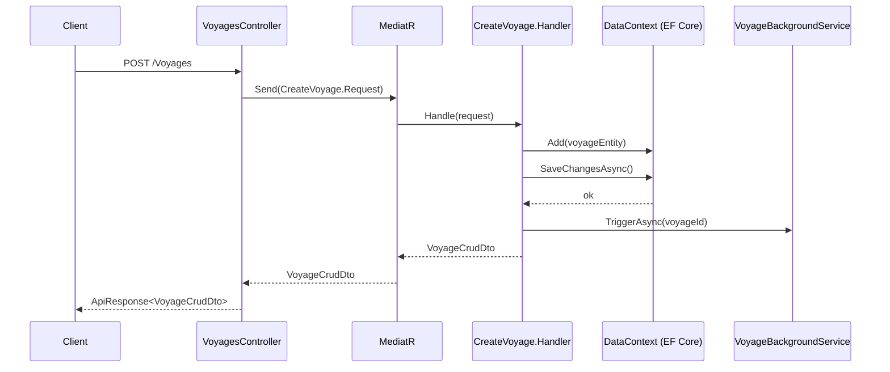

# Phase 4 — Business Workflow Synthesis (Self-Learning / Reflection)

## Status: ⏳ NOT STARTED

**Purpose:** Group the Phase 3 enriched docs into meaningful business flow clusters, synthesize cohesive workflow narratives, generate Mermaid diagrams and connection maps, and produce one top-level architecture overview. This is the "self-learning" phase — the agent builds a holistic understanding of how the codebase operates as a business system, not just a collection of files.

**This phase has two sub-passes:**

- **Pass A — Domain Module Flows:** Each module gets a set of flow docs grouped by business verb cluster
- **Pass B — Critical Business Workflow Deep Dives:** Dedicated in-depth synthesis for flows identified as critical (voyage/estimate profit calculation, etc.)

---

## Files to Create / Modify

| File                                           | Action                                        |
| ---------------------------------------------- | --------------------------------------------- |
| `src/agents/CSharpWorkflowSynthesizer.py`      | Create                                        |
| `src/agents/CSharpCriticalWorkflowAnalyzer.py` | Create                                        |
| `src/CSharpCodebaseWorkflow.py`                | Extend: add `synthesize_workflow_documents()` |

---

## Design Details

### 4.1 — Model Selection Strategy

All synthesis tasks use cloud models exclusively. The input context is always large (multiple enriched docs concatenated). Local models do not have sufficient context window or reasoning depth for synthesis tasks.

| Task                                 | Model                                                                                    |
| ------------------------------------ | ---------------------------------------------------------------------------------------- |
| Pass A — module flow synthesis       | `OpenRouter(model="qwen/qwen3-32b")`                                                     |
| Pass B — critical workflow deep dive | `OpenRouter(model="google/gemini-2.5-pro")` or `"qwen/qwen3-235b-a22b"` (best available) |

---

### 4.2 — Pass A: Domain Module Flow Synthesis

#### Grouping Logic

Files from `csharp-docs/enriched/` are grouped into clusters:

**Step 1 — Group by domain module** (from namespace/folder path):
`VoyageManagement | MasterData | Finance | BunkerOrder | OrderRequest | UserManagement | TaskAlert | FileStorage | ExternalClients`

**Step 2 — Within each module, group by business verb cluster:**

- `Read flows`: `Get*`, `Search*` handlers
- `Write flows`: `Create*`, `Update*`, `Delete*` handlers
- `Calculation flows`: `Calculate*`, `Compute*` handlers
- `Transition flows`: `Complete*`, `Approve*`, `Cancel*`, `Send*` handlers
- `Sync flows`: `Sync*`, `Import*`, `Export*` handlers

**Step 3 — Detect cross-domain flows** (e.g., `CreateVoyageFromEstimate` touches both Estimate + Voyage modules). These get their own dedicated synthesis doc.

#### `CSharpWorkflowSynthesizer.py`

Takes a cluster of enriched docs (concatenated, capped at model context limit) and generates:

````markdown
# {Module} — {VerbCluster} Workflow

## Business Purpose

What business goal does this cluster of operations serve?
What problem does it solve for the shipping/voyage management domain?

## Flow Overview

Step-by-step narrative of the typical end-to-end execution path,
from HTTP request → Controller → MediatR → Handler → DB → Response.

## Sequence Diagram


````

## Key Business Rules

Numbered list of business rules and validations embedded in these handlers.
Example: "A voyage cannot be created without at least one shipment."

## Entities Involved

- `VoyageEntity` — primary entity created/modified
- `ShipmentEntity` — child entities attached to voyage
- `EstimateEntity` — source when creating from estimate

## External Integrations Triggered

List any ExternalClient or BackgroundService calls made during this flow.

## Error Conditions

What `ApiException` error codes can this flow throw and under what circumstances?

## Connection Links

Direct file references for navigation:

- Handler: `Core/Business/VoyageManagement/Voyage/CreateVoyage.cs`
- Entity: `Core/Domain/VoyageManagement/Entities/VoyageEntity.cs`
- DTO: `Core/Domain/VoyageManagement/Dtos/VoyageCrudDto.cs`
- Controller: `APIs/OrderRequest/Controllers/VoyagesController.cs`
- Validator: `Core/Business/Validator/ShipmentValidator.cs`
- Background: `Core/Business/VoyageManagement/Services/VoyageBackgroundService.cs`

````

---

### 4.3 — Pass B: Critical Business Workflow Deep Dives

This pass is triggered for any flow cluster containing at least one `is_critical=true` file.

**Priority critical flows (always synthesized in Pass B regardless of scoring):**

| Flow Name | Trigger Signal | Why Critical |
|---|---|---|
| **Voyage/Estimate P&L Calculation** | File names with `Calculate`, `ProfitAndLoss`, `Estimate` | Core financial logic; errors = wrong P&L |
| **Voyage Lifecycle Transitions** | `CreateVoyageFromEstimate`, `CompleteVoyage`, `CancelVoyage` | State machine driving the entire voyage lifecycle |
| **Bunker Order & Cost Calculation** | `BunkerOrder`, `CalculateBunkerCost` | Fuel cost is largest voyage expense |
| **Commission & Payment Calculation** | `Commission`, `Payment`, `Invoice` | Financial settlement logic |
| **ETS / Emissions Calculation** | `ETS`, `Emissions`, `CarbonFactor` | Regulatory compliance |

#### `CSharpCriticalWorkflowAnalyzer.py`

An enhanced `Task` using the best available cloud model. Generates **everything from Pass A PLUS**:

```markdown
## Deep Technical Analysis

### Data Flow Map
Trace exactly how data transforms from the input DTO through each handler,
into entities, calculations, child records, and finally the output DTO.
Include specific field names and transformations.

### State Machine (if applicable)
```mermaid
stateDiagram-v2
    [*] --> Draft: CreateVoyage
    Draft --> Active: CompleteEstimate
    Active --> InProgress: DepartureConfirmed
    InProgress --> Completed: ArrivalConfirmed
    Completed --> [*]
    Draft --> Cancelled: CancelVoyage
    Active --> Cancelled: CancelVoyage
````

### Calculation Formula Breakdown

For financial/calculation flows: document each formula extracted from the code.
Example: "Freight Revenue = FreightRate \* Quantity + Surcharges - Discounts"

### Validation Gate Map

At which step does each FluentValidation rule fire?
What happens on validation failure (error vs warning)?

### Concurrency & Transaction Boundaries

Which operations are within the same EF Core SaveChangesAsync transaction?
Where does optimistic concurrency (IVersionedEntity) apply?

### Impact If Changed

For each key method in this flow: what is the risk level of modifying it?
What tests must pass before merging a change to this flow?

### New Developer Onboarding Guide

Step-by-step guide for a developer who needs to add a new field or
modify a business rule within this flow. Which files to touch, in which order.

```

---

### 4.4 — Top-Level Architecture Overview (Final Synthesis)

After all module and critical workflow docs are generated, one final synthesis document is produced:

**File:** `csharp-docs/workflows/BVMS_Architecture_Overview.md`

This is generated by feeding all workflow doc summaries (first 500 chars each) to the cloud model and asking for:
- System-level overview of all business capabilities
- How the modules interconnect
- A top-level Mermaid component diagram
- List of all critical flows with links to their detailed docs

---

### 4.5 — `synthesize_workflow_documents()` in `CSharpCodebaseWorkflow.py`

```

Input: enriched_folder, workflows_folder, index_path, manifest
Output: .md workflow docs in workflows_folder/

Algorithm:

1. Load index (with is_critical flags from Phase 3)
2. Group enriched docs by module + verb cluster
3. Detect cross-domain flows
4. Pass A: For each cluster:
   a. Concatenate docs up to 40,000 chars (cloud context limit)
   b. Run CSharpWorkflowSynthesizer (qwen3-32b)
   c. Save: workflows/{module}/{VerbCluster}\_workflow.md
5. Pass B: For each cluster with is_critical=true or matching priority list:
   a. Concatenate docs up to 60,000 chars
   b. Run CSharpCriticalWorkflowAnalyzer (best available model)
   c. Save: workflows/{module}/{FlowName}\_CRITICAL_deep_dive.md
6. Cross-domain flows: treat as their own module in both Pass A and B
7. Final synthesis: BVMS_Architecture_Overview.md
8. Update manifest for all source files: phase="synthesized"

```

---

## Output File Naming

```

csharp-docs/workflows/
├── VoyageManagement/
│ ├── ReadFlows_workflow.md
│ ├── WriteFlows_workflow.md
│ ├── CalculationFlows_workflow.md
│ ├── TransitionFlows_workflow.md
│ ├── CreateVoyageFromEstimate_CRITICAL_deep_dive.md
│ ├── CalculateVoyagePnL_CRITICAL_deep_dive.md
│ └── VoyageLifecycle_CRITICAL_deep_dive.md
├── Finance/
│ ├── WriteFlows_workflow.md
│ ├── CommissionCalculation_CRITICAL_deep_dive.md
│ └── InvoicePayment_CRITICAL_deep_dive.md
├── BunkerOrder/
│ ├── WriteFlows_workflow.md
│ └── BunkerCostCalculation_CRITICAL_deep_dive.md
├── MasterData/
│ ├── ReadFlows_workflow.md
│ └── WriteFlows_workflow.md
├── CrossDomain/
│ └── EstimateToVoyageTransition_CRITICAL_deep_dive.md
└── BVMS_Architecture_Overview.md

```

---

## Verification
- [ ] Run Phase 4 on `VoyageManagement` module only
- [ ] Verify `WriteFlows_workflow.md` contains Mermaid sequence diagram
- [ ] Verify `CalculationFlows_workflow.md` contains formula breakdown
- [ ] Verify `CreateVoyageFromEstimate_CRITICAL_deep_dive.md` has: state machine diagram, data flow map, formula breakdown, new developer guide
- [ ] Open Mermaid diagrams in a renderer — verify they parse and render correctly
- [ ] Verify `# Connection Links` section has accurate file paths
- [ ] Run full Phase 4 — verify `BVMS_Architecture_Overview.md` is produced last

---

## What Was Done
*(Fill in after completion)*
```
