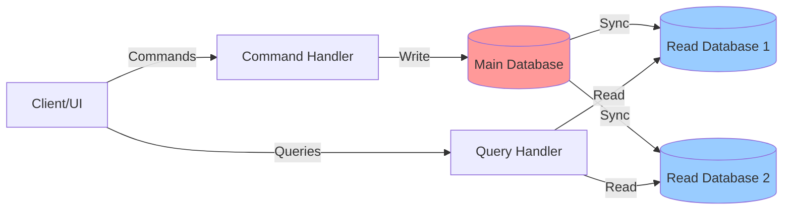
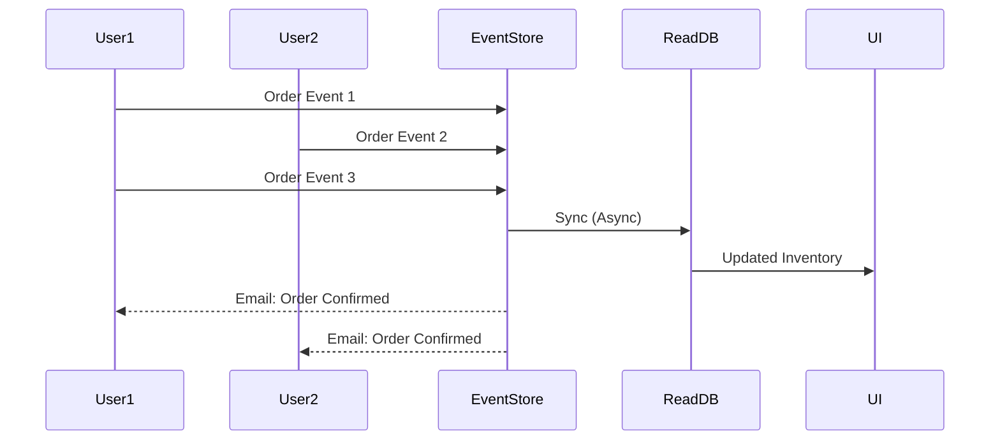
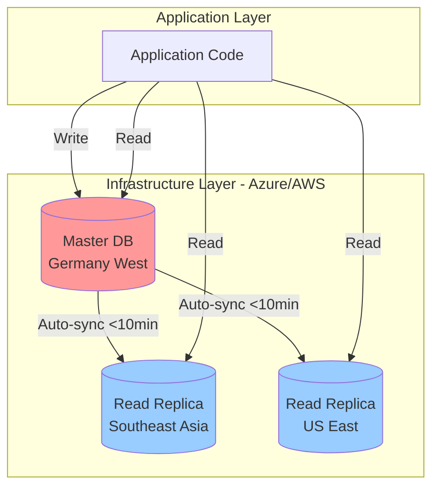
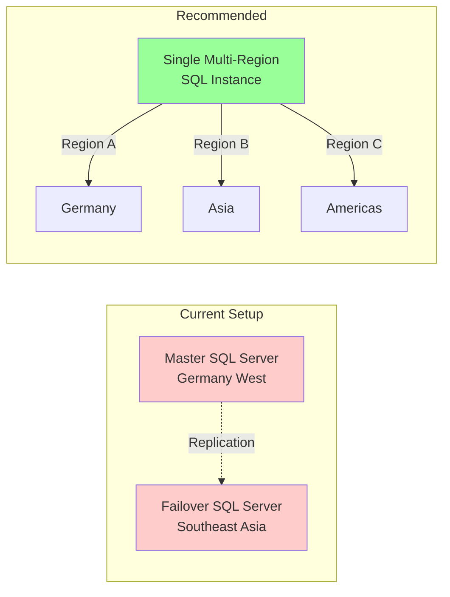
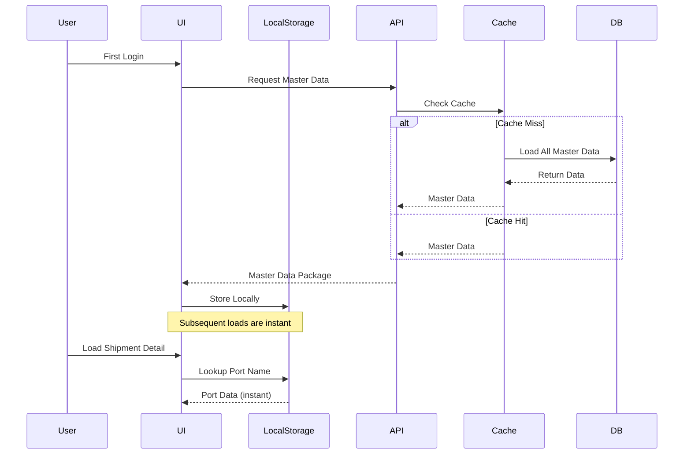
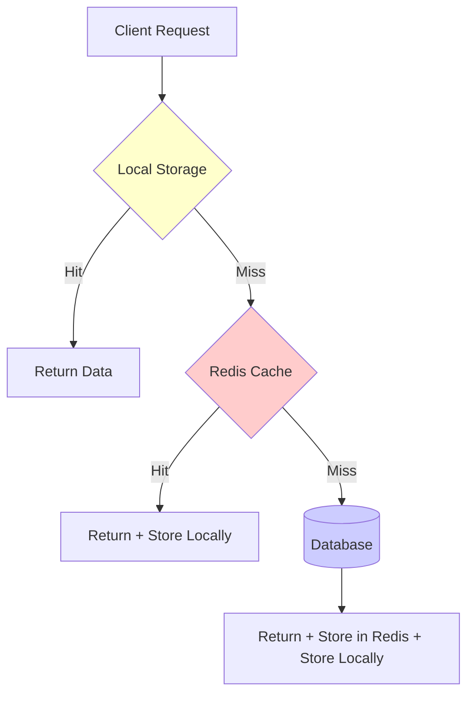
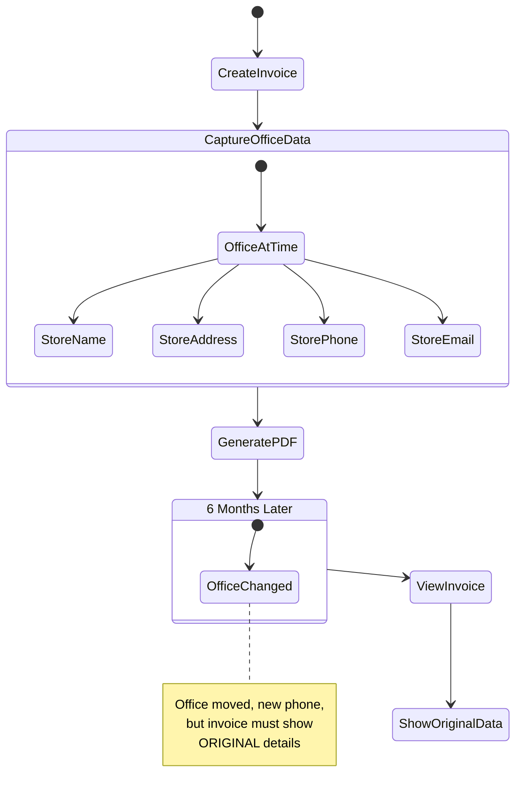
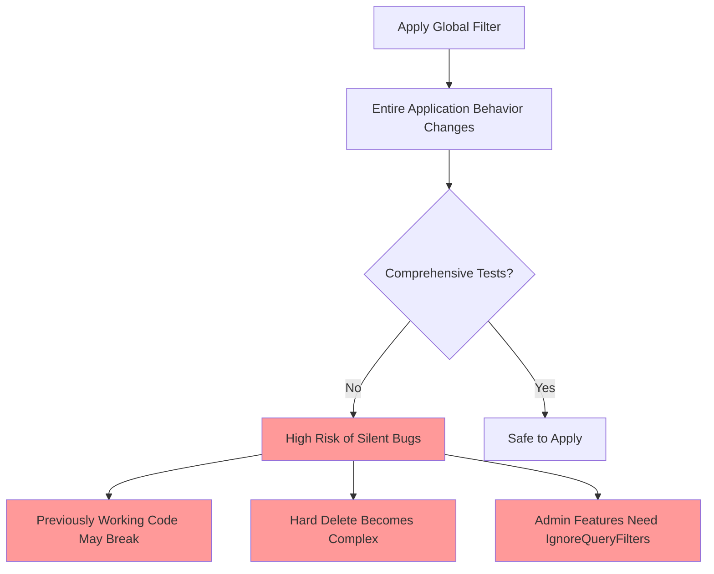
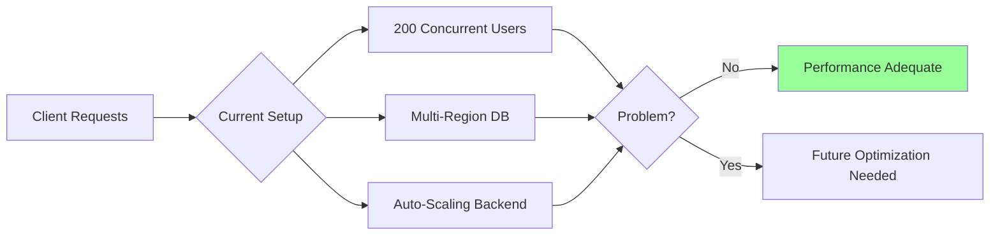
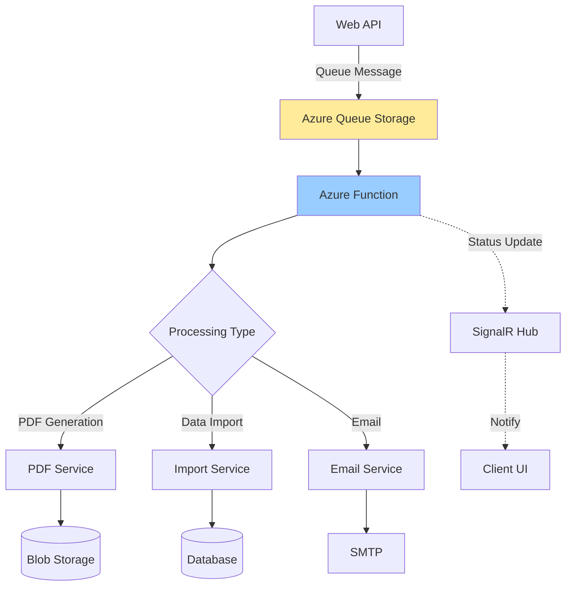

# CQRS Architecture and Database Optimization Patterns

## A Comprehensive Guide to Command Query Responsibility Segregation

_Based on technical discussion from October 9, 2025_

---

## Table of Contents

1. [Introduction to CQRS](#introduction-to-cqrs)
2. [Core CQRS Concepts](#core-cqrs-concepts)
3. [When to Use CQRS](#when-to-use-cqrs)
4. [Regional Database Architecture](#regional-database-architecture)
5. [Data Loading Strategies](#data-loading-strategies)
6. [Caching Strategies](#caching-strategies)
7. [Soft Delete Implementation](#soft-delete-implementation)
8. [Best Practices and Recommendations](#best-practices-and-recommendations)

---

## Introduction to CQRS

**[00:28]** CQRS (Command Query Responsibility Segregation) is an architectural pattern that separates read operations (queries) from write operations (commands). This separation allows for independent optimization of each concern.

### The Fundamental Principle

The basic idea is elegantly simple: **separate queries from commands**.

```
Query  ───────────→  Read Operations
Command ──────────→  Write Operations
```

However, the implementation complexity varies dramatically based on business requirements.

---

## Core CQRS Concepts

### Basic CQRS Architecture

**[01:21]** In its purest form, CQRS involves separate databases for reads and writes:



#### Components Breakdown

| Component            | Purpose            | Characteristics                                         |
| -------------------- | ------------------ | ------------------------------------------------------- |
| **Main Database**    | Source of truth    | Handles all write operations, stores authoritative data |
| **Read Database(s)** | Query optimization | Can be multiple, optimized for specific query patterns  |
| **Command Handler**  | Write operations   | Processes create, update, delete operations             |
| **Query Handler**    | Read operations    | Retrieves data without modifying state                  |
| **Sync Process**     | Data consistency   | Ensures read databases reflect main database state      |

### Event Sourcing Pattern

**[04:17]** In advanced CQRS implementations, commands are recorded as events rather than direct state changes:



**[05:03]** This approach prevents database locking issues when multiple users access the same data simultaneously, which is critical for high-concurrency scenarios like ticket sales or limited inventory e-commerce.

---

## When to Use CQRS

### The Concurrency Problem

**[03:09]** Consider Amazon's inventory system:

**Scenario:** 5 items in stock, 100 users trying to purchase simultaneously

```python
# Traditional approach - causes locking
def purchase_item(product_id, user_id):
    # Database row is locked during this transaction
    product = db.get_product_with_lock(product_id)
    if product.stock > 0:
        product.stock -= 1
        order = create_order(user_id, product_id)
        db.commit()
    # Other users wait here, causing timeouts
```

**[04:35]** With CQRS and event sourcing:

```python
# CQRS approach - no locking
def purchase_item(product_id, user_id):
    # Events are recorded immediately
    event = OrderEvent(
        user_id=user_id,
        product_id=product_id,
        timestamp=now()
    )
    event_store.append(event)  # Fast, no locks
    return "Order received, we'll confirm shortly"

# Async processing determines actual fulfillment
async def process_orders():
    events = event_store.get_pending()
    # First 5 get the product, rest get "sold out" notification
```

### When NOT to Use Full CQRS

**[08:45]** The discussion reveals critical insights about CQRS appropriateness:

> "With the amount of users and the amount of data and with the business cases you have, I think it's totally fine to have one database and to keep it simple."

#### Decision Matrix

| Factor                | Use CQRS                     | Avoid CQRS                     |
| --------------------- | ---------------------------- | ------------------------------ |
| **Concurrent writes** | High (1000+ simultaneous)    | Low (< 500 simultaneous)       |
| **Data contention**   | Frequent same-record updates | Rare conflicts                 |
| **Read/Write ratio**  | 1000:1 or higher             | Balanced                       |
| **Business model**    | Async acceptable             | Immediate consistency required |
| **Team expertise**    | High                         | Moderate to Low                |
| **Testing coverage**  | Comprehensive                | Partial                        |

**[09:37]** For the discussed shipping software:

- ~200 concurrent users
- Rare same-record writes
- Multi-region already implemented
- **Recommendation:** Logical separation (mediator pattern) without physical database separation

---

## Regional Database Architecture

### Infrastructure-Level CQRS

**[10:34]** Modern cloud platforms provide built-in replication that achieves CQRS benefits without application complexity:



**[11:33]** Benefits of infrastructure-level approach:

1. **No application changes required** - Configuration only
2. **Automatic synchronization** - Cloud provider handles replication
3. **Regional performance** - Users query nearest replica
4. **Failover capability** - Built-in disaster recovery

**[12:23]** Azure SQL and AWS RDS support multi-region configurations where:

- Single logical database instance
- Multiple physical regions
- Automatic failover and load balancing
- Sync time: < 10 minutes for schema and data

### Architecture Recommendation

**[13:36]** Two-instance approach discussion:



**[14:07]** Consideration: The two-server setup might be for disaster recovery rather than performance optimization. Verification needed with infrastructure team.

---

## Data Loading Strategies

### The N+1 Query Problem

**[14:36]** A common performance issue occurs when loading detailed views:

```javascript
// Anti-pattern: N+1 queries
async function loadShipmentDetails(shipmentId) {
  // Query 1: Main record
  const shipment = await db.shipments.findById(shipmentId);

  // Query 2: User
  shipment.user = await db.users.findById(shipment.userId);

  // Query 3: Office
  shipment.office = await db.offices.findById(shipment.officeId);

  // Query 4: Vessel
  shipment.vessel = await db.vessels.findById(shipment.vesselId);

  // Query 5: Port (with nested data)
  shipment.port = await db.ports.findById(shipment.portId);

  // Total: 5 round trips to database
  return shipment;
}
```

### Strategy 1: Aggregated Query

**[16:54]** Combine multiple lookups into a single database call:

```sql
-- Single query with joins
SELECT
    s.*,
    u.name AS user_name,
    u.email AS user_email,
    o.name AS office_name,
    o.code AS office_code,
    v.name AS vessel_name,
    v.imo AS vessel_imo,
    p.name AS port_name,
    p.code AS port_code,
    c.name AS country_name,
    c.flag AS country_flag
FROM shipments s
LEFT JOIN users u ON s.user_id = u.id
LEFT JOIN offices o ON s.office_id = o.id
LEFT JOIN vessels v ON s.vessel_id = v.id
LEFT JOIN ports p ON s.port_id = p.id
LEFT JOIN countries c ON p.country_id = c.id
WHERE s.id = @shipmentId;
```

**Pros:**

- Single database round trip
- Atomic data retrieval
- Simple to implement

**Cons:**

- Complex SQL for deeply nested data
- Returns more data than needed
- Less flexible for component reuse

### Strategy 2: Master Data Preloading

**[17:13]** Load all lookup data at application start:



**[18:34]** Implementation approach:

```typescript
// Master data preloading service
class MasterDataService {
  private masterData: MasterDataCache;

  async initialize() {
    // Check last update time
    const lastUpdate = localStorage.getItem("masterDataTimestamp");
    const currentTime = Date.now();

    // Refresh if older than 24 hours or not exists
    if (!lastUpdate || currentTime - parseInt(lastUpdate) > 86400000) {
      await this.refreshMasterData();
    } else {
      this.loadFromLocalStorage();
    }
  }

  async refreshMasterData() {
    // Single API call for all master data
    const data = await api.get("/master-data/all");

    // Store in local storage
    localStorage.setItem("users", JSON.stringify(data.users));
    localStorage.setItem("offices", JSON.stringify(data.offices));
    localStorage.setItem("vessels", JSON.stringify(data.vessels));
    localStorage.setItem("ports", JSON.stringify(data.ports));
    localStorage.setItem("masterDataTimestamp", Date.now().toString());

    this.loadFromLocalStorage();
  }

  getPort(portId: string): Port {
    return this.masterData.ports[portId]; // Instant lookup
  }
}
```

**[20:00]** Characteristics of master data suitable for preloading:

| Data Type | Change Frequency | Record Count | Preload?       |
| --------- | ---------------- | ------------ | -------------- |
| Users     | Low              | 100-500      | ✅ Yes         |
| Offices   | Very Low         | 10-50        | ✅ Yes         |
| Vessels   | Low              | 50-200       | ✅ Yes         |
| Ports     | Very Low         | 10,000+      | ⚠️ Conditional |
| Countries | Static           | 200          | ✅ Yes         |
| Shipments | High             | 100,000+     | ❌ No          |

**[20:10]** For large datasets like ports (10,000+ records), consider:

- Lazy loading with aggressive caching
- IndexedDB instead of localStorage
- Compression techniques
- Partial preloading (e.g., top 100 most-used ports)

### Strategy 3: SignalR Push Updates

**[18:44]** Real-time master data updates using WebSocket connections:

```csharp
// Backend: SignalR Hub
public class MasterDataHub : Hub
{
    public async Task NotifyMasterDataUpdate(string dataType, object newData)
    {
        // Push to all connected clients
        await Clients.All.SendAsync("MasterDataUpdated", dataType, newData);
    }
}

// When master data changes
public async Task UpdateOffice(Office office)
{
    await _repository.UpdateAsync(office);

    // Notify all clients
    await _hubContext.Clients.All
        .SendAsync("MasterDataUpdated", "offices", office);
}
```

```typescript
// Frontend: SignalR client
const connection = new signalR.HubConnectionBuilder()
  .withUrl("/masterDataHub")
  .build();

connection.on("MasterDataUpdated", (dataType: string, newData: any) => {
  // Update local storage
  if (dataType === "offices") {
    masterDataService.updateOffice(newData);
  }
  // Refresh affected UI components
  eventBus.emit("masterDataChanged", { type: dataType, data: newData });
});
```

**[19:16]** While push updates are technically elegant, the discussion concludes they're likely overkill:

> "I don't see it to be honest. I think it would be enough to check master data when you start the application."

---

## Caching Strategies

### Multi-Level Caching Architecture

**[22:20]** The discussion reveals a need for multiple caching layers:



### Client-Side Caching

**[22:37]** Current implementation uses browser localStorage:

```typescript
class ClientCache {
  private static readonly CACHE_PREFIX = "masterData_";

  get<T>(key: string): T | null {
    const cached = localStorage.getItem(`${ClientCache.CACHE_PREFIX}${key}`);
    if (!cached) return null;

    const parsed = JSON.parse(cached);

    // Check expiration
    if (parsed.expiry && Date.now() > parsed.expiry) {
      this.remove(key);
      return null;
    }

    return parsed.data as T;
  }

  set<T>(key: string, data: T, ttlMinutes: number = 1440) {
    const cacheData = {
      data,
      expiry: Date.now() + ttlMinutes * 60 * 1000,
      timestamp: Date.now(),
    };
    localStorage.setItem(
      `${ClientCache.CACHE_PREFIX}${key}`,
      JSON.stringify(cacheData)
    );
  }
}
```

**Benefits:**

- Instant retrieval (0ms latency)
- Reduces server load
- Works offline
- Survives page refresh

**Limitations:**

- 5-10 MB storage limit
- Synchronous API (can block UI)
- No cross-tab communication
- Difficult to invalidate

### Server-Side Caching (Redis)

**[23:20]** Proposed Redis cache layer for the API:

```csharp
public class CachedMasterDataService
{
    private readonly IDistributedCache _cache;
    private readonly IMasterDataRepository _repository;

    public async Task<Port> GetPortAsync(int portId)
    {
        string cacheKey = $"port:{portId}";

        // Try cache first
        var cachedPort = await _cache.GetStringAsync(cacheKey);
        if (cachedPort != null)
        {
            return JsonSerializer.Deserialize<Port>(cachedPort);
        }

        // Cache miss - query database
        var port = await _repository.GetPortAsync(portId);

        // Store in cache with 24-hour expiration
        var options = new DistributedCacheEntryOptions
        {
            AbsoluteExpirationRelativeToNow = TimeSpan.FromHours(24)
        };

        await _cache.SetStringAsync(
            cacheKey,
            JsonSerializer.Serialize(port),
            options
        );

        return port;
    }

    public async Task InvalidatePortCache(int portId)
    {
        await _cache.RemoveAsync($"port:{portId}");
    }
}
```

**Redis advantages:**

- Extremely fast (sub-millisecond)
- Distributed across servers
- Sophisticated expiration policies
- Pub/sub for cache invalidation
- Supports complex data structures

### SQLite as Cache

**[28:36]** An alternative to Redis for simpler deployments:

```csharp
public class SQLiteCacheService
{
    private readonly string _connectionString;

    public SQLiteCacheService()
    {
        _connectionString = "Data Source=cache.db";
        InitializeDatabase();
    }

    private void InitializeDatabase()
    {
        using var connection = new SqliteConnection(_connectionString);
        connection.Open();

        var command = connection.CreateCommand();
        command.CommandText = @"
            CREATE TABLE IF NOT EXISTS Cache (
                Key TEXT PRIMARY KEY,
                Value TEXT NOT NULL,
                ExpiryTime INTEGER NOT NULL
            );
            CREATE INDEX IF NOT EXISTS idx_expiry ON Cache(ExpiryTime);
        ";
        command.ExecuteNonQuery();

        // Cleanup expired entries
        CleanupExpired();
    }

    public async Task<string> GetAsync(string key)
    {
        using var connection = new SqliteConnection(_connectionString);
        await connection.OpenAsync();

        var command = connection.CreateCommand();
        command.CommandText = @"
            SELECT Value FROM Cache
            WHERE Key = @key
            AND ExpiryTime > @now
        ";
        command.Parameters.AddWithValue("@key", key);
        command.Parameters.AddWithValue("@now", DateTimeOffset.UtcNow.ToUnixTimeSeconds());

        var result = await command.ExecuteScalarAsync();
        return result?.ToString();
    }
}
```

**SQLite cache benefits:**

- No additional infrastructure needed
- File-based, easy deployment
- SQL query capabilities
- ACID transactions
- Excellent for read-heavy workloads

**Comparison:**

| Feature              | Redis             | SQLite             | LocalStorage |
| -------------------- | ----------------- | ------------------ | ------------ |
| **Speed**            | Sub-ms            | 1-5ms              | <1ms         |
| **Capacity**         | GBs               | GBs                | 5-10 MB      |
| **Distributed**      | Yes               | No                 | No           |
| **Persistence**      | Optional          | Yes                | Yes          |
| **Query Capability** | Limited           | Full SQL           | Key-only     |
| **Setup Complexity** | Medium            | Low                | None         |
| **Best For**         | High-traffic APIs | Single-server apps | Client-side  |

---

## Data Normalization vs. Denormalization

### The Invoicing Snapshot Problem

**[24:30]** A critical requirement emerged for invoice generation:

> "When he needed to perform invoicing things, he needed to somehow snapshot the entire data at that specific point and deliver it to the PDF."

**Scenario:** Generate invoice with office details



### Approach 1: Field-Level Denormalization

**[26:36]** Store specific fields that must not change:

```sql
CREATE TABLE Invoices (
    InvoiceId INT PRIMARY KEY,
    InvoiceNumber VARCHAR(50),
    CreatedDate DATETIME,

    -- Foreign key for current reference
    OfficeId INT REFERENCES Offices(OfficeId),

    -- Denormalized snapshot fields
    OfficeName VARCHAR(200),
    OfficeAddress VARCHAR(500),
    OfficePhone VARCHAR(50),
    OfficeEmail VARCHAR(200),
    OfficeTaxId VARCHAR(50),

    -- Other invoice fields
    TotalAmount DECIMAL(18,2),
    Currency VARCHAR(3)
);
```

**Pros:**

- Clear which fields are historical
- Easy to query
- Simple to understand

**Cons:**

- Many additional columns
- Schema changes when adding fields
- Duplicate data across records

### Approach 2: JSON Snapshot Field

**[26:42]** Store complete snapshot as JSON:

```sql
CREATE TABLE Orders (
    OrderId INT PRIMARY KEY,
    OrderNumber VARCHAR(50),
    CreatedDate DATETIME,

    -- Foreign key for current data lookups
    CustomerId INT REFERENCES Customers(CustomerId),

    -- Complete snapshot
    LookupDataSnapshot NVARCHAR(MAX), -- JSON

    -- Other order fields
    OrderTotal DECIMAL(18,2)
);
```

```csharp
public class Order
{
    public int OrderId { get; set; }
    public string OrderNumber { get; set; }
    public int CustomerId { get; set; }

    // JSON snapshot
    public string LookupDataSnapshot { get; set; }

    // Strongly-typed accessor
    public OrderSnapshot GetSnapshot()
    {
        return JsonSerializer.Deserialize<OrderSnapshot>(LookupDataSnapshot);
    }
}

public class OrderSnapshot
{
    public CustomerSnapshot Customer { get; set; }
    public OfficeSnapshot Office { get; set; }
    public ProductSnapshot[] Products { get; set; }
}

// Usage
var order = await _repository.GetOrderAsync(orderId);
var snapshot = order.GetSnapshot();

// Generate PDF with historical data
var pdf = new InvoicePDF();
pdf.CustomerName = snapshot.Customer.Name;
pdf.CustomerAddress = snapshot.Customer.Address;
pdf.OfficePhone = snapshot.Office.Phone; // Historical value
```

**[27:18]** Advantages:

1. **Single field** for all historical data
2. **Flexible structure** - add fields without schema changes
3. **Complete context** - entire state preserved
4. **Tidy tables** - no column sprawl

**Considerations:**

- Cannot query inside JSON easily (without JSON path support)
- Slightly more complex to access data
- Requires serialization/deserialization

### When to Denormalize

**[25:07]** Decision matrix:

```
Denormalize when:
├── Data must not change over time (✅)
│   └── Invoices, legal documents, reports
├── High read frequency (✅)
│   └── Dashboard aggregates, reports
├── Complex joins hurt performance (✅)
│   └── 5+ table joins for simple display
└── Data rarely updates (✅)
    └── Historical records, archives

Keep normalized when:
├── Data should reflect current state (✅)
│   └── Product catalog, user profiles
├── Frequent updates (✅)
│   └── Inventory levels, user settings
├── Storage is concern (✅)
│   └── Large datasets, cost sensitive
└── Data integrity critical (✅)
    └── Financial balances, access control
```

---

## Soft Delete Implementation

### The Global Filter Debate

**[36:42]** A significant architectural discussion about implementing global soft delete filters:

**Proposal:** Add automatic filtering to Entity Framework DbContext

```csharp
// Proposed implementation
protected override void OnModelCreating(ModelBuilder modelBuilder)
{
    // Global query filter for all entities with IsDeleted
    foreach (var entityType in modelBuilder.Model.GetEntityTypes())
    {
        if (typeof(ISoftDeletable).IsAssignableFrom(entityType.ClrType))
        {
            // This filter applies to ALL queries automatically
            var parameter = Expression.Parameter(entityType.ClrType, "e");
            var property = Expression.Property(parameter, nameof(ISoftDeletable.IsDeleted));
            var condition = Expression.Equal(property, Expression.Constant(false));
            var lambda = Expression.Lambda(condition, parameter);

            modelBuilder.Entity(entityType.ClrType).HasQueryFilter(lambda);
        }
    }
}

// Now all queries automatically filter soft-deleted records
var users = await context.Users.ToListAsync(); // Only non-deleted users
```

### The Problem

**[37:41]** Key concerns raised:

> "The system is designed that from the start it is not using soft delete as a default. So all of the code up from the start to now already have that in mind."

**[38:40]** Risk assessment:



**[39:49]** Without comprehensive automated tests, this change affects:

- Every query in the entire application
- Admin functions that need to see deleted records
- Reports and analytics
- Data export features
- Audit trails

### Alternative Approach: Explicit Soft Delete

**[41:09]** Recommended pattern using explicit methods:

```csharp
// Repository pattern with explicit soft delete support
public interface IRepository<T> where T : class
{
    // Standard queries (no filter)
    Task<T> GetByIdAsync(int id);
    Task<List<T>> GetAllAsync();

    // Soft-delete aware queries (explicit)
    Task<T> GetActiveByIdAsync(int id);
    Task<List<T>> GetActiveAsync();
    Task<List<T>> GetDeletedAsync();
}

public class SoftDeleteRepository<T> : IRepository<T>
    where T : class, ISoftDeletable
{
    private readonly DbContext _context;
    private readonly DbSet<T> _dbSet;

    public async Task<List<T>> GetActiveAsync()
    {
        return await _dbSet
            .Where(x => !x.IsDeleted)
            .ToListAsync();
    }

    public async Task<T> GetActiveByIdAsync(int id)
    {
        return await _dbSet
            .Where(x => x.Id == id && !x.IsDeleted)
            .FirstOrDefaultAsync();
    }

    public async Task SoftDeleteAsync(int id, string deletedBy)
    {
        var entity = await GetByIdAsync(id);
        if (entity != null)
        {
            entity.IsDeleted = true;
            entity.DeletedAt = DateTime.UtcNow;
            entity.DeletedBy = deletedBy;
            await _context.SaveChangesAsync();
        }
    }
}
```

**[41:47]** Extension methods for cleaner syntax:

```csharp
public static class SoftDeleteQueryExtensions
{
    public static IQueryable<T> WhereActive<T>(this IQueryable<T> query)
        where T : ISoftDeletable
    {
        return query.Where(x => !x.IsDeleted);
    }

    public static IQueryable<T> IncludeSoftDeleted<T>(this IQueryable<T> query)
        where T : ISoftDeletable
    {
        // Explicitly opt-in to include deleted records
        return query; // No filter
    }

    public static IQueryable<T> WhereDeleted<T>(this IQueryable<T> query)
        where T : ISoftDeletable
    {
        return query.Where(x => x.IsDeleted);
    }
}

// Usage - Intent is clear
var activeUsers = await context.Users
    .WhereActive()  // Explicit: we want active only
    .ToListAsync();

var allUsers = await context.Users
    .IncludeSoftDeleted()  // Explicit: we want all including deleted
    .ToListAsync();

var deletedUsers = await context.Users
    .WhereDeleted()  // Explicit: we want deleted only
    .ToListAsync();
```

### Custom Include for Soft Delete Relations

**[41:47]** The discussion mentions "SoftInclude" for related entities:

```csharp
public static class SoftDeleteIncludeExtensions
{
    // Standard Include - may include soft-deleted relations
    // SoftInclude - filters related entities too

    public static IQueryable<TEntity> SoftInclude<TEntity, TProperty>(
        this IQueryable<TEntity> query,
        Expression<Func<TEntity, TProperty>> navigationProperty)
        where TEntity : class
        where TProperty : class, ISoftDeletable
    {
        return query
            .Include(navigationProperty)
            .Where(/* complex expression to filter related entities */);
    }
}

// Usage comparison
var shipment = await context.Shipments
    .Include(s => s.Invoices)  // Includes ALL invoices (even deleted)
    .FirstAsync();

var shipment = await context.Shipments
    .SoftInclude(s => s.Invoices)  // Only active invoices
    .FirstAsync();
```

### Best Practice Summary

**[41:37]** Recommendations from the discussion:

| Aspect                | Recommendation                    | Rationale                        |
| --------------------- | --------------------------------- | -------------------------------- |
| **Default Behavior**  | No global filter                  | Prevents unintended consequences |
| **Query Methods**     | Explicit active/deleted queries   | Clear intent in code             |
| **Extension Methods** | `WhereActive()`, `WhereDeleted()` | Readable and maintainable        |
| **New Features**      | Use soft delete                   | Modern best practice             |
| **Legacy Code**       | Keep as-is until tested           | Minimize risk                    |
| **Testing**           | Required before global changes    | Safety net                       |

**[42:22]** The principle of avoiding "magic":

> "I keep it really really really simple. No magic if it's in any way possible because someone will join and look at the code and think what is happening, why do I not get the data or something like that."

---

## Entity Framework Considerations

### The Magic Problem

**[40:51]** Discussion of Entity Framework's implicit behaviors:

```csharp
// Entity Framework "magic" - what's actually happening?
var order = await context.Orders
    .Include(o => o.Customer)  // Lazy load? Eager load?
    .Include(o => o.Items)     // What about nested properties?
        .ThenInclude(i => i.Product)  // How deep does this go?
    .FirstOrDefaultAsync(o => o.Id == orderId);

// Generated SQL might be very complex
// Tracking behavior might cause issues
// Query filters might apply unexpectedly
```

**[41:03]** Preference for explicit over implicit:

```csharp
// Alternative: Explicit SQL or Dapper
var order = await connection.QueryFirstOrDefaultAsync<Order>(
    @"SELECT o.*, c.*, i.*, p.*
      FROM Orders o
      INNER JOIN Customers c ON o.CustomerId = c.CustomerId
      INNER JOIN OrderItems i ON o.OrderId = i.OrderId
      INNER JOIN Products p ON i.ProductId = p.ProductId
      WHERE o.OrderId = @OrderId",
    new { OrderId = orderId }
);
// Exactly what you wrote is what executes
```

### When Entity Framework Shines

**[40:37]** Appropriate use cases:

1. **Code-First Migrations**

   ```csharp
   // Excellent for schema management
   protected override void Up(MigrationBuilder migrationBuilder)
   {
       migrationBuilder.CreateTable(
           name: "Orders",
           columns: table => new
           {
               OrderId = table.Column<int>(nullable: false)
                   .Annotation("SqlServer:Identity", "1, 1"),
               OrderNumber = table.Column<string>(maxLength: 50),
               CreatedDate = table.Column<DateTime>()
           });
   }
   ```

2. **Simple CRUD Operations**

   ```csharp
   // Good for straightforward operations
   var user = new User { Name = "John", Email = "john@example.com" };
   context.Users.Add(user);
   await context.SaveChangesAsync();
   ```

3. **Change Tracking**
   ```csharp
   // Useful for complex updates
   var order = await context.Orders.FindAsync(orderId);
   order.Status = OrderStatus.Completed;
   order.CompletedDate = DateTime.UtcNow;
   // EF tracks changes automatically
   await context.SaveChangesAsync();
   ```

### When to Use Alternative

For complex queries, consider:

- **Dapper** - Micro-ORM for performance
- **Raw SQL** - Full control
- **Stored Procedures** - Complex business logic
- **Views** - Complex reporting queries

---

## Performance Optimization Strategies

### Request Bundling Challenge

**[29:35]** The complexity of bundling UI component requests:

```typescript
// Problem: Independent components load at different times
class UserDisplay extends Component {
  async mounted() {
    this.user = await api.getUser(this.userId); // Request 1
  }
}

class OfficeDisplay extends Component {
  async mounted() {
    this.office = await api.getOffice(this.officeId); // Request 2
  }
}

class VesselDisplay extends Component {
  async mounted() {
    this.vessel = await api.getVessel(this.vesselId); // Request 3
  }
}

// All fire at slightly different times (milliseconds apart)
```

**[30:35]** Proposed bundling solution:

```typescript
// API endpoint that accepts multiple entity requests
interface BatchRequest {
  vessels?: number[];
  offices?: number[];
  users?: number[];
  ports?: number[];
}

// POST /api/master-data/batch
async function batchGetMasterData(request: BatchRequest) {
  const results = {
    vessels: request.vessels
      ? await getFromCache("vessels", request.vessels)
      : {},
    offices: request.offices
      ? await getFromCache("offices", request.offices)
      : {},
    users: request.users ? await getFromCache("users", request.users) : {},
    ports: request.ports ? await getFromCache("ports", request.ports) : {},
  };
  return results;
}

// Client-side request aggregator
class RequestBatcher {
  private pending: BatchRequest = {};
  private timeout: NodeJS.Timeout | null = null;

  requestMasterData(type: string, id: number): Promise<any> {
    return new Promise((resolve, reject) => {
      // Add to pending batch
      if (!this.pending[type]) this.pending[type] = [];
      this.pending[type].push({ id, resolve, reject });

      // Debounce - wait 50ms for more requests
      if (this.timeout) clearTimeout(this.timeout);
      this.timeout = setTimeout(() => this.executeBatch(), 50);
    });
  }

  private async executeBatch() {
    const batch = this.pending;
    this.pending = {};

    // Single API call for all pending requests
    const results = await api.post("/master-data/batch", {
      vessels: batch.vessels?.map((x) => x.id),
      offices: batch.offices?.map((x) => x.id),
      // ... other types
    });

    // Resolve individual promises
    batch.vessels?.forEach((req) => {
      req.resolve(results.vessels[req.id]);
    });
    // ... resolve others
  }
}
```

**[31:31]** Challenges identified:

- Components load independently
- Timing coordination complex
- 20+ master data tables to handle
- Requires sophisticated debouncing

**[31:48]** Conclusion: Preloading + caching likely simpler and more effective

### Load Time Optimization

**[32:32]** Assessment of current production environment:



**[32:48]** Key insight:

> "I don't think it is even now a problem for the production environment because just 200 people working at the same time and our database is multi region availability."

**[33:04]** Proactive planning approach:

> "At least I wanted to have some kind of solution in the head before the actual traffic jam happened."

### Optimization Priority

Based on the discussion:

1. **Immediate (Do Now)**

   - ✅ Keep logical CQRS separation (mediator pattern)
   - ✅ Implement master data preloading
   - ✅ Use local storage caching effectively

2. **Short-term (Next 6 months)**

   - ⚠️ Add Redis/SQLite cache layer
   - ⚠️ Implement explicit soft delete patterns
   - ⚠️ Optimize heaviest queries

3. **Long-term (As needed)**
   - 🔮 Request bundling if latency becomes issue
   - 🔮 Physical CQRS if write contention occurs
   - 🔮 Event sourcing if audit requirements expand

---

## Background Task Processing

### The PDF Processing Challenge

**[33:16]** Discussion of heavy background tasks:

> "We need to have like a very good way to handle those background task, heavy background task, most likely to export and import data from PDF during a voyage."

**Scenario:**

- Daily invoicing PDFs during voyage
- Continuous read/write operations
- Multiple concurrent voyages
- High data volume

### Architecture Options

**[34:10]** Recommendation: Azure Functions for background processing



### Implementation Pattern

```csharp
// Web API Controller - Enqueue task
[HttpPost("api/invoices/{invoiceId}/generate")]
public async Task<IActionResult> GenerateInvoicePDF(int invoiceId)
{
    var message = new InvoiceGenerationMessage
    {
        InvoiceId = invoiceId,
        RequestedBy = User.Identity.Name,
        RequestedAt = DateTime.UtcNow
    };

    // Add to queue (returns immediately)
    await _queueClient.SendMessageAsync(JsonSerializer.Serialize(message));

    return Accepted(new {
        message = "PDF generation started",
        invoiceId = invoiceId
    });
}

// Azure Function - Process task
[FunctionName("GenerateInvoicePDF")]
public async Task Run(
    [QueueTrigger("invoice-generation")] string messageJson,
    ILogger log)
{
    var message = JsonSerializer.Deserialize<InvoiceGenerationMessage>(messageJson);

    log.LogInformation($"Processing invoice {message.InvoiceId}");

    try
    {
        // This can take several minutes - no timeout concerns
        var invoice = await _invoiceService.GetInvoiceWithAllDataAsync(message.InvoiceId);
        var pdfBytes = await _pdfGenerator.GenerateAsync(invoice);

        // Store in blob storage
        var blobName = $"invoices/{message.InvoiceId}_{DateTime.UtcNow:yyyyMMdd}.pdf";
        await _blobClient.UploadAsync(blobName, pdfBytes);

        // Update database
        await _invoiceRepository.UpdatePDFPathAsync(message.InvoiceId, blobName);

        // Notify user via SignalR
        await _hubContext.Clients.User(message.RequestedBy)
            .SendAsync("InvoicePDFReady", message.InvoiceId, blobName);

        log.LogInformation($"Successfully generated PDF for invoice {message.InvoiceId}");
    }
    catch (Exception ex)
    {
        log.LogError(ex, $"Failed to generate PDF for invoice {message.InvoiceId}");
        // Azure Functions will retry automatically based on configuration
        throw;
    }
}
```

### Benefits of Azure Functions

| Benefit               | Description                               |
| --------------------- | ----------------------------------------- |
| **Auto-scaling**      | Automatically scales based on queue depth |
| **No infrastructure** | No servers to manage or configure         |
| **Cost-effective**    | Pay only for execution time               |
| **Retry logic**       | Built-in automatic retry on failure       |
| **Timeout isolation** | Won't affect web API response times       |
| **Monitoring**        | Built-in logging and Application Insights |

**[34:34]** Next steps mentioned:

- Measure current processing times
- Estimate data volumes
- Consult with Christopher on infrastructure
- Document typical processing duration

---

## Meeting Planning and Timeline

**[35:27]** Upcoming vacation and meeting schedule:

### Available Dates

- **October 16-17** (Thursday-Friday): Next week
- **October 20-21** (Monday-Tuesday): Last available before vacation
- **Vacation:** 3 weeks starting October 22

### Next Meeting Topics

**[33:22]** Agenda items requiring Nam's participation:

1. Background task processing architecture
2. PDF generation and import workflows
3. Voyage data synchronization patterns
4. Invoice processing optimization

**[34:17]** Information needed before next discussion:

```
Performance Baseline Metrics Needed:
├── Processing Time
│   ├── Average PDF generation time
│   ├── Peak load processing time
│   └── Import operation duration
├── Data Volume
│   ├── Average PDF file size
│   ├── Daily invoice count
│   └── Concurrent voyage count
└── User Experience
    ├── Acceptable wait time
    ├── Current timeout issues
    └── Priority operations
```

---

## Key Takeaways and Best Practices

### Architecture Decisions

**[09:23]** Decision framework:

1. **Start Simple**

   - Use logical separation (CQRS concept)
   - Single database until proven inadequate
   - Leverage infrastructure features first

2. **Scale as Needed**

   - Monitor metrics
   - Identify bottlenecks with data
   - Implement solutions for actual problems

3. **Prioritize Maintainability**
   - Explicit over implicit
   - Clear code intent
   - Comprehensive tests before major changes

### Anti-Patterns to Avoid

❌ **Premature Optimization**

```
Don't: Implement full CQRS with event sourcing "just in case"
Do: Start with mediator pattern, add complexity when needed
```

❌ **Global Magic Behavior**

```
Don't: Apply global query filters without comprehensive tests
Do: Use explicit methods that show intent
```

❌ **Over-Engineering**

```
Don't: Build complex request bundling for 200 users
Do: Use simple preloading and caching
```

### Success Patterns

✅ **Leverage Infrastructure**

- Use cloud platform regional replication
- Let managed services handle scaling
- Azure Functions for background tasks

✅ **Cache Intelligently**

- Client-side for instant UX
- Server-side (Redis/SQLite) for API performance
- Clear invalidation strategy

✅ **Test Before Changing**

- Comprehensive automated tests
- Integration tests for data access
- Load tests for performance validation

---

## Additional Resources

### Related Patterns

1. **Mediator Pattern** - Logical command/query separation
2. **Repository Pattern** - Data access abstraction
3. **Unit of Work** - Transaction management
4. **Event Sourcing** - Audit trail and state reconstruction
5. **Saga Pattern** - Distributed transactions

### Further Reading

- Martin Fowler - CQRS: https://martinfowler.com/bliki/CQRS.html
- Microsoft CQRS Pattern: https://docs.microsoft.com/en-us/azure/architecture/patterns/cqrs
- Event Sourcing Pattern: https://martinfowler.com/eaaDev/EventSourcing.html
- Azure Functions Best Practices: https://docs.microsoft.com/en-us/azure/azure-functions/functions-best-practices

### Code Examples Repository

All code examples from this document are illustrative. For production implementations:

- Add proper error handling
- Implement logging
- Add unit tests
- Consider security implications
- Review performance with real data

---

## Summary

**[43:12]** This technical discussion covered multiple architectural patterns and practical implementation strategies:

### Core Conclusions

1. **CQRS Application**: Logical separation beneficial; physical separation overkill for current scale
2. **Database Strategy**: Multi-region infrastructure features adequate; single logical database recommended
3. **Caching**: Multi-layer approach (client + server) most effective
4. **Soft Delete**: Explicit methods preferred over global filters
5. **Background Tasks**: Azure Functions ideal for heavy processing
6. **Optimization**: Proactive planning good; premature implementation risky

### Implementation Priorities

**High Priority:**

- Master data preloading
- Client-side caching optimization
- Explicit soft delete patterns

**Medium Priority:**

- Server-side caching (Redis/SQLite)
- Background task infrastructure
- Performance monitoring

**Low Priority (Future):**

- Request bundling
- Physical CQRS separation
- Advanced event sourcing

The guiding principle throughout: **Keep it simple, explicit, and maintainable** until complexity is justified by actual requirements and comprehensive testing is in place.

---

_Document created from technical discussion dated October 9, 2025_  
_Total discussion duration: 43 minutes 13 seconds_
