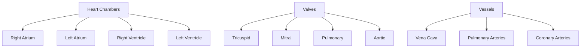

# Comprehensive Documentation: Automatic ECG Analysis Using Principal Component Analysis and Wavelet Transformation

## Overview

This documentation encapsulates the key knowledge from Antoun Khawaja's 2006 PhD thesis, "Automatic ECG Analysis Using Principal Component Analysis and Wavelet Transformation." The thesis focuses on developing methods for detecting small changes in ECG waves and complexes indicative of cardiac diseases, particularly Torsade de Pointes (TDP) predisposition. It employs Principal Component Analysis (PCA) for morphological feature extraction and Wavelet Transformation for signal preconditioning. The work is structured into medical foundations, technical aspects, mathematical methods, state-of-the-art review, preconditioning techniques, and applications to T-wave and QRS complex analysis.

## 1. Medical Foundations

### 1.1 Heart Anatomy

The human heart is a four-chambered organ weighing 200-425 grams, located in the chest between the lungs. It consists of:

- **Chambers**: Right/left atria and ventricles.
- **Walls**: Endocardium (inner lining), myocardium (muscle), epicardium (outer layer), pericardium (sac).
- **Valves**: Tricuspid, mitral, pulmonary, aortic.
- **Vessels**: Superior/inferior vena cava, pulmonary arteries/veins, coronary arteries.

The left ventricle is thicker due to higher systemic pressure. Cardiac myocytes are cylindrical cells with sarcolemma, intracellular components (nucleus, mitochondria, sarcoplasmic reticulum), and myofibrils for contraction.

#### Myofiber Orientation

Cardiac fibers show anisotropic electrical and mechanical properties. Ventricular fibers are organized in spirals and transmural rotations, influencing ECG propagation.

### 1.2 Electrophysiology of the Heart

Electrophysiology involves ion channels (Na⁺, K⁺, Ca²⁺) regulating transmembrane potential. The action potential (AP) has five phases:

- **Phase 0**: Rapid depolarization (Na⁺ influx).
- **Phase 1**: Early repolarization (K⁺ efflux).
- **Phase 2**: Plateau (Ca²⁺ influx, K⁺ efflux).
- **Phase 3**: Repolarization (K⁺ efflux).
- **Phase 4**: Resting potential (-70 mV).

Excitation-contraction coupling: AP triggers Ca²⁺ release from SR, leading to myofibril contraction via actin-myosin interaction.

### 1.3 ECG Lead Systems

ECG measures cardiac electrical activity via leads:

- **12-Lead System**: 6 limb leads (I, II, III, aVR, aVL, aVF), 6 precordial leads (V1-V6).
- **Corrected Orthogonal Leads**: X, Y, Z axes.
- **Body Surface Mapping**: 62-192 leads for detailed mapping.
- **Ambulatory Monitoring**: 2-3 leads for Holter.

Einthoven's triangle: Lead I = LA - RA, Lead II = LL - RA, Lead III = LL - LA.

### 1.4 Normal ECG Waves, Intervals, and Variants

- **P Wave**: Atrial depolarization (0.08-0.12 s, <2.5 mm).
- **QRS Complex**: Ventricular depolarization (0.06-0.10 s, 5-30 mm).
- **T Wave**: Ventricular repolarization.
- **U Wave**: Late repolarization (if present).
- **Intervals**:
  - PR: 0.12-0.20 s.
  - QT: 0.35-0.44 s (corrected QTc = QT / √(RR)).
  - ST Segment: Isoelectric line.

Power spectrum: P wave (5-15 Hz), QRS (10-50 Hz), T wave (2-10 Hz).

### 1.5 Heart Rhythms and Arrhythmias

- **Sinus Rhythm**: Normal, 60-100 bpm.
- **Arrhythmias**:
  - Atrial: Flutter (sawtooth P waves), Fibrillation (irregular).
  - Ventricular: Tachycardia, Fibrillation, Premature contractions (PVCs).
  - Conduction Blocks: AV block, bundle branch block.
  - Wolff-Parkinson-White: Delta wave, short PR.

### 1.6 Heartbeat Morphologies

- **Ischemic Heart Disease**: ST depression/elevation.
- **Myocardial Infarction**: Q waves, ST elevation.
- **Long QT Syndrome**: Prolonged QT, TDP risk.
- **Brugada Syndrome**: ST elevation in V1-V3.
- **T-Wave Alternans**: Beat-to-beat T-wave amplitude variation.

### 1.7 Torsade de Pointes (TDP)

TDP is a polymorphic ventricular tachycardia causing sudden death. Features:

- Prolonged QT interval.
- T-wave morphology changes.
- Triggered by short-long-short RR sequences.
- Associated with drug-induced repolarization delay.

## 2. Technical Aspects of ECG Recording

### 2.1 Electrode-Skin Interface

Electrodes convert ionic current to electronic. Key factors:

- **Electrochemical Potentials**: Half-cell potentials, polarization.
- **Impedance**: Skin resistance (1-10 kΩ/cm²), affected by moisture, stratum corneum.
- **Types**: Reversible (Ag/AgCl), non-reversible, electrodes of 1st/2nd kind.

### 2.2 Types of Electrodes

- **Plate Electrodes**: Metal disks with gel.
- **Suction Electrodes**: Vacuum-attached.
- **Fluid-Column Electrodes**: Saline-filled tubes.
- **Active Electrodes**: Built-in amplifiers for low noise.

### 2.3 ECG Artifacts and Interference

- **Artifact Potentials**: Motion, electrode movement.
- **Electromagnetic Interference**: 50/60 Hz power line, RF.
- **Amplifiers**: Differential (CMRR >100 dB), instrumentation amplifiers.

### 2.4 ECG Acquisition Systems

- **SynAmps**: 64-channel, 1 kHz sampling.
- **ActiveTwo**: 64-channel with active electrodes.
- **Lead Systems**: 64-lead Lux system for body surface mapping.

### 2.5 ECG Databases

- **Multi-Channel**: IBT 64-channel, Lux limited.
- **Annotated**: MIT-BIH Arrhythmia, QT databases.
- **Clinical Trials**: Pfizer QT103 study.

## 3. Applied Methods and Mathematics

### 3.1 Mathematical Basics

- **Expected Value**: E[X] = ∑ x p(x).
- **Variance**: Var(X) = E[(X - μ)²].
- **Covariance**: Cov(X,Y) = E[(X - μ_X)(Y - μ_Y)].
- **Correlation**: ρ = Cov(X,Y) / (σ_X σ_Y).

### 3.2 Principal Component Analysis (PCA)

PCA transforms data to orthogonal components explaining variance.

**Steps**:

1. Mean-center data: B = X - μ.
2. Covariance matrix: C = (1/N) B^T B.
3. Eigenvalue decomposition: C V = V Λ.
4. Project: Z = B V.

**Karhunen-Loève Expansion**: X ≈ ∑ λ_i^{1/2} z_i v_i.

**Hotelling's T²**: T² = ∑ (z_i / λ_i) for outlier detection.

### 3.3 Finite & Infinite Impulse Response Filters

- **Z-Transform**: H(z) = ∑ h[n] z^{-n}.
- **Laplace Transform**: H(s) = ∫ h(t) e^{-st} dt.
- **FIR**: No feedback, stable.
- **IIR**: Feedback, efficient (e.g., Butterworth: |H(jω)|² = 1 / (1 + (ω/ω_c)^{2N})).

### 3.4 Wavelets

Wavelets provide time-frequency analysis.

**Continuous Wavelet Transform (CWT)**: W(a,b) = ∫ x(t) ψ\* ((t-b)/a) dt.

**Discrete Wavelet Transform (DWT)**: Via filter banks (low-pass h, high-pass g).

**Multiresolution Analysis**: Signal decomposed into approximation and detail coefficients.

**Properties**: Orthogonal, compact support (e.g., Haar, Daubechies).

**Stationary WT (SWT)**: Translation-invariant.

**Wavelet Packets**: Full decomposition tree.

## 4. State of the Art in ECG Signal Processing

### 4.1 Baseline Wander Removal

Methods: Cubic splines, adaptive filters, wavelets, time-varying filters.

### 4.2 ECG Segmentation and Fiducial Points Detection

- **QRS Detection**: Pan-Tompkins, wavelet-based, neural networks.
- **Delineation**: Wavelet modulus maxima, adaptive filters.

### 4.3 PCA Applications on ECG

Used for compression, ischemia detection, T-wave analysis, arrhythmia classification.

## 5. ECG Signal Preconditioning

### 5.1 ECG Signal Low-Frequency Filtering

**Motivation**: Baseline wander distorts ST segment.

**Proposed Method**: Wavelet-based using approximation coefficients at level 8-10 (1 kHz sampling).

**Results**: Better ST preservation than high-pass filters.

### 5.2 ECG Signal Denoising

**Single-Channel**: Wavelet shrinkage (Symlet2, soft thresholding).

**Multi-Channel**: Wiener filter using wavelet correlation.

**Results**: >99% similarity in simulations.

### 5.3 ECG Noise Estimation

**Low-Frequency**: ELFE = ECG_filtered - ECG_original.

**High-Frequency**: HFNE = ECG - BLWE.

**Applications**: Retrospective analysis of 1246 signals.

### 5.4 ECG Delineation

**Strategy**: First-level details signal (FLDS) for peaks.

**Multi-Channel**: Histogram voting for R-peaks.

Add **Validation**: 99.5% accuracy on MIT-BIH.

### 5.5 ECG-Complex and ECG-Wave Extraction

Extract segments using fiducial points.

### 5.6 Detecting Outliers

Use Hotelling's T² on PCA scores.

### 5.7 ECG-Complex and ECG-Wave Fine Alignment

Cross-correlation with template, wavelet-based for noisy signals.

## 6. T-Wave Morphology Analysis

### 6.1 Detecting Predisposition to TDP

**Method**: PCA on T-waves, SD on first scores for variation measure.

**Results**: TDP patients show higher variation (241.9 ± 168.3) vs. healthy (73.8 ± 12.4).

**Conclusion**: Beat-to-beat T-wave variation increases before TDP.

### 6.2 T-Wave Morphology Clustering

**Method**: Hierarchical clustering on PCA scores (Euclidean distance).

**Results**: Groups T-waves by morphology.

**Conclusion**: Enables automated classification in long-term ECG.

## 7. QRS Complex Morphology Analysis

### 7.1 Temporal & Spatio-Temporal Analysis

**Temporal**: PCA on QRS matrix, correlate scores with HR/respiration.

**Spatio-Temporal**: Concatenate channels, analyze globally.

**Results**: First PC correlates with HR/respiration (r > 0.5).

**Conclusion**: Morphology changes linked to physiological factors.

### 7.2 Predicting QRS Complex

**Method**: Polynomial fit on PCA scores, reconstruct future QRS.

**Validation**: 99.3% similarity, 20.7 μV error.

**Conclusion**: Predicts ventricular activity trends.

## Key Tables

| Method                   | Application     | Key Metric  | Result                |
| ------------------------ | --------------- | ----------- | --------------------- |
| Wavelet Baseline Removal | ST Preservation | Similarity  | >99%                  |
| PCA T-Wave Variation     | TDP Detection   | SD Mean     | TDP: 242, Healthy: 74 |
| QRS Prediction           | Forecasting     | Correlation | 99.3%                 |

## Key Equations

- **PCA Projection**: Z = (X - μ) V
- **Wavelet CWT**: W(a,b) = ∫ x(t) ψ\* ((t-b)/a) dt
- **QT Correction**: QTc = QT / √(RR)

This documentation covers the thesis's core contributions, emphasizing PCA and wavelets for ECG analysis. For deeper study, refer to the original thesis.
