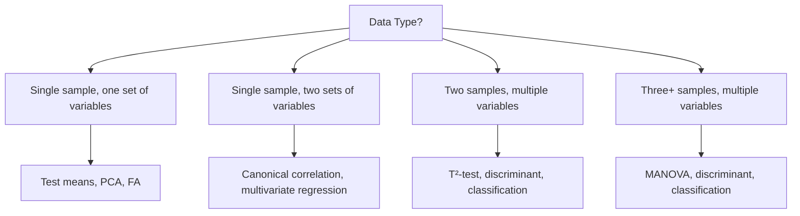
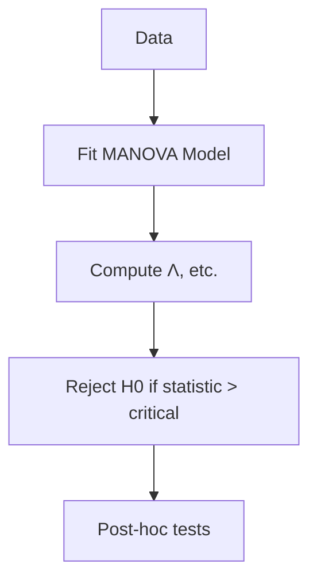
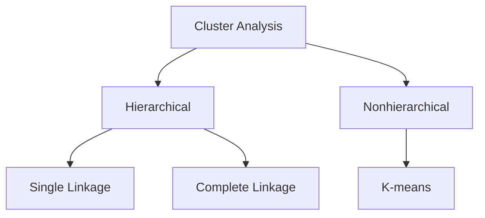

# Methods of Multivariate Analysis: Comprehensive Study Guide

**Author:** Alvin C. Rencher  
**Edition:** Second Edition  
**Purpose:** This guide encapsulates the essential knowledge from "Methods of Multivariate Analysis" by Alvin C. Rencher. It provides a concise, detailed summary of key concepts, techniques, equations, tables, and diagrams for study purposes. Focus is on understanding multivariate methods, their applications, assumptions, and interpretations.

## Table of Contents
1. [Introduction](#chapter-1-introduction)
2. [Matrix Algebra](#chapter-2-matrix-algebra)
3. [Characterizing and Displaying Multivariate Data](#chapter-3-characterizing-and-displaying-multivariate-data)
4. [The Multivariate Normal Distribution](#chapter-4-the-multivariate-normal-distribution)
5. [Tests on One or Two Mean Vectors](#chapter-5-tests-on-one-or-two-mean-vectors)
6. [Multivariate Analysis of Variance](#chapter-6-multivariate-analysis-of-variance)
7. [Tests on Covariance Matrices](#chapter-7-tests-on-covariance-matrices)
8. [Discriminant Analysis: Description of Group Separation](#chapter-8-discriminant-analysis-description-of-group-separation)
9. [Classification Analysis: Allocation of Observations to Groups](#chapter-9-classification-analysis-allocation-of-observations-to-groups)
10. [Multivariate Regression](#chapter-10-multivariate-regression)
11. [Canonical Correlation](#chapter-11-canonical-correlation)
12. [Principal Component Analysis](#chapter-12-principal-component-analysis)
13. [Factor Analysis](#chapter-13-factor-analysis)
14. [Cluster Analysis](#chapter-14-cluster-analysis)
15. [Graphical Procedures](#chapter-15-graphical-procedures)
16. [Appendices](#appendices)
17. [References and Further Reading](#references-and-further-reading)

## Chapter 1: Introduction

### 1.1 Why Multivariate Analysis?
Multivariate analysis involves methods for analyzing multiple variables measured on each unit (individual or object). It is crucial when variables are correlated, as univariate methods may overlook interrelationships. Goals include exploring joint performance, determining variable effects in the presence of others, and simplifying data through dimensionality reduction. Applications in behavioral, biological, physical, and social sciences. Benefits: handles intercorrelations, controls experimentwise error, reveals underlying structures.

### 1.2 Prerequisites
- Matrix algebra (Chapter 2)
- Statistical basics: normal distribution, t-tests, confidence intervals, multiple regression, ANOVA
- No calculus required beyond basic concepts

### 1.3 Objectives
1. Master details of multivariate techniques (purposes, assumptions, limitations).
2. Select appropriate methods for given data.
3. Interpret results from statistical software.

### 1.4 Basic Types of Data and Analysis
Four fundamental data types with corresponding analyses:

1. **Single sample, multiple variables:** Test means (H₀: μ = μ₀), assess correlations (sphericity), principal components, factor analysis.
2. **Single sample, two variable sets:** Canonical correlation, multivariate multiple regression.
3. **Two samples, multiple variables:** Hotelling's T²-test, discriminant analysis, classification.
4. **Multiple samples, multiple variables:** MANOVA, discriminant analysis, classification.

**Table 1.1: Examples of Multivariate Data**

| Units                  | Variables                                                                 |
|------------------------|---------------------------------------------------------------------------|
| Students               | Exam scores in multiple courses                                          |
| Students               | Grades in math, history, music, art                                       |
| People                 | Height, weight, body fat %, resting heart rate                            |
| Skulls                 | Length, width, cranial capacity                                          |
| Companies              | Expenditures: advertising, labor, materials                              |
| Manufactured items     | Measurements for quality control                                         |
| Loan applicants        | Income, education, residence length, savings, debt                       |
| Literature segments    | Sentence length, word frequencies, style characteristics                 |
| Human hairs            | Elemental compositions                                                   |
| Birds                  | Bone lengths                                                             |

**Diagram: Decision Tree for Selecting Multivariate Analysis**



## Chapter 2: Matrix Algebra

### 2.1 Introduction
Essential for multivariate computations. Covers notation, operations, and properties.

### 2.2 Notation and Basic Definitions
- **Matrix A (n×p):** Rectangular array, e.g., data matrix.
- **Vector x (p×1):** Column vector.
- **Scalar c:** Single number.
- **Equality:** Same size, element-wise equal.
- **Transpose A' (p×n):** Rows ↔ columns.
- **Symmetric matrix:** A = A'.
- **Special matrices:** Diagonal (diag(A)), Identity I, Triangular, j (ones vector), J (ones matrix).

### 2.3 Operations
- **Summation/Product:** ∑_{i=1}^n a_i, ∏_{i=1}^n a_i.
- **Addition:** Element-wise, commutative.
- **Multiplication:** A (n×p) × B (p×m) = C (n×m), C_{ij} = ∑_{k=1}^p A_{ik} B_{kj}. Not commutative.
- **Properties:** (AB)' = B'A', (AB)^{-1} = B^{-1}A^{-1}, trace(AB) = trace(BA).
- **Linear combinations:** y = ∑ c_i x_i.
- **Partitioned matrices:** Block operations.
- **Rank:** Maximum independent rows/columns.
- **Inverse A^{-1}:** AA^{-1} = I, exists if nonsingular (det ≠ 0).
- **Positive definite:** x'Ax > 0 ∀ x ≠ 0.
- **Determinant |A|:** Product of eigenvalues, |AB| = |A||B|, |A'| = |A|.
- **Trace tr(A):** Sum of diagonals, tr(AB) = tr(BA).
- **Orthogonal vectors:** x'y = 0.
- **Orthogonal matrix Q:** Q'Q = I.
- **Eigenvalues λ, eigenvectors v:** Av = λv.
- **Spectral decomposition:** A = QΛQ' for symmetric A.
- **Square root A^{1/2}:** (A^{1/2})^2 = A.
- **Singular value decomposition (SVD):** A = UDV' for any A.

**Key Equation: Matrix Multiplication**  
C = AB, where C_{ij} = \sum_{k} A_{ik} B_{kj}

**Diagram: Matrix Operations Overview**

```mermaid
graph TD
    A[Matrix Operations] --> B[Addition: A + B]
    A --> C[Multiplication: AB]
    A --> D[Transpose: A']
    A --> E[Inverse: A^{-1}]
    C --> F[Not Commutative]
    E --> G[For Nonsingular Matrices]
```

## Chapter 3: Characterizing and Displaying Multivariate Data

### 3.1 Mean and Variance of Univariate Random Variable
- Mean μ = E(Y)
- Variance σ² = E[(Y - μ)²]

### 3.2 Covariance and Correlation of Bivariate Random Variables
- **Covariance:** σ_{12} = E[(Y1 - μ1)(Y2 - μ2)]
- **Correlation:** ρ = σ_{12} / (σ1 σ2), -1 ≤ ρ ≤ 1

### 3.3 Scatter Plots of Bivariate Samples
Visualize relationships; detect outliers, clusters.

### 3.4 Graphical Displays for Multivariate Samples
- Scatterplot matrices, profile plots.

### 3.5 Mean Vectors
- Population: μ (p×1)
- Sample: \bar{y} = (1/n) ∑ y_i

### 3.6 Covariance Matrices
- Population: Σ = E[(y - μ)(y - μ)']
- Sample: S = (1/(n-1)) ∑ (y_i - \bar{y})(y_i - \bar{y})'

### 3.7 Correlation Matrices
- R_{ij} = S_{ij} / √(S_{ii} S_{jj})

### 3.8 Mean Vectors and Covariance Matrices for Variable Subsets
- Partitioned means and covariances.

### 3.9 Linear Combinations of Variables
- Mean: E(c'y) = c'μ
- Variance: Var(c'y) = c'Σc
- Covariance: Cov(c'y, d'y) = c'Σd

### 3.10 Measures of Overall Variability
- Generalized variance: |Σ|
- Total variance: tr(Σ)

### 3.11 Estimation of Missing Values
- Regression imputation, EM algorithm.

### 3.12 Distance between Vectors
- Mahalanobis: d² = (x - y)' Σ^{-1} (x - y)
- Euclidean: d² = (x - y)' (x - y)

**Table 3.1: Sample Statistics Summary**

| Statistic          | Population | Sample |
|--------------------|------------|--------|
| Mean               | μ         | \bar{y} |
| Covariance         | Σ         | S      |
| Correlation        | ρ         | r      |

## Chapter 4: The Multivariate Normal Distribution

### 4.1 Multivariate Normal Density Function
- **Density:** f(y) = (2π)^{-p/2} |Σ|^{-1/2} \exp\left\{ -\frac{1}{2} (y - μ)' Σ^{-1} (y - μ) \right\}
- **Properties:** Marginal/conditional distributions normal.

### 4.2 Properties of Multivariate Normal Random Variables
- Linear combinations normal.
- Independence iff Σ diagonal.

### 4.3 Estimation
- **MLE:** \hat{μ} = \bar{y}, \hat{Σ} = S
- **Distributions:** \bar{y} ~ N(μ, Σ/n), S ~ Wishart(W_p(Σ, n-1))

### 4.4 Assessing Multivariate Normality
- Univariate normality tests (Shapiro-Wilk, etc.)
- Multivariate tests: Mardia's skewness/kurtosis, Q-Q plots.

### 4.5 Outliers
- Univariate: z-scores, studentized residuals.
- Multivariate: Mahalanobis distance, robust estimates.

**Equation: Multivariate Normal Density**  
f(y) = \frac{1}{(2\pi)^{p/2} |\Sigma|^{1/2}} \exp\left( -\frac{1}{2} (y - \mu)^\prime \Sigma^{-1} (y - \mu) \right)

**Diagram: Normal Distribution Ellipsoid**

```mermaid
graph TD
    A[Multivariate Normal] --> B[Contour: (y-μ)'Σ^{-1}(y-μ) = c]
    B --> C[Ellipsoid in p-dimensions]
```

## Chapter 5: Tests on One or Two Mean Vectors

### 5.1 Multivariate vs. Univariate Tests
Multivariate controls Type I error across variables.

### 5.2 Tests on μ with Σ Known
- **Test:** ( \bar{y} - μ₀ )' Σ^{-1} ( \bar{y} - μ₀ ) ~ χ²_p

### 5.3 Tests on μ When Σ Unknown
- **Hotelling's T²:** T² = n ( \bar{y} - μ₀ )' S^{-1} ( \bar{y} - μ₀ ) ~ T²_{p, n-1}

### 5.4 Comparing Two Mean Vectors
- **Two-sample T²:** Based on pooled S.

### 5.5 Tests on Individual Variables Post T²
Bonferroni correction.

### 5.6 Computation of T²
From MANOVA or regression.

### 5.7 Paired Observations Test
Multivariate paired t-test.

### 5.8 Test for Additional Information
Partial T².

### 5.9 Profile Analysis
Test parallelism, levels, flatness.

**Equation: Hotelling's T²**  
T² = n (\bar{y} - \mu_0)^\prime S^{-1} (\bar{y} - \mu_0)

**Table 5.1: Critical Values for T² (Approximation)**  
F = \frac{n-p}{p(n-1)} T² ~ F_{p, n-p}

## Chapter 6: Multivariate Analysis of Variance (MANOVA)

### 6.1 One-Way Models
- **Model:** y_{ij} = μ + τ_i + ε_{ij}
- **Test statistics:** Wilks' Λ, Roy's, Pillai, Lawley-Hotelling.

### 6.2 Comparison of Test Statistics
Λ most powerful for small effects.

### 6.3 Contrasts
Multivariate contrasts.

### 6.4 Tests on Individual Variables Post MANOVA
Bonferroni, etc.

### 6.5 Two-Way Classification
Additive model.

### 6.6 Other Models
Higher-order, mixed, nested.

### 6.7 Checking Assumptions
Normality, homogeneity of Σ.

### 6.8 Profile Analysis
Repeated measures.

### 6.9 Repeated Measures Designs
Sphericity assumption.

### 6.10 Growth Curves
Polynomial contrasts.

### 6.11 Tests on a Subvector
Partial MANOVA.

**Equation: Wilks' Λ**  
Λ = \frac{|E|}{|H + E|}

**Diagram: MANOVA Flow**



## Chapter 7: Tests on Covariance Matrices

### 7.1 Introduction
Test Σ = Σ₀, sphericity, equality across groups.

### 7.2 Testing a Specified Pattern for Σ
Likelihood ratio tests.

### 7.3 Tests Comparing Covariance Matrices
Box's M-test for equality.

### 7.4 Tests of Independence
Between subvectors.

**Equation: Box's M**  
M = - (n-1) \ln |Λ| , Λ = |S_p| / \prod |S_i|

## Chapter 8: Discriminant Analysis: Description of Group Separation

### 8.1 Introduction
Find linear combinations separating groups.

### 8.2 Discriminant Function for Two Groups
a' y, maximizes group separation.

### 8.3 Relationship to Multiple Regression
Discriminant = regression with dummy.

### 8.4 Several Groups
Canonical variates.

### 8.5 Standardized Functions
Correlations with variables.

### 8.6 Tests of Significance
F-tests for functions.

### 8.7 Interpretation
Coefficients, partial F, correlations.

### 8.8 Scatter Plots
Plot discriminant scores.

### 8.9 Stepwise Selection
Add/remove variables.

**Equation: Discriminant Function**  
a = Σ^{-1} (μ1 - μ2)

## Chapter 9: Classification Analysis: Allocation of Observations to Groups

### 9.1 Introduction
Assign new observations to groups.

### 9.2 Classification into Two Groups
Linear/quadratic classifiers.

### 9.3 Several Groups
Mahalanobis distance.

### 9.4 Estimating Misclassification Rates
Resubstitution, holdout, cross-validation.

### 9.5 Improved Estimates
Jackknife, bootstrap.

### 9.6 Subset Selection
Stepwise.

### 9.7 Nonparametric Procedures
Kernel, nearest neighbor.

**Equation: Linear Classifier**  
Classify to group 1 if a'(y - midpoint) > 0

## Chapter 10: Multivariate Regression

### 10.1 Introduction
Predict multiple Y from X.

### 10.2 Multiple Regression: Fixed X's
Standard OLS.

### 10.3 Random X's
Adjust for X variability.

### 10.4 Multivariate Multiple Regression
- **Model:** Y = XB + E
- **Estimation:** B = (X'X)^{-1} X'Y

### 10.5 Hypothesis Tests
Overall: Wilks' Λ, etc.

### 10.6 Measures of Association
R²_Y.X

### 10.7 Subset Selection
Stepwise.

### 10.8 Random X's
Adjust Σ.

**Equation: Multivariate Regression Model**  
E[Y] = X B, where B is p×k matrix.

## Chapter 11: Canonical Correlation

### 11.1 Introduction
Correlate two variable sets.

### 11.2 Canonical Correlations and Variates
Maximize corr(u, v).

### 11.3 Properties
0 ≤ ρ_c ≤ 1.

### 11.4 Tests of Significance
Sequential tests.

### 11.5 Interpretation
Coefficients, redundancies.

### 11.6 Relationships to Other Techniques
Extensions of regression, MANOVA.

**Equation: Canonical Correlation**  
ρ_c = max corr(a'y, b'x)

## Chapter 12: Principal Component Analysis

### 12.1 Introduction
Reduce dimensionality.

### 12.2 Geometric and Algebraic Bases
Eigenvectors of S.

### 12.3 PCA and Perpendicular Regression
Minimize perpendicular distances.

### 12.4 Plotting
Biplots.

### 12.5 PCA from Correlation Matrix
For standardized variables.

### 12.6 Deciding Number of Components
Scree plot, eigenvalues >1.

### 12.7 Information in Last Components
Noise.

### 12.8 Interpretation
Loadings, rotations.

### 12.9 Selection of Variables
Stepwise.

**Equation: Principal Components**  
z1 = e1' (y - \bar{y}), where e1 maximizes Var(z1)

## Chapter 13: Factor Analysis

### 13.1 Introduction
Model observed variables as functions of latent factors.

### 13.2 Orthogonal Factor Model
y = Λ f + ε

### 13.3 Estimation
Principal factor, MLE.

### 13.4 Choosing Number of Factors
Eigenvalues, scree.

### 13.5 Rotation
Varimax, oblique.

### 13.6 Factor Scores
Regression method.

### 13.7 Validity
Fit indices.

### 13.8 Relationship to PCA
Factors from communalities.

**Equation: Factor Model**  
y = Λ f + ε, with ε uncorrelated.

## Chapter 14: Cluster Analysis

### 14.1 Introduction
Group similar observations.

### 14.2 Measures of Similarity/Dissimilarity
Euclidean, Mahalanobis.

### 14.3 Hierarchical Clustering
Single/complete linkage, Ward's.

### 14.4 Nonhierarchical
K-means.

### 14.5 Choosing Number of Clusters
Dendrogram, validation.

### 14.6 Cluster Validity
Internal/external measures.

### 14.7 Clustering Variables
Factor analysis alternative.

**Diagram: Clustering Methods**



## Chapter 15: Graphical Procedures

### 15.1 Multidimensional Scaling
Represent dissimilarities in low dimensions.

### 15.2 Correspondence Analysis
For categorical data.

### 15.3 Biplots
Joint plots of variables and observations.

**Equation: Stress in MDS**  
Stress = √[∑ (d_{ij} - \hat{d}_{ij})^2 / ∑ d_{ij}^2]

## Appendices
- Tables: Critical values for Λ, T², etc.
- Answers to problems.
- Data sets and SAS files.

## References and Further Reading
- Rencher (1998): Multivariate Statistical Inference.
- Johnson & Wichern (2007): Applied Multivariate Statistical Analysis.
- Anderson (2003): An Introduction to Multivariate Statistical Analysis.

This guide covers the core content. For derivations and proofs, refer to the original text or Rencher (1998).