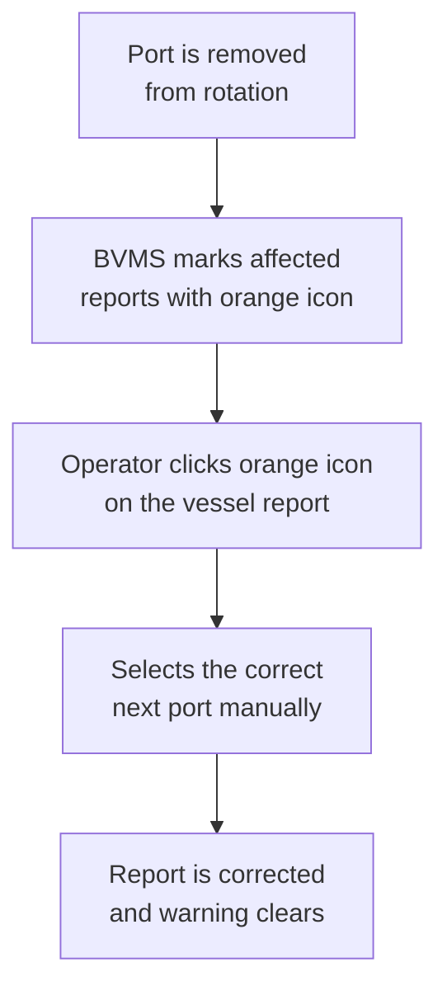
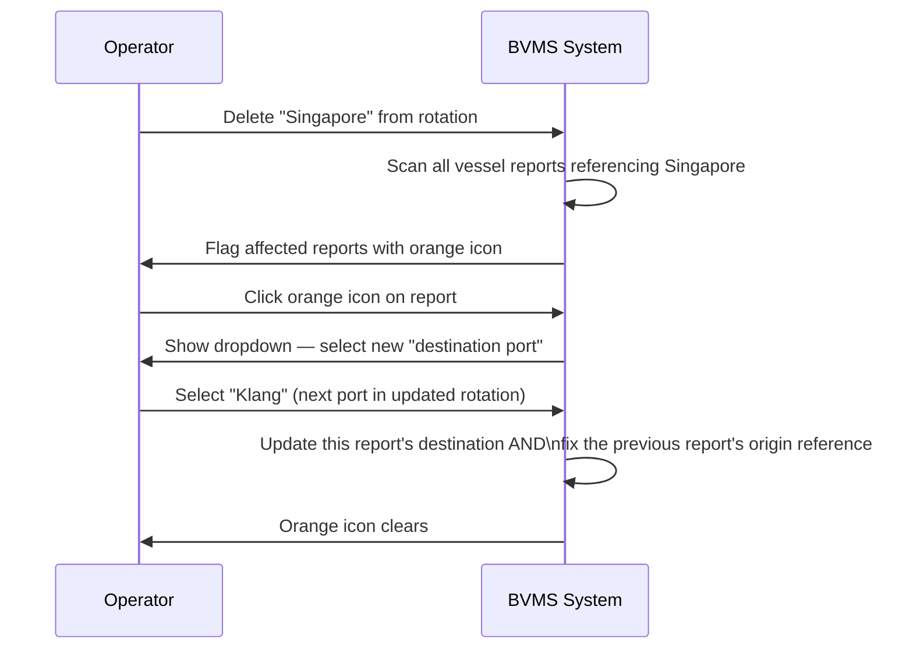
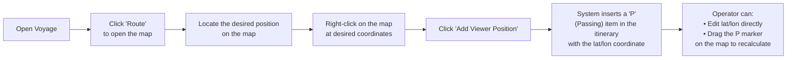
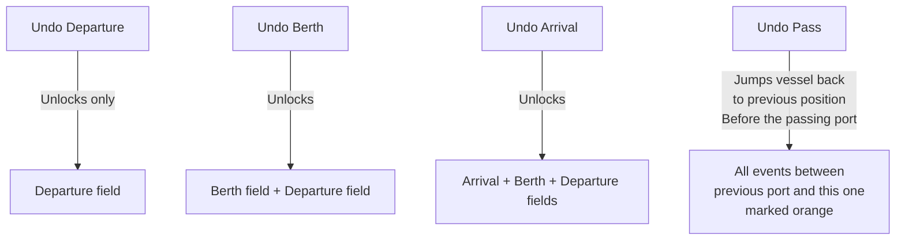
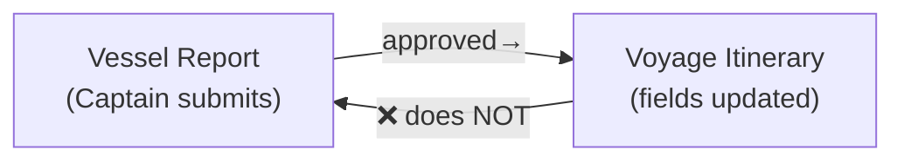
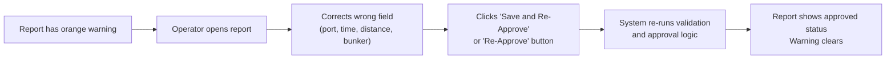
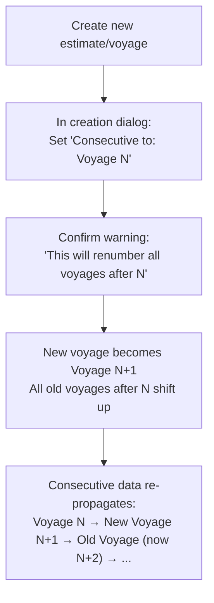
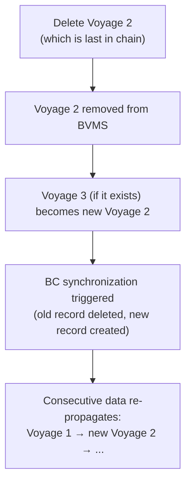

# BBC BVMS — Custom Position, Vessel Report Updates & Consecutive Voyage

## Complete Technical & Operational Documentation

> **Document Authority:** Synthesized from Demo Session — Custom Position, Update Vessel Report, Consecutive Voyage  
> **Target Audience:** Operators, Developers, QA, Product Owners  
> **Version:** 1.0 — May 4, 2026

---

## Table of Contents

1. [Executive Summary](#1-executive-summary)
2. [Vessel Report Behavior on Itinerary Change](#2-vessel-report-behavior-on-itinerary-change)
3. [Deleting or Removing a Port from the Rotation](#3-deleting-or-removing-a-port-from-the-rotation)
4. [Bunker Port Deletion — Dependency Rules](#4-bunker-port-deletion--dependency-rules)
5. [Custom Position (P) Feature](#5-custom-position-p-feature)
6. [Distance Calculation with Custom Positions](#6-distance-calculation-with-custom-positions)
7. [Undo Arrival, Undo Berth, Undo Departure](#7-undo-arrival-undo-berth-undo-departure)
8. [Re-approval After Rotation Change](#8-re-approval-after-rotation-change)
9. [Consecutive Voyage System](#9-consecutive-voyage-system)
10. [Creating a Voyage — Consecutive vs. Non-Consecutive](#10-creating-a-voyage--consecutive-vs-non-consecutive)
11. [Inserting a Voyage Between Existing Voyages](#11-inserting-a-voyage-between-existing-voyages)
12. [Reordering Voyages After Creation](#12-reordering-voyages-after-creation)
13. [Non-Consecutive Voyage Chains](#13-non-consecutive-voyage-chains)
14. [Voyage Deletion — Constraints & Cascade Rules](#14-voyage-deletion--constraints--cascade-rules)
15. [Port Type Rules for Consecutive Data Propagation](#15-port-type-rules-for-consecutive-data-propagation)
16. [Instructed Speed — Bug & Intended Behavior](#16-instructed-speed--bug--intended-behavior)
17. [Caching & Refresh Behavior](#17-caching--refresh-behavior)
18. [Glossary](#18-glossary)
19. [Revision Notes](#19-revision-notes)

---

## 1. Executive Summary

### 1.1 Session Topics

This session covers three distinct feature areas demonstrated and reviewed together in a live demo:

| Feature Area                        | Description                                                                                                                     | Maturity              |
| ----------------------------------- | ------------------------------------------------------------------------------------------------------------------------------- | --------------------- |
| **Vessel Report — Rotation Change** | How approved vessel reports behave when the voyage rotation (itinerary) is changed                                              | Actively refined      |
| **Custom Position (P)**             | A new feature allowing operators to insert custom GPS waypoints onto the voyage route map                                       | First draft / working |
| **Consecutive Voyage**              | A system for linking voyages in sequence, propagating data from one voyage to the next, and safely inserting/reordering voyages | First draft / working |

### 1.2 Business Context

In BVMS, a **voyage** is a record of planned and actual ship movements between ports. Voyages don't live in isolation — ships operate in sequences (consecutive voyages), and the actual route of the ship often deviates from what was planned:

- **Rotation changes** (inserting or removing a port mid-voyage) are common in live operations
- **Custom waypoints** allow operators to insert intermediate positions on the map that affect distance and ECA calculations but have no cargo function
- **Consecutive voyage linking** ensures that the closing position (bunker levels, cargo status, port) of one voyage becomes the opening position of the next, without manual re-entry

---

## 2. Vessel Report Behavior on Itinerary Change

### 2.1 The Fundamental Problem

Once vessel reports are approved for a given rotation, changing that rotation creates a consistency problem: the approved reports reference port pairs that may no longer exist.

**Common scenarios:**

- A port is **inserted** between two existing ports (new intermediate stop)
- A port is **deleted** from the middle of the rotation (direct route instead)
- The **final destination** is changed (different discharge port)

### 2.2 Inserting a Port Mid-Voyage

When a new port is inserted into the rotation between two existing approved report pairs:

```mermaid
flowchart LR
    A["BEFORE\nBombay → Singapore\n(Noon report approved)"]
    -->|"Insert 'Vung Tau'\nbetween Bombay and Singapore"|
    B["AFTER\nBombay → Vung Tau → Singapore\n(Noon report was for Bombay→SG)"]

    B --> C{"Behavior"}
    C --> D["Existing noon reports remain approved\nas-is for Bombay → Singapore leg"]
    C --> E["Operator must:\n1. Add new vessel report for Vung Tau leg\n2. Adjust distance fields as new reports arrive"]
```

**Steps the operator typically follows:**

1. Add the intermediate port to the rotation (e.g., Vung Tau)
2. Set the port type to at least **Waiting (W)** — passing ports (P) cannot carry vessel reports
3. Save the updated rotation
4. Open the vessel reports section and insert a new report for the new leg
5. The new report is manually entered with the actual position, distances, and bunker figures

### 2.3 Distance Behavior When a Port Is Inserted

After inserting an intermediate port:

- The distance shown in the itinerary may be **incorrect** immediately after insertion
- It is recalculated correctly once the next noon report arrives with actual distance-traveled figures
- The logic sums: `Distance Traveled (from departure to first report)` + `Distance Traveled (noon)` + `Distance to Go` = **Total leg distance to new destination**

**Example:**

```
Bombay → [insert Vung Tau]
  Before first new noon report: distance may show DataLoy's straight-line estimate

  After noon report approved:
    Total = 200nm (already sailed, first noon) + 28nm (second noon) + 111nm (to go) = 339nm ✓
```

> The distance becomes correct **after the noon report is approved**, not immediately on save. Operators should be aware of this temporary inconsistency when inserting waypoints mid-voyage.

### 2.4 Changing the Final Destination

If the final destination changes (e.g., no longer going to Singapore, now going directly to Vung Tau):

- The operator must also handle any **Bunker Orders** that were attached to the removed port (see Section 4)
- Previously approved reports retain their port-pair references — the system shows an **orange warning icon** for any report affected by the rotation change
- The operator clicks the orange icon and **manually selects the correct next port** from the updated rotation

### 2.5 Orange Warning Icon — What It Means



> The orange icon does **not** force re-approval. Operators can inspect the reason for the warning without being required to re-approve. However, if the data has genuinely changed (e.g., a distance or port is wrong), re-approval is advisable.

**Front-end validation rule:** The system validates that in a vessel report, the **origin port** and **destination port** are adjacent in the itinerary. If you select origin A and destination B, the system auto-suggests the correct port on the other end based on current rotation order.

---

## 3. Deleting or Removing a Port from the Rotation

### 3.1 Deletion Behavior

Removing a port from the rotation has three possible outcomes depending on context:

| Port Has Vessel Reports? | Port Has Bunker Order? | Behavior                                                               |
| ------------------------ | ---------------------- | ---------------------------------------------------------------------- |
| No                       | No                     | Port can be deleted cleanly                                            |
| Yes                      | No                     | System may block deletion or leave orphaned report references          |
| Any                      | Yes                    | Deletion of the F (fuel) port may block until Bunker Order is resolved |

### 3.2 System Response to Deletion

When a port is removed:

- Any vessel reports that referenced this port as origin or destination are flagged with an **orange warning icon**
- The operator must click the orange icon and correct the port reference manually
- The system will suggest the **next valid port** in the updated rotation, and selecting it cascades to correct the **previous port** of adjacent reports as well



### 3.3 Null Values in Reports

If a report's destination port no longer exists in the rotation, the field may display as `null`. This is expected behavior — it is how the system flags an invalid reference rather than silently retaining an incorrect value.

> A report with a `null` port should **never be approved** in that state. Always resolve the orange warning before approving.

---

## 4. Bunker Port Deletion — Dependency Rules

### 4.1 F-Port and Bunker Order Linkage

A **Fueling port (F)** in the rotation is linked to one or more **Bunker Orders**:

```
Itinerary: Load (L) → Fuel (F) → Discharge (D)
  The F-port has: Bunker Order #1 for VLSFO, Bunker Order #2 for LSMGO
```

When trying to delete an F-port:

| Action                                                         | Result                                                                       |
| -------------------------------------------------------------- | ---------------------------------------------------------------------------- |
| Delete Bunker Order → F-port remains                           | F-port stays in itinerary; needs manual deletion                             |
| Remove F-port from itinerary → Bunker Order remains            | Bunker Order survives; must be manually deleted from Bunker Lot section      |
| Delete Bunker Order when only one bunker order for that F-port | May or may not auto-delete the F-port (behavior noted as unclear in session) |

> **The relationship is NOT automatically bidirectional.** Deleting a Bunker Order does not guarantee the F-port is removed. Deleting the F-port does not guarantee the Bunker Order is removed. Operators must check both.

### 4.2 Multiple Bunker Orders at Same Fueling Port

If a single F-port has multiple Bunker Orders:

- Deleting **one** Bunker Order does NOT remove the F-port
- All Bunker Orders must be deleted before the F-port can be cleanly removed
- The F-port will only auto-remove if it had **only one Bunker Order** and that specific order was deleted (behavior to be confirmed in implementation)

### 4.3 Mixed Port Types (L+F on Same Port)

If a port has **both** Loading (L) and Fueling (F) types:

- Deleting the Bunker Order removes only the F type
- The port itself remains as an L port
- The itinerary entry is not deleted

---

## 5. Custom Position (P) Feature

### 5.1 What Is a Custom Position?

A **Custom Position (P)** is a user-defined waypoint that can be added anywhere on the voyage route map. It represents a geographic coordinate that the ship passes through, without any cargo, fueling, or operational function.

**Use cases:**

- Marking a specific position for distance calculation checkpoints
- Recording a position during a passage where actual coordinates differ from the straight-line DataLoy route
- Adding a reporting reference point that appears in the voyage's distance/ECA breakdown

### 5.2 How to Create a Custom Position



### 5.3 Default Port Type for Custom Positions

When a Custom Position is created via the map:

- It defaults to port type **P (Passing)**
- P-type ports **cannot carry vessel reports** (no arrival, no berth, no departure)
- If a report is needed for this waypoint, the type must be changed to **W (Waiting)**
- Once changed to W, the system recognizes it as a waypoint with report capability

### 5.4 Drag-to-Reposition

After placing a P marker:

- The operator can **drag it** on the map to a new location
- The coordinate is recalculated automatically on drag
- The itinerary distance recalculates based on the new position
- This works identically to other itinerary items that support map dragging

### 5.5 Custom Position vs. DataLoy Position

| Feature               | DataLoy Position              | Custom Position (P)                        |
| --------------------- | ----------------------------- | ------------------------------------------ |
| Source                | DataLoy API (auto-calculated) | Operator-defined (manually placed)         |
| Editing               | Not directly editable         | Fully editable by drag or coordinate input |
| Report capability     | N/A (passing points)          | Only if changed to W type                  |
| Distance contribution | Included in DataLoy route     | Included based on actual coordinate        |
| ECA/non-ECA split     | DataLoy decides               | DataLoy recalculates based on new route    |

---

## 6. Distance Calculation with Custom Positions

### 6.1 The Problem with Passing Points

When a vessel's noon report spans multiple passing waypoints (DataLoy or Custom P), the system does not know how to distribute the reported total distance across the sub-legs:

```
Route: La Prai → [waypoint A] → [waypoint B] → Vung Ro
Captain reports: "10,000 nm traveled"

System knows:
  DataLoy distance:  La Prai → A = 1,400 nm
                     A → B     = unknown
                     B → Vung Ro = 4,000 nm  (DataLoy query)

  But captain's reported 10,000 nm is the TOTAL from La Prai to Vung Ro

System logic:
  - Get sub-distances from DataLoy for intermediate passing points
  - Assign DataLoy values to the intermediate sub-legs
  - Remaining = Captain's total − Σ(DataLoy sub-legs) → assign to final leg
```

### 6.2 Distance Calculation Worked Example

```
Captain report: 10,000 nm from La Prai to Vung Ro

DataLoy sub-distances returned:
  La Prai → Cape of Good Hope:  1,400 nm
  Cape of Good Hope → Position: 4,000 nm

Remaining to Vung Ro = 10,000 − 1,400 − 4,000 = 4,600 nm

Final breakdown in voyage overview:
  La Prai → Cape of Good Hope: 1,400 nm  (from DataLoy)
  Cape of Good Hope → Position: 4,000 nm (from DataLoy)
  Position → Vung Ro:          4,600 nm  (derived by subtraction)

Sum: 1,400 + 4,000 + 4,600 = 10,000 nm ✓
```

### 6.3 ECA Distance Splitting with Custom Positions

When DataLoy returns sub-distances for intermediate waypoints, it also includes any ECA (Emission Control Area) mileage within each sub-leg:

```
Example output:
  Sub-leg 1 (La Prai → Cape of Good Hope): 1,400 nm total
    → DataLoy identifies: 51 nm is ECA (e.g., Mediterranean)
    → 1,349 nm is non-ECA

This splits correctly in the Bunker tab:
  51 nm ECA  → affects MGO consumption calculation
  1,349 nm non-ECA → affects VLSFO consumption calculation
```

> **Important note from session:** As of May 2026, the Mediterranean Sea has been added to the SECA/ECA zone by Dataloy. This may result in unexpected ECA miles appearing in voyages through the Mediterranean that previously showed 0 ECA. Operators should verify DataLoy route data when ECA figures seem higher than expected.

### 6.4 Limitation — Passing Points Are Assumptions Only

Sub-leg distances through intermediate waypoints are **not directly reported** by the captain — they are derived assumptions based on DataLoy's route data. Only distances to actual stopping points (W, L, D) are real verified figures.

```
REAL data:         La Prai departure → Vung Ro arrival = 10,000 nm (captain)
ASSUMED data:      sub-leg distributions via DataLoy
VERIFIED data:     only when a noon report is approved at a non-P waypoint
```

---

## 7. Undo Arrival, Undo Berth, Undo Departure

### 7.1 Purpose

Once a vessel has arrived, berthed, or departed a port, the corresponding fields in the itinerary are **locked** (shown in white/blocked state). This prevents accidental changes to confirmed events.

If an operator needs to **correct a confirmed event** (e.g., wrong arrival time, vessel mis-recorded as arrived at a future port), the **Undo** functions unlock those fields.

### 7.2 Undo Hierarchy

The three undo actions cascade upward in the port call sequence:



**Rule:** Higher undos always include all lower levels. Undoing arrival also unlocks berth and departure.

### 7.3 Effect on Vessel Reports

When an undo is executed:

- All vessel reports that were approved **between** the affected port and the current position are flagged with an **orange icon**
- This signals that the reports may need re-approval since the confirmed port status has changed
- The operator decides whether to re-approve each affected report

```
Port sequence: Palmbak → [10 intra reports] → Marzahn (arrived, berthed, departed)

Operator performs "Undo Arrival" at Marzahn:
  → Marzahn: arrival, berth, departure all unlocked
  → All 10 intra reports between Palmbak and Marzahn: orange warning icon
  → Operator corrects the arrival time
  → Goes back to vessel report, re-approves affected reports (or selectively)
```

### 7.4 Two-Way Data Flow Clarification

**BVMS enforces one-way data flow:** Vessel reports populate the itinerary. The itinerary does NOT write back to vessel reports.



**Consequence of Undo + Manual Edit:**

1. Operator performs Undo Departure on Marzahn
2. Operator manually changes the departure time in the itinerary
3. This change does **not** propagate back to the departure report
4. To get the departure report to reflect the new time, the operator must go into the report and re-approve it
5. Only after re-approval does the report's time match the itinerary

> **Guideline from session:** Manual edits to itinerary fields (via Undo) are temporary "planning overrides." The vessel report is the authoritative source of truth. To permanently fix a confirmed time, re-approve the corresponding vessel report.

### 7.5 Selective Re-approval Strategy

When many intra-port reports exist (e.g., 30 import reports), re-approving all may seem excessive. The session established this guidance:

| Scenario                        | Recommended Action                                                                          |
| ------------------------------- | ------------------------------------------------------------------------------------------- |
| Arrival/berth time changed only | Re-approve arrival report; optionally skip intra-port imports                               |
| Departure time changed          | Re-approve departure report; optionally skip imports                                        |
| Consumption data is wrong       | Must re-approve ALL affected reports in sequence — bunker data is sequential                |
| Port skipped entirely           | Re-approve all reports across the skip, because each one carries forward bunker consumption |

> **Critical rule:** Intra-port import reports carry **bunker consumption** (the amount burned during maneuvering, waiting, etc.). Each report carries forward the previous report's remaining bunker quantity. Re-approving them in order is essential to maintain accurate bunker tracking.

BVMS supports **batch re-approval** (select a range of reports using from/to) to avoid individually clicking each one.

---

## 8. Re-approval After Rotation Change

### 8.1 When Is Re-approval Required?

| Change Type                                         | Re-approval Required?                         | Notes                                       |
| --------------------------------------------------- | --------------------------------------------- | ------------------------------------------- |
| Port inserted, no overlap with existing reports     | No                                            | New reports just added for new leg          |
| Port deleted, reports reference deleted port        | Yes — for affected reports                    | Fix orange warnings first                   |
| Destination changed, existing noon reports approved | Yes — for reports after the change point      | Consumption data may be affected            |
| Undo arrival/departure, timing corrected            | Yes — for departure report at minimum         | Consumption accuracy for subsequent reports |
| Instructed speed changed                            | Not required, but should re-approve departure | Speed is reference data, not consumption    |

### 8.2 Re-approval Flow (Single Report)



### 8.3 Re-approval Effect on Locked Fields

Once a report is re-approved, any itinerary fields that were unlocked by Undo will be **re-locked** with the corrected values from the report.

---

## 9. Consecutive Voyage System

### 9.1 What Is a Consecutive Voyage?

A **consecutive voyage** is a voyage that is explicitly linked to the voyage that came before it. This linkage creates automatic data propagation:

- The **opening position** of Voyage N is taken from the **closing position** of Voyage N−1
- Opening data propagated includes: bunker levels on board (ROB), cargo-related references, last port of call

```mermaid
graph LR
    V1["Voyage 1\nLast port: Gwangju\nROB: VLSFO 450t, MGO 80t\nCargo: Discharged fully"]
    -->|"Consecutive link"|
    V2["Voyage 2\nOpening port: Gwangju\nROB: VLSFO 450t, MGO 80t\nCargo: Empty"]
    -->|"Consecutive link"|
    V3["Voyage 3\nOpening port: (from V2 last port)\nROB: (from V2 close)"]
```

### 9.2 Non-Consecutive Voyage

If a voyage is NOT marked as consecutive:

- The operator must manually enter the opening position, ROB, and cargo status
- Changes to earlier voyages do NOT cascade forward
- The voyage chain is "broken" — it operates independently

### 9.3 Why Consecutive Linking Matters

Without consecutive linking:

- Every voyage would require manual opening data entry
- Mistakes in one voyage would not propagate — but corrections also would not propagate
- Fleet operators would need to manually reconcile bunker balances between voyages

With consecutive linking:

- Updating the **completion date** of Voyage 1 automatically adjusts the **start date** of Voyage 2, and cascades to Voyage 3, etc.
- ROB at end of Voyage 1 = ROB at start of Voyage 2 (no manual re-entry)
- Itinerary port data flows forward

---

## 10. Creating a Voyage — Consecutive vs. Non-Consecutive

### 10.1 The Creation Dialog

When creating a new voyage, BVMS presents a dialog with a **consecutive toggle**:

```
┌──────────────────────────────────────────────────────────┐
│  Create New Voyage                                       │
│                                                          │
│  Voyage Number: 3 (auto-assigned)                        │
│                                                          │
│  [✓] Consecutive Voyage                                  │
│  Consecutive to: [Voyage 2 ▼]                            │
│                                                          │
│  Preview: Voyage 2 → Voyage 3                            │
│  Opening position from last port of Voyage 2             │
│                                                          │
│  [Create]  [Cancel]                                      │
└──────────────────────────────────────────────────────────┘
```

### 10.2 Default State — Consecutive Checked by Default

**Recommendation from session:** The consecutive toggle should be **checked by default**, pre-filled with the most recent voyage.

**Rationale:**

- Most voyages ARE consecutive — ships operate in continuous sequences
- Forgetting to check the box is more damaging (missed data propagation) than accidentally checking it
- A blue highlighted box and visible "Consecutive to" field make the setting very obvious — operators who don't want it can easily uncheck

### 10.3 Creating a Voyage Inserted at an Earlier Position

When creating a new voyage that should come **between existing voyages** (e.g., inserting a new Voyage 2 between the existing Voyage 1 and Voyage 2):

```
Before:  Voyage 1 → Voyage 2 → Voyage 3
New:     Voyage 1 → [New Voyage] → Voyage 2 → Voyage 3

Operation: Create new voyage, set "Consecutive to: Voyage 1"

BVMS response:
  1. New voyage becomes the new Voyage 2
  2. Old Voyage 2 becomes Voyage 3
  3. Old Voyage 3 becomes Voyage 4
  4. Consecutive data re-propagates through the entire chain
```

A **warning dialog** appears:

> "You have chosen to create a consecutive that is not following the last voyage. Doing so will update the voyage numbers."

The operator must confirm.

### 10.4 Voyage Number Gaps After Insertion

When a voyage is inserted in the middle:

- Voyage numbers of all subsequent voyages **shift up by 1**
- There are **no gaps** in the voyage number sequence — the system renumbers automatically
- This is by design to maintain a clean, sequential voyage number system

---

## 11. Inserting a Voyage Between Existing Voyages

### 11.1 Step-by-Step — Inserting a New Voyage



### 11.2 Effect on Voyage Numbers — Detailed Example

Starting state: Voyages 1, 2, 3 exist (all consecutive)

| Action                                              | Before             | After                                   |
| --------------------------------------------------- | ------------------ | --------------------------------------- |
| Insert new voyage between 1 and 2, consecutive to 1 | 1 → 2 → 3          | 1 → **New(2)** → 3 → 4                  |
| Change old voyage 4 to be consecutive to 1          | 1 → New(2) → 3 → 4 | 1 → 4(now 2) → New(now 3) → old3(now 4) |

### 11.3 Data Propagation After Insertion

After insertion, the system runs a **background recalculation**:

- Takes 5–30 seconds depending on data volume
- Consecutive data (ROB, last port) propagates in chain order
- Front-end may show stale data until the user clicks **Reload**
- A manual "Reload" button in BVMS forces the front-end to re-query the backend without refreshing the entire page

> **Operator guidance:** After inserting or reordering voyages, always click **Reload** (not browser refresh) to see the updated chain. Browser refresh reloads the cached front-end; Reload calls the backend for fresh data.

---

## 12. Reordering Voyages After Creation

### 12.1 Changing Consecutive Order Post-Creation

After a voyage has been created, the consecutive link can be changed via a **"Change Consecutive"** option (3-dot menu next to the voyage):

```
Current: Voyage 4 consecutive to Voyage 3
Goal: Move Voyage 4 to be consecutive to Voyage 1

  1. Click 3-dot menu on Voyage 4
  2. Select "Change Consecutive"
  3. BVMS shows confirmation dialog:
     "You are about to change the consecutive voyage sequence.
      Doing so would update voyage numbers and recalculate all
      consecutive data. Business Central data changes will also
      be triggered."
  4. Confirm → Voyage 4 becomes new Voyage 2
     → Old 2 becomes 3, old 3 becomes 4
```

### 12.2 Making a Later Voyage "Jump Earlier" in the Sequence

```
Before:  1 → 2 → 3 → 4
Move 2 to be consecutive to 4:

Result:  1 → 3 → 4 → 2 (new last)
  Old 2 is now the last in the chain (but doesn't become 5)
  Voyage numbers update: 1 stays 1, old 3→2, old 4→3, old 2→4
```

> **Key principle:** Changing consecutive to a later voyage does NOT make that voyage become a new higher number. It moves the voyage to the position directly after its new consecutive-to target. The numbering reflects the new order, not a sequence beyond the current maximum.

### 12.3 Business Central Integration Warning

Changing the consecutive sequence triggers a **synchronization event to Business Central**:

- Business Central holds voyage-level financial records
- Renumbering a voyage means deleting the old voyage record in BC and creating a new one
- This is a significant operation that should only be done by authorized users who understand the financial implications

> **Recommendation from session:** Reordering and inserting voyages is considered an **admin-level operation**. Normal operators should not do this routinely. The feature should be accessible only to postfix (operations coordinators) or above.

---

## 13. Non-Consecutive Voyage Chains

### 13.1 What Creates a Non-Consecutive Voyage?

A voyage is non-consecutive when:

- It is explicitly created **without** checking the consecutive box
- It represents a period where the ship was **redelivered** to the owner and later re-engaged under a new contract
- There is a real-world operational gap between the end of one contract and the start of the next

```
Consecutive chain:   V1 → V2 → V3  (BBC charter, continuous)
Gap (redeliver ship):
                           [ship returned to owner]
New chain:                              V4 → V5 → V6  (new charter, different contract)
```

### 13.2 Behavior Rules for Non-Consecutive Voyages

| Rule                                       | Description                                                                                                              |
| ------------------------------------------ | ------------------------------------------------------------------------------------------------------------------------ |
| **Data stops at the break**                | Propagation from V3 does NOT continue to V4 (they are disconnected)                                                      |
| **V5 can be consecutive to V4**            | Within the new chain, consecutive linking works normally                                                                 |
| **V5 CANNOT be made consecutive to V3**    | Cross-chain consecutive is not blocked by the system, but the operator should not do it — it would create incorrect data |
| **Dropdown in "Consecutive to" shows all** | The dropdown shows all voyages of the same vessel, regardless of chain. The operator must know not to select cross-chain |

### 13.3 Cancelled Voyages — Should They Exist?

**Session decision:** Cancelled voyages should NOT remain in the BVMS voyage list.

**Rationale:**

- A cancelled voyage contains ports that were never called — they should not be in the itinerary
- Consecutive chain logic breaks if a cancelled voyage has a number in the middle of the sequence
- The cancelled voyage's financial data (e.g., cancellation fees owed by the customer) should be recorded on a **different voyage** or via the **estimate system**, not on the cancelled voyage itself

**Correct workflow for a cancelled voyage:**

1. Delete all shipments, laytimes, off-hires, and invoices from the cancelled voyage
2. Delete the voyage
3. The voyage number renumbers automatically (no gap)
4. Record any cancellation charges on a different voyage or estimate record

---

## 14. Voyage Deletion — Constraints & Cascade Rules

### 14.1 When Can a Voyage Be Deleted?

**Recommended constraint:** A voyage should only be deletable when it is **clean** — all associated records have been removed or transferred:

| Record Type        | Must Be Resolved Before Deletion? | Action                                         |
| ------------------ | --------------------------------- | ---------------------------------------------- |
| **Shipments**      | Yes                               | Delete or transfer to another voyage           |
| **Laytimes**       | Yes                               | Delete or transfer                             |
| **Off-hires**      | Yes                               | Delete or transfer                             |
| **TC Claims**      | Yes                               | Delete or transfer                             |
| **Invoices (BC)**  | Yes                               | Verify with finance/Nam — BC records may exist |
| **Vessel Reports** | Removed automatically?            | To be confirmed                                |
| **Bunker Orders**  | Must be deleted manually          | Cannot auto-cascade from voyage delete         |

### 14.2 The Case for "Last Voyage Only" Deletion Constraint

**Session discussion outcome:**

The 99% real-world case is that operators delete a voyage only when it is the **last** (most future) voyage. Deleting a middle voyage is extremely rare because:

- Maritime cargo contracts are tied to specific load/discharge windows
- Removing a middle voyage doesn't automatically move cargo timing forward
- Ships cannot simply arrive at the next destination earlier

**Proposed constraint (for first implementation):** Only allow deletion of the **last voyage** in the chain. If a middle voyage needs to be deleted:

1. Reorder voyages so the target becomes the last
2. Then delete

**Alternative already supported:** BVMS already supports rearranging consecutive order (see Section 12), so "make it last, then delete" is a viable workflow.

### 14.3 Cascade Behavior When Voyage Is Deleted



---

## 15. Port Type Rules for Consecutive Data Propagation

### 15.1 Which Port Types Are Propagated to the Next Voyage?

When consecutive data flows from Voyage N to Voyage N+1, only specific port types from the **end of the previous voyage** are carried forward. The rule filters to meaningful operational ports:

| Port Type        | Code     | Propagated?       | Reason                                          |
| ---------------- | -------- | ----------------- | ----------------------------------------------- |
| Loading          | L        | ✓ Yes             | Cargo status reference                          |
| Discharging      | D        | ✓ Yes             | Cargo status reference                          |
| Waiting          | W        | ✓ Yes             | Valid stop — could be last port                 |
| Repair           | R        | ✓ Yes             | Valid stop — could be last port                 |
| Passing          | P        | ✗ No              | Cannot have a report; not a stop                |
| Intra            | I        | ✗ No              | Internal port move; not a valid departure point |
| Terminating (TC) | T (or Z) | Context-dependent | See Section 15.2                                |

**Summary:** Only **L, D, W, R** are valid as last ports of a voyage for the consecutive handover.

### 15.2 The T (Terminating) Port in Time Charter Voyages

The **T (Terminating) port** appears in Estimate and signals the final redelivery point of a time charter:

- In Estimate: T is always appended at the end as a planning flag
- In Voyage: T is intended to be carried over as a **W** type (waiting/positioning leg)
- Implementation status: Currently unclear whether T is automatically converted to W on voyage creation; requires a developer check

**Session guidance:** If T gets carried over incorrectly as an itinerary type, verify conversion logic at estimate → voyage creation.

### 15.3 Passing Port Cannot Be the Last Port

A Passing (P) port cannot be the last itinerary item of a voyage, because:

1. P ports cannot have vessel reports (arrival, berth, departure)
2. The last port of a voyage must have a departure report to mark voyage end
3. Therefore, the final itinerary item must always be L, D, W, R, or Z (delivery)

---

## 16. Instructed Speed — Bug & Intended Behavior

### 16.1 What Is Instructed Speed?

The **Instructed Speed** is a field in the itinerary showing the speed the operator instructed the captain to sail for each leg. It is:

- A **reference value** for comparison against actual speed (from vessel reports)
- Intended to remain **constant** once set at voyage creation
- Displayed as a note alongside each itinerary segment

### 16.2 The Bug — Values Changing Unexpectedly

During the demo, the instructed speed fields were observed showing different values across port pairs (e.g., 13.4, 14.8, 15.7, 16) that appeared NOT to be manually entered. These values were changing unexpectedly.

**Root cause analysis (from session):**

- If the operator has NOT entered a value for a leg, the front-end displays the same speed as the **speed above** (from a neighboring leg) — this is a display default, not a stored value
- If the field has no stored value, re-approving a report may **trigger an average calculation** that overwrites the display
- This may be a front-end display issue (using inherited value) rather than actual data corruption

**Expected behavior (correct design):**

1. At voyage creation, instructed speed from the Estimate is pre-filled into each itinerary leg
2. The speed does NOT change when reports are approved
3. The speed ONLY changes if the operator manually edits it

### 16.3 The Fix Required

1. **On voyage creation:** Map the Estimate's speed value into each itinerary leg's instructed speed field (currently not implemented — voyage creation doesn't carry this over yet)
2. **On report approval:** Do NOT overwrite instructed speed with reported speed
3. **On display:** When no instructed speed is stored, show a default (e.g., 0 or the voyage-level default speed) rather than inheriting from another leg

---

## 17. Caching & Refresh Behavior

### 17.1 Why BVMS Has a "Reload" Button

BVMS caches front-end data in the browser to improve performance — reducing server round-trips for data that rarely changes. The "Reload" button (implemented by developer Num) does a **targeted API refresh** without reloading the entire front-end:

| Mechanism                | What It Does                                                 | Use Case                               |
| ------------------------ | ------------------------------------------------------------ | -------------------------------------- |
| **Browser Refresh (F5)** | Reloads entire front-end from server                         | Full reset                             |
| **Reload Button (BVMS)** | Re-calls only the specific API endpoint for the current view | Quick data refresh without page reload |

### 17.2 Known Caching Issue

The caching sometimes causes the front-end to show stale data (old voyage numbers, old consecutive links) after operations like:

- Inserting a voyage
- Reordering voyages
- Approving a vessel report that updates the itinerary

**Current guidance:** Click the **Reload** button after any consecutive chain change. If the data still looks wrong, do a browser refresh.

### 17.3 Cache vs. Accuracy Trade-off

**Design decision from session:** The Reload button should NOT be called automatically on every action, because:

- Rearranging voyages is a rare, admin-level operation
- Calling the reload automatically for the 99% case (normal voyage browsing) adds unnecessary server load
- The trade-off is acceptable: operators who rearrange voyages should know to click Reload

---

## 18. Glossary

| Term                             | Definition                                                                                                      |
| -------------------------------- | --------------------------------------------------------------------------------------------------------------- |
| **Consecutive Voyage**           | A voyage explicitly linked to the previous one, with automatic data propagation (ROB, port position)            |
| **Non-Consecutive Voyage**       | A voyage with no link to a predecessor; all opening data must be entered manually                               |
| **Custom Position (P)**          | A manually-placed GPS waypoint on the voyage map, defaulting to Passing type                                    |
| **Orange Warning Icon**          | An indicator on a vessel report that the port reference has become invalid or the report needs review           |
| **Undo Arrival/Berth/Departure** | Functions that unlock confirmed port event fields so the operator can make corrections                          |
| **ROB**                          | Remaining On Board — bunker fuel quantity currently held in the ship's tanks                                    |
| **Passing (P)**                  | Port type for waypoints with no operational function; cannot have vessel reports                                |
| **Waiting (W)**                  | Port type for stops with no cargo; can have vessel reports (arrival/departure)                                  |
| **Loading (L)**                  | Port type where cargo is loaded; can have vessel reports                                                        |
| **Discharging (D)**              | Port type where cargo is discharged; can have vessel reports                                                    |
| **Terminating (T/Z)**            | Port type marking the end of a time charter; planned as the final redelivery point                              |
| **Instructed Speed**             | Reference speed entered by operator for each voyage leg; compared to actual reported speed                      |
| **LDT Pair**                     | A pair of consecutive L, D, or T ports used for ETS/FuelEU factor calculation                                   |
| **DataLoy**                      | Third-party maritime distance and route data provider; BVMS uses it to get sub-leg distances for passing points |
| **ECA**                          | Emission Control Area — a zone where stricter fuel regulations apply (e.g., require MGO)                        |
| **Business Central (BC)**        | The Microsoft ERP system integrated with BVMS for financial voyage records                                      |
| **Batch Re-approval**            | Selecting a range of vessel reports (from/to) and re-approving all at once                                      |
| **Phase-in Factor**              | ETS regulatory multiplier (0.4 in 2024, 0.7 in 2025, 1.0 from 2026)                                             |
| **Reload Button**                | BVMS in-app refresh that calls the backend API without reloading the front-end HTML                             |

---

## 19. Revision Notes

### Section Review Summary

| Section                         | Source Timestamp | Confidence | Key Details                                                                                  |
| ------------------------------- | ---------------- | ---------- | -------------------------------------------------------------------------------------------- |
| Vessel Report — Rotation Change | 00:00–16:00      | High       | Insert/delete port; orange icon; distance recalculation after report approval                |
| Bunker Port Deletion            | 11:00–13:30      | Medium     | Bidirectional dependency not automatic; manual cleanup required                              |
| Custom Position (P)             | 16:28–18:42      | High       | Right-click on map; P defaults; drag-to-reposition                                           |
| Distance Calculation            | 18:00–27:30      | High       | DataLoy sub-legs; captain total minus sub-legs = remaining; ECA split                        |
| Undo Functions                  | 87:00–101:40     | High       | Hierarchy: undo arrival includes berth and departure; orange flags on affected reports       |
| Re-approval                     | 88:00–103:00     | High       | One-way data flow; consumption must re-approve all; batch re-approval available              |
| Consecutive Voyage — Overview   | 38:00–48:00      | High       | Create dialog; default consecutive checked; number shifting                                  |
| Voyage Insertion                | 39:00–52:00      | High       | Insert between voyages; confirmation warning; background recalculation                       |
| Reordering                      | 50:00–58:30      | High       | 3-dot menu; Business Central sync required                                                   |
| Non-Consecutive Chains          | 58:30–68:30      | High       | Disconnect at contract break; cross-chain linking should be avoided                          |
| Voyage Deletion                 | 68:30–77:20      | High       | Cancelled voyages should be deleted; last-voyage constraint preferred                        |
| Port Type Propagation           | 77:35–83:40      | High       | Only L, D, W, R propagate; P and I excluded                                                  |
| Instructed Speed Bug            | 92:00–106:00     | Medium     | Not pre-filled at voyage creation; display inherits from neighbors; re-approve may overwrite |
| Caching                         | 49:00–77:17      | High       | Reload button vs. browser refresh; don't auto-reload on every action                         |

---

### Open Items & Next Development Steps

| Item                                                 | Owner        | Priority      | Notes                                                                                          |
| ---------------------------------------------------- | ------------ | ------------- | ---------------------------------------------------------------------------------------------- |
| Fix delete itinerary with existing vessel report     | Nguyen       | High          | System currently blocks deletion — need consistent behavior                                    |
| Voyage deletion feature (clean voyages)              | Nguyen       | High          | Must validate: no shipments, no laytimes, no off-hires, no TC claims                           |
| Pre-fill instructed speed at voyage creation         | Nguyen       | Medium        | Map Estimate speed → itinerary legs                                                            |
| Convert T (Terminating) port to W at voyage creation | Nguyen       | Medium        | Verify current behavior; fix if not converting                                                 |
| ECA classification — Null report for future ports    | Nguyen       | Medium        | Session noted null can appear for future ports; validation needed                              |
| Approved arrival at future port — block behavior     | Nguyen       | Medium        | Should not be possible to approve arrival before departure from previous                       |
| Business Central sync on voyage reorder              | Nguyen / Nam | High          | Deletion + recreation of BC records; discuss with Nam                                          |
| Caching improvement — Targeted reload after reorder  | Nguyen       | Low           | Don't auto-reload for all cases; keep reload button for manual use                             |
| Non-consecutive dropdown filter                      | Nguyen       | Low           | Consider showing only valid consecutive targets; discuss with Christina                        |
| Mediterranean SECA inclusion (DataLoy)               | Verify       | Informational | As of May 2026, DataLoy includes Mediterranean as ECA; may affect existing voyage calculations |

---

### Document Version History

| Version | Date        | Changes                                                                          |
| ------- | ----------- | -------------------------------------------------------------------------------- |
| 1.0     | May 4, 2026 | Initial documentation from Demo Session (date unspecified, reviewed May 4, 2026) |

---

_Source session: "Demo — Custom Position, Update Vessel Report, Consecutive Voyage"_  
_For questions, corrections, or additions, contact the BVMS Operations & Development Team._
