# Azure Production Deployment Guide

## Table of Contents

- [Overview](#overview)
- [Deployment Workflow](#deployment-workflow)
- [Prerequisites](#prerequisites)
- [Detailed Steps](#detailed-steps)
- [Troubleshooting](#troubleshooting)
- [Reference Links](#reference-links)

---

## Overview

This guide provides comprehensive step-by-step instructions for deploying applications to Azure Cloud using Azure DevOps, Terraform, and Managed Identity authentication. The deployment process includes infrastructure provisioning, database setup, and backend service deployment with high availability using failover groups.

### Key Technologies

- **Azure Cloud Services**: Resource Groups, App Services, SQL Database, Storage Accounts
- **Azure DevOps**: Pipelines, Environments, Variable Groups, Service Connections
- **Managed Identity**: User-Assigned Managed Identity for authentication
- **Terraform**: Infrastructure as Code (IaC)
- **SQL Failover Groups**: High availability and disaster recovery

---

## Deployment Workflow

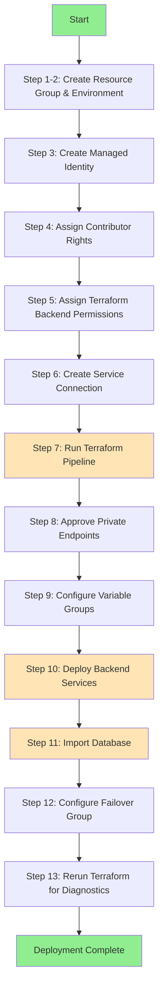

### Deployment Phases

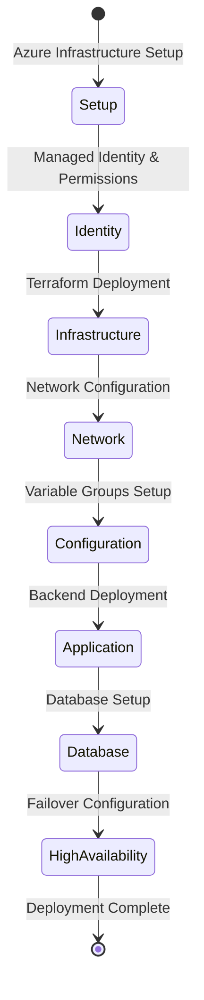

---

## Prerequisites

### Required Access and Permissions

| Requirement              | Description                                        |
| ------------------------ | -------------------------------------------------- |
| **Azure Subscription**   | Active Azure subscription with Owner role          |
| **Azure DevOps Project** | Project with administrative access                 |
| **Terraform Backend**    | Pre-configured Storage Account for Terraform state |
| **Database Backup**      | Backup file (.bacpac) for database restoration     |
| **Network Access**       | Ability to approve private endpoint connections    |

### Required Azure Roles

| Role                              | Scope                     | Purpose                                      |
| --------------------------------- | ------------------------- | -------------------------------------------- |
| **Owner**                         | Resource Group            | Required to assign roles to Managed Identity |
| **Contributor**                   | Subscription              | For resource creation and management         |
| **Storage Blob Data Contributor** | Terraform Storage Account | Access Terraform state files                 |

---

## Detailed Steps

### **Step 1: Create New Resource Group in Azure**

**Duration**: ~2 minutes

#### Purpose

Create a dedicated resource group to organize and manage all Azure resources for the environment.

#### Naming Convention

```
rg-<project>-<environment>
Example: rg-bvms-dev, rg-bvms-test, rg-bvms-prod
```

#### Instructions

1. **Navigate to Azure Portal**

   - Go to [https://portal.azure.com](https://portal.azure.com)
   - Sign in with your Azure account

2. **Create Resource Group**
   - Click "Resource groups" from the left menu
   - Click "+ Create" button
   - Fill in the details:
     - **Subscription**: Select your subscription
     - **Resource group**: Enter name (e.g., `rg-bvms-dev`)
     - **Region**: Select appropriate region
   - Click "Review + Create"
   - Click "Create"

#### Verification

✅ Resource group appears in the resource groups list  
✅ You have Owner role on the resource group

---

### **Step 2: Create Environment in Azure DevOps**

**Duration**: ~1 minute  
**Video Reference**: [00:00 - 00:50]

#### Purpose

Create an Azure DevOps environment to manage deployment targets and approvals.

#### Instructions

1. **Navigate to Azure DevOps**

   ```
   URL: https://dev.azure.com/<your-organization>/<your-project>
   ```

2. **Create Environment** [00:15 - 00:30]

   - Navigate to **Pipelines** → **Environments**
   - Click "**New environment**"
   - Enter environment details:
     - **Name**: `dev`, `test`, or `prod`
     - **Description**: (Optional) Describe the environment
     - **Resource**: Select "None"
   - Click "**Create**"

3. **Configure Security** [00:30 - 00:45]
   - Go to environment settings (three dots menu)
   - Select "**Security**"
   - Add **Project Administrators** with **Administrator** role
   - Configure approvals if needed for production environments

#### Verification

✅ Environment appears in Environments list  
✅ Security settings configured correctly  
✅ Project Administrators have access

---

### **Step 3: Create Managed Identity**

**Duration**: ~3 minutes

#### Purpose

Create a User-Assigned Managed Identity for secure authentication between Azure DevOps and Azure resources.

#### Naming Convention

```
mi-<project>-<environment>
Example: mi-bvms-dev, mi-bvms-test, mi-bvms-prod
```

#### Instructions

1. **Navigate to Managed Identities**

   - In Azure Portal, search for "Managed Identities"
   - Click "Managed Identities" service

2. **Create Identity**

   - Click "+ Create"
   - Fill in details:
     - **Subscription**: Your subscription
     - **Resource group**: Use the resource group created in Step 1
     - **Region**: Same as resource group
     - **Name**: `mi-bvms-dev` (adjust for environment)
   - Click "Review + Create"
   - Click "Create"

3. **Note the Identity Details**
   - After creation, open the Managed Identity
   - Note down:
     - **Client ID**
     - **Object (principal) ID**
     - **Resource ID**

#### Recommended Identities (as of 4.9.2025)

| Environment | Identity Name  | Purpose                      |
| ----------- | -------------- | ---------------------------- |
| Development | `mi-bvms-dev`  | Dev environment deployments  |
| Testing     | `mi-bvms-test` | Test environment deployments |
| Production  | `mi-bvms-prod` | Production deployments       |

---

### **Step 4: Assign Contributor Rights to Managed Identity**

**Duration**: ~2 minutes  
**Video Reference**: [00:00 - 01:30]

#### Purpose

Grant the Managed Identity permissions to create and manage resources within the resource group.

#### Instructions

1. **Locate Resource Group** [00:00 - 00:15]

   - Navigate to **Resource Groups**
   - Select your target resource group (e.g., `rg-bvms-dev`)

2. **Access IAM Settings** [00:15 - 00:30]

   - Click "**Access control (IAM)**" from the left menu
   - Click "+ Add" → "**Add role assignment**"

3. **Assign Contributor Role** [00:30 - 01:00]

   - **Role**: Search and select "**Contributor**"
   - Click "**Next**"
   - **Assign access to**: Select "**Managed identity**"
   - Click "+ Select members"
   - **Managed identity**: Choose "**User-assigned managed identity**"
   - Select your Managed Identity (e.g., `mi-bvms-dev`)
   - Click "**Select**"

4. **Review and Assign** [01:00 - 01:15]

   - Click "**Review + assign**"
   - Verify the configuration
   - Click "**Review + assign**" again

5. **Verify Assignment** [01:15 - 01:30]
   - Go back to "Access control (IAM)" → "Role assignments"
   - Verify that your Managed Identity appears with "Contributor" role

#### Required Account Permission

⚠️ **Important**: You must have the **Owner** role on the resource group to perform this action.

#### Verification

✅ Managed Identity appears in Role Assignments  
✅ Role is set to "Contributor"  
✅ Scope is the correct resource group

---

### **Step 5: Assign Terraform Backend Permissions**

**Duration**: ~3 minutes  
**Video Reference**: [01:30 - 03:30]

#### Purpose

Grant the Managed Identity access to read and write Terraform state files in the backend storage account.

#### Required Roles

| Role                              | Purpose                          |
| --------------------------------- | -------------------------------- |
| **Reader**                        | View storage account properties  |
| **Storage Blob Data Contributor** | Read/write Terraform state files |

#### Instructions

1. **Locate Terraform Backend Storage** [01:30 - 02:00]

   - Navigate to **Storage accounts**
   - Identify the Terraform backend storage account
   - Naming pattern: Often contains "terraform" or "tfstate"
   - Click on the storage account

2. **Assign Reader Role** [02:00 - 03:15]

   - Click "**Access control (IAM)**"
   - Click "+ Add" → "**Add role assignment**"
   - **Role**: Search and select "**Reader**" [02:15]
   - Click "**Next**"
   - **Assign access to**: "**Managed identity**"
   - Click "+ Select members"
   - **Managed identity**: "**User-assigned managed identity**"
   - Select your Managed Identity (e.g., `mi-bvms-dev`) [02:30 - 02:45]
   - Click "**Select**"
   - Click "**Review + assign**" [02:45 - 03:00]

3. **Assign Storage Blob Data Contributor Role** [03:00 - 03:15]

   - Repeat the process above:
   - Go to "**Access control (IAM)**" → "+ Add" → "**Add role assignment**"
   - **Role**: Search and select "**Storage Blob Data Contributor**"
   - Follow the same steps to assign to your Managed Identity

4. **Verify Assignments** [03:15 - 03:30]
   - Go to "Access control (IAM)" → "Role assignments"
   - Confirm both roles are assigned:
     - ✅ Reader
     - ✅ Storage Blob Data Contributor

#### Permission Matrix

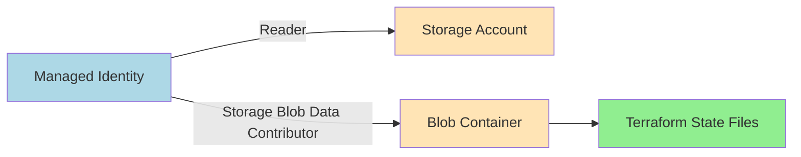

---

### **Step 6: Create Service Connection in Azure DevOps**

**Duration**: ~2 minutes  
**Video Reference**: [03:30 - 05:30]

#### Purpose

Create a service connection to allow Azure DevOps pipelines to authenticate with Azure using the Managed Identity.

#### Instructions

1. **Navigate to Service Connections** [03:30 - 03:45]

   - Go to Azure DevOps project
   - Click on **Project Settings** (bottom-left)
   - Select "**Service connections**"

2. **Create New Connection** [03:45 - 04:00]

   - Click "+ New service connection"
   - Select "**Azure Resource Manager**"
   - Click "**Next**"

3. **Configure Managed Identity Authentication** [04:00 - 04:30]

   - **Authentication method**: Select "**Managed Identity**"
   - **Subscription**: Your Azure subscription (auto-populated)
   - **Resource group**: Select the target resource group (e.g., `rg-bvms-dev`)
   - **Managed Identity**: Your identity auto-appears (e.g., `mi-bvms-dev`)

4. **Set Connection Details** [04:30 - 05:00]

   - **Service connection name**: `bvms-dev` (or appropriate name)
   - **Description**: (Optional) "Managed Identity connection for dev environment"
   - **Security**: Check "**Grant access permission to all pipelines**" (if appropriate)
   - Click "**Save**"

5. **Verification** [05:00 - 05:30]
   - The service connection should appear in the list
   - Status should show as "Ready"
   - Test the connection if needed

#### Naming Convention

```
<project>-<environment>
Example: bvms-dev, bvms-test, bvms-prod
```

#### What This Enables

This service connection allows Azure DevOps to:

- Deploy resources to the specified resource group
- Use the Managed Identity's permissions
- Access Terraform backend storage
- Authenticate securely without storing credentials

#### Architecture Diagram

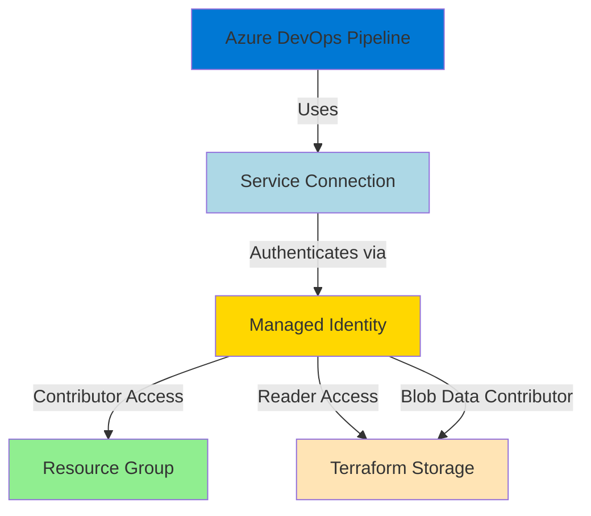

#### Reference Documentation

- [Configure Workload Identity Service Connection](https://learn.microsoft.com/en-us/azure/devops/pipelines/release/configure-workload-identity?view=azure-devops&tabs=managed-identity#set-a-workload-identity-service-connection)

---

### **Step 7: Create Infrastructure from Terraform Pipeline**

**Duration**: ~5-15 minutes (depending on resources)  
**Video Reference**: [00:00 - 01:10]

#### Purpose

Execute the Terraform pipeline to provision all required Azure infrastructure, including App Services, networking, and supporting resources.

#### ⚠️ Important Notes

- This step will **NOT** create the database
- Database creation is handled separately in later steps
- Network private endpoints will need manual approval (Step 8)

#### Instructions

1. **Navigate to Pipelines** [00:00 - 00:15]

   - Go to Azure DevOps
   - Click on "**Pipelines**"
   - Locate and select the "**Terraform Pipeline**"

2. **Run Pipeline** [00:15 - 00:45]

   - Click "**Run pipeline**" button
   - Configure parameters:
     - **Branch**: Select deployment branch (e.g., `main`, `develop`)
     - **Environment name**: Enter environment (e.g., `dev`, `test`, `prod`)
     - **Project name**: Enter project identifier
     - **Additional parameters**: As required by your pipeline

3. **Click Run** [00:45 - 01:00]

   - Review the parameters
   - Click "**Run**"
   - Pipeline execution begins

4. **Grant Permissions** [01:00 - 01:10]

   - When prompted, click "**View**"
   - Click "**Permit**" to allow pipeline access to resources
   - This allows the pipeline to use the service connection

5. **Monitor Execution**
   - Watch the pipeline stages execute
   - Typical stages:
     - Terraform Init
     - Terraform Plan
     - Terraform Apply
   - Review logs for any errors

#### Expected Resources Created

| Resource Type        | Naming Convention      | Purpose                     |
| -------------------- | ---------------------- | --------------------------- |
| App Service Plan     | `asp-<project>-<env>`  | Hosting plan for web apps   |
| App Service          | `app-<project>-<env>`  | Backend application hosting |
| Virtual Network      | `vnet-<project>-<env>` | Network isolation           |
| Subnets              | `snet-<purpose>-<env>` | Network segmentation        |
| Private Endpoints    | `pe-<service>-<env>`   | Private connectivity        |
| Key Vault            | `kv-<project>-<env>`   | Secrets management          |
| Application Insights | `appi-<project>-<env>` | Monitoring and logging      |

#### Terraform Pipeline Flow

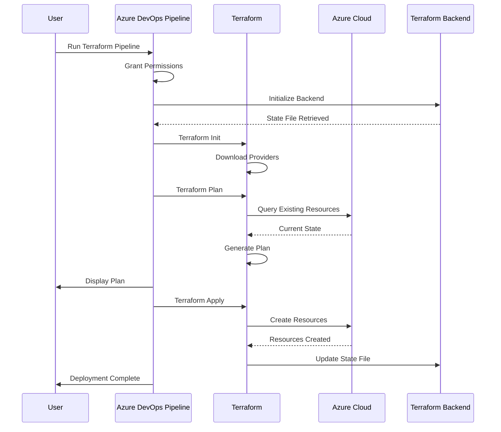

#### Troubleshooting

| Issue             | Solution                                         |
| ----------------- | ------------------------------------------------ |
| Permission denied | Ensure service connection has proper permissions |
| State lock error  | Another pipeline may be running; wait and retry  |
| Resource conflict | Check if resources already exist with same names |
| Network errors    | Verify connectivity to Azure and backend storage |

---

### **Step 8: Approve Private Endpoint Connections**

**Duration**: ~5 minutes per App Service

#### Purpose

Approve private endpoint connections to establish secure private networking between App Services and other Azure resources.

#### Background

After Terraform creates resources with private endpoints, these connections require manual approval before they become active. This security measure ensures intentional network connections.

#### Instructions

1. **Navigate to Each App Service**

   - Go to Azure Portal
   - Navigate to **App Services**
   - Open each App Service created in Step 7

2. **Access Private Endpoint Settings**

   - In the App Service, select "**Networking**" from left menu
   - Click on "**Private endpoint connections**"

3. **Review Pending Connections**

   - Look for connections with status "**Pending**"
   - Review the connection details:
     - Source (e.g., Virtual Network)
     - Target resource

4. **Approve Connection**

   - Select the pending connection
   - Click "**Approve**" button
   - Add optional approval comment
   - Confirm approval

5. **Verify Status**

   - Connection status should change to "**Approved**"
   - Wait a few moments for the connection to become active

6. **Repeat for All Services**
   - Repeat the above steps for each App Service
   - Approve all private endpoint connections

#### Services Requiring Approval

Typically include:

- ✅ Backend App Service(s)
- ✅ Frontend App Service(s) (if applicable)
- ✅ API App Service(s)
- ✅ Function Apps (if applicable)

#### Network Architecture After Approval

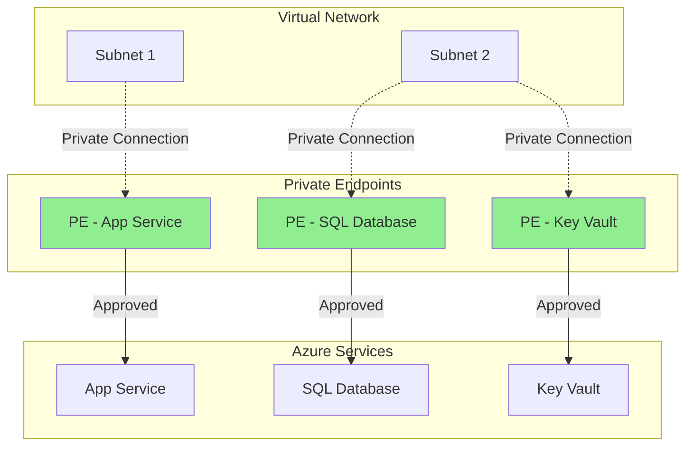

#### Reference Documentation

- [Approve Private Endpoint Connections](https://learn.microsoft.com/en-us/azure/postgresql/flexible-server/how-to-networking-servers-deployed-public-access-approve-private-endpoint?tabs=portal-approve-private-endpoint-connections)

---

### **Step 9: Create and Configure Variable Groups**

**Duration**: ~10-15 minutes  
**Video Reference**: [00:00 - 06:16]

#### Purpose

Create variable groups in Azure DevOps to store environment-specific configuration values, including database connection strings, endpoints, and application settings.

#### Overview

Variable groups centralize configuration management and allow pipelines to access environment-specific values securely.

#### Instructions

##### 9.1 Navigate to Variable Groups [00:00 - 00:30]

1. Go to Azure DevOps project
2. Navigate to **Pipelines** → **Library**
3. View existing variable groups (if any)

##### 9.2 Clone from Existing Environment [00:30 - 01:00]

If you have an existing environment (e.g., CV4 or another env):

1. Select the existing variable group to clone
2. Click "**Clone**" (three dots menu)
3. This creates a copy with all variables

**OR** Create new variable group:

1. Click "+ Variable group"
2. Enter variable group name: `<project>-<environment>-variables`

##### 9.3 Configure Database Connection String [01:00 - 03:30]

**Important**: Use **Failover Group** endpoint, not direct server connection!

1. **Get Failover Group Endpoint** [01:00 - 01:30]

   - Navigate to Azure Portal → **SQL databases**
   - Select your SQL Server
   - Go to "**Failover groups**"
   - Copy the **Listener endpoint** [01:15]
   - Format: `<failover-group-name>.database.windows.net`

2. **Construct Connection String** [01:30 - 02:00]

   ```
   Server=tcp:<failover-group-name>.database.windows.net,1433;
   Initial Catalog=<database-name>;
   User ID=<admin-username>;
   Password=<admin-password>;
   Encrypt=True;
   TrustServerCertificate=False;
   Connection Timeout=30;
   ```

3. **Get Database Details** [01:45 - 02:15]

   - **Database Name**: From SQL database resource
   - **User ID**: SQL admin username
   - **Password**: SQL admin password
     - If unknown, reset admin password [02:00 - 02:30]
     - Go to SQL Server → "Reset password"
     - Enter and confirm new password
     - Save the password securely

4. **Update Variable** [02:30 - 03:00]
   - Find variable: `DATABASE_CONNECTION_STRING` or `DB_URL`
   - Replace with new connection string
   - Mark as "Secret" if available

##### 9.4 Configure Additional Variables [03:00 - 05:00]

Update other environment-specific variables:

| Variable             | Description               | How to Find                           |
| -------------------- | ------------------------- | ------------------------------------- |
| `APP_SERVICE_NAME`   | App Service name          | Azure Portal → App Services           |
| `RESOURCE_GROUP`     | Resource group name       | From Step 1                           |
| `KEY_VAULT_URL`      | Key Vault URL             | Azure Portal → Key Vault → Properties |
| `STORAGE_CONNECTION` | Storage connection string | Storage Account → Access keys         |
| `APP_INSIGHTS_KEY`   | Application Insights key  | Application Insights → Properties     |

##### 9.5 Configure for Region 2 (if multi-region) [03:30 - 05:30]

For multi-region deployments:

1. **Clone Variable Group** [03:30 - 03:45]

   - Clone the Region 1 variable group
   - Name it: `<project>-<environment>-region2-variables`

2. **Update Region-Specific Values** [03:45 - 05:00]

   - **SignalR Endpoint**: Get from Azure Portal [04:15 - 04:45]
     - Navigate to SignalR Service (Region 2)
     - Copy endpoint URL
     - Update variable
   - **Region 2 Database Endpoint**: Use failover group endpoint
   - **Region 2 App Service**: Update app service name

3. **Save Variable Group** [05:30]

##### 9.6 Update Variable Group Names [05:45 - 06:15]

1. Edit variable group properties
2. Verify naming convention: `<project>-<environment>-[region]-variables`
3. Update description if needed
4. Click "**Save**"

#### Variable Group Structure

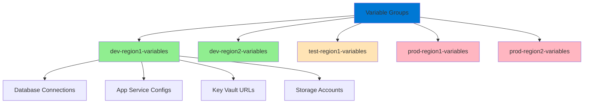

#### Best Practices

✅ **DO:**

- Use Failover Group endpoints for database connections
- Mark sensitive values as "Secret"
- Use consistent naming conventions
- Document variable purposes in descriptions
- Test connection strings before saving

❌ **DON'T:**

- Use direct database server endpoints
- Store passwords in plain text outside Azure DevOps
- Use production values in dev/test environments
- Hardcode connection strings in application code

#### Reference Documentation

- [SQL Managed Instance Failover Groups](https://docs.azure.cn/en-us/azure-sql/managed-instance/failover-group-configure-sql-mi?tabs=azure-portal%2Cazure-portal-modify%2Cazure-powershell-manage#locate-listener-endpoint)

---

### **Step 10: Deploy Backend Services**

**Duration**: ~5-10 minutes  
**Video Reference**: [00:00 - 01:52]

#### Purpose

Deploy the backend application code to Azure App Services using the Azure DevOps deployment pipeline.

#### Instructions

1. **Navigate to Pipelines** [00:00 - 00:15]

   - Go to Azure DevOps
   - Click on "**Pipelines**"
   - Select "**Deploy Backend Pipeline**"

2. **Configure Pipeline Run** [00:15 - 00:45]

   - Click "**Run pipeline**"
   - Set parameters:
     - **Branch**: Select branch (e.g., `main`, `develop`)
     - **Environment**: Enter environment name (`dev`, `test`, `prod`)
     - **Variable Group**: Select the variable group from Step 9
     - **Subscription**: Select Azure subscription
     - **Region**: If multi-region, specify region

3. **Run Pipeline** [00:45 - 01:00]

   - Review all parameters
   - Click "**Run**"

4. **Monitor Deployment** [01:00 - 01:45]

   - Watch pipeline stages execute:
     - Build stage
     - Test stage (if configured)
     - Deploy stage
   - Review logs for any errors

5. **Handle YAML Environment** [01:15 - 01:30]

   - If environment is missing in YAML, update pipeline YAML
   - Add environment reference:
     ```yaml
     environment: "dev" # or test, prod
     ```

6. **Verify Deployment** [01:45 - 01:52]
   - Check pipeline completion status: ✅ Succeeded
   - Note the deployed version/build number

#### Pipeline Stages Overview

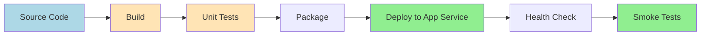

#### Deployment Flow

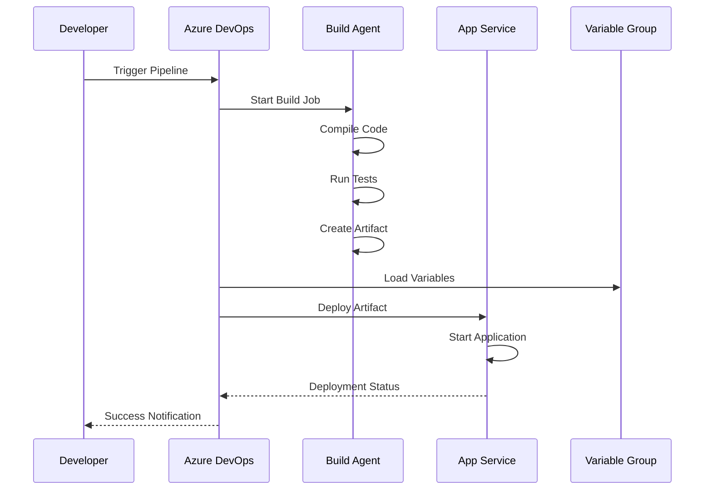

#### What Gets Deployed

| Component          | Destination  | Configuration Source |
| ------------------ | ------------ | -------------------- |
| Application Code   | App Service  | Git repository       |
| Configuration      | App Settings | Variable Group       |
| Connection Strings | App Settings | Variable Group       |
| Dependencies       | App Service  | NuGet/npm packages   |

#### Verification Steps

After deployment completes:

1. **Check App Service Status**

   - Go to Azure Portal → App Service
   - Verify status shows "Running"

2. **Review Application Logs**

   - Go to App Service → Log stream
   - Check for startup errors

3. **Test Health Endpoint**

   - Access: `https://<app-service-name>.azurewebsites.net/health`
   - Should return 200 OK

4. **Verify Environment Variables**
   - Go to App Service → Configuration
   - Check that variables from Variable Group are applied

---

### **Step 11: Import Database and Run Migrations**

**Duration**: ~10-20 minutes (depending on database size)  
**Video Reference**: [00:00 - 01:00]

#### Purpose

Import the database backup and apply Entity Framework migrations to prepare the database schema and data.

#### ⚠️ Critical Important Notes

- Use **DIRECT** database connection (NOT Failover Group endpoint)
- Connect to the **PRIMARY** server only for import
- Ensure firewall rules allow your IP address

#### Instructions

##### 11.1 Prepare Database Import [00:00 - 00:15]

1. **Locate Database Backup File**

   - File format: `.bacpac`
   - Ensure file is accessible (local or Azure Blob Storage)

2. **Get Direct Database Connection**
   - Go to Azure Portal → SQL databases
   - Select your SQL Server (not failover group)
   - Copy the **primary server** endpoint
   - Format: `<sqlserver-name>.database.windows.net`

##### 11.2 Import Database using Direct Connection [00:15 - 00:45]

**Option A: Azure Portal Import**

1. Navigate to SQL Server → "Import database"
2. Configure import:
   - **Storage account**: Select account with .bacpac file
   - **Blob container**: Select container
   - **Backup file**: Select .bacpac file
   - **Database name**: Enter target database name
   - **Pricing tier**: Select appropriate tier
   - **Admin credentials**: Enter SQL admin credentials

**Option B: SQL Server Management Studio (SSMS)**

1. Connect to database server using direct endpoint
2. Right-click "Databases" → "Import Data-tier Application"
3. Follow wizard to import .bacpac file

**Option C: Azure CLI**

```bash
az sql db import \
  --admin-password <password> \
  --admin-user <admin-user> \
  --storage-key <storage-key> \
  --storage-key-type StorageAccessKey \
  --storage-uri https://<storage-account>.blob.core.windows.net/<container>/<file>.bacpac \
  --name <database-name> \
  --server <server-name> \
  --resource-group <resource-group>
```

##### 11.3 Run Entity Framework Migrations [00:45 - 01:00]

After database import completes:

**Option A: Using Migration Scripts**

1. Generate migration script:
   ```bash
   dotnet ef migrations script --output migration.sql
   ```
2. Execute script against database

**Option B: Using EF Tools**

```bash
dotnet ef database update --connection "<connection-string>"
```

**Option C: Via Application Startup**

If your application auto-applies migrations:

- Application will run migrations on first startup
- Monitor application logs for migration execution

##### 11.4 Verify Database Import

1. **Check Database Exists**

   - Azure Portal → SQL databases
   - Verify database appears in list

2. **Verify Schema**

   - Connect to database using SSMS or Azure Data Studio
   - Check tables are present
   - Verify key tables have data

3. **Test Connection from App Service**
   - Use App Service Console or SSH
   - Test database connectivity

#### Database Import Flow

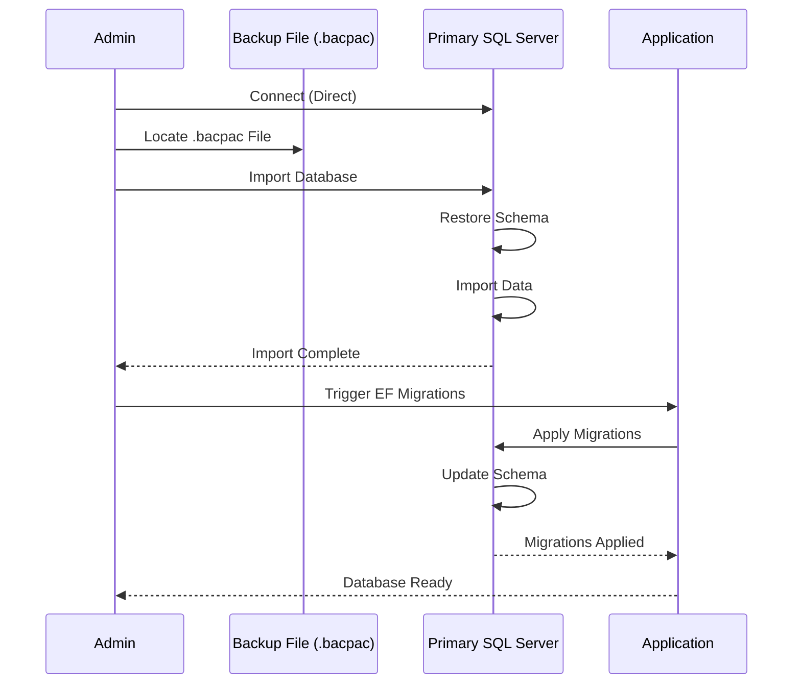

#### Connection Comparison

| Scenario            | Endpoint Type    | When to Use                           |
| ------------------- | ---------------- | ------------------------------------- |
| **Database Import** | Direct (Primary) | Import operations, direct admin tasks |
| **Migrations**      | Direct (Primary) | Schema changes, EF migrations         |
| **Application**     | Failover Group   | Normal application connectivity       |
| **Read Operations** | Failover Group   | Application queries                   |

#### Troubleshooting

| Issue                 | Solution                                                      |
| --------------------- | ------------------------------------------------------------- |
| Import timeout        | Increase timeout setting; use larger service tier temporarily |
| Connection refused    | Add your IP to SQL firewall rules                             |
| Authentication failed | Verify admin credentials are correct                          |
| Migration errors      | Check connection string; ensure schema compatibility          |
| Import fails midway   | Check storage account access; verify .bacpac integrity        |

---

### **Step 12: Add Database to Failover Group**

**Duration**: ~10-30 minutes (depending on database size)  
**Video Reference**: [01:00 - 01:57]

#### Purpose

Add the newly imported database to the failover group to enable high availability and automatic failover to the secondary region.

#### Background

Failover groups provide:

- **Automatic failover**: Automatic failover to secondary region during outages
- **Read-scale**: Distribute read operations across replicas
- **Geo-replication**: Data replicated to secondary region
- **Seamless connection**: Single endpoint for both primary and secondary

#### Instructions

1. **Navigate to Failover Group** [01:00 - 01:15]

   - Go to Azure Portal
   - Navigate to SQL Server (primary)
   - Select "**Failover groups**" from left menu
   - Click on your failover group

2. **Add Database** [01:15 - 01:30]

   - Click "**Add database**" or "+ Add"
   - In the database selection panel:
     - Check the checkbox next to your database
     - You can add multiple databases at once
   - Click "**Select**"

3. **Save Configuration** [01:30 - 01:45]

   - Click "**Save**" button
   - Azure will begin replicating the database to secondary region

4. **Monitor Replication** [01:45 - 01:57]

   - Watch the replication status
   - Initial seeding can take several minutes to hours
   - Status indicators:
     - 🔵 **Seeding**: Initial data copy in progress
     - 🟢 **Synchronized**: Replication active and current
     - 🟡 **Warning**: Replication lag detected
     - 🔴 **Error**: Replication issue

5. **Verify Addition** [01:57]
   - Scroll through failover group databases
   - Confirm your database appears in the list
   - Check both primary and secondary show the database

#### Failover Group Architecture

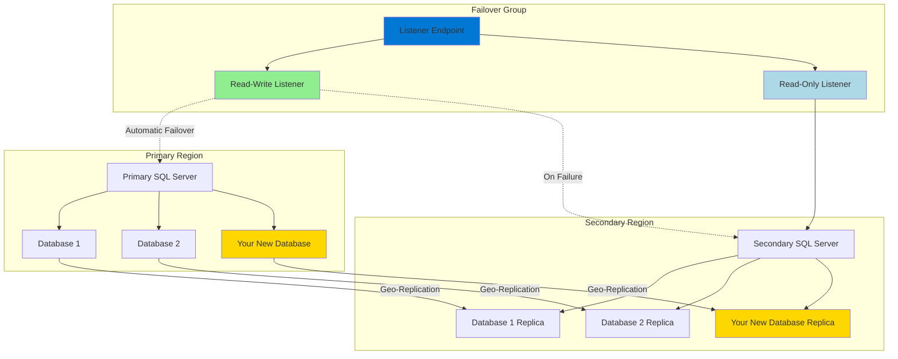

#### Replication Process

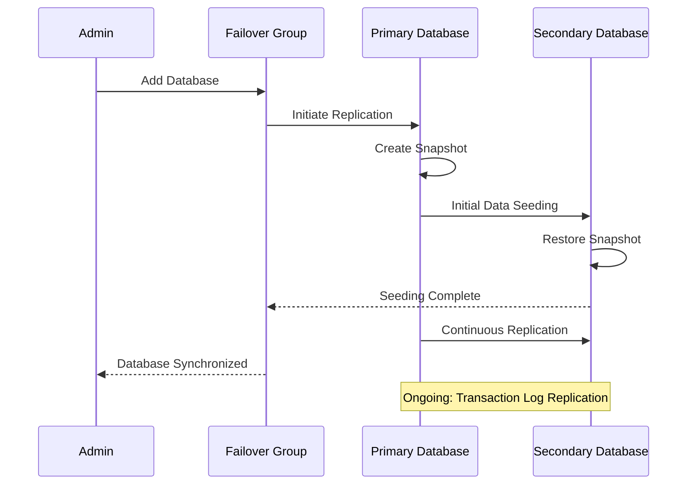

#### Replication Status Explained

| Status               | Meaning                           | Action Required                        |
| -------------------- | --------------------------------- | -------------------------------------- |
| **Seeding**          | Initial data copy in progress     | Wait (can be long for large databases) |
| **Synchronized**     | Up-to-date replica                | None - healthy state                   |
| **Replicating**      | Active replication with minor lag | Monitor - normal under load            |
| **Catch-up**         | Recovering from lag               | Monitor - may need investigation       |
| **Not synchronized** | Replication stopped               | Investigate immediately                |

#### Verification Checklist

After adding to failover group:

- [ ] Database appears in failover group database list
- [ ] Replication status shows "Synchronized"
- [ ] Secondary database exists in secondary SQL server
- [ ] Application can connect via failover group endpoint
- [ ] Test read-only endpoint connects to secondary

#### Testing Failover (Optional - Non-Production Only)

To verify failover functionality:

1. Navigate to Failover Group
2. Click "**Failover**" button
3. Confirm the failover action
4. Wait for failover to complete (1-5 minutes)
5. Verify application still works (now using secondary as primary)
6. Fail back to original primary when ready

⚠️ **Warning**: Do not test failover in production without proper planning!

#### Important Notes

- **Replication Lag**: Some lag is normal under heavy write loads
- **Cost**: Failover groups double database storage costs (primary + replica)
- **Geo-Replication**: Asynchronous replication may result in minor data loss during unplanned failover
- **Endpoint Usage**: Always use failover group endpoint in applications, never direct server names

---

### **Step 13: Rerun Terraform for Diagnostic Settings**

**Duration**: ~5 minutes  
**Status**: Not validated as of October 2, 2025

#### Purpose

Rerun the Terraform pipeline to apply diagnostic settings to both primary and secondary databases now that they exist in the failover group.

#### Background

Diagnostic settings enable:

- Database performance metrics
- Query performance insights
- Audit logging
- Integration with Log Analytics or Event Hubs

These settings must be applied after databases are added to failover groups because the secondary database doesn't exist until replication is configured.

#### Instructions

1. **Navigate to Terraform Pipeline**

   - Go to Azure DevOps → Pipelines
   - Select the Terraform pipeline

2. **Run Pipeline**

   - Click "**Run pipeline**"
   - Use same parameters as Step 7:
     - Branch
     - Environment
     - Project name
   - Click "**Run**"

3. **Monitor Execution**

   - Terraform should detect the existing resources
   - It will add/update diagnostic settings
   - No resources should be destroyed or recreated

4. **Verify Diagnostic Settings**
   - Go to Azure Portal → SQL Database (primary)
   - Select "**Diagnostic settings**" from left menu
   - Verify settings are configured
   - Repeat for secondary database

#### Expected Diagnostic Settings

| Metric/Log Category             | Purpose                     | Destination   |
| ------------------------------- | --------------------------- | ------------- |
| **SQLInsights**                 | Query performance data      | Log Analytics |
| **AutomaticTuning**             | Auto-tuning recommendations | Log Analytics |
| **QueryStoreRuntimeStatistics** | Query runtime stats         | Log Analytics |
| **Errors**                      | Database errors             | Log Analytics |
| **DatabaseWaitStatistics**      | Wait statistics             | Log Analytics |
| **Timeouts**                    | Query timeouts              | Log Analytics |
| **Blocks**                      | Blocking queries            | Log Analytics |
| **Deadlocks**                   | Deadlock information        | Log Analytics |

#### Terraform Flow for Diagnostic Settings

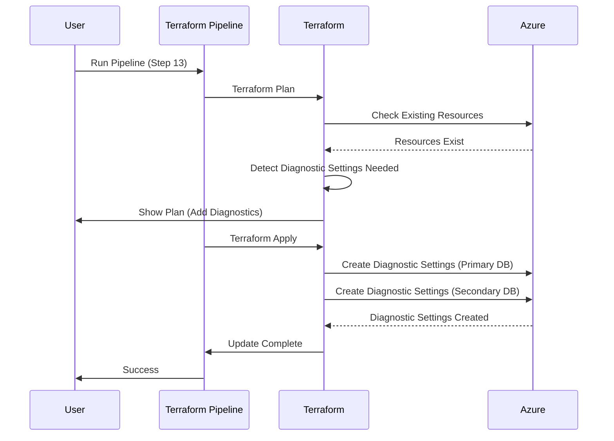

#### Verification

Check that diagnostic settings are active:

```bash
# Azure CLI example
az monitor diagnostic-settings list \
  --resource /subscriptions/<subscription-id>/resourceGroups/<rg>/providers/Microsoft.Sql/servers/<server>/databases/<database>
```

#### Alternative: Manual Configuration

If Terraform step is not available or doesn't work:

1. **For Primary Database**

   - Azure Portal → SQL Database → Diagnostic settings
   - Click "+ Add diagnostic setting"
   - Name: `diag-<database-name>`
   - Select all relevant logs and metrics
   - Destination: Log Analytics workspace
   - Save

2. **For Secondary Database**
   - Repeat the same process
   - Use same Log Analytics workspace or region-specific workspace

---

## Deployment Completion Checklist

Use this checklist to verify successful deployment:

### Azure Resources

- [ ] Resource group created and accessible
- [ ] Managed Identity created with appropriate permissions
- [ ] Service connection configured in Azure DevOps
- [ ] All infrastructure deployed via Terraform
- [ ] App Services running and healthy
- [ ] Private endpoints approved and connected
- [ ] SQL Databases created in both regions
- [ ] Failover group configured and synchronized
- [ ] Diagnostic settings enabled on databases

### Azure DevOps

- [ ] Environment created and secured
- [ ] Variable groups created for all regions
- [ ] Database connection strings use failover group endpoints
- [ ] Backend deployment pipeline executed successfully
- [ ] All pipelines have necessary permissions

### Database

- [ ] Database imported from backup
- [ ] Entity Framework migrations applied
- [ ] Database added to failover group
- [ ] Replication status: Synchronized
- [ ] Secondary database accessible

### Application

- [ ] Backend application deployed and running
- [ ] Health endpoint returning 200 OK
- [ ] Application can connect to database
- [ ] Application logs show no errors
- [ ] Environment variables configured correctly

### Testing

- [ ] Application accessible via URL
- [ ] Database read/write operations work
- [ ] Authentication/authorization functional
- [ ] API endpoints responding correctly
- [ ] Monitoring and logging active

---

## Deployment Timeline Summary

| Step | Task                            | Duration  | Can Parallelize |
| ---- | ------------------------------- | --------- | --------------- |
| 1    | Create Resource Group           | 2 min     | ✅              |
| 2    | Create Environment              | 1 min     | ✅              |
| 3    | Create Managed Identity         | 3 min     | ✅              |
| 4    | Assign Contributor Rights       | 2 min     | ❌              |
| 5    | Assign Terraform Permissions    | 3 min     | ❌              |
| 6    | Create Service Connection       | 2 min     | ❌              |
| 7    | Run Terraform Pipeline          | 10-15 min | ❌              |
| 8    | Approve Private Endpoints       | 5 min     | ✅              |
| 9    | Configure Variable Groups       | 10-15 min | ✅              |
| 10   | Deploy Backend Services         | 5-10 min  | ❌              |
| 11   | Import Database & Migrations    | 10-20 min | ❌              |
| 12   | Add to Failover Group           | 10-30 min | ❌              |
| 13   | Rerun Terraform for Diagnostics | 5 min     | ❌              |

**Total Estimated Time**: 68-113 minutes (~1-2 hours)

_Note: Actual time varies based on database size, network speed, and resource complexity._

---

## Troubleshooting

### Common Issues and Solutions

#### Permission Errors

**Symptom**: "Access denied" or "Insufficient permissions"

**Solutions**:

- Verify you have Owner role on resource group
- Check Managed Identity has correct role assignments
- Ensure service connection is using correct identity
- Review Azure DevOps pipeline permissions

#### Terraform Failures

**Symptom**: Terraform apply fails with resource conflicts

**Solutions**:

- Check if resources with same name already exist
- Verify Terraform backend state is accessible
- Ensure no other pipeline is running simultaneously
- Review Terraform state lock

#### Database Connection Issues

**Symptom**: Application cannot connect to database

**Solutions**:

- Verify using failover group endpoint (not direct server)
- Check SQL firewall rules allow App Service
- Verify connection string in variable group
- Ensure database is in failover group
- Test connection from App Service console

#### Private Endpoint Not Connecting

**Symptom**: Private endpoint remains pending or failed

**Solutions**:

- Approve the connection manually in Azure Portal
- Check virtual network configuration
- Verify subnet has correct delegations
- Ensure no network security group blocking traffic

#### Replication Not Synchronizing

**Symptom**: Secondary database stuck in "Seeding" or "Not synchronized"

**Solutions**:

- Check network connectivity between regions
- Verify sufficient DTU/vCore on both databases
- Monitor replication lag in Azure Portal
- Check for long-running transactions on primary

---

## Reference Links

### Microsoft Documentation

- [Azure DevOps Environments](https://learn.microsoft.com/en-us/azure/devops/pipelines/process/environments)
- [Managed Identity Overview](https://learn.microsoft.com/en-us/azure/active-directory/managed-identities-azure-resources/overview)
- [Configure Workload Identity Service Connection](https://learn.microsoft.com/en-us/azure/devops/pipelines/release/configure-workload-identity?view=azure-devops&tabs=managed-identity)
- [Private Endpoint Connections](https://learn.microsoft.com/en-us/azure/postgresql/flexible-server/how-to-networking-servers-deployed-public-access-approve-private-endpoint?tabs=portal-approve-private-endpoint-connections)
- [SQL Failover Groups](https://docs.microsoft.com/en-us/azure/azure-sql/database/auto-failover-group-overview)
- [Failover Group Endpoints](https://docs.azure.cn/en-us/azure-sql/managed-instance/failover-group-configure-sql-mi?tabs=azure-portal%2Cazure-portal-modify%2Cazure-powershell-manage#locate-listener-endpoint)

### Azure CLI Reference

- [Azure SQL Database Import](https://learn.microsoft.com/en-us/cli/azure/sql/db#az-sql-db-import)
- [Role Assignment Commands](https://learn.microsoft.com/en-us/cli/azure/role/assignment)
- [Diagnostic Settings](https://learn.microsoft.com/en-us/cli/azure/monitor/diagnostic-settings)

### Tools

- [Azure Portal](https://portal.azure.com)
- [Azure DevOps](https://dev.azure.com)
- [SQL Server Management Studio (SSMS)](https://learn.microsoft.com/en-us/sql/ssms/download-sql-server-management-studio-ssms)
- [Azure Data Studio](https://learn.microsoft.com/en-us/sql/azure-data-studio/download-azure-data-studio)
- [Azure CLI](https://learn.microsoft.com/en-us/cli/azure/install-azure-cli)

---

## Appendix: Video Timestamps Reference

### Video 1: Environment Creation (00:00 - 00:50)

- [00:00 - 00:15] Navigate to Azure DevOps
- [00:15 - 00:30] Create new environment
- [00:30 - 00:45] Configure security settings
- [00:45 - 00:50] Assign administrator role

### Video 2: Permissions Configuration (00:00 - 05:31)

- [00:00 - 01:30] Assign Contributor rights to Managed Identity
- [01:30 - 03:30] Assign Terraform backend permissions
- [03:30 - 05:30] Create service connection in Azure DevOps

### Video 3: Infrastructure Deployment (00:00 - 01:10)

- [00:00 - 00:15] Navigate to Terraform pipeline
- [00:15 - 00:45] Configure pipeline parameters
- [00:45 - 01:00] Run pipeline
- [01:00 - 01:10] Grant permissions

### Video 4: Variable Groups (00:00 - 06:16)

- [00:00 - 00:30] Access variable groups
- [00:30 - 03:30] Configure database connection strings
- [03:30 - 05:30] Set up multi-region variables
- [05:30 - 06:16] Save and verify configurations

### Video 5: Backend Deployment & Database (00:00 - 01:52)

- [00:00 - 00:15] Run backend deployment pipeline
- [00:15 - 01:52] Monitor deployment progress

### Video 6: Database Import & Failover (00:00 - 01:57)

- [00:00 - 00:45] Import database using direct connection
- [00:45 - 01:00] Run Entity Framework migrations
- [01:00 - 01:57] Add database to failover group

---

## Document Metadata

- **Created**: October 15, 2025
- **Last Updated**: October 15, 2025
- **Version**: 1.0
- **Transcription Source**: Whisper Large V3
- **Video Count**: 6 segments
- **Total Video Duration**: ~13 minutes

---

_This deployment guide is based on actual video demonstrations and should be treated as a living document. Update as processes evolve._
