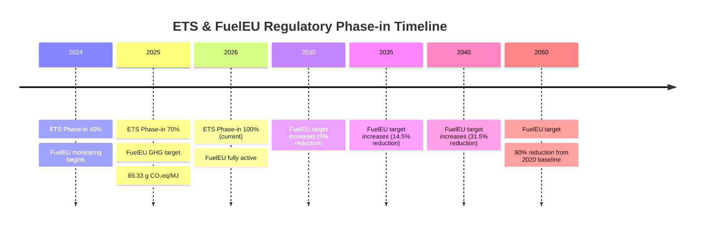
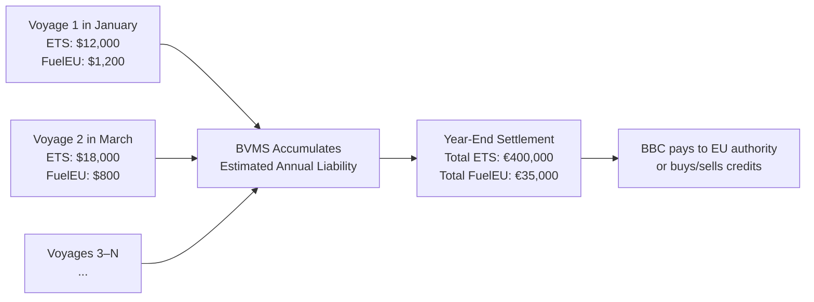
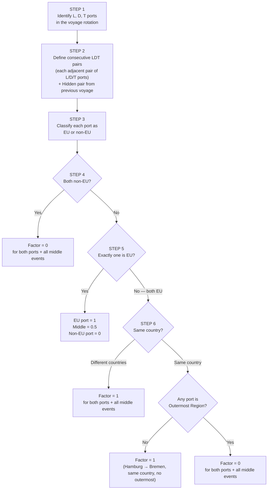
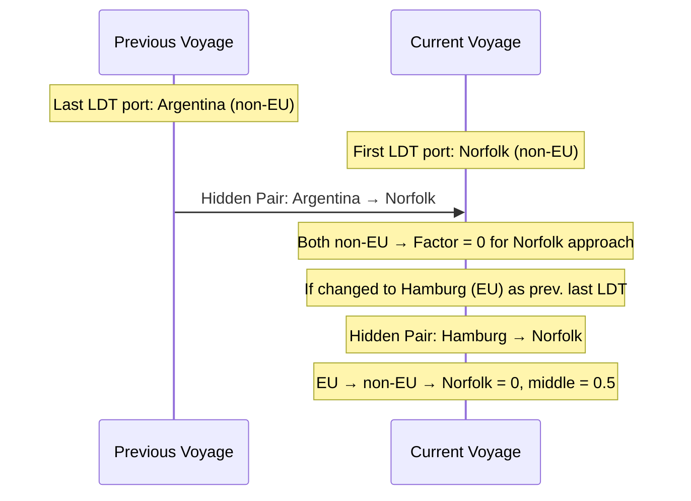
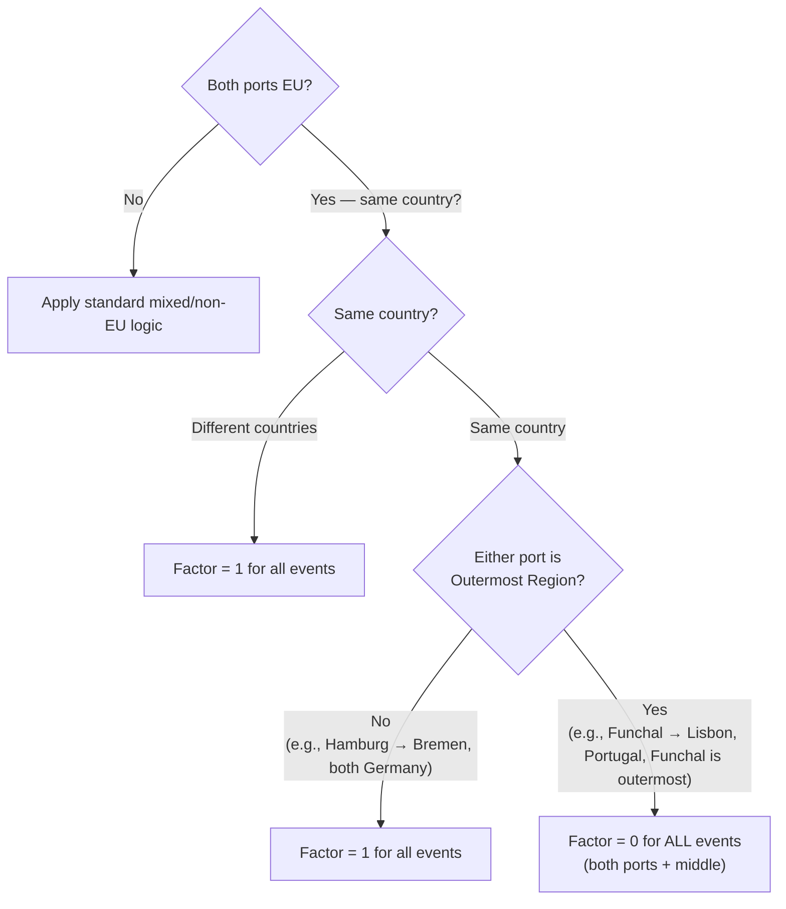
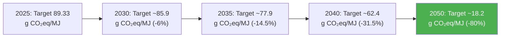
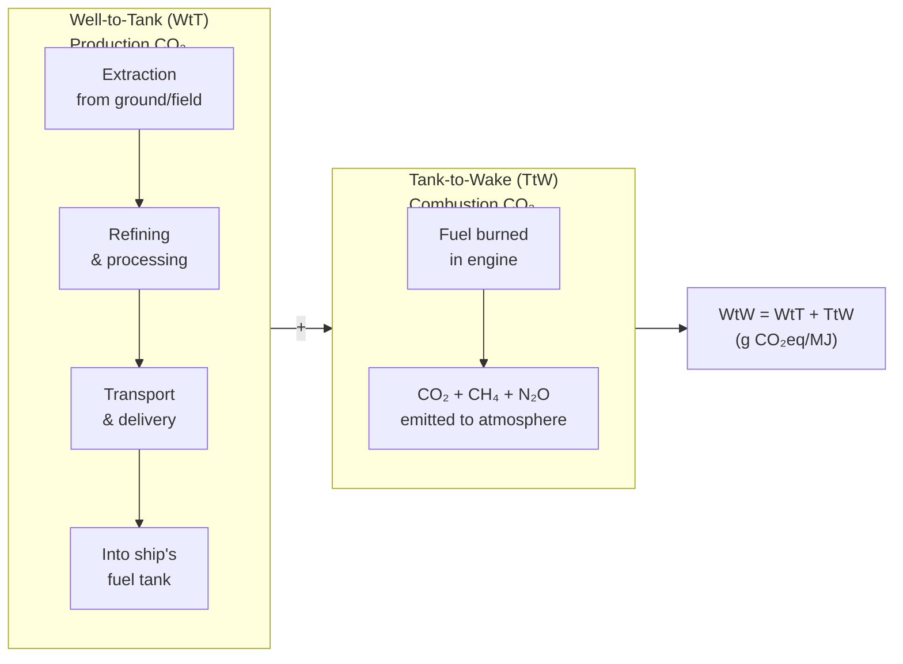
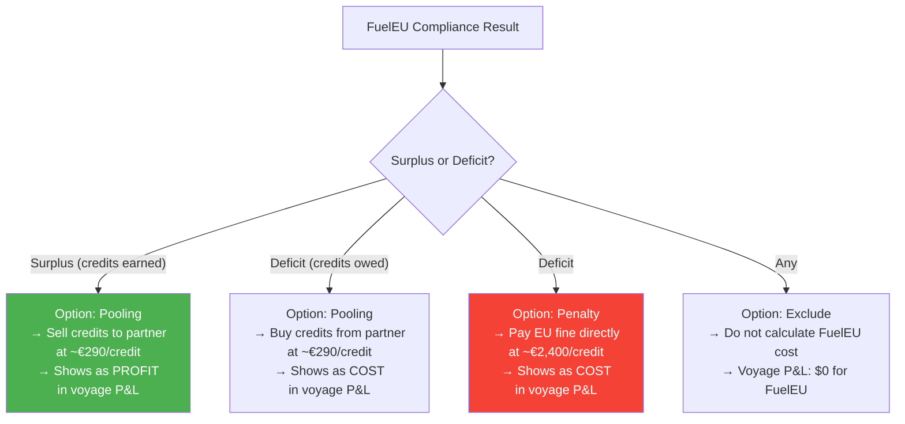
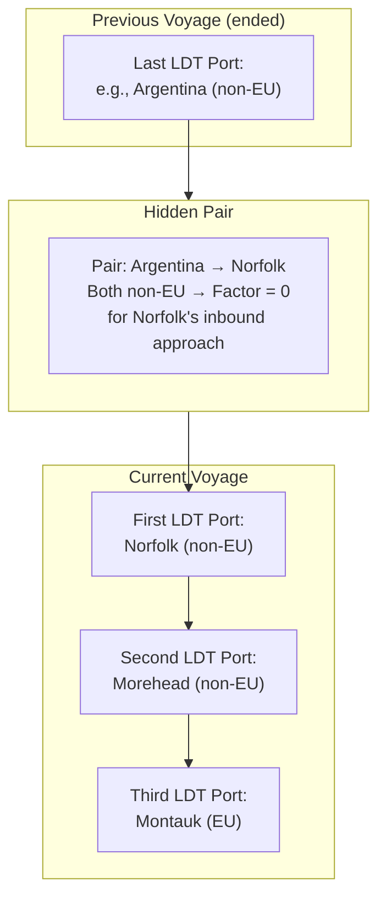
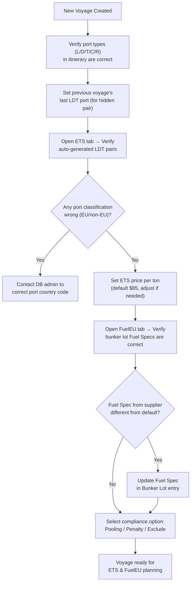

# BBC BVMS — EU ETS & FuelEU Maritime Regulation

## Complete Technical & Operational Documentation

> **Document Authority:** Synthesized from Session 3 — ETS & FuelEU Maritime — April 10, 2026  
> **Target Audience:** Operators, Developers, QA, Product Owners  
> **Version:** 1.0 — May 4, 2026

---

## Table of Contents

1. [Executive Summary](#1-executive-summary)
2. [Regulatory Overview](#2-regulatory-overview)
3. [EU ETS — Emissions Trading System](#3-eu-ets--emissions-trading-system)
4. [ETS Factor — The Port Routing Algorithm](#4-ets-factor--the-port-routing-algorithm)
5. [Outermost Regions — The Special Case](#5-outermost-regions--the-special-case)
6. [FuelEU Maritime Regulation](#6-fueleu-maritime-regulation)
7. [GHG Intensity — The Fuel Spec System](#7-ghg-intensity--the-fuel-spec-system)
8. [FuelEU Compliance & Credit System](#8-fueleu-compliance--credit-system)
9. [FuelEU Factor — Routing Logic](#9-fueleu-factor--routing-logic)
10. [Cross-Voyage & Consecutive Voyage Handling](#10-cross-voyage--consecutive-voyage-handling)
11. [Operator Configuration & Workflow](#11-operator-configuration--workflow)
12. [Business Impact Summary](#12-business-impact-summary)
13. [Glossary](#13-glossary)
14. [Revision Notes](#14-revision-notes)

---

## 1. Executive Summary

### 1.1 What Are ETS and FuelEU?

The BVMS system implements two European maritime environmental compliance frameworks:

| Regulation          | Full Name                   | What It Measures               | Who Pays             | Unit                 |
| ------------------- | --------------------------- | ------------------------------ | -------------------- | -------------------- |
| **EU ETS**          | EU Emissions Trading System | CO₂ emitted by burning fuel    | Shipowner / operator | € per ton of CO₂     |
| **FuelEU Maritime** | FuelEU Maritime Regulation  | GHG intensity of fuel consumed | Shipowner / operator | € per credit deficit |

Both apply specifically to vessels **trading with European ports**. Both are calculated **per voyage in BVMS**, but the actual **payment is annual** — BBC accumulates the liabilities over the full calendar year and settles once at year-end.

### 1.2 Why They Matter to BBC

These are not minor line items. For a single voyage leg the scale can look like:

```
Example: Morehead (US) → Montauk (EU)
  ─────────────────────────────────────────────────────────────
  196 tons fuel consumed

  Bunker Cost:   $111,000  ← traditional fuel cost
  ETS Cost:       $26,000  ← ~23% of bunker cost
  FuelEU Cost:     $2,700  ← ~2.4% of bunker cost
  ─────────────────────────────────────────────────────────────
  Total:         $139,700
```

> **If ETS or FuelEU are miscalculated, the added cost can equal the entire profit margin of the voyage.** This is why BBC requires precise voyage-level calculation in BVMS at the estimation stage.

ETS alone is typically **1/5 to 1/6 of the total bunker cost** — a magnitude that makes it a primary P&L driver alongside fuel itself.

---

## 2. Regulatory Overview

### 2.1 Policy Timeline



### 2.2 Applicability Scope

Both regulations apply based on **route and port type**:

| Route Type                                    | ETS Applies?        | FuelEU Applies?     |
| --------------------------------------------- | ------------------- | ------------------- |
| EU port → EU port (same or different country) | ✓ 100%              | ✓ 100%              |
| Non-EU port → EU port (inbound)               | ✓ 50% (journey leg) | ✓ 50% (journey leg) |
| EU port → Non-EU port (outbound)              | ✓ 50% (journey leg) | ✓ 50% (journey leg) |
| Non-EU port → Non-EU port                     | ✗ 0%                | ✗ 0%                |
| EU port → EU Outermost Region (same country)  | ✗ Special rules     | ✗ Special rules     |

> The **50% rule** means that even international voyages that merely begin or end in the EU generate some compliance cost. This is a common source of surprise for operators new to European trades.

### 2.3 Settlement Model



> BBC does not pay per voyage. Voyage-level calculations are **estimates/planning figures** used to:
>
> - Monitor per-voyage P&L accuracy
> - Plan cash reserves for the year-end settlement
> - Negotiate credit trading with partners if needed

---

## 3. EU ETS — Emissions Trading System

### 3.1 The Basic Calculation

EU ETS charges for every ton of CO₂ emitted by burning marine fuel, weighted by where that fuel was burned relative to EU ports.

**Master formula:**

$$\text{ETS Cost} = \text{Fuel Consumed (tons)} \times \text{CO}_2\text{ Factor} \times \text{Phase-in Factor} \times \text{ETS Factor} \times \text{ETS Price per ton}$$

### 3.2 CO₂ Emission Factors per Fuel Type

Each fuel type has a fixed, internationally standardized CO₂ emission coefficient:

| Fuel Type          | CO₂ Equivalent per Ton of Fuel    | Notes                                          |
| ------------------ | --------------------------------- | ---------------------------------------------- |
| **MGO / LSMGO**    | **3.206 t CO₂ / t fuel**          | Marine Gas Oil — clean, used in ECA zones      |
| **VLSFO**          | **3.114 t CO₂ / t fuel**          | Very Low Sulphur Fuel Oil — main ocean fuel    |
| **HFO / IFO**      | ~3.17 t CO₂ / t fuel              | Heavy Fuel Oil (being phased out)              |
| **Biofuels (BIO)** | **~3.09 t CO₂ / t fuel** (varies) | Varies by blend; lower than fossil equivalents |

> These factors are **fixed constants** defined by the EU and IMO. They do not change based on the supplier or oil grade. Only the fuel type category determines the factor.

### 3.3 Phase-in Factor

The Phase-in Factor was a gradual introduction mechanism for ETS in shipping:

| Year             | Phase-in Factor | Chargeable CO₂ %              |
| ---------------- | --------------- | ----------------------------- |
| 2024             | 0.40            | 40% of CO₂ is chargeable      |
| 2025             | 0.70            | 70% of CO₂ is chargeable      |
| **2026 onwards** | **1.00**        | **100% of CO₂ is chargeable** |

> **From January 1, 2026, the Phase-in Factor is permanently 1.00.** For all current-year voyages, this factor can be ignored in calculation — it contributes nothing beyond multiplying by 1.

### 3.4 ETS Price per Ton CO₂

The price per ton of CO₂ is **a configurable value** in BVMS:

- **Default value:** $85 / ton CO₂ (as of this session)
- **Historical range:** Was $90–$100+ previously; has been decreasing
- Customers may request the default to be updated to match current market rates
- Individual operators can also adjust it for a specific voyage/customer

> The ETS price fluctuates on the EU carbon market (similar to a stock price). BBC sets a working default and adjusts as needed. The customer always has the right to input a custom value for their specific planning.

### 3.5 Step-by-Step Calculation Example

```
EXAMPLE: Voyage — Morehead (US, non-EU) → Montauk (EU)
Fuel consumed: 52 tons MGO + 20 tons VLSFO

STEP 1: Calculate gross CO₂ emitted
  MGO:   52 tons × 3.206 = 166.7 tons CO₂
  VLSFO: 20 tons × 3.114 =  62.3 tons CO₂
  TOTAL:                    229.0 tons CO₂

STEP 2: Apply Phase-in Factor (2026 = 1.0)
  229.0 × 1.0 = 229.0 tons CO₂ (no change)

STEP 3: Apply ETS Factor (route-dependent — see Section 4)
  Sea leg (Morehead → Montauk): ETS Factor = 0.5 (non-EU → EU)
  Montauk in-port events:       ETS Factor = 1.0 (arrival EU)
  Morehead in-port events:      ETS Factor = 0.0 (non-EU origin)

  Sea leg: 229.0 × 0.5 = 114.5 tons CO₂ chargeable
  Montauk: allocated CO₂ × 1.0

STEP 4: Multiply by Price
  ETS Cost ≈ 114.5 tons × $85 = ~$9,700 for the sea leg
  (Plus additional for Montauk in-port CO₂ at factor 1.0)
```

---

## 4. ETS Factor — The Port Routing Algorithm

The ETS Factor (0, 0.5, or 1.0) is the most complex part of the ETS calculation. It is determined by a **6-step algorithm** applied to consecutive port pairs in the voyage rotation.

### 4.1 Why the Factor Exists

The EU ETS applies to emissions **in EU waters or between EU ports**. It would be unfair to charge 100% for a voyage that only partially overlaps with EU waters. The ETS Factor resolves this by applying proportional charges:

- **Factor = 1.0:** Fully inside EU scope — 100% of CO₂ is chargeable
- **Factor = 0.5:** Half-scope — international leg touching EU — 50% chargeable
- **Factor = 0.0:** Fully outside EU scope — 0% chargeable

### 4.2 The 6-Step Algorithm



### 4.3 What Are "L, D, T" Ports?

For ETS calculation, the voyage rotation is filtered to only **cargo-relevant ports**:

| Port Type Code | Meaning                     | ETS Relevant?                |
| -------------- | --------------------------- | ---------------------------- |
| **L**          | Loading                     | ✓ Yes — forms a pair         |
| **D**          | Discharging                 | ✓ Yes — forms a pair         |
| **T**          | Transshipment               | ✓ Yes — forms a pair         |
| **C**          | Calling (passing/bunkering) | ✗ No — not included in pairs |
| **R**          | Repair/Waiting              | ✗ No — not included in pairs |
| **B**          | Bunkering only              | ✗ No — not included          |

### 4.4 Consecutive LDT Pairs — Worked Example

**Route:** Hamburg (EU) → Norfolk (non-EU) → Morehead (non-EU) → Montauk (EU) → Gdańsk (EU)

All of Hamburg, Norfolk, Morehead, Montauk, and Gdańsk are L/D/T ports.

**Step 1:** Identify L/D/T ports: Hamburg, Norfolk, Morehead, Montauk, Gdańsk  
**Step 2:** Define pairs (each adjacent LDT pair):

- Pair A: Hamburg → Norfolk
- Pair B: Norfolk → Morehead
- Pair C: Morehead → Montauk
- Pair D: Montauk → Gdańsk

**Step 3:** Classify EU status:

- Hamburg: EU (Germany)
- Norfolk: non-EU (USA)
- Morehead: non-EU (USA)
- Montauk: EU (France or Germany — EU)
- Gdańsk: EU (Poland)

**Step 4–6:** Apply algorithm to each pair:

| Pair       | From              | To                | Classification               | ETS Factor Assignment                       |
| ---------- | ----------------- | ----------------- | ---------------------------- | ------------------------------------------- |
| **Pair A** | Hamburg (EU)      | Norfolk (non-EU)  | One EU, one non-EU           | Hamburg = 1.0, Middle = 0.5, Norfolk = 0.0  |
| **Pair B** | Norfolk (non-EU)  | Morehead (non-EU) | Both non-EU                  | All = 0.0                                   |
| **Pair C** | Morehead (non-EU) | Montauk (EU)      | One EU, one non-EU           | Morehead = 0.0, Middle = 0.5, Montauk = 1.0 |
| **Pair D** | Montauk (EU)      | Gdańsk (EU)       | Both EU, different countries | All = 1.0                                   |

**Result mapping per port:**

```
Hamburg:  ← in Pair A, it's EU departure = factor 1.0
          (but Hamburg events were in previous voyage)
Norfolk:  ← in Pair A destination = 0.0
          ← in Pair B origin = 0.0 → stays 0.0
Middle A→B (sea between Hamburg and Norfolk): 0.5
Morehead: ← in Pair B destination = 0.0
          ← in Pair C origin = 0.0 → stays 0.0
Middle B (sea Norfolk→Morehead): 0.0
Middle C (sea Morehead→Montauk): 0.5
Montauk:  ← in Pair C destination = 1.0
          ← in Pair D origin = 1.0 → stays 1.0
Gdańsk:   ← in Pair D destination = 1.0 → 1.0
Middle D (sea Montauk→Gdańsk): 1.0
```

**Visual timeline:**

```
Hamburg  ─── Sea ──►  Norfolk  ─── Sea ──►  Morehead  ─── Sea ──►  Montauk  ─── Sea ──►  Gdańsk
   1.0        0.5         0.0        0.0          0.0        0.5        1.0        1.0        1.0
(prev. voyage)                                               ↑                     ↑           ↑
                                                     First ETS charges    All EU charges    All EU
```

### 4.5 The "Always Choose Zero" Tie-Breaking Rule

When a port appears in two consecutive pairs and receives **different factor values** from each, the system **always assigns the lower value (0)**:

```
Example:  Montauk gets factor 1 from Pair C (it's the EU destination)
          But if the NEXT pair after Montauk goes to an Outermost Region,
          then Pair D would give Montauk factor 0.

Conflict: Pair C says 1.0 for Montauk
          Pair D says 0.0 for Montauk

Resolution: ALWAYS use 0.0 → factor = 0 for all Montauk events
```

### 4.6 The Hidden Pair — Previous Voyage Link

The algorithm also accounts for the **previous voyage's last cargo operation**. This creates a "hidden" pair connecting the previous voyage to the first L/D/T of the current voyage.



- **Default:** The previous port is the last C-type (calling) port in the previous voyage
- **Configurable:** Operators can manually specify which port in the previous voyage was the last cargo LDT

---

## 5. Outermost Regions — The Special Case

### 5.1 What Are EU Outermost Regions?

Outermost Regions are territories with **EU member state nationality** but located **geographically far from mainland Europe** — remnants of colonial-era annexations that chose to remain under their parent country's sovereignty.

**Example:** French Polynesia is governed under French sovereignty (EU member). However, it is located in the South Pacific — 15,000 km from France.

### 5.2 Policy Reason for ETS Exception

The EU provides an ETS exemption for voyages **to or from Outermost Regions** of the same EU country:

> _Rationale: These remote territories depend heavily on maritime shipping for essential goods. If ETS charges applied at 100% for these routes, it would economically burden these communities. The exemption encourages shipping to continue serving these ports._

### 5.3 Known EU Outermost Regions

| Country           | Outermost Region Port Codes                       | Location                                                                                |
| ----------------- | ------------------------------------------------- | --------------------------------------------------------------------------------------- |
| **France (FR)**   | `FP`, `GP`, `RE`, `MQ`, `GF`, `YT`, `PM`          | French Polynesia, Guadeloupe, Réunion, Martinique, French Guiana, Mayotte, Saint-Pierre |
| **Portugal (PT)** | `PT-ADH`, `PT-BDL`, specific Azores/Madeira codes | Azores, Madeira Islands                                                                 |
| **Spain (ES)**    | Canary Islands specific codes                     | Canary Islands                                                                          |
| **Belgium (BE)**  | `BE-ADH`, `BE-Thor`                               | Overseas territories                                                                    |

> **Database implementation:** BVMS maintains a lookup table of port codes that are classified as Outermost. When a port's code matches this table, it is flagged as `isOutermost = true`.

### 5.4 ETS Outermost Logic



**Key distinction for ETS:** If either of the two same-country EU ports is an Outermost Region → **everything becomes 0**, even the "inside EU" port.

**Verified example from session:**

- Route includes: Funchal (Portugal — Outermost/Madeira) → Lisbon (Portugal — mainland EU)
- Both are EU, same country (Portugal), Funchal is Outermost
- **Result:** Factor = 0 for Funchal, for Lisbon, and for everything in between

---

## 6. FuelEU Maritime Regulation

### 6.1 Purpose — Encouraging Green Fuel Adoption

FuelEU Maritime works differently from ETS. While ETS **taxes CO₂ emitted**, FuelEU **enforces a declining GHG intensity target** that forces ships to progressively shift toward greener fuels:



> The target is calculated as: `91.16 × (1 - reduction%)` where 91.16 is the 2020 industry GHG intensity baseline.

### 6.2 GHG Intensity Targets by Year

| Year | Reduction vs. 2020 | Target GHG Intensity |
| ---- | ------------------ | -------------------- |
| 2025 | 2%                 | 89.33 g CO₂eq/MJ     |
| 2030 | 6%                 | 85.69 g CO₂eq/MJ     |
| 2035 | 14.5%              | 77.94 g CO₂eq/MJ     |
| 2040 | 31%                | 62.90 g CO₂eq/MJ     |
| 2045 | 62%                | 34.64 g CO₂eq/MJ     |
| 2050 | 80%                | 18.23 g CO₂eq/MJ     |

### 6.3 Fuel GHG Intensity — Baseline Values

The **GHG intensity** of a fuel is measured in **grams of CO₂-equivalent emitted per megajoule of energy produced** (g CO₂eq/MJ). It accounts for the **full lifecycle** of the fuel (Well-to-Wake):

| Fuel Type                      | Default GHG Intensity (FuelEU) | Meets 2025 Target (89.33)?     |
| ------------------------------ | ------------------------------ | ------------------------------ |
| **VLSFO**                      | 91.70 g CO₂eq/MJ               | ✗ Fails (>89.33)               |
| **MGO / LSMGO**                | 90.70 g CO₂eq/MJ               | ✗ Fails (>89.33, barely)       |
| **HFO**                        | ~91.5 g CO₂eq/MJ               | ✗ Fails                        |
| **Bio-VLSFO (30% FAME blend)** | ~57–68 g CO₂eq/MJ              | ✓ Well below target            |
| **Bio-MGO (30% HVO blend)**    | ~60–75 g CO₂eq/MJ              | ✓ Below target                 |
| **Pure Biofuel (100%)**        | ~16–30 g CO₂eq/MJ              | ✓ Generates significant credit |

> **Practical implication for BBC (2025–2029):** Using only VLSFO or MGO will always **exceed the FuelEU target**, generating a compliance deficit every voyage. Ships that use purely traditional fossil fuels will accumulate penalties unless they buy credits from bio-fuel users.

---

## 7. GHG Intensity — The Fuel Spec System

### 7.1 What Is LCV?

**LCV (Lower Calorific Value)** is the energy output per unit mass of fuel burned — it's what converts "tons of fuel burned" into "total energy consumed":

| Fuel Type        | LCV (MJ/kg) | Energy Output                           |
| ---------------- | ----------- | --------------------------------------- |
| **MGO / LSMGO**  | 42.70 MJ/kg | Highest energy per kg                   |
| **VLSFO**        | 40.50 MJ/kg | Lower energy per kg                     |
| **FAME Biofuel** | 37.00 MJ/kg | Lower energy per kg (biological matter) |
| **HVO Biofuel**  | 44.00 MJ/kg | Higher energy per kg (hydrogenated)     |

> Burning 1 kg of MGO produces **42.70 MJ** of propulsive energy. Burning 1 kg of VLSFO produces only **40.50 MJ**. So burning equal weights of different fuels produces **different amounts of energy** — this affects the total energy calculation.

### 7.2 Well-to-Wake (WtW) Methodology

FuelEU requires a **full lifecycle CO₂ accounting** approach called **Well-to-Wake (WtW)**. This is more comprehensive than ETS (which uses only combustion CO₂).



**Key difference from ETS:**

| Aspect                | ETS                                     | FuelEU                                                         |
| --------------------- | --------------------------------------- | -------------------------------------------------------------- |
| **Gases counted**     | CO₂ only                                | CO₂ + CH₄ + N₂O                                                |
| **Lifecycle scope**   | Tank-to-Wake (TtW) only                 | Well-to-Wake (WtW)                                             |
| **Biofuel advantage** | Minor (biofuels emit slightly less CO₂) | Major (biofuels have negative WtT due to plant CO₂ absorption) |

> **Why biofuels are powerful for FuelEU but not ETS:** Plants absorb CO₂ from the atmosphere during growth. When the resulting biofuel is burned, it releases the same CO₂ back — which the plant had already removed. Therefore, biofuels have a **negative WtT value** (they credit CO₂ absorbed), making their overall WtW intensity very low (~57–68 g CO₂eq/MJ vs ~91 for VLSFO).

### 7.3 Fuel Spec Configuration in BVMS

Each bunker lot has an editable **Fuel Spec** (GHG intensity value) in the BVMS Bunker Lot section:

```
Bunker Lot #3 — LSMGO
  ┌─────────────────────────────────────────────────┐
  │ Fuel Spec (GHG Intensity):  89.48 g CO₂eq/MJ   │  ← editable
  │ LCV:                        42.70 MJ/kg         │  ← editable
  │ Biofuel Type:               FAME               │  ← editable
  │ Biofuel Blend %:            30%                │  ← editable
  │ CO₂ Factor (ETS):           3.206 t CO₂/t      │  ← fixed
  └─────────────────────────────────────────────────┘
```

**When to change Fuel Spec:**

- When the actual delivered fuel's specification (from the BDN — Bunker Delivery Note) shows a different GHG intensity than the default
- Fuel suppliers provide certified GHG intensity values per delivery; these can differ from defaults
- Example: VLSFO default is 91.70 but a specific supplier certifies 91.50 → operator should update the lot's Fuel Spec

> The Fuel Spec for a lot should be set at the time of the Bunker Order (when ordering the oil), and finalized when the Receival Report is entered (with actual supplier data).

### 7.4 Blended Biofuel Fuel Spec Calculation

When biofuel is a **blend** (mix of fossil + bio components), the GHG intensity is computed by weighted average:

```
Example: 30% FAME biofuel blended into VLSFO

  VLSFO component (70%):  GHG = 91.70 g CO₂eq/MJ
  FAME component (30%):   GHG = 16.39 g CO₂eq/MJ (very low — biogenic)

  Blended GHG = (0.70 × 91.70) + (0.30 × 16.39)
              = 64.19 + 4.92
              = 69.11 g CO₂eq/MJ  ← well below the 89.33 target
```

BVMS supports two biofuel blend types:

- **FAME** (Fatty Acid Methyl Ester) — made from vegetable oils/animal fats; default blend type
- **HVO** (Hydrotreated Vegetable Oil) — more refined; higher LCV; slightly different GHG profile

### 7.5 Weighted Fuel Spec When Consuming Multiple Lots

When a vessel consumes from two lots with different Fuel Specs in the **same reporting period**, the effective GHG intensity is a weighted average:

```
Event: Consumption spans transition from Lot A (exhausted) → Lot B (new)

  Lot A spec: 90.0 g CO₂eq/MJ  (7 tons used from Lot A)
  Lot B spec: 51.3 g CO₂eq/MJ  (3 tons used from Lot B)
  Total used:  10 tons

  Weighted GHG = (7/10 × 90.0) + (3/10 × 51.3)
               = 63.0 + 15.39
               = 71.0 g CO₂eq/MJ  ← blended event value

After lot A exhausted (next event):
  Only Lot B:  51.3 g CO₂eq/MJ  ← directly uses Lot B spec
```

> This is why the GHG intensity value shown per event in BVMS may change mid-voyage even if no new fuel was received — it changes at the point one lot is exhausted and consumption shifts to the next lot.

---

## 8. FuelEU Compliance & Credit System

### 8.1 The FuelEU Calculation Formula

$$\text{Compliance Balance} = (\text{Actual GHG Intensity} - \text{Target GHG Intensity}) \times \text{FuelEU Factor} \times \text{Total Energy (MJ)}$$

Where:

- **Positive result** = Compliance deficit → penalty applies
- **Negative result** = Compliance surplus → credit generated

**Example calculation:**

```
Voyage using only VLSFO (GHG = 91.70 g CO₂eq/MJ)
  Target: 89.33 g CO₂eq/MJ
  Actual: 91.70 g CO₂eq/MJ

  Fuel consumed: 10 tons MGO + 10 tons VLSFO
  Total Energy:
    MGO:   10,000 kg × 42.70 MJ/kg = 427,000 MJ = 427 GJ
    VLSFO: 10,000 kg × 40.50 MJ/kg = 405,000 MJ = 405 GJ
    Total: 832 GJ

  Weighted actual GHG ≈ 90.7 g CO₂eq/MJ

  Compliance = (90.7 - 89.33) × 1.0 × 832,000 GJ
             = 1.37 × 832,000
             = 1,139,840 grams CO₂eq deficit
             = 1.14 "credits" deficit (in FuelEU units)

  Penalty (if paying fine): 1.14 × 2,400 €/credit ≈ €2,736
```

### 8.2 Credit Unit & Pricing

| Concept                    | Description                                                | Value              |
| -------------------------- | ---------------------------------------------------------- | ------------------ |
| **1 Credit**               | = 1 GJ × 1 g CO₂eq/MJ surplus or deficit                   | Varies             |
| **Credit price (pooling)** | Market price to buy credits from another ship              | ~€290 per credit   |
| **Fine price (penalty)**   | EU fine if no credits purchased and compliance not met     | ~€2,400 per credit |
| **Credit revenue**         | Revenue from selling surplus credits (biofuel-heavy ships) | ~€290 per credit   |

> **Pooling vs Penalty:** If you have a 15.9-credit deficit, you can:
>
> - **Pool:** Buy credits at €290 = **€4,611** — the cheaper option
> - **Penalty:** Pay the fine at €2,400 = **€38,160** — very expensive
>
> The system shows both options so BBC can make an informed decision.

### 8.3 Compliance Options in BVMS

BVMS provides three compliance handling options per voyage:



**Key rules:**

- **Surplus cannot be taken as cash** — a positive credit balance cannot be converted to money. It can only be used to **offset future deficits** or **pooled (sold to partners)**
- If penalty is negative (surplus), it shows as $0, not as profit (for penalty mode)
- **Pooling at €290 is almost always better than paying the €2,400 penalty** — the difference is a 7:1 ratio

### 8.4 Credit Pooling Between Voyages / Vessels

Credits can be accumulated at the fleet level and transferred between voyages:

```
Ship A: Bio-VLSFO voyage → GHG = 57.0, generates +3.1 credits
Ship B: VLSFO-only voyage → GHG = 91.7, deficit −15.9 credits

Pooling transaction:
  Ship A sells 3.1 credits to Ship B at €290 each = €899 revenue for Ship A
  Ship B uses 3.1 credits to partially offset its −15.9 credits deficit
  Ship B remaining deficit: −12.8 credits → either buy more or pay penalty

BVMS shows:
  Ship A P&L: +€899 FuelEU credit revenue
  Ship B P&L: −€3,712 for 12.8 credits × €290
```

---

## 9. FuelEU Factor — Routing Logic

### 9.1 Overview — Similar but Different from ETS Factor

The FuelEU Factor determines what percentage of each consumption event is subject to FuelEU compliance. Like the ETS Factor, it is based on the route between consecutive L/D/T port pairs.

**Same logic as ETS for basic cases:**

- Both non-EU → Factor = 0
- One EU, one non-EU → EU port = 1, middle = 0.5, non-EU port = 0
- Both EU, different countries → Factor = 1

**Key differences for Outermost Regions:**

| Scenario                                        | ETS Factor                 | FuelEU Factor                                    |
| ----------------------------------------------- | -------------------------- | ------------------------------------------------ |
| EU mainland → EU Outermost (same country)       | All = **0**                | EU = **1**, Middle = **0.5**, Outermost = **0**  |
| EU Outermost → EU mainland (same country)       | All = **0**                | Outermost = **0**, Middle = **0.5**, EU = **1**  |
| EU Outermost → EU Outermost (same or different) | All = **0**                | All = **0**                                      |
| EU mainland A → EU mainland B → EU Outermost    | Complex; Outermost kills A | EU A = 1, EU B = 1/0 (tie-break), Middle = 0.5/0 |

### 9.2 FuelEU Outermost Logic Table

| Route Type                       | From Factor | Middle Factor | To Factor |
| -------------------------------- | ----------- | ------------- | --------- |
| EU → EU (diff. country)          | 1           | 1             | 1         |
| EU → EU (same, no outermost)     | 1           | 1             | 1         |
| EU → EU Outermost (same country) | 1           | 0.5           | 0         |
| EU Outermost → EU (same country) | 0           | 0.5           | 1         |
| EU Outermost → EU Outermost      | 0           | 0             | 0         |
| EU → non-EU                      | 1           | 0.5           | 0         |
| non-EU → EU                      | 0           | 0.5           | 1         |
| non-EU → non-EU                  | 0           | 0             | 0         |

> **Critical difference:** For ETS, going to an Outermost Region **kills** the EU factor entirely (both ports go to 0). For FuelEU, only the **Outermost port** goes to 0; the mainland EU port still gets factor 1, and the middle gets 0.5.

### 9.3 FuelEU does NOT Apply "Same Country" Outermost Restriction

For ETS, the Outermost exception only applies if the Outermost port is from the **same country** as the other EU port.

For FuelEU, **the Outermost destination is always factor 0**, regardless of which country it belongs to:

```
ETS Logic:
  FR-mainland → FR-outermost (same country) → both = 0 ✓
  FR-mainland → PT-outermost (diff. country) → both = 1 (not outermost exception)

FuelEU Logic:
  FR-mainland → FR-outermost → FR=1, middle=0.5, outermost=0 ✓
  FR-mainland → PT-outermost → FR=1, middle=0.5, outermost=0 ✓ (same treatment)
```

---

## 10. Cross-Voyage & Consecutive Voyage Handling

### 10.1 The Hidden Pair — Linking Previous Voyage

When a vessel operates consecutive voyages, the **ETS/FuelEU calculation for the current voyage** can be influenced by where the **previous voyage ended**:



**Configuring the previous voyage link:**

- BVMS allows the operator to specify the last LDT port of the previous voyage
- Default: the last C-type (calling) port before the current voyage starts
- This is editable in the ETS/FuelEU settings tab of the voyage

### 10.2 Repair/Waiting Ports (R type) — Not Counted as LDT

If a vessel calls at a Repair (R) or Waiting port in between cargo ports, it does **not** break the consecutive pair:

```
Route: Lisbon (EU) → [Repair port — R type] → Morehead (non-EU)

  The repair port is ignored for pair-building.
  Pair is still: Lisbon → Morehead (EU → non-EU)

  Result:
    Lisbon events: Factor = 1
    Repair port events: Factor = 0.5 (it's in the "middle" of Lisbon → Morehead)
    Morehead events: Factor = 0
```

> **Edge case:** What if a repair port appears **at the very end** of a voyage, with no subsequent L/D/T port? The system cannot determine where the next leg goes, so all events after the last LDT get Factor = 0 by default.

### 10.3 Phase-in Factor for Voyages Spanning Calendar Years

If a voyage spans a year boundary (e.g., starts in October 2025, ends in May 2026):

- The Phase-in factor for each event is determined by the **date of that event**
- Events in 2025: Phase-in = 0.70
- Events in 2026: Phase-in = 1.00

```
Example: October 2025 → May 2026 voyage
  Oct–Dec 2025 segment:  CO₂ × 0.70 × ETS Factor
  Jan–May 2026 segment:  CO₂ × 1.00 × ETS Factor

  BVMS calculates a weighted average Phase-in factor
  based on the proportion of voyage time in each year.
```

---

## 11. Operator Configuration & Workflow

### 11.1 ETS/FuelEU Setup Checklist per Voyage



### 11.2 ETS Configurable Parameters

| Parameter               | Who Can Change    | Default       | Notes                                     |
| ----------------------- | ----------------- | ------------- | ----------------------------------------- |
| **ETS Price**           | Operator          | $85/ton CO₂   | Configurable per voyage or globally       |
| **Phase-in Factor**     | System-controlled | 1.0 (2026+)   | Auto-set based on voyage year             |
| **ETS Factor**          | System-calculated | Per algorithm | Cannot be overridden; driven by port data |
| **CO₂ Emission Factor** | System-controlled | Per fuel type | Fixed by regulation; not editable         |
| **Previous Voyage LDT** | Operator          | Last C port   | Configure for accurate hidden pair        |

### 11.3 FuelEU Configurable Parameters

| Parameter                     | Who Can Change     | Default       | Notes                                        |
| ----------------------------- | ------------------ | ------------- | -------------------------------------------- |
| **GHG Target**                | System-controlled  | 89.33 (2025)  | Updated annually per regulation              |
| **Fuel Spec (GHG intensity)** | Operator (per lot) | Per fuel type | Change to match actual BDN                   |
| **LCV**                       | Operator (per lot) | Per fuel type | Change if supplier certifies different value |
| **Biofuel type**              | Operator           | FAME          | Can change to HVO                            |
| **Biofuel blend %**           | Operator           | 30%           | As per actual blend purchased                |
| **Compliance mode**           | Operator           | Pooling       | Choose Pooling / Penalty / Exclude           |
| **Credit price (pooling)**    | Operator           | €290/credit   | Adjust to agreed trading price with partner  |

### 11.4 Reading the ETS/FuelEU Event Table

The ETS and FuelEU tabs in BVMS display every voyage event with its compliance values:

| Column                  | Description                                           |
| ----------------------- | ----------------------------------------------------- |
| **Event**               | Voyage event (e.g., Sea Laden, Berth, Maneuvering In) |
| **Fuel Type**           | The fuel consumed in this event                       |
| **Consumption (tons)**  | How many tons of fuel in this event                   |
| **CO₂ Equivalent**      | CO₂ emitted (for ETS column)                          |
| **ETS / FuelEU Factor** | 0, 0.5, or 1.0 — determined by routing algorithm      |
| **Phase-in Factor**     | 1.0 for 2026 voyages                                  |
| **Chargeable CO₂**      | CO₂ × Phase-in × ETS Factor                           |
| **ETS Cost**            | Chargeable CO₂ × ETS Price                            |

> Events with Factor = 0 show $0 cost. Only events with Factor > 0 contribute to the ETS/FuelEU bill.

---

## 12. Business Impact Summary

### 12.1 Cost Scale Reference

| Voyage Type                    | Typical ETS Cost  | As % of Bunker Cost | FuelEU Cost              |
| ------------------------------ | ----------------- | ------------------- | ------------------------ |
| Non-EU → Non-EU                | $0                | 0%                  | $0                       |
| Non-EU → EU (or EU → non-EU)   | ~15–25% of bunker | ~15–20%             | Small (only 50% of legs) |
| EU → EU (same country)         | ~20–30% of bunker | ~20–25%             | Significant              |
| EU → EU (intra-EU heavy trade) | ~25–30% of bunker | ~25–30%             | Can equal ETS cost       |

### 12.2 Why BBC Prioritizes ETS Accuracy

```
Scenario: Charter Party agreed at $500,000 revenue
  Expected profit:   $25,000  (5% margin)

  Estimated ETS:     $20,000  ← part of P&L plan
  Actual ETS billed: $28,000  ← $8,000 more than planned

  Result:
  Expected profit:  $25,000
  ETS overrun:     −$8,000
  Actual profit:   $17,000  ← 32% less than expected
```

> A single ETS miscalculation of $8,000 can eliminate 32% of a voyage's profit. This is why BBC requires BVMS to calculate ETS/FuelEU at the voyage estimation stage — not just as an afterthought.

### 12.3 The Credit Economy

Some companies have built entire businesses around ETS/FuelEU credit management:


> Some companies in Germany operate **solely as credit brokers** — they aggregate surplus FuelEU credits from bio-fuel vessels and sell them to conventional fuel vessels. This is a fully recognized business model under FuelEU Maritime.

---

## 13. Glossary

| Term                 | Full Name                             | Definition                                                                                  |
| -------------------- | ------------------------------------- | ------------------------------------------------------------------------------------------- |
| **ETS**              | Emissions Trading System              | EU regulation requiring companies to pay for CO₂ emissions via tradeable allowances         |
| **FuelEU**           | FuelEU Maritime Regulation            | EU regulation requiring ships to meet declining GHG intensity targets                       |
| **CO₂ Factor**       | CO₂ Emission Factor                   | Fixed ratio of CO₂ emitted per ton of fuel burned; set by regulation per fuel type          |
| **Phase-in Factor**  | ETS Phase-in Multiplier               | Gradual escalation factor for ETS: 0.40 (2024), 0.70 (2025), 1.00 (2026+)                   |
| **ETS Factor**       | ETS Route Factor                      | 0 / 0.5 / 1.0 — determines what % of CO₂ is chargeable, based on port routing               |
| **FuelEU Factor**    | FuelEU Route Factor                   | Same 0 / 0.5 / 1.0 concept for FuelEU; slightly different Outermost logic                   |
| **LDT Port**         | Loading / Discharging / Transshipment | Port types that form the consecutive pairs for ETS/FuelEU calculations                      |
| **Hidden Pair**      | Previous Voyage Linkage Pair          | The ETS pair connecting the previous voyage's last LDT to the current voyage's first LDT    |
| **Outermost Region** | EU Outermost Region                   | EU member territory located far from mainland Europe; ETS-exempt for intra-country EU trips |
| **GHG Intensity**    | GHG Intensity Index                   | Grams of CO₂-equivalent per megajoule of energy; the FuelEU performance metric              |
| **LCV**              | Lower Calorific Value                 | Energy output per kilogram of fuel burned (MJ/kg); used to convert fuel mass to energy      |
| **WtW**              | Well-to-Wake                          | Full lifecycle CO₂ accounting from fuel extraction to propulsion                            |
| **WtT**              | Well-to-Tank                          | CO₂ emitted during fuel extraction, refining, and delivery                                  |
| **TtW**              | Tank-to-Wake                          | CO₂ emitted from burning the fuel in the engine                                             |
| **FAME**             | Fatty Acid Methyl Ester               | Type of biodiesel made from vegetable oils; default biofuel blend component                 |
| **HVO**              | Hydrotreated Vegetable Oil            | Refined biofuel with higher LCV and cleaner combustion than FAME                            |
| **Credit**           | FuelEU Compliance Unit                | Surplus GHG compliance unit that can offset deficits or be sold via pooling                 |
| **Pooling**          | FuelEU Credit Trading                 | Buying/selling compliance credits between ships/companies; ~€290/credit market rate         |
| **Penalty**          | FuelEU Direct Fine                    | Paying the EU fine for non-compliance instead of buying credits; ~€2,400/credit             |
| **Fuel Spec**        | Fuel Specification (GHG Intensity)    | Per-lot GHG intensity value sourced from Bunker Delivery Note; configurable in BVMS         |

---

## 14. Revision Notes

### Section Review Summary

| Section                     | Source                  | Confidence | Key Details                                          |
| --------------------------- | ----------------------- | ---------- | ---------------------------------------------------- |
| Executive Summary           | Session 3 (0:01–2:14)   | High       | Cost scale: ETS = 1/5–1/6 of bunker, FuelEU smaller  |
| Regulatory Overview         | Session 3 (6:30–7:50)   | High       | Phase-in schedule confirmed; 2026 = 100%             |
| ETS Calculation             | Session 3 (4:00–9:10)   | High       | CO₂ factors, formula steps, price default $85        |
| ETS Factor Algorithm        | Session 3 (9:30–24:25)  | High       | 6-step algorithm; L/D/T pairs; outermost logic       |
| Outermost Regions           | Session 3 (20:00–26:00) | High       | France FP, Portugal, Belgium; exemption rationale    |
| FuelEU Overview             | Session 3 (47:30–52:50) | High       | GHG target 89.33; 2020 baseline 91.16                |
| LCV & Well-to-Wake          | Session 3 (53:00–77:30) | High       | LCV table; WtT/TtW explanation                       |
| Credit System               | Session 3 (57:00–63:00) | High       | €290 pooling vs €2,400 penalty confirmed             |
| FuelEU Factor vs ETS Factor | Session 3 (83:30–85:50) | High       | Outermost behaves differently between ETS and FuelEU |
| Cross-Voyage / Phase-in     | Session 3 (91:30–92:50) | Medium     | Weighted average for year-boundary voyages           |

---

### Known Limitations & Open Questions

| Item                                     | Status               | Notes                                                                              |
| ---------------------------------------- | -------------------- | ---------------------------------------------------------------------------------- |
| Credit module for fleet-level monitoring | Future work          | Customer acknowledged it's complex; no current implementation plan                 |
| Repair (R) type ports mid-route          | Design discussed     | R ports are "in the middle" and inherit 0.5 if between EU ports                    |
| Last voyage LDT has no next voyage       | Known gap            | If last port is L/D/T with no following voyage → events after that port = Factor 0 |
| FuelEU target progression                | Policy-dependent     | Targets after 2030 are defined in regulation but system should auto-update         |
| Biofuel spec from Receival vs Order      | Clarification needed | The GHG intensity should be from the actual BDN (Bunker Delivery Note) at receival |
| ETS price default update process         | Process gap          | When market price changes, who updates the system default and when?                |

---

### Document Version History

| Version | Date        | Changes                                               |
| ------- | ----------- | ----------------------------------------------------- |
| 1.0     | May 4, 2026 | Initial documentation from Session 3 (April 10, 2026) |

---

_Source session: "Session 3 ETS & FuelEU — April 10, 2026"_  
_For questions, corrections, or additions, contact the BVMS Operations & Development Team._
