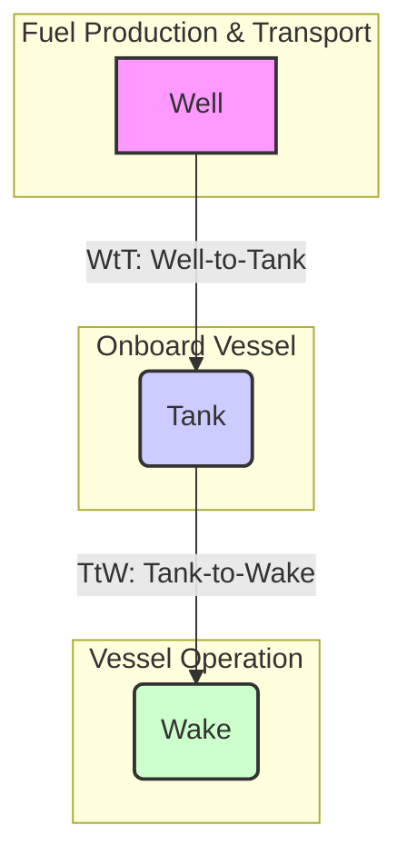

# An Educational Guide to the FuelEU Maritime Regulation

This document provides a comprehensive overview of the FuelEU Maritime regulation, transforming the key concepts from the source video into a structured and enriched educational resource. It is designed to be a standalone guide for understanding the regulation's mechanics, implications, and compliance strategies.

## 1. Introduction to FuelEU Maritime

FuelEU Maritime is a key component of the European Union's **"Fit for 55"** legislative package, aimed at reducing the EU's net greenhouse gas emissions by at least 55% by 2030. The regulation's primary goal is to stimulate the uptake of renewable and low-carbon fuels in the shipping sector by setting progressively stricter limits on the annual greenhouse gas (GHG) intensity of the energy used by ships.

### FuelEU Maritime vs. EU Emissions Trading System (ETS)

It's crucial to distinguish FuelEU Maritime from the EU ETS, as they target different aspects of maritime emissions:

| Feature               | **FuelEU Maritime**                                                                              | **EU Emissions Trading System (ETS)**                                                                        |
| :-------------------- | :----------------------------------------------------------------------------------------------- | :----------------------------------------------------------------------------------------------------------- |
| **What it Regulates** | The **GHG intensity** of the energy used on board (gCO2eq/MJ).                                   | The **absolute volume** of CO2 emissions (tonnes of CO2).                                                    |
| **Mechanism**         | A performance standard with compliance balances and penalties for exceeding the intensity limit. | A "cap and trade" system where companies must surrender emission allowances for each tonne of CO2 they emit. |
| **Primary Goal**      | To drive the adoption of cleaner fuels and energy sources.                                       | To put a direct price on carbon emissions, making pollution more expensive.                                  |

**[00:45]** The video introduces this distinction, explaining that while ETS focuses on the direct amount of CO2, FuelEU considers the entire lifecycle emissions of the fuel.

## 2. Core Concepts of GHG Emissions in Shipping

To understand FuelEU, one must be familiar with how fuel emissions are measured throughout their lifecycle. This is known as the **Well-to-Wake (WtW)** approach.



- **Well-to-Tank (WtT) Emissions**: **[02:00]** These are the "upstream" emissions generated during the extraction, production, and transportation of the fuel before it even reaches the vessel's tank.
- **Tank-to-Wake (TtW) Emissions**: **[02:45]** These are the "downstream" emissions produced when the fuel is burned on board the vessel to generate energy. This includes not just CO2 but also methane (CH4) and nitrous oxide (N2O), which are converted into CO2 equivalents (CO2eq).
- **Well-to-Wake (WtW) Emissions**: This is the sum of WtT and TtW emissions, representing the total GHG impact of the fuel. FuelEU Maritime uses this WtW GHG intensity for its calculations.

### Key Metrics in FuelEU Calculations

**[01:30]** The regulation relies on several key values to determine a fuel's GHG intensity:

- **Lower Calorific Value (LCV)**: The amount of energy released when a specific mass of fuel (e.g., one gram) is burned. It is typically measured in Megajoules per gram (MJ/g).
- **GHG Emission Factors (WtT and TtW)**: These values quantify the grams of CO2, CH4, and N2O emitted per unit of energy (MJ). These are standardized values that differ for each fuel type.

The final GHG intensity is calculated in **grams of CO2 equivalent per Megajoule (gCO2eq/MJ)**.

## 3. How FuelEU Maritime Works: The Calculation

The core of the regulation is a comparison between the GHG intensity of the energy a vessel uses and a legally mandated target that becomes stricter over time.

### Step 1: Calculate Energy Consumption in Scope

The total energy consumed during a voyage is adjusted based on where it was used. Similar to EU ETS, the scope is:

- **100%** of energy for voyages between EU ports.
- **50%** of energy for voyages starting or ending at an EU port.

The formula for the total energy in scope ($E_{total}$) is:

$$ E*{total} = (M*{in_EU} \times LCV*{fuel}) + 0.5 \times (M*{out_EU} \times LCV\_{fuel}) $$

Where:

- $M_{in\_EU}$ is the mass of fuel burned within the EU.
- $M_{out\_EU}$ is the mass of fuel burned outside the EU.
- $LCV_{fuel}$ is the Lower Calorific Value of the fuel.

**[04:15]** The video provides an example: a vessel burns 2,000 tonnes in the EU and 8,000 tonnes outside. The energy in scope is calculated based on `(2000 * 100%) + (8000 * 50%) = 6000` equivalent tonnes.

### Step 2: Calculate the Vessel's Average GHG Intensity

The vessel's actual GHG intensity ($GHG_{actual}$) is the weighted average of the WtW intensity of all fuels consumed.

$$ GHG*{actual} = \frac{\sum (E*{fuel_i} \times WtW*{fuel_i})}{E*{total}} $$

Where:

- $E_{fuel\_i}$ is the energy consumed from fuel _i_.
- $WtW_{fuel\_i}$ is the Well-to-Wake GHG intensity factor for fuel _i_.

**[15:30]** When multiple fuels are used (e.g., a fossil fuel and a biofuel), their respective energy contributions and GHG factors are used to find this average.

### Step 3: Calculate the Compliance Balance

The compliance balance is the difference between the regulatory GHG intensity target and the vessel's actual performance, multiplied by the total energy consumed.

$$ \text{Compliance Balance} = (GHG*{target} - GHG*{actual}) \times E\_{total} $$

- **Positive Balance (Surplus)**: **[09:30]** The vessel performed better than the target (lower GHG intensity). This surplus can be "banked" for future use or sold to other ships.
- **Negative Balance (Deficit)**: **[05:45]** The vessel performed worse than the target. This deficit must be settled, either by using a banked surplus from previous years or by paying a penalty.

**[05:15]** The video explains that for 2025, the target is a 2% reduction from the 2020 baseline of 91.16 gCO2eq/MJ, resulting in a target of approximately **89.34 gCO2eq/MJ**. A vessel using only conventional fossil fuel (e.g., MGO with an intensity of ~90.7 gCO2eq/MJ) will immediately have a compliance deficit.

## 4. Compliance and Penalties

At the end of a monitoring period (a calendar year), each ship's compliance balance is calculated.

- **Pooling**: **[06:15]** Companies can pool the compliance balances of multiple vessels. A ship with a surplus can offset a ship with a deficit within the same company's pool, optimizing compliance across a fleet.
- **Penalties**: **[06:30]** If a ship (or a pool) has a net deficit at the end of the year, a penalty must be paid. The penalty is calculated based on the size of the deficit and is designed to be dissuasive, encouraging investment in cleaner technologies over simply paying the fine.

## 5. Strategies for Decarbonization and Compliance

The regulation is designed to make alternative fuels and technologies more economically attractive.

### A. Alternative Fuels

- **Biofuels (e.g., HVO)**: **[11:15]** Biofuels often have a very low or even negative Well-to-Tank (WtT) emission factor because the biomass (e.g., plants) absorbs CO2 during its growth. This results in a significantly lower overall WtW intensity, making them a powerful tool for compliance.
- **Fossil LNG**: **[10:15]** While still a fossil fuel, LNG can have a lower GHG intensity than traditional marine fuels, offering a compliance advantage, though its availability and cost are considerations.

### B. Special Rule: Prioritizing Biofuel Allocation

**[14:00]** A key provision in the regulation allows for the energy from biofuels to be preferentially allocated to the 100% (intra-EU) portion of a voyage, even if it was physically consumed in the 50% (extra-EU) portion. This maximizes the compliance benefit of the biofuel, as its low-carbon properties are fully accounted for where the emissions factor is highest.

### C. Energy Saving Technologies

- **Wind-Assisted Propulsion**: **[09:15]** Technologies like rotor sails or kites reduce the amount of fuel needed to achieve the same transport work. By lowering the total energy consumed ($E_{total}$), they directly reduce the magnitude of any potential compliance deficit.

## 6. Practical Example: The Power of Blending

**[17:30]** The video discusses a practical scenario: achieving a "net-zero" compliance balance by blending biofuel with traditional fossil fuel. This process involves a clear trade-off between operational costs and regulatory penalties.

```mermaid
graph TD
    subgraph "Initial State"
        A[Voyage with 100% Fossil Fuel] --> B{Compliance Deficit (-)};
    end
    subgraph "Action"
        C("Click 'Comply to Zero'") --> D[Calculate Required Biofuel];
    end
    subgraph "Financial Outcome"
        E[Substitute Fossil Fuel with Biofuel] --> F{Compliance Balance = 0};
        E --> G[Bunker Costs Increase];
        E --> H[ETS Costs Decrease];
    end

    B --> C;
    F & G & H --> I((New Voyage P&L));
```

The workflow is as follows:

1.  **Initial State**: A voyage using only MGO results in a negative compliance balance (a deficit).
2.  **Action**: **[18:00]** The system calculates the precise amount of MGO to replace with a biofuel (like Bio-MGO) to neutralize the compliance balance to zero.
3.  **Economic Impact**:
    - **FuelEU Penalty**: Avoided entirely.
    - **Bunker Costs**: **[18:45]** Increase due to the higher price of biofuels.
    - **ETS Costs**: **[19:45]** Decrease because biofuels are often zero-rated under the EU ETS.

This allows for a clear financial analysis of the decision to decarbonize, balancing higher fuel costs against savings from avoided penalties.

---

_This document is based on the transcription of the provided video. Timestamps ([MM:SS]) refer to the relevant segments in the source recording._
