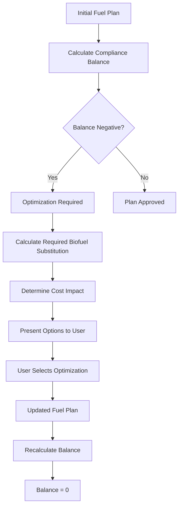

# FuelEU Maritime Regulation: Implementation Guide

## Executive Summary

FuelEU Maritime is a European Union regulation that implements a penalty system for vessels based on their CO2 emissions per megajoule of energy generated. Unlike the Emissions Trading System (ETS) which directly calculates CO2 emissions from fuel consumption, FuelEU Maritime focuses on the greenhouse gas intensity of energy use throughout the entire fuel lifecycle - from extraction to combustion.

This document provides a comprehensive overview of the FuelEU Maritime calculation methodology, compliance mechanisms, and implementation strategies for vessel management systems.

## Table of Contents

1. [Overview and Purpose](#overview-and-purpose)
2. [Key Parameters and Definitions](#key-parameters-and-definitions)
3. [Calculation Methodology](#calculation-methodology)
4. [Compliance Scenarios](#compliance-scenarios)
5. [Implementation Framework](#implementation-framework)
6. [Cost Impact Analysis](#cost-impact-analysis)

---

## 1. Overview and Purpose

### 1.1 Regulatory Context

FuelEU Maritime represents a complementary approach to existing emission control mechanisms:

- **ETS (Emissions Trading System)**: Calculates penalties based on total CO2 emissions during voyages
- **FuelEU Maritime**: Focuses on CO2 equivalent per megajoule of energy, considering the complete fuel lifecycle

### 1.2 Core Objectives

- Reduce greenhouse gas intensity of maritime fuel consumption
- Encourage adoption of alternative and renewable fuels
- Establish a compliance framework that allows vessel pooling
- Create economic incentives for cleaner fuel technologies

### 1.3 Compliance Timeline

| Year | Target (g CO2 eq/MJ) | Reduction from Baseline |
| ---- | -------------------- | ----------------------- |
| 2025 | 89.3                 | 2%                      |
| 2030 | TBD                  | Progressive reduction   |
| 2035 | TBD                  | Progressive reduction   |
| 2050 | TBD                  | Significant reduction   |

---

## 2. Key Parameters and Definitions

### 2.1 Lower Calorific Value (LCV)

**Definition**: The total amount of energy generated when burning one gram of fuel

**Units**: Megajoules per gram (MJ/g)

**Purpose**: Determines energy content efficiency of different fuel types

### 2.2 Well-to-Wake Greenhouse Gas Emissions

**Definition**: Total CO2 equivalent emissions from fuel extraction through combustion

**Components**:

- **Well-to-Tank**: CO2 emissions from extraction, refining, and transport
- **Tank-to-Wake**: CO2, CH4, and N2O emissions from combustion

**Units**: Grams CO2 equivalent per megajoule (g CO2 eq/MJ)

### 2.3 Fuel Type Parameters

| Fuel Type     | LCV (MJ/g) | Well-to-Tank (g CO2/MJ) | Tank-to-Wake (g CO2 eq/MJ) | Total WtW (g CO2 eq/MJ) |
| ------------- | ---------- | ----------------------- | -------------------------- | ----------------------- |
| MGO (Fossil)  | 43.0       | 14.4                    | 76.3                       | 90.7                    |
| NGL (Fossil)  | 46.0       | 12.0                    | 65.0                       | 77.0                    |
| HVO (Biofuel) | 44.0       | 15.0                    | 19.0                       | 34.0                    |

_Note: Values are illustrative based on transcription content_

---

## 3. Calculation Methodology

### 3.1 Energy In-Scope Calculation

The fundamental calculation determines the total energy subject to FuelEU Maritime regulation:

```
Energy In-Scope = (Energy_EU × 100%) + (Energy_Outside_EU × 50%)
```

**Where**:

- Energy_EU = Energy consumed within EU waters
- Energy_Outside_EU = Energy consumed outside EU waters

### 3.2 Energy Calculation per Fuel Type

For each fuel type used during a voyage:

```
Energy = Fuel_Consumption (MT) × LCV (MJ/g) × 1,000,000 (g/MT)
```

### 3.3 Compliance Balance Calculation

#### Step 1: Calculate Weighted Average GHG Intensity

```
Weighted_GHG = Σ(Energy_i × GHG_i) / Total_Energy_In_Scope
```

**Where**:

- Energy_i = Energy from fuel type i
- GHG_i = Well-to-wake GHG intensity of fuel type i

#### Step 2: Determine Compliance Balance

```
Compliance_Balance = (Target_GHG - Weighted_GHG) × Total_Energy_In_Scope
```

**Interpretation**:

- **Positive Balance**: Vessel is under the target (compliant)
- **Negative Balance**: Vessel exceeds the target (penalty required)

### 3.4 Biofuel Allocation Priority

The regulation allows preferential allocation of biofuels to EU waters, even if consumed outside EU boundaries:

#### Original Allocation

```
Energy_EU_Fossil = Fossil_Fuel_EU × LCV_Fossil
Energy_Outside_Fossil = Fossil_Fuel_Outside × LCV_Fossil × 50%
Energy_EU_Bio = Biofuel_EU × LCV_Bio
Energy_Outside_Bio = Biofuel_Outside × LCV_Bio × 50%
```

#### Optimized Allocation

```
Energy_EU_Bio_Allocated = Min(Total_Biofuel × LCV_Bio, Required_EU_Energy)
Energy_EU_Fossil_Remaining = Total_EU_Energy - Energy_EU_Bio_Allocated
```

---

## 4. Compliance Scenarios

### 4.1 Scenario 1: Fossil Fuel Only (Non-Compliant)

**Fuel Consumption**:

- 10,000 MT MGO total
- 2,000 MT consumed in EU waters
- 8,000 MT consumed outside EU waters

**Calculation**:

```
Energy_EU = 2,000 × 43.0 × 1,000,000 = 86,000,000 MJ
Energy_Outside = 8,000 × 43.0 × 1,000,000 × 50% = 172,000,000 MJ
Total_Energy_In_Scope = 258,000,000 MJ

Weighted_GHG = 90.7 g CO2 eq/MJ
Compliance_Balance = (89.3 - 90.7) × 258,000,000 = -361,200,000 g CO2 eq
```

**Result**: Negative balance requiring penalty payment

### 4.2 Scenario 2: Wind-Assisted Propulsion (Compliant)

**Modified Parameters**:

- Effective GHG intensity reduced to 86 g CO2 eq/MJ due to wind assistance

**Calculation**:

```
Compliance_Balance = (89.3 - 86.0) × 258,000,000 = +851,400,000 g CO2 eq
```

**Result**: Positive balance - compliant without penalty

### 4.3 Scenario 3: Biofuel Blending (Optimized Compliance)

**Fuel Consumption**:

- 5,000 MT MGO (2,000 MT EU, 3,000 MT outside)
- 2,000 MT HVO biofuel (allocated optimally)

**Step 1**: Calculate individual fuel energies

```
Energy_MGO_EU = 2,000 × 43.0 × 1,000,000 = 86,000,000 MJ
Energy_MGO_Outside = 3,000 × 43.0 × 1,000,000 × 50% = 64,500,000 MJ
Energy_HVO = 2,000 × 44.0 × 1,000,000 = 88,000,000 MJ
```

**Step 2**: Apply biofuel allocation priority

```
Energy_EU_Total = 86,000,000 + 88,000,000 = 174,000,000 MJ
Energy_Outside_Total = 64,500,000 MJ
Total_Energy_In_Scope = 238,500,000 MJ
```

**Step 3**: Calculate weighted GHG intensity

```
Weighted_GHG = (150,500,000 × 90.7 + 88,000,000 × 34.0) / 238,500,000
Weighted_GHG = (13,650,350,000 + 2,992,000,000) / 238,500,000 = 69.8 g CO2 eq/MJ
```

**Step 4**: Determine compliance

```
Compliance_Balance = (89.3 - 69.8) × 238,500,000 = +4,651,250,000 g CO2 eq
```

**Result**: Significant positive balance - highly compliant

---

## 5. Implementation Framework

### 5.1 BVMS (Vessel Management System) Integration

#### Current Functionality

- Calculates compliance balance per voyage
- Tracks fuel consumption and energy generation
- Applies geographical factors (EU vs. non-EU)
- Sums annual penalty obligations

#### Key Features

- Real-time compliance monitoring
- Fuel type parameter management
- Geographical zone tracking
- Penalty calculation and reporting

### 5.2 BBC (Bunker Management) Integration

#### Advanced Optimization Features

- **Compliance Optimization**: Automatically calculate fuel blend ratios to achieve zero compliance balance
- **Cost-Benefit Analysis**: Compare penalty costs vs. biofuel premium costs
- **Fleet Pooling**: Aggregate compliance balances across multiple vessels

#### Optimization Workflow



### 5.3 Compliance Pool Management

#### Annual Compliance Process

1. **Voyage-Level Calculation**: Individual compliance balances
2. **Fleet Aggregation**: Sum all vessel balances
3. **Pool Assessment**: Determine final compliance status
4. **Penalty/Credit Calculation**: Apply financial consequences

#### Multi-Vessel Pool Example

| Vessel         | Voyage 1 | Voyage 2 | Voyage 3 | Annual Total |
| -------------- | -------- | -------- | -------- | ------------ |
| Vessel A       | -300,000 | +700,000 | -100,000 | +300,000     |
| Vessel B       | +500,000 | -200,000 | +400,000 | +700,000     |
| Vessel C       | -800,000 | +100,000 | -150,000 | -850,000     |
| **Pool Total** |          |          |          | **+150,000** |

**Result**: Pool is compliant with credit balance carrying forward

---

## 6. Cost Impact Analysis

### 6.1 Fuel Cost Comparison

| Fuel Type   | Typical Price ($/MT) | Energy Content (MJ/MT) | Cost per MJ ($/MJ) |
| ----------- | -------------------- | ---------------------- | ------------------ |
| MGO         | 600                  | 43,000,000             | 0.0000140          |
| HVO Biofuel | 1,200                | 44,000,000             | 0.0000273          |
| **Premium** | +600 (+100%)         | +1,000,000 (+2.3%)     | +0.0000133 (+95%)  |

### 6.2 Optimization Economics

#### Scenario: Achieving Zero Compliance Balance

**Original Plan**: 10,000 MT MGO

- Fuel Cost: 10,000 × $600 = $6,000,000
- Compliance Balance: -361,200,000 g CO2 eq
- Penalty Cost: $361,200 (assuming $1/1000 g CO2 eq)

**Optimized Plan**: 7,000 MT MGO + 3,000 MT HVO

- Fuel Cost: (7,000 × $600) + (3,000 × $1,200) = $7,800,000
- Additional Fuel Cost: +$1,800,000
- Compliance Balance: 0 g CO2 eq
- Penalty Savings: $361,200

**Net Cost Impact**: +$1,438,800

### 6.3 ETS Interaction Benefits

Biofuel consumption also provides ETS benefits:

**ETS Savings from Biofuel Use**:

- Biofuel CO2 emissions: Reduced or zero ETS liability
- Estimated ETS savings: 3,000 MT biofuel × 3.2 MT CO2/MT fuel × $50/MT CO2 = $480,000

**Adjusted Net Cost Impact**: +$958,800

### 6.4 TCE (Time Charter Equivalent) Impact

The optimization button in the system provides:

#### Before Optimization

- **Bunker Cost**: $6,000,000
- **FuelEU Penalty**: $361,200
- **ETS Cost**: $1,600,000 (estimated)
- **Total Emission Expenses**: $1,961,200

#### After Optimization

- **Bunker Cost**: $7,800,000 (+$1,800,000)
- **FuelEU Penalty**: $0 (-$361,200)
- **ETS Cost**: $1,120,000 (-$480,000)
- **Total Emission Expenses**: $1,120,000 (-$841,200)

**Net TCE Impact**: +$958,800 (higher bunker costs partially offset by emission savings)

---

## Conclusions and Next Steps

### Key Takeaways

1. **Complex Calculation Framework**: FuelEU Maritime requires sophisticated energy and emissions tracking across geographical boundaries

2. **Optimization Opportunities**: Strategic biofuel blending can achieve compliance while managing cost impacts

3. **System Integration**: Seamless integration between voyage planning (BVMS) and bunker optimization (BBC) systems is essential

4. **Fleet-Level Management**: Compliance pooling allows for portfolio optimization across multiple vessels

### Implementation Priorities

1. **System Enhancement**: Develop optimization algorithms for automatic fuel blend calculations
2. **User Interface**: Create intuitive controls for compliance optimization decisions
3. **Cost Modeling**: Implement comprehensive TCE impact analysis including all emission-related costs
4. **Reporting**: Establish compliance tracking and regulatory reporting capabilities

### Future Considerations

- Evolving fuel technology landscape
- Changing regulatory targets over time
- Integration with other environmental regulations
- Development of alternative fuel supply chains

---

_This document serves as a technical reference for FuelEU Maritime implementation and will be updated as regulations and systems evolve._

---

## Original Transcription Content

[00:00 - 00:02]: Hello
[00:02 - 00:02]: Jan.
[00:02 - 00:04]: So,
[00:04 - 00:04]: in
[00:04 - 00:05]: this
[00:05 - 00:05]: video,
[00:05 - 00:06]: I
[00:06 - 00:06]: will
[00:06 - 00:06]: try
[00:06 - 00:06]: to
[00:06 - 00:07]: encapsulate
[00:07 - 00:08]: the
[00:08 - 00:09]: knowledge
[00:09 - 00:09]: about
[00:09 - 00:09]: the
[00:09 - 00:10]: few
[00:10 - 00:10]: EU
[00:10 - 00:11]: of
[00:11 - 00:11]: which
[00:11 - 00:11]: I
[00:11 - 00:11]: have
[00:11 - 00:11]: been
[00:11 - 00:12]: learning.
[00:12 - 00:13]: So,
[00:13 - 00:13]: it
[00:13 - 00:14]: serves
[00:14 - 00:14]: as
[00:15 - 00:15]: the
[00:15 - 00:16]: validation
[00:16 - 00:17]: to
[00:17 - 00:18]: prepare
[00:18 - 00:19]: for
[00:19 - 00:19]: our
[00:19 - 00:20]: next
[00:20 - 00:20]: meeting
[00:20 - 00:21]: to
[00:21 - 00:21]: discuss
[00:21 - 00:21]: on
[00:21 - 00:22]: this
[00:22 - 00:22]: topic
[00:22 - 00:23]: and
[00:24 - 00:24]: also
[00:24 - 00:24]: to
[00:24 - 00:25]: provide
[00:25 - 00:26]: the
[00:26 - 00:26]: qaqc
[00:26 - 00:27]: team
[00:27 - 00:27]: our
[00:27 - 00:28]: code
[00:28 - 00:28]: for
[00:28 - 00:28]: you
[00:28 - 00:28]: qaqc
[00:28 - 00:29]: team
[00:30 - 00:30]: a
[00:30 - 00:30]: video
[00:30 - 00:31]: for
[00:31 - 00:31]: so
[00:31 - 00:32]: that
[00:32 - 00:32]: they
[00:32 - 00:32]: can
[00:32 - 00:32]: refer
[00:32 - 00:33]: to
[00:33 - 00:33]: to
[00:33 - 00:33]: understand
[00:33 - 00:33]: the
[00:33 - 00:34]: feature
[00:34 - 00:34]: when
[00:34 - 00:34]: they
[00:34 - 00:35]: have
[00:35 - 00:35]: testing
[00:35 - 00:36]: this
[00:36 - 00:36]: one
[00:36 - 00:36]: on
[00:36 - 00:37]: VVMS
[00:37 - 00:39]: okay
[00:39 - 00:40]: so
[00:40 - 00:40]: for
[00:40 - 00:41]: Vue
[00:41 - 00:41]: EU
[00:41 - 00:41]: as
[00:41 - 00:41]: I
[00:41 - 00:42]: understand
[00:42 - 00:43]: it
[00:43 - 00:44]: is
[00:44 - 00:44]: another
[00:45 - 00:45]: kind
[00:45 - 00:46]: of
[00:46 - 00:46]: like
[00:46 - 00:46]: penalty
[00:46 - 00:47]: apply
[00:47 - 00:47]: to
[00:47 - 00:48]: the
[00:48 - 00:48]: vessel
[00:48 - 00:49]: when
[00:49 - 00:50]: they
[00:50 - 00:50]: try
[00:50 - 00:50]: to
[00:50 - 00:51]: emit
[00:51 - 00:52]: CO2
[00:52 - 00:52]: into
[00:53 - 00:53]: the
[00:53 - 00:54]: atmosphere.
[00:54 - 00:55]: So
[00:55 - 00:55]: for
[00:55 - 00:56]: CO2
[00:56 - 00:56]: we
[00:56 - 00:57]: already
[00:57 - 00:57]: have
[00:57 - 00:58]: ETS
[00:58 - 00:58]: which
[00:58 - 00:59]: is
[00:59 - 00:59]: emission
[01:00 - 01:01]: calculated
[01:01 - 01:02]: directly
[01:02 - 01:03]: on
[01:03 - 01:03]: the
[01:03 - 01:03]: amount
[01:03 - 01:04]: of
[01:04 - 01:05]: CO2
[01:05 - 01:06]: that
[01:06 - 01:06]: the
[01:06 - 01:06]: vessel
[01:06 - 01:07]: will
[01:07 - 01:08]: emit
[01:08 - 01:09]: during
[01:09 - 01:09]: a
[01:09 - 01:09]: voyage
[01:10 - 01:10]: and
[01:10 - 01:11]: the
[01:11 - 01:12]: emission
[01:12 - 01:13]: comes
[01:13 - 01:14]: from
[01:15 - 01:15]: burning
[01:15 - 01:16]: the
[01:16 - 01:16]: bunker
[01:16 - 01:16]: to
[01:16 - 01:17]: create
[01:17 - 01:18]: energy
[01:18 - 01:18]: so
[01:18 - 01:18]: that
[01:18 - 01:19]: it
[01:19 - 01:19]: propels
[01:19 - 01:20]: the
[01:20 - 01:20]: vessel
[01:20 - 01:20]: to
[01:20 - 01:21]: move
[01:21 - 01:21]: forward.
[01:21 - 01:22]: So
[01:22 - 01:23]: basically
[01:23 - 01:24]: there
[01:24 - 01:24]: are
[01:24 - 01:25]: some
[01:25 - 01:25]: parameters
[01:25 - 01:26]: consider
[01:26 - 01:27]: to
[01:27 - 01:27]: calculate
[01:27 - 01:28]: fuel
[01:28 - 01:28]: yield.
[01:28 - 01:29]: The
[01:29 - 01:29]: very
[01:29 - 01:29]: first
[01:30 - 01:30]: value
[01:30 - 01:31]: important
[01:31 - 01:32]: value
[01:32 - 01:32]: also
[01:32 - 01:32]: is
[01:32 - 01:33]: the
[01:33 - 01:33]: lower
[01:33 - 01:34]: calorific
[01:34 - 01:34]: value
[01:34 - 01:36]: and
[01:36 - 01:36]: this
[01:36 - 01:36]: one
[01:36 - 01:37]: measures
[01:38 - 01:38]: the
[01:38 - 01:38]: total
[01:38 - 01:38]: amount
[01:38 - 01:39]: of
[01:39 - 01:39]: energy
[01:39 - 01:40]: generated
[01:40 - 01:41]: if
[01:41 - 01:41]: we
[01:41 - 01:41]: burn
[01:41 - 01:41]: one
[01:41 - 01:42]: gram
[01:42 - 01:43]: of
[01:43 - 01:43]: the
[01:45 - 01:45]: of
[01:45 - 01:45]: the
[01:45 - 01:45]: fuel.
[01:45 - 01:47]: For
[01:47 - 01:47]: example
[01:47 - 01:47]: in
[01:47 - 01:48]: here,
[01:48 - 01:48]: if
[01:48 - 01:48]: we
[01:48 - 01:48]: have
[01:48 - 01:49]: fossil
[01:49 - 01:49]: fuel,
[01:49 - 01:50]: if
[01:50 - 01:50]: we
[01:50 - 01:50]: burn
[01:50 - 01:51]: 1
[01:51 - 01:51]: gram
[01:51 - 01:51]: of
[01:51 - 01:51]: it,
[01:52 - 01:52]: it
[01:52 - 01:52]: will
[01:52 - 01:52]: emit
[01:52 - 01:53]: this
[01:53 - 01:53]: value
[01:53 - 01:54]: of
[01:54 - 01:54]: energy
[01:54 - 01:56]: and
[01:57 - 01:57]: there
[01:57 - 01:57]: are
[01:57 - 01:57]: another
[01:57 - 01:58]: kind
[01:58 - 01:58]: of
[01:58 - 01:59]: parameters
[01:59 - 01:59]: in
[01:59 - 01:59]: here.
[02:00 - 02:00]: the
[02:00 - 02:01]: GHG
[02:01 - 02:02]: represent
[02:02 - 02:02]: for
[02:02 - 02:03]: greenhouse
[02:03 - 02:03]: gas
[02:03 - 02:04]: so
[02:04 - 02:05]: the
[02:05 - 02:06]: well
[02:06 - 02:06]: to
[02:06 - 02:06]: tank
[02:06 - 02:07]: greenhouse
[02:07 - 02:07]: gas
[02:07 - 02:07]: of
[02:07 - 02:08]: CO2
[02:08 - 02:09]: represent
[02:09 - 02:09]: for
[02:09 - 02:10]: the
[02:10 - 02:12]: expected
[02:12 - 02:13]: CO2
[02:13 - 02:14]: emit
[02:14 - 02:14]: into
[02:15 - 02:15]: the
[02:15 - 02:15]: atmosphere
[02:15 - 02:16]: in
[02:16 - 02:17]: order
[02:17 - 02:17]: to
[02:17 - 02:17]: extract
[02:17 - 02:18]: this
[02:19 - 02:19]: fossil
[02:19 - 02:19]: fuel
[02:19 - 02:20]: from
[02:20 - 02:20]: the
[02:20 - 02:21]: well
[02:21 - 02:21]: into
[02:21 - 02:23]: the
[02:23 - 02:23]: tank
[02:23 - 02:23]: so
[02:23 - 02:23]: that
[02:23 - 02:24]: the
[02:24 - 02:24]: vessel
[02:24 - 02:24]: can
[02:24 - 02:25]: use.
[02:25 - 02:25]: So
[02:25 - 02:26]: basically
[02:26 - 02:26]: what
[02:26 - 02:26]: they
[02:26 - 02:27]: say
[02:27 - 02:27]: is
[02:27 - 02:27]: that
[02:27 - 02:27]: in
[02:27 - 02:28]: order
[02:28 - 02:29]: to
[02:29 - 02:29]: generate
[02:29 - 02:29]: one
[02:30 - 02:30]: mega
[02:30 - 02:30]: joule
[02:30 - 02:31]: of
[02:31 - 02:31]: energy
[02:31 - 02:31]: for
[02:31 - 02:32]: the
[02:32 - 02:32]: vessel
[02:32 - 02:32]: to
[02:32 - 02:32]: use
[02:32 - 02:33]: the
[02:33 - 02:34]: extraction
[02:34 - 02:34]: of
[02:34 - 02:35]: this
[02:35 - 02:35]: fossil
[02:35 - 02:36]: fuel
[02:36 - 02:36]: actually
[02:36 - 02:37]: cost
[02:37 - 02:38]: this
[02:38 - 02:39]: value
[02:39 - 02:40]: 14
[02:40 - 02:40]: .4
[02:40 - 02:41]: gram
[02:41 - 02:41]: of
[02:41 - 02:42]: CO2
[02:42 - 02:43]: and
[02:43 - 02:44]: in
[02:44 - 02:44]: order
[02:44 - 02:44]: to
[02:44 - 02:44]: break
[02:45 - 02:46]: To
[02:46 - 02:46]: burn
[02:46 - 02:47]: the
[02:47 - 02:48]: fossil
[02:48 - 02:48]: fuel,
[02:48 - 02:48]: it
[02:48 - 02:48]: will
[02:48 - 02:49]: generate
[02:49 - 02:50]: CO2,
[02:50 - 02:51]: CH4,
[02:51 - 02:51]: and
[02:51 - 02:52]: N2O,
[02:52 - 02:52]: which
[02:52 - 02:52]: is
[02:52 - 02:53]: also
[02:53 - 02:53]: greenhouse
[02:53 - 02:54]: gas,
[02:54 - 02:54]: but
[02:54 - 02:55]: all
[02:55 - 02:55]: of
[02:55 - 02:55]: them
[02:55 - 02:55]: are
[02:55 - 02:58]: calculated
[02:58 - 02:59]: into
[02:59 - 02:59]: the
[02:59 - 02:59]: equation.
[03:00 - 03:00]: So
[03:00 - 03:02]: basically,
[03:02 - 03:02]: these
[03:02 - 03:03]: are
[03:03 - 03:03]: the
[03:03 - 03:04]: constants
[03:04 - 03:05]: that
[03:05 - 03:05]: they
[03:05 - 03:06]: have
[03:06 - 03:06]: these
[03:06 - 03:06]: values
[03:06 - 03:07]: different
[03:07 - 03:07]: from
[03:07 - 03:08]: bunker
[03:08 - 03:08]: type
[03:08 - 03:08]: to
[03:08 - 03:08]: bunker
[03:08 - 03:09]: type.
[03:09 - 03:09]: And
[03:09 - 03:10]: finally,
[03:10 - 03:11]: if
[03:11 - 03:11]: they
[03:11 - 03:11]: sum
[03:11 - 03:11]: up
[03:11 - 03:12]: everything
[03:12 - 03:12]: in
[03:12 - 03:12]: here,
[03:12 - 03:13]: we
[03:13 - 03:13]: will
[03:13 - 03:14]: have
[03:14 - 03:14]: a
[03:14 - 03:14]: representation.
[03:15 - 03:16]: well
[03:16 - 03:16]: -to
[03:16 - 03:17]: -weak
[03:17 - 03:17]: greenhouse
[03:17 - 03:18]: gas
[03:18 - 03:18]: calculated
[03:19 - 03:19]: for
[03:19 - 03:21]: CO2
[03:21 - 03:21]: per
[03:21 - 03:22]: megajoules
[03:22 - 03:22]: which
[03:22 - 03:22]: is
[03:22 - 03:24]: 90
[03:24 - 03:25]: .7
[03:25 - 03:26]: so
[03:26 - 03:26]: basically
[03:26 - 03:27]: what
[03:27 - 03:27]: it
[03:27 - 03:27]: communicates
[03:27 - 03:28]: is
[03:28 - 03:28]: that
[03:28 - 03:29]: in
[03:29 - 03:29]: order
[03:30 - 03:30]: to
[03:30 - 03:30]: have
[03:30 - 03:31]: 1
[03:31 - 03:31]: megajoules
[03:31 - 03:31]: of
[03:31 - 03:32]: energy
[03:32 - 03:32]: for
[03:32 - 03:32]: the
[03:32 - 03:33]: vessel
[03:33 - 03:33]: to
[03:33 - 03:33]: use.
[03:33 - 03:34]: The
[03:34 - 03:35]: entire
[03:35 - 03:36]: process
[03:36 - 03:36]: from
[03:36 - 03:37]: extracting
[03:37 - 03:38]: the
[03:38 - 03:38]: fuel
[03:38 - 03:39]: until
[03:39 - 03:40]: it
[03:40 - 03:40]: is
[03:40 - 03:41]: burned
[03:41 - 03:41]: to
[03:41 - 03:41]: create
[03:41 - 03:42]: the
[03:42 - 03:42]: energy
[03:42 - 03:43]: will
[03:43 - 03:43]: generate
[03:43 - 03:44]: 90
[03:44 - 03:44]: grams
[03:45 - 03:45]: of
[03:45 - 03:45]: CO2
[03:45 - 03:46]: into
[03:46 - 03:46]: the
[03:46 - 03:46]: atmosphere
[03:46 - 03:48]: okay
[03:48 - 03:50]: so
[03:50 - 03:50]: these
[03:50 - 03:51]: two
[03:51 - 03:52]: value
[03:52 - 03:52]: is
[03:52 - 03:53]: the
[03:53 - 03:53]: one
[03:53 - 03:53]: that
[03:53 - 03:54]: our
[03:54 - 03:55]: calculation
[03:55 - 03:56]: heavily
[03:56 - 03:56]: rely
[03:56 - 03:56]: on
[03:56 - 03:57]: the
[03:57 - 03:57]: LCV
[03:57 - 03:58]: is
[03:58 - 03:59]: the
[03:59 - 03:59]: amount
[03:59 - 03:59]: of
[04:00 - 04:00]: megajoule
[04:00 - 04:00]: generated
[04:00 - 04:01]: per
[04:01 - 04:01]: gram
[04:01 - 04:02]: of
[04:02 - 04:02]: fuel
[04:02 - 04:03]: and
[04:03 - 04:03]: the
[04:03 - 04:04]: well
[04:04 - 04:04]: -to
[04:04 - 04:04]: -weak
[04:04 - 04:04]: greenhouse
[04:04 - 04:05]: gas
[04:05 - 04:06]: is
[04:06 - 04:06]: the
[04:06 - 04:06]: amount
[04:06 - 04:07]: of
[04:07 - 04:07]: CO2
[04:07 - 04:09]: equivalent
[04:09 - 04:09]: per
[04:09 - 04:10]: megajoule
[04:10 - 04:12]: generated.
[04:12 - 04:13]: And
[04:13 - 04:13]: in
[04:13 - 04:14]: order
[04:15 - 04:15]: With
[04:15 - 04:15]: these
[04:15 - 04:15]: two
[04:15 - 04:16]: values
[04:16 - 04:16]: in
[04:16 - 04:17]: mind,
[04:17 - 04:17]: so
[04:17 - 04:17]: if
[04:17 - 04:17]: a
[04:17 - 04:18]: vessel
[04:18 - 04:18]: needs
[04:18 - 04:19]: like
[04:19 - 04:19]: 10
[04:19 - 04:19]: ,000
[04:19 - 04:20]: of
[04:20 - 04:20]: tanks
[04:20 - 04:21]: to
[04:21 - 04:21]: go
[04:21 - 04:21]: for
[04:21 - 04:22]: the
[04:22 - 04:22]: voyage,
[04:22 - 04:23]: and
[04:23 - 04:23]: 2
[04:23 - 04:24]: ,000
[04:24 - 04:24]: is
[04:24 - 04:24]: burned
[04:24 - 04:25]: inside
[04:25 - 04:25]: Europe,
[04:25 - 04:26]: and
[04:26 - 04:26]: 8
[04:26 - 04:27]: ,000
[04:27 - 04:27]: is
[04:27 - 04:27]: burned
[04:27 - 04:28]: outside,
[04:28 - 04:29]: so
[04:29 - 04:29]: we
[04:29 - 04:29]: can
[04:29 - 04:29]: calculate
[04:30 - 04:30]: the
[04:30 - 04:30]: total
[04:30 - 04:31]: amount
[04:31 - 04:31]: of
[04:31 - 04:31]: energy
[04:31 - 04:32]: in
[04:32 - 04:32]: scope
[04:32 - 04:32]: is
[04:33 - 04:33]: that
[04:33 - 04:33]: we
[04:33 - 04:33]: know
[04:33 - 04:34]: the
[04:34 - 04:34]: energy
[04:34 - 04:35]: spent
[04:35 - 04:35]: in
[04:35 - 04:35]: Europe
[04:36 - 04:36]: will
[04:36 - 04:36]: have
[04:36 - 04:37]: 100
[04:37 - 04:38]: %
[04:38 - 04:39]: factor
[04:39 - 04:40]: and
[04:40 - 04:40]: the
[04:40 - 04:40]: value
[04:40 - 04:41]: being
[04:41 - 04:41]: burned
[04:41 - 04:42]: outside
[04:42 - 04:42]: Europe
[04:42 - 04:43]: will
[04:43 - 04:43]: have
[04:43 - 04:43]: 50
[04:43 - 04:43]: %
[04:43 - 04:44]: factor
[04:44 - 04:44]: just
[04:44 - 04:44]: like
[04:45 - 04:45]: this
[04:45 - 04:45]: one
[04:45 - 04:46]: so
[04:46 - 04:46]: we
[04:46 - 04:46]: have
[04:46 - 04:47]: a
[04:47 - 04:48]: thousand
[04:48 - 04:48]: of
[04:48 - 04:48]: tons
[04:48 - 04:49]: plus
[04:49 - 04:50]: with
[04:50 - 04:50]: time
[04:50 - 04:51]: with
[04:51 - 04:51]: a
[04:51 - 04:52]: factor
[04:52 - 04:52]: of
[04:52 - 04:52]: 15
[04:52 - 04:52]: percent
[04:52 - 04:53]: and
[04:53 - 04:54]: then
[04:54 - 04:54]: each
[04:54 - 04:55]: of
[04:55 - 04:55]: these
[04:55 - 04:55]: will
[04:55 - 04:56]: have
[04:56 - 04:56]: like
[04:56 - 04:57]: this
[04:57 - 04:57]: value
[04:57 - 04:57]: of
[04:57 - 04:58]: energy
[04:58 - 04:58]: so
[04:58 - 04:59]: it
[04:59 - 04:59]: is
[04:59 - 04:59]: just
[04:59 - 04:59]: a
[05:00 - 05:00]: and
[05:00 - 05:00]: then
[05:00 - 05:00]: a
[05:00 - 05:01]: plus
[05:01 - 05:01]: with
[05:01 - 05:01]: these
[05:01 - 05:01]: two
[05:02 - 05:02]: so
[05:02 - 05:02]: we
[05:02 - 05:02]: got
[05:02 - 05:02]: a
[05:02 - 05:03]: total
[05:03 - 05:03]: amount
[05:03 - 05:04]: of
[05:04 - 05:04]: energy
[05:04 - 05:05]: in
[05:05 - 05:05]: scope
[05:05 - 05:05]: for
[05:05 - 05:06]: fuel
[05:06 - 05:06]: yield
[05:07 - 05:08]: and
[05:08 - 05:08]: thus
[05:09 - 05:09]: we
[05:09 - 05:10]: have
[05:10 - 05:10]: this
[05:10 - 05:10]: amount
[05:10 - 05:11]: of
[05:11 - 05:12]: energy
[05:12 - 05:12]: in
[05:12 - 05:12]: scope
[05:13 - 05:14]: and
[05:14 - 05:14]: also
[05:15 - 05:15]: we
[05:15 - 05:15]: have
[05:15 - 05:15]: like
[05:15 - 05:16]: a
[05:16 - 05:16]: factor
[05:16 - 05:17]: we
[05:17 - 05:17]: have
[05:17 - 05:18]: like
[05:18 - 05:18]: a
[05:18 - 05:19]: value
[05:19 - 05:19]: for
[05:19 - 05:19]: gram
[05:19 - 05:20]: of
[05:20 - 05:20]: CO2
[05:20 - 05:21]: equivalent
[05:21 - 05:21]: per
[05:21 - 05:21]: mega
[05:21 - 05:22]: joule
[05:22 - 05:22]: which
[05:22 - 05:22]: is
[05:22 - 05:22]: 90
[05:22 - 05:23]: and
[05:23 - 05:24]: the
[05:24 - 05:25]: policy
[05:25 - 05:25]: says
[05:25 - 05:25]: that
[05:25 - 05:27]: by
[05:27 - 05:27]: 2025
[05:27 - 05:29]: the
[05:29 - 05:29]: vessel
[05:30 - 05:30]: need
[05:30 - 05:31]: to
[05:31 - 05:32]: reach
[05:32 - 05:32]: a
[05:32 - 05:32]: target
[05:32 - 05:33]: of
[05:33 - 05:33]: only
[05:33 - 05:34]: 89
[05:34 - 05:35]: .3
[05:35 - 05:36]: grams
[05:36 - 05:36]: of
[05:36 - 05:37]: CO2
[05:37 - 05:37]: per
[05:37 - 05:38]: megajoule
[05:38 - 05:39]: so
[05:39 - 05:39]: because
[05:39 - 05:39]: we
[05:39 - 05:40]: only
[05:40 - 05:40]: burn
[05:40 - 05:40]: this
[05:40 - 05:41]: fossil
[05:41 - 05:41]: fuel
[05:41 - 05:42]: we
[05:42 - 05:42]: are
[05:42 - 05:42]: at
[05:42 - 05:43]: 90
[05:43 - 05:43]: so
[05:43 - 05:44]: for
[05:44 - 05:44]: every
[05:44 - 05:44]: megajoule
[05:45 - 05:45]: mega
[05:45 - 05:45]: joules
[05:45 - 05:45]: used
[05:45 - 05:46]: we
[05:46 - 05:47]: will
[05:47 - 05:47]: have
[05:47 - 05:48]: an
[05:48 - 05:48]: exist
[05:48 - 05:49]: in
[05:49 - 05:49]: the
[05:49 - 05:49]: limit
[05:49 - 05:50]: that
[05:50 - 05:50]: the
[05:50 - 05:50]: policies
[05:50 - 05:51]: allow
[05:51 - 05:52]: and
[05:52 - 05:52]: thus
[05:53 - 05:53]: we
[05:53 - 05:54]: times
[05:54 - 05:54]: with
[05:54 - 05:54]: the
[05:54 - 05:55]: total
[05:55 - 05:55]: amount
[05:55 - 05:55]: of
[05:55 - 05:56]: energy
[05:56 - 05:56]: we
[05:56 - 05:57]: need
[05:57 - 05:57]: we
[05:57 - 05:58]: have
[05:58 - 05:58]: like
[05:58 - 05:58]: a
[05:58 - 05:59]: total
[05:59 - 05:59]: amount
[05:59 - 05:59]: of
[06:00 - 06:00]: shield
[06:00 - 06:00]: to
[06:00 - 06:01]: existing
[06:01 - 06:02]: the
[06:02 - 06:03]: limit
[06:03 - 06:04]: that
[06:04 - 06:04]: the
[06:04 - 06:05]: policies
[06:05 - 06:05]: allow
[06:05 - 06:06]: so
[06:06 - 06:06]: this
[06:06 - 06:07]: is
[06:07 - 06:07]: what
[06:07 - 06:07]: they
[06:07 - 06:08]: call
[06:08 - 06:08]: a
[06:08 - 06:09]: compliant
[06:09 - 06:09]: balance
[06:09 - 06:09]: and
[06:09 - 06:10]: it
[06:10 - 06:10]: can
[06:10 - 06:10]: be
[06:10 - 06:11]: positive
[06:11 - 06:11]: or
[06:11 - 06:12]: negative
[06:12 - 06:13]: so
[06:13 - 06:13]: basically
[06:13 - 06:14]: the
[06:14 - 06:14]: negative
[06:14 - 06:14]: will
[06:15 - 06:15]: stand
[06:15 - 06:15]: for
[06:15 - 06:15]: that
[06:15 - 06:15]: we
[06:15 - 06:16]: already
[06:16 - 06:17]: exist
[06:17 - 06:17]: the
[06:17 - 06:17]: limit
[06:17 - 06:18]: a
[06:18 - 06:19]: positive
[06:19 - 06:19]: mean
[06:19 - 06:20]: that
[06:20 - 06:20]: we
[06:20 - 06:20]: are
[06:20 - 06:21]: under
[06:21 - 06:21]: the
[06:21 - 06:21]: limit
[06:21 - 06:22]: so
[06:22 - 06:23]: this
[06:23 - 06:23]: balance
[06:23 - 06:24]: for
[06:24 - 06:24]: the
[06:24 - 06:24]: vessel
[06:24 - 06:25]: can
[06:25 - 06:25]: be
[06:25 - 06:25]: combined
[06:25 - 06:27]: into
[06:27 - 06:28]: a
[06:28 - 06:28]: pool
[06:28 - 06:29]: of
[06:29 - 06:29]: compliance
[06:30 - 06:30]: for
[06:30 - 06:30]: the
[06:30 - 06:30]: vessel
[06:30 - 06:30]: or
[06:30 - 06:31]: for
[06:31 - 06:31]: even
[06:31 - 06:32]: multiple
[06:32 - 06:32]: vessels
[06:32 - 06:33]: so
[06:33 - 06:33]: by
[06:33 - 06:34]: the
[06:34 - 06:34]: end
[06:34 - 06:34]: of
[06:34 - 06:34]: the
[06:34 - 06:34]: year
[06:34 - 06:35]: we
[06:35 - 06:35]: will
[06:35 - 06:35]: look
[06:35 - 06:35]: at
[06:35 - 06:36]: this
[06:36 - 06:36]: pool
[06:36 - 06:37]: if
[06:37 - 06:37]: the
[06:37 - 06:37]: pool
[06:37 - 06:38]: at
[06:38 - 06:38]: the
[06:38 - 06:38]: end
[06:38 - 06:38]: of
[06:38 - 06:38]: the
[06:38 - 06:38]: year
[06:38 - 06:39]: is
[06:39 - 06:39]: still
[06:39 - 06:39]: a
[06:39 - 06:40]: minus
[06:40 - 06:40]: value
[06:40 - 06:41]: that
[06:41 - 06:41]: we
[06:41 - 06:42]: need
[06:42 - 06:42]: to
[06:42 - 06:42]: pay
[06:42 - 06:42]: a
[06:42 - 06:43]: penalty
[06:43 - 06:43]: for
[06:43 - 06:43]: it
[06:43 - 06:44]: because
[06:44 - 06:44]: we
[06:44 - 06:44]: exist
[06:45 - 06:45]: the
[06:45 - 06:47]: target
[06:47 - 06:48]: of
[06:48 - 06:48]: CO2
[06:48 - 06:49]: per
[06:49 - 06:49]: megajoule
[06:49 - 06:50]: but
[06:50 - 06:51]: if
[06:51 - 06:51]: we
[06:51 - 06:51]: have
[06:51 - 06:51]: a
[06:51 - 06:52]: positive
[06:52 - 06:53]: value
[06:53 - 06:53]: then
[06:53 - 06:54]: we
[06:54 - 06:54]: can
[06:54 - 06:55]: kind
[06:55 - 06:55]: of
[06:55 - 06:55]: reuse
[06:55 - 06:56]: this
[06:56 - 06:57]: one
[06:57 - 06:57]: for
[06:57 - 06:57]: the
[06:57 - 06:58]: next
[06:58 - 06:58]: year
[07:00 - 07:01]: so
[07:01 - 07:01]: it
[07:01 - 07:02]: encouraged
[07:02 - 07:02]: the
[07:02 - 07:02]: vessel
[07:02 - 07:03]: to
[07:03 - 07:03]: start
[07:04 - 07:04]: trying
[07:04 - 07:05]: to
[07:05 - 07:06]: lower
[07:06 - 07:06]: the
[07:06 - 07:08]: grams
[07:08 - 07:08]: of
[07:08 - 07:08]: CO2
[07:08 - 07:09]: per
[07:09 - 07:09]: megajoules
[07:09 - 07:09]: they
[07:09 - 07:10]: generated
[07:10 - 07:12]: to
[07:12 - 07:12]: reach
[07:12 - 07:13]: a
[07:13 - 07:13]: better
[07:13 - 07:14]: scenario
[07:14 - 07:14]: that
[07:14 - 07:14]: we
[07:15 - 07:15]: reduce
[07:15 - 07:15]: global
[07:15 - 07:16]: warming
[07:16 - 07:16]: because
[07:16 - 07:17]: we
[07:17 - 07:17]: reduce
[07:18 - 07:18]: the
[07:18 - 07:18]: total
[07:18 - 07:18]: amount
[07:18 - 07:19]: of
[07:19 - 07:19]: CO2
[07:19 - 07:20]: emitted
[07:20 - 07:20]: into
[07:20 - 07:21]: the
[07:21 - 07:22]: atmosphere.
[07:22 - 07:23]: So
[07:23 - 07:23]: with
[07:23 - 07:23]: this
[07:23 - 07:24]: example
[07:24 - 07:24]: just
[07:24 - 07:24]: shows
[07:25 - 07:25]: that
[07:25 - 07:25]: if
[07:25 - 07:25]: we
[07:25 - 07:27]: don't
[07:27 - 07:27]: care
[07:27 - 07:28]: about
[07:28 - 07:28]: the
[07:28 - 07:29]: policies
[07:29 - 07:29]: we
[07:30 - 07:45]: We
[07:30 - 07:30]: just
[07:30 - 07:30]: go
[07:30 - 07:30]: ahead
[07:30 - 07:31]: and
[07:31 - 07:32]: use
[07:32 - 07:32]: our
[07:32 - 07:33]: fossil
[07:33 - 07:33]: fuel
[07:33 - 07:33]: as
[07:33 - 07:34]: before.
[07:35 - 07:35]: The
[07:35 - 07:36]: moment
[07:36 - 07:36]: we
[07:36 - 07:36]: burn
[07:36 - 07:36]: any
[07:36 - 07:37]: fossil
[07:37 - 07:37]: fuel,
[07:37 - 07:38]: we
[07:38 - 07:38]: will
[07:38 - 07:38]: exist
[07:38 - 07:39]: this
[07:39 - 07:39]: value
[07:39 - 07:40]: stated
[07:40 - 07:41]: by
[07:41 - 07:41]: the
[07:41 - 07:42]: policy
[07:42 - 07:42]: and
[07:42 - 07:42]: thus
[07:42 - 07:43]: we
[07:43 - 07:43]: have
[07:43 - 07:44]: the
[07:44 - 07:44]: maximum
[07:44 - 07:44]: value.
[07:45 - 07:45]: value
[07:45 - 07:46]: balance
[07:46 - 07:46]: for
[07:46 - 07:47]: every
[07:47 - 07:47]: voyage
[07:47 - 07:48]: and
[07:48 - 07:48]: at
[07:48 - 07:48]: the
[07:48 - 07:48]: end
[07:48 - 07:48]: of
[07:48 - 07:48]: the
[07:48 - 07:49]: year
[07:49 - 07:50]: everything
[07:50 - 07:50]: sum
[07:50 - 07:50]: up
[07:51 - 07:51]: into
[07:51 - 07:51]: a
[07:51 - 07:52]: big
[07:52 - 07:53]: negative
[07:53 - 07:53]: value
[07:53 - 07:54]: and
[07:54 - 07:54]: we
[07:54 - 07:54]: need
[07:54 - 07:54]: to
[07:54 - 07:55]: pay
[07:55 - 07:55]: a
[07:55 - 07:56]: large
[07:56 - 07:56]: amount
[07:56 - 07:56]: of
[07:56 - 07:57]: penalty
[07:57 - 07:57]: money
[07:57 - 07:58]: so
[07:58 - 07:58]: that
[07:58 - 07:58]: is
[07:58 - 07:59]: basically
[08:00 - 08:00]: what
[08:00 - 08:00]: we
[08:00 - 08:01]: already
[08:01 - 08:01]: have
[08:01 - 08:02]: in
[08:02 - 08:02]: BVMS
[08:03 - 08:03]: that
[08:03 - 08:04]: right
[08:04 - 08:04]: now
[08:04 - 08:04]: we
[08:04 - 08:05]: only
[08:05 - 08:05]: calculate
[08:06 - 08:06]: the
[08:06 - 08:07]: penalty
[08:07 - 08:08]: that
[08:08 - 08:08]: is
[08:08 - 08:09]: because
[08:09 - 08:09]: we
[08:09 - 08:09]: exist
[08:09 - 08:10]: the
[08:10 - 08:10]: amount
[08:10 - 08:11]: of
[08:12 - 08:13]: permitted
[08:13 - 08:14]: CO2
[08:15 - 08:15]: So,
[08:15 - 08:15]: we
[08:15 - 08:16]: have
[08:16 - 08:16]: to
[08:16 - 08:17]: calculate
[08:17 - 08:17]: the
[08:17 - 08:17]: penalty
[08:17 - 08:18]: for
[08:18 - 08:18]: each
[08:18 - 08:18]: voyage
[08:18 - 08:18]: and
[08:18 - 08:18]: we
[08:18 - 08:19]: sum
[08:19 - 08:19]: up
[08:19 - 08:20]: everything.
[08:20 - 08:20]: But
[08:20 - 08:21]: for
[08:21 - 08:21]: BBC,
[08:21 - 08:21]: it's
[08:21 - 08:22]: not
[08:22 - 08:22]: the
[08:22 - 08:22]: case
[08:22 - 08:23]: that
[08:23 - 08:23]: we
[08:23 - 08:23]: are
[08:23 - 08:24]: interested
[08:24 - 08:24]: in
[08:24 - 08:25]: because
[08:25 - 08:26]: what
[08:26 - 08:28]: in
[08:28 - 08:28]: BBC,
[08:28 - 08:29]: as
[08:29 - 08:29]: I
[08:29 - 08:29]: understand,
[08:30 - 08:30]: then
[08:30 - 08:30]: we
[08:30 - 08:30]: interested
[08:30 - 08:31]: in
[08:31 - 08:31]: more
[08:31 - 08:32]: in
[08:32 - 08:32]: in
[08:32 - 08:33]: the
[08:33 - 08:33]: scenario
[08:33 - 08:34]: that
[08:34 - 08:35]: okay
[08:35 - 08:35]: so
[08:35 - 08:36]: now
[08:36 - 08:36]: I
[08:36 - 08:36]: want
[08:36 - 08:37]: to
[08:37 - 08:37]: reach
[08:37 - 08:38]: the
[08:38 - 08:38]: balance
[08:38 - 08:39]: equal
[08:39 - 08:39]: to
[08:39 - 08:40]: zero
[08:40 - 08:40]: so
[08:40 - 08:40]: I
[08:40 - 08:40]: comply
[08:40 - 08:41]: with
[08:41 - 08:41]: the
[08:41 - 08:41]: policies
[08:41 - 08:43]: how
[08:43 - 08:43]: much
[08:43 - 08:44]: force
[08:45 - 08:45]: I
[08:45 - 08:45]: need
[08:45 - 08:46]: to
[08:46 - 08:46]: switch
[08:46 - 08:46]: in
[08:46 - 08:47]: order
[08:47 - 08:47]: to
[08:47 - 08:48]: like
[08:48 - 08:49]: reduce
[08:49 - 08:49]: the
[08:49 - 08:50]: amount
[08:50 - 08:50]: of
[08:50 - 08:50]: fossil
[08:50 - 08:51]: fuel
[08:51 - 08:51]: and
[08:51 - 08:51]: increase
[08:51 - 08:52]: the
[08:52 - 08:52]: amount
[08:52 - 08:53]: of
[08:53 - 08:53]: biofuel
[08:53 - 08:54]: in
[08:54 - 08:54]: order
[08:54 - 08:54]: to
[08:54 - 08:54]: have
[08:54 - 08:55]: a
[08:55 - 08:55]: better
[08:55 - 08:55]: value
[08:55 - 08:56]: of
[08:56 - 08:57]: CO2
[08:57 - 08:58]: emitted
[08:58 - 08:58]: into
[08:58 - 08:59]: the
[08:59 - 08:59]: atmosphere.
[09:00 - 09:00]: megajoule
[09:00 - 09:00]: generated
[09:00 - 09:01]: so
[09:01 - 09:02]: I
[09:02 - 09:02]: will
[09:02 - 09:02]: explain
[09:02 - 09:03]: to
[09:03 - 09:03]: you
[09:03 - 09:03]: in
[09:03 - 09:04]: more
[09:04 - 09:04]: detail
[09:04 - 09:05]: about
[09:05 - 09:05]: that
[09:05 - 09:06]: so
[09:06 - 09:07]: same
[09:07 - 09:08]: scenario
[09:08 - 09:08]: in
[09:08 - 09:08]: here
[09:08 - 09:09]: we
[09:09 - 09:09]: burn
[09:09 - 09:10]: MGO
[09:10 - 09:11]: exactly
[09:11 - 09:11]: the
[09:11 - 09:12]: same
[09:12 - 09:12]: setup
[09:12 - 09:13]: but
[09:13 - 09:13]: because
[09:13 - 09:14]: this
[09:14 - 09:14]: one
[09:14 - 09:14]: we
[09:14 - 09:14]: have
[09:15 - 09:15]: a
[09:15 - 09:15]: wind
[09:15 - 09:16]: -assisted
[09:16 - 09:16]: propulsion
[09:16 - 09:17]: attached
[09:17 - 09:17]: to
[09:17 - 09:17]: the
[09:17 - 09:18]: vessel.
[09:19 - 09:19]: So,
[09:19 - 09:20]: in
[09:20 - 09:20]: order
[09:20 - 09:20]: to
[09:20 - 09:21]: generate
[09:21 - 09:21]: the
[09:21 - 09:21]: same
[09:21 - 09:22]: amount
[09:22 - 09:22]: of
[09:22 - 09:23]: energy,
[09:23 - 09:23]: we
[09:23 - 09:24]: now
[09:24 - 09:26]: emitted
[09:26 - 09:26]: at
[09:26 - 09:26]: least
[09:26 - 09:27]: CO2
[09:27 - 09:27]: into
[09:27 - 09:27]: the
[09:27 - 09:28]: atmosphere
[09:28 - 09:28]: because
[09:28 - 09:29]: the
[09:30 - 09:30]: our
[09:30 - 09:32]: CO2
[09:32 - 09:32]: per
[09:32 - 09:32]: megajoule
[09:32 - 09:33]: now
[09:33 - 09:34]: it
[09:34 - 09:34]: list
[09:34 - 09:34]: because
[09:34 - 09:35]: we
[09:35 - 09:35]: have
[09:35 - 09:35]: wind
[09:35 - 09:36]: assisted
[09:36 - 09:37]: so
[09:37 - 09:38]: right
[09:38 - 09:38]: now
[09:38 - 09:38]: the
[09:38 - 09:39]: amount
[09:39 - 09:39]: is
[09:39 - 09:40]: only
[09:40 - 09:40]: 86
[09:40 - 09:41]: and
[09:41 - 09:41]: the
[09:41 - 09:41]: target
[09:41 - 09:42]: is
[09:42 - 09:42]: 89
[09:42 - 09:43]: so
[09:43 - 09:43]: we
[09:43 - 09:43]: are
[09:43 - 09:44]: lower
[09:44 - 09:44]: than
[09:44 - 09:44]: the
[09:44 - 09:44]: target
[09:45 - 09:45]: of
[09:45 - 09:45]: which
[09:45 - 09:46]: at
[09:46 - 09:46]: the
[09:46 - 09:46]: end
[09:46 - 09:46]: of
[09:46 - 09:46]: the
[09:46 - 09:47]: year
[09:47 - 09:47]: will
[09:47 - 09:47]: have
[09:47 - 09:47]: a
[09:47 - 09:48]: positive
[09:48 - 09:48]: value.
[09:49 - 09:49]: So
[09:49 - 09:49]: you
[09:49 - 09:49]: would
[09:49 - 09:50]: imagine
[09:50 - 09:50]: if
[09:50 - 09:50]: this
[09:50 - 09:51]: voyage
[09:51 - 09:52]: exists
[09:52 - 09:53]: after
[09:53 - 09:53]: this
[09:53 - 09:54]: voyage
[09:54 - 09:54]: for
[09:54 - 09:54]: the
[09:54 - 09:55]: same
[09:55 - 09:55]: vessel.
[09:56 - 09:56]: So
[09:56 - 09:56]: at
[09:56 - 09:56]: the
[09:56 - 09:57]: end
[09:57 - 09:57]: of
[09:57 - 09:57]: the
[09:57 - 09:57]: year,
[09:57 - 09:57]: we
[09:57 - 09:58]: still
[09:58 - 09:58]: have
[09:58 - 09:58]: a
[09:58 - 09:59]: positive
[09:59 - 09:59]: compliance.
[10:00 - 10:00]: because
[10:00 - 10:00]: this
[10:00 - 10:01]: one
[10:01 - 10:01]: is
[10:01 - 10:01]: just
[10:01 - 10:02]: minus
[10:02 - 10:02]: 300
[10:02 - 10:03]: this
[10:03 - 10:03]: one
[10:03 - 10:03]: is
[10:03 - 10:04]: positive
[10:04 - 10:04]: 700
[10:04 - 10:06]: so
[10:06 - 10:06]: we
[10:06 - 10:06]: still
[10:06 - 10:07]: have
[10:07 - 10:07]: like
[10:07 - 10:07]: a
[10:07 - 10:08]: positive
[10:08 - 10:08]: balance
[10:08 - 10:11]: okay
[10:11 - 10:12]: so
[10:12 - 10:13]: another
[10:13 - 10:13]: example
[10:13 - 10:14]: of
[10:14 - 10:14]: fossil
[10:14 - 10:14]: engineering
[10:15 - 10:15]: that
[10:15 - 10:16]: if
[10:16 - 10:16]: we
[10:16 - 10:17]: use
[10:17 - 10:17]: fossil
[10:17 - 10:18]: NGL
[10:18 - 10:18]: instead
[10:18 - 10:19]: of
[10:19 - 10:20]: the
[10:20 - 10:20]: MGL
[10:20 - 10:21]: above
[10:21 - 10:22]: here
[10:22 - 10:22]: is
[10:22 - 10:23]: the
[10:23 - 10:23]: scenario
[10:23 - 10:24]: this
[10:24 - 10:24]: one
[10:25 - 10:25]: can
[10:25 - 10:25]: generate
[10:25 - 10:26]: a
[10:26 - 10:26]: lot
[10:26 - 10:26]: of
[10:26 - 10:27]: energy
[10:27 - 10:28]: per
[10:28 - 10:28]: gram
[10:28 - 10:28]: of
[10:30 - 10:30]: fuel
[10:30 - 10:31]: and
[10:31 - 10:31]: you
[10:31 - 10:31]: see
[10:31 - 10:32]: the
[10:32 - 10:33]: CO2
[10:33 - 10:33]: emitted
[10:33 - 10:34]: per
[10:34 - 10:34]: megajoule
[10:34 - 10:35]: is
[10:35 - 10:35]: also
[10:35 - 10:36]: very
[10:36 - 10:36]: low
[10:36 - 10:36]: compared
[10:36 - 10:37]: to
[10:37 - 10:37]: the
[10:37 - 10:37]: other
[10:37 - 10:38]: so
[10:38 - 10:38]: if
[10:38 - 10:38]: we
[10:38 - 10:39]: use
[10:39 - 10:39]: this
[10:39 - 10:39]: one
[10:39 - 10:41]: we
[10:41 - 10:41]: will
[10:41 - 10:42]: be
[10:42 - 10:43]: lower
[10:43 - 10:44]: than
[10:44 - 10:44]: the
[10:44 - 10:44]: target
[10:45 - 11:00]: So
[10:45 - 10:45]: at
[10:45 - 10:45]: the
[10:45 - 10:45]: end
[10:45 - 10:45]: of
[10:45 - 10:45]: the
[10:45 - 10:46]: year,
[10:46 - 10:46]: we
[10:46 - 10:46]: will
[10:46 - 10:46]: have
[10:46 - 10:46]: a
[10:46 - 10:47]: very
[10:47 - 10:47]: big
[10:47 - 10:48]: positive
[10:48 - 10:48]: value
[10:48 - 10:50]: so
[10:50 - 10:50]: that
[10:50 - 10:50]: we
[10:50 - 10:50]: don't
[10:50 - 10:50]: have
[10:51 - 10:51]: to
[10:51 - 10:51]: pay
[10:51 - 10:51]: the
[10:51 - 10:52]: penalty.
[10:52 - 10:53]: However,
[10:53 - 10:53]: the
[10:53 - 10:54]: situation
[10:54 - 10:54]: is
[10:54 - 10:55]: this
[10:55 - 10:57]: bunker
[10:57 - 10:58]: can
[10:58 - 10:58]: be
[10:58 - 10:59]: very
[10:59 - 10:59]: expensive.
[11:00 - 11:00]: and
[11:00 - 11:00]: it
[11:00 - 11:00]: is
[11:00 - 11:00]: not
[11:00 - 11:01]: available
[11:01 - 11:01]: so
[11:01 - 11:02]: that
[11:02 - 11:02]: we
[11:02 - 11:02]: can
[11:02 - 11:03]: easily
[11:03 - 11:03]: bunker
[11:03 - 11:03]: it
[11:03 - 11:04]: everywhere.
[11:04 - 11:05]: But
[11:05 - 11:05]: if
[11:05 - 11:05]: we
[11:06 - 11:06]: happen
[11:06 - 11:06]: to
[11:06 - 11:06]: have
[11:06 - 11:07]: it,
[11:07 - 11:07]: it
[11:07 - 11:07]: will
[11:07 - 11:07]: have
[11:07 - 11:07]: a
[11:07 - 11:08]: lot
[11:08 - 11:08]: of
[11:08 - 11:09]: positive
[11:09 - 11:10]: impact
[11:10 - 11:10]: to
[11:10 - 11:11]: this
[11:11 - 11:12]: CO2
[11:12 - 11:12]: amount
[11:13 - 11:13]: that
[11:13 - 11:13]: we
[11:13 - 11:14]: emit
[11:14 - 11:14]: into
[11:15 - 11:15]: the
[11:15 - 11:15]: atmosphere
[11:15 - 11:16]: okay
[11:16 - 11:17]: so
[11:17 - 11:18]: here
[11:18 - 11:18]: come
[11:18 - 11:19]: the
[11:20 - 11:22]: biofuel
[11:22 - 11:23]: that
[11:23 - 11:23]: is
[11:23 - 11:24]: our
[11:24 - 11:24]: main
[11:24 - 11:24]: target
[11:24 - 11:25]: for
[11:25 - 11:25]: fuel
[11:25 - 11:26]: EU
[11:26 - 11:26]: energy
[11:26 - 11:27]: so
[11:27 - 11:28]: fuel
[11:28 - 11:28]: EU
[11:28 - 11:29]: energy
[11:29 - 11:29]: is
[11:30 - 11:30]: that
[11:30 - 11:30]: we
[11:30 - 11:30]: need
[11:30 - 11:31]: to
[11:31 - 11:31]: try
[11:31 - 11:31]: to
[11:31 - 11:32]: lower
[11:32 - 11:32]: our
[11:32 - 11:33]: CO2
[11:33 - 11:34]: emitted
[11:34 - 11:34]: per
[11:34 - 11:34]: megajoule
[11:34 - 11:35]: lower
[11:35 - 11:35]: than
[11:35 - 11:36]: this
[11:36 - 11:36]: value
[11:36 - 11:36]: and
[11:36 - 11:36]: this
[11:36 - 11:37]: value
[11:37 - 11:37]: also
[11:37 - 11:38]: reduce
[11:38 - 11:38]: year
[11:38 - 11:39]: by
[11:39 - 11:39]: year
[11:39 - 11:40]: so
[11:40 - 11:40]: in
[11:40 - 11:41]: order
[11:41 - 11:41]: to
[11:41 - 11:41]: do
[11:41 - 11:41]: that
[11:41 - 11:42]: we
[11:42 - 11:42]: need
[11:42 - 11:42]: to
[11:42 - 11:42]: blend
[11:42 - 11:44]: our
[11:44 - 11:44]: fossil
[11:44 - 11:44]: fuel
[11:45 - 11:45]: with
[11:45 - 11:45]: some
[11:45 - 11:46]: biofuel
[11:46 - 11:47]: because
[11:47 - 11:48]: the
[11:48 - 11:49]: biofuel
[11:49 - 11:49]: as
[11:49 - 11:49]: you
[11:49 - 11:49]: can
[11:49 - 11:49]: see
[11:49 - 11:50]: it
[11:50 - 11:50]: has
[11:50 - 11:51]: is
[11:51 - 11:52]: also
[11:52 - 11:52]: even
[11:52 - 11:53]: have
[11:53 - 11:53]: much
[11:53 - 11:54]: lower
[11:54 - 11:55]: CO2
[11:55 - 11:55]: per
[11:55 - 11:55]: mega
[11:55 - 11:56]: joule
[11:56 - 11:56]: even
[11:56 - 11:57]: compared
[11:57 - 11:57]: to
[11:57 - 11:58]: the
[11:58 - 11:58]: other
[11:58 - 11:58]: one
[11:58 - 11:59]: that
[11:59 - 11:59]: you
[11:59 - 11:59]: can
[11:59 - 11:59]: see
[11:59 - 11:59]: in
[12:00 - 12:00]: here
[12:00 - 12:01]: and
[12:01 - 12:01]: the
[12:01 - 12:01]: main
[12:01 - 12:01]: reason
[12:01 - 12:02]: is
[12:02 - 12:02]: that
[12:02 - 12:03]: in
[12:03 - 12:03]: order
[12:03 - 12:04]: to
[12:04 - 12:04]: create
[12:04 - 12:05]: this
[12:05 - 12:05]: pure
[12:05 - 12:05]: field
[12:05 - 12:06]: it
[12:06 - 12:06]: is
[12:06 - 12:06]: created
[12:06 - 12:07]: from
[12:07 - 12:08]: agriculture
[12:08 - 12:09]: from
[12:09 - 12:10]: vegetable
[12:11 - 12:12]: something
[12:12 - 12:12]: like
[12:12 - 12:12]: that
[12:12 - 12:13]: so
[12:13 - 12:14]: actually
[12:14 - 12:14]: the
[12:14 - 12:14]: problem
[12:15 - 12:15]: of
[12:15 - 12:16]: creating
[12:16 - 12:17]: the
[12:17 - 12:18]: CO2,
[12:18 - 12:18]: the
[12:18 - 12:20]: biofuel
[12:20 - 12:20]: will
[12:20 - 12:20]: have
[12:20 - 12:20]: like
[12:20 - 12:21]: a
[12:21 - 12:21]: minus
[12:21 - 12:21]: value
[12:21 - 12:21]: on
[12:21 - 12:22]: the
[12:22 - 12:22]: CO2
[12:22 - 12:22]: because
[12:22 - 12:23]: plants,
[12:23 - 12:23]: they
[12:23 - 12:23]: can
[12:23 - 12:24]: absorb
[12:24 - 12:24]: CO2
[12:25 - 12:25]: from
[12:25 - 12:25]: the
[12:25 - 12:25]: atmosphere.
[12:27 - 12:27]: However,
[12:27 - 12:27]: when
[12:27 - 12:28]: we
[12:28 - 12:28]: burn
[12:28 - 12:28]: this
[12:28 - 12:29]: biofuel,
[12:30 - 12:30]: we
[12:30 - 12:30]: also
[12:30 - 12:30]: generate
[12:30 - 12:31]: CO2
[12:31 - 12:32]: into
[12:32 - 12:32]: the
[12:32 - 12:33]: atmosphere
[12:33 - 12:33]: but
[12:33 - 12:34]: in
[12:34 - 12:34]: the
[12:34 - 12:35]: end
[12:35 - 12:35]: of
[12:35 - 12:35]: the
[12:35 - 12:35]: day
[12:35 - 12:35]: if
[12:35 - 12:36]: we
[12:36 - 12:36]: sum
[12:36 - 12:36]: everything
[12:36 - 12:37]: up
[12:37 - 12:37]: we
[12:37 - 12:37]: still
[12:37 - 12:37]: have
[12:37 - 12:38]: a
[12:38 - 12:38]: pretty
[12:38 - 12:39]: low
[12:39 - 12:39]: value
[12:39 - 12:40]: of
[12:40 - 12:40]: CO2
[12:40 - 12:41]: per
[12:41 - 12:41]: megajoule
[12:41 - 12:42]: for
[12:42 - 12:43]: this
[12:43 - 12:44]: biofuel
[12:45 - 12:46]: So
[12:46 - 12:46]: let's
[12:46 - 12:46]: say
[12:46 - 12:47]: the
[12:47 - 12:47]: same
[12:47 - 12:48]: situation
[12:48 - 12:48]: as
[12:48 - 12:49]: above.
[12:49 - 12:49]: But
[12:49 - 12:50]: right
[12:50 - 12:50]: now,
[12:50 - 12:51]: in
[12:51 - 12:51]: order
[12:51 - 12:52]: to
[12:52 - 12:52]: complete
[12:52 - 12:52]: the
[12:52 - 12:53]: voyage,
[12:53 - 12:53]: we
[12:53 - 12:53]: need
[12:53 - 12:53]: 2
[12:53 - 12:54]: ,000
[12:54 - 12:54]: of
[12:54 - 12:54]: this
[12:54 - 12:54]: one,
[12:54 - 12:55]: 3
[12:55 - 12:55]: ,000
[12:55 - 12:55]: of
[12:55 - 12:55]: this
[12:55 - 12:56]: one,
[12:56 - 12:56]: and
[12:56 - 12:56]: then
[12:56 - 12:57]: another
[12:57 - 12:57]: 2
[12:57 - 12:58]: ,000
[12:58 - 12:58]: of
[12:58 - 12:58]: this
[12:58 - 12:59]: one
[12:59 - 12:59]: for
[12:59 - 12:59]: the
[12:59 - 12:59]: build.
[13:00 - 13:00]: fuel
[13:00 - 13:01]: so
[13:01 - 13:01]: the
[13:01 - 13:02]: calculation
[13:02 - 13:02]: is
[13:02 - 13:03]: how
[13:03 - 13:03]: much
[13:03 - 13:04]: energy
[13:04 - 13:04]: generated
[13:04 - 13:05]: by
[13:05 - 13:05]: this
[13:05 - 13:06]: fossil
[13:06 - 13:06]: fuel
[13:06 - 13:07]: we
[13:07 - 13:08]: still
[13:08 - 13:08]: have
[13:08 - 13:09]: this
[13:09 - 13:09]: value
[13:09 - 13:11]: time
[13:11 - 13:11]: a
[13:11 - 13:11]: hundred
[13:11 - 13:11]: percent
[13:11 - 13:12]: because
[13:12 - 13:12]: it's
[13:12 - 13:13]: in
[13:13 - 13:14]: you
[13:15 - 13:15]: And
[13:15 - 13:15]: for
[13:15 - 13:16]: every
[13:16 - 13:16]: gram,
[13:16 - 13:16]: it
[13:16 - 13:17]: generated
[13:17 - 13:17]: this
[13:17 - 13:18]: megajoule.
[13:18 - 13:18]: So
[13:18 - 13:18]: we
[13:18 - 13:19]: time
[13:19 - 13:19]: with
[13:19 - 13:19]: this
[13:19 - 13:19]: one.
[13:20 - 13:20]: And
[13:20 - 13:20]: for
[13:20 - 13:21]: this
[13:21 - 13:21]: value,
[13:21 - 13:22]: we
[13:22 - 13:22]: time
[13:22 - 13:23]: with
[13:23 - 13:23]: 50%.
[13:24 - 13:24]: And
[13:24 - 13:24]: then,
[13:24 - 13:25]: generated
[13:25 - 13:25]: with
[13:25 - 13:26]: this
[13:26 - 13:26]: amount
[13:26 - 13:26]: of
[13:26 - 13:27]: megajoule,
[13:27 - 13:27]: we
[13:27 - 13:27]: reach
[13:27 - 13:28]: this
[13:28 - 13:28]: total
[13:28 - 13:28]: amount
[13:28 - 13:28]: of
[13:28 - 13:29]: megajoule.
[13:30 - 13:30]: in
[13:30 - 13:30]: scope
[13:30 - 13:31]: and
[13:31 - 13:31]: we
[13:31 - 13:31]: do
[13:31 - 13:32]: the
[13:32 - 13:32]: same
[13:32 - 13:32]: thing
[13:32 - 13:32]: for
[13:33 - 13:33]: the
[13:33 - 13:33]: HVO
[13:33 - 13:34]: we
[13:34 - 13:34]: have
[13:34 - 13:34]: 44
[13:34 - 13:35]: so
[13:35 - 13:35]: the
[13:35 - 13:36]: total
[13:36 - 13:36]: amount
[13:36 - 13:37]: of
[13:37 - 13:37]: energy
[13:37 - 13:38]: will
[13:38 - 13:38]: be
[13:38 - 13:38]: this
[13:38 - 13:38]: one
[13:38 - 13:39]: plus
[13:39 - 13:39]: this
[13:39 - 13:39]: one
[13:40 - 13:40]: that
[13:40 - 13:40]: we
[13:40 - 13:40]: had
[13:40 - 13:41]: that
[13:41 - 13:41]: we
[13:41 - 13:41]: reach
[13:41 - 13:41]: this
[13:41 - 13:41]: one
[13:45 - 13:47]: Okay,
[13:47 - 13:48]: so
[13:48 - 13:50]: we
[13:50 - 13:50]: need
[13:50 - 13:50]: to
[13:50 - 13:51]: pay
[13:51 - 13:51]: close
[13:51 - 13:51]: attention
[13:51 - 13:52]: to
[13:52 - 13:52]: this
[13:52 - 13:53]: total
[13:53 - 13:53]: amount
[13:53 - 13:53]: of
[13:53 - 13:53]: energy
[13:53 - 13:55]: because
[13:55 - 13:55]: it's
[13:55 - 13:55]: the
[13:55 - 13:55]: sum
[13:55 - 13:56]: of
[13:56 - 13:56]: these
[13:56 - 13:56]: two
[13:56 - 13:58]: fuels
[13:58 - 13:59]: that
[13:59 - 13:59]: we
[13:59 - 13:59]: have
[13:59 - 13:59]: on
[13:59 - 13:59]: board.
[14:00 - 14:00]: however
[14:00 - 14:01]: there
[14:01 - 14:01]: is
[14:01 - 14:02]: a
[14:02 - 14:02]: small
[14:02 - 14:03]: tweaks
[14:03 - 14:03]: to
[14:03 - 14:03]: this
[14:03 - 14:04]: one
[14:04 - 14:05]: so
[14:05 - 14:05]: the
[14:05 - 14:05]: policy
[14:05 - 14:05]: says
[14:05 - 14:06]: that
[14:06 - 14:06]: it
[14:06 - 14:06]: can
[14:07 - 14:07]: prioritize
[14:07 - 14:08]: the
[14:08 - 14:08]: allocation
[14:08 - 14:09]: of
[14:09 - 14:10]: biofuel
[14:11 - 14:11]: other
[14:11 - 14:12]: than
[14:12 - 14:12]: the
[14:12 - 14:12]: fossil
[14:12 - 14:13]: fuel
[14:13 - 14:14]: so
[14:14 - 14:14]: we
[14:14 - 14:14]: need
[14:14 - 14:14]: to
[14:15 - 14:15]: recalculate
[14:15 - 14:16]: again
[14:16 - 14:17]: this
[14:17 - 14:17]: scenario
[14:17 - 14:18]: that
[14:18 - 14:18]: as
[14:18 - 14:18]: if
[14:18 - 14:19]: we
[14:19 - 14:19]: burn
[14:19 - 14:19]: this
[14:19 - 14:20]: 2
[14:20 - 14:20]: ,000
[14:20 - 14:21]: megatons
[14:21 - 14:22]: inside
[14:22 - 14:23]: the
[14:23 - 14:24]: EU
[14:24 - 14:25]: even
[14:25 - 14:26]: though
[14:26 - 14:26]: we
[14:26 - 14:26]: burn
[14:26 - 14:26]: it
[14:26 - 14:27]: outside
[14:27 - 14:27]: but
[14:27 - 14:27]: it
[14:27 - 14:28]: can
[14:28 - 14:28]: be
[14:28 - 14:28]: allocated
[14:28 - 14:29]: into
[14:29 - 14:29]: here
[14:30 - 14:30]: So
[14:30 - 14:31]: the
[14:31 - 14:32]: situation
[14:32 - 14:33]: changes.
[14:33 - 14:33]: Now
[14:33 - 14:33]: we
[14:33 - 14:33]: have
[14:33 - 14:34]: 2
[14:34 - 14:35]: ,000
[14:35 - 14:37]: optons
[14:37 - 14:38]: time
[14:38 - 14:38]: with
[14:38 - 14:38]: this
[14:38 - 14:39]: amount
[14:39 - 14:39]: of
[14:39 - 14:40]: energy.
[14:40 - 14:40]: And
[14:40 - 14:40]: then
[14:40 - 14:41]: we
[14:41 - 14:41]: time
[14:41 - 14:41]: with
[14:41 - 14:42]: 100
[14:42 - 14:42]: %
[14:42 - 14:42]: because
[14:42 - 14:43]: it
[14:43 - 14:43]: is
[14:43 - 14:43]: now
[14:43 - 14:43]: in
[14:43 - 14:44]: EU.
[14:45 - 14:45]: reach
[14:45 - 14:45]: this
[14:45 - 14:45]: one
[14:45 - 14:46]: as
[14:46 - 14:46]: the
[14:46 - 14:46]: new
[14:46 - 14:47]: energy
[14:47 - 14:47]: right
[14:47 - 14:48]: and
[14:48 - 14:49]: the
[14:49 - 14:49]: total
[14:49 - 14:49]: amount
[14:49 - 14:50]: of
[14:50 - 14:50]: energy
[14:50 - 14:50]: stay
[14:50 - 14:50]: the
[14:50 - 14:51]: same
[14:51 - 14:51]: we
[14:51 - 14:51]: use
[14:51 - 14:52]: this
[14:52 - 14:52]: one
[14:52 - 14:52]: subtract
[14:52 - 14:53]: with
[14:53 - 14:53]: this
[14:53 - 14:53]: one
[14:53 - 14:54]: so
[14:54 - 14:54]: we
[14:54 - 14:54]: have
[14:54 - 14:55]: a
[14:55 - 14:55]: new
[14:55 - 14:55]: value
[14:55 - 14:55]: of
[14:55 - 14:56]: this
[14:56 - 14:56]: one
[14:56 - 14:57]: so
[14:57 - 14:57]: basically
[14:57 - 14:58]: the
[14:58 - 14:58]: tweaks
[14:58 - 14:59]: change
[15:00 - 15:00]: the
[15:00 - 15:01]: amount
[15:01 - 15:01]: of
[15:01 - 15:02]: fraction
[15:02 - 15:02]: between
[15:02 - 15:03]: these
[15:03 - 15:03]: two
[15:03 - 15:04]: energy
[15:04 - 15:05]: instead
[15:05 - 15:05]: of
[15:05 - 15:06]: we
[15:06 - 15:06]: have
[15:06 - 15:06]: like
[15:06 - 15:07]: 149
[15:07 - 15:08]: and
[15:08 - 15:08]: 44
[15:08 - 15:09]: we
[15:09 - 15:09]: now
[15:09 - 15:10]: have
[15:10 - 15:11]: 105
[15:11 - 15:11]: and
[15:11 - 15:12]: 88
[15:12 - 15:13]: instead
[15:15 - 15:15]: And
[15:15 - 15:15]: this
[15:15 - 15:16]: also
[15:16 - 15:16]: affect
[15:16 - 15:17]: the
[15:17 - 15:17]: total
[15:17 - 15:18]: amount
[15:18 - 15:19]: of
[15:19 - 15:20]: CO2
[15:20 - 15:20]: equivalent
[15:20 - 15:21]: by
[15:21 - 15:21]: the
[15:21 - 15:22]: end.
[15:22 - 15:22]: So
[15:22 - 15:22]: you
[15:22 - 15:22]: can
[15:22 - 15:23]: see
[15:23 - 15:23]: here.
[15:24 - 15:24]: In
[15:24 - 15:24]: order
[15:24 - 15:24]: to
[15:24 - 15:25]: calculate
[15:25 - 15:25]: the
[15:25 - 15:26]: equivalent
[15:26 - 15:26]: of
[15:26 - 15:27]: CO2,
[15:27 - 15:28]: because
[15:28 - 15:28]: now
[15:28 - 15:28]: we
[15:28 - 15:29]: have
[15:29 - 15:29]: more
[15:29 - 15:29]: than
[15:29 - 15:29]: one
[15:30 - 15:30]: bunker
[15:30 - 15:30]: type
[15:30 - 15:30]: right
[15:30 - 15:31]: so
[15:31 - 15:31]: we
[15:31 - 15:31]: have
[15:31 - 15:32]: to
[15:32 - 15:32]: average
[15:33 - 15:33]: this
[15:33 - 15:33]: one
[15:33 - 15:33]: out
[15:33 - 15:34]: so
[15:34 - 15:35]: it
[15:35 - 15:35]: says
[15:35 - 15:35]: that
[15:35 - 15:36]: this
[15:36 - 15:36]: one
[15:36 - 15:37]: have
[15:37 - 15:37]: 90
[15:37 - 15:38]: this
[15:38 - 15:38]: one
[15:38 - 15:38]: have
[15:38 - 15:39]: 34
[15:39 - 15:39]: but
[15:39 - 15:40]: we
[15:40 - 15:40]: use
[15:40 - 15:41]: this
[15:41 - 15:41]: amount
[15:41 - 15:41]: of
[15:41 - 15:41]: this
[15:41 - 15:41]: one
[15:41 - 15:42]: and
[15:42 - 15:42]: we
[15:42 - 15:42]: use
[15:42 - 15:42]: this
[15:43 - 15:43]: amount
[15:43 - 15:43]: of
[15:43 - 15:43]: this
[15:43 - 15:43]: one
[15:43 - 15:44]: so
[15:44 - 15:44]: every
[15:45 - 15:45]: We
[15:45 - 15:46]: have
[15:46 - 15:48]: this
[15:48 - 15:48]: value
[15:48 - 15:49]: times
[15:49 - 15:49]: this
[15:49 - 15:49]: value
[15:49 - 15:50]: plus
[15:50 - 15:50]: this
[15:50 - 15:51]: value
[15:51 - 15:51]: times
[15:51 - 15:51]: this
[15:51 - 15:52]: value
[15:52 - 15:52]: and
[15:52 - 15:53]: divide
[15:53 - 15:53]: by
[15:53 - 15:53]: the
[15:53 - 15:53]: total
[15:53 - 15:54]: amount
[15:54 - 15:54]: of
[15:54 - 15:54]: energy.
[15:55 - 15:55]: Now
[15:55 - 15:55]: we
[15:55 - 15:56]: only
[15:56 - 15:56]: have
[15:56 - 15:56]: like
[15:56 - 15:56]: an
[15:56 - 15:57]: average
[15:57 - 15:58]: of
[15:58 - 15:58]: only
[15:58 - 15:59]: 65.
[16:00 - 16:00]: of
[16:00 - 16:01]: CO2
[16:01 - 16:01]: equivalent
[16:01 - 16:02]: per
[16:02 - 16:02]: megajoule
[16:03 - 16:03]: because
[16:03 - 16:03]: that
[16:03 - 16:03]: is
[16:03 - 16:04]: the
[16:04 - 16:04]: allocation
[16:04 - 16:05]: of
[16:05 - 16:05]: how
[16:05 - 16:06]: much
[16:06 - 16:06]: we
[16:06 - 16:06]: use
[16:06 - 16:07]: for
[16:07 - 16:07]: each
[16:07 - 16:07]: of
[16:07 - 16:07]: these
[16:07 - 16:07]: bunker
[16:07 - 16:08]: types,
[16:08 - 16:08]: right?
[16:09 - 16:09]: So,
[16:09 - 16:10]: we
[16:10 - 16:10]: would
[16:10 - 16:11]: expect
[16:11 - 16:11]: this
[16:11 - 16:11]: value
[16:11 - 16:12]: to
[16:12 - 16:12]: be
[16:12 - 16:12]: somewhere
[16:12 - 16:13]: in
[16:13 - 16:13]: between
[16:13 - 16:14]: this
[16:14 - 16:14]: value
[16:14 - 16:14]: and
[16:15 - 16:15]: and
[16:15 - 16:15]: this
[16:15 - 16:15]: value
[16:15 - 16:17]: and
[16:17 - 16:17]: finally
[16:17 - 16:18]: we
[16:18 - 16:18]: compare
[16:18 - 16:18]: this
[16:18 - 16:19]: value
[16:19 - 16:19]: with
[16:19 - 16:20]: the
[16:20 - 16:20]: target
[16:20 - 16:20]: of
[16:20 - 16:21]: 89
[16:21 - 16:21]: every
[16:22 - 16:22]: year
[16:22 - 16:23]: so
[16:23 - 16:23]: we
[16:23 - 16:24]: are
[16:24 - 16:24]: now
[16:24 - 16:24]: have
[16:24 - 16:25]: lower
[16:25 - 16:25]: value
[16:25 - 16:26]: compared
[16:26 - 16:26]: to
[16:26 - 16:26]: the
[16:26 - 16:27]: target
[16:27 - 16:27]: of
[16:27 - 16:28]: that
[16:28 - 16:28]: it
[16:28 - 16:28]: will
[16:28 - 16:29]: end
[16:29 - 16:29]: up
[16:30 - 16:30]: in
[16:30 - 16:30]: a
[16:30 - 16:31]: scenario
[16:31 - 16:31]: that
[16:31 - 16:31]: we
[16:31 - 16:32]: have
[16:32 - 16:32]: a
[16:32 - 16:33]: positive
[16:33 - 16:33]: amount
[16:33 - 16:34]: of
[16:34 - 16:35]: compliance
[16:35 - 16:36]: balance
[16:36 - 16:37]: at
[16:37 - 16:37]: the
[16:37 - 16:37]: end
[16:37 - 16:37]: of
[16:37 - 16:37]: the
[16:37 - 16:37]: year
[16:39 - 16:39]: so
[16:39 - 16:39]: that
[16:39 - 16:40]: explains
[16:40 - 16:40]: the
[16:40 - 16:42]: forward
[16:42 - 16:43]: calculation
[16:43 - 16:44]: of
[16:44 - 16:44]: fuel
[16:44 - 16:44]: eu
[16:45 - 16:46]: In
[16:46 - 16:46]: summary,
[16:46 - 16:47]: it
[16:47 - 16:47]: is
[16:47 - 16:47]: just
[16:47 - 16:47]: that
[16:47 - 16:48]: firstly,
[16:48 - 16:49]: we
[16:49 - 16:50]: calculate
[16:50 - 16:50]: the
[16:50 - 16:51]: amount
[16:51 - 16:51]: of
[16:51 - 16:53]: energy
[16:53 - 16:53]: we
[16:53 - 16:53]: burn
[16:53 - 16:54]: for
[16:54 - 16:54]: fossil
[16:54 - 16:54]: fuel
[16:54 - 16:55]: as
[16:55 - 16:55]: before,
[16:55 - 16:56]: but
[16:56 - 16:56]: if
[16:56 - 16:56]: we
[16:56 - 16:57]: also
[16:57 - 16:57]: have
[16:57 - 16:58]: the
[16:58 - 16:58]: biofuel
[16:58 - 16:59]: on
[16:59 - 16:59]: board,
[17:00 - 17:00]: And
[17:00 - 17:00]: for
[17:00 - 17:00]: the
[17:00 - 17:01]: biofuel,
[17:01 - 17:01]: we
[17:01 - 17:01]: have
[17:01 - 17:02]: like
[17:02 - 17:02]: these
[17:02 - 17:03]: parameters
[17:03 - 17:04]: available.
[17:04 - 17:05]: Then
[17:05 - 17:05]: we
[17:05 - 17:05]: can
[17:05 - 17:06]: calculate
[17:06 - 17:07]: the
[17:07 - 17:07]: compliance
[17:07 - 17:07]: balance
[17:07 - 17:08]: at
[17:08 - 17:09]: the
[17:09 - 17:09]: end
[17:09 - 17:09]: of
[17:09 - 17:09]: the
[17:09 - 17:10]: voyage.
[17:11 - 17:11]: And
[17:11 - 17:11]: thus,
[17:11 - 17:12]: we
[17:12 - 17:13]: provide
[17:13 - 17:13]: this
[17:13 - 17:14]: compliance
[17:14 - 17:14]: balance
[17:15 - 17:15]: to
[17:15 - 17:15]: BBC
[17:15 - 17:16]: so
[17:16 - 17:16]: that
[17:16 - 17:16]: they
[17:16 - 17:16]: can
[17:16 - 17:17]: manage
[17:17 - 17:17]: this
[17:17 - 17:18]: compliant
[17:18 - 17:18]: balance
[17:18 - 17:19]: for
[17:19 - 17:19]: a
[17:19 - 17:20]: group
[17:20 - 17:20]: of
[17:20 - 17:20]: vessel
[17:20 - 17:21]: in
[17:21 - 17:21]: order
[17:21 - 17:21]: to
[17:21 - 17:23]: minimize
[17:23 - 17:23]: the
[17:23 - 17:24]: penalty
[17:24 - 17:25]: they
[17:25 - 17:25]: have
[17:25 - 17:25]: to
[17:25 - 17:25]: pay
[17:25 - 17:26]: at
[17:26 - 17:26]: the
[17:26 - 17:27]: end
[17:27 - 17:27]: of
[17:27 - 17:27]: the
[17:27 - 17:27]: year.
[17:30 - 17:30]: That
[17:30 - 17:30]: is
[17:30 - 17:30]: basically
[17:30 - 17:31]: the
[17:31 - 17:31]: concept.
[17:32 - 17:32]: And
[17:32 - 17:33]: in
[17:33 - 17:33]: our
[17:33 - 17:33]: next
[17:33 - 17:34]: meeting,
[17:34 - 17:34]: Jan,
[17:35 - 17:35]: we
[17:35 - 17:35]: will
[17:35 - 17:35]: discuss
[17:35 - 17:36]: on
[17:36 - 17:36]: how
[17:36 - 17:37]: we
[17:37 - 17:37]: want
[17:37 - 17:38]: to
[17:38 - 17:38]: handle
[17:38 - 17:38]: the
[17:38 - 17:39]: scenario
[17:39 - 17:40]: that,
[17:41 - 17:41]: okay,
[17:41 - 17:42]: so
[17:42 - 17:42]: if
[17:42 - 17:42]: we
[17:42 - 17:43]: start
[17:43 - 17:43]: with
[17:43 - 17:44]: fossil
[17:44 - 17:44]: fuel,
[17:45 - 17:45]: Let's
[17:45 - 17:45]: say
[17:45 - 17:45]: if
[17:45 - 17:45]: we
[17:45 - 17:46]: start
[17:46 - 17:46]: with
[17:46 - 17:46]: this
[17:46 - 17:47]: MGO,
[17:47 - 17:48]: we
[17:48 - 17:48]: will
[17:48 - 17:48]: have
[17:48 - 17:49]: like
[17:49 - 17:49]: a
[17:49 - 17:50]: minus
[17:50 - 17:51]: balance
[17:51 - 17:51]: like
[17:51 - 17:51]: this
[17:51 - 17:52]: one.
[17:52 - 17:53]: And
[17:53 - 17:54]: there
[17:54 - 17:54]: will
[17:54 - 17:54]: be
[17:54 - 17:54]: a
[17:54 - 17:55]: button
[17:55 - 17:55]: that
[17:55 - 17:55]: you
[17:55 - 17:56]: can
[17:56 - 17:56]: click
[17:56 - 17:56]: in
[17:56 - 17:56]: order
[17:56 - 17:57]: to
[17:57 - 17:58]: bring
[17:58 - 17:58]: this
[17:58 - 17:59]: compliant
[17:59 - 17:59]: balance
[17:59 - 17:59]: to
[18:00 - 18:00]: zero
[18:00 - 18:00]: and
[18:00 - 18:01]: if
[18:01 - 18:01]: we
[18:01 - 18:01]: click
[18:01 - 18:01]: that
[18:01 - 18:02]: one
[18:02 - 18:03]: the
[18:03 - 18:03]: software
[18:03 - 18:04]: will
[18:04 - 18:04]: try
[18:04 - 18:04]: to
[18:04 - 18:05]: calculate
[18:05 - 18:06]: the
[18:06 - 18:06]: amount
[18:06 - 18:07]: of
[18:07 - 18:08]: fuel
[18:08 - 18:09]: it
[18:09 - 18:09]: needs
[18:09 - 18:09]: to
[18:09 - 18:10]: substitute
[18:11 - 18:11]: from
[18:11 - 18:12]: the
[18:12 - 18:12]: MGL
[18:12 - 18:13]: into
[18:13 - 18:14]: the
[18:14 - 18:14]: bio
[18:14 - 18:14]: energy
[18:15 - 18:15]: in
[18:15 - 18:16]: order
[18:16 - 18:16]: for
[18:16 - 18:17]: us
[18:17 - 18:17]: to
[18:17 - 18:18]: reach
[18:18 - 18:18]: the
[18:18 - 18:18]: compliance
[18:18 - 18:19]: to
[18:19 - 18:19]: be
[18:19 - 18:20]: 0.
[18:21 - 18:21]: And
[18:21 - 18:21]: after
[18:21 - 18:22]: we
[18:22 - 18:23]: successfully
[18:23 - 18:23]: calculate
[18:23 - 18:24]: the
[18:24 - 18:24]: total
[18:24 - 18:24]: amount
[18:24 - 18:25]: of
[18:25 - 18:25]: energy
[18:25 - 18:25]: needs
[18:25 - 18:26]: to
[18:26 - 18:26]: be
[18:26 - 18:27]: subtracted
[18:27 - 18:27]: from
[18:27 - 18:28]: MCO
[18:28 - 18:29]: and
[18:29 - 18:29]: it
[18:29 - 18:29]: becomes
[18:29 - 18:29]: 0.
[18:30 - 18:30]: build
[18:30 - 18:31]: MGO
[18:31 - 18:31]: we
[18:31 - 18:32]: can
[18:32 - 18:32]: calculate
[18:32 - 18:33]: the
[18:33 - 18:34]: amount
[18:34 - 18:34]: of
[18:34 - 18:34]: metric
[18:34 - 18:34]: tons
[18:34 - 18:35]: we
[18:35 - 18:36]: reduce
[18:36 - 18:37]: on
[18:37 - 18:37]: MGO
[18:37 - 18:38]: and
[18:38 - 18:38]: the
[18:38 - 18:39]: amount
[18:39 - 18:39]: of
[18:39 - 18:39]: metric
[18:39 - 18:39]: tons
[18:39 - 18:40]: we
[18:40 - 18:40]: need
[18:40 - 18:40]: to
[18:40 - 18:40]: buy
[18:40 - 18:41]: for
[18:41 - 18:42]: build
[18:42 - 18:42]: MGO
[18:42 - 18:43]: and
[18:43 - 18:44]: thus
[18:44 - 18:44]: the
[18:44 - 18:44]: price
[18:45 - 18:45]: different
[18:45 - 18:46]: the
[18:46 - 18:47]: changes
[18:47 - 18:47]: in
[18:47 - 18:47]: the
[18:47 - 18:47]: price
[18:47 - 18:48]: of
[18:48 - 18:48]: the
[18:48 - 18:48]: bunker
[18:48 - 18:49]: because
[18:49 - 18:49]: we
[18:49 - 18:49]: need
[18:49 - 18:49]: to
[18:49 - 18:50]: reduce
[18:50 - 18:51]: the
[18:51 - 18:52]: cheap
[18:52 - 18:54]: fuel
[18:54 - 18:54]: and
[18:54 - 18:55]: replace
[18:55 - 18:55]: it
[18:55 - 18:55]: with
[18:55 - 18:56]: a
[18:56 - 18:57]: very
[18:57 - 18:57]: expensive
[18:57 - 18:58]: bunker
[18:58 - 18:59]: so
[19:00 - 19:00]: there
[19:00 - 19:00]: will
[19:00 - 19:00]: be
[19:00 - 19:00]: an
[19:00 - 19:01]: increase
[19:01 - 19:01]: in
[19:01 - 19:01]: the
[19:01 - 19:02]: bunker
[19:02 - 19:02]: cost
[19:02 - 19:02]: that
[19:02 - 19:02]: we
[19:02 - 19:03]: put
[19:03 - 19:03]: as
[19:03 - 19:04]: a
[19:04 - 19:04]: P
[19:04 - 19:04]: &L
[19:04 - 19:04]: item
[19:04 - 19:05]: into
[19:05 - 19:06]: our
[19:06 - 19:07]: final
[19:07 - 19:07]: voyage
[19:07 - 19:09]: calculation.
[19:09 - 19:10]: So
[19:10 - 19:14]: you
[19:14 - 19:14]: would
[19:15 - 19:15]: expect
[19:15 - 19:15]: to
[19:15 - 19:15]: see
[19:15 - 19:16]: it
[19:16 - 19:16]: like
[19:16 - 19:16]: this
[19:16 - 19:16]: one
[19:16 - 19:17]: if
[19:17 - 19:17]: there
[19:17 - 19:18]: is
[19:18 - 19:19]: if
[19:19 - 19:19]: we
[19:19 - 19:19]: just
[19:19 - 19:20]: ignore
[19:20 - 19:20]: we
[19:20 - 19:21]: don't
[19:21 - 19:21]: use
[19:21 - 19:21]: any
[19:21 - 19:22]: build
[19:22 - 19:22]: mgo
[19:23 - 19:23]: at
[19:23 - 19:24]: the
[19:24 - 19:24]: end
[19:24 - 19:24]: of
[19:24 - 19:24]: the
[19:24 - 19:24]: voyage
[19:24 - 19:25]: we
[19:25 - 19:25]: will
[19:25 - 19:25]: have
[19:25 - 19:26]: like
[19:26 - 19:26]: a
[19:26 - 19:26]: penalty
[19:26 - 19:27]: for
[19:27 - 19:27]: few
[19:27 - 19:27]: eu
[19:27 - 19:28]: but
[19:28 - 19:28]: if
[19:28 - 19:28]: there
[19:28 - 19:29]: is
[19:29 - 19:29]: a
[19:29 - 19:29]: click
[19:30 - 19:30]: if
[19:30 - 19:30]: we
[19:30 - 19:30]: click
[19:30 - 19:30]: that
[19:30 - 19:31]: one
[19:31 - 19:31]: you
[19:31 - 19:32]: would
[19:32 - 19:32]: expect
[19:32 - 19:33]: the
[19:33 - 19:33]: penalty
[19:33 - 19:34]: to
[19:34 - 19:34]: become
[19:34 - 19:34]: zero
[19:34 - 19:35]: so
[19:35 - 19:35]: we
[19:35 - 19:35]: comply
[19:36 - 19:36]: and
[19:36 - 19:36]: we
[19:36 - 19:36]: don't
[19:36 - 19:36]: pay
[19:36 - 19:36]: the
[19:36 - 19:37]: penalty
[19:37 - 19:38]: however
[19:38 - 19:39]: the
[19:39 - 19:40]: price
[19:40 - 19:40]: for
[19:40 - 19:40]: the
[19:40 - 19:41]: entire
[19:41 - 19:41]: the
[19:41 - 19:41]: price
[19:41 - 19:41]: for
[19:41 - 19:42]: the
[19:42 - 19:42]: bunker
[19:42 - 19:42]: expand
[19:42 - 19:43]: for
[19:43 - 19:43]: the
[19:43 - 19:43]: entire
[19:43 - 19:43]: void
[19:43 - 19:44]: will
[19:44 - 19:44]: increase
[19:45 - 19:45]: because
[19:45 - 19:46]: we
[19:46 - 19:46]: have
[19:46 - 19:46]: to
[19:46 - 19:47]: switch
[19:47 - 19:47]: part
[19:47 - 19:48]: of
[19:48 - 19:48]: our
[19:48 - 19:48]: MGO
[19:48 - 19:49]: into
[19:49 - 19:50]: BO
[19:50 - 19:50]: MGO
[19:50 - 19:51]: but
[19:51 - 19:52]: however
[19:52 - 19:53]: as
[19:53 - 19:54]: the
[19:54 - 19:54]: policy
[19:54 - 19:55]: say
[19:55 - 19:55]: we
[19:55 - 19:55]: also
[19:55 - 19:56]: don't
[19:56 - 19:56]: have
[19:56 - 19:57]: to
[19:57 - 19:57]: pay
[19:57 - 19:57]: the
[19:57 - 19:58]: ETS
[19:58 - 19:58]: cost
[19:58 - 19:59]: for
[20:00 - 20:00]: burning
[20:00 - 20:00]: the
[20:00 - 20:01]: BOMGO.
[20:01 - 20:02]: So
[20:02 - 20:02]: we
[20:02 - 20:02]: would
[20:02 - 20:03]: also
[20:03 - 20:03]: expect
[20:03 - 20:04]: our
[20:04 - 20:04]: entire
[20:04 - 20:05]: emission
[20:05 - 20:06]: expense
[20:06 - 20:06]: to
[20:06 - 20:06]: also
[20:06 - 20:07]: be
[20:07 - 20:07]: reduced
[20:07 - 20:09]: because
[20:09 - 20:09]: we
[20:09 - 20:10]: switch
[20:10 - 20:10]: to
[20:10 - 20:10]: use
[20:10 - 20:11]: BOMGO.
[20:11 - 20:12]: So
[20:12 - 20:13]: we
[20:13 - 20:14]: just
[20:14 - 20:14]: click
[20:15 - 20:15]: up
[20:15 - 20:15]: a
[20:15 - 20:15]: button
[20:15 - 20:16]: we
[20:16 - 20:16]: can
[20:16 - 20:16]: see
[20:16 - 20:17]: the
[20:17 - 20:17]: total
[20:17 - 20:18]: TCE
[20:18 - 20:18]: profit
[20:18 - 20:19]: and
[20:19 - 20:19]: loss
[20:19 - 20:19]: situation
[20:19 - 20:20]: changes
[20:20 - 20:21]: so
[20:21 - 20:21]: that
[20:21 - 20:21]: is
[20:21 - 20:22]: what
[20:22 - 20:22]: we
[20:22 - 20:22]: have
[20:22 - 20:22]: in
[20:22 - 20:23]: mind
[20:23 - 20:24]: let's
[20:24 - 20:24]: discuss
[20:24 - 20:24]: about
[20:24 - 20:24]: this
[20:24 - 20:25]: one
[20:25 - 20:25]: in
[20:25 - 20:25]: our
[20:25 - 20:26]: next
[20:26 - 20:26]: meeting
[20:26 - 20:27]: and
[20:27 - 20:27]: thank
[20:27 - 20:27]: you
[20:27 - 20:28]: if
[20:28 - 20:28]: you
[20:28 - 20:28]: have
[20:28 - 20:29]: any
[20:29 - 20:29]: question
[20:30 - 20:30]: you
[20:30 - 20:30]: can
[20:30 - 20:30]: ask
[20:30 - 20:31]: me
[20:31 - 20:31]: directly
[20:31 - 20:32]: on
[20:32 - 20:32]: Teams
[20:32 - 20:32]: or
[20:32 - 20:33]: Telegram
[20:33 - 20:33]: okay
[20:33 - 20:34]: thank
[20:34 - 20:34]: you
[20:34 - 20:34]: very
[20:34 - 20:34]: much
[20:34 - 20:35]: for
[20:35 - 20:35]: your
[20:35 - 20:35]: attention

---

_Generated using Whisper large v3 and processed automatically_
