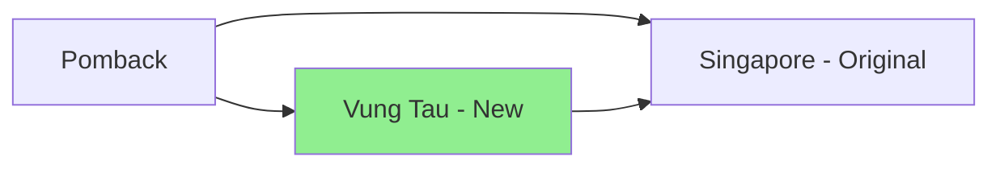
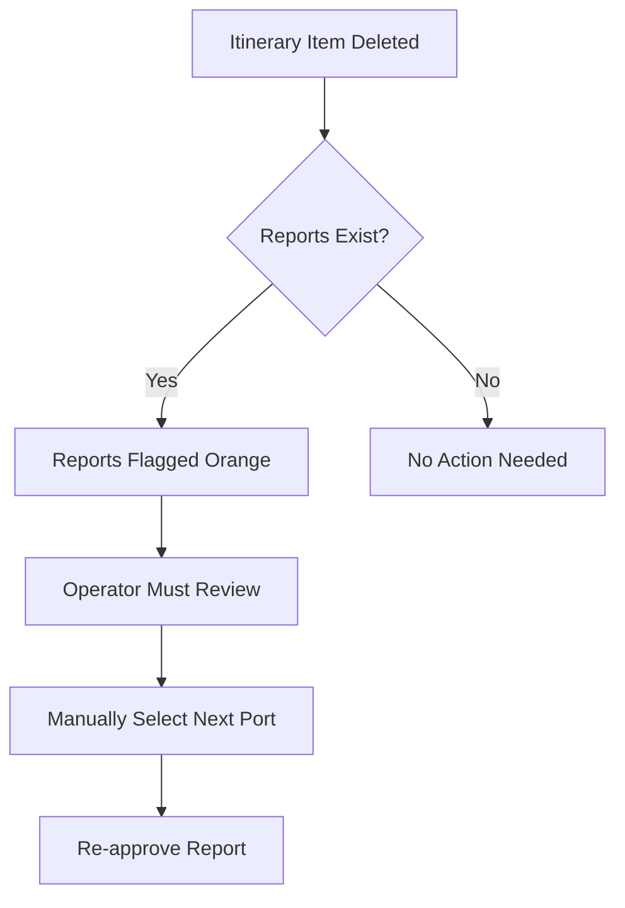
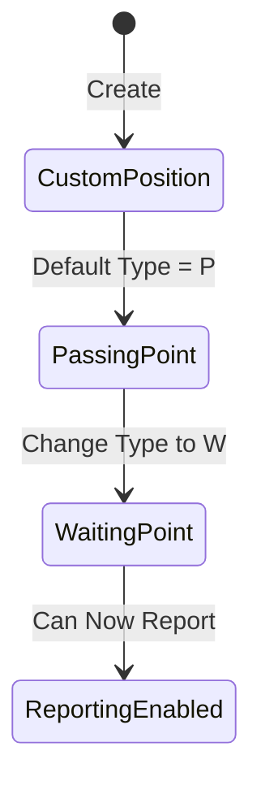
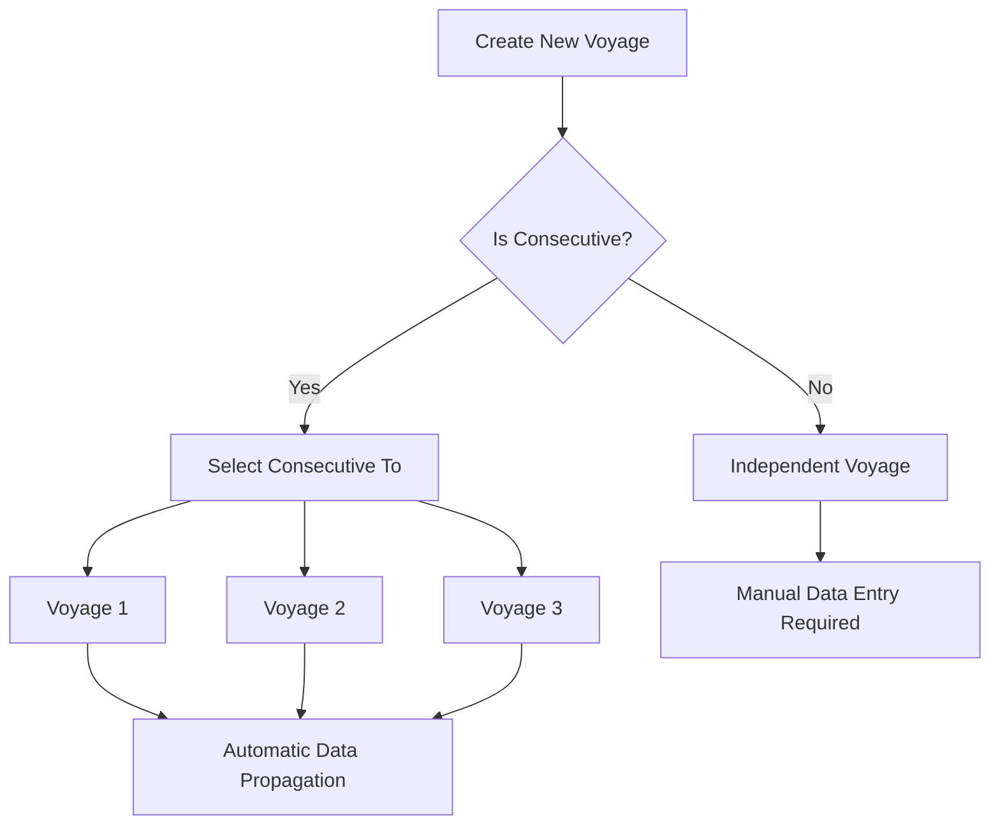
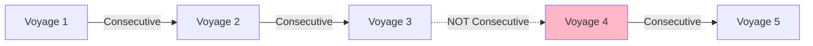
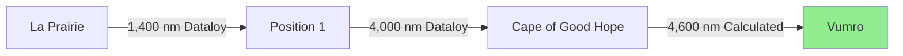
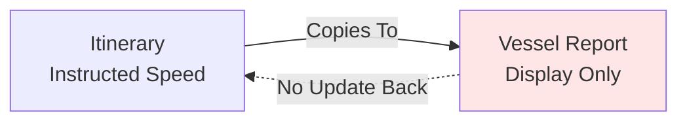
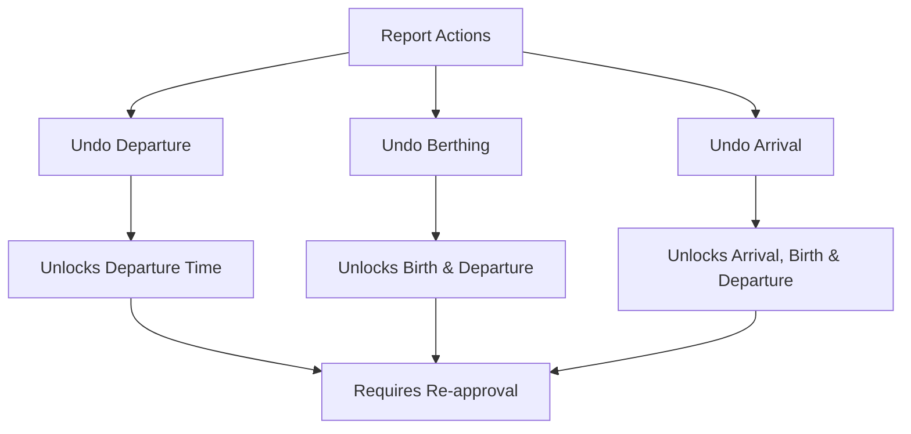
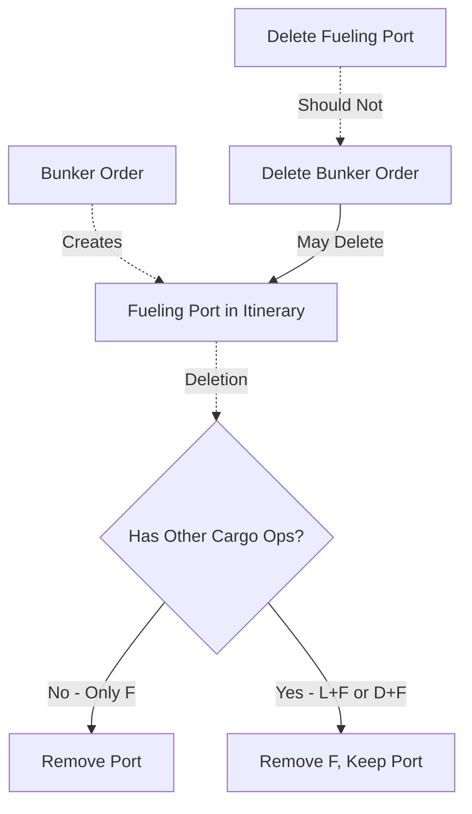

# Maritime Vessel Management System: Comprehensive Guide to Vessel Reporting and Voyage Management

## Table of Contents

- [Introduction](#introduction)
- [1. Vessel Reporting System](#1-vessel-reporting-system)
- [2. Custom Position Management](#2-custom-position-management)
- [3. Consecutive Voyage Management](#3-consecutive-voyage-management)
- [4. Distance Calculation and Validation](#4-distance-calculation-and-validation)
- [5. Instructed Speed Management](#5-instructed-speed-management)
- [6. Voyage Status and Report Approval](#6-voyage-status-and-report-approval)
- [Conclusion](#conclusion)

---

## Introduction

This guide provides comprehensive documentation on a maritime vessel management system that handles vessel reporting, voyage planning, itinerary management, and consecutive voyage operations. The system integrates real-time vessel position reporting with voyage planning tools, enabling maritime operators to track vessels, manage rotations, and handle complex multi-voyage scenarios.

**Key System Capabilities:**

- Real-time vessel position reporting and tracking
- Dynamic itinerary modification and rotation changes
- Consecutive voyage management with automatic data propagation
- Custom position insertion for route planning
- Distance calculation with ECA (Emission Control Area) considerations
- Bunker management and fuel consumption tracking

---

## 1. Vessel Reporting System

### 1.1 Overview of Vessel Reporting

The vessel reporting system allows operators to track vessel movements through various report types:

| Report Type           | Purpose                      | Key Data Points                                               |
| --------------------- | ---------------------------- | ------------------------------------------------------------- |
| **Departure Report**  | Records vessel leaving port  | Departure time, bunker on board, port departed                |
| **Noon Report**       | Daily position update at sea | Position, distance traveled, distance to go, fuel consumption |
| **Arrival Report**    | Documents port arrival       | Arrival time, total distance traveled, remaining bunker       |
| **Berthing Report**   | Records when vessel berths   | Berthing time, berth location                                 |
| **Unberthing Report** | Records vessel leaving berth | Unberthing time                                               |

**[00:57]** The demonstration begins with vessel data showing a vessel traveling from Bombay (Mumbai) to another destination, with multiple reporting points along the route.

### 1.2 Rotation Changes and Itinerary Modifications

One of the critical scenarios in vessel operations is changing the vessel's destination mid-voyage.

**[04:07]** **Scenario: Inserting a New Port Call**

When a vessel is originally planned to travel from Port A to Singapore, but the operator decides to insert a new destination (e.g., Vung Tau) in between:



**Process Flow:**

1. Navigate to the voyage itinerary
2. Insert new port between existing ports
3. System calculates new ETA based on distance from current position
4. Update vessel reports to reflect new destination

**[05:23]** **Important Note on ETA Calculation:** When a new port is inserted, the initial ETA calculation is based on the distance from the departure port to the new destination, NOT the vessel's current position. The system recalculates once new position reports are approved.

### 1.3 Port Type Validation

**[04:45]** Not all port types can serve as valid destinations for vessel reports:

| Port Type   | Code | Can Be Report Destination? | Notes                      |
| ----------- | ---- | -------------------------- | -------------------------- |
| Loading     | L    | ✅ Yes                     | Cargo loading operations   |
| Discharging | D    | ✅ Yes                     | Cargo discharge operations |
| Waiting     | W    | ✅ Yes                     | Vessel waiting/positioning |
| Redelivery  | R    | ✅ Yes                     | Time charter termination   |
| Fueling     | F    | ❌ No (as standalone)      | Can combine with L/D       |
| Passing     | P    | ❌ No                      | Transit points only        |
| Canal       | I    | ❌ No                      | Canal passages             |

**Passing Point Limitation:** A "passing" type port cannot be used as a report destination. It must be changed to at least "Waiting" status before vessels can report to it.

### 1.4 Distance Calculation Logic

**[09:30]** The system employs sophisticated distance calculation logic when itineraries are modified:

**Formula for Total Distance:**

$$
D_{total} = D_{traveled1} + D_{traveled2} + D_{toGo}
$$

Where:

- $D_{traveled1}$ = Distance from first noon report
- $D_{traveled2}$ = Distance from subsequent noon reports
- $D_{toGo}$ = Remaining distance to destination

**Example from Demo:**

- First noon report (from VeFore): 200 nm traveled
- Second noon report (manual import): 28 nm traveled
- Distance to go: 111 nm
- **Total distance = 200 + 28 + 111 = 339 nm** **[09:49]**

### 1.5 Handling Deleted Itinerary Items

**[13:37]** When an itinerary item is removed from the voyage plan:



**[14:15]** **Auto-correction Feature:** When manually selecting a new destination port, the system automatically corrects the "previous port" field to maintain logical port sequence.

---

## 2. Custom Position Management

### 2.1 Creating Custom Positions

**[16:47]** Custom positions allow operators to define specific waypoints or positions that vessels should pass through or report from.

**Step-by-Step Process:**

1. **[17:25]** Open the voyage route map view
2. **[17:44]** Right-click on the desired location
3. Select "Add Viewer Position"
4. System automatically creates a position with:
   - Default designation: "P" (Passing point)
   - Geographic coordinates (latitude/longitude)
   - Editable position details

**[18:03]** Positions can be adjusted by:

- Direct coordinate entry
- Drag-and-drop on the map
- System recalculates distances automatically

### 2.2 Custom Position in Reporting

**[18:22]** By default, custom positions are created as **passing points (P)**. However, this presents reporting limitations:

**Problem:** Passing points cannot be used as direct report destinations.

**Solution:** **[19:19]** Change the port type from "Passing" to "Waiting" to enable reporting.



**[19:57]** Once changed to "Waiting" type, the system automatically includes it in the reporting sequence, and operators can file departure/arrival reports to these custom positions.

---

## 3. Consecutive Voyage Management

### 3.1 What is a Consecutive Voyage?

**Consecutive voyages** are linked voyage sequences where data from the previous voyage automatically propagates to the next voyage. This ensures continuity in:

- Opening positions
- Bunker quantities on board (ROB - Remaining on Board)
- Itinerary starting points
- Vessel status

### 3.2 Creating Consecutive Voyages

**[39:54]** When creating a new voyage, operators have two options:



**[40:32]** **Critical Feature:** When inserting a consecutive voyage:

- Creating "Voyage 3" consecutive to "Voyage 2" adds it at the end
- Creating "Voyage 3" consecutive to "Voyage 1" inserts it between 1 and 2
- **The old Voyage 2 automatically becomes Voyage 3**
- Voyage numbers automatically renumber

### 3.3 Default Consecutive Setting

**[41:10]** **Important Discussion Point:**

**Question:** Should consecutive voyages be enabled by default when creating new voyages?

**Consideration:**

- More risky: Auto-consecutive might link voyages unintentionally
- More realistic: Most voyages follow sequentially

**[41:48]** **Decided Approach:** **Enable consecutive by default** with clear visual indicators:

- Blue highlight box showing consecutive status
- "Consecutive To" field clearly visible
- Requires deliberate action to uncheck

**Rationale:** The visual prominence makes operators more aware they need to manually disconnect if the voyage should NOT be consecutive.

### 3.4 Consecutive Data Propagation

**[43:23]** When voyages are consecutive, changes to earlier voyages automatically propagate forward:

**Example Sequence:**

```
Voyage 1: Gwanzu → Port A
Voyage 2: Port A → Sendai (automatically inherits Port A from Voyage 1)
Voyage 3: Sendai → Port B (automatically inherits Sendai from Voyage 2)
```

**[48:27]** **Test Case:** Changing departure time in Voyage 1:

- Original ETD: Gwanzu, Date X
- Modified ETD: Gwanzu, Date Y **[48:46]**
- **Result:** Voyage 2's opening position automatically updates to reflect new ETD

### 3.5 Voyage Number Management

**[42:39]** The system provides flexibility in voyage ordering through a "Change Consecutive" function:

**Scenario: Reordering Voyages**

**[46:33]** When inserting Voyage 4 to become new Voyage 2:

| Original Order | Action           | New Order          |
| -------------- | ---------------- | ------------------ |
| Voyage 1       | No change        | Voyage 1           |
| Voyage 2       | Becomes Voyage 3 | **Voyage 2 (new)** |
| Voyage 3       | Becomes Voyage 4 | Voyage 3           |
| Voyage 4 (new) | Inserted as 2    | Voyage 4           |

**[46:52]** **System Behavior:**

- Automatically renumbers all affected voyages
- Recalculates consecutive data through the chain
- Synchronizes with Business Central (ERP system)
- **[44:58]** Requires confirmation due to significant impact

### 3.6 Breaking Consecutive Chains

**[59:13]** **Non-Consecutive Voyages:** What happens when a voyage in the middle is NOT consecutive?



**[60:29]** **Discussion Point:** Should Voyage 5 connect to Voyage 3?

**Answer:** **[61:07]** No. Non-consecutive voyages create a **permanent break** in the chain:

- Voyage 5 cannot be consecutive to Voyage 3
- Data does not skip over Voyage 4
- Creates two separate consecutive chains: (1→2→3) and (4→5)

**Real-World Reasoning:** **[60:48]** Non-consecutive voyages typically occur when:

- Vessel is redelivered to owner
- Time charter contract ends
- Vessel goes off-hire temporarily
- There's a gap in operations between voyages

**[62:42]** However, the system still allows manual reordering:

- Voyage 5 CAN be manually made consecutive to Voyage 2
- This would reorder the sequence
- Both consecutive chains remain manageable independently

---

## 4. Distance Calculation and Validation

### 4.1 Distance Data Sources

The system uses multiple data sources for distance calculations:

| Source                 | Priority | Use Case                                |
| ---------------------- | -------- | --------------------------------------- |
| **Captain's Reports**  | Highest  | Actual distances traveled and remaining |
| **Dataloy**            | Medium   | Reference distances for route planning  |
| **System Calculation** | Lowest   | Fallback when no other data available   |

### 4.2 Distance Breakdown Logic

**[24:42]** The system breaks down reported distances into segments when custom positions or passing points exist:

**Scenario:** **[22:29]** Captain reports traveling 10,000 nm from La Prairie to Vumro, with custom positions in between:



**Calculation Logic:**

$$
D_{calculated} = D_{reported} - D_{dataLoy1} - D_{dataLoy2}
$$

$$
4,600 = 10,000 - 1,400 - 4,000
$$

**[25:20]** **Where:**

- $D_{reported}$ = 10,000 nm (captain's report)
- $D_{dataLoy1}$ = 1,400 nm (La Prairie to Position 1 from Dataloy)
- $D_{dataLoy2}$ = 4,000 nm (Position 1 to Cape of Good Hope from Dataloy)
- $D_{calculated}$ = 4,600 nm (remaining to Vumro)

### 4.3 ECA/SECA Distance Calculation

**[23:07]** The system tracks distances within Emission Control Areas (ECA) and Sulphur Emission Control Areas (SECA) for fuel compliance:

**[26:36]** **Discovered Issue:** In the demonstration, 51 nm of ECA distance appeared in the route calculation.

**Investigation:** **[26:55]** The ECA miles source was unclear, requiring verification with Dataloy's raw response data.

**[85:30]** **Important Finding:** Dataloy has already included the Mediterranean Sea as an ECA region (effective May 2024), even though regulatory enforcement begins later.

**Distance Classification:**

$$
D_{total} = D_{ECA} + D_{non-ECA}
$$

**Example:**

- Total distance: 10,000 nm
- ECA distance: 51 nm **[25:01]**
- Non-ECA distance: 9,949 nm

This breakdown affects:

- Fuel type requirements (different fuel grades in ECA zones)
- MGO vs VLSFO consumption calculations **[25:21]**
- Compliance reporting

### 4.4 Distance Validation and Warnings

**[22:48]** The system includes validation to detect unrealistic distance reports:

**Warning Triggers:**

- Distance threshold too large compared to expected route
- Negative distances
- Distance mismatches between consecutive reports

**System Behavior:**

- Displays warning but allows approval **[22:48]**
- Operator can override if justified
- Data carries forward to voyage calculations with warning flag

---

## 5. Instructed Speed Management

### 5.1 What is Instructed Speed?

**Instructed Speed** is the speed at which operators instruct the vessel to sail between ports. This differs from:

- **Actual Speed:** Real speed achieved by the vessel
- **Average Speed:** Calculated from reports
- **Design Speed:** Vessel's maximum or economical speed

### 5.2 Instructed Speed Display

**[95:00]** The system displays instructed speed alongside actual speed in vessel reports:

| Field            | Source         | Purpose                                |
| ---------------- | -------------- | -------------------------------------- |
| Speed To Go      | Vessel Report  | Actual speed vessel expects to achieve |
| Instructed Speed | Operator Input | Comparison benchmark                   |

**[95:19]** **Purpose:** Allows comparison between what was instructed and what the vessel actually achieved.

### 5.3 Instructed Speed Data Flow

**[95:38]** **Critical Rule:** Instructed speed is a **one-way data flow**:



**[95:57]** Updating instructed speed in the itinerary should NOT change previously reported values.

### 5.4 Instructed Speed Initialization

**[105:08]** **Identified Issue:** Instructed speeds were not being correctly populated during voyage creation.

**Expected Behavior:**

1. Estimate contains instructed speeds
2. **On voyage creation:** Speeds should copy from estimate to voyage itinerary
3. Initial speeds match because both use Dataloy distances
4. As reports arrive, actual speed changes but instructed speed remains constant

**[105:27]** **Action Item:** Implement logic to properly map instructed speeds during voyage creation.

### 5.5 Speed Display Default Behavior

**[104:30]** When no instructed speed is entered:

- Frontend displays the speed from the previous leg
- **Data is actually empty** in the database
- Once operator enters a value, it becomes fixed
- If recalculated, default behavior resumes for empty fields

---

## 6. Voyage Status and Report Approval

### 6.1 Report Approval States

The system tracks multiple approval states for vessel reports:

| State                 | Visual Indicator | Meaning                                   |
| --------------------- | ---------------- | ----------------------------------------- |
| **Unapproved**        | White/Default    | Report submitted but not verified         |
| **Approved**          | Green/Locked     | Report verified and locked                |
| **Needs Re-approval** | Orange           | Changes made requiring review **[13:56]** |
| **Locked**            | Gray             | Report approved, fields locked            |

### 6.2 Undo Functionality

**[87:05]** The system provides "undo" capabilities for approved reports when corrections are needed:

**Available Undo Actions:**



**[87:43]** **Undo Departure:** **[87:24]**

- Unlocks departure-related fields
- Allows modifications to departure time
- Requires re-approval after changes
- **[88:02]** Affected downstream reports flagged orange

**[89:18]** **Undo Berthing:**

- Unlocks both berthing AND departure
- More extensive unlock than departure alone

**[89:18]** **Undo Arrival:**

- Unlocks arrival, berthing, AND departure
- Most extensive unlock operation
- Affects entire port call reporting sequence

### 6.3 Impact of Undo Operations

**[89:37]** When undo operations are performed:

1. **Field Unlocking:**

   - Previously locked fields become editable
   - Fields turn white indicating edit capability

2. **Report Flagging:** **[89:37]**

   - All affected reports receive orange flag
   - Indicates "may need re-approval"
   - Operator must review each flagged report

3. **Downstream Effects:**
   - Consecutive reports may need revision
   - Bunker calculations may require update
   - Distance calculations may change

**[91:12]** **Question Addressed:** After making changes in the itinerary (undoing), does the system need to approve reports again?

**[91:31]** **Answer:** **One-way data flow maintained:**

- Changes in vessel reports → Update voyage itinerary ✅
- Changes in voyage itinerary → **DO NOT** update vessel reports ❌
- Manual report re-approval required to lock changes

### 6.4 Re-approval Process

**[88:21]** Two methods for re-approval:

**Method 1: Quick Re-approval**

- Click "Save and Re-approve" button
- Immediate re-approval without navigation

**Method 2: Review and Re-approve**

- Navigate to report
- Review changes
- Click "Approve" button
- More thorough verification

### 6.5 Bulk Re-approval Scenarios

**[101:39]** **Scenario:** Multiple noon reports between port calls require re-approval.

**[101:58]** **Operator Preference:** Skip noon reports, only re-approve key reports:

- Departure report
- Arrival report
- Berthing report
- Unberthing report

**[102:36]** **Technical Requirement:** System design requires **all reports** to be re-approved:

- **Reason:** Fuel consumption calculations
- Previous reports carry forward consumption data **[102:36]**
- Missing approvals create data gaps
- **[103:14]** Without re-approval: Consumption from berth to unberth missing

**[103:33]** **Conclusion:** While operationally inconvenient, technical architecture requires complete re-approval chain to maintain data integrity.

---

## 7. Voyage Deletion and Constraints

### 7.1 Deleting Voyages in Consecutive Chains

**[53:31]** Initial design approach: When consecutive voyages exist, deleting one should maintain voyage number sequence.

**Example:**

```
Before: Voyage 1 → Voyage 2 → Voyage 3 → Voyage 4 → Voyage 5
Delete Voyage 2
After: Voyage 1 → Voyage 2 (old 3) → Voyage 3 (old 4) → Voyage 4 (old 5)
```

**[53:50]** **Rationale:** Organizations want continuous voyage numbering without gaps.

### 7.2 Realistic Deletion Scenarios

**[54:09]** **Most common case:** Deleting the **last voyage** in a sequence.

**[54:28]** **Reasoning:**

- Future voyages rarely scheduled far in advance
- Deleting middle voyages implies earlier start for subsequent voyages
- **[54:47]** Cargo operations tied to specific dates
- Cannot simply move voyages forward in time

### 7.3 Proposed Deletion Constraints

**[55:06]** **Suggestion:** Restrict deletion to last voyage only.

**[55:25]** **Workaround for middle deletion:**

1. Reorder voyages to move target to last position
2. Delete the now-last voyage
3. Simpler logic, fewer edge cases

**[56:22]** **Counter-proposal:** Allow middle deletion since logic already exists.

**[56:41]** **Final Decision:** Keep flexible deletion with automatic renumbering.

### 7.4 Pre-deletion Requirements

**[73:47]** **Critical Requirement:** Voyage must be "naked" before deletion:

**Pre-deletion Checklist:**

| Item Category  | Must Be | Reason                                 |
| -------------- | ------- | -------------------------------------- |
| **Shipments**  | None    | Avoid losing cargo data                |
| **Laytimes**   | None    | Preserve charter party terms           |
| **Off-hires**  | None    | Maintain commercial records            |
| **Port Costs** | None    | Keep financial data                    |
| **Invoices**   | None    | Protect accounting records **[74:06]** |

**[74:25]** **Rationale:** **[74:06]**

- Forces operator review of each item
- Prevents accidental data loss
- Allows deliberate migration to other voyages
- Ensures conscious decision-making

**[75:03]** **Business Central Consideration:** **[75:22]**

- Scheduled voyages create master data in ERP
- Deletion must synchronize with Business Central
- Invoice data protected through deletion constraints

---

## 8. System Performance and Caching

### 8.1 Caching Strategy

**[49:24]** The system implements browser-side caching to improve performance:

**Purpose:**

- Reduce server workload
- Faster page loads
- Improved user experience

**[49:43]** **Challenge:** Caching can show stale data after updates:

- Front-end refuses to call backend for new data
- User sees outdated information
- Confusing results when data has changed

### 8.2 Refresh Mechanisms

**[50:02]** **Two refresh options available:**

**Option 1: Standard Browser Refresh**

- Reloads entire front-end from backend
- Clears all cached data
- Takes ~0.2 seconds longer

**[50:21]** **Option 2: API Refresh Button** (in UI)

- Calls backend APIs only
- Does NOT reload front-end HTML/JS
- Faster than full browser refresh
- Preserves UI state

**[50:40]** Implemented by development team as optimization.

### 8.3 When to Refresh

**[51:18]** After consecutive voyage operations:

- Itinerary changes may not appear immediately
- Refresh required to see data propagation
- **[52:34]** May need **multiple refreshes** for complex calculations

**[52:54]** **Proposed Solution:** Add "calculating" flag to voyages:

- Indicates consecutive recalculation in progress
- Warns users data may be updating
- Prevents premature decisions on stale data

**[76:19]** **Counter-argument:** Caching optimization defeats purpose if constantly cleared.

**[76:57]** **Balanced Approach:**

- Remove cache where necessary (after writes)
- Keep cache for read-heavy operations
- Use API refresh button for user-initiated updates

---

## 9. Advanced Topics

### 9.1 Bunker Orders and Fueling Ports

**[11:05]** **Relationship between bunker orders and itinerary:**



**[12:02]** **Deletion Logic:**

**Scenario 1: Delete Bunker Order**

- Fueling port with ONLY "F" type → Port removed **[12:21]**
- Fueling port with "L+F" or "D+F" → Only "F" removed, port remains **[13:18]**
- Multiple bunker orders at same port → One deletion doesn't remove port

**[12:40]** **Scenario 2: Delete Fueling Port**

- Question: Should bunker order also delete?
- **Currently:** May not cascade to bunker order
- **[12:59]** Requires manual bunker order deletion

### 9.2 Port Types in Time Charter Operations

**[79:48]** Special port type for time charter operations:

**Z-Type Port (Redelivery):** **[82:01]**

- Marks where time charter contract ends
- Can occur at beginning: **Y-Type (Delivery)** **[80:07]**
- Can occur at end: **Z-Type (Redelivery)**

**[81:23]** **Complex Scenario:**

```
Voyage 1: Antwerp (Last cargo discharge) → Hamburg (Time charter delivery)
Voyage 2: Hamburg (Time charter period) → Rotterdam (Time charter ends)
Voyage 3: Rotterdam → Next operation
```

**[82:20]** **T-Type Port (Terminating):**

- Exists in Estimate system
- Marks intended redelivery location
- **[82:58]** Indicates: "No matter what, ballast to this position at voyage end"
- Conversion to voyage itinerary needs review

**[79:29]** **Port Types for Consecutive Carry-over:**

Only specific types should propagate across consecutive voyages:

- **L** (Loading) ✅
- **D** (Discharging) ✅
- **W** (Waiting) ✅
- **R** (Redelivery) ✅
- **Z** (Time charter redelivery) ✅
- **P** (Passing) ❌
- **I** (Canal/Intermediate) ❌

**[78:51]** **Rule:** First and last itinerary items need reports, so **P-type cannot be first or last**.

### 9.3 Cancelled Voyages

**[69:21]** **Policy Decision:** Cancelled voyages should NOT remain in system.

**[69:40]** **Reasoning:**

- Ports never called at shouldn't appear in itinerary
- Voyage number sequence should remain continuous **[69:59]**
- Cancelling Voyage 2 should make Voyage 3 become new Voyage 2

**[70:18]** **Exception Use Case:**

- Client cancels contract late
- BBC entitled to compensation
- Need to document cancelled voyage for invoicing

**[70:56]** **Solution:** **[71:34]**

- Delete cancelled voyage from system
- Keep estimate for financial records
- Put compensation income on different voyage
- Operational data removed, commercial data preserved

---

## 10. Best Practices and Recommendations

### 10.1 Voyage Creation Workflow

**Recommended Sequence:**

1. **Create Estimate First**

   - Define all ports and cargo operations
   - Set instructed speeds
   - Calculate distances using Dataloy

2. **Generate Voyage from Estimate**

   - Verify consecutive setting
   - Confirm consecutive-to relationship
   - Check opening position inherited correctly

3. **Validate Itinerary**

   - Ensure all ports have correct types
   - Verify fueling ports have bunker orders
   - Check distance calculations

4. **Begin Reporting**
   - Departure report from first port
   - Regular noon reports
   - Arrival reports at each port call

### 10.2 Handling Itinerary Changes

**Mid-Voyage Route Change Protocol:**

1. **Insert New Port:**

   - Add as "Waiting" type if needed for reporting
   - Save itinerary changes

2. **Update Vessel Reports:**

   - Next report should reflect new destination
   - Distance calculations will adjust automatically

3. **Verify Distance Accuracy:**

   - Initial ETA may be estimated
   - Recalculates after first approved report to new destination

4. **Review Orange Flags:**
   - Check all reports flagged for re-approval
   - Ensure logical port sequences maintained

### 10.3 Consecutive Voyage Management

**When Creating Consecutive Voyages:**

✅ **Do:**

- Verify previous voyage status (commenced/scheduled/completed)
- Check opening position matches previous closing
- Confirm bunker ROB carries forward correctly
- Use refresh button after creation to see propagated data

❌ **Don't:**

- Create consecutive to completed voyage unless it's the last one
- Assume changes appear immediately (caching delays)
- Change voyage order without considering commercial implications

### 10.4 Report Re-approval Strategy

**When Undo Operations Performed:**

1. **Assess Scope:**

   - Identify all affected reports (orange flags)
   - Determine if noon reports need re-approval

2. **Re-approval Order:**

   - Start with earliest report
   - Work chronologically forward
   - Ensure bunker consumption chain maintained

3. **Verification:**
   - Check bunker quantities logical
   - Verify distance calculations correct
   - Confirm no data gaps

---

## Conclusion

This maritime vessel management system provides comprehensive tools for managing vessel operations, from day-to-day reporting to complex multi-voyage planning. Key takeaways:

1. **Flexibility:** System handles dynamic itinerary changes while maintaining data integrity
2. **Automation:** Consecutive voyage logic reduces manual data entry and errors
3. **Validation:** Multiple validation layers prevent illogical data entry
4. **Traceability:** Undo functions and re-approval requirements maintain audit trail
5. **Integration:** Distance calculation incorporates external data sources (Dataloy) with operational reports

**Future Development Areas:**

- **[73:09]** Voyage deletion with dependency checking
- **[105:46]** Instructed speed mapping during voyage creation
- **[16:09]** Enhanced validation for future-dated arrival reports
- Caching strategy optimization
- T-type port handling in consecutive voyages

The system balances operational flexibility with data integrity, ensuring maritime operators can adapt to changing conditions while maintaining accurate records for compliance, commercial, and safety purposes.

---

## Glossary

| Term                 | Definition                                                                    |
| -------------------- | ----------------------------------------------------------------------------- |
| **ECA**              | Emission Control Area - zones with stricter fuel emissions requirements       |
| **ROB**              | Remaining On Board - fuel or cargo quantity on vessel                         |
| **Dataloy**          | External maritime data service providing route distances and port information |
| **VLSFO**            | Very Low Sulphur Fuel Oil - marine fuel grade                                 |
| **MGO**              | Marine Gas Oil - higher grade fuel required in ECAs                           |
| **Noon Report**      | Daily position report typically submitted at 12:00 noon ship time             |
| **Business Central** | Microsoft ERP system integrated with vessel management system                 |
| **Itinerary**        | Sequence of port calls and positions planned for a voyage                     |
| **Bunker**           | Marine fuel; also the act of refueling                                        |
| **Laytime**          | Charter party terms defining allowed loading/discharge time                   |

---

_This educational document was created from a technical demonstration video recorded for training purposes. For specific operational procedures in your organization, always refer to your company's official documentation and policies._
