# Vessel Report System in BBC BVMS

## Maritime Voyage Management Documentation

---

## Table of Contents

1. [Overview](#overview)
2. [System Architecture](#system-architecture)
3. [Report Types](#report-types)
4. [Data Flow](#data-flow)
5. [Bunker Management](#bunker-management)
6. [Consecutive Voyage Handling](#consecutive-voyage-handling)
7. [Error Handling & Corrections](#error-handling--corrections)
8. [Integration with VFOS](#integration-with-vfos)

---

## Overview

### Purpose

The Vessel Report feature in BVMS is critical for transitioning **estimated voyage data** to **actual voyage data**. As each voyage progresses, real-time reports from ship captains gradually replace future estimates with factual operational data.

### Key Concept

```
Start: 30 days future data (100% estimated)
  ↓
Day 1: 1 real + 29 future
Day 2: 2 real + 28 future
  ⋮
End: 30 days real data (100% actual)
```

### Why Vessel Reports Matter

| Aspect                   | Importance                                                                                         |
| ------------------------ | -------------------------------------------------------------------------------------------------- |
| **Data Accuracy**        | Real data always differs from estimates; accurate reporting ensures correct financial calculations |
| **Fuel Management**      | Critical for monitoring oil consumption to prevent running out of fuel mid-voyage                  |
| **Financial Reporting**  | Enables comparison between estimated profit vs. actual profit post-voyage                          |
| **Operational Planning** | Helps operators make real-time decisions on refueling, route changes, and scheduling               |

---

## System Architecture

### Workflow Overview


### Operational Structure

| Role                   | Responsibility                                            | Tools                           |
| ---------------------- | --------------------------------------------------------- | ------------------------------- |
| **Charter Department** | Send transaction with estimated figures                   | BVMS Transaction Module         |
| **Operations Team**    | Evaluate bunker setup, manage 3-4 vessels each            | BVMS Voyage Management          |
| **Ship Captain**       | Submit daily reports (every 24 hours)                     | VFOS or manual entry            |
| **System**             | Auto-import reports, validate, calculate future estimates | BVMS Backend + VFOS Integration |

---

## Report Types

### Report Type Summary

| Report Type   | When Submitted       | Key Data Points                                             | Time Lock                  |
| ------------- | -------------------- | ----------------------------------------------------------- | -------------------------- |
| **Departure** | Leaving port         | Departure time (actual), from-to ports, initial bunker      | Locks **Departure Time**   |
| **Noon**      | Daily at sea         | Distance traveled (24h), distance to go, bunker consumption | Updates **ETA**            |
| **Arrival**   | Reaching destination | Arrival time (actual), final position                       | Locks **Arrival Time**     |
| **In Port**   | While docked         | Time of berth, time of unberth, cargo operations            | Reports **berth schedule** |
| **Berth**     | Actual berthing      | Berth time (moment of truth)                                | Locks **Berth Time**       |
| **Unberth**   | Leaving berth        | Unberth time (moment of truth)                              | Locks **Unberth Time**     |
| **Receival**  | Receiving fuel       | Bunker lot received, quantity, port                         | Adds bunker to **onboard** |

### Detailed Report Workflows

#### 1. Departure Report


**Key Fields:**

- Departure Time (actual) ✓ Critical
- From Port → To Port
- Current Position (Lat/Long)
- Distance to Go
- Initial Bunker Status (all tanks)

#### 2. Noon Report

Daily reports during sea transit. Submitted approximately every 24 hours.

**Key Fields:**

- Report Time (when report submitted)
- Distance Traveled (last 24 hours)
- Distance to Go (remaining to destination)
- Speed (actual in last 24h)
- Expected Speed (to destination)
- **ETA Update** (can change daily)
- Bunker Consumption (by tank)

**Example Evolution:**
| Day | Distance Traveled | Distance to Go | ETA |
|-----|------------------|----------------|-----|
| Day 1 | 108 nm | 1800 nm | Oct 23, 02:00 |
| Day 2 | 115 nm | 1685 nm | Oct 23, 06:00 |
| Day 3 | 120 nm | 1565 nm | Oct 23, 06:00 |

#### 3. Arrival Report


**Key Fields:**

- Arrival Time (actual) ✓ **Moment of Truth**
- From Port → To Port
- Final bunker status
- Total distance traveled

#### 4. In Port Report

Special considerations for port operations:

| Phase               | Duration Type | Description                                                        |
| ------------------- | ------------- | ------------------------------------------------------------------ |
| **Idle Time**       | Waiting       | Ship arrives early, waits outside port to avoid port fees          |
| **Intra Time**      | Movement      | Time to move from arrival position to berth (low speed ~5-6 knots) |
| **Cargo Operation** | Working       | Time between berth and unberth for loading/unloading               |

**Port Timeline:**

```mermaid
gantt
    title Port Operation Timeline
    dateFormat HH:mm
    section Port Activity
    Arrival (outside)     :a1, 08:00, 2h
    Idle Time            :a2, after a1, 4h
    Intra (moving to berth) :a3, after a2, 1h
    Berth               :milestone, after a3, 0h
    Cargo Operations    :a4, after a3, 12h
    Unberth            :milestone, after a4, 0h
```



#### 5. Receival Report

Fuel bunkering documentation.

**Workflow:**

1. Create Bunker Order (when fuel needed)
2. Partner quotes price → Approve → Issue invoice
3. Ship arrives at port
4. Fuel barge delivers oil to ship
5. Captain submits **Receival Report**
6. System updates **onboard** bunker lots

---

## Data Flow

### Import Mechanism

#### Automatic Import


#### Manual Import Triggers

1. **Navigate to Voyage** → Opens Vessel Report → Auto-imports
2. **Click Import Button** → Immediate sync with VFOS

### Data Validation & Approval


### Prerequisites for VFOS Integration

| Requirement           | Description                                        |
| --------------------- | -------------------------------------------------- |
| ✓ Vessel in Contract  | Ship must be in BBC's signed vessel list with VFOS |
| ✓ Captain Reports     | Captain must submit reports in VFOS system         |
| ✓ Voyage Number Match | VFOS voyage number must match BVMS voyage number   |
| ✓ Route Consistency   | Itinerary setup must match between VFOS and BVMS   |

---

## Bunker Management

### Bunker Lot Structure

#### Concept: Breakdown vs. Summary

```
BUNKER TOWER (Summary)
├── Total VLSFO: 186 tons
├── Total LSMGO: 76 tons
└── ...

BUNKER LOT (Breakdown)
├── VLSFO Lot #1: 186 tons @ $489/ton
├── VLSFO Lot #2: 0 tons @ $515/ton
├── LSMGO Lot #1: 55 tons @ $682/ton
└── LSMGO Lot #2: 20 tons @ $682/ton
```

### Consumption Tracking

#### Example Scenario

**Setup by Operator:**

- Use LSMGO Lot #1 (55 tons) first
- Then use LSMGO Lot #2 (20 tons)

**Reality Reported by Captain:**

- Used LSMGO Lot #2 (20 tons) first → Now 11 tons remain
- Did NOT touch LSMGO Lot #1 (55 tons) → Still 55 tons
- Reason: Ship in ECA zone requires clean fuel immediately

### Bunker Lot Table

| Lot      | Initial | Onboard Amount | Consumption | Current | Ending |
| -------- | ------- | -------------- | ----------- | ------- | ------ |
| VLSFO #1 | 186     | 186            | 34          | 152     | 0      |
| LSMGO #1 | 55      | 55             | 0           | 55      | 15     |
| LSMGO #2 | 20      | 20             | 9           | 11      | 0      |

**Color Coding in Consumption Detail:**

- 🟤 **Brown** = Real data (reported)
- ⚪ **White** = Future data (estimated)

### Bunker Tower Display

```mermaid
graph TD
    A[Itinerary: New Orleans → Albany] --> B[Bunker Status]
    B --> C[Start:<br/>VLSFO: 186<br/>LSMGO: 76]
    B --> D[Current:<br/>VLSFO: 152<br/>LSMGO: 67]
    B --> E[Sea Report Consumption:<br/>VLSFO: 34<br/>LSMGO: 9]
```



**Validation Rule:**

```
Current Bunker = Sum of All Current Lots
67 LSMGO = 55 (Lot #1) + 11 (Lot #2) + 1 (Lot #3)
```

### Critical Bunker Scenarios

#### Scenario 1: Insufficient Fuel

**Problem:** Ship estimated to have enough fuel, but actual consumption higher due to weather/delays.

**Solution:**

- Operator monitors daily reports
- Detects low fuel early
- Plans intermediate refueling stop (e.g., Panama, Vung Tau)
- Updates voyage with Bunker Order

#### Scenario 2: ECA Zone Compliance

**ECA (Emission Control Area):** Requires clean fuel usage

| Zone Type | Fuel Type     | Consumption Rate |
| --------- | ------------- | ---------------- |
| ECA Zone  | LSMGO (clean) | Higher priority  |
| Open Sea  | VLSFO (dirty) | Lower cost       |

**Automatic Calculation:**

```
Total Distance: 2,919 nm
├── ECA Distance: 73 nm → Use LSMGO
└── Open Sea: 2,846 nm → Use VLSFO
```

---

## Consecutive Voyage Handling

### Chain Reaction Concept

When one voyage is updated, all subsequent voyages for the same vessel must be recalculated.

```mermaid
graph LR
    A[Voyage 1:<br/>End at Ras Laffan] --> B[Voyage 2:<br/>Ras Laffan → Esbjerg]
    B --> C[Voyage 3:<br/>Esbjerg → Lisbon]

    style A fill:#90EE90
    style B fill:#FFE4B5
    style C fill:#FFE4B5
```



### Data Inheritance

#### Two Critical Data Points Transfer:

| Data Type       | Transfer Rule                                                     |
| --------------- | ----------------------------------------------------------------- |
| **Time**        | Previous voyage's `Departure Time` → Next voyage's `Arrival Time` |
| **Bunker Lots** | Previous voyage's `Ending Lots` → Next voyage's `Initial Lots`    |

#### Example: Time Cascade

| Event               | Voyage 1              | Voyage 2             | Voyage 3             |
| ------------------- | --------------------- | -------------------- | -------------------- |
| **Before Approval** | Depart: Oct 21, 08:00 | Start: Oct 21, 08:00 | Start: Oct 17, 10:00 |
| **After Approval**  | Depart: Oct 20, 22:00 | Start: Oct 20, 22:00 | Start: Oct 18, 10:00 |

**Change Propagation:**

- Voyage 1 departure changed by -10 hours
- Voyage 2 automatically adjusted -10 hours
- Voyage 3 automatically adjusted accordingly

#### Example: Bunker Cascade


**Adding Bunker Order Impact:**

- Add 5,000 tons LSMGO at Voyage 1 Ras Laffan
- Voyage 1 ending: +5,000 tons LSMGO
- Voyage 2 initial: automatically +5,000 tons
- Voyage 3 initial: carries remainder from Voyage 2

---

## Error Handling & Corrections

### Common Error Scenarios

| Error Type                | Example                            | Impact                                 |
| ------------------------- | ---------------------------------- | -------------------------------------- |
| **Wrong Fuel Type**       | Used dirty fuel in ECA zone        | Compliance violation                   |
| **Incorrect Consumption** | Reported 2.1 tons, actually 0 tons | Cascading errors to all future reports |
| **Timing Mismatch**       | Submitted arrival before departure | Logic failure                          |
| **Lot Misreporting**      | Used wrong bunker tank             | Lot tracking incorrect                 |

### Correction Methods

#### Method 1: Operator Direct Edit


**Use Case:** Minor errors, operator knows exact correction needed.

#### Method 2: Captain Re-submission via VFOS


**Visual Indicators:**

- 🟡 **Yellow Highlight** = Report has been updated in VFOS
- 🔴 **Red Text** = New values different from current values

#### Method 3: Batch Approval (Historical Errors)

**Scenario:** Day 1 error discovered on Day 4, causing Days 1-4 all incorrect.


**Steps:**

1. Captain fixes Day 1 in VFOS
2. Operator clicks "Sync" to get all updates (Days 1-4)
3. Operator clicks "Override All" for each updated report
4. Operator uses **"Batch Approve"** from Day 1 → Day 4
5. System re-approves sequentially, correcting cascade errors

#### Method 4: Delete & Re-import (Nuclear Option)

**When to Use:**

- Too many errors across multiple reports
- Manual editing too time-consuming
- Need to reset to VFOS source of truth

**Steps:**

1. Select reports (e.g., Report 1 to Report 79)
2. **Delete** all selected approved reports
3. **Import** fresh data from VFOS
4. **Map bunker lots** to correct tanks
5. **Batch Approve** all re-imported reports

⚠️ **Warning:** This resets all operator edits. Use only when VFOS data is confirmed correct.

### Validation Rules

| Validation             | Description                                             | Error Prevention         |
| ---------------------- | ------------------------------------------------------- | ------------------------ |
| **Bunker Consistency** | Previous drop + current consumption = current onboard   | Catches math errors      |
| **ECA Compliance**     | Clean fuel required in ECA zones                        | Environmental compliance |
| **Sequential Time**    | Departure before arrival, arrival before next departure | Prevents time paradoxes  |
| **Distance Logic**     | Sum of traveled distances ≈ total route distance        | Catches reporting gaps   |

---

## Integration with VFOS

### VFOS System Overview

**VFOS (Vessel Fleet Operations System):** Third-party software used by ship captains to submit vessel reports.

### BBC Contract Status

| Total Fleet   | VFOS Contract | Manual Entry |
| ------------- | ------------- | ------------ |
| ~100+ vessels | ~10 vessels   | ~90 vessels  |

**Implication:**

- Only ~10 vessels auto-import from VFOS
- Remaining vessels require manual report entry by operators

### Contracted Vessels (Example List)

- Cepasobo BBC
- Moonstone
- Bremen
- _(List provided by Mika, subject to expansion)_

### Import Scheduling

| Method            | Trigger                         | Frequency     |
| ----------------- | ------------------------------- | ------------- |
| **Cron Job**      | Automatic                       | Every 2 hours |
| **Manual Import** | Operator clicks "Import" button | On-demand     |
| **Page Load**     | Navigate to Vessel Report page  | Per visit     |

### Voyage Number Synchronization

**Critical Requirement:** VFOS voyage number must exactly match BVMS voyage number.

**Problem Scenario:**

```
VFOS Setup:
  Voyage #12345
  Route: New Orleans → Albany

BVMS Setup:
  Voyage #12345
  Route: New Orleans → Hamburg  ❌ MISMATCH!
```

**Result:** Reports will import but data will be incorrect/misaligned.

**Solution for Testing:**

- Snapshot production data from Test environment to QAQC
- Ensures voyage number and route consistency
- Allows safe testing with real VFOS integration

---

## Key Takeaways

### For Operators

1. ✅ **Daily Monitoring:** Review vessel reports every 24 hours
2. ✅ **Fuel Vigilance:** Watch bunker levels to prevent running out
3. ✅ **Approve Carefully:** Validate before approval (operator responsibility)
4. ✅ **Quick Communication:** Contact captains via WhatsApp for urgent issues
5. ✅ **Consecutive Awareness:** Changes affect all future voyages

### For System Design

1. 🔧 **Real Over Estimate:** Always prioritize actual data over estimates
2. 🔧 **Validation Layers:** Multiple checks before approval
3. 🔧 **Lot Tracking:** Precise breakdown per fuel tank
4. 🔧 **Cascade Calculations:** Auto-update dependent voyages
5. 🔧 **Error Recovery:** Multiple correction paths (edit, re-import, batch)

### For Data Integrity

1. 📊 **High Accuracy Required:** Real data drives financial calculations
2. 📊 **Audit Trail:** Track all approvals and changes
3. 📊 **Moment of Truth:** Lock critical times (departure, arrival, berth)
4. 📊 **Consecutive Consistency:** Ending = Next beginning
5. 📊 **Source of Truth:** VFOS for contracted vessels, manual for others

---

## Technical Notes

### Data Structure Components

```
Voyage
├── Itinerary (Multiple)
│   ├── Port (From/To)
│   ├── Timing (Departure/Arrival/Berth/Unberth)
│   ├── Bunker Tower (Summary)
│   └── Distance
├── Bunker Lots (Detailed)
│   ├── Lot ID
│   ├── Fuel Type
│   ├── Initial Quantity
│   ├── Onboard Amount
│   ├── Consumption
│   ├── Current Quantity
│   └── Ending Quantity
└── Vessel Reports (Multiple)
    ├── Report Type
    ├── Report Time
    ├── Position (Lat/Long)
    ├── Distance Data
    ├── Speed Data
    ├── Bunker Consumption
    └── Approval Status
```

### Approval Logic Flow

```python
def approve_report(report):
    # 1. Delete future estimate data
    delete_future_data(voyage)

    # 2. Insert real data from report
    insert_real_data(report)

    # 3. Recalculate future estimates
    recalculate_future(voyage)

    # 4. Update consecutive voyages
    if has_next_voyage(vessel):
        update_next_voyage_initial(vessel, voyage.ending_data)

    # 5. Lock moment of truth
    lock_critical_time(report.type, report.time)

    # 6. Mark as approved
    report.status = "APPROVED"
```

### Testing Strategy

**Environment Setup:**

1. Use QAQC environment (not production)
2. Snapshot data from Test to QAQC
3. Ensure vessel in VFOS contract list
4. Verify voyage number matches VFOS
5. Test manual entry for non-VFOS vessels

---

## Future Enhancements

| Enhancement              | Purpose                                                 | Status      |
| ------------------------ | ------------------------------------------------------- | ----------- |
| **Auto Re-approval**     | Background job to re-approve chain when error fixed     | Planned     |
| **Enhanced Validation**  | Catch report sequence errors (arrival before departure) | In Progress |
| **Mobile App**           | Direct captain reporting to BVMS                        | Proposed    |
| **AI Anomaly Detection** | Flag unusual consumption or timing                      | Proposed    |

---

## Glossary

| Term                   | Definition                                    |
| ---------------------- | --------------------------------------------- |
| **ECA Zone**           | Emission Control Area - requires clean fuel   |
| **ETA**                | Estimated Time of Arrival                     |
| **Noon Report**        | Daily report submitted by captain at sea      |
| **Moment of Truth**    | Actual time that locks and cannot be edited   |
| **Onboard Amount**     | Fuel quantity confirmed on ship via report    |
| **Bunker Lot**         | Specific fuel tank/purchase with unique price |
| **Consecutive Voyage** | Sequential voyages for same vessel            |
| **VFOS**               | Vessel Fleet Operations System (third-party)  |
| **Batch Approve**      | Re-approve multiple reports sequentially      |

---

## Document Version

- **Created:** October 22, 2025
- **Source:** BVMS Vessel Report Training Session
- **Audience:** Development Team, Operations Team, QA Team
- **Status:** Living Document

---

_End of Documentation_
