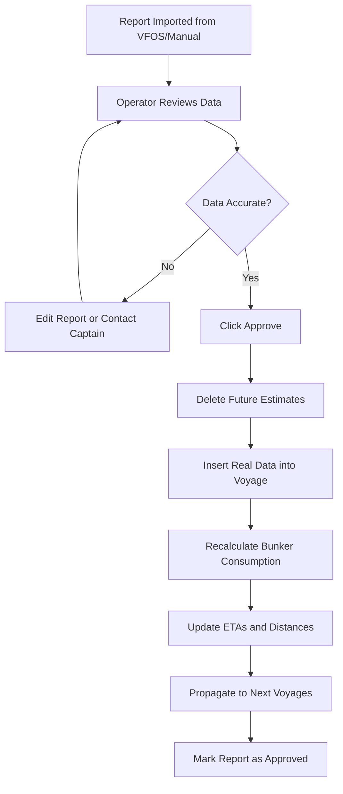

# Comprehensive Documentation: Vessel Reports in BBC BVMS Maritime Software

## Executive Summary

This document provides a detailed analysis of Vessel Reports within the BBC Bunker Voyage Management System (BVMS). Based on the provided transcription, it covers the purpose, processes, data flows, and operational workflows for managing vessel reports in maritime operations. Vessel Reports are critical for replacing estimated data with real-time ship data, enabling accurate cost analysis, fuel management, and voyage optimization. The system integrates with VFOS (Vessel Fuel Oil System) for automated imports and supports manual entries for flexibility.

## 1. Introduction to Vessel Reports

### 1.1 Purpose and Importance

- **Core Function**: Vessel Reports capture real-time data from ships, including position, fuel consumption, speed, and timing. This data replaces initial estimates in BVMS, allowing for precise tracking of voyage progress and resource usage.
- **Daily Operations**: Captains submit reports every 24 hours, providing updates on fuel levels, distances traveled, and ETAs. This ensures operators can monitor and adjust plans proactively.
- **Business Impact**: By comparing estimated vs. actual data, operators can analyze profit/loss variances (e.g., a projected $100,000 profit becoming $95,000 due to delays or fuel inefficiencies). This informs future planning and customer reporting.
- **Accuracy Requirement**: Reports must be highly accurate as they form the basis for real data calculations, affecting bunker planning and consecutive voyages.

### 1.2 Integration with VFOS

- **Automated Import**: For ships under BBC contract (approximately 10+ vessels), reports are synchronized from VFOS via cron jobs every 2 hours or on-demand via manual import buttons.
- **Manual Entry**: For non-contracted ships, operators manually input data after communicating with captains via WhatsApp or other means.
- **Conditions for Sync**: Successful import requires matching voyage numbers, vessel IDs, and transaction setups between VFOS and BVMS. Mismatches (e.g., different routes) lead to data errors.

## 2. Key Concepts in Vessel Reporting

### 2.1 Real vs. Estimated Data

- **Data Evolution**: At transaction start, all data is estimated (e.g., 30 days for a voyage). Daily reports gradually replace estimates with real data (e.g., Day 1: 1 real + 29 estimated; Day 30: 30 real).
- **Recalculation Trigger**: Upon approval, the system deletes future estimates, inserts real data, and recalculates remaining voyage segments.
- **Impact on Profitability**: Real data reveals discrepancies (e.g., higher fuel use due to storms), allowing operators to identify causes and optimize.

### 2.2 Operator Responsibilities

- **Daily Workflow**: Operators evaluate bunker status, connect with captains, review reports, and approve data.
- **Communication**: Direct contact via WhatsApp for emergencies; reports ensure structured updates even without constant internet.
- **Validation Role**: Operators must verify data accuracy before approval, as the system relies on user judgment for complex validations (e.g., fuel type in emission zones).

### 2.3 System Architecture

- **BVMS Components**: Integrates voyage itineraries, bunker planning, and report management.
- **Data Propagation**: Changes in one report affect bunker lots, ETAs, and subsequent voyages.

## 3. Types of Vessel Reports

Vessel Reports are categorized by voyage events. Each type reports specific data and "blocks" corresponding times in the itinerary upon approval.

| Report Type            | Trigger Event              | Key Data Reported                                                                                                                         | Blocked Time/Field | Frequency/Notes                                                        |
| ---------------------- | -------------------------- | ----------------------------------------------------------------------------------------------------------------------------------------- | ------------------ | ---------------------------------------------------------------------- |
| **Departure Report**   | Leaving port               | - Departure time - Current position (lat/long) - Distance to go - Speed - Fuel remaining per tank                             | Departure time     | Once per port departure; sets voyage start.                            |
| **Noon (Null) Report** | Daily at sea (around noon) | - Position - Distance traveled (past 24h) - Distance to go - Speed (past/future) - Fuel consumption per tank - ETA updates | None (updates ETA) | Daily during voyage; allows ETA adjustments for delays (e.g., storms). |
| **Arrival Report**     | Reaching destination       | - Arrival time - Position                                                                                                              | Arrival time       | Once per port arrival; locks ETA.                                      |
| **In Port Report**     | Anchored outside port      | - Position - Estimated berth time (Time of Burst) - Estimated unberth time                                                          | None               | When waiting to berth; estimates cargo operation times.                |
| **Burst Report**       | Entering berth             | - Actual berth time                                                                                                                       | Berth time         | When berthing; locks berth time for cargo ops.                         |
| **Unburst Report**     | Leaving berth              | - Actual unberth time                                                                                                                     | Unberth time       | When leaving berth; enables departure.                                 |
| **Receival Report**    | Fuel loading at port       | - Fuel received (type, tons, lot) - Time of receival                                                                                   | None               | After bunkering; updates bunker inventory.                             |

### 3.1 Detailed Report Examples

- **Departure Report Example**: Ship leaves New Orleans at 22:00 on Oct 17 for Albany. Reports position, 1,800 miles to go, speed, and fuel levels.
- **Noon Report Example**: Next day at 01:00 on Oct 18, ship reports 108 miles traveled, 1,692 miles to go, updated ETA to Oct 23 at 02:00.
- **Arrival Report Example**: Upon reaching Albany on Oct 23 at 02:00, arrival time is locked, preventing further edits.

## 4. Bunker Management and Fuel Tracking

### 4.1 Importance of Bunker Data

- **Critical Role**: Fuel (bunker) is a major cost and operational factor. Reports track consumption per tank to ensure sufficient fuel for voyages, preventing shortages that could strand ships.
- **Risk Management**: Operators monitor daily to detect issues (e.g., unexpected consumption due to ECA zones requiring clean fuel).
- **Consequences of Errors**: Insufficient fuel mid-voyage (e.g., due to 2-3 day delays) could leave ships unable to reach the next port for refueling.

### 4.2 Bunker Lots and Consumption

- **Lot Breakdown**: Fuel is divided into lots by type (e.g., VLSFO, LSMGO) and tank. Each lot has initial, onboard, and ending amounts.
- **Consumption Logic**: System calculates based on ship reports. Operators set initial plans (e.g., use Tank 1 first), but captains may deviate (e.g., use clean fuel in ECA zones).
- **Example Scenario**:
  - Initial Setup: Tank 1 (55 tons LSMGO), Tank 2 (20 tons LSMGO).
  - Captain's Decision: Uses Tank 2 first in ECA zone (clean fuel required).
  - Report Impact: After 3 days, Tank 2 has 11 tons left (used 9 tons), Tank 1 untouched (55 tons). System updates planning accordingly.
- **Ending Lots**: Remaining fuel at voyage end becomes initial fuel for the next voyage, ensuring continuity.

### 4.3 Bunker Planning Integration

- **Visual Tools**: BVMS displays bunker tabs with consumption details, onboard amounts, and future projections.
- **Validation**: Reported amounts must match system calculations. Discrepancies require corrections.
- **Bunker Orders**: Linked to ports (e.g., 150 tons LSMGO at Albany). Receival Reports confirm loading, updating onboard amounts.

## 5. Approval Workflow and Data Processing

### 5.1 Step-by-Step Approval Process

1. **Import/Submission**: Reports arrive via VFOS sync or manual entry.
2. **Review**: Operators check data for accuracy (e.g., position, consumption).
3. **Validation**: System performs basic checks (e.g., consumption logic); operators handle complex validations.
4. **Approval**: Clicking "Approve" triggers data overwrite.
5. **Recalculation**: System deletes future estimates, inserts real data, and recalculates voyage segments.
6. **Propagation**: Updates bunker planning and consecutive voyages.

### 5.2 Workflow Diagram

### 5.3 Post-Approval Effects

- **Immediate Changes**: ETAs, speeds, and bunker levels update based on real data.
- **Example**: Approving a report showing faster speed (15 knots vs. estimated 14) updates arrival time, affecting cargo schedules.

## 6. Data Flow and System Integration

### 6.1 Overall Data Flow

```mermaid
flowchart LR
    A[VFOS System] --> B[Cron Job Import / Manual Trigger]
    B --> C[Vessel Report Module in BVMS]
    C --> D[Approval by Operator]
    D --> E[Overwrite Estimates with Real Data]
    E --> F[Bunker Planning Update]
    F --> G[Voyage Itinerary Recalculation]
    G --> H[Consecutive Voyage Adjustments]
    H --> I[Final Voyage and Cost Analysis]
```

### 6.2 Consecutive Voyages Impact

- **Carryover Mechanism**: Ending times and bunker lots from one voyage become starting points for the next.
- **Example**: Delaying departure in Voyage 1 (e.g., from Oct 21 to Oct 22) shifts ETAs in Voyage 2 and 3, potentially affecting bunker availability.
- **Bunker Carryover**: If Voyage 1 ends with 150 tons, Voyage 2 starts with 150 tons, adjusting consumption plans.

## 7. Error Handling and Corrections

### 7.1 Common Errors

- **Misreporting**: Captains may report incorrect fuel types (e.g., dirty fuel in ECA zones) or consumption figures.
- **Sequence Issues**: Reports submitted out of order (e.g., arrival before departure).
- **Data Mismatches**: VFOS and BVMS setups differ (e.g., route discrepancies).

### 7.2 Correction Methods

1. **Direct Edit**: Operators fix errors in BVMS and re-approve.
2. **Sync with VFOS**: Trigger re-import to fetch updates from captain's corrections.
3. **Bulk Re-approval**: For widespread errors, delete and re-import reports, then approve sequentially.
4. **Worst-Case Reset**: Delete all reports for a voyage and restart import process.

### 7.3 Validation and Best Practices

- **System Validation**: Checks consumption consistency; flags illogical data (e.g., negative fuel).
- **Operator Best Practices**: Double-check before approval; use screenshots for verification; communicate with captains for clarifications.
- **Future Improvements**: Automated background re-approval for fixes; enhanced validation for fuel types in zones.

## 8. Practical Examples and Scenarios

### 8.1 Scenario 1: Storm Delay

- **Situation**: Ship reports delay due to storm, updating ETA from Oct 23 02:00 to Oct 23 06:00.
- **Impact**: Approval recalculates fuel needs; operator checks if sufficient bunker for extra time.
- **Outcome**: Bunker planning adjusts; next voyage's initial lots updated.

### 8.2 Scenario 2: Fuel Misreport in ECA Zone

- **Situation**: Captain reports using dirty fuel in ECA zone (should be clean).
- **Correction**: Operator notices, contacts captain, edits report to reflect clean fuel use, re-approves.
- **Impact**: Bunker consumption recalculates; ensures compliance and accurate planning.

### 8.3 Scenario 3: Consecutive Voyage Shift

- **Situation**: Approving a report delays Voyage 1 departure by 1 day.
- **Impact**: Voyage 2 and 3 ETAs shift; bunker carryover adjusts for new timelines.

## 9. Conclusion

Vessel Reports are the backbone of accurate maritime operations in BVMS, bridging real-time ship data with strategic planning. By integrating with VFOS, enforcing approval workflows, and enabling error corrections, the system ensures operational efficiency, cost accuracy, and proactive decision-making. Operators must prioritize validation to maintain data integrity, while future enhancements could automate more processes for greater reliability.

This documentation serves as a comprehensive guide for understanding and implementing Vessel Reports, drawing directly from operational practices and system capabilities outlined in the transcription.

## Appendices

### A. Glossary

- **BVMS**: Bunker Voyage Management System.
- **VFOS**: Vessel Fuel Oil System (third-party integration).
- **ECA Zone**: Emission Control Area (requires clean fuel).
- **Cron Job**: Automated background process for data import.

### B. References

- Original Transcription: `transcribe/VesselReportWithWfos_raw_transcription.md`.
- Key Sections: Timestamps [00:15-113:30] for detailed workflows.

For further inquiries, refer to the system administrators or the original video transcription for context-specific clarifications.
