# BBC BVMS Vessel Report System & Integration with WFOS

## A Comprehensive Document for Operations, Development, and Data Integrity Teams

---

# PART I: EXECUTIVE SUMMARY & KEY CONCEPTS

## 1. System Overview

### What is the Vessel Report System?

- BVMS Vessel Report system captures daily operational data from vessels during their voyages. When approved, these reports replace future/estimated values of the voyage with actual figures.
- WFOS serves as the primary data source for contracted vessels, while BBC operators manually submit reports for non-contracted ones.

### Core Value Proposition

| Business Need            | Solution                           | Impact                                                              |
| ------------------------ | ---------------------------------- | ------------------------------------------------------------------- |
| **Fuel Management**      | Real-time bunker tracking          | Prevent fuel shortages mid-voyage                                   |
| **Voyage Control**       | Daily monitoring & adjustments     | Proactive decision-making on refueling, routing changes,...         |
| **Financial Accuracy**   | Replace estimates with actual data | Accurate P&L analysis (e.g., $100K projected vs $95K actual profit) |
| **Compliance**           | ECA zone tracking                  | Environmental regulation adherence                                  |
| **Consecutive Planning** | Data carryover between voyages     | Seamless multi-voyage operations                                    |

---

## 2. Key Concepts

### 2.1 Data Evolution Model

```
VOYAGE START                    VOYAGE PROGRESS                      VOYAGE END
┌─────────────┐                ┌─────────────┐                    ┌─────────────┐
│ 30 Days     │    Day 1       │ 1 Real      │      Day 30        │ 30 Real     │
│ 100% Est.   │  ────────►     │ 29 Est.     │    ────────►       │ 0% Est.     │
└─────────────┘                └─────────────┘                    └─────────────┘
   All Future                   Mixed Data                        All Historical
```

**Critical Principle:** Approving a vessel report will:

1. **Deletes** all future data of voyage (itinerary times, bunkers & related costs)
2. **Inserts** real reported data from the vessel report (time, current position & bunker levels)
3. **Summarizes** current actual data & **Recalculates** future figures again
4. **Propagates** ending figures (bunkers & times) toward the next voyage as initial data

### 2.2 System Integration Architecture

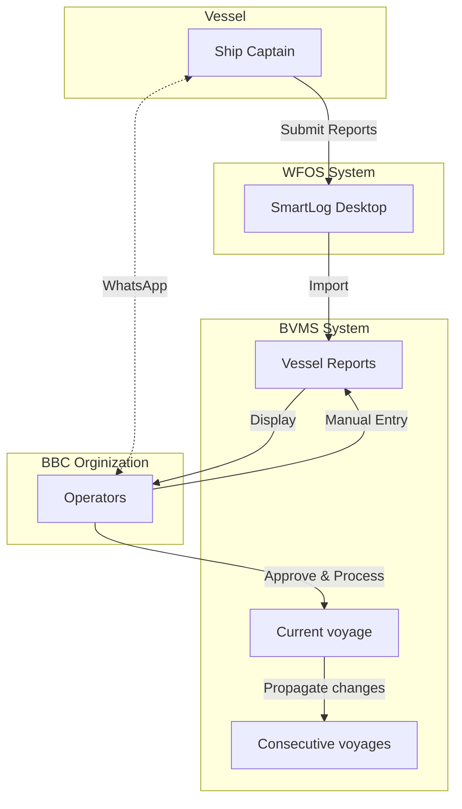

### 2.3 Operational Team Structure

| Role                   | Vessels Managed  | Responsibility                           | Tools                 |
| ---------------------- | ---------------- | ---------------------------------------- | --------------------- |
| **BBC Charterer**      | N/A              | Voyage nomination with estimated figures | BVMS Estimate         |
| **BBC Operator**       | 3-5 vessels each | Daily report approval, voyage monitoring | BVMS Voyage, WhatsApp |
| **Ship Captain**       | Assigned vessel  | Submit reports every 24 hours            | WFOS, WhatsApp        |
| **System (Automated)** | All contracted   | Import, validate, calculate logics       | BVMS API + WFOS API   |

### 2.4 Workflow Summary Digram

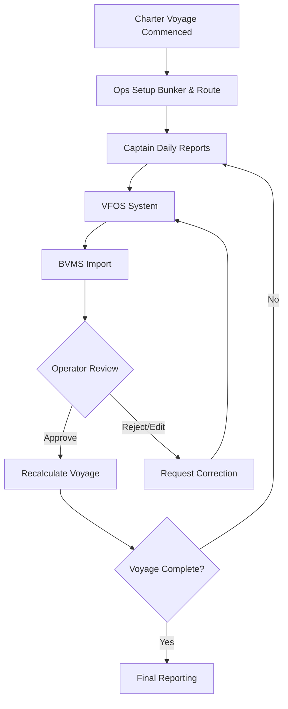

---

## 3. Report Types Quick Reference

| Report Type   | When Submitted       | Key Data Points                                             | Time Lock                  |
| ------------- | -------------------- | ----------------------------------------------------------- | -------------------------- |
| **Departure** | Leaving port         | Departure time (actual), from-to ports, initial bunker      | Locks **Departure Time**   |
| **Noon**      | Daily at sea         | Distance traveled (24h), distance to go, bunker consumption | Updates **ETA**            |
| **Arrival**   | Reaching destination | Arrival time (actual), final position                       | Locks **Arrival Time**     |
| **In Port**   | While docked         | Time of berth, time of unberth                              | Reports **berth schedule** |
| **Berth**     | Actual berthing      | Berth time (moment of truth)                                | Locks **Berth Time**       |
| **Unberth**   | Leaving berth        | Unberth time (moment of truth)                              | Locks **Unberth Time**     |
| **Receival**  | Receiving fuel       | Bunker lot received, quantity, specs                        | Adds bunker to **onboard** |

---

## 4. Bunker Management Summary

### 4.1 Bunker Structure Hierarchy

```
BUNKER TAB (Summary View)
├── Total VLSFO: 186 tons               ◄── Display in each Itinerary row
├── Total LSMGO: 76 tons                ◄── Sum of all lots of this type
└── Total MDO: 40 tons

BUNKER LOT (Detailed Breakdown)
├── VLSFO Lot #1: 186 tons @ $489/ton   ◄── Lot-specific tracking
│   ├── Initial: 186
│   ├── Onboard: 186
│   ├── Consumption: 34
│   ├── Current: 152
│   └── Ending: 0
├── LSMGO Lot #1: 55 tons @ $682/ton
└── LSMGO Lot #2: 20 tons @ $682/ton
```

### 4.2 Critical Bunker Metrics

| Metric                 | Definition                          | Why It Matters                 |
| ---------------------- | ----------------------------------- | ------------------------------ |
| **Onboard Amount**     | Fuel confirmed on vessel via report | Validates actual inventory     |
| **Consumption Amount** | Tons used per 24 hours              | Actual usage metrics by engine |
| **Receival Amount**    | Tons bunkered at port               | Updates inventory levels       |

---

## 5. Consecutive Voyage Impact

### 5.1 Data Carryover Model

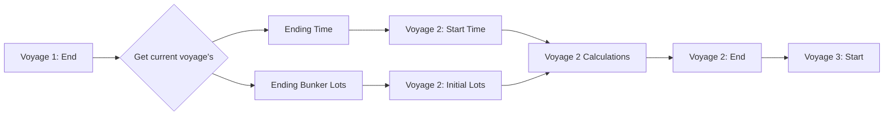

### 5.2 Cascade Effect Example

| Event               | Voyage 1 (Current)                           | Voyage 2 (Next)                        | Voyage 3 (Future)    |
| ------------------- | -------------------------------------------- | -------------------------------------- | -------------------- |
| **Before Approval** | Depart: Oct 21, 08:00<br/>Ending: 187t VLSFO | Start: Oct 21, 08:00<br/>Initial: 187t | Start: Oct 25, 10:00 |
| **After Approval**  | Depart: Oct 20, 22:00<br/>Ending: 150t VLSFO | Start: Oct 20, 22:00<br/>Initial: 150t | Start: Oct 24, 20:00 |
| **Change Impact**   | -10 hours, -37t fuel                         | -10 hours, -37t initial                | -14 hours adjusted   |

**Critical Insight:** One report approval can affect **all future voyages** for that vessel.

---

## 6. Error Handling Matrix

### 6.1 Common Errors & Solutions

| Error Type               | Example                               | Detection         | Impact Severity             |
| ------------------------ | ------------------------------------- | ----------------- | --------------------------- |
| **Wrong Fuel Type**      | Dirty fuel used in ECA                | Operator review   | 🟡 Medium (Compliance)      |
| **Consumption Mismatch** | Reports 2.1 used, actually 0.0        | System validation | 🔴 High (Cascade effect)    |
| **Report Types Paradox** | Departure submited without an arrival | System validation | 🔴 High (Wrong calculation) |

### 6.2 Correction Methods Comparison

| Method                    | Use Case                  | Steps                                          | Data Loss Risk | Operator Effort |
| ------------------------- | ------------------------- | ---------------------------------------------- | -------------- | --------------- |
| **1. Direct Edit**        | Minor single error        | Edit → Save → Re-approve                       | None           | Low             |
| **2. Captain Resubmit**   | Wrong from WFOS submitted | Request → WFOS fix → Sync → Override → Approve | None           | Medium          |
| **3. Batch Approval**     | Historical chain error    | Fix first → Batch approve sequence             | ⚠️             | High            |
| **4. Delete & Re-import** | Massive errors            | Delete all → Re-import → Approve all           | ⚠️             | High            |

---

## 7. Prerequisites for Successful Import

| Requirement               | Description                   |
| ------------------------- | ----------------------------- |
| ✓ **Vessel in Contract**  | Vessels in contract agreement |
| ✓ **Voyage Number Match** | WFOS Voy.No == BVMS Voy.No    |
| ✓ **Routing Match**       | Same ports/order              |

---

# PART II: DETAILED TECHNICAL DOCUMENTATION

## 9. Detailed Report Type Specifications

### 9.1 Departure Report

**Purpose:** Marks the official start of a voyage, capturing the exact moment the vessel leaves port.

#### Data Fields

| Field            | Type           | Required | Editable After Approval | Description                              |
| ---------------- | -------------- | -------- | ----------------------- | ---------------------------------------- |
| Departure Time   | DateTime       | ✓ Yes    | ❌ No                   | **Moment of truth** - locks voyage start |
| From Port        | Port ID        | ✓ Yes    | ❌ No                   | Origin port                              |
| To Port          | Port ID        | ✓ Yes    | ✓ Yes (until arrival)   | Destination port                         |
| Current Position | Lat/Long       | ✓ Yes    | N/A                     | GPS coordinates at departure             |
| Distance to Go   | Nautical Miles | ✓ Yes    | N/A                     | Total remaining distance                 |
| Speed            | Knots          | Optional | N/A                     | Initial speed                            |
| Bunker Status    | Per Tank       | ✓ Yes    | N/A                     | Initial fuel inventory                   |

#### Workflow

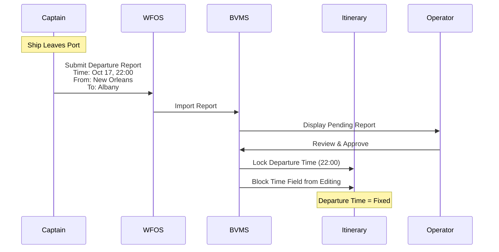

---

### 9.2 Noon (Null) Report

**Purpose:** Daily progress tracking while at sea, allowing ETA adjustments based on actual conditions.

#### Data Fields

| Field              | Type           | Required | Updates | Description                   |
| ------------------ | -------------- | -------- | ------- | ----------------------------- |
| Report Time        | DateTime       | ✓ Yes    | Daily   | When report submitted (~noon) |
| Current Position   | Lat/Long       | ✓ Yes    | Daily   | Current GPS location          |
| Distance Traveled  | Nautical Miles | ✓ Yes    | Daily   | Last 24-hour progress         |
| Distance to Go     | Nautical Miles | ✓ Yes    | Daily   | Remaining to destination      |
| Speed (Past)       | Knots          | ✓ Yes    | Daily   | Actual speed last 24h         |
| Speed (Future)     | Knots          | Optional | Daily   | Expected speed to destination |
| ETA                | DateTime       | ✓ Yes    | Daily   | Updated arrival estimate      |
| Bunker Consumption | Per Tank       | ✓ Yes    | Daily   | Fuel used last 24h            |

#### ETA Evolution Example

| Day | Report Time   | Distance Traveled | Distance to Go | Speed    | ETA           | Change Reason         |
| --- | ------------- | ----------------- | -------------- | -------- | ------------- | --------------------- |
| 1   | Oct 18, 01:00 | 108 nm            | 1692 nm        | 14.5 kts | Oct 23, 02:00 | Initial estimate      |
| 2   | Oct 19, 01:00 | 115 nm            | 1577 nm        | 13.2 kts | Oct 23, 06:00 | +4h (storm delay)     |
| 3   | Oct 20, 01:00 | 120 nm            | 1457 nm        | 15.1 kts | Oct 23, 06:00 | No change             |
| 4   | Oct 21, 01:00 | 125 nm            | 1332 nm        | 15.8 kts | Oct 23, 01:00 | -5h (good conditions) |

#### Consumption Tracking

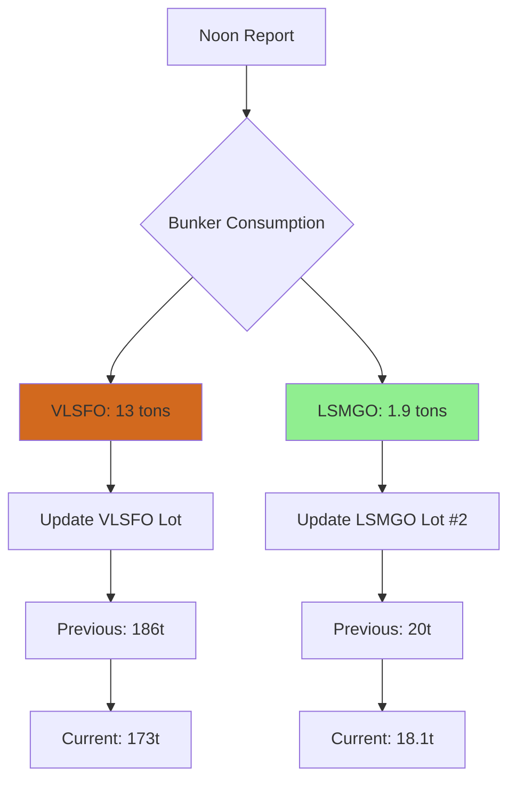

---

### 9.3 Arrival Report

**Purpose:** Confirms vessel reached destination, locking the arrival time as a historical fact.

#### Key Characteristics

| Aspect                | Details                                                   |
| --------------------- | --------------------------------------------------------- |
| **Time Lock**         | Arrival time becomes **immutable** after approval         |
| **ETA Closure**       | Final ETA from noon reports is compared to actual arrival |
| **Bunker Snapshot**   | Records final fuel state at destination                   |
| **Variance Analysis** | Enables estimated vs. actual comparison                   |

#### Workflow

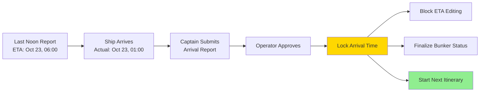

---

### 9.4 In Port, Berth, Unberth Reports

#### Port Operations Timeline

```mermaid
gantt
    title Complete Port Operation Timeline
    dateFormat HH:mm
    section Arrival
    Ship Arrival (Outside)     :a1, 08:00, 2h
    Idle Time (Waiting)       :a2, after a1, 4h
    section Moving to Berth
    Intra (Moving to Berth)   :a3, after a2, 1h
    section Cargo Operations
    Berth Time (Start)        :milestone, after a3, 0h
    Cargo Loading/Unloading   :a4, after a3, 12h
    Unberth Time (End)        :milestone, after a4, 0h
    section Departure
    Departure                 :a5, after a4, 1h
```

#### Port Phase Definitions

| Phase          | Duration  | Fuel Consumption   | Speed   | Port Fees | Description                           |
| -------------- | --------- | ------------------ | ------- | --------- | ------------------------------------- |
| **Idle Time**  | Variable  | Low (auxiliary)    | 0 kts   | ❌ None   | Waiting outside port to minimize fees |
| **Intra Time** | 0.5-2 hrs | High (maneuvering) | 5-6 kts | ✓ Starts  | Moving from anchorage to berth        |
| **Cargo Time** | 8-24 hrs  | Very Low           | 0 kts   | ✓ Active  | Loading/unloading at berth            |

#### Why Idle Time Matters

**Scenario:** Ship arrives 12 hours before cargo ready

**Option A (No Idle):**

- Enter port immediately
- Pay 12 hours of port fees
- Cost: ~$500/hour = $6,000

**Option B (With Idle):**

- Wait outside port (free anchorage)
- Enter port when cargo arrives
- Cost: $0 idle + normal berth fees

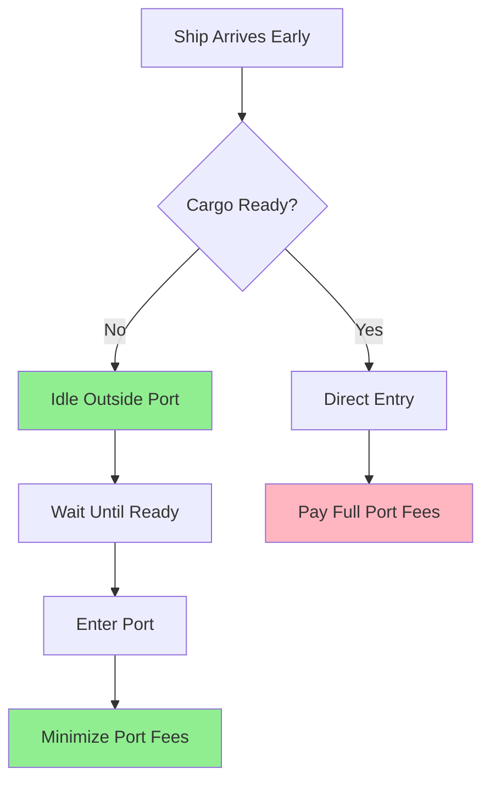

---

### 9.5 Receival Report

**Purpose:** Documents fuel bunkering, updating inventory with new fuel lots.

#### Bunker Order to Receival Flow

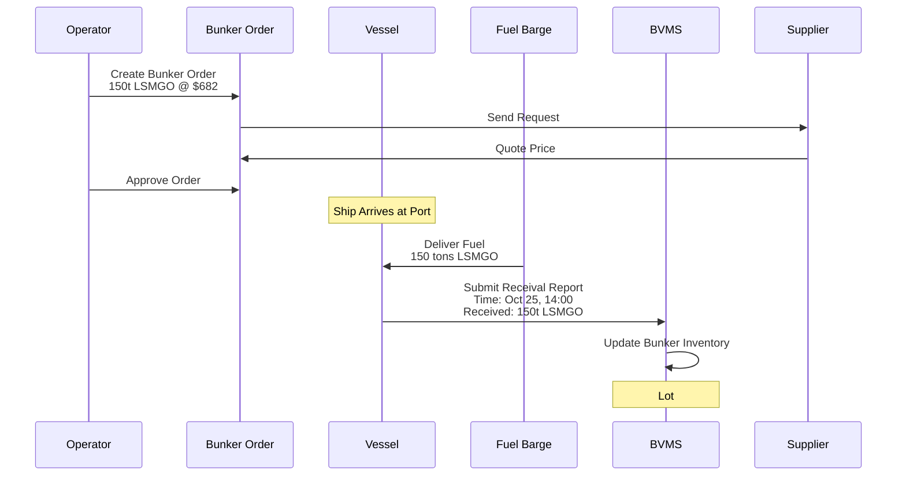

#### Receival Impact on Bunker Planning

**Before Receival:**

```
LSMGO Inventory:
├── Lot #1: 55t (unused)
├── Lot #2: 11t (partially used)
└── Total: 66t
```

**After Receival:**

```
LSMGO Inventory:
├── Lot #1: 55t (unused)
├── Lot #2: 11t (partially used)
├── Lot #3: 150t (NEW - from receival)
└── Total: 216t
```

---

## 10. Advanced Bunker Management

### 10.1 Lot Consumption Logic

#### Operator Plan vs. Captain Reality

**Setup Example:**

| Lot | Type  | Initial | Price | Operator Plan |
| --- | ----- | ------- | ----- | ------------- |
| 1   | LSMGO | 55t     | $682  | Use FIRST     |
| 2   | LSMGO | 20t     | $682  | Use SECOND    |

**Actual Reports:**

```mermaid
graph TD
    A[Day 1 Noon Report] --> B{ECA Zone?}
    B -->|Yes| C[Must Use Clean Fuel]
    C --> D[Captain Uses Lot #2]
    D --> E[Lot #2: 20t → 18.1t]

    A2[Day 2 Noon Report] --> B2{Still ECA?}
    B2 -->|Yes| C2[Continue Clean Fuel]
    C2 --> D2[Captain Uses Lot #2]
    D2 --> E2[Lot #2: 18.1t → 11t]

    A3[Day 3 Noon Report] --> B3{Left ECA?}
    B3 -->|Yes| C3[Switch to Dirty Fuel]
    C3 --> D3[Captain Uses VLSFO]
    D3 --> E3[Lot #2: 11t (unchanged)]

    style C fill:#FFD700
    style C2 fill:#FFD700
    style C3 fill:#90EE90
```

**Result:**

- Lot #1: 55t → 55t (unused - plan ignored)
- Lot #2: 20t → 11t (used first - ECA compliance)
- VLSFO: 186t → 152t (used after leaving ECA)

### 10.2 ECA Zone Fuel Management

#### ECA Zone Regulations

| Zone Type      | Fuel Type Allowed      | Sulfur Content | Typical Regions              |
| -------------- | ---------------------- | -------------- | ---------------------------- |
| **ECA Zone**   | LSMGO (clean)          | ≤0.1% sulfur   | Baltic, North Sea, US coasts |
| **Open Sea**   | VLSFO (dirty) or clean | ≤0.5% sulfur   | Most oceans                  |
| **Port Areas** | LSMGO (clean)          | ≤0.1% sulfur   | All ports                    |

#### Automatic Calculation Example

**Route:** Singapore → Hamilton (Total: 2,919 nm)

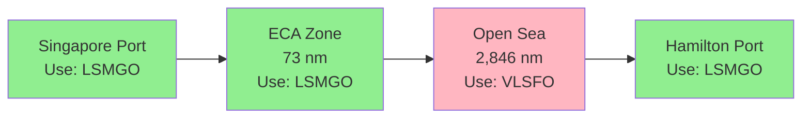

**Fuel Allocation:**

```
LSMGO Required:
- ECA Zone: 73 nm × 0.32 t/nm = 23.4 tons
- Port ops: ~5 tons
- Total: 28.4 tons

VLSFO Required:
- Open Sea: 2,846 nm × 0.05 t/nm = 142.3 tons
```

### 10.3 Bunker Validation Rules

#### System Validations

| Validation Rule       | Formula                            | Error Message                | Severity                   |
| --------------------- | ---------------------------------- | ---------------------------- | -------------------------- |
| **Consumption Match** | `Previous - Consumption = Current` | "Bunker math doesn't add up" | 🔴 High                    |
| **Non-negative**      | `Current >= 0`                     | "Negative fuel impossible"   | 🔴 High                    |
| **Onboard Sync**      | `Bunker Tower = Sum(All Lots)`     | "Tower/Lot mismatch"         | 🟡 Medium                  |
| **ECA Compliance**    | `If(ECA) then LSMGO`               | "Wrong fuel in ECA"          | 🟡 Medium (operator check) |

#### Consumption Detail View

**Color Coding:**

| Color        | Meaning         | Data Source             | Editability                |
| ------------ | --------------- | ----------------------- | -------------------------- |
| 🟤 **Brown** | Real data       | Approved vessel reports | ❌ Read-only               |
| ⚪ **White** | Future estimate | System calculations     | ✓ Recalculated on approval |

**Example Display:**

```
Lot #1 (VLSFO):
[🟤 186] → [🟤 179] → [🟤 165] → [🟤 152] → [⚪ 100] → [⚪ 51] → [⚪ 0]
 Start    Day 1      Day 2      Day 3      Day 4      Day 5      End
         (-7t)      (-14t)     (-13t)     (-52t)     (-49t)    (-51t)

        ←──── Real Data (Reported) ────→  ←──── Future (Calculated) ────→
```

---

## 11. Consecutive Voyage Deep Dive

### 11.1 Data Carryover Mechanism

#### Two Critical Transfer Points

**1. Time Transfer:**

```
Voyage 1 Departure Time (End of Port A)
    ↓
Voyage 2 Arrival Time (Start at Port A)
```

**2. Bunker Transfer:**

```
Voyage 1 Ending Lots
    ├── VLSFO: 150t
    ├── LSMGO: 20t
    └── MDO: 5t
              ↓
Voyage 2 Initial Lots
    ├── VLSFO: 150t (carried over)
    ├── LSMGO: 20t (carried over)
    └── MDO: 5t (carried over)
```

### 11.2 Cascade Calculation Example

#### Scenario: Adding Bunker Order Mid-Voyage

**Before:**

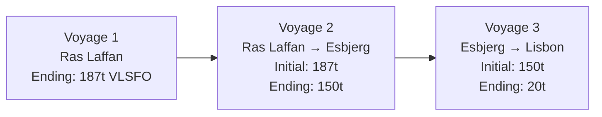

**After Adding 5,000t LSMGO at Ras Laffan:**

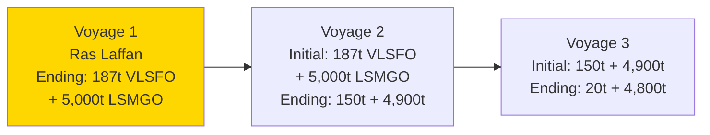

**Impact Table:**

| Voyage                   | Before (LSMGO) | After (LSMGO) | Change                 |
| ------------------------ | -------------- | ------------- | ---------------------- |
| **Voyage 1 End**         | 0t             | +5,000t       | Added via Bunker Order |
| **Voyage 2 Start**       | 0t             | +5,000t       | Inherited from V1      |
| **Voyage 2 Consumption** | 0t             | 100t used     | Now has fuel to use    |
| **Voyage 2 End**         | 0t             | 4,900t        | Passed to V3           |
| **Voyage 3 Start**       | 0t             | 4,900t        | Inherited from V2      |
| **Voyage 3 End**         | 0t             | 4,800t        | Ready for V4           |

### 11.3 Time Cascade Impact

**Original Setup:**

| Voyage | Port                 | Original Departure | Original Arrival |
| ------ | -------------------- | ------------------ | ---------------- |
| 1      | Ras Laffan           | Oct 21, 08:00      | -                |
| 2      | Ras Laffan → Esbjerg | Oct 21, 08:00      | Oct 31, 10:00    |
| 3      | Esbjerg → Lisbon     | Oct 31, 10:00      | Nov 5, 14:00     |

**After Approving Report (Changed to Oct 20, 22:00):**

| Voyage | Port                 | New Departure   | New Arrival   | Time Shift |
| ------ | -------------------- | --------------- | ------------- | ---------- |
| 1      | Ras Laffan           | Oct 20, 22:00 ✓ | -             | -10 hours  |
| 2      | Ras Laffan → Esbjerg | Oct 20, 22:00 ✓ | Oct 30, 24:00 | -10 hours  |
| 3      | Esbjerg → Lisbon     | Oct 30, 24:00 ✓ | Nov 5, 04:00  | -10 hours  |

---

## 12. Error Handling Procedures

### 12.1 Error Detection Methods

#### 12.1.1 System Automatic Validation

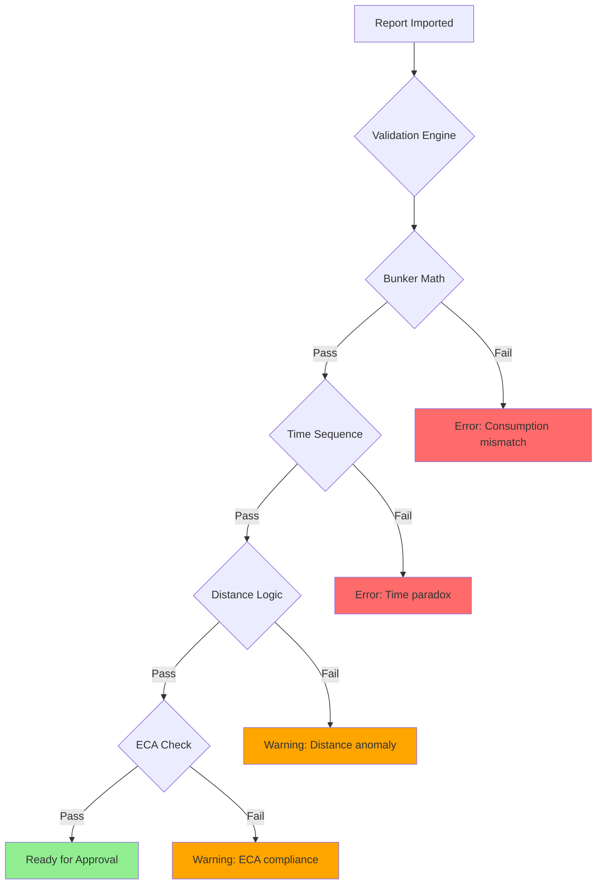

#### 12.1.2 Operator Manual Review

| Check Point     | What to Verify             | Red Flags             |
| --------------- | -------------------------- | --------------------- |
| **Position**    | GPS coordinates reasonable | Jump >500 nm in 24h   |
| **Speed**       | 10-20 knots typical        | <5 or >25 knots       |
| **Consumption** | Historical patterns        | 2x normal rate        |
| **ETA**         | Logical progression        | Sudden +/- 12h shifts |
| **Fuel Type**   | ECA compliance             | Dirty fuel in ECA     |

### 12.2 Correction Workflows

#### Workflow 1: Minor Single Error

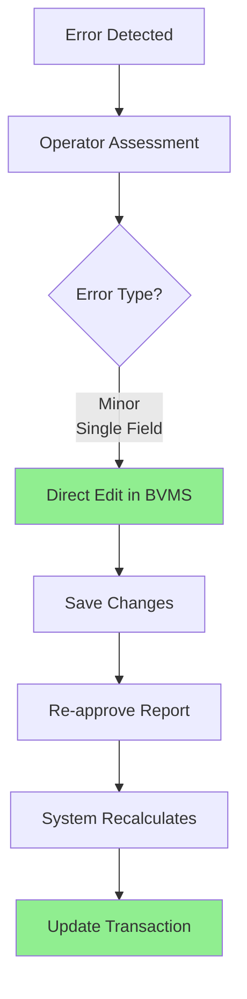

**Example:**

- Error: Distance traveled = 1,108 nm (should be 108 nm)
- Fix: Edit field → 108 nm → Save → Re-approve
- Time: ~5 minutes

#### Workflow 2: Captain Source Error

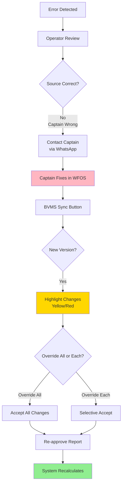

**Example:**

- Error: Used dirty fuel in ECA zone
- Fix: Operator texts captain → Captain edits WFOS → Sync → Override changes → Re-approve
- Time: ~15-30 minutes

#### Workflow 3: Cascading Historical Error

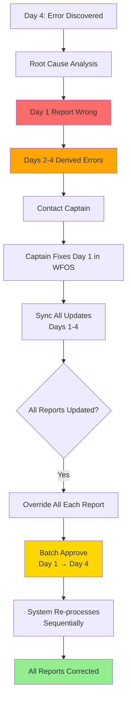

**Example:**

- Day 1: Reported 70t remaining (actual: 68t)
- Day 2-4: All consumption calculations off by 2t
- Fix: Fix Day 1 → Sync all → Batch approve Days 1-4 → Chain corrects
- Time: ~45 minutes

#### Workflow 4: Nuclear Reset

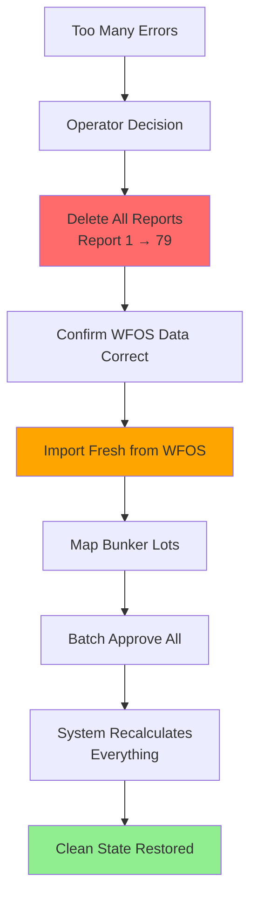

**Example:**

- 79 reports, 30+ errors scattered throughout
- Fix: Delete all → Re-import → Map lots → Batch approve all
- Time: ~2 hours
- ⚠️ **Risk:** Loses all operator manual edits

### 12.3 Error Prevention Best Practices

| Practice                        | Frequency    | Responsibility     | Benefit                 |
| ------------------------------- | ------------ | ------------------ | ----------------------- |
| **Double-check before approve** | Every report | Operator           | Prevents initial errors |
| **Screenshot comparisons**      | When unsure  | Operator           | Visual validation       |
| **Captain communication**       | As needed    | Operator + Captain | Source accuracy         |
| **Daily bunker reconciliation** | Daily        | Operator           | Early detection         |
| **Consecutive voyage review**   | Weekly       | Operations Manager | Cascade check           |

---

## 13. System Technical Architecture

### 13.1 Data Structure

```
VOYAGE (Root Entity)
├── voyage_id: String
├── vessel_id: String (FK)
├── status: Enum [Planned, Active, Completed]
├── estimated_data: JSON
│
├── ITINERARIES (1:N)
│   ├── itinerary_id: String
│   ├── sequence: Integer
│   ├── from_port: Port (FK)
│   ├── to_port: Port (FK)
│   ├── departure_time: DateTime [Nullable, Locked on Departure Report]
│   ├── arrival_time: DateTime [Nullable, Locked on Arrival Report]
│   ├── berth_time: DateTime [Nullable, Locked on Berth Report]
│   ├── unberth_time: DateTime [Nullable, Locked on Unberth Report]
│   ├── distance_planned: Float
│   ├── distance_actual: Float [From Reports]
│   ├── bunker_summary: JSON (Tower View)
│   │
│   └── BUNKER_LOTS (1:N)
│       ├── lot_id: String
│       ├── fuel_type: Enum [VLSFO, LSMGO, MDO, etc.]
│       ├── initial_quantity: Float
│       ├── onboard_quantity: Float [From Reports]
│       ├── consumption: Float [From Reports]
│       ├── current_quantity: Float [Calculated]
│       ├── ending_quantity: Float [Calculated]
│       ├── price_per_ton: Float
│       └── sequence: Integer (Usage order)
│
└── VESSEL_REPORTS (1:N)
    ├── report_id: String
    ├── report_type: Enum [Departure, Noon, Arrival, InPort, Berth, Unberth, Receival]
    ├── report_time: DateTime
    ├── source: Enum [WFOS, Manual]
    ├── status: Enum [Pending, Approved, Rejected]
    ├── approved_by: User (FK) [Nullable]
    ├── approved_at: DateTime [Nullable]
    ├── position: JSON {lat, lon}
    ├── distance_traveled: Float [Nullable]
    ├── distance_to_go: Float [Nullable]
    ├── speed_past: Float [Nullable]
    ├── speed_future: Float [Nullable]
    ├── eta: DateTime [Nullable]
    ├── bunker_consumption: JSON [Array of {lot_id, consumption}]
    ├── version: Integer (For WFOS updates)
    └── changes_log: JSON (Audit trail)
```

### 13.2 Approval Processing Logic

```python
class VesselReportApprovalEngine:

    def approve_report(self, report_id: str, operator_id: str):
        """
        Main approval workflow
        """
        report = self.get_report(report_id)
        voyage = self.get_voyage(report.voyage_id)

        # Step 1: Validate report data
        validation_result = self.validate_report(report, voyage)
        if not validation_result.is_valid:
            raise ValidationError(validation_result.errors)

        # Step 2: Lock "moment of truth" timestamps
        self.lock_critical_times(report, voyage)

        # Step 3: Delete future estimates
        self.delete_future_estimates(voyage, report.report_time)

        # Step 4: Insert real data
        self.insert_real_data(report, voyage)

        # Step 5: Recalculate future voyage segments
        self.recalculate_future_segments(voyage, report.report_time)

        # Step 6: Update bunker planning
        self.update_bunker_planning(voyage, report)

        # Step 7: Propagate to consecutive voyages
        if report.type in [ReportType.DEPARTURE, ReportType.ARRIVAL]:
            self.propagate_to_consecutive(voyage, report)

        # Step 8: Mark report as approved
        report.status = ReportStatus.APPROVED
        report.approved_by = operator_id
        report.approved_at = datetime.now()
        self.save_report(report)

        # Step 9: Audit log
        self.log_approval(report, operator_id)

        return voyage

    def validate_report(self, report, voyage):
        """
        Multi-layer validation
        """
        errors = []

        # Bunker math validation
        if not self.validate_bunker_consumption(report, voyage):
            errors.append("Bunker consumption doesn't match previous + current")

        # Time sequence validation
        if not self.validate_time_sequence(report, voyage):
            errors.append("Time sequence violation (e.g., arrival before departure)")

        # Distance logic validation
        if not self.validate_distance_logic(report, voyage):
            errors.append("Distance traveled + distance to go ≠ total route")

        # ECA compliance (warning only)
        if not self.validate_eca_compliance(report, voyage):
            errors.append("WARNING: Possible ECA compliance issue")

        return ValidationResult(is_valid=len(errors)==0, errors=errors)

    def propagate_to_consecutive(self, current_voyage, report):
        """
        Update all future voyages for same vessel
        """
        next_voyage = self.get_next_voyage(current_voyage.vessel_id, current_voyage.end_time)

        while next_voyage:
            # Update starting time
            time_delta = report.actual_time - current_voyage.estimated_time
            next_voyage.start_time += time_delta

            # Update initial bunker lots
            ending_bunker = self.calculate_ending_bunker(current_voyage)
            next_voyage.initial_bunker = ending_bunker

            # Recalculate entire voyage
            self.recalculate_voyage(next_voyage)

            # Move to next consecutive voyage
            current_voyage = next_voyage
            next_voyage = self.get_next_voyage(next_voyage.vessel_id, next_voyage.end_time)
```

### 13.3 WFOS Integration Architecture

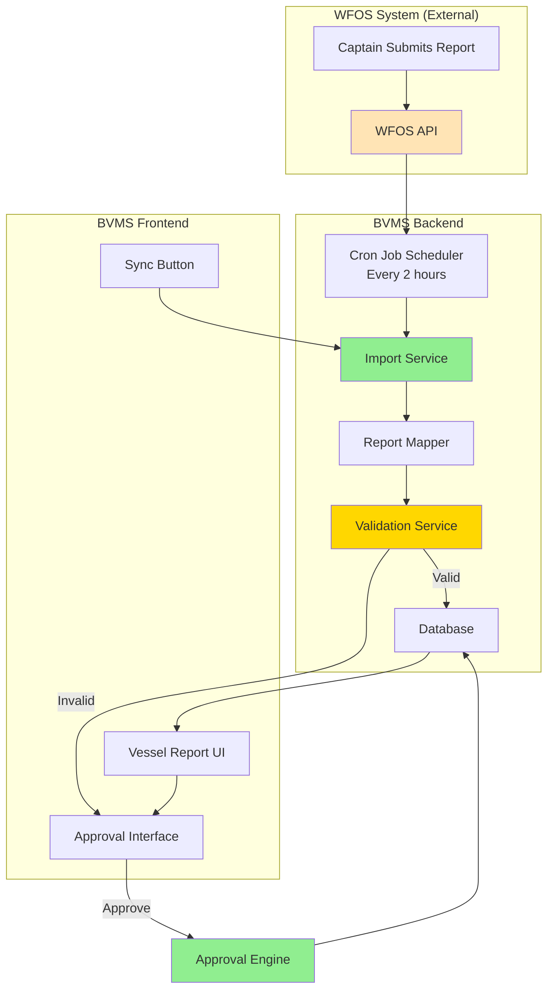

#### Import Service Logic

```python
class VFOSImportService:

    def import_reports_for_vessel(self, vessel_id: str, voyage_id: str):
        """
        Import reports from WFOS for a specific voyage
        """
        # Step 1: Check if vessel is in contract
        if not self.is_contracted_vessel(vessel_id):
            raise VesselNotContractedError(f"Vessel {vessel_id} not in WFOS contract")

        # Step 2: Get voyage number mapping
        vfos_voyage_number = self.get_vfos_voyage_number(voyage_id)
        if not vfos_voyage_number:
            raise VoyageNumberMismatchError(f"No WFOS voyage mapping for {voyage_id}")

        # Step 3: Fetch reports from WFOS API
        vfos_reports = self.vfos_api.get_reports(vessel_id, vfos_voyage_number)

        # Step 4: Check for existing reports
        existing_reports = self.get_existing_reports(voyage_id)

        imported_count = 0
        updated_count = 0

        for vfos_report in vfos_reports:
            # Step 5: Map WFOS data to BVMS structure
            bvms_report = self.map_vfos_to_bvms(vfos_report)

            # Step 6: Check if report already exists
            existing = self.find_existing_report(bvms_report, existing_reports)

            if existing:
                # Check version
                if vfos_report.version > existing.version:
                    # Mark as updated
                    bvms_report.is_updated = True
                    bvms_report.previous_version = existing
                    self.save_report(bvms_report)
                    updated_count += 1
            else:
                # New report
                self.save_report(bvms_report)
                imported_count += 1

        return ImportResult(imported=imported_count, updated=updated_count)

    def map_vfos_to_bvms(self, vfos_report: dict) -> VesselReport:
        """
        Transform WFOS data structure to BVMS data structure
        """
        return VesselReport(
            report_type=self.map_report_type(vfos_report['reportType']),
            report_time=self.parse_datetime(vfos_report['timestamp']),
            position={
                'lat': vfos_report['position']['latitude'],
                'lon': vfos_report['position']['longitude']
            },
            distance_traveled=vfos_report.get('distanceTraveled'),
            distance_to_go=vfos_report.get('distanceToGo'),
            speed_past=vfos_report.get('speedPast'),
            speed_future=vfos_report.get('speedFuture'),
            eta=self.parse_datetime(vfos_report.get('eta')),
            bunker_consumption=self.map_bunker_consumption(vfos_report['bunker']),
            source='WFOS',
            version=vfos_report.get('version', 1)
        )
```

---

## 14. Operational Procedures

### 14.1 Daily Operator Workflow

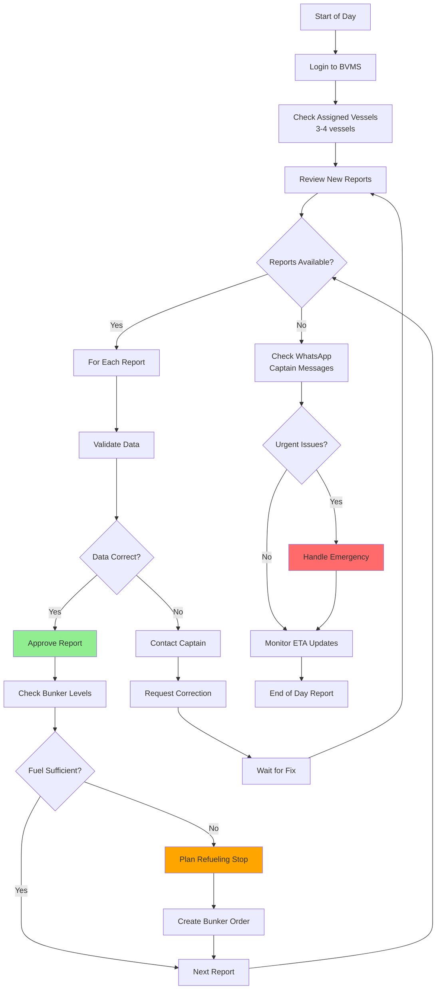

### 14.2 Emergency Procedures

#### Scenario: Fuel Shortage Alert

```mermaid
sequenceDiagram
    participant Op as Operator
    participant Sys as BVMS
    participant Cap as Captain
    participant Port as Fuel Supplier

    Sys->>Op: ALERT: Low fuel detected<br/>Estimated shortage in 2 days
    Op->>Sys: Review bunker consumption
    Op->>Sys: Calculate nearest refuel port

    Op->>Cap: WhatsApp: Emergency fuel order<br/>Stop at Panama
    Cap->>Op: Confirmed, adjusting route

    Op->>Port: Request quote for 200t VLSFO
    Port->>Op: Quote: $500/ton
    Op->>Sys: Create Bunker Order
    Op->>Sys: Update itinerary (add Panama stop)

    Note over Sys: Recalculate entire voyage
    Sys->>Op: Updated ETA +18 hours

    Op->>Customer: Notify delay

    Note over Cap: Ship refuels at Panama
    Cap->>Sys: Submit Receival Report<br/>Received 200t
    Op->>Sys: Approve Receival
    Sys->>Sys: Update bunker inventory
```

### 14.3 End-of-Voyage Procedures

**Checklist:**

| Step | Action                       | Verification                     | Responsible  |
| ---- | ---------------------------- | -------------------------------- | ------------ |
| 1    | Ensure all reports approved  | All reports have green checkmark | Operator     |
| 2    | Validate final bunker status | Ending lots match last report    | Operator     |
| 3    | Lock all itinerary times     | No editable time fields          | System       |
| 4    | Generate variance report     | Estimated vs. Actual comparison  | System       |
| 5    | Update consecutive voyage    | Next voyage initial data set     | System       |
| 6    | Financial reconciliation     | Compare P&L estimates            | Finance Team |
| 7    | Archive voyage data          | Move to historical database      | System       |

---

## 15. Glossary & Reference

### 15.1 Technical Terms

| Term                   | Full Form                       | Definition                                    | Example                             |
| ---------------------- | ------------------------------- | --------------------------------------------- | ----------------------------------- |
| **BVMS**               | Bunker Voyage Management System | BBC's maritime operations management software | -                                   |
| **WFOS**               | Vessel Fuel Oil System          | Third-party captain reporting system          | Approximately 10 BBC vessels use it |
| **ECA**                | Emission Control Area           | Zones requiring low-sulfur fuel (≤0.1%)       | Baltic Sea, North Sea, US coasts    |
| **ETA**                | Estimated Time of Arrival       | Projected arrival time (updates daily)        | Oct 23, 06:00                       |
| **Noon Report**        | Daily Report                    | Captain's daily progress report (~noon time)  | Position, fuel, distance            |
| **Moment of Truth**    | -                               | Timestamp that locks upon approval            | Departure Time = Oct 20, 22:00 ✓    |
| **Onboard Amount**     | -                               | Fuel quantity confirmed via vessel report     | 186t VLSFO verified by captain      |
| **Bunker Lot**         | -                               | Specific fuel tank/purchase with unique price | Lot #1: 55t @ $682/ton              |
| **Consecutive Voyage** | -                               | Sequential voyages for same vessel            | V1 → V2 → V3 (same ship)            |
| **Batch Approve**      | -                               | Sequentially re-approve multiple reports      | Fix Day 1 → Batch approve Days 1-4  |

### 15.2 Fuel Types

| Type      | Full Name                 | Sulfur Content | Usage                          | Cost     |
| --------- | ------------------------- | -------------- | ------------------------------ | -------- |
| **VLSFO** | Very Low Sulfur Fuel Oil  | ≤0.5%          | Open sea (dirty fuel)          | Low      |
| **LSMGO** | Low Sulfur Marine Gas Oil | ≤0.1%          | ECA zones, ports (clean fuel)  | High     |
| **MDO**   | Marine Diesel Oil         | ≤0.1%          | Auxiliary engines, maneuvering | High     |
| **HFO**   | Heavy Fuel Oil            | >0.5%          | Legacy (mostly banned)         | Very Low |

### 15.3 Common Abbreviations

| Code    | Meaning                           | Context                       |
| ------- | --------------------------------- | ----------------------------- |
| **nm**  | Nautical Miles                    | Distance measurement          |
| **kts** | Knots                             | Speed measurement (1 nm/hour) |
| **t**   | Tons                              | Fuel quantity (metric tons)   |
| **ROB** | Remaining On Board                | Fuel inventory on vessel      |
| **ETA** | Estimated Time of Arrival         | Projected arrival time        |
| **ETD** | Estimated Time of Departure       | Projected departure time      |
| **Ops** | Operations Team                   | BBC operations department     |
| **P&L** | Profit & Loss                     | Financial analysis            |
| **API** | Application Programming Interface | Software integration method   |

---

## 16. Best Practices & Recommendations

### 16.1 For Operators

✅ **DO:**

- Approve reports within 4 hours of submission
- Double-check bunker math before approval
- Monitor ECA zone transitions
- Keep WhatsApp communication history
- Review consecutive voyage impact
- Document all manual overrides

❌ **DON'T:**

- Approve without validation
- Ignore fuel shortage warnings
- Override without captain confirmation
- Batch approve without reviewing each report
- Forget to check cascade effects

### 16.2 For System Administrators

✅ **DO:**

- Run WFOS sync every 2 hours (cron job)
- Monitor API failures and retry logic
- Maintain vessel contract list
- Backup before bulk operations
- Log all approval actions
- Test voyage number mappings

❌ **DON'T:**

- Disable validation rules without approval
- Modify historical approved reports
- Skip consecutive voyage calculations
- Delete reports without backup
- Override business logic constraints

### 16.3 For Development Team

✅ **DO:**

- Implement comprehensive validation
- Provide clear error messages
- Log all data transformations
- Test consecutive voyage scenarios
- Support rollback mechanisms
- Document API integrations

❌ **DON'T:**

- Auto-approve without operator review
- Ignore edge cases (time zones, DST)
- Hard-code vessel or port lists
- Skip audit trail logging
- Overlook performance on large datasets

---

## 17. Future Enhancements

### Planned Features

| Feature                  | Description                                | Priority | Status   | Target Date |
| ------------------------ | ------------------------------------------ | -------- | -------- | ----------- |
| **Auto Re-approval**     | Background job to re-approve report chains | High     | Planned  | Q1 2026     |
| **Enhanced Validation**  | ML-based anomaly detection                 | Medium   | Research | Q2 2026     |
| **Mobile App**           | Direct captain reporting to BVMS           | High     | Proposed | Q3 2026     |
| **Predictive Analytics** | Forecast fuel needs based on weather       | Low      | Proposed | Q4 2026     |
| **AI ETA Prediction**    | Improve ETA accuracy using historical data | Medium   | Planned  | Q2 2026     |

### Known Limitations

| Limitation                      | Impact              | Workaround                              | Resolution Plan                  |
| ------------------------------- | ------------------- | --------------------------------------- | -------------------------------- |
| Manual lot mapping on re-import | High effort         | Operator maps manually                  | Implement auto-mapping algorithm |
| No time zone handling           | Potential confusion | Use UTC everywhere                      | Add timezone support             |
| Limited WFOS contract coverage  | 90% manual entry    | Increase contracts or build captain app | Expand WFOS contracts            |
| No offline mode                 | Requires internet   | Use WhatsApp backup                     | PWA with offline capability      |

---

## 18. Document Information

### Version History

| Version | Date         | Author             | Changes                             |
| ------- | ------------ | ------------------ | ----------------------------------- |
| 1.0     | Oct 22, 2025 | Documentation Team | Initial comprehensive documentation |

### Document Maintenance

- **Review Frequency:** Quarterly
- **Owner:** Operations Manager
- **Contributors:** Dev Team, QA Team, Operations Team
- **Feedback:** [Submit via internal portal]

### Related Documents

- BVMS User Manual
- WFOS Integration Guide
- Bunker Planning Manual
- Financial Reporting Procedures
- ECA Compliance Guidelines

---

**END OF DOCUMENT**

_For questions or clarifications, contact the BVMS Operations Team or Technical Support._
