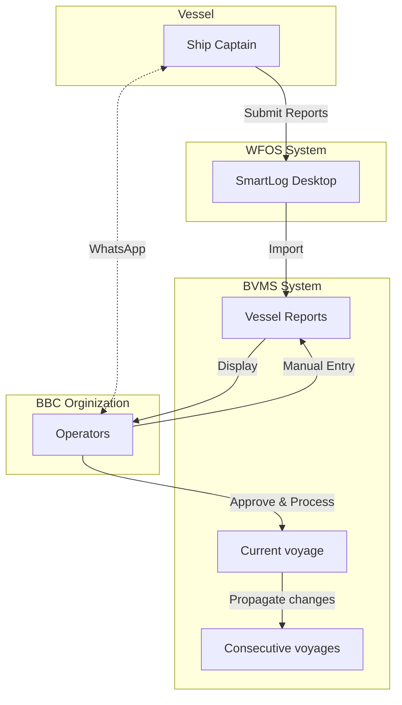
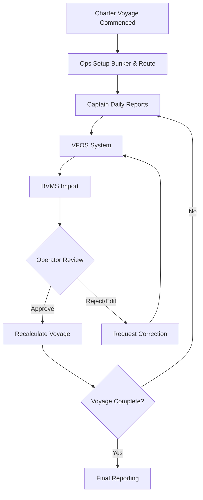
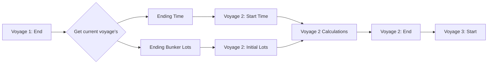
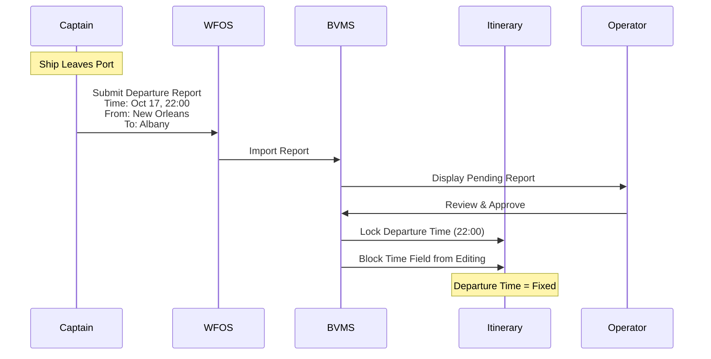
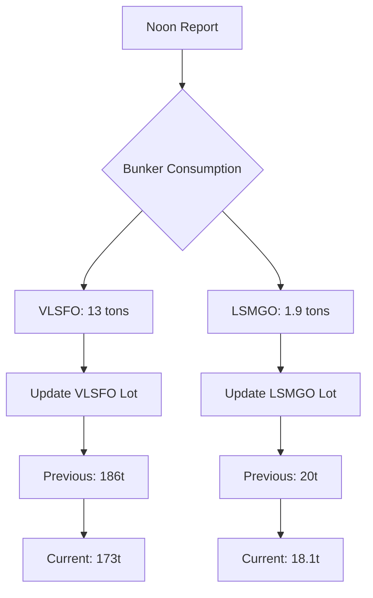
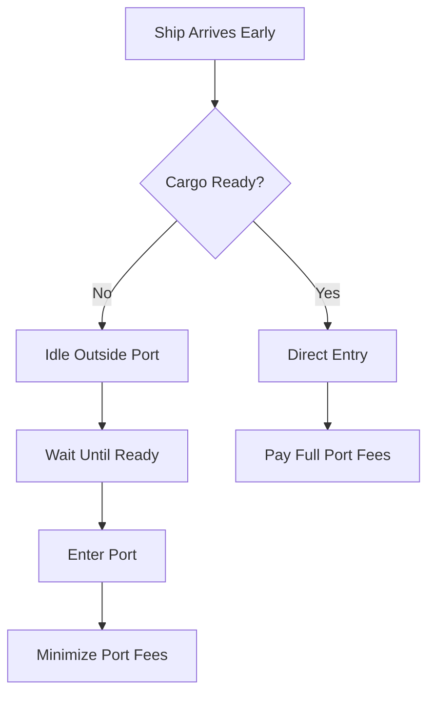
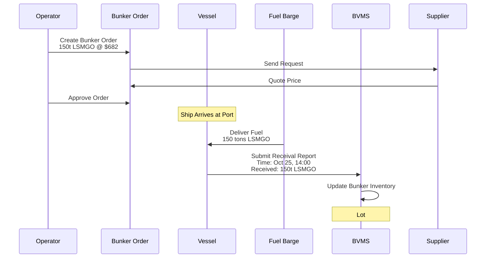
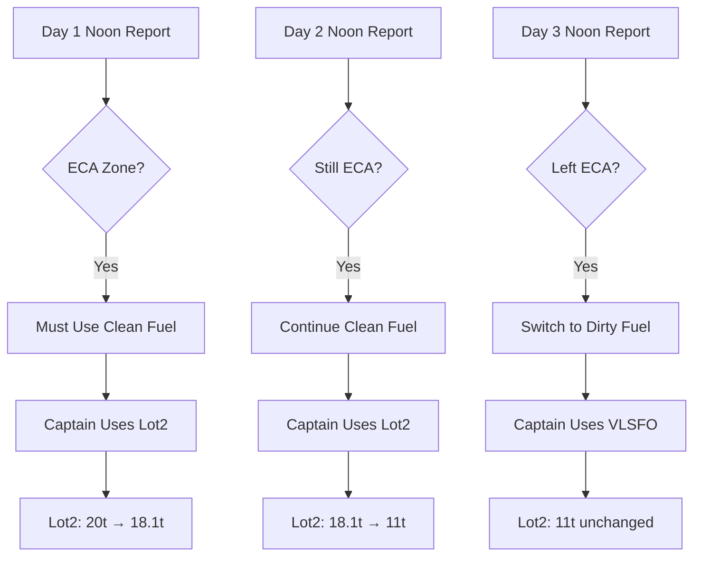

# BBC BVMS Vessel Report System & Integration with WFOS

## A Comprehensive Document for Operations, Development, and Data Integrity Teams

---

# PART I: EXECUTIVE SUMMARY & KEY CONCEPTS

## 1. System Overview

### What is the Vessel Report System?

- BVMS Vessel Report system captures daily operational data from vessels during their voyages. When approved, these reports replace future/estimated values of the voyage with actual figures.
- WFOS serves as the primary data source for contracted vessels, while BBC operators manually submit reports for non-contracted ones.

### Core Value Proposition

| Business Need            | Solution                           | Impact                                                              |
| ------------------------ | ---------------------------------- | ------------------------------------------------------------------- |
| **Fuel Management**      | Real-time bunker tracking          | Prevent fuel shortages mid-voyage                                   |
| **Voyage Control**       | Daily monitoring & adjustments     | Proactive decision-making on refueling, routing changes,...         |
| **Financial Accuracy**   | Replace estimates with actual data | Accurate P&L analysis (e.g., $100K projected vs $95K actual profit) |
| **Compliance**           | ECA zone tracking                  | Environmental regulation adherence                                  |
| **Consecutive Planning** | Data carryover between voyages     | Seamless multi-voyage operations                                    |

---

## 2. Key Concepts

### 2.1 Data Evolution Model

```
VOYAGE START                    VOYAGE PROGRESS                      VOYAGE END
┌─────────────┐                ┌─────────────┐                    ┌─────────────┐
│ 30 Days     │    Day 1       │ 1 Real      │      Day 30        │ 30 Real     │
│ 100% Est.   │  ────────►     │ 29 Est.     │    ────────►       │ 0% Est.     │
└─────────────┘                └─────────────┘                    └─────────────┘
   All Future                   Mixed Data                        All Historical
```

**Critical Principle:** Approving a vessel report will:

1. **Deletes** all future data of voyage (itinerary times, bunkers & related costs)
2. **Inserts** real reported data from the vessel report (time, current position & bunker levels)
3. **Summarizes** current actual data & **Recalculates** future figures again
4. **Propagates** ending figures (bunkers & times) toward the next voyage as initial data

### 2.2 System Integration Architecture



### 2.3 Operational Team Structure

| Role                   | Vessels Managed  | Responsibility                           | Tools                 |
| ---------------------- | ---------------- | ---------------------------------------- | --------------------- |
| **BBC Charterer**      | N/A              | Voyage nomination with estimated figures | BVMS Estimate         |
| **BBC Operator**       | 3-5 vessels each | Daily report approval, voyage monitoring | BVMS Voyage, WhatsApp |
| **Ship Captain**       | Assigned vessel  | Submit reports every 24 hours            | WFOS, WhatsApp        |
| **System (Automated)** | All contracted   | Import, validate, calculate logics       | BVMS API + WFOS API   |

### 2.4 Workflow Summary Digram



---

## 3. Report Types Quick Reference

| Report Type   | When Submitted       | Key Data Points                                             | Time Lock                  |
| ------------- | -------------------- | ----------------------------------------------------------- | -------------------------- |
| **Departure** | Leaving port         | Departure time (actual), from-to ports, initial bunker      | Locks **Departure Time**   |
| **Noon**      | Daily at sea         | Distance traveled (24h), distance to go, bunker consumption | Updates **ETA**            |
| **Arrival**   | Reaching destination | Arrival time (actual), final position                       | Locks **Arrival Time**     |
| **In Port**   | While docked         | Time of berth, time of unberth                              | Reports **berth schedule** |
| **Berth**     | Actual berthing      | Berth time (moment of truth)                                | Locks **Berth Time**       |
| **Unberth**   | Leaving berth        | Unberth time (moment of truth)                              | Locks **Unberth Time**     |
| **Receival**  | Receiving fuel       | Bunker lot received, quantity, specs                        | Adds bunker to **onboard** |

---

## 4. Bunker Management Summary

### 4.1 Bunker Structure Hierarchy

```
BUNKER TAB (Summary View)
├── Total VLSFO: 186 tons               ◄── Display in each Itinerary row
├── Total LSMGO: 76 tons                ◄── Sum of all lots of this type
└── Total MDO: 40 tons

BUNKER LOT (Detailed Breakdown)
├── VLSFO Lot #1: 186 tons @ $489/ton   ◄── Lot-specific tracking
│   ├── Initial: 186
│   ├── Onboard: 186
│   ├── Consumption: 34
│   ├── Current: 152
│   └── Ending: 0
├── LSMGO Lot #1: 55 tons @ $682/ton
└── LSMGO Lot #2: 20 tons @ $682/ton
```

### 4.2 Critical Bunker Metrics

| Metric                 | Definition                          | Why It Matters                 |
| ---------------------- | ----------------------------------- | ------------------------------ |
| **Onboard Amount**     | Fuel confirmed on vessel via report | Validates actual inventory     |
| **Consumption Amount** | Tons used per 24 hours              | Actual usage metrics by engine |
| **Receival Amount**    | Tons bunkered at port               | Updates inventory levels       |

---

## 5. Consecutive Voyage Impact

### 5.1 Data Carryover Model



### 5.2 Cascade Effect Example

| Event               | Voyage 1 (Current)                           | Voyage 2 (Next)                        | Voyage 3 (Future)    |
| ------------------- | -------------------------------------------- | -------------------------------------- | -------------------- |
| **Before Approval** | Depart: Oct 21, 08:00<br/>Ending: 187t VLSFO | Start: Oct 21, 08:00<br/>Initial: 187t | Start: Oct 25, 10:00 |
| **After Approval**  | Depart: Oct 20, 22:00<br/>Ending: 150t VLSFO | Start: Oct 20, 22:00<br/>Initial: 150t | Start: Oct 24, 20:00 |
| **Change Impact**   | -10 hours, -37t fuel                         | -10 hours, -37t initial                | -14 hours adjusted   |

**Critical Insight:** One report approval can affect **all future voyages** for that vessel.

---

## 6. Error Handling Matrix

### 6.1 Common Errors & Solutions

| Error Type               | Example                               | Detection         | Impact Severity             |
| ------------------------ | ------------------------------------- | ----------------- | --------------------------- |
| **Wrong Fuel Type**      | Dirty fuel used in ECA                | Operator review   | 🟡 Medium (Compliance)      |
| **Consumption Mismatch** | Reports 2.1 used, actually 0.0        | System validation | 🔴 High (Cascade effect)    |
| **Report Types Paradox** | Departure submited without an arrival | System validation | 🔴 High (Wrong calculation) |

### 6.2 Correction Methods Comparison

| Method                    | Use Case                  | Steps                                          | Data Loss Risk | Operator Effort |
| ------------------------- | ------------------------- | ---------------------------------------------- | -------------- | --------------- |
| **1. Direct Edit**        | Minor single error        | Edit → Save → Re-approve                       | None           | Low             |
| **2. Captain Resubmit**   | Wrong from WFOS submitted | Request → WFOS fix → Sync → Override → Approve | None           | Medium          |
| **3. Batch Approval**     | Historical chain error    | Fix first → Batch approve sequence             | ⚠️             | High            |
| **4. Delete & Re-import** | Massive errors            | Delete all → Re-import → Approve all           | ⚠️             | High            |

---

## 7. Prerequisites for Successful Import

| Requirement               | Description                   |
| ------------------------- | ----------------------------- |
| ✓ **Vessel in Contract**  | Vessels in contract agreement |
| ✓ **Voyage Number Match** | WFOS Voy.No == BVMS Voy.No    |
| ✓ **Routing Match**       | Same ports/order              |

---

# PART II: DETAILED TECHNICAL DOCUMENTATION

## 9. Detailed Report Type Specifications

### 9.1 Departure Report

**Purpose:** Marks the official start of a voyage, capturing the exact moment the vessel leaves port.

#### Data Fields

| Field            | Type           | Required | Editable After Approval | Description                              |
| ---------------- | -------------- | -------- | ----------------------- | ---------------------------------------- |
| Departure Time   | DateTime       | ✓ Yes    | ❌ No                   | **Moment of truth** - locks voyage start |
| From Port        | Port ID        | ✓ Yes    | ❌ No                   | Origin port                              |
| To Port          | Port ID        | ✓ Yes    | ✓ Yes (until arrival)   | Destination port                         |
| Current Position | Lat/Long       | ✓ Yes    | N/A                     | GPS coordinates at departure             |
| Distance to Go   | Nautical Miles | ✓ Yes    | N/A                     | Total remaining distance                 |
| Speed            | Knots          | Optional | N/A                     | Initial speed                            |
| Bunker Status    | Per Tank       | ✓ Yes    | N/A                     | Initial fuel inventory                   |

#### Workflow



---

### 9.2 Noon (Null) Report

**Purpose:** Daily progress tracking while at sea, allowing ETA adjustments based on actual conditions.

#### Data Fields

| Field              | Type           | Required | Updates | Description                   |
| ------------------ | -------------- | -------- | ------- | ----------------------------- |
| Report Time        | DateTime       | ✓ Yes    | Daily   | When report submitted (~noon) |
| Current Position   | Lat/Long       | ✓ Yes    | Daily   | Current GPS location          |
| Distance Traveled  | Nautical Miles | ✓ Yes    | Daily   | Last 24-hour progress         |
| Distance to Go     | Nautical Miles | ✓ Yes    | Daily   | Remaining to destination      |
| Speed (Past)       | Knots          | ✓ Yes    | Daily   | Actual speed last 24h         |
| Speed (Future)     | Knots          | Optional | Daily   | Expected speed to destination |
| ETA                | DateTime       | ✓ Yes    | Daily   | Updated arrival estimate      |
| Bunker Consumption | Per Tank       | ✓ Yes    | Daily   | Fuel used last 24h            |

#### ETA Evolution Example

| Day | Report Time   | Distance Traveled | Distance to Go | Speed    | ETA           | Change Reason         |
| --- | ------------- | ----------------- | -------------- | -------- | ------------- | --------------------- |
| 1   | Oct 18, 01:00 | 108 nm            | 1692 nm        | 14.5 kts | Oct 23, 02:00 | Initial estimate      |
| 2   | Oct 19, 01:00 | 115 nm            | 1577 nm        | 13.2 kts | Oct 23, 06:00 | +4h (storm delay)     |
| 3   | Oct 20, 01:00 | 120 nm            | 1457 nm        | 15.1 kts | Oct 23, 06:00 | No change             |
| 4   | Oct 21, 01:00 | 125 nm            | 1332 nm        | 15.8 kts | Oct 23, 01:00 | -5h (good conditions) |

#### Consumption Tracking



---

### 9.3 Arrival Report

**Purpose:** Confirms vessel reached destination, locking the arrival time as a historical fact.

#### Key Characteristics

| Field              | Type           | Required | Editable After Approval | Description                      |
| ------------------ | -------------- | -------- | ----------------------- | -------------------------------- |
| Arrival Time       | DateTime       | ✓ Yes    | ❌ No                   | **Moment of truth** - locks ETA  |
| From Port          | Port ID        | ✓ Yes    | ❌ No                   | Origin port                      |
| To Port            | Port ID        | ✓ Yes    | ✓ Yes (until arrival)   | Destination port - Arriving port |
| Distance Traveled  | Nautical Miles | ✓ Yes    | Daily                   | Last 24-hour progress            |
| Speed (Past)       | Knots          | ✓ Yes    | Daily                   | Actual speed last 24h            |
| Bunker Consumption | Per Tank       | ✓ Yes    | Daily                   | Fuel used last 24h               |

---

### 9.4 In Port, Berth, Unberth Reports

#### Port Operations Timeline

```mermaid
gantt
    title Complete Port Operation Timeline
    dateFormat HH:mm

    section Arrival
    Ship Arrival (Outside)     :a1, 08:00, 2h
    Idle Time (Waiting)        :a2, after a1, 3h

    section Moving to Berth
    Intra In (Moving to Berth) :a3, after a2, 1h

    section Cargo Operations
    Berth Time (Start)         :milestone, after a3, 0h
    Cargo Loading/Unloading    :a4, after a3, 6h
    Unberth Time (End)         :milestone, after a4, 0h

    section Departure
    Intra Out (Moving from Berth) :a5, after a4, 1h
    Departure                    :a6, after a5, 1h

```



#### Port Phase Definitions

| Phase          | Duration  | Fuel Consumption   | Speed   | Port Fees | Description                           |
| -------------- | --------- | ------------------ | ------- | --------- | ------------------------------------- |
| **Idle Time**  | Variable  | Low (auxiliary)    | 0 kts   | ❌ None   | Waiting outside port to minimize fees |
| **Intra Time** | 0.5-2 hrs | High (maneuvering) | 5-6 kts | ✓ Starts  | Moving from anchorage to berth        |
| **Cargo Time** | Variable  | Medium             | 0 kts   | ✓ Active  | Loading/unloading at berth            |

#### Why Idle Time Matters

**Scenario:** Ship arrives 12 hours before cargo ready

**Option A (No Idle):**

- Enter port immediately
- Pay 12 hours of port fees
- Cost: ~$500/hour = $6,000

**Option B (With Idle):**

- Wait outside port (free anchorage)
- Enter port when cargo arrives
- Cost: $0 idle + normal berth fees



---

### 9.5 Receival Report

**Purpose:** Documents fuel bunkering, updating inventory with new fuel lots.

#### Bunker Order to Receival Flow



#### Receival Impact on Bunker Planning

**Before Receival:**

```
LSMGO Inventory:
├── Lot #1: 55t (unused)
├── Lot #2: 11t (partially used)
└── Total: 66t
```

**After Receival:**

```
LSMGO Inventory:
├── Lot #1: 55t (unused)
├── Lot #2: 11t (partially used)
├── Lot #3: 150t (NEW - from receival)
└── Total: 216t
```

---

## 10. Advanced Bunker Management

### 10.1 Lot Consumption Logic

#### Operator Plan vs. Captain Reality

**Setup Example:**

| Lot | Type  | Initial | Price | Operator Plan |
| --- | ----- | ------- | ----- | ------------- |
| 1   | LSMGO | 55t     | $682  | Use FIRST     |
| 2   | LSMGO | 20t     | $682  | Use SECOND    |

**Actual Reports:**



**Result:**

- LSMSO #1: 55t → 55t (unused - plan ignored)
- LSMGO #2: 20t → 11t (used first - ECA compliance)
- VLSFO: 186t → 152t (used after leaving ECA)

### 10.2 ECA Zone Fuel Management

#### ECA Zone Regulations

| Zone Type      | Fuel Type Allowed | Sulfur Content | Typical Regions              |
| -------------- | ----------------- | -------------- | ---------------------------- |
| **ECA Zone**   | LSMGO (clean)     | ≤0.1% sulfur   | Baltic, North Sea, US coasts |
| **Open Sea**   | VLSFO or LSMGO    | ≤0.5% sulfur   | Most oceans                  |
| **Port Areas** | LSMGO (clean)     | ≤0.1% sulfur   | All ports                    |

### 10.3 Bunker Validation Rules

#### System Validations

| Validation Rule       | Formula                            | Error Message                | Severity                   |
| --------------------- | ---------------------------------- | ---------------------------- | -------------------------- |
| **Consumption Match** | `Previous - Consumption = Current` | "Bunker math doesn't add up" | 🔴 High                    |
| **Non-negative**      | `Current >= 0`                     | "Negative fuel impossible"   | 🔴 High                    |
| **Onboard Sync**      | `Bunker Summary = Sum(All Lots)`   | "Summary/Lot mismatch"       | 🟡 Medium                  |
| **ECA Compliance**    | `If(ECA) then LSMGO`               | "Wrong fuel in ECA"          | 🟡 Medium (operator check) |

#### Consumption Detail View

**Color Coding:**

| Color        | Meaning         | Data Source             | Editability                |
| ------------ | --------------- | ----------------------- | -------------------------- |
| 🟤 **Brown** | Real data       | Approved vessel reports | ❌ Read-only               |
| ⚪ **White** | Future estimate | System calculations     | ✓ Recalculated on approval |

**Example Display:**

```
Lot #1 (VLSFO):
[🟤 186] → [🟤 179] → [🟤 165] → [🟤 152] → [⚪ 100] → [⚪ 51] → [⚪ 0]
 Start    Day 1      Day 2      Day 3      Day 4      Day 5      End
         (-7t)      (-14t)     (-13t)     (-52t)     (-49t)    (-51t)

        ←──── Real Data (Reported) ────→  ←──── Future (Calculated) ────→
```

## 18. Document Information

### Version History

| Version | Date         | Author             | Changes                             |
| ------- | ------------ | ------------------ | ----------------------------------- |
| 1.0     | Oct 22, 2025 | Documentation Team | Initial comprehensive documentation |

### Document Maintenance

- **Review Frequency:** Quarterly
- **Owner:** Operations Manager
- **Contributors:** Dev Team, QA Team, Operations Team
- **Feedback:** [Submit via internal portal]

### Related Documents

- BVMS User Manual
- WFOS Integration Guide
- Bunker Planning Manual
- Financial Reporting Procedures
- ECA Compliance Guidelines

---

**END OF DOCUMENT**

_For questions or clarifications, contact the BVMS Operations Team or Technical Support._
