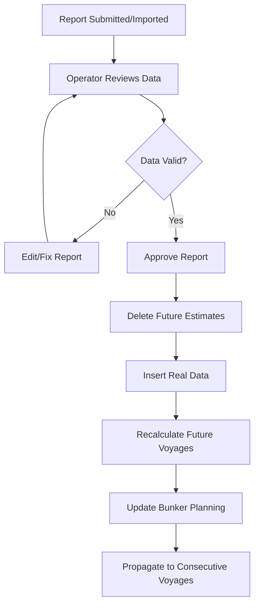
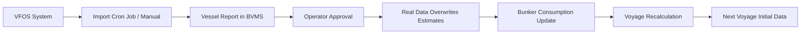

# Vessel Report Summary for BBC BVMS Maritime Software

## Overview

This document summarizes the key points from the transcription on Vessel Reports in the BBC BVMS (Bunker Voyage Management System). Vessel Reports capture real-time data from ships, replacing estimated data with actual metrics like position, fuel consumption, and timing. This enables accurate voyage planning, cost analysis, and operational adjustments.

## Key Concepts

- **Purpose**: Real data from ships overrides estimates, allowing calculation of actual vs. projected costs (e.g., fuel, time). Reports are submitted daily via VFOS integration.
- **Accuracy**: High accuracy is critical as it affects profit/loss analysis and future voyage planning.
- **Integration**: Reports are imported from VFOS (Vessel Fuel Oil System) for ships under contract, or manually entered.
- **Approval**: Operators review and approve reports, triggering system recalculations for current and future voyages.

## Report Types

Vessel Reports vary by event, each blocking specific times in the itinerary and reporting consumption details.

| Report Type            | Description                                               | Key Data Reported                                                | Timing                      |
| ---------------------- | --------------------------------------------------------- | ---------------------------------------------------------------- | --------------------------- |
| **Departure Report**   | Submitted when leaving port; blocks departure time.       | Departure time, position, distance to go, speed, fuel remaining. | At actual departure.        |
| **Noon (Null) Report** | Daily report at sea; updates ETA.                         | Position, distance traveled/gone, speed, fuel used, ETA.         | Every 24 hours.             |
| **Arrival Report**     | Submitted upon reaching destination; blocks arrival time. | Arrival time, position.                                          | At actual arrival.          |
| **In Port Report**     | At port; estimates berth times.                           | Time of berth (burst), unberth, position.                        | When anchored outside port. |
| **Burst Report**       | Actual berth entry; blocks berth time.                    | Time of berth.                                                   | When entering port.         |
| **Unburst Report**     | Berth exit; blocks unberth time.                          | Time of unberth.                                                 | When leaving berth.         |
| **Receival Report**    | Fuel loading at port.                                     | Fuel received (tons, type, lot).                                 | After bunkering.            |

## Bunker Management

- **Importance**: Tracks fuel consumption per tank/lot; ensures sufficient fuel for voyages. Operators monitor to avoid shortages (e.g., due to storms or delays).
- **Reporting**: Captains report remaining fuel per tank. System calculates consumption and updates planning.
- **Lots**: Breakdown by fuel type (e.g., VLSFO, LSMGO). Ending lots from one voyage become initial lots for the next.
- **Validation**: Reports must match onboard amounts; discrepancies trigger corrections.

## Approval Workflow

Operators approve reports after review. Approval replaces estimates with real data and recalculates future voyage segments.

## Data Flow

Data flows from VFOS import to approval, updating voyage and bunker models.

## Consecutive Voyages

- **Impact**: Approving a report in one voyage affects subsequent voyages (e.g., time shifts, bunker carryover).
- **Carryover**: Ending bunker lots and times become starting points for next voyages.
- **Example**: Changing departure time in Voyage 1 shifts ETAs in Voyages 2 and 3.

## Error Handling and Corrections

- **Common Issues**: Captain misreports (e.g., wrong fuel type in ECA zones), sequence errors (arrival before departure).
- **Corrections**:
  - Sync with VFOS for updates.
  - Edit reports directly.
  - Re-approve from error point (affects downstream reports).
  - Worst case: Delete all reports and re-import.
- **Validation**: System checks consumption logic; operators must verify before approval.

## Conclusion

Vessel Reports ensure BVMS uses real data for accurate maritime operations. Key benefits include cost tracking, fuel optimization, and proactive adjustments. Integration with VFOS automates imports, while manual processes allow flexibility. Operators play a critical role in validation to maintain data integrity.
