# BBC BVMS Vessel Report System

## Complete Technical & Operational Documentation

> **Document Authority:** Synthesized from Session 1 (Part 1 & 2) — April 7, 2026; Session 2 Edge Cases — April 8, 2026; Demo: Custom Position, Rotation Update & Consecutive Voyage — Post-Session  
> **Target Audience:** Operators, Developers, QA, Product Owners  
> **Version:** 2.0 — May 4, 2026

---

## Table of Contents

1. [Executive Summary](#1-executive-summary)
2. [System Architecture & Integration](#2-system-architecture--integration)
3. [Key Concepts & Business Logic](#3-key-concepts--business-logic)
4. [Report Lifecycle Overview](#4-report-lifecycle-overview)
5. [Report Types — Detailed Specification](#5-report-types--detailed-specification)
6. [Bunker Management](#6-bunker-management)
7. [VFOS Integration & Data Flow](#7-vfos-integration--data-flow)
8. [System Actions — Import, Sync, Delete, Reset](#8-system-actions--import-sync-delete-reset)
9. [Data Validation Rules](#9-data-validation-rules)
10. [Operational Workflows](#10-operational-workflows)
11. [Edge Cases & Special Scenarios](#11-edge-cases--special-scenarios)
12. [Consecutive Voyage Impact](#12-consecutive-voyage-impact)
13. [Custom Positions & Route Changes](#13-custom-positions--route-changes)
14. [Glossary](#14-glossary)
15. [Revision Notes](#15-revision-notes)

---

## 1. Executive Summary

### 1.1 What is the Vessel Report System?

The **Vessel Report** is the primary mechanism through which ship captains report real-time operational data back to the BBC (Barwil/BPC) shore-based operations office every day. It is embedded within the **BVMS (BBC Voyage Management Software)** and connects directly to the onboard captain's reporting tool — **VFOS/WFOS (Vessel Fleet Operations System)**.

When a captain submits a report and the operator approves it in BVMS:

- **Estimated events** (future/planned values) are replaced with **actual/reported values**
- The voyage recalculates its P&L, ETA, and remaining bunker plan forward
- Changes propagate into all subsequent linked voyages in the chain

### 1.2 Why It Matters: The Business Case

| Business Driver            | Problem Without Reports                                                 | Solution With Vessel Reports                                                          |
| -------------------------- | ----------------------------------------------------------------------- | ------------------------------------------------------------------------------------- |
| **Port Timing (Laytime)**  | Late ships pay demurrage fines; early ships pay idle waiting costs      | Daily ETA updates allow speed adjustments to arrive at exactly the right time         |
| **Fuel (Bunker) Cost**     | Estimated consumption may be far from reality                           | Daily consumption reports adjust running P&L and trigger replanning if over-consuming |
| **Running P&L**            | Charter party agreed $25,000 profit — no visibility if still achievable | Each approved report updates the live running P&L; operators intervene early          |
| **Next Voyage Planning**   | Inaccurate ending bunker causes wrong initial bunker for next voyage    | Ending bunker from approved reports feeds into the next voyage's initial quantities   |
| **Compliance (ECA Zones)** | No visibility into fuel type used in regulated zones                    | Per-lot fuel tracking shows which fuel was consumed in which zone                     |

### 1.3 Fleet Scale

- BPC fleet: **~140 vessels** in active management
- Each operator manages **3–5 vessels** simultaneously
- ~**95%** of reports are imported automatically from the VFOS system
- Non-VFOS vessels: operators manually enter data communicated via WhatsApp

---

## 2. System Architecture & Integration

### 2.1 Integration Diagram

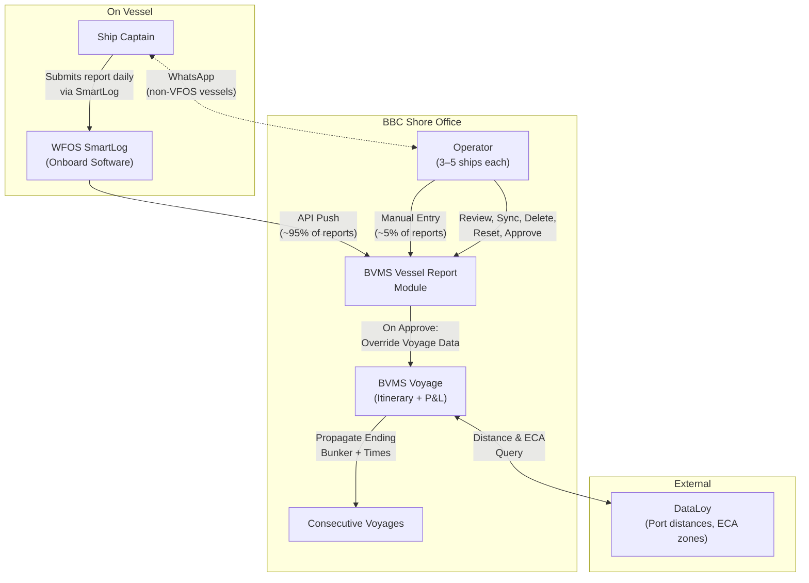

### 2.2 Technology Stack Roles

| Component                | Role                                                            | Data Owner           |
| ------------------------ | --------------------------------------------------------------- | -------------------- |
| **WFOS/VFOS (SmartLog)** | Captain submits reports; stores all vessel sensor data          | Captain / Vessel     |
| **BVMS Vessel Report**   | Receives, validates, and presents reports for operator approval | BBC Operators        |
| **BVMS Voyage**          | Holds the voyage's estimate; accepts approved report data       | BBC Chartering + Ops |
| **DataLoy**              | Provides port-to-port distances, ECA zone mileage               | Third-party service  |

### 2.3 Organizational Roles

| Role              | Fleet Size Managed     | Primary Tool          | Daily Activity                                    |
| ----------------- | ---------------------- | --------------------- | ------------------------------------------------- |
| **BBC Charterer** | N/A                    | BVMS Estimate         | Creates voyage nomination with estimated figures  |
| **BBC Operator**  | 3–5 vessels each       | BVMS Voyage + Reports | Reviews, approves reports daily; monitors P&L     |
| **Ship Captain**  | 1 vessel               | WFOS SmartLog         | Submits one report per 24 hours per voyage leg    |
| **BVMS System**   | All contracted vessels | Automated API         | Pulls VFOS data; validates; calculates downstream |

---

## 3. Key Concepts & Business Logic

### 3.1 The Data Evolution Model — From Estimate to Reality

Every voyage starts as 100% estimated. As the captain sends daily reports and operators approve them, estimates are replaced one by one with real data.

```
VOYAGE TIMELINE
═══════════════════════════════════════════════════════════════════

 DAY 0                     DAY 15                      DAY 30
 ┌──────────────────┐      ┌──────────────────┐        ┌──────────────────┐
 │ 30/30 ESTIMATED  │ ───► │ 15 REAL          │ ───► │ 30/30 REAL       │
 │                  │      │ 15 ESTIMATED     │        │                  │
 │ (all planned)    │      │ (mixed state)    │        │ (voyage complete) │
 └──────────────────┘      └──────────────────┘        └──────────────────┘

 Report submitted: ■■■■■■■■■■■■■■■░░░░░░░░░░░░░░░░
 Approved:         ■■■■■■■■■■■░░░░░░░░░░░░░░░░░░░░
 Estimated ahead:  ░░░░░░░░░░░░░░░■■■■■■■■■■■■■■■■
```

**Critical Behavior of Approval:**
When an operator approves a Vessel Report:

1. The system **deletes** future-estimated data up to that report's point
2. **Inserts** the captain's actual reported values (time, position, bunker)
3. **Recalculates** all future estimates from the new real baseline
4. **Propagates** ending bunker quantities and times toward the next voyage

### 3.2 Running Profit & Loss (P&L)

One of the most important reasons for daily reports is maintaining an up-to-date **running P&L**:

> **Example:** A charter party was agreed at $500,000 with an expected profit of $25,000.
>
> - Day 1 report approved → profit now shows $25,000 ✓
> - Day 3: captain consumed 15t vs 5t estimated → profit drops to $22,000
> - Day 5: captain slowed down for weather → profit drops to $21,000
> - Operator sees the trend early and can instruct speed changes or escalate

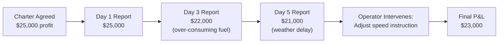

### 3.3 Port Timing — Why ETA Matters Daily

The operator must balance **early vs. late** arrival:

| Scenario              | Consequence                                      | Cost                            |
| --------------------- | ------------------------------------------------ | ------------------------------- |
| **Arrives too early** | Must idle/wait outside port until cargo is ready | Port waiting fees, anchor costs |
| **Arrives on time**   | Cargo loads/unloads immediately                  | Optimal                         |
| **Arrives too late**  | Cargo slot missed, demurrage fines apply         | Demurrage per hour/day          |

> Based on current position and latest ETA, the operator instructs the captain what speed to target so the vessel arrives **as close to planned time as possible**.

### 3.4 Color Coding in Consumption Charts

The consumption chart for each bunker lot uses two data zones:

| Color     | Data Type                     | Source                                    | Editable?          |
| --------- | ----------------------------- | ----------------------------------------- | ------------------ |
| **Gray**  | Historical (approved reports) | Captain's approved reports                | Read-only (locked) |
| **White** | Future (calculated estimate)  | System re-calculation after latest report | Auto-recalculated  |

As reports are approved, the gray zone grows and the white zone shrinks and resets from the new baseline.

---

## 4. Report Lifecycle Overview

### 4.1 Standard Voyage Report Sequence

A voyage follows a predictable report flow. Reports are **not random** — they follow a strict sequence A → B → C → D.

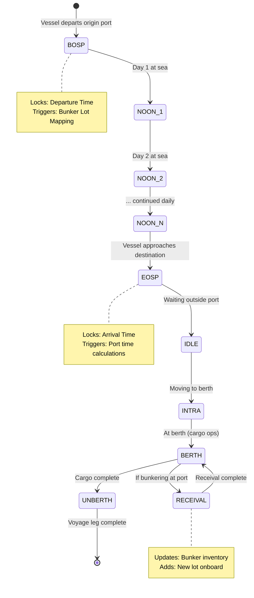

### 4.2 Report Status Indicators

| Color in List           | Meaning                                                    |
| ----------------------- | ---------------------------------------------------------- |
| 🔵 **Blue**             | Report approved — data is active in the voyage             |
| ⚪ **White / Pending**  | Report imported, awaiting operator approval                |
| 🔴 **Red / Error mark** | Report has validation error — cannot approve               |
| 🟠 **Orange icon**      | Warning — re-approval suggested (e.g., after route change) |

### 4.3 Report Date Uniqueness Rule

**Rule:** No two reports in the same voyage may share the exact same report date/time. Reports must be at least **1 minute apart**.

**Reason:** The system uses report dates to determine order (which report is "before" another). This is critical for the cascading calculation logic.

**Edge case where this triggers:** When the vessel is at the **same port for both departure and next arrival** (e.g., loading from Port A then returning to Port A), the departure and arrival reports would naturally have the same time. The system enforces the 1-minute minimum to maintain ordering integrity.

---

## 5. Report Types — Detailed Specification

### 5.1 BOSP — Begin of Sea Passage (Departure Report)

**When:** Submitted when the vessel departs a port and begins sea transit.

**Business Significance:**

- **Locks the Departure Time** — this is the "moment of truth" for the start of the leg
- Triggers the **Bunker Lot Mapping** for the voyage
- Overrides estimated departure time in the voyage itinerary

#### 5.1.1 Departure Time Formula

The departure time is calculated from the formula:

```
Departure Time = Arrival Time + Idle Time + Intra Time + Work Days
```

> When the operator approves the BOSP, the system checks whether the reported departure time satisfies this formula. If it does, the departure time is released and locked. If it does not (e.g., the reported time is earlier than the formula minimum), the departure time is NOT updated.

**Important:** Departure time from a report can never be set to a time **before a previously locked time** (e.g., cannot set departure to March 19th if a previous report was locked on March 23rd).

#### 5.1.2 BOSP Data Fields

| Field                | Type           | Required | Locked After Approval | Notes                           |
| -------------------- | -------------- | -------- | --------------------- | ------------------------------- |
| Report Time          | DateTime       | ✓        | ✓                     | Time of actual departure        |
| From Port            | Port ID        | ✓        | ✓                     | Origin port                     |
| To Port              | Port ID        | ✓        | Until arrival         | Destination for this leg        |
| Latitude / Longitude | Decimal        | ✓        | —                     | Current GPS position            |
| Distance to Go       | Nautical Miles | ✓        | —                     | Distance to next port           |
| Speed                | Knots          | Optional | —                     | Current speed                   |
| Bunker per Lot       | Tons           | ✓        | —                     | Initial fuel inventory per tank |

#### 5.1.3 What Happens After BOSP Approval

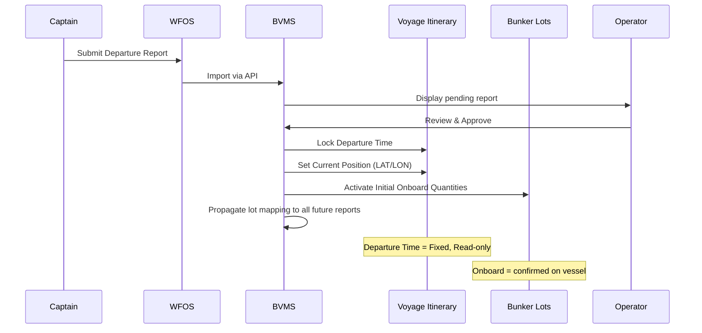

---

### 5.2 Noon Report (NOOR)

**When:** Submitted daily at sea (~noon UTC or local), reporting the previous 24-hour progress.

**Business Significance:**

- Updates the **running ETA** to the next port
- Tracks daily **bunker consumption** for P&L accuracy
- Provides current GPS position for vessel tracking

#### 5.2.1 Noon Report Data Fields

| Field                      | Type           | Required | Notes                           |
| -------------------------- | -------------- | -------- | ------------------------------- |
| Report Time                | DateTime       | ✓        | When report was submitted       |
| Latitude / Longitude       | Decimal        | ✓        | Current ship position           |
| Distance Traveled (24h)    | Nautical Miles | ✓        | Since last report               |
| Distance to Go             | Nautical Miles | ✓        | To next port                    |
| Speed (Past 24h)           | Knots          | ✓        | Actual average speed            |
| ETA                        | DateTime       | ✓        | Updated arrival estimate        |
| Bunker Consumption per Lot | Tons           | ✓        | Consumed per fuel type per tank |
| Remaining Bunker per Lot   | Tons           | ✓        | Current tank levels             |

#### 5.2.2 ETA Evolution Example

| Day              | Time          | Distance Traveled | Distance to Go | ETA           | Explanation         |
| ---------------- | ------------- | ----------------- | -------------- | ------------- | ------------------- |
| Day 0 (Estimate) | —             | —                 | 1,800 nm       | Oct 23, 02:00 | Initial plan        |
| Day 1 (Noon 1)   | Oct 18, 01:00 | 108 nm            | 1,692 nm       | Oct 23, 06:00 | +4h storm delay     |
| Day 2 (Noon 2)   | Oct 19, 01:00 | 115 nm            | 1,577 nm       | Oct 23, 06:00 | No change           |
| Day 3 (Noon 3)   | Oct 20, 01:00 | 120 nm            | 1,457 nm       | Oct 23, 01:00 | −5h good conditions |
| Day 4 (Noon 4)   | Oct 21, 01:00 | 125 nm            | 1,332 nm       | Oct 22, 21:00 | −4h captain sped up |

#### 5.2.3 Consumption Mismatch Validation

The system validates that the consumption reported adds up correctly:

```
FORMULA: Previous_Remaining − Consumption_Reported = Current_Remaining

EXAMPLE OF ERROR:
  Previous Remaining:    3.6 tons  (from last approved report)
  Current Remaining:     2.1 tons  (captain reports current tank level)
  Implied Consumption:   1.5 tons  (what math says)

  Captain Reports Total Consumption:  1.35 tons  ← MISMATCH!

  System error: "Bunker consumption inconsistent — 3.6 − 1.35 ≠ 2.1"
```

**Root Cause:** The tank sensor gives the current level (2.1 tons → reliable). The engine sensors sum up per-engine consumption (1.35 tons from main engine + auxiliary → can be inaccurate). If sensor data from any engine is missing or incorrect, the total consumption reported will not match the tank-level math.

**Resolution options:**

1. Contact captain to correct and resubmit → sync and re-import
2. Operator manually corrects the consumption figure and approves

---

### 5.3 EOSP — End of Sea Passage (Arrival Report)

**When:** Submitted when the vessel arrives at the destination port (or pilot station).

**Business Significance:**

- **Locks the Arrival Time** — moment of truth for ETA accuracy
- Completes the sea passage leg and transitions to port operations
- Final consumption recorded for the sea leg

#### 5.3.1 EOSP Data Fields

| Field                    | Type           | Locked After Approval | Notes               |
| ------------------------ | -------------- | --------------------- | ------------------- |
| Arrival Time             | DateTime       | ✓                     | Moment of truth     |
| To Port                  | Port ID        | ✓                     | Destination arrived |
| Final Position           | Lat/Long       | —                     | GPS at arrival      |
| Distance Traveled        | Nautical Miles | —                     | Last 24h            |
| Final Bunker Consumption | Tons           | —                     | For the last period |

---

### 5.4 In-Port Reports — Idle, Intra, Berth, Unberth

**Port Operations** involve a sequence of sub-events from the moment the vessel arrives until it departs again.

#### 5.4.1 Port Operation Timeline

```mermaid
gantt
    title Complete Port Operation Timeline (Example)
    dateFormat HH:mm

    section Sea Arrival
    EOSP (Vessel Arrives)       :a0, 08:00, 30min

    section Waiting Outside Port
    Idle Time (Anchor / Drift)  :a1, after a0, 3h

    section Moving to Berth
    Intra In (Harbor Tug)       :a2, after a1, 1h

    section At Berth
    Berth Time Starts           :milestone, after a2, 0h
    Cargo Operations            :a3, after a2, 8h
    Unberth Time                :milestone, after a3, 0h

    section Leaving Berth
    Intra Out                   :a4, after a3, 1h
    BOSP (New Departure)        :a5, after a4, 30min
```

#### 5.4.2 Port Phase Definitions

| Phase         | Report Type    | Fuel Mode            | Port Fees Start? | Description                                                                     |
| ------------- | -------------- | -------------------- | ---------------- | ------------------------------------------------------------------------------- |
| **Idle**      | Idle Report    | Low (auxiliary only) | ❌ No            | Waiting outside port to avoid fees. Deliberately timed to arrive "just in time" |
| **Intra In**  | Intra Report   | High (maneuvering)   | ✓ Yes            | Moving from anchorage into berth — harbor tugs, narrow channels                 |
| **Berth**     | Berth Report   | Minimal              | ✓ Yes            | At berth doing cargo operations (loading/discharging)                           |
| **Unberth**   | Unberth Report | High (maneuvering)   | ✓ Active         | Moving away from berth, leaving port                                            |
| **Intra Out** | Intra Report   | High (maneuvering)   | Ending           | Exiting port channel back to open sea                                           |

#### 5.4.3 Why Idle Time Strategy Matters

Operators deliberately **plan idle time** to minimize demurrage and port costs:

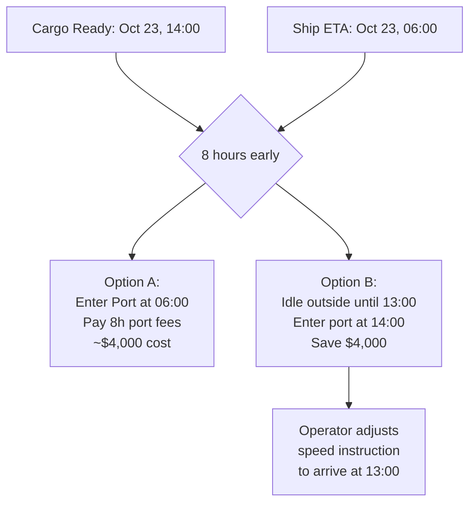

---

### 5.5 Receival Report

**When:** Submitted when the vessel receives (bunkers) fuel at a port.

**Business Significance:**

- Adds a **new bunker lot** to the vessel's inventory
- The lot price, quantity, and fuel type are captured and tracked for P&L calculation
- Triggers reconciliation between the ordered quantity (Bunker Order) and the received quantity

#### 5.5.1 Bunker Order → Receival Workflow

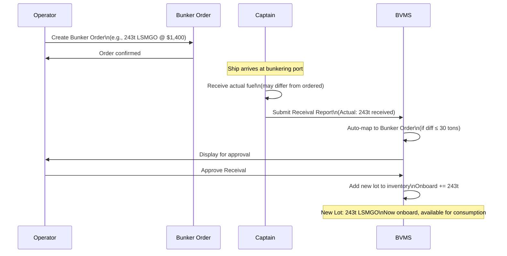

#### 5.5.2 Receival Impact on Bunker Inventory

```
BEFORE RECEIVAL (arriving at Singapore):
  VLSFO Lot #1:  186t  (purchased in New Orleans)
  LSMGO Lot #1:   55t  (remaining from prior bunkering)
  ─────────────────────
  TOTAL:          241t

AFTER RECEIVAL (bunkered at Singapore):
  VLSFO Lot #1:  186t
  LSMGO Lot #1:   55t
  LSMGO Lot #2:  243t  ← NEW LOT from Receival
  LSMGO Lot #3:  137t  ← NEW LOT from second order
  ─────────────────────
  TOTAL:          621t
```

---

## 6. Bunker Management

### 6.1 Bunker Structure Hierarchy

The system tracks bunkers at two levels:

```
BUNKER TAB (Summary View — per itinerary port)
├── VLSFO:  186 tons onboard  ← sum of all VLSFO lots
├── LSMGO:   76 tons onboard  ← sum of all LSMGO lots
└── MDO:     40 tons onboard  ← sum of all MDO lots

    ↕ Drill-down ↕

BUNKER LOT DETAIL (per individual lot)
├── VLSFO Lot #1: 186t @ $489/ton
│   ├── Initial (start of voyage):  186t
│   ├── Onboard (confirmed by report): 186t
│   ├── Total Consumed so far:   34t
│   ├── Current Remaining:      152t
│   └── Ending (projected):       0t
├── LSMGO Lot #1:  55t @ $682/ton
└── LSMGO Lot #2:  20t @ $682/ton
```

### 6.2 LOD View (Load-On-Departure)

The **LOD (Load On Departure) / Bunker Lot** view shows all tanks on the vessel for the voyage:

| Field           | Meaning                                                                       |
| --------------- | ----------------------------------------------------------------------------- |
| **Initial**     | Quantity at the start of the voyage (carryover from previous voyage's ending) |
| **Onboard**     | Confirmed current quantity after approved report                              |
| **Consumption** | Total consumed so far (sum of all approved consumption reports)               |
| **Ending**      | Projected quantity at voyage end (used as Initial for next voyage)            |

### 6.3 Consumption Chart — Visual Tracking

For each lot, a timeline view shows fuel consumption:

```
LSMGO Lot #2 Consumption Timeline:

 186t │███████████████████████
      │████████████████████░░░░░░░░░
      │████████████████░░░░░░░░░░░░░░░░░
 100t │████████████░░░░░░░░░░░░░░░░░░░░░░░░
      │███████░░░░░░░░░░░░░░░░░░░░░░░░░░░░░░░░
  50t │████░░░░░░░░░░░░░░░░░░░░░░░░░░░░░░░░░░░░░
      │░░░░░░░░░░░░░░░░░░░░░░░░░░░░░░░░░░░░░░░░░░░
   0t ┼────────────────────────────────────────────►
     Day0  Day1  Day2  Day3  Day4  Day5  Day6  Day7

     ████ = Gray (Approved Real Data)
     ░░░░ = White (Future Estimated Data)
```

**Key behavior:** Each time a report is approved:

1. The gray (real) portion extends to the new report date
2. The white (estimated) portion is erased and **recalculated** from the new real baseline

### 6.4 First Report Bunker Lot Mapping

When VFOS sends a report, its lot IDs do not automatically match BVMS lot IDs. The **First Report Mapping** process establishes this connection.

#### 6.4.1 How Auto-Mapping Works

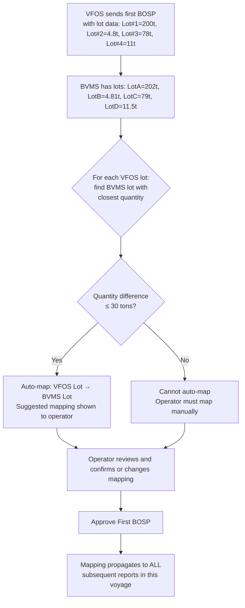

#### 6.4.2 Manual Mapping Scenarios

Operator must **always** manually intervene for:

1. **First BOSP when auto-map fails** (quantity difference > 30 tons)
2. **Receival Reports** when actual received quantity differs significantly from ordered quantity

> Mapping established in the FIRST BOSP is automatically propagated to all subsequent noon reports, the EOSP, and berth reports for the same voyage.

#### 6.4.3 Lot Consumption by Captain's Choice

The system plans lot consumption in order (Lot #1 → Lot #2 → Lot #3). However, the **captain has the right** to use any lot in any order:

> Example: The operator plans Lot #1 (LSMGO) for ECA zone and Lot #2 (VLSFO) for open sea. The captain may decide to use Lot #2 first due to tank accessibility. The system accepts whatever the captain reports and adjusts accordingly.

This means the ending balance per lot may differ from the plan, but the **total fuel** consumed should still balance.

### 6.5 ECA Zone Fuel Management

**ECA (Emission Control Area)** zones require low-sulfur fuel (LSMGO), even if the vessel normally burns VLSFO.

| Zone Type      | Required Fuel  | Sulfur Limit   | Typical Areas                           |
| -------------- | -------------- | -------------- | --------------------------------------- |
| **ECA Zone**   | LSMGO (clean)  | ≤ 0.10% sulfur | Baltic Sea, North Sea, US/Canada coasts |
| **Open Ocean** | VLSFO or LSMGO | ≤ 0.50% sulfur | Pacific, Indian Ocean, etc.             |
| **Port Areas** | LSMGO (clean)  | ≤ 0.10% sulfur | All commercial ports                    |

DataLoy provides the ECA zone mileage for each route, which is used to estimate the LSMGO required before voyage start.

### 6.6 Bunker Tab — What Operators Actually Monitor

Operators (and charterers) primarily use the Bunker Tab to check:

1. **How much fuel is at each port?** (arrival and departure quantities)
2. **Is there enough fuel to complete the voyage?** (if a "sound" warning appears = insufficient fuel for the leg)
3. **Does the price breakdown align with the P&L?** (per-lot price × consumption = cost)

> The Bunker Tab shows a summary (e.g., "204 tons VLSFO at Flushing"). But only the **Lot Detail** shows the price breakdown: "200 tons @ $489 + 4 tons @ $495." This lot-level cost is what flows into the voyage P&L calculation.

---

## 7. VFOS Integration & Data Flow

### 7.1 Prerequisites for Successful Auto-Import

| Requirement              | Description                                                  |
| ------------------------ | ------------------------------------------------------------ |
| ✓ Vessel in Contract     | The vessel must have an active VFOS/WFOS contract with BBC   |
| ✓ Voyage Number Match    | VFOS Voyage No. must match BVMS Voyage No.                   |
| ✓ Route Match            | Port sequence must align (VFOS ports ≈ BVMS itinerary ports) |
| ✓ Captain Using SmartLog | Captain actively submitting via WFOS onboard software        |

### 7.2 Import Trigger Mechanism

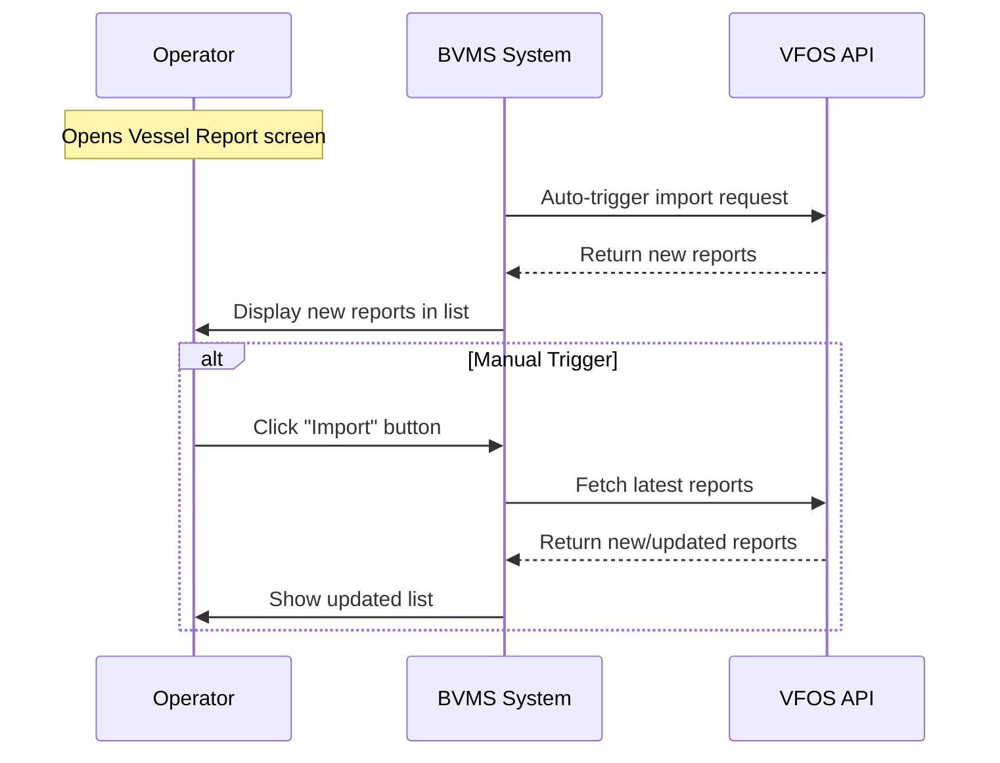

> **Behavior:** When the operator opens the Vessel Report screen, BVMS auto-triggers an import from VFOS. Operators can also manually click **Import** to force a fresh pull.

---

## 8. System Actions — Import, Sync, Delete, Reset

### 8.1 Import

**Purpose:** Pull new reports from VFOS into BVMS.  
**Triggers:** Auto on screen open, or manual click of Import button.  
**Effect:** New reports appear in the report list with pending (unapproved) status.

### 8.2 Sync (Data Comparison)

**Purpose:** Compare current BVMS report data with the **latest version from VFOS**, in case the captain has since corrected a report.

**When to use:** Captain notified they fixed a previously submitted report in SmartLog.

**Visual indicator:** Changed fields appear **highlighted in purple**.

**Operator decision:**

- If the change is **small** (e.g., 0.07 tons oil) → can ignore
- If the change is **significant** (e.g., 10 tons oil, or time corrections) → accept the updated data, then re-approve the report

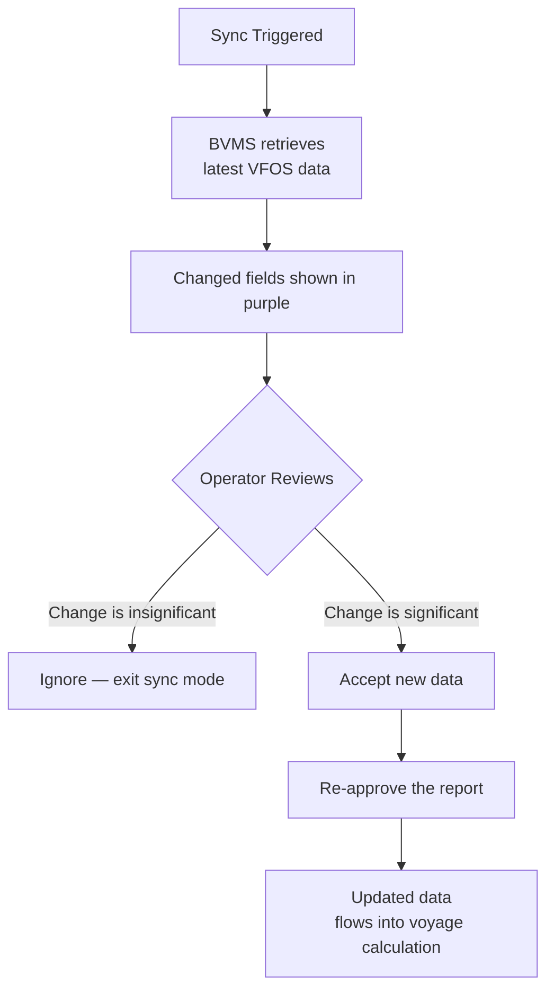

### 8.3 Delete

**Purpose:** Remove one or more vessel reports from the list.  
**Effect:** Removes the report record; but **does NOT automatically reverse** the data already pushed into the voyage from that report.

**Primary use cases:**

1. Delete a wrong/unwanted report that was never approved (no data impact)
2. Delete all, then re-import fresh from VFOS (used with Reset for a clean restart)

> ⚠️ **Warning:** Deleting approved reports without performing a Reset first leaves the voyage data in an inconsistent state. Always combine Delete (all) with Reset if you want a clean slate.

### 8.4 Reset

**Purpose:** Undo the effect of **all approved reports** on the voyage, returning it to the pure estimate state.  
**Effect:**

- All approved reports remain in the list (records preserved)
- Status of all reports reverts to "unapproved"
- All reported data cleared from the voyage (positions, times, bunker actuals)
- Voyage reverts to its estimate-only state as if no reports were ever approved

**When to use:**

1. Developer/QA testing — reset and re-approve each report to trace errors
2. Discovering data corruption — reset, then re-import and re-approve step-by-step to find where the error entered

> **Note:** Reset is an internal/development tool. The customer (BBC) was informed about it and chose to keep it available. It does not hide data; it provides a way to clean all report effects and reprocess from scratch.

### 8.5 Action Decision Tree

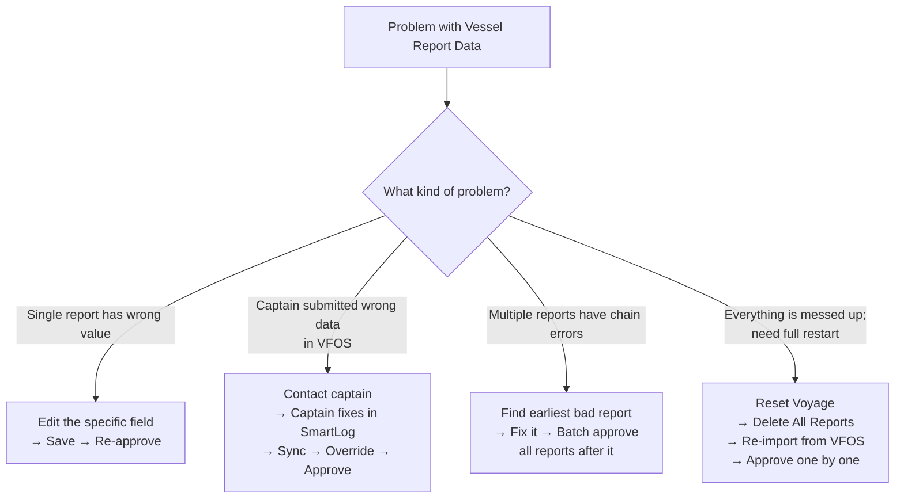

---

## 9. Data Validation Rules

### 9.1 Consumption Consistency Validation

| Rule                                    | Formula                                                | Error Behavior                                |
| --------------------------------------- | ------------------------------------------------------ | --------------------------------------------- |
| **Consumption Math**                    | `Previous_Remaining − Consumption = Current_Remaining` | System flags error; blocks approval           |
| **Non-negative Bunker**                 | `Current_Remaining ≥ 0`                                | System flags error; blocks approval           |
| **Lot Quantity Non-zero at Assignment** | N/A                                                    | System excludes lot ID = 0 (VFOS placeholder) |

**Understanding the validation error:**

```
Scenario: Noon Report for LSMGO Lot #2
  Previous (last approved report):  3.6 tons
  Current (captain reports sensor): 2.1 tons
  Implied consumption:              1.5 tons ← what math says

  Captain reports via engine sensors: 1.35 tons ← MISMATCH

  Error message: "Bunker consumption inconsistent:
                  drop = 3.6 - 1.35 = 2.25, but current = 2.1"
```

> **Technical insight:** The **current remaining** (from tank sensors) is the most reliable number — it's physically measured by sensors in the tanks. The **consumption breakdown** (by engine) can have sensor errors. If there's a mismatch, the tank sensor reading is treated as ground truth.

### 9.2 Report Date Ordering

| Rule                         | Description                                                                            |
| ---------------------------- | -------------------------------------------------------------------------------------- |
| **No Duplicate Timestamps**  | Two reports in the same voyage cannot share the exact date/time                        |
| **Minimum 1-Minute Gap**     | For same-port scenarios (depart A → arrive A), reports must be at least 1 minute apart |
| **No Backdate Beyond Locks** | A new report cannot have a date before the most recently locked event time             |

### 9.3 Route Consistency Validation

| Rule                          | Description                                                                                              | Error Behavior                                 |
| ----------------------------- | -------------------------------------------------------------------------------------------------------- | ---------------------------------------------- |
| **Port Skip with Fueling**    | If an itinerary port has a Bunker Order (fueling type "F") and the captain skips it, approval is blocked | Cannot approve; must remove Bunker Order first |
| **Port Skip without Fueling** | Passing/waypoint ports (type "B") can be skipped by captain without reporting                            | System auto-locks them based on ETA timing     |
| **Future Arrival Blocked**    | System blocks approval of an arrival at a port that is still in the future in the itinerary              | Must have logical time progression             |

### 9.4 UTC Timezone Handling

All times are stored and transmitted in **UTC+0**. The UI renders them in the port's local timezone.

**Example of timezone complexity:**

```
Captain reports departure: 11:00 UTC+2
Stored internally:          09:00 UTC

Captain moves to new timezone: UTC+0
Subsequent report expected:   09:00 UTC + 3 hours sailing = 12:00 UTC
UI displays as:               12:00 UTC+0 (different from origin display)
```

This means operators and developers should always work in UTC internally to avoid confusion when vessels cross timezone boundaries.

### 9.5 Weather Factor

A **Weather Factor** (default: 10%) is applied to distance calculations when the vessel has not yet arrived at the destination. Once the vessel arrives, the weather factor becomes 0 (no more uncertainty).

**Important edge case:** If an approved report is reset or reversed, the weather factor must be **manually reset to 10%** — the system does not automatically restore it.

---

## 10. Operational Workflows

### 10.1 Daily Operator Workflow

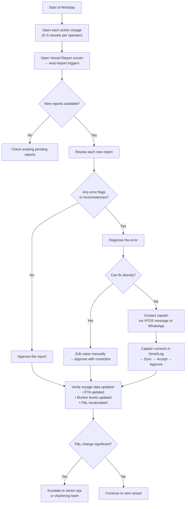

### 10.2 Monday / Post-Weekend Catch-Up

Ships operate 7 days a week. Operators typically do not work weekends. As a result:

- **Monday is the busiest day** — operators review Friday + Saturday + Sunday reports
- **3–4 reports per vessel per Monday** is normal
- Operators work through them in order (oldest first) to maintain cascade correctness

### 10.3 Full Reset & Re-approve Procedure (Debugging)

Used when an operator needs to trace an error in the voyager data that came from approved reports:

```
1. Navigate to Vessel Report screen
2. Click RESET — voyage reverts to estimate state
3. Click DELETE ALL — clear all report records
4. Click IMPORT — pull all fresh data from VFOS
5. Approve FIRST BOSP — verify lot mapping; correct if needed
6. Approve each NOON REPORT in sequence — watch for error flags
7. When error appears → stop → diagnose → fix → approve
8. Continue sequentially to end
```

---

## 11. Edge Cases & Special Scenarios

### 11.1 Skipped Fueling Port (Route Change Mid-Voyage)

**Scenario:** The planned itinerary includes a fueling stop at Gibraltar. The captain bypasses Gibraltar and goes directly to Toronto.

**Problem:** Approving the report from the captain (who skipped Gibraltar) will fail because the BVMS itinerary has Gibraltar as a **type "F" (fueling) port** with an active Bunker Order.

**Resolution steps:**

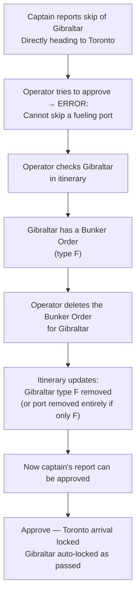

**Key distinction:**

- **Fueling ports (F):** Captain **must** report arrival/departure OR operator must remove the bunker order before approving
- **Passing/waypoint ports (B):** Captain does **not** need to submit reports for these. The system infers they passed through based on timing

### 11.2 Same-Port Consecutive Voyage (A → A)

**Scenario:** A vessel is chartered to load at Port Hamria, sail, and return to unload at Port Hamria (same port twice in the same itinerary).

**Technical challenge:** BOSP departure and subsequent EOSP arrival are at the same port. The system needs two distinct report timestamps.

**Rule:** The reports must be at least **1 minute apart** — even if logistically the same port, the timestamps must differ to maintain report ordering.

**Operator action:** Manually create the departure report (BOSP) with a slightly different time than the arrival report (EOSP):

```
Arrival at Hamria (first visit):   Oct 3, 14:00
Departure from Hamria (BOSP):      Oct 3, 14:01  ← 1 minute later
Noon Report:                       Oct 4, 12:00
Arrival at Hamria (second visit):  Oct 5, 09:00
```

### 11.3 Post-Approval Data Locked — Non-Editable Fields

Once a BOSP is approved, certain fields become **locked and non-editable** by operators:

| Locked Fields After BOSP Approval | Why Locked                                         |
| --------------------------------- | -------------------------------------------------- |
| Departure Time                    | "Moment of truth" — financial and legal timestamp  |
| Arrival Time (after EOSP)         | Locks laytime calculation                          |
| Berth Time (after Berth report)   | Locks cargo operations timeline                    |
| Initial Bunker Lots               | Starting inventory confirmed and cannot be revised |

> **Important:** If locked fields are wrong, the operator cannot change them. The wrong data propagates to the P&L. If discovered, the only fix is to delete the report and re-import/re-approve, which requires careful handling of subsequent reports.

### 11.4 Fuel Port Berth Report Hidden in BVMS

**Scenario:** A vessel takes on fuel at a fueling port (type F). The captain submits a Berth Report for it.

**BVMS behavior:** The Berth Report is **saved** in BVMS but **not displayed** in the UI — this is a deliberate design decision for fueling-only ports.

**Why:** Operators and charterers are only interested in cargo-related berth times, not fueling berths. The data is retained for future reference but hidden to reduce screen noise.

### 11.5 Drop Inconsistency When Re-Importing

**Scenario:** An operator deletes a report and re-imports it. The new import may have updated values.

**Risk:** If the re-imported data has different consumption figures (e.g., due to the captain correcting their records), the math chain can break:

```
Previous approved report consumption: 45.238 tons
Re-imported report:                   45.223 tons (slightly corrected)
Difference:                           0.015 tons ← small but system may flag
```

If the system blocks the re-import due to this discrepancy, the operator should manually correct the consumption value to make the math work.

---

## 12. Consecutive Voyage Impact

### 12.1 Carryover Model

When a voyage completes, its ending data becomes the **starting point** for the next voyage:

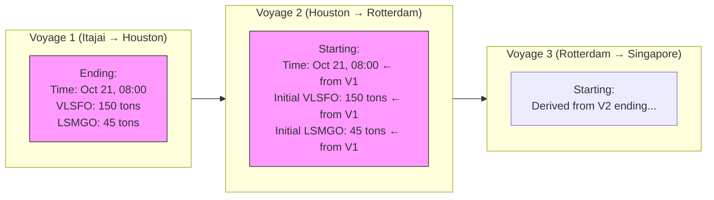

### 12.2 Cascade Effect — One Approval Changes Everything

**Critical insight:** Approving a single report can cause a **cascade of changes** through all future voyages:

| Event               | Voyage 1 (Current)                    | Voyage 2 (Next)                     | Voyage 3 (Future)    |
| ------------------- | ------------------------------------- | ----------------------------------- | -------------------- |
| **Before Approval** | Depart: Oct 21, 08:00; End fuel: 187t | Start: Oct 21, 08:00; Initial: 187t | Start: Oct 25, 10:00 |
| **After Approval**  | Depart: Oct 20, 22:00; End fuel: 150t | Start: Oct 20, 22:00; Initial: 150t | Start: Oct 24, 20:00 |
| **Cascaded Change** | −10 hours, −37 tons fuel              | −10 hours, −37 tons fuel initial    | −14 hours adjusted   |

### 12.3 Ending Lot Carryover Rules

| Lot State at Voyage End        | Carried to Next Voyage?                   |
| ------------------------------ | ----------------------------------------- |
| Lot has remaining quantity     | ✓ Yes — becomes "Initial" for next voyage |
| Lot is fully consumed (0 tons) | ❌ No — discarded (not brought forward)   |

> Example: Voyage has 5 lots. At voyage end, Lots #1 and #2 are empty. Only Lots #3, #4, #5 are carried to the next voyage as its initial inventory.

### 12.4 Bunker Planning Across Voyages

Operators use the bunker tab's forward view to ask:

- **"Does this vessel have enough fuel to complete Voyage 2 after Voyage 1?"**
- **"Will I need to bunker in Voyage 2 before starting Voyage 3?"**

When a new Vessel Report is approved and the ending quantity changes, **all downstream voyages automatically recalculate** their bunker sufficiency.

---

## 13. Custom Positions & Route Changes

### 13.1 Custom Position (Waypoint P)

Operators can add a **custom waypoint** to the route that does not correspond to a named port:

**How to add:**

1. Open the Route Map
2. Right-click on the desired location
3. Select **"Add Viewer Position"**
4. System adds a **"P" (Position) type waypoint** with coordinates
5. Can drag or edit coordinates manually

**Characteristics:**

- Custom positions are **passing type** (type P) — captain does not need to file a report for them
- The system still calculates distance through the custom position from DataLoy
- Useful for inserting ECA zone waypoints or course deviation points

### 13.2 Inserting a Stop in Between (Diverting Mid-Voyage)

**Scenario:** Vessel is en route from Palm Back to Singapore. Operator wants to divert it to Vung Tau first, then proceed to Singapore.

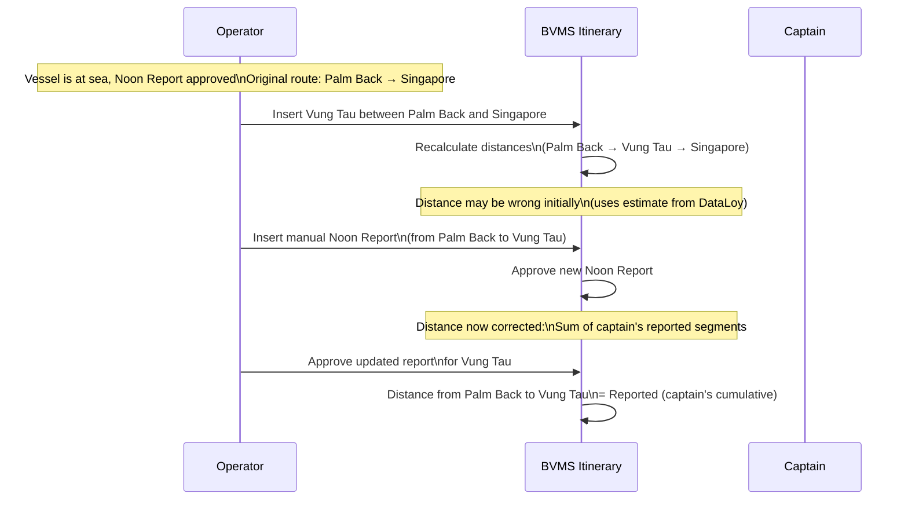

**Distance calculation logic for inserted stops:**

- Captain reports total distance from their last BOSP to the new waypoint (e.g., 10,000 miles to Vung Tau)
- BVMS gets intermediate distances from **DataLoy** (e.g., Palm Back → Cape Good Hope: 4,000 miles)
- Remaining distance = Total Captain Reported − DataLoy Known Segments = New Segment

### 13.3 Deleting a Fueling Port from the Itinerary

**Scenario:** Operator needs to remove a planned fueling stop that is no longer needed.

**Rules:**

- If the port has **only** type "F" (fueling), removing its Bunker Order will also remove the itinerary point
- If the port has **multiple types** (e.g., loading + fueling), removing the Bunker Order only removes the "F" — the port remains
- Deleting a port that already has an **approved Vessel Report** is blocked

**Order of operations to safely remove a fueling stop:**

```
1. Navigate to Bunker Order for that port
2. Delete the Bunker Order
3. Itinerary point automatically removes the "F" type
4. If port was "F only" → port is removed from itinerary
5. Return to Vessel Report → can now approve captain's skip
```

---

## 14. Glossary

| Term                     | Full Name                      | Definition                                                                                  |
| ------------------------ | ------------------------------ | ------------------------------------------------------------------------------------------- |
| **BVMS**                 | BBC Voyage Management Software | The main shore-based software managing chartering, voyages, operations, and reports         |
| **VFOS / WFOS**          | Vessel Fleet Operations System | Onboard software used by captains to submit daily vessel reports                            |
| **BOSP**                 | Begin of Sea Passage           | Report marking vessel departure from a port; locks departure time                           |
| **EOSP**                 | End of Sea Passage             | Report marking vessel arrival at a port; locks arrival time                                 |
| **NOOR**                 | Noon Report                    | Daily at-sea progress report (position, distance, consumption)                              |
| **Receival**             | Bunker Receival Report         | Report submitted when vessel receives fuel at a port                                        |
| **LOD**                  | Load On Departure              | Bunker lot view showing per-tank quantities at voyage start                                 |
| **ECA**                  | Emission Control Area          | Regulated zone requiring low-sulfur fuel (LSMGO)                                            |
| **VLSFO**                | Very Low Sulfur Fuel Oil       | Heavy fuel oil with ≤0.50% sulfur — used in open ocean                                      |
| **LSMGO**                | Low Sulfur Marine Gas Oil      | Clean light fuel oil with ≤0.10% sulfur — used in ECA zones and ports                       |
| **Running P&L**          | Running Profit & Loss          | Live financial calculation updated with each approved report                                |
| **Laytime**              | Lay Time                       | Contracted time allowed for loading/unloading; excess time = demurrage                      |
| **Demurrage**            | Delay Penalty                  | Financial penalty paid when vessel arrives too late or cargo operations exceed laytime      |
| **Idle Time**            | Port Idle / Waiting Time       | Period vessel waits outside port to avoid incurring early port costs                        |
| **Intra Time**           | Intra Port Time                | Time moving from anchorage to berth (or berth to open sea); harbor tugs required            |
| **Lot**                  | Bunker Lot                     | A single batch of purchased fuel; tracked individually for price and quantity               |
| **Carryover**            | Lot Carryover                  | Transfer of remaining lot quantities from one voyage's end to the next voyage's beginning   |
| **First Report Mapping** | Bunker Lot Mapping             | Process of linking VFOS lot IDs to BVMS lot IDs; established on the first BOSP              |
| **Propagation**          | Data Propagation               | When an approved report's data cascades forward through subsequent voyages                  |
| **Reset**                | Voyage Reset                   | Action to undo all approved report data and return voyage to estimate state                 |
| **Sync**                 | Data Comparison Sync           | Pull latest VFOS data and highlight changed fields vs. current BVMS data (purple = changed) |

---

## 15. Revision Notes

### Section Review Summary

| Section                  | Source Sessions                 | Confidence | Notes                                            |
| ------------------------ | ------------------------------- | ---------- | ------------------------------------------------ |
| Executive Summary        | Session 1 Part 1                | High       | Core concepts well-documented                    |
| System Architecture      | Session 1 Part 1, Demo          | High       | VFOS/DataLoy roles confirmed                     |
| Key Concepts             | Session 1 Part 1 & 2            | High       | P&L, ETA, Running P&L confirmed                  |
| Report Lifecycle         | Session 1 Part 1, Session 2     | High       | All types confirmed                              |
| BOSP Detail              | Session 1 Part 1 & 2, Session 2 | High       | Lot mapping, departure formula documented        |
| Noon Report              | Session 1 Part 1, Session 2     | High       | Consumption validation confirmed                 |
| EOSP / In-Port Reports   | Session 1 Part 1 & 2            | Medium     | Berth hidden behavior confirmed                  |
| Receival Report          | Session 1 Part 2, Session 2     | High       | Two Singapore orders confirmed                   |
| Bunker LOD/Lot           | Session 1 Part 1, Session 2     | High       | Lot carryover, mapping confirmed                 |
| VFOS Integration         | Session 1 Part 1                | High       | Auto-trigger, 95% import rate confirmed          |
| Import/Sync/Delete/Reset | Session 1 Part 1, Session 2     | High       | All use cases documented                         |
| Validation Rules         | Session 1 Part 2, Session 2     | High       | Math formula, sensor accuracy noted              |
| Daily Workflow           | Session 2                       | High       | 3–5 ships, Monday catch-up confirmed             |
| Edge Cases               | Session 2, Demo                 | High       | Gibraltar skip, same-port A→A documented         |
| Consecutive Voyage       | Session 1 Part 1, Session 2     | High       | Cascade effect, lot carryover confirmed          |
| Custom Positions         | Demo                            | Medium     | P-type waypoint behavior documented              |
| Route Changes            | Demo                            | Medium     | Insert mid-voyage, delete fueling port confirmed |

---

### Known Limitations & Open Questions

| Item                                      | Status                    | Notes                                                                                  |
| ----------------------------------------- | ------------------------- | -------------------------------------------------------------------------------------- |
| Berth report visibility for fueling ports | Design decision confirmed | Hidden in BVMS but data saved; can surface if customer requests                        |
| Weather factor on reset                   | Known issue noted         | Reset does not restore weather factor from 0 to 10%; must manually reset               |
| Delete mid-chain without reset            | Undefined behavior risk   | If approved reports are deleted without reset, voyage state becomes inconsistent       |
| Lot mapping threshold (30-ton rule)       | Confirmed                 | If difference > 30 tons between VFOS lot and BVMS lot, auto-map fails; manual required |
| UTC timezone crossings                    | System design confirmed   | All times stored in UTC+0; rendered in local time by UI                                |
| Consecutive voyage insert                 | Demo (partial)            | Feature is in first draft; some hiccups remain with rotation changes                   |

---

### Document Version History

| Version | Date         | Changes                                                                                                                                                                        |
| ------- | ------------ | ------------------------------------------------------------------------------------------------------------------------------------------------------------------------------ |
| 1.0     | Oct 22, 2025 | Initial comprehensive documentation                                                                                                                                            |
| 2.0     | May 4, 2026  | Full rewrite and enrichment: Added Sessions 1 & 2 content, Demo scenarios, Mermaid diagrams, validation rules, edge cases, consecutive voyage detail, glossary, revision notes |

---

_For questions, corrections, or additions, contact the BVMS Operations & Development Team._

_Source sessions: "Session 1 Vessel Report 1", "Session 1 Vessel Report 2", "Session 2 Vessel Report - Edge Cases & Practice", "Demo: Custom Position, Rotation Update, Consecutive Voyage"_
