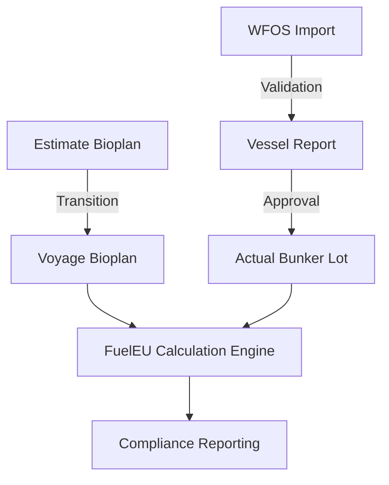

# WFOS Biofuel Import System: Educational Guide

## Executive Summary

This guide explains the biofuel import and management system integrated with WFOS (Vessel Fuel Optimization System), specifically focusing on how biofuel blending parameters are tracked, calculated, and applied for FuelEU Maritime compliance. The system enables maritime operators to accurately calculate Well-to-Wake (WtW) emissions when vessels receive biofuel blends, ensuring proper compliance reporting and environmental impact assessment.

---

## Table of Contents

1. [Introduction to Maritime Biofuels](#introduction)
2. [WFOS Biofuel Data Structure](#data-structure)
3. [System Implementation Overview](#system-overview)
4. [Bioplan Parameter Management](#bioplan-management)
5. [FuelEU Calculation Methodology](#fueleu-calculation)
6. [Technical Reference Tables](#technical-reference)
7. [Workflow Examples](#workflow-examples)

---

## 1. Introduction to Maritime Biofuels {#introduction}

### What are Maritime Biofuels?

Maritime biofuels are renewable alternatives to conventional fossil marine fuels that help reduce greenhouse gas emissions in shipping operations. The two primary biofuel types discussed in this system are:

1. **FAME (Fatty Acid Methyl Esters)** - Biodiesel produced from vegetable oils or animal fats
2. **HVO (Hydrotreated Vegetable Oil)** - A "drop-in" renewable diesel fuel with superior properties

### Why Biofuel Tracking Matters

**[00:00]** The FuelEU Maritime regulation requires accurate tracking of biofuel consumption because:

- Biofuels have significantly lower Well-to-Wake (WtW) emissions compared to fossil fuels
- Blending percentages directly impact compliance calculations
- Different biofuel types have varying emission reduction values (e-Values)
- Proper documentation is required for regulatory reporting

### Key Emission Parameters

The system tracks critical greenhouse gas emissions:

- **CO₂** (Carbon Dioxide) - Primary greenhouse gas
- **CH₄** (Methane) - Potent short-term climate forcer
- **N₂O** (Nitrous Oxide) - Long-lived greenhouse gas with high global warming potential

**[00:30]** These parameters are essential for calculating the overall environmental impact of fuel consumption.

---

## 2. WFOS Biofuel Data Structure {#data-structure}

### Biofuel Section in Bunkering Events

**[00:15]** When a vessel receives biofuel from WFOS, the bunkering event includes a dedicated biofuel section containing:

```mermaid
graph TD
    A[Bunkering Event] --> B[Base Fuel Properties]
    A --> C[Biofuel Section]
    C --> D[Biological Component Type]
    C --> E[Blend Percentage]
    C --> F[Emission Parameters]
    F --> G[Methane CH₄]
    F --> H[Nitrous Oxide N₂O]
    F --> I[CO₂ Factors]
    B --> J[Traditional Fuel Data]
```

### Data Completeness and Default Values

**[00:45]** Important consideration: WFOS may not provide all parameters for every biofuel delivery. The system handles this by:

1. **Receiving available data** from WFOS
2. **Applying default values** for missing parameters based on regulatory standards
3. **Allowing operator override** if more accurate data becomes available

**[01:00]** This flexibility ensures calculations can proceed even with incomplete supplier data while maintaining regulatory compliance.

---

## 3. System Implementation Overview {#system-overview}

### User Interface Access Points

The bioplan management interface is accessible at three key locations:

#### A. Estimate Level **[01:15]**

**Navigation Path**: `Estimate → Bunker Lot Tab → ⋮ (Three Dots) → Bioplan`

#### B. Voyage Level **[06:45]**

The same functionality exists at the voyage level with identical behavior, enabling:

- Seamless transition from estimate to actual voyage
- Consistent data entry experience
- Real-time calculation updates

#### C. Vessel Report Level **[07:30]**

**[07:45]** When receiving bunkering reports from vessels:

- An eye icon (👁️) appears next to bunkering events
- Clicking reveals biofuel parameters imported directly from WFOS
- Operators can review and modify if necessary
- **[08:00]** Upon approval, the bioplan becomes a permanent part of the vessel's fuel inventory

---

## 4. Bioplan Parameter Management {#bioplan-management}

### Default Parameter Display

**[01:30]** The system presents default values for all supported fuel types:

| Fuel Type                        | Available Bioblends |
| -------------------------------- | ------------------- |
| VLSFO (Very Low Sulfur Fuel Oil) | FAME, HVO           |
| MGO (Marine Gas Oil)             | FAME, HVO           |

**[01:45]** Each fuel type displays its baseline Well-to-Wake (WtW) value when no bioplan is applied.

### Example: VLSFO Default Parameters **[02:00]**

- **Base WtW Value**: 91.74 gCO₂eq/MJ
- **Represents**: Pure fossil VLSFO with no biofuel blending
- **Display Context**: This is the value used in FuelEU calculations when no bioplan is active

### Configuring a Bioplan

#### Step 1: Select Biofuel Type **[02:30]**

**[02:45]** Users can choose between:

1. **FAME (Biodiesel)** - Fatty Acid Methyl Esters
2. **HVO** - Hydrotreated Vegetable Oil

Each type has distinct emission characteristics:

```mermaid
graph TD
    A[Select Biofuel] --> B{Type?}
    B -->|FAME| C[e-Value: 14.90%<br/>WtW: 16.38 gCO₂eq/MJ]
    B -->|HVO| D[e-Value: 16.00%<br/>WtW: 17.25 gCO₂eq/MJ]
    C --> E[Configure Blend %]
    D --> E
    E --> F[Calculate Blended WtW]
```

#### Step 2: Set Blend Percentage **[03:00]**

**[03:15]** The system provides flexible input options:

1. **Slider Control**: Adjust percentage visually (default: 24%)
2. **Direct Input**: **[03:30]** Enter specific values (e.g., 20%, 5.9%)
3. **Automatic Calculation**: **[03:45]** System recalculates WtW value in real-time

**Example Calculation** (VLSFO with 20% FAME):

$$
\text{WtW}_{\text{blended}} = (\text{WtW}_{\text{fossil}} \times 0.80) + (\text{WtW}_{\text{FAME}} \times 0.20)
$$

$$
\text{WtW}_{\text{blended}} = (91.74 \times 0.80) + (16.38 \times 0.20) = 73.39 + 3.28 = 76.67 \text{ gCO₂eq/MJ}
$$

#### Step 3: Reset to Defaults **[04:00]**

**[04:15]** A dedicated reset button restores default values, useful when:

- Testing different scenarios
- Correcting input errors
- Reverting to pure fossil fuel baseline

---

## 5. FuelEU Calculation Methodology {#fueleu-calculation}

### Impact on FuelEU Compliance **[04:15]**

After configuring a bioplan and clicking "Recalculate":

**[04:30]** The system applies the blended WtW value to all fuel consumption calculations where that specific bunker lot is used.

### Lot-Based Calculation Logic

```mermaid
graph TD
    A[Fuel Consumption Event] --> B{Check Bunker Lot}
    B --> C[Lot 1: Has Bioplan]
    B --> D[Lot 2: No Bioplan]
    C --> E[Use Blended WtW<br/>e.g., 76.67 gCO₂eq/MJ]
    D --> F[Use Fossil WtW<br/>e.g., 91.74 gCO₂eq/MJ]
    E --> G[Calculate Emissions]
    F --> G
    G --> H[Aggregate Results]
```

### Weighted Average Calculations **[05:00]**

**[05:15]** When a vessel transitions between bunker lots with different bioplans:

1. **First Lot (with bioplan)**: Used until depleted
2. **Second Lot (without bioplan)**: **[05:00]** Takes over with different WtW value
3. **Weighted Average**: **[05:15]** System calculates proportional emissions based on fuel consumed from each lot

**Mathematical Formula**:

$$
\text{WtW}_{\text{avg}} = \frac{\sum_{i=1}^{n} (\text{Fuel}_i \times \text{WtW}_i)}{\sum_{i=1}^{n} \text{Fuel}_i}
$$

Where:

- $\text{Fuel}_i$ = Amount consumed from lot $i$
- $\text{WtW}_i$ = Well-to-Wake value of lot $i$
- $n$ = Number of lots consumed

### Example Scenario **[04:45]**

**Timeline of Fuel Consumption**:

| Time Period | Lot Used | Bioplan Status | WtW Value       |
| ----------- | -------- | -------------- | --------------- |
| Days 1-3    | Lot 1    | 20% FAME       | 76.67 gCO₂eq/MJ |
| Days 4-7    | Lot 2    | No bioplan     | 91.74 gCO₂eq/MJ |

**[05:30]** The displayed average (e.g., 86 gCO₂eq/MJ) represents the weighted combination of both lots consumed during the reporting period.

### Lot Ordering Effects **[05:30]**

**[05:45]** The sequence of bunker lot consumption affects calculations:

- Reordering lots changes which bioplan applies to which consumption period
- System recalculates automatically when lot order changes
- Allows operators to model different consumption scenarios

---

## 6. Technical Reference Tables {#technical-reference}

### Complete Emission Factors Table

| Fuel Type                 | Standard        | LCV\* (MJ/t) | Well to Tank (gCO₂eq/MJ) | Tank to Wake CO₂ (g/gfuel) | Tank to Wake CH₄ (g/gfuel) | Tank to Wake N₂O (g/gfuel) | Tank to Wake (gCO₂eq/MJ) | e-Value (%) | WtW\* (gCO₂eq/MJ) |
| ------------------------- | --------------- | ------------ | ------------------------ | -------------------------- | -------------------------- | -------------------------- | ------------------------ | ----------- | ----------------- |
| **Heavy Fuel Oil**        | ISO8217 RME-RMK | 40,500       | 13.5                     | 3.114                      | 0.00005                    | 0.00018                    | 78.24                    | -           | **91.74**         |
| **Light Fuel Oil**        | ISO8217 RMA-RMD | 41,000       | 13.2                     | 3.151                      | 0.00005                    | 0.00018                    | 78.19                    | -           | **91.39**         |
| **Marine Diesel/Gas Oil** | ISO8217 DMX-DMB | 42,700       | 14.4                     | 3.206                      | 0.00005                    | 0.00018                    | 76.37                    | -           | **90.77**         |
| **Biodiesel (FAME)**      | -               | 37,000       | -61.69                   | 2.834                      | 0.00005                    | 0.00018                    | 78.08                    | 14.90       | **16.38**         |
| **HVO**                   | -               | 44,000       | -54.80                   | 3.115                      | 0.00005                    | 0.00018                    | 72.04                    | 16.00       | **17.25**         |

### Key Definitions

**LCV (Lower Calorific Value)**: The energy content per tonne of fuel, measured in MJ/t (Megajoules per tonne)

**Well to Tank**: Upstream emissions from fuel production, refining, and transportation to the vessel

**Tank to Wake**: Direct emissions from fuel combustion onboard the vessel

**WtW (Well-to-Wake)**: Total lifecycle emissions = Well to Tank + Tank to Wake

**e-Value**: Emission reduction percentage compared to fossil fuel baseline

### Notable Observations

1. **Negative Well to Tank for Biofuels**: FAME and HVO show negative values (-61.69 and -54.80) because:

   - Plants absorb CO₂ during growth
   - This offsets production emissions
   - Results in significant lifecycle emission reductions

2. **e-Value Comparison**:

   - HVO has higher e-Value (16.00%) than FAME (14.90%)
   - HVO also has higher energy content (44,000 vs 37,000 MJ/t)
   - Makes HVO more efficient per unit volume

3. **Emission Reduction Calculation**:

$$
\text{Reduction} = \frac{\text{WtW}_{\text{fossil}} - \text{WtW}_{\text{bio}}}{\text{WtW}_{\text{fossil}}} \times 100\%
$$

For VLSFO with HVO:

$$
\text{Reduction} = \frac{91.74 - 17.25}{91.74} \times 100\% = 81.2\%
$$

---

## 7. Workflow Examples {#workflow-examples}

### Workflow A: Creating an Estimate with Biofuel **[01:15]**

```mermaid
sequenceDiagram
    participant User
    participant Estimate
    participant BunkerLot
    participant FuelEU

    User->>Estimate: Open Estimate
    User->>BunkerLot: Navigate to Bunker Lot Tab
    User->>BunkerLot: Click ⋮ → Bioplan
    BunkerLot-->>User: Display Default Values
    User->>BunkerLot: Select FAME 20%
    BunkerLot->>BunkerLot: Calculate Blended WtW
    User->>BunkerLot: Click OK
    User->>FuelEU: Click Recalculate
    FuelEU-->>User: Display Updated Emissions
```

### Workflow B: Processing WFOS Bunkering Report **[06:15]**

**[06:30]** When vessel receives biofuel:

1. **Import Stage**:

   - WFOS sends bunkering event with biofuel data
   - System transforms data to internal structure
   - **[06:30]** Applies default values for missing parameters

2. **Review Stage** **[07:30]**:

   - Operator views vessel report
   - Clicks eye icon (👁️) to inspect bioplan **[07:45]**
   - Reviews imported parameters
   - **[08:00]** Can modify if vessel's delivery note shows different values

3. **Approval Stage** **[08:00]**:
   - Operator approves bunkering event
   - **[08:15]** Bioplan parameters transfer to actual bunker lot
   - Lot becomes available for consumption tracking
   - FuelEU calculations automatically use bioplan data

### Workflow C: Removing a Bioplan **[05:45]**

**[06:00]** To revert fuel to pure fossil:

**[06:15]** All subsequent calculations will use the fossil fuel emission factors.

---

## Advanced Concepts

### Multi-Lot Consumption Strategy

**[05:30]** Operators can optimize emission profiles by:

1. **Strategic Lot Ordering**: Consuming bioplan lots during high-emission operations
2. **Blend Optimization**: Adjusting percentages based on fuel costs vs. compliance needs
3. **Scenario Testing**: **[05:45]** Modeling different consumption patterns before actual operations

### Data Consistency Across System Levels **[07:30]**

The system maintains consistency through:

### Error Prevention Mechanisms

1. **Default Value Safety Net**: **[01:00]** Ensures calculations always have required parameters
2. **Reset Functionality**: **[04:00]** Quick recovery from input errors
3. **Real-time Calculation**: **[03:45]** Immediate feedback on parameter changes
4. **Import Validation**: **[08:00]** Operator review before committing to inventory

---

## Regulatory Context

### FuelEU Maritime Compliance

The FuelEU Maritime regulation requires:

- Accurate tracking of all fuel consumption
- Proper documentation of biofuel blend ratios
- Lifecycle emission calculations (Well-to-Wake)
- Demonstrable emission reductions for compliance credits

### Documentation Requirements

For each biofuel delivery, operators must maintain:

- Bunker Delivery Note (BDN) with biofuel specifications
- Sustainability certification (e.g., ISCC, RSB)
- Laboratory analysis reports (if available)
- Chain of custody documentation

**[08:15]** This system ensures all data points are captured and available for audit purposes.

---

## Best Practices

### 1. Data Entry Accuracy **[03:30]**

- Verify blend percentages against delivery documentation
- Use direct input for precise values rather than slider estimates
- Cross-reference WFOS data with vessel reports

### 2. Regular Reconciliation **[05:15]**

- Monitor weighted average WtW values for reasonableness
- Compare system calculations with manual spot-checks
- Review lot consumption order for accuracy

### 3. Scenario Planning **[02:30]**

- Test different bioplan configurations in estimates
- Evaluate cost-benefit of various blend percentages
- Model compliance outcomes before committing to purchases

### 4. Communication **[00:00]**

- Ensure shore staff and vessel crews understand bioplan procedures
- Maintain clear documentation of any manual overrides
- Document reasons for deviating from default values

---

## Troubleshooting

### Issue: Unexpected WtW Value **[04:45]**

**Possible Causes**:

- Multiple lots with different bioplans being consumed
- Lot order affecting which bioplan applies when
- Weighted averaging across mixed consumption

**Solution**: **[05:30]** Check lot consumption sequence and verify each lot's bioplan status

### Issue: Bioplan Not Applying **[04:15]**

**Checklist**:

1. Verify bioplan was saved (clicked OK)
2. Confirm Recalculate was clicked
3. Check if correct lot is being consumed in time period
4. Ensure lot hasn't been depleted (switched to next lot)

### Issue: Missing Parameters from WFOS **[00:45]**

**Resolution**:

- System automatically applies defaults
- **[01:00]** Operator can manually override with better data if available
- Document source of override values for audit trail

---

## Summary

**[08:15]** This biofuel import system provides a comprehensive solution for:

✅ **Accurate Tracking**: Captures biofuel parameters from bunkering events  
✅ **Flexible Configuration**: Allows adjustment of blend percentages and fuel types  
✅ **Automated Calculations**: Real-time WtW value updates for FuelEU compliance  
✅ **Seamless Integration**: Works across estimate, voyage, and vessel report levels  
✅ **Audit Trail**: Maintains documentation for regulatory compliance  
✅ **Operator Control**: Enables review and modification of imported data

The system transforms complex biofuel emission calculations into an intuitive workflow, ensuring maritime operators can accurately report their environmental performance while maintaining operational efficiency.

---

## Glossary

| Term        | Definition                                                                             |
| ----------- | -------------------------------------------------------------------------------------- |
| **FAME**    | Fatty Acid Methyl Esters - biodiesel produced from vegetable oils or animal fats       |
| **HVO**     | Hydrotreated Vegetable Oil - renewable diesel with properties similar to fossil diesel |
| **WtW**     | Well-to-Wake - total lifecycle emissions from fuel production through combustion       |
| **LCV**     | Lower Calorific Value - energy content of fuel                                         |
| **e-Value** | Emission reduction value compared to fossil fuel baseline                              |
| **VLSFO**   | Very Low Sulfur Fuel Oil - marine fuel with ≤0.50% sulfur content                      |
| **MGO**     | Marine Gas Oil - distillate marine fuel                                                |
| **WFOS**    | Vessel Fuel Optimization System - fuel management platform                             |
| **FuelEU**  | FuelEU Maritime - EU regulation on greenhouse gas intensity of energy used by ships    |

---

## Additional Resources

For implementation support or questions about specific scenarios:

- Reference the video timestamps provided throughout this guide
- Consult regulatory guidance on FuelEU Maritime compliance
- Review ISO 8217 standards for marine fuel specifications
- Engage with WFOS support for data integration issues

---

_Document Version: 1.0_  
_Based on video transcription dated: 2024_  
_Technical data sourced from: FuelEU Maritime Regulation Tables_  
_Created: October 2025_
