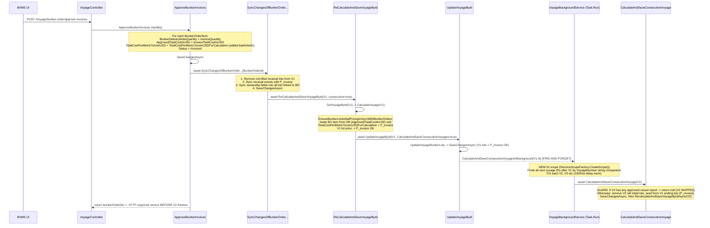
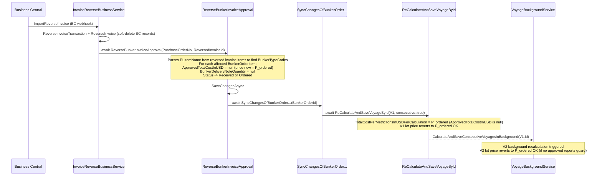
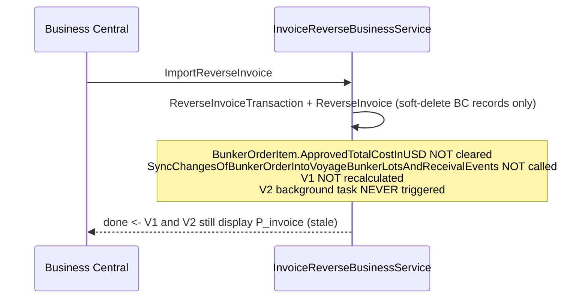

# Bunker Invoice Price Propagation — Root Cause Analysis & Fix History

> **Bug Reference:** Consecutive voyage (V2) does not reflect the updated Price Per Ton after invoice
> approval or reversal on the previous voyage's (V1) bunker order.
>
> **Repro voyages (QAQC):**
>
> - Voyage 1: `17c7ebef-3604-4b97-be59-120b1cc412a5` (1391001) — contains BNK-1394001-0001
> - Voyage 2: `10397a6e-51f1-44a1-bfa4-aa9a3893d10e` (1391002) — consecutive to Voyage 1
>
> **Confirmed:** The repro voyages have **no `OwnershipChangeLogs`** on their bunker order items.
> The root cause is NOT the TCO/TC ownership transition logic. See §7 for the correct analysis.

---

## Table of Contents

1. [System Overview](#1-system-overview)
2. [Key Entities & Fields](#2-key-entities--fields)
3. [Price Lifecycle](#3-price-lifecycle)
4. [Full Approval Workflow](#4-full-approval-workflow)
5. [Full Reversal Workflow](#5-full-reversal-workflow)
6. [Consecutive Voyage Bunker Lot Carry-Over](#6-consecutive-voyage-bunker-lot-carry-over)
7. [Root Cause Analysis (Correct)](#7-root-cause-analysis-correct)
8. [Guard Conditions That Block V2 Recalculation](#8-guard-conditions-that-block-v2-recalculation)
9. [Applied Fixes](#9-applied-fixes)
10. [Remaining Limitation](#10-remaining-limitation)
11. [Quick Reference: File Map](#11-quick-reference-file-map)

---

## 1. System Overview

### Actors in the Bunker Invoice Approval Chain

| Actor                                                           | Role                                                                              |
| --------------------------------------------------------------- | --------------------------------------------------------------------------------- |
| BVMS UI                                                         | Front-end — user clicks "Approve Invoices"                                        |
| `VoyageController`                                              | API — `POST /Voyage/bunker-order/approve-invoices`                                |
| Business Central (BC)                                           | External finance system — sends invoice import/reverse via REST                   |
| `BcIntegrationController`                                       | API entry point for BC payloads                                                   |
| `SynchronizationLoggingService`                                 | Persists sync job, dispatches to correct `ISynchronizationBusinessService`        |
| `InvoiceReverseBusinessService`                                 | Processes `ImportReverseInvoice` BC payloads                                      |
| `ApproveBunkerInvoices`                                         | Sets invoice-approved values on `BunkerOrderItem`; calls `SyncChanges...`         |
| `ReverseBunkerInvoiceApproval`                                  | Clears invoice-approved values; calls `SyncChanges...` (created in Bug #2981 fix) |
| `SyncChangesOfBunkerOrderIntoVoyageBunkerLotsAndReceivalEvents` | Propagates BO changes into voyage entities, triggers V1 recalc                    |
| `ReCalculateAndSaveVoyageById`                                  | Loads, calculates, and saves a single voyage                                      |
| `CalculateAndSaveConsecutiveVoyage`                             | Recalculates one downstream consecutive voyage (with guards)                      |
| `VoyageBackgroundService`                                       | Fire-and-forget background runner for all consecutive voyages after V1            |
| `EnsureBunkerLotsInitialPricingInSyncWithBunkerOrders`          | Within each voyage calc — re-syncs lot price from its source bunker order         |

---

## 2. Key Entities & Fields

### `BunkerOrderItemEntity` — Pricing Fields

| Field                                       | Storage           | Set By                                                                  | Notes                                                                            |
| ------------------------------------------- | ----------------- | ----------------------------------------------------------------------- | -------------------------------------------------------------------------------- |
| `TotalCostPerMetricTonsInUSD`               | DB column         | Order placement; also updated at approval (commit `bad4c6e0c`)          | Base ordered price per MT                                                        |
| `ActuallyReceivedQuantity`                  | DB column         | Receival report                                                         | Physical delivery qty                                                            |
| `ApprovedTotalCostInUSD`                    | DB column         | `ApproveBunkerInvoices` (set); `ReverseBunkerInvoiceApproval` (cleared) | Invoice total cost; `null` = not yet approved                                    |
| `BunkerDeliveryNoteQuantity`                | DB column         | `ApproveBunkerInvoices` (set); `ReverseBunkerInvoiceApproval` (cleared) | BDN invoice quantity                                                             |
| `TotalCostInUSDForCalculation`              | **`[NotMapped]`** | Computed                                                                | `ApprovedTotalCostInUSD ?? (received? qty×price : TotalCostInUSD)`               |
| `FuelQuantityForCalculation`                | **`[NotMapped]`** | Computed                                                                | `ActuallyReceivedQty ?? BDNQty ?? RequestedQty`                                  |
| `TotalCostPerMetricTonsInUSDForCalculation` | **`[NotMapped]`** | Computed                                                                | **The price propagated to voyage lots** — see §3                                 |
| `OwnershipChangeLogs`                       | JSON column       | TCO deliver/redeliver workflow                                          | Per-itinerary ownership history — **never touched by invoice approval/reversal** |

### `VoyageBunkerLotEntity` — Pricing Fields

| Field                     | Storage            | Notes                                                                           |
| ------------------------- | ------------------ | ------------------------------------------------------------------------------- |
| `PricePerMetricTonInUsds` | DB `decimal(18,5)` | Current lot price used in all cost calculations                                 |
| `BunkerOrderId`           | DB column          | References the originating bunker order — **can be from a previous voyage**     |
| `BunkerOrderItemId`       | DB column          | References the specific order item                                              |
| `IsInitial`               | DB column          | `true` = lot was on board at voyage commencement (carried from previous voyage) |
| `IsLifted`                | DB column          | `true` = an approved vessel report has consumed from this lot                   |
| `EndQuantityInMetricTons` | DB column          | Non-zero = will be carried as initial lot into the next consecutive voyage      |
| `OwnershipChangeLogs`     | JSON column        | Mirrors the source BO item's ownership history (synced, not always current)     |

---

## 3. Price Lifecycle

### 3.1 `TotalCostPerMetricTonsInUSDForCalculation` — The Authoritative Price Signal

This `[NotMapped]` computed property drives what price is written to voyage lots:

```
BEFORE approval (ApprovedTotalCostInUSD is null):
  TotalCostPerMetricTonsInUSD  (the originally ordered price per MT = P_ordered)

AFTER approval (ApprovedTotalCostInUSD has a value):
  TotalCostInUSDForCalculation / FuelQuantityForCalculation
    = ApprovedTotalCostInUSD / (ActuallyReceivedQty ?? BDNQty ?? RequestedQty)
    = P_invoice  (invoice total / invoice or received quantity)

AFTER reversal (ApprovedTotalCostInUSD cleared back to null):
  TotalCostPerMetricTonsInUSD  (= P_ordered again)
```

### 3.2 Price Flow Through the System

```
BunkerOrderItem.ApprovedTotalCostInUSD  (set on approval)
          |
          v  computed property
TotalCostPerMetricTonsInUSDForCalculation  = P_invoice
          |
          v  SynchronizeBunkerOrderItemsWithReceivalEventsAsync
VoyageBunkerEvent.PricePerMetricTonInUsds  (V1 receival event updated)
          |
          v  CalculateVoyage -> GeneratePreCalculatedEstimateBunkerEvents
EstimateCrudDto.BunkerPrices[].PricePerMetricTonInUsds  (V1 in-memory price)
          |
          v  EnsureBunkerLotsInitialPricingInSyncWithBunkerOrders
EstimateCrudDto.BunkerPrices[].PricePerMetricTonInUsds  = P_invoice  (confirmed)
          |
          v  UpdateVoyageBunkerLots -> OverwriteChanges -> SaveChangesAsync
VoyageBunkerLotEntity.PricePerMetricTonInUsds  (V1 persisted lot = P_invoice)  OK
          |
          v  GetEndingBunkerLotsFromVoyageId -> GenerateStartingLotsFromEndingLots
V2 initial VoyageBunkerLotEntity.PricePerMetricTonInUsds = P_invoice  OK
```

---

## 4. Full Approval Workflow

### 4.1 Current State



> **Note:** The HTTP response returns before the background service finishes V2 recalculation. The user
> may briefly see the old price on V2 until the background task (≥1500 ms delay) completes.

---

## 5. Full Reversal Workflow

### 5.1 Current State (After Bug #2981 Fix — commit `f04d07cdd`)



### 5.2 State BEFORE Fix (Bug #2981) — The Primary Root Cause



> **This is the root cause the user identified:** _"it does not do any trigger to update voy 1 thus_
> _never trigger to update vo2 consecutively"_ — `InvoiceReverseBusinessService` had no voyage
> recalculation trigger after BC reversal.

---

## 6. Consecutive Voyage Bunker Lot Carry-Over

### 6.1 Two Code Paths That Carry Lots from V1 → V2

| Path       | Where                                                                                                | When Triggered                                                    | Modifies DB directly?                                                                                   |
| ---------- | ---------------------------------------------------------------------------------------------------- | ----------------------------------------------------------------- | ------------------------------------------------------------------------------------------------------- |
| **Path A** | `CalculateAndSaveConsecutiveVoyage.Handle()`                                                         | Background service after V1's `UpdateVoyageById`                  | **Yes** — removes old V2 lots from DB, inserts new lots, then calls `RecalculateAndSaveVoyageByIdAsync` |
| **Path B** | `CalculateConsecutiveVoyageHelper.AutoCorrectConsecutiveBunkerLotsAndCommencePortForCurrentVoyage()` | Inside `CalculateVoyage(V2)` when V2 is calculated for any reason | **No** — modifies in-memory `VoyageCrudDto` only; persisted by subsequent `UpdateVoyageBunkerLots`      |

### 6.2 `GetEndingBunkerLotsFromVoyageId` — Which V1 Lots Are Carried

```csharp
return await context.VoyageBunkerLots
    .Where(b => b.VoyageId == voyageId && b.EndQuantityInMetricTons != 0)
    .Include(b => b.BunkerType)
    .ToListAsync();
```

Only lots with a non-zero ending quantity are carried to V2. If V1 consumed all bunker of a given type, that lot is not carried.

### 6.3 `GenerateStartingLotsFromEndingLots` — Carry-Over Logic

```
For each V1 ending lot:

  1. Deep-copy all fields via AutoMapper
     (BunkerOrderId, BunkerOrderItemId, BunkerOrderCode, BunkerOrderVoyageId all retained — V1's order)

  2. pricePerTonBringOver = lot.PricePerMetricTonInUsds   <- the authoritative price from V1's lot

  3. lastOwnershipChangeLog = lot.OwnershipChangeLogs
                                 .OrderByDescending(IteneraryItemNumber)
                                 .FirstOrDefault()

  4. IF lastOwnershipChangeLog != null:  <- only for TCO/TC voyages with ownership transitions
       pricePerTonBringOver = lastOwnershipChangeLog.PricePerMetricTonInUsdsAfterLeavingIteneraryItem
                              ?? pricePerTonBringOver          <- can overwrite with redelivery price
       ownedByBringOver     = lastOwnershipChangeLog.OwnedBy  ?? ownedByBringOver
       paidByBringOver      = lastOwnershipChangeLog.PaidBy   ?? paidByBringOver

  5. Override new lot:
     Id                          = new Guid()
     VoyageId                    = V2.Id
     IsInitial                   = true
     IsLifted                    = false
     InitialQuantityInMetricTons = V1 ending lot EndQuantityInMetricTons
     PricePerMetricTonInUsds     = pricePerTonBringOver
     OwnershipChangeLogs         = []   <- cleared for new voyage
```

**For voyages with NO OwnershipChangeLogs** (the repro scenario): step 4 is skipped entirely.
`pricePerTonBringOver = lot.PricePerMetricTonInUsds` (V1's current lot price = P_invoice after approval).
V2 correctly gets P_invoice from the seeding step.

### 6.4 `EnsureBunkerLotsInitialPricingInSyncWithBunkerOrders` — Price Re-Confirmation Step

Runs inside `CalculateAllBunkersCostsAndFeesForEstimate` on every voyage calculation.
Loads the BO item fresh from DB and confirms/overwrites the lot's price:

```csharp
foreach (var bunkerPrice in estimate.BunkerPrices)
{
    var bunkerOrderItem = /* load from DB — has ApprovedTotalCostInUSD set (or cleared) */;

    var currentBunkerPricePerTon = bunkerPrice.PricePerMetricTonInUsds;

    var lastPriceChangesFromChangeLog = bunkerOrderItem.OwnershipChangeLogs?
        .OrderByDescending(log => log.IteneraryItemNumber)
        .FirstOrDefault()?.PricePerMetricTonInUsdsAfterLeavingIteneraryItem;

    // Skip if current price already matches the ownership-log price
    // (intent: already propagated correctly via TCO redelivery workflow)
    if (lastPriceChangesFromChangeLog == currentBunkerPricePerTon)
        continue;

    var lotPricePerTon = bunkerOrderItem.TotalCostPerMetricTonsInUSD;
    if (bunkerOrderItem.TotalCostPerMetricTonsInUSDForCalculation > 0)
        lotPricePerTon = bunkerOrderItem.TotalCostPerMetricTonsInUSDForCalculation;  // P_invoice

    bunkerPrice.PricePerMetricTonInUsds = lotPricePerTon;
}
```

**For voyages with NO OwnershipChangeLogs (the repro):**

- `lastPriceChangesFromChangeLog = null`
- `currentBunkerPricePerTon = P_invoice` (seeded in §6.3 — non-null)
- Guard: `null == P_invoice` → **FALSE** → does NOT skip → updates to P_invoice OK

The guard **does not** incorrectly fire for this scenario. The null==null skip only occurs if V2's
initial lot somehow has a null price AND there are no OwnershipChangeLogs.

---

## 7. Root Cause Analysis (Correct)

### 7.1 Primary Bug — Reversal Path Had No Trigger

**Symptom:** After Business Central sent a reversal, V1 and V2 continued to display P_invoice (stale).

**Root Cause:** `InvoiceReverseBusinessService.BusinessProcess()` processed the BC reversal
(soft-deleted invoice/transaction records) but:

1. Did NOT clear `BunkerOrderItem.ApprovedTotalCostInUSD` → item still computed P_invoice
2. Did NOT call `SyncChangesOfBunkerOrderIntoVoyageBunkerLotsAndReceivalEvents`
3. Therefore: no `ReCalculateAndSaveVoyageById(V1)` → no `CalculateAndSaveConsecutiveVoyagesInBackground(V1)` → V2 never updated

**The user's description:** _"it does not do any trigger to update voy 1 thus never trigger to update vo2 consecutively"_

**Fix (commit `f04d07cdd`, Bug #2981):** Created `ReverseBunkerInvoiceApproval.cs` — a new command
handler that:

1. Parses `PLItemName` from the reversed invoice items to find affected `BunkerTypeCodes`
2. For each affected `BunkerOrderItem`: clears `ApprovedTotalCostInUSD`, `BunkerDeliveryNoteQuantity`, reverts `Status`
3. `SaveChangesAsync`
4. `await SyncChangesOfBunkerOrderIntoVoyageBunkerLotsAndReceivalEvents` → triggers full recalc chain

`InvoiceReverseBusinessService` was updated (+17 lines) to call `ReverseBunkerInvoiceApproval`.

### 7.2 Secondary Bug — Approval Stored Field Not Updated

**Symptom:** After approval, certain views reading `TotalCostPerMetricTonsInUSD` (the stored DB field)
showed the old P_ordered price instead of P_invoice.

**Root Cause:** `ApproveBunkerInvoices` set `ApprovedTotalCostInUSD` and called `SyncChanges...`,
but did NOT update the stored `TotalCostPerMetricTonsInUSD` field on the entity. The computed
property `TotalCostPerMetricTonsInUSDForCalculation` returned the correct P_invoice, but the raw
stored column retained P_ordered.

**Note:** `ApproveBunkerInvoices` has ALWAYS called `SyncChangesOfBunkerOrderIntoVoyageBunkerLotsAndReceivalEvents`
(since the feature was first introduced in `b591a3486`). V1 was always recalculated on approval. This
bug only affected the raw stored field value and views/queries that read it directly.

**Fix (commit `bad4c6e0c`, Bug #1994):** One line added after setting `ApprovedTotalCostInUSD`:

```csharp
bunkerOrderItem.TotalCostPerMetricTonsInUSD = bunkerOrderItem.TotalCostPerMetricTonsInUSDForCalculation;
```

### 7.3 Why the OwnershipChangeLogs Analysis Was Wrong for the Repro Voyages

A previous investigation identified two bugs related to `OwnershipChangeLogs` (TCO/TC voyages):

- **Bug A** — `GenerateStartingLotsFromEndingLots` overwrites P_invoice with a stale redelivery price from the changelog
- **Bug B** — `EnsureBunkerLotsInitialPricingInSyncWithBunkerOrders` null==null skip guard

**These are irrelevant for the repro voyages** because the repro voyages have NO `OwnershipChangeLogs`:

- Without an ownership log entry, step 4 in `GenerateStartingLotsFromEndingLots` is simply skipped — the price overwrite never happens
- `EnsureBunkerLotsInitialPricingInSyncWithBunkerOrders`'s skip guard fires as `null == P_invoice` → **FALSE** → price IS updated

Both potential bugs only manifest on TCO/TC voyages that have actual ownership transitions. They are a
separate concern and are not the cause of the symptom described in the bug report.

### 7.4 Complete Bug → Fix Mapping

| Bug                                                        | File                                   | Description                                                                           | Status                                   | Commit       |
| ---------------------------------------------------------- | -------------------------------------- | ------------------------------------------------------------------------------------- | ---------------------------------------- | ------------ |
| Reversal path: no trigger to V1 or V2                      | `InvoiceReverseBusinessService.cs`     | BC reversal didn't clear BO item or trigger voyage recalc                             | **FIXED**                                | `f04d07cdd`  |
| Approval: stored `TotalCostPerMetricTonsInUSD` not updated | `ApproveBunkerInvoices.cs`             | Stored field retained P_ordered after approval                                        | **FIXED**                                | `bad4c6e0c`  |
| TCO: ownership log price overwrites invoice price          | `CalculateConsecutiveVoyageHelper.cs`  | `GenerateStartingLotsFromEndingLots` overwrites lot price with stale redelivery price | **Separate issue — affects TCO/TC only** | Not in scope |
| V2 locked by approved vessel reports                       | `CalculateAndSaveConsecutiveVoyage.cs` | Guard blocks V2 auto-update when V2 has any approved vessel report                    | **Open limitation**                      | —            |

---

## 8. Guard Conditions That Block V2 Recalculation

### 8.1 Guards in `CalculateAndSaveConsecutiveVoyage` (Path A — Background Service)

These block the **entire V2 recalculation**:

| Guard                    | Condition                                       | Outcome                                  |
| ------------------------ | ----------------------------------------------- | ---------------------------------------- |
| Voyage not found         | entity is null                                  | Logs warning, returns null               |
| Not consecutive          | `IsConsecutiveVoyage != true`                   | Returns null                             |
| **Has approved reports** | **any `VesselReport.IsApproved == true` in V2** | **Returns null — V2 completely skipped** |
| No previous voyage       | `FindPreviousVoyageId() == null`                | Returns null                             |

### 8.2 Guards in `AutoCorrectConsecutiveBunkerLotsAndCommencePortForCurrentVoyage` (Path B)

These block **lot re-seeding only** (recalculation still runs, and `EnsureBunkerLotsInitialPricingInSyncWithBunkerOrders` still updates prices):

| Guard                  | Condition                               | Outcome                                                                                        |
| ---------------------- | --------------------------------------- | ---------------------------------------------------------------------------------------------- |
| Not consecutive        | `IsConsecutiveVoyage != true`           | Returns immediately                                                                            |
| No previous voyage     | `FindPreviousVoyageId() == null`        | Returns immediately                                                                            |
| Has lifted bunker lots | `VoyageHasAnyLiftedBunkerLot() == true` | Returns immediately — lot re-seeding skipped, prices still re-synced via `EnsureBunkerLots...` |

### 8.3 Decision Flow: Will V2 Get Updated After V1's Invoice Approval?

```
V1 invoice approved or reversed
        |
        v  awaited
SyncChangesOfBunkerOrderIntoVoyageBunkerLotsAndReceivalEvents
        |
        v  awaited
ReCalculateAndSaveVoyageById(V1, consecutive=true)
        |
        v  fire-and-forget (new DI scope via IServiceScopeFactory.CreateScope())
CalculateAndSaveConsecutiveVoyagesInBackground(V1)
        |
        +-- 1500ms delay per voyage --+
        |
        v
Does V2 have any approved VesselReport?
    YES -> return null -----------------------------------------> V2 NOT updated (open limitation)
    |
    NO -> continue
          |
          v
Does V1 have ending bunker lots (EndQuantityInMetricTons > 0)?
    NO  -> lots not re-seeded (port/date still synced if applicable)
    YES -> remove V2 old initial lots, seed from V1 ending lots
          |
          v
RecalculateAndSaveVoyageByIdAsync(V2)
    |
    v
Does V2 have lifted bunker lots?
    YES -> lot re-seeding skipped inside CalculateVoyage
           BUT EnsureBunkerLotsInitialPricingInSyncWithBunkerOrders still runs -> prices updated OK
    NO  -> full re-seeding + recalculation OK
    |
    v (both cases)
EnsureBunkerLotsInitialPricingInSyncWithBunkerOrders
    Loads BO item fresh from DB
    TotalCostPerMetricTonsInUSDForCalculation = P_invoice (or P_ordered after reversal)
    V2 lot prices updated
    |
    v
UpdateVoyageBunkerLots -> SaveChangesAsync
V2 persisted with correct price OK
```

### 8.4 Fire-and-Forget Execution Risk

```
ApproveBunkerInvoices / ReverseBunkerInvoiceApproval
  +-> SyncChangesOfBunkerOrder...  [awaited]
        +-> ReCalculateAndSaveVoyageById(V1)  [awaited]
              +-> UpdateVoyageById(V1)  [awaited]
                    +-> CalculateAndSaveConsecutiveVoyagesInBackground  [FIRE-AND-FORGET]
                          Task.Run(async () => {
                            foreach nextVoyageId:
                              await Task.Delay(1500)
                              await CalculateAndSaveConsecutiveVoyage(nextVoyageId)
                          })
```

The API response returns **before V2 finishes recalculating**. If the background task throws an
exception for one voyage, it is caught and logged silently and the loop continues to the next voyage.

---

## 9. Applied Fixes

### Fix A — Bug #2981: Reversal Has No Trigger (commit `f04d07cdd`, 13 Mar 2026)

**Files changed:**

- `Core/Business/BunkerOrder/ReverseBunkerInvoiceApproval.cs` — **new file** (106 lines)
- `Core/Business/DataSynchronization/BusinessCentral/ImportBCInvoice/InvoiceReverseBusinessService.cs` — +17 lines

**What changed in `InvoiceReverseBusinessService`:**

```csharp
// Added after reversing invoice records:
await _mediator.Send(new ReverseBunkerInvoiceApproval.Request
{
    PurchaseOrderNo   = purchaseOrderNo,
    ReversedInvoiceId = reversedInvoiceId
}, cancellationToken);
```

**What `ReverseBunkerInvoiceApproval` does:**

1. Finds `BunkerOrder` by `OrderCode == PurchaseOrderNo`
2. Parses `PLItemName` from reversed invoice items (pattern `"Category - BunkerTypeCode"`) to identify affected `BunkerTypeCodes`
3. For each affected `BunkerOrderItem`: clears `ApprovedTotalCostInUSD`, `BunkerDeliveryNoteQuantity`, reverts `Status`
4. `SaveChangesAsync`
5. `await SyncChangesOfBunkerOrderIntoVoyageBunkerLotsAndReceivalEvents` → triggers full V1+V2 chain

### Fix B — Bug #1994: Stored Price Not Updated at Approval (commit `bad4c6e0c`, 7 Jan 2026)

**File:** `Core/Business/BunkerOrder/ApproveBunkerInvoices.cs`

**One line added after setting `ApprovedTotalCostInUSD`:**

```csharp
bunkerOrderItem.BunkerDeliveryNoteQuantity = itemDto.InvoiceQuantity;
bunkerOrderItem.ApprovedTotalCostInUSD = itemDto.InvoiceTotalCostInUSD;
+ bunkerOrderItem.TotalCostPerMetricTonsInUSD = bunkerOrderItem.TotalCostPerMetricTonsInUSDForCalculation;
bunkerOrderItem.Status = BunkerOrderStatusEnum.Invoiced.ToString();
```

Ensures the stored DB column `TotalCostPerMetricTonsInUSD` equals P_invoice immediately after approval
so that any view or query reading the stored field sees the correct value.

---

## 10. Remaining Limitation

### V2 Is Not Auto-Updated When It Has Approved Vessel Reports

Even with both fixes applied, the guard in `CalculateAndSaveConsecutiveVoyage` (§8.1) causes V2 to
be **skipped entirely** when V1's invoice is approved or reversed, if V2 has any approved vessel report.

**Scenario:**

1. V1 has bunker order BNK-X. V2 is consecutive.
2. V2 has been in progress — noon reports have been submitted and approved.
3. User approves V1's invoice → V1 correctly updates to P_invoice.
4. Background fires for V2 → `HasAnyApprovedReportsInVoyageAsync(V2)` = true → **V2 skipped**.
5. V2 still shows old P_ordered.

**Workaround:** An admin or user must trigger a manual recalculation of V2 (e.g., edit any voyage
field and save). When V2 is recalculated, `EnsureBunkerLotsInitialPricingInSyncWithBunkerOrders` will
correctly update V2's lot prices from the BO item's current `TotalCostPerMetricTonsInUSDForCalculation`.

**Design rationale for the guard:** Prevent overwriting operational data (port, commence date, vessel
report references) for voyages actively being managed. Side effect: also blocks price-only updates.

**Potential future fix:** Separate the "port/date/structure sync" (which should respect approved reports)
from the "price-only update" path. After `CalculateAndSaveConsecutiveVoyage` returns null, a lightweight
sync could still update V2's lot prices without touching operational fields.

---

## 11. Quick Reference: File Map

| File                                                                   | Path                                                                 | Role in This Flow                                                                                              |
| ---------------------------------------------------------------------- | -------------------------------------------------------------------- | -------------------------------------------------------------------------------------------------------------- |
| `VoyageController.cs`                                                  | `APIs/OrderRequest/Controllers/`                                     | `POST /Voyage/bunker-order/approve-invoices` calls `ApproveBunkerInvoices`                                     |
| `BcIntegrationController.cs`                                           | `APIs/MasterData/Integration/`                                       | REST entry for BC invoice/reversal sync                                                                        |
| **`ApproveBunkerInvoices.cs`**                                         | `Core/Business/BunkerOrder/`                                         | Sets invoice values; calls `SyncChanges...` — always had this trigger                                          |
| **`ReverseBunkerInvoiceApproval.cs`**                                  | `Core/Business/BunkerOrder/`                                         | Clears invoice values; calls `SyncChanges...` — **created in Bug #2981 fix**                                   |
| **`InvoiceReverseBusinessService.cs`**                                 | `Core/Business/DataSynchronization/BusinessCentral/ImportBCInvoice/` | BC reverse path — **updated to call `ReverseBunkerInvoiceApproval`**                                           |
| **`SyncChangesOfBunkerOrderIntoVoyageBunkerLotsAndReceivalEvents.cs`** | `Core/Business/VoyageManagement/SyncBunker/`                         | Central trigger: syncs BO -> receival events -> V1 recalc -> V2 background                                     |
| `ReCalculateAndSaveVoyageById.cs`                                      | `Core/Business/VoyageManagement/Voyage/`                             | Load -> Calculate -> Save a single voyage                                                                      |
| `UpdateVoyageById.cs`                                                  | `Core/Business/VoyageManagement/Voyage/`                             | Saves voyage; fires `CalculateAndSaveConsecutiveVoyagesInBackground` if flag set                               |
| **`VoyageBackgroundService.cs`**                                       | `Core/Business/BackgroundServices/`                                  | Fire-and-forget, new DI scope per run, 1500ms delay, calls `CalculateAndSaveConsecutiveVoyage`                 |
| **`CalculateAndSaveConsecutiveVoyage.cs`**                             | `Core/Business/VoyageManagement/Voyage/`                             | Recalculates V2; guarded by approved-reports check — open limitation lives here                                |
| `CalculateConsecutiveVoyageHelper.cs`                                  | `Core/Business/VoyageManagement/Helpers/`                            | `GenerateStartingLotsFromEndingLots`, `AutoCorrectConsecutiveBunkerLots...`, `GetEndingBunkerLotsFromVoyageId` |
| `CalculateVoyage.cs`                                                   | `Core/Business/VoyageManagement/Voyage/`                             | Full voyage recalculation; calls `AutoCorrectConsecutiveBunkerLots...`                                         |
| `CalculateAllBunkersCostsAndFeesForEstimate.cs`                        | `Core/Business/VoyageManagement/Estimate/`                           | Bunker cost pipeline; calls `EnsureBunkerLotsInitialPricingInSyncWithBunkerOrders`                             |
| `EnsureBunkerLotsInitialPricingInSyncWithBunkerOrders.cs`              | `Core/Business/VoyageManagement/Estimate/`                           | Re-syncs lot price from BO item; loads fresh DB state; has skip guard                                          |
| `UpdateVoyageBunkerLots.cs`                                            | `Core/Business/VoyageManagement/BunkerLot/`                          | Persists voyage bunker lots via `OverwriteChanges`                                                             |
| `BunkerLotCodeHelper.cs`                                               | `Core/Business/VoyageManagement/BunkerLot/Helpers/`                  | Auto-correct `IsInitial`, FIFO date ordering, lot codes                                                        |

---

_Investigation date: 2026-05-07_  
_Investigator: GitHub Copilot_
