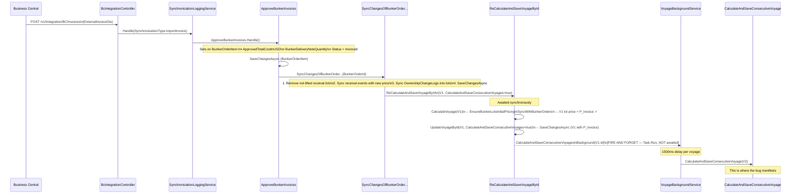
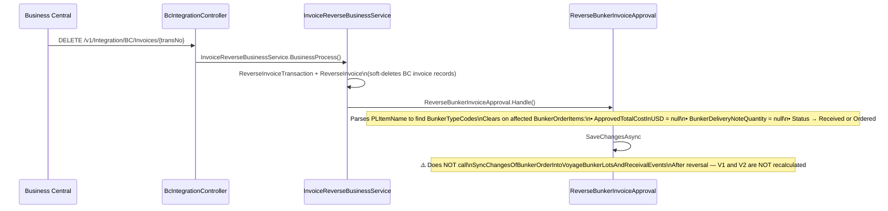

# Bunker Invoice Price Propagation — Investigation

> **Bug Reference:** Consecutive voyage does not reflect the updated Price Per Ton after invoice approval on the previous voyage's bunker order.
>
> **Repro voyages (QAQC):**
>
> - Voyage 1: `17c7ebef-3604-4b97-be59-120b1cc412a5` (1391001) — contains BNK-1394001-0001
> - Voyage 2: `10397a6e-51f1-44a1-bfa4-aa9a3893d10e` (1391002) — consecutive to Voyage 1

---

## Table of Contents

1. [System Overview](#1-system-overview)
2. [Key Entities & Fields](#2-key-entities--fields)
3. [Full Approval Workflow](#3-full-approval-workflow)
4. [Consecutive Voyage Bunker Lot Carry-Over](#4-consecutive-voyage-bunker-lot-carry-over)
5. [Price Computation After Invoice Approval](#5-price-computation-after-invoice-approval)
6. [Root Cause Analysis](#6-root-cause-analysis)
7. [Guard Conditions That Can Block Recalculation](#7-guard-conditions-that-can-block-recalculation)
8. [Fix Recommendations](#8-fix-recommendations)
9. [Quick Reference: File Map](#9-quick-reference-file-map)

---

## 1. System Overview

### Actors in the Bunker Invoice Approval Chain

| Actor                                                           | Role                                                                       |
| --------------------------------------------------------------- | -------------------------------------------------------------------------- |
| Business Central (BC)                                           | External finance system — sends invoice import/reverse via REST API        |
| `BcIntegrationController`                                       | API entry point — routes BC payloads to the sync queue                     |
| `SynchronizationLoggingService`                                 | Persists sync job, dispatches to the correct business service              |
| `InvoiceReverseBusinessService`                                 | Processes reverse-invoice BC payloads                                      |
| `ApproveBunkerInvoices`                                         | Sets invoice-approved values on `BunkerOrderItem`                          |
| `ReverseBunkerInvoiceApproval`                                  | Clears invoice-approved values from `BunkerOrderItem`                      |
| `SyncChangesOfBunkerOrderIntoVoyageBunkerLotsAndReceivalEvents` | Propagates bunker order changes into voyage entities, triggers recalc      |
| `ReCalculateAndSaveVoyageById`                                  | Loads, recalculates, and saves a single voyage                             |
| `CalculateAndSaveConsecutiveVoyage`                             | Background recalculation of one consecutive voyage                         |
| `VoyageBackgroundService`                                       | Manages fire-and-forget recalculation of all downstream voyages            |
| `EnsureBunkerLotsInitialPricingInSyncWithBunkerOrders`          | During calculation, re-syncs bunker lot price from its source bunker order |

---

## 2. Key Entities & Fields

### `BunkerOrderItemEntity` — Fields Relevant to Pricing

| Field                                       | Storage                  | Set By                       | Notes                                                                              |
| ------------------------------------------- | ------------------------ | ---------------------------- | ---------------------------------------------------------------------------------- |
| `TotalCostPerMetricTonsInUSD`               | DB column                | Bunker order placement       | Base ordered price per MT                                                          |
| `ActuallyReceivedQuantity`                  | DB column                | Receival report              | Physical delivery qty                                                              |
| `ApprovedTotalCostInUSD`                    | DB column                | `ApproveBunkerInvoices`      | Set on approval; cleared on reversal                                               |
| `BunkerDeliveryNoteQuantity`                | DB column                | `ApproveBunkerInvoices`      | BDN invoice quantity                                                               |
| `TotalCostInUSDForCalculation`              | **NotMapped** (computed) | —                            | `ApprovedTotalCostInUSD ?? (received? qty×price : TotalCostInUSD)`                 |
| `FuelQuantityForCalculation`                | **NotMapped** (computed) | —                            | `ActuallyReceivedQty ?? BDNQty ?? RequestedQty`                                    |
| `TotalCostPerMetricTonsInUSDForCalculation` | **NotMapped** (computed) | —                            | **The price used for propagation** — see §5                                        |
| `OwnershipChangeLogs`                       | NotMapped / JSON column  | TCO delivery/redelivery calc | Per-itinerary-item ownership price history — **NEVER updated by invoice approval** |

### `VoyageBunkerLotEntity` — Fields Relevant to Pricing

| Field                         | Storage                   | Notes                                                                       |
| ----------------------------- | ------------------------- | --------------------------------------------------------------------------- |
| `PricePerMetricTonInUsds`     | DB column `decimal(18,5)` | Current lot price used in all calculations                                  |
| `OwnershipChangeLogs`         | JSON column               | Mirrors the bunker order item's ownership transitions for this lot          |
| `BunkerOrderId`               | DB column                 | References the originating bunker order (can be from a **previous** voyage) |
| `BunkerOrderItemId`           | DB column                 | References the specific order item                                          |
| `IsInitial`                   | DB column                 | `true` = lot was on board at voyage commencement                            |
| `IsLifted`                    | DB column                 | `true` = at least one approved vessel report exists for this lot            |
| `EndQuantityInMetricTons`     | DB column                 | Non-zero lots are carried to the next consecutive voyage                    |
| `InitialQuantityInMetricTons` | DB column                 | Starting ROB for this lot in this voyage                                    |

---

## 3. Full Approval Workflow

### 3.1 Invoice Approval (Happy Path)



### 3.2 Invoice Reversal Path



> **Note:** `ReverseBunkerInvoiceApproval` does **not** trigger voyage recalculation. Reversal only resets the `BunkerOrderItem` fields. The voyage's displayed price will remain stale until the next manual recalculation.

---

## 4. Consecutive Voyage Bunker Lot Carry-Over

### 4.1 When Carry-Over Runs

`AutoCorrectConsecutiveBunkerLotsAndCommencePortForCurrentVoyage` (in `CalculateConsecutiveVoyageHelper.cs`) runs inside `CalculateVoyage` with these guards:

| Guard Condition                          | Effect if True                                                          |
| ---------------------------------------- | ----------------------------------------------------------------------- |
| `voyageCrud.IsConsecutiveVoyage != true` | Skip entirely                                                           |
| `FindPreviousVoyageId() == null`         | Skip entirely                                                           |
| `VoyageHasAnyLiftedBunkerLot() == true`  | Skip entirely — voyage has approved vessel reports, do not re-seed lots |

> **`IsLifted`** is set to `true` on a bunker lot when the voyage has at least one approved vessel report touching that lot. Once lifted, consecutive recalculations no longer overwrite the seeded lots.

### 4.2 How Voyages Are Ordered (for "next voyage" lookup)

`FindNextVoyageIds` queries `VoyageNumber` (string comparison) within the same `VesselId`. There is no explicit `PreviousVoyageId` foreign key — order is purely numeric-string comparison:

```csharp
context.Voyages
    .Where(v => v.VesselId == currentVessel &&
                string.Compare(v.VoyageNumber, currentVoyageNumber) > 0)
    .OrderBy(v => v.VoyageNumber)
```

### 4.3 `GenerateStartingLotsFromEndingLots` — Carry-Over Logic

This is the critical method that seeds V2's initial bunker lots from V1's ending lots.

```
Source: V1's VoyageBunkerLots where EndQuantityInMetricTons != 0
```

**Step-by-step for each ending lot from V1:**

```
1. Deep-copy ALL fields via AutoMapper
   → BunkerOrderId, BunkerOrderItemId, BunkerOrderCode, BunkerOrderVoyageId all carried over

2. pricePerTonBringOver = lot.PricePerMetricTonInUsds   (fallback)

3. lastOwnershipChangeLog = lot.OwnershipChangeLogs
                               .OrderByDescending(log => log.IteneraryItemNumber)
                               .FirstOrDefault()

4. IF lastOwnershipChangeLog != null:
       pricePerTonBringOver = lastOwnershipChangeLog.PricePerMetricTonInUsdsAfterLeavingIteneraryItem
                              ?? pricePerTonBringOver          ← OVERWRITES the lot price
       ownedByBringOver     = lastOwnershipChangeLog.OwnedBy  ?? ownedByBringOver
       paidByBringOver      = lastOwnershipChangeLog.PaidBy   ?? paidByBringOver

5. Override new lot fields:
   Id                           = new Guid()
   VoyageId                     = V2.Id
   IsInitial                    = true
   IsLifted                     = false
   InitialQuantityInMetricTons  = V1 ending lot's EndQuantityInMetricTons
   PricePerMetricTonInUsds      = pricePerTonBringOver   ← result of step 2/4
   OwnedBy / PaidBy             = pricePerTonBringOver result
   ConsumptionDetails           = []
   OwnershipChangeLogs          = []   ← CLEARED for new voyage
```

**Key fact:** `BunkerOrderId` and `BunkerOrderItemId` are **not explicitly cleared** — they are silently retained from the AutoMapper deep-copy. V2's initial lot therefore still references V1's bunker order.

### 4.4 What `AutoCorrectIsInitialStatus` Does with the Carried-Over Lot

```
IF bunkerPrice.BunkerOrderId != null:
    IF the order belongs to the CURRENT voyage  → IsInitial = false  (receival)
    ELSE (order is from a PREVIOUS voyage)      → IsInitial = true   (initial)
```

So V2's lot with a reference to V1's bunker order will always correctly be flagged as `IsInitial = true`.

---

## 5. Price Computation After Invoice Approval

### 5.1 `TotalCostPerMetricTonsInUSDForCalculation` Computed Property

This **NotMapped** computed property on `BunkerOrderItemEntity` determines what price is propagated:

```
BEFORE approval (ActuallyReceivedQuantity set, ApprovedTotalCostInUSD null):
  → TotalCostPerMetricTonsInUSD   (the originally ordered price per MT)

AFTER approval (ApprovedTotalCostInUSD set):
  → ApprovedTotalCostInUSD / FuelQuantityForCalculation
    where FuelQuantityForCalculation = ActuallyReceivedQty ?? BDNQty ?? RequestedQty
  = P_invoice  (invoice-approved cost ÷ BDN quantity)
```

### 5.2 How `EnsureBunkerLotsInitialPricingInSyncWithBunkerOrders` Uses It

Called as Step 3 inside `CalculateAllBunkersCostsAndFeesForEstimate` on every voyage/estimate calculation:

```csharp
foreach (var bunkerPrice in estimate.BunkerPrices)
{
    var bunkerOrder     = find by bunkerPrice.BunkerOrderId;     // can be V1's order
    var bunkerOrderItem = find by bunkerPrice.BunkerOrderItemId;

    var currentBunkerPricePerTon = bunkerPrice.PricePerMetricTonInUsds;

    // Price of the last ownership change log on the BunkerOrderItem (NOT the VoyageBunkerLot)
    var lastPriceChangesFromChangeLog = bunkerOrderItem.OwnershipChangeLogs?
        .OrderByDescending(log => log.IteneraryItemNumber)
        .FirstOrDefault()?.PricePerMetricTonInUsdsAfterLeavingIteneraryItem;

    // SKIP if already matches the ownership-log price
    if (lastPriceChangesFromChangeLog == currentBunkerPricePerTon)
        continue;

    // Otherwise update: prefer invoice-computed price
    var lotPricePerTon = bunkerOrderItem.TotalCostPerMetricTonsInUSD;
    if (bunkerOrderItem.TotalCostPerMetricTonsInUSDForCalculation > 0)
        lotPricePerTon = bunkerOrderItem.TotalCostPerMetricTonsInUSDForCalculation;  // P_invoice

    bunkerPrice.PricePerMetricTonInUsds = lotPricePerTon;
}
```

**The skip condition intent:** "If the lot's current price already equals the last ownership-change-log price, it means the price was already correctly propagated via the TCO redelivery workflow — do not overwrite."

---

## 6. Root Cause Analysis

### 6.1 The Bug Scenario (TC/TCO Voyage with `OwnershipChangeLogs`)

The bug only manifests when V1's ending bunker lot has at least one `OwnershipChangeLog` entry. This occurs on TCO/TC voyages that have a delivery or redelivery itinerary item.

Let these be:

- **P_invoice** — the new price after invoice approval
- **P_redelivery** — the price stored in `OwnershipChangeLog.PricePerMetricTonInUsdsAfterLeavingIteneraryItem` (set during TCO redelivery, **never updated by invoice approval**)

Typically `P_redelivery ≈ P_ordered` (the pre-invoice price).

### 6.2 Step-by-Step Bug Trace

```
INITIAL STATE (before approval):
  V1 ending lot: PricePerMetricTonInUsds = P_ordered
                 OwnershipChangeLogs     = [{...PriceAfterLeaving = P_redelivery}]
  V2 initial lot: PricePerMetricTonInUsds = P_redelivery  (from last carry-over)
                  BunkerOrderId           = BO1 (V1's bunker order)
                  OwnershipChangeLogs     = []  (cleared at carry-over time)
  BO1 item:       TotalCostPerMetricTonsInUSD            = P_ordered
                  ApprovedTotalCostInUSD                 = null
                  OwnershipChangeLogs                    = [{...PriceAfterLeaving = P_redelivery}]
```

**Step 1 — `ApproveBunkerInvoices`:**

```
BO1 item:  ApprovedTotalCostInUSD = InvoiceTotalCostInUSD  (→ P_invoice becomes effective)
           BunkerDeliveryNoteQuantity = InvoiceQuantity
           Status = Invoiced
           OwnershipChangeLogs = [{...PriceAfterLeaving = P_redelivery}]  ← UNCHANGED
```

**Step 2 — `SyncChangesOfBunkerOrderIntoVoyageBunkerLotsAndReceivalEvents`:**

```
V1 receival event: PricePerMetricTonInUsds = TotalCostPerMetricTonsInUSDForCalculation = P_invoice ✓
V1/V2 lots sharing BO1 item: OwnershipChangeLogs synced from BO1 item = [{P_redelivery}]
→ SaveChangesAsync
→ ReCalculateAndSaveVoyageById(V1, CalculateAndSaveConsecutiveVoyages=true)  [AWAITED]
```

**Step 3 — V1 recalculation (`EnsureBunkerLotsInitialPricingInSyncWithBunkerOrders` for V1):**

```
BO1 item.OwnershipChangeLogs.last.Price = P_redelivery
V1 lot.PricePerMetricTonInUsds          = P_invoice   (from receival event sync in step 2)

Guard: P_redelivery == P_invoice ?  → FALSE (they differ) → NOT skipped
→ V1 lot price updated to P_invoice ✓
→ V1 saved with P_invoice ✓
```

**Step 4 — Background: `CalculateAndSaveConsecutiveVoyage(V2)`:**

```
GetEndingBunkerLotsFromVoyageId(V1)
  → V1 ending lot: PricePerMetricTonInUsds = P_invoice ✓
                   OwnershipChangeLogs      = [{PriceAfterLeaving = P_redelivery}]  ← STALE

GenerateStartingLotsFromEndingLots:
  pricePerTonBringOver = P_invoice          (from lot.PricePerMetricTonInUsds)
  lastOwnershipChangeLog != null            → TRUE
  pricePerTonBringOver = P_redelivery       ← BUG 1: OVERWRITES correct P_invoice with stale P_redelivery ✗

V2 new initial lot: PricePerMetricTonInUsds = P_redelivery  ✗
                    BunkerOrderId            = BO1
                    OwnershipChangeLogs      = []
```

**Step 5 — V2 recalculation (`EnsureBunkerLotsInitialPricingInSyncWithBunkerOrders` for V2):**

```
BO1 item.OwnershipChangeLogs.last.Price = P_redelivery
V2 lot.PricePerMetricTonInUsds          = P_redelivery   (set by Bug 1 in step 4)

Guard: P_redelivery == P_redelivery ?  → TRUE → SKIP ✗  ← BUG 2: Guard short-circuits the fix
→ V2 lot price remains P_redelivery — P_invoice never reaches V2 ✗
```

### 6.3 Root Cause Summary Table

| #         | Location                                               | File                                                      | Problem                                                                                                                                                                                                                                                                                  |
| --------- | ------------------------------------------------------ | --------------------------------------------------------- | ---------------------------------------------------------------------------------------------------------------------------------------------------------------------------------------------------------------------------------------------------------------------------------------- |
| **Bug 1** | `GenerateStartingLotsFromEndingLots`                   | `CalculateConsecutiveVoyageHelper.cs`                     | When `OwnershipChangeLogs` exist, the ending lot's `PricePerMetricTonInUsds` (which already reflects the invoice-updated price) is **overwritten** by the stale `PricePerMetricTonInUsdsAfterLeavingIteneraryItem` from the ownership log. The log is never updated on invoice approval. |
| **Bug 2** | `EnsureBunkerLotsInitialPricingInSyncWithBunkerOrders` | `EnsureBunkerLotsInitialPricingInSyncWithBunkerOrders.cs` | Skip condition `if (lastPriceChangesFromChangeLog == currentBunkerPricePerTon)` fires for consecutive voyages when Bug 1 has set V2's price to exactly the ownership-log price, preventing the invoice price from being applied. Also fires incorrectly when both are `null`.            |

### 6.4 Why V1 Works But V2 Does Not

```
V1 receival lot:
  Price comes directly from receival event (SyncChangesOfBunkerOrder... step 2)
  → EnsureBunkerLotsInitialPricingInSyncWithBunkerOrders sees P_invoice ≠ P_redelivery → updates → ✓

V2 initial lot (consecutive carry-over):
  Price comes from GenerateStartingLotsFromEndingLots (step 4)
  → Bug 1 sets it to P_redelivery
  → EnsureBunkerLotsInitialPricingInSyncWithBunkerOrders sees P_redelivery == P_redelivery → skips → ✗
```

### 6.5 Additional Edge Case: `null == null`

If a bunker lot has **no `OwnershipChangeLogs`** (non-TCO voyage) AND `PricePerMetricTonInUsds` is `null`:

```
lastPriceChangesFromChangeLog = null
currentBunkerPricePerTon      = null

Guard: null == null → TRUE → SKIP
```

This incorrectly skips updating a lot that has no price yet. The lot would fall back to the default price set in `EnsureLotCodesAndMetaDataExistForEstimateBunkerIntials` (`BunkerTypeConstants.DefaultNormalBunkerPrice`), rather than getting the actual bunker order price.

---

## 7. Guard Conditions That Can Block Recalculation

### 7.1 `CalculateAndSaveConsecutiveVoyage` — Full Guard List

| Guard                | Condition                             | Implication                                                      |
| -------------------- | ------------------------------------- | ---------------------------------------------------------------- |
| Voyage not found     | entity is null                        | Logs warning, returns null                                       |
| Not consecutive      | `IsConsecutiveVoyage != true`         | Returns null — skipped                                           |
| Has approved reports | any `VesselReport.IsApproved == true` | Returns null — V2 is locked, lots are lifted, carry-over skipped |
| No previous voyage   | `FindPreviousVoyageId() == null`      | Returns null — cannot seed initial lots                          |

> Once V2 has **any approved vessel report** (`VesselReport.IsApproved = true`), the carry-over seeding step is permanently bypassed. Invoice approval changes on V1's bunker order will not automatically propagate to V2's lots. A manual workaround (admin recalculation) would be needed.

### 7.2 Fire-and-Forget Background Execution

```
ApproveBunkerInvoices
  └── SyncChangesOfBunkerOrder...
        └── ReCalculateAndSaveVoyageById [AWAITED]
              └── UpdateVoyageById [AWAITED]
                    └── CalculateAndSaveConsecutiveVoyagesInBackground [FIRE-AND-FORGET]
                          └── Task.Run(async () => {
                                foreach (nextVoyageId) {
                                  await Task.Delay(1500);  // throttle
                                  await CalculateAndSaveConsecutiveVoyage(nextVoyageId);
                                }
                              })
```

**Implications:**

- `ApproveBunkerInvoices` returns its DTO **before** V2 (and any further consecutive voyages) finish recalculating
- If the server crashes or the background task fails, V2 will never be updated
- The 1500ms delay means the API response is not correlated with V2's updated state

---

## 8. Fix Recommendations

### Fix 1 — `GenerateStartingLotsFromEndingLots` (Primary Fix)

**File:** `Core/Business/VoyageManagement/Helpers/CalculateConsecutiveVoyageHelper.cs`

**Problem:** The `OwnershipChangeLog` price unconditionally overwrites `lot.PricePerMetricTonInUsds`. After invoice approval, the lot's price field has already been updated to `P_invoice`, but the `OwnershipChangeLog` entry still holds `P_redelivery`.

**Principle:** `OwnershipChangeLogs` record the price **at the time of TC delivery/redelivery**, not the invoice-approved price. The lot's `PricePerMetricTonInUsds` is the authoritative current price — it should always be the carry-over value.

```csharp
// BEFORE (buggy):
var pricePerTonBringOver = bunkerLotPrevious.PricePerMetricTonInUsds;  // fallback
if (lastOwnershipChangeLog != null)
{
    pricePerTonBringOver = lastOwnershipChangeLog.PricePerMetricTonInUsdsAfterLeavingIteneraryItem
                           ?? pricePerTonBringOver;  // ← overwrites with stale value
    ownedByBringOver = lastOwnershipChangeLog.OwenedBy ?? ownedByBringOver;
    paidByBringOver  = lastOwnershipChangeLog.PaidBy   ?? paidByBringOver;
}

// AFTER (fixed):
var pricePerTonBringOver = bunkerLotPrevious.PricePerMetricTonInUsds;  // always use the lot's actual price
if (lastOwnershipChangeLog != null)
{
    // Only carry over OwnedBy / PaidBy from the ownership log, NOT the price
    // The lot.PricePerMetricTonInUsds already reflects the latest invoice-approved price
    ownedByBringOver = lastOwnershipChangeLog.OwenedBy ?? ownedByBringOver;
    paidByBringOver  = lastOwnershipChangeLog.PaidBy   ?? paidByBringOver;
}
```

> **Why is the price in the lot correct?** `EnsureBunkerLotsInitialPricingInSyncWithBunkerOrders` runs on every V1 recalculation and updates `V1.lot.PricePerMetricTonInUsds` to the invoice-approved price. After V1 is saved, `GetEndingBunkerLotsFromVoyageId(V1)` reads these updated values. Therefore, `bunkerLotPrevious.PricePerMetricTonInUsds` is always the correct and most up-to-date price to carry forward.

### Fix 2 — `EnsureBunkerLotsInitialPricingInSyncWithBunkerOrders` (Defensive Fix)

**File:** `Core/Business/VoyageManagement/Estimate/EnsureBunkerLotsInitialPricingInSyncWithBunkerOrders.cs`

**Problem:** `null == null` and `P_redelivery == P_redelivery` both incorrectly trigger the skip, preventing the invoice-approved price from being applied.

```csharp
// BEFORE (buggy):
if (lastPriceChangesFromChangeLog == currentBunkerPricePerTon)
    continue;

// AFTER (fixed):
// Only skip if there IS a change log price AND the current lot price already matches it.
// This correctly identifies "already propagated via TCO redelivery workflow" without
// incorrectly skipping lots that have no change log or where both happen to be equal by coincidence.
if (lastPriceChangesFromChangeLog.HasValue && lastPriceChangesFromChangeLog == currentBunkerPricePerTon)
    continue;
```

> Fix 2 is a defensive measure. With Fix 1 applied, V2's initial lot price will be `P_invoice` (not `P_redelivery`), so the guard `P_redelivery == P_invoice` will be `false` regardless. However, Fix 2 independently closes the `null == null` edge case.

### Impact Assessment

| Fix   | Affects                                               | Risk                                                                        |
| ----- | ----------------------------------------------------- | --------------------------------------------------------------------------- |
| Fix 1 | All consecutive voyages with TCO/TC bunker lots       | Low — price was already correct before ownership change log overwrote it    |
| Fix 2 | All voyages where `OwnershipChangeLogs` is null/empty | Low — makes skip condition explicit, non-breaking for the intended use case |

---

## 9. Quick Reference: File Map

| File                                                               | Path                                                                 | Purpose in this flow                               |
| ------------------------------------------------------------------ | -------------------------------------------------------------------- | -------------------------------------------------- |
| `BcIntegrationController.cs`                                       | `APIs/MasterData/Integration/`                                       | REST entry point for BC invoice sync               |
| `ApproveBunkerInvoices.cs`                                         | `Core/Business/BunkerOrder/`                                         | Sets invoice values on BunkerOrderItem             |
| `ReverseBunkerInvoiceApproval.cs`                                  | `Core/Business/BunkerOrder/`                                         | Clears invoice values on BunkerOrderItem           |
| `InvoiceReverseBusinessService.cs`                                 | `Core/Business/DataSynchronization/BusinessCentral/ImportBCInvoice/` | BC reverse invoice business service                |
| `SyncChangesOfBunkerOrderIntoVoyageBunkerLotsAndReceivalEvents.cs` | `Core/Business/VoyageManagement/SyncBunker/`                         | Propagates BO changes into voyage, triggers recalc |
| `ReCalculateAndSaveVoyageById.cs`                                  | `Core/Business/VoyageManagement/Voyage/`                             | Load-calculate-save a single voyage                |
| `CalculateVoyage.cs`                                               | `Core/Business/VoyageManagement/Voyage/`                             | Full voyage recalculation logic                    |
| `CalculateEstimate.cs`                                             | `Core/Business/VoyageManagement/Estimate/`                           | Full estimate recalculation logic                  |
| **`CalculateConsecutiveVoyageHelper.cs`**                          | `Core/Business/VoyageManagement/Helpers/`                            | **Bug 1** — `GenerateStartingLotsFromEndingLots`   |
| `CalculateAndSaveConsecutiveVoyage.cs`                             | `Core/Business/VoyageManagement/Voyage/`                             | Recalculate one consecutive voyage (with guards)   |
| `VoyageBackgroundService.cs`                                       | `Core/Business/BackgroundServices/`                                  | Fire-and-forget recalc of all next voyages         |
| `CalculateAllBunkersCostsAndFeesForEstimate.cs`                    | `Core/Business/VoyageManagement/Estimate/`                           | Orchestrates bunker cost calculation steps         |
| **`EnsureBunkerLotsInitialPricingInSyncWithBunkerOrders.cs`**      | `Core/Business/VoyageManagement/Estimate/`                           | **Bug 2** — skip condition guard                   |
| `BunkerLotCodeHelper.cs`                                           | `Core/Business/VoyageManagement/BunkerLot/Helpers/`                  | Auto-correct IsInitial, FIFO dates, lot codes      |
| `GeneratePreCalculatedEstimateBunkerEvents.cs`                     | `Core/Business/VoyageManagement/Estimate/`                           | Step 1 of bunker cost calculation pipeline         |

---

_Investigation date: 2026-05-07_  
_Investigator: GitHub Copilot_
