# Payment Gateway System Design

## Executive Summary

### Overview

This comprehensive guide presents a production-ready payment gateway system design based on 15+ years of combined experience in fintech, banking, securities, and telecommunications sectors. The document covers end-to-end implementation of both **QR code-based domestic payments** (NAPAS 247) and **international credit card transactions** (Visa/Mastercard networks).

### Critical Success Factors

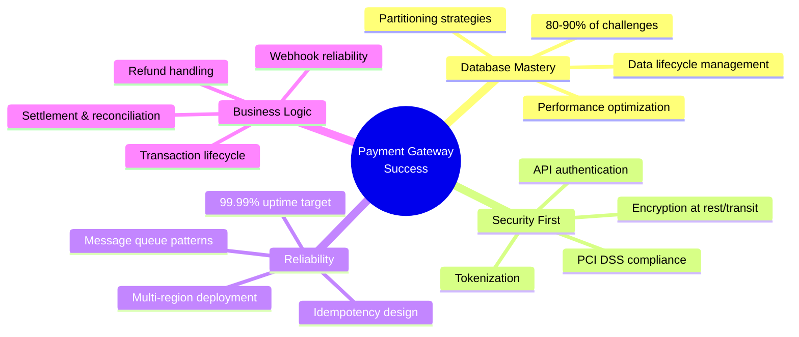

### The 80-90% Database Rule

> **Key Insight**: "In payment systems, 80-90% of challenges are related to database knowledge. This was true 10 years ago, and it's still true today."

**Why Database Expertise Matters:**

- Payment volume grows exponentially with business success
- Poor database design becomes a bottleneck at scale
- Data lifecycle management is critical for performance
- Companies will invest heavily in database optimization expertise

### System Capabilities Comparison

| Feature                    | QR Code Payment           | Credit Card Payment        | Implementation Complexity     |
| -------------------------- | ------------------------- | -------------------------- | ----------------------------- |
| **Setup Time**             | 2-3 months                | 4-6 months                 | QR: Medium, Card: High        |
| **Transaction Fee**        | 0.5-1%                    | 2-3%                       | Depends on negotiation        |
| **Settlement Time**        | Real-time to 1-2 days     | 2-3 business days          | Card requires reconciliation  |
| **Compliance**             | Local banking regulations | PCI DSS Level 1 + Licenses | Card requires certification   |
| **Refund Cost**            | No fee (pre-settlement)   | Always incurs fee          | Critical cost consideration   |
| **Target Market**          | Domestic (Vietnam)        | International              | Different infrastructure      |
| **Integration Complexity** | Low-Medium                | High                       | Card needs tokenization       |
| **Dispute Handling**       | Simpler                   | Complex chargeback process | Card has extensive procedures |

### Core Architecture Principles

#### 1. **Three-Pillar Foundation**

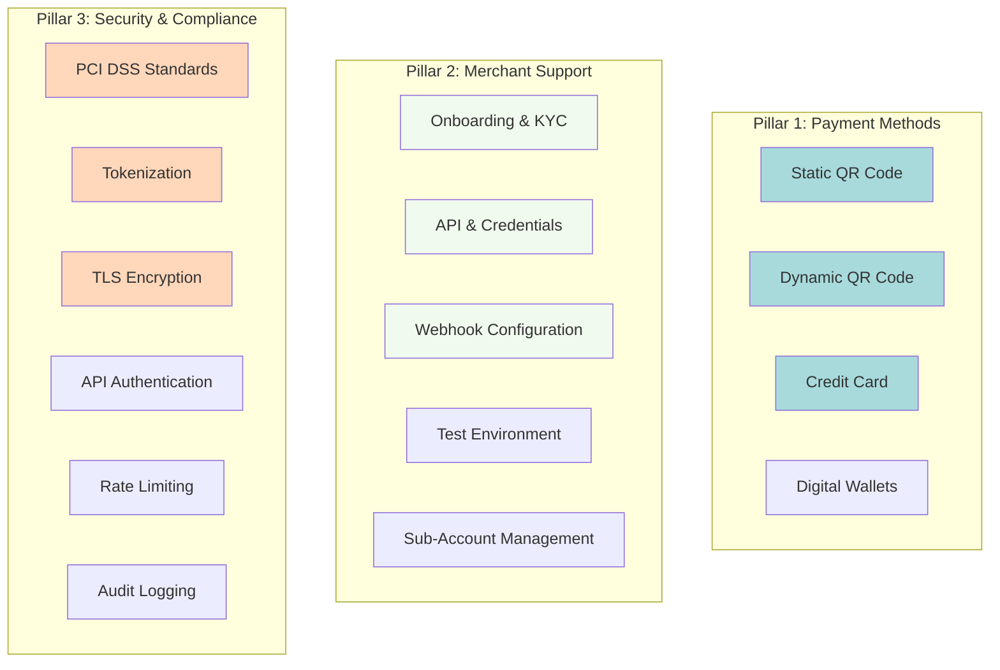

#### 2. **Master-SubAccount Architecture**

**Purpose**: Enable transaction tracking and fund segregation per merchant

| Account Type       | Purpose                  | Example             | Visibility                   |
| ------------------ | ------------------------ | ------------------- | ---------------------------- |
| **Master Account** | Central fund aggregation | `LONGCHAU_MASTER`   | Payment gateway only         |
| **Sub-Account 1**  | Store location 1         | `LONGCHAU_STORE_01` | Individual merchant tracking |
| **Sub-Account 2**  | Store location 2         | `LONGCHAU_STORE_02` | Individual merchant tracking |
| **Sub-Account N**  | Store location N         | `LONGCHAU_STORE_N`  | Individual merchant tracking |

**Key Benefits:**

- ✅ Real-time transaction tracking per location
- ✅ Prevents fund mixing between merchants
- ✅ Enables accurate reconciliation
- ✅ Supports multi-location businesses
- ✅ Facilitates fraud detection

### Payment Flow Comparison

#### QR Code Payment Flow

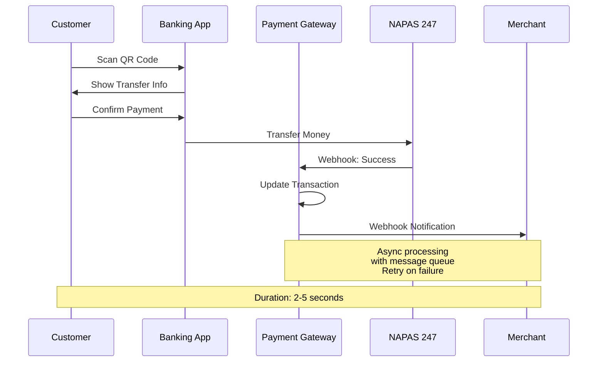

**Key Characteristics:**

- ⚡ **Speed**: Near real-time (2-5 seconds)
- 💰 **Cost**: Low transaction fees (0.5-1%)
- 🔄 **Settlement**: 1-2 days (with pre-check period)
- 🛡️ **Security**: Bank-to-bank transfer via NAPAS
- 📱 **User Experience**: Simple scan-and-pay

#### Credit Card Payment Flow

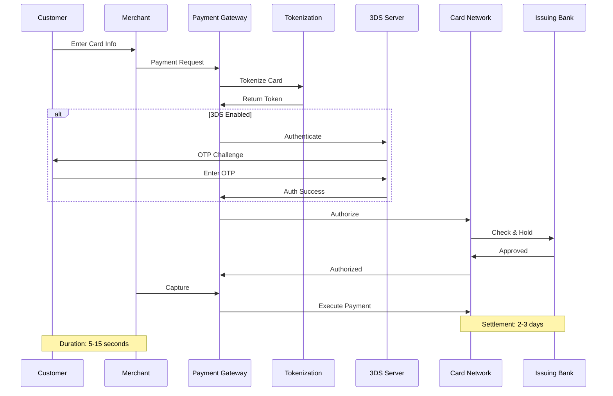

**Key Characteristics:**

- ⏱️ **Speed**: 5-15 seconds (with 3DS)
- 💰 **Cost**: Higher fees (2-3%)
- 🔄 **Settlement**: 2-3 business days
- 🛡️ **Security**: PCI DSS + Tokenization + 3DS
- 🌍 **Coverage**: International transactions

### Transaction Lifecycle Management

#### Transaction States & Transitions

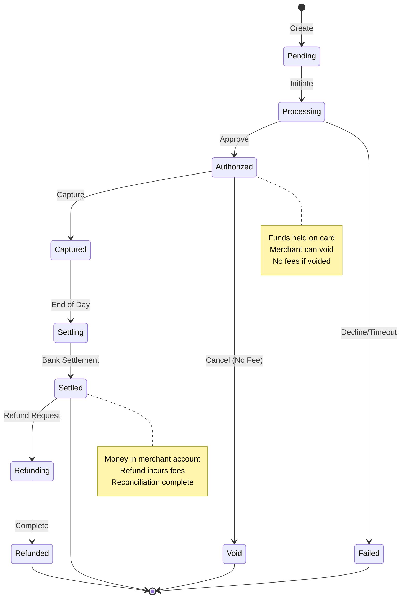

#### Status Management Table

| Status         | Description              | Actions Available | Reversible          | Business Impact   |
| -------------- | ------------------------ | ----------------- | ------------------- | ----------------- |
| **Pending**    | Transaction created      | Cancel            | Yes (free)          | No funds movement |
| **Processing** | Payment initiated        | Wait/Timeout      | Yes (automatic)     | Temporary state   |
| **Authorized** | Funds held               | Capture, Void     | Yes (void - no fee) | Funds reserved    |
| **Captured**   | Payment executed         | Refund            | Yes (fee applies)   | Funds transferred |
| **Settling**   | EOD reconciliation       | Wait              | Via refund only     | In settlement     |
| **Settled**    | Complete                 | Refund            | Yes (fee applies)   | Final state       |
| **Failed**     | Declined/Error           | Retry             | N/A                 | No charge         |
| **Void**       | Cancelled pre-settlement | None              | No                  | No fee charged    |
| **Refunded**   | Money returned           | None              | No                  | Fee not recovered |

### Security Framework

#### PCI DSS Compliance Levels

| Level       | Annual Transactions | Requirements    | Audit Type            | Target Merchants       |
| ----------- | ------------------- | --------------- | --------------------- | ---------------------- |
| **Level 1** | > 6 million         | Full compliance | Annual on-site by QSA | Large payment gateways |
| **Level 2** | 1-6 million         | Self-assessment | Quarterly scans       | Medium processors      |
| **Level 3** | 20K-1 million       | Self-assessment | Quarterly scans       | Small gateways         |
| **Level 4** | < 20,000            | Self-assessment | Annual review         | Micro merchants        |

#### Security Layers Implementation

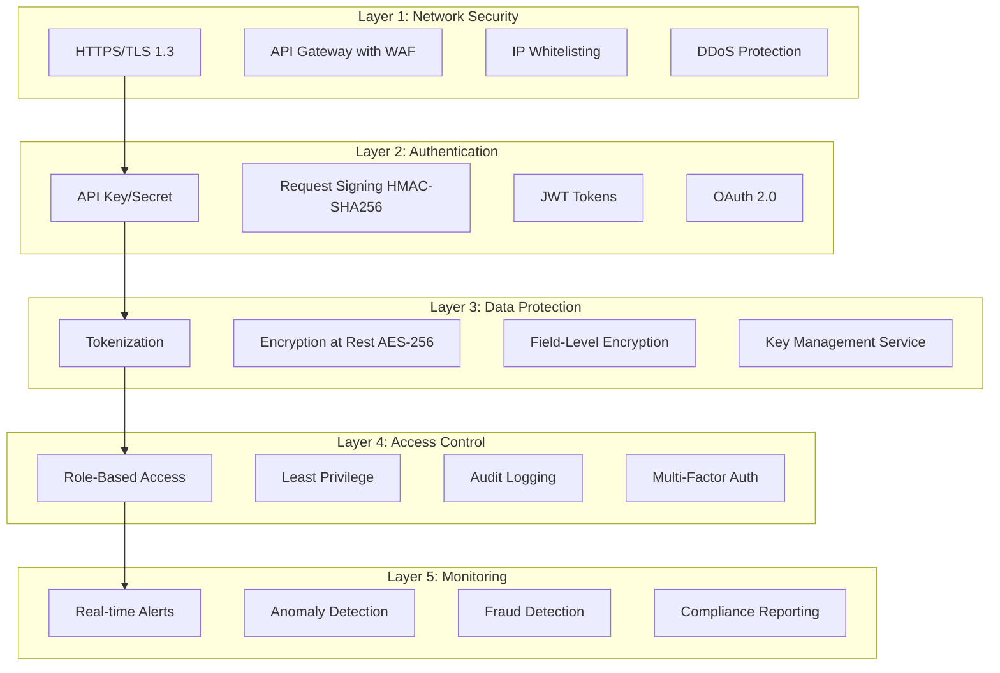

### Database Design Best Practices

#### Data Lifecycle: End of Day (EOD) Pattern

**The Critical Pattern for Payment Systems:**

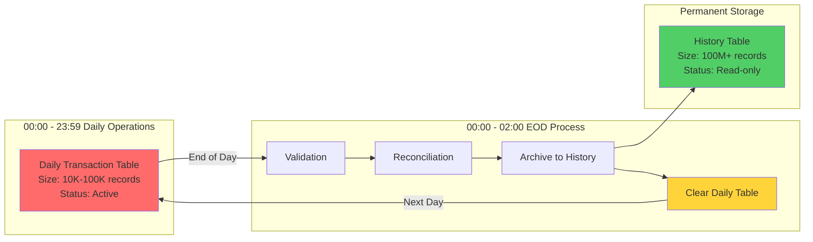

**Performance Impact:**

| Metric                 | Without EOD | With EOD      | Improvement       |
| ---------------------- | ----------- | ------------- | ----------------- |
| **Daily Table Size**   | 10M+ rows   | 10K-100K rows | 99% reduction     |
| **Query Speed**        | 2-5 seconds | 10-50ms       | 40-500x faster    |
| **Index Efficiency**   | Degraded    | Optimal       | Consistently fast |
| **Insert Performance** | Declining   | Stable        | Predictable       |
| **Backup Time**        | Hours       | Minutes       | Much faster       |

#### Partitioning Strategies

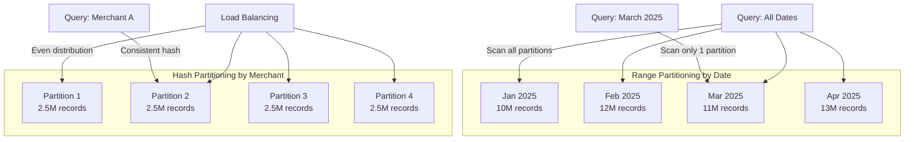

**When to Use Each Strategy:**

| Strategy      | Best For          | Partition Key        | Query Benefit           | Use Case                     |
| ------------- | ----------------- | -------------------- | ----------------------- | ---------------------------- |
| **Range**     | Time-series data  | `business_date`      | Date-range queries      | Historical reports, archival |
| **Hash**      | Even distribution | `merchant_id`        | Single-merchant queries | Load balancing, scalability  |
| **List**      | Known categories  | `status`, `region`   | Category filtering      | Status-based processing      |
| **Composite** | Complex scenarios | `merchant_id + date` | Multiple dimensions     | Enterprise requirements      |

### Settlement & Reconciliation

#### Daily Reconciliation Process

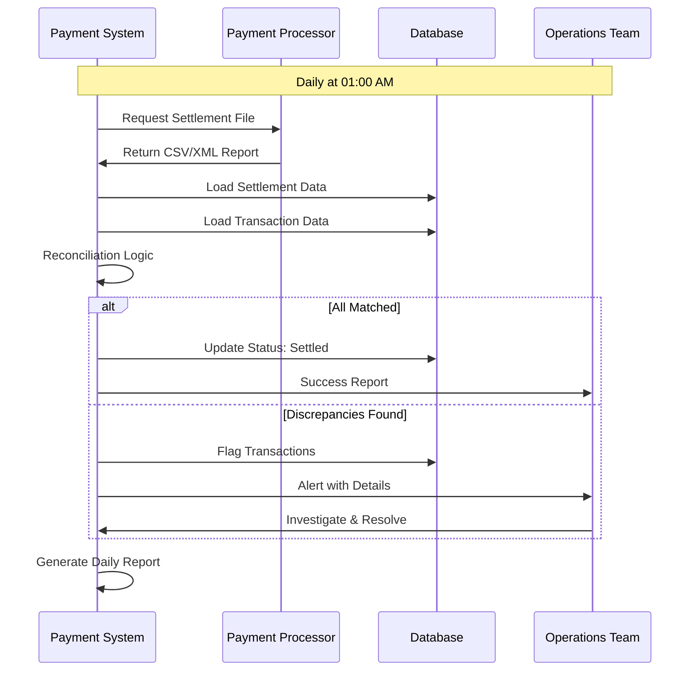

#### Reconciliation Outcomes

| Outcome                   | Frequency | Action Required            | Impact                | Resolution Time |
| ------------------------- | --------- | -------------------------- | --------------------- | --------------- |
| **Perfect Match**         | 99.9%     | None                       | No impact             | N/A             |
| **Missing in Settlement** | 0.05%     | Investigate with processor | Delayed settlement    | 1-2 days        |
| **Missing in Database**   | 0.02%     | Check webhook failures     | Potential fraud       | Immediate       |
| **Amount Mismatch**       | 0.03%     | Review transaction details | Financial discrepancy | 2-4 hours       |
| **Duplicate Entry**       | <0.01%    | Idempotency check          | Potential overcharge  | Immediate       |

### System Architecture Evolution

#### Phase 1: MVP (QR Code Only)

**Timeline**: Months 1-3  
**Features**: Static/Dynamic QR, Basic webhooks, Single database

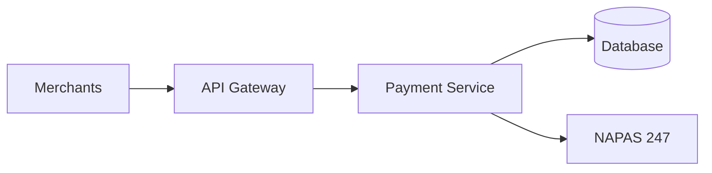

#### Phase 2: Production Ready

**Timeline**: Months 4-6  
**Features**: Message queue, Refunds, Monitoring, HA setup

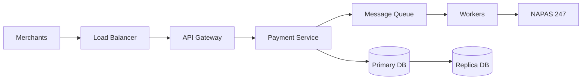

#### Phase 3: Enterprise Scale

**Timeline**: Months 7-12  
**Features**: Credit card, Multi-region, Settlement, PCI DSS

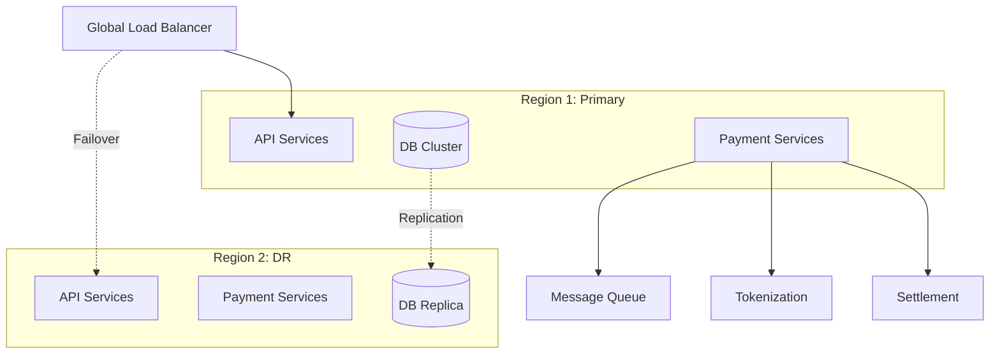

### Key Performance Metrics

#### Golden Signals for Payment Systems

| Metric                  | Target  | Alert Threshold | Critical Threshold | Business Impact     |
| ----------------------- | ------- | --------------- | ------------------ | ------------------- |
| **API Latency (P99)**   | < 500ms | > 1s            | > 2s               | User experience     |
| **Success Rate**        | > 99.9% | < 99.5%         | < 99%              | Revenue loss        |
| **Database Response**   | < 100ms | > 200ms         | > 500ms            | System bottleneck   |
| **Queue Depth**         | < 100   | > 1,000         | > 10,000           | Processing backlog  |
| **Settlement Accuracy** | 100%    | < 100%          | < 99.9%            | Financial loss      |
| **Webhook Delivery**    | > 99.5% | < 99%           | < 98%              | Merchant complaints |
| **Uptime**              | 99.99%  | < 99.95%        | < 99.9%            | SLA violation       |

### Cost Structure Analysis

#### Transaction Fee Breakdown

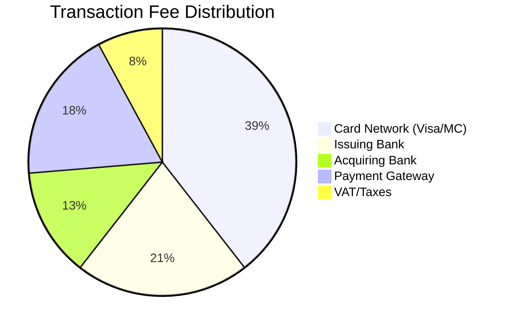

**Typical Fee Structure:**

| Payment Method                  | Customer Fee | Merchant Fee    | Settlement Time | Gateway Revenue |
| ------------------------------- | ------------ | --------------- | --------------- | --------------- |
| **QR Code**                     | Free         | 0.5-1.0%        | 1-2 days        | 0.3-0.5%        |
| **Credit Card (Domestic)**      | Free         | 2.0-2.5%        | 2-3 days        | 0.5-0.8%        |
| **Credit Card (International)** | Free         | 2.5-3.5%        | 3-5 days        | 0.7-1.0%        |
| **Bank Transfer**               | Free         | Flat fee $0.5-1 | 1-2 days        | 100% of fee     |

### Implementation Roadmap

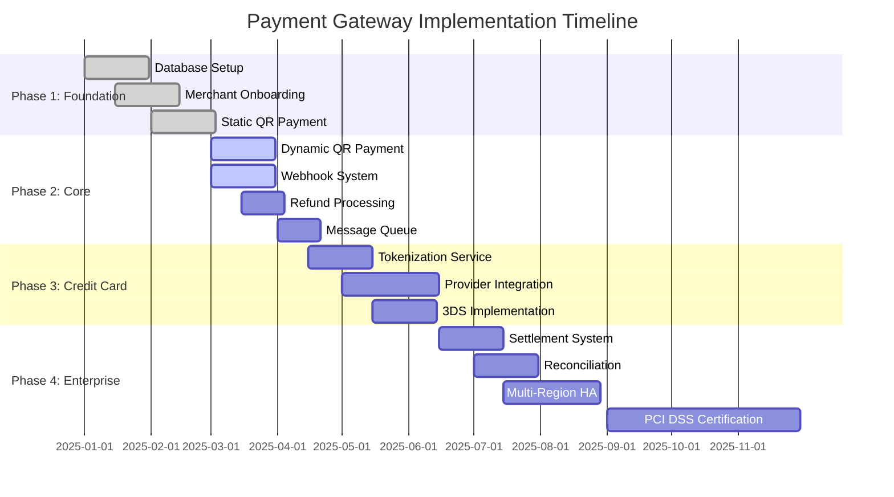

### Critical Success Factors

#### Top 10 Lessons from Production Systems

1. **Database is King**: 80-90% of challenges relate to database design and optimization
2. **Idempotency is Non-Negotiable**: Prevent duplicate payments at all costs
3. **Message Queue Everything**: Decouple services for reliability
4. **Monitor Relentlessly**: Know about issues before customers do
5. **Security by Design**: Retrofit is exponentially harder
6. **Data Lifecycle Management**: EOD process is critical for performance
7. **Webhook Reliability**: Retry with exponential backoff
8. **Reconciliation Daily**: Catch discrepancies early
9. **Multi-Region from Day 1**: Disasters happen (floods, AWS outages)
10. **Document Everything**: Compliance audits will thank you

### Risk Mitigation Matrix

| Risk                     | Probability | Impact       | Mitigation Strategy                 | Cost      |
| ------------------------ | ----------- | ------------ | ----------------------------------- | --------- |
| **Database Bottleneck**  | High        | Critical     | EOD + Partitioning + Replication    | Medium    |
| **Payment Fraud**        | Medium      | High         | Real-time monitoring + ML models    | High      |
| **System Outage**        | Medium      | Critical     | Multi-region HA + Load balancing    | High      |
| **Data Breach**          | Low         | Catastrophic | PCI DSS + Tokenization + Encryption | Very High |
| **Webhook Failures**     | High        | Medium       | Message queue + Retry logic         | Low       |
| **Settlement Errors**    | Low         | High         | Daily reconciliation + Audit logs   | Medium    |
| **Compliance Violation** | Medium      | High         | Regular audits + Automated checks   | Medium    |

---

## Table of Contents

1. [Introduction](#introduction)
2. [Overview of Payment Systems](#overview-of-payment-systems)
3. [Core Requirements](#core-requirements)
4. [QR Code Payment Flow](#qr-code-payment-flow)
5. [Credit Card Payment Integration](#credit-card-payment-integration)
6. [System Architecture](#system-architecture)
7. [Security Considerations](#security-considerations)
8. [Database Design and Performance](#database-design-and-performance)

## Introduction

This document provides a comprehensive guide to designing a payment gateway system, covering both QR code-based domestic payments and international credit card transactions. The content is based on real-world experience from building fintech systems in banking, securities, and telecommunications sectors.

### Key Contributors

- **Huy Tran Quoc**: Database specialist with extensive experience across financial systems
- **Trung**: Backend Technical Lead with 15 years of experience
- **Dinh**: Backend Developer specializing in Node.js and Cloud (e-commerce and logistics)

## Overview of Payment Systems

### Payment System Components

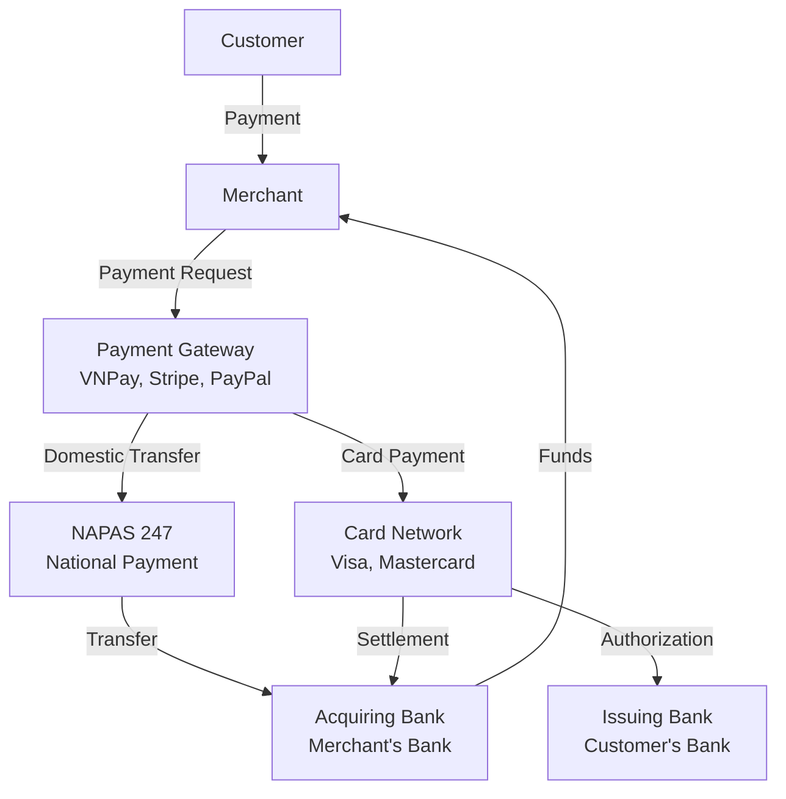

### Payment Methods Comparison

| Payment Method    | Example           | Processing Time     | Use Case                         | Complexity |
| ----------------- | ----------------- | ------------------- | -------------------------------- | ---------- |
| QR Code (Static)  | Fixed QR at store | Real-time           | Small businesses, street vendors | Low        |
| QR Code (Dynamic) | Order-specific QR | Real-time           | E-commerce, POS systems          | Medium     |
| Credit Card       | Visa, Mastercard  | 2-3 days settlement | International transactions       | High       |
| Bank Transfer     | Direct transfer   | 1-2 business days   | Large transactions               | Medium     |
| E-Wallet          | VNPay, MoMo       | Real-time           | Mobile payments                  | Medium     |

## Core Requirements

### Three Main Pillars of Payment Gateway

#### 1. Payment Method Provision

**QR Code Types:**

- **Static QR Code**: Fixed code for general payments
- **Dynamic QR Code**: Generated per transaction with order details

**QR Code Standard Format**: Key-value chain structure that any banking app can scan and process.

#### 2. Merchant Support

Essential features for merchant onboarding:

| Feature                | Description                    | Purpose                 |
| ---------------------- | ------------------------------ | ----------------------- |
| Credentials Management | API keys, secret keys          | Authentication          |
| Webhook Configuration  | Callback URLs                  | Real-time notifications |
| Test Environment       | Sandbox/staging                | Integration testing     |
| Transaction APIs       | Create, check status, complete | Core operations         |
| Account Management     | Sub-accounts, master accounts  | Fund tracking           |

#### 3. Security Implementation

**Core Security Layers:**

- **Authentication**: API key validation
- **Encryption**: TLS for data in transit
- **Data Protection**: Sensitive data encryption at rest
- **Rate Limiting**: DDoS protection
- **Tokenization**: Card data protection

#### 4. Payment Processing

**Transaction Lifecycle Management:**

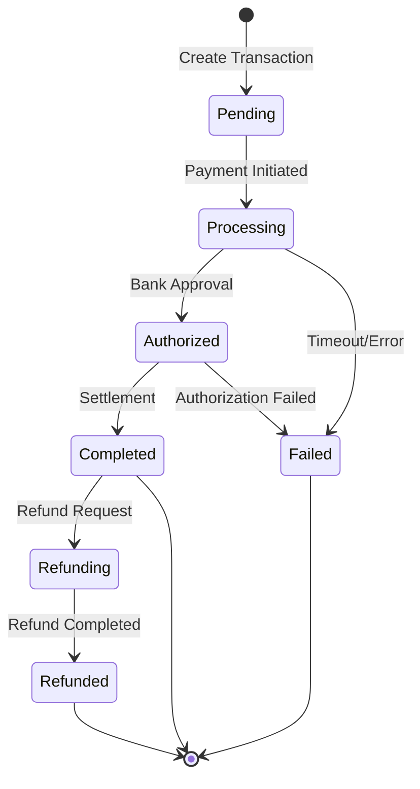

**Handling Edge Cases:**

- Timeout scenarios
- Unauthorized transactions
- Retry logic
- Double booking prevention
- Reconciliation

## QR Code Payment Flow

### Merchant Integration Process

#### Step 1: Merchant Registration

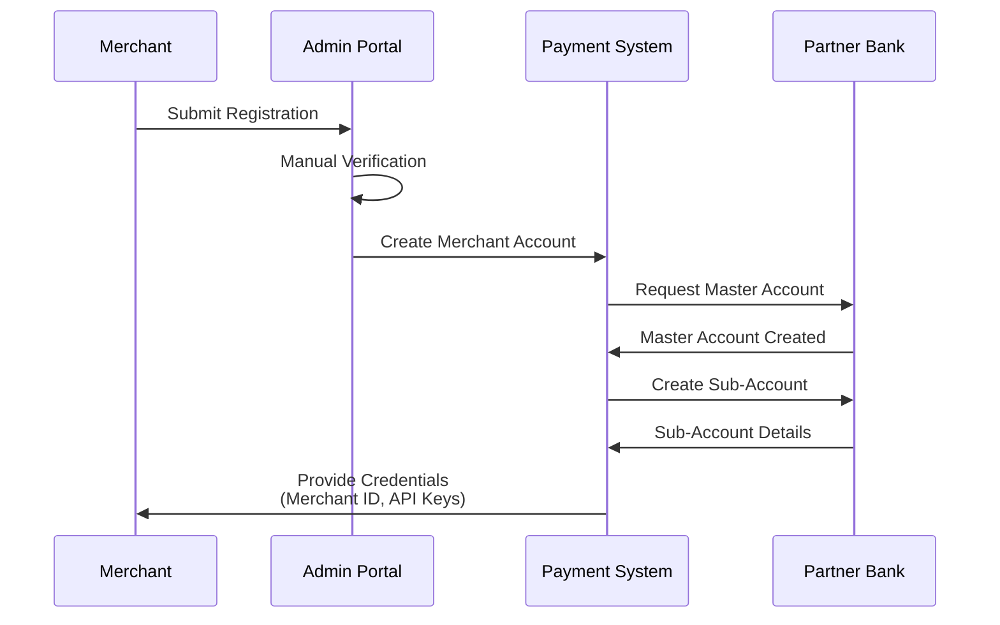

**Merchant Configuration:**

```json
{
  "merchant_id": "MERCH_12345",
  "api_key": "pk_live_xxx",
  "secret_key": "sk_live_xxx",
  "webhook_url": "https://merchant.com/webhook",
  "settlement_account": {
    "bank": "BIDV",
    "account_number": "1234567890",
    "account_name": "Long Chau Pharmacy Chain"
  },
  "ip_whitelist": ["103.1.2.3", "103.1.2.4"]
}
```

#### Step 2: Master and Sub-Account Architecture

**Why Sub-Accounts?**

- Track transactions per merchant
- Prevent fund mixing
- Enable transaction monitoring
- Facilitate reconciliation

**Example: Long Chau Pharmacy Chain**

```
Master Account: LONG_CHAU_MASTER
├── Sub-Account 1: LONG_CHAU_STORE_01 (District 1)
├── Sub-Account 2: LONG_CHAU_STORE_02 (District 3)
└── Sub-Account 3: LONG_CHAU_STORE_03 (District 5)
```

### QR Code Generation

#### Static QR Code

**Use Case**: Display at store counter for general payments

**QR Code Structure (Key-Value Format):**

```
00: Payload Format Indicator = "01"
01: Point of Initiation = "12" (dynamic) or "11" (static)
38: Merchant Account Info
  00: GUID = "A000000727"
  01: Beneficiary = "970436"
  02: Account Number = "1234567890"
52: Merchant Category Code = "5812" (Restaurants)
53: Currency = "704" (VND)
58: Country Code = "VN"
63: CRC Checksum
```

**Generation Methods:**

| Method          | Pros                       | Cons                  | Best For             |
| --------------- | -------------------------- | --------------------- | -------------------- |
| Library         | Full control, custom logic | More development work | Custom requirements  |
| API (vietqr.vn) | Easy, auto-checksum, logos | External dependency   | Quick implementation |
| NAPAS Open API  | Official standard          | Setup complexity      | Enterprise solutions |

#### Dynamic QR Code

**Use Case**: Order-specific payments at checkout

**Flow:**

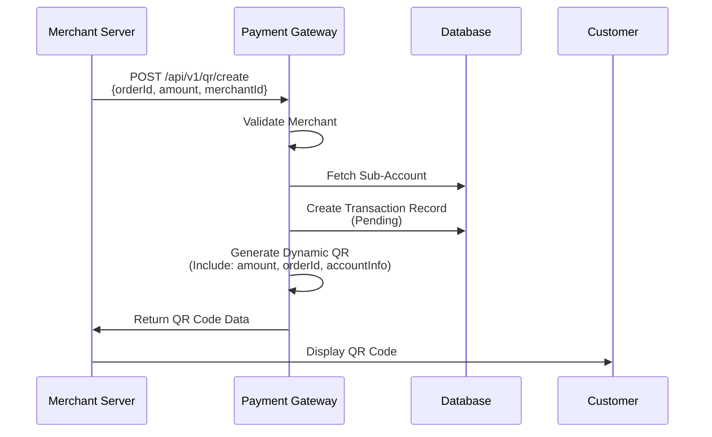

**Dynamic QR Request:**

```json
{
  "merchant_id": "MERCH_12345",
  "order_id": "ORDER_98765",
  "amount": 150000,
  "currency": "VND",
  "description": "Payment for Order #98765",
  "expire_in": 300
}
```

**API Security:**

- HTTPS/TLS encryption
- API key authentication
- Request signing (HMAC-SHA256)
- IP whitelisting

### Payment Transaction Flow

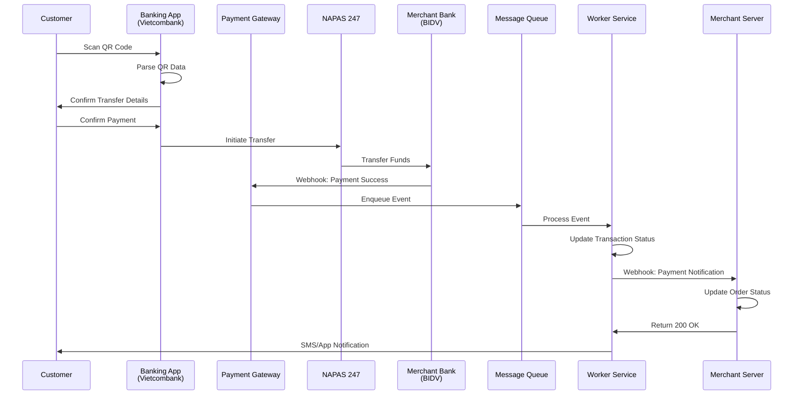

### Payment Processing with Message Queue

**Why Use Message Queue?**

| Challenge         | Solution with Queue     |
| ----------------- | ----------------------- |
| Network failures  | Automatic retry         |
| High throughput   | Asynchronous processing |
| Webhook failures  | Guaranteed delivery     |
| System decoupling | Independent scaling     |
| Idempotency       | Event deduplication     |

**Event Structure:**

```json
{
  "event_id": "evt_abc123",
  "event_type": "payment.success",
  "timestamp": "2025-10-25T10:30:00Z",
  "idempotency_key": "ORDER_98765_evt_abc123",
  "data": {
    "transaction_id": "txn_xyz789",
    "order_id": "ORDER_98765",
    "amount": 150000,
    "currency": "VND",
    "sender_account": "9876543210",
    "sender_bank": "970436",
    "receiver_account": "1234567890",
    "receiver_bank": "970418",
    "transfer_content": "ORDER_98765 Payment"
  },
  "signature": "sha256_signature_here"
}
```

**Webhook to Merchant:**

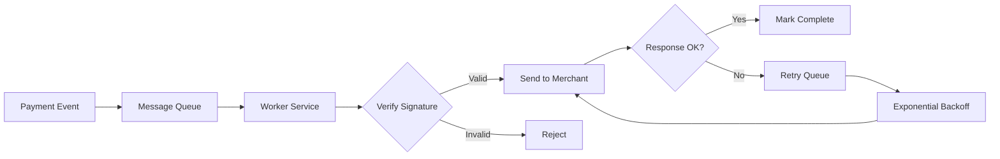

**Signature Verification:**

```javascript
// Generate signature (Payment Gateway side)
const payload = JSON.stringify(webhookData);
const signature = crypto
  .createHmac("sha256", merchant.secretKey)
  .update(payload)
  .digest("hex");

// Verify signature (Merchant side)
const receivedSignature = request.headers["x-signature"];
const calculatedSignature = crypto
  .createHmac("sha256", secretKey)
  .update(request.body)
  .digest("hex");

if (receivedSignature !== calculatedSignature) {
  throw new Error("Invalid signature");
}
```

**Idempotency Handling:**

```javascript
// Merchant webhook handler
app.post("/webhook", async (req, res) => {
  const idempotencyKey = req.body.idempotency_key;

  // Check if already processed
  const processed = await db.checkIdempotencyKey(idempotencyKey);
  if (processed) {
    return res.status(200).json({ status: "already_processed" });
  }

  // Process the event
  await processPayment(req.body);

  // Store idempotency key
  await db.storeIdempotencyKey(idempotencyKey);

  res.status(200).json({ status: "success" });
});
```

### Refund Process

**Refund Scenarios:**

1. Merchant-initiated refund (wrong order, customer complaint)
2. Duplicate payment detection
3. Transaction reversal (before settlement)

```mermaid
sequenceDiagram
    participant M as Merchant
    participant PG as Payment Gateway
    participant DB as Database
    participant Queue as Refund Queue
    participant Worker as Refund Worker
    participant Bank as Bank System
    participant C as Customer

    M->>PG: POST /api/v1/refund
    PG->>DB: Create Refund Record<br/>(Status: Pending)
    PG->>Queue: Enqueue Refund Event
    PG->>M: Return Refund ID

    Queue->>Worker: Process Refund
    Worker->>DB: Get Original Transaction
    Worker->>Bank: Initiate Refund Transfer
    Bank->>Bank: Process Refund
    Bank->>Worker: Refund Success
    Worker->>DB: Update Status: Completed
    Worker->>C: Notification
    Worker->>M: Webhook: Refund Complete
```

**Refund Request:**

```json
{
  "transaction_id": "txn_xyz789",
  "refund_amount": 80000,
  "reason": "partial_refund",
  "description": "Customer returned 1 item",
  "idempotency_key": "refund_ORDER_98765_001"
}
```

**Refund Types:**

| Type             | Amount             | Use Case           | System Lookup                 |
| ---------------- | ------------------ | ------------------ | ----------------------------- |
| Full Refund      | 100% of original   | Order cancellation | Use original transaction data |
| Partial Refund   | < 100% of original | Item return        | Calculate remaining balance   |
| Multiple Refunds | Sum ≤ 100%         | Multiple items     | Track total refunded          |

## Credit Card Payment Integration

### Payment Card Ecosystem

```mermaid
graph TB
    subgraph "Customer Side"
        C[Cardholder]
        IB[Issuing Bank<br/>Card Provider]
    end

    subgraph "Payment Gateway"
        PG[Payment Gateway]
        Token[Tokenization Service]
        KMS[Key Management Service]
    end

    subgraph "Card Networks"
        CN[Card Network<br/>Visa/Mastercard]
    end

    subgraph "Merchant Side"
        M[Merchant]
        AB[Acquiring Bank<br/>Merchant Bank]
    end

    C -->|Card Info| PG
    PG -->|Tokenized| Token
    Token -->|Encrypted| KMS
    PG -->|Authorization| CN
    CN -->|Verify| IB
    IB -->|Approve/Decline| CN
    CN -->|Response| PG
    CN -->|Settlement| AB
    AB -->|Funds| M
```

### Credit Card Transaction Lifecycle

#### Four Main Steps

```mermaid
stateDiagram-v2
    [*] --> Authorize: Card Authorization
    Authorize --> Capture: Capture Payment
    Capture --> Settlement: Bank Settlement
    Settlement --> [*]: Complete

    Authorize --> Void: Cancel (No Fee)
    Void --> [*]

    Settlement --> Refund: Return Funds (Fee Applied)
    Refund --> [*]

    note right of Authorize
        Hold funds on card
        Verify card validity
        Check available balance
    end note

    note right of Capture
        Execute payment
        Transfer funds
    end note

    note right of Settlement
        Final reconciliation
        Money moved to merchant
        2-3 business days
    end note
```

**Transaction Steps Detail:**

| Step           | Duration          | Description             | Reversible   | Fee on Reversal |
| -------------- | ----------------- | ----------------------- | ------------ | --------------- |
| **Authorize**  | Instant           | Hold funds, verify card | Yes (Void)   | No              |
| **Capture**    | Minutes-Hours     | Charge the card         | Yes (Refund) | Yes             |
| **Settlement** | 2-3 days          | Final fund transfer     | Yes (Refund) | Yes             |
| **Void**       | Before settlement | Cancel authorization    | -            | No              |
| **Refund**     | 3-5 days          | Return funds            | -            | Yes             |

### Credit Card Payment Flow with 3DS

```mermaid
sequenceDiagram
    participant C as Customer
    participant M as Merchant Site
    participant PG as Payment Gateway
    participant Token as Token Service
    participant 3DS as 3DS Server
    participant IB as Issuing Bank
    participant CN as Card Network

    C->>M: Enter Card Details
    M->>PG: Payment Request (via iFrame)
    PG->>Token: Tokenize Card Data
    Token->>Token: Encrypt with KMS
    Token->>PG: Return Token

    alt 3DS Enabled
        PG->>3DS: Initiate 3DS Flow
        3DS->>IB: Request Authentication
        IB->>C: Show OTP Form (iFrame)
        C->>IB: Enter OTP
        IB->>3DS: Authentication Result
        3DS->>PG: 3DS Complete
    end

    PG->>CN: Authorization Request
    CN->>IB: Check Balance & Hold
    IB->>CN: Authorization Response
    CN->>PG: Authorized
    PG->>M: Payment Authorized

    M->>PG: Capture Payment
    PG->>CN: Capture Request
    CN->>PG: Capture Confirmed

    Note over CN,IB: Settlement (2-3 days)
    CN->>IB: Settle Funds
    IB->>CN: Settlement Complete
```

### Integration Strategy: Using Payment Provider

**Why Use Third-Party Provider (Short-term)?**

| Reason                | Benefit                             |
| --------------------- | ----------------------------------- |
| PCI DSS Compliance    | Avoid complex certification process |
| Faster Time-to-Market | No need for government licenses     |
| Lower Initial Cost    | No infrastructure investment        |
| Reduced Liability     | Provider handles security           |

**Limitation**: Higher transaction fees (can't negotiate directly with card networks)

**Long-term Strategy**: Become direct acquirer after obtaining:

- Government license for payment processing
- PCI DSS Level 1 certification
- Direct agreements with Visa/Mastercard

### System Design for Credit Card

**Core Components:**

```mermaid
graph TB
    subgraph "Client Layer"
        Web[Web/Mobile App]
        iFrame[Card Input iFrame]
    end

    subgraph "Gateway Layer"
        API[API Gateway]
        Auth[Auth Service]
        RL[Rate Limiter]
    end

    subgraph "Processing Layer"
        PP[Payment Processor]
        TS[Tokenization Service]
        3DS[3DS Handler]
        Config[Merchant Config]
    end

    subgraph "External"
        Provider[Payment Provider<br/>Stripe/PayPal]
        CardNet[Card Networks]
    end

    subgraph "Data Layer"
        DB[(Transaction DB)]
        TokenDB[(Token Vault)]
        Cache[(Redis Cache)]
        MQ[Message Queue]
    end

    subgraph "Background"
        Settlement[Settlement Service]
        Recon[Reconciliation]
        Monitor[Monitoring/Audit]
    end

    Web --> iFrame
    iFrame --> API
    API --> Auth
    Auth --> RL
    RL --> PP
    PP --> TS
    TS --> TokenDB
    PP --> 3DS
    PP --> Config
    PP --> Provider
    Provider --> CardNet
    PP --> DB
    PP --> MQ
    MQ --> Settlement
    Settlement --> Recon
    PP --> Monitor
```

**Component Responsibilities:**

| Component            | Responsibility            | Technology Examples      |
| -------------------- | ------------------------- | ------------------------ |
| Payment Processor    | Core transaction logic    | Node.js, Java, Go        |
| Tokenization Service | Card data encryption      | AWS KMS, HashiCorp Vault |
| 3DS Handler          | Authentication flow       | External 3DS providers   |
| Merchant Config      | Enable/disable features   | Database, Redis cache    |
| Message Queue        | Async processing          | RabbitMQ, AWS SQS, Kafka |
| Settlement Service   | Daily fund reconciliation | Scheduled jobs           |
| Monitoring           | Audit logs, alerts        | ELK Stack, Datadog       |

## Security Considerations

### PCI DSS Compliance

**Payment Card Industry Data Security Standard (PCI DSS)**

Six main requirement groups:

```mermaid
mindmap
  root((PCI DSS))
    Build Secure Network
      Install firewalls
      Change default passwords
      Secure configurations
    Protect Cardholder Data
      Encrypt stored data
      Encrypt transmission
      Tokenization
    Maintain Vulnerability Program
      Use antivirus
      Secure systems
      Regular updates
    Implement Access Control
      Restrict data access
      Assign unique IDs
      Physical access control
    Monitor and Test Networks
      Track access logs
      Regular testing
      Security monitoring
    Information Security Policy
      Security policy
      Risk assessment
      Incident response
```

**PCI DSS Levels:**

| Level   | Transaction Volume/Year | Requirements                             |
| ------- | ----------------------- | ---------------------------------------- |
| Level 1 | > 6 million             | Annual on-site audit by QSA              |
| Level 2 | 1-6 million             | Annual self-assessment + quarterly scans |
| Level 3 | 20,000 - 1 million      | Annual self-assessment + quarterly scans |
| Level 4 | < 20,000                | Annual self-assessment                   |

### Tokenization

**What is Tokenization?**

Replacing sensitive card data (PAN - Primary Account Number) with a non-sensitive token.

```mermaid
graph LR
    A[Card Number<br/>4532 1234 5678 9010] --> B[Tokenization]
    B --> C[Token<br/>tok_abc123xyz789]
    C --> D[Store in DB]

    E[Payment Request] --> F[Retrieve Token]
    F --> G[Detokenization]
    G --> H[Original Card<br/>4532 1234 5678 9010]
    H --> I[Send to Processor]

    style A fill:#ff6b6b
    style C fill:#51cf66
    style H fill:#ff6b6b
```

**Tokenization Flow with AWS KMS:**

```mermaid
sequenceDiagram
    participant M as Merchant
    participant PG as Payment Gateway
    participant KMS as AWS KMS
    participant DB as Token Database
    participant Proc as Payment Processor

    rect rgb(200, 150, 255)
        Note over M,DB: Tokenization (Encryption)
        M->>PG: Card Data<br/>4532-1234-5678-9010
        PG->>KMS: Request Data Key
        KMS->>PG: Return Data Key<br/>(Encrypted & Plain)
        PG->>PG: Encrypt Card with Data Key
        PG->>DB: Store Encrypted Data<br/>+ Encrypted Data Key
        PG->>M: Return Token<br/>tok_abc123
    end

    rect rgb(150, 200, 255)
        Note over M,Proc: Detokenization (Decryption)
        M->>PG: Payment with Token
        PG->>DB: Retrieve Encrypted Data
        DB->>PG: Encrypted Card + Key
        PG->>KMS: Decrypt Data Key
        KMS->>PG: Plain Data Key
        PG->>PG: Decrypt Card Data
        PG->>Proc: Process Payment<br/>with Real Card
    end
```

**Token Lifecycle:**

| Phase      | Action                  | Security Measure                                 |
| ---------- | ----------------------- | ------------------------------------------------ |
| Creation   | Generate unique token   | UUID v4, cryptographically random                |
| Storage    | Store mapping           | Encrypted database, separate from transaction DB |
| Usage      | Retrieve for payment    | Access control, audit logging                    |
| Expiration | Time-based or use-based | Auto-delete after N days/uses                    |
| Rotation   | Periodic key rotation   | Update encryption keys quarterly                 |

### Database-Level Security

**Encryption at Rest:**

```mermaid
graph TB
    subgraph "Application Layer"
        App[Application]
    end

    subgraph "Database Layer"
        DB[Database Engine]
        Key[Master Key]
    end

    subgraph "Storage Layer"
        File1[Encrypted File 1]
        File2[Encrypted File 2]
        File3[Encrypted File 3]
    end

    App -->|Query| DB
    DB -->|Read/Write| Key
    Key -->|Encrypt/Decrypt| File1
    Key -->|Encrypt/Decrypt| File2
    Key -->|Encrypt/Decrypt| File3

    style File1 fill:#ffd43b
    style File2 fill:#ffd43b
    style File3 fill:#ffd43b
```

**Database Encryption Strategies:**

| Strategy                              | Scope             | Pros                              | Cons                       | Use Case               |
| ------------------------------------- | ----------------- | --------------------------------- | -------------------------- | ---------------------- |
| **TDE** (Transparent Data Encryption) | Entire database   | Easy to implement, no app changes | Can't query encrypted data | Compliance requirement |
| **Column-Level**                      | Specific columns  | Granular control, queryable       | Application logic needed   | Sensitive fields only  |
| **Field-Level**                       | Application layer | Maximum flexibility               | Complex implementation     | Custom requirements    |

**Data Masking Example:**

```sql
-- Original Data
SELECT phone, card_number FROM users WHERE id = 123;
-- Result: 0901234567, 4532123456789010

-- Masked for Employees
SELECT
  CONCAT('***', SUBSTR(phone, -4)) as phone,
  CONCAT('****-****-****-', SUBSTR(card_number, -4)) as card_number
FROM users WHERE id = 123;
-- Result: ***4567, ****-****-****-9010
```

### API Security

**Security Layers:**

```mermaid
graph LR
    A[Client Request] --> B[HTTPS/TLS]
    B --> C[API Key Auth]
    C --> D[Request Signing]
    D --> E[Rate Limiting]
    E --> F[IP Whitelist]
    F --> G[Payment Gateway]

    style B fill:#ff6b6b
    style C fill:#ff8787
    style D fill:#ffa94d
    style E fill:#ffd43b
    style F fill:#8ce99a
```

**Request Signing Example:**

```javascript
// Client side (Merchant)
const crypto = require("crypto");

function signRequest(payload, secretKey) {
  const timestamp = Date.now();
  const message = `${timestamp}.${JSON.stringify(payload)}`;
  const signature = crypto
    .createHmac("sha256", secretKey)
    .update(message)
    .digest("hex");

  return {
    payload,
    timestamp,
    signature,
  };
}

// Server side (Payment Gateway)
function verifySignature(request, secretKey) {
  const { payload, timestamp, signature } = request;

  // Check timestamp (prevent replay attacks)
  if (Date.now() - timestamp > 300000) {
    // 5 minutes
    throw new Error("Request expired");
  }

  // Verify signature
  const message = `${timestamp}.${JSON.stringify(payload)}`;
  const expectedSignature = crypto
    .createHmac("sha256", secretKey)
    .update(message)
    .digest("hex");

  if (signature !== expectedSignature) {
    throw new Error("Invalid signature");
  }

  return true;
}
```

## System Architecture

### Overall Architecture Evolution

**Initial Architecture (QR Code Only):**

```mermaid
graph TB
    subgraph External
        M[Merchants]
        B[Banks]
        N[NAPAS 247]
    end

    subgraph "API Layer"
        LB[Load Balancer]
        AG[API Gateway]
        Auth[Auth Service]
        RL[Rate Limiter]
    end

    subgraph "Core Services (VPC)"
        PS[Payment Service]
        WH[Webhook Service]
        RS[Refund Service]
    end

    subgraph "Data Layer"
        MQ[Message Queue]
        DB[(PostgreSQL)]
        Cache[(Redis)]
    end

    subgraph "Background"
        Worker[Worker Services]
        Monitor[Monitoring]
    end

    M --> LB
    B --> LB
    N --> LB
    LB --> AG
    AG --> Auth
    Auth --> RL
    RL --> PS
    RL --> WH
    RL --> RS
    PS --> MQ
    PS --> DB
    WH --> MQ
    RS --> MQ
    MQ --> Worker
    DB --> Worker
    PS --> Cache
    Worker --> Monitor
```

**Expanded Architecture (With Credit Card):**

```mermaid
graph TB
    subgraph External
        M[Merchants]
        C[Customers]
        B[Banks]
        N[NAPAS 247]
        CN[Card Networks]
        PP[Payment Providers]
    end

    subgraph "API Gateway Layer"
        LB[Load Balancer]
        AG[API Gateway]
        FW[WAF/Firewall]
        Auth[Auth Service]
        RL[Rate Limiter]
    end

    subgraph "Core Services (VPC)"
        QR[QR Payment Service]
        CC[Card Payment Service]
        Token[Tokenization Service]
        TDS[3DS Service]
        WH[Webhook Service]
        RS[Refund Service]
        NS[Notification Service]
    end

    subgraph "Data Layer"
        MQ[Message Queue<br/>RabbitMQ/Kafka]
        TxDB[(Transaction DB<br/>Primary)]
        TxDBR[(Transaction DB<br/>Replica)]
        TokenDB[(Token Vault)]
        HistDB[(History DB)]
        Cache[(Redis Cluster)]
        S3[Object Storage<br/>Logs/Backups]
    end

    subgraph "Background Services"
        Worker[Worker Services]
        Settlement[Settlement Service]
        Recon[Reconciliation]
        EOD[End of Day Job]
        Monitor[Monitoring/Audit]
    end

    M --> LB
    C --> LB
    B --> LB
    N --> LB
    LB --> FW
    FW --> AG
    AG --> Auth
    Auth --> RL
    RL --> QR
    RL --> CC

    QR --> MQ
    QR --> TxDB
    QR --> Cache

    CC --> Token
    Token --> TokenDB
    CC --> TDS
    CC --> MQ
    CC --> TxDB
    CC --> PP
    PP --> CN

    MQ --> Worker
    Worker --> WH
    Worker --> NS
    Worker --> RS

    TxDB --> TxDBR
    TxDB --> EOD
    EOD --> HistDB

    Settlement --> Recon
    Recon --> S3

    Worker --> Monitor
    Monitor --> S3
```

### Multi-Region High Availability

```mermaid
graph TB
    subgraph "Region 1 (Primary) - Hanoi"
        LB1[Load Balancer]
        subgraph "AZ1"
            API1[API Services]
            DB1[(Primary DB)]
        end
        subgraph "AZ2"
            API2[API Services]
            DB2[(Standby DB)]
        end
    end

    subgraph "Region 2 (Disaster Recovery) - Ho Chi Minh"
        LB2[Load Balancer]
        subgraph "AZ3"
            API3[API Services]
            DB3[(Replica DB)]
        end
    end

    Users[Users] --> LB1
    Users -.Failover.-> LB2

    LB1 --> API1
    LB1 --> API2
    API1 --> DB1
    API2 --> DB1

    DB1 -.Replication.-> DB2
    DB1 -.Async Replication.-> DB3

    LB2 -.-> API3
    API3 -.-> DB3

    style LB1 fill:#51cf66
    style LB2 fill:#ffd43b
    style DB1 fill:#51cf66
    style DB3 fill:#ffd43b
```

**High Availability Considerations:**

| Component      | Strategy                  | RTO      | RPO     | Cost Impact |
| -------------- | ------------------------- | -------- | ------- | ----------- |
| API Services   | Multi-AZ deployment       | < 1 min  | 0       | Medium      |
| Database       | Primary-Standby + Replica | < 5 min  | < 1 min | High        |
| Message Queue  | Clustered                 | < 1 min  | 0       | Medium      |
| Cache          | Redis Cluster             | < 30 sec | 0       | Low         |
| Object Storage | Cross-region replication  | < 1 min  | 0       | Low         |

**Real-world Incident Example:**

> "When AWS had an outage, all platforms on AWS were affected. Some were slow, some were completely down. It depends on how they implemented failover. Similarly, when our data center in Hanoi flooded, our service went down because everything was in one location."

## Database Design and Performance

### The 80-90% Rule

> "If you look at payment systems, 80-90% of challenges are related to database knowledge. This is what I realized 10 years ago, and 10 years later, it's still true."

### Data Lifecycle Management

**End of Day (EOD) / Close of Business (CLOB) Pattern:**

```mermaid
graph LR
    subgraph "Daily Operations"
        A[Daily Transaction Table<br/>Hot Data<br/>Current Day Only]
    end

    subgraph "EOD Process"
        B[Validation & Reconciliation]
        C[Move to History]
        D[Clear Daily Table]
    end

    subgraph "Historical Storage"
        E[History Table<br/>Cold Data<br/>All Past Transactions]
    end

    A --> B
    B --> C
    C --> E
    C --> D
    D --> A

    style A fill:#ff6b6b
    style E fill:#51cf66
```

**Daily vs History Table:**

| Table Type  | Retention        | Size              | Query Speed | Use Case             |
| ----------- | ---------------- | ----------------- | ----------- | -------------------- |
| **Daily**   | Current day only | Small (thousands) | Very Fast   | Real-time operations |
| **History** | Months/Years     | Large (millions+) | Slower      | Reporting, audit     |

**Schema Example:**

```sql
-- Daily Transaction Table (Hot)
CREATE TABLE daily_transactions (
    transaction_id VARCHAR(50) PRIMARY KEY,
    merchant_id VARCHAR(50) NOT NULL,
    amount DECIMAL(15,2) NOT NULL,
    currency CHAR(3) NOT NULL,
    status VARCHAR(20) NOT NULL,
    created_at TIMESTAMP NOT NULL,
    updated_at TIMESTAMP NOT NULL,
    INDEX idx_merchant_status (merchant_id, status),
    INDEX idx_created (created_at)
);

-- History Table (Cold)
CREATE TABLE transaction_history (
    transaction_id VARCHAR(50) PRIMARY KEY,
    merchant_id VARCHAR(50) NOT NULL,
    amount DECIMAL(15,2) NOT NULL,
    currency CHAR(3) NOT NULL,
    status VARCHAR(20) NOT NULL,
    created_at TIMESTAMP NOT NULL,
    settled_at TIMESTAMP NOT NULL,
    business_date DATE NOT NULL,  -- For partitioning
    INDEX idx_merchant_date (merchant_id, business_date),
    INDEX idx_business_date (business_date)
) PARTITION BY RANGE (business_date);
```

**EOD Process:**

```sql
-- 1. Validate day's transactions
SELECT
    COUNT(*) as total_txn,
    SUM(CASE WHEN status = 'completed' THEN amount ELSE 0 END) as total_amount
FROM daily_transactions
WHERE DATE(created_at) = CURRENT_DATE;

-- 2. Move to history
INSERT INTO transaction_history
SELECT *, CURRENT_DATE as business_date
FROM daily_transactions
WHERE status IN ('completed', 'failed', 'refunded');

-- 3. Clear daily table
DELETE FROM daily_transactions
WHERE status IN ('completed', 'failed', 'refunded');

-- 4. Keep only pending for next day
-- Pending transactions remain in daily table
```

### Database Partitioning

**Why Partition?**

```mermaid
graph TB
    A[Growing Transaction Volume] --> B{Performance Issues}
    B --> C[Slow Queries]
    B --> D[Large Table Scans]
    B --> E[Index Bloat]

    F[Partitioning Solution] --> G[Smaller Data Chunks]
    G --> H[Faster Queries]
    G --> I[Efficient Archival]
    G --> J[Better Index Usage]
```

**Partitioning Strategies:**

| Strategy      | Partition Key   | Best For              | Example               |
| ------------- | --------------- | --------------------- | --------------------- |
| **Range**     | Date/Time       | Time-series data      | Monthly partitions    |
| **Hash**      | Merchant ID     | Even distribution     | 16 hash partitions    |
| **List**      | Status/Category | Known discrete values | By transaction status |
| **Composite** | Multiple keys   | Complex scenarios     | Merchant + Date       |

**Example: Range Partitioning by Date:**

```sql
CREATE TABLE transaction_history (
    transaction_id VARCHAR(50),
    merchant_id VARCHAR(50),
    amount DECIMAL(15,2),
    created_at TIMESTAMP,
    business_date DATE NOT NULL,
    PRIMARY KEY (transaction_id, business_date)
) PARTITION BY RANGE (business_date) (
    PARTITION p202501 VALUES LESS THAN ('2025-02-01'),
    PARTITION p202502 VALUES LESS THAN ('2025-03-01'),
    PARTITION p202503 VALUES LESS THAN ('2025-04-01'),
    PARTITION p202504 VALUES LESS THAN ('2025-05-01'),
    PARTITION p_future VALUES LESS THAN (MAXVALUE)
);

-- Query benefits from partition pruning
SELECT * FROM transaction_history
WHERE business_date BETWEEN '2025-02-01' AND '2025-02-28';
-- Only scans p202502 partition
```

**Example: Hash Partitioning by Merchant:**

```sql
CREATE TABLE transactions (
    transaction_id VARCHAR(50),
    merchant_id VARCHAR(50),
    amount DECIMAL(15,2),
    created_at TIMESTAMP,
    PRIMARY KEY (transaction_id, merchant_id)
) PARTITION BY HASH (merchant_id)
PARTITIONS 16;

-- Evenly distributes merchants across 16 partitions
-- Good for load balancing
```

### Database Selection Considerations

**Different Databases, Different Strengths:**

> "Each database has its own personality. Like choosing people - one is good at art, one at math, one at physics. You need to know their strengths."

| Database       | Architecture        | Best For                          | Consideration                  |
| -------------- | ------------------- | --------------------------------- | ------------------------------ |
| **PostgreSQL** | MVCC                | High concurrency, complex queries | Different behavior from Oracle |
| **Oracle**     | Traditional locking | Enterprise features, maturity     | High license cost              |
| **MySQL**      | Simple, fast        | Read-heavy workloads              | Limited analytics              |
| **SQL Server** | Microsoft stack     | Windows ecosystem                 | Windows licensing              |
| **MongoDB**    | Document            | Flexible schema, high write       | Not ACID by default            |
| **Cassandra**  | Wide column         | Massive scale, write-heavy        | Eventual consistency           |

**PostgreSQL MVCC Behavior:**

```sql
-- Transaction 1
BEGIN;
UPDATE transactions SET status = 'completed' WHERE id = 1;
-- Does NOT lock row for reads

-- Transaction 2 (concurrent)
SELECT * FROM transactions WHERE id = 1;
-- Can still read old version (before update)
-- No blocking!

-- Different from Oracle/SQL Server row locking
```

### Settlement and Reconciliation

**Settlement Process:**

```mermaid
sequenceDiagram
    participant PG as Payment Gateway
    participant Proc as Payment Processor
    participant Bank as Banks
    participant DB as Database

    Note over PG,Bank: Daily Settlement (End of Day)

    PG->>Proc: Request Settlement Report
    Proc->>Proc: Generate Daily Report
    Proc->>PG: Settlement File (CSV/XML)

    PG->>PG: Download via SFTP
    PG->>DB: Load Settlement Data
    PG->>DB: Load Transaction Data

    PG->>PG: Reconciliation Process

    alt Match Found
        PG->>DB: Update: Settled
    else Discrepancy
        PG->>DB: Flag for Investigation
        PG->>PG: Alert Operations Team
    end

    PG->>Bank: Initiate Fund Transfer
    Bank->>Bank: Transfer to Merchants
```

**Reconciliation Logic:**

```javascript
async function reconcile(settlementDate) {
  // 1. Download settlement file from processor
  const settlementFile = await downloadSettlement(settlementDate);
  const settlementRecords = parseCSV(settlementFile);

  // 2. Get transactions from database
  const dbTransactions = await db.query(
    `
    SELECT transaction_id, amount, status, merchant_id
    FROM transaction_history
    WHERE business_date = ?
    AND status = 'completed'
  `,
    [settlementDate]
  );

  // 3. Create lookup maps
  const settlementMap = new Map();
  settlementRecords.forEach((r) => {
    settlementMap.set(r.transaction_id, r);
  });

  const dbMap = new Map();
  dbTransactions.forEach((t) => {
    dbMap.set(t.transaction_id, t);
  });

  // 4. Reconciliation
  const results = {
    matched: [],
    missing_in_settlement: [],
    missing_in_db: [],
    amount_mismatch: [],
  };

  // Check DB transactions against settlement
  for (const [txnId, dbTxn] of dbMap) {
    const settleTxn = settlementMap.get(txnId);

    if (!settleTxn) {
      results.missing_in_settlement.push(dbTxn);
    } else if (dbTxn.amount !== settleTxn.amount) {
      results.amount_mismatch.push({
        transaction_id: txnId,
        db_amount: dbTxn.amount,
        settle_amount: settleTxn.amount,
      });
    } else {
      results.matched.push(txnId);
    }
  }

  // Check settlement records not in DB
  for (const [txnId, settleTxn] of settlementMap) {
    if (!dbMap.has(txnId)) {
      results.missing_in_db.push(settleTxn);
    }
  }

  // 5. Update statuses
  await db.query(
    `
    UPDATE transaction_history
    SET status = 'settled'
    WHERE transaction_id IN (?)
  `,
    [results.matched]
  );

  // 6. Alert on discrepancies
  if (
    results.missing_in_settlement.length > 0 ||
    results.missing_in_db.length > 0 ||
    results.amount_mismatch.length > 0
  ) {
    await alertOperations(results);
  }

  return results;
}
```

**Reconciliation Schedule:**

```mermaid
gantt
    title Daily Reconciliation Timeline
    dateFormat HH:mm
    axisFormat %H:%M

    section Processor
    Generate Settlement Report: 00:00, 1h

    section Payment Gateway
    Download Settlement File: 01:00, 30m
    Load to Database: 01:30, 30m
    Run Reconciliation: 02:00, 1h

    section Resolution
    Investigate Discrepancies: 03:00, 2h
    Update Statuses: 05:00, 30m

    section Fund Transfer
    Initiate Bank Transfers: 06:00, 1h
    Merchant Funds Available: 10:00, 4h
```

## Performance Optimization Strategies

### Caching Layer

**What to Cache:**

```mermaid
graph TB
    A[Request] --> B{Check Cache}
    B -->|Hit| C[Return from Redis]
    B -->|Miss| D[Query Database]
    D --> E[Store in Cache]
    E --> F[Return to Client]
    C --> F

    style C fill:#51cf66
    style D fill:#ffd43b
```

**Cache Strategy:**

| Data Type          | TTL        | Invalidation       | Pattern       |
| ------------------ | ---------- | ------------------ | ------------- |
| Merchant Config    | 1 hour     | On update          | Cache-aside   |
| Transaction Status | 5 minutes  | On status change   | Write-through |
| Exchange Rates     | 15 minutes | Periodic refresh   | Refresh-ahead |
| QR Templates       | 1 day      | On merchant update | Cache-aside   |

### Message Queue Patterns

**Reliable Message Processing:**

```javascript
// Producer (Payment Service)
async function processPayment(transaction) {
  const event = {
    event_id: uuidv4(),
    transaction_id: transaction.id,
    merchant_id: transaction.merchant_id,
    amount: transaction.amount,
    status: "completed",
    timestamp: new Date().toISOString(),
  };

  // Publish to queue with persistence
  await messageQueue.publish("payment.completed", event, {
    persistent: true,
    mandatory: true,
  });

  // Update database
  await db.updateTransactionStatus(transaction.id, "completed");
}

// Consumer (Webhook Worker)
async function webhookWorker() {
  messageQueue.consume("payment.completed", async (message) => {
    const event = JSON.parse(message.content);

    try {
      // Get merchant webhook config
      const merchant = await db.getMerchant(event.merchant_id);

      // Send webhook with retry
      await sendWebhookWithRetry(merchant.webhook_url, event, {
        maxRetries: 5,
        backoff: "exponential",
      });

      // Acknowledge message
      messageQueue.ack(message);
    } catch (error) {
      // Log error
      logger.error("Webhook failed", { event, error });

      // Check retry count
      if (message.fields.deliveryTag < 5) {
        // Reject and requeue
        messageQueue.nack(message, false, true);
      } else {
        // Move to dead letter queue
        messageQueue.nack(message, false, false);
        await saveToDeadLetterQueue(event, error);
      }
    }
  });
}
```

**Queue Architecture:**

```mermaid
graph LR
    A[Payment Event] --> B[Main Queue]
    B --> C{Worker}
    C -->|Success| D[Ack]
    C -->|Retry < 5| E[Requeue]
    C -->|Retry >= 5| F[DLQ]
    E --> B
    F --> G[Manual Review]

    style D fill:#51cf66
    style F fill:#ff6b6b
```

## API Design Best Practices

### RESTful API Structure

**Endpoint Naming:**

| Resource | Endpoint                        | Method | Purpose                    |
| -------- | ------------------------------- | ------ | -------------------------- |
| Payment  | `/api/v1/payments`              | POST   | Create payment             |
| Payment  | `/api/v1/payments/{id}`         | GET    | Get payment status         |
| Payment  | `/api/v1/payments/{id}/capture` | POST   | Capture authorized payment |
| Refund   | `/api/v1/refunds`               | POST   | Create refund              |
| Refund   | `/api/v1/refunds/{id}`          | GET    | Get refund status          |
| QR Code  | `/api/v1/qr/static`             | POST   | Generate static QR         |
| QR Code  | `/api/v1/qr/dynamic`            | POST   | Generate dynamic QR        |
| Merchant | `/api/v1/merchants/me`          | GET    | Get merchant info          |

### Rate Limiting

**Implementation:**

```javascript
// Token Bucket Algorithm
class RateLimiter {
  constructor(capacity, refillRate) {
    this.capacity = capacity;
    this.tokens = capacity;
    this.refillRate = refillRate; // tokens per second
    this.lastRefill = Date.now();
  }

  async allowRequest(key) {
    // Refill tokens based on elapsed time
    const now = Date.now();
    const elapsed = (now - this.lastRefill) / 1000;
    const tokensToAdd = elapsed * this.refillRate;

    this.tokens = Math.min(this.capacity, this.tokens + tokensToAdd);
    this.lastRefill = now;

    // Check if request allowed
    if (this.tokens >= 1) {
      this.tokens -= 1;
      return true;
    }

    return false;
  }
}

// Usage
app.use(async (req, res, next) => {
  const merchantId = req.headers["x-merchant-id"];
  const limiter = await getLimiter(merchantId);

  if (await limiter.allowRequest(merchantId)) {
    next();
  } else {
    res.status(429).json({
      error: "rate_limit_exceeded",
      message: "Too many requests",
    });
  }
});
```

**Rate Limit Tiers:**

| Tier       | Requests/Minute | Burst  | Use Case             |
| ---------- | --------------- | ------ | -------------------- |
| Basic      | 60              | 100    | Small merchants      |
| Standard   | 300             | 500    | Medium businesses    |
| Premium    | 1000            | 2000   | Large enterprises    |
| Enterprise | Custom          | Custom | High-volume partners |

## Monitoring and Observability

### Key Metrics

**Golden Signals:**

```mermaid
graph TB
    subgraph "Latency"
        L1[P50: 100ms]
        L2[P95: 300ms]
        L3[P99: 500ms]
    end

    subgraph "Traffic"
        T1[Requests/sec]
        T2[Transactions/min]
    end

    subgraph "Errors"
        E1[Error Rate: <0.1%]
        E2[Failed Txns: <0.01%]
    end

    subgraph "Saturation"
        S1[CPU: <70%]
        S2[Memory: <80%]
        S3[DB Connections: <80%]
    end
```

**Metrics to Track:**

| Category       | Metric                  | Threshold | Action                  |
| -------------- | ----------------------- | --------- | ----------------------- |
| **Latency**    | API response time P99   | > 1s      | Alert DevOps            |
| **Throughput** | Transactions per minute | < 100     | Check system health     |
| **Error Rate** | Failed transactions %   | > 0.1%    | Investigate immediately |
| **Database**   | Connection pool usage   | > 80%     | Scale database          |
| **Queue**      | Message queue depth     | > 1000    | Scale workers           |
| **Settlement** | Reconciliation mismatch | > 0       | Alert finance team      |

### Audit Logging

**What to Log:**

```javascript
// Transaction Audit Log
const auditLog = {
  timestamp: "2025-10-25T10:30:00Z",
  event_type: "payment.created",
  actor: {
    type: "merchant",
    id: "MERCH_12345",
    ip: "103.1.2.3",
  },
  resource: {
    type: "transaction",
    id: "txn_xyz789",
  },
  action: "create",
  details: {
    amount: 150000,
    currency: "VND",
    order_id: "ORDER_98765",
  },
  result: "success",
  request_id: "req_abc123",
};
```

**Log Retention:**

| Log Type         | Retention | Storage        | Purpose          |
| ---------------- | --------- | -------------- | ---------------- |
| Transaction Logs | 7 years   | S3 Glacier     | Legal compliance |
| API Access Logs  | 90 days   | S3             | Security audit   |
| Error Logs       | 1 year    | ElasticSearch  | Debugging        |
| Audit Logs       | 10 years  | Secure archive | Regulatory       |

## Conclusion

### Key Takeaways

1. **Database is Critical**: 80-90% of payment system challenges relate to database design and optimization
2. **Security First**: PCI DSS compliance, tokenization, and encryption are non-negotiable
3. **Data Lifecycle**: Implement EOD processes to maintain performance
4. **Idempotency**: Essential for reliable payment processing
5. **Monitoring**: Comprehensive observability prevents issues
6. **Scalability**: Design for growth from day one

### Implementation Roadmap

```mermaid
gantt
    title Payment Gateway Implementation Roadmap
    dateFormat YYYY-MM-DD

    section Phase 1: Foundation
    Merchant Onboarding: 2025-01-01, 30d
    QR Payment (Static): 2025-01-15, 30d
    Database Setup: 2025-01-01, 45d

    section Phase 2: Core Features
    QR Payment (Dynamic): 2025-02-15, 30d
    Webhook System: 2025-02-15, 30d
    Refund Processing: 2025-03-01, 20d

    section Phase 3: Credit Card
    Tokenization Service: 2025-03-15, 30d
    Payment Provider Integration: 2025-04-01, 45d
    3DS Implementation: 2025-04-15, 30d

    section Phase 4: Enterprise
    Settlement & Reconciliation: 2025-05-15, 30d
    Multi-region HA: 2025-06-01, 45d
    PCI DSS Certification: 2025-07-01, 90d
```

### Further Learning

**Recommended Topics:**

- NAPAS 247 QR standard specification
- PCI DSS detailed requirements
- Microservices patterns for financial systems
- Database partitioning strategies
- Message queue reliability patterns
- OAuth 2.0 and API security
- Financial regulations and compliance

### Final Thoughts

> "Sooner or later, you will need to invest in database optimization. As customer volume grows, database performance becomes critical. Companies will pay for expertise in this area because it's fundamental to system success."

Building a payment gateway is complex, but understanding the fundamentals—merchant integration, payment flows, security, and database design—provides a solid foundation for creating reliable financial systems.

---

**Contributors:** Huy Tran Quoc, Trung, Dinh  
**Community:** Wecomix 100x  
**Date:** 2025

_This document is based on practical experience building payment systems across banking, securities, and telecommunications sectors._
